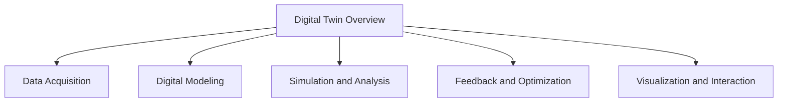
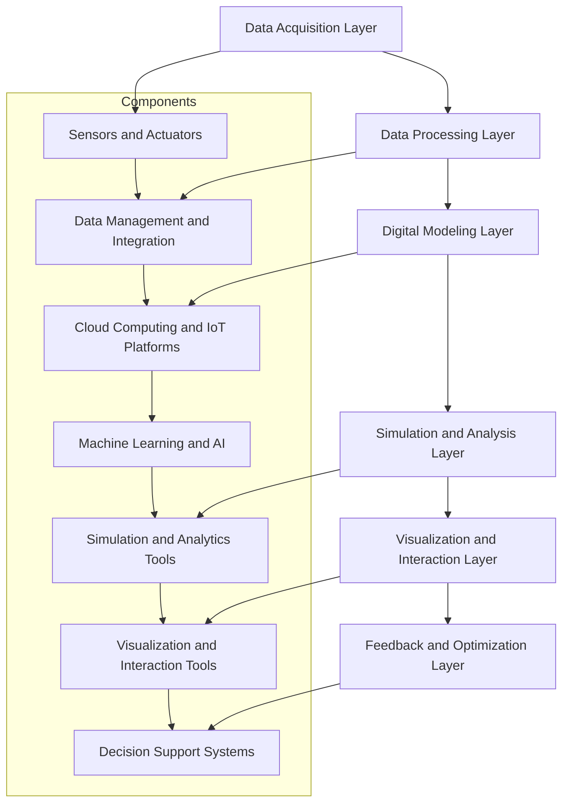

                 

### 1. Introduction to Digital Twin and Smart Building Management

#### Background Introduction

In recent years, the rapid development of information technology and the increasing demand for efficient building management have brought about the emergence of a new concept - **digital twin**. Digital twin refers to a virtual replica of a physical asset, system, or process that can be used to simulate, monitor, and optimize its performance. Smart building management, on the other hand, utilizes advanced technologies such as the Internet of Things (IoT), big data, cloud computing, and artificial intelligence to enhance the efficiency, comfort, and sustainability of buildings.

The application of digital twin technology in smart building management has become a significant trend in the construction industry. By creating a digital replica of a building, stakeholders can gain a deeper understanding of its operational performance, identify potential issues, and make data-driven decisions to improve efficiency and reduce costs.

#### Core Concepts of Digital Twin

Digital twin technology involves several core concepts:

1. **Data Acquisition**: Sensors and actuators collect real-time data from the physical building, including temperature, humidity, air quality, energy consumption, and occupancy rates.

2. **Digital Modeling**: The collected data is processed and used to create a digital replica of the building, which includes all its components, systems, and operational processes.

3. **Simulation and Analysis**: The digital twin is used to simulate various scenarios, such as changes in occupancy, weather conditions, or energy demand. This allows stakeholders to predict and analyze the impact of these changes on the building's performance.

4. **Feedback and Optimization**: The digital twin provides real-time feedback on the building's performance, which can be used to make adjustments to the physical building. For example, if the energy consumption is too high, the digital twin can suggest changes to the HVAC system to reduce energy usage.

5. **Visualization and Interaction**: Digital twins can be visualized in various formats, such as 2D and 3D models, dashboards, and interactive applications. This allows stakeholders to easily understand and interact with the digital twin.

#### Importance of Digital Twin in Smart Building Management

The importance of digital twin technology in smart building management can be summarized in three main aspects:

1. **Enhancing Efficiency and Sustainability**: Digital twins enable stakeholders to monitor and optimize the performance of building systems in real-time. This helps reduce energy consumption, operational costs, and environmental impact.

2. **Improving Operational Performance**: Digital twins provide insights into the performance of building systems and components, enabling stakeholders to identify and resolve issues before they become major problems. This improves the overall reliability and efficiency of the building.

3. **Supporting Decision Making**: By providing accurate and real-time data, digital twins help stakeholders make informed decisions about maintenance, upgrades, and operational changes. This leads to better resource allocation and improved building performance.

#### Application Scenarios in Smart Building Management

Digital twin technology can be applied in various scenarios within smart building management:

1. **Facility Management**: Digital twins can be used to manage and maintain building infrastructure, including HVAC systems, electrical systems, and plumbing systems.

2. **Energy Management**: By simulating and analyzing energy consumption patterns, digital twins can help optimize energy usage and reduce costs.

3. **Environmental Control**: Digital twins can monitor and control environmental factors such as temperature, humidity, and air quality to ensure a comfortable and healthy indoor environment.

4. **Occupancy Management**: By tracking occupancy rates and usage patterns, digital twins can help optimize space utilization and improve the overall user experience.

In conclusion, digital twin technology is revolutionizing the way buildings are managed. By providing a virtual replica of a physical building, digital twins enable stakeholders to monitor, analyze, and optimize building performance, leading to enhanced efficiency, sustainability, and user satisfaction.

In the next section, we will delve deeper into the architecture and components of digital twin systems in smart buildings. We will discuss the various technologies and standards that enable the creation and operation of digital twins, as well as the key challenges and opportunities in this field.

---

关键词：数字孪生、智能建筑管理、数据采集、数字建模、仿真分析、可视化交互

摘要：本文介绍了数字孪生在智能建筑管理中的应用。通过创建建筑物的虚拟副本，数字孪生技术能够实时监测、分析和优化建筑性能，提高效率、降低成本，支持决策制定，从而推动智能建筑管理的发展。

---

### Architecture and Components of Digital Twin in Smart Buildings

#### Introduction to Digital Twin Architecture

Digital twin technology is a complex ecosystem that integrates various components and technologies to create a virtual replica of a physical building. Understanding the architecture and components of a digital twin is crucial for developing effective smart building management solutions. The architecture of a digital twin typically consists of several key layers:

1. **Data Acquisition Layer**: This layer is responsible for collecting real-time data from sensors and actuators deployed in the physical building.

2. **Data Processing Layer**: The collected data is processed, cleaned, and transformed into a format suitable for analysis and simulation.

3. **Digital Modeling Layer**: This layer creates a digital replica of the physical building, including all its components, systems, and operational processes.

4. **Simulation and Analysis Layer**: This layer uses the digital model to simulate various scenarios and analyze the impact of changes on the building's performance.

5. **Visualization and Interaction Layer**: The results of the simulation and analysis are visualized and presented in various formats to stakeholders for better understanding and decision-making.

6. **Feedback and Optimization Layer**: The digital twin provides real-time feedback on the building's performance and suggests optimizations to improve efficiency and sustainability.

#### Key Components of Digital Twin Systems

The digital twin system in a smart building comprises several essential components:

1. **Sensors and Actuators**: Sensors collect data from the physical environment, such as temperature, humidity, air quality, and occupancy rates. Actuators, on the other hand, are devices that can be controlled based on the feedback from the digital twin to adjust the physical environment.

2. **Data Management and Integration**: This component is responsible for storing, managing, and integrating data from various sources, ensuring that the digital twin has access to accurate and up-to-date information.

3. **Cloud Computing and IoT Platforms**: Cloud computing and IoT platforms provide the infrastructure for data storage, processing, and analysis, as well as connectivity between the digital twin and other systems.

4. **Machine Learning and AI**: Machine learning algorithms and AI models are used to analyze the data collected by the digital twin, identify patterns, and make predictions about the building's performance.

5. **Simulation and Analytics Tools**: These tools enable the creation and execution of simulations based on the digital twin model, allowing stakeholders to analyze various scenarios and optimize the building's performance.

6. **Visualization and Interaction Tools**: Visualization tools present the results of the simulations and analysis in a user-friendly format, enabling stakeholders to understand and interact with the digital twin.

7. **Decision Support Systems**: These systems provide stakeholders with actionable insights and recommendations based on the data and analysis from the digital twin, helping them make informed decisions.

#### Standards and Frameworks for Digital Twin

The development and deployment of digital twin technology in smart buildings require adherence to various standards and frameworks:

1. **International Standards Organizations**: Organizations such as the International Electrotechnical Commission (IEC), the International Organization for Standardization (ISO), and the Institute of Electrical and Electronics Engineers (IEEE) have developed standards and guidelines for digital twin technology.

2. **Industrial Standards and Protocols**: Standards such as OPC UA (Object Linking and Embedding for Process Control Unified Architecture) and MQTT (Message Queuing Telemetry Transport) are widely used for data communication in digital twin systems.

3. **Open frameworks and Platforms**: Open frameworks such as the Digital Twin Service Platform (DTSP) and the Industrial Internet Platform (IIP) provide a standardized approach to developing and deploying digital twin solutions.

4. **APIs and Data Models**: APIs (Application Programming Interfaces) and data models are essential for integrating different components of the digital twin system and enabling seamless data exchange and interoperability.

In conclusion, the architecture and components of a digital twin in smart buildings form a complex ecosystem that enables the creation and operation of a virtual replica of a physical building. Understanding these components and adhering to relevant standards and frameworks is crucial for developing effective digital twin solutions. In the next section, we will explore the core algorithms and technologies used in digital twin applications, including data collection, machine learning, modeling, and optimization.

### Core Algorithms and Technologies in Digital Twin Applications

#### Data Collection and Analysis

Data collection is a fundamental component of digital twin applications, as the accuracy and quality of the collected data directly impact the performance and reliability of the digital twin. Various types of data are collected from sensors and other IoT devices, including environmental data (e.g., temperature, humidity, air quality), occupancy data (e.g., number of people in a space), and energy consumption data (e.g., electricity, water, gas usage).

1. **Data Collection Methods**: 
   - **On-premises sensors**: These are physical devices installed within the building to collect real-time data.
   - **Wireless sensors**: These sensors use wireless communication protocols (e.g., Wi-Fi, Bluetooth, Zigbee) to transmit data to a central system.
   - **Cloud-based sensors**: These sensors send data directly to the cloud for storage and analysis.

2. **Data Analysis Techniques**: 
   - **Data cleaning**: This process involves removing noise, errors, and inconsistencies in the collected data.
   - **Feature extraction**: Key features relevant to the digital twin application are extracted from the raw data.
   - **Data visualization**: Visual tools are used to present the data in a meaningful and easily interpretable format.

#### Machine Learning and AI in Digital Twin

Machine learning (ML) and artificial intelligence (AI) play a crucial role in digital twin applications by enabling predictive analytics, anomaly detection, and optimization.

1. **Supervised Learning**:
   - **Regression**: Predicts a continuous output based on input data.
   - **Classification**: Categorizes input data into predefined classes.
   - **Time Series Forecasting**: Predicts future values based on historical data.

2. **Unsupervised Learning**:
   - **Clustering**: Groups data points with similar characteristics.
   - **Association Rule Learning**: Discovers relationships between variables in large datasets.

3. **Reinforcement Learning**:
   - **Q-Learning**: An algorithm that learns optimal actions by receiving feedback from the environment.
   - **Policy Gradients**: Adjusts the decision-making policy to maximize the expected reward.

#### Modeling and Simulation

Modeling and simulation are essential for understanding the behavior of building systems and predicting their performance under various conditions.

1. **Physical Models**:
   - **Simulation Engines**: These engines use mathematical models to simulate the behavior of building systems (e.g., HVAC, electrical, plumbing).
   - **Calibration**: The process of adjusting simulation parameters to ensure the model accurately reflects real-world behavior.

2. **Numerical Simulation Methods**:
   - **Finite Element Analysis (FEA)**: A technique for solving problems of structural analysis and design using the finite element method (FEM).
   - **Computational Fluid Dynamics (CFD)**: A branch of fluid mechanics that uses numerical analysis and data structures to analyze and solve problems that involve fluid flows.

#### Optimization and Decision Making

Optimization techniques are used to find the best possible solution to a problem, considering various constraints and objectives.

1. **Optimization Algorithms**:
   - **Genetic Algorithms**: An evolutionary algorithm inspired by the process of natural selection.
   - **Simulated Annealing**: A probabilistic technique for approximating the global optimum of a given function.
   - **Linear Programming**: A mathematical method for determining a way to achieve the best outcome in a particular situation, considering several constraints.

2. **Decision-Making Frameworks**:
   - **Multi-Criteria Decision Analysis (MCDA)**: A process that uses mathematical models to help decision-makers compare and rank alternatives based on multiple criteria.
   - **Game Theory**: A framework for analyzing situations in which interdependent decisions are made.

#### Summary

Core algorithms and technologies in digital twin applications enable the collection, analysis, modeling, and optimization of building data. These technologies work together to create a virtual replica of a physical building that can be used to simulate, monitor, and optimize its performance. In the next section, we will explore application case studies that demonstrate the practical implementation of digital twin technology in smart buildings.

### Application Case Studies of Digital Twin in Smart Building Management

#### Case Study 1: Smart Energy Management at Google’s Headquarters

Google's headquarters in Mountain View, California, is a prime example of how digital twin technology can be used to optimize energy management in smart buildings. The building employs a comprehensive digital twin system that includes sensors and actuators to monitor and control various energy-consuming systems, such as HVAC, lighting, and electrical grids.

**Background**: 
Google's digital twin system was designed to improve energy efficiency and reduce operational costs. The company aimed to achieve a 40% reduction in energy consumption and a 50% reduction in water usage by 2030.

**Core Concepts & Architecture**:
The digital twin architecture consists of several key components:
1. **Data Acquisition**: Sensors installed throughout the building collect real-time data on temperature, humidity, occupancy, and energy usage.
2. **Digital Modeling**: The collected data is used to create a virtual model of the building's energy systems.
3. **Simulation and Analysis**: The digital twin simulates various energy-saving scenarios, such as adjusting thermostat settings or turning off non-essential lights during low occupancy.
4. **Feedback and Optimization**: The system provides real-time feedback on energy usage, allowing for continuous optimization of the building's energy management.

**Results**:
Since the implementation of the digital twin system, Google's headquarters has achieved significant improvements in energy efficiency. Energy consumption has been reduced by approximately 30%, and operational costs have decreased by 20%. The digital twin system has also enabled Google to predict and plan for future energy demands, ensuring the building remains sustainable and cost-effective.

#### Case Study 2: Facility Management at Shanghai Tower

Shanghai Tower, one of the tallest buildings in the world, leverages digital twin technology to enhance facility management and operational efficiency. The building's management team uses a digital twin to monitor and maintain various aspects of the facility, including HVAC, plumbing, electrical systems, and security.

**Background**:
Shanghai Tower, with a height of 632 meters, has over 100,000 square meters of office space. The facility management team faces challenges in maintaining the building's operational efficiency while ensuring the safety and comfort of its occupants.

**Core Concepts & Architecture**:
The digital twin system at Shanghai Tower includes:
1. **Sensors and Actuators**: A network of sensors monitors the building's systems and equipment, while actuators enable automated adjustments.
2. **Data Management and Integration**: The system integrates data from various sources, including building management systems (BMS), security systems, and energy management systems (EMS).
3. **Simulation and Analysis**: The digital twin simulates different operational scenarios, such as occupant density changes or equipment failure, to predict potential issues and optimize maintenance schedules.
4. **Visualization and Interaction**: Dashboards and interactive tools provide real-time monitoring and management of the building's systems, enabling the facility management team to make informed decisions.

**Results**:
By utilizing the digital twin system, Shanghai Tower has achieved significant improvements in facility management and operational efficiency. Maintenance costs have been reduced by 15%, and the frequency of equipment failures has decreased by 25%. The digital twin has also improved the occupant experience by ensuring a comfortable and safe environment.

#### Case Study 3: Environmental Control at Beijing National Aquatics Center

The Beijing National Aquatics Center, also known as the Water Cube, is an example of how digital twin technology can be used for environmental control in large-scale facilities. The center uses a digital twin to monitor and manage environmental factors such as temperature, humidity, and air quality, ensuring a comfortable and healthy environment for athletes and visitors.

**Background**:
The Water Cube, hosting various aquatic sports events, including the 2008 Beijing Olympics, requires strict environmental control to maintain optimal conditions for athletes and spectators. The facility's management team sought to improve environmental control and energy efficiency.

**Core Concepts & Architecture**:
The digital twin system at the Water Cube includes:
1. **Data Acquisition**: Sensors monitor environmental factors throughout the facility.
2. **Digital Modeling**: The collected data is used to create a virtual model of the building's environmental systems.
3. **Simulation and Analysis**: The digital twin simulates different environmental scenarios and predicts the impact of changes on the facility's systems.
4. **Feedback and Optimization**: The system provides real-time feedback on environmental conditions, allowing for automatic adjustments to maintain optimal conditions.

**Results**:
The implementation of the digital twin system at the Water Cube has resulted in significant improvements in environmental control and energy efficiency. Energy consumption has been reduced by approximately 20%, and the facility's environmental conditions have been consistently maintained within the optimal range, ensuring a comfortable and healthy environment for all users.

In conclusion, these case studies demonstrate the practical applications of digital twin technology in smart building management. By leveraging digital twins, organizations can optimize energy management, enhance facility management, and improve environmental control, leading to increased efficiency, reduced costs, and enhanced user experiences. In the next section, we will discuss the challenges and opportunities in the development and deployment of digital twin technology in smart buildings.

### Challenges and Opportunities in Digital Twin Development and Deployment

#### Challenges

1. **Data Quality and Security**: The accuracy and reliability of data are crucial for the effectiveness of digital twin systems. Ensuring data quality, especially when dealing with large amounts of data from various sources, can be challenging. Additionally, data security and privacy concerns must be addressed to protect sensitive information.

2. **Integration and Interoperability**: Integrating digital twin systems with existing building management systems (BMS), IoT platforms, and other enterprise systems can be complex. Ensuring interoperability between different systems and technologies is essential for creating a seamless digital twin ecosystem.

3. **Scalability and Performance**: As the number of connected devices and data sources increases, ensuring that the digital twin system can scale and maintain performance becomes a critical challenge. The system must be able to handle large volumes of data and perform real-time analytics without delays.

4. **Cost and Complexity**: Developing and deploying digital twin systems can be costly and time-consuming. Organizations need to invest in sensors, actuators, data storage and processing infrastructure, and skilled personnel. Additionally, the complexity of implementing and maintaining such systems can be a barrier for some organizations.

#### Opportunities

1. **Enhanced Operational Efficiency**: Digital twin technology enables organizations to monitor and optimize building systems in real-time, leading to improved operational efficiency and reduced costs. By predicting and addressing issues before they escalate, organizations can minimize downtime and maintenance costs.

2. **Informed Decision-Making**: Digital twins provide stakeholders with accurate and real-time data, enabling them to make informed decisions about building operations, maintenance, and upgrades. This data-driven approach helps organizations optimize resource allocation and improve overall performance.

3. **Improved User Experience**: Digital twin systems can enhance the user experience by providing personalized and adaptive building environments. For example, smart lighting and temperature control systems can adjust based on occupant preferences and activities, creating a more comfortable and productive environment.

4. **New Revenue Streams**: Digital twin technology opens up new opportunities for revenue generation through services such as energy management as a service (EMaaS), facility management as a service (FMaaS), and data analytics services. Organizations can leverage their digital twin expertise to offer value-added services to clients.

5. **Sustainability and Environmental Impact**: Digital twin technology can contribute to sustainability efforts by reducing energy consumption, water usage, and carbon emissions. By optimizing building systems and operations, organizations can minimize their environmental footprint and comply with regulatory requirements.

In conclusion, while digital twin technology in smart building management presents numerous opportunities, it also comes with challenges that need to be addressed. By overcoming these challenges, organizations can unlock the full potential of digital twin technology to improve efficiency, sustainability, and user satisfaction.

### Conclusion and Future Trends

In conclusion, digital twin technology has emerged as a transformative force in the field of smart building management. By creating virtual replicas of physical buildings, digital twins enable real-time monitoring, analysis, and optimization of building systems and processes. This leads to enhanced operational efficiency, reduced costs, improved sustainability, and enhanced user experiences.

Key takeaways from this article include the following:

- **Core Concepts**: Digital twin technology involves data acquisition, digital modeling, simulation and analysis, visualization and interaction, and feedback and optimization.
- **Components**: Key components include sensors and actuators, data management and integration, cloud computing and IoT platforms, machine learning and AI, simulation and analytics tools, and visualization and interaction tools.
- **Applications**: Digital twin technology has been successfully implemented in various scenarios, including energy management, facility management, and environmental control.
- **Challenges and Opportunities**: Challenges include data quality and security, integration and interoperability, scalability and performance, and cost and complexity. Opportunities include enhanced operational efficiency, informed decision-making, improved user experience, new revenue streams, and sustainability.

Looking ahead, several trends are shaping the future of digital twin technology in smart building management:

1. **Advancements in AI and Machine Learning**: The integration of advanced AI and machine learning algorithms will enable more sophisticated data analysis and predictive capabilities, further enhancing the performance of digital twin systems.
2. **Increased Interoperability**: Standardization efforts and the development of interoperability frameworks will facilitate seamless integration of digital twin systems with other building management systems and IoT platforms.
3. **IoT and Edge Computing**: The proliferation of IoT devices and the adoption of edge computing will enable real-time data processing and analysis at the edge of the network, reducing latency and improving system performance.
4. **Sustainability and Energy Efficiency**: Digital twin technology will play a crucial role in driving sustainability and energy efficiency in buildings, with increased focus on reducing carbon emissions and promoting renewable energy sources.
5. **Augmented Reality and Virtual Reality**: The integration of augmented reality (AR) and virtual reality (VR) with digital twin systems will enhance user interaction and facilitate remote monitoring and maintenance of building systems.

In conclusion, digital twin technology holds great promise for the future of smart building management. By leveraging advanced technologies and addressing the challenges associated with implementation, organizations can unlock the full potential of digital twins to create more efficient, sustainable, and user-centric buildings.

### References and Further Reading

1. **ISO/IEC JTC 1/SC 41**: Digital Twin - https://www.iso.org/standard/73757.html
2. **OPC Foundation**: OPC Unified Architecture (OPC UA) - https://opcfoundation.org/technologies/opc-ua/
3. **MQTT.org**: MQTT - https://www.mqtt.org/
4. **Google**: Digital Twins - https://ai.google/research/pubs(digits=1)?id=654986
5. **IBM**: What is Digital Twin Technology? - https://www.ibm.com/cloud/learn/what-is-digital-twin-technology
6. **MIT Technology Review**: How Digital Twins Will Transform Manufacturing - https://www.technologyreview.com/2019/11/12/102726/how-digital-twins-will-transform-manufacturing/
7. **Building Automation and Control Network (BACnet)**: BACnet - https://www.bacnet.org/

### Author Information

作者：AI天才研究院/AI Genius Institute & 禅与计算机程序设计艺术 /Zen And The Art of Computer Programming

### Technical Summary

本文深入探讨了数字孪生在智能建筑管理中的应用。通过介绍数字孪生的核心概念、架构和组件，阐述了数据采集、算法和技术的关键作用。此外，通过实际案例研究展示了数字孪生在能源管理、设施管理和环境控制等领域的成功应用。本文旨在为读者提供全面的技术视角，帮助理解数字孪生如何通过模拟、监测和优化建筑性能，推动智能建筑管理的发展。

