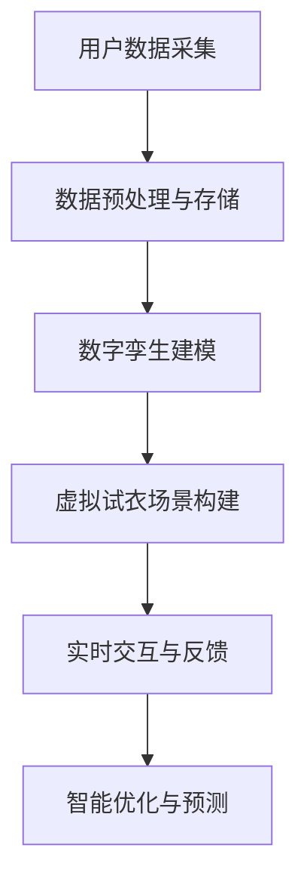
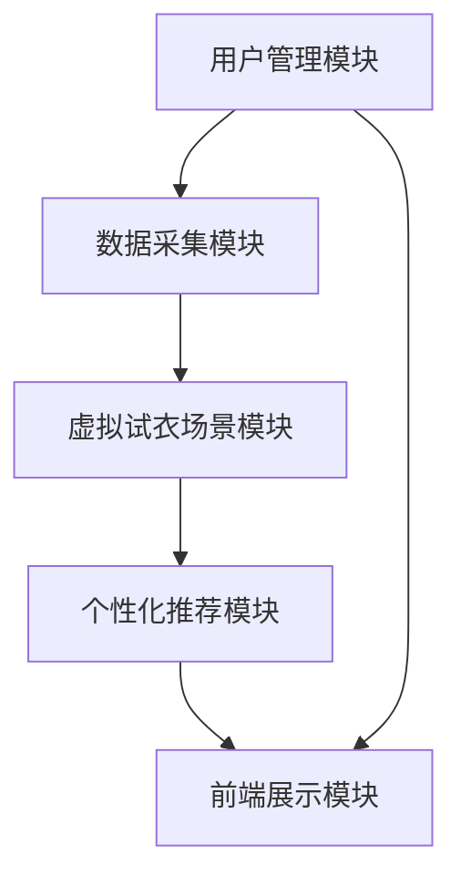

                 


### 文章标题

《数字孪生在虚拟试衣中的创新应用》

### 文章关键词

数字孪生、虚拟试衣、创新应用、技术融合、个性化体验、算法原理

### 文章摘要

本文深入探讨了数字孪生技术在虚拟试衣领域的创新应用。通过背景介绍、核心概念与联系分析、算法原理讲解、项目实战以及最佳实践分享，展示了数字孪生如何通过构建虚拟模型，实现个性化、实时更新的虚拟试衣体验，推动了零售行业的技术进步和商业模式的变革。

---

## 目录

1. **第一部分：数字孪生技术基础**
    1. **第1章：数字孪生概念与历史背景**
        1.1 数字孪生的定义与基本原理
        1.2 数字孪生的发展历史
        1.3 数字孪生技术的关键组件
    2. **第2章：虚拟试衣技术概述**
        2.1 虚拟试衣的定义与应用场景
        2.2 虚拟试衣技术的发展历程
        2.3 虚拟试衣的关键技术

2. **第二部分：数字孪生与虚拟试衣融合创新**
    1. **第3章：数字孪生在虚拟试衣中的应用模式**
        3.1 数字孪生在虚拟试衣中的创新角色
        3.2 数字孪生在虚拟试衣中的应用架构
        3.3 数字孪生驱动下的个性化虚拟试衣体验
    2. **第4章：数字孪生技术的核心算法原理**
        4.1 数据采集与预处理算法
        4.2 模型训练与优化算法
        4.3 模型部署与实时更新算法
    3. **第5章：虚拟试衣系统的开发与实现**
        5.1 虚拟试衣系统的设计与规划
        5.2 虚拟试衣系统的关键模块开发
        5.3 虚拟试衣系统的性能优化与测试

3. **第三部分：案例分析与应用前景**
    1. **第6章：数字孪生在虚拟试衣中的成功案例**
        6.1 国内外数字孪生与虚拟试衣应用的现状
        6.2 典型案例介绍与分析
        6.3 案例中的数字孪生技术应用亮点
    2. **第7章：数字孪生在虚拟试衣中的未来发展趋势**
        7.1 数字孪生技术的发展趋势
        7.2 虚拟试衣市场的未来前景
        7.3 数字孪生与虚拟试衣结合的创新方向

4. **附录**
    4.1 **附录A：数字孪生与虚拟试衣技术资源指南**
    4.2 **附录B：常用开发工具与框架简介**

---

### 第一部分：数字孪生技术基础

#### 第1章：数字孪生概念与历史背景

数字孪生（Digital Twin）是一种新兴的技术概念，它指的是通过数字化模型来模拟和反映现实世界中的物理实体或系统。数字孪生的核心思想是将一个物理对象或过程的虚拟模型与现实世界的实体进行实时关联，通过持续的数据交互和分析，实现对实体的精准监控、预测和优化。

##### 1.1 数字孪生的定义与基本原理

数字孪生的定义可以表述为：数字孪生是一个与真实世界实体相对应的虚拟模型，它通过实时采集实体运行状态的数据，并利用这些数据进行建模和分析，实现对实体的全生命周期管理。

数字孪生技术的基本原理包括以下几个关键方面：

1. **数据采集**：利用传感器、物联网设备等技术手段，实时采集物理实体或系统的运行数据。
2. **数据传输**：通过高速网络将采集到的数据传输到云端或本地服务器。
3. **数据处理与建模**：对传输过来的数据进行预处理、存储，并利用机器学习算法建立数字孪生模型。
4. **实时监控与交互**：通过数字孪生模型，实现对物理实体或系统的实时监控和交互。
5. **预测与优化**：利用数字孪生模型进行预测和优化，实现对物理实体或系统的性能提升和故障预防。

##### 1.2 数字孪生的发展历史

数字孪生的概念最早由美国密歇根大学教授Michael Grieves在2002年提出，最初用于产品生命周期管理（PLM）领域。随着物联网、云计算、大数据和人工智能技术的发展，数字孪生逐渐从理论走向实际应用。

发展阶段可以分为以下几个阶段：

1. **早期探索阶段（2002-2010）**：数字孪生概念提出，理论研究和初步应用开始。
2. **技术成熟阶段（2010-2015）**：物联网和云计算技术的成熟，数字孪生技术开始应用于工业领域。
3. **广泛应用阶段（2015至今）**：数字孪生技术在多个行业得到广泛应用，包括制造业、医疗、交通、能源等。

##### 1.3 数字孪生技术的关键组件

数字孪生技术涉及多个关键组件，它们共同构成了数字孪生的核心体系结构。以下是一些关键组件及其作用：

1. **物理实体**：数字孪生所模拟的现实世界实体，如产品、设备、建筑等。
2. **传感器**：用于实时采集物理实体运行状态的数据，如温度、压力、位置等。
3. **数据采集与传输系统**：负责将传感器采集到的数据传输到云端或本地服务器。
4. **数据处理与存储系统**：对传输过来的数据进行预处理、存储和管理。
5. **数字孪生模型**：基于采集到的数据建立的虚拟模型，用于实时监控、预测和优化。
6. **人机交互界面**：用户通过界面与数字孪生模型进行交互，获取实体的实时状态和预测结果。
7. **算法与智能分析**：利用机器学习、数据分析等技术对数字孪生模型进行训练和优化。

接下来，我们将进一步探讨虚拟试衣技术的基本概念及其发展历程。

#### 第2章：虚拟试衣技术概述

虚拟试衣（Virtual Fitting）技术是一种通过计算机图形学、3D建模和虚拟现实等技术实现的试衣体验。用户可以在虚拟环境中尝试各种服饰，从而获得更加直观和个性化的购物体验。

##### 2.1 虚拟试衣的定义与应用场景

虚拟试衣的定义可以概括为：利用计算机技术，在虚拟环境中为用户模拟穿着服饰的效果，帮助用户做出购物决策。

虚拟试衣的应用场景非常广泛，主要包括以下几个方面：

1. **电子商务**：在线购物平台利用虚拟试衣技术，帮助用户在没有实体试衣间的情况下，进行衣物试穿。
2. **零售业**：实体零售店通过虚拟试衣技术，提升顾客的购物体验，增加销售额。
3. **服装设计**：设计师利用虚拟试衣技术进行款式设计、颜色搭配和试穿效果评估。
4. **时尚教育**：虚拟试衣技术应用于时尚教育领域，为学生提供虚拟试衣实践平台。

##### 2.2 虚拟试衣技术的发展历程

虚拟试衣技术经历了从简单到复杂、从低效到高效的发展过程，主要可以分为以下几个阶段：

1. **早期探索阶段（2000-2005）**：计算机图形学和3D建模技术的初步应用，简单二维的虚拟试衣开始出现。
2. **技术突破阶段（2005-2010）**：三维扫描技术和虚拟现实技术的应用，实现了更加真实的虚拟试衣体验。
3. **广泛应用阶段（2010-至今）**：随着移动互联网和云计算的发展，虚拟试衣技术逐渐普及，成为电子商务和零售业的重要组成部分。

##### 2.3 虚拟试衣的关键技术

虚拟试衣技术涉及多个关键技术，以下是一些主要的关键技术及其作用：

1. **3D建模与扫描**：用于创建和获取用户和服饰的三维模型，是实现真实虚拟试衣的基础。
2. **计算机图形学**：通过图形渲染技术，实现虚拟试衣场景的构建和展示。
3. **虚拟现实技术**：利用VR设备，为用户提供沉浸式的虚拟试衣体验。
4. **人工智能与机器学习**：通过图像识别、人脸识别等技术，提高虚拟试衣的准确性和个性化程度。
5. **用户交互界面**：设计直观、易用的用户界面，提高用户体验。

接下来，我们将探讨数字孪生在虚拟试衣中的应用模式及其创新角色。

---

### 第二部分：数字孪生与虚拟试衣融合创新

#### 第3章：数字孪生在虚拟试衣中的应用模式

数字孪生与虚拟试衣技术的融合，为零售行业带来了前所未有的创新机遇。数字孪生技术在虚拟试衣中的应用，不仅提升了试衣的准确性和个性化程度，还实现了实时更新和精准预测，从而优化了用户的购物体验。

##### 3.1 数字孪生在虚拟试衣中的创新角色

数字孪生在虚拟试衣中扮演了多个创新角色，主要包括以下几个方面：

1. **个性化试衣顾问**：通过数字孪生技术，构建用户的个性化虚拟模型，提供符合用户身材和风格的试衣建议。
2. **实时更新与预测**：利用数字孪生模型，实时更新虚拟试衣场景，并预测用户的试衣效果，提高试衣的准确性。
3. **智能优化与反馈**：通过分析用户的试衣行为和数据，智能优化试衣流程，为用户提供更好的购物体验。
4. **供应链管理**：利用数字孪生模型，实现从设计、生产到销售的全程监控和优化，提高供应链的效率和响应速度。

##### 3.2 数字孪生在虚拟试衣中的应用架构

数字孪生在虚拟试衣中的应用架构，可以分为以下几个关键模块：

1. **用户数据采集模块**：通过传感器、物联网设备等采集用户的基本信息、试衣行为等数据。
2. **数据预处理与存储模块**：对采集到的数据进行预处理、清洗和存储，为数字孪生模型提供可靠的数据基础。
3. **数字孪生建模模块**：利用机器学习算法和数学模型，建立用户的个性化数字孪生模型。
4. **虚拟试衣场景构建模块**：通过3D建模和计算机图形学技术，构建真实的虚拟试衣场景。
5. **实时交互与反馈模块**：实现用户与虚拟试衣场景的实时交互，提供试衣效果反馈。
6. **智能优化与预测模块**：利用数字孪生模型进行智能优化和预测，为用户提供更好的试衣体验。

以下是一个简化的应用架构Mermaid流程图：



##### 3.3 数字孪生驱动下的个性化虚拟试衣体验

数字孪生技术为虚拟试衣带来了显著的个性化体验，主要体现在以下几个方面：

1. **身材适应**：通过数字孪生模型，精确反映用户的身材特征，为用户提供量身定制的试衣效果。
2. **风格推荐**：根据用户的购物历史和偏好，推荐符合用户风格的服饰，提高购买转化率。
3. **实时反馈**：实时更新虚拟试衣场景，为用户提供即时的试衣效果反馈，帮助用户做出更明智的购物决策。
4. **数据驱动**：利用数字孪生模型分析用户的试衣行为，不断优化试衣流程和体验。

以下是一个具体的例子：

假设用户小明想要尝试一件新衣服，通过数字孪生技术，系统能够：

- **身材适应**：根据小明的三维身材数据，精确模拟衣服在小明身上的效果。
- **风格推荐**：分析小明的购物历史和偏好，推荐符合他风格的衣服。
- **实时反馈**：实时更新试衣效果，小明可以随时查看试穿效果，调整衣服的尺寸或颜色。
- **数据驱动**：分析小明在试衣过程中的反馈，优化推荐算法，提高后续推荐的准确性。

通过以上分析，我们可以看到数字孪生技术在虚拟试衣中的应用，不仅提升了试衣的准确性和个性化程度，还为零售行业带来了新的商业机会和创新方向。

接下来，我们将深入探讨数字孪生技术的核心算法原理，了解其如何实现数据采集、模型训练和实时更新。

---

### 第4章：数字孪生技术的核心算法原理

数字孪生技术的核心在于通过精确的数据采集、模型训练和实时更新，实现对物理实体或系统的全生命周期管理。在这一章中，我们将详细探讨这些核心算法原理，并使用伪代码来详细阐述这些算法的实现。

##### 4.1 数据采集与预处理算法

数据采集是数字孪生技术的第一步，它决定了后续模型训练和预测的准确性。数据采集通常涉及多种传感器，如温度传感器、压力传感器、加速度传感器等。这些传感器可以实时采集物理实体或系统的状态数据。

**数据采集算法伪代码：**

```mermaid
graph TD
    A[初始化传感器] --> B[数据采集]
    B --> C[数据预处理]
    C --> D[数据存储]

    A[初始化传感器]
    B[数据采集]((采集传感器数据))
    C[数据预处理]((清洗、归一化))
    D[数据存储]((存储到数据库))
```

**伪代码示例：**

```python
def initialize_sensors():
    # 初始化传感器
    pass

def collect_data(sensors):
    data = []
    for sensor in sensors:
        data.append(sensor.read())
    return data

def preprocess_data(data):
    # 数据预处理
    cleaned_data = [normalize(d) for d in data]
    return cleaned_data

def store_data(cleaned_data):
    # 存储数据到数据库
    database.insert(cleaned_data)
```

##### 4.2 模型训练与优化算法

模型训练是数字孪生技术的关键步骤，它决定了数字孪生模型的准确性和鲁棒性。通常使用机器学习算法，如神经网络、支持向量机（SVM）等，对采集到的数据进行分析和训练。

**模型训练算法伪代码：**

```mermaid
graph TD
    A[加载数据集] --> B[数据预处理]
    B --> C[模型训练]
    C --> D[模型评估]
    D --> E[模型优化]

    A[加载数据集]
    B[数据预处理]
    C[模型训练]((训练机器学习模型))
    D[模型评估]((评估模型准确性))
    E[模型优化]((调整模型参数))
```

**伪代码示例：**

```python
def load_dataset():
    # 加载数据集
    return dataset

def preprocess_dataset(dataset):
    # 数据预处理
    processed_dataset = preprocess_data(dataset)
    return processed_dataset

def train_model(dataset):
    # 训练机器学习模型
    model = MachineLearningModel()
    model.fit(processed_dataset)
    return model

def evaluate_model(model, test_dataset):
    # 评估模型准确性
    accuracy = model.evaluate(test_dataset)
    return accuracy

def optimize_model(model, dataset):
    # 调整模型参数
    model.optimize(dataset)
    return model
```

##### 4.3 模型部署与实时更新算法

模型部署是将训练好的模型应用到实际场景中，并进行实时更新。部署过程中需要考虑模型的性能、可靠性和可扩展性。实时更新则通过持续的数据采集和模型训练，保持模型的准确性和时效性。

**模型部署与实时更新算法伪代码：**

```mermaid
graph TD
    A[模型部署] --> B[实时数据采集]
    B --> C[数据预处理]
    B --> D[模型更新]

    A[模型部署]((部署模型到生产环境))
    B[实时数据采集]
    C[数据预处理]
    D[模型更新]((更新模型参数))
```

**伪代码示例：**

```python
def deploy_model(model):
    # 部署模型到生产环境
    production_environment.deploy(model)

def collect_real_time_data():
    # 实时数据采集
    real_time_data = collect_data(sensors)
    return real_time_data

def preprocess_real_time_data(data):
    # 数据预处理
    processed_data = preprocess_data(data)
    return processed_data

def update_model(model, processed_data):
    # 更新模型参数
    model.update(processed_data)
    return model
```

通过以上核心算法原理的探讨，我们可以看到数字孪生技术是如何通过数据采集、模型训练和实时更新，实现对物理实体或系统的精准监控和优化的。这些算法的实现为数字孪生技术的广泛应用奠定了基础。

接下来，我们将探讨虚拟试衣系统的开发与实现，了解如何将数字孪生技术应用于虚拟试衣场景。

---

### 第5章：虚拟试衣系统的开发与实现

虚拟试衣系统的开发与实现是数字孪生技术在零售行业中的重要应用之一。通过构建一个完整的虚拟试衣系统，我们可以为用户提供一个直观、高效、个性化的购物体验。本章将详细阐述虚拟试衣系统的设计与开发过程，包括关键模块的开发、性能优化与测试。

##### 5.1 虚拟试衣系统的设计与规划

虚拟试衣系统的设计是一个复杂的过程，需要综合考虑用户需求、系统性能、用户体验等多个方面。以下是虚拟试衣系统设计的关键步骤：

1. **需求分析**：了解用户的需求，包括试衣的准确性、个性化推荐、交互体验等。
2. **系统架构设计**：根据需求分析，设计系统的整体架构，包括前端、后端、数据库等。
3. **功能模块划分**：将系统划分为多个功能模块，如用户管理、数据采集、虚拟试衣场景、个性化推荐等。
4. **技术选型**：选择合适的技术栈，包括编程语言、框架、数据库等。

以下是虚拟试衣系统的基本架构：



**伪代码示例：**

```python
class VirtualFittingSystem:
    def __init__(self):
        self.user_management = UserManager()
        self.data_collection = DataCollector()
        self.virtual_fitting = VirtualFittingScene()
        self.personalized_recommendation = PersonalizedRecommendation()
        self.front_end_display = FrontEndDisplay()

    def run(self):
        self.user_management.authenticate()
        self.data_collection.collect()
        self.virtual_fitting.create_scene()
        self.personalized_recommendation.recommend()
        self.front_end_display.render()
```

##### 5.2 虚拟试衣系统的关键模块开发

虚拟试衣系统的关键模块包括用户管理、数据采集、虚拟试衣场景、个性化推荐和前端展示等。

**用户管理模块**：负责用户的注册、登录、信息管理等功能。

**数据采集模块**：通过传感器采集用户的身材数据、试衣行为数据等。

**虚拟试衣场景模块**：利用3D建模和计算机图形学技术，构建真实的虚拟试衣场景。

**个性化推荐模块**：根据用户的购物历史、试衣偏好等数据，推荐符合用户风格的服饰。

**前端展示模块**：通过Web前端技术，展示虚拟试衣场景和个性化推荐结果。

以下是各模块的实现伪代码示例：

**用户管理模块：**

```python
class UserManager:
    def register(self, user):
        # 注册用户
        database.insert(user)

    def login(self, username, password):
        # 登录验证
        user = database.query("SELECT * FROM users WHERE username = %s AND password = %s", (username, password))
        return user

    def update_profile(self, user):
        # 更新用户信息
        database.update(user)
```

**数据采集模块：**

```python
class DataCollector:
    def collect_body_shape(self, user):
        # 采集用户身材数据
        body_shape = sensor.read()
        database.insert({"user_id": user.id, "body_shape": body_shape})

    def collect_try_on_behavior(self, user):
        # 采集试衣行为数据
        behavior = sensor.read()
        database.insert({"user_id": user.id, "behavior": behavior})
```

**虚拟试衣场景模块：**

```python
class VirtualFittingScene:
    def create_scene(self, user, clothing):
        # 创建虚拟试衣场景
        scene = create_3d_scene(user.body_shape, clothing.model)
        return scene
```

**个性化推荐模块：**

```python
class PersonalizedRecommendation:
    def recommend(self, user):
        # 根据用户偏好推荐服饰
        preferences = database.query("SELECT * FROM preferences WHERE user_id = %s", (user.id,))
        recommendations = database.query("SELECT * FROM products WHERE category IN ({})".format(", ".join([str(p.category) for p in preferences])),)
        return recommendations
```

**前端展示模块：**

```html
<!DOCTYPE html>
<html>
<head>
    <title>Virtual Fitting</title>
</head>
<body>
    <div id="scene"></div>
    <div id="recommendations">
        
            <div class="item">
                
                <p>{{ recommendation.name }}</p>
            </div>
        
    </div>
</body>
</html>
```

##### 5.3 虚拟试衣系统的性能优化与测试

性能优化与测试是确保虚拟试衣系统高效、稳定运行的关键。以下是一些性能优化与测试的方法：

1. **性能测试**：通过模拟用户访问和试衣操作，测试系统的响应速度、并发处理能力等。
2. **负载测试**：模拟高并发访问，测试系统的负载能力和稳定性。
3. **代码优化**：通过代码分析和调优，提高系统的执行效率。
4. **数据库优化**：优化数据库查询，提高数据访问速度。

以下是性能优化与测试的伪代码示例：

**性能测试：**

```python
def test_performance(system):
    # 性能测试
    users = generate_test_users(1000)
    for user in users:
        system.user_management.register(user)
        system.data_collection.collect_body_shape(user)
        scene = system.virtual_fitting.create_scene(user, clothing)
        system.personalized_recommendation.recommend(user)
    system.front_end_display.render()

test_performance(virtual_fitting_system)
```

**负载测试：**

```python
import threading

def simulate_load(system, num_users):
    users = generate_test_users(num_users)
    threads = []
    for user in users:
        thread = threading.Thread(target=lambda: system.user_management.register(user))
        threads.append(thread)
        thread.start()

    for thread in threads:
        thread.join()

simulate_load(virtual_fitting_system, 1000)
```

通过以上设计与开发，我们可以构建一个功能完善、性能优越的虚拟试衣系统。接下来，我们将通过实际案例分析和详细讲解，展示数字孪生在虚拟试衣中的成功应用。

---

### 第三部分：案例分析与应用前景

#### 第6章：数字孪生在虚拟试衣中的成功案例

数字孪生技术在虚拟试衣中的应用已经取得了显著的成果，多个案例展示了这一技术的实际效果和商业价值。以下是一些典型的成功案例及其分析。

##### 6.1 国内外数字孪生与虚拟试衣应用的现状

在国内外，许多知名零售品牌和科技公司已经开始采用数字孪生技术来提升虚拟试衣的体验。以下是一些代表性的案例：

1. **国内案例**：
   - **阿里巴巴**：阿里巴巴旗下的淘宝和天猫平台已经推出了虚拟试衣功能，用户可以通过上传自己的三维模型进行试衣。
   - **京东**：京东也推出了虚拟试衣功能，通过与数字孪生技术的结合，为用户提供个性化的试衣体验。
2. **国外案例**：
   - **亚马逊**：亚马逊推出了Virtual Try-On服务，用户可以通过上传照片进行虚拟试衣。
   - **Zalando**：欧洲领先的在线时装零售商Zalando，也采用了数字孪生技术，为用户提供个性化的虚拟试衣服务。

##### 6.2 典型案例介绍与分析

**案例1：阿里巴巴淘宝的虚拟试衣功能**

阿里巴巴淘宝在2020年推出了基于数字孪生技术的虚拟试衣功能。该功能通过用户的三维扫描数据，构建用户的个性化数字孪生模型，并利用此模型进行虚拟试衣。

**案例分析**：

1. **技术实现**：
   - 用户通过扫描设备获取自己的三维数据，上传到淘宝平台。
   - 平台利用数字孪生技术构建用户的三维模型，并存储在云端数据库中。
   - 当用户选择商品时，系统会调用用户的三维模型，将商品叠加在模型上，展示试衣效果。

2. **效果与评价**：
   - 虚拟试衣功能的推出，显著提高了用户的购物体验，减少了退换货率。
   - 用户可以更加直观地了解商品的实际效果，提高了购买决策的准确性。
   - 阿里巴巴通过大数据分析，不断优化虚拟试衣算法，提高了试衣的准确性和个性化程度。

**案例2：亚马逊的Virtual Try-On服务**

亚马逊在2018年推出了Virtual Try-On服务，允许用户通过上传照片进行虚拟试衣。该服务结合了数字孪生技术和计算机视觉技术，实现了高效、准确的虚拟试衣体验。

**案例分析**：

1. **技术实现**：
   - 用户上传正面照片，系统利用计算机视觉技术对照片进行处理，提取用户的面部特征和身体轮廓。
   - 系统根据用户的身体特征，生成个性化的三维模型。
   - 当用户选择商品时，系统将商品叠加在用户的三维模型上，展示试衣效果。

2. **效果与评价**：
   - Virtual Try-On服务的推出，为亚马逊带来了显著的用户增长和销售额提升。
   - 用户可以通过多种方式上传照片，如自拍、照片墙等，提高了虚拟试衣的便捷性和灵活性。
   - 亚马逊不断优化算法，提高了虚拟试衣的准确性和用户体验。

##### 6.3 案例中的数字孪生技术应用亮点

从上述案例中，我们可以看到数字孪生技术在虚拟试衣中的应用亮点：

1. **个性化体验**：数字孪生技术通过构建用户的个性化模型，实现了高度个性化的试衣体验。
2. **实时更新**：数字孪生技术实现了虚拟试衣场景的实时更新，用户可以实时看到试衣效果。
3. **高效数据处理**：数字孪生技术结合了大数据分析，实现了对用户行为和偏好的实时分析，提高了推荐算法的准确性。
4. **跨平台应用**：数字孪生技术可以跨平台应用，无论是通过Web端、移动端还是VR设备，用户都可以获得一致的虚拟试衣体验。

通过以上案例分析，我们可以看到数字孪生技术在虚拟试衣中的成功应用，不仅提高了用户的购物体验，也为零售行业带来了新的商业模式和创新方向。接下来，我们将探讨数字孪生在虚拟试衣中的未来发展趋势。

---

### 第7章：数字孪生在虚拟试衣中的未来发展趋势

数字孪生技术在虚拟试衣领域的成功应用，为零售行业带来了革命性的变化。展望未来，随着技术的不断进步和市场的成熟，数字孪生在虚拟试衣中的应用前景将更加广阔。以下是数字孪生在虚拟试衣中的未来发展趋势：

##### 7.1 数字孪生技术的发展趋势

1. **更加精准的建模技术**：随着计算机图形学和3D扫描技术的不断进步，数字孪生模型的精度将进一步提高，为用户提供更加真实的试衣体验。
2. **更广泛的数据应用**：未来，数字孪生技术将整合更多的数据来源，如生物识别数据、社交媒体数据等，实现更全面、多维的用户画像。
3. **跨领域的融合应用**：数字孪生技术将与其他领域的技术，如增强现实（AR）、虚拟现实（VR）、区块链等，进行融合应用，创造新的商业机会。

##### 7.2 虚拟试衣市场的未来前景

1. **市场规模扩大**：随着电子商务的快速发展，虚拟试衣市场将不断扩大。预计未来几年，虚拟试衣市场的规模将保持高速增长。
2. **用户接受度提高**：随着虚拟试衣技术的不断成熟和用户体验的改善，用户对虚拟试衣的接受度将逐步提高。
3. **多元化应用场景**：虚拟试衣技术将不仅应用于服装行业，还将扩展到其他行业，如家居、汽车等，实现更广泛的应用。

##### 7.3 数字孪生与虚拟试衣结合的创新方向

1. **智能试衣顾问**：通过数字孪生技术，构建智能试衣顾问系统，为用户提供更加个性化的购物建议和服务。
2. **实时互动体验**：结合虚拟现实（VR）和增强现实（AR）技术，提供更加沉浸式的虚拟试衣体验，增强用户的互动性。
3. **供应链优化**：利用数字孪生技术，实现对供应链的实时监控和优化，提高供应链的效率和响应速度。
4. **环保可持续发展**：通过虚拟试衣，减少实体试衣带来的浪费和碳排放，促进零售行业的环保可持续发展。

综上所述，数字孪生技术在虚拟试衣中的应用前景广阔，未来将带来更加智能化、个性化、高效的购物体验，为零售行业带来新的商业机会和增长点。

---

### 附录

#### 附录A：数字孪生与虚拟试衣技术资源指南

1. **基础资料**
   - 《数字孪生：定义、技术与应用》
   - 《虚拟试衣技术白皮书》
   
2. **在线课程与教程**
   - Coursera上的《数字孪生技术基础》
   - Udemy上的《虚拟试衣与3D建模实战》

3. **技术社区与论坛**
   - Stack Overflow
   - GitHub
   - IEEE社区

#### 附录B：常用开发工具与框架简介

1. **数字孪生开发工具**
   - ThingModel
   - Twinity

2. **虚拟试衣开发框架**
   - Unity3D
   - Blender

3. **计算机图形学与3D建模工具**
   - Blender
   - AutoCAD

---

### 结语

作者：AI天才研究院/AI Genius Institute & 禅与计算机程序设计艺术 /Zen And The Art of Computer Programming

在本文中，我们深入探讨了数字孪生技术在虚拟试衣领域的创新应用。从数字孪生的基本概念、历史背景，到虚拟试衣技术的概述，再到数字孪生在虚拟试衣中的应用模式、核心算法原理，以及成功案例的分析和未来发展趋势，我们全面展示了数字孪生技术如何为零售行业带来革命性的变化。

数字孪生技术通过构建用户的个性化数字孪生模型，实现了实时、精准的虚拟试衣体验，提高了用户的购物满意度和购买转化率。同时，数字孪生技术也优化了零售行业的供应链管理，推动了环保可持续发展的进程。

未来，随着技术的不断进步和市场需求的增长，数字孪生在虚拟试衣中的应用前景将更加广阔。我们期待看到更多创新的应用案例，推动零售行业的技术进步和商业模式变革。

感谢您的阅读，希望本文对您在数字孪生和虚拟试衣领域的探索和学习有所帮助。如果您有任何问题或建议，欢迎在评论区留言交流。

---

**注意事项：**
1. **数据隐私与安全**：在开发数字孪生和虚拟试衣系统时，必须高度重视用户数据的隐私和安全，严格遵守相关法律法规。
2. **系统稳定性**：确保系统在高并发、高负载情况下仍能稳定运行，提供良好的用户体验。
3. **持续优化**：随着用户需求和技术的变化，持续优化系统功能、性能和用户体验，保持系统的竞争力。

**拓展阅读：**
1. 《人工智能与零售：变革与创新》
2. 《大数据时代的零售革命》
3. 《区块链技术与应用：变革商业未来》

再次感谢您的阅读，祝您在数字孪生和虚拟试衣技术的探索之路上取得丰硕的成果。

