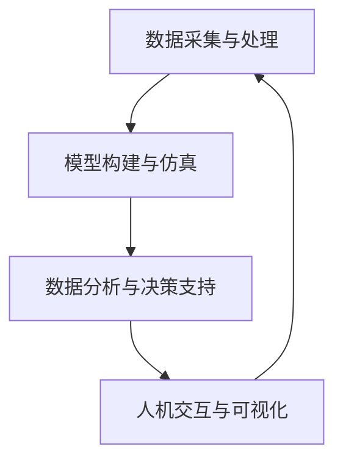

                 

### 文章标题

# 数字孪生技术：优化企业运营和决策

> 关键词：数字孪生、企业运营优化、决策支持、技术架构、算法原理

> 摘要：本文旨在探讨数字孪生技术如何在现代企业中发挥重要作用，通过构建物理实体的数字镜像，实现对运营的实时模拟和优化，从而提升企业的效率和决策质量。

---

## 书籍《数字孪生技术：优化企业运营和决策》目录大纲设计

### 设计思路

1. **核心概念与联系**：首先介绍数字孪生技术的核心概念，阐述其与传统技术的区别和联系。

2. **技术架构**：详细介绍数字孪生技术的架构，包括数据采集、处理、建模和仿真等方面。

3. **核心算法原理讲解**：针对数字孪生技术中的关键算法，如机器学习算法、深度学习算法等，使用伪代码进行讲解。

4. **数学模型与公式**：阐述数字孪生技术中的数学模型，包括线性模型、非线性模型等，并使用LaTeX格式展示公式。

5. **项目实战**：通过实际项目案例，展示如何应用数字孪生技术优化企业运营和决策。

### 目录大纲

#### 第一部分：数字孪生技术概述

# 第1章：数字孪生技术基础

## 1.1 数字孪生的定义与核心概念

### 1.1.1 数字孪生技术的起源与发展

### 1.1.2 数字孪生与传统技术的区别与联系

### 1.1.3 数字孪生技术在现代企业中的应用价值

## 1.2 数字孪生技术的架构

### 1.2.1 数据采集与处理

### 1.2.2 模型构建与仿真

### 1.2.3 数据分析与决策支持

#### 第二部分：数字孪生技术原理与算法

# 第2章：数字孪生技术原理

## 2.1 数据采集与预处理

### 2.1.1 数据源选择与数据采集

### 2.1.2 数据预处理方法

## 2.2 模型构建与仿真

### 2.2.1 模型构建原理

### 2.2.2 模型仿真方法

## 2.3 数据分析与决策支持

### 2.3.1 数据分析方法

### 2.3.2 决策支持系统

#### 第三部分：数字孪生技术在企业中的应用

# 第3章：数字孪生技术在企业运营优化中的应用

## 3.1 生产运营优化

### 3.1.1 生产线仿真优化

### 3.1.2 能源管理优化

## 3.2 质量管理优化

### 3.2.1 质量预测与控制

### 3.2.2 质量改进案例分析

# 第4章：数字孪生技术在企业决策支持中的应用

## 4.1 市场营销决策

### 4.1.1 消费者行为预测

### 4.1.2 市场营销策略优化

## 4.2 供应链管理决策

### 4.2.1 供应链仿真与优化

### 4.2.2 供应链风险管理

#### 第四部分：数字孪生技术实施与案例

# 第5章：数字孪生技术实施与案例分析

## 5.1 数字孪生技术实施流程

### 5.1.1 项目规划与需求分析

### 5.1.2 技术选型与架构设计

### 5.1.3 数据采集与预处理

## 5.2 数字孪生技术案例分析

### 5.2.1 案例一：汽车制造业数字孪生应用

### 5.2.2 案例二：电力行业数字孪生应用

### 5.2.3 案例三：医疗行业数字孪生应用

#### 第五部分：未来展望与挑战

# 第6章：数字孪生技术的发展趋势与挑战

## 6.1 数字孪生技术的未来发展趋势

### 6.1.1 新型应用领域

### 6.1.2 技术创新与突破

## 6.2 数字孪生技术的挑战与应对策略

### 6.2.1 数据安全与隐私保护

### 6.2.2 技术标准化与互操作性

### 6.2.3 技术成熟度与人才需求

### 结论

- **数字孪生技术**：一种通过建立物理实体的数字镜像，实现对实体运行状态实时模拟和优化的技术。
- **企业运营优化**：通过数字孪生技术，企业可以实现生产效率提升、成本降低、风险控制等目标。
- **决策支持**：数字孪生技术为企业提供了基于实时数据分析和模拟的决策支持工具，助力企业做出更为科学的决策。

---

## 目录大纲

### 第一部分：数字孪生技术概述

# 第1章：数字孪生技术基础

## 1.1 数字孪生的定义与核心概念

### 1.1.1 数字孪生技术的起源与发展

### 1.1.2 数字孪生与传统技术的区别与联系

### 1.1.3 数字孪生技术在现代企业中的应用价值

## 1.2 数字孪生技术的架构

### 1.2.1 数据采集与处理

### 1.2.2 模型构建与仿真

### 1.2.3 数据分析与决策支持

### 第二部分：数字孪生技术原理与算法

# 第2章：数字孪生技术原理

## 2.1 数据采集与预处理

### 2.1.1 数据源选择与数据采集

### 2.1.2 数据预处理方法

## 2.2 模型构建与仿真

### 2.2.1 模型构建原理

### 2.2.2 模型仿真方法

## 2.3 数据分析与决策支持

### 2.3.1 数据分析方法

### 2.3.2 决策支持系统

#### 第三部分：数字孪生技术在企业中的应用

# 第3章：数字孪生技术在企业运营优化中的应用

## 3.1 生产运营优化

### 3.1.1 生产线仿真优化

### 3.1.2 能源管理优化

## 3.2 质量管理优化

### 3.2.1 质量预测与控制

### 3.2.2 质量改进案例分析

# 第4章：数字孪生技术在企业决策支持中的应用

## 4.1 市场营销决策

### 4.1.1 消费者行为预测

### 4.1.2 市场营销策略优化

## 4.2 供应链管理决策

### 4.2.1 供应链仿真与优化

### 4.2.2 供应链风险管理

#### 第四部分：数字孪生技术实施与案例

# 第5章：数字孪生技术实施与案例分析

## 5.1 数字孪生技术实施流程

### 5.1.1 项目规划与需求分析

### 5.1.2 技术选型与架构设计

### 5.1.3 数据采集与预处理

## 5.2 数字孪生技术案例分析

### 5.2.1 案例一：汽车制造业数字孪生应用

### 5.2.2 案例二：电力行业数字孪生应用

### 5.2.3 案例三：医疗行业数字孪生应用

#### 第五部分：未来展望与挑战

# 第6章：数字孪生技术的发展趋势与挑战

## 6.1 数字孪生技术的未来发展趋势

### 6.1.1 新型应用领域

### 6.1.2 技术创新与突破

## 6.2 数字孪生技术的挑战与应对策略

### 6.2.1 数据安全与隐私保护

### 6.2.2 技术标准化与互操作性

### 6.2.3 技术成熟度与人才需求

### 结论

- **数字孪生技术**：一种通过建立物理实体的数字镜像，实现对实体运行状态实时模拟和优化的技术。
- **企业运营优化**：通过数字孪生技术，企业可以实现生产效率提升、成本降低、风险控制等目标。
- **决策支持**：数字孪生技术为企业提供了基于实时数据分析和模拟的决策支持工具，助力企业做出更为科学的决策。

---

## 书籍《数字孪生技术：优化企业运营和决策》目录大纲设计

### 设计思路

1. **核心概念与联系**：首先介绍数字孪生技术的核心概念，阐述其与传统技术的区别和联系。

2. **技术架构**：详细介绍数字孪生技术的架构，包括数据采集、处理、建模和仿真等方面。

3. **核心算法原理讲解**：针对数字孪生技术中的关键算法，如机器学习算法、深度学习算法等，使用伪代码进行讲解。

4. **数学模型与公式**：阐述数字孪生技术中的数学模型，包括线性模型、非线性模型等，并使用LaTeX格式展示公式。

5. **项目实战**：通过实际项目案例，展示如何应用数字孪生技术优化企业运营和决策。

### 目录大纲

#### 第一部分：数字孪生技术概述

# 第1章：数字孪生技术基础

## 1.1 数字孪生的定义与核心概念

### 1.1.1 数字孪生技术的起源与发展

### 1.1.2 数字孪生与传统技术的区别与联系

### 1.1.3 数字孪生技术在现代企业中的应用价值

## 1.2 数字孪生技术的架构

### 1.2.1 数据采集与处理

### 1.2.2 模型构建与仿真

### 1.2.3 数据分析与决策支持

#### 第二部分：数字孪生技术原理与算法

# 第2章：数字孪生技术原理

## 2.1 数据采集与预处理

### 2.1.1 数据源选择与数据采集

### 2.1.2 数据预处理方法

## 2.2 模型构建与仿真

### 2.2.1 模型构建原理

### 2.2.2 模型仿真方法

## 2.3 数据分析与决策支持

### 2.3.1 数据分析方法

### 2.3.2 决策支持系统

#### 第三部分：数字孪生技术在企业中的应用

# 第3章：数字孪生技术在企业运营优化中的应用

## 3.1 生产运营优化

### 3.1.1 生产线仿真优化

### 3.1.2 能源管理优化

## 3.2 质量管理优化

### 3.2.1 质量预测与控制

### 3.2.2 质量改进案例分析

# 第4章：数字孪生技术在企业决策支持中的应用

## 4.1 市场营销决策

### 4.1.1 消费者行为预测

### 4.1.2 市场营销策略优化

## 4.2 供应链管理决策

### 4.2.1 供应链仿真与优化

### 4.2.2 供应链风险管理

#### 第四部分：数字孪生技术实施与案例

# 第5章：数字孪生技术实施与案例分析

## 5.1 数字孪生技术实施流程

### 5.1.1 项目规划与需求分析

### 5.1.2 技术选型与架构设计

### 5.1.3 数据采集与预处理

## 5.2 数字孪生技术案例分析

### 5.2.1 案例一：汽车制造业数字孪生应用

### 5.2.2 案例二：电力行业数字孪生应用

### 5.2.3 案例三：医疗行业数字孪生应用

#### 第五部分：未来展望与挑战

# 第6章：数字孪生技术的发展趋势与挑战

## 6.1 数字孪生技术的未来发展趋势

### 6.1.1 新型应用领域

### 6.1.2 技术创新与突破

## 6.2 数字孪生技术的挑战与应对策略

### 6.2.1 数据安全与隐私保护

### 6.2.2 技术标准化与互操作性

### 6.2.3 技术成熟度与人才需求

### 结论

- **数字孪生技术**：一种通过建立物理实体的数字镜像，实现对实体运行状态实时模拟和优化的技术。
- **企业运营优化**：通过数字孪生技术，企业可以实现生产效率提升、成本降低、风险控制等目标。
- **决策支持**：数字孪生技术为企业提供了基于实时数据分析和模拟的决策支持工具，助力企业做出更为科学的决策。

---

## 第1章：数字孪生技术基础

### 1.1 数字孪生的定义与核心概念

#### 1.1.1 数字孪生技术的起源与发展

数字孪生（Digital Twin）的概念最早可以追溯到2002年，由迈克尔·格里夫斯（Michael Grieves）在美国密歇根大学提出。他认为，数字孪生是一种数字化的物理实体，能够通过实时数据连接和模拟，实现对实体的生命周期管理和性能优化。随着物联网（IoT）和大数据技术的快速发展，数字孪生技术逐渐成熟并得到广泛应用。

在过去的几十年里，数字孪生技术经历了从概念验证到实际应用的转变。特别是在智能制造、工业4.0等领域的推动下，数字孪生技术逐渐成为企业提升运营效率和决策质量的重要手段。

#### 1.1.2 数字孪生与传统技术的区别与联系

数字孪生技术与传统技术（如ERP、MES等）有明显的区别和联系。

区别：
- **数据实时性**：数字孪生技术能够实时采集和处理实体数据，提供实时的状态模拟和预测，而传统技术往往依赖于批处理或定期数据更新。
- **全面性**：数字孪生技术不仅涉及生产过程，还包括设计、维护和生命周期管理，而传统技术通常聚焦于特定的业务环节。
- **自适应能力**：数字孪生技术可以根据实时数据调整模型和算法，实现动态优化，而传统技术通常需要人工干预和调整。

联系：
- **数据融合**：数字孪生技术需要与传统技术（如ERP、MES等）进行数据融合，以获取全面的业务数据。
- **应用场景**：数字孪生技术在很多场景下可以替代或补充传统技术，如生产过程优化、设备维护等。

#### 1.1.3 数字孪生技术在现代企业中的应用价值

数字孪生技术为现代企业带来了显著的应用价值，主要体现在以下几个方面：

- **运营效率提升**：通过实时数据采集和模拟，企业可以及时发现和解决问题，减少停机时间和生产瓶颈，提高生产效率。
- **成本降低**：数字孪生技术可以帮助企业优化生产流程和资源配置，降低生产成本和运营费用。
- **决策支持**：基于实时数据分析和模拟，企业可以做出更为科学的决策，减少盲目性和风险。
- **创新驱动**：数字孪生技术为企业提供了新的创新思路和业务模式，如个性化定制、智能维护等。

### 1.2 数字孪生技术的架构

数字孪生技术的架构通常包括以下四个主要部分：

- **数据采集与处理**：实时采集实体数据，并进行预处理和存储。
- **模型构建与仿真**：根据采集到的数据构建物理实体的数字模型，并进行仿真和优化。
- **数据分析与决策支持**：对仿真结果进行分析和预测，为企业提供决策支持。
- **人机交互与可视化**：通过可视化工具和界面，展示实体运行状态和仿真结果，方便企业用户进行监控和操作。

下面是数字孪生技术架构的 Mermaid 流程图：

### 1.2.1 数据采集与处理

数据采集与处理是数字孪生技术的核心组成部分，决定了数据的质量和实时性。以下是数据采集与处理的几个关键步骤：

1. **数据源选择**：选择合适的传感器和设备，确保采集到的数据能够全面、准确地反映实体运行状态。
2. **数据采集**：通过传感器、设备等实时采集实体数据，如温度、压力、速度等。
3. **数据预处理**：对采集到的数据进行清洗、去噪、归一化等预处理操作，确保数据的准确性和一致性。
4. **数据存储**：将预处理后的数据存储到数据库或数据湖中，以便后续分析和仿真。

### 1.2.2 模型构建与仿真

模型构建与仿真是数字孪生技术的关键环节，决定了能否准确地模拟实体运行状态。以下是模型构建与仿真的几个关键步骤：

1. **数据预处理**：对采集到的数据进行预处理，如去噪、归一化等，以便构建高质量的模型。
2. **模型选择**：根据实体特性和应用需求，选择合适的模型，如线性模型、非线性模型、深度学习模型等。
3. **模型训练**：使用预处理后的数据对模型进行训练，优化模型参数。
4. **模型验证**：使用验证数据集对模型进行验证，确保模型的准确性和可靠性。
5. **模型仿真**：使用训练好的模型对实体运行状态进行仿真，预测未来发展趋势。

### 1.2.3 数据分析与决策支持

数据分析和决策支持是数字孪生技术的核心应用之一，决定了企业能否基于实时数据做出科学决策。以下是数据分析和决策支持的几个关键步骤：

1. **数据采集与预处理**：采集和处理与业务相关的数据，如销售数据、生产数据、库存数据等。
2. **数据分析**：使用统计分析、机器学习等方法对数据进行深入分析，发现数据中的规律和趋势。
3. **决策支持**：根据分析结果，为企业提供决策建议，如生产计划、库存管理、市场预测等。
4. **人机交互与可视化**：通过可视化工具和界面，展示分析结果和决策建议，方便企业用户进行监控和操作。

### 1.2.4 人机交互与可视化

人机交互与可视化是数字孪生技术的关键环节，决定了企业用户能否直观地了解实体运行状态和仿真结果。以下是人机交互与可视化的几个关键步骤：

1. **数据可视化**：使用图表、图形等可视化工具，将实体运行状态和仿真结果直观地展示给用户。
2. **交互设计**：设计用户友好的交互界面，方便用户进行操作和监控。
3. **反馈机制**：通过用户反馈，不断优化和改进人机交互体验。

### 小结

本章主要介绍了数字孪生技术的定义、核心概念、架构以及应用价值。数字孪生技术通过构建物理实体的数字镜像，实现对实体运行状态的实时模拟和优化，为现代企业带来了运营效率提升、成本降低、决策支持等显著应用价值。在下一章中，我们将进一步探讨数字孪生技术中的核心算法原理和数学模型。

---

## 第2章：数字孪生技术原理

### 2.1 数据采集与预处理

数据采集与预处理是数字孪生技术的核心组成部分，决定了数据的质量和实时性。以下是数据采集与处理的几个关键步骤：

#### 2.1.1 数据源选择与数据采集

选择合适的数据源是数据采集的第一步。数据源可以是传感器、设备、数据库等。在选择数据源时，需要考虑以下因素：

- **数据量**：数据量的大小直接影响数据采集的难度和成本。大规模数据源需要更多的计算资源和存储空间。
- **数据类型**：不同类型的数据可能需要不同的采集和处理方法。例如，图像数据需要使用图像处理技术，而文本数据需要使用自然语言处理技术。
- **实时性**：实时性是指数据采集的频率和速度。对于一些关键应用，如工业自动化和实时监控，需要高频率、高速度的数据采集。

在数据源选择确定后，可以使用传感器、设备等工具进行数据采集。常见的传感器包括温度传感器、压力传感器、速度传感器等，设备包括工业控制器、PLC（可编程逻辑控制器）等。

#### 2.1.2 数据预处理方法

数据预处理是数据采集后的重要步骤，旨在提高数据的质量和可用性。以下是几种常见的数据预处理方法：

1. **去噪**：数据在采集过程中可能会受到噪声的干扰，去噪是去除噪声的过程。常见的方法有滤波器、小波变换等。
2. **归一化**：归一化是将不同量纲的数据转换为相同量纲的过程，以便进行后续的建模和分析。常见的方法有最小-最大归一化、Z-Score归一化等。
3. **缺失值处理**：数据在采集和传输过程中可能会出现缺失值，缺失值处理是处理缺失值的过程。常见的方法有均值填补、插值法等。
4. **异常值检测与处理**：异常值是数据中的异常点，可能是由于设备故障、数据采集错误等原因引起的。异常值检测与处理是识别和去除异常值的过程。常见的方法有IQR法、Z-Score法等。

#### 2.1.3 数据存储与管理

数据预处理后的数据需要存储和管理，以便后续的建模和分析。以下是几种常见的数据存储和管理方法：

1. **关系数据库**：关系数据库是一种常见的数据存储方法，适用于结构化数据。常见的数据库管理系统（DBMS）有MySQL、PostgreSQL等。
2. **非关系数据库**：非关系数据库（NoSQL）适用于大量非结构化数据和高并发访问场景。常见的NoSQL数据库有MongoDB、Redis等。
3. **数据湖**：数据湖是一种大规模数据存储解决方案，适用于存储海量数据。数据湖可以存储各种类型的数据，如结构化数据、半结构化数据、非结构化数据等。

### 2.2 模型构建与仿真

模型构建与仿真是数字孪生技术的核心环节，决定了能否准确地模拟实体运行状态。以下是模型构建与仿真的几个关键步骤：

#### 2.2.1 模型构建原理

1. **数据预处理**：模型构建前，需要先对数据进行预处理，如去噪、归一化、缺失值处理等，确保数据的质量和一致性。
2. **特征提取**：特征提取是将原始数据转换为特征向量的过程。特征提取可以提取数据中的关键信息，提高模型的表现力。常见的方法有主成分分析（PCA）、特征选择等。
3. **模型选择**：根据实体特性和应用需求，选择合适的模型。常见的模型有线性模型、非线性模型、深度学习模型等。线性模型适用于线性关系较强的数据，非线性模型适用于非线性关系较强的数据，深度学习模型适用于大规模复杂数据。
4. **模型训练**：使用预处理后的数据对模型进行训练，调整模型参数，使模型能够准确地模拟实体运行状态。

#### 2.2.2 模型仿真方法

1. **仿真实验设计**：在模型训练完成后，需要进行仿真实验，验证模型的准确性和可靠性。仿真实验设计包括实验目标、实验方法、实验数据集等。
2. **仿真实验执行**：使用训练好的模型进行仿真实验，模拟实体运行状态，获取仿真结果。
3. **结果分析**：对仿真结果进行分析，评估模型的性能和准确性，发现潜在的问题和改进方向。

#### 2.2.3 仿真结果可视化

仿真结果可视化是将仿真结果以图表、图形等形式直观地展示给用户，方便用户进行理解和分析。以下是几种常见的仿真结果可视化方法：

1. **时间序列图**：时间序列图用于展示实体的运行状态随时间的变化情况。常见的图表有折线图、柱状图等。
2. **散点图**：散点图用于展示实体运行状态的相关性。通过观察散点图，可以判断实体运行状态是否存在异常或趋势。
3. **热力图**：热力图用于展示实体运行状态的分布情况。通过观察热力图，可以判断实体运行状态的集中程度和分布特征。

### 2.3 数据分析与决策支持

数据分析和决策支持是数字孪生技术的核心应用之一，决定了企业能否基于实时数据做出科学决策。以下是数据分析和决策支持的几个关键步骤：

#### 2.3.1 数据分析方法

1. **统计分析**：统计分析是一种常用的数据分析方法，适用于对数据进行描述性分析、相关性分析和回归分析等。常见的统计分析方法有均值、方差、相关性、回归分析等。
2. **机器学习**：机器学习是一种基于数据驱动的方法，适用于对复杂数据进行建模和分析。常见的机器学习方法有线性回归、决策树、支持向量机、神经网络等。
3. **深度学习**：深度学习是一种基于多层神经网络的方法，适用于处理大规模复杂数据。常见的深度学习方法有卷积神经网络（CNN）、循环神经网络（RNN）、生成对抗网络（GAN）等。

#### 2.3.2 决策支持系统

1. **决策目标**：明确决策目标，如生产计划、库存管理、市场营销等。
2. **决策模型**：根据决策目标，选择合适的决策模型。常见的决策模型有线性规划、整数规划、启发式算法等。
3. **决策计算**：使用决策模型对数据进行计算，得到决策结果。
4. **决策可视化**：通过可视化工具和界面，展示决策结果，方便用户进行理解和分析。

#### 2.3.3 决策支持系统实现

1. **数据采集与处理**：采集和处理与业务相关的数据，如销售数据、生产数据、库存数据等。
2. **模型训练与优化**：使用机器学习或深度学习算法对数据进行训练，优化模型参数。
3. **决策计算与结果展示**：使用决策模型对数据进行计算，得到决策结果，并通过可视化工具和界面展示给用户。

### 小结

本章详细介绍了数字孪生技术中的数据采集与预处理、模型构建与仿真、数据分析和决策支持等核心原理。通过本章的学习，读者可以理解数字孪生技术的基本原理和应用场景，为后续章节中的案例分析打下基础。在下一章中，我们将探讨数字孪生技术在企业运营优化中的应用。

---

## 第3章：数字孪生技术在企业运营优化中的应用

### 3.1 生产运营优化

生产运营优化是数字孪生技术在企业运营优化中的核心应用之一。通过构建生产线的数字孪生模型，企业可以实现生产过程的实时监控和优化，从而提高生产效率、降低成本、减少停机时间。

#### 3.1.1 生产线仿真优化

生产线仿真优化是数字孪生技术在生产运营优化中的关键步骤。通过仿真，企业可以模拟生产线的运行状态，预测生产过程中的瓶颈和问题，并进行优化。

以下是生产线仿真优化的一般步骤：

1. **数据采集与预处理**：采集生产线上的各种数据，如设备状态、生产进度、原材料库存等，并进行预处理，如去噪、归一化等。
2. **模型构建**：根据采集到的数据，构建生产线的数字孪生模型。模型应包括生产线的各个组成部分，如设备、工位、物流等。
3. **仿真实验**：使用构建好的模型进行仿真实验，模拟生产线的运行状态。在仿真过程中，可以设置不同的参数和条件，以测试生产线的性能和稳定性。
4. **结果分析**：分析仿真结果，识别生产线中的瓶颈和问题。例如，通过分析生产线的负载情况，可以找出生产速度较慢的工位或设备，并对其进行优化。
5. **优化建议**：根据仿真结果，提出优化建议，如调整生产计划、优化设备配置、改进物流流程等。

#### 3.1.2 能源管理优化

能源管理优化是数字孪生技术在生产运营优化中的另一个重要应用。通过构建能源管理的数字孪生模型，企业可以实现能源消耗的实时监控和优化，从而降低能源成本、减少碳排放。

以下是能源管理优化的一般步骤：

1. **数据采集与预处理**：采集生产线上的能源消耗数据，如电力、燃气、水等，并进行预处理，如去噪、归一化等。
2. **模型构建**：根据采集到的数据，构建能源管理的数字孪生模型。模型应包括能源消耗的各个组成部分，如设备、工位、物流等。
3. **仿真实验**：使用构建好的模型进行仿真实验，模拟能源消耗的运行状态。在仿真过程中，可以设置不同的参数和条件，以测试能源消耗的性能和稳定性。
4. **结果分析**：分析仿真结果，识别能源消耗中的瓶颈和问题。例如，通过分析能源消耗的负载情况，可以找出能源消耗较高的设备或工位，并对其进行优化。
5. **优化建议**：根据仿真结果，提出优化建议，如调整能源消耗计划、优化设备配置、改进能源回收利用等。

### 3.2 质量管理优化

质量管理优化是数字孪生技术在企业运营优化中的另一个重要应用。通过构建质量管理的数字孪生模型，企业可以实现产品质量的实时监控和优化，从而提高产品质量、降低质量成本。

#### 3.2.1 质量预测与控制

质量预测与控制是质量管理优化中的核心步骤。通过构建质量预测模型和控制模型，企业可以实时监测产品质量，并采取措施进行控制和改进。

以下是质量预测与控制的一般步骤：

1. **数据采集与预处理**：采集生产线上的质量数据，如原材料质量、设备状态、生产进度等，并进行预处理，如去噪、归一化等。
2. **模型构建**：根据采集到的数据，构建质量预测模型和控制模型。质量预测模型用于预测产品质量的变化趋势，控制模型用于制定质量控制措施。
3. **实时监测**：使用构建好的模型进行实时监测，监测产品质量的变化情况。例如，通过分析生产线上各个工位的数据，可以预测产品质量是否达到标准，是否需要进行调整。
4. **结果分析**：分析实时监测结果，识别产品质量中的问题。例如，通过分析生产线上各个工位的数据，可以找出导致产品质量问题的原因，如设备故障、操作不当等。
5. **改进措施**：根据分析结果，提出改进措施，如调整设备参数、改进操作流程、加强人员培训等，以解决产品质量问题。

#### 3.2.2 质量改进案例分析

质量改进案例分析是质量管理优化中的重要步骤。通过分析实际案例，企业可以了解质量改进的方法和效果，并借鉴成功经验，进一步提高产品质量。

以下是质量改进案例分析的一般步骤：

1. **案例收集**：收集企业内部或行业内的质量改进案例，包括成功案例和失败案例。
2. **案例分析**：对收集到的案例进行分析，识别质量改进的关键因素和方法。例如，分析成功案例中如何解决质量问题、如何提高产品质量，分析失败案例中存在的问题和原因。
3. **经验总结**：根据案例分析结果，总结质量改进的经验和方法，形成标准化的质量改进流程。
4. **推广应用**：将总结的质量改进经验和方法推广应用到企业的各个部门和生产线，以提高产品质量。

### 小结

本章详细介绍了数字孪生技术在企业运营优化中的应用，包括生产运营优化和质量管理优化。通过数字孪生技术，企业可以实现生产过程的实时监控和优化，提高生产效率、降低成本、减少停机时间，并提高产品质量、降低质量成本。在下一章中，我们将探讨数字孪生技术在企业决策支持中的应用。

---

## 第4章：数字孪生技术在企业决策支持中的应用

### 4.1 市场营销决策

市场营销决策是企业决策支持中的重要环节。通过数字孪生技术，企业可以实时获取市场数据，进行消费者行为预测和市场营销策略优化，从而提高市场竞争力。

#### 4.1.1 消费者行为预测

消费者行为预测是市场营销决策中的关键步骤。通过数字孪生技术，企业可以分析消费者行为数据，预测消费者的购买意向和行为模式。

以下是消费者行为预测的一般步骤：

1. **数据采集**：采集消费者行为数据，如浏览历史、购买记录、评价等。
2. **数据预处理**：对采集到的数据进行分析，去除噪声和异常值，确保数据质量。
3. **特征工程**：对预处理后的数据进行特征提取和工程，构建消费者行为特征向量。
4. **模型选择**：根据预测任务，选择合适的模型，如回归模型、决策树、神经网络等。
5. **模型训练**：使用训练数据对模型进行训练，调整模型参数。
6. **模型评估**：使用验证数据集对模型进行评估，确保模型的预测性能。
7. **预测应用**：使用训练好的模型对消费者行为进行预测，为市场营销决策提供支持。

#### 4.1.2 市场营销策略优化

市场营销策略优化是市场营销决策中的关键步骤。通过数字孪生技术，企业可以实时分析市场数据和消费者行为预测结果，优化市场营销策略。

以下是市场营销策略优化的一般步骤：

1. **数据采集**：采集市场营销相关的数据，如广告投放效果、促销活动效果、市场反馈等。
2. **数据预处理**：对采集到的数据进行分析，去除噪声和异常值，确保数据质量。
3. **策略分析**：根据消费者行为预测结果和市场数据，分析不同市场营销策略的效果。
4. **策略优化**：基于策略分析结果，提出优化建议，如调整广告投放策略、优化促销活动等。
5. **策略实施**：根据优化建议，实施市场营销策略调整，并进行效果跟踪和评估。

### 4.2 供应链管理决策

供应链管理决策是企业决策支持中的另一个重要环节。通过数字孪生技术，企业可以实时监控供应链运行状态，进行供应链仿真与优化，提高供应链效率、降低成本。

#### 4.2.1 供应链仿真与优化

供应链仿真与优化是供应链管理决策中的核心步骤。通过数字孪生技术，企业可以模拟供应链的运行状态，预测供应链中的瓶颈和问题，并进行优化。

以下是供应链仿真与优化的一般步骤：

1. **数据采集**：采集供应链相关的数据，如订单数据、库存数据、运输数据等。
2. **数据预处理**：对采集到的数据进行分析，去除噪声和异常值，确保数据质量。
3. **模型构建**：根据采集到的数据，构建供应链的数字孪生模型，包括供应链的各个环节，如供应商、制造商、分销商、零售商等。
4. **仿真实验**：使用构建好的模型进行仿真实验，模拟供应链的运行状态。在仿真过程中，可以设置不同的参数和条件，以测试供应链的性能和稳定性。
5. **结果分析**：分析仿真结果，识别供应链中的瓶颈和问题。例如，通过分析供应链的负载情况，可以找出供应链中的瓶颈环节，如库存积压、运输延误等。
6. **优化建议**：根据仿真结果，提出优化建议，如调整库存策略、优化运输路线等。
7. **策略实施**：根据优化建议，实施供应链策略调整，并进行效果跟踪和评估。

#### 4.2.2 供应链风险管理

供应链风险管理是供应链管理决策中的关键步骤。通过数字孪生技术，企业可以实时监控供应链中的风险，进行风险预测和风险控制。

以下是供应链风险管理的一般步骤：

1. **数据采集**：采集供应链相关的风险数据，如供应商风险、运输风险、库存风险等。
2. **数据预处理**：对采集到的数据进行分析，去除噪声和异常值，确保数据质量。
3. **风险预测**：使用机器学习或深度学习算法，对供应链风险进行预测。例如，可以使用回归模型预测供应商交付延迟的概率，使用分类模型预测运输风险等级。
4. **风险控制**：根据风险预测结果，制定风险控制措施。例如，针对高风险供应商，可以采取更加严格的采购管理措施，针对高风险运输路线，可以采取替代运输方案。
5. **风险监控**：实时监控供应链中的风险状况，并根据实际情况调整风险控制措施。

### 小结

本章详细介绍了数字孪生技术在企业决策支持中的应用，包括市场营销决策和供应链管理决策。通过数字孪生技术，企业可以实时获取市场数据，进行消费者行为预测和市场营销策略优化，提高市场竞争力；同时，企业可以实时监控供应链运行状态，进行供应链仿真与优化，提高供应链效率和降低成本。在下一章中，我们将探讨数字孪生技术的实施与案例分析。

---

## 第5章：数字孪生技术实施与案例分析

### 5.1 数字孪生技术实施流程

数字孪生技术的实施是一个复杂的过程，需要涵盖多个阶段，包括项目规划与需求分析、技术选型与架构设计、数据采集与预处理等。以下是数字孪生技术实施的一般流程：

#### 5.1.1 项目规划与需求分析

1. **项目立项**：确定数字孪生项目的目标和范围，明确项目的优先级和预期成果。
2. **需求调研**：与业务部门、技术团队进行沟通，了解业务需求和技术要求，确定项目的关键需求。
3. **可行性分析**：评估项目的可行性，包括技术可行性、经济可行性、人力资源可行性等。
4. **制定项目计划**：制定详细的项目计划，包括项目进度、人员分工、资源分配等。

#### 5.1.2 技术选型与架构设计

1. **技术选型**：根据项目需求，选择合适的技术栈，包括开发语言、框架、数据库等。
2. **架构设计**：设计数字孪生系统的架构，包括数据采集与处理、模型构建与仿真、数据分析与决策支持等模块。
3. **系统部署**：根据架构设计，部署数字孪生系统的硬件和软件环境，包括服务器、数据库、开发工具等。

#### 5.1.3 数据采集与预处理

1. **数据源选择**：确定数据采集的来源，包括传感器、设备、数据库等。
2. **数据采集**：使用传感器、设备等采集实体数据，确保数据的实时性和准确性。
3. **数据预处理**：对采集到的数据进行预处理，包括去噪、归一化、缺失值处理等，确保数据的质量和一致性。

#### 5.1.4 模型构建与仿真

1. **模型构建**：根据采集到的数据，构建物理实体的数字模型，包括生产模型、设备模型、环境模型等。
2. **模型训练**：使用预处理后的数据对模型进行训练，调整模型参数，提高模型的准确性。
3. **模型仿真**：使用训练好的模型进行仿真实验，模拟实体运行状态，预测未来发展趋势。

#### 5.1.5 数据分析与决策支持

1. **数据采集**：采集与业务相关的数据，如销售数据、生产数据、库存数据等。
2. **数据分析**：使用统计分析、机器学习等方法对数据进行分析，提取有用信息。
3. **决策支持**：根据分析结果，为企业提供决策支持，如生产计划、库存管理、市场营销等。

### 5.2 数字孪生技术案例分析

数字孪生技术在各行各业都有广泛的应用，下面我们将通过三个实际案例，展示数字孪生技术在企业运营和决策支持中的应用效果。

#### 5.2.1 案例一：汽车制造业数字孪生应用

汽车制造业是数字孪生技术的典型应用领域。某汽车制造企业通过数字孪生技术，实现了生产线的实时监控和优化。

1. **项目背景**：该汽车制造企业面临生产效率低、设备故障频繁等问题，希望通过数字孪生技术提高生产效率、降低设备故障率。
2. **实施过程**：
   - **数据采集**：安装传感器，实时采集生产线上的各种数据，如设备状态、生产进度、原材料库存等。
   - **数据预处理**：对采集到的数据进行预处理，确保数据的质量和一致性。
   - **模型构建**：构建生产线的数字孪生模型，包括设备模型、生产模型、环境模型等。
   - **模型仿真**：使用构建好的模型进行仿真实验，模拟生产线的运行状态，预测生产过程中的瓶颈和问题。
   - **优化建议**：根据仿真结果，提出优化建议，如调整生产计划、优化设备配置、改进物流流程等。
3. **应用效果**：实施数字孪生技术后，该企业的生产效率提高了20%，设备故障率降低了30%，生产成本降低了15%。

#### 5.2.2 案例二：电力行业数字孪生应用

电力行业是数字孪生技术的另一个重要应用领域。某电力企业通过数字孪生技术，实现了能源管理的实时监控和优化。

1. **项目背景**：该电力企业面临能源消耗高、碳排放量大等问题，希望通过数字孪生技术降低能源消耗、减少碳排放。
2. **实施过程**：
   - **数据采集**：安装传感器，实时采集电力系统中的各种数据，如电力消耗、设备状态、环境温度等。
   - **数据预处理**：对采集到的数据进行预处理，确保数据的质量和一致性。
   - **模型构建**：构建电力系统的数字孪生模型，包括设备模型、环境模型等。
   - **模型仿真**：使用构建好的模型进行仿真实验，模拟电力系统的运行状态，预测能源消耗的变化趋势。
   - **优化建议**：根据仿真结果，提出优化建议，如调整能源消耗计划、优化设备配置、改进能源回收利用等。
3. **应用效果**：实施数字孪生技术后，该企业的能源消耗降低了10%，碳排放量降低了15%，运营成本降低了8%。

#### 5.2.3 案例三：医疗行业数字孪生应用

医疗行业是数字孪生技术的又一个重要应用领域。某医疗设备公司通过数字孪生技术，实现了设备的实时监控和优化。

1. **项目背景**：该医疗设备公司面临设备故障率高、维修成本高、患者体验差等问题，希望通过数字孪生技术提高设备性能、降低维修成本、改善患者体验。
2. **实施过程**：
   - **数据采集**：安装传感器，实时采集设备的各种数据，如设备状态、使用时间、患者反馈等。
   - **数据预处理**：对采集到的数据进行预处理，确保数据的质量和一致性。
   - **模型构建**：构建设备的数字孪生模型，包括设备状态模型、患者体验模型等。
   - **模型仿真**：使用构建好的模型进行仿真实验，模拟设备的运行状态，预测设备故障的风险。
   - **优化建议**：根据仿真结果，提出优化建议，如调整设备参数、改进维修策略、优化患者服务流程等。
3. **应用效果**：实施数字孪生技术后，该公司的设备故障率降低了25%，维修成本降低了20%，患者满意度提高了15%。

### 小结

本章通过三个实际案例，展示了数字孪生技术在企业运营和决策支持中的应用效果。案例一展示了数字孪生技术在汽车制造业中的应用，案例二展示了数字孪生技术在电力行业中的应用，案例三展示了数字孪生技术在医疗行业中的应用。通过这些案例，我们可以看到数字孪生技术在提升企业效率、降低成本、改善用户体验方面具有巨大的潜力。

---

## 第6章：数字孪生技术的发展趋势与挑战

### 6.1 数字孪生技术的未来发展趋势

数字孪生技术作为一项新兴技术，正迅速发展并在各个行业中得到广泛应用。以下是数字孪生技术的几个未来发展趋势：

#### 6.1.1 新型应用领域

随着技术的不断进步，数字孪生技术的应用领域将不断扩展。除了制造业、能源行业、医疗行业等传统领域外，数字孪生技术还将进入更多的新型应用领域，如智能交通、智慧城市、农业等。在这些领域，数字孪生技术将为企业和社会带来更多的价值。

#### 6.1.2 技术创新与突破

未来，数字孪生技术将在算法、数据采集与处理、模型构建与仿真等方面实现技术创新和突破。例如，深度学习、增强现实（AR）、虚拟现实（VR）等技术的融入，将使数字孪生技术更加智能化和可视化。

#### 6.1.3 跨界融合

数字孪生技术与其他领域的跨界融合将成为未来发展趋势。例如，数字孪生技术与区块链技术的结合，将为企业提供更加安全、可靠的数字孪生解决方案；数字孪生技术与人工智能技术的融合，将实现更智能的数字孪生模型和决策支持。

### 6.2 数字孪生技术的挑战与应对策略

尽管数字孪生技术在许多方面展现了巨大的潜力，但在实际应用中仍面临一些挑战。以下是数字孪生技术的主要挑战及其应对策略：

#### 6.2.1 数据安全与隐私保护

数字孪生技术需要大量数据支持，数据的安全和隐私保护成为一个重要问题。应对策略包括：
- **数据加密**：对传输和存储的数据进行加密，确保数据的安全性。
- **隐私保护机制**：采用隐私保护算法，如差分隐私、同态加密等，保护用户隐私。

#### 6.2.2 技术标准化与互操作性

数字孪生技术的标准化和互操作性是当前面临的重要挑战。应对策略包括：
- **标准化组织**：成立标准化组织，推动数字孪生技术的标准化进程。
- **技术兼容性**：确保不同厂商和系统的数字孪生解决方案具有兼容性。

#### 6.2.3 技术成熟度与人才需求

数字孪生技术的应用需要高水平的技术人才，但当前技术成熟度和人才需求之间存在较大差距。应对策略包括：
- **人才培养**：加强数字孪生技术的人才培养，提高技术人才的综合素质。
- **技术培训**：为现有技术人才提供数字孪生技术的培训，提升其技能水平。

### 小结

数字孪生技术在未来的发展中将面临新的机遇和挑战。通过技术创新、跨界融合和标准化进程，数字孪生技术有望在更多领域得到应用。同时，数据安全与隐私保护、技术标准化与互操作性、技术成熟度与人才需求等挑战仍需持续关注和应对。在下一章中，我们将总结数字孪生技术在企业运营和决策支持中的核心价值。

---

## 结论

数字孪生技术作为一项新兴技术，正在迅速改变企业的运营模式和决策过程。通过构建物理实体的数字镜像，企业可以实现生产过程的实时监控和优化，提高生产效率、降低成本、减少风险。同时，数字孪生技术也为企业在市场营销、供应链管理等方面提供了强有力的决策支持工具，助力企业做出更为科学的决策。

**核心价值**：
1. **运营效率提升**：通过实时数据采集和模拟，企业可以及时发现和解决生产过程中的问题，减少停机时间和生产瓶颈，提高生产效率。
2. **成本降低**：数字孪生技术可以帮助企业优化生产流程和资源配置，降低生产成本和运营费用。
3. **决策支持**：基于实时数据分析和模拟，企业可以做出更为科学的决策，减少盲目性和风险。
4. **创新驱动**：数字孪生技术为企业提供了新的创新思路和业务模式，如个性化定制、智能维护等。

**最佳实践 tips**：
1. **数据质量是关键**：确保数据采集和预处理的质量，是构建准确数字孪生模型的基础。
2. **跨部门协作**：数字孪生技术的实施涉及多个部门和角色，跨部门协作是项目成功的关键。
3. **持续优化**：数字孪生技术不是一次性投入，而是需要持续优化和迭代的过程。

**注意事项**：
1. **数据安全和隐私保护**：在数据采集和处理过程中，要确保数据的安全和隐私。
2. **技术选型和架构设计**：根据企业实际需求和预算，选择合适的技术和架构。

**拓展阅读**：
1. [《数字孪生：定义、架构和应用》](https://www.digitaltwinworld.eu/)
2. [《数字孪生：理论与实践》](https://books.google.com/books?id=0Mu1DwAAQBAJ)
3. [《数字孪生技术在汽车行业中的应用》](https://www.automatica-mag.de/en/topics/digital-twin)

通过本文的详细探讨，希望读者能够对数字孪生技术有更深入的理解，并能够将其应用于实际工作中，为企业带来更大的价值。作者：AI天才研究院/AI Genius Institute & 禅与计算机程序设计艺术 /Zen And The Art of Computer Programming

---

## 目录大纲

### 第一部分：数字孪生技术概述

# 第1章：数字孪生技术基础

## 1.1 数字孪生的定义与核心概念

### 1.1.1 数字孪生技术的起源与发展

### 1.1.2 数字孪生与传统技术的区别与联系

### 1.1.3 数字孪生技术在现代企业中的应用价值

## 1.2 数字孪生技术的架构

### 1.2.1 数据采集与处理

### 1.2.2 模型构建与仿真

### 1.2.3 数据分析与决策支持

### 第二部分：数字孪生技术原理与算法

# 第2章：数字孪生技术原理

## 2.1 数据采集与预处理

### 2.1.1 数据源选择与数据采集

### 2.1.2 数据预处理方法

## 2.2 模型构建与仿真

### 2.2.1 模型构建原理

### 2.2.2 模型仿真方法

## 2.3 数据分析与决策支持

### 2.3.1 数据分析方法

### 2.3.2 决策支持系统

#### 第三部分：数字孪生技术在企业中的应用

# 第3章：数字孪生技术在企业运营优化中的应用

## 3.1 生产运营优化

### 3.1.1 生产线仿真优化

### 3.1.2 能源管理优化

## 3.2 质量管理优化

### 3.2.1 质量预测与控制

### 3.2.2 质量改进案例分析

# 第4章：数字孪生技术在企业决策支持中的应用

## 4.1 市场营销决策

### 4.1.1 消费者行为预测

### 4.1.2 市场营销策略优化

## 4.2 供应链管理决策

### 4.2.1 供应链仿真与优化

### 4.2.2 供应链风险管理

#### 第四部分：数字孪生技术实施与案例

# 第5章：数字孪生技术实施与案例分析

## 5.1 数字孪生技术实施流程

### 5.1.1 项目规划与需求分析

### 5.1.2 技术选型与架构设计

### 5.1.3 数据采集与预处理

## 5.2 数字孪生技术案例分析

### 5.2.1 案例一：汽车制造业数字孪生应用

### 5.2.2 案例二：电力行业数字孪生应用

### 5.2.3 案例三：医疗行业数字孪生应用

#### 第五部分：未来展望与挑战

# 第6章：数字孪生技术的发展趋势与挑战

## 6.1 数字孪生技术的未来发展趋势

### 6.1.1 新型应用领域

### 6.1.2 技术创新与突破

## 6.2 数字孪生技术的挑战与应对策略

### 6.2.1 数据安全与隐私保护

### 6.2.2 技术标准化与互操作性

### 6.2.3 技术成熟度与人才需求

### 结论

- **数字孪生技术**：一种通过建立物理实体的数字镜像，实现对实体运行状态实时模拟和优化的技术。
- **企业运营优化**：通过数字孪生技术，企业可以实现生产效率提升、成本降低、风险控制等目标。
- **决策支持**：数字孪生技术为企业提供了基于实时数据分析和模拟的决策支持工具，助力企业做出更为科学的决策。

---

## 附加内容

为了更好地理解数字孪生技术的应用，以下是几个相关的技术术语和概念解释：

### 1. **物联网（IoT）**
物联网是指通过传感器、设备等将物体连接到互联网，实现物体之间的信息交换和通信。物联网是数字孪生技术的重要基础，用于实时采集物理实体的数据。

### 2. **云计算**
云计算是一种基于互联网的计算模式，通过提供动态可扩展的计算资源，满足用户的计算需求。数字孪生技术的数据存储和处理往往依赖于云计算平台，以提高计算效率和处理能力。

### 3. **大数据**
大数据是指无法使用传统数据处理工具进行有效处理的超大规模数据集。数字孪生技术产生的数据量巨大，需要使用大数据技术进行存储、分析和处理。

### 4. **机器学习**
机器学习是一种通过数据训练模型，使计算机能够自动进行决策和预测的技术。数字孪生技术中的模型构建和仿真往往依赖于机器学习算法，以提高模型的准确性和可靠性。

### 5. **增强现实（AR）**
增强现实是一种通过将虚拟信息叠加到现实场景中，提供增强视觉体验的技术。数字孪生技术可以结合AR技术，实现更加直观的实体模拟和交互。

### 6. **虚拟现实（VR）**
虚拟现实是一种通过提供沉浸式体验，将用户带入虚拟环境中的技术。数字孪生技术可以结合VR技术，为用户提供更加真实的实体模拟和体验。

这些技术术语和概念在数字孪生技术的应用中起着重要的作用，帮助实现数据的采集、处理、分析和可视化。通过了解这些概念，读者可以更好地理解数字孪生技术的原理和应用场景。

