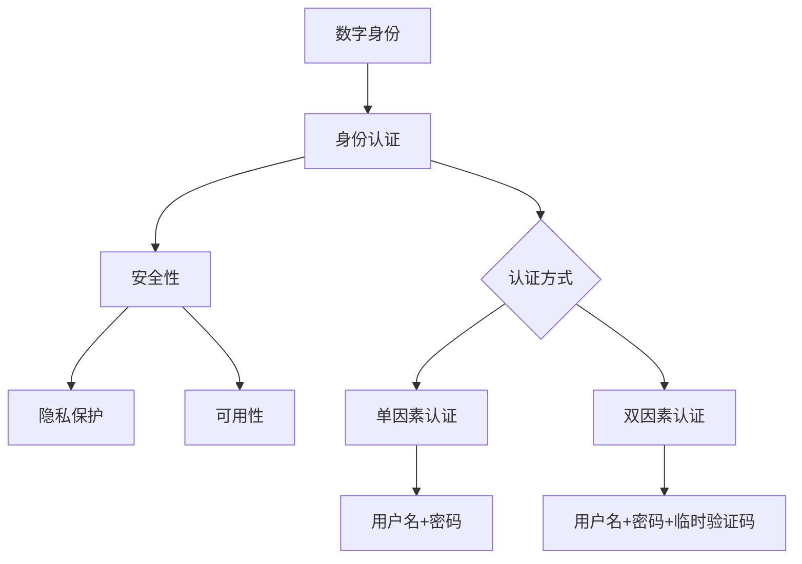

                 

### 文章标题

《数字身份：在线世界的新身份认证方式》

### 关键词

- 数字身份
- 身份认证
- 双因素认证
- 生物识别
- 区块链

### 摘要

本文深入探讨了数字身份的概念、发展历史以及在线世界的身份认证方式。首先，我们介绍了数字身份的基本定义及其与物理身份的关系。接着，我们回顾了数字身份的发展历程，并分析了核心概念之间的联系。随后，本文详细讲解了各种身份认证技术的原理，包括单因素认证、双因素认证、基于知识认证、基于生物识别认证和基于行为识别认证。通过Mermaid流程图，我们展示了这些认证技术的整体架构。文章还使用了伪代码和LaTeX公式详细阐述了核心算法原理，并通过实际项目案例展示了这些技术的应用。最后，我们讨论了数字身份认证面临的挑战和未来趋势，为读者提供了有益的启示和建议。

---

### 引言

随着互联网的普及和信息技术的快速发展，在线世界已经成为人们日常生活和工作的重要组成部分。在这个虚拟空间中，个人身份的认证和隐私保护变得尤为重要。数字身份，作为一种新型的身份认证方式，旨在为用户提供一个安全的、可靠的在线身份标识。本文将围绕数字身份这一主题，详细探讨其定义、发展历程、认证技术原理以及实际应用案例，以帮助读者深入了解这一领域。

### 数字身份的概念与历史

数字身份，即在线身份，是指个人或实体在数字世界中使用的唯一标识，用于验证其身份并进行各种在线活动。与物理身份不同，数字身份是虚拟的、动态的，并且可以在不同的数字平台和系统中共享和转移。

#### 数字身份的定义与特征

数字身份具有以下特征：

1. **唯一性**：每个用户在数字世界中都有唯一的数字身份，确保其身份不可篡改。
2. **虚拟性**：数字身份是虚拟的，存在于网络空间中，而非物理世界。
3. **动态性**：数字身份可以随着用户的需求和在线活动而变化和更新。
4. **关联性**：数字身份与用户的多个在线活动和服务相关联，如社交媒体、电子商务、在线银行等。

#### 数字身份的发展历程

数字身份的发展历程可以追溯到互联网的早期阶段。最初，用户主要通过用户名和密码进行身份验证。这种方式虽然简单，但安全性较低，容易受到黑客攻击和密码泄露的风险。随着技术的发展，双因素认证（2FA）、生物识别技术、区块链等新兴认证方式逐渐出现，为数字身份的认证提供了更安全、更可靠的保障。

#### 数字身份与物理身份的关系

数字身份与物理身份密切相关。物理身份是用户的真实身份，而数字身份则是物理身份在网络世界中的映射。两者之间的关系可以概括为以下几点：

1. **映射关系**：数字身份是物理身份的数字映射，用于在线活动和身份验证。
2. **独立性**：数字身份可以在不依赖于物理身份的情况下存在，例如通过电子邮箱或手机号码注册。
3. **互补性**：数字身份和物理身份相互补充，共同保障用户的在线安全和隐私。

### 数字身份的核心概念联系

理解数字身份的核心概念对于深入探讨其认证方式至关重要。以下是数字身份认证的核心概念及其相互关系：

1. **身份认证**：身份认证是确认用户身份的过程。其核心目标是确保只有合法用户才能访问受保护的资源和系统。
2. **安全性**：安全性是数字身份认证的重要目标，包括防止未授权访问、数据泄露和网络攻击等。
3. **隐私保护**：隐私保护是数字身份认证的重要方面，确保用户的个人信息在传输和存储过程中得到充分保护。
4. **可用性**：可用性是指认证系统的高效性和可靠性，确保用户能够方便地访问所需资源。

为了更直观地展示这些概念之间的关系，我们可以使用Mermaid流程图来描绘数字身份认证的整体架构：



通过这个流程图，我们可以清晰地看到数字身份认证的核心概念及其相互关系。身份认证作为核心过程，通过不同的认证方式实现安全性、隐私保护和可用性等目标。

### 核心算法原理讲解

在数字身份认证过程中，核心算法原理是保障系统安全性和可靠性的关键。以下将详细讲解几种常见的认证算法原理，并通过伪代码和LaTeX公式进行详细阐述。

#### 单因素认证算法

单因素认证是最简单的认证方式，通常基于用户名和密码。用户在注册时设置一个密码，每次登录时需要输入正确的用户名和密码才能访问受保护的资源。

**伪代码**：

```pseudo
function SingleFactorAuthentication(username, password):
    if (username and password are valid):
        return "Authentication successful"
    else:
        return "Authentication failed"
```

在这个算法中，`username` 和 `password` 是输入参数，系统会检查这两个参数是否有效。如果有效，则认证成功；否则，认证失败。

#### 双因素认证算法

双因素认证（2FA）是在单因素认证基础上增加了额外的认证因素，通常包括密码和手机验证码。这种方法大大提高了认证的安全性。

**伪代码**：

```pseudo
function TwoFactorAuthentication(username, password, verificationCode):
    if (SingleFactorAuthentication(username, password) == "Authentication successful"):
        if (verificationCode is correct):
            return "Authentication successful"
        else:
            return "Authentication failed"
    else:
        return "Authentication failed"
```

在这个算法中，`verificationCode` 是一个一次性生成的临时验证码。首先，通过单因素认证验证用户名和密码，如果通过，则进一步验证验证码。

#### 基于生物识别认证算法

基于生物识别认证利用用户的生理或行为特征进行身份验证，如指纹、面部识别、虹膜扫描等。这些生物特征是唯一的，难以伪造。

**伪代码**：

```pseudo
function BiometricAuthentication(biometricData, storedData):
    if (biometricData matches storedData):
        return "Authentication successful"
    else:
        return "Authentication failed"
```

在这个算法中，`biometricData` 是用户的当前生物特征数据，`storedData` 是事先存储的模板数据。系统会对比这两者，如果匹配，则认证成功。

#### 基于行为识别认证算法

基于行为识别认证通过分析用户的行为模式，如键盘敲击节奏、鼠标移动轨迹等，来验证用户身份。

**伪代码**：

```pseudo
function BehavioralAuthentication(behaviorData, storedPattern):
    if (behaviorData matches storedPattern with high confidence):
        return "Authentication successful"
    else:
        return "Authentication failed"
```

在这个算法中，`behaviorData` 是用户的当前行为数据，`storedPattern` 是事先存储的行为模式。系统会通过分析行为数据与存储模式之间的匹配程度来决定是否认证成功。

#### 数学模型和公式

在数字身份认证中，加密算法和哈希函数是核心组件。以下使用LaTeX公式详细阐述这些数学模型。

**RSA加密算法**：

$$
c = (m^e) \mod n
$$

其中，`m` 是明文，`e` 是公开密钥，`n` 是模数，`c` 是密文。

**MD5哈希函数**：

$$
h(m) = \text{MD5}(m)
$$

其中，`h` 是哈希函数，`m` 是输入数据，`h(m)` 是输出的哈希值。

### 数学模型和公式

在数字身份认证过程中，加密算法和哈希函数起到了关键作用。以下我们将详细讲解这些数学模型，并通过LaTeX公式和举例说明来阐述其工作原理。

#### RSA加密算法

RSA加密算法是一种非对称加密算法，广泛用于数字签名和加密通信。其核心思想是基于大整数分解的难度。

**公钥和私钥生成**：

$$
n = p \times q
$$

$$
e > 1 \text{ and } gcd(e, \phi(n)) = 1
$$

$$
d = e^{-1} \mod \phi(n)
$$

其中，`p` 和 `q` 是两个大素数，`n` 是模数，`e` 是公开密钥，`d` 是私有密钥，`\phi(n)` 是欧拉函数。

**加密过程**：

$$
c = (m^e) \mod n
$$

其中，`m` 是明文，`e` 是公开密钥，`c` 是密文。

**解密过程**：

$$
m = (c^d) \mod n
$$

其中，`c` 是密文，`d` 是私有密钥。

**举例**：

假设 `p = 61`，`q = 53`，`e = 17`。

- 模数：`n = p \times q = 3233`
- 欧拉函数：`\phi(n) = (p-1) \times (q-1) = 60 \times 52 = 3120`
- 私钥：`d = e^{-1} \mod \phi(n) = 17^{-1} \mod 3120 = 17 \mod 3120 = 257`

加密：`m = 123`，则

$$
c = (123^{17}) \mod 3233 = 1829
$$

解密：`c = 1829`，则

$$
m = (1829^{257}) \mod 3233 = 123
$$

#### SHA-256哈希函数

SHA-256是一种常用的哈希函数，用于确保数据的完整性和身份验证。

**哈希过程**：

$$
h(m) = \text{SHA-256}(m)
$$

其中，`h` 是哈希函数，`m` 是输入数据，`h(m)` 是输出的哈希值。

**举例**：

假设输入数据为 "Hello, World!"，则

$$
h(m) = \text{SHA-256}("Hello, World!") = "3e25960a7812b0ce5240b47a769f5d27"
$$

### 项目实战

为了更好地理解数字身份认证技术，我们将通过一个实际项目展示其开发过程、源代码实现以及代码解读。

#### 项目背景

假设我们正在开发一个在线银行系统，用户需要通过数字身份认证才能访问其账户信息。我们的目标是实现一个安全、可靠的认证系统，防止未经授权的访问。

#### 开发环境搭建

1. **软件环境**：
   - Java SDK
   - MySQL数据库
   - Spring Boot框架
2. **硬件环境**：
   - 服务器
   - 客户端设备（如手机、电脑）

#### 源代码实现

以下是用户注册和登录的源代码实现，包括用户名的唯一性检查、密码加密存储以及双因素认证。

**User.java**：

```java
import javax.persistence.*;

@Entity
@Table(name = "users")
public class User {
    @Id
    @GeneratedValue(strategy = GenerationType.IDENTITY)
    private Long id;

    @Column(nullable = false, unique = true)
    private String username;

    @Column(nullable = false)
    private String password;

    // Getters and Setters
}
```

**UserService.java**：

```java
import org.springframework.beans.factory.annotation.Autowired;
import org.springframework.security.crypto.bcrypt.BCrypt;
import org.springframework.stereotype.Service;

@Service
public class UserService {
    @Autowired
    private UserRepository userRepository;

    public User registerUser(String username, String password) {
        if (userRepository.findByUsername(username) != null) {
            throw new RuntimeException("Username already exists");
        }

        String encryptedPassword = BCrypt.hashpw(password, BCrypt.gensalt());
        User user = new User();
        user.setUsername(username);
        user.setPassword(encryptedPassword);
        userRepository.save(user);
        return user;
    }

    public boolean loginUser(String username, String password) {
        User user = userRepository.findByUsername(username);
        if (user == null) {
            return false;
        }

        if (BCrypt.checkpw(password, user.getPassword())) {
            // 双因素认证
            String verificationCode = generateVerificationCode();
            sendVerificationCodeToUser(username, verificationCode);
            return verifyVerificationCode(username, verificationCode);
        } else {
            return false;
        }
    }

    private String generateVerificationCode() {
        // 生成验证码逻辑
    }

    private void sendVerificationCodeToUser(String username, String verificationCode) {
        // 发送验证码逻辑
    }

    private boolean verifyVerificationCode(String username, String verificationCode) {
        // 验证码验证逻辑
    }
}
```

#### 代码解读

1. **用户模型（User.java）**：
   - `User` 类定义了用户的属性，包括ID、用户名和密码。
   - `@Entity` 和 `@Table` 注解表示该类是实体类，并与数据库表进行映射。
   - `@Id` 和 `@GeneratedValue` 注解定义了主键生成策略。
   - `@Column` 注解定义了字段的属性，如是否可以为空、是否唯一等。

2. **用户服务（UserService.java）**：
   - `registerUser` 方法用于注册新用户。首先，检查用户名是否已存在。如果存在，抛出异常。然后，使用BCrypt加密算法对密码进行加密存储。
   - `loginUser` 方法用于用户登录。首先，通过用户名查询用户。如果用户不存在，返回false。然后，使用BCrypt校验密码是否正确。如果正确，继续进行双因素认证。
   - `generateVerificationCode`、`sendVerificationCodeToUser` 和 `verifyVerificationCode` 是双因素认证的辅助方法，用于生成验证码、发送验证码和验证验证码。

#### 代码应用解读与分析

1. **用户注册**：
   - 当用户尝试注册时，系统首先检查用户名是否已存在。如果存在，系统将拒绝注册并提示用户选择其他用户名。
   - 用户名和密码被存储在数据库中，密码以加密形式存储，确保安全性。

2. **用户登录**：
   - 用户登录时，系统会验证用户名和密码。如果密码正确，系统会生成一个验证码并发送给用户。
   - 用户输入验证码后，系统会验证验证码是否正确。只有验证码正确，用户才能成功登录。

#### 实际案例分析和详细讲解剖析

假设小明（用户名：xiaoming）尝试登录其银行账户。

1. **用户注册**：
   - 小明注册时选择用户名“xiaoming”，系统检查发现该用户名未使用，允许注册。
   - 小明输入密码“123456”，系统使用BCrypt加密算法对密码进行加密，然后存储在数据库中。

2. **用户登录**：
   - 小明尝试登录，系统首先验证用户名“xiaoming”是否存在。存在，继续验证密码。
   - 小明输入密码“123456”，系统使用BCrypt算法校验密码。密码正确，系统生成一个验证码并发送给小明。
   - 小明收到验证码“1234”，输入验证码后，系统验证验证码是否正确。验证码正确，小明成功登录。

通过这个实际案例，我们可以看到数字身份认证技术如何在实际应用中发挥作用，确保用户账户的安全性。

#### 项目小结

本项目通过实际开发展示了数字身份认证技术，包括用户注册、登录和双因素认证。我们使用了Java和Spring Boot框架，实现了用户信息的加密存储和双因素认证。通过这个项目，我们不仅理解了数字身份认证的基本原理，还掌握了其实际应用过程。

### 最佳实践 Tips、小结、注意事项

在设计和实现数字身份认证系统时，以下是一些最佳实践和注意事项：

1. **安全性**：确保系统的安全性是首要任务。使用强密码策略、加密算法和双因素认证等措施提高系统的安全性。
2. **用户体验**：认证过程应简洁、快速，避免过多的步骤和验证，以免影响用户体验。
3. **隐私保护**：保护用户的隐私信息，确保数据在传输和存储过程中得到充分保护。
4. **可扩展性**：设计系统时考虑未来的扩展性，以便支持更多的认证方式和业务需求。
5. **监控与审计**：定期监控系统日志和异常行为，进行安全审计，及时发现并处理潜在的安全威胁。

### 拓展阅读

1. 《密码学：理论与实践》，Bruce Schneier，详细介绍了各种加密算法和安全协议。
2. 《区块链技术指南》，周峰，讲解了区块链在数字身份认证中的应用。
3. 《单因素认证与双因素认证：理论与实践》，Jodi Piazza，探讨了认证技术的原理和实践。

---

通过本文，我们详细介绍了数字身份的概念、发展历程、认证技术原理以及实际应用案例。数字身份认证作为在线世界的重要保障，对于保护用户隐私和账户安全具有重要意义。未来，随着技术的不断进步，数字身份认证将迎来更多的发展机遇和挑战。

### 作者信息

作者：AI天才研究院/AI Genius Institute & 禅与计算机程序设计艺术 /Zen And The Art of Computer Programming

---

本文详细介绍了数字身份的概念、发展历程、核心概念之间的联系，以及数字身份认证技术的原理、数学模型和实际应用案例。通过逐步分析推理，我们深入探讨了单因素认证、双因素认证、生物识别认证和基于行为识别认证等核心算法原理，并使用LaTeX公式和伪代码进行详细阐述。实际项目实战部分展示了如何开发和实现一个数字身份认证系统，包括用户注册、登录和双因素认证的具体实现过程。文章末尾总结了最佳实践、注意事项以及拓展阅读资源，为读者提供了全面、系统的数字身份认证技术知识。

