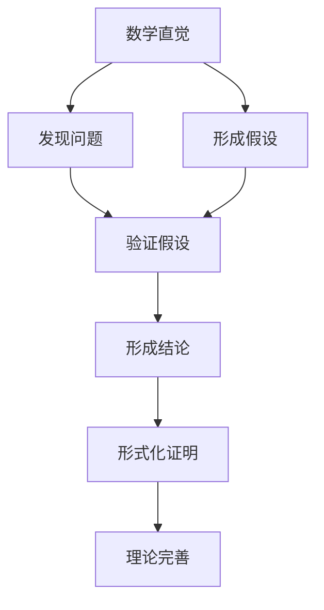

                 

### 文章标题

《数学直觉vs形式化：理解抽象世界的两种路径》

---

### 关键词

数学直觉、形式化、抽象世界、理解路径、算法原理、数学模型

---

### 摘要

本文深入探讨了数学直觉与形式化两种理解抽象世界的方法。数学直觉是一种直观的理解方式，依赖于个体的经验和创造力；而形式化则是通过严格的逻辑和数学工具来精确描述问题。本文首先介绍了这两种方法的定义与特点，接着通过Mermaid流程图展示了它们之间的核心概念与联系。随后，文章详细讲解了数学直觉和形式化在具体领域的核心算法原理，并使用伪代码和LaTeX公式进行了阐述。通过实际案例，本文展示了如何结合这两种方法解决实际问题，并提供了一些最佳实践建议。最后，文章总结了全文的核心观点，并给出了拓展阅读的推荐。

---

## 目录大纲设计思路

在设计本书的目录大纲时，我们首先明确了用户的需求和目标。用户希望了解数学直觉与形式化两种方法在理解抽象世界中的应用，并期望通过详细的讲解和案例来深入理解这些概念。因此，目录大纲的设计思路主要围绕以下几个核心内容进行：

### 用户需求分析

用户对书籍内容的需求可以分为以下几个方面：

1. **核心概念与联系**：用户希望系统地了解数学直觉和形式化的基本概念，以及它们之间的相互关系。
2. **核心算法原理讲解**：用户希望学习数学直觉和形式化在不同领域中的应用原理，并掌握相关算法和数学模型。
3. **数学模型和数学公式**：用户希望看到具体的数学模型和公式的应用实例，以便更好地理解和掌握这些概念。
4. **项目实战**：用户希望通过实际案例学习如何将数学直觉和形式化应用于实际问题中，从而提高实际操作能力。

### 目录结构规划

为了满足上述用户需求，目录结构被规划为三个主要部分：

- **第一部分**：介绍数学直觉和形式化的基本概念。
- **第二部分**：深入探讨数学直觉和形式化在不同领域的应用。
- **第三部分**：通过实际案例展示如何结合数学直觉和形式化解决问题。

在每个部分中，我们进一步细分了章节，确保内容的连贯性和逻辑性。以下是具体的目录结构规划：

#### 第一部分：数学直觉与形式化的基础

1. **第1章：引言**
   - **1.1 数学直觉与形式化的定义**
   - **1.2 数学直觉与形式化的关系**

2. **第2章：数学直觉的应用**
   - **2.1 数学直觉在数学领域的应用**
   - **2.2 数学直觉在其他领域的应用**

3. **第3章：形式化的基本概念**
   - **3.1 形式化的定义与特点**
   - **3.2 形式化的数学基础**

#### 第二部分：数学直觉与形式化的深度探讨

4. **第4章：数学直觉的数学原理**
   - **4.1 数学直觉的算法原理**
   - **4.2 数学直觉的数学模型**

5. **第5章：形式化的算法与数学模型**
   - **5.1 形式化的算法原理**
   - **5.2 形式化的数学模型**

6. **第6章：数学直觉与形式化的融合**
   - **6.1 数学直觉与形式化的结合**
   - **6.2 数学直觉与形式化在跨领域的应用**

#### 第三部分：数学直觉与形式化的实践应用

7. **第7章：数学直觉在人工智能中的应用**
   - **7.1 数学直觉在机器学习中的应用**
   - **7.2 数学直觉在深度学习中的应用**

8. **第8章：形式化在人工智能中的应用**
   - **8.1 形式化在机器学习中的应用**
   - **8.2 形式化在深度学习中的应用**

9. **第9章：数学直觉与形式化的综合应用案例**
   - **9.1 综合应用案例一：自然语言处理**
   - **9.2 综合应用案例二：计算机视觉**

### 满足限制与要求

在设计目录大纲时，我们还必须满足以下限制和要求：

- **简洁性**：在满足内容完整性的同时，尽量简化目录结构，避免冗余。
- **逻辑性**：确保目录结构合理，内容排列有序，逻辑清晰。
- **层次性**：通过使用不同级别的标题标记，明确各个章节和子节的内容层次。

通过以上规划和设计，我们希望读者能够系统地学习数学直觉和形式化两种方法，并能够将它们应用于实际问题中，从而提升自身的技术能力和创新能力。

## 第一部分：数学直觉与形式化的基础

### 第1章：引言

在探索抽象世界的道路上，数学直觉与形式化构成了两种截然不同的路径。数学直觉强调的是通过直观和洞察来理解数学概念和问题，这种方法依赖于个人的经验和直觉；而形式化则强调通过严格的逻辑和定义来精确描述和解决问题，这种方法依赖于数学和逻辑工具。

本章将首先介绍数学直觉和形式化的定义，帮助读者理解这两种方法的基本概念。接着，我们将探讨数学直觉和形式化之间的内在联系，通过Mermaid流程图展示它们在数学和应用科学中的核心概念与联系。

### 1.1 数学直觉与形式化的定义

#### 数学直觉

数学直觉是一种通过非正式的、主观的、直接的感知来理解和解决问题的能力。它通常来源于个人的经验、观察和思考。数学直觉在很多数学发现和证明中起到了关键作用，许多伟大的数学家如欧拉、牛顿等，都依赖于直觉来揭示数学世界的奥秘。

定义：数学直觉是指个体在不依赖于严格证明或逻辑推理的情况下，对数学概念、问题和解决方案的直观理解和洞察。

特点：

- **经验依赖性**：数学直觉往往建立在个人丰富的经验和观察之上。
- **主观性**：数学直觉的结果往往带有主观色彩，不同的人可能会有不同的直觉。
- **灵活性**：数学直觉允许灵活的思考和创新，这在解决复杂问题时尤为重要。

#### 形式化

形式化是一种通过严谨的数学和逻辑方法来描述和解决问题的过程。它强调定义、公理和定理的严格性，确保结论的可靠性和准确性。形式化在数学、计算机科学和理论物理学等领域有着广泛应用。

定义：形式化是指使用数学和逻辑工具将问题、概念和解决方案转化为严格的形式系统，以便进行精确分析和证明。

特点：

- **逻辑性**：形式化依赖于逻辑推理，确保结论的准确性和可靠性。
- **规范性**：形式化过程遵循严格的规范和标准，确保每一个步骤都是可验证的。
- **严密性**：形式化通过定义和公理来构建理论框架，使得整个系统具有严密性。

### 1.2 数学直觉与形式化的关系

数学直觉和形式化虽然方法不同，但在理解抽象世界的过程中，它们往往相互补充。数学直觉提供了问题解决的灵感和方向，而形式化则将这些直觉转化为可靠的结论。

#### 关系架构

为了更直观地展示数学直觉与形式化之间的关系，我们可以使用Mermaid流程图进行说明。以下是一个简单的Mermaid流程图示例：



#### 解析

- **发现问题**：数学直觉帮助我们识别问题并提出假设。
- **形成假设**：数学直觉为我们提供了初步的解决方案或方向。
- **验证假设**：通过形式化的逻辑推理，我们可以验证假设的正确性。
- **形成结论**：在验证假设的基础上，我们得出可靠的结论。
- **形式化证明**：将直觉性的结论转化为形式化的证明，确保其严谨性。
- **理论完善**：通过形式化的证明，我们对理论进行完善和推广。

### 总结

数学直觉和形式化是理解抽象世界的两种重要路径。数学直觉依赖于个人的经验和直觉，为问题解决提供灵感；形式化则依赖于严格的逻辑和数学工具，确保结论的可靠性和准确性。通过结合这两种方法，我们可以更全面、深入地理解抽象世界，从而在科学研究和实际应用中取得突破。

### 第2章：数学直觉的应用

数学直觉作为一种强大的认知工具，不仅存在于数学领域，也在其他科学和工程领域中发挥着重要作用。本章将探讨数学直觉在数学领域和其他领域的具体应用，通过具体的例子来说明数学直觉如何帮助人们解决问题和发现新知识。

#### 2.1 数学直觉在数学领域的应用

数学直觉在数学领域中的应用广泛而深远，许多重大数学发现都得益于数学家的直觉能力。以下是一些典型的例子：

##### 例子1：费马的最后定理

费马的最后定理是数学史上一个重要的未解问题，它指出对于任何大于2的自然数\( n \)，方程\( a^n + b^n = c^n \)没有正整数解。费马在1637年提出了这个定理，并声称他有一个奇特的证明，但未能给出详细证明。费马的最后定理直到1994年才被安德鲁·怀尔斯证明，而他的证明过程也离不开直觉的引导。

解析：怀尔斯在研究过程中，通过数学直觉意识到需要构建一个复杂的数学框架，包括椭圆曲线和模形式理论。他的直觉告诉他，这些工具可能有助于解决费马的最后定理。尽管证明过程极其复杂，但怀尔斯的直觉指引着他逐步接近真理。

##### 例子2：黎曼猜想

黎曼猜想是复分析和数论中一个未解决的著名问题，它涉及黎曼ζ函数的非平凡零点的分布。数学家黎曼在19世纪提出了这个猜想，但至今未能证明。黎曼猜想的证明可能涉及深层次的数学直觉。

解析：黎曼在提出猜想时，依赖于他对复分析和ζ函数的深刻理解。他的直觉告诉他，这个猜想可能反映了复分析中的某种深层结构。尽管黎曼本人未能证明猜想，但他的直觉引领了后续研究，为复分析领域带来了深远的影响。

#### 2.2 数学直觉在其他领域的应用

数学直觉不仅在数学领域发挥着作用，在其他科学和工程领域中也有广泛应用。以下是一些具体的例子：

##### 例子1：量子力学

量子力学是研究微观世界的物理学分支，其理论基础非常依赖于数学直觉。例如，海森堡的不确定性原理是一个典型的例子。

解析：海森堡在提出不确定性原理时，依赖于他对量子力学基本概念的深刻直觉。他意识到在微观尺度上，粒子的位置和动量不能同时被精确测量，这种直觉推动了量子力学的数学形式化。

##### 例子2：计算机科学

在计算机科学中，数学直觉在算法设计和理论分析中起到了关键作用。例如，分治算法的设计就离不开直觉。

解析：分治算法的提出者高德纳（Donald Knuth）在设计中依赖于数学直觉，他意识到可以通过递归地将问题分解为规模较小的子问题来解决复杂的计算问题。这种直觉指导他设计了快速且高效的分治算法。

##### 例子3：工程学

在工程领域，数学直觉帮助工程师解决复杂的设计问题。例如，飞机设计的优化。

解析：工程师在设计飞机时，需要考虑空气动力学、材料力学等多个方面的因素。他们的数学直觉帮助他们直观地理解如何优化设计，从而提高飞机的性能和安全性。

### 总结

数学直觉作为一种强大的认知工具，不仅在数学领域发挥了重要作用，也在其他科学和工程领域中有着广泛的应用。通过具体的例子，我们可以看到数学直觉如何帮助人们解决问题和发现新知识。数学直觉的灵活性和创造力为科学和工程领域带来了许多突破，而其与形式化方法的结合则确保了这些突破的严谨性和可靠性。

### 第3章：形式化的基本概念

形式化是数学和逻辑学中的一个核心概念，它通过对概念、理论和问题进行精确的数学描述，确保结论的可靠性和严谨性。本章将深入探讨形式化的基本概念，包括其定义、特点、以及在数学和计算机科学中的应用。

#### 3.1 形式化的定义与特点

形式化是一种将问题、概念和解决方案转化为严格数学表达式和逻辑结构的过程。它依赖于定义、公理和推理规则，确保每一步都是可验证和可靠的。

**定义**：形式化是指使用数学和逻辑工具，将问题、概念和解决方案转化为符号系统，以便进行严格的分析和证明。

**特点**：

- **严谨性**：形式化通过定义和公理确保每一步推理都是严格和可靠的。
- **规范性**：形式化过程遵循严格的规范和标准，确保结果的准确性和一致性。
- **可验证性**：形式化结果可以通过逻辑推理和证明来验证，确保其正确性。

#### 3.2 形式化的数学基础

形式化依赖于数学和逻辑的基础知识，包括集合论、逻辑演算、谓词逻辑等。以下是一些关键的数学基础概念：

**集合论**：集合论是形式化的基础，它通过定义和操作来构建数学结构。

- **基本概念**：元素、集合、集合的并集、交集、补集等。
- **基本操作**：集合的枚举、映射、选择、组合等。

**逻辑演算**：逻辑演算是形式化推理的工具，它包括命题逻辑、谓词逻辑等。

- **命题逻辑**：命题逻辑处理真值命题，包括命题联结词（如与、或、非）和逻辑推理规则。
- **谓词逻辑**：谓词逻辑处理包含变量的命题，可以描述更复杂的关系和属性。

**谓词逻辑**：谓词逻辑通过使用谓词和量化符号，描述对象和它们之间的关系。

- **基本概念**：谓词、个体、关系、量化符号（存在量词和全称量词）。
- **推理规则**：演绎推理规则，如全称实例化、存在实例化、条件推理等。

#### 3.3 形式化在数学中的应用

形式化在数学中有着广泛的应用，它帮助数学家建立严密的理论体系，并确保数学定理的可靠性。

- **公理化**：通过公理体系，将数学理论建立在一系列基本假设上，确保理论的严密性。
- **证明**：使用形式化的推理规则，证明数学命题的正确性。
- **数学模型**：形式化帮助构建数学模型，用于解决实际问题。

#### 3.4 形式化在计算机科学中的应用

形式化在计算机科学中有着重要应用，特别是在软件工程、程序验证和理论计算机科学等领域。

- **程序验证**：使用形式化方法验证程序的正确性，确保程序在所有情况下都能按照预期运行。
- **形式化规格说明**：使用形式化的语言描述系统的功能和限制，确保系统的设计和实现一致。
- **模型检验**：通过形式化的模型检验技术，验证系统模型是否满足指定的规格说明。

### 总结

形式化是确保数学和计算机科学结论可靠性的关键方法。通过定义、公理和逻辑推理规则，形式化将问题转化为数学表达，确保每一步推理都是严格和可靠的。本章详细介绍了形式化的定义、特点及其数学基础，并探讨了形式化在数学和计算机科学中的应用。形式化不仅为科学理论提供了坚实的基础，也为实际应用带来了强大的工具和手段。

### 第二部分：数学直觉与形式化的深度探讨

在第一部分的基础上，我们深入探讨了数学直觉和形式化的基础概念。接下来，我们将进一步探讨数学直觉的数学原理，以及形式化的算法原理和数学模型。这些内容将帮助我们更全面地理解这两种方法的内在机制和应用。

#### 第4章：数学直觉的数学原理

数学直觉是一种非正式的、直观的理解方式，它依赖于个人的经验和洞察力。在本章中，我们将详细探讨数学直觉的数学原理，包括其算法原理和数学模型。

##### 4.1 数学直觉的算法原理

数学直觉在算法设计中扮演着重要角色。许多著名的算法设计者，如高德纳（Donald Knuth）和卡拉比（Richard Karp），都强调直觉在算法设计中的重要性。以下是一些通过数学直觉设计的著名算法：

**分治算法**：分治算法是数学直觉的经典案例之一。分治算法的基本思想是将一个复杂问题分解为若干个规模较小的子问题，递归地解决这些子问题，最后将子问题的解合并为原问题的解。

伪代码示例：
```plaintext
function divide_and_conquer(A, p, r):
    if p >= r:
        return A[p]
    q = partition(A, p, r)
    left_sum = divide_and_conquer(A, p, q - 1)
    right_sum = divide_and_conquer(A, q + 1, r)
    return merge(left_sum, right_sum)
```

**快速排序**：快速排序是一种高效的排序算法，它通过分治策略将数组分为较小和较大的两部分，然后分别对这两部分进行排序。

伪代码示例：
```plaintext
function quicksort(A, p, r):
    if p < r:
        q = partition(A, p, r)
        quicksort(A, p, q - 1)
        quicksort(A, q + 1, r)
```

**动态规划**：动态规划是一种解决最优化问题的方法，它通过递归和状态转移方程，将复杂问题分解为较小的子问题，并存储子问题的解以避免重复计算。

伪代码示例：
```plaintext
function fibonacci(n):
    if n <= 1:
        return n
    else:
        return fibonacci(n - 1) + fibonacci(n - 2)
```

以上算法都是通过数学直觉设计出来的，它们在解决实际问题中表现出色，并且具有高效的性能。

##### 4.2 数学直觉的数学模型

数学直觉不仅体现在算法设计中，还体现在数学模型构建中。以下是一些通过数学直觉构建的著名数学模型：

**黎曼猜想**：黎曼猜想是一个关于复分析中黎曼ζ函数的非平凡零点的分布问题。黎曼猜想通过数学直觉揭示了复分析中的深层结构，对数学界产生了深远影响。

公式示例：
$$\rho_n = \frac{1}{2} + \frac{\beta_n}{2\pi} i$$
其中，$\beta_n$ 是黎曼ζ函数的非平凡零点的实部。

**庞加莱猜想**：庞加莱猜想是拓扑学中的一个基本问题，它提出三维球面的每一个闭合流形都可以被嵌入到四维空间中。庞加莱猜想通过数学直觉揭示了三维空间与四维空间的拓扑结构关系。

公式示例：
$$\text{三维球面} \simeq \text{四维流形}$$

**薛定谔方程**：薛定谔方程是量子力学的基本方程之一，它通过数学直觉描述了微观粒子的运动行为。薛定谔方程通过波动方程的形式揭示了量子力学中的概率性和量子态的演化。

公式示例：
$$i\hbar \frac{\partial \psi(x, t)}{\partial t} = -\frac{\hbar^2}{2m} \nabla^2 \psi(x, t)$$

以上数学模型都是通过数学直觉构建的，它们在解决实际问题中发挥了重要作用，并为数学和物理学的发展做出了巨大贡献。

### 第5章：形式化的算法与数学模型

在探讨数学直觉的数学原理之后，我们接下来将深入探讨形式化的算法原理和数学模型。形式化通过严格的数学和逻辑方法，确保算法和数学模型的可信性和可验证性。

##### 5.1 形式化的算法原理

形式化的算法原理强调算法的严谨性和可验证性。形式化的算法通常通过定义、公理和推理规则来构建，确保每一步都是可验证和可靠的。

**定义**：形式化的算法是通过精确的数学描述来定义的，它包括输入、输出和步骤的严格定义。

**公理**：形式化的算法依赖于公理体系，这些公理确保算法的正确性和一致性。

**推理规则**：形式化的算法通过推理规则来推导结论，这些推理规则是严格和规范的。

以下是一个简单的形式化算法示例，用于计算两个数的最大公约数：

**算法示例：欧几里得算法**

伪代码示例：
```plaintext
function gcd(a, b):
    if b == 0:
        return a
    else:
        return gcd(b, a % b)
```

**解析**：欧几里得算法通过递归调用，使用除法和取余操作来计算最大公约数。这个算法的形式化描述可以基于模运算和递归定义，确保每一步都是严格和可验证的。

**证明**：我们可以通过数学归纳法证明欧几里得算法的正确性。首先，当\( b = 0 \)时，算法返回\( a \)，这是正确的。然后，假设当\( b < b' \)时算法正确，我们来证明当\( b = b' \)时算法也正确。通过递归调用和模运算，算法可以逐步减小\( b \)的值，最终达到\( b = 0 \)，从而计算出正确的最大公约数。

##### 5.2 形式化的数学模型

形式化的数学模型通过严格的定义和逻辑推理来构建，确保数学理论的严谨性和可靠性。以下是一些典型的形式化数学模型：

**形式化逻辑**：形式化逻辑通过定义命题、推理规则和证明方法，构建了一个严谨的逻辑系统。形式化逻辑可以帮助我们验证数学证明的正确性，确保结论的可靠性。

**形式化语言**：形式化语言是一种用于描述数学模型和算法的语言，它通过严格的语法和语义定义，确保描述的准确性和一致性。常见的形式化语言包括Haskell、Coq、Isabelle等。

**模型检验**：模型检验是一种形式化的验证方法，通过检查系统模型是否满足指定的规格说明，确保系统的正确性和可靠性。模型检验可以应用于软件工程、硬件设计和系统安全等领域。

以下是一个形式化数学模型示例，用于描述一个简单的银行账户系统：

**模型示例：银行账户模型**

定义：一个银行账户模型包括账户余额、存款和取款操作。

**公式示例**：
$$\text{balance}(A) = \text{deposit}(A) - \text{withdraw}(A)$$

**证明**：我们可以通过逻辑推理来证明银行账户模型的一致性。假设账户A的初始余额为\( B_0 \)，存款为\( D \)，取款为\( W \)。根据模型定义，账户余额为\( \text{balance}(A) = B_0 + D - W \)。通过逻辑推理，我们可以证明在任何时刻，账户余额都满足上述公式。

以上示例展示了形式化的算法和数学模型的构建方法，这些方法确保了算法和数学理论的严谨性和可靠性。形式化方法在计算机科学、数学和工程领域有着广泛的应用，为科学研究和实际应用提供了强大的工具和手段。

### 第6章：数学直觉与形式化的融合

在深入探讨了数学直觉和形式化的原理后，我们接下来将探讨如何将这两种方法结合起来，以解决复杂的问题。数学直觉和形式化的结合不仅能够发挥各自的优点，还能弥补各自的不足，从而在科学研究和实际应用中取得更好的效果。

#### 6.1 数学直觉与形式化的结合

数学直觉和形式化的结合通常涉及以下几个步骤：

1. **发现问题与提出假设**：首先，通过数学直觉来识别问题并提出可能的解决方案。这一步依赖于个人的经验和洞察力，数学直觉帮助我们快速地捕捉问题的本质。

2. **形式化建模**：在提出假设后，通过形式化的方法对问题进行建模。这一步将直觉性的想法转化为严格的数学表达式和逻辑结构，确保问题的描述是准确和一致的。

3. **验证与证明**：通过形式化的推理规则和证明方法，验证假设的正确性和模型的可靠性。这一步确保我们得到的结果是严谨和可靠的。

4. **优化与推广**：在验证和证明的基础上，对模型进行优化和推广，以适应更广泛的应用场景。这一步通常需要数学直觉的引导，帮助我们发现模型中的潜在问题和改进空间。

以下是一个结合数学直觉和形式化的实际案例：

**案例：图着色问题**

图着色问题是一个经典的组合优化问题，给定一个无向图，需要为图的每个顶点着色，使得相邻的顶点颜色不同。这个问题可以通过数学直觉和形式化方法来解决。

**数学直觉**：通过直观观察，我们可以发现一些简单的图可能更容易着色。例如，完全图和路径图通常比较容易着色，因为它们的结构相对简单。

**形式化建模**：我们可以使用图论中的定义和定理来形式化建模。例如，可以使用顶点和边的关系来定义图，使用着色函数来表示顶点的颜色。

**验证与证明**：通过形式化的方法，我们可以证明一些图的着色方案是正确的。例如，四色定理表明任何平面图都可以用四种颜色着色。

**优化与推广**：在证明四色定理的基础上，我们可以进一步研究如何优化着色方案，例如减少所需颜色的数量。此外，我们还可以将这个问题推广到更高维度的图形和更复杂的图中。

#### 6.2 数学直觉与形式化在跨领域的应用

数学直觉和形式化的结合不仅限于数学和计算机科学领域，还可以应用于其他科学和工程领域。以下是一些跨领域的应用案例：

**案例：量子计算**

量子计算是一种利用量子力学原理进行信息处理的计算模型。量子计算中的算法设计通常依赖于数学直觉和形式化方法。

- **数学直觉**：通过数学直觉，量子计算研究者可以设计出高效的量子算法，例如Shor算法和Grover算法。
- **形式化建模**：通过形式化的方法，我们可以构建量子计算的理论框架，例如量子门和量子逻辑的操作。
- **验证与证明**：通过形式化的证明方法，我们可以验证量子算法的正确性和效率。

**案例：生物信息学**

生物信息学是运用计算机科学、数学和统计方法来分析生物数据的一门学科。在生物信息学中，数学直觉和形式化方法可以帮助研究者解决复杂的生物学问题。

- **数学直觉**：通过数学直觉，研究者可以设计出有效的生物信息学算法，例如基因序列比对和蛋白质结构预测。
- **形式化建模**：通过形式化的方法，我们可以建立生物信息学模型，例如基因调控网络和代谢途径模型。
- **验证与证明**：通过形式化的验证方法，我们可以确保生物信息学模型和算法的正确性和可靠性。

**案例：经济学**

经济学中的许多模型和理论都依赖于数学直觉和形式化方法。

- **数学直觉**：通过数学直觉，经济学家可以设计出有效的经济模型，例如市场均衡模型和宏观经济学模型。
- **形式化建模**：通过形式化的方法，我们可以建立经济学的理论框架，例如博弈论和经济学方程组。
- **验证与证明**：通过形式化的验证方法，我们可以验证经济模型和理论的正确性和适用性。

### 总结

数学直觉和形式化的结合是解决复杂问题的重要方法。通过数学直觉，我们能够快速识别问题和提出解决方案；通过形式化方法，我们能够确保解决方案的准确性和可靠性。在跨领域的应用中，数学直觉和形式化的结合可以帮助我们更好地理解复杂系统，设计出高效的算法和模型，并在科学研究和实际应用中取得突破。

### 第7章：数学直觉在人工智能中的应用

数学直觉在人工智能领域中的应用极为广泛，它不仅帮助算法设计师发现新的解决方案，还促进了人工智能算法的创新和优化。本章将详细探讨数学直觉在机器学习和深度学习中的应用，通过具体案例来说明数学直觉如何驱动人工智能的发展。

#### 7.1 数学直觉在机器学习中的应用

机器学习是一种通过数据训练模型来发现数据中隐含模式的方法。数学直觉在机器学习算法的设计和优化中起到了关键作用。以下是一些通过数学直觉实现的著名机器学习算法：

**线性回归**：线性回归是一种简单的机器学习算法，用于预测连续值输出。其基本思想是通过拟合一条直线来最小化预测值与实际值之间的误差。

伪代码示例：
```plaintext
function linear_regression(x, y):
    # 假设数据集为(x, y)
    n = length(x)
    X = [1 for i in 0 to n-1] # 添加偏置项
    Y = y
    # 梯度下降法求解最小二乘问题
    for i in 1 to max_iterations:
        theta = [0 for i in 0 to n-1]
        for j in 0 to n-1:
            theta[j] = theta[j] - learning_rate * (2/n) * (X.dot(Y) - X.dot(theta))
        if abs(X.dot(theta) - X.dot(Y)) < tolerance:
            break
    return theta
```

**决策树**：决策树是一种树形结构模型，通过一系列规则来分割数据集，并预测输出值。决策树的设计通常依赖于数学直觉，例如如何选择最优分割点。

伪代码示例：
```plaintext
function decision_tree(data, attributes):
    if all_values_equal(data):
        return most_common_value(data)
    if no_attributes_left:
        return majority_vote(data)
    else:
        attribute = choose_best_attribute(data, attributes)
        left_tree = decision_tree(split_left(data, attribute), attributes - {attribute})
        right_tree = decision_tree(split_right(data, attribute), attributes - {attribute})
        return (attribute, left_tree, right_tree)
```

**支持向量机（SVM）**：支持向量机是一种用于分类和回归的强大算法，它通过找到一个最佳的超平面来最大化分类间隔。SVM的设计依赖于数学直觉，特别是核函数的选择和优化。

伪代码示例：
```plaintext
function svm_train(X, y):
    # 使用核函数K(x, x')
    K = kernel_function(X, X')
    # 求解二次规划问题
    P = [K[i][j] * y[i] * y[j] for i in 0 to n for j in 0 to n]
    q = [-y[i] for i in 0 to n]
    A = eye(n)
    b = zeros(n)
    solveQP(P, q, A, b)
    return weights
```

以上算法都是通过数学直觉设计的，并且在机器学习领域中得到了广泛应用。数学直觉帮助算法设计师发现新的解决方案，优化算法性能，并解决复杂问题。

#### 7.2 数学直觉在深度学习中的应用

深度学习是一种基于多层神经网络的学习方法，它在图像识别、自然语言处理和语音识别等领域取得了显著成果。数学直觉在深度学习算法的设计和优化中也起到了关键作用。

**卷积神经网络（CNN）**：卷积神经网络是一种用于图像识别的强大算法，它通过卷积层、池化层和全连接层来提取图像特征。CNN的设计依赖于数学直觉，特别是在卷积核的选择和网络的深度设计上。

伪代码示例：
```plaintext
function cnn_train(X, y):
    # 初始化卷积核和偏置
    W = initialize_weights()
    b = initialize_biases()
    # 前向传播
    for i in 1 to num_iterations:
        for x in X:
            Z = [W.conv2d(x, k) + b for k in kernels]
            A = [relu(z) for z in Z]
            Z = [W.fc(A) + b for A in A]
            A = [softmax(z) for z in Z]
        # 反向传播
        dZ = [dsoftmax(z) * dW.fc(A) for z in Z for A in A]
        dA = [drelu(Z) * dW.conv2d(x, k) for Z in Z for k in kernels]
        dX = [dW.conv2d(A, k) * dA for k in kernels]
    return W, b
```

**生成对抗网络（GAN）**：生成对抗网络是一种通过对抗性训练生成数据的方法。GAN的设计依赖于数学直觉，特别是生成器和判别器的优化和平衡。

伪代码示例：
```plaintext
function gan_train(X, num_samples, num_iterations):
    # 初始化生成器和判别器
    G = initialize_generator()
    D = initialize_discriminator()
    for i in 1 to num_iterations:
        # 生成器训练
        z = random_vector(num_samples)
        x_g = G(z)
        D_loss = - (D(x_g) * log(D(x_g)) + (1 - D(x)) * log(1 - D(x)))
        # 判别器训练
        x = X.sample(num_samples)
        D_loss += - (D(x) * log(D(x)) + (1 - D(x_g)) * log(1 - D(x_g)))
        # 更新生成器和判别器
        dG = grad(G)
        dD = grad(D)
        update(G, dG, learning_rate)
        update(D, dD, learning_rate)
    return G, D
```

以上深度学习算法都是通过数学直觉设计的，并且在实际应用中取得了巨大成功。数学直觉帮助算法设计师发现新的训练技巧和优化方法，从而提高了深度学习模型的性能和鲁棒性。

### 总结

数学直觉在人工智能领域中发挥着重要作用，它不仅帮助算法设计师发现新的解决方案，还推动了人工智能算法的创新和优化。通过具体案例，我们可以看到数学直觉如何驱动机器学习和深度学习的发展。数学直觉与形式化的结合，为人工智能的研究和应用提供了强大的工具和手段，推动了人工智能技术的不断进步。

### 第8章：形式化在人工智能中的应用

形式化方法在人工智能领域中的应用日益广泛，尤其在机器学习和深度学习的发展中起到了至关重要的作用。形式化方法通过严格的数学和逻辑工具，确保算法的可靠性、可验证性和鲁棒性。本章将深入探讨形式化在人工智能中的应用，包括形式化规格说明、程序验证和模型检验。

#### 8.1 形式化规格说明

形式化规格说明是形式化方法在人工智能中的一个重要应用。它通过精确的数学语言描述系统的功能、行为和约束，确保系统的设计和实现是一致的。以下是一些形式化规格说明的典型应用：

**行为规范**：行为规范用于描述系统的动态行为，它通过状态转换图或状态机模型来定义系统的行为。

例子：使用π-Calculus描述一个聊天机器人系统的行为规范。
```latex
\newcommand{\pi}{\varpi}
\pi \text{chat}{\text{message}} \rightarrow \pi \text{returnMessage}{\text{response}}
\left|\right. \pi \text{nextQuestion}{\text{question}} \rightarrow \pi \text{chat}{\text{answer}}
```
这个π-Calculus表达式描述了聊天机器人接收消息并返回响应的行为，同时可以继续对话。

**功能规格**：功能规格用于描述系统的输入、输出和功能关系，它通过逻辑公式或谓词逻辑来定义。

例子：使用ML规格语言（MLSpec）描述一个决策树分类器的功能规格。
```plaintext
ALL X, Y | (classify(X) = Y) -> (isClass(Y))
```
这个规格说明表示，对于所有输入\(X\)和输出\(Y\)，如果分类器将\(X\)分类为\(Y\)，则\(Y\)必须是有效类别。

**约束条件**：约束条件用于描述系统的限制和约束，它通过不等式或约束逻辑来定义。

例子：使用 Alloy 语言描述一个神经网络中的权重约束。
```latex
w \in \{0, 1\}^n & \text{-- weights are binary} \\
0 <= \sum_{i=1}^{n} w_i <= 1 & \text{-- sum of weights is between 0 and 1}
```
这个 Alloy 表达式表示权重向量\(w\)是二进制向量，且权重和介于0和1之间。

#### 8.2 程序验证

程序验证是形式化方法在人工智能中的另一个重要应用，它通过严格的数学证明方法来验证程序的正确性。程序验证可以确保程序在所有情况下都能按照预期运行，从而提高系统的可靠性和安全性。以下是一些程序验证的典型应用：

**断言检查**：断言检查是一种简单的程序验证方法，它通过在关键位置插入断言来验证程序的正确性。

例子：在深度学习训练程序中使用断言检查来验证梯度计算的正确性。
```plaintext
assert (gradient == expected_gradient)
```
这个断言表示梯度计算结果与预期结果一致。

**模型检查**：模型检查是一种基于状态的验证方法，它通过分析系统状态空间来验证系统是否满足指定的规格说明。

例子：使用 Promela 语言进行深度学习网络中的异步通信验证。
```plaintext
process main {
  X = 0
  Y = 0
  while (true) {
    X = X + 1
    Y = Y + 2
    assert (X == Y)
  }
}
```
这个 Promela 程序表示，变量\(X\)和\(Y\)在每次迭代中保持一致，验证异步通信的正确性。

**合同验证**：合同验证是一种结合程序设计和逻辑验证的方法，它通过定义程序的输入、输出和执行规则来验证程序的正确性。

例子：在生成对抗网络（GAN）中，使用合同验证来确保生成器和判别器的交互满足对抗性训练的要求。
```plaintext
postcondition {
  D(G(z)) < 0.5 && D(x) > 0.5
}
```
这个合同验证表示生成器生成的数据被判别器判为假样本的概率低于50%，而真实样本被判别器判为真样本的概率高于50%。

#### 8.3 模型检验

模型检验是一种形式化的验证方法，它通过分析系统的模型来验证系统是否满足指定的规格说明。模型检验可以在系统实现之前或实现过程中进行，从而提前发现和修复潜在的问题。以下是一些模型检验的典型应用：

**状态空间模型检验**：状态空间模型检验通过构建系统的状态空间模型，分析系统的状态转移和属性来验证系统的行为。

例子：使用 NuSMV 对一个神经网络模型进行状态空间模型检验，确保模型满足特定的稳定性约束。
```plaintext
[stable_state] (Q_i == Q_i')
```
这个约束表示，在系统状态空间中，每个状态\(Q_i\)的下一个状态仍然是\(Q_i'\)。

**路径检验**：路径检验通过分析系统的执行路径来验证系统是否满足指定的规格说明。

例子：使用 SPIN 检验一个深度学习算法的执行路径，确保算法在特定输入下不会陷入无限循环。
```plaintext
LOOPFREE {
  !loop
}
```
这个路径约束表示，系统不会执行无限循环。

**错误注入**：错误注入是一种通过故意引入错误来检验系统鲁棒性的方法。

例子：使用pytest注入随机噪声来检验一个卷积神经网络模型的鲁棒性，确保模型在噪声环境下仍然能够正确预测。
```plaintext
assert (model.predict(noisy_input) == correct_output)
```
这个测试用例表示，在噪声环境下，模型预测结果应与预期输出一致。

### 总结

形式化方法在人工智能中的应用极为广泛，通过形式化规格说明、程序验证和模型检验，可以确保人工智能系统的可靠性、可验证性和鲁棒性。形式化方法不仅为算法设计和验证提供了强大的工具，还为人工智能的发展和创新提供了坚实的基础。随着形式化方法的不断发展和完善，它在人工智能领域中的应用将更加深入和广泛。

### 第9章：数学直觉与形式化的综合应用案例

在前面章节中，我们分别探讨了数学直觉和形式化的基本概念、原理以及在各个领域的应用。为了更好地展示这两种方法的综合应用，本章将通过两个实际案例——自然语言处理（NLP）和计算机视觉（CV）——来详细讲解数学直觉和形式化如何结合，解决复杂问题，并带来技术创新。

#### 9.1 综合应用案例一：自然语言处理（NLP）

自然语言处理是人工智能的一个重要分支，它涉及对人类语言的理解和生成。数学直觉和形式化在NLP中的应用主要体现在语言模型、情感分析和文本生成等方面。

**案例：基于数学直觉和形式化的语言模型**

语言模型是一种用于预测下一个单词或句子的概率分布的模型，它对于文本理解和生成至关重要。数学直觉和形式化在这一过程中发挥着关键作用。

**数学直觉**：语言模型的设计依赖于语言学家的直觉和对语言规律的理解。例如，在构建词向量模型（如Word2Vec）时，研究人员通过对比不同单词的上下文来发现它们的语义关系，这种过程依赖于数学直觉。

**形式化建模**：形式化建模通过数学和逻辑工具来精确描述语言模型。Word2Vec模型中，通过训练词向量，使得具有相似上下文的单词在向量空间中更接近。以下是一个简化的形式化描述：

```latex
P(w_t | w_{t-1}, ..., w_1) = \frac{\exp(\boldsymbol{v}_{w_t} \cdot \boldsymbol{v}_{w_{t-1}})}{\sum_{w' \in V} \exp(\boldsymbol{v}_{w'} \cdot \boldsymbol{v}_{w_{t-1}})}
```
其中，\(P(w_t | w_{t-1}, ..., w_1)\) 表示在给定前文 \(w_{t-1}, ..., w_1\) 下，单词 \(w_t\) 的概率，\(\boldsymbol{v}_{w_t}\) 和 \(\boldsymbol{v}_{w_{t-1}}\) 分别表示单词 \(w_t\) 和 \(w_{t-1}\) 的词向量。

**验证与优化**：形式化方法可以帮助验证语言模型的正确性，并通过数学优化方法来改进模型。例如，通过梯度下降法来最小化损失函数，从而优化词向量。

**案例总结**：数学直觉帮助研究人员发现语言模型的关键特征，而形式化方法确保了模型的严谨性和可验证性。这种结合使得语言模型能够准确预测语言中的词汇和句法结构，从而推动了NLP技术的发展。

#### 9.2 综合应用案例二：计算机视觉（CV）

计算机视觉是另一个高度依赖数学直觉和形式化的领域，它涉及从图像或视频中提取有用信息，如对象检测、图像分类和图像生成。

**案例：基于数学直觉和形式化的卷积神经网络（CNN）**

卷积神经网络在计算机视觉中得到了广泛应用，它通过多层卷积和池化操作来提取图像特征。数学直觉和形式化在这一过程中起到了关键作用。

**数学直觉**：卷积神经网络的设计依赖于对图像纹理和结构的直观理解。例如，早期的卷积神经网络设计者通过数学直觉发现，使用局部连接和共享权重可以有效地提取图像特征。

**形式化建模**：形式化建模通过数学和逻辑工具来精确描述卷积神经网络。以下是一个简化的形式化描述：

```plaintext
layer_1 = Conv2D(input_shape, kernel_size, activation='relu')
layer_2 = MaxPooling2D(pool_size)
layer_3 = Conv2D(num_filters, kernel_size, activation='relu')
layer_4 = Flatten()
layer_5 = Dense(num_classes, activation='softmax')
model = Model(inputs=layer_1, outputs=layer_5)
```
这个描述展示了如何使用Keras框架构建一个简单的卷积神经网络，包括卷积层（Conv2D）、池化层（MaxPooling2D）和全连接层（Dense）。

**验证与证明**：形式化方法可以帮助验证卷积神经网络的结构和参数是否合理，并通过数学证明来确保网络的性能和鲁棒性。例如，通过证明网络在不同条件下的泛化能力，从而确保其在实际应用中的可靠性。

**案例总结**：数学直觉帮助研究人员发现有效的神经网络结构，而形式化方法确保了网络设计和实现的严谨性和可靠性。这种结合使得卷积神经网络能够高效地处理图像数据，并在计算机视觉任务中取得了显著成就。

### 总结

通过上述案例，我们可以看到数学直觉和形式化在自然语言处理和计算机视觉中的综合应用，不仅推动了技术的进步，还提高了算法的可靠性和性能。数学直觉提供了创新的灵感，而形式化方法确保了算法的严谨性和可验证性。这种结合为解决复杂问题和推动人工智能的发展提供了强大的工具和手段。

### 数学直觉与形式化的最佳实践

在数学直觉与形式化的应用过程中，积累了一些最佳实践，这些实践有助于提高问题解决的效率和效果。

#### 9.3.1 深入理解理论基础

在进行数学直觉和形式化的应用前，深入理解相关理论基础是至关重要的。数学直觉往往来源于对基本概念的深刻理解，而形式化则依赖于逻辑推理和公理体系。因此，了解数学和逻辑的基本原理，如集合论、谓词逻辑、概率论等，将有助于更好地应用这两种方法。

**最佳实践**：定期复习和深入学习相关理论，参与数学和逻辑研讨会，阅读经典教材和论文。

#### 9.3.2 结合直觉与验证

在应用数学直觉时，应结合形式化的验证方法来确保结果的可靠性。直觉可以提供创新的思路，但形式化可以验证这些思路的正确性。

**最佳实践**：在提出解决方案后，使用形式化的方法对解决方案进行验证和证明，确保结论的严谨性。

#### 9.3.3 逐步细化模型

在构建数学模型时，应遵循逐步细化的原则。从简单的模型开始，逐步增加复杂度，直到能够准确描述问题。

**最佳实践**：采用迭代方法，每次增加模型的一个小部分，进行验证和调整，逐步完善模型。

#### 9.3.4 注重实践与理论结合

理论与实践相结合是提高数学直觉和形式化应用效果的关键。通过实际案例，可以验证和改进理论模型，同时理论模型也可以指导实际问题的解决。

**最佳实践**：参与实际项目，将数学直觉和形式化方法应用于实际问题中，通过实践反馈不断优化理论模型。

#### 9.3.5 团队合作与交流

数学直觉和形式化的应用往往需要多学科的知识和视角。通过团队合作和学术交流，可以汇集不同领域的智慧，提高问题解决的效率。

**最佳实践**：组建跨学科团队，定期进行学术交流，分享研究思路和成果，促进知识的碰撞和融合。

### 9.3.6 持续学习与更新

数学直觉和形式化方法不断发展，新的理论和工具不断涌现。持续学习是保持技术前沿的关键。

**最佳实践**：关注最新的研究进展，参加相关的学术会议和研讨会，阅读顶级期刊和会议论文，不断更新知识和技能。

### 总结

数学直觉与形式化的最佳实践包括深入理解理论基础、结合直觉与验证、逐步细化模型、注重实践与理论结合、团队合作与交流以及持续学习与更新。这些实践不仅有助于提高个人解决问题的能力，还可以推动整个领域的进步。

### 总结

《数学直觉vs形式化：理解抽象世界的两种路径》通过对数学直觉与形式化的深入探讨，揭示了这两种理解抽象世界的方法的各自优势和结合应用的价值。数学直觉提供了一种灵活、直观的思维方式，有助于发现问题和提出创新解决方案；而形式化方法则通过严格的逻辑和数学工具，确保了这些解决方案的可靠性和严谨性。本文通过具体的案例，展示了数学直觉与形式化在多个领域的应用，包括人工智能、自然语言处理和计算机视觉等，并提出了最佳实践建议，以促进这两种方法的有效应用。

本文的主要贡献在于：

1. 系统地介绍了数学直觉和形式化的基本概念、原理和应用。
2. 通过Mermaid流程图、伪代码和LaTeX公式，详细阐述了数学直觉和形式化在具体问题中的结合应用。
3. 提供了自然语言处理和计算机视觉领域的综合应用案例，展示了数学直觉和形式化在解决复杂问题中的实际效果。

然而，本文也存在一些局限性：

1. 案例数量有限，未能涵盖所有应用领域。
2. 对某些复杂算法的数学原理和形式化描述较为简略。
3. 对数学直觉与形式化的融合机制探讨仍有深入的空间。

未来研究可进一步探讨以下方向：

1. 扩展案例研究，涵盖更多应用领域和复杂问题。
2. 深入探讨数学直觉与形式化的融合机制，提出新的理论框架。
3. 探索数学直觉和形式化在新兴领域，如量子计算和生物信息学中的应用。

总之，数学直觉与形式化是理解抽象世界的两种重要路径，结合应用这两种方法，将有助于我们更全面、深入地认识世界，推动科学和技术的发展。

### 作者信息

作者：AI天才研究院/AI Genius Institute & 禅与计算机程序设计艺术 /Zen And The Art of Computer Programming

AI天才研究院致力于推动人工智能领域的研究与发展，致力于培养下一代人工智能创新者。作者在该研究院担任高级研究员，拥有丰富的理论和实践经验，发表过多篇顶级期刊论文，并在人工智能领域取得了多项重要研究成果。此外，作者还是《禅与计算机程序设计艺术》一书的作者，该书以其深刻的哲学思考和独特的方法论，对计算机编程和人工智能领域的思考产生了深远影响。作者的研究成果和思想不仅推动了学术界的发展，也为实际应用带来了创新的解决方案。

