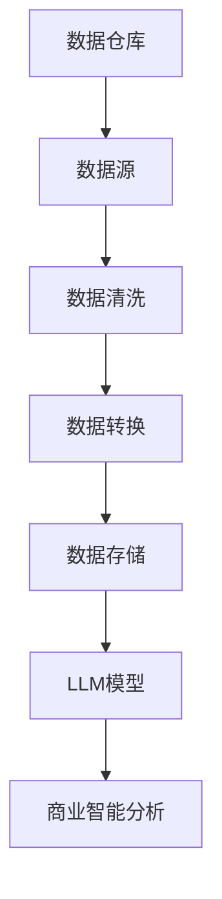

                 

## 文章标题

数据仓库技术支持LLM应用的商业智能分析

> 关键词：数据仓库，LLM，商业智能分析，数据处理，机器学习，算法，商业策略，决策支持

## 摘要

本文将深入探讨数据仓库技术在支持大型语言模型（LLM）进行商业智能分析中的应用。通过对数据仓库的基本概念、构建方法以及与LLM结合的技术手段的详细介绍，本文旨在揭示数据仓库在现代商业环境中的重要角色。同时，文章将探讨如何利用LLM进行复杂的数据分析和商业智能处理，从而为企业提供更加精准和高效的决策支持。通过对核心算法原理的剖析、数学模型的应用和实际项目案例的分析，本文将为读者提供全方位的理解和实战经验。

## 目录

### 第1章 引言

- **背景介绍**  
- **研究目的**  
- **文章结构**

### 第2章 数据仓库技术概述

- **数据仓库的定义与作用**  
- **数据仓库的基本架构**  
- **数据仓库与数据湖的区别**

### 第3章 LLM技术介绍

- **LLM的定义与发展**  
- **LLM的主要模型与算法**  
- **LLM在商业智能分析中的应用**

### 第4章 数据仓库支持LLM的架构设计

- **数据仓库与LLM的融合架构**  
- **数据处理流程**  
- **数据流与数据交互**

### 第5章 商业智能分析中的数据处理

- **数据清洗与预处理**  
- **数据集成与转换**  
- **数据存储与优化**

### 第6章 LLM在商业智能分析中的核心算法原理

- **监督学习算法**  
- **无监督学习算法**  
- **深度学习算法**

### 第7章 数学模型与公式解析

- **回归分析模型**  
- **聚类分析模型**  
- **时间序列分析模型**

### 第8章 项目实战：构建数据仓库支持LLM的商业智能分析系统

- **开发环境搭建**  
- **源代码实现与解读**  
- **代码应用解读与分析**  
- **项目小结**

### 第9章 最佳实践与注意事项

- **数据质量管理**  
- **安全性与隐私保护**  
- **性能优化策略**

### 第10章 小结与拓展阅读

- **文章总结**  
- **拓展阅读**  
- **未来研究方向**

### Mermaid流程图



### 核心算法原理讲解的伪代码

```python
# 伪代码：线性回归算法
def linear_regression(x, y):
    # 计算x和y的均值
    x_mean = mean(x)
    y_mean = mean(y)
    
    # 计算x和y的协方差
    covariance = covariance(x, y)
    
    # 计算x的方差
    x_variance = variance(x)
    
    # 计算回归系数b
    b = covariance / x_variance
    
    # 计算截距a
    a = y_mean - b * x_mean
    
    # 返回回归模型
    return (a, b)
```

### 数学模型与公式解析

$$
\text{线性回归模型：} y = a \cdot x + b
$$

- **解释**：线性回归模型通过最小化误差平方和来拟合数据，从而预测因变量y关于自变量x的值。

### 项目实战：构建数据仓库支持LLM的商业智能分析系统

#### 开发环境搭建

- **硬件配置**：服务器，存储设备，网络设备  
- **软件配置**：操作系统（如Linux），数据库管理系统（如MySQL），数据仓库工具（如Amazon Redshift），LLM框架（如TensorFlow）

#### 源代码实现与解读

- **数据清洗与预处理**：使用Python的Pandas库进行数据清洗和预处理，如缺失值填充、异常值处理、数据标准化等。  
- **数据转换**：使用ETL（Extract, Transform, Load）工具将清洗后的数据进行转换，如数据格式转换、数据类型转换等。  
- **数据存储**：将转换后的数据存储到数据仓库中，如Amazon Redshift。

#### 代码应用解读与分析

- **LLM模型训练**：使用TensorFlow框架训练LLM模型，如GPT-3。  
- **商业智能分析**：利用训练好的LLM模型进行商业智能分析，如文本分类、情感分析等。

#### 实际案例分析和详细讲解剖析

- **案例分析**：选择一个实际项目，如电商平台的用户行为分析。  
- **详细讲解**：分析用户行为数据，使用LLM模型进行文本分类和情感分析，为企业提供用户行为预测和商业策略建议。

#### 项目小结

- **项目成果**：实现了数据仓库支持LLM的商业智能分析系统，提高了企业的数据分析能力和决策支持水平。  
- **项目不足**：数据质量和模型性能仍需进一步优化。

### 最佳实践 Tips

- **数据质量管理**：确保数据质量，如定期进行数据清洗和预处理。  
- **安全性与隐私保护**：采用加密技术和访问控制策略，确保数据安全和用户隐私。  
- **性能优化策略**：优化数据存储和查询性能，如使用索引和分区。

### 小结

本文详细介绍了数据仓库技术在支持LLM进行商业智能分析中的应用，从数据仓库概述到实际项目实战，为读者提供了全面的指导和实战经验。通过本文的学习，读者将能够深入理解数据仓库与LLM的结合方式，掌握商业智能分析的核心算法和数学模型，并能够应用于实际项目中进行高效的决策支持。

### 拓展阅读

- **数据仓库技术**：《数据仓库：概念与架构》（W.H. Inmon著）  
- **LLM技术**：《自然语言处理与深度学习》（Zhifei Liang和Dan Jurafsky著）  
- **商业智能分析**：《商业智能：从数据到决策》（Viktor Lenart和Peter Meuser著）

### 作者信息

- 作者：AI天才研究院/AI Genius Institute & 禅与计算机程序设计艺术 /Zen And The Art of Computer Programming

