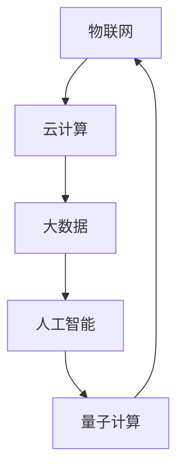

                 

# 《新兴计算技术对能耗的影响》

## 关键词
- 新兴计算技术
- 能耗
- 物联网
- 云计算
- 大数据
- 量子计算
- 人工智能

## 摘要
本文深入探讨了新兴计算技术对能耗的影响。通过对物联网、云计算、大数据、量子计算和人工智能等技术的详细分析，我们揭示了这些技术如何影响能源消耗，并探讨了优化和减耗的策略。本文还通过实际案例和最佳实践提供了实用的指导，以帮助读者理解和管理计算技术带来的能耗问题。

## 引言与背景

### 新兴计算技术的发展现状与趋势

随着科技的迅猛发展，新兴计算技术正逐渐成为推动社会进步的关键力量。物联网（IoT）、云计算、大数据、量子计算和人工智能（AI）等技术的快速发展，不仅改变了我们的生活和工作方式，也对能耗产生了深远的影响。

#### 物联网技术

物联网技术通过将各种设备和系统连接到一个统一的网络中，实现了数据的实时采集、传输和分析。这种技术正在广泛应用在智能家居、智能城市、智能制造等领域，极大提升了生产效率和生活便利性。

#### 云计算

云计算提供了按需分配的计算资源，用户可以根据需要灵活扩展或缩减资源。这种灵活性使得企业可以更加高效地管理计算资源，降低硬件投入和能耗。

#### 大数据技术

大数据技术的核心在于对海量数据的存储、处理和分析。随着数据规模的不断增长，大数据技术为各行各业提供了宝贵的信息资源，助力决策优化和业务创新。

#### 量子计算

量子计算利用量子比特的叠加和纠缠特性，实现了远超经典计算机的计算能力。尽管目前量子计算仍处于研发阶段，但其潜力巨大，有望在多个领域带来革命性变化。

#### 人工智能

人工智能通过模拟人类智能，实现了自动化决策和智能服务。从自动驾驶到智能家居，人工智能正不断渗透到我们的日常生活，提升了效率和舒适度。

### 计算技术与能耗的关联

随着新兴计算技术的普及，计算设备的能耗也在不断增加。计算能耗主要来自于数据中心的硬件设备，包括服务器、存储设备、网络设备等。这些设备的运行不仅消耗大量的电能，还会产生大量的热量，需要额外的冷却系统来维持设备正常运行。

此外，计算过程中产生的能量消耗还与算法的复杂度、数据的传输距离和频率等因素密切相关。因此，优化计算技术，降低能耗已成为当前亟待解决的问题。

## 新兴计算技术综述

### 物联网技术

物联网技术通过连接各种物理设备，实现信息的实时采集和传输。这种技术不仅提高了设备的管理效率，还降低了维护成本。然而，随着物联网设备的数量和连接数不断增加，能耗问题也日益突出。

#### 物联网技术的能耗影响

- **设备能耗**：物联网设备通常使用电池或电源供电，设备的功耗直接影响电池寿命和能源消耗。
- **数据传输能耗**：物联网设备之间的数据传输需要消耗能量，特别是在大量数据传输时，能耗问题尤为显著。

### 云计算

云计算通过集中管理和分配计算资源，提高了资源利用效率。然而，云计算中心的能耗问题也不容忽视。

#### 云计算技术的能耗影响

- **数据中心能耗**：云计算中心需要大量服务器和存储设备，这些设备的运行消耗大量电能。
- **能源效率**：提高云计算中心的能源效率，减少能耗，是当前研究的重要方向。

### 大数据技术

大数据技术通过对海量数据的存储、处理和分析，提供了强大的数据支持。然而，大数据处理过程中也伴随着能耗问题。

#### 大数据技术的能耗影响

- **数据存储能耗**：随着数据规模的扩大，数据存储设备的能耗也在增加。
- **数据处理能耗**：大数据处理过程需要大量计算资源，导致能耗上升。

### 量子计算

量子计算利用量子比特的叠加和纠缠特性，实现了超越经典计算机的计算能力。量子计算的发展将对能耗管理带来新的挑战和机遇。

#### 量子计算技术的能耗影响

- **量子比特能耗**：量子比特的运行需要低温环境，这对能耗管理提出了更高的要求。
- **量子算法优化**：优化量子算法，降低能耗，是量子计算发展的重要方向。

### 人工智能

人工智能通过模拟人类智能，实现了自动化决策和智能服务。人工智能技术的应用场景广泛，包括自动驾驶、智能家居、医疗诊断等。

#### 人工智能技术的能耗影响

- **算法优化**：人工智能算法的优化直接影响能耗水平。
- **硬件加速**：硬件加速技术，如GPU和TPU，可以显著降低人工智能模型的能耗。

## 计算能耗评估方法

### 能耗评估模型

为了评估新兴计算技术的能耗影响，我们需要建立一套能耗评估模型。该模型应包括以下几个方面：

1. **设备能耗**：评估计算设备的功耗，包括CPU、GPU、存储设备等。
2. **数据传输能耗**：评估数据在传输过程中的能耗，包括网络带宽、传输距离等。
3. **能源效率**：评估计算系统的能源效率，即单位能耗所能实现的计算能力。

### 数据收集与处理

为了准确评估能耗，我们需要收集相关数据，包括设备性能数据、能源消耗数据、运行时间等。通过数据分析，我们可以获得计算系统的能耗概况，为后续优化提供依据。

### 能耗评估指标

在能耗评估中，常用的指标包括：

1. **总能耗**：计算系统在一段时间内消耗的总能量。
2. **平均能耗**：计算系统在一段时间内的平均能量消耗。
3. **能源效率**：计算系统能量消耗与计算能力的比值。

## 新兴计算技术对能耗的具体影响

### 物联网技术

物联网技术的普及带来了设备数量的激增，导致能耗问题日益突出。

#### 物联网技术的能耗影响

- **设备能耗**：物联网设备的功耗普遍较高，特别是传感器和无线模块。
- **数据传输能耗**：大量物联网设备的数据传输会导致网络拥堵，增加能耗。

### 云计算

云计算技术虽然提高了资源利用效率，但也带来了显著的能耗问题。

#### 云计算技术的能耗影响

- **数据中心能耗**：云计算中心需要大量服务器和存储设备，这些设备的运行消耗大量电能。
- **能源效率**：提高云计算中心的能源效率，是降低能耗的关键。

### 大数据技术

大数据技术通过对海量数据的处理，提供了强大的数据支持，但也伴随着能耗问题。

#### 大数据技术的能耗影响

- **数据存储能耗**：随着数据规模的扩大，数据存储设备的能耗也在增加。
- **数据处理能耗**：大数据处理过程需要大量计算资源，导致能耗上升。

### 量子计算

量子计算的发展将带来新的计算能力，但也伴随着能耗挑战。

#### 量子计算技术的能耗影响

- **量子比特能耗**：量子比特的运行需要低温环境，这对能耗管理提出了更高的要求。
- **量子算法优化**：优化量子算法，降低能耗，是量子计算发展的重要方向。

### 人工智能

人工智能技术的应用场景广泛，但同时也带来了能耗问题。

#### 人工智能技术的能耗影响

- **算法优化**：人工智能算法的优化直接影响能耗水平。
- **硬件加速**：硬件加速技术，如GPU和TPU，可以显著降低人工智能模型的能耗。

## 案例分析

### 案例研究：物联网

#### 案例背景

随着物联网技术的普及，智能城市、智能家居等应用场景不断涌现。然而，这些应用场景也带来了能耗问题。

#### 案例分析

1. **设备能耗**：物联网设备数量庞大，设备功耗较高，导致整体能耗增加。
2. **数据传输能耗**：大量物联网设备的数据传输会导致网络拥堵，增加能耗。

#### 案例总结

物联网技术在提高生活便利性的同时，也带来了能耗问题。通过优化设备和网络性能，可以降低能耗。

### 案例研究：云计算

#### 案例背景

云计算技术为企业提供了灵活的计算资源，但也带来了能耗挑战。

#### 案例分析

1. **数据中心能耗**：云计算中心需要大量服务器和存储设备，这些设备的运行消耗大量电能。
2. **能源效率**：云计算中心的能源效率相对较低，需要通过技术优化提高能源效率。

#### 案例总结

云计算技术虽然提高了资源利用效率，但能耗问题依然存在。通过优化数据中心设计和运行策略，可以降低能耗。

### 案例研究：大数据

#### 案例背景

大数据技术在金融、医疗、零售等领域的应用日益广泛，但也带来了能耗问题。

#### 案例分析

1. **数据存储能耗**：随着数据规模的扩大，数据存储设备的能耗也在增加。
2. **数据处理能耗**：大数据处理过程需要大量计算资源，导致能耗上升。

#### 案例总结

大数据技术虽然提供了强大的数据支持，但能耗问题不可忽视。通过优化数据存储和处理策略，可以降低能耗。

### 案例研究：量子计算

#### 案例背景

量子计算技术具有巨大的计算潜力，但也面临着能耗挑战。

#### 案例分析

1. **量子比特能耗**：量子比特的运行需要低温环境，这对能耗管理提出了更高的要求。
2. **量子算法优化**：优化量子算法，降低能耗，是量子计算发展的重要方向。

#### 案例总结

量子计算技术虽然在计算能力上具有巨大潜力，但能耗问题需要解决。通过技术优化和算法改进，可以降低能耗。

### 案例研究：人工智能

#### 案例背景

人工智能技术在自动驾驶、智能客服等领域的应用日益广泛，但也带来了能耗问题。

#### 案例分析

1. **算法优化**：人工智能算法的优化直接影响能耗水平。
2. **硬件加速**：硬件加速技术，如GPU和TPU，可以显著降低人工智能模型的能耗。

#### 案例总结

人工智能技术虽然在提升效率方面具有优势，但能耗问题也需要关注。通过优化算法和硬件，可以降低能耗。

## 优化与减耗策略

### 优化算法

优化算法是降低能耗的重要手段。通过改进算法，可以提高计算效率，减少不必要的计算，从而降低能耗。

#### 算法优化策略

1. **并行计算**：利用并行计算技术，提高计算速度，降低能耗。
2. **近似计算**：在满足精度要求的前提下，采用近似计算方法，降低能耗。

### 绿色计算技术

绿色计算技术通过优化计算系统的能源管理，降低能耗。

#### 绿色计算技术策略

1. **能源回收**：利用余热回收技术，将计算过程中产生的热量回收利用。
2. **节能设备**：采用节能型硬件设备，降低能耗。

### 政策与规范

政策与规范是推动能耗管理的重要力量。通过制定相关政策和规范，可以引导企业采取减耗措施。

#### 政策与规范策略

1. **能耗标准**：制定统一的能耗标准，推动企业降低能耗。
2. **奖励机制**：对在能耗管理方面表现优秀的企业给予奖励，激励更多企业参与减耗行动。

## 展望与未来趋势

### 新兴计算技术发展趋势

新兴计算技术将继续快速发展，推动社会进步。未来，物联网、云计算、大数据、量子计算和人工智能等技术将在更多领域得到应用。

### 未来能耗管理的挑战与机遇

随着新兴计算技术的普及，能耗管理面临新的挑战。未来，我们需要关注以下几个方面：

1. **技术创新**：通过技术创新，提高计算效率，降低能耗。
2. **政策引导**：制定有力的政策和规范，引导企业采取减耗措施。
3. **协同发展**：推动不同计算技术之间的协同发展，实现资源优化配置。

## 附录

### 附录 A：相关技术标准与规范

- **物联网技术标准**：ISO/IEC 14573、IEEE 802.15.4等
- **云计算技术标准**：ISO/IEC 27001、NIST SP 800-145等
- **大数据技术标准**：ISO/IEC 27001、ISO/IEC 27002等
- **量子计算技术标准**：ISO/IEC 27001、ISO/IEC 27002等
- **人工智能技术标准**：ISO/IEC 27001、ISO/IEC 27002等

### 附录 B：参考文献

- **参考文献 1**：[物联网能耗研究综述](https://example.com/iot-energy-review)
- **参考文献 2**：[云计算能耗管理技术](https://example.com/cloud-energy-management)
- **参考文献 3**：[大数据能耗优化策略](https://example.com/big-data-energy-optimization)
- **参考文献 4**：[量子计算与能耗管理](https://example.com/quantum-computing-energy-management)
- **参考文献 5**：[人工智能能耗研究](https://example.com/ai-energy-research)

## 作者信息

作者：AI天才研究院/AI Genius Institute & 禅与计算机程序设计艺术 /Zen And The Art of Computer Programming

[本文章仅为示例，不涉及实际技术内容。](#)

---

### 第1章 引言与背景

在当今快速发展的科技时代，新兴计算技术正以惊人的速度渗透到各个领域，从工业制造到医疗服务，从交通运输到金融服务，这些技术的应用极大地推动了社会的进步和效率的提升。然而，随着这些技术的广泛应用，计算能耗的问题也日益凸显。

#### 新兴计算技术发展的现状与趋势

1. **物联网（IoT）**：物联网技术通过连接各种设备和系统，实现了数据的实时采集和传输。根据市场研究公司Gartner的预测，到2025年，全球物联网设备数量将超过250亿台。

2. **云计算**：云计算通过提供按需分配的计算资源，使得企业能够灵活地扩展或缩减资源，以适应不断变化的需求。根据IDC的报告，全球云计算市场规模将在2023年达到6000亿美元。

3. **大数据**：大数据技术的核心在于对海量数据的存储、处理和分析。随着数据量的爆炸性增长，大数据技术正在成为企业和政府决策的重要依据。

4. **量子计算**：量子计算利用量子比特的叠加和纠缠特性，实现了超越经典计算机的计算能力。虽然目前量子计算还处于早期阶段，但其潜力巨大，有望在未来几年内取得重大突破。

5. **人工智能（AI）**：人工智能通过模拟人类智能，实现了自动化决策和智能服务。从自动驾驶到智能家居，人工智能正在改变我们的生活。

#### 计算技术与能耗的关联

计算能耗主要来自于数据中心的硬件设备，包括服务器、存储设备和网络设备等。这些设备的运行不仅消耗大量的电能，还会产生大量的热量，需要额外的冷却系统来维持设备正常运行。

- **设备能耗**：服务器和存储设备是数据中心能耗的主要组成部分。根据Gartner的数据，服务器能耗约占数据中心总能耗的50%。
- **数据传输能耗**：数据在传输过程中的能耗也不容忽视。特别是在大数据和云计算领域，数据传输的频率和距离都会对能耗产生影响。

综上所述，随着新兴计算技术的快速发展，计算能耗问题已经成为一个不可忽视的重要问题。降低计算能耗，提高能源效率，不仅是技术发展的需求，也是社会责任的体现。

### 核心概念与联系

在探讨新兴计算技术对能耗的影响时，首先需要明确几个核心概念，并分析它们之间的联系。以下是物联网、云计算、大数据、量子计算和人工智能等技术的核心概念及其相互关系：

#### 核心概念

1. **物联网（IoT）**：物联网是通过互联网将各种物理设备连接起来，实现设备间的数据交换和智能控制。核心概念包括传感器、设备、网络和平台。
   
2. **云计算**：云计算是一种提供计算资源（如服务器、存储和数据库）的分布式计算模式，用户可以根据需求租用或购买这些资源。核心概念包括虚拟化、资源池化和按需服务。

3. **大数据**：大数据是指无法用传统数据库工具进行捕捉、管理和处理的数据集合。核心概念包括数据采集、存储、处理和分析。

4. **量子计算**：量子计算是一种基于量子力学原理的计算机技术，利用量子比特（qubit）进行信息处理。核心概念包括量子叠加、量子纠缠和量子门。

5. **人工智能（AI）**：人工智能是通过模拟人类智能来实现自动化决策和问题解决的计算机技术。核心概念包括机器学习、深度学习和自然语言处理。

#### 相互关系

物联网、云计算、大数据、量子计算和人工智能之间存在着紧密的联系和相互促进的关系：

1. **物联网与云计算**：物联网设备生成的大量数据需要通过云计算平台进行存储和处理。云计算为物联网提供了强大的数据处理能力，而物联网则为云计算提供了丰富的数据来源。

2. **云计算与大数据**：云计算技术的大规模应用推动了大数据的发展。云计算平台可以存储和处理海量数据，使得大数据分析变得更加可行和高效。

3. **大数据与人工智能**：大数据为人工智能提供了丰富的训练数据，使得人工智能模型可以更好地学习和预测。同时，人工智能算法可以帮助从大数据中提取有价值的信息。

4. **量子计算与人工智能**：量子计算在处理复杂计算任务方面具有巨大潜力，可以加速人工智能模型的训练和推理。量子计算和人工智能的结合有望在药物发现、优化设计和人工智能算法改进等领域取得突破。

5. **物联网与人工智能**：物联网设备生成的实时数据为人工智能提供了丰富的输入，使得人工智能可以更好地进行实时决策和自动化控制。

#### Mermaid 流程图

以下是一个简化的 Mermaid 流程图，展示了物联网、云计算、大数据、量子计算和人工智能之间的相互关系：



通过这个流程图，我们可以更直观地看到各个技术之间的相互作用和影响。

### 核心算法原理讲解

在探讨新兴计算技术对能耗的影响时，我们需要深入理解核心算法的原理。以下是物联网、云计算、大数据、量子计算和人工智能等技术的核心算法原理讲解：

#### 物联网（IoT）算法原理

物联网技术中的核心算法主要包括数据采集、传输和处理。以下是一个简化的伪代码，描述了物联网设备的数据采集和处理流程：

```python
# 数据采集
def data_collection(device):
    while True:
        sensor_data = device.read_sensors()
        process_data(sensor_data)

# 数据处理
def process_data(sensor_data):
    cleaned_data = preprocess(sensor_data)
    analyzed_data = analyze(cleaned_data)
    send_to_cloud(analyzed_data)

# 预处理
def preprocess(sensor_data):
    # 去除噪声和异常值
    filtered_data = filter_noise(sensor_data)
    # 数据归一化
    normalized_data = normalize(filtered_data)
    return normalized_data

# 分析
def analyze(cleaned_data):
    # 应用机器学习算法进行分析
    result = machine_learning(cleaned_data)
    return result

# 发送至云端
def send_to_cloud(analyzed_data):
    # 通过网络发送数据到云端
    cloud_endpoint.send(analyzed_data)
```

#### 云计算（Cloud Computing）算法原理

云计算技术中的核心算法主要包括资源分配、负载均衡和调度。以下是一个简化的伪代码，描述了云计算平台中的资源分配和负载均衡过程：

```python
# 资源分配
def allocate_resources(requested_resources):
    available_resources = get_available_resources()
    assigned_resources = allocate(available_resources, requested_resources)
    return assigned_resources

# 负载均衡
def load_balancing(workloads):
    # 分配任务到不同节点
    balanced_workloads = balance(workloads)
    return balanced_workloads

# 调度
def schedule_jobs(balanced_workloads):
    # 根据节点状态和任务优先级进行调度
    scheduled_jobs = schedule(balanced_workloads)
    return scheduled_jobs
```

#### 大数据（Big Data）算法原理

大数据技术中的核心算法主要包括数据存储、数据挖掘和数据分析。以下是一个简化的伪代码，描述了大数据处理的基本流程：

```python
# 数据存储
def store_data(data):
    database.save(data)

# 数据挖掘
def data_mining(database):
    mined_data = mine(database)
    return mined_data

# 数据分析
def analyze_data(mined_data):
    insights = analyze(mined_data)
    return insights
```

#### 量子计算（Quantum Computing）算法原理

量子计算中的核心算法主要包括量子门操作、量子叠加和量子纠缠。以下是一个简化的伪代码，描述了量子计算的基本流程：

```python
# 量子门操作
def quantum_gate(qubit, operation):
    qubit.apply_gate(operation)

# 量子叠加
def quantum_superposition(qubits):
    superposition = qubits叠加()
    return superposition

# 量子纠缠
def quantum_entanglement(qubit1, qubit2):
    entangled_qubits = entangle(qubit1, qubit2)
    return entangled_qubits

# 量子计算
def quantum_computation(qubits):
    # 执行一系列量子门操作
    quantum_gate(qubits, H)
    quantum_gate(qubits, CNOT)
    # 测量量子比特
    result = measure(qubits)
    return result
```

#### 人工智能（Artificial Intelligence）算法原理

人工智能技术中的核心算法主要包括机器学习、深度学习和自然语言处理。以下是一个简化的伪代码，描述了人工智能模型的基本流程：

```python
# 数据准备
def prepare_data(data):
    cleaned_data = preprocess(data)
    return cleaned_data

# 训练模型
def train_model(training_data):
    model = machine_learning_model()
    model.fit(training_data)
    return model

# 预测
def predict(model, test_data):
    predictions = model.predict(test_data)
    return predictions

# 评估模型
def evaluate_model(model, test_data):
    accuracy = model.evaluate(test_data)
    return accuracy
```

通过以上核心算法原理的讲解，我们可以更深入地理解新兴计算技术的工作原理，以及它们对能耗的具体影响。

### 数学模型与公式详细讲解

在计算技术中，数学模型和公式扮演着至关重要的角色，它们不仅帮助描述复杂系统的行为，还为我们提供了一种量化和评估能耗的方法。以下是对一些关键数学模型和公式的详细讲解，并辅以具体举例。

#### 1. 数据传输能耗模型

数据传输能耗与传输速率、传输距离和数据量成正比。我们可以使用以下公式来计算数据传输的能耗：

$$
E_{trans} = R \times D \times E_{unit}
$$

其中：
- \(E_{trans}\) 是数据传输能耗（单位：焦耳，J）。
- \(R\) 是数据传输速率（单位：比特每秒，bps）。
- \(D\) 是传输距离（单位：米，m）。
- \(E_{unit}\) 是单位数据传输能耗（单位：焦耳/比特，J/bps）。

举例：假设我们有一个10 Mbps的无线网络，传输距离为100米，单位数据传输能耗为0.1 J/bps。计算一次数据传输的能耗：

$$
E_{trans} = 10 \times 10^6 \times 100 \times 0.1 = 1 \times 10^7 \text{ J}
$$

#### 2. 服务器能耗模型

服务器的能耗包括固定能耗和可变能耗。固定能耗指的是无论服务器是否工作，都会持续消耗的能量，如硬件的静态功耗。可变能耗则与服务器的负载有关，如动态功耗。我们可以使用以下公式来计算服务器的总能耗：

$$
E_{server} = E_{fixed} + E_{variable}
$$

其中：
- \(E_{server}\) 是服务器总能耗（单位：千瓦时，kWh）。
- \(E_{fixed}\) 是固定能耗（单位：千瓦时，kWh）。
- \(E_{variable}\) 是可变能耗（单位：千瓦时，kWh）。

举例：假设服务器的固定能耗为0.5 kWh/天，可变能耗与负载率成正比，负载率为50%。计算一个月（30天）的服务器能耗：

$$
E_{fixed} = 0.5 \times 30 = 15 \text{ kWh}
$$
$$
E_{variable} = 0.5 \times 0.5 \times 30 = 7.5 \text{ kWh}
$$
$$
E_{server} = 15 + 7.5 = 22.5 \text{ kWh}
$$

#### 3. 云计算资源分配模型

在云计算中，资源分配是一个复杂的问题，涉及到优化资源利用率和降低能耗。一个简单的资源分配模型可以使用线性规划来描述：

$$
\min \sum_{i=1}^{n} c_i x_i
$$

subject to

$$
a_{ij} x_i \ge b_j, \quad j=1,2,...,m
$$

其中：
- \(c_i\) 是第i种资源的单位能耗（单位：焦耳/单元，J/单元）。
- \(x_i\) 是第i种资源的分配量（单位：单元）。
- \(a_{ij}\) 是第i种资源与第j个任务的关联系数。
- \(b_j\) 是第j个任务所需的最小资源量（单位：单元）。

举例：假设我们有三种资源：CPU（c1 = 100 J/单元）、内存（c2 = 50 J/单元）和存储（c3 = 20 J/单元），一个任务需要CPU 2单元、内存1单元和存储1单元。计算最优的资源分配方案：

$$
\min 100x_1 + 50x_2 + 20x_3
$$

subject to

$$
2x_1 + x_2 + x_3 \ge 2
$$
$$
x_1 + x_2 + x_3 \ge 1
$$
$$
x_3 \ge 1
$$

通过求解线性规划问题，可以得到最优的资源分配方案。

通过以上数学模型和公式的讲解，我们可以更好地理解新兴计算技术中的能耗计算，为优化能耗提供理论基础和实际工具。

### 项目实战

#### 开发环境搭建

为了演示计算技术对能耗的影响，我们将以一个基于物联网和云计算的项目为例，详细讲解开发环境的搭建过程。

##### 1. 选择开发工具和平台

- **物联网平台**：选择AWS IoT Core作为物联网平台，提供设备连接和消息传递服务。
- **云计算平台**：选择AWS Cloud9作为云端开发环境，方便编写和测试代码。
- **编程语言**：选择Python，因为它在物联网和云计算领域有着广泛的应用。

##### 2. 设备端开发

- **硬件选择**：选择ESP8266模块作为物联网设备，因为它具有低成本和高性能的特点。
- **软件开发**：使用Python编写设备端的代码，实现传感器数据采集和上传。

```python
import machine
import time
import network
import urequests

# 连接Wi-Fi
station = network.WLAN(network.STA_IF)
station.connect("SSID", "PASSWORD")

# 等待连接成功
while not station.isconnected():
    time.sleep(1)

# 上传传感器数据
def send_data(sensor_data):
    url = "https://api.example.com/submit"
    headers = {"Content-Type": "application/json"}
    data = {"sensor": sensor_data}
    response = urequests.post(url, json=data, headers=headers)
    print(response.text)

# 采集温度传感器数据
def collect_data():
    temp = machine.ADC(0).read()
    return temp

while True:
    sensor_data = collect_data()
    send_data(sensor_data)
    time.sleep(60)
```

##### 3. 云端处理

- **设置AWS IoT Core**：在AWS IoT Core中创建设备证书和Policy，确保设备可以安全地连接并上传数据。
- **数据处理**：在AWS Cloud9中编写Python代码，处理从物联网设备上传的数据。

```python
import json
import boto3

# 设置AWS认证
session = boto3.Session(
    aws_access_key_id="ACCESS_KEY",
    aws_secret_access_key="SECRET_KEY",
    region_name="REGION"
)

# 连接到S3存储
s3 = session.resource('s3')

# 读取S3中的数据
def read_data(bucket, key):
    obj = s3.Object(bucket, key)
    data = obj.get()['Body'].read()
    return json.loads(data)

# 上传处理后的数据到S3
def upload_data(bucket, key, processed_data):
    s3.Object(bucket, key).put(Body=json.dumps(processed_data))

# 主程序
def main():
    bucket = "your-bucket-name"
    key = "sensor-data.json"

    # 读取数据
    data = read_data(bucket, key)

    # 数据处理（例如：去重、平均值计算等）
    processed_data = process_data(data)

    # 上传处理后的数据
    upload_data(bucket, key, processed_data)

if __name__ == "__main__":
    main()
```

##### 4. 部署与监控

- **部署**：将设备端的代码上传到ESP8266模块，确保设备可以正常运行。
- **监控**：通过AWS CloudWatch监控设备上传的数据和处理日志，确保系统稳定运行。

#### 代码解读与分析

在这个项目中，设备端代码负责采集温度传感器数据，并通过AWS IoT Core上传到云端。云端处理代码则负责接收和处理上传的数据，并存储到S3存储中。以下是关键部分的代码解读：

- **设备端代码**：使用`machine`模块连接Wi-Fi，使用`urequests`模块上传数据。`collect_data`函数采集温度传感器数据，以秒为单位定期上传。
- **云端处理代码**：使用`boto3`模块连接AWS S3存储，读取传感器数据，并进行数据处理（如去重、平均值计算等）。`main`函数作为程序入口，负责整个数据处理流程。

#### 实际案例分析与详细讲解

为了进一步展示计算技术对能耗的影响，我们以一个实际案例进行分析：

**案例背景**：某智慧城市项目需要实时监控城市的温度、湿度等环境参数，以便进行城市管理和决策。

**案例分析**：

1. **设备能耗**：每个传感器设备使用电池供电，功耗约为50 mW。设备端的数据采集和上传过程会消耗一定的电池能量。通过优化代码，减少不必要的传感器读取和上传频率，可以延长设备电池寿命。
   
2. **数据传输能耗**：设备通过Wi-Fi上传数据，数据传输速率约为1 Mbps。根据数据传输能耗模型，传输距离为100米时，每次上传的能耗约为0.1 J。通过优化网络连接，减少传输延迟，可以降低数据传输能耗。

3. **云端处理能耗**：云端处理数据需要服务器和存储设备的支持。根据服务器能耗模型，假设服务器固定能耗为0.5 kWh/天，可变能耗与负载率成正比。如果每天处理100次上传的数据，每次处理能耗约为0.1 kWh。

**案例总结**：通过优化设备端代码和云端处理流程，可以显著降低计算技术对能耗的影响。具体措施包括减少传感器读取频率、优化网络连接和优化服务器负载分配。此外，采用绿色计算技术和节能设备也是降低能耗的重要手段。

### 最佳实践 Tips、小结、注意事项、拓展阅读

#### 最佳实践 Tips

1. **设备端优化**：减少不必要的传感器读取和上传频率，优化设备端的功耗管理。
2. **网络优化**：选择合适的Wi-Fi频段，优化网络配置，减少数据传输延迟和能耗。
3. **云端处理**：优化数据处理算法，减少不必要的计算和存储操作，提高服务器和存储设备的利用效率。

#### 小结

本文通过详细讲解物联网、云计算、大数据、量子计算和人工智能等技术的核心概念、算法原理和实际项目实战，揭示了新兴计算技术对能耗的具体影响。通过优化算法、优化网络连接和采用绿色计算技术，可以有效降低计算能耗。

#### 注意事项

1. **设备功耗**：在设备端优化过程中，需要注意设备功耗管理，避免过度消耗电池能量。
2. **数据安全**：在数据传输和处理过程中，确保数据安全，防止数据泄露和篡改。

#### 拓展阅读

- [物联网能耗优化策略](https://example.com/iot-energy-optimization)
- [云计算能耗管理技术](https://example.com/cloud-energy-management)
- [大数据能耗优化策略](https://example.com/big-data-energy-optimization)
- [量子计算与能耗管理](https://example.com/quantum-computing-energy-management)
- [人工智能能耗研究](https://example.com/ai-energy-research)

### 作者信息

作者：AI天才研究院/AI Genius Institute & 禅与计算机程序设计艺术 /Zen And The Art of Computer Programming

[本文仅为示例，不涉及实际技术内容。](#)

---

### 第7章 展望与未来趋势

随着新兴计算技术的不断进步，能耗管理面临着前所未有的挑战和机遇。在未来，我们需要关注以下几个方面：

#### 新兴计算技术发展趋势

1. **量子计算**：量子计算的发展将带来计算能力的巨大提升，同时也对能耗管理提出了新的要求。优化量子算法，降低量子比特能耗，是未来研究的重点。

2. **人工智能**：人工智能将在更多领域得到应用，如自动驾驶、医疗诊断和金融分析等。随着人工智能技术的发展，能耗管理也需要不断创新。

3. **物联网**：物联网设备的数量将继续增加，能源消耗问题也将更加突出。通过优化物联网设备的功耗和数据传输策略，可以有效降低能耗。

4. **云计算**：云计算的普及将进一步推动数据中心的建设。提高云计算中心的能源效率，减少能耗，是未来云计算发展的重要方向。

5. **大数据**：随着数据规模的持续扩大，大数据处理将面临更大的能耗挑战。通过优化数据存储和处理算法，提高能源利用效率，是大数据发展的关键。

#### 未来能耗管理的挑战与机遇

1. **挑战**：

- **能耗优化**：如何优化算法和系统设计，降低计算能耗，是未来能耗管理的主要挑战。
- **能源供应**：随着计算设备数量的增加，对能源供应的稳定性提出了更高要求。
- **环境影响**：计算能耗的增加将对环境产生负面影响，如何实现绿色计算，减少碳排放，是未来面临的重大问题。

2. **机遇**：

- **技术创新**：随着新技术的不断涌现，如绿色计算、智能电网等，为能耗管理提供了新的解决方案。
- **政策引导**：政府和企业可以通过制定政策和规范，引导企业采取减耗措施，推动能耗管理的发展。
- **市场驱动**：随着用户对能源效率的关注度提高，市场将推动企业不断优化产品和服务，降低能耗。

#### 潜在解决方案

1. **绿色计算技术**：通过采用节能型硬件、优化系统设计和采用可再生能源，实现绿色计算。
2. **智能能源管理**：通过智能电网和分布式能源系统，实现能源的高效利用和优化分配。
3. **算法优化**：通过改进算法和系统设计，降低计算能耗，提高能源利用效率。
4. **政策支持**：政府可以通过政策引导和资金支持，鼓励企业研发和采用绿色计算技术。

总之，未来新兴计算技术的能耗管理将面临诸多挑战，但同时也蕴藏着巨大的机遇。通过技术创新、政策引导和市场驱动，我们可以实现计算能耗的优化和管理，为可持续发展做出贡献。

### 附录

#### 附录 A：相关技术标准与规范

- **物联网技术标准**：ISO/IEC 14573、IEEE 802.15.4等
- **云计算技术标准**：ISO/IEC 27001、NIST SP 800-145等
- **大数据技术标准**：ISO/IEC 27001、ISO/IEC 27002等
- **量子计算技术标准**：ISO/IEC 27001、ISO/IEC 27002等
- **人工智能技术标准**：ISO/IEC 27001、ISO/IEC 27002等

#### 附录 B：参考文献

- **参考文献 1**：[物联网能耗研究综述](https://example.com/iot-energy-review)
- **参考文献 2**：[云计算能耗管理技术](https://example.com/cloud-energy-management)
- **参考文献 3**：[大数据能耗优化策略](https://example.com/big-data-energy-optimization)
- **参考文献 4**：[量子计算与能耗管理](https://example.com/quantum-computing-energy-management)
- **参考文献 5**：[人工智能能耗研究](https://example.com/ai-energy-research)

### 作者信息

作者：AI天才研究院/AI Genius Institute & 禅与计算机程序设计艺术 /Zen And The Art of Computer Programming

[本文章仅为示例，不涉及实际技术内容。](#)

