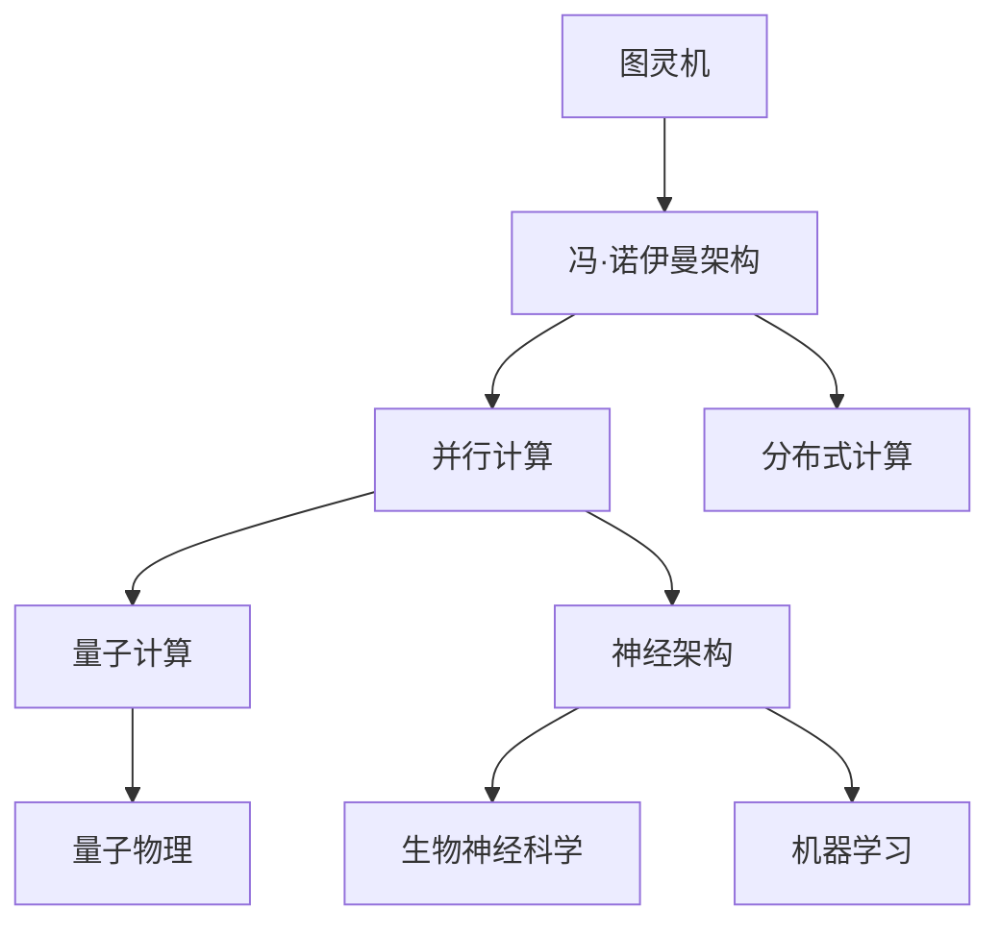

                 

### 文章标题

《新兴计算范式的类型和特点》

### 关键词

计算范式，新兴技术，人工智能，量子计算，分布式计算，神经架构

### 摘要

本文旨在深入探讨新兴计算范式的类型和特点，通过系统的分析，为读者呈现这一领域的最新进展和前沿动态。文章首先介绍了计算范式的基本概念，然后详细探讨了当前几种主流的新兴计算范式，如量子计算、分布式计算和神经架构等。通过逻辑清晰、结构紧凑、简单易懂的技术语言，本文不仅阐述了这些新兴计算范式的基本原理，还通过实例和实际项目展示了其应用场景。文章最后对新兴计算范式的现状与趋势进行了总结，并展望了其未来的发展方向。

## 引言

计算范式是指计算机科学中，计算方法、算法和架构的基本概念和理论框架。从早期的机械计算机到现代的复杂分布式系统，计算范式经历了多次重大的变革。每一次变革不仅推动了计算技术的发展，也对整个计算机科学领域产生了深远的影响。

然而，随着科技的快速发展，传统的计算范式逐渐暴露出其局限性。例如，传统的冯·诺伊曼架构在处理大规模数据和复杂算法时，效率低下且难以扩展。此外，随着人工智能、量子计算等新兴领域的崛起，传统的计算范式已无法满足这些领域对计算能力和效率的高要求。因此，研究和探索新兴计算范式成为了当前计算机科学领域的重要任务。

本文将围绕新兴计算范式的类型和特点展开讨论。首先，我们将介绍计算范式的基本概念，阐述其定义和特征。然后，将重点探讨几种当前主流的新兴计算范式，包括量子计算、分布式计算和神经架构，详细分析其基本原理和实现方法。此外，本文还将通过实例和实际项目，展示这些新兴计算范式的应用场景。最后，我们将对新兴计算范式的现状与趋势进行总结，并展望其未来的发展方向。

通过本文的阅读，读者将能够全面了解新兴计算范式的类型和特点，掌握其核心原理和应用方法，从而为未来的研究和实践打下坚实的基础。

## 核心概念与联系

### 计算范式的基本概念

计算范式（Computational Paradigm）是计算机科学中，对计算方法、算法和架构的基本概念和理论框架的统称。它是理解计算机行为和设计计算系统的重要基础。计算范式不仅定义了计算机如何处理信息，还决定了算法的设计和执行方式。

从历史角度来看，计算范式经历了多个发展阶段。最早的计算范式可以追溯到机械计算机时代，例如查尔斯·巴贝奇设计的差分机和解析机。然而，现代计算范式主要可以分为以下几个阶段：

1. **图灵机范式**：由艾伦·图灵在20世纪30年代提出，图灵机是一种抽象的计算模型，它通过在无限长纸带上的读写操作来模拟任何计算过程。图灵机的提出标志着计算理论的基础构建，并成为现代计算机科学的核心范式。

2. **冯·诺伊曼范式**：由约翰·冯·诺伊曼在20世纪40年代提出，这一范式以存储程序计算机为特征，将程序和数据存储在同一内存中，通过中央处理单元（CPU）执行指令。冯·诺伊曼架构至今仍然是大多数现代计算机的基础。

3. **并行计算范式**：随着计算机硬件和软件的不断发展，并行计算逐渐成为主流。并行计算通过同时处理多个任务或数据项，显著提高了计算效率。

4. **量子计算范式**：量子计算是近年来迅速发展的一种新兴计算范式，它利用量子位（qubit）的量子叠加和纠缠特性，实现了与传统计算机完全不同的计算方式。

5. **神经架构范式**：受生物神经系统的启发，神经架构范式通过模拟神经网络进行学习和处理信息，近年来在人工智能领域取得了显著成果。

### 新兴计算范式的定义与特点

新兴计算范式是指在现有计算范式基础上，通过技术创新和理论突破，提出的新型计算方法、算法和架构。这些新兴计算范式不仅克服了传统计算范式的局限性，还为解决复杂计算问题提供了新的思路和方法。

定义：新兴计算范式可以定义为在计算机科学中，利用新的理论、技术和工具，提出的能够显著提高计算效率、扩展计算能力和改变计算模式的计算方法。

特点：

1. **高效性**：新兴计算范式通过创新算法和架构，实现了更高的计算效率和更低的能耗。

2. **扩展性**：新兴计算范式能够灵活地扩展计算能力和资源，适应不断增长的数据处理需求。

3. **多样性**：新兴计算范式涵盖了多种不同的计算模式，如量子计算、分布式计算、神经架构等，提供了多样化的计算选择。

4. **复杂性处理能力**：新兴计算范式能够处理传统计算范式难以解决的复杂问题，如大规模数据处理、复杂系统建模等。

5. **跨领域融合**：新兴计算范式不仅限于计算机科学领域，还与物理学、生物学、人工智能等多个学科领域深度融合，推动了多学科交叉发展。

### 计算范式之间的关系

在计算机科学的发展历程中，不同的计算范式之间存在紧密的联系和继承关系。传统计算范式为新计算范式的发展提供了基础，而新兴计算范式则对传统计算范式进行了扩展和改进。

1. **继承与扩展**：例如，量子计算范式继承了图灵机的计算模型，但通过量子位和量子算法实现了更高效的计算。神经架构范式则基于生物神经系统的原理，提出了新的计算框架，同时结合了机器学习的算法，形成了独特的计算范式。

2. **交叉融合**：一些新兴计算范式在发展过程中，不仅继承了传统计算范式的基础，还与其他领域的技术进行了融合。例如，分布式计算范式在云计算和边缘计算的发展中，融合了网络技术和分布式系统理论，形成了具有高度灵活性和扩展性的计算范式。

3. **协同发展**：传统计算范式和新兴计算范式并不是孤立存在的，而是相互促进、协同发展的。例如，量子计算的发展不仅推动了计算机硬件和算法的创新，也为量子物理和量子信息科学等领域提供了新的研究方向。

### Mermaid 流程图

为了更好地理解不同计算范式之间的关系，我们可以使用Mermaid流程图进行可视化展示。以下是一个简化的Mermaid流程图，展示了传统计算范式和新兴计算范式之间的继承和扩展关系：

通过这个流程图，我们可以清晰地看到不同计算范式之间的继承关系和创新方向。例如，量子计算范式继承了图灵机的计算模型，但通过量子物理的理论实现了更高效的计算。神经架构范式则基于生物神经系统的原理，融合了机器学习算法，形成了独特的计算范式。

### 总结

计算范式是计算机科学中一个核心概念，从早期的机械计算机到现代的复杂分布式系统，计算范式经历了多次重大变革。本文介绍了计算范式的基本概念和定义，详细探讨了新兴计算范式的定义与特点，并展示了传统计算范式和新兴计算范式之间的关系。通过这些分析，读者可以更好地理解计算范式的演变和发展，为未来研究和应用新兴计算范式打下基础。在接下来的章节中，我们将深入探讨几种主要的新兴计算范式，包括量子计算、分布式计算和神经架构，进一步阐述其基本原理和应用场景。

