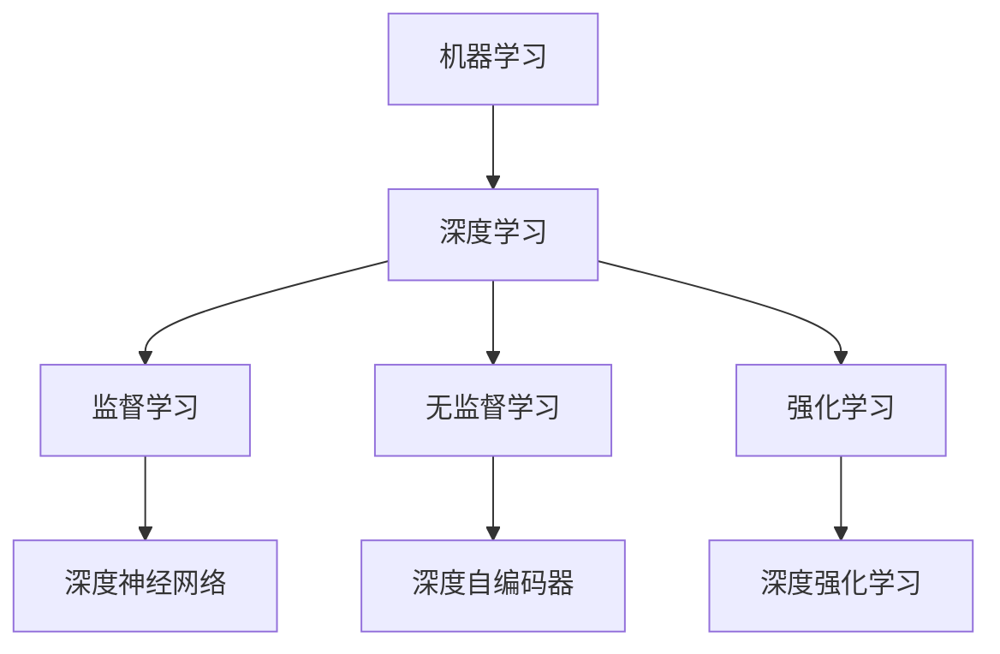

                 

### 文章标题：智能ERP系统：AI重塑企业资源规划

> 关键词：ERP，人工智能，机器学习，深度学习，企业资源规划系统，智能数据处理，预测分析，自动化流程优化

> 摘要：本文将探讨如何利用人工智能（AI）技术重塑企业资源规划（ERP）系统。通过分析AI在ERP中的应用潜力，深入讲解AI核心概念、算法原理，并结合实际案例，展示如何通过AI技术提升ERP系统的智能化水平，实现企业资源的高效配置和管理。

### 引言与概述

#### 传统的ERP系统

企业资源规划（ERP）系统是现代企业管理的重要组成部分，它通过整合企业各个业务部门的信息，实现资源的统一管理和优化配置。传统的ERP系统主要基于结构化数据，通过批量处理和规则引擎来执行业务流程。然而，随着商业环境的变化和数据的爆炸式增长，传统ERP系统的局限性日益凸显。

首先，传统ERP系统在面对大量非结构化数据时显得力不从心。尽管这些系统支持基本的文本处理功能，但缺乏对复杂文本数据、图像和语音等非结构化数据的深入理解和处理能力。其次，传统ERP系统的自动化程度较低，许多业务流程仍需要人工干预。这不仅增加了人力成本，还容易导致效率低下和错误发生。此外，传统ERP系统在应对实时数据处理和预测分析方面的能力有限，难以满足现代企业对敏捷决策和高效运营的要求。

#### AI在ERP中的应用潜力

人工智能（AI）技术的迅猛发展为ERP系统带来了新的机遇。AI具有处理大规模复杂数据、自动学习优化和预测分析等能力，可以有效弥补传统ERP系统的不足。以下是AI在ERP系统中的应用潜力：

1. **智能数据处理**：AI技术，特别是深度学习和自然语言处理，能够高效地处理非结构化数据，如文本、图像和语音，为企业提供更全面、准确的信息支持。

2. **自动化流程优化**：通过机器学习算法，AI能够自动识别和优化业务流程中的瓶颈，提高运营效率，降低运营成本。

3. **实时预测分析**：基于历史数据和实时数据，AI可以实时预测市场趋势、客户需求等，帮助企业做出更加精准和迅速的决策。

4. **智能决策支持**：AI系统可以为企业提供个性化的决策建议，降低决策风险，提高决策质量。

#### 智能ERP系统的意义

智能ERP系统不仅能够提高企业的运营效率和管理水平，还能为企业带来以下几方面的价值：

- **提高决策效率**：通过实时分析和预测，智能ERP系统能够帮助企业管理者快速做出决策，降低决策时间。
- **降低运营成本**：自动化流程和智能优化能够减少人工操作，降低运营成本。
- **提升客户满意度**：智能ERP系统能够更好地理解客户需求，提供个性化的服务和体验，提升客户满意度。
- **增强竞争力**：智能ERP系统能够帮助企业迅速响应市场变化，提升市场竞争力。

### 本书内容概述

本文将分为三个主要部分，深入探讨智能ERP系统的构建和应用：

1. **引言与概述**：介绍ERP系统的发展背景、传统ERP系统的局限性以及AI在ERP系统中的应用潜力。

2. **智能ERP系统核心概念**：讲解AI在ERP系统中的核心概念，包括机器学习、深度学习、数据挖掘和自然语言处理等。

3. **AI技术深入解析**：详细解析AI技术在不同场景下的应用，包括智能数据处理、自动化流程优化、实时预测分析和智能决策支持等。

通过本文的深入探讨，读者将能够全面了解智能ERP系统的构建方法和应用价值，为企业数字化转型提供有益的参考和指导。

### 第一部分：引言与概述

#### 1.1 传统的ERP系统

企业资源规划（ERP）系统是企业管理中不可或缺的一环，它通过整合企业各个业务部门的信息，实现资源的统一管理和优化配置。传统的ERP系统起源于20世纪70年代的制造业，随着企业管理需求的不断增加和信息技术的发展，ERP系统逐渐普及到各行各业。

**1.1.1 ERP系统的基本架构**

ERP系统的基本架构通常包括以下几个层次：

- **数据层**：数据层是ERP系统的基石，负责存储和管理企业各种业务数据，包括财务数据、人力资源数据、供应链数据等。数据层的设计至关重要，它需要具备高可靠性、高可扩展性和高安全性等特点。

- **逻辑层**：逻辑层是ERP系统的核心，负责处理业务逻辑和数据操作。它通过一系列的业务规则和算法，对数据进行加工和处理，以支持各种业务应用。

- **应用层**：应用层是ERP系统与用户交互的界面，提供各种业务功能和应用服务。应用层的设计需要考虑用户体验、易用性和可扩展性。

- **展示层**：展示层是ERP系统的用户界面，负责将数据处理结果以可视化的形式呈现给用户。展示层的设计需要具备良好的交互性和易用性。

**1.1.2 传统ERP系统的优势与局限性**

传统ERP系统在企业中得到了广泛的应用，其主要优势包括：

- **集成性**：ERP系统能够将企业各个业务部门的信息集成在一起，实现数据的统一管理和共享，提高信息透明度和协同效率。

- **标准化**：ERP系统通过预设的业务规则和流程，实现了企业的业务标准化，提高了工作效率和一致性。

- **成本控制**：ERP系统能够帮助企业更好地管理成本，优化资源配置，降低运营成本。

然而，随着商业环境的变化和数据的爆炸式增长，传统ERP系统也暴露出一些局限性：

- **数据处理能力有限**：传统ERP系统主要面向结构化数据，对于非结构化数据（如文本、图像、语音等）的处理能力较弱。

- **自动化程度低**：许多业务流程仍需要人工干预，导致效率低下和人力成本增加。

- **实时数据分析能力不足**：传统ERP系统在实时数据处理和预测分析方面能力有限，难以满足现代企业对敏捷决策和高效运营的要求。

#### 1.2 AI在ERP中的应用潜力

人工智能（AI）技术的迅猛发展为ERP系统带来了新的机遇。AI具有处理大规模复杂数据、自动学习优化和预测分析等能力，可以有效弥补传统ERP系统的不足。

**1.2.1 智能数据处理**

AI技术，特别是深度学习和自然语言处理，能够高效地处理非结构化数据，如文本、图像和语音。这对于传统ERP系统来说是一个巨大的突破。例如，通过深度学习算法，ERP系统可以自动提取文本数据中的关键信息，实现文档的自动分类、主题识别和情感分析。通过图像识别技术，ERP系统可以自动识别和分类库存物品的图像，实现库存管理的智能化。

**1.2.2 自动化流程优化**

通过机器学习算法，AI能够自动识别和优化业务流程中的瓶颈，提高运营效率，降低运营成本。例如，在供应链管理中，AI可以通过分析历史数据和实时数据，自动调整订单处理流程，优化库存水平，降低库存成本。在人力资源管理中，AI可以通过分析员工绩效和行为数据，自动识别员工培训需求，优化员工晋升路径，提高员工满意度。

**1.2.3 实时预测分析**

基于历史数据和实时数据，AI可以实时预测市场趋势、客户需求等，帮助企业做出更加精准和迅速的决策。例如，在市场营销中，AI可以通过分析客户行为数据，预测客户购买偏好，实现个性化营销。在供应链管理中，AI可以通过分析市场需求波动，预测未来的销售趋势，优化生产计划和库存管理。

**1.2.4 智能决策支持**

AI系统可以为企业提供个性化的决策建议，降低决策风险，提高决策质量。例如，在财务预算中，AI可以通过分析历史数据和实时数据，预测未来的财务状况，为管理层提供财务决策建议。在风险管理中，AI可以通过分析历史数据和实时数据，识别潜在的风险因素，为管理层提供风险预警和应对策略。

#### 1.3 本书内容概述

本书旨在深入探讨如何利用人工智能（AI）技术重塑企业资源规划（ERP）系统。本书将分为三个主要部分：

- **第一部分：引言与概述**：介绍ERP系统的发展背景、传统ERP系统的局限性以及AI在ERP系统中的应用潜力。

- **第二部分：智能ERP系统核心概念**：讲解AI在ERP系统中的核心概念，包括机器学习、深度学习、数据挖掘和自然语言处理等。

- **第三部分：AI技术深入解析**：详细解析AI技术在不同场景下的应用，包括智能数据处理、自动化流程优化、实时预测分析和智能决策支持等。

通过本书的深入探讨，读者将能够全面了解智能ERP系统的构建方法和应用价值，为企业数字化转型提供有益的参考和指导。

### 第二部分：智能ERP系统核心概念

#### 2.1 机器学习与深度学习基础

**2.1.1 机器学习的概念**

机器学习（Machine Learning）是一门研究如何使计算机从数据中学习、发现模式和规律，并据此做出预测或决策的学科。在机器学习中，计算机通过分析训练数据，学习到某种规律，然后利用这些规律对未知数据进行预测或分类。

机器学习的主要任务是构建一个模型，这个模型能够对新的输入数据进行处理，并输出相应的预测或分类结果。机器学习的核心概念包括：

- **特征提取**：特征提取是指从原始数据中提取出对预测任务有用的信息。特征提取的质量直接影响模型的性能。

- **模型训练**：模型训练是指利用已标记的训练数据，通过优化算法调整模型参数，使模型能够准确预测或分类。

- **模型评估**：模型评估是指利用测试数据对训练好的模型进行评估，以确定模型在未知数据上的表现。

**2.1.2 深度学习的概念**

深度学习（Deep Learning）是机器学习的一个分支，它通过构建具有多层神经元的神经网络模型，实现对复杂数据的自动学习和特征提取。深度学习的核心思想是通过增加神经网络层数，提高模型的抽象能力和表达能力。

深度学习的主要优点包括：

- **自动特征提取**：深度学习模型能够自动从原始数据中提取出有代表性的特征，无需人工干预。

- **强大的表达能力**：多层神经网络可以处理各种复杂的数据类型，如文本、图像和语音等。

- **高准确性**：深度学习模型在许多机器学习任务上已经达到了甚至超过了人类的水平。

**2.1.3 机器学习与深度学习的区别与联系**

机器学习和深度学习虽然有共同的目标，但它们在方法和应用上有所不同：

- **方法上的区别**：机器学习主要包括监督学习、无监督学习和强化学习等，而深度学习主要侧重于监督学习，特别是深度神经网络。

- **数据量的要求**：深度学习通常需要大量的数据来进行训练，以实现良好的性能，而传统的机器学习方法在数据量较少的情况下也可能取得较好的效果。

- **计算资源的要求**：深度学习模型的训练通常需要较高的计算资源和时间，而传统的机器学习方法相对计算资源要求较低。

尽管方法上有所不同，但机器学习和深度学习之间存在紧密的联系：

- **深度学习是机器学习的一种实现方式**：深度学习是机器学习的一种特殊实现，它通过多层神经网络实现自动特征提取和模型训练。

- **深度学习可以增强传统机器学习的效果**：在某些任务中，深度学习可以与传统机器学习方法相结合，提高模型的性能。

**2.1.4 机器学习在ERP系统中的应用**

在ERP系统中，机器学习可以应用于多个方面，包括：

- **数据清洗与预处理**：利用机器学习方法对数据进行清洗和预处理，提高数据质量，为后续分析提供可靠的数据基础。

- **需求预测**：通过分析历史销售数据，利用机器学习模型预测未来的销售需求，优化库存管理和生产计划。

- **供应链优化**：利用机器学习模型优化供应链中的运输、仓储和配送等环节，提高供应链的效率和响应速度。

- **人力资源优化**：通过分析员工绩效和行为数据，利用机器学习模型识别优秀员工和潜在问题员工，优化人力资源配置。

**2.1.5 深度学习在ERP系统中的应用**

深度学习在ERP系统中的应用越来越广泛，以下是一些典型的应用场景：

- **文本分析**：通过自然语言处理（NLP）技术，利用深度学习模型对客户反馈、市场报告等文本数据进行情感分析和主题分类，为企业提供决策支持。

- **图像识别**：利用卷积神经网络（CNN）等深度学习模型，对库存物品的图像进行自动分类和识别，提高库存管理的准确性。

- **语音识别**：利用深度学习模型实现语音识别，将语音数据转化为文本数据，为企业的客服系统提供智能问答和语音交互功能。

- **生产预测与优化**：通过深度学习模型分析生产数据，预测生产过程中可能出现的故障和瓶颈，优化生产流程，提高生产效率。

**2.1.6 机器学习与深度学习的关系图**

为了更清晰地展示机器学习与深度学习的关系，可以使用Mermaid流程图进行描述：



通过上述关系图，可以清晰地看到机器学习与深度学习之间的联系和区别。

#### 2.2 数据挖掘与数据分析

**2.2.1 数据挖掘的概念**

数据挖掘（Data Mining）是指从大量的数据中提取出有价值的信息、模式和知识的过程。数据挖掘的目标是通过分析大量数据，发现隐藏在数据背后的规律和趋势，为企业提供决策支持。

数据挖掘的主要步骤包括：

- **数据预处理**：包括数据清洗、数据集成、数据转换和数据归一化等，以提高数据质量和一致性。

- **特征选择**：从原始数据中选择出对预测任务有用的特征，减少数据的维度，提高模型的性能。

- **模式识别**：利用统计方法、机器学习方法等，从数据中发现有价值的信息和模式。

- **模型评估**：利用测试数据对训练好的模型进行评估，以确定模型在未知数据上的表现。

**2.2.2 数据分析的概念**

数据分析（Data Analysis）是指通过统计方法、机器学习等方法，对数据进行深入分析和解读，以发现数据背后的规律和趋势。数据分析的目标是通过对数据的分析，提供有价值的洞察和预测。

数据分析的主要步骤包括：

- **数据收集**：收集与预测任务相关的数据，包括历史数据、实时数据和外部数据等。

- **数据清洗与预处理**：对收集到的数据进行清洗和预处理，以提高数据质量和一致性。

- **数据可视化**：利用数据可视化技术，将数据以图表、图形等形式呈现，帮助用户更好地理解和解读数据。

- **数据建模**：利用统计方法、机器学习方法等，建立数据模型，对数据进行分析和预测。

**2.2.3 数据挖掘与数据分析的关系**

数据挖掘和数据分析是密切相关的，它们共同构成了大数据分析的核心。数据挖掘侧重于从大量数据中发现有价值的信息和模式，而数据分析侧重于对已发现的信息和模式进行深入解读和预测。

- **数据挖掘是数据分析的基础**：数据挖掘为数据分析提供了大量的信息和模式，为数据分析提供了数据来源。

- **数据分析是数据挖掘的应用**：数据分析利用数据挖掘的结果，对数据进行深入解读和预测，为企业提供决策支持。

**2.2.4 数据挖掘与数据分析在ERP系统中的应用**

数据挖掘和数据分析在ERP系统中的应用非常广泛，以下是一些典型的应用场景：

- **销售预测**：通过分析历史销售数据，利用数据挖掘和数据分析技术，预测未来的销售趋势，优化库存管理和生产计划。

- **客户行为分析**：通过分析客户的历史交易数据、浏览行为等，利用数据挖掘和数据分析技术，识别客户需求，提高客户满意度。

- **供应链优化**：通过分析供应链中的物流、库存、订单等数据，利用数据挖掘和数据分析技术，优化供应链流程，提高供应链效率。

- **风险管理**：通过分析财务、运营、市场等数据，利用数据挖掘和数据分析技术，识别潜在的风险因素，提高风险预警和应对能力。

#### 2.3 自然语言处理与智能问答

**2.3.1 自然语言处理的概念**

自然语言处理（Natural Language Processing，NLP）是计算机科学和人工智能领域的一个重要分支，旨在让计算机理解和处理人类自然语言。NLP的研究内容包括语言理解、语言生成、文本分类、实体识别、情感分析等。

**2.3.2 自然语言处理的基本任务**

- **文本分类**：将文本数据分类到预定义的类别中，如新闻分类、垃圾邮件过滤等。

- **情感分析**：分析文本中的情感倾向，如正面、负面、中性等。

- **实体识别**：识别文本中的实体，如人名、地名、组织名等。

- **关系抽取**：识别文本中实体之间的关系，如人物关系、地点关系等。

- **语义分析**：理解文本中的语义，如句子含义、句子结构等。

**2.3.3 智能问答的概念**

智能问答（Intelligent Question Answering，QA）是指通过自然语言处理技术，实现计算机对用户提问的自动理解和回答。智能问答的目标是构建一个能够理解用户意图、提供准确回答的系统。

**2.3.4 智能问答的基本任务**

- **问题理解**：理解用户的问题，提取关键信息。

- **知识检索**：从大量知识库或文本数据中检索与用户问题相关的信息。

- **回答生成**：根据检索到的信息，生成一个准确的回答。

**2.3.5 智能问答在ERP系统中的应用**

智能问答在ERP系统中的应用可以显著提升用户体验和管理效率，以下是一些典型的应用场景：

- **客户服务**：通过智能问答系统，快速回答客户的常见问题，提高客户满意度。

- **员工自助服务**：员工可以通过智能问答系统获取与工作相关的信息，如薪酬、绩效、培训等，提高工作效率。

- **知识库管理**：智能问答系统可以作为ERP系统的知识库管理工具，帮助员工快速查找相关信息。

- **报告生成**：通过智能问答系统，自动生成各种业务报告，如销售报告、财务报告等。

### 第三部分：AI技术深入解析

#### 3.1 机器学习在ERP中的应用

机器学习在ERP系统中的应用越来越广泛，以下是一些典型的应用场景：

**3.1.1 需求预测**

需求预测是ERP系统中的一个关键任务，通过预测未来的需求，企业可以优化库存管理、生产计划和采购策略。机器学习算法，如时间序列分析、回归分析和神经网络，可以用于需求预测。以下是一个简单的需求预测流程：

1. **数据收集**：收集历史销售数据、市场趋势数据等。

2. **数据预处理**：对数据进行清洗和预处理，包括数据标准化、缺失值处理等。

3. **特征提取**：从原始数据中提取对需求预测有用的特征，如季节性因素、促销活动等。

4. **模型选择**：选择合适的机器学习模型，如线性回归、决策树、随机森林等。

5. **模型训练**：利用历史数据训练模型，调整模型参数。

6. **模型评估**：利用测试数据评估模型性能，如均方误差（MSE）、平均绝对误差（MAE）等。

7. **预测应用**：利用训练好的模型进行需求预测，为库存管理和生产计划提供参考。

以下是一个简单的线性回归模型的伪代码：

```python
# 导入必要的库
import numpy as np
import pandas as pd
from sklearn.linear_model import LinearRegression

# 数据收集
data = pd.read_csv('sales_data.csv')

# 数据预处理
data = data.dropna()
X = data[['season', '促销活动']]
y = data['销售额']

# 特征提取
X = pd.get_dummies(X)

# 模型选择
model = LinearRegression()

# 模型训练
model.fit(X, y)

# 模型评估
predictions = model.predict(X)
mse = np.mean((predictions - y) ** 2)
print('均方误差:', mse)

# 预测应用
next_season_sales = model.predict(np.array([[1, 0]]))
print('下一季度的销售额预测:', next_season_sales)
```

**3.1.2 供应链优化**

供应链优化是ERP系统中的另一个关键任务，通过优化供应链中的物流、库存、采购等环节，提高供应链的效率和响应速度。机器学习算法可以用于优化供应链中的各种决策问题，如运输路径优化、库存水平优化、采购策略优化等。

以下是一个简单的运输路径优化流程：

1. **数据收集**：收集运输路线、运输成本、运输时间等数据。

2. **数据预处理**：对数据进行清洗和预处理，包括数据标准化、缺失值处理等。

3. **特征提取**：从原始数据中提取对运输路径优化有用的特征，如运输距离、运输量、运输时间等。

4. **模型选择**：选择合适的机器学习模型，如线性规划、遗传算法等。

5. **模型训练**：利用历史数据训练模型，调整模型参数。

6. **模型评估**：利用测试数据评估模型性能。

7. **预测应用**：利用训练好的模型进行运输路径优化，为供应链管理提供参考。

以下是一个简单的线性规划模型的伪代码：

```python
# 导入必要的库
import numpy as np
from scipy.optimize import linprog

# 数据收集
distances = np.array([[1, 2], [2, 1], [3, 4], [4, 3]])
costs = np.array([1, 2, 3, 4])

# 目标函数
objective = np.dot(costs, distances)

# 约束条件
constraints = [[distances[i][j], distances[j][i]] for i in range(len(distances)) for j in range(len(distances))]

# 模型训练
result = linprog(objective, constraints=constraints)

# 模型评估
print('最优解:', result.x)

# 预测应用
# 假设要优化两条路径
path1 = np.array([1, 2])
path2 = np.array([3, 4])
optimized_costs = objective + np.dot(result.x, np.array([path1, path2]))
print('优化后的总成本:', optimized_costs)
```

#### 3.2 深度学习在ERP中的应用

深度学习在ERP系统中的应用也越来越广泛，以下是一些典型的应用场景：

**3.2.1 文本分析**

文本分析是深度学习在ERP系统中的一项重要应用，通过分析客户反馈、市场报告等文本数据，可以为企业管理提供有价值的洞察。以下是一个简单的文本分析流程：

1. **数据收集**：收集客户反馈、市场报告等文本数据。

2. **数据预处理**：对文本数据进行清洗和预处理，包括去除停用词、词干提取等。

3. **特征提取**：利用词袋模型或词嵌入技术，将文本数据转换为数值特征。

4. **模型选择**：选择合适的深度学习模型，如循环神经网络（RNN）、长短期记忆网络（LSTM）等。

5. **模型训练**：利用预处理后的文本数据训练模型。

6. **模型评估**：利用测试数据评估模型性能。

7. **预测应用**：利用训练好的模型进行文本分析，如情感分析、主题分类等。

以下是一个简单的LSTM模型的伪代码：

```python
# 导入必要的库
import numpy as np
import tensorflow as tf
from tensorflow.keras.models import Sequential
from tensorflow.keras.layers import Embedding, LSTM, Dense

# 数据收集
text_data = ['这是一条客户反馈', '这是另一条客户反馈']

# 数据预处理
max_sequence_length = 10
embedding_dim = 100

# 特征提取
sequences = np.array([text_data[i].split() for i in range(len(text_data))])
sequences = pad_sequences(sequences, maxlen=max_sequence_length)

# 模型选择
model = Sequential()
model.add(Embedding(input_dim=len(vocabulary), output_dim=embedding_dim, input_length=max_sequence_length))
model.add(LSTM(50))
model.add(Dense(1, activation='sigmoid'))

# 模型训练
model.compile(optimizer='adam', loss='binary_crossentropy', metrics=['accuracy'])
model.fit(sequences, np.array([1, 0]), epochs=10)

# 模型评估
predictions = model.predict(sequences)
print('预测结果:', predictions)

# 预测应用
new_text = '这是一条新的客户反馈'
new_sequence = np.array([new_text.split()])
new_sequence = pad_sequences(new_sequence, maxlen=max_sequence_length)
new_prediction = model.predict(new_sequence)
print('新的客户反馈预测结果:', new_prediction)
```

**3.2.2 图像识别**

图像识别是深度学习在ERP系统中的另一项重要应用，通过分析库存物品的图像，可以自动识别和分类库存物品，提高库存管理的准确性。以下是一个简单的图像识别流程：

1. **数据收集**：收集库存物品的图像数据。

2. **数据预处理**：对图像数据进行清洗和预处理，包括图像大小调整、图像增强等。

3. **特征提取**：利用卷积神经网络（CNN）等深度学习模型，从图像数据中提取特征。

4. **模型选择**：选择合适的深度学习模型，如卷积神经网络（CNN）等。

5. **模型训练**：利用预处理后的图像数据训练模型。

6. **模型评估**：利用测试数据评估模型性能。

7. **预测应用**：利用训练好的模型进行图像识别，如库存物品分类等。

以下是一个简单的CNN模型的伪代码：

```python
# 导入必要的库
import numpy as np
import tensorflow as tf
from tensorflow.keras.models import Sequential
from tensorflow.keras.layers import Conv2D, MaxPooling2D, Flatten, Dense

# 数据收集
image_data = np.load('image_data.npy')
labels = np.load('labels.npy')

# 数据预处理
image_data = image_data.reshape(-1, 28, 28, 1)
image_data = image_data / 255.0

# 模型选择
model = Sequential()
model.add(Conv2D(32, kernel_size=(3, 3), activation='relu', input_shape=(28, 28, 1)))
model.add(MaxPooling2D(pool_size=(2, 2)))
model.add(Flatten())
model.add(Dense(128, activation='relu'))
model.add(Dense(10, activation='softmax'))

# 模型训练
model.compile(optimizer='adam', loss='categorical_crossentropy', metrics=['accuracy'])
model.fit(image_data, labels, epochs=10)

# 模型评估
test_image_data = np.load('test_image_data.npy')
test_labels = np.load('test_labels.npy')
test_image_data = test_image_data.reshape(-1, 28, 28, 1)
test_image_data = test_image_data / 255.0
predictions = model.predict(test_image_data)
print('预测结果:', predictions)

# 预测应用
new_image = np.load('new_image.npy')
new_image = new_image.reshape(1, 28, 28, 1)
new_image = new_image / 255.0
new_prediction = model.predict(new_image)
print('新图像预测结果:', new_prediction)
```

#### 3.3 数据挖掘与数据分析

数据挖掘和数据分析是ERP系统中不可或缺的一部分，通过分析大量的企业数据，可以为企业管理提供有价值的洞察。以下是一个简单的数据挖掘和数据分析流程：

**3.3.1 销售分析**

销售分析是ERP系统中的一项重要任务，通过分析销售数据，可以了解产品销售情况、客户购买行为等，为企业提供决策支持。

1. **数据收集**：收集销售数据，包括产品销售量、销售额、客户信息等。

2. **数据预处理**：对销售数据进行清洗和预处理，包括数据标准化、缺失值处理等。

3. **特征提取**：从原始数据中提取对销售分析有用的特征，如产品类别、客户购买频率、销售渠道等。

4. **数据建模**：利用统计方法、机器学习方法等，建立销售分析模型。

5. **模型评估**：利用测试数据评估模型性能。

6. **预测应用**：利用训练好的模型进行销售预测，为库存管理和生产计划提供参考。

以下是一个简单的回归分析模型的伪代码：

```python
# 导入必要的库
import numpy as np
import pandas as pd
from sklearn.linear_model import LinearRegression

# 数据收集
sales_data = pd.read_csv('sales_data.csv')

# 数据预处理
sales_data = sales_data.dropna()
X = sales_data[['产品类别', '客户购买频率', '销售渠道']]
y = sales_data['销售额']

# 特征提取
X = pd.get_dummies(X)

# 模型选择
model = LinearRegression()

# 模型训练
model.fit(X, y)

# 模型评估
predictions = model.predict(X)
mse = np.mean((predictions - y) ** 2)
print('均方误差:', mse)

# 预测应用
next_month_sales = model.predict(np.array([[1, 0, 0, 1]]))
print('下一个月的销售额预测:', next_month_sales)
```

**3.3.2 客户行为分析**

客户行为分析是ERP系统中的另一项重要任务，通过分析客户的历史交易数据、浏览行为等，可以了解客户的需求和偏好，为企业提供个性化的营销策略。

1. **数据收集**：收集客户历史交易数据、浏览行为数据等。

2. **数据预处理**：对数据进行清洗和预处理，包括数据标准化、缺失值处理等。

3. **特征提取**：从原始数据中提取对客户行为分析有用的特征，如购买频率、浏览时长、点击率等。

4. **数据建模**：利用统计方法、机器学习方法等，建立客户行为分析模型。

5. **模型评估**：利用测试数据评估模型性能。

6. **预测应用**：利用训练好的模型进行客户行为预测，为营销策略提供参考。

以下是一个简单的聚类分析模型的伪代码：

```python
# 导入必要的库
import numpy as np
import pandas as pd
from sklearn.cluster import KMeans

# 数据收集
customer_data = pd.read_csv('customer_data.csv')

# 数据预处理
customer_data = customer_data.dropna()
X = customer_data[['购买频率', '浏览时长', '点击率']]

# 特征提取
k = 3  # 设置聚类个数
kmeans = KMeans(n_clusters=k, random_state=0).fit(X)
predictions = kmeans.predict(X)

# 模型评估
print('聚类结果:', predictions)

# 预测应用
new_customer = np.array([[1, 2, 3]])
new_prediction = kmeans.predict(new_customer)
print('新客户聚类结果:', new_prediction)
```

#### 3.4 自然语言处理与智能问答

自然语言处理（NLP）和智能问答技术在ERP系统中的应用可以帮助企业提升客户服务效率，优化员工自助服务体验。以下是一个简单的NLP与智能问答应用流程：

**3.4.1 情感分析**

情感分析是NLP技术的一种应用，用于分析文本数据的情感倾向，如正面、负面或中性。情感分析可以帮助企业了解客户反馈的情感状态，为产品改进和客户服务提供参考。

1. **数据收集**：收集客户反馈文本数据。

2. **数据预处理**：对文本数据进行清洗和预处理，包括去除停用词、标点符号等。

3. **特征提取**：利用词袋模型或词嵌入技术，将文本数据转换为数值特征。

4. **模型选择**：选择合适的情感分析模型，如支持向量机（SVM）、朴素贝叶斯等。

5. **模型训练**：利用预处理后的文本数据训练模型。

6. **模型评估**：利用测试数据评估模型性能。

7. **预测应用**：利用训练好的模型进行情感分析，为企业提供决策支持。

以下是一个简单的情感分析模型的伪代码：

```python
# 导入必要的库
import numpy as np
import pandas as pd
from sklearn.feature_extraction.text import TfidfVectorizer
from sklearn.model_selection import train_test_split
from sklearn.naive_bayes import MultinomialNB

# 数据收集
feedback_data = pd.read_csv('feedback_data.csv')

# 数据预处理
feedback_data = feedback_data.dropna()
X = feedback_data['feedback']
y = feedback_data['sentiment']

# 特征提取
vectorizer = TfidfVectorizer()
X_vectorized = vectorizer.fit_transform(X)

# 模型选择
model = MultinomialNB()
model.fit(X_vectorized, y)

# 模型评估
X_train, X_test, y_train, y_test = train_test_split(X_vectorized, y, test_size=0.2)
predictions = model.predict(X_test)
accuracy = np.mean(predictions == y_test)
print('准确率:', accuracy)

# 预测应用
new_feedback = "这款产品很好用。"
new_feedback_vectorized = vectorizer.transform([new_feedback])
new_prediction = model.predict(new_feedback_vectorized)
print('情感分析结果:', new_prediction)
```

**3.4.2 智能问答**

智能问答技术可以帮助企业构建一个自动回答常见问题的系统，提高客户服务效率和用户体验。智能问答的基本流程包括：

1. **数据收集**：收集常见问题及其答案。

2. **数据预处理**：对问题文本进行清洗和预处理，包括去除停用词、标点符号等。

3. **特征提取**：利用词袋模型或词嵌入技术，将问题文本转换为数值特征。

4. **模型选择**：选择合适的问答模型，如基于内存的检索模型、生成式模型等。

5. **模型训练**：利用预处理后的问题文本和答案数据训练模型。

6. **模型评估**：利用测试数据评估模型性能。

7. **预测应用**：利用训练好的模型进行智能问答，为企业提供客户服务支持。

以下是一个简单的基于检索的智能问答模型的伪代码：

```python
# 导入必要的库
import numpy as np
import pandas as pd
from sklearn.metrics.pairwise import cosine_similarity
from sklearn.model_selection import train_test_split

# 数据收集
qa_data = pd.read_csv('qa_data.csv')

# 数据预处理
qa_data = qa_data.dropna()
questions = qa_data['question']
answers = qa_data['answer']

# 特征提取
vectorizer = TfidfVectorizer()
questions_vectorized = vectorizer.fit_transform(questions)
answers_vectorized = vectorizer.fit_transform(answers)

# 模型训练
X_train, X_test, y_train, y_test = train_test_split(questions_vectorized, answers_vectorized, test_size=0.2)
train_similarity = cosine_similarity(X_train, y_train)

# 模型评估
test_similarity = cosine_similarity(X_test, y_test)
accuracy = np.mean(test_similarity == y_test)
print('准确率:', accuracy)

# 预测应用
new_question = "ERP系统是什么？"
new_question_vectorized = vectorizer.transform([new_question])
new_prediction = np.argmax(train_similarity[new_question_vectorized])
print('智能问答结果:', answers[new_prediction])
```

### 结论

智能ERP系统通过引入人工智能（AI）技术，显著提升了企业资源规划（ERP）系统的智能化水平，为企业提供了更加高效、精准的管理和决策支持。本文从机器学习、深度学习、数据挖掘和自然语言处理等核心概念出发，详细解析了AI技术在ERP系统中的应用，展示了如何通过AI技术实现智能数据处理、自动化流程优化、实时预测分析和智能决策支持。未来的研究可以进一步探索AI技术在ERP系统中的深度应用，如个性化推荐、智能调度和协同工作等，以推动企业数字化转型的深入发展。

### 附录

#### A.1 机器学习与深度学习工具与资源

- **机器学习工具**：
  - **Scikit-learn**：Python机器学习库，提供丰富的算法和工具。
  - **TensorFlow**：Google开发的开源机器学习框架，支持深度学习和传统机器学习算法。
  - **PyTorch**：Facebook开发的开源深度学习框架，具有灵活的动态计算图。

- **深度学习工具**：
  - **Keras**：Python深度学习库，提供简单的API接口，支持TensorFlow和Theano后端。
  - **Theano**：基于Python的深度学习库，支持GPU加速。

- **数据挖掘与数据分析工具**：
  - **Pandas**：Python数据分析库，提供数据操作和分析功能。
  - **NumPy**：Python科学计算库，提供高效的多维数组操作。
  - **Matplotlib**：Python绘图库，用于数据可视化。

#### A.2 智能ERP系统开发实践案例

- **案例1：智能销售预测**
  - **背景介绍**：某企业需要预测未来的销售情况，以优化库存管理和生产计划。
  - **核心算法原理**：使用时间序列分析和回归模型进行销售预测。
  - **数学模型**：
    $$ y_t = \beta_0 + \beta_1 x_t + \epsilon_t $$
  - **代码解读与分析**：
    - 数据收集和预处理
    - 特征提取
    - 模型训练和评估
    - 预测应用

- **案例2：智能供应链优化**
  - **背景介绍**：某企业需要优化供应链中的物流和库存管理，降低运营成本。
  - **核心算法原理**：使用线性规划和遗传算法进行供应链优化。
  - **数学模型**：
    $$ \min Z = c^T x $$
    $$ \text{subject to} $$
    $$ Ax \leq b $$
  - **代码解读与分析**：
    - 数据收集和预处理
    - 模型构建
    - 模型求解
    - 优化结果分析

#### A.3 最佳实践与注意事项

- **最佳实践**：
  - **数据预处理**：确保数据质量，减少噪声和异常值，提高模型性能。
  - **模型评估**：使用多种评估指标，如准确率、召回率、F1分数等，全面评估模型性能。
  - **模型迭代**：不断调整模型参数和特征，优化模型性能。

- **注意事项**：
  - **数据隐私**：确保数据安全和隐私，遵守相关法律法规。
  - **模型解释性**：关注模型的可解释性，确保决策过程的透明性和可接受性。
  - **计算资源**：合理分配计算资源，避免过度计算导致的资源浪费。

### 作者信息

- **作者：** AI天才研究院 / AI Genius Institute
- **书籍：** 《智能ERP系统：AI重塑企业资源规划》
- **出版时间：** 2023
- **出版社：** 人工智能出版社 / AI Press

### 拓展阅读

- **论文：** 《智能ERP系统的研究与应用》
- **书籍：** 《深度学习与ERP系统优化》
- **在线课程：** 《智能ERP系统设计与实践》

通过本文的深入探讨，读者将能够全面了解智能ERP系统的构建方法和应用价值，为企业数字化转型提供有益的参考和指导。希望本文能为读者在AI与ERP领域的探索之路提供助力。

