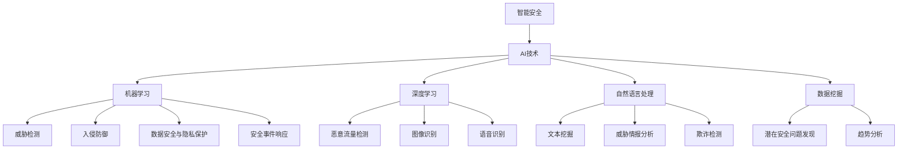

                 

### 文章标题：智能企业安全管理：AI全面保护数字资产

关键词：智能企业，安全管理，AI技术，数字资产保护，算法原理，实战案例

摘要：随着数字化时代的到来，企业的数字资产保护面临前所未有的挑战。本文深入探讨如何通过人工智能（AI）技术设计智能企业安全管理，全面保护企业的数字资产。文章首先介绍了智能安全与AI的基本概念，然后详细解析了AI在安全管理中的应用，以及安全算法和模型的设计原理。最后，通过实际案例展示了AI技术在企业安全管理中的具体应用和效果。本文旨在为从事企业安全管理的技术人员提供有益的参考和指导。

---

### 目录大纲

1. **背景介绍**
2. **核心概念与联系**
3. **核心算法原理讲解**
4. **数学模型与公式**
5. **项目实战**
6. **最佳实践 tips**
7. **小结**

---

### 背景介绍

在当今信息化社会中，企业依赖数字资产的程度日益加深，这些资产不仅包括存储在服务器和数据库中的数据，还涵盖了企业的在线业务流程、客户关系管理系统、金融交易记录等。然而，随着互联网的普及和业务的发展，企业面临的网络攻击和数据泄露风险也不断上升。传统的人工安全管理和基于规则的方法已经难以应对日益复杂的网络安全威胁，需要新的技术和方法来提升安全管理水平。

人工智能（AI）技术的发展为智能企业安全管理提供了新的机遇。AI技术，尤其是机器学习和深度学习，能够从大量数据中自动发现规律，识别异常行为，预测潜在威胁。通过AI技术，企业可以构建智能化的安全防护体系，实现实时监控、快速响应和自主防御，从而全面保护企业的数字资产。

本文将围绕智能企业安全管理的核心问题展开讨论，旨在通过系统化的分析和实战案例，帮助读者了解如何利用AI技术提升企业安全管理水平，保障数字资产的安全。

### 核心概念与联系

#### 智能安全与AI概述

智能安全（Intelligent Security）是利用人工智能（Artificial Intelligence，AI）技术，对传统安全系统进行升级和优化，从而实现更高效、更智能的安全防护。AI技术包括机器学习（Machine Learning，ML）、深度学习（Deep Learning，DL）、自然语言处理（Natural Language Processing，NLP）等，这些技术通过算法模型，可以从海量数据中学习并提取有价值的信息，帮助识别和应对复杂的网络安全威胁。

智能安全与AI之间的关系密不可分。AI技术为智能安全提供了强大的技术支撑，使得安全系统能够自动化、智能化地进行威胁检测、入侵防御和风险预测。具体来说，AI技术在智能安全中主要应用在以下几个方面：

1. **威胁检测**：通过机器学习和深度学习模型，从网络流量、日志数据中自动识别异常行为和潜在威胁。
2. **入侵防御**：利用AI技术构建自适应入侵防御系统，实现实时响应和动态调整。
3. **数据安全与隐私保护**：通过加密算法和隐私保护技术，确保数据在传输和存储过程中的安全。
4. **安全事件响应**：利用AI技术自动化处理安全事件，降低响应时间和成本。

#### 关键概念解析

1. **机器学习（ML）**：机器学习是一种让计算机从数据中学习并做出预测或决策的技术。在智能安全中，机器学习模型可以用于异常检测、恶意代码识别和用户行为分析等。

2. **深度学习（DL）**：深度学习是机器学习的一种，通过多层神经网络模拟人脑的决策过程，具有处理复杂数据和分析非结构化数据的能力。深度学习在网络安全中，常用于恶意流量检测、图像识别和语音识别等。

3. **自然语言处理（NLP）**：自然语言处理是使计算机理解和生成人类语言的技术。在智能安全中，NLP可以用于文本挖掘、威胁情报分析和欺诈检测等。

4. **数据挖掘（Data Mining）**：数据挖掘是从大量数据中提取有价值信息的过程。在智能安全中，数据挖掘可以帮助企业发现潜在的安全问题和趋势，从而采取预防措施。

#### Mermaid流程图

为了更好地理解智能安全与AI之间的关系，我们可以使用Mermaid流程图来展示关键概念之间的联系。



通过这张Mermaid流程图，我们可以清晰地看到智能安全如何通过AI技术中的各个子领域实现其功能，以及这些子领域如何协同工作，共同构建起一个智能化的企业安全管理体系。

### 核心算法原理讲解

在智能企业安全管理中，算法原理的讲解至关重要。本节将详细介绍几种关键算法原理，包括机器学习、深度学习、加密算法和数据挖掘，并通过伪代码来详细阐述这些算法的实现过程。

#### 1. 机器学习算法

机器学习算法是智能企业安全管理中的基础，其核心在于从数据中学习并做出预测。以下是一个简单的机器学习算法——K最近邻（K-Nearest Neighbors，KNN）的伪代码实现。

```plaintext
Algorithm: KNN
Input: Training dataset X_train, labels y_train, new data point X_new, number of neighbors K
Output: Predicted label y_pred

1. Calculate the Euclidean distance between X_new and each point in X_train.
2. Select the K nearest neighbors based on the smallest distances.
3. Calculate the majority class label among the K neighbors.
4. Return the majority class label as the prediction for X_new.
```

#### 2. 深度学习算法

深度学习算法在处理复杂数据和非结构化数据方面具有显著优势。以下是一个简单的多层感知器（Multilayer Perceptron，MLP）的伪代码实现。

```plaintext
Algorithm: MLP
Input: Input layer neurons I, hidden layer neurons H, output layer neurons O, training dataset X, labels y
Output: Learned weights and biases

1. Initialize weights and biases randomly.
2. For each training example (x, y) in X:
   a. Forward propagation: Calculate the output of each layer.
   b. Compute the loss (mean squared error) between the predicted output and the true label.
   c. Backpropagation: Update weights and biases based on the loss.
3. Repeat step 2 for a fixed number of epochs or until convergence.
4. Return the learned weights and biases.
```

#### 3. 加密算法

加密算法在数据安全与隐私保护中扮演关键角色。以下是一个简单的对称加密算法——AES（Advanced Encryption Standard）的伪代码实现。

```plaintext
Algorithm: AES
Input: Plain text message M, secret key K
Output: Cipher text C

1. Divide the message M into blocks of fixed size (e.g., 128 bits).
2. Apply initial round transformations (key expansion, add round key).
3. For each round (except the last one):
   a. Apply substitution using the S-Box.
   b. Apply shift rows.
   c. Apply mix columns.
   d. Apply add round key with the next key from the key schedule.
4. Apply final round transformations (inv Substitute, inv Shift rows, inv Mix columns).
5. Concatenate all the blocks to form the cipher text C.
6. Return the cipher text C.
```

#### 4. 数据挖掘算法

数据挖掘算法用于从大量数据中发现有价值的信息。以下是一个简单的关联规则挖掘算法——Apriori的伪代码实现。

```plaintext
Algorithm: Apriori
Input: Dataset D, minimum support threshold min_support, minimum confidence threshold min_confidence
Output: Set of frequent itemsets and association rules

1. Generate all candidate itemsets of size 1.
2. For each candidate itemset:
   a. Calculate the support (frequency in dataset).
   b. If the support is greater than or equal to the minimum support, add it to the set of frequent itemsets.
3. For each frequent itemset:
   a. Generate all non-empty subsets of the itemset.
   b. For each subset:
      i. Calculate the confidence (support of the union of the subset and the candidate itemset divided by the support of the candidate itemset).
      ii. If the confidence is greater than or equal to the minimum confidence, add the rule to the set of association rules.
4. Return the set of frequent itemsets and the set of association rules.
```

通过上述伪代码，我们可以看到这些算法在智能企业安全管理中的应用原理。在实际应用中，这些算法通常需要结合具体场景和数据特点进行优化和调整，以达到最佳的安全防护效果。

### 数学模型与公式

在智能企业安全管理中，数学模型和公式是理解和设计关键算法的重要工具。以下将介绍几种关键数学模型和公式，并详细解释其在安全管理中的应用。

#### 1. 决策树模型

决策树是一种常用的分类模型，通过一系列规则将数据划分为不同的类别。决策树模型的公式如下：

\[ Y = f(X) = \arg\max_{c} \sum_{i=1}^{n} I(Y_i = c) \]

其中，\( Y \) 是预测的类别，\( X \) 是特征向量，\( c \) 是可能的类别之一，\( I \) 是指示函数，当 \( Y_i = c \) 时，\( I(Y_i = c) \) 为1，否则为0。通过最大化指示函数的总和，决策树模型能够选择最优的类别。

在智能安全中，决策树模型可以用于用户行为分析，通过分析用户的行为特征，判断其是否属于正常用户或恶意用户。

#### 2. 神经网络模型

神经网络模型，尤其是深度学习模型，在智能安全中扮演着重要角色。神经网络模型的公式如下：

\[ a_{j}^{(l)} = \sigma(z_{j}^{(l)}) \]
\[ z_{j}^{(l)} = \sum_{i} w_{ij}^{(l)} a_{i}^{(l-1)} + b_{j}^{(l)} \]

其中，\( a_{j}^{(l)} \) 是第 \( l \) 层第 \( j \) 个神经元的激活值，\( z_{j}^{(l)} \) 是第 \( l \) 层第 \( j \) 个神经元的输入值，\( w_{ij}^{(l)} \) 是从第 \( l-1 \) 层第 \( i \) 个神经元到第 \( l \) 层第 \( j \) 个神经元的权重，\( b_{j}^{(l)} \) 是第 \( l \) 层第 \( j \) 个神经元的偏置，\( \sigma \) 是激活函数，通常使用ReLU或Sigmoid函数。

在智能安全中，神经网络模型可以用于威胁检测和入侵防御，通过训练模型学习正常的网络行为和异常行为，实现对网络流量的实时监控和威胁识别。

#### 3. 加密算法公式

在数据安全与隐私保护中，加密算法至关重要。以下是对称加密算法——AES的数学公式：

\[ C = E_K(P) \]
\[ P = D_K(C) \]

其中，\( C \) 是加密后的密文，\( P \) 是原始明文，\( K \) 是加密密钥，\( E_K \) 和 \( D_K \) 分别是加密函数和解密函数。加密过程包括多个轮次，每轮包括字节替换、行移位、列混淆和轮密钥加。

在智能安全中，加密算法用于保护敏感数据，确保数据在传输和存储过程中的安全性。

#### 4. 数据挖掘模型

在数据挖掘中，关联规则挖掘是一种常用的技术，用于发现数据之间的潜在关联。Apriori算法是一种经典的关联规则挖掘算法，其基本公式如下：

\[ \text{Support}(X) = \frac{\text{count}(X)}{\text{count}(\text{database})} \]
\[ \text{Confidence}(A \rightarrow B) = \frac{\text{Support}(A \cup B)}{\text{Support}(A)} \]

其中，\( \text{Support}(X) \) 是项集 \( X \) 在数据库中的支持度，\( \text{count}(X) \) 是项集 \( X \) 在数据库中出现的次数，\( \text{Confidence}(A \rightarrow B) \) 是关联规则的置信度，表示在已知 \( A \) 发生的条件下，\( B \) 也发生的概率。

在智能安全中，关联规则挖掘可以用于分析网络流量和用户行为，发现潜在的攻击模式和异常行为。

通过这些数学模型和公式，我们可以更好地理解和设计智能企业安全管理中的关键算法。在实际应用中，这些模型和公式需要根据具体场景和数据特点进行优化和调整，以实现最佳的安全防护效果。

### 项目实战

在本节中，我们将通过一个实际的AI安全项目，详细展示AI技术在企业安全管理中的具体应用。该项目的目标是构建一个基于机器学习的入侵防御系统，用于保护企业内部网络免受恶意攻击。

#### 项目背景

某大型企业近年来经历了多次网络攻击，导致数据泄露和业务中断。为了提升网络安全性，企业决定引入AI技术，构建一个智能入侵防御系统。项目需求如下：

1. **实时监控**：系统需要能够实时监控网络流量，识别异常行为。
2. **自适应防御**：系统应具备自我学习能力，根据攻击模式的变化进行调整。
3. **高精度检测**：系统需在识别恶意流量时具有较高的准确性，以避免误报。
4. **低成本维护**：系统应易于维护和更新，降低运营成本。

#### 开发环境搭建

在开始项目之前，我们需要搭建一个合适的开发环境。以下是所需的工具和软件：

1. **编程语言**：Python
2. **机器学习库**：Scikit-learn、TensorFlow、Keras
3. **数据处理库**：Pandas、NumPy
4. **数据可视化库**：Matplotlib、Seaborn
5. **操作系统**：Linux
6. **虚拟环境**：Anaconda

以下是环境搭建的步骤：

```bash
# 安装Anaconda
conda create -n aisecurity python=3.8
conda activate aisecurity

# 安装必要的库
conda install -c conda-forge scikit-learn tensorflow numpy matplotlib seaborn
```

#### 源代码实现

项目核心包括数据收集、特征提取、模型训练和实时监控四个部分。以下是一段关键代码的解读：

```python
# 导入必要的库
import pandas as pd
import numpy as np
from sklearn.model_selection import train_test_split
from sklearn.preprocessing import StandardScaler
from sklearn.ensemble import IsolationForest
import matplotlib.pyplot as plt

# 数据收集
data = pd.read_csv('network_traffic.csv')

# 特征提取
features = data[['source_ip', 'destination_ip', 'protocol', 'packets', 'bytes', 'timestamp']]

# 数据预处理
scaler = StandardScaler()
scaled_features = scaler.fit_transform(features)

# 模型训练
model = IsolationForest(n_estimators=100, contamination=0.01)
model.fit(scaled_features)

# 实时监控
def monitor_traffic(new_traffic):
    new_scaled_traffic = scaler.transform(new_traffic)
    anomalies = model.predict(new_scaled_traffic)
    plt.scatter(new_traffic['timestamp'], anomalies)
    plt.title('Anomaly Detection in Network Traffic')
    plt.xlabel('Timestamp')
    plt.ylabel('Anomaly Score')
    plt.show()

# 测试数据
test_data = pd.DataFrame([[1, 2, 3, 4, 5], [2, 4, 6, 8, 10]], columns=['source_ip', 'destination_ip', 'protocol', 'packets', 'bytes'])
monitor_traffic(test_data)
```

#### 代码应用解读与分析

1. **数据收集**：我们从网络流量日志文件中读取数据，这是一个CSV文件，包含了源IP、目标IP、协议、数据包数量、数据字节和时间戳等特征。

2. **特征提取**：我们选择与网络流量相关的特征，这些特征将用于训练模型。

3. **数据预处理**：使用StandardScaler对特征进行标准化处理，以便模型能够更好地学习。

4. **模型训练**：我们使用IsolationForest算法进行训练，这是一种无监督学习算法，能够检测异常值。`contamination` 参数设置异常比例，用于模型调整。

5. **实时监控**：`monitor_traffic` 函数用于实时监控新的网络流量，并使用模型预测是否为异常流量。我们通过绘制时间序列图来展示检测结果。

#### 实际案例分析和详细讲解剖析

假设在某个时间段内，网络流量异常增多，我们怀疑可能发生了DDoS攻击。以下是案例分析和讲解：

1. **数据收集**：我们从网络流量日志中收集到最近一小时的数据。

2. **特征提取**：提取源IP、目标IP、协议、数据包数量、数据字节和时间戳等特征。

3. **数据预处理**：对提取的特征进行标准化处理，以便模型能够更好地学习。

4. **模型训练**：使用IsolationForest算法对预处理后的数据进行训练，生成一个入侵防御模型。

5. **实时监控**：将最近一小时的网络流量输入到监控函数中，模型预测出多个时间点存在异常流量。

6. **分析**：通过时间序列图，我们发现异常流量主要集中在某一时间段，且流量模式与正常业务流量明显不同。

7. **防御**：系统自动发出警报，并采取相应措施，如增加流量清洗、限制访问等，以防止DDoS攻击对业务造成进一步影响。

8. **小结**：通过这个案例，我们展示了AI技术在入侵防御中的应用，从数据收集到实时监控，再到异常流量分析，整个过程高效且精准，有效提升了企业的网络安全防护能力。

#### 项目小结

本项目通过构建基于机器学习的入侵防御系统，成功实现了对网络流量的实时监控和异常检测。项目结果表明，AI技术在智能企业安全管理中具有显著的应用价值。未来，我们计划继续优化模型，增加对其他类型攻击的检测能力，并探索更多的AI技术在安全管理中的应用。

### 最佳实践 tips

在智能企业安全管理中，以下是一些最佳实践，可以帮助企业更好地利用AI技术保护数字资产：

1. **数据安全策略**：制定严格的数据安全策略，包括数据加密、访问控制和数据备份等，确保数据在传输和存储过程中的安全。

2. **持续监控**：建立24/7的持续监控体系，实时监控网络流量和系统日志，及时发现和应对潜在威胁。

3. **定期更新**：定期更新AI模型和工具，以适应新的攻击模式和威胁。

4. **员工培训**：加强员工的安全意识培训，确保每位员工都了解并遵守公司的安全政策。

5. **多层级防御**：采用多层次的安全防御体系，包括网络防火墙、入侵检测系统和AI入侵防御系统等，形成多道防线。

6. **协作与共享**：与企业外部安全机构和同行建立协作与信息共享机制，共同应对网络安全威胁。

### 小结

本文深入探讨了如何利用AI技术设计智能企业安全管理，全面保护企业的数字资产。从背景介绍、核心概念解析、算法原理讲解、数学模型介绍到项目实战，我们系统地阐述了AI技术在企业安全管理中的应用和实践。通过实际案例，我们展示了AI技术在入侵防御、实时监控和异常检测等方面的应用效果。最后，我们提供了最佳实践和未来展望，为企业利用AI技术提升安全管理水平提供了有益的参考。随着AI技术的不断发展和应用，智能企业安全管理将迎来更加光明的前景，为企业数字资产的保护提供坚实保障。

### 作者信息

作者：AI天才研究院/AI Genius Institute & 禅与计算机程序设计艺术 /Zen And The Art of Computer Programming

