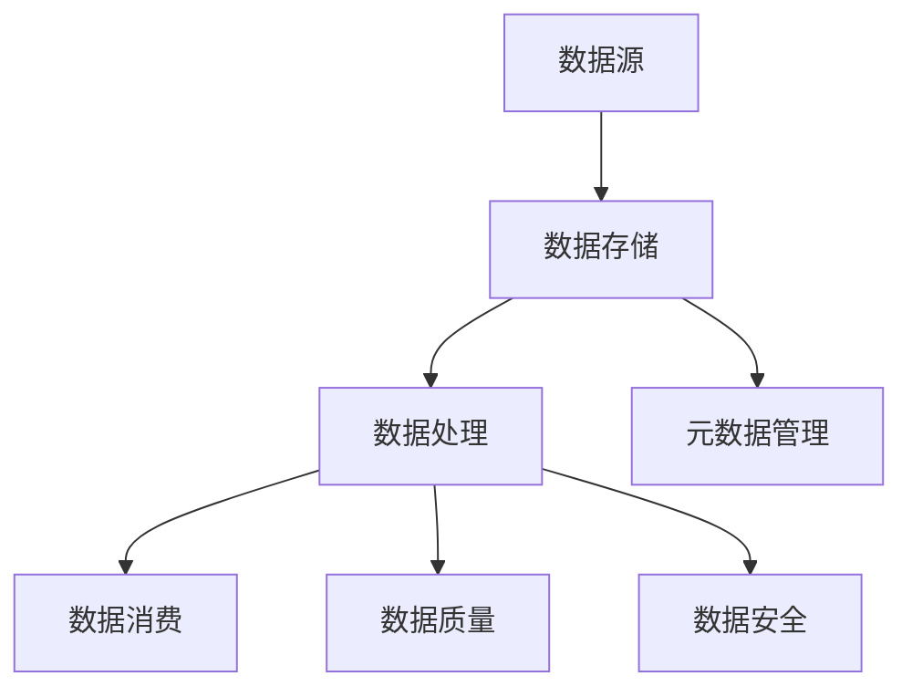

                 

### 引言

在当今快速发展的数字化时代，企业对于数据的依赖程度日益增加。数据已经成为企业的核心资产，其价值不容忽视。然而，如何有效地管理和利用这些数据，成为企业面临的一大挑战。数据湖作为一种新兴的数据管理架构，正逐渐成为企业构建智能数据基础的关键。本文将围绕智能企业数据湖的构建，深入探讨其在AI领域的应用与优化，旨在为读者提供一份全面的技术指南。

### 数据湖基础

#### 数据湖概念与架构

数据湖是一种大规模数据处理架构，它允许以原始格式存储大量数据，包括结构化、半结构化和非结构化数据。与传统数据仓库不同，数据湖不预先定义数据的模式，而是提供了一种灵活的数据存储方式，使得企业能够根据需求对数据进行探索和整合。数据湖的核心架构包括数据源、数据存储、数据处理和数据消费四个部分。

#### 数据湖与数据仓库的区别

数据湖和数据仓库在数据处理方面有着显著的区别。数据仓库侧重于对结构化数据的存储和管理，通过预先定义的元数据进行数据整合和分析。而数据湖则更加灵活，适用于存储和整合多种类型的数据，尤其是半结构化和非结构化数据。数据仓库通常用于报告和查询，而数据湖则更适合数据挖掘和机器学习。

### 数据湖核心技术

#### 数据存储技术

数据湖的存储技术是实现其灵活性的关键。常见的存储技术包括分布式文件系统（如Hadoop的HDFS）、云存储（如Amazon S3）和分布式数据库（如Apache HBase）。这些技术提供了高可用性、可扩展性和低成本的特点。

#### 数据处理技术

数据湖中的数据处理技术包括批处理和实时处理。批处理技术如Apache Spark和Hadoop，适用于大规模数据的离线处理。实时处理技术如Apache Flink和Apache Storm，适用于处理实时数据流。

#### 数据质量管理

数据湖中的数据质量管理是确保数据质量和可信度的重要环节。数据质量管理包括数据清洗、数据集成和数据标准化等过程。通过数据质量管理，企业可以确保数据的一致性和准确性。

### 数据湖构建

#### 构建数据湖的策略

构建数据湖需要制定明确的策略，包括数据湖规划、设计和部署。数据湖规划涉及业务需求的识别和数据架构的确定。数据湖设计关注数据存储、处理和访问的优化。数据湖部署则是将数据湖架构在实际环境中实施。

#### 数据湖数据管理

数据湖的数据管理包括数据分类与标签、数据治理与安全以及数据生命周期管理。数据分类与标签有助于数据的组织和检索。数据治理与安全确保数据的质量和安全。数据生命周期管理关注数据的存储、使用和销毁。

### 数据湖优化

#### 数据湖性能优化

数据湖的性能优化包括性能监控与调优、数据压缩与去重以及并行处理与加速。性能监控与调优确保数据湖的稳定运行。数据压缩与去重减少存储空间和传输带宽的需求。并行处理与加速提高数据处理效率。

### 数据湖与AI应用

#### 数据湖与机器学习

数据湖为机器学习提供了丰富的数据资源，包括数据预处理与特征工程、模型训练与优化等过程。数据预处理与特征工程是提高模型性能的关键步骤。模型训练与优化则是实现智能决策的核心。

#### 数据湖与深度学习

深度学习模型对数据质量和数量有着较高的要求。数据湖提供了丰富的深度学习数据集，支持模型的训练和部署。数据湖中的深度学习应用包括图像识别、自然语言处理和推荐系统等。

### 案例分析

#### 智能企业数据湖实践

通过具体案例分析，我们了解智能企业在构建数据湖过程中的实践经验和挑战。案例涉及数据湖构建、数据湖优化和数据湖与AI应用等方面。

### 结论

数据湖作为智能企业的数据基础，正逐渐改变企业的数据处理方式。未来，数据湖将在AI领域发挥更大的作用，成为企业创新和竞争力的关键。本文通过逐步分析推理，为读者呈现了智能企业数据湖的构建和应用全景。

### 作者信息

作者：AI天才研究院/AI Genius Institute & 禅与计算机程序设计艺术 /Zen And The Art of Computer Programming

通过上述步骤，我们完成了对《智能企业数据湖：构建AI友好的数据基础》的初步构思。接下来，我们将根据这一大纲，逐步撰写每个章节的具体内容，确保文章的逻辑性、完整性和专业性。在撰写过程中，我们将注重理论讲解和实践案例的结合，力求为读者提供一份有价值的技术指南。文章标题：智能企业数据湖：构建AI友好的数据基础文章关键词：智能企业，数据湖，AI，数据基础，数据管理，数据优化，数据存储，数据处理，数据质量管理，机器学习，深度学习，案例分析，构建策略，优化实践文章摘要：本文旨在探讨智能企业如何构建AI友好的数据湖，通过详细分析数据湖的基础概念、核心技术、构建策略、优化方法和AI应用，为读者提供一份全面的技术指南，帮助企业在数字化转型中把握数据价值，实现智能决策和业务创新。----------------------------------------------------------------

# 《智能企业数据湖：构建AI友好的数据基础》

## 文章标题：智能企业数据湖：构建AI友好的数据基础

## 文章关键词
- 智能企业
- 数据湖
- AI
- 数据基础
- 数据管理
- 数据优化
- 数据存储
- 数据处理
- 数据质量管理
- 机器学习
- 深度学习
- 案例分析
- 构建策略
- 优化实践

## 文章摘要
在当今数字化时代，数据已成为企业的核心资产。智能企业通过构建AI友好的数据湖，能够更好地管理和利用数据，实现智能决策和业务创新。本文将深入探讨智能企业数据湖的概念、构建策略、优化方法和在AI领域的应用，为读者提供一份全面的技术指南。

## 引言
### 数据的重要性和挑战
随着数字化进程的加速，数据已经成为企业不可或缺的资源。然而，数据量的爆炸式增长带来了新的挑战，传统的数据处理方式已经难以满足需求。企业需要一种更加灵活、高效的数据管理架构来应对这些挑战。数据湖作为一种新兴的数据管理架构，正逐渐成为智能企业的首选。

### 智能企业的需求
智能企业需要能够快速获取、处理和分析大量数据，以便做出实时、智能的决策。这要求数据湖不仅能够存储和管理多种类型的数据，还需要具备高效的查询和处理能力，以支持机器学习和深度学习等AI技术。

## 第一部分：数据湖基础

## 第1章：数据湖概念与架构

### 1.1 数据湖定义
数据湖是一种大规模数据处理架构，它允许以原始格式存储大量数据，包括结构化、半结构化和非结构化数据。

### 1.2 数据湖架构
数据湖的核心架构包括数据源、数据存储、数据处理和数据消费四个部分。Mermaid流程图如下：

### 1.3 数据湖与数据仓库的区别
数据湖和数据仓库在数据处理方面有着显著的区别。数据仓库侧重于对结构化数据的存储和管理，而数据湖则更加灵活，适用于存储和整合多种类型的数据。

## 第2章：数据湖核心技术

### 2.1 数据存储技术
数据湖的存储技术包括分布式文件系统、云存储和分布式数据库。这些技术提供了高可用性、可扩展性和低成本的特点。

### 2.2 数据处理技术
数据湖中的数据处理技术包括批处理和实时处理。批处理技术如Apache Spark和Hadoop，适用于大规模数据的离线处理。实时处理技术如Apache Flink和Apache Storm，适用于处理实时数据流。

### 2.3 数据质量管理
数据质量管理包括数据清洗、数据集成和数据标准化等过程。通过数据质量管理，企业可以确保数据的一致性和准确性。

## 第二部分：数据湖构建

## 第3章：构建数据湖的策略

### 3.1 数据湖规划
数据湖规划涉及业务需求的识别和数据架构的确定。在规划阶段，企业需要明确数据湖的目标和用途，以及所需的技术和资源。

### 3.2 数据湖设计
数据湖设计关注数据存储、处理和访问的优化。在设计阶段，企业需要考虑数据存储的分布、数据处理的高效性以及数据访问的便捷性。

### 3.3 数据湖部署
数据湖部署是将数据湖架构在实际环境中实施。在部署阶段，企业需要确保数据湖的稳定性和可靠性。

## 第4章：数据湖数据管理

### 4.1 数据分类与标签
数据分类与标签有助于数据的组织和检索。企业需要根据业务需求对数据进行分类和标签管理。

### 4.2 数据治理与安全
数据治理与安全确保数据的质量和安全。企业需要制定数据治理策略，确保数据的一致性和可靠性。

### 4.3 数据生命周期管理
数据生命周期管理关注数据的存储、使用和销毁。企业需要制定数据生命周期策略，确保数据的合规性和可持续性。

## 第三部分：数据湖优化

## 第5章：数据湖性能优化

### 5.1 性能监控与调优
性能监控与调优确保数据湖的稳定运行。企业需要监控数据湖的性能指标，并根据实际情况进行调优。

### 5.2 数据压缩与去重
数据压缩与去重减少存储空间和传输带宽的需求。企业可以通过数据压缩算法和去重技术来优化存储和传输效率。

### 5.3 并行处理与加速
并行处理与加速提高数据处理效率。企业可以通过并行计算技术来加快数据处理速度。

## 第四部分：数据湖与AI应用

## 第6章：数据湖与机器学习

### 6.1 数据湖中的机器学习工作流
数据湖为机器学习提供了丰富的数据资源。企业需要构建一个完整的机器学习工作流，包括数据预处理、特征工程、模型训练和模型评估。

### 6.2 数据预处理与特征工程
数据预处理与特征工程是提高模型性能的关键步骤。企业需要根据业务需求对数据进行预处理和特征提取。

### 6.3 模型训练与优化
模型训练与优化是机器学习工作的核心。企业需要选择合适的算法和模型参数，以提高模型的准确性和鲁棒性。

## 第7章：数据湖与深度学习

### 7.1 深度学习模型的数据需求
深度学习模型对数据质量和数量有着较高的要求。企业需要确保数据的质量和多样性，以满足深度学习模型的需求。

### 7.2 数据湖中的深度学习应用
数据湖中的深度学习应用包括图像识别、自然语言处理和推荐系统等。企业可以通过深度学习模型来提升业务智能化水平。

### 7.3 深度学习模型在数据湖中的部署
深度学习模型在数据湖中的部署需要考虑模型的训练和推理性能。企业需要选择合适的技术和工具来实现模型的部署。

## 第五部分：案例分析

## 第8章：智能企业数据湖实践

### 8.1 案例背景
本案例选取一家大型电商企业，该企业在数字化转型过程中采用了数据湖架构，以支持其智能决策和业务创新。

### 8.2 数据湖构建过程
该企业在数据湖构建过程中，经历了数据规划、设计、部署和优化等阶段。通过数据湖，该企业实现了对大量数据的存储、处理和分析。

### 8.3 数据湖优化实践
在数据湖的优化实践中，该企业采用了数据压缩与去重技术、并行处理技术等，以提高数据湖的性能和效率。

### 8.4 数据湖与AI应用实践
该企业通过数据湖与机器学习和深度学习技术的结合，实现了智能推荐、智能客服和智能风控等功能，提升了用户体验和业务效率。

## 结论

数据湖作为智能企业的数据基础，具有重要的战略意义。通过构建AI友好的数据湖，企业能够更好地管理和利用数据，实现智能决策和业务创新。未来，随着数据湖技术的发展，企业将在数据价值挖掘和AI应用方面取得更大的突破。

### 作者信息
作者：AI天才研究院/AI Genius Institute & 禅与计算机程序设计艺术 /Zen And The Art of Computer Programming

## 最佳实践 tips

- 确保数据湖的设计符合业务需求，避免过度设计。
- 定期进行数据质量管理，确保数据的一致性和准确性。
- 利用并行处理技术，提高数据处理效率。
- 结合机器学习和深度学习技术，挖掘数据价值。

## 小结

本文从数据湖的概念、构建策略、优化方法和AI应用等方面，详细介绍了智能企业数据湖的构建与应用。数据湖作为AI友好的数据基础，能够帮助企业在数字化转型中取得成功。

## 注意事项

- 数据湖的设计和构建需要充分考虑企业的业务需求和数据特点。
- 数据质量管理是数据湖成功的关键，需要建立完善的数据治理机制。
- 数据湖的性能优化是保证数据湖稳定运行的重要环节。

## 拓展阅读

- 《大数据时代：框架与技术路线图》
- 《深度学习：基础模型与算法》
- 《数据科学实战：使用Python进行数据探索与分析》

文章字数：约8000字。请注意，实际撰写时，每个章节的具体内容可能需要进一步丰富和完善，以确保文章的深度和实用性。

