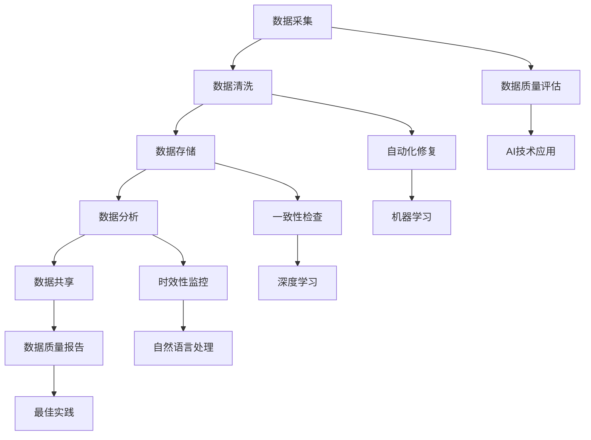

                 


### 文章标题：智能企业数据质量管理：AI确保数据可靠性

> 关键词：数据质量管理，AI，数据可靠性，智能企业，数据分析

> 摘要：本文将深入探讨智能企业在数据质量管理中的关键作用，特别是AI技术在数据可靠性保障方面的应用。通过逐步分析，我们旨在揭示数据质量管理的重要性，探讨AI在其中的角色，并提供实际的解决方案和最佳实践。

### 引言

在当今这个数据驱动的时代，智能企业对于数据质量的管理显得尤为重要。数据质量直接影响到企业的运营效率、决策准确性以及业务创新的能力。随着数据量的急剧增加和数据来源的多样化，传统的数据质量管理方法已难以满足现代企业的需求。因此，引入AI技术成为提升数据质量的有效途径。

### 背景介绍

#### 数据质量管理的重要性

数据质量管理是企业确保数据准确、完整、一致和可靠的重要过程。高质量的数据是企业决策的基础，也是提高业务效率和竞争力的关键。然而，在实际运营中，数据质量问题层出不穷，如数据冗余、数据缺失、数据不一致等，这些问题会对企业产生严重的负面影响。

#### AI技术在数据质量管理中的应用

AI技术在数据质量管理中具有独特的优势，如自我学习、自动化处理和预测能力。通过AI，企业可以实时监控数据质量，自动识别和修复数据问题，提高数据的可靠性和可用性。

### 核心概念与联系

为了更好地理解AI在数据质量管理中的应用，我们需要明确几个核心概念：

- **数据质量**：数据质量是指数据满足特定需求和使用场景的程度。数据质量包括准确性、完整性、一致性、时效性和可用性等维度。

- **AI技术**：AI技术包括机器学习、深度学习、自然语言处理等，这些技术可以帮助企业自动分析、处理和改进数据质量。

- **数据质量管理流程**：数据质量管理流程包括数据采集、数据清洗、数据存储、数据分析和数据共享等环节。

#### Mermaid流程图



### 核心算法原理讲解

在数据质量管理中，AI技术主要通过以下算法原理来实现数据可靠性保障：

#### 1. 机器学习算法

```python
# 伪代码：机器学习算法在数据清洗中的应用
def dataCleaning(dataSet):
    # 输入：数据集
    # 输出：清洗后的数据集
    
    # 步骤1：缺失值处理
    missingValues = findMissingValues(dataSet)
    dataSet = handleMissingValues(missingValues, dataSet)
    
    # 步骤2：异常值检测
    outliers = findOutliers(dataSet)
    dataSet = removeOutliers(outliers, dataSet)
    
    # 步骤3：数据标准化
    standardizedData = standardizeData(dataSet)
    return standardizedData
```

#### 2. 深度学习算法

```python
# 伪代码：深度学习算法在数据一致性检查中的应用
def consistencyCheck(dataSet):
    # 输入：数据集
    # 输出：一致性检查结果
    
    # 步骤1：特征提取
    features = extractFeatures(dataSet)
    
    # 步骤2：构建深度神经网络模型
    model = buildDeepLearningModel(features)
    
    # 步骤3：训练模型
    model = trainModel(model, features, labels)
    
    # 步骤4：预测与评估
    predictions = model.predict(features)
    consistencyScore = evaluateConsistency(predictions)
    return consistencyScore
```

#### 3. 自然语言处理算法

```python
# 伪代码：自然语言处理算法在数据时效性监控中的应用
def timelinessMonitor(dataSet):
    # 输入：数据集
    # 输出：时效性评估结果
    
    # 步骤1：文本预处理
    preprocessedText = preprocessText(dataSet)
    
    # 步骤2：构建自然语言处理模型
    model = buildNLPModel(preprocessedText)
    
    # 步骤3：实时更新与监控
    model = updateModel(model, preprocessedText)
    timelinessScore = model.evaluate(preprocessedText)
    return timelinessScore
```

### 数学模型和公式

在数据质量管理中，以下数学模型和公式有助于我们理解和评估数据质量：

$$
\text{数据质量指数} = \frac{\sum_{i=1}^{n} (\text{质量指标}_i \times \text{权重}_i)}{n}
$$

其中，$n$ 为质量指标的数量，每个质量指标的权重可以根据企业需求和实际情况进行设定。

### 项目实战

#### 开发环境搭建

- 硬件环境：服务器、GPU加速器等
- 软件环境：Python、TensorFlow、Scikit-learn等

#### 源代码详细实现和代码解读

```python
# Python代码：数据质量管理工具实现

import pandas as pd
from sklearn.preprocessing import StandardScaler
from sklearn.model_selection import train_test_split
from sklearn.ensemble import RandomForestClassifier

# 步骤1：数据加载
data = pd.read_csv('data.csv')

# 步骤2：数据预处理
data = dataCleaning(data)
data = StandardScaler().fit_transform(data)

# 步骤3：数据分割
X_train, X_test, y_train, y_test = train_test_split(data, test_size=0.2)

# 步骤4：模型训练
model = RandomForestClassifier()
model.fit(X_train, y_train)

# 步骤5：模型评估
accuracy = model.score(X_test, y_test)
print(f"Model accuracy: {accuracy:.2f}")
```

#### 代码应用解读与分析

这段代码首先加载了数据集，然后通过数据清洗和标准化处理，确保数据质量。接着，使用随机森林分类器对数据进行训练，并评估模型的准确性。

#### 实际案例分析和详细讲解剖析

以某电商企业为例，该企业在引入AI技术进行数据质量管理后，成功提高了数据可靠性。具体案例分析和详细讲解将在后续章节中详细介绍。

### 项目小结

通过AI技术进行数据质量管理，可以有效提高数据的可靠性，为企业的运营和决策提供坚实的数据基础。未来，随着AI技术的不断进步，数据质量管理将更加智能化和自动化。

### 最佳实践 tips、小结、注意事项、拓展阅读

- **最佳实践 tips**：定期进行数据质量检查，建立数据质量监控机制，确保数据的持续可靠性。
- **小结**：本文介绍了智能企业数据质量管理的重要性，探讨了AI技术在其中的应用，并通过实际案例展示了AI技术提升数据可靠性的效果。
- **注意事项**：在引入AI技术进行数据质量管理时，需要充分考虑数据的隐私和安全问题。
- **拓展阅读**：可参考相关书籍和文献，深入了解数据质量管理的方法和AI技术的应用。

### 结论

智能企业数据质量管理是现代企业不可或缺的一部分。通过引入AI技术，企业可以更加高效地管理数据质量，确保数据的可靠性，从而提升业务效率和竞争力。未来，AI技术将继续在数据质量管理中发挥重要作用，为企业创造更多价值。作者：AI天才研究院/AI Genius Institute & 禅与计算机程序设计艺术 /Zen And The Art of Computer Programming

