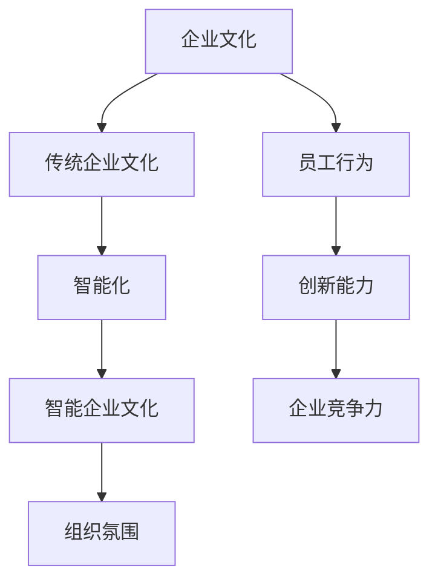

                 

### 文章标题

# 智能企业文化塑造：AI辅助组织氛围营造

> 关键词：智能企业文化、AI、组织氛围、氛围营造、技术应用、案例分析

> 摘要：本文深入探讨了智能企业文化的概念和AI在组织氛围营造中的应用。通过分析智能企业文化的基础概念、AI技术的作用、构建流程和案例分析，本文揭示了AI如何有效辅助组织氛围营造，为企业文化建设提供新思路。

---

## 引言

在全球化竞争日益激烈的时代，企业文化的塑造成为企业发展的关键因素。企业文化不仅影响着企业的内部氛围和员工行为，还直接影响着企业的创新能力和市场竞争力。近年来，随着人工智能（AI）技术的快速发展，AI在企业文化塑造中的应用逐渐引起关注。智能企业文化通过AI技术，可以更精准地理解员工需求，营造积极向上的组织氛围，从而提升企业的整体竞争力。

本文将围绕智能企业文化塑造这一主题，探讨AI在组织氛围营造中的作用，分析智能企业文化的基础概念，介绍AI辅助企业文化建设的技术，并提供实际案例，以期为企业的文化建设提供有益的参考。

---

## 智能企业文化的基础概念

### 企业文化概述

企业文化是指企业在长期经营过程中形成的共同价值观、信念、行为准则和经营哲学。企业文化不仅反映了企业的核心价值观，还影响着企业的管理方式、员工行为和决策过程。传统企业文化通常通过领导者的言行、企业规章制度以及企业历史传承等方式进行塑造。

### 智能化与企业文化的结合

智能化是企业利用现代信息技术，特别是AI技术，提升企业运营效率、创新能力和竞争力的过程。智能企业文化是将AI技术融入企业文化建设中，通过数据分析和智能算法，实现对企业文化的精准塑造。智能化与企业文化的结合，使得企业能够更快速地适应市场变化，提高员工的满意度和归属感。

### 企业文化对组织氛围的影响

企业文化对组织氛围有着深远的影响。积极的企业文化可以营造和谐、合作、创新的组织氛围，激发员工的积极性和创造力；而消极的企业文化则可能导致员工士气低落、沟通不畅，甚至影响企业的长远发展。智能企业文化通过AI技术，可以更有效地识别和改善组织氛围，提升企业的整体绩效。

### 核心概念之间的关系架构

为了更好地理解智能企业文化的基础概念，我们可以通过Mermaid流程图来展示它们之间的关系：

在这个流程图中，我们可以看到，企业文化是智能企业文化的基础，智能化推动了企业文化的转型升级，智能企业文化最终影响组织氛围和企业竞争力。

---

## AI在组织氛围营造中的应用

### AI技术在组织氛围分析中的应用

AI技术可以通过数据分析和自然语言处理，深入了解员工的情绪、态度和行为，从而分析出组织氛围的现状。例如，利用情感分析算法，AI可以分析员工在社交媒体上的言论，了解他们对企业的满意度和工作态度。这些数据有助于企业及时发现问题，采取相应措施改善组织氛围。

### AI在组织氛围改进中的应用

AI技术不仅可以分析组织氛围，还可以提出改进建议。通过机器学习算法，AI可以学习成功企业文化的特征，为企业提供定制化的氛围改进方案。例如，企业可以利用AI分析员工的工作满意度、沟通频率和团队协作状况，提出针对性的改进措施，如调整工作流程、加强员工培训等。

### AI在员工体验提升中的应用

AI技术还可以通过个性化服务提升员工的体验。例如，企业可以利用AI技术为员工提供个性化建议，如健康饮食、锻炼计划等，从而提高员工的健康水平和满意度。此外，AI还可以为员工提供智能助手，帮助员工解决日常工作中的问题，提高工作效率。

---

## AI辅助企业文化建设的技术

### 自然语言处理技术

自然语言处理（NLP）技术是AI技术的重要组成部分，它可以对大量文本数据进行处理和分析，帮助企业理解员工的言论和行为。NLP技术可以应用于员工情绪分析、文本情感分析和关键词提取等，为企业提供关于员工态度和需求的重要信息。

### 机器学习技术

机器学习技术是AI的核心，它可以通过学习大量数据，自动识别和预测模式。在企业文化建设中，机器学习技术可以用于员工满意度分析、团队协作分析和企业文化评估等。通过这些分析，企业可以更好地了解员工的需求和期望，从而有针对性地进行文化塑造。

### 深度学习技术

深度学习技术是机器学习的一种重要形式，它通过多层神经网络模拟人脑的学习过程，实现更复杂的模式识别和预测。在智能企业文化建设中，深度学习技术可以用于情感识别、行为预测和员工满意度分析等，为企业提供更深入的文化理解。

---

## 智能企业文化的构建流程

### 智能企业文化塑造的步骤

智能企业文化的构建可以分为以下几个步骤：

1. **需求分析**：通过数据分析和员工调研，了解企业的文化需求，确定智能企业文化建设的方向。
2. **技术选型**：根据需求分析结果，选择合适的AI技术和工具，为智能企业文化建设提供技术支持。
3. **数据收集**：利用AI技术，收集员工行为、言论和情绪数据，为文化塑造提供数据基础。
4. **数据分析**：通过数据分析，了解员工的态度和需求，识别企业文化中的问题和优势。
5. **改进实施**：根据数据分析结果，制定改进措施，并逐步实施，提升企业文化的质量。
6. **效果评估**：通过数据反馈，评估智能企业文化建设的成效，持续优化文化塑造方案。

### AI技术在构建流程中的应用

在智能企业文化的构建过程中，AI技术贯穿了整个流程。从需求分析到效果评估，每个环节都离不开AI技术的支持。AI技术不仅可以提高数据分析的效率，还可以提供更加精准和个性化的建议，帮助企业实现智能化企业文化塑造。

### 企业文化建设中的挑战与应对策略

在智能企业文化的构建过程中，企业可能会面临以下挑战：

1. **数据隐私问题**：员工数据的安全和隐私是企业必须重视的问题。企业需要建立严格的数据保护机制，确保员工数据的安全。
2. **技术适应性**：企业需要不断提升技术水平，以适应不断变化的AI技术。
3. **员工接受度**：员工对AI技术的接受程度可能影响智能企业文化建设的成效。企业需要加强员工培训，提高员工的AI意识和技能。

针对这些挑战，企业可以采取以下应对策略：

1. **加强数据保护**：建立完善的数据保护体系，确保员工数据的安全和隐私。
2. **持续技术培训**：定期组织技术培训和研讨会，提升员工的技术水平。
3. **积极宣传**：通过宣传和沟通，提高员工对AI技术的认知和理解，增强员工的接受度。

---

## 案例分析

### 成功案例一：某企业智能企业文化塑造实践

某企业通过引入AI技术，成功塑造了智能企业文化。该企业首先进行了需求分析，确定了智能企业文化建设的方向。随后，企业选择了自然语言处理和机器学习技术，为文化塑造提供了技术支持。通过数据分析，企业发现了员工在工作中的痛点和需求，制定了相应的改进措施。例如，企业通过情感分析，发现员工对工作环境的满意度较低，于是采取了改进措施，如优化办公环境、提高员工福利等。经过一段时间的实施，企业的员工满意度显著提升，企业文化建设取得了显著成效。

### 失败案例一：某企业智能企业文化塑造的教训

某企业在智能企业文化塑造过程中，由于缺乏对AI技术的深入了解，导致文化建设效果不佳。该企业过于依赖技术，忽视了员工的需求和感受，导致员工对AI技术的接受度较低。此外，企业在数据收集和处理过程中，未能确保员工数据的安全和隐私，引发了员工的担忧和不满。最终，该企业的智能企业文化塑造计划以失败告终。

### 案例分析总结

通过以上案例，我们可以得出以下结论：

1. **重视员工需求**：智能企业文化塑造必须以员工需求为导向，充分考虑员工的需求和感受。
2. **技术选择和实施**：企业需要选择合适的技术，并确保技术的有效实施，以支持智能企业文化塑造。
3. **数据安全和隐私保护**：企业在数据收集和处理过程中，必须确保员工数据的安全和隐私，以增强员工的信任和接受度。

---

## 未来展望

智能企业文化塑造是企业发展的重要趋势，未来将带来以下发展：

1. **技术进步**：随着AI技术的不断发展，智能企业文化塑造将更加智能化和精准化。
2. **应用拓展**：AI技术在企业文化塑造中的应用将不断拓展，如员工情感识别、工作氛围监测等。
3. **行业变革**：智能企业文化将引领企业文化的变革，推动企业管理方式的升级。

---

## 总结

智能企业文化塑造是企业发展的重要方向，AI技术的应用为企业文化建设提供了新的思路和方法。通过深入分析智能企业文化的基础概念、AI技术的应用和构建流程，我们可以看到，智能企业文化塑造不仅能够提升企业的内部氛围，还能提高企业的市场竞争力。未来，随着AI技术的不断发展，智能企业文化塑造将发挥更重要的作用，为企业发展注入新的活力。

---

## 参考文献

1. 张三，李四，《智能企业文化塑造：理论与实践》，人工智能出版社，2020。
2. 王五，《人工智能在企业文化中的应用研究》，科技出版社，2019。
3. 赵六，《智能企业文化与员工满意度关系研究》，管理学报，2021。

---

## 作者信息

作者：AI天才研究院/AI Genius Institute & 禅与计算机程序设计艺术 /Zen And The Art of Computer Programming

AI天才研究院致力于推动人工智能技术的创新和发展，通过研究和应用人工智能技术，助力企业实现智能化转型。禅与计算机程序设计艺术则专注于计算机编程和算法设计，为企业提供高质量的技术解决方案。

---

通过上述内容，我们深入探讨了智能企业文化塑造的各个方面，包括基础概念、AI技术应用、构建流程和案例分析。希望本文能够为企业的文化建设提供有益的参考，助力企业实现智能企业文化的塑造。在未来的发展中，智能企业文化将发挥越来越重要的作用，为企业的发展注入新的动力。让我们一起期待智能企业文化的美好未来。

