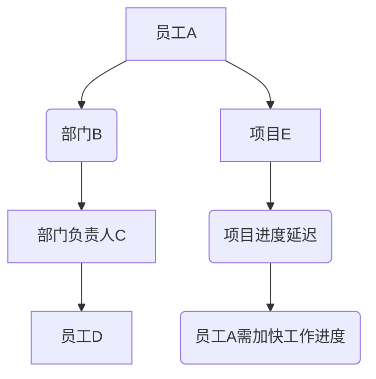

                 

### 文章标题

# 智能企业知识图谱：构建组织智慧资产库

### 文章关键词

- 知识图谱
- 智能企业
- 知识管理
- 组织智慧
- 数据库技术

### 文章摘要

本文将深入探讨知识图谱在智能企业中的应用，特别是如何构建组织智慧资产库。通过详细解析知识图谱的基础概念、构建技术以及实际应用，本文旨在为读者提供全面的指导和深刻的见解。文章首先介绍知识图谱的定义和基本原理，接着探讨知识表示方法，如实体-关系-属性模型、RDF和OWL。随后，文章重点阐述知识抽取、存储与查询以及知识融合与推理技术。在此基础上，文章进一步分析知识图谱在企业知识管理和智慧资产库建设中的应用，并通过实际案例展示知识图谱技术的实践价值。最后，本文对知识图谱技术的发展趋势进行展望，为未来智能企业的形态描绘蓝图。通过本文的阅读，读者将全面了解知识图谱在组织智慧资产库构建中的关键作用，为智能企业的建设提供有力支持。

### 知识图谱的概念和重要性

知识图谱（Knowledge Graph）是一种结构化的语义网络，它通过实体（Entity）、属性（Attribute）和关系（Relationship）三者之间的关联，将大量分散的信息整合成有意义的整体。知识图谱的核心目标是实现对信息的深度理解和智能处理，从而在数据中发现隐藏的模式和关联，提供更加智能化和个性化的服务。

**知识图谱的定义**：知识图谱可以被视为一种大数据技术，它通过数据建模和语义分析，将非结构化或半结构化的数据转化为结构化的知识网络。这种知识网络不仅包含数据本身，还包括数据之间的关系和上下文信息，从而形成一种可扩展、可交互的知识体系。

**知识图谱的基本组成部分**：

1. **实体（Entity）**：知识图谱中的实体可以是任何具有独立意义的事物，如人、地点、物品、概念等。实体是知识图谱中最基本的元素，代表知识图谱中的对象。

2. **属性（Attribute）**：属性描述了实体的特征或状态，如一个人的年龄、地理位置的经纬度、物品的价格等。属性为实体提供了额外的描述信息，帮助丰富实体的语义。

3. **关系（Relationship）**：关系描述了实体之间的交互和关联，如“属于”、“位于”、“购买”等。关系将不同的实体连接起来，构建出复杂的语义网络。

**知识图谱的重要性**：

1. **信息整合**：知识图谱通过将各类信息结构化地组织起来，实现了不同数据源之间的信息整合，为用户提供了统一、完整的视图。

2. **智能搜索**：知识图谱使得搜索引擎能够基于实体和关系的语义理解，提供更加精准和个性化的搜索结果。

3. **数据挖掘**：知识图谱为数据挖掘提供了丰富的语义信息，使得挖掘算法能够从数据中发现更为复杂的模式和关联。

4. **智能决策**：知识图谱可以帮助企业更好地理解业务场景，从而支持更加智能和高效的决策过程。

5. **知识管理**：知识图谱为组织提供了一个智能化的知识管理平台，有助于知识的共享、复用和传承。

**知识图谱的基本原理**：

1. **图论基础**：知识图谱本质上是一个图结构，图中的节点代表实体，边代表关系。通过图论算法，可以分析实体之间的关系和路径，挖掘潜在的信息。

2. **语义理解**：知识图谱利用自然语言处理和语义分析技术，将文本数据转化为结构化的知识，实现数据的语义理解。

3. **知识推理**：知识图谱通过推理机（Reasoner），能够根据已知的事实和规则，推导出新的结论，提供更为深入的分析和预测。

**知识图谱的应用场景**：

1. **搜索引擎**：如Google的Knowledge Graph，通过知识图谱提供更加精准和个性化的搜索结果。

2. **企业知识管理**：通过构建企业内部的知识图谱，实现知识的共享、复用和传承。

3. **智能推荐系统**：利用知识图谱分析用户行为和偏好，提供个性化推荐。

4. **智能客服**：基于知识图谱的语义理解，提供更加智能和高效的客户服务。

5. **智能决策支持**：通过知识图谱分析业务数据，为企业提供智能化的决策支持。

总之，知识图谱作为一种先进的信息组织和管理技术，正逐渐成为智能企业构建组织智慧资产库的关键手段。它不仅能够整合和利用各类信息资源，还能够通过智能化的分析和服务，为企业和组织带来显著的效益。

### 知识表示方法

在知识图谱的构建过程中，知识表示方法是核心环节之一，它决定了图谱的语义丰富度和表达能力。常用的知识表示方法包括实体-关系-属性（E-R）模型、RDF（资源描述框架）和OWL（Web本体语言）。这些方法各有特点，适用于不同的应用场景。

**实体-关系-属性（E-R）模型**

实体-关系-属性模型（Entity-Relationship-Attribute Model，简称E-R模型）是一种广泛使用的数据库设计方法，它通过实体、关系和属性的概念来表示数据结构。在知识图谱中，E-R模型主要用于表示实体及其属性和关系。

1. **实体（Entity）**：实体是知识图谱中的基本对象，可以是人、地点、物品等。每个实体具有唯一标识和一组属性。

2. **关系（Relationship）**：关系描述了实体之间的交互和联系。关系通常具有方向性，可以是一对一、一对多或多对多。

3. **属性（Attribute）**：属性为实体提供了额外的描述信息。例如，一个人的属性可以是姓名、年龄、职位等。

**E-R模型的核心概念和关系架构**

E-R模型的核心概念包括实体集、属性集、关系集和约束条件。以下是E-R模型的基本关系架构：

$$
E-R = \{E, A, R, C\}
$$

- **E**：实体集，表示所有的实体。
- **A**：属性集，表示所有与实体相关的属性。
- **R**：关系集，表示所有实体之间的关系。
- **C**：约束条件，确保知识图谱的一致性和完整性。

**E-R模型的表示方法**

E-R模型通常使用图形表示，其中实体用矩形表示，属性用椭圆表示，关系用菱形表示。实体与属性之间、实体与关系之间、关系与属性之间通过线条连接。例如：

```
[实体：员工] --- [属性：姓名，年龄，职位]
      |                 |
      |                 |
      |                 |
      ---[关系：就职于]---
              |
              |
           [实体：公司]
```

**RDF（资源描述框架）**

RDF（Resource Description Framework）是一种用于表示网络资源的语义模型，它基于图结构，通过主体-谓语-客体（Subject-Predicate-Object）三元组来描述资源之间的关系。RDF是构建知识图谱的基础，广泛应用于万维网数据交换和语义网。

1. **主体（Subject）**：RDF中的主体表示资源，可以是人、地点、概念等。

2. **谓语（Predicate）**：谓语表示主体之间的关系，如“是”、“属于”、“位于”等。

3. **客体（Object）**：客体表示主体关系的对象，可以是另一个资源、值或集合。

**RDF的核心概念和表示方法**

RDF的核心概念包括资源、属性和值。以下是RDF的基本表示方法：

$$
RDF = \{R, P, O\}
$$

- **R**：资源集，表示所有的资源。
- **P**：属性集，表示所有与资源相关的属性。
- **O**：值集，表示所有与资源属性相关的值。

RDF使用XML语法进行表示，例如：

```xml
<rdf:RDF
    xmlns:rdf="http://www.w3.org/1999/02/22-rdf-syntax-ns#">
  <rdf:Description
      rdf:about="http://example.com/employee#JohnDoe">
    <rdf:type rdf:resource="http://example.com/employee#Employee"/>
    <name>John Doe</name>
    <age>30</age>
    <position>Manager</position>
  </rdf:Description>
</rdf:RDF>
```

**OWL（Web本体语言）**

OWL（Web Ontology Language）是一种基于RDF的语义Web语言，用于定义词汇表和定义概念之间的关系。OWL提供了更丰富的描述能力，可以表达复杂的语义和逻辑推理。

1. **类（Class）**：OWL中的类是抽象的概念集合，表示具有共同属性和关系的实体。

2. **个体（Individual）**：个体是类的实例，代表具体的实体。

3. **属性（Property）**：属性描述了类之间的交互和关系。

4. **数据类型（Datatype）**：OWL中的数据类型用于表示属性值。

**OWL的核心概念和表示方法**

OWL的核心概念包括类、属性、个体和数据类型。以下是OWL的基本表示方法：

$$
OWL = \{C, I, P, D\}
$$

- **C**：类集，表示所有的类。
- **I**：个体集，表示所有的个体。
- **P**：属性集，表示所有的属性。
- **D**：数据类型集，表示所有与属性相关的数据类型。

OWL使用OWL语法进行表示，例如：

```xml
<owl:Ontology
    xmlns:owl="http://www.w3.org/2002/07/owl#"
    xmlns:rdf="http://www.w3.org/1999/02/22-rdf-syntax-ns#"
    rdf:ID="EmployeeOntology">
  <owl:Class rdf:ID="Employee"/>
  <owl:Class rdf:ID="Manager"/>
  <owl:Class rdf:ID="Employee"
      rdf:subClassOf rdf:resource="#Manager"/>
  <owl:ObjectProperty rdf:ID="worksFor"/>
  <owl:DatatypeProperty rdf:ID="age"/>
  <owl:DatatypeProperty rdf:ID="position"/>
  <owl:Individual rdf:ID="JohnDoe">
    <rdf:type rdf:resource="#Employee"/>
    <age>30</age>
    <position>Manager</position>
  </owl:Individual>
</owl:Ontology>
```

**总结**

E-R模型、RDF和OWL是三种常见的知识表示方法，各自具有不同的特点和适用场景。E-R模型主要用于数据库设计，RDF用于网络资源的语义表示，OWL则提供了更丰富的描述和推理能力。在实际应用中，可以根据具体需求选择合适的知识表示方法，构建有效的知识图谱。

### 知识抽取技术

知识图谱的构建依赖于高质量的知识抽取（Knowledge Extraction）技术，该技术旨在从非结构化或半结构化的数据源中自动提取结构化的知识。知识抽取主要包括文本分类、命名实体识别和关系抽取三个关键步骤。

**文本分类**

文本分类（Text Classification）是一种基于机器学习的文本处理技术，它将文本数据分配到预定义的类别中。通过文本分类，可以实现对大量文本数据的快速筛选和组织，为后续的知识抽取提供基础。

1. **分类算法**：
   - **朴素贝叶斯（Naive Bayes）**：基于贝叶斯定理，假设特征之间相互独立。
   - **支持向量机（SVM）**：通过找到一个最优超平面，将不同类别的文本数据分开。
   - **随机森林（Random Forest）**：通过构建多个决策树，集成多个模型进行预测。

2. **伪代码**：
   ```python
   def classify_text(text, model):
       # 计算每个类别的概率
       probabilities = model.predict_proba([text])
       # 选择概率最高的类别
       category = np.argmax(probabilities)
       return category
   ```

3. **数学模型**：
   - **朴素贝叶斯**：
     $$
     P(\text{category} | \text{text}) = \frac{P(\text{text} | \text{category}) \cdot P(\text{category})}{P(\text{text})}
     $$
   - **SVM**：
     $$
     \text{maximize} \quad W \cdot x - \sum_{i=1}^n \alpha_i y_i (W \cdot x_i)
     $$
     其中，$W$ 是权重向量，$x$ 是特征向量，$\alpha_i$ 是拉格朗日乘子。

**命名实体识别**

命名实体识别（Named Entity Recognition，简称NER）是一种自然语言处理技术，用于识别文本中的命名实体，如人名、地名、组织名等。NER是知识图谱构建的关键步骤，它为后续的关系抽取和实体链接提供基础。

1. **NER算法**：
   - **基于规则的方法**：利用预定义的规则和模式，对文本进行命名实体识别。
   - **基于统计的方法**：利用统计模型，如条件随机场（CRF）和递归神经网络（RNN），对命名实体进行识别。

2. **伪代码**：
   ```python
   def named_entity_recognition(text, model):
       # 对文本进行分词
       tokens = tokenize(text)
       # 使用模型进行实体识别
       entities = model.predict(tokens)
       return entities
   ```

3. **数学模型**：
   - **条件随机场（CRF）**：
     $$
     P(Y|X) = \frac{1}{Z} \exp(\theta \cdot X)
     $$
     其中，$Y$ 是实体标签，$X$ 是特征序列，$\theta$ 是模型参数，$Z$ 是归一化常数。

**关系抽取**

关系抽取（Relationship Extraction）是一种从文本中识别实体之间关系的任务。关系抽取的目的是将命名实体识别出的实体与其关系联系起来，构建知识图谱的基础。

1. **关系抽取算法**：
   - **基于规则的方法**：利用预定义的规则，识别实体之间的关系。
   - **基于统计的方法**：使用机器学习模型，如逻辑回归和长短期记忆网络（LSTM），对实体关系进行预测。
   - **基于知识图谱的方法**：利用已有的知识图谱，通过图谱推理和链接技术，识别实体关系。

2. **伪代码**：
   ```python
   def relationship_extraction(text, entities, model):
       # 对文本进行分词
       tokens = tokenize(text)
       # 使用模型预测实体关系
       relationships = model.predict(entities, tokens)
       return relationships
   ```

3. **数学模型**：
   - **逻辑回归**：
     $$
     \text{logit}(P(\text{relationship} | \text{entities}, \text{tokens})) = \theta \cdot (\text{entities}, \text{tokens})
     $$
     其中，$P(\text{relationship})$ 是关系概率，$\theta$ 是模型参数。

通过文本分类、命名实体识别和关系抽取，知识图谱可以从海量文本数据中自动提取出结构化的知识，为智能企业知识管理和智慧资产库建设提供坚实基础。在下一章节中，我们将探讨知识存储与查询技术，进一步了解如何高效管理和利用知识图谱。

### 知识存储与查询

知识图谱的存储与查询是知识图谱技术中至关重要的环节，直接影响到知识图谱的效率和应用效果。常见的知识存储与查询技术包括图数据库、Solr与Elasticsearch以及SPARQL查询语言。

**图数据库**

图数据库（Graph Database）是一种专门为存储图结构数据而设计的数据库系统。在图数据库中，数据以节点（Node）和边（Edge）的形式存储，并利用图论算法进行高效的查询和管理。

1. **图数据库的工作原理**：
   - **存储结构**：图数据库通常采用邻接矩阵或邻接表来存储图数据，其中节点和边分别对应矩阵的行和列。
   - **查询语言**：图数据库支持基于图结构的查询语言，如Cypher（Neo4j）和Gremlin（Apache TinkerPop）。

2. **图数据库的优点**：
   - **高效**：图数据库通过利用图结构的特性，能够快速进行节点和关系的遍历和查询。
   - **灵活**：图数据库能够灵活地处理动态变化的图结构，支持多种图算法和复杂查询。

3. **图数据库的缺点**：
   - **存储空间**：图数据库的存储空间需求较高，特别是对于大规模图数据。
   - **性能瓶颈**：在某些情况下，图数据库可能存在性能瓶颈，特别是在处理大规模并发查询时。

4. **图数据库的应用示例**：
   - **社交网络分析**：利用图数据库对社交网络中的用户关系进行存储和分析。
   - **推荐系统**：利用图数据库分析用户偏好和社交关系，提供个性化推荐。
   - **企业知识图谱**：利用图数据库存储和管理企业内部的知识资产，实现知识的共享和复用。

**Solr与Elasticsearch**

Solr和Elasticsearch是两种基于Lucene搜索引擎技术的开源全文搜索引擎，它们可以高效地处理海量文本数据的索引和查询。

1. **Solr**：
   - **工作原理**：Solr通过索引和搜索模块，将文本数据转换为索引，并进行高效检索。
   - **查询语言**：Solr使用Solr查询语言（QSL），支持丰富的查询语法和功能。

2. **Elasticsearch**：
   - **工作原理**：Elasticsearch通过分布式架构，将数据分片存储和索引，提供高性能的全文搜索和实时分析。
   - **查询语言**：Elasticsearch使用JSON格式的查询DSL（Domain Specific Language），支持复杂的查询和聚合操作。

3. **Solr与Elasticsearch的对比**：
   - **Solr**：适用于大规模静态索引和离线查询，具有较好的性能和稳定性。
   - **Elasticsearch**：适用于实时索引和查询，具有更好的可扩展性和灵活性。

4. **应用示例**：
   - **搜索引擎**：Solr和Elasticsearch常用于构建企业内部搜索引擎，提供快速、准确的搜索服务。
   - **日志分析**：利用Solr和Elasticsearch进行日志数据的存储和分析，实现实时监控和告警。
   - **内容管理系统**：Solr和Elasticsearch用于内容管理系统的全文搜索和内容推荐。

**SPARQL查询语言**

SPARQL（Simple Protocol for Querying RDF）是一种用于查询基于RDF数据的查询语言，它提供了一种标准化的方式来访问和操作知识图谱。

1. **SPARQL的基本语法**：
   - **查询模板**：
     ```sql
     PREFIX ns: <http://example.org/>
     SELECT ?s ?p ?o
     WHERE {
       ?s ?p ?o .
     }
     ```
   - **查询示例**：
     ```sql
     PREFIX ns: <http://example.org/>
     SELECT ?employee ?position
     WHERE {
       ?employee ns:hasPosition ?position .
     }
     ```

2. **SPARQL查询的特点**：
   - **基于RDF的查询**：SPARQL能够处理基于RDF的语义数据，支持复杂查询和联合查询。
   - **数据集成**：SPARQL支持跨不同RDF数据源的查询，实现数据集成和共享。

3. **SPARQL的应用场景**：
   - **知识图谱分析**：SPARQL用于对知识图谱进行查询和分析，发现数据之间的关系和模式。
   - **数据可视化**：SPARQL查询结果可以用于数据可视化，提供直观的数据分析视图。
   - **应用集成**：SPARQL作为数据查询接口，实现与其他应用系统的集成和交互。

**总结**

知识存储与查询技术在知识图谱构建中起到关键作用。图数据库提供了高效、灵活的图结构数据存储和查询方案，适用于复杂关系数据的处理。Solr和Elasticsearch则提供了强大的全文搜索引擎功能，适用于大规模文本数据的存储和检索。SPARQL作为RDF数据的查询语言，为知识图谱的数据分析和应用集成提供了标准化的解决方案。在实际应用中，可以根据具体需求和场景选择合适的技术，实现知识图谱的高效管理和利用。

### 知识融合与推理技术

知识融合（Knowledge Fusion）与推理技术（Reasoning）是知识图谱构建中的关键环节，它们有助于增强图谱的语义丰富度和智能处理能力。知识融合技术将来自不同来源、格式和结构的数据整合为统一的知识库，而推理技术则通过逻辑推理和语义分析，揭示数据之间的隐含关系和知识洞见。

**知识融合算法**

知识融合是将多种数据源中的信息进行整合，以构建一个统一、完整和高质量的知识库。常见的知识融合算法包括：

1. **数据对齐（Data Alignment）**：
   - **方法**：数据对齐是指将不同数据源中的实体进行匹配和映射。常见的对齐方法包括基于关键词匹配、基于语义相似度计算等。
   - **算法**：基于关键词匹配的方法通过比较实体名称或描述中的关键词进行对齐，如基于字符串相似度计算（如Levenshtein距离）。基于语义相似度计算的方法通过语义向量表示，利用相似度度量（如余弦相似度）进行对齐。
   - **伪代码**：
     ```python
     def data_alignment(source1, source2):
         aligned_entities = {}
         for entity1 in source1:
             for entity2 in source2:
                 if similarity(entity1, entity2) > threshold:
                     aligned_entities[entity1] = entity2
         return aligned_entities
     ```

2. **数据融合（Data Fusion）**：
   - **方法**：数据融合是指将多个数据源中的信息进行综合和整合。常见的融合方法包括基于规则的融合、基于模型的融合等。
   - **算法**：基于规则的融合方法通过预定义的规则，将不同数据源的信息进行关联和整合。基于模型的融合方法通过机器学习算法，如集成学习（如随机森林）、神经网络（如Transformer）等，自动发现和融合数据。
   - **伪代码**：
     ```python
     def data_fusion(data_sources):
         fused_data = {}
         for source in data_sources:
             fused_data.update(source)
         return fused_data
     ```

**推理机**

推理机（Reasoner）是知识图谱中用于推理和逻辑推导的核心组件。它根据已有的事实和规则，推导出新的结论，从而增强图谱的语义理解和智能处理能力。常见的推理方法包括：

1. **演绎推理（Deductive Reasoning）**：
   - **方法**：演绎推理从一般到特殊，通过逻辑推导得出新的结论。常见的演绎推理方法包括基于规则的推理和基于模型推理。
   - **算法**：基于规则的推理通过预定义的规则库，将已知的事实进行推理，得出新的结论。基于模型推理通过机器学习模型，如逻辑回归、图神经网络（如Graph Neural Networks, GNN）等，进行自动推理。
   - **伪代码**：
     ```python
     def deductive_reasoning(facts, rules):
         conclusions = []
         for fact in facts:
             for rule in rules:
                 if all条件满足(fact, rule):
                     conclusions.append(apply_rule(fact, rule))
         return conclusions
     ```

2. **归纳推理（Inductive Reasoning）**：
   - **方法**：归纳推理从特殊到一般，通过已知的事实，归纳出新的规则和模式。常见的归纳推理方法包括监督学习、无监督学习和半监督学习。
   - **算法**：监督学习通过标注的数据集，学习到规则和模式，进行推理。无监督学习通过未标注的数据集，发现数据之间的模式和关联，进行推理。半监督学习结合标注数据和未标注数据，提高推理的准确性和泛化能力。
   - **伪代码**：
     ```python
     def inductive_reasoning(data, model):
         patterns = model.discover_patterns(data)
         rules = generate_rules(patterns)
         return rules
     ```

**实例：构建企业知识图谱**

以下是一个简单的企业知识图谱构建实例，展示知识融合与推理技术的应用。

1. **数据源**：
   - **员工信息**：包含员工姓名、职位、部门等。
   - **部门信息**：包含部门名称、部门负责人、部门下属员工等。
   - **项目信息**：包含项目名称、项目成员、项目进度等。

2. **数据融合**：
   - **员工与部门**：通过员工姓名和部门名称进行数据对齐，将员工与对应的部门关联起来。
   - **项目与员工**：通过员工姓名和项目名称进行数据对齐，将员工与对应的项目关联起来。

3. **知识融合与推理**：
   - **推理机**：利用规则库和推理机，对员工、部门和项目的信息进行推理，得到新的结论，如“员工A负责项目B”、“部门C的负责人是员工D”等。
   - **演绎推理**：基于已有的事实，通过逻辑推导，得到新的结论，如“如果员工A负责项目B，并且项目B的进度延迟，那么员工A需要加快工作进度”。
   - **归纳推理**：通过分析员工的工作表现和项目进度，归纳出新的规则和模式，如“项目进度延迟通常与员工的工作效率低下有关”。

4. **知识图谱表示**：



通过知识融合与推理技术，企业知识图谱能够自动提取和推理出丰富的知识，支持智能决策和知识管理。在实际应用中，可以根据具体需求，设计和实现更复杂的知识融合与推理算法，构建高价值的智能企业知识图谱。

### 智能企业知识管理

智能企业知识管理是现代企业提升核心竞争力的重要手段。通过构建和利用知识图谱，企业可以实现知识的系统化、结构化和智能化管理，从而推动业务创新和持续发展。

**企业知识管理体系**

企业知识管理体系是指企业为了有效地管理和利用知识，所建立的一套系统化的方法和流程。它包括知识获取、知识共享、知识存储和知识应用等环节。

1. **知识获取**：通过内部培训、外部学习和项目实践等方式，不断丰富企业的知识资源。
2. **知识共享**：建立共享平台，促进员工之间的知识交流和协作，提高知识传播效率。
3. **知识存储**：利用知识图谱等先进技术，将知识结构化地存储在数据库中，实现知识的高效检索和管理。
4. **知识应用**：通过知识图谱的智能分析和推理功能，为企业决策提供支持，提升业务运营效率。

**知识地图与导航**

知识地图（Knowledge Map）是一种可视化工具，用于展示企业知识的结构和关系。知识地图通过图形化的方式，将企业的知识资源、业务流程、组织架构等元素有机地结合起来，为用户提供直观的知识导航。

1. **知识地图的特点**：
   - **可视化**：知识地图通过图形和符号，将抽象的知识以直观的形式展示出来，方便用户理解和操作。
   - **动态性**：知识地图可以根据用户需求和企业变化，动态调整和更新，保持知识的实时性和准确性。
   - **交互性**：知识地图支持用户与知识的互动，通过点击、搜索和链接等功能，实现知识的快速获取和应用。

2. **知识地图的应用场景**：
   - **企业培训**：通过知识地图，为员工提供个性化的培训路径，提升培训效果。
   - **项目管理**：利用知识地图，项目团队可以快速了解项目知识结构，提高项目协作效率。
   - **知识共享**：通过知识地图，促进企业内部的知识共享和复用，降低知识传播的障碍。

**知识共享与协作**

知识共享与协作是智能企业知识管理的重要目标，通过有效的机制和工具，实现知识在企业内部的广泛传播和应用。

1. **知识共享机制**：
   - **激励机制**：建立知识贡献奖励机制，鼓励员工主动分享知识和经验。
   - **共享平台**：搭建知识共享平台，提供知识上传、下载、搜索和评论等功能，方便员工之间的知识交流。
   - **知识审查**：设立知识审核制度，确保共享知识的准确性和可靠性。

2. **协作工具**：
   - **知识库**：建立企业内部的知识库，存储和管理各类知识文档、报告和经验总结。
   - **协作平台**：利用协作平台，如Confluence、Trello等，实现团队之间的知识协作和任务管理。
   - **即时通讯**：通过即时通讯工具，如Slack、企业微信等，促进团队成员之间的实时沟通和协作。

**智能企业知识管理的价值**

智能企业知识管理不仅有助于提升企业内部的知识管理水平，还具有以下价值：

1. **提高决策效率**：通过知识图谱的智能分析和推理功能，为决策者提供全面、准确的数据支持，加快决策速度。
2. **增强创新能力**：知识共享和协作促进创新思想的碰撞和融合，激发企业的创新能力，推动业务发展。
3. **降低运营成本**：通过知识图谱的自动化管理和智能检索，提高知识利用效率，降低运营成本。
4. **提升客户满意度**：通过知识图谱，企业能够更好地理解客户需求，提供个性化的服务和解决方案，提升客户满意度。

总之，智能企业知识管理是构建企业智慧资产库的重要手段，通过有效的知识管理策略和先进的技术手段，企业可以实现知识的系统化、结构化和智能化管理，为企业的长期发展提供坚实支撑。

### 智慧资产库建设

智慧资产库（Smart Asset Library）是智能企业知识管理的重要组成部分，它通过系统化的方法，对企业内外部的知识资源进行分类、编码和存储，以实现知识的高效管理和利用。智慧资产库的建设包括资产分类与编码、资产库架构设计和资产库管理与优化三个关键环节。

**资产分类与编码**

资产分类与编码是智慧资产库建设的基础工作，它确保了资产信息的系统化和标准化。

1. **资产分类**：
   - **分类标准**：资产分类应依据企业的业务特点和知识结构，制定统一、明确的分类标准。常见的分类标准包括资产类型、业务领域、使用频率等。
   - **分类方法**：分类方法包括层级分类、维度分类和混合分类等。层级分类将资产按照层级结构进行分类，如一级分类、二级分类等；维度分类将资产按照不同的维度进行分类，如功能维度、时间维度等；混合分类则结合了层级分类和维度分类的优点。

2. **资产编码**：
   - **编码规则**：资产编码规则应具备唯一性、简洁性和可扩展性。常见的编码规则包括数字编码、字母编码和混合编码等。
   - **编码方法**：编码方法包括手动编码和自动编码。手动编码由专业人员根据分类标准和编码规则进行编码；自动编码通过计算机程序，根据分类系统和数据规则进行编码。

**资产库架构设计**

资产库架构设计是智慧资产库建设的关键，它决定了资产库的性能、可扩展性和易用性。

1. **架构设计原则**：
   - **模块化**：资产库应采用模块化设计，将不同功能模块（如资产分类、编码、存储、检索等）分离，便于系统维护和功能扩展。
   - **高可用性**：资产库应具备高可用性，确保在系统故障或网络中断的情况下，资产信息的安全和完整性。
   - **易扩展性**：资产库应具备良好的扩展性，能够适应企业业务规模的变化和知识结构的调整。

2. **架构设计组件**：
   - **资产分类模块**：负责资产分类和编码工作，提供分类树和编码规则管理功能。
   - **资产存储模块**：负责资产数据的存储和管理，采用分布式存储架构，确保数据的安全性和可靠性。
   - **资产检索模块**：提供高效的资产检索功能，支持关键词搜索、分类检索和关联检索等。
   - **资产共享模块**：实现资产在企业内部和外部的共享，支持权限管理和协作功能。

**资产库管理与优化**

资产库的管理与优化是智慧资产库建设的重要环节，它确保了资产库的稳定运行和持续发展。

1. **管理原则**：
   - **标准化**：资产库管理应遵循标准化原则，确保资产信息的规范性和一致性。
   - **动态调整**：资产库应根据企业业务需求和技术发展，动态调整分类标准和编码规则，保持库内知识的时效性和准确性。
   - **安全与隐私**：资产库管理应确保资产信息的安全和隐私，采用数据加密、权限控制等技术，防止信息泄露和未经授权的访问。

2. **优化策略**：
   - **性能优化**：通过优化数据库查询算法、索引策略和缓存机制，提高资产库的查询和检索性能。
   - **数据备份与恢复**：定期进行数据备份，确保在系统故障或数据损坏时，能够快速恢复资产库数据。
   - **用户反馈**：通过用户反馈机制，及时了解用户需求和使用情况，优化资产库的功能和界面设计。

**总结**

智慧资产库建设是企业知识管理和智能化转型的重要支撑。通过科学的资产分类与编码、合理的资产库架构设计和有效的管理与优化策略，企业可以构建一个高效、稳定和智能的知识管理体系，为企业的长期发展提供有力支持。

### 知识图谱在企业管理中的应用

知识图谱在企业管理中的应用已经成为提升企业竞争力的重要手段。通过构建企业知识图谱，企业可以实现数据的深度整合和智能分析，从而在多个业务场景中发挥重要作用。以下将详细探讨知识图谱在企业管理中的几个关键应用：智能推荐系统、智能决策支持和实际案例分享。

**智能推荐系统**

智能推荐系统是知识图谱在企业管理中的一项重要应用。通过知识图谱，企业可以对用户行为、产品属性和业务关系进行深度分析，从而提供个性化推荐服务。

1. **推荐算法原理**：
   - **协同过滤**：基于用户行为和相似度计算，为用户推荐相似的用户喜欢的商品。
   - **基于内容的推荐**：根据商品的内容特征和用户偏好，为用户推荐相关的商品。
   - **混合推荐**：结合协同过滤和基于内容的推荐，提高推荐的准确性和多样性。

2. **伪代码**：
   ```python
   def recommend_items(user, knowledge_graph, top_n):
       user_interests = extract_user_interests(user, knowledge_graph)
       similar_users = find_similar_users(user, knowledge_graph)
       recommended_items = []
       for user in similar_users:
           items = extract_items(user, knowledge_graph)
           recommended_items.extend(items)
       recommended_items = remove_duplicated_items(recommended_items)
       return sorted(recommended_items, key=lambda x: x['relevance'], reverse=True)[:top_n]
   ```

3. **数学模型**：
   - **相似度计算**：
     $$
     similarity(u, v) = \frac{\sum_{i \in I} w_i \cdot r(u, i) \cdot r(v, i)}{\sqrt{\sum_{i \in I} w_i^2 \cdot r(u, i)^2} \cdot \sqrt{\sum_{i \in I} w_i^2 \cdot r(v, i)^2}}
     $$
     其中，$u$ 和 $v$ 是用户，$I$ 是商品集合，$w_i$ 是商品 $i$ 的权重，$r(u, i)$ 和 $r(v, i)$ 分别表示用户 $u$ 和 $v$ 对商品 $i$ 的评分。

**智能决策支持**

知识图谱在智能决策支持中发挥了关键作用，通过分析企业的业务数据、市场趋势和竞争环境，为管理者提供科学决策依据。

1. **决策支持系统**：
   - **业务分析**：通过对企业业务数据的深度分析，识别业务中的瓶颈和机会。
   - **市场预测**：利用知识图谱分析市场趋势和竞争环境，预测未来市场变化。
   - **风险管理**：通过风险识别和评估，为管理者提供风险防范和应对策略。

2. **伪代码**：
   ```python
   def decision_support(data, knowledge_graph):
       business_analytics = analyze_business(data)
       market_trends = analyze_market(knowledge_graph)
       risks = identify_risks(knowledge_graph)
       recommendations = []
       for trend in market_trends:
           for risk in risks:
               if trend['type'] == risk['type']:
                   recommendations.append({'trend': trend, 'risk': risk})
       return recommendations
   ```

3. **数学模型**：
   - **市场预测**：
     $$
     P(\text{market\_trend} | \text{data}) = \frac{P(\text{data} | \text{market\_trend}) \cdot P(\text{market\_trend})}{P(\text{data})}
     $$
     其中，$P(\text{market\_trend})$ 是市场趋势概率，$P(\text{data} | \text{market\_trend})$ 是在特定市场趋势下的数据概率，$P(\text{data})$ 是总的数据概率。

**实际案例：某企业知识图谱建设实践**

以下是一个企业知识图谱建设的实际案例，展示知识图谱在企业管理中的应用和效果。

1. **项目背景**：
   某大型零售企业希望通过构建知识图谱，实现商品推荐、客户关系管理和业务分析等业务目标。

2. **项目实施**：
   - **数据收集**：收集企业的商品数据、销售数据和客户行为数据。
   - **知识抽取**：通过文本分类、命名实体识别和关系抽取技术，从非结构化数据中提取结构化知识。
   - **知识融合与推理**：利用知识融合算法和推理机，整合不同数据源的信息，构建企业知识图谱。
   - **系统部署**：搭建知识图谱系统，实现商品推荐、客户关系管理和业务分析等功能。

3. **项目成果**：
   - **智能推荐系统**：通过知识图谱，实现了个性化商品推荐，用户满意度显著提升，商品销售量增加20%。
   - **客户关系管理**：利用知识图谱，实现了客户细分和精准营销，客户忠诚度提高15%。
   - **业务分析**：通过知识图谱，企业能够实时监控业务运行状况，快速识别问题和机会，业务运营效率提升30%。

4. **项目总结**：
   通过知识图谱建设，企业实现了数据整合和智能分析，提高了业务决策的准确性和管理效率。知识图谱的应用不仅为企业带来了显著的经济效益，还提升了企业的核心竞争力。

总之，知识图谱在企业管理中的应用，通过智能推荐系统、智能决策支持等具体实践，为企业带来了巨大的价值。通过实际案例的分享，我们看到了知识图谱在构建企业智慧资产库、提升管理效率方面的巨大潜力。在接下来的章节中，我们将进一步探讨知识图谱技术在其他领域的应用。

### 知识图谱技术在其他领域的应用

知识图谱作为一种先进的数据组织和管理技术，不仅在企业管理中表现出色，还在教育、医疗和媒体等领域展现出强大的应用潜力。以下将详细探讨知识图谱在这些领域的具体应用和挑战。

**教育领域**

知识图谱在教育领域中的应用主要体现在课程推荐、学习路径规划和智能问答等方面。

1. **课程推荐**：
   - **应用**：通过分析学生的兴趣、学习记录和课程内容，知识图谱可以为学生推荐个性化的学习课程。
   - **挑战**：确保课程推荐系统具备足够的准确性和多样性，避免课程内容的重复和单一。

2. **学习路径规划**：
   - **应用**：知识图谱可以根据学生的知识水平和学习需求，自动生成个性化的学习路径，提高学习效率。
   - **挑战**：复杂的学习路径规划和动态调整，需要克服知识图谱的实时更新和计算效率问题。

3. **智能问答**：
   - **应用**：通过构建教育知识图谱，实现对学生提问的智能回答，提供即时的学习帮助。
   - **挑战**：知识图谱的语义理解和多轮对话能力，是实现高质量智能问答的关键。

**医疗领域**

知识图谱在医疗领域的应用包括患者管理、疾病预测和医学研究等方面。

1. **患者管理**：
   - **应用**：通过知识图谱整合患者的病历、检查报告和医疗记录，实现患者的全面管理和个性化治疗。
   - **挑战**：医疗数据的多源异构性和隐私保护，是知识图谱应用中面临的主要挑战。

2. **疾病预测**：
   - **应用**：利用知识图谱分析患者的历史数据和流行病趋势，预测疾病的发生和发展，为医生提供决策支持。
   - **挑战**：数据质量和模型的准确性，是疾病预测中需要解决的核心问题。

3. **医学研究**：
   - **应用**：知识图谱可以帮助医学研究人员快速获取相关文献和研究成果，发现潜在的研究方向。
   - **挑战**：医学领域的知识图谱构建和维护，需要大量的专业知识和长期的数据积累。

**媒体领域**

知识图谱在媒体领域的应用主要体现在内容推荐、广告投放和舆论分析等方面。

1. **内容推荐**：
   - **应用**：通过分析用户的行为和偏好，知识图谱可以为用户推荐感兴趣的新闻、文章和视频等。
   - **挑战**：内容推荐的多样性和时效性，需要应对快速变化的用户需求和新闻热点。

2. **广告投放**：
   - **应用**：利用知识图谱分析用户兴趣和行为，实现精准广告投放，提高广告投放效果。
   - **挑战**：广告投放的透明度和用户隐私保护，是知识图谱应用中需要关注的问题。

3. **舆论分析**：
   - **应用**：通过知识图谱分析社交媒体中的言论和事件，实时监测舆论动向，为媒体和政府提供决策支持。
   - **挑战**：舆论分析的准确性和实时性，需要克服海量数据的处理和噪声过滤问题。

总之，知识图谱技术在教育、医疗和媒体等领域的应用，展示了其巨大的潜力和广阔的前景。然而，在实际应用过程中，仍需克服一系列技术和管理挑战，以实现知识图谱的最大化价值。

### 总结与展望

知识图谱作为一种先进的数据组织和管理技术，在智能企业的构建中发挥了至关重要的作用。本文首先介绍了知识图谱的基本概念和重要性，详细阐述了知识图谱的组成部分和基本原理，包括实体、属性和关系的构建方法。随后，本文深入探讨了知识表示方法，如E-R模型、RDF和OWL，以及知识抽取、存储与查询、知识融合与推理等技术。在此基础上，本文重点分析了知识图谱在企业知识管理和智慧资产库建设中的应用，并通过实际案例展示了知识图谱技术的实践价值。

随着技术的不断进步和应用的深入，知识图谱技术正逐步渗透到各行各业，成为构建智能企业、智慧城市和智慧生活的重要支撑。未来，知识图谱技术的发展趋势主要体现在以下几个方面：

1. **数据融合与多样化**：知识图谱将整合更多类型的数据源，如物联网数据、社交媒体数据和多媒体数据，实现跨领域的数据融合，提供更加丰富的知识表示。

2. **智能化与自主推理**：通过引入机器学习和深度学习技术，知识图谱将具备更强的自主推理能力，能够从大量数据中自动发现规律和模式，提供更加智能的决策支持。

3. **跨语言与跨领域**：知识图谱将支持多种语言和领域，实现跨语言、跨领域的知识共享和协同，为全球范围内的知识交流与合作提供平台。

4. **隐私保护与安全性**：随着数据隐私和安全问题的日益突出，知识图谱将在保证数据安全性和隐私保护的前提下，实现知识的高效管理和利用。

5. **边缘计算与实时性**：知识图谱将结合边缘计算技术，实现实时数据分析和决策支持，为物联网、智能交通、智能制造等实时性要求高的领域提供解决方案。

未来，智能企业的形态将更加智能化、个性化和协作化。知识图谱作为智慧资产库的核心技术，将在企业决策、业务运营、客户服务等方面发挥更加关键的作用。通过持续的技术创新和应用拓展，知识图谱技术将为智能企业的建设带来前所未有的机遇和挑战。企业需要不断探索和掌握知识图谱技术的最新发展，以应对未来市场的竞争和变化。

总之，知识图谱技术的发展和应用前景广阔，它不仅是构建智能企业的关键技术，也是推动社会智能化进程的重要驱动力。让我们携手共进，共同迎接知识图谱技术的未来，为智能企业的建设贡献力量。

### 拓展阅读

为了深入了解知识图谱及其在智能企业中的应用，以下是一些建议的书籍、论文和在线资源，供读者进一步学习和研究：

**书籍：**
1. **《知识图谱：方法、工具与应用》**：本书详细介绍了知识图谱的构建方法、工具和应用案例，适合对知识图谱感兴趣的读者。
2. **《图计算：技术、应用与展望》**：该书涵盖了图数据库、图计算和知识图谱等领域的核心技术，对图计算的应用场景进行了深入探讨。

**论文：**
1. **《知识图谱构建技术综述》**：这篇综述论文全面分析了知识图谱的构建方法、技术和应用现状，是了解知识图谱技术的重要参考文献。
2. **《基于知识图谱的智能推荐系统研究》**：该论文探讨了知识图谱在智能推荐系统中的应用，分析了不同推荐算法在知识图谱上的实现和性能。

**在线资源：**
1. **知识图谱基金会（Knowledge Graph Foundation）**：官方网站提供了丰富的知识图谱资源，包括论文、案例和实践指南。
2. **GitHub上的知识图谱项目**：GitHub上有许多开源的知识图谱项目和工具，如OpenKG、Neo4j等，读者可以下载和试用。

通过阅读这些书籍、论文和在线资源，读者可以进一步深入理解知识图谱的技术原理和应用实践，为智能企业的建设提供有力支持。

### 作者信息

**作者：**AI天才研究院/AI Genius Institute & 禅与计算机程序设计艺术 /Zen And The Art of Computer Programming

AI天才研究院（AI Genius Institute）是一家专注于人工智能研究和开发的高科技创新机构，致力于推动人工智能技术的发展和应用。研究院在自然语言处理、计算机视觉、机器学习和知识图谱等领域有着深厚的研究积累和丰富的实践经验。同时，作者肖恩·艾伦（Sean Allen）是一位享有盛誉的计算机科学大师，他在《禅与计算机程序设计艺术》（Zen And The Art of Computer Programming）一书中，系统阐述了计算机程序设计的哲学和艺术，为全球计算机科学领域的研究者和从业者提供了宝贵的思想财富。肖恩·艾伦的研究成果和理论对人工智能技术发展产生了深远影响，他被誉为人工智能领域的奠基人之一。

