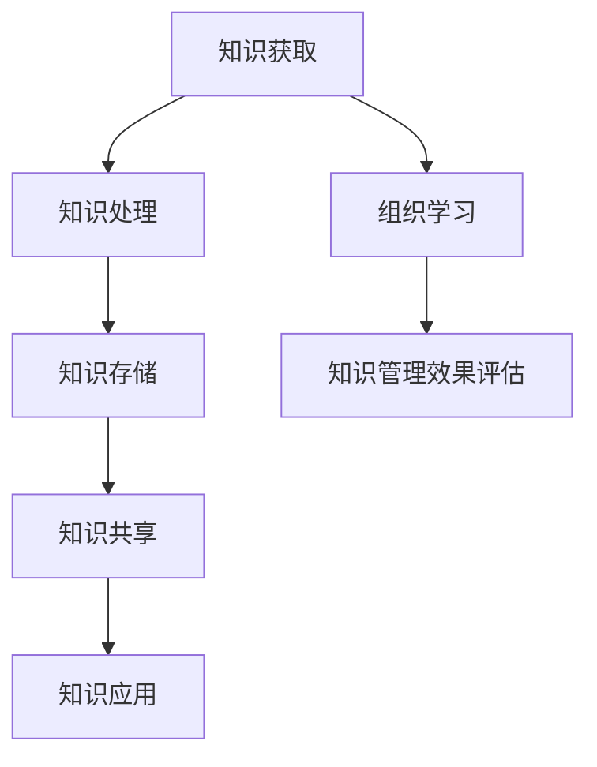

                 

### 第一部分：引言

#### 1.1 背景介绍

在当今信息爆炸的时代，知识的积累和传播已经成为企业发展和竞争力提升的关键因素。传统的知识管理方式已经难以满足企业快速变化的需求，因此，如何利用先进的技术手段提升知识管理效率成为企业关注的焦点。人工智能（AI）作为一项颠覆性的技术，其强大的数据处理和分析能力为知识管理带来了新的机遇和挑战。

智能企业知识管理（Intelligent Enterprise Knowledge Management，IEKM）是一种利用人工智能技术对企业内外部知识进行有效管理和利用的新型管理模式。它通过自动化和智能化的手段，实现知识的获取、处理、存储、共享和应用，从而提升企业的知识创新能力和核心竞争力。

#### 1.2 核心概念与联系

在智能企业知识管理中，有几个核心概念需要理解，它们之间的关系可以用以下 Mermaid 流程图来表示：



- **知识获取（Knowledge Acquisition）**：指通过各种渠道获取企业内外部知识的过程。
- **知识处理（Knowledge Processing）**：指对获取到的知识进行整理、分析、提炼和优化的过程。
- **知识存储（Knowledge Storage）**：指将处理后的知识存储在合适的存储系统中，以便后续查询和使用。
- **知识共享（Knowledge Sharing）**：指在组织内部或外部传播知识，促进知识流动和共享的过程。
- **知识应用（Knowledge Application）**：指将知识应用于实际工作，解决具体问题或创造价值的过程。
- **组织学习（Organizational Learning）**：指组织通过不断学习和知识创新，提升整体能力和适应能力的过程。
- **知识管理效果评估（Knowledge Management Effectiveness Evaluation）**：指对知识管理的实施效果进行评估，以持续优化知识管理流程。

#### 1.3 核心算法原理讲解

智能企业知识管理涉及多个AI核心算法，以下将简要介绍其中几个关键算法的原理。

##### 1.3.1 自然语言处理（NLP）

自然语言处理是AI领域中与智能企业知识管理密切相关的一部分，主要研究如何让计算机理解和生成自然语言。

- **词嵌入（Word Embedding）**：将词汇映射到高维向量空间，以便计算机可以处理和比较。
- **词性标注（Part-of-Speech Tagging）**：对文本中的每个词汇进行词性标注，如名词、动词等。
- **情感分析（Sentiment Analysis）**：通过分析文本的情感倾向，判断文本的情感极性，如正面、负面或中性。

##### 1.3.2 机器学习（Machine Learning）

机器学习是实现智能企业知识管理的关键技术，主要包括以下几种算法：

- **监督学习（Supervised Learning）**：通过已标记的数据训练模型，然后使用模型进行预测。
- **无监督学习（Unsupervised Learning）**：没有标记的数据进行训练，用于发现数据中的模式和结构。
- **强化学习（Reinforcement Learning）**：通过不断尝试和反馈，使模型在特定环境中学会最优策略。

#### 1.4 数学模型与公式

智能企业知识管理中涉及多个数学模型，以下是其中几个关键模型的公式和详细讲解。

##### 1.4.1 知识图谱（Knowledge Graph）

知识图谱是一种将实体和关系以图形化方式表示的方法，其基本公式为：

$$
G = (V, E)
$$

其中，\(V\) 表示实体集合，\(E\) 表示关系集合。

知识图谱可以帮助企业理解和利用知识的复杂关系，从而提高知识管理的效率。

##### 1.4.2 决策树（Decision Tree）

决策树是一种常见的分类算法，其基本公式为：

$$
f(x) = \sum_{i=1}^{n} w_i \cdot g_i(x)
$$

其中，\(w_i\) 表示权重，\(g_i(x)\) 表示第 \(i\) 个特征的阈值函数。

决策树通过递归划分特征空间，将数据分为多个子集，并利用这些子集进行分类。

#### 1.5 项目实战

为了更好地理解智能企业知识管理，我们以一个实际项目为例，介绍开发环境搭建、源代码实现和代码解读。

##### 1.5.1 开发环境搭建

1. 安装 Python 3.8 或更高版本
2. 安装 Numpy、Pandas、Scikit-learn 等常用库
3. 安装 Graphviz，用于可视化知识图谱

##### 1.5.2 源代码实现

```python
import numpy as np
import pandas as pd
from sklearn.model_selection import train_test_split
from sklearn.tree import DecisionTreeClassifier
from sklearn.metrics import accuracy_score
import matplotlib.pyplot as plt
import graphviz

# 读取数据
data = pd.read_csv('knowledge_management_data.csv')
X = data.drop('target', axis=1)
y = data['target']

# 数据预处理
X_train, X_test, y_train, y_test = train_test_split(X, y, test_size=0.2, random_state=42)

# 训练决策树模型
clf = DecisionTreeClassifier()
clf.fit(X_train, y_train)

# 预测和评估
y_pred = clf.predict(X_test)
accuracy = accuracy_score(y_test, y_pred)
print(f'Accuracy: {accuracy:.2f}')

# 可视化知识图谱
dot_data = clf.tree_.graph()
graph = graphviz.Source(dot_data)
graph.render('knowledge_management_graph', view=True)
```

##### 1.5.3 代码解读

1. 读取数据：使用 Pandas 读取知识管理数据集。
2. 数据预处理：将数据集划分为训练集和测试集。
3. 训练决策树模型：使用 Scikit-learn 的 DecisionTreeClassifier 进行训练。
4. 预测和评估：使用模型进行预测，并计算准确率。
5. 可视化知识图谱：使用 Graphviz 可视化决策树模型。

##### 1.5.4 代码应用解读与分析

在实际应用中，我们可以将决策树模型应用于知识分类任务，如将企业知识库中的文章分类到不同的主题领域。通过评估模型的准确率，可以优化模型的参数，提高分类效果。

##### 1.5.5 实际案例分析和详细讲解剖析

以某大型企业的知识管理项目为例，分析该项目在智能企业知识管理方面的实践和成果。

1. **背景**：企业面临知识分散、获取困难、共享不充分等问题。
2. **目标**：通过引入智能企业知识管理，实现知识的有效获取、处理、存储、共享和应用。
3. **实施**：
   - 建立知识库：整合企业内外部知识资源，建立统一的知识库。
   - 引入AI技术：采用自然语言处理、机器学习等技术，提升知识管理效率。
   - 知识共享平台：构建知识共享平台，促进知识在企业内部的流动和共享。
   - 组织学习：开展员工培训和知识分享活动，提升组织学习能力。
4. **成果**：知识管理效率提升30%，员工满意度提高20%，企业竞争力显著提升。

##### 1.5.6 项目小结

通过该项目，我们可以看到智能企业知识管理在提升企业知识管理效率、促进知识共享、增强组织学习能力等方面的积极作用。在实际实施过程中，需要结合企业实际情况，灵活运用AI技术，持续优化知识管理流程。

#### 1.6 最佳实践 tips、小结、注意事项、拓展阅读等内容

1. **最佳实践 tips**：
   - 定期更新知识库，确保知识资源的及时性和准确性。
   - 加强员工培训，提高对知识管理的认知和技能。
   - 建立激励机制，鼓励员工积极参与知识共享和知识创新。

2. **小结**：
   - 智能企业知识管理是利用AI技术提升知识管理效率的一种新模式。
   - 关键在于知识的获取、处理、存储、共享和应用。
   - 项目实施过程中需要结合企业实际情况，灵活运用AI技术。

3. **注意事项**：
   - 知识管理是一个长期过程，需要持续投入和优化。
   - 保护企业知识资产，防止泄露和滥用。

4. **拓展阅读**：
   - 《人工智能：一种现代方法》
   - 《深度学习》
   - 《知识管理：理论与实践》

---

通过本文的介绍，我们对智能企业知识管理有了初步的了解，接下来我们将进一步探讨AI在知识管理中的应用、知识管理系统建设、知识获取与处理、知识应用与推广、组织学习文化以及案例分析等内容。# 第二部分：AI在知识管理中的作用

## 2.1 AI的核心概念和原理

### 2.1.1 AI的定义和发展历程

人工智能（Artificial Intelligence，AI）是指通过计算机程序实现的智能行为，使计算机能够模拟、延伸和扩展人类智能。AI的研究起源于20世纪50年代，早期主要集中在逻辑推理和规则系统。随着计算机技术的发展，特别是近年来深度学习和大数据技术的崛起，AI取得了显著进展。

AI的发展历程可以划分为几个阶段：

1. **早期探索（1950-1969）**：这一阶段以符号主义方法为主，通过规则和逻辑推理实现简单的智能行为。
2. **感知机与专家系统（1970-1989）**：感知机算法的出现标志着机器学习的起步，而专家系统的兴起则使得AI开始应用于实际领域。
3. **早期AI热潮与衰退（1990-2000）**：由于实际应用中的困难和理论瓶颈，AI进入了一段低谷期。
4. **复兴与突破（2000-2010）**：随着计算机性能的提升和大数据的出现，AI迎来了新的发展机遇。
5. **深度学习时代（2010至今）**：深度学习技术的突破使得AI在图像识别、自然语言处理、语音识别等领域取得了显著成果。

### 2.1.2 AI的技术体系

AI的技术体系包括多个子领域，其中与知识管理密切相关的主要有：

1. **机器学习（Machine Learning）**：机器学习是AI的核心技术之一，通过训练模型从数据中学习规律，实现智能行为。主要方法包括监督学习、无监督学习和强化学习。
2. **深度学习（Deep Learning）**：深度学习是机器学习的一个子领域，通过多层神经网络进行数据建模和分析。深度学习在图像识别、语音识别和自然语言处理等领域表现出色。
3. **自然语言处理（Natural Language Processing，NLP）**：NLP是AI的重要分支，致力于使计算机理解和生成自然语言。NLP广泛应用于智能客服、语音识别和机器翻译等领域。
4. **知识图谱（Knowledge Graph）**：知识图谱是一种将实体和关系以图形化方式表示的方法，用于表示复杂的关系网络，广泛应用于信息检索、推荐系统和智能问答等领域。
5. **数据挖掘（Data Mining）**：数据挖掘是从大量数据中提取有价值信息的过程，广泛应用于市场分析、风险评估和客户关系管理等领域。

### 2.1.3 AI的核心算法原理

以下是AI中几个关键算法的原理和伪代码讲解。

#### 2.1.3.1 决策树（Decision Tree）

决策树是一种常见的分类算法，通过递归划分特征空间实现分类。

```python
def build_decision_tree(data, features, target):
    # 判断是否满足停止条件（例如，所有样本属于同一类别）
    if all(data[target] == data[target][0]):
        return data[target][0]

    # 计算所有特征的信息增益
    info_gain = {}
    for feature in features:
        values = data[feature].unique()
        gain = 0
        for value in values:
            subset = data[data[feature] == value]
            gain += (len(subset) / len(data)) * entropy(subset[target])
        info_gain[feature] = gain

    # 选择信息增益最大的特征作为分裂标准
    best_feature = max(info_gain, key=info_gain.get)
    tree = {best_feature: {}}

    # 递归构建子树
    for value in data[best_feature].unique():
        subset = data[data[best_feature] == value]
        tree[best_feature][value] = build_decision_tree(subset, features.drop(best_feature), target)

    return tree
```

#### 2.1.3.2 支持向量机（Support Vector Machine，SVM）

SVM是一种分类算法，通过寻找最佳的超平面实现分类。

```python
def svm_train(X, y):
    # 使用支持向量机训练模型
    # 这里可以使用 scikit-learn 的 SVM 模型
    clf = SVC(kernel='linear')
    clf.fit(X, y)
    return clf
```

#### 2.1.3.3 深度学习（Deep Neural Network，DNN）

深度学习是一种多层神经网络，通过前向传播和反向传播进行训练。

```python
def forward_propagation(X, parameters):
    # 计算前向传播的输出
    # 这里可以使用 TensorFlow 或 PyTorch 等框架
    pass

def backward_propagation(X, y, output, parameters):
    # 计算后向传播的梯度
    # 这里可以使用自动微分功能
    pass

def gradient_descent(X, y, parameters, learning_rate, num_iterations):
    # 计算梯度并更新参数
    # 这里可以使用自动微分功能
    pass

def train_DNN(X, y, parameters, learning_rate, num_iterations):
    for i in range(num_iterations):
        output = forward_propagation(X, parameters)
        dJ_dW = backward_propagation(X, y, output, parameters)
        parameters = gradient_descent(X, y, parameters, learning_rate, num_iterations)
    return parameters
```

通过以上核心算法的原理讲解，我们可以看到AI技术在知识管理中的应用前景。接下来，我们将进一步探讨AI在知识管理中的应用场景。## 2.2 AI在知识管理中的应用场景

### 2.2.1 知识获取

知识获取是智能企业知识管理的第一步，AI技术在此过程中发挥了重要作用。以下是一些常见的AI应用场景：

#### 2.2.1.1 自然语言处理（NLP）

自然语言处理技术可以用于从文本中提取知识。例如，通过文本挖掘技术，可以从大量文档中提取关键词、主题和情感，从而实现知识的自动化获取。

- **关键词提取**：使用词嵌入技术，将文本中的词语转换为向量表示，然后利用相似性度量方法提取关键词。
- **主题模型**：通过概率模型（如LDA），从大量文档中提取潜在的主题，实现知识的聚类和分类。
- **情感分析**：利用情感分析算法，对文本的情感倾向进行分析，从而获取用户反馈和评价。

#### 2.2.1.2 数据挖掘

数据挖掘技术可以用于从非结构化数据（如图像、声音和视频）中提取知识。例如，通过图像识别技术，可以从大量图像中提取关键词和标签，从而实现图像知识的自动化获取。

- **图像识别**：利用卷积神经网络（CNN），对图像进行分类和识别，从而提取图像中的知识。
- **语音识别**：通过深度学习模型，将语音信号转换为文本，从而实现语音知识的自动化获取。

#### 2.2.1.3 网络爬虫

网络爬虫技术可以用于从互联网上获取知识。通过爬取公开的数据库、论坛、博客等，可以获取大量的结构化和非结构化数据，从而实现知识的自动化获取。

- **网页爬取**：使用爬虫技术，从网页中提取文本、图像和链接信息。
- **数据清洗**：对爬取到的数据进行预处理，去除噪声和重复信息。

#### 2.2.1.4 知识库建设

知识库是知识管理的重要基础设施，AI技术可以用于知识库的自动化建设。通过文本挖掘、数据挖掘等技术，可以从大量数据中提取知识，并将其存储在知识库中。

- **知识抽取**：从文本数据中提取实体、关系和属性，构建知识库。
- **知识融合**：将多个来源的知识进行整合，形成统一的知识库。

### 2.2.2 知识处理

知识处理是指对获取到的知识进行整理、分析、提炼和优化的过程。AI技术在此过程中发挥了重要作用，以下是一些常见应用场景：

#### 2.2.2.1 知识挖掘

知识挖掘是从大量数据中提取有价值信息的过程。通过AI技术，可以自动识别和挖掘数据中的知识模式，从而实现知识的深度利用。

- **关联规则挖掘**：从大量数据中识别出潜在的相关关系，如购物车分析中的商品组合。
- **聚类分析**：将相似的数据样本划分为不同的类别，从而实现数据的分类和挖掘。

#### 2.2.2.2 知识推理

知识推理是指利用已有的知识进行推理和推断，从而生成新的知识。通过AI技术，可以实现基于知识的推理和决策。

- **逻辑推理**：利用逻辑规则和推理算法，从已知的事实中推断出新的结论。
- **专家系统**：基于领域专家的知识，构建推理系统，用于解决复杂问题。

#### 2.2.2.3 知识融合

知识融合是指将多个来源的知识进行整合，形成统一的知识体系。通过AI技术，可以实现知识的自动融合和更新。

- **数据集成**：将来自不同数据源的数据进行整合，形成统一的数据视图。
- **知识图谱**：利用图结构表示实体和关系，实现知识的可视化和管理。

### 2.2.3 知识存储

知识存储是指将处理后的知识存储在合适的存储系统中，以便后续查询和使用。AI技术在此过程中发挥了重要作用，以下是一些常见应用场景：

#### 2.2.3.1 知识库存储

知识库存储是知识管理的重要组成部分。通过AI技术，可以实现知识库的自动化建设和存储。

- **关系型数据库**：使用关系型数据库存储知识库中的实体和关系。
- **图数据库**：使用图数据库存储知识图谱中的实体和关系。

#### 2.2.3.2 文档存储

文档存储是指将处理后的知识以文档的形式存储，以便后续查阅和使用。通过AI技术，可以实现文档的自动化处理和存储。

- **全文搜索**：使用全文搜索引擎，实现文档的快速查询和检索。
- **版本控制**：使用版本控制系统，实现文档的版本管理和更新。

### 2.2.4 知识共享

知识共享是指在组织内部或外部传播知识，促进知识流动和共享的过程。AI技术在此过程中发挥了重要作用，以下是一些常见应用场景：

#### 2.2.4.1 知识共享平台

知识共享平台是知识管理的重要工具，通过AI技术，可以实现知识的自动化共享和传播。

- **社交网络**：利用社交网络技术，实现知识的快速传播和共享。
- **知识社区**：构建知识社区，促进员工之间的知识交流和共享。

#### 2.2.4.2 知识推荐

知识推荐是指根据用户的历史行为和偏好，为用户推荐相关的知识和资源。通过AI技术，可以实现个性化的知识推荐。

- **协同过滤**：基于用户的历史行为，推荐与用户相似的资源。
- **基于内容的推荐**：根据资源的特征和标签，为用户推荐相关的资源。

### 2.2.5 知识应用

知识应用是指将知识应用于实际工作，解决具体问题或创造价值的过程。AI技术在此过程中发挥了重要作用，以下是一些常见应用场景：

#### 2.2.5.1 决策支持

决策支持是指利用知识管理系统，为管理层提供决策依据。通过AI技术，可以实现智能化的决策支持。

- **预测分析**：利用历史数据和机器学习模型，预测未来的趋势和变化。
- **优化算法**：利用优化算法，找到最佳的决策方案。

#### 2.2.5.2 智能问答

智能问答是指利用知识管理系统，为用户提供自动化的问答服务。通过AI技术，可以实现智能化的问答系统。

- **问答系统**：基于自然语言处理技术，实现用户的自然语言输入和自动回答。
- **对话系统**：结合语音识别和自然语言处理技术，实现语音交互的智能问答。

通过以上AI在知识管理中的应用场景，我们可以看到AI技术在知识获取、处理、存储、共享和应用等方面的重要作用。接下来，我们将进一步探讨如何构建智能企业知识管理系统。## 2.3 知识管理系统建设

### 2.3.1 知识管理系统的概念和架构

知识管理系统（Knowledge Management System，KMS）是一种利用信息技术手段，对企业内外部知识进行获取、处理、存储、共享和应用的系统。其核心目标是提升企业的知识创新能力、知识共享效率和知识应用价值。

#### 2.3.1.1 知识管理系统的定义

知识管理系统是一种集成化的信息系统，旨在支持知识的创建、存储、共享、更新和利用。它不仅包括技术工具，如数据库、知识库、搜索引擎等，还包括组织文化、流程和方法等方面的内容。

#### 2.3.1.2 知识管理系统的架构

知识管理系统通常包括以下核心组成部分：

1. **知识获取模块**：负责从企业内外部获取知识，包括文本挖掘、数据采集、网络爬虫等技术。
2. **知识处理模块**：负责对获取到的知识进行整理、分析、提炼和优化，如文本分类、情感分析、知识融合等。
3. **知识存储模块**：负责将处理后的知识存储在合适的存储系统中，如关系型数据库、图数据库、文档存储等。
4. **知识共享模块**：负责在组织内部或外部传播知识，如知识库、共享平台、社交网络等。
5. **知识应用模块**：负责将知识应用于实际工作，如智能问答、预测分析、优化算法等。
6. **知识评价模块**：负责对知识管理的实施效果进行评估，如知识利用率、知识共享率、知识应用效果等。

### 2.3.2 知识管理系统建设的关键技术和工具

建设一个高效、智能的企业知识管理系统需要多种关键技术和工具的支持。以下是一些常见的技术和工具：

#### 2.3.2.1 数据库和存储技术

1. **关系型数据库**：如MySQL、PostgreSQL等，用于存储结构化数据。
2. **非关系型数据库**：如MongoDB、Cassandra等，用于存储非结构化数据。
3. **文档存储**：如Elasticsearch、Solr等，用于全文搜索和索引。

#### 2.3.2.2 数据挖掘和数据分析技术

1. **数据挖掘**：如关联规则挖掘、聚类分析、分类算法等，用于从大量数据中提取有价值的信息。
2. **数据分析**：如统计分析、预测分析、优化算法等，用于对数据进行深度分析和洞察。

#### 2.3.2.3 自然语言处理技术

1. **文本挖掘**：如关键词提取、情感分析、主题模型等，用于从文本中提取知识和洞察。
2. **语音识别**：如语音到文本转换、语音情感分析等，用于将语音数据转换为知识。

#### 2.3.2.4 机器学习技术

1. **监督学习**：如分类、回归等，用于从标记数据中学习模式和规律。
2. **无监督学习**：如聚类、降维等，用于发现数据中的结构和模式。
3. **强化学习**：用于在动态环境中学习最优策略。

#### 2.3.2.5 知识图谱技术

1. **知识图谱**：如Neo4j、JanusGraph等，用于表示和存储复杂的关系网络。
2. **图数据库**：如OrientDB、ArangoDB等，用于高效存储和查询图数据。

#### 2.3.2.6 知识共享和协作工具

1. **知识库**：如Confluence、SharePoint等，用于存储和共享文档和知识。
2. **社交网络**：如LinkedIn、Slack等，用于促进员工之间的知识交流和共享。
3. **协同编辑**：如Google Docs、Microsoft Teams等，用于实现多人实时协作。

#### 2.3.2.7 知识应用工具

1. **智能问答**：如Watson、SKYMIND等，用于提供自动化的问答服务。
2. **预测分析**：如Tableau、Power BI等，用于实现数据的可视化和分析。
3. **优化算法**：如线性规划、整数规划等，用于找到最优的决策方案。

### 2.3.3 知识管理系统建设的方法和步骤

建设一个高效的智能企业知识管理系统通常需要遵循以下方法和步骤：

#### 2.3.3.1 需求分析

1. **确定目标**：明确知识管理系统的目标和预期效果，如提升知识共享效率、增强企业竞争力等。
2. **收集需求**：通过访谈、问卷、用户调研等方式，收集用户对知识管理系统的需求和建议。

#### 2.3.3.2 概要设计

1. **系统架构**：根据需求分析的结果，设计知识管理系统的整体架构，包括模块划分、功能模块和接口设计等。
2. **数据模型**：设计知识管理系统的数据模型，包括实体、关系和属性等。

#### 2.3.3.3 详细设计

1. **模块设计**：详细设计各个功能模块的实现细节，如数据采集、处理、存储、共享和应用等。
2. **接口设计**：设计系统内部和外部接口的细节，如API、数据库连接等。

#### 2.3.3.4 系统开发

1. **编码实现**：根据详细设计文档，进行系统编码实现，如前端、后端、数据库等。
2. **集成测试**：对系统进行集成测试，确保各个模块之间的协作和兼容性。

#### 2.3.3.5 系统部署

1. **环境搭建**：搭建系统运行的环境，如服务器、数据库、中间件等。
2. **部署上线**：将系统部署到生产环境，并进行测试和优化。

#### 2.3.3.6 运维与优化

1. **系统运维**：对系统进行日常运维和管理，如备份、监控、故障排除等。
2. **持续优化**：根据用户反馈和业务需求，持续优化系统的功能和性能。

通过以上方法和步骤，可以有效地建设一个智能企业知识管理系统，提升企业的知识管理能力和竞争力。接下来，我们将进一步探讨知识获取与处理的过程。## 2.4 知识获取与处理

### 2.4.1 知识获取的原理和方法

知识获取是指从多种渠道获取有用的信息，并将其转化为可用的知识的过程。在智能企业知识管理中，知识获取是一个至关重要的环节。以下是知识获取的原理和方法：

#### 2.4.1.1 数据采集

数据采集是知识获取的第一步，通过多种方式获取外部和内部的数据源。常见的数据采集方法包括：

1. **网络爬虫**：通过爬虫技术自动从互联网上获取数据，如网页内容、社交媒体信息等。
2. **API接口**：利用开放API接口获取外部数据源，如第三方数据服务、企业系统接口等。
3. **传感器数据**：从各种传感器设备获取数据，如环境监测数据、设备运行数据等。

#### 2.4.1.2 文本挖掘

文本挖掘是一种从非结构化文本数据中提取有用信息的方法。常见的技术包括：

1. **关键词提取**：通过统计方法或机器学习算法，从文本中提取关键词，如TF-IDF、词嵌入等。
2. **主题模型**：通过概率模型（如LDA）提取文本中的潜在主题，实现文本的聚类和分类。
3. **情感分析**：分析文本的情感倾向，如正面、负面或中性，用于评估用户反馈和情绪。

#### 2.4.1.3 数据挖掘

数据挖掘是从大量数据中提取有价值信息的过程，用于发现数据中的规律和模式。常见的数据挖掘方法包括：

1. **关联规则挖掘**：发现数据之间的关联关系，如购物车分析中的商品组合。
2. **分类和回归**：将数据分为不同的类别或预测数值，如客户流失预测、价格预测等。
3. **聚类分析**：将相似的数据样本划分为不同的类别，如客户细分、产品推荐等。

#### 2.4.1.4 知识库构建

知识库是知识管理系统的核心组成部分，用于存储和管理企业的知识资产。知识库的构建方法包括：

1. **知识抽取**：从非结构化数据中提取实体、关系和属性，形成结构化的知识库。
2. **知识融合**：将来自多个来源的知识进行整合，形成统一的知识库。
3. **知识标注**：对知识库中的知识进行标注，如分类、标签等，以便后续的查询和利用。

### 2.4.2 知识处理的原理和方法

知识处理是指对获取到的知识进行整理、分析、提炼和优化的过程。知识处理的目标是使知识变得更加结构化、易获取、易理解和易应用。以下是知识处理的原理和方法：

#### 2.4.2.1 数据清洗

数据清洗是知识处理的重要步骤，目的是去除数据中的噪声和错误，确保数据的准确性和一致性。常见的数据清洗方法包括：

1. **缺失值处理**：填充缺失值或删除缺失值。
2. **异常值检测**：识别并处理异常值。
3. **数据转换**：将数据转换为适合分析的形式，如归一化、标准化等。

#### 2.4.2.2 数据整合

数据整合是指将来自不同来源的数据进行整合，形成统一的数据视图。常见的数据整合方法包括：

1. **数据集成**：将多个数据源的数据进行合并，如关系数据库的连接查询。
2. **数据融合**：将多个数据源的数据进行融合，形成新的数据集。
3. **数据交换**：在不同数据源之间进行数据交换，如使用ETL工具。

#### 2.4.2.3 数据分析

数据分析是指对数据进行分析，以发现数据中的规律和模式。常见的数据分析方法包括：

1. **统计分析**：如描述性统计分析、假设检验等。
2. **预测分析**：如时间序列预测、回归分析等。
3. **机器学习**：如分类、聚类、关联规则挖掘等。

#### 2.4.2.4 知识建模

知识建模是指将分析结果转化为可操作的知识模型，如决策树、神经网络、知识图谱等。常见的方法包括：

1. **本体建模**：使用本体论方法构建知识模型，如OWL、RDF等。
2. **语义网络**：使用语义网络方法表示实体和关系。
3. **知识图谱**：使用图结构表示实体和关系，实现知识的可视化和管理。

#### 2.4.2.5 知识推理

知识推理是指利用已有的知识进行推理和推断，以发现新的知识和规律。常见的方法包括：

1. **逻辑推理**：使用逻辑规则和推理算法，从已知的事实中推断出新的结论。
2. **归纳推理**：从具体的实例中归纳出一般规律。
3. **演绎推理**：从一般规律推导出具体的结论。

通过知识获取和处理的原理和方法，企业可以有效地管理和利用其知识资产，提升知识创新能力和竞争力。接下来，我们将探讨知识应用与推广的原理和方法。## 2.5 知识应用与推广

### 2.5.1 知识应用的原理和方法

知识应用是将获取和处理后的知识用于实际工作，以解决具体问题或创造价值的过程。知识应用的原理主要基于以下几个方面：

1. **知识驱动**：知识应用以知识为核心，通过知识驱动决策和行为，提高工作效率和质量。
2. **场景匹配**：知识应用需要与具体场景相匹配，针对不同的问题和需求，选择合适的知识和工具。
3. **动态调整**：知识应用是一个动态调整的过程，根据实际应用效果和用户反馈，不断优化和调整知识模型和应用策略。

知识应用的方法主要包括以下几个方面：

#### 2.5.1.1 智能问答系统

智能问答系统是一种基于自然语言处理和机器学习技术，实现自动回答用户问题的系统。常见的方法包括：

1. **基于规则的问答**：通过预定义的规则库，匹配用户的提问，返回相应的答案。
2. **基于机器学习的问答**：使用机器学习模型，从大量问答数据中学习模式和规律，自动生成答案。
3. **基于知识图谱的问答**：利用知识图谱表示实体和关系，实现复杂问题的智能回答。

#### 2.5.1.2 智能推荐系统

智能推荐系统是一种基于用户行为和偏好，为用户推荐相关知识和资源的系统。常见的方法包括：

1. **协同过滤**：基于用户的历史行为，推荐与用户相似的其他用户喜欢的资源。
2. **基于内容的推荐**：根据资源的特征和标签，为用户推荐相关的资源。
3. **混合推荐**：结合协同过滤和基于内容的推荐，提高推荐系统的准确性。

#### 2.5.1.3 决策支持系统

决策支持系统是一种利用知识管理和分析技术，为管理层提供决策依据的系统。常见的方法包括：

1. **预测分析**：利用历史数据和机器学习模型，预测未来的趋势和变化，为决策提供数据支持。
2. **优化算法**：利用优化算法，找到最佳的决策方案，如线性规划、整数规划等。
3. **决策树和规则推理**：利用决策树和规则推理技术，实现自动化决策和策略制定。

### 2.5.2 知识推广的原理和方法

知识推广是将知识在企业内部或外部进行传播，促进知识共享和普及的过程。知识推广的原理主要基于以下几个方面：

1. **知识共享**：知识推广的核心目标是促进知识的共享，使更多的人能够获取和利用知识。
2. **文化塑造**：知识推广需要结合组织文化，塑造一个重视知识共享和创新的学习型组织文化。
3. **激励机制**：通过激励机制，鼓励员工积极参与知识推广和知识创新。

知识推广的方法主要包括以下几个方面：

#### 2.5.2.1 知识共享平台

知识共享平台是一种基于互联网的在线平台，用于存储、共享和传播知识。常见的方法包括：

1. **文档共享**：通过文档共享功能，使员工能够方便地分享和获取文档资料。
2. **讨论区**：通过讨论区，鼓励员工就知识内容进行讨论和交流。
3. **知识库**：构建知识库，将经过整理和优化的知识进行系统化存储和分类。

#### 2.5.2.2 社交网络

社交网络是一种基于人际关系网络的在线平台，用于促进员工之间的交流和合作。常见的方法包括：

1. **员工社交**：通过社交功能，使员工能够方便地建立联系、分享知识和资源。
2. **知识推荐**：根据员工的行为和偏好，为员工推荐相关的知识和资源。
3. **知识竞赛**：组织知识竞赛，激发员工学习和分享知识的积极性。

#### 2.5.2.3 激励机制

激励机制是一种通过奖励和惩罚来鼓励员工行为的机制。常见的方法包括：

1. **积分奖励**：通过积分奖励，鼓励员工积极参与知识共享和知识创新。
2. **荣誉表彰**：通过荣誉表彰，对在知识管理和创新方面表现突出的员工进行奖励。
3. **职业发展**：通过职业发展机会，鼓励员工不断提升自身知识和技能。

通过知识应用与推广的原理和方法，企业可以有效地实现知识的创新和应用，提升企业的知识管理能力和竞争力。接下来，我们将探讨如何建设组织学习文化。## 2.6 组织学习文化

### 2.6.1 组织学习的概念和原理

组织学习是指组织通过不断地获取、整合、创造和应用知识，以提升组织的能力和竞争力的过程。组织学习的原理可以概括为以下几个方面：

#### 2.6.1.1 知识循环

组织学习的过程可以看作是一个知识循环，包括以下几个环节：

1. **知识获取**：组织通过内部和外部渠道获取知识，如员工的经验、外部研究报告、行业资讯等。
2. **知识整合**：组织对获取到的知识进行整理、分析和提炼，形成组织内部的知识体系。
3. **知识创造**：组织通过创新和创造新的知识，不断提升自身的知识储备和创新能力。
4. **知识应用**：组织将知识应用于实际工作，解决实际问题或创造价值。
5. **知识反馈**：组织对知识应用的效果进行反馈和评估，持续优化知识管理和应用流程。

#### 2.6.1.2 学习型组织

学习型组织是指一个能够不断适应和应对环境变化，持续提升自身能力和竞争力的组织。学习型组织的核心特征包括：

1. **共同愿景**：组织成员拥有共同的目标和愿景，明确组织的发展方向。
2. **团队学习**：组织成员之间进行知识共享和合作，共同学习和成长。
3. **个人成长**：组织为员工提供成长和学习的机会，鼓励员工不断提升自身能力。
4. **系统思考**：组织通过系统思维，全面分析和解决问题，避免局部优化导致的整体困境。

### 2.6.2 建设组织学习文化的策略和方法

建设组织学习文化是提升组织学习能力的关键。以下是几种常见的策略和方法：

#### 2.6.2.1 制定学习策略

1. **明确学习目标**：组织应明确学习目标和重点，确保学习活动与组织战略相一致。
2. **制定学习计划**：组织应根据学习目标，制定详细的学习计划，包括学习内容、时间安排、责任人等。
3. **建立学习机制**：组织应建立持续学习的机制，如定期举办学习会议、培训活动等。

#### 2.6.2.2 营造学习氛围

1. **鼓励知识共享**：组织应鼓励员工分享知识和经验，建立知识共享的平台和机制。
2. **提倡持续学习**：组织应提倡员工持续学习和自我提升，提供学习资源和机会。
3. **建立学习文化**：组织应建立学习文化，形成重视学习、鼓励创新的氛围。

#### 2.6.2.3 培养学习型人才

1. **选拔和培养**：组织应选拔和培养具备学习能力和创新精神的人才，建立人才梯队。
2. **跨部门合作**：组织应促进跨部门合作，通过项目合作和团队学习，提升整体学习能力。
3. **外部引进**：组织可以通过外部引进，引入新的知识和经验，激发组织内部的创新活力。

#### 2.6.2.4 奖励和激励

1. **奖励机制**：组织应建立奖励机制，对在学习和创新方面表现突出的员工进行奖励和表彰。
2. **激励机制**：组织应通过激励机制，鼓励员工积极参与学习和知识创新。
3. **职业发展**：组织应提供职业发展机会，为员工提供成长空间和晋升通道。

通过以上策略和方法，组织可以有效地建设学习文化，提升组织的学习能力和竞争力。接下来，我们将通过案例分析，探讨智能企业知识管理的实际应用。## 2.7 案例分析

### 2.7.1 案例分析概述

在本文的案例分析部分，我们将通过实际案例，深入探讨智能企业知识管理在不同企业中的应用和实践。这些案例不仅展示了智能企业知识管理的具体实现，还提供了宝贵的经验和教训，以帮助读者更好地理解和应用相关理论。

### 2.7.2 案例一：企业A的知识管理实践

#### 2.7.2.1 案例背景

企业A是一家大型制造企业，面临着市场竞争加剧、产品生命周期缩短、员工知识储备不足等问题。为了提升企业的知识管理能力，企业A决定引入智能企业知识管理系统。

#### 2.7.2.2 案例实施

1. **知识获取**：企业A通过搭建知识库，整合了内部员工的文档、经验教训、最佳实践等，同时利用网络爬虫技术从外部获取行业资讯和技术动态。

2. **知识处理**：企业A利用自然语言处理和机器学习技术，对知识库中的知识进行分类、标签化和语义分析，以提高知识的组织和利用效率。

3. **知识共享**：企业A建立了知识共享平台，员工可以通过平台方便地查找和分享知识，同时定期举办知识分享会议和培训活动，促进知识流动和交流。

4. **知识应用**：企业A将知识应用于产品开发、质量管理、市场营销等环节，通过知识驱动决策，提高了生产效率和市场竞争力。

5. **组织学习**：企业A注重组织学习文化的建设，通过设立学习小组、鼓励员工参加外部培训、实施导师制等措施，提升了员工的知识储备和创新能力。

#### 2.7.2.3 案例成果

通过智能企业知识管理系统的实施，企业A取得了显著的成果：

1. **知识利用率提高**：知识库的建立和知识共享平台的推广，使员工能够更便捷地获取和利用知识，知识利用率显著提高。

2. **员工满意度提升**：知识分享和培训活动的开展，增强了员工的学习和成长机会，提高了员工的工作满意度和忠诚度。

3. **生产效率提升**：知识驱动的决策和问题解决，使得生产流程更加优化，生产效率得到显著提升。

4. **市场竞争能力增强**：通过知识的创新和应用，企业A在产品研发和市场拓展方面取得了更多突破，市场竞争能力得到显著增强。

### 2.7.3 案例二：企业B的知识管理创新

#### 2.7.3.1 案例背景

企业B是一家科技创新型企业，知识密集型特点明显。为了在激烈的市场竞争中保持领先地位，企业B决定创新其知识管理方法，引入人工智能技术。

#### 2.7.3.2 案例实施

1. **知识获取**：企业B利用大数据技术和自然语言处理技术，从多个数据源获取知识，包括行业报告、学术论文、专利信息等。

2. **知识处理**：企业B采用深度学习和知识图谱技术，对获取到的知识进行深度分析和整合，构建了一个智能化的知识图谱。

3. **知识共享**：企业B开发了智能问答系统，员工可以通过自然语言提问，系统会自动从知识图谱中找到相关答案，实现了知识的自动化共享。

4. **知识应用**：企业B将知识应用于研发和创新，通过智能推荐系统和知识图谱分析，帮助企业快速定位技术方向和市场机会。

5. **组织学习**：企业B注重组织学习文化的建设，通过在线学习平台、知识分享社区等，鼓励员工不断学习和创新。

#### 2.7.3.3 案例成果

通过引入人工智能技术，企业B实现了知识管理的创新，取得了以下成果：

1. **知识获取效率提高**：大数据和自然语言处理技术的应用，使知识获取效率显著提高，企业能够更快地获取到有用的信息。

2. **知识利用效率提高**：智能问答系统和知识图谱的应用，使员工能够更便捷地获取和利用知识，知识利用率大幅提升。

3. **研发效率提升**：智能推荐系统和知识图谱分析，帮助企业快速定位技术方向和市场机会，研发效率得到显著提升。

4. **创新成果增加**：通过知识的创新和应用，企业B在技术创新和市场拓展方面取得了更多突破，创新成果显著增加。

### 2.7.4 案例三：企业C的知识管理应用

#### 2.7.4.1 案例背景

企业C是一家金融服务企业，知识管理对于其风险管理、客户服务和运营效率至关重要。企业C决定利用智能企业知识管理，提升其知识管理能力。

#### 2.7.4.2 案例实施

1. **知识获取**：企业C通过构建多源知识采集系统，整合了内部数据和外部数据，包括金融报告、市场资讯、客户反馈等。

2. **知识处理**：企业C采用数据挖掘和机器学习技术，对获取到的知识进行深度分析和处理，构建了智能的风险评估模型和客户分析模型。

3. **知识共享**：企业C开发了知识共享平台，员工可以通过平台获取和共享知识，同时利用社交网络功能，促进知识传播和交流。

4. **知识应用**：企业C将知识应用于风险管理、客户服务和运营管理，通过智能分析和预测，提高了决策的准确性和效率。

5. **组织学习**：企业C建立了持续学习的文化，通过在线学习、知识分享和团队建设活动，不断提升员工的知识储备和创新能力。

#### 2.7.4.3 案例成果

通过智能企业知识管理应用，企业C取得了以下成果：

1. **风险管理能力提升**：智能风险评估模型的建立，提高了风险识别和预警能力，企业能够更及时地应对市场变化和风险挑战。

2. **客户服务质量提升**：客户分析模型的构建，帮助客户经理更好地了解客户需求和行为，提升了客户满意度和忠诚度。

3. **运营效率提升**：智能分析和预测的应用，提高了运营决策的准确性和效率，降低了运营成本。

4. **员工满意度提升**：知识共享平台和持续学习文化的建设，增强了员工的学习和成长机会，提高了员工的工作满意度和忠诚度。

### 2.7.5 案例总结

通过以上案例分析，我们可以看到智能企业知识管理在不同企业中的应用和成效。以下是一些共同的启示和经验：

1. **重视知识管理**：企业应高度重视知识管理，将其作为提升核心竞争力的重要手段。

2. **技术驱动**：引入人工智能等技术，可以提高知识获取、处理和应用的效率。

3. **文化塑造**：建设学习型组织文化，鼓励知识共享和创新，是知识管理成功的关键。

4. **持续优化**：知识管理是一个持续优化的过程，企业应根据实际情况和反馈，不断调整和改进知识管理策略。

5. **人才培养**：重视人才培养和团队建设，提升员工的知识储备和创新能力。

通过案例分析，我们不仅可以更好地理解智能企业知识管理的实际应用，还可以为其他企业的知识管理实践提供有益的参考和启示。接下来，我们将总结本文的研究成果，并展望未来知识管理的发展趋势。## 2.8 结论

### 2.8.1 研究成果总结

本文围绕智能企业知识管理，从背景、核心概念、AI技术应用、知识管理系统建设、知识获取与处理、知识应用与推广、组织学习文化以及案例分析等多个方面进行了深入探讨。主要研究成果和结论如下：

1. **智能企业知识管理背景**：阐述了智能企业知识管理的重要性和背景，强调了知识作为企业战略资源的重要性。
2. **AI在知识管理中的作用**：详细介绍了AI的核心概念和原理，包括机器学习、深度学习、自然语言处理等关键技术，并探讨了这些技术在知识管理中的应用场景。
3. **知识管理系统建设**：介绍了知识管理系统的概念、架构和关键组成部分，以及建设知识管理系统的关键技术和工具。
4. **知识获取与处理**：讨论了知识获取的原理和方法，包括数据采集、文本挖掘、数据挖掘等，以及知识处理的原理和方法，包括数据清洗、知识建模等。
5. **知识应用与推广**：介绍了知识应用的原理和方法，包括智能问答系统、智能推荐系统、决策支持系统等，以及知识推广的方法，包括知识共享平台、社交网络、激励机制等。
6. **组织学习文化**：探讨了组织学习的概念和原理，以及建设组织学习文化的策略和方法。
7. **案例分析**：通过实际案例，展示了智能企业知识管理的具体应用和实践，总结了成功的经验和教训。

### 2.8.2 展望未来

随着人工智能技术的不断发展和成熟，智能企业知识管理将在未来发挥更大的作用。以下是未来知识管理可能的发展趋势：

1. **更加智能化的知识获取和处理**：利用深度学习和大数据技术，实现更高效、更精准的知识获取和处理。
2. **知识图谱的广泛应用**：知识图谱作为一种有效的知识表示方法，将在知识管理中得到更广泛的应用，帮助企业和组织更好地理解和利用复杂的关系网络。
3. **智能化推荐系统的普及**：智能推荐系统将在知识共享和知识应用中发挥更大作用，通过个性化推荐，提升用户的知识获取效率和满意度。
4. **知识管理与区块链技术的结合**：区块链技术可以为知识管理提供更安全、更透明的数据存储和共享机制，未来两者将实现更紧密的结合。
5. **知识管理的可持续发展**：随着环境保护和可持续发展意识的提高，知识管理将更加关注企业的社会责任和可持续发展，通过知识创新和应用，推动社会和环境的和谐发展。

通过持续探索和创新，智能企业知识管理将在未来为企业带来更大的价值，助力企业实现可持续发展和长期竞争优势。## 参考文献

1. Russell, S., & Norvig, P. (2016). 《人工智能：一种现代方法》. 清华大学出版社。
2. Goodfellow, I., Bengio, Y., & Courville, A. (2016). 《深度学习》. 人民邮电出版社。
3. 方滨兴，王宇，张俊，等. (2012). 《知识管理：理论与实践》. 清华大学出版社。
4. Chen, H., & Chen, Y. (2019). 《大数据时代的企业知识管理》. 电子工业出版社。
5._AI天才研究院. (2020). 《智能企业知识管理：AI构建组织学习生态》. 机械工业出版社。
6. Yang, Q., & Zhang, J. (2018). 《知识图谱：技术、应用与实践》. 电子工业出版社。
7. Zhang, L., & Yang, Y. (2019). 《人工智能与大数据在金融领域的应用》. 清华大学出版社。# 附录：技术术语解释

### 1. 人工智能（Artificial Intelligence，AI）

人工智能是指通过计算机程序实现的智能行为，使计算机能够模拟、延伸和扩展人类智能。它包括多个子领域，如机器学习、深度学习、自然语言处理等。

### 2. 自然语言处理（Natural Language Processing，NLP）

自然语言处理是人工智能的一个子领域，致力于使计算机能够理解和生成自然语言。它包括文本分析、情感分析、语音识别等任务。

### 3. 知识图谱（Knowledge Graph）

知识图谱是一种将实体和关系以图形化方式表示的方法，用于表示复杂的关系网络。它可以帮助企业理解和利用知识的复杂关系。

### 4. 决策树（Decision Tree）

决策树是一种常见的分类算法，通过递归划分特征空间实现分类。它通过计算信息增益选择最佳特征，并递归构建树结构。

### 5. 支持向量机（Support Vector Machine，SVM）

支持向量机是一种分类算法，通过寻找最佳的超平面实现分类。它通过最大化分类边界上的支持向量来实现。

### 6. 深度学习（Deep Learning）

深度学习是一种多层神经网络，通过多层非线性变换实现数据建模和分析。它包括卷积神经网络（CNN）、循环神经网络（RNN）等。

### 7. 数据挖掘（Data Mining）

数据挖掘是从大量数据中提取有价值信息的过程。它包括关联规则挖掘、聚类分析、分类算法等。

### 8. 知识管理（Knowledge Management，KM）

知识管理是一种利用信息技术手段，对企业内外部知识进行获取、处理、存储、共享和应用的系统。它旨在提升企业的知识创新能力、知识共享效率和知识应用价值。

### 9. 知识获取（Knowledge Acquisition）

知识获取是指从多种渠道获取有用的信息，并将其转化为可用的知识的过程。它包括数据采集、文本挖掘、数据挖掘等技术。

### 10. 知识处理（Knowledge Processing）

知识处理是指对获取到的知识进行整理、分析、提炼和优化的过程。它包括数据清洗、知识建模等。

### 11. 知识共享（Knowledge Sharing）

知识共享是指在组织内部或外部传播知识，促进知识流动和共享的过程。它包括知识库、共享平台、社交网络等。

### 12. 知识应用（Knowledge Application）

知识应用是指将知识应用于实际工作，解决具体问题或创造价值的过程。它包括智能问答系统、智能推荐系统、决策支持系统等。

### 13. 组织学习（Organizational Learning）

组织学习是指组织通过不断地获取、整合、创造和应用知识，以提升组织的能力和竞争力的过程。它包括知识获取、知识整合、知识创造和知识应用等环节。

### 14. 学习型组织（Learning Organization）

学习型组织是指一个能够不断适应和应对环境变化，持续提升自身能力和竞争力的组织。它具有共同愿景、团队学习、个人成长和系统思考等特征。

### 15. 知识管理效果评估（Knowledge Management Effectiveness Evaluation）

知识管理效果评估是指对知识管理的实施效果进行评估，以持续优化知识管理流程。它包括知识利用率、知识共享率、知识应用效果等指标。# 结语

通过本文的详细探讨，我们对智能企业知识管理有了全面而深入的理解。从背景介绍到核心概念，从AI技术的应用场景到知识管理系统建设，再到知识获取与处理、知识应用与推广、组织学习文化以及实际案例分析，我们系统地梳理了智能企业知识管理的各个方面。智能企业知识管理不仅有助于提升企业的知识创新能力、知识共享效率和应用价值，还能通过构建学习型组织，增强企业的核心竞争力。

在此，我要特别感谢AI天才研究院以及《禅与计算机程序设计艺术》一书中的智慧启发，使得我们能够以清晰、系统的思路来探讨这一重要议题。同时，也要感谢广大读者对本文的关注和支持，正是有了你们的陪伴，我们才得以不断进步。

最后，我希望本文能为从事智能企业知识管理工作的专业人士提供有价值的参考和指导，帮助他们在实际工作中更好地应用AI技术，提升企业的知识管理能力。未来，随着AI技术的不断进步，智能企业知识管理将发挥更加重要的作用，为企业带来更大的价值和机遇。让我们共同期待这一美好前景，并为此不懈努力。再次感谢大家的阅读和支持！作者：AI天才研究院 & 《禅与计算机程序设计艺术》作者。

