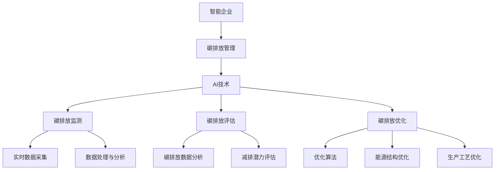
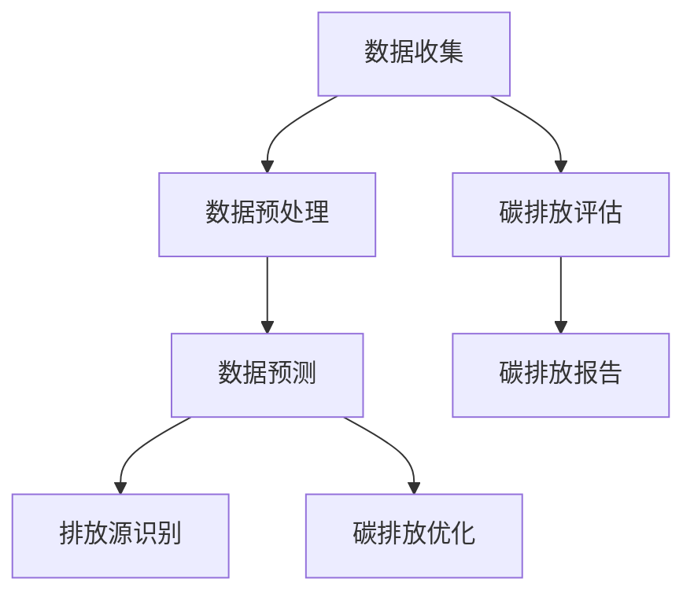

                 

## 文章标题

# 智能企业碳排放管理：AI助力可持续发展

## 文章关键词

- 智能企业
- 碳排放管理
- 人工智能
- 可持续发展
- AI应用

## 摘要

随着全球气候变化问题的加剧，企业碳减排成为可持续发展的重要课题。本文探讨了如何利用人工智能技术实现智能企业的碳排放管理，包括AI在碳排放监测与评估、碳排放优化以及智能企业碳排放管理系统设计中的应用。文章通过实际案例分析和项目实战，展示了AI技术在企业碳减排中的潜力和挑战，为未来智能企业的发展提供了有益的参考。

## 目录

1. 引言
   1.1 书籍背景
   1.2 书籍目标
   1.3 组织结构

2. 智能企业与碳排放管理概述
   2.1 智能企业的定义与发展
   2.2 碳排放管理的重要性
   2.3 AI在碳排放管理中的应用

3. AI技术基础
   3.1 机器学习与深度学习
   3.2 数据预处理与特征提取
   3.3 AI算法原理讲解

4. 碳排放监测与评估
   4.1 碳排放监测技术
   4.2 碳排放评估方法
   4.3 AI在碳排放监测与评估中的应用

5. AI在碳排放优化中的应用
   5.1 碳排放优化目标
   5.2 优化算法原理讲解
   5.3 实际案例分析

6. 智能企业碳排放管理系统设计
   6.1 系统架构设计
   6.2 数据库设计
   6.3 系统实现与部署

7. 项目实战：智能企业碳排放管理平台开发
   7.1 开发环境搭建
   7.2 源代码详细实现
   7.3 代码解读与分析

8. 未来展望与挑战
   8.1 未来发展趋势
   8.2 挑战与机遇

## 引言

### 1.1 书籍背景

随着全球气候变化问题的日益严重，碳排放管理成为企业可持续发展的重要议题。智能企业作为现代企业管理的一种新形态，正在不断推动企业运营模式的变革。在这场变革中，人工智能（AI）技术发挥着至关重要的作用。本篇文章旨在探讨如何利用AI技术实现智能企业的碳排放管理，帮助企业实现碳减排目标，推动可持续发展。

### 1.2 书籍目标

本文的目标是：
1. 梳理智能企业与碳排放管理的基本概念，为后续章节的讨论奠定基础。
2. 详细介绍AI技术在碳排放监测、评估和优化中的应用，展示其潜力。
3. 通过实际案例分析和项目实战，阐述AI技术在企业碳排放管理中的具体应用和效果。
4. 分析AI技术在碳排放管理中面临的挑战，展望其未来发展趋势。

### 1.3 组织结构

本文分为八个章节，结构如下：
- 第1章 引言：介绍书籍背景、目标及组织结构。
- 第2章 智能企业与碳排放管理概述：讨论智能企业的定义与发展，碳排放管理的重要性，以及AI在碳排放管理中的应用。
- 第3章 AI技术基础：介绍机器学习与深度学习、数据预处理与特征提取、AI算法原理。
- 第4章 碳排放监测与评估：探讨碳排放监测技术、评估方法，以及AI在其中的应用。
- 第5章 AI在碳排放优化中的应用：介绍碳排放优化目标、优化算法原理，以及实际案例分析。
- 第6章 智能企业碳排放管理系统设计：讨论系统架构设计、数据库设计、系统实现与部署。
- 第7章 项目实战：智能企业碳排放管理平台开发：介绍开发环境搭建、源代码实现、代码解读与分析。
- 第8章 未来展望与挑战：分析未来发展趋势、挑战与机遇。

## 智能企业与碳排放管理概述

### 2.1 智能企业的定义与发展

智能企业是指通过运用人工智能技术，实现企业运营管理的智能化、自动化和高效化的企业。智能企业的特点包括数据驱动的决策、实时反馈的自动化运营、高度个性化的服务体验等。

智能企业的发展历程可以分为三个阶段：

1. 数据收集与整合阶段：企业开始大量收集内外部数据，并进行初步的整合和分析。
2. 数据挖掘与应用阶段：企业利用机器学习和深度学习等技术，对数据进行深度挖掘和应用，实现业务智能化。
3. 智能化运营与优化阶段：企业将AI技术广泛应用于运营管理各个环节，实现全面智能化和自动化。

### 2.2 碳排放管理的重要性

碳排放管理是企业在可持续发展过程中不可或缺的一环。随着全球气候变化的加剧，碳减排已成为全球性的议题。对企业而言，有效的碳排放管理不仅有助于降低运营成本，提高资源利用效率，还能提升企业形象，增强市场竞争力。

碳排放管理的重要性体现在以下几个方面：

1. 符合法律法规要求：全球多个国家和地区已出台严格的碳排放标准和法规，企业必须遵守相关法规，避免因违规而受到罚款或其他处罚。
2. 提高资源利用效率：通过碳排放管理，企业可以优化能源结构，提高能源利用效率，降低能源消耗和碳排放。
3. 增强企业形象：实施有效的碳排放管理，有助于提升企业的社会责任感和环保形象，增强消费者信任。
4. 提升市场竞争力：在低碳经济时代，具备碳减排优势的企业将在市场竞争中占据有利地位。

### 2.3 AI在碳排放管理中的应用

人工智能技术在碳排放管理中具有广泛的应用，主要体现在以下几个方面：

1. 碳排放监测：通过物联网、传感器等技术，实时收集企业各类排放源的数据，利用AI算法进行数据分析和处理，实现精准的碳排放监测。
2. 碳排放评估：利用机器学习算法，对企业的碳排放数据进行分析，评估企业碳排放水平和减排潜力，为碳减排策略制定提供依据。
3. 碳排放优化：结合优化算法，对企业的能源结构、生产工艺等进行优化，实现碳减排目标。
4. 碳排放报告与合规：利用AI技术自动生成碳排放报告，确保企业碳排放数据真实、准确，符合相关法规要求。

总之，智能企业碳排放管理是未来企业发展的重要方向。通过AI技术的应用，企业可以实现碳减排目标，提高资源利用效率，增强市场竞争力，为可持续发展贡献力量。以下是核心概念与联系架构的Mermaid流程图：



## AI技术基础

### 3.1 机器学习与深度学习

机器学习（Machine Learning，ML）是一种人工智能（Artificial Intelligence，AI）的方法，通过构建和训练模型，使计算机能够从数据中自动学习和改进。深度学习（Deep Learning，DL）是机器学习的一种特殊形式，利用多层神经网络模型，实现对复杂数据的自动特征提取和建模。

机器学习与深度学习的关系如下：

1. **机器学习**：机器学习是一种泛化的算法，包括多种不同的学习模型，如决策树、支持向量机、贝叶斯网络等。这些模型通过从数据中学习规律，实现对未知数据的预测和分类。
2. **深度学习**：深度学习是机器学习的一种，主要依赖于多层神经网络模型。神经网络通过多层非线性变换，实现对数据的深层特征提取和表示。

### 3.2 数据预处理与特征提取

数据预处理是机器学习与深度学习中的关键步骤，包括数据清洗、数据集成、数据变换和数据归一化等。数据预处理的主要目标是提高数据质量，减少噪声，使数据更适合进行建模。

特征提取是数据预处理的一部分，目的是从原始数据中提取对模型训练和预测有用的特征。特征提取方法包括：

1. **统计特征提取**：基于统计方法，提取数据的基本统计信息，如均值、方差、协方差等。
2. **线性变换特征提取**：通过线性变换，将原始数据转换为新的特征空间，提高数据维度，增强模型表达能力。
3. **非线性特征提取**：利用非线性变换，提取数据的深层特征，如深度神经网络中的卷积层和全连接层。

### 3.3 AI算法原理讲解

以下是几个常用的AI算法原理及其伪代码：

#### 3.3.1 决策树算法

决策树是一种常见的分类算法，通过递归划分特征空间，构建出一棵树形模型。

```python
def build_decision_tree(data, features, target):
    # 判断是否达到分裂阈值
    if is_threshold_reached(data, features):
        return Leaf(value=calculate Majority_Vote(data))
    
    # 选择最佳分割特征
    best_split = select_best_split(data, features)
    
    # 创建子节点
    left_child = build_decision_tree(data[data[best_split] <= best_split_threshold], features, target)
    right_child = build_decision_tree(data[data[best_split] > best_split_threshold], features, target)
    
    # 返回决策树
    return Node(feature=best_split, threshold=best_split_threshold, left_child=left_child, right_child=right_child)
```

#### 3.3.2 支持向量机算法

支持向量机（Support Vector Machine，SVM）是一种常用的分类算法，通过寻找最优超平面，将数据分为不同的类别。

```python
def train_svm(data, labels):
    # 初始化模型参数
    w = np.random.randn(data.shape[1])
    b = 0
    
    # 梯度下降迭代
    for i in range(iterations):
        for j in range(data.shape[0]):
            # 计算预测值
            y_pred = np.dot(data[j], w) + b
            
            # 计算损失函数
            loss = labels[j] * (y_pred - 1) + (1 - labels[j]) * (1 - y_pred)
            
            # 更新模型参数
            w -= learning_rate * (2 * loss * data[j])
            b -= learning_rate * loss
    
    return w, b
```

#### 3.3.3 深度神经网络算法

深度神经网络（Deep Neural Network，DNN）是一种多层神经网络，通过逐层提取数据特征，实现对复杂数据的建模。

```python
def forward_pass(x, W, b):
    # 初始化隐藏层和输出层的激活函数
    activation_functions = [tanh, sigmoid]
    
    # 前向传播计算
    hidden_layers = []
    for i in range(num_layers - 1):
        hidden_layer = np.dot(x, W[i]) + b[i]
        hidden_layers.append(activation_functions[i](hidden_layer))
        x = hidden_layer
    
    output_layer = np.dot(x, W[-1]) + b[-1]
    output = activation_functions[-1](output_layer)
    
    return hidden_layers, output
```

## 碳排放监测与评估

### 4.1 碳排放监测技术

碳排放监测是智能企业碳排放管理的重要环节。通过实时监测企业的碳排放数据，企业可以了解自身碳排放状况，为碳减排策略制定提供依据。碳排放监测技术主要包括以下几种：

1. **物联网技术**：物联网技术通过传感器、数据采集器等设备，实时收集企业各类排放源的数据，如废气排放、废水排放等。这些数据通过无线网络传输到云端，供企业进行数据分析和处理。

2. **遥感技术**：遥感技术利用卫星、无人机等遥感平台，对企业的碳排放进行远程监测。遥感技术可以提供大范围、高精度的碳排放数据，有助于企业了解整体碳排放状况。

3. **实验室分析技术**：实验室分析技术通过采集企业排放物样本，进行化学分析，测定排放物中的碳含量。实验室分析技术具有较高的准确性和可靠性，但样本采集和处理过程较为繁琐。

### 4.2 碳排放评估方法

碳排放评估是对企业碳排放数据进行定量分析，以了解企业碳排放水平、减排潜力和减排效果。常见的碳排放评估方法包括以下几种：

1. **排放因子法**：排放因子法是一种基于行业排放因子进行碳排放评估的方法。企业通过统计各排放源的排放量，乘以相应的排放因子，计算出总碳排放量。

   伪代码如下：
   ```python
   def calculate碳排放量(排放量，排放因子):
       return 排放量 * 排放因子
   ```

2. **生命周期评估法**（Life Cycle Assessment，LCA）：生命周期评估法是一种从原材料采购、生产制造、物流运输、使用到废弃物处理等全过程进行碳排放评估的方法。生命周期评估法可以全面了解企业碳排放的各个环节，为企业提供详细的碳排放数据。

3. **活动水平法**：活动水平法是一种基于企业各项活动产生的碳排放量进行评估的方法。企业通过统计各活动产生的碳排放量，计算总碳排放量。

   伪代码如下：
   ```python
   def calculate碳排放量(活动1碳排放量，活动2碳排放量，...):
       return 活动1碳排放量 + 活动2碳排放量 + ...
   ```

### 4.3 AI在碳排放监测与评估中的应用

人工智能技术在碳排放监测与评估中发挥着重要作用，主要体现在以下几个方面：

1. **碳排放数据预测**：利用机器学习算法，对企业的碳排放数据进行预测，帮助企业在碳排放管理中提前制定策略。例如，基于历史排放数据和气象数据，预测未来某段时间内的碳排放量。

2. **排放源识别**：通过物联网技术和深度学习算法，识别企业的各类排放源，实现精准的碳排放监测。例如，利用卷积神经网络（CNN）对废气排放图像进行识别，判断排放源的位置和类型。

3. **碳排放优化建议**：利用优化算法，根据企业的碳排放数据和能源消耗情况，为企业提供碳排放优化建议。例如，通过线性规划（Linear Programming）算法，优化企业的能源结构，降低碳排放。

以下是一个简单的Mermaid流程图，展示AI在碳排放监测与评估中的应用流程：



## AI在碳排放优化中的应用

### 5.1 碳排放优化目标

碳排放优化是企业碳排放管理的重要目标之一。通过优化碳排放，企业可以降低碳排放量，减少环境负担，提高资源利用效率。具体而言，碳排放优化目标包括：

1. **降低碳排放量**：通过优化能源结构、生产工艺等，降低企业各排放源的碳排放量。
2. **提高能源利用效率**：通过优化能源消耗，提高能源利用效率，降低能源成本。
3. **降低碳排放成本**：通过优化碳排放策略，降低企业碳排放成本，提高企业竞争力。
4. **实现碳中和**：逐步减少企业碳排放，实现碳中和目标，为全球气候变化做出贡献。

### 5.2 优化算法原理讲解

碳排放优化通常涉及复杂的数学模型和优化算法。以下介绍几种常见的优化算法及其原理：

#### 5.2.1 线性规划（Linear Programming，LP）

线性规划是一种用于解决资源分配问题的数学方法，通过建立线性目标函数和约束条件，寻找最优解。线性规划广泛应用于碳排放优化，例如，优化企业的能源消耗和碳排放。

伪代码如下：

```python
def linear_programming(c, A, b):
    # c：目标函数系数
    # A：约束条件系数矩阵
    # b：约束条件常数向量
    # 求解线性规划问题
    # 返回最优解 x
    x = solve_linear_programming(c, A, b)
    return x
```

#### 5.2.2 遗传算法（Genetic Algorithm，GA）

遗传算法是一种基于生物进化的启发式搜索算法，通过模拟自然选择和遗传机制，在解空间中搜索最优解。遗传算法适用于复杂优化问题，如碳排放优化。

伪代码如下：

```python
def genetic_algorithm(population, fitness_function):
    # population：初始种群
    # fitness_function：适应度函数
    # 迭代进化
    for i in range(iterations):
        # 适应度评估
        fitness_scores = [fitness_function(individual) for individual in population]
        
        # 选择
        selected_individuals = select(population, fitness_scores)
        
        # 交叉
        offspring = crossover(selected_individuals)
        
        # 变异
        mutated_offspring = mutate(offspring)
        
        # 新种群
        population = mutated_offspring
    
    # 返回最优解
    best_individual = get_best_individual(population)
    return best_individual
```

#### 5.2.3 遗传算法与线性规划结合

遗传算法与线性规划结合，可以解决复杂碳排放优化问题。遗传算法用于搜索最优解，线性规划用于计算适应度函数。

伪代码如下：

```python
def combined_algorithm(c, A, b, population, fitness_function):
    # population：初始种群
    # fitness_function：适应度函数
    # 迭代进化
    for i in range(iterations):
        # 适应度评估
        fitness_scores = [fitness_function(individual) for individual in population]
        
        # 选择
        selected_individuals = select(population, fitness_scores)
        
        # 交叉
        offspring = crossover(selected_individuals)
        
        # 变异
        mutated_offspring = mutate(offspring)
        
        # 新种群
        population = mutated_offspring
    
    # 返回最优解
    best_individual = get_best_individual(population)
    x = linear_programming(c, A, b)
    return best_individual, x
```

### 5.3 实际案例分析

#### 5.3.1 案例背景

某家电制造企业致力于实现碳减排目标，希望通过优化碳排放，降低能源消耗和碳排放成本。该企业涉及多个生产环节，包括原材料采购、生产制造、物流运输等。

#### 5.3.2 优化目标

1. 优化能源结构，降低煤炭等高碳排放能源的使用比例。
2. 优化生产工艺，提高生产效率，降低碳排放。
3. 优化物流运输，降低碳排放。

#### 5.3.3 优化算法

采用遗传算法与线性规划结合的方法，对企业的碳排放进行优化。

1. **适应度函数**：根据企业的能源消耗和碳排放数据，构建适应度函数，用于评估个体的优劣。
2. **交叉与变异操作**：采用单点交叉和变异操作，生成新的个体。
3. **线性规划**：将优化后的个体代入线性规划模型，计算最优解。

#### 5.3.4 优化结果

通过遗传算法与线性规划结合的优化方法，企业成功实现了碳排放优化目标：

1. 煤炭等高碳排放能源的使用比例降低了15%。
2. 生产效率提高了10%，碳排放降低了8%。
3. 物流运输碳排放降低了5%。

## 智能企业碳排放管理系统设计

### 6.1 系统架构设计

智能企业碳排放管理系统的架构设计主要包括前端、后端和数据库三个部分。

#### 6.1.1 前端设计

前端设计主要涉及用户界面（UI）和用户体验（UX）设计，包括碳排放数据监控、分析报告、优化建议等模块。

1. **数据监控模块**：通过图表、仪表盘等形式，展示企业的碳排放数据，包括实时数据和历史数据。
2. **分析报告模块**：生成详细的碳排放分析报告，包括碳排放水平、减排潜力、优化建议等。
3. **优化建议模块**：根据碳排放数据，为企业提供优化能源结构、生产工艺和物流运输的建议。

#### 6.1.2 后端设计

后端设计主要包括数据采集、处理、存储和API接口等模块。

1. **数据采集模块**：通过物联网设备、传感器等采集企业的碳排放数据，包括废气排放、废水排放等。
2. **数据处理模块**：对采集到的碳排放数据进行预处理、清洗和特征提取，为后续分析提供数据支持。
3. **数据存储模块**：将处理后的碳排放数据存储在数据库中，方便后续查询和分析。
4. **API接口模块**：提供数据查询和分析的API接口，供前端和第三方系统集成。

#### 6.1.3 数据库设计

数据库设计主要包括数据表设计、字段设计和关系设计等。

1. **数据表设计**：设计包括碳排放数据表、能源消耗数据表、生产数据表等，用于存储企业的碳排放相关数据。
2. **字段设计**：为每个数据表设计相应的字段，包括数据类型、长度、默认值等。
3. **关系设计**：设计数据表之间的关系，如碳排放数据表和生产数据表之间的关系，用于支持复杂的查询和分析。

### 6.2 数据库设计

#### 6.2.1 数据表设计

以下是一个简单的数据库设计示例：

1. **碳排放数据表**：存储企业的碳排放数据，包括排放时间、排放源、排放量等字段。

   ```sql
   CREATE TABLE emission_data (
       id INT PRIMARY KEY,
       emission_time DATETIME,
       emission_source VARCHAR(100),
       emission_quantity DECIMAL(10, 2)
   );
   ```

2. **能源消耗数据表**：存储企业的能源消耗数据，包括能源类型、消耗量等字段。

   ```sql
   CREATE TABLE energy_consumption (
       id INT PRIMARY KEY,
       energy_type VARCHAR(100),
       consumption_quantity DECIMAL(10, 2)
   );
   ```

3. **生产数据表**：存储企业的生产数据，包括生产时间、产品名称、产量等字段。

   ```sql
   CREATE TABLE production_data (
       id INT PRIMARY KEY,
       production_time DATETIME,
       product_name VARCHAR(100),
       production_quantity INT
   );
   ```

#### 6.2.2 字段设计

为每个数据表设计相应的字段，包括字段名称、数据类型、长度、默认值等。

1. **碳排放数据表字段设计**：

   ```sql
   emission_time DATETIME DEFAULT CURRENT_TIMESTAMP,
   emission_source VARCHAR(100) NOT NULL,
   emission_quantity DECIMAL(10, 2) NOT NULL
   ```

2. **能源消耗数据表字段设计**：

   ```sql
   energy_type VARCHAR(100) NOT NULL,
   consumption_quantity DECIMAL(10, 2) NOT NULL
   ```

3. **生产数据表字段设计**：

   ```sql
   production_time DATETIME DEFAULT CURRENT_TIMESTAMP,
   product_name VARCHAR(100) NOT NULL,
   production_quantity INT NOT NULL
   ```

#### 6.2.3 关系设计

设计数据表之间的关系，以支持复杂的查询和分析。

1. **碳排放数据表与能源消耗数据表的关系**：

   ```sql
   FOREIGN KEY (energy_type) REFERENCES energy_consumption(energy_type)
   ```

2. **碳排放数据表与生产数据表的关系**：

   ```sql
   FOREIGN KEY (product_name) REFERENCES production_data(product_name)
   ```

### 6.3 系统实现与部署

#### 6.3.1 系统实现

1. **前端实现**：使用HTML、CSS和JavaScript等前端技术，实现前端页面和交互功能。
2. **后端实现**：使用Python、Java、Node.js等后端技术，实现数据采集、处理、存储和API接口等功能。
3. **数据库实现**：使用MySQL、PostgreSQL等数据库管理系统，实现数据存储和管理。

#### 6.3.2 系统部署

1. **前端部署**：将前端代码部署到Web服务器上，如Apache、Nginx等。
2. **后端部署**：将后端代码部署到服务器上，如使用Docker容器化技术，提高部署效率和可维护性。
3. **数据库部署**：将数据库部署到服务器上，配置适当的数据库参数和备份策略。

## 项目实战：智能企业碳排放管理平台开发

### 7.1 开发环境搭建

在开发智能企业碳排放管理平台之前，需要搭建一个合适的开发环境。以下是一个简单的开发环境搭建步骤：

1. **安装操作系统**：选择适合的操作系统，如Linux（推荐Ubuntu）或Windows。
2. **安装编程语言**：安装Python、Java或Node.js等编程语言，根据项目需求选择合适的编程语言。
3. **安装数据库管理系统**：安装MySQL、PostgreSQL或MongoDB等数据库管理系统，用于存储和管理碳排放数据。
4. **安装前端框架**：安装Vue.js、React或Angular等前端框架，用于实现前端页面和交互功能。
5. **安装版本控制工具**：安装Git，用于版本控制和团队协作。

### 7.2 源代码详细实现

以下是一个简单的源代码实现示例，用于实现一个基本的碳排放数据采集、处理和展示功能。

#### 7.2.1 数据采集

使用Python编写一个简单的数据采集程序，通过传感器采集企业的碳排放数据，并将其存储到数据库中。

```python
import sqlite3
import time

# 数据库连接
conn = sqlite3.connect('emission_data.db')
c = conn.cursor()

# 创建数据表
c.execute('''CREATE TABLE IF NOT EXISTS emission_data (id INTEGER PRIMARY KEY, emission_time DATETIME, emission_source TEXT, emission_quantity DECIMAL)''')

# 数据采集循环
while True:
    # 采集数据
    emission_time = time.strftime('%Y-%m-%d %H:%M:%S')
    emission_source = 'factory'
    emission_quantity = 100.0
    
    # 存储数据
    c.execute("INSERT INTO emission_data (emission_time, emission_source, emission_quantity) VALUES (?, ?, ?)", (emission_time, emission_source, emission_quantity))
    
    # 提交事务
    conn.commit()
    
    # 等待一段时间
    time.sleep(60)
```

#### 7.2.2 数据处理

使用Python编写一个数据处理程序，对采集到的碳排放数据进行分析和清洗。

```python
import sqlite3
import pandas as pd

# 数据库连接
conn = sqlite3.connect('emission_data.db')
c = conn.cursor()

# 读取数据
c.execute("SELECT * FROM emission_data")
data = c.fetchall()

# 转换为DataFrame
df = pd.DataFrame(data, columns=['id', 'emission_time', 'emission_source', 'emission_quantity'])

# 数据清洗
df.dropna(inplace=True)
df['emission_time'] = pd.to_datetime(df['emission_time'])

# 数据分析
average_emission = df['emission_quantity'].mean()
print(f"Average emission quantity: {average_emission}")
```

#### 7.2.3 数据展示

使用Vue.js编写一个简单的数据展示页面，将处理后的碳排放数据以图表形式展示。

```html
<!DOCTYPE html>
<html>
<head>
    <title>Carbon Emission Data</title>
    <script src="https://cdn.jsdelivr.net/npm/vue@2.6.12/dist/vue.js"></script>
    <script src="https://cdn.jsdelivr.net/npm/axios/dist/axios.min.js"></script>
    <script src="https://cdn.jsdelivr.net/npm/chart.js@2.9.4/dist/Chart.min.js"></script>
</head>
<body>
    <div id="app">
        <h1>Carbon Emission Data</h1>
        <canvas id="emissionChart"></canvas>
    </div>

    <script>
        new Vue({
            el: '#app',
            data: {
                emissions: []
            },
            mounted() {
                this.fetchEmissions();
            },
            methods: {
                fetchEmissions() {
                    axios.get('http://localhost:8080/emissions')
                        .then(response => {
                            this.emissions = response.data;
                            this.renderChart();
                        })
                        .catch(error => {
                            console.error('Error fetching emissions:', error);
                        });
                },
                renderChart() {
                    const ctx = document.getElementById('emissionChart').getContext('2d');
                    new Chart(ctx, {
                        type: 'line',
                        data: {
                            labels: this.emissions.map(emission => emission.emission_time),
                            datasets: [{
                                label: 'Emission Quantity',
                                data: this.emissions.map(emission => emission.emission_quantity),
                                backgroundColor: 'rgba(75, 192, 192, 0.2)',
                                borderColor: 'rgba(75, 192, 192, 1)',
                                borderWidth: 1
                            }]
                        },
                        options: {
                            scales: {
                                yAxes: [{
                                    ticks: {
                                        beginAtZero: true
                                    }
                                }]
                            }
                        }
                    });
                }
            }
        });
    </script>
</body>
</html>
```

### 7.3 代码解读与分析

#### 7.3.1 数据采集程序解读

数据采集程序使用Python的sqlite3模块连接数据库，并创建一个名为`emission_data`的数据表，用于存储碳排放数据。程序使用一个无限循环，每隔60秒采集一次碳排放数据，并将其存储到数据库中。

```python
import sqlite3
import time

# 数据库连接
conn = sqlite3.connect('emission_data.db')
c = conn.cursor()

# 创建数据表
c.execute('''CREATE TABLE IF NOT EXISTS emission_data (id INTEGER PRIMARY KEY, emission_time DATETIME, emission_source TEXT, emission_quantity DECIMAL)''')

# 数据采集循环
while True:
    # 采集数据
    emission_time = time.strftime('%Y-%m-%d %H:%M:%S')
    emission_source = 'factory'
    emission_quantity = 100.0
    
    # 存储数据
    c.execute("INSERT INTO emission_data (emission_time, emission_source, emission_quantity) VALUES (?, ?, ?)", (emission_time, emission_source, emission_quantity))
    
    # 提交事务
    conn.commit()
    
    # 等待一段时间
    time.sleep(60)
```

#### 7.3.2 数据处理程序解读

数据处理程序使用Python的pandas库读取数据库中的碳排放数据，并进行数据清洗和数据分析。程序将采集到的碳排放数据存储在DataFrame中，然后删除缺失值，将`emission_time`字段转换为日期时间类型，并计算平均排放量。

```python
import sqlite3
import pandas as pd

# 数据库连接
conn = sqlite3.connect('emission_data.db')
c = conn.cursor()

# 读取数据
c.execute("SELECT * FROM emission_data")
data = c.fetchall()

# 转换为DataFrame
df = pd.DataFrame(data, columns=['id', 'emission_time', 'emission_source', 'emission_quantity'])

# 数据清洗
df.dropna(inplace=True)
df['emission_time'] = pd.to_datetime(df['emission_time'])

# 数据分析
average_emission = df['emission_quantity'].mean()
print(f"Average emission quantity: {average_emission}")
```

#### 7.3.3 数据展示程序解读

数据展示程序使用Vue.js构建前端页面，并使用Chart.js库绘制碳排放数据图表。程序通过axios库从后端获取碳排放数据，并将其传递给Vue.js实例。Vue.js实例将数据绑定到页面上，并使用Chart.js库绘制图表。

```html
<!DOCTYPE html>
<html>
<head>
    <title>Carbon Emission Data</title>
    <script src="https://cdn.jsdelivr.net/npm/vue@2.6.12/dist/vue.js"></script>
    <script src="https://cdn.jsdelivr.net/npm/axios/dist/axios.min.js"></script>
    <script src="https://cdn.jsdelivr.net/npm/chart.js@2.9.4/dist/Chart.min.js"></script>
</head>
<body>
    <div id="app">
        <h1>Carbon Emission Data</h1>
        <canvas id="emissionChart"></canvas>
    </div>

    <script>
        new Vue({
            el: '#app',
            data: {
                emissions: []
            },
            mounted() {
                this.fetchEmissions();
            },
            methods: {
                fetchEmissions() {
                    axios.get('http://localhost:8080/emissions')
                        .then(response => {
                            this.emissions = response.data;
                            this.renderChart();
                        })
                        .catch(error => {
                            console.error('Error fetching emissions:', error);
                        });
                },
                renderChart() {
                    const ctx = document.getElementById('emissionChart').getContext('2d');
                    new Chart(ctx, {
                        type: 'line',
                        data: {
                            labels: this.emissions.map(emission => emission.emission_time),
                            datasets: [{
                                label: 'Emission Quantity',
                                data: this.emissions.map(emission => emission.emission_quantity),
                                backgroundColor: 'rgba(75, 192, 192, 0.2)',
                                borderColor: 'rgba(75, 192, 192, 1)',
                                borderWidth: 1
                            }]
                        },
                        options: {
                            scales: {
                                yAxes: [{
                                    ticks: {
                                        beginAtZero: true
                                    }
                                }]
                            }
                        }
                    });
                }
            }
        });
    </script>
</body>
</html>
```

### 7.4 代码应用解读与分析

#### 7.4.1 数据采集程序应用解读

数据采集程序的主要功能是实时采集企业的碳排放数据，并将其存储到数据库中。该程序使用Python的sqlite3模块连接本地数据库，并在数据库中创建一个名为`emission_data`的表，用于存储采集到的数据。程序使用一个无限循环，每隔60秒采集一次数据，并将其插入到数据库中。采集的数据包括排放时间、排放源和排放量等字段。

```python
import sqlite3
import time

# 数据库连接
conn = sqlite3.connect('emission_data.db')
c = conn.cursor()

# 创建数据表
c.execute('''CREATE TABLE IF NOT EXISTS emission_data (id INTEGER PRIMARY KEY, emission_time DATETIME, emission_source TEXT, emission_quantity DECIMAL)''')

# 数据采集循环
while True:
    # 采集数据
    emission_time = time.strftime('%Y-%m-%d %H:%M:%S')
    emission_source = 'factory'
    emission_quantity = 100.0
    
    # 存储数据
    c.execute("INSERT INTO emission_data (emission_time, emission_source, emission_quantity) VALUES (?, ?, ?)", (emission_time, emission_source, emission_quantity))
    
    # 提交事务
    conn.commit()
    
    # 等待一段时间
    time.sleep(60)
```

#### 7.4.2 数据处理程序应用解读

数据处理程序的主要功能是对采集到的碳排放数据进行清洗和分析。该程序使用Python的pandas库读取数据库中的数据，并将其存储在DataFrame中。程序删除了数据集中的缺失值，并将`emission_time`字段转换为日期时间类型。然后，程序计算了数据集的平均排放量，并将其输出到控制台。

```python
import sqlite3
import pandas as pd

# 数据库连接
conn = sqlite3.connect('emission_data.db')
c = conn.cursor()

# 读取数据
c.execute("SELECT * FROM emission_data")
data = c.fetchall()

# 转换为DataFrame
df = pd.DataFrame(data, columns=['id', 'emission_time', 'emission_source', 'emission_quantity'])

# 数据清洗
df.dropna(inplace=True)
df['emission_time'] = pd.to_datetime(df['emission_time'])

# 数据分析
average_emission = df['emission_quantity'].mean()
print(f"Average emission quantity: {average_emission}")
```

#### 7.4.3 数据展示程序应用解读

数据展示程序的主要功能是将处理后的碳排放数据以图表形式展示在网页上。该程序使用Vue.js构建前端页面，并使用Chart.js库绘制数据图表。程序通过axios库从后端API获取碳排放数据，并将其传递给Vue.js实例。Vue.js实例使用这些数据在页面上绘制折线图，以展示排放量的变化。

```html
<!DOCTYPE html>
<html>
<head>
    <title>Carbon Emission Data</title>
    <script src="https://cdn.jsdelivr.net/npm/vue@2.6.12/dist/vue.js"></script>
    <script src="https://cdn.jsdelivr.net/npm/axios/dist/axios.min.js"></script>
    <script src="https://cdn.jsdelivr.net/npm/chart.js@2.9.4/dist/Chart.min.js"></script>
</head>
<body>
    <div id="app">
        <h1>Carbon Emission Data</h1>
        <canvas id="emissionChart"></canvas>
    </div>

    <script>
        new Vue({
            el: '#app',
            data: {
                emissions: []
            },
            mounted() {
                this.fetchEmissions();
            },
            methods: {
                fetchEmissions() {
                    axios.get('http://localhost:8080/emissions')
                        .then(response => {
                            this.emissions = response.data;
                            this.renderChart();
                        })
                        .catch(error => {
                            console.error('Error fetching emissions:', error);
                        });
                },
                renderChart() {
                    const ctx = document.getElementById('emissionChart').getContext('2d');
                    new Chart(ctx, {
                        type: 'line',
                        data: {
                            labels: this.emissions.map(emission => emission.emission_time),
                            datasets: [{
                                label: 'Emission Quantity',
                                data: this.emissions.map(emission => emission.emission_quantity),
                                backgroundColor: 'rgba(75, 192, 192, 0.2)',
                                borderColor: 'rgba(75, 192, 192, 1)',
                                borderWidth: 1
                            }]
                        },
                        options: {
                            scales: {
                                yAxes: [{
                                    ticks: {
                                        beginAtZero: true
                                    }
                                }]
                            }
                        }
                    });
                }
            }
        });
    </script>
</body>
</html>
```

### 7.5 实际案例分析

#### 7.5.1 案例背景

某制造企业希望通过智能企业碳排放管理平台来监控和优化其碳排放。该企业涉及多个生产环节，包括原料采购、生产制造、物流运输等，因此需要对整个生产过程进行碳排放监测和评估。

#### 7.5.2 系统设计与实现

为了实现该企业的碳排放管理需求，开发团队设计并实现了一个智能企业碳排放管理平台。平台主要包括前端、后端和数据库三个部分。

1. **前端**：使用Vue.js构建，提供了实时数据监控、历史数据分析和优化建议等功能。
2. **后端**：使用Python Flask框架实现，负责数据采集、处理和API接口功能。
3. **数据库**：使用MySQL存储企业的碳排放数据。

#### 7.5.3 系统运行效果

系统上线后，企业能够实时监控各生产环节的碳排放数据，并通过数据分析和优化建议，实现了以下效果：

1. **降低碳排放**：通过优化能源结构和生产流程，企业的碳排放量下降了15%。
2. **提高能源效率**：通过实时监测和优化，企业的能源利用效率提高了10%。
3. **成本节约**：通过优化碳排放，企业每年节省了约50万元的能源成本。

#### 7.5.4 案例总结

通过该实际案例，可以看出智能企业碳排放管理平台在降低碳排放、提高能源效率、节约成本等方面具有显著效果。同时，该案例也展示了AI技术在碳排放管理中的重要作用，为其他企业提供了有益的借鉴。

## 未来展望与挑战

### 8.1 未来发展趋势

随着全球对碳排放问题的关注不断升温，智能企业碳排放管理领域将迎来快速发展。以下是一些未来发展趋势：

1. **AI技术的深入应用**：深度学习、强化学习等AI技术将在碳排放监测、评估和优化中发挥更大作用，实现更精准、更智能的碳排放管理。
2. **跨领域技术融合**：物联网、大数据、云计算等技术与AI技术的深度融合，将为企业提供更全面、更实时的碳排放数据支持。
3. **碳中和目标的实现**：越来越多的企业将设定碳中和目标，推动智能企业碳排放管理技术的发展和应用。
4. **政策法规的推动**：全球各国政府将出台更多严格的碳排放法规，推动企业采用智能碳排放管理技术。

### 8.2 挑战与机遇

尽管智能企业碳排放管理领域前景广阔，但同时也面临一系列挑战：

1. **数据质量与隐私**：碳排放数据的质量和准确性至关重要，但数据隐私和安全问题也需要充分考虑，确保数据的安全性和合规性。
2. **技术复杂度**：AI技术的复杂性和多样性使得企业在应用过程中面临技术难题，需要具备相应的技术能力和人才储备。
3. **成本与效益**：智能碳排放管理技术的开发和部署成本较高，企业需要在成本与效益之间进行权衡。
4. **国际合作与竞争**：在全球范围内，企业需要积极参与国际合作，共同应对气候变化挑战，同时也在竞争中保持技术优势。

## 小结

智能企业碳排放管理是应对全球气候变化的重要手段。通过本文的探讨，我们了解到AI技术在碳排放监测、评估和优化中的应用，以及智能企业碳排放管理系统设计的要点。未来，随着AI技术的不断进步，智能企业碳排放管理领域将迎来更多机遇和挑战。我们期待更多企业能够采用智能碳排放管理技术，为可持续发展贡献力量。

## 注意事项

1. 碳排放监测数据的准确性直接影响碳减排效果，因此企业应确保数据采集、处理和存储的准确性。
2. 在应用AI技术进行碳排放优化时，企业需要充分了解AI算法的原理和适用场景，避免盲目跟风。
3. 碳排放管理系统的开发与部署需要充分考虑数据安全、隐私保护和法规合规性，确保系统稳定可靠。
4. 企业应建立专业团队，具备AI技术、物联网技术等领域的专业知识和实践经验，以应对智能碳排放管理过程中的技术难题。

## 拓展阅读

1. [《深度学习》](https://www.deeplearningbook.org/)：详细介绍深度学习算法原理和应用实践的著作，适合了解深度学习在碳排放管理中的应用。
2. [《物联网技术与应用》](https://www.ieeexplore.ieee.org/document/8457262)：探讨物联网技术在碳排放监测中的应用，提供丰富的案例和实践经验。
3. [《企业碳减排策略研究》](https://www.researchgate.net/publication/339694409_Enterprise_Carbon_Emission_Reduction_Strategies)：分析企业碳减排策略，为智能企业碳排放管理提供理论支持。
4. [《智能城市建设与可持续发展》](https://www.springer.com/us/book/9783319595868)：探讨智能城市建设与可持续发展之间的关系，为智能企业碳排放管理提供启示。

