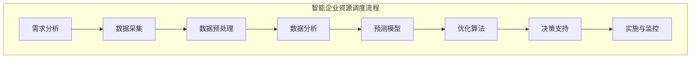

                 

## 文章标题

# 智能企业资源调度：AI优化资源分配

## 关键词：智能企业、资源调度、AI优化、资源分配、算法、机器学习、优化算法、调度系统、案例分析、未来展望

## 摘要

随着信息化和数字化时代的到来，企业对资源调度的需求日益增长。如何高效地分配和管理企业资源，成为企业实现高效运作和竞争优势的关键。本文从智能企业资源调度的背景与概念入手，详细介绍了智能化在企业资源调度中的应用，定义了智能企业资源调度的基本概念与内涵，探讨了智能企业资源调度的关键领域与框架流程。接着，本文深入分析了AI优化资源分配的算法基础，包括机器学习基础和优化算法原理，并使用伪代码详细阐述了优化资源分配算法。随后，文章介绍了智能调度系统的设计与实现，包括系统架构、数据采集与处理、模型训练与评估、调度策略与算法实现。通过一个实际案例，本文展示了智能企业资源调度在实践中的应用效果。最后，本文探讨了智能企业资源调度的未来发展，提出了新技术对资源调度的影响、资源调度系统的发展趋势及实践建议。本文旨在为企业提供智能资源调度的理论指导和实践参考。

### 第1章:智能企业资源调度的背景与概念

随着全球经济的快速发展，企业面临着日益激烈的市场竞争和不断变化的外部环境。为了保持竞争力和持续发展，企业需要优化内部资源分配，提高资源利用效率。智能企业资源调度作为一种创新的管理方法，正逐步成为企业提升运营效率、降低成本、增强核心竞争力的重要手段。

#### 1.1 智能企业资源调度的背景

**1.1.1 信息化与数字化时代的演进**

信息化和数字化是现代社会发展的两大趋势。信息化强调的是信息的获取、传输和处理，而数字化则进一步将物理世界和虚拟世界融合，实现数据的高效管理和利用。随着互联网、云计算、大数据、物联网等技术的不断进步，企业内部的资源管理和调度方式也在发生深刻变革。

在信息化阶段，企业主要通过信息系统实现数据的电子化和自动化处理，提高了信息传递的效率和准确性。然而，随着企业规模的扩大和业务复杂度的增加，传统的信息系统在处理大量数据时往往存在效率低下、响应缓慢等问题。数字化时代的到来，使得企业能够通过实时数据采集、分析和处理，实现资源调度的智能化。

**1.1.2 企业资源调度的挑战**

企业在资源调度过程中面临诸多挑战：

- **资源分布不均衡**：企业内部不同部门、不同地区之间的资源分配往往不均衡，导致资源利用效率低下。
- **需求波动性大**：市场需求和企业内部业务需求经常发生变化，使得资源调度面临不确定性。
- **成本控制困难**：传统资源调度方式难以实现成本的有效控制，特别是在资源使用高峰期。
- **人力资源短缺**：企业人力资源有限，难以应对复杂的资源调度任务。

**1.1.3 智能化在企业资源调度中的应用**

智能化技术的引入，为企业资源调度提供了新的解决方案。通过人工智能（AI）、机器学习（ML）等先进技术，企业能够实现以下目标：

- **优化资源分配**：智能调度系统能够根据实时数据和预测模型，自动优化资源分配，提高资源利用效率。
- **降低成本**：通过智能分析和决策，企业能够降低不必要的资源消耗，实现成本控制。
- **提高响应速度**：智能化系统能够快速响应资源需求变化，提高业务处理速度。
- **增强灵活性**：智能调度系统能够根据市场变化和企业需求，灵活调整资源分配策略。

#### 1.2 智能企业资源调度的定义与内涵

**1.2.1 智能企业资源调度的基本概念**

智能企业资源调度是指利用人工智能技术，对企业的各种资源（包括人力、物力、财力、信息等）进行高效配置和管理的过程。它通过数据采集、分析、预测和决策，实现资源的动态优化分配，以最大化企业的经济效益和运营效率。

**1.2.2 智能企业资源调度的核心要素**

智能企业资源调度的核心要素包括：

- **数据采集**：通过传感器、信息系统等手段，实时采集企业内部的各种数据，为智能调度提供基础信息。
- **数据分析**：利用数据分析技术，对采集到的数据进行处理、清洗和挖掘，提取有用信息。
- **预测模型**：基于历史数据和当前趋势，建立预测模型，对未来资源需求进行预测。
- **优化算法**：运用机器学习和优化算法，对资源进行优化分配，实现资源利用最大化。
- **决策支持**：通过智能决策支持系统，提供科学的决策建议，帮助企业制定最优的资源调度策略。

**1.2.3 智能企业资源调度的目标**

智能企业资源调度的目标主要包括：

- **提高资源利用率**：通过智能调度，实现企业资源的合理配置和高效利用，减少资源浪费。
- **降低运营成本**：通过智能优化，降低企业在资源使用上的成本，提高经济效益。
- **增强决策能力**：通过数据分析和预测，为企业提供科学的决策支持，提高企业的运营效率和市场竞争力。
- **提升客户满意度**：通过快速响应和高效服务，提高客户满意度和忠诚度，增强企业的市场地位。

#### 1.3 智能企业资源调度的关键领域

**1.3.1 资源分类与需求分析**

智能企业资源调度的第一步是对企业内部资源进行分类和需求分析。企业资源主要包括人力、设备、物料、资金、信息等。通过分类和需求分析，可以明确各类资源的具体用途和需求量，为后续的优化分配提供基础。

**1.3.2 资源优化策略与方法**

资源优化策略包括动态调度、优先级调度、资源分配策略等。动态调度根据实时资源需求和系统状态进行动态调整，确保资源的高效利用。优先级调度根据资源的优先级进行分配，确保关键资源得到优先保障。

**1.3.3 资源调度系统的设计与实现**

资源调度系统的设计与实现是智能企业资源调度的核心。系统设计包括系统架构设计、模块划分、接口设计等。系统实现则涉及数据采集模块、数据分析模块、预测模型模块、优化算法模块、决策支持模块等。

#### 1.4 智能企业资源调度的框架与流程

智能企业资源调度的框架主要包括数据采集、数据分析、预测模型、优化算法、决策支持等环节。其流程如下：

1. **需求分析**：明确企业的资源需求，包括资源种类、数量、用途等。
2. **数据采集**：通过传感器、信息系统等手段，实时采集企业内部的各种数据。
3. **数据预处理**：对采集到的数据进行清洗、整合和规范化，为数据分析做准备。
4. **数据分析**：利用数据分析技术，对预处理后的数据进行处理和挖掘，提取有用信息。
5. **预测模型**：基于历史数据和当前趋势，建立预测模型，对未来资源需求进行预测。
6. **优化算法**：运用机器学习和优化算法，对资源进行优化分配，实现资源利用最大化。
7. **决策支持**：通过智能决策支持系统，提供科学的决策建议，帮助企业制定最优的资源调度策略。
8. **实施与监控**：将决策结果付诸实施，并对资源调度过程进行实时监控和调整。

### Mermaid 流程图：

#### 1.5 智能企业资源调度的评价指标

智能企业资源调度效果的评价指标包括资源利用率、成本效率、响应时间、客户满意度等。通过这些指标，可以全面评估资源调度的效果，为企业持续优化资源调度策略提供依据。

- **资源利用率**：资源利用率是衡量资源调度效果的重要指标，它反映了资源的利用效率。资源利用率越高，说明资源调度越合理。
- **成本效率**：成本效率是指单位成本所获得的资源效用。通过计算成本效率，可以评估资源调度在降低成本方面的效果。
- **响应时间**：响应时间是衡量资源调度系统对需求变化反应速度的指标。响应时间越短，说明系统对需求变化的适应能力越强。
- **客户满意度**：客户满意度是衡量资源调度对企业客户服务水平的重要指标。通过调查和分析客户满意度，可以评估资源调度在提升客户服务方面的效果。

### 总结

智能企业资源调度是企业在信息化和数字化时代背景下的一种创新管理方法，它通过人工智能技术的应用，实现企业资源的高效配置和管理。智能企业资源调度的定义与内涵、关键领域、框架与流程以及评价指标，为企业提供了理论指导和实践参考。在后续章节中，我们将进一步探讨AI优化资源分配的算法基础，以及智能调度系统的设计与实现，通过实际案例展示智能企业资源调度的应用效果，并展望其未来发展。

