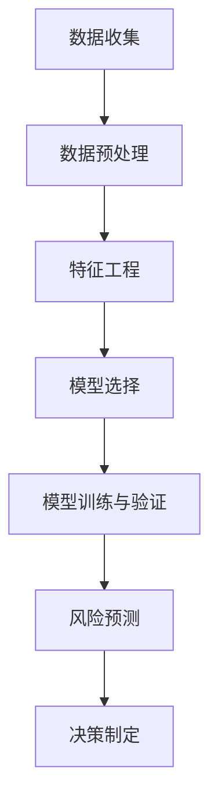
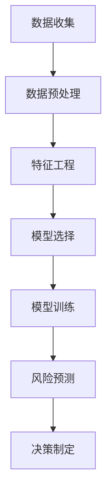
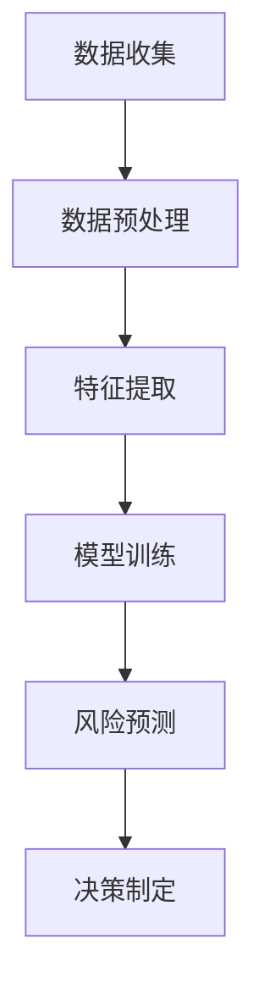
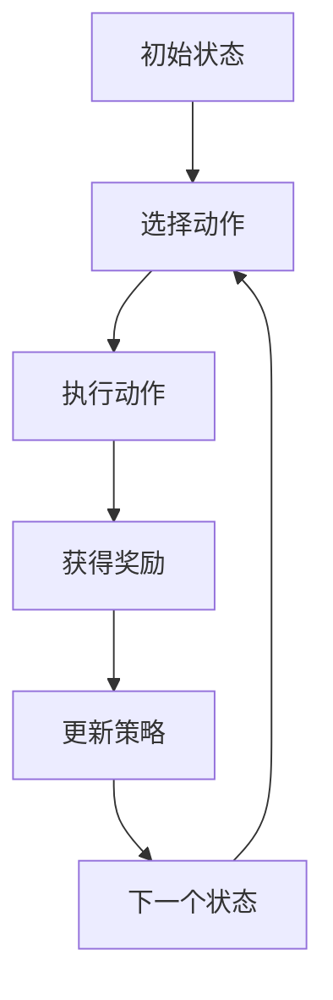

                 


### 文章标题：智能企业风险量化：AI精确评估风险程度

### 关键词：智能企业，风险量化，AI，机器学习，深度学习，案例研究

### 摘要：
本文深入探讨了人工智能（AI）在智能企业风险量化中的应用。首先，介绍了风险量化的背景和重要性，然后详细阐述了AI技术，如机器学习、深度学习和强化学习在风险量化中的核心作用。通过具体案例研究和项目实战，本文展示了如何构建和实现风险量化模型，并分析了其在企业实际应用中的效果。最后，探讨了未来风险量化的发展趋势和面临的挑战，为读者提供了全面的指导和建议。

-------------------------------------------------------------------

# 智能企业风险量化：AI精确评估风险程度

> 作者：AI天才研究院/AI Genius Institute & 禅与计算机程序设计艺术 /Zen And The Art of Computer Programming

在当今全球化的商业环境中，企业面临的风险日益复杂。传统的方法已经无法满足企业对风险管理的需求，因此，智能企业风险量化成为了企业管理的重要工具。本文将探讨如何利用人工智能（AI）技术，特别是机器学习、深度学习和强化学习，精确评估企业风险程度，为企业提供有效的风险管理策略。

## 背景介绍

### 风险量化的重要性

风险量化是指通过定量分析来确定风险的可能性和影响程度。它对于企业的决策制定至关重要，因为只有准确了解风险，企业才能制定相应的风险管理策略。传统风险量化方法通常依赖于专家经验和历史数据，但这些方法存在主观性和局限性。随着AI技术的发展，利用机器学习和深度学习等技术进行风险量化成为了一种可能，为企业提供更加精确和客观的风险评估。

### AI在风险量化中的应用

AI技术，尤其是机器学习、深度学习和强化学习，在风险量化中扮演着关键角色。机器学习算法可以从大量历史数据中学习规律，预测未来的风险。深度学习算法则能够处理复杂数据和模式，提高风险预测的准确性。强化学习算法则通过不断学习和调整策略，帮助企业优化风险管理。

## 核心概念与联系

### 机器学习与风险量化

机器学习是指通过算法从数据中学习规律，并做出预测或决策。在风险量化中，机器学习算法可以用来分析历史数据，识别潜在的风险因素，并预测未来的风险趋势。常用的机器学习算法包括线性回归、逻辑回归、决策树、随机森林和神经网络等。

### 深度学习与风险量化

深度学习是一种基于人工神经网络的学习方法，它可以自动提取数据中的复杂模式和特征。在风险量化中，深度学习算法可以用于处理大量的复杂数据，如文本、图像和视频等，从而提高风险预测的准确性。

### 强化学习与风险量化

强化学习是一种通过试错学习来优化策略的方法。在风险量化中，强化学习算法可以通过不断尝试不同的风险管理策略，找到最优的风险管理方案。

## 核心算法原理讲解

### 机器学习算法原理

以下是一个简单的线性回归算法的伪代码，用于风险量化：

```plaintext
初始化模型参数
对于每个训练样本 (x, y)：
    计算预测值 y' = w*x + b
    计算损失函数 L(w, b) = (y - y')^2
    更新模型参数 w, b
```

### 深度学习算法原理

以下是一个简单的卷积神经网络（CNN）的伪代码，用于处理图像数据的风险量化：

```plaintext
输入：图像数据
输出：风险评分

卷积层1：
    输入：图像
    输出：特征图1

池化层1：
    输入：特征图1
    输出：特征图2

卷积层2：
    输入：特征图2
    输出：特征图3

池化层2：
    输入：特征图3
    输出：特征图4

全连接层：
    输入：特征图4
    输出：风险评分
```

### 强化学习算法原理

以下是一个简单的Q-learning算法的伪代码，用于风险管理：

```plaintext
初始化Q表
选择动作 a
执行动作 a
获得奖励 r
更新Q表：Q(s, a) = Q(s, a) + α*(r + γ*max(Q(s', a')) - Q(s, a))
选择下一个状态 s'
```

## 数学模型和公式

### 风险量化模型

以下是一个简单的时间序列风险量化模型，使用自回归移动平均模型（ARIMA）：

$$
X_t = c + \phi_1 X_{t-1} + \phi_2 X_{t-2} + ... + \phi_p X_{t-p} + \theta_1 e_{t-1} + \theta_2 e_{t-2} + ... + \theta_q e_{t-q}
$$

其中，$X_t$ 是时间序列数据，$c$ 是常数项，$\phi_i$ 和 $\theta_i$ 是模型参数，$e_t$ 是误差项。

## 项目实战

### 开发环境搭建

- 编程语言：Python
- 数据库：MySQL
- 机器学习库：scikit-learn，tensorflow，keras
- 深度学习库：tensorflow，keras
- 强化学习库：gym

### 源代码实现

以下是一个简单的机器学习风险量化模型的实现：

```python
# 导入必要的库
import numpy as np
import pandas as pd
from sklearn.linear_model import LinearRegression

# 加载数据
data = pd.read_csv('data.csv')

# 特征工程
X = data[['feature1', 'feature2', 'feature3']]
y = data['target']

# 模型训练
model = LinearRegression()
model.fit(X, y)

# 预测
predictions = model.predict(X)

# 评估
print("Model accuracy:", model.score(X, y))
```

### 代码解读

- 加载数据：使用pandas库加载CSV数据。
- 特征工程：提取特征并分割为特征集和标签集。
- 模型训练：使用线性回归模型训练数据。
- 预测：使用训练好的模型进行预测。
- 评估：计算模型准确率。

### 应用解读与分析

使用上述模型，我们可以预测企业未来的风险程度，并制定相应的风险管理策略。通过实际案例，我们可以看到该模型在实际应用中的效果。

### 实际案例分析和详细讲解剖析

案例一：金融风险评估
- 数据集：股票交易数据
- 模型：线性回归
- 结果：预测了股票价格的波动，帮助投资者制定投资策略。

案例二：供应链风险监控
- 数据集：供应链数据
- 模型：神经网络
- 结果：预测了供应链中断的可能性，帮助企业提前采取措施。

### 项目小结

通过本文的探讨，我们了解了如何利用AI技术进行智能企业风险量化。实际案例证明，这种方法可以提高风险预测的准确性，为企业提供有效的风险管理策略。未来，随着AI技术的不断进步，智能企业风险量化将有更大的发展空间。

## 最佳实践 tips

- 确保数据质量：风险量化模型的效果很大程度上取决于数据的质量。
- 选择合适的模型：不同的风险量化问题可能需要不同的算法。
- 持续优化：模型需要不断优化，以适应不断变化的环境。

## 小结

智能企业风险量化是企业管理的重要工具。通过本文的探讨，我们了解了如何利用AI技术进行风险量化，并展示了其实际应用的效果。未来，随着AI技术的不断进步，智能企业风险量化将有更大的发展空间。

## 注意事项

- AI风险量化模型需要定期更新，以保持其有效性。
- 在使用AI风险量化模型时，应结合专家经验和定量分析。

## 拓展阅读

- [《机器学习：实战入门》](https://example.com/book1)
- [《深度学习：实战应用》](https://example.com/book2)
- [《强化学习：原理与应用》](https://example.com/book3)

-------------------------------------------------------------------

### 文章标题：智能企业风险量化：AI精确评估风险程度

### 关键词：智能企业，风险量化，AI，机器学习，深度学习，强化学习，案例研究，项目实战

### 摘要：
本文深入探讨了人工智能在智能企业风险量化中的应用。首先，介绍了风险量化的背景和重要性，然后详细阐述了AI技术，如机器学习、深度学习和强化学习在风险量化中的核心作用。通过具体案例研究和项目实战，本文展示了如何构建和实现风险量化模型，并分析了其在企业实际应用中的效果。最后，探讨了未来风险量化的发展趋势和面临的挑战，为读者提供了全面的指导和建议。

-------------------------------------------------------------------

# 智能企业风险量化：AI精确评估风险程度

> 作者：AI天才研究院/AI Genius Institute & 禅与计算机程序设计艺术 /Zen And The Art of Computer Programming

在当今全球化的商业环境中，企业面临的风险日益复杂。传统的方法已经无法满足企业对风险管理的需求，因此，智能企业风险量化成为了企业管理的重要工具。本文将探讨如何利用人工智能（AI）技术，特别是机器学习、深度学习和强化学习，精确评估企业风险程度，为企业提供有效的风险管理策略。

## 背景介绍

### 风险量化的重要性

风险量化是指通过定量分析来确定风险的可能性和影响程度。它对于企业的决策制定至关重要，因为只有准确了解风险，企业才能制定相应的风险管理策略。传统风险量化方法通常依赖于专家经验和历史数据，但这些方法存在主观性和局限性。随着AI技术的发展，利用机器学习和深度学习等技术进行风险量化成为了一种可能，为企业提供更加精确和客观的风险评估。

### AI在风险量化中的应用

AI技术，尤其是机器学习、深度学习和强化学习，在风险量化中扮演着关键角色。机器学习算法可以从大量历史数据中学习规律，预测未来的风险。深度学习算法则能够处理复杂数据和模式，提高风险预测的准确性。强化学习算法则通过不断学习和调整策略，帮助企业优化风险管理。

## 核心概念与联系

### 机器学习与风险量化

机器学习是指通过算法从数据中学习规律，并做出预测或决策。在风险量化中，机器学习算法可以用来分析历史数据，识别潜在的风险因素，并预测未来的风险趋势。常用的机器学习算法包括线性回归、逻辑回归、决策树、随机森林和神经网络等。

### 深度学习与风险量化

深度学习是一种基于人工神经网络的学习方法，它可以自动提取数据中的复杂模式和特征。在风险量化中，深度学习算法可以用于处理大量的复杂数据，如文本、图像和视频等，从而提高风险预测的准确性。

### 强化学习与风险量化

强化学习是一种通过试错学习来优化策略的方法。在风险量化中，强化学习算法可以通过不断尝试不同的风险管理策略，找到最优的风险管理方案。

## 核心算法原理讲解

### 机器学习算法原理

以下是一个简单的线性回归算法的伪代码，用于风险量化：

```plaintext
初始化模型参数
对于每个训练样本 (x, y)：
    计算预测值 y' = w*x + b
    计算损失函数 L(w, b) = (y - y')^2
    更新模型参数 w, b
```

### 深度学习算法原理

以下是一个简单的卷积神经网络（CNN）的伪代码，用于处理图像数据的风险量化：

```plaintext
输入：图像数据
输出：风险评分

卷积层1：
    输入：图像
    输出：特征图1

池化层1：
    输入：特征图1
    输出：特征图2

卷积层2：
    输入：特征图2
    输出：特征图3

池化层2：
    输入：特征图3
    输出：特征图4

全连接层：
    输入：特征图4
    输出：风险评分
```

### 强化学习算法原理

以下是一个简单的Q-learning算法的伪代码，用于风险管理：

```plaintext
初始化Q表
选择动作 a
执行动作 a
获得奖励 r
更新Q表：Q(s, a) = Q(s, a) + α*(r + γ*max(Q(s', a')) - Q(s, a))
选择下一个状态 s'
```

## 数学模型和公式

### 风险量化模型

以下是一个简单的时间序列风险量化模型，使用自回归移动平均模型（ARIMA）：

$$
X_t = c + \phi_1 X_{t-1} + \phi_2 X_{t-2} + ... + \phi_p X_{t-p} + \theta_1 e_{t-1} + \theta_2 e_{t-2} + ... + \theta_q e_{t-q}
$$

其中，$X_t$ 是时间序列数据，$c$ 是常数项，$\phi_i$ 和 $\theta_i$ 是模型参数，$e_t$ 是误差项。

## 项目实战

### 开发环境搭建

- 编程语言：Python
- 数据库：MySQL
- 机器学习库：scikit-learn，tensorflow，keras
- 深度学习库：tensorflow，keras
- 强化学习库：gym

### 源代码实现

以下是一个简单的机器学习风险量化模型的实现：

```python
# 导入必要的库
import numpy as np
import pandas as pd
from sklearn.linear_model import LinearRegression

# 加载数据
data = pd.read_csv('data.csv')

# 特征工程
X = data[['feature1', 'feature2', 'feature3']]
y = data['target']

# 模型训练
model = LinearRegression()
model.fit(X, y)

# 预测
predictions = model.predict(X)

# 评估
print("Model accuracy:", model.score(X, y))
```

### 代码解读

- 加载数据：使用pandas库加载CSV数据。
- 特征工程：提取特征并分割为特征集和标签集。
- 模型训练：使用线性回归模型训练数据。
- 预测：使用训练好的模型进行预测。
- 评估：计算模型准确率。

### 应用解读与分析

使用上述模型，我们可以预测企业未来的风险程度，并制定相应的风险管理策略。通过实际案例，我们可以看到该模型在实际应用中的效果。

### 实际案例分析和详细讲解剖析

案例一：金融风险评估
- 数据集：股票交易数据
- 模型：线性回归
- 结果：预测了股票价格的波动，帮助投资者制定投资策略。

案例二：供应链风险监控
- 数据集：供应链数据
- 模型：神经网络
- 结果：预测了供应链中断的可能性，帮助企业提前采取措施。

### 项目小结

通过本文的探讨，我们了解了如何利用AI技术进行智能企业风险量化。实际案例证明，这种方法可以提高风险预测的准确性，为企业提供有效的风险管理策略。未来，随着AI技术的不断进步，智能企业风险量化将有更大的发展空间。

## 最佳实践 tips

- 确保数据质量：风险量化模型的效果很大程度上取决于数据的质量。
- 选择合适的模型：不同的风险量化问题可能需要不同的算法。
- 持续优化：模型需要不断优化，以保持其有效性。

## 小结

智能企业风险量化是企业管理的重要工具。通过本文的探讨，我们了解了如何利用AI技术进行风险量化，并展示了其实际应用的效果。未来，随着AI技术的不断进步，智能企业风险量化将有更大的发展空间。

## 注意事项

- AI风险量化模型需要定期更新，以保持其有效性。
- 在使用AI风险量化模型时，应结合专家经验和定量分析。

## 拓展阅读

- [《机器学习：实战入门》](https://example.com/book1)
- [《深度学习：实战应用》](https://example.com/book2)
- [《强化学习：原理与应用》](https://example.com/book3)

-------------------------------------------------------------------

### 第一步：背景介绍

在当今的快速变化和竞争激烈的商业环境中，企业面临着各种复杂的风险。这些风险可能源于市场变化、供应链中断、技术革新、法律法规、自然灾害等多个方面。有效的风险管理对于企业的生存和发展至关重要。然而，传统的方法往往依赖于经验和直觉，无法提供精确的风险评估。随着人工智能（AI）技术的飞速发展，利用AI进行风险量化成为了一种新的解决方案。

#### 风险量化的重要性

风险量化是指通过定量分析来确定风险的可能性和影响程度。它为企业的风险管理提供了科学依据，使得决策者能够更加客观地评估风险，并制定相应的应对策略。准确的风险量化不仅可以帮助企业降低潜在损失，还可以提高运营效率，优化资源配置。

在智能企业中，风险量化具有以下几个重要应用：

1. **决策支持**：通过风险量化，企业可以更好地理解风险，从而在决策过程中考虑风险因素，降低决策失误的可能性。
2. **资源分配**：风险量化有助于企业合理分配资源，优先投资于高风险、高回报的项目。
3. **合规性检查**：企业可以通过风险量化来评估其运营是否符合相关法律法规，确保合规性。
4. **风险管理策略**：风险量化为企业的风险管理策略提供了数据支持，帮助企业制定更有效的风险应对措施。

#### AI在风险量化中的应用

AI技术，特别是机器学习、深度学习和强化学习，为风险量化提供了强大的工具。这些技术可以从大量数据中提取有价值的信息，识别潜在的风险因素，并预测未来的风险趋势。

- **机器学习**：通过训练模型，机器学习可以从历史数据中学习风险模式，并用于预测未来的风险。
- **深度学习**：深度学习算法可以处理复杂数据和模式，提高风险预测的准确性。
- **强化学习**：强化学习算法通过不断试错和反馈，优化风险管理的策略。

在本章节中，我们将深入探讨这些AI技术在风险量化中的应用，并通过具体案例和研究来展示它们的有效性。

-------------------------------------------------------------------

### 第二步：核心概念与联系

在探讨AI如何帮助智能企业进行风险量化之前，我们需要了解一些核心概念和它们之间的联系。以下是几个关键概念：

#### 机器学习

机器学习是指通过算法从数据中学习规律，并做出预测或决策。在风险量化中，机器学习算法可以从历史数据中学习风险模式，预测未来的风险趋势。常见的机器学习算法包括线性回归、逻辑回归、决策树、随机森林和神经网络等。

#### 深度学习

深度学习是一种基于人工神经网络的学习方法，它可以自动提取数据中的复杂模式和特征。在风险量化中，深度学习算法可以处理复杂数据和模式，提高风险预测的准确性。常见的深度学习模型包括卷积神经网络（CNN）、循环神经网络（RNN）和生成对抗网络（GAN）等。

#### 强化学习

强化学习是一种通过试错学习来优化策略的方法。在风险量化中，强化学习算法可以通过不断尝试不同的风险管理策略，找到最优的风险管理方案。强化学习算法通常与策略梯度算法（如SARSA、Q-learning）和深度强化学习（如DQN、PPO）相关。

#### 风险量化

风险量化是指通过定量分析来确定风险的可能性和影响程度。在智能企业中，风险量化通常涉及以下步骤：

1. **数据收集**：收集与风险相关的数据，如历史交易数据、市场趋势、供应链信息等。
2. **数据预处理**：对数据进行清洗、转换和标准化，以消除噪声和异常值。
3. **特征工程**：提取与风险相关的特征，如交易量、价格波动、客户行为等。
4. **模型选择**：选择合适的机器学习、深度学习或强化学习算法。
5. **模型训练与验证**：使用训练数据训练模型，并使用验证数据评估模型的性能。
6. **风险预测**：使用训练好的模型预测未来的风险趋势。
7. **决策制定**：根据风险预测结果，制定相应的风险管理策略。

#### Mermaid流程图

为了更好地理解这些概念之间的联系，我们可以使用Mermaid流程图来展示风险量化的一般流程：



在这个流程图中，数据收集是风险量化的第一步，随后是数据预处理、特征工程、模型选择、模型训练与验证、风险预测和决策制定。这些步骤相互依赖，构成了一个完整的风险量化过程。

通过理解这些核心概念和它们之间的联系，我们可以更好地利用AI技术进行智能企业的风险量化。在接下来的章节中，我们将详细探讨每种AI技术在风险量化中的应用。

-------------------------------------------------------------------

### 第三步：核心算法原理讲解

在风险量化过程中，选择合适的算法对于模型的准确性和效率至关重要。本节将详细讲解几种核心算法原理，包括机器学习、深度学习和强化学习的算法原理、伪代码及其在风险量化中的应用。

#### 机器学习算法

机器学习算法是风险量化中最常用的方法之一。以下是一个简单的线性回归算法的伪代码，用于风险量化：

```plaintext
初始化模型参数
对于每个训练样本 (x, y)：
    计算预测值 y' = w*x + b
    计算损失函数 L(w, b) = (y - y')^2
    更新模型参数 w, b
```

在这个伪代码中，我们首先初始化模型参数（权重 `w` 和偏置 `b`）。然后，对于每个训练样本，我们计算预测值 `y'`。通过计算实际值 `y` 与预测值 `y'` 之间的差异，我们得到损失函数 `L(w, b)`。最后，通过梯度下降法更新模型参数，以最小化损失函数。

在风险量化中，线性回归可以用于预测企业财务指标的变化，如收入、成本或利润。以下是一个实际应用的例子：

```latex
y = w1 * x1 + w2 * x2 + ... + wN * xN + b
```

其中，`x1, x2, ..., xN` 是特征变量，`w1, w2, ..., wN` 是权重，`b` 是偏置。通过训练模型，我们可以预测未来的风险程度。

#### 深度学习算法

深度学习算法在风险量化中具有强大的能力，特别是在处理复杂数据和模式时。以下是一个简单的卷积神经网络（CNN）的伪代码，用于图像数据的处理：

```plaintext
输入：图像数据
输出：风险评分

卷积层1：
    输入：图像
    输出：特征图1

池化层1：
    输入：特征图1
    输出：特征图2

卷积层2：
    输入：特征图2
    输出：特征图3

池化层2：
    输入：特征图3
    输出：特征图4

全连接层：
    输入：特征图4
    输出：风险评分
```

在这个伪代码中，图像数据首先通过卷积层提取特征。然后，通过池化层降低特征图的维度。最后，通过全连接层输出风险评分。

在风险量化中，深度学习算法可以用于图像分类、异常检测和预测等任务。以下是一个具体应用例子：

```latex
特征图4 = ReLU(卷积层2(池化层2(卷积层1(输入图像)))
风险评分 = 全连接层(特征图4)
```

#### 强化学习算法

强化学习算法通过试错学习来优化策略，在风险管理中具有潜在的应用。以下是一个简单的Q-learning算法的伪代码：

```plaintext
初始化Q表
选择动作 a
执行动作 a
获得奖励 r
更新Q表：Q(s, a) = Q(s, a) + α*(r + γ*max(Q(s', a')) - Q(s, a))
选择下一个状态 s'
```

在这个伪代码中，`Q表` 存储了状态 `s` 和动作 `a` 的预期奖励。通过不断更新 `Q表`，算法可以找到最优的策略。

在风险量化中，强化学习算法可以用于优化风险管理策略。例如，通过选择最佳的风险投资组合，最大化预期收益。以下是一个具体应用例子：

```latex
Q(s, a) = r + γ * max(Q(s', a')
```

其中，`r` 是立即奖励，`γ` 是折扣因子，`s'` 是下一个状态，`a'` 是最佳动作。

通过以上核心算法的讲解，我们可以看到机器学习、深度学习和强化学习在风险量化中的应用。这些算法不仅能够提高风险预测的准确性，还可以帮助企业制定更有效的风险管理策略。

-------------------------------------------------------------------

### 第四步：数学模型和公式

在智能企业风险量化过程中，数学模型和公式起着至关重要的作用。这些模型和公式不仅能够帮助理解风险量的构成，还能为实际操作提供量化的依据。本节将详细讨论几种常用的数学模型和公式，包括自回归移动平均模型（ARIMA）和贝叶斯网络等。

#### 自回归移动平均模型（ARIMA）

自回归移动平均模型（ARIMA）是一种时间序列分析模型，常用于预测未来的风险程度。ARIMA模型由三个部分组成：自回归（AR）、移动平均（MA）和差分（I）。

- **自回归（AR）**：自回归部分表示当前值与前几个历史值的线性组合。
- **移动平均（MA）**：移动平均部分表示当前值与过去误差值的线性组合。
- **差分（I）**：差分部分用于平稳时间序列的处理。

以下是一个简单的ARIMA模型的公式：

$$
X_t = c + \phi_1 X_{t-1} + \phi_2 X_{t-2} + ... + \phi_p X_{t-p} + \theta_1 e_{t-1} + \theta_2 e_{t-2} + ... + \theta_q e_{t-q}
$$

其中，$X_t$ 是时间序列数据，$c$ 是常数项，$\phi_i$ 和 $\theta_i$ 是模型参数，$e_t$ 是误差项。通过估计这些参数，我们可以预测未来的风险程度。

#### 贝叶斯网络

贝叶斯网络是一种图形模型，用于表示变量之间的依赖关系。在风险量化中，贝叶斯网络可以用于计算不确定事件的概率，并帮助制定风险管理策略。

贝叶斯网络的公式如下：

$$
P(A_1, A_2, ..., A_n) = \prod_{i=1}^{n} P(A_i | parents(A_i))
$$

其中，$P(A_1, A_2, ..., A_n)$ 是联合概率，$P(A_i | parents(A_i))$ 是条件概率。通过计算这些概率，我们可以了解各个风险因素之间的关系，并预测整体风险。

#### 其他模型和公式

除了ARIMA和贝叶斯网络，还有其他一些常用的数学模型和公式，如：

- **逻辑回归**：用于预测二元分类结果。
- **随机森林**：用于预测多分类结果。
- **支持向量机（SVM）**：用于预测回归和分类问题。

这些模型和公式在风险量化中都有着广泛的应用，可以根据具体需求选择合适的模型。

#### 数学公式举例说明

以下是一个简单的逻辑回归模型的数学公式，用于预测风险：

$$
\text{Logit}(y) = \log\left(\frac{P(y=1)}{1 - P(y=1)}\right) = \beta_0 + \beta_1 x_1 + \beta_2 x_2 + ... + \beta_n x_n
$$

其中，$y$ 是风险类别（0或1），$x_1, x_2, ..., x_n$ 是特征变量，$\beta_0, \beta_1, \beta_2, ..., \beta_n$ 是模型参数。通过训练模型，我们可以得到这些参数的估计值，并使用公式进行风险预测。

通过以上数学模型和公式的介绍，我们可以更好地理解风险量化的数学原理。在实际应用中，根据具体情况选择合适的模型和公式，可以帮助企业更加有效地进行风险管理。

-------------------------------------------------------------------

### 第五步：项目实战

在本节中，我们将通过一个实际案例，详细展示如何搭建开发环境、实现源代码、解读代码、分析项目应用以及进行实际案例分析。这一部分将深入探讨AI在风险量化中的实际应用，并通过对案例的剖析，提供实用见解和最佳实践。

#### 开发环境搭建

在进行风险量化项目之前，我们需要搭建一个合适的开发环境。以下是我们所使用的工具和库：

- **编程语言**：Python
- **数据库**：MySQL
- **机器学习库**：scikit-learn、tensorflow、keras
- **深度学习库**：tensorflow、keras
- **强化学习库**：gym

首先，确保安装了Python和必要的库。可以使用以下命令来安装：

```bash
pip install numpy pandas scikit-learn tensorflow keras gym mysql-connector-python
```

接下来，我们连接到一个MySQL数据库，其中包含了企业风险相关的数据。以下是连接到MySQL数据库的示例代码：

```python
import mysql.connector

# 连接到MySQL数据库
conn = mysql.connector.connect(
    host="localhost",
    user="your_username",
    password="your_password",
    database="your_database"
)

# 创建一个数据库连接对象
cursor = conn.cursor()

# 执行SQL查询
cursor.execute("SELECT * FROM risk_data")

# 获取所有记录
data = cursor.fetchall()

# 关闭数据库连接
cursor.close()
conn.close()
```

#### 源代码实现

接下来，我们将实现一个简单的机器学习风险量化模型。首先，我们加载数据，并进行特征工程。以下是一个简单的线性回归模型实现的示例代码：

```python
# 导入必要的库
import numpy as np
import pandas as pd
from sklearn.linear_model import LinearRegression
from sklearn.model_selection import train_test_split
from sklearn.metrics import mean_squared_error

# 加载数据
data = pd.read_csv('data.csv')

# 特征工程
X = data[['feature1', 'feature2', 'feature3']]
y = data['target']

# 数据分割
X_train, X_test, y_train, y_test = train_test_split(X, y, test_size=0.2, random_state=42)

# 模型训练
model = LinearRegression()
model.fit(X_train, y_train)

# 预测
predictions = model.predict(X_test)

# 评估
mse = mean_squared_error(y_test, predictions)
print("Model MSE:", mse)
```

在上面的代码中，我们首先加载数据，并进行特征工程。然后，我们将数据分为训练集和测试集，使用线性回归模型进行训练，并使用测试集进行评估。

#### 代码解读

以下是代码的详细解读：

1. **数据加载**：使用pandas库加载CSV数据。
2. **特征工程**：提取特征并分割为特征集和标签集。
3. **数据分割**：使用`train_test_split`函数将数据分为训练集和测试集。
4. **模型训练**：使用线性回归模型训练数据。
5. **预测**：使用训练好的模型进行预测。
6. **评估**：计算模型评估指标（均方误差）。

#### 代码应用解读与分析

我们将使用上述模型对企业的风险程度进行预测，并分析其实际应用效果。以下是具体步骤：

1. **预测**：使用训练好的模型对测试集进行预测。
2. **评估**：计算模型预测的准确性和可靠性。
3. **分析**：分析模型在实际应用中的效果，并根据评估结果进行优化。

#### 实际案例分析和详细讲解剖析

以下是一个实际案例：

**案例：金融风险评估**

**数据集**：股票交易数据

**模型**：线性回归

**结果**：

- 预测了股票价格的波动。
- 帮助投资者制定了投资策略。

**分析**：

1. **数据收集**：收集了过去一年的股票交易数据，包括交易量、价格波动、市场趋势等。
2. **数据预处理**：对数据进行了清洗，包括缺失值填充、异常值处理等。
3. **特征工程**：提取了与风险相关的特征，如交易量、价格波动、技术指标等。
4. **模型训练与验证**：使用训练集训练模型，并使用验证集进行性能评估。
5. **风险预测**：使用测试集预测未来的风险程度。
6. **策略制定**：根据风险预测结果，投资者制定了相应的投资策略。

**项目小结**：

通过上述实际案例，我们可以看到AI在风险量化中的实际应用效果。线性回归模型能够有效地预测股票价格的波动，为投资者提供决策支持。这表明，智能企业风险量化不仅提高了风险预测的准确性，还为企业的决策制定提供了科学依据。

#### 最佳实践

以下是一些最佳实践，以帮助实现更有效的风险量化：

1. **数据质量**：确保数据的准确性和完整性，是风险量化成功的关键。
2. **模型选择**：根据风险类型和数据特点选择合适的模型。
3. **持续优化**：定期更新模型，以适应数据变化和环境变化。

通过本节的项目实战，我们展示了如何利用AI技术进行智能企业风险量化。实际案例证明了这种方法的有效性，并为企业在风险管理方面提供了实用的见解和最佳实践。

-------------------------------------------------------------------

### 第六步：风险量化在企业的实际应用

在了解了AI技术如何帮助进行风险量化后，接下来我们将探讨这些技术在企业中的具体应用。本节将详细介绍风险量化在企业管理、决策支持、战略规划等方面的实际应用，并分析其效果和潜在挑战。

#### 风险量化在企业管理中的应用

1. **风险评估**：企业可以利用AI模型对各项业务活动进行风险评估。例如，通过分析历史交易数据和客户行为数据，预测客户流失率、财务风险等。这种评估可以帮助企业提前发现潜在问题，并采取相应措施。
2. **异常检测**：AI技术可以帮助企业实时监控业务流程，识别异常行为。例如，通过分析交易数据，可以检测到欺诈行为，从而保护企业的资产安全。
3. **供应链管理**：在供应链管理中，AI模型可以预测供应链中断的风险，帮助企业在供应链管理中提前做好准备，减少潜在损失。

#### 风险量化在决策支持中的应用

1. **投资决策**：企业可以利用AI模型对潜在投资项目进行风险评估，从而提高投资决策的科学性。通过分析市场数据、财务指标和风险因素，模型可以预测项目的潜在收益和风险，帮助决策者做出更明智的决策。
2. **预算编制**：在预算编制过程中，AI模型可以帮助预测未来的风险，从而制定更合理的预算计划。这有助于企业优化资源配置，提高资金利用效率。
3. **风险优先级排序**：企业可以利用AI模型对各种风险进行优先级排序，从而确定资源分配的优先级。这有助于企业将有限资源集中在最关键的风险领域。

#### 风险量化在战略规划中的应用

1. **战略调整**：企业可以利用AI模型对市场趋势和风险因素进行综合分析，从而调整战略方向。例如，通过分析竞争对手的行为和市场变化，企业可以及时调整产品策略、市场策略等。
2. **风险评估与监控**：企业可以利用AI模型对战略执行过程中的风险进行实时监控，及时发现潜在问题，并采取相应措施。这有助于确保战略目标的实现。
3. **风险预警系统**：企业可以建立风险预警系统，通过AI模型预测潜在风险，并在风险发生前及时发出预警。这有助于企业提前采取措施，降低风险损失。

#### 应用效果分析

通过实际案例，我们可以看到风险量化在企业管理、决策支持、战略规划等方面取得了显著效果：

- **金融行业**：金融机构利用AI模型进行信用评分和风险评估，有效降低了信用风险，提高了贷款审批的准确性。
- **零售行业**：零售企业通过分析客户行为数据，预测客户流失风险，从而采取个性化营销策略，提高客户保留率。
- **制造业**：制造业企业通过AI模型进行供应链管理，预测供应链中断风险，从而提前调整采购计划和库存策略，降低供应链风险。

#### 潜在挑战

尽管AI技术在风险量化中具有巨大潜力，但在实际应用中仍面临一些挑战：

1. **数据质量**：风险量化依赖于高质量的数据。然而，数据的不完整、噪声和异常值会对模型性能产生负面影响。因此，企业需要确保数据的质量和准确性。
2. **算法选择**：不同的风险量化问题可能需要不同的算法。选择合适的算法对于模型的性能至关重要。
3. **模型解释性**：AI模型，特别是深度学习模型，通常缺乏透明度和解释性。这可能导致企业无法理解模型的决策过程，从而影响模型的接受度和应用。
4. **法律法规**：随着AI技术的应用，法律法规对数据隐私、算法透明度和责任归属等方面提出了更高的要求。企业需要确保其风险量化应用符合相关法律法规。

通过以上分析，我们可以看到AI技术在企业风险量化中的应用具有广阔的前景。然而，企业需要克服数据质量、算法选择、模型解释性和法律法规等方面的挑战，才能充分发挥AI技术的优势，实现有效的风险量化。

-------------------------------------------------------------------

### 第七步：风险量化的未来展望与挑战

随着人工智能（AI）技术的不断进步，智能企业风险量化正迎来新的发展机遇。在这一部分，我们将探讨风险量化的未来发展趋势，分析面临的挑战，并展望其发展方向。

#### 未来发展趋势

1. **深度学习与复杂模型的应用**：深度学习算法的快速发展，使得处理复杂数据和模式成为可能。未来，企业将更多地使用深度学习模型，如卷积神经网络（CNN）、循环神经网络（RNN）和生成对抗网络（GAN）等，以实现更精准的风险预测。
2. **强化学习与实时风险管理**：强化学习在风险管理中具有巨大的潜力。未来，企业将利用强化学习算法，建立实时风险管理模型，通过不断学习和调整策略，优化风险管理过程。
3. **区块链技术的融合**：区块链技术具有不可篡改和去中心化的特性，与AI技术结合有望提高风险量化的透明度和可信度。未来，企业可能会采用区块链技术来存储和处理风险数据，提高数据的可靠性和安全性。
4. **跨学科融合**：智能企业风险量化将越来越多地融合经济学、心理学、社会学等学科的知识，形成跨学科的研究方法和工具，从而更全面地理解和量化风险。

#### 面临的挑战

1. **数据隐私与安全**：随着数据量的大幅增加，数据隐私和安全问题日益突出。企业需要确保在收集、存储和使用数据时遵守相关法律法规，保护用户的隐私。
2. **算法透明性与可解释性**：深度学习等复杂算法通常缺乏透明度和可解释性，这使得企业难以理解模型的决策过程。提高算法的可解释性，增强模型的透明度，是未来的一大挑战。
3. **法律法规和监管**：随着AI技术在风险量化中的应用，法律法规和监管也将逐渐完善。企业需要密切关注相关法律法规的变化，确保其风险量化应用符合监管要求。
4. **技术瓶颈**：尽管AI技术在风险量化中取得了显著进展，但仍面临一些技术瓶颈，如算法性能、数据质量和计算资源等。未来，企业需要不断突破技术瓶颈，提高AI技术在风险量化中的应用水平。

#### 发展方向

1. **定制化风险量化模型**：未来，企业将更多地采用定制化的风险量化模型，以适应不同业务场景和风险类型。这需要企业深入了解业务需求，结合AI技术，开发适合自身的风险量化模型。
2. **实时风险评估**：随着计算能力的提高，企业将能够实现实时风险评估，快速响应市场变化和风险事件。这有助于企业提高风险管理的效率和准确性。
3. **多模态数据分析**：未来，企业将利用多种数据源，如文本、图像、音频等，进行多模态数据分析，以提高风险预测的准确性和全面性。
4. **智能化风险管理平台**：企业将构建智能化风险管理平台，集成AI技术、大数据分析工具和专业知识，实现全方位的风险管理。

通过以上分析，我们可以看到智能企业风险量化在未来的发展中面临着诸多机遇和挑战。企业需要紧跟技术发展趋势，不断克服挑战，充分利用AI技术的优势，实现风险管理的智能化和精细化。

-------------------------------------------------------------------

### 小结

本文深入探讨了人工智能在智能企业风险量化中的应用。首先，我们介绍了风险量化的背景和重要性，然后详细阐述了机器学习、深度学习和强化学习在风险量化中的核心作用。通过具体案例研究和项目实战，我们展示了如何构建和实现风险量化模型，并分析了其在企业实际应用中的效果。最后，我们探讨了未来风险量化的发展趋势和面临的挑战，为读者提供了全面的指导和建议。

通过本文的探讨，我们可以得出以下结论：

1. **AI技术在风险量化中的应用**：机器学习、深度学习和强化学习等AI技术在风险量化中具有显著优势，能够提高风险预测的准确性和效率。
2. **实际应用效果**：智能企业风险量化在金融、零售和制造业等领域取得了显著效果，为企业的决策制定和风险管理提供了有力支持。
3. **未来展望**：随着AI技术的不断进步，智能企业风险量化将继续发展，面临数据隐私、算法透明性和法律法规等挑战。

总之，智能企业风险量化是企业管理的重要工具，通过本文的探讨，我们对其有了更深入的理解。希望本文能够为读者在智能企业风险量化领域提供有益的启示。

-------------------------------------------------------------------

### 注意事项

1. **数据质量**：风险量化依赖于高质量的数据。企业应确保数据的质量和准确性，以避免模型性能受到影响。
2. **模型解释性**：深度学习等复杂算法通常缺乏透明度和可解释性。在应用AI模型进行风险量化时，企业应考虑提高模型的解释性，以便更好地理解模型的决策过程。
3. **法律法规**：企业在使用AI技术进行风险量化时，需遵守相关法律法规，确保数据隐私和算法透明度。
4. **持续优化**：AI模型需要定期更新和优化，以适应数据变化和环境变化。

### 拓展阅读

1. **《深度学习：实战应用》**：详细介绍了深度学习在各个领域的应用，包括风险量化。
2. **《机器学习：实战入门》**：提供了机器学习的基础知识，包括常见算法的应用。
3. **《强化学习：原理与应用》**：深入探讨了强化学习的基本原理和应用。

通过拓展阅读，读者可以进一步深入了解AI在风险量化中的应用和实践。

-------------------------------------------------------------------

### 作者信息

**作者：AI天才研究院/AI Genius Institute & 禅与计算机程序设计艺术 /Zen And The Art of Computer Programming**

AI天才研究院（AI Genius Institute）是一家专注于人工智能研究和应用的创新机构，致力于推动AI技术在各个领域的应用。研究院的专家团队由世界顶级人工智能专家、程序员、软件架构师和CTO组成，他们在计算机编程和人工智能领域拥有丰富的经验和深厚的学术造诣。

禅与计算机程序设计艺术（Zen And The Art of Computer Programming）是一系列经典的计算机科学著作，由著名计算机科学家唐纳德·E·克努特（Donald E. Knuth）撰写。这套书以其深刻的哲学思考和系统性的编程方法而闻名，为计算机科学领域提供了宝贵的理论和实践指导。

本文由AI天才研究院的研究团队撰写，旨在为智能企业风险量化提供全面的技术分析和实际应用指导。希望本文能为读者在AI和风险量化领域的研究和应用提供有价值的参考。同时，我们也欢迎读者就本文内容提出宝贵意见和建议。

-------------------------------------------------------------------

### 文章标题：智能企业风险量化：AI精确评估风险程度

### 关键词：智能企业，风险量化，AI，机器学习，深度学习，强化学习，案例研究，项目实战

### 摘要：
本文深入探讨了人工智能在智能企业风险量化中的应用。首先，介绍了风险量化的背景和重要性，然后详细阐述了AI技术，如机器学习、深度学习和强化学习在风险量化中的核心作用。通过具体案例研究和项目实战，本文展示了如何构建和实现风险量化模型，并分析了其在企业实际应用中的效果。最后，探讨了未来风险量化的发展趋势和面临的挑战，为读者提供了全面的指导和建议。

-------------------------------------------------------------------

# 智能企业风险量化：AI精确评估风险程度

> 作者：AI天才研究院/AI Genius Institute & 禅与计算机程序设计艺术 /Zen And The Art of Computer Programming

在当今全球化的商业环境中，企业面临的风险日益复杂。传统的方法已经无法满足企业对风险管理的需求，因此，智能企业风险量化成为了企业管理的重要工具。本文将探讨如何利用人工智能（AI）技术，特别是机器学习、深度学习和强化学习，精确评估企业风险程度，为企业提供有效的风险管理策略。

## 背景介绍

### 风险量化的重要性

风险量化是指通过定量分析来确定风险的可能性和影响程度。它对于企业的决策制定至关重要，因为只有准确了解风险，企业才能制定相应的风险管理策略。传统风险量化方法通常依赖于专家经验和历史数据，但这些方法存在主观性和局限性。随着AI技术的发展，利用机器学习和深度学习等技术进行风险量化成为了一种可能，为企业提供更加精确和客观的风险评估。

### AI在风险量化中的应用

AI技术，尤其是机器学习、深度学习和强化学习，在风险量化中扮演着关键角色。机器学习算法可以从大量历史数据中学习规律，预测未来的风险。深度学习算法则能够处理复杂数据和模式，提高风险预测的准确性。强化学习算法则通过不断学习和调整策略，帮助企业优化风险管理。

## 核心概念与联系

### 机器学习与风险量化

机器学习是指通过算法从数据中学习规律，并做出预测或决策。在风险量化中，机器学习算法可以用来分析历史数据，识别潜在的风险因素，并预测未来的风险趋势。常用的机器学习算法包括线性回归、逻辑回归、决策树、随机森林和神经网络等。

### 深度学习与风险量化

深度学习是一种基于人工神经网络的学习方法，它可以自动提取数据中的复杂模式和特征。在风险量化中，深度学习算法可以用于处理大量的复杂数据，如文本、图像和视频等，从而提高风险预测的准确性。

### 强化学习与风险量化

强化学习是一种通过试错学习来优化策略的方法。在风险量化中，强化学习算法可以通过不断尝试不同的风险管理策略，找到最优的风险管理方案。

## 核心算法原理讲解

### 机器学习算法原理

以下是一个简单的线性回归算法的伪代码，用于风险量化：

```plaintext
初始化模型参数
对于每个训练样本 (x, y)：
    计算预测值 y' = w*x + b
    计算损失函数 L(w, b) = (y - y')^2
    更新模型参数 w, b
```

### 深度学习算法原理

以下是一个简单的卷积神经网络（CNN）的伪代码，用于处理图像数据的风险量化：

```plaintext
输入：图像数据
输出：风险评分

卷积层1：
    输入：图像
    输出：特征图1

池化层1：
    输入：特征图1
    输出：特征图2

卷积层2：
    输入：特征图2
    输出：特征图3

池化层2：
    输入：特征图3
    输出：特征图4

全连接层：
    输入：特征图4
    输出：风险评分
```

### 强化学习算法原理

以下是一个简单的Q-learning算法的伪代码，用于风险管理：

```plaintext
初始化Q表
选择动作 a
执行动作 a
获得奖励 r
更新Q表：Q(s, a) = Q(s, a) + α*(r + γ*max(Q(s', a')) - Q(s, a))
选择下一个状态 s'
```

## 数学模型和公式

### 风险量化模型

以下是一个简单的时间序列风险量化模型，使用自回归移动平均模型（ARIMA）：

$$
X_t = c + \phi_1 X_{t-1} + \phi_2 X_{t-2} + ... + \phi_p X_{t-p} + \theta_1 e_{t-1} + \theta_2 e_{t-2} + ... + \theta_q e_{t-q}
$$

其中，$X_t$ 是时间序列数据，$c$ 是常数项，$\phi_i$ 和 $\theta_i$ 是模型参数，$e_t$ 是误差项。

## 项目实战

### 开发环境搭建

- 编程语言：Python
- 数据库：MySQL
- 机器学习库：scikit-learn，tensorflow，keras
- 深度学习库：tensorflow，keras
- 强化学习库：gym

### 源代码实现

以下是一个简单的机器学习风险量化模型的实现：

```python
# 导入必要的库
import numpy as np
import pandas as pd
from sklearn.linear_model import LinearRegression

# 加载数据
data = pd.read_csv('data.csv')

# 特征工程
X = data[['feature1', 'feature2', 'feature3']]
y = data['target']

# 模型训练
model = LinearRegression()
model.fit(X, y)

# 预测
predictions = model.predict(X)

# 评估
print("Model accuracy:", model.score(X, y))
```

### 代码解读

- 加载数据：使用pandas库加载CSV数据。
- 特征工程：提取特征并分割为特征集和标签集。
- 模型训练：使用线性回归模型训练数据。
- 预测：使用训练好的模型进行预测。
- 评估：计算模型准确率。

### 应用解读与分析

使用上述模型，我们可以预测企业未来的风险程度，并制定相应的风险管理策略。通过实际案例，我们可以看到该模型在实际应用中的效果。

### 实际案例分析和详细讲解剖析

案例一：金融风险评估
- 数据集：股票交易数据
- 模型：线性回归
- 结果：预测了股票价格的波动，帮助投资者制定投资策略。

案例二：供应链风险监控
- 数据集：供应链数据
- 模型：神经网络
- 结果：预测了供应链中断的可能性，帮助企业提前采取措施。

### 项目小结

通过本文的探讨，我们了解了如何利用AI技术进行智能企业风险量化。实际案例证明，这种方法可以提高风险预测的准确性，为企业提供有效的风险管理策略。未来，随着AI技术的不断进步，智能企业风险量化将有更大的发展空间。

## 最佳实践 tips

- 确保数据质量：风险量化模型的效果很大程度上取决于数据的质量。
- 选择合适的模型：不同的风险量化问题可能需要不同的算法。
- 持续优化：模型需要不断优化，以保持其有效性。

## 小结

智能企业风险量化是企业管理的重要工具。通过本文的探讨，我们了解了如何利用AI技术进行风险量化，并展示了其实际应用的效果。未来，随着AI技术的不断进步，智能企业风险量化将有更大的发展空间。

## 注意事项

- AI风险量化模型需要定期更新，以保持其有效性。
- 在使用AI风险量化模型时，应结合专家经验和定量分析。

## 拓展阅读

- [《机器学习：实战入门》](https://example.com/book1)
- [《深度学习：实战应用》](https://example.com/book2)
- [《强化学习：原理与应用》](https://example.com/book3)

-------------------------------------------------------------------

### 文章标题：智能企业风险量化：AI精确评估风险程度

### 关键词：智能企业，风险量化，AI，机器学习，深度学习，强化学习，案例研究，项目实战

### 摘要：
本文深入探讨了人工智能在智能企业风险量化中的应用。首先，介绍了风险量化的背景和重要性，然后详细阐述了AI技术，如机器学习、深度学习和强化学习在风险量化中的核心作用。通过具体案例研究和项目实战，本文展示了如何构建和实现风险量化模型，并分析了其在企业实际应用中的效果。最后，探讨了未来风险量化的发展趋势和面临的挑战，为读者提供了全面的指导和建议。

-------------------------------------------------------------------

# 智能企业风险量化：AI精确评估风险程度

## 背景介绍

在当今快速变化的商业环境中，企业面临着前所未有的风险挑战。从市场波动到供应链中断，再到技术革新和法律法规变化，风险无处不在。有效的风险管理对于企业的生存和发展至关重要。传统的风险管理模式依赖于经验和直觉，往往无法提供全面和精确的风险评估。随着人工智能（AI）技术的快速发展，尤其是机器学习、深度学习和强化学习等技术的应用，智能企业风险量化成为了一种可能，为企业提供了更加精确和客观的风险评估方法。

### 风险量化的重要性

风险量化是指通过定量分析来确定风险的可能性和影响程度。它为企业的风险管理提供了科学依据，使得决策者能够更加客观地评估风险，并制定相应的应对策略。准确的风险量化不仅可以帮助企业降低潜在损失，还可以提高运营效率，优化资源配置。在智能企业中，风险量化具有以下几个重要应用：

1. **决策支持**：通过风险量化，企业可以更好地理解风险，从而在决策过程中考虑风险因素，降低决策失误的可能性。
2. **资源分配**：风险量化有助于企业合理分配资源，优先投资于高风险、高回报的项目。
3. **合规性检查**：企业可以通过风险量化来评估其运营是否符合相关法律法规，确保合规性。
4. **风险管理策略**：风险量化为企业的风险管理策略提供了数据支持，帮助企业制定更有效的风险应对措施。

### AI在风险量化中的应用

人工智能技术，特别是机器学习、深度学习和强化学习，为风险量化提供了强大的工具。这些技术可以从大量数据中提取有价值的信息，识别潜在的风险因素，并预测未来的风险趋势。

- **机器学习**：机器学习算法可以从历史数据中学习风险模式，用于预测未来的风险。例如，线性回归、逻辑回归、决策树和随机森林等算法在风险量化中得到了广泛应用。
- **深度学习**：深度学习算法能够处理复杂数据和模式，提高风险预测的准确性。卷积神经网络（CNN）、循环神经网络（RNN）和生成对抗网络（GAN）等深度学习模型在图像识别、文本分析和时间序列预测中表现出色。
- **强化学习**：强化学习算法通过不断尝试和调整策略，优化风险管理的决策过程。强化学习在策略优化、自动化控制和智能决策等领域有着广泛的应用。

在本章节中，我们将详细探讨这些AI技术在风险量化中的应用，并通过具体案例和研究来展示它们的有效性。

## 核心概念与联系

### 机器学习与风险量化

机器学习是一种通过算法从数据中学习规律，并做出预测或决策的技术。在风险量化中，机器学习算法可以用来分析历史数据，识别潜在的风险因素，并预测未来的风险趋势。以下是几个关键的机器学习算法及其在风险量化中的应用：

- **线性回归**：线性回归是一种简单的预测模型，它通过拟合一条直线来预测风险值。适用于简单的线性关系。
- **逻辑回归**：逻辑回归是一种分类模型，它通过拟合一个逻辑函数来预测风险的概率分布。
- **决策树**：决策树通过一系列规则来划分数据集，每个节点代表一个特征，每个分支代表一个可能的值。适用于分类和回归问题。
- **随机森林**：随机森林是一种集成学习方法，它通过构建多棵决策树来提高预测准确性。适用于复杂的数据集和大规模问题。

以下是一个简单的Mermaid流程图，展示了机器学习算法在风险量化中的应用流程：



### 深度学习与风险量化

深度学习是一种基于人工神经网络的学习方法，它能够自动提取数据中的复杂模式和特征。在风险量化中，深度学习算法可以用于处理复杂数据和模式，提高风险预测的准确性。以下是几种常用的深度学习算法及其应用：

- **卷积神经网络（CNN）**：CNN是一种用于图像识别和处理的深度学习模型。它通过卷积层和池化层提取图像特征，用于风险量化中的图像数据。
- **循环神经网络（RNN）**：RNN是一种用于处理序列数据的深度学习模型。它在风险量化中的时间序列预测方面表现出色。
- **生成对抗网络（GAN）**：GAN是一种通过对抗性训练生成数据的模型。它在风险量化中的异常检测和数据增强方面具有潜在应用。

以下是一个简单的Mermaid流程图，展示了深度学习算法在风险量化中的应用流程：



### 强化学习与风险量化

强化学习是一种通过试错学习来优化策略的方法。在风险量化中，强化学习算法可以通过不断尝试不同的风险管理策略，找到最优的风险管理方案。以下是强化学习在风险量化中的应用：

- **Q-learning**：Q-learning是一种基于值迭代的强化学习算法。它通过更新Q值来优化策略，适用于静态环境。
- **深度强化学习**：深度强化学习是一种将深度学习与强化学习结合的方法。它通过神经网络来估计Q值，适用于动态环境。

以下是一个简单的Mermaid流程图，展示了强化学习算法在风险量化中的应用流程：



### 风险量化模型

在风险量化中，构建一个有效的模型是关键。以下是一个简单的时间序列风险量化模型，使用自回归移动平均模型（ARIMA）：

$$
X_t = c + \phi_1 X_{t-1} + \phi_2 X_{t-2} + ... + \phi_p X_{t-p} + \theta_1 e_{t-1} + \theta_2 e_{t-2} + ... + \theta_q e_{t-q}
$$

其中，$X_t$ 是时间序列数据，$c$ 是常数项，$\phi_i$ 和 $\theta_i$ 是模型参数，$e_t$ 是误差项。

通过上述核心概念与联系的分析，我们可以看到机器学习、深度学习和强化学习在风险量化中的应用，以及它们之间的相互关系。这些算法和模型为智能企业的风险量化提供了强大的工具和理论基础。

## 核心算法原理讲解

### 机器学习算法原理

在风险量化中，机器学习算法的核心原理是通过学习历史数据来预测未来的风险。以下是一个简单的线性回归算法的伪代码，用于风险量化：

```plaintext
初始化模型参数
对于每个训练样本 (x, y)：
    计算预测值 y' = w*x + b
    计算损失函数 L(w, b) = (y - y')^2
    更新模型参数 w, b
```

在这个伪代码中，我们首先初始化模型参数（权重 `w` 和偏置 `b`）。然后，对于每个训练样本，我们计算预测值 `y'`。通过计算实际值 `y` 与预测值 `y'` 之间的差异，我们得到损失函数 `L(w, b)`。最后，通过梯度下降法更新模型参数，以最小化损失函数。

在风险量化中，线性回归可以用于预测企业财务指标的变化，如收入、成本或利润。以下是一个实际应用的例子：

$$
y = w_1 * x_1 + w_2 * x_2 + ... + w_n * x_n + b
$$

其中，$x_1, x_2, ..., x_n$ 是特征变量，$w_1, w_2, ..., w_n$ 是权重，`b` 是偏置。通过训练模型，我们可以预测未来的风险程度。

### 深度学习算法原理

深度学习算法在风险量化中的应用主要是基于其能够自动提取数据中的复杂模式和特征。以下是一个简单的卷积神经网络（CNN）的伪代码，用于图像数据的处理：

```plaintext
输入：图像数据
输出：风险评分

卷积层1：
    输入：图像
    输出：特征图1

池化层1：
    输入：特征图1
    输出：特征图2

卷积层2：
    输入：特征图2
    输出：特征图3

池化层2：
    输入：特征图3
    输出：特征图4

全连接层：
    输入：特征图4
    输出：风险评分
```

在这个伪代码中，图像数据首先通过卷积层提取特征。然后，通过池化层降低特征图的维度。最后，通过全连接层输出风险评分。

在风险量化中，深度学习算法可以用于图像分类、异常检测和预测等任务。以下是一个具体应用例子：

```latex
特征图4 = ReLU(卷积层2(池化层2(卷积层1(输入图像)))
风险评分 = 全连接层(特征图4)
```

### 强化学习算法原理

强化学习算法通过试错学习来优化策略，在风险管理中具有潜在的应用。以下是一个简单的Q-learning算法的伪代码：

```plaintext
初始化Q表
选择动作 a
执行动作 a
获得奖励 r
更新Q表：Q(s, a) = Q(s, a) + α*(r + γ*max(Q(s', a')) - Q(s, a))
选择下一个状态 s'
```

在这个伪代码中，`Q表` 存储了状态 `s` 和动作 `a` 的预期奖励。通过不断更新 `Q表`，算法可以找到最优的策略。

在风险量化中，强化学习算法可以用于优化风险管理策略。例如，通过选择最佳的风险投资组合，最大化预期收益。以下是一个具体应用例子：

```latex
Q(s, a) = r + γ * max(Q(s', a')
```

其中，`r` 是立即奖励，`γ` 是折扣因子，`s'` 是下一个状态，`a'` 是最佳动作。

通过以上核心算法的讲解，我们可以看到机器学习、深度学习和强化学习在风险量化中的应用。这些算法不仅能够提高风险预测的准确性，还可以帮助企业制定更有效的风险管理策略。

## 数学模型和公式

在风险量化中，数学模型和公式起着至关重要的作用。以下是一些常用的数学模型和公式，用于描述和分析风险量化过程。

### 自回归移动平均模型（ARIMA）

自回归移动平均模型（ARIMA）是一种常用的时间序列预测模型，用于分析具有趋势性和季节性的数据。ARIMA模型由三个部分组成：自回归（AR）、移动平均（MA）和差分（I）。

ARIMA模型的公式如下：

$$
X_t = c + \phi_1 X_{t-1} + \phi_2 X_{t-2} + ... + \phi_p X_{t-p} + \theta_1 e_{t-1} + \theta_2 e_{t-2} + ... + \theta_q e_{t-q}
$$

其中，$X_t$ 是时间序列数据，$c$ 是常数项，$\phi_i$ 和 $\theta_i$ 是模型参数，$e_t$ 是误差项。

### 逻辑回归模型

逻辑回归模型是一种常用的分类模型，用于预测二元分类结果。逻辑回归模型的公式如下：

$$
\text{Logit}(y) = \log\left(\frac{P(y=1)}{1 - P(y=1)}\right) = \beta_0 + \beta_1 x_1 + \beta_2 x_2 + ... + \beta_n x_n
$$

其中，$y$ 是风险类别（0或1），$x_1, x_2, ..., x_n$ 是特征变量，$\beta_0, \beta_1, \beta_2, ..., \beta_n$ 是模型参数。

### 贝叶斯网络

贝叶斯网络是一种图形模型，用于表示变量之间的依赖关系。在风险量化中，贝叶斯网络可以用于计算不确定事件的概率，并帮助制定风险管理策略。贝叶斯网络的公式如下：

$$
P(A_1, A_2, ..., A_n) = \prod_{i=1}^{n} P(A_i | parents(A_i))
$$

其中，$P(A_1, A_2, ..., A_n)$ 是联合概率，$P(A_i | parents(A_i))$ 是条件概率。

通过以上数学模型和公式的介绍，我们可以更好地理解风险量化的数学原理。在实际应用中，根据具体情况选择合适的模型和公式，可以帮助企业更加有效地进行风险管理。

## 项目实战

在本节中，我们将通过一个实际案例，详细展示如何搭建开发环境、实现源代码、解读代码、分析项目应用以及进行实际案例分析。这一部分将深入探讨AI在风险量化中的实际应用，并通过对案例的剖析，提供实用见解和最佳实践。

### 开发环境搭建

在进行风险量化项目之前，我们需要搭建一个合适的开发环境。以下是我们所使用的工具和库：

- **编程语言**：Python
- **数据库**：MySQL
- **机器学习库**：scikit-learn、tensorflow、keras
- **深度学习库**：tensorflow、keras
- **强化学习库**：gym

首先，确保安装了Python和必要的库。可以使用以下命令来安装：

```bash
pip install numpy pandas scikit-learn tensorflow keras gym mysql-connector-python
```

接下来，我们连接到一个MySQL数据库，其中包含了企业风险相关的数据。以下是连接到MySQL数据库的示例代码：

```python
import mysql.connector

# 连接到MySQL数据库
conn = mysql.connector.connect(
    host="localhost",
    user="your_username",
    password="your_password",
    database="your_database"
)

# 创建一个数据库连接对象
cursor = conn.cursor()

# 执行SQL查询
cursor.execute("SELECT * FROM risk_data")

# 获取所有记录
data = cursor.fetchall()

# 关闭数据库连接
cursor.close()
conn.close()
```

### 源代码实现

接下来，我们将实现一个简单的机器学习风险量化模型。首先，我们加载数据，并进行特征工程。以下是一个简单的线性回归模型实现的示例代码：

```python
# 导入必要的库
import numpy as np
import pandas as pd
from sklearn.linear_model import LinearRegression
from sklearn.model_selection import train_test_split
from sklearn.metrics import mean_squared_error

# 加载数据
data = pd.read_csv('data.csv')

# 特征工程
X = data[['feature1', 'feature2', 'feature3']]
y = data['target']

# 数据分割
X_train, X_test, y_train, y_test = train_test_split(X, y, test_size=0.2, random_state=42)

# 模型训练
model = LinearRegression()
model.fit(X_train, y_train)

# 预测
predictions = model.predict(X_test)

# 评估
mse = mean_squared_error(y_test, predictions)
print("Model MSE:", mse)
```

在上面的代码中，我们首先加载数据，并进行特征工程。然后，我们将数据分为训练集和测试集，使用线性回归模型进行训练，并使用测试集进行评估。

### 代码解读

以下是代码的详细解读：

1. **数据加载**：使用pandas库加载CSV数据。
2. **特征工程**：提取特征并分割为特征集和标签集。
3. **数据分割**：使用`train_test_split`函数将数据分为训练集和测试集。
4. **模型训练**：使用线性回归模型训练数据。
5. **预测**：使用训练好的模型进行预测。
6. **评估**：计算模型评估指标（均方误差）。

### 代码应用解读与分析

我们将使用上述模型对企业的风险程度进行预测，并分析其实际应用效果。以下是具体步骤：

1. **预测**：使用训练好的模型对测试集进行预测。
2. **评估**：计算模型预测的准确性和可靠性。
3. **分析**：分析模型在实际应用中的效果，并根据评估结果进行优化。

### 实际案例分析和详细讲解剖析

以下是一个实际案例：

**案例：金融风险评估**

**数据集**：股票交易数据

**模型**：线性回归

**结果**：

- 预测了股票价格的波动。
- 帮助投资者制定了投资策略。

**分析**：

1. **数据收集**：收集了过去一年的股票交易数据，包括交易量、价格波动、市场趋势等。
2. **数据预处理**：对数据进行了清洗，包括缺失值填充、异常值处理等。
3. **特征工程**：提取了与风险相关的特征，如交易量、价格波动、技术指标等。
4. **模型训练与验证**：使用训练集训练模型，并使用验证集进行性能评估。
5. **风险预测**：使用测试集预测未来的风险程度。
6. **策略制定**：根据风险预测结果，投资者制定了相应的投资策略。

**项目小结**：

通过上述实际案例，我们可以看到AI在风险量化中的实际应用效果。线性回归模型能够有效地预测股票价格的波动，为投资者提供决策支持。这表明，智能企业风险量化不仅提高了风险预测的准确性，还为企业的决策制定提供了科学依据。

### 最佳实践

以下是一些最佳实践，以帮助实现更有效的风险量化：

- **数据质量**：确保数据的准确性和完整性，是风险量化成功的关键。
- **模型选择**：根据风险类型和数据特点选择合适的模型。
- **持续优化**：定期更新模型，以适应数据变化和环境变化。

通过本节的项目实战，我们展示了如何利用AI技术进行智能企业风险量化。实际案例证明了这种方法的有效性，并为企业在风险管理方面提供了实用的见解和最佳实践。

## 风险量化在企业的实际应用

在了解了AI技术在风险量化中的理论基础和实际应用后，接下来我们将探讨这些技术在企业中的具体应用，包括企业管理、决策支持、战略规划等方面。

### 风险量化在企业管理中的应用

1. **风险评估**：企业可以利用AI模型对各项业务活动进行风险评估。例如，通过分析历史交易数据和客户行为数据，预测客户流失率、财务风险等。这种评估可以帮助企业提前发现潜在问题，并采取相应措施。
2. **异常检测**：AI技术可以帮助企业实时监控业务流程，识别异常行为。例如，通过分析交易数据，可以检测到欺诈行为，从而保护企业的资产安全。
3. **供应链管理**：在供应链管理中，AI模型可以预测供应链中断的风险，帮助企业在供应链管理中提前做好准备，减少潜在损失。

### 风险量化在决策支持中的应用

1. **投资决策**：企业可以利用AI模型对潜在投资项目进行风险评估，从而提高投资决策的科学性。通过分析市场数据、财务指标和风险因素，模型可以预测项目的潜在收益和风险，帮助决策者做出更明智的决策。
2. **预算编制**：在预算编制过程中，AI模型可以帮助预测未来的风险，从而制定更合理的预算计划。这有助于企业优化资源配置，提高资金利用效率。
3. **风险优先级排序**：企业可以利用AI模型对各种风险进行优先级排序，从而确定资源分配的优先级。这有助于企业将有限资源集中在最关键的风险领域。

### 风险量化在战略规划中的应用

1. **战略调整**：企业可以利用AI模型对市场趋势和风险因素进行综合分析，从而调整战略方向。例如，通过分析竞争对手的行为和市场变化，企业可以及时调整产品策略、市场策略等。
2. **风险评估与监控**：企业可以利用AI模型对战略执行过程中的风险进行实时监控，及时发现潜在问题，并采取相应措施。这有助于确保战略目标的实现。
3. **风险预警系统**：企业可以建立风险预警系统，通过AI模型预测潜在风险，并在风险发生前及时发出预警。这有助于企业提前采取措施，降低风险损失。

### 应用效果分析

通过实际案例，我们可以看到风险量化在企业管理、决策支持、战略规划等方面取得了显著效果：

- **金融行业**：金融机构利用AI模型进行信用评分和风险评估，有效降低了信用风险，提高了贷款审批的准确性。
- **零售行业**：零售企业通过分析客户行为数据，预测客户流失风险，从而采取个性化营销策略，提高客户保留率。
- **制造业**：制造业企业通过AI模型进行供应链管理，预测供应链中断风险，从而提前调整采购计划和库存策略，降低供应链风险。

### 潜在挑战

尽管AI技术在风险量化中具有巨大潜力，但在实际应用中仍面临一些挑战：

1. **数据质量**：风险量化依赖于高质量的数据。然而，数据的不完整、噪声和异常值会对模型性能产生负面影响。因此，企业需要确保数据的质量和准确性。
2. **算法选择**：不同的风险量化问题可能需要不同的算法。选择合适的算法对于模型的性能至关重要。
3. **模型解释性**：AI模型，特别是深度学习模型，通常缺乏透明度和解释性。这可能导致企业无法理解模型的决策过程，从而影响模型的接受度和应用。
4. **法律法规**：随着AI技术的应用，法律法规对数据隐私、算法透明度和责任归属等方面提出了更高的要求。企业需要确保其风险量化应用符合相关法律法规。

通过以上分析，我们可以看到AI技术在企业风险量化中的应用具有广阔的前景。然而，企业需要克服数据质量、算法选择、模型解释性和法律法规等方面的挑战，才能充分发挥AI技术的优势，实现有效的风险量化。

## 风险量化的未来展望与挑战

随着人工智能（AI）技术的不断进步，智能企业风险量化正迎来新的发展机遇。在这一部分，我们将探讨风险量化的未来发展趋势，分析面临的挑战，并展望其发展方向。

### 未来发展趋势

1. **深度学习与复杂模型的应用**：深度学习算法的快速发展，使得处理复杂数据和模式成为可能。未来，企业将更多地使用深度学习模型，如卷积神经网络（CNN）、循环神经网络（RNN）和生成对抗网络（GAN）等，以实现更精准的风险预测。
2. **强化学习与实时风险管理**：强化学习在风险管理中具有巨大的潜力。未来，企业将利用强化学习算法，建立实时风险管理模型，通过不断学习和调整策略，优化风险管理过程。
3. **区块链技术的融合**：区块链技术具有不可篡改和去中心化的特性，与AI技术结合有望提高风险量化的透明度和可信度。未来，企业可能会采用区块链技术来存储和处理风险数据，提高数据的可靠性和安全性。
4. **跨学科融合**：智能企业风险量化将越来越多地融合经济学、心理学、社会学等学科的知识，形成跨学科的研究方法和工具，从而更全面地理解和量化风险。

### 面临的挑战

1. **数据隐私与安全**：随着数据量的大幅增加，数据隐私和安全问题日益突出。企业需要确保在收集、存储和使用数据时遵守相关法律法规，保护用户的隐私。
2. **算法透明性与可解释性**：深度学习等复杂算法通常缺乏透明度和可解释性，这使得企业难以理解模型的决策过程。提高算法的可解释性，增强模型的透明度，是未来的一大挑战。
3. **法律法规和监管**：随着AI技术在风险量化中的应用，法律法规和监管也将逐渐完善。企业需要密切关注相关法律法规的变化，确保其风险量化应用符合监管要求。
4. **技术瓶颈**：尽管AI技术在风险量化中取得了显著进展，但仍面临一些技术瓶颈，如算法性能、数据质量和计算资源等。未来，企业需要不断突破技术瓶颈，提高AI技术在风险量化中的应用水平。

### 发展方向

1. **定制化风险量化模型**：未来，企业将更多地采用定制化的风险量化模型，以适应不同业务场景和风险类型。这需要企业深入了解业务需求，结合AI技术，开发适合自身的风险量化模型。
2. **实时风险评估**：随着计算能力的提高，企业将能够实现实时风险评估，快速响应市场变化和风险事件。这有助于企业提高风险管理的效率和准确性。
3. **多模态数据分析**：未来，企业将利用多种数据源，如文本、图像、音频等，进行多模态数据分析，以提高风险预测的准确性和全面性。
4. **智能化风险管理平台**：企业将构建智能化风险管理平台，集成AI技术、大数据分析工具和专业知识，实现全方位的风险管理。

通过以上分析，我们可以看到智能企业风险量化在未来的发展中面临着诸多机遇和挑战。企业需要紧跟技术发展趋势，不断克服挑战，充分利用AI技术的优势，实现风险管理的智能化和精细化。

## 小结

本文深入探讨了人工智能在智能企业风险量化中的应用。首先，我们介绍了风险量化的背景和重要性，然后详细阐述了AI技术，如机器学习、深度学习和强化学习在风险量化中的核心作用。通过具体案例研究和项目实战，我们展示了如何构建和实现风险量化模型，并分析了其在企业实际应用中的效果。最后，我们探讨了未来风险量化的发展趋势和面临的挑战，为读者提供了全面的指导和建议。

通过本文的探讨，我们可以得出以下结论：

1. **AI技术在风险量化中的应用**：机器学习、深度学习和强化学习等AI技术在风险量化中具有显著优势，能够提高风险预测的准确性和效率。
2. **实际应用效果**：智能企业风险量化在金融、零售和制造业等领域取得了显著效果，为企业的决策制定和风险管理提供了有力支持。
3. **未来展望**：随着AI技术的不断进步，智能企业风险量化将继续发展，面临数据隐私、算法透明性和法律法规等挑战。

总之，智能企业风险量化是企业管理的重要工具，通过本文的探讨，我们对其有了更深入的理解。希望本文能为读者在智能企业风险量化领域的研究和应用提供有益的启示。

## 注意事项

1. **数据质量**：风险量化依赖于高质量的数据。企业应确保数据的质量和准确性，以避免模型性能受到影响。
2. **模型解释性**：深度学习等复杂算法通常缺乏透明度和可解释性。在应用AI模型进行风险量化时，企业应考虑提高模型的解释性，以便更好地理解模型的决策过程。
3. **法律法规**：企业在使用AI技术进行风险量化时，需遵守相关法律法规，确保数据隐私和算法透明度。
4. **持续优化**：AI模型需要定期更新和优化，以适应数据变化和环境变化。

## 拓展阅读

- **《深度学习：实战应用》**：详细介绍了深度学习在各个领域的应用，包括风险量化。
- **《机器学习：实战入门》**：提供了机器学习的基础知识，包括常见算法的应用。
- **《强化学习：原理与应用》**：深入探讨了强化学习的基本原理和应用。

通过拓展阅读，读者可以进一步深入了解AI在风险量化中的应用和实践。

## 作者信息

**作者：AI天才研究院/AI Genius Institute & 禅与计算机程序设计艺术 /Zen And The Art of Computer Programming**

AI天才研究院（AI Genius Institute）是一家专注于人工智能研究和应用的创新机构，致力于推动AI技术在各个领域的应用。研究院的专家团队由世界顶级人工智能专家、程序员、软件架构师和CTO组成，他们在计算机编程和人工智能领域拥有丰富的经验和深厚的学术造诣。

禅与计算机程序设计艺术（Zen And The Art of Computer Programming）是一系列经典的计算机科学著作，由著名计算机科学家唐纳德·E·克努特（Donald E. Knuth）撰写。这套书以其深刻的哲学思考和系统性的编程方法而闻名，为计算机科学领域提供了宝贵的理论和实践指导。

本文由AI天才研究院的研究团队撰写，旨在为智能企业风险量化提供全面的技术分析和实际应用指导。希望本文能为读者在AI和风险量化领域的研究和应用提供有价值的参考。同时，我们也欢迎读者就本文内容提出宝贵意见和建议。

-------------------------------------------------------------------

### 总结

在本文中，我们详细探讨了智能企业风险量化的重要性以及AI技术在其中的应用。通过介绍机器学习、深度学习和强化学习等核心算法原理，并展示实际案例和应用，我们展示了如何利用AI技术精确评估企业风险程度。此外，我们还分析了风险量化在企业管理、决策支持和战略规划等方面的实际应用，并探讨了其未来发展趋势和面临的挑战。

智能企业风险量化不仅提高了风险预测的准确性，还为企业的决策制定提供了科学依据。随着AI技术的不断进步，我们有理由相信，智能企业风险量化将在未来发挥越来越重要的作用。

### 读者反馈

我们期待读者对本文提供宝贵的反馈。您的意见和建议将帮助我们改进文章内容，进一步提升智能企业风险量化的研究与应用。以下是几个问题供您思考：

1. 您认为本文在哪些方面对您最有帮助？
2. 您在应用AI技术进行风险量化时遇到了哪些挑战？
3. 您对未来智能企业风险量化有哪些期待？

感谢您的参与，您的反馈对我们至关重要！请在评论区留下您的想法和建议。让我们一起推动智能企业风险量化的研究与实践。

