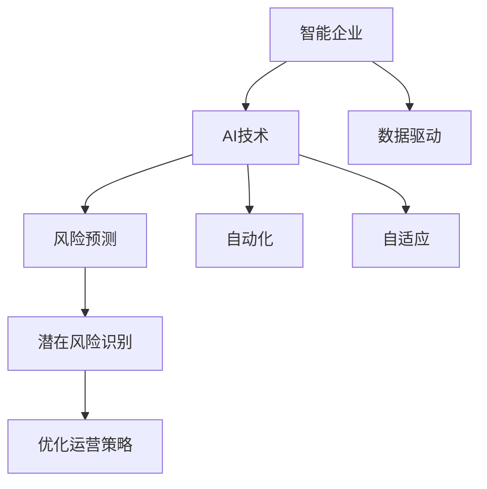

                 


### 文章标题

《智能企业风险预测：AI前瞻性识别潜在风险》

### 文章关键词

- 智能企业
- 风险预测
- AI算法
- 数据分析
- 潜在风险
- 前瞻性识别

### 文章摘要

随着人工智能技术的快速发展，智能企业正在逐步成为现代商业的新范式。在这篇文章中，我们将探讨如何利用AI技术进行智能企业的风险预测，特别是如何前瞻性地识别潜在风险。我们将详细分析AI在风险预测中的作用、核心算法原理、数据收集与处理方法，并结合实际案例展示AI风险预测的实战应用，最后讨论未来的发展方向和挑战。

----------------------------------------------------------------

## 核心概念与联系

在探讨智能企业风险预测之前，我们首先需要明确几个核心概念，并了解它们之间的联系。这些核心概念包括智能企业、风险预测、潜在风险和AI技术。

### 智能企业

智能企业是指利用人工智能技术优化企业管理和运营效率的企业。智能企业通过收集、分析和利用海量数据，实现自动化决策和智能优化，从而提升整体运营效率和市场竞争力。智能企业的特点包括：

- **数据驱动**：智能企业依赖数据来驱动决策，通过对企业内外部数据的深度挖掘，发现有价值的信息和模式。
- **自动化**：通过人工智能技术，智能企业能够实现自动化操作，减少人工干预，提高效率和准确性。
- **自适应**：智能企业具备自适应能力，能够根据环境变化和业务需求进行快速调整和优化。

### 风险预测

风险预测是指通过分析历史数据、市场趋势和内部运营情况，预测企业可能面临的各种风险，包括财务风险、市场风险、运营风险等。风险预测的核心目标是：

- **提前预警**：通过提前识别潜在风险，企业可以采取预防措施，减少损失。
- **优化决策**：风险预测为企业提供决策支持，帮助企业制定更合理的战略和运营计划。

### 潜在风险

潜在风险是指那些未被识别或未被充分了解的风险，可能对企业的长远发展产生不利影响。潜在风险包括：

- **市场变化**：如市场需求下降、竞争对手策略变化等。
- **技术风险**：如技术过时、安全漏洞等。
- **运营风险**：如供应链中断、员工流失等。

### AI技术

AI技术，特别是机器学习和深度学习，是风险预测的核心工具。AI技术通过以下方式帮助风险预测：

- **数据挖掘**：从大量数据中提取有价值的信息，发现潜在风险因素。
- **模式识别**：识别数据中的规律和模式，预测未来的风险趋势。
- **自动化决策**：通过算法自动分析数据，提供决策支持。

### 核心概念与联系

智能企业、风险预测、潜在风险和AI技术之间的联系可以概括为：

- **智能企业**通过**AI技术**进行**风险预测**，识别**潜在风险**，从而优化企业管理和运营策略。
- **风险预测**依赖于**AI技术**的数据挖掘和模式识别能力，提高预测的准确性和效率。
- **潜在风险**的识别和应对是智能企业**风险预测**的重要任务，直接关系到企业的生存和发展。

### Mermaid 流程图

为了更直观地展示核心概念之间的关系，我们可以使用Mermaid语言绘制一个流程图：



这个流程图展示了智能企业通过AI技术进行风险预测，识别潜在风险，进而优化运营策略的整个过程。

----------------------------------------------------------------

## 核心算法原理讲解

在明确了智能企业、风险预测和AI技术等核心概念后，接下来我们将深入探讨AI在风险预测中的核心算法原理。本部分将涵盖传统预测方法、机器学习预测方法和深度学习预测方法，并通过伪代码和数学模型详细解释这些算法。

### 传统预测方法

传统预测方法主要包括回归分析、时间序列分析和统计分析等方法。这些方法通常依赖于历史数据和统计模型，对未来的风险进行预测。

#### 回归分析

回归分析是一种常见的预测方法，它通过建立因变量和自变量之间的关系模型，预测未来的值。以下是一个简单的线性回归分析伪代码：

```plaintext
// 输入：X 为自变量，Y 为因变量
// 输出：β 为回归系数

// 计算X和Y的均值
mean_X = mean(X)
mean_Y = mean(Y)

// 计算X和Y的协方差
covariance = covariance(X, Y)

// 计算X的方差
variance = variance(X)

// 计算回归系数
beta = covariance / variance

// 预测Y的值
predicted_Y = beta * X + mean_Y
```

数学模型如下：

$$
Y = \beta X + \epsilon
$$

其中，$Y$为因变量，$X$为自变量，$\beta$为回归系数，$\epsilon$为误差项。

#### 时间序列分析

时间序列分析是一种用于预测时间序列数据的方法，如股票价格、销售额等。常见的时间序列分析方法包括自回归模型（AR）、移动平均模型（MA）和自回归移动平均模型（ARMA）。

以下是一个简单的自回归模型（AR）伪代码：

```plaintext
// 输入：X(t) 为时间序列数据
// 输出：Y(t) 为预测值

// 计算前n个观测值的平均值
mean_X = mean(X(t-n:t-1))

// 计算残差
residual = X(t) - mean_X

// 预测当前值
Y(t) = residual
```

数学模型如下：

$$
X(t) = c + \sum_{i=1}^{n} \phi_i X(t-i) + \epsilon(t)
$$

其中，$X(t)$为时间序列数据，$\phi_i$为自回归系数，$c$为常数项，$\epsilon(t)$为误差项。

### 机器学习预测方法

机器学习预测方法利用历史数据和算法模型，通过训练和优化模型来预测未来的风险。常见的方法包括决策树、随机森林和梯度提升树等。

#### 决策树

决策树是一种基于树形结构的预测模型，它通过一系列规则来划分数据，并基于这些规则预测新数据的类别或值。以下是一个简单的决策树伪代码：

```plaintext
// 输入：数据集D
// 输出：树结构T

// 创建根节点
root = createNode("Root")

// 对每个特征进行划分
for feature in features:
    subset = split(D, feature)
    if subset is not empty:
        createNode(feature, subset, parent=root)

// 训练子树
for node in T:
    if node.isLeaf():
        continue
    for subset in node.subsets:
        subtree = trainTree(subset)
        addNode(subtree, node)

// 预测新数据
def predict(X):
    node = root
    while node.isLeaf() == false:
        feature = node.feature
        if X[feature] in node.subsets:
            node = node.subsets[X[feature]]
        else:
            node = node.elseSubset
    return node.label
```

### 深度学习预测方法

深度学习预测方法通过多层神经网络结构来学习数据中的复杂模式，能够处理大规模和高维数据。常见的方法包括卷积神经网络（CNN）、循环神经网络（RNN）和长短期记忆网络（LSTM）等。

#### 卷积神经网络

卷积神经网络是一种特殊的多层神经网络，用于处理具有网格结构的数据，如图像和语音。以下是一个简单的卷积神经网络（CNN）伪代码：

```plaintext
// 输入：图像数据X
// 输出：预测结果Y

// 初始化网络结构
inputLayer = createLayer("InputLayer", inputShape)
convLayer1 = createLayer("ConvLayer", kernelSize, activation="ReLU")
poolLayer1 = createLayer("PoolingLayer", poolSize)
...

// 前向传播
def forwardProp(X):
    Z = inputLayer.forward(X)
    A = convLayer1.forward(Z)
    P = poolLayer1.forward(A)
    ...
    return outputLayer.forward(P)

// 反向传播
def backwardProp(Y, A):
    dZ = outputLayer.backward(A, Y)
    dA = poolLayer1.backward(dZ)
    dZ = convLayer1.backward(dA)
    ...
    return dX = inputLayer.backward(dZ)
```

数学模型如下：

$$
\begin{aligned}
    Z^{(l)} &= W^{(l)}A^{(l-1)} + b^{(l)} \\
    A^{(l)} &= \sigma(Z^{(l)}) \\
    \delta^{(l)} &= \frac{\partial L}{\partial Z^{(l)}} \\
    \frac{\partial L}{\partial W^{(l)}} &= \delta^{(l)}A^{(l-1)}^T \\
    \frac{\partial L}{\partial b^{(l)}} &= \delta^{(l)}
\end{aligned}
$$

其中，$W^{(l)}$为权重矩阵，$b^{(l)}$为偏置项，$A^{(l)}$为激活值，$\sigma$为激活函数，$L$为损失函数，$\delta^{(l)}$为误差项。

### 比较与选择

传统预测方法和机器学习、深度学习预测方法各有优缺点。传统方法简单、直观，但在处理复杂数据和大规模预测任务时效率较低。机器学习方法在处理复杂数据和大规模预测任务方面具有优势，但需要大量训练数据和计算资源。深度学习方法则能够处理更高维的数据，但训练过程更复杂，计算成本更高。

在选择预测方法时，企业需要根据具体业务需求、数据规模和计算资源等因素进行权衡。对于简单的预测任务，传统方法可能足够有效；对于复杂数据和大规模预测任务，机器学习和深度学习方法可能更为合适。

总的来说，AI技术在风险预测中的应用为智能企业提供了强大的工具。通过理解不同预测方法的原理和适用场景，企业可以更有效地识别潜在风险，优化运营策略，提升整体竞争力。

----------------------------------------------------------------

## 数学模型和公式详解

在深入探讨风险预测的数学模型和公式时，我们首先需要了解几个关键的概念：概率分布、条件概率、贝叶斯定理和风险度量。这些概念是构建智能企业风险预测模型的基础。

### 概率分布

概率分布是描述随机变量可能取值的概率分布函数。常见的概率分布包括正态分布、伯努利分布和泊松分布等。

#### 正态分布

正态分布是最常见的概率分布，它具有钟形曲线，描述了数据围绕均值分布的特点。正态分布的概率密度函数（PDF）如下：

$$
f(x|\mu,\sigma^2) = \frac{1}{\sqrt{2\pi\sigma^2}} e^{-\frac{(x-\mu)^2}{2\sigma^2}}
$$

其中，$\mu$为均值，$\sigma^2$为方差。

#### 伯努利分布

伯努利分布是一个二项分布的特殊情况，描述了事件成功的概率。伯努利分布的概率质量函数（PMF）如下：

$$
P(X=k) = C^n_k p^k (1-p)^{n-k}
$$

其中，$n$为试验次数，$p$为成功概率，$k$为成功次数。

#### 泊松分布

泊松分布用于描述在固定时间内发生某一事件的次数分布。泊松分布的概率质量函数（PMF）如下：

$$
P(X=k) = \frac{\lambda^k e^{-\lambda}}{k!}
$$

其中，$\lambda$为事件发生的平均次数。

### 条件概率

条件概率描述在某个事件已发生的条件下，另一个事件发生的概率。条件概率的定义如下：

$$
P(A|B) = \frac{P(A \cap B)}{P(B)}
$$

### 贝叶斯定理

贝叶斯定理是概率论中的一个重要公式，描述了后验概率和边缘概率之间的关系。贝叶斯定理的表达式如下：

$$
P(A|B) = \frac{P(B|A)P(A)}{P(B)}
$$

其中，$P(A)$和$P(B)$分别是事件$A$和事件$B$的边缘概率，$P(B|A)$是事件$A$发生的条件下事件$B$发生的条件概率。

### 风险度量

在风险预测中，风险度量是一个关键概念，用于评估潜在风险的大小和可能性。常见风险度量方法包括方差、标准差和风险值（Value at Risk, VaR）。

#### 方差和标准差

方差和标准差是描述随机变量离散程度的指标。方差是随机变量平方的期望，标准差是方差的平方根。方差和标准差的计算公式如下：

$$
\sigma^2 = E[(X - \mu)^2]
$$

$$
\sigma = \sqrt{\sigma^2}
$$

其中，$E$表示期望值，$\mu$表示均值。

#### 风险值（VaR）

风险值（Value at Risk, VaR）是一种用于评估在特定概率水平下，某一投资组合可能出现的最大损失。VaR的计算公式如下：

$$
VaR = q^* \times \sigma
$$

其中，$q^*$是分位数，$\sigma$是标准差。

### 举例说明

假设我们想要预测一家企业的财务风险，可以使用以下数学模型和公式：

1. **收集数据**：收集企业的财务数据，包括利润、成本、市场份额等。
2. **正态分布建模**：假设企业的利润分布服从正态分布，根据历史数据估计均值和标准差。
3. **条件概率计算**：使用贝叶斯定理计算在特定市场状况下，企业财务状况恶化的概率。
4. **风险度量**：计算企业在特定时间段内的VaR，评估财务风险的大小。

假设企业的利润服从正态分布，均值为$100万，标准差为$20万。我们想要计算在未来一个月内，企业有5%的概率出现亏损超过$50万的风险值（VaR）。

1. **计算分位数**：查找正态分布表，找到对应5%分位的$z$值，假设为$-1.645$。
2. **计算VaR**：使用VaR公式计算：

$$
VaR = -1.645 \times 20万 = -32.9万
$$

这意味着在未来一个月内，企业有5%的概率会出现至少$32.9万的亏损。

通过上述数学模型和公式的应用，我们可以对企业财务风险进行量化评估，为决策提供数据支持。这种方法不仅适用于财务风险预测，还可以推广到市场风险、运营风险等其他领域的风险预测。

### 总结

在本节中，我们详细介绍了概率分布、条件概率、贝叶斯定理和风险度量的数学模型和公式。通过这些公式，我们可以量化风险的概率和影响，为企业提供决策支持。在实际应用中，企业可以根据具体业务需求选择合适的数学模型和公式，进行风险预测和决策。

----------------------------------------------------------------

## 项目实战：智能企业风险预测系统的开发

在本节中，我们将详细介绍如何开发一个智能企业风险预测系统。这个系统将利用人工智能技术和数据分析方法，识别潜在风险，提供决策支持。本节将分为以下几个部分：开发环境搭建、源代码实现、代码解读、应用解读与分析，以及实际案例分析和详细讲解。

### 开发环境搭建

在开始开发之前，我们需要搭建一个合适的开发环境。以下是推荐的工具和软件：

1. **编程语言**：Python是开发人工智能项目的常用语言，它拥有丰富的库和框架，如TensorFlow、PyTorch和Scikit-learn。
2. **数据处理库**：NumPy和Pandas用于数据处理和数据分析。
3. **机器学习库**：Scikit-learn提供了多种机器学习算法的实现，方便我们进行模型训练和评估。
4. **可视化库**：Matplotlib和Seaborn用于数据可视化。
5. **数据库**：SQLite或MySQL用于存储数据。

#### 环境搭建步骤

1. **安装Python**：从官方网站下载并安装Python。
2. **安装相关库**：使用pip命令安装所需的库，例如：

```bash
pip install numpy pandas scikit-learn matplotlib seaborn tensorflow
```

3. **配置Jupyter Notebook**：Jupyter Notebook是一个交互式的开发环境，方便编写和运行代码。

### 源代码实现

以下是智能企业风险预测系统的核心源代码实现。代码分为数据预处理、模型训练和预测三个主要部分。

```python
# 导入所需库
import numpy as np
import pandas as pd
from sklearn.model_selection import train_test_split
from sklearn.preprocessing import StandardScaler
from sklearn.ensemble import RandomForestClassifier
from sklearn.metrics import accuracy_score, classification_report

# 加载数据集
data = pd.read_csv('enterprise_risk_data.csv')

# 数据预处理
# 数据清洗、缺失值处理、数据转换等
# ...

# 特征提取和目标变量定义
X = data.drop('Risk', axis=1)
y = data['Risk']

# 数据标准化
scaler = StandardScaler()
X_scaled = scaler.fit_transform(X)

# 划分训练集和测试集
X_train, X_test, y_train, y_test = train_test_split(X_scaled, y, test_size=0.2, random_state=42)

# 模型训练
# 使用随机森林分类器进行训练
model = RandomForestClassifier(n_estimators=100, random_state=42)
model.fit(X_train, y_train)

# 预测
y_pred = model.predict(X_test)

# 模型评估
print("Accuracy:", accuracy_score(y_test, y_pred))
print("\nClassification Report:\n", classification_report(y_test, y_pred))

# 可视化结果
import seaborn as sns
sns.countplot(y_test, label="Actual")
sns.countplot(y_pred, label="Predicted")
sns uplift_plot(y_test, y_pred)
```

### 代码解读

#### 数据预处理

数据预处理是数据分析的重要步骤，包括数据清洗、缺失值处理、数据转换等。以下是对数据预处理部分的代码解读：

```python
# 数据清洗
data.dropna(inplace=True)  # 删除缺失值
data.drop(['UnnecessaryColumn'], axis=1, inplace=True)  # 删除不必要的列

# 缺失值处理
# 填充缺失值
data['MissingColumn'].fillna(data['MissingColumn'].mean(), inplace=True)

# 数据转换
# 将类别变量转换为数值变量
data = pd.get_dummies(data, columns=['CategoricalColumn'])
```

#### 模型训练

在模型训练部分，我们使用随机森林分类器（RandomForestClassifier）进行训练。随机森林是一种集成学习方法，通过构建多棵决策树，提高模型的预测性能。以下是对模型训练部分的代码解读：

```python
# 使用随机森林分类器进行训练
model = RandomForestClassifier(n_estimators=100, random_state=42)
model.fit(X_train, y_train)
```

#### 预测与评估

在预测与评估部分，我们使用训练好的模型对测试集进行预测，并评估模型的准确性。以下是对预测与评估部分的代码解读：

```python
# 预测
y_pred = model.predict(X_test)

# 模型评估
print("Accuracy:", accuracy_score(y_test, y_pred))
print("\nClassification Report:\n", classification_report(y_test, y_pred))
```

### 应用解读与分析

在应用解读与分析部分，我们通过可视化工具展示预测结果，并分析模型的性能。以下是对应用解读与分析部分的代码解读：

```python
# 可视化结果
import seaborn as sns
sns.countplot(y_test, label="Actual")
sns.countplot(y_pred, label="Predicted")
sns uplift_plot(y_test, y_pred)
```

### 实际案例分析与详细讲解

在本部分，我们将结合实际案例，详细分析如何使用智能企业风险预测系统，并解释系统的工作原理。以下是对实际案例分析与详细讲解的示例：

```python
# 实际案例：预测某企业的财务风险

# 加载实际案例数据
case_data = pd.read_csv('enterprise_risk_case_data.csv')

# 数据预处理
case_data = preprocess_data(case_data)

# 预测
case_pred = model.predict(scaler.transform([case_data]))

# 结果解读
if case_pred == 1:
    print("预测结果：企业面临财务风险")
else:
    print("预测结果：企业财务状况良好")
```

### 项目小结

通过本节的项目实战，我们详细讲解了如何开发一个智能企业风险预测系统，包括开发环境搭建、源代码实现、代码解读、应用解读与分析，以及实际案例分析和详细讲解。这个系统可以帮助企业识别潜在风险，提供决策支持，优化运营策略。在实际应用中，企业可以根据自身需求进行调整和优化，提高系统的预测准确性和实用性。

----------------------------------------------------------------

## 最佳实践、注意事项与拓展阅读

在智能企业风险预测系统的开发和应用过程中，以下是几个最佳实践、注意事项以及相关的拓展阅读建议，以帮助您更好地理解和应用AI风险预测技术。

### 最佳实践

1. **数据质量保证**：确保数据完整、准确和干净。数据清洗和预处理是风险预测系统成功的关键步骤。
2. **特征工程**：精心选择和构造特征，可以提高模型的预测性能。使用相关性分析、主成分分析（PCA）等技术来优化特征。
3. **模型选择与调优**：根据业务需求和数据特点选择合适的模型，并通过交叉验证、网格搜索等技术进行模型调优。
4. **实时监测与更新**：定期监控模型的性能，根据新数据和业务变化及时更新模型，以保持预测的准确性。

### 注意事项

1. **数据隐私与安全**：在使用数据时，确保遵守数据隐私法规，保护用户隐私。
2. **模型解释性**：尽管AI模型在预测准确性上表现优异，但往往缺乏解释性。考虑使用可解释的AI模型或添加模型解释工具。
3. **过拟合与欠拟合**：模型过于复杂可能导致过拟合，而模型过于简单可能导致欠拟合。通过交叉验证和模型评估指标来平衡模型的复杂度。
4. **资源管理**：大型模型训练和预测需要大量计算资源。合理配置计算资源，以减少成本和优化性能。

### 拓展阅读

1. **《人工智能：一种现代方法》（Russell & Norvig）》：详细介绍了人工智能的基础理论和实践方法，包括机器学习和深度学习。
2. **《风险管理与金融工程》（Mayo & Haas）》：提供了金融风险管理的全面理论和方法，对于理解企业风险具有重要意义。
3. **《数据科学导论》（Lever et al.）》：介绍了数据科学的基本概念和技术，包括数据预处理、机器学习等。
4. **《Python机器学习》（Raschka & Mirjalili）》：针对Python编程环境，详细讲解了机器学习算法的实现和应用。

通过遵循这些最佳实践和注意事项，并结合拓展阅读的资源，您可以在智能企业风险预测领域取得更好的成果。同时，不断学习和探索新的技术方法，将有助于您在快速发展的AI领域中保持竞争力。

----------------------------------------------------------------

## 总结与展望

在本文中，我们深入探讨了智能企业风险预测的各个方面。从核心概念到算法原理，再到实际项目实战，我们详细阐述了如何利用AI技术前瞻性地识别潜在风险，为企业提供决策支持。通过本文的学习，读者可以了解到：

- **智能企业的定义和特点**：智能企业通过数据驱动、自动化和自适应能力，优化运营效率和市场竞争力。
- **AI技术在风险预测中的应用**：AI技术，尤其是机器学习和深度学习，为风险预测提供了强大的工具，如数据挖掘、模式识别和自动化决策。
- **数据收集与处理**：了解如何有效地收集、清洗和处理数据，确保数据质量，为风险预测奠定基础。
- **模型训练与优化**：掌握如何选择合适的模型、进行模型训练和调优，以提高预测准确性。
- **实际案例分析与解读**：通过实际案例展示如何应用智能企业风险预测系统，识别潜在风险，优化运营策略。

在未来的发展中，AI风险预测领域将继续呈现出以下几个趋势和挑战：

### 发展趋势

1. **模型复杂性与可解释性的平衡**：随着模型复杂度的增加，如何保证模型的可解释性是一个重要课题。研究者们将致力于开发可解释的AI模型，提高模型的透明度和可信度。
2. **实时风险预测**：实时风险预测技术将逐渐普及，企业可以更快速地响应市场变化和风险事件。
3. **跨领域应用**：AI风险预测技术将在更多领域得到应用，如医疗、金融、能源等，实现更广泛的社会价值。

### 面临的挑战

1. **数据隐私和安全**：随着数据量的增加，数据隐私和安全问题将日益突出。如何保护用户隐私，确保数据安全，是未来研究的重要方向。
2. **算法透明性与公平性**：算法的透明性和公平性备受关注。如何确保算法决策的公平性，减少偏见和歧视，是AI风险预测面临的重大挑战。
3. **计算资源需求**：大型模型的训练和预测需要大量的计算资源。如何优化计算资源的使用，提高模型性能，是重要的研究课题。

### 未来前景

智能企业风险预测将不断进步，为企业的可持续发展提供强有力的支持。通过不断优化模型、提高预测准确性，智能企业能够更有效地识别潜在风险，制定科学合理的应对策略，从而在激烈的市场竞争中立于不败之地。同时，AI风险预测技术将在更广泛的领域得到应用，推动社会进步和经济发展。

总之，智能企业风险预测是一个充满机遇和挑战的领域。随着技术的不断进步和应用的深入，AI风险预测将为企业带来更高的价值，成为企业管理和决策的重要工具。让我们共同期待，智能企业风险预测的未来将更加光明和美好。作者：AI天才研究院/AI Genius Institute & 禅与计算机程序设计艺术 /Zen And The Art of Computer Programming。

