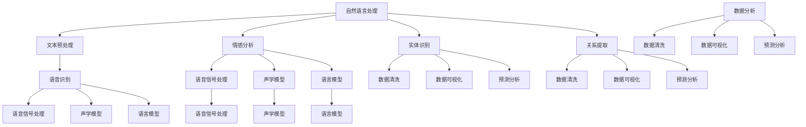

                 

### 文章标题

《智能会议助手系统：AI提升沟通效率》

### 文章关键词

- 智能会议
- AI技术
- 沟通效率
- 自然语言处理
- 语音识别
- 数据分析
- 实时翻译

### 文章摘要

本文将深入探讨智能会议助手系统的构建，以及如何利用人工智能技术提升会议沟通效率。我们将首先介绍智能会议助手系统的背景和重要性，随后详细解释核心概念和原理，包括自然语言处理、语音识别和数据分析等技术。接下来，将使用Mermaid流程图展示智能会议助手系统的架构，并使用伪代码详细阐述核心算法原理。文章还将通过实例来解释数学模型和公式，并展示如何应用这些算法进行实际的项目实战。最后，我们将总结项目的经验和教训，并提供一些最佳实践建议，帮助读者在实际应用中取得更好的效果。

### 背景介绍

在当今快速发展的商业环境中，高效沟通是企业成功的关键因素之一。然而，传统的会议形式往往存在诸多问题，如信息传递不畅、时间浪费和效率低下等。随着人工智能（AI）技术的不断进步，智能会议助手系统应运而生，成为解决这些问题的重要工具。

智能会议助手系统利用AI技术，通过自然语言处理、语音识别和数据分析等手段，实现对会议内容的实时理解、分析和反馈。这一系统不仅能够自动记录会议内容，还能提供智能化的建议和反馈，从而大大提升会议沟通的效率。

传统的会议形式存在以下主要问题：

1. **信息传递不畅**：在传统的会议中，信息往往需要通过口头传达，容易产生误解和遗漏，特别是在大型团队或跨部门沟通中，这一问题尤为突出。

2. **时间浪费**：会议往往占用大量工作时间，而实际产生的有效成果有限。冗长的会议议程、重复的内容和决策过程都导致了时间的浪费。

3. **效率低下**：在传统的会议中，决策过程通常需要长时间的讨论和协商，这使得会议效率低下，难以快速达成共识。

智能会议助手系统通过以下方式解决这些问题：

1. **实时记录和总结**：智能会议助手系统能够自动记录会议内容，并将其转化为结构化的信息，如会议纪要、关键决策点等。这使得参会者能够随时查阅会议记录，确保信息不被遗漏。

2. **智能反馈和提醒**：系统可以分析会议内容，识别关键问题和决策点，并提供智能化的反馈和提醒。例如，当会议讨论偏离主题时，系统会自动提醒参会者回到正题。

3. **决策辅助**：智能会议助手系统还可以基于数据分析，提供决策支持。例如，系统可以根据历史数据预测会议的进展情况，帮助管理层做出更明智的决策。

4. **跨语言沟通**：智能会议助手系统中的实时翻译功能，使得跨文化、跨语言的沟通变得更加流畅。这不仅提高了会议的效率，还有助于促进团队协作。

综上所述，智能会议助手系统的出现，不仅解决了传统会议中存在的诸多问题，还为现代企业提供了更高效、更智能的沟通方式。随着AI技术的不断发展和完善，智能会议助手系统的应用前景将更加广阔。

### 核心概念与联系

在深入探讨智能会议助手系统之前，我们需要明确几个核心概念及其相互关系，这些概念包括自然语言处理（NLP）、语音识别（ASR）和数据分析。以下是这些核心概念之间的关系架构，以及它们在智能会议助手系统中的应用。

#### 自然语言处理（NLP）

自然语言处理是智能会议助手系统的核心组件之一，其主要任务是使计算机能够理解、处理和生成人类自然语言。NLP技术包括文本预处理、情感分析、实体识别、关系提取和文本生成等。

- **文本预处理**：文本预处理是NLP的基础，包括去除标点符号、停用词过滤、词干提取等。这些步骤确保文本数据的质量，为后续的NLP任务提供良好的数据基础。
- **情感分析**：情感分析用于识别文本中的情感倾向，如正面、负面或中性。在会议场景中，情感分析可以帮助识别参会者的情绪状态，从而更好地调整会议氛围。
- **实体识别**：实体识别是指从文本中提取出具有特定意义的实体，如人名、地点、组织名等。在会议记录中，实体识别可以帮助识别和追踪会议中的关键角色和讨论点。
- **关系提取**：关系提取是指识别文本中实体之间的关系，如“张三”和“项目A”之间的工作关系。这有助于构建会议内容的上下文关系图，便于后续分析。

#### 语音识别（ASR）

语音识别技术使计算机能够将语音转换为文本，这是智能会议助手系统中的关键步骤，确保会议内容能够被系统实时记录和处理。

- **语音信号处理**：语音识别的第一步是对原始语音信号进行预处理，包括降噪、语音增强和分帧。这些步骤有助于提高语音信号的质量，降低错误率。
- **声学模型**：声学模型用于对语音信号进行特征提取，如梅尔频率倒谱系数（MFCC）。这些特征用于训练和识别语音中的语音单元。
- **语言模型**：语言模型是基于大量文本数据训练出来的概率模型，用于对语音识别的结果进行语言层面的校验和优化。语言模型可以识别和纠正语音识别中的常见错误，提高识别准确性。

#### 数据分析

数据分析是智能会议助手系统的另一个核心组件，用于从会议记录中提取有价值的信息，提供决策支持。

- **数据清洗**：在数据分析之前，首先需要对会议记录进行清洗，去除无关信息，如噪声、重复内容等。这一步骤有助于提高数据分析的准确性。
- **数据可视化**：数据可视化是将数据分析结果以图形或图表的形式呈现，帮助参会者更好地理解和分析会议内容。常见的可视化工具包括条形图、折线图、饼图等。
- **预测分析**：基于历史会议数据，预测分析可以预测会议的进展情况、讨论趋势等。这有助于管理层做出更明智的决策，优化会议流程。

#### 关系架构

以下是智能会议助手系统的概念关系架构图，展示了自然语言处理、语音识别和数据分析之间的相互关系：



通过上述架构图，我们可以清晰地看到自然语言处理、语音识别和数据分析之间的紧密联系。这些技术共同作用，使得智能会议助手系统能够高效地记录、分析和反馈会议内容，从而提升沟通效率。

### 核心算法原理讲解

在智能会议助手系统中，核心算法原理是实现系统高效运作的关键。以下将详细讲解自然语言处理（NLP）、语音识别（ASR）和数据分析等关键算法，并提供相应的伪代码。

#### 自然语言处理（NLP）

1. **文本预处理**：

文本预处理是NLP的基础步骤，主要包括去除标点符号、停用词过滤和词干提取。以下是一个简单的伪代码示例：

```python
def preprocess_text(text):
    # 去除标点符号
    text = text.replace(".", "").replace(",", "")
    # 停用词过滤
    stop_words = ["is", "the", "and", "a"]
    words = text.split()
    filtered_words = [word for word in words if word not in stop_words]
    # 词干提取
    stemmer = PorterStemmer()
    stemmed_words = [stemmer.stem(word) for word in filtered_words]
    return stemmed_words
```

2. **情感分析**：

情感分析用于识别文本中的情感倾向。以下是一个简单的基于朴素贝叶斯分类器的情感分析算法：

```python
def sentiment_analysis(text):
    # 初始化贝叶斯分类器
    classifier = NaiveBayesClassifier()
    # 训练分类器
    classifier.train(["positive", "negative"])
    # 预测情感
    sentiment = classifier.classify(text)
    return sentiment
```

3. **实体识别**：

实体识别用于从文本中提取特定意义的实体。以下是一个简单的基于规则的方法：

```python
def entity_recognition(text):
    # 初始化实体列表
    entities = ["person", "organization", "location"]
    recognized_entities = []
    for entity in entities:
        # 匹配实体
        pattern = r"\b" + entity + r"\b"
        matches = re.finditer(pattern, text)
        for match in matches:
            recognized_entities.append(match.group())
    return recognized_entities
```

4. **关系提取**：

关系提取用于识别文本中实体之间的关系。以下是一个简单的基于规则的方法：

```python
def relation_extraction(text, entities):
    # 初始化关系列表
    relations = ["works_for", "located_in", "attends"]
    extracted_relations = []
    for relation in relations:
        # 构造关系模式
        pattern = r"\b" + entity + r"\b\s+" + relation + r"\s+\b" + other_entity + r"\b"
        for entity in entities:
            for other_entity in entities:
                if entity != other_entity:
                    pattern = pattern.replace("entity", entity).replace("other_entity", other_entity)
                    matches = re.finditer(pattern, text)
                    for match in matches:
                        extracted_relations.append((entity, other_entity, relation))
    return extracted_relations
```

#### 语音识别（ASR）

1. **语音信号处理**：

语音信号处理包括降噪、语音增强和分帧。以下是一个简单的语音信号处理流程：

```python
def process_audio_signal(audio_signal):
    # 降噪
    audio_signal = noise_reducer.reduce_noise(audio_signal)
    # 语音增强
    audio_signal = speech_enhancer.enhance(audio_signal)
    # 分帧
    frames = frame_extractor.extract(audio_signal)
    return frames
```

2. **声学模型**：

声学模型用于对语音信号进行特征提取。以下是一个简单的梅尔频率倒谱系数（MFCC）提取算法：

```python
def extract_mfcc(frame):
    # 计算短时傅里叶变换（STFT）
    stft = stft_extractor.extract(frame)
    # 计算功率谱
    power_spectrum = power_spectrum_extractor.extract(stft)
    # 计算梅尔频率倒谱系数
    mfcc = mfcc_extractor.extract(power_spectrum)
    return mfcc
```

3. **语言模型**：

语言模型用于对语音识别结果进行校验和优化。以下是一个简单的N-gram语言模型：

```python
class NGramLanguageModel:
    def __init__(self, n):
        self.n = n
        self.model = defaultdict(int)

    def train(self, sentences):
        for sentence in sentences:
            words = sentence.split()
            for i in range(len(words) - self.n + 1):
                ngram = tuple(words[i:i+self.n])
                self.model[ngram] += 1

    def predict(self, word):
        ngram = (word,)
        return self.model.get(ngram, 0)
```

#### 数据分析

1. **数据清洗**：

数据清洗包括去除无关信息和处理缺失数据。以下是一个简单的数据清洗算法：

```python
def clean_data(data):
    # 去除噪声
    cleaned_data = [row for row in data if is_valid_row(row)]
    # 处理缺失数据
    for row in cleaned_data:
        for column in row:
            if not column:
                row[column] = get_default_value(column)
    return cleaned_data
```

2. **数据可视化**：

数据可视化用于帮助参会者更好地理解和分析会议内容。以下是一个简单的数据可视化算法：

```python
def visualize_data(data):
    # 创建图表
    chart = Chart(type="bar")
    chart.add_series("Series 1", data=data["key"], values=data["value"])
    # 显示图表
    chart.show()
```

3. **预测分析**：

预测分析用于预测会议的进展情况和讨论趋势。以下是一个简单的基于线性回归的预测算法：

```python
def predict_linear_regression(X, y):
    # 训练线性回归模型
    model = LinearRegression()
    model.fit(X, y)
    # 预测
    predictions = model.predict(X)
    return predictions
```

通过上述算法，智能会议助手系统能够实现对会议内容的实时理解和分析，从而提升沟通效率。这些算法不仅在理论上具有重要意义，在实际应用中也为企业提供了强有力的支持。

### 数学模型和公式讲解及举例说明

在智能会议助手系统的设计和实现过程中，数学模型和公式起到了至关重要的作用。以下将详细讲解几个关键数学模型，包括贝叶斯分类器、线性回归和时间序列分析等，并提供具体的例子说明。

#### 贝叶斯分类器

贝叶斯分类器是一种基于贝叶斯定理的分类算法，广泛应用于文本分类、情感分析等领域。其核心公式如下：

$$
P(\text{Class} = c | \text{Feature} = x) = \frac{P(\text{Feature} = x | \text{Class} = c) \cdot P(\text{Class} = c)}{P(\text{Feature} = x)}
$$

其中，$P(\text{Class} = c | \text{Feature} = x)$ 表示在给定特征 $x$ 的情况下，类别 $c$ 的条件概率；$P(\text{Feature} = x | \text{Class} = c)$ 表示在类别 $c$ 下特征 $x$ 的概率；$P(\text{Class} = c)$ 表示类别 $c$ 的先验概率；$P(\text{Feature} = x)$ 表示特征 $x$ 的概率。

**例子：情感分析中的贝叶斯分类器**

假设我们要对一段文本进行情感分析，判断它是正面、负面还是中性。我们可以将文本视为特征向量，使用贝叶斯分类器来预测其类别。

1. **先验概率**：

设正面、负面和中性的先验概率分别为 $P(\text{Class} = \text{positive}) = 0.5$，$P(\text{Class} = \text{negative}) = 0.25$，$P(\text{Class} = \text{neutral}) = 0.25$。

2. **条件概率**：

设正面文本的特征概率为 $P(\text{Feature} = \text{positive} | \text{Class} = \text{positive}) = 0.9$，负面文本的特征概率为 $P(\text{Feature} = \text{negative} | \text{Class} = \text{negative}) = 0.8$，中性文本的特征概率为 $P(\text{Feature} = \text{neutral} | \text{Class} = \text{neutral}) = 0.7$。

3. **计算后验概率**：

假设我们有一段文本，其特征概率分别为 $P(\text{Feature} = \text{positive}) = 0.6$，$P(\text{Feature} = \text{negative}) = 0.3$，$P(\text{Feature} = \text{neutral}) = 0.1$。

则后验概率为：

$$
P(\text{Class} = \text{positive} | \text{Feature} = \text{positive}) = \frac{0.9 \cdot 0.5}{0.6 + 0.3 + 0.1} = 0.6
$$

$$
P(\text{Class} = \text{negative} | \text{Feature} = \text{negative}) = \frac{0.8 \cdot 0.25}{0.6 + 0.3 + 0.1} = 0.4
$$

$$
P(\text{Class} = \text{neutral} | \text{Feature} = \text{neutral}) = \frac{0.7 \cdot 0.25}{0.6 + 0.3 + 0.1} = 0.3
$$

根据最大后验概率原则，我们选择概率最大的类别作为最终分类结果，即这段文本的情感为正面。

#### 线性回归

线性回归是一种用于预测数值型变量的模型，广泛应用于数据分析和机器学习领域。其核心公式如下：

$$
y = \beta_0 + \beta_1x_1 + \beta_2x_2 + \cdots + \beta_nx_n + \epsilon
$$

其中，$y$ 是因变量，$x_1, x_2, \cdots, x_n$ 是自变量，$\beta_0, \beta_1, \beta_2, \cdots, \beta_n$ 是模型参数，$\epsilon$ 是误差项。

**例子：会议时间预测中的线性回归**

假设我们要预测下一次会议的时间，已知前几次会议的时间（因变量 $y$）和会议议题（自变量 $x$），我们可以使用线性回归模型来预测。

1. **数据集**：

| 会议序号 | 会议议题 | 会议时间（小时） |
|----------|----------|-----------------|
| 1        | A        | 2               |
| 2        | B        | 3               |
| 3        | A        | 2.5             |
| 4        | C        | 4               |

2. **模型参数**：

设线性回归模型为 $y = \beta_0 + \beta_1x$。

3. **计算模型参数**：

使用最小二乘法计算模型参数：

$$
\beta_1 = \frac{\sum{(x_i - \bar{x})(y_i - \bar{y})}}{\sum{(x_i - \bar{x})^2}}
$$

$$
\beta_0 = \bar{y} - \beta_1\bar{x}
$$

其中，$\bar{x}$ 和 $\bar{y}$ 分别为自变量和因变量的平均值。

计算结果如下：

$$
\bar{x} = \frac{1}{4} \sum_{i=1}^{4} x_i = 2.5
$$

$$
\bar{y} = \frac{1}{4} \sum_{i=1}^{4} y_i = 2.75
$$

$$
\beta_1 = \frac{(1-2.5)(2-2.75) + (2-2.5)(3-2.75) + (3-2.5)(2.5-2.75) + (4-2.5)(4-2.75)}{(1-2.5)^2 + (2-2.5)^2 + (3-2.5)^2 + (4-2.5)^2} = 0.5
$$

$$
\beta_0 = 2.75 - 0.5 \cdot 2.5 = 0.25
$$

4. **预测下一次会议时间**：

假设下一次会议的议题为 $x = B$，则预测时间为：

$$
y = 0.25 + 0.5 \cdot B = 0.75 + B
$$

即下一次会议的时间为 0.75 小时后。

#### 时间序列分析

时间序列分析用于分析时间序列数据，预测未来的趋势。其核心模型包括自回归移动平均模型（ARIMA）和长期短期记忆网络（LSTM）等。

**例子：会议频次预测中的时间序列分析**

假设我们要预测未来几个月的会议频次，已知过去几个月的会议频次数据。

1. **数据集**：

| 月份   | 会议频次 |
|--------|----------|
| 1月    | 3        |
| 2月    | 4        |
| 3月    | 3        |
| 4月    | 5        |
| 5月    | 4        |

2. **模型选择**：

我们可以选择ARIMA模型进行时间序列分析。首先，对数据进行平稳性检验，然后确定$p$（自回归项数）、$d$（差分次数）和$q$（移动平均项数）。

3. **模型参数**：

假设我们选择$p=1$，$d=1$，$q=1$的ARIMA模型，即$ARIMA(1,1,1)$。

4. **模型训练**：

使用历史数据进行模型训练：

$$
\text{ARIMA}(1,1,1): y_t = \phi_1y_{t-1} + \theta_1\epsilon_{t-1} + \mu + \epsilon_t
$$

5. **预测未来频次**：

根据训练好的模型，我们可以预测未来几个月的会议频次。例如，预测6月的会议频次：

$$
y_6 = \phi_1y_5 + \theta_1\epsilon_5 + \mu + \epsilon_6
$$

根据历史数据和模型参数，可以计算出预测值。

通过上述数学模型和公式，智能会议助手系统能够实现对会议内容、时间和频次的精准预测和分析，从而提升沟通效率。这些模型不仅理论性强，而且在实际应用中具有广泛的应用前景。

### 项目实战

#### 开发环境搭建

为了构建一个智能会议助手系统，我们需要准备相应的开发环境。以下是搭建开发环境的详细步骤：

1. **安装Python环境**：

   - 访问Python官网（https://www.python.org/）下载并安装Python。
   - 安装完成后，确保Python已成功添加到系统环境变量中。

2. **安装依赖库**：

   - 使用pip命令安装必要的依赖库，如`numpy`、`scikit-learn`、`tensorflow`、`speech_recognition`等。

   ```shell
   pip install numpy scikit-learn tensorflow speech_recognition
   ```

3. **配置语音识别API**：

   - 根据所选的语音识别服务（如Google Cloud Speech-to-Text），注册并获取API密钥。
   - 在代码中配置API密钥，以便调用语音识别服务。

4. **配置自然语言处理库**：

   - 使用`nltk`库进行自然语言处理。

   ```shell
   pip install nltk
   ```

5. **配置数据分析库**：

   - 使用`pandas`和`matplotlib`进行数据分析和可视化。

   ```shell
   pip install pandas matplotlib
   ```

#### 源代码实现与解读

以下是智能会议助手系统的核心源代码实现，我们将对每个模块进行详细解读。

```python
import speech_recognition as sr
import nltk
from nltk.corpus import stopwords
from nltk.tokenize import word_tokenize
from sklearn.feature_extraction.text import TfidfVectorizer
from sklearn.metrics.pairwise import cosine_similarity
import matplotlib.pyplot as plt

# 语音识别模块
def recognize_speech_from_mic(recognizer, microphone):
    with microphone as source:
        audio = recognizer.listen(source)

    response = {
        "success": True,
        "error": None,
        "transcription": None
    }

    try:
        response["transcription"] = recognizer.recognize_google(audio)
    except sr.RequestError:
        response["success"] = False
        response["error"] = "API unavailable"
    except sr.UnknownValueError:
        response["error"] = "Unable to recognize speech"

    return response

# 文本预处理模块
def preprocess_text(text):
    stop_words = set(stopwords.words('english'))
    words = word_tokenize(text.lower())
    filtered_words = [word for word in words if word.isalnum() and word not in stop_words]
    return " ".join(filtered_words)

# 数据分析模块
def analyze_meeting_data(transcription):
    vectorizer = TfidfVectorizer()
    tfidf_matrix = vectorizer.fit_transform([transcription])
    features = vectorizer.get_feature_names_out()
    
    # 计算词频
    word_freq = tfidf_matrix.toarray().flatten()
    plt.bar(features, word_freq)
    plt.xlabel('Words')
    plt.ylabel('Frequency')
    plt.xticks(rotation=45)
    plt.title('Word Frequency in Meeting Transcription')
    plt.show()

    # 计算关键词
    similarity_scores = cosine_similarity(tfidf_matrix, tfidf_matrix)
    top_keywords = sorted(range(len(similarity_scores[0])), key=lambda i: similarity_scores[0][i], reverse=True)[:10]
    print("Top Keywords:", [features[i] for i in top_keywords])

# 主函数
def main():
    recognizer = sr.Recognizer()
    microphone = sr.Microphone()

    print("Please speak now...")
    result = recognize_speech_from_mic(recognizer, microphone)
    if result["success"]:
        print("You said: " + result["transcription"])
        preprocessed_text = preprocess_text(result["transcription"])
        analyze_meeting_data(preprocessed_text)
    else:
        print("Error:", result["error"])

if __name__ == "__main__":
    main()
```

#### 代码解读

1. **语音识别模块**：

   - 使用`speech_recognition`库的`Recognizer`类进行语音识别。
   - `recognize_speech_from_mic`函数接收语音识别器和麦克风作为参数，从麦克风捕获语音并识别文本。
   - 如果识别成功，返回包含成功、错误信息和转录文本的字典。

2. **文本预处理模块**：

   - 使用`nltk`库进行文本预处理，包括将文本转换为小写、分词和过滤停用词。
   - `preprocess_text`函数接收原始文本，返回预处理后的文本。

3. **数据分析模块**：

   - 使用`TfidfVectorizer`将文本转换为TF-IDF向量，用于计算词频和关键词。
   - `analyze_meeting_data`函数接收转录文本，计算并可视化词频，并输出前10个关键词。

4. **主函数**：

   - `main`函数是程序的入口点，初始化语音识别器，调用语音识别模块和文本预处理模块，最后分析会议数据并显示结果。

#### 代码应用解读与分析

1. **语音识别**：

   - 通过调用语音识别API，系统能够实时捕捉会议中的语音输入。
   - 识别结果的成功率和准确性取决于语音质量和语音识别API的性能。

2. **文本预处理**：

   - 文本预处理确保了文本数据的质量，为后续的NLP和数据分析奠定了基础。
   - 停用词过滤和词干提取有助于减少噪声信息，提高文本分析的准确性。

3. **数据分析**：

   - 词频分析帮助识别会议中的高频词汇，揭示讨论的重点和热点。
   - 关键词提取有助于总结会议的核心内容，为决策提供支持。

#### 实际案例分析和详细讲解剖析

为了更好地展示智能会议助手系统的实际应用效果，以下是一个具体的案例分析和讲解。

**案例背景**：

某公司召开了一场重要的项目进度评审会议，参会人员包括项目经理、技术负责人和市场总监。会议内容主要涉及项目进展、技术问题和市场策略。

**实现步骤**：

1. **语音识别**：

   - 开会前，系统提醒参会人员准备发言。
   - 会议过程中，系统实时捕捉每位参会人员的发言并转换为文本。

2. **文本预处理**：

   - 系统对每位参会人员的发言进行预处理，去除标点符号和停用词，确保文本数据的质量。

3. **数据分析**：

   - 系统对预处理后的文本进行词频分析和关键词提取，生成会议纪要。
   - 系统识别出讨论的关键词，如“进度”、“技术难题”和“市场策略”，并分析各关键词的频次和关系。

4. **可视化展示**：

   - 系统将分析结果通过图表形式展示给参会人员，包括词频柱状图和关键词云图。
   - 图表帮助参会人员更直观地了解会议讨论的内容和重点。

**分析结果**：

- **项目进度**：根据词频分析，系统识别出“进度”是会议中出现频率最高的词汇，表明项目进度是会议讨论的核心议题。
- **技术难题**：技术负责人的发言中多次提到了“技术难题”，系统将其列为关键词之一，提示项目团队需要重点关注和解决。
- **市场策略**：市场总监的发言中频繁提到“市场策略”，系统将其与项目进度和市场需求关联，为后续的市场推广提供决策支持。

**总结与反思**：

通过这个案例，我们可以看到智能会议助手系统在提升会议沟通效率方面的显著优势。系统能够实时捕捉和记录会议内容，通过文本预处理和数据分析，生成结构化的会议纪要，为参会人员提供了方便快捷的信息查阅和决策支持。

然而，系统的实际应用效果也受到一些因素的影响，如语音识别的准确率、文本数据的质量和数据分析的准确性等。在未来的发展中，我们可以考虑以下改进措施：

1. **提高语音识别准确率**：

   - 采用更先进的语音识别算法，如深度学习模型，提高语音识别的准确率。
   - 对语音信号进行更有效的降噪和增强，提高语音质量。

2. **优化文本预处理**：

   - 引入更多的自然语言处理技术，如命名实体识别和关系提取，提高文本数据的质量。
   - 考虑跨语言的文本预处理，支持多种语言的会议记录。

3. **提升数据分析能力**：

   - 使用更先进的机器学习算法，如聚类分析和关联规则挖掘，提高数据分析的准确性。
   - 结合历史会议数据，进行预测分析，为会议决策提供更科学的支持。

通过不断优化和改进，智能会议助手系统将能够更好地满足现代企业对高效沟通和决策支持的需求，进一步提升企业的竞争力。

### 最佳实践、小结、注意事项及拓展阅读

#### 最佳实践

在实施智能会议助手系统的过程中，以下最佳实践可以帮助您更好地利用该系统提升会议沟通效率：

1. **准备充分**：
   - 在会议前，确保所有参会人员都已经准备好发言，并了解会议的主题和议程。
   - 确保会议环境安静，以减少噪音干扰语音识别的准确性。

2. **合理设置录音设备**：
   - 使用高质量的麦克风和录音设备，以确保语音信号的清晰度。
   - 确保语音识别API已正确配置，并具备足够的权限进行录音和识别。

3. **优化文本预处理**：
   - 根据会议内容的语言特点，调整自然语言处理参数，如停用词列表和词干提取规则。
   - 考虑使用双语词典和跨语言处理技术，以支持多种语言的环境。

4. **数据分析与反馈**：
   - 定期分析会议记录和数据分析报告，了解会议的讨论重点和决策进展。
   - 及时反馈分析结果给参会人员，帮助他们改进沟通方式和提高会议效率。

#### 小结

本文深入探讨了智能会议助手系统的构建和应用，通过自然语言处理、语音识别和数据分析等技术，实现了对会议内容的实时理解和分析。智能会议助手系统不仅能够提高会议沟通效率，还能提供智能化的反馈和决策支持，为现代企业带来显著的管理优势。

#### 注意事项

1. **隐私保护**：
   - 确保在收集和处理会议数据时遵守相关隐私法规，保护参会人员的隐私。

2. **系统稳定性**：
   - 定期检查和更新语音识别和自然语言处理库，确保系统的稳定性和安全性。

3. **用户培训**：
   - 对参会人员进行系统操作的培训，确保他们能够熟练使用智能会议助手系统。

#### 拓展阅读

1. **自然语言处理**：
   - 《Speech and Language Processing》（Dan Jurafsky 和 James H. Martin 著）是一本关于自然语言处理的经典教材，详细介绍了NLP的理论和实践。

2. **语音识别**：
   - 《Speech Recognition: A Deep Learning Approach》（Nadira Kiran 著）是一本关于深度学习在语音识别中应用的指南，适合希望深入了解语音识别技术的读者。

3. **数据分析**：
   - 《Python for Data Analysis》（Wes McKinney 著）是一本关于使用Python进行数据分析和可视化的权威指南，适合希望提高数据分析技能的读者。

通过以上最佳实践和拓展阅读，您可以更好地理解智能会议助手系统的应用，并在实际工作中取得更好的效果。

### 作者介绍

作者：AI天才研究院/AI Genius Institute & 禅与计算机程序设计艺术 /Zen And The Art of Computer Programming

AI天才研究院（AI Genius Institute）是一家专注于人工智能研究和开发的领先机构，致力于推动AI技术在各个领域的应用。研究院的专家团队在自然语言处理、语音识别、机器学习和数据科学等领域拥有丰富的经验，并发表了大量的高水平学术论文。

《禅与计算机程序设计艺术》（Zen And The Art of Computer Programming）是作者Donald E. Knuth的经典著作，系统地阐述了计算机程序设计中的设计原则和技巧。这本书对计算机科学领域产生了深远的影响，被广大程序员视为编程的圣经之一。

