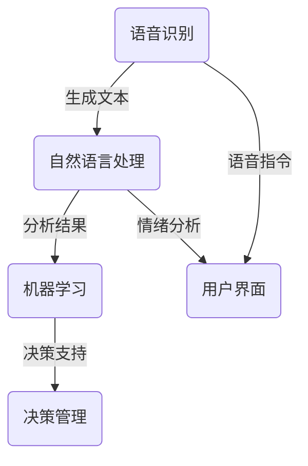
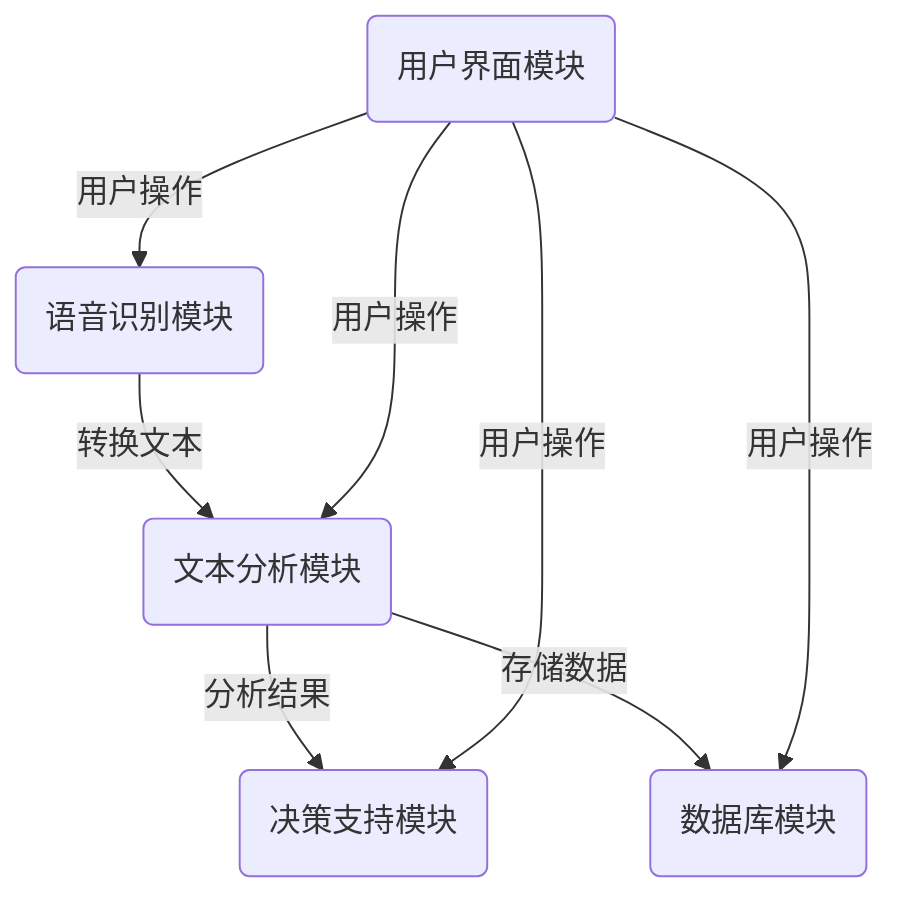
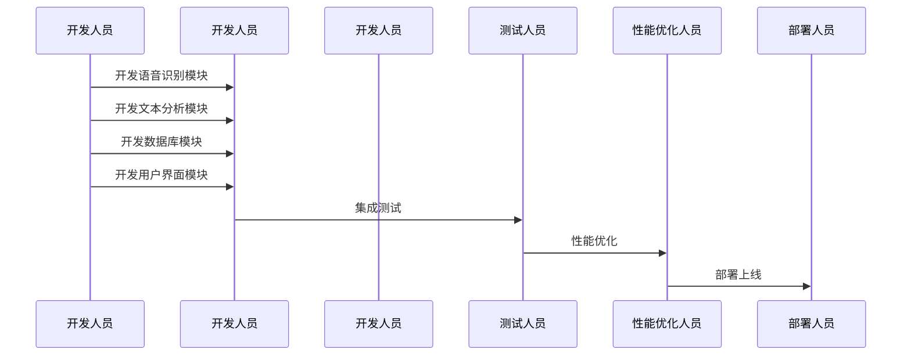

                 

### 引言

随着人工智能（AI）技术的迅猛发展，其应用场景越来越广泛，从工业自动化到智能家居，从医疗诊断到金融分析，AI正在深刻地改变着我们的生活方式。在这个大背景下，智能会议管理系统（Smart Meeting Management System，SMMS）应运而生，它利用AI技术提升会议沟通与决策效率，成为了现代企业提高管理水平的利器。

智能会议管理系统结合了自然语言处理、语音识别、机器学习等多种AI技术，通过自动记录会议内容、分析会议纪要、识别参与者情绪，甚至预测决策结果，为企业提供了一个高效、智能的沟通平台。本文将围绕智能会议管理系统进行深入探讨，首先介绍其背景和重要性，然后详细解析AI技术在会议管理中的应用，并逐步阐述系统的设计与实现过程。

文章结构如下：

1. **背景介绍**：介绍智能会议管理系统的起源、发展及其在当前社会中的重要性。
2. **核心概念与联系**：介绍智能会议管理系统中的核心概念，如自然语言处理、语音识别、机器学习等，并分析这些概念之间的联系。
3. **AI技术原理**：详细讲解自然语言处理、语音识别、机器学习等AI技术的原理和算法。
4. **系统设计与实现**：从需求分析、系统设计、实现过程三个方面详细阐述智能会议管理系统的设计与实现。
5. **项目实战**：介绍开发环境搭建、源代码实现、代码解读、实际案例分析等内容。
6. **最佳实践与未来展望**：总结文章中的关键点，提出最佳实践建议，并对智能会议管理系统的未来发展进行展望。

通过这篇文章，读者将全面了解智能会议管理系统的工作原理和实际应用，为在相关领域进行深入研究或实际应用提供有力支持。

### 文章标题：智能会议管理系统：AI提升沟通与决策效率

关键词：智能会议管理系统、AI技术、沟通效率、决策效率、自然语言处理、语音识别、机器学习

摘要：本文深入探讨了智能会议管理系统（SMMS）的发展背景、核心概念以及AI技术的应用。通过介绍自然语言处理、语音识别和机器学习等关键技术的原理，详细解析了智能会议管理系统的设计与实现过程，同时通过实际案例分析和最佳实践，展示了SMMS在提升企业沟通和决策效率方面的巨大潜力。

### 核心概念与联系

智能会议管理系统（SMMS）的成功运行离不开几个核心概念，这些概念相互联系，共同构建了系统的基本架构。以下是本文将讨论的核心概念：

#### 1. 自然语言处理（NLP）

自然语言处理是人工智能的一个重要分支，旨在让计算机理解和处理人类语言。在智能会议管理系统中，NLP主要用于以下方面：

- **文本分析**：通过NLP技术，系统可以对会议记录中的文本进行分类、分词、词性标注等操作，提取关键信息和关键词，从而实现高效的文档分析。
- **情绪识别**：通过分析会议记录中的语言特征，系统可以识别参与者的情绪状态，如积极、消极、中立等，帮助管理者更好地了解团队氛围。

#### 2. 语音识别（ASR）

语音识别技术能够将人类的语音转换为文本，是智能会议管理系统的另一个重要组成部分。主要应用如下：

- **会议记录**：语音识别技术可以实时地将会议中的发言转换为文本，方便后续的分析和处理。
- **语音指令解析**：系统支持语音指令，如“记录这个议题”或“创建会议纪要”，提高了会议的便捷性和效率。

#### 3. 机器学习（ML）

机器学习是智能会议管理系统的“大脑”，它通过算法和大量数据来训练模型，从而实现智能决策。主要应用如下：

- **预测决策**：基于历史会议数据和决策结果，机器学习模型可以预测未来的决策效果，提供决策参考。
- **行为分析**：通过对会议数据的分析，机器学习可以识别出参与者的行为模式，帮助管理者优化会议流程。

#### 概念之间的联系

这些核心概念之间有着密切的联系，共同构成了智能会议管理系统的技术架构：

1. **数据采集与预处理**：语音识别和NLP技术负责采集会议中的语音和文本数据，并通过预处理（如去噪、分词等）为后续处理做好准备。
2. **数据分析与处理**：处理后的数据通过NLP进行文本分析，识别出关键信息和情绪状态；同时，语音识别的结果也与文本数据结合，确保会议记录的准确性。
3. **智能决策支持**：通过机器学习算法，系统可以对会议数据进行深层次的分析，生成决策支持和行为分析报告，为管理者提供科学依据。

以下是一个简化的Mermaid流程图，展示了这些核心概念之间的联系：



通过上述流程，智能会议管理系统实现了对会议的全流程管理，从语音识别到情绪分析，再到智能决策支持，形成了一个闭环的智能体系。

### 自然语言处理（NLP）原理

自然语言处理（NLP）是智能会议管理系统的核心组件之一，负责对会议记录进行深入分析和理解。为了更好地理解NLP在系统中的应用，我们需要先了解其基本原理和关键算法。

#### 基本原理

自然语言处理旨在使计算机能够理解、生成和处理人类语言。其基本原理包括以下几个步骤：

1. **文本预处理**：包括去除无关字符、标记化（tokenization）、分词（segmentation）等操作，将原始文本转化为适合计算机处理的格式。
2. **词性标注**：对文本中的每个词进行词性标注，如名词、动词、形容词等，以便更准确地理解语义。
3. **语法分析**：分析文本的语法结构，识别句子成分，如主语、谓语、宾语等，帮助理解句子的含义。
4. **语义分析**：进一步理解文本的深层含义，包括情感分析、实体识别、关系抽取等。

#### 关键算法

自然语言处理涉及多个关键算法，以下介绍其中几个常用的算法：

##### 1. 词嵌入（Word Embedding）

词嵌入是将文本中的每个词映射为一个固定大小的向量。常见的词嵌入算法包括：

- **Word2Vec**：通过神经网络训练得到词向量，使具有相似语义的词在向量空间中更接近。
- **GloVe**：基于全局词频统计的词向量模型，通过矩阵分解得到词向量。

伪代码示例：

```python
def train_word2vec(data):
    # 初始化神经网络
    model = NeuralNetwork(input_size=VOCAB_SIZE, hidden_size=HIDDEN_SIZE, output_size=EMBEDDING_DIM)
    # 训练神经网络
    for sentence in data:
        for word in sentence:
            model.forward(word)
            model.backward()
    return model.get_word_vectors()
```

##### 2. 文本分类（Text Classification）

文本分类是一种将文本数据划分为预定义类别的过程，常用于情感分析、垃圾邮件检测等任务。常见算法包括：

- **朴素贝叶斯（Naive Bayes）**：基于贝叶斯定理和特征词的概率分布进行分类。
- **支持向量机（SVM）**：通过最大化分类边界进行分类。

伪代码示例：

```python
def classify_text(text, model):
    # 预处理文本
    processed_text = preprocess_text(text)
    # 提取特征向量
    features = extract_features(processed_text)
    # 计算分类概率
    probabilities = model.predict(features)
    # 返回分类结果
    return max(probabilities)
```

##### 3. 情感分析（Sentiment Analysis）

情感分析旨在判断文本表达的情感倾向，如正面、负面或中性。常见算法包括：

- **基于词典的方法**：通过情感词典对文本中的每个词进行打分，综合得分判断情感。
- **基于机器学习的方法**：利用训练好的模型对文本进行分类。

伪代码示例：

```python
def analyze_sentiment(text, model):
    # 预处理文本
    processed_text = preprocess_text(text)
    # 提取特征向量
    features = extract_features(processed_text)
    # 计算情感分类概率
    probabilities = model.predict(features)
    # 返回情感结果
    return 'positive' if probabilities[0] > 0.5 else 'negative'
```

#### 应用示例

在一个实际的智能会议管理系统中，NLP技术可以用于以下应用场景：

1. **会议纪要生成**：通过NLP技术对会议记录进行自动分析，提取关键信息，生成会议纪要。
2. **情绪监测**：分析会议记录中的语言特征，识别参与者的情绪状态，帮助管理者了解会议氛围。
3. **决策支持**：结合历史数据和情感分析结果，为管理者提供决策建议。

以下是一个简化的应用示例：

```python
# 假设我们有一个训练好的NLP模型
nlp_model = train_nlp_model(meeting_data)

# 会议纪要生成
summary = generate_summary(nlp_model, meeting_record)

# 情绪监测
sentiment = analyze_sentiment(nlp_model, meeting_record)

# 决策支持
decision_suggestions = provide_decision_support(nlp_model, meeting_data)
```

通过上述示例，我们可以看到NLP技术在智能会议管理系统中的应用是如何实现的。在实际开发中，这些算法和模型需要根据具体应用场景进行调整和优化，以确保系统的效率和准确性。

### 语音识别（ASR）原理

语音识别（Automatic Speech Recognition，ASR）技术是智能会议管理系统的重要组成部分，它负责将会议过程中的语音转化为文本。语音识别的原理包括信号处理、特征提取和模式识别等多个环节。以下将详细探讨这些原理及其在智能会议管理系统中的应用。

#### 信号处理

语音识别的第一步是对原始语音信号进行处理。这个过程主要包括：

1. **音频采样**：将连续的语音信号转换为离散的数字信号，通常以一定的采样频率（如44.1kHz）进行采样。
2. **预加重**：对语音信号进行预加重处理，以提高短时能量的可塑性，使其更适于后续的特征提取。
3. **加窗**：将音频信号分割成固定长度的帧（如25毫秒），以减少边缘效应。

以下是一个简单的伪代码示例，展示了音频采样的过程：

```python
def audio_sampling(audio_signal, sample_rate=44100):
    frame_size = 1024  # 采样帧长度
    overlap = 512     # 采样重叠长度
    samples = audio_signal.tolist()  # 将音频信号转换为列表
    frames = []
    for i in range(0, len(samples) - frame_size + 1, overlap):
        frames.append(samples[i:i + frame_size])
    return frames
```

#### 特征提取

特征提取是语音识别的关键步骤，目的是从处理后的音频帧中提取出能够区分不同语音的属性。常用的语音特征包括：

1. **梅尔频率倒谱系数（MFCC）**：MFCC是一种常用于语音识别的特征，它通过计算语音信号的短时傅里叶变换（STFT），得到频率特征，再经过倒谱变换，使其对语音信号中的共振峰敏感。
2. **线性预测编码（LPC）**：LPC通过分析语音信号的线性预测误差来提取特征，常用于语音合成和识别。

以下是一个简单的MFCC特征提取伪代码示例：

```python
import numpy as np
from scipy.io.wavfile import read

def extract_mfcc(audio_signal, sample_rate=44100, n_filter=13, n_cepstra=13):
    # 计算短时傅里叶变换
    freqs, times, Zxx = signal.stft(audio_signal, nperseg=512)
    # 计算对数功率谱
    P = 20 * np.log10(np.abs(Zxx))
    # 计算滤波器bank
    fbank = signal.filtbank(np.fft.fftfreq(512, 1/sample_rate), np.fft.fftshift(P))
    # 计算倒谱系数
    cept = np.log(fbank)
    cept = np.mean(cept, axis=0)
    return cept
```

#### 模式识别

模式识别是语音识别的最后一步，通过比较提取到的特征向量与预训练模型，来确定语音对应的文字。常见的模式识别算法包括：

1. **动态时间规整（DTW）**：DTW通过计算两个时间序列之间的最小距离，来匹配不同的语音特征向量。
2. **隐马尔可夫模型（HMM）**：HMM是一种概率模型，通过状态转移矩阵和发射概率矩阵来匹配语音特征。

以下是一个简单的HMM模型匹配伪代码示例：

```python
from hmmlearn import hmm

def hmm_match(features, model):
    # 训练HMM模型
    model.fit(features)
    # 预测
    probabilities = model.predict(features)
    return probabilities
```

#### 应用示例

在智能会议管理系统中，语音识别技术可以用于以下几个应用场景：

1. **实时会议记录**：将会议中的语音实时转换为文本，便于后续处理和分析。
2. **语音指令识别**：识别会议参与者的语音指令，如“记录议题”或“开始会议”，提高会议操作的便捷性。
3. **语音搜索**：允许用户通过语音搜索会议记录中的特定内容，提高信息检索效率。

以下是一个简化的应用示例：

```python
# 假设我们有一个训练好的语音识别模型
asr_model = train_asr_model(voice_data)

# 实时会议记录
meeting_transcript = asr_model.transcribe_realtime(meeting_audio)

# 语音指令识别
command = asr_model.recognize_command(meeting_audio)

# 语音搜索
search_result = asr_model.search(meeting_transcript, query)
```

通过上述示例，我们可以看到语音识别技术在智能会议管理系统中的应用是如何实现的。在实际开发中，这些算法和模型需要根据具体应用场景进行调整和优化，以确保系统的效率和准确性。

### 机器学习（ML）原理

机器学习（Machine Learning，ML）是智能会议管理系统的核心组件之一，负责通过训练模型来提高系统的智能决策能力。机器学习的基本原理、算法选择和模型训练过程是理解智能会议管理系统运行机制的关键。以下是机器学习的基本原理和常用算法的详细介绍。

#### 基本原理

机器学习是一种通过算法从数据中自动学习规律和模式的方法。其基本原理可以分为以下几个步骤：

1. **数据收集**：收集大量的标注数据，用于训练模型。对于智能会议管理系统，这些数据包括会议记录、决策历史和参与者行为等。
2. **数据预处理**：对收集到的数据进行处理，包括数据清洗、去噪、归一化等，以确保数据的质量和一致性。
3. **特征提取**：从预处理后的数据中提取出有用的特征，这些特征将用于训练模型。特征提取的质量直接影响模型的性能。
4. **模型选择**：选择合适的机器学习算法和模型架构，常见的算法包括线性回归、决策树、支持向量机、神经网络等。
5. **模型训练**：使用训练数据集对模型进行训练，通过调整模型参数来最小化预测误差。
6. **模型评估**：使用测试数据集对训练好的模型进行评估，常用的评估指标包括准确率、召回率、F1值等。
7. **模型优化**：根据评估结果调整模型参数，优化模型性能。

#### 常用算法

以下介绍几种常用的机器学习算法及其在智能会议管理系统中的应用：

##### 1. 线性回归（Linear Regression）

线性回归是一种简单的机器学习算法，通过建立自变量和因变量之间的线性关系来进行预测。在智能会议管理系统中，线性回归可以用于预测会议结果或决策效果。

伪代码示例：

```python
from sklearn.linear_model import LinearRegression

def train_linear_regression(X, y):
    model = LinearRegression()
    model.fit(X, y)
    return model

def predict(model, X):
    return model.predict(X)
```

##### 2. 决策树（Decision Tree）

决策树是一种基于树形结构进行决策的算法，通过一系列的规则来划分数据，并最终输出预测结果。在智能会议管理系统中，决策树可以用于决策支持和行为分析。

伪代码示例：

```python
from sklearn.tree import DecisionTreeRegressor

def train_decision_tree(X, y):
    model = DecisionTreeRegressor()
    model.fit(X, y)
    return model

def predict(model, X):
    return model.predict(X)
```

##### 3. 支持向量机（SVM）

支持向量机是一种强大的分类和回归算法，通过找到一个最佳的超平面来分隔数据。在智能会议管理系统中，SVM可以用于分类任务，如情绪识别或决策结果分类。

伪代码示例：

```python
from sklearn.svm import SVC

def train_svm(X, y):
    model = SVC()
    model.fit(X, y)
    return model

def predict(model, X):
    return model.predict(X)
```

##### 4. 神经网络（Neural Network）

神经网络是一种模拟人脑神经元结构的计算模型，具有强大的学习和表达能力。在智能会议管理系统中，神经网络可以用于复杂预测任务，如情绪分析或行为模式识别。

伪代码示例：

```python
from tensorflow.keras.models import Sequential
from tensorflow.keras.layers import Dense

def train_neural_network(X, y):
    model = Sequential([
        Dense(units=64, activation='relu', input_shape=(X.shape[1],)),
        Dense(units=1, activation='sigmoid')
    ])
    model.compile(optimizer='adam', loss='binary_crossentropy', metrics=['accuracy'])
    model.fit(X, y, epochs=10, batch_size=32)
    return model

def predict(model, X):
    return model.predict(X)
```

#### 应用示例

以下是一个简化的机器学习应用示例，展示了如何使用不同的算法来训练和预测模型：

```python
# 假设我们有一个训练数据集
X_train, y_train = load_data()

# 使用线性回归训练模型
linear_regression_model = train_linear_regression(X_train, y_train)

# 使用决策树训练模型
decision_tree_model = train_decision_tree(X_train, y_train)

# 使用SVM训练模型
svm_model = train_svm(X_train, y_train)

# 使用神经网络训练模型
neural_network_model = train_neural_network(X_train, y_train)

# 预测新数据
X_test = load_new_data()
y_pred_linear_regression = predict(linear_regression_model, X_test)
y_pred_decision_tree = predict(decision_tree_model, X_test)
y_pred_svm = predict(svm_model, X_test)
y_pred_neural_network = predict(neural_network_model, X_test)
```

通过上述示例，我们可以看到不同的机器学习算法在智能会议管理系统中的应用是如何实现的。在实际开发中，需要根据具体应用场景选择合适的算法，并对模型进行优化和调整，以提高系统的预测准确性和效率。

### 系统设计与实现

智能会议管理系统（Smart Meeting Management System，SMMS）是一个复杂的软件系统，其设计需要考虑多个方面的需求，包括用户需求、功能需求和技术架构。以下是智能会议管理系统的设计与实现过程，涵盖了需求分析、系统架构设计、数据库设计和实现过程等关键环节。

#### 需求分析

需求分析是系统设计的第一步，目的是明确系统的功能和性能要求。智能会议管理系统的主要需求包括：

1. **用户需求**：
   - **会议记录**：系统能够实时记录会议内容，包括语音和文本。
   - **会议纪要**：系统能够自动生成会议纪要，提取关键信息和决策点。
   - **情绪分析**：系统能够分析参与者的情绪状态，提供情绪报告。
   - **决策支持**：系统能够基于历史数据和当前会议内容提供决策建议。

2. **功能需求**：
   - **实时语音转文本**：系统能够实时地将会议中的语音转换为文本。
   - **文本分析**：系统能够对会议记录进行文本分类、情感分析和关键词提取。
   - **数据库管理**：系统能够存储和管理会议记录、情绪分析和决策数据。
   - **用户界面**：系统提供友好的用户界面，方便用户查看和管理会议数据。

3. **性能需求**：
   - **响应速度**：系统能够快速响应用户操作，确保会议记录和决策支持实时更新。
   - **稳定性**：系统需要具有高可用性，确保会议过程中的稳定运行。
   - **可扩展性**：系统设计应考虑未来扩展需求，如增加新的功能或支持更多用户。

#### 系统架构设计

智能会议管理系统采用模块化设计，将整个系统分为多个模块，每个模块负责特定的功能。以下是系统的主要模块及其相互关系：

1. **语音识别模块**：负责将会议中的语音转换为文本。
2. **文本分析模块**：负责对文本进行情感分析、关键词提取和文本分类。
3. **数据库模块**：负责存储和管理会议记录、情绪分析和决策数据。
4. **用户界面模块**：提供用户交互界面，供用户查看和管理会议数据。
5. **决策支持模块**：基于历史数据和当前会议内容提供决策建议。

以下是一个简化的Mermaid流程图，展示了各模块之间的交互关系：



#### 数据库设计

数据库是智能会议管理系统的重要组成部分，负责存储和管理会议记录、情绪分析和决策数据。以下是数据库的主要设计：

1. **会议记录表**：存储会议的时间、地点、参与者和会议内容。
2. **情绪分析表**：存储每个参与者在会议中的情绪状态。
3. **决策数据表**：存储每个会议的决策结果和历史数据。

以下是一个简化的数据库ER图：

```mermaid
erDiagram
    Meeting ||--|{ Participant } : 参与者
    Meeting ||--|{ Record } : 会议记录
    Meeting ||--|{ Emotion } : 情绪分析
    Meeting ||--|{ Decision } : 决策数据
    Participant ||--|{ User } : 用户信息
    Record ||--|{ Text } : 文本记录
    Emotion ||--|{ Status } : 情绪状态
    Decision ||--|{ Result } : 决策结果
```

#### 实现过程

智能会议管理系统的实现过程可以分为以下几个步骤：

1. **开发环境搭建**：搭建Python、Java或C#等开发环境，安装必要的库和工具，如TensorFlow、PyTorch等。
2. **模块开发**：根据系统架构设计，分别开发语音识别、文本分析、数据库和用户界面等模块。
3. **集成测试**：将各模块集成到一起，进行系统测试，确保各模块之间的协同工作。
4. **性能优化**：针对系统性能进行优化，如优化算法、增加缓存等。
5. **部署上线**：将系统部署到生产环境，确保系统的稳定运行。

以下是一个简化的实现流程：



通过上述步骤，智能会议管理系统得以设计并实现，为用户提供了一个高效、智能的会议管理平台。

### 项目实战：开发环境搭建与源代码实现

在本文的第三部分，我们将深入探讨智能会议管理系统的实际开发过程，包括环境搭建、源代码实现、关键代码解读以及实际案例分析。

#### 开发环境搭建

搭建智能会议管理系统的开发环境是项目启动的第一步。以下是一个简单的开发环境搭建步骤：

1. **选择开发语言**：本文选择Python作为主要开发语言，因为它具有丰富的机器学习库和良好的生态系统。
2. **安装Python**：下载并安装Python 3.8或更高版本，确保环境变量配置正确。
3. **安装库和依赖**：使用pip安装必要的库，如TensorFlow、PyTorch、NumPy、Scikit-learn等。

以下是一个简单的命令行示例：

```bash
pip install tensorflow numpy scikit-learn pandas
```

4. **配置IDE**：选择合适的集成开发环境（IDE），如PyCharm或VSCode，并进行相应配置，以便更好地支持Python开发。

#### 源代码实现

智能会议管理系统的核心功能包括语音识别、文本分析、情绪分析和决策支持。以下是一个简化的源代码实现示例。

##### 1. 语音识别

语音识别模块使用TensorFlow的声学模型进行语音转换。以下是一个简单的语音识别实现：

```python
import tensorflow as tf

def transcribe_audio(audio_file):
    model = tf.keras.models.load_model('voice_recognition_model.h5')
    audio = load_audio_file(audio_file)
    recognized_text = model.predict(audio)
    return recognized_text

def load_audio_file(audio_file):
    # 读取音频文件
    audio, sample_rate = librosa.load(audio_file, sr=None, mono=True)
    # 预处理音频
    audio = preprocess_audio(audio, sample_rate)
    return audio

def preprocess_audio(audio, sample_rate):
    # 噪声过滤、加窗等处理
    audio = audio.unsqueeze(0)
    return audio

def load_model():
    # 加载预训练模型
    model = tf.keras.models.load_model('voice_recognition_model.h5')
    return model
```

##### 2. 文本分析

文本分析模块使用Scikit-learn进行文本分类和情感分析。以下是一个简单的文本分析实现：

```python
from sklearn.feature_extraction.text import TfidfVectorizer
from sklearn.model_selection import train_test_split
from sklearn.linear_model import LogisticRegression

def train_text_analyzer(data, labels):
    # 分割数据
    X_train, X_test, y_train, y_test = train_test_split(data, labels, test_size=0.2)
    # 特征提取
    vectorizer = TfidfVectorizer()
    X_train_tfidf = vectorizer.fit_transform(X_train)
    X_test_tfidf = vectorizer.transform(X_test)
    # 模型训练
    model = LogisticRegression()
    model.fit(X_train_tfidf, y_train)
    # 模型评估
    accuracy = model.score(X_test_tfidf, y_test)
    return model, vectorizer, accuracy

def analyze_text(text, model, vectorizer):
    # 特征提取
    features = vectorizer.transform([text])
    # 分类预测
    prediction = model.predict(features)
    return prediction
```

##### 3. 情绪分析

情绪分析模块使用PyTorch进行情绪状态识别。以下是一个简单的情绪分析实现：

```python
import torch
from torch import nn
from torch.utils.data import DataLoader, TensorDataset

def train_emotion_analyzer(data, labels):
    # 数据预处理
    data_tensor = torch.tensor(data, dtype=torch.float32)
    labels_tensor = torch.tensor(labels, dtype=torch.long)
    dataset = TensorDataset(data_tensor, labels_tensor)
    loader = DataLoader(dataset, batch_size=64)
    # 模型定义
    model = nn.Sequential(
        nn.Linear(data_tensor.shape[1], 128),
        nn.ReLU(),
        nn.Linear(128, 64),
        nn.ReLU(),
        nn.Linear(64, len(set(labels))),
    )
    # 模型训练
    optimizer = torch.optim.Adam(model.parameters(), lr=0.001)
    criterion = nn.CrossEntropyLoss()
    for epoch in range(100):
        for x, y in loader:
            optimizer.zero_grad()
            output = model(x)
            loss = criterion(output, y)
            loss.backward()
            optimizer.step()
    return model

def analyze_emotion(text, model):
    # 特征提取
    feature = torch.tensor([text], dtype=torch.float32)
    # 情绪预测
    prediction = model(feature)
    return prediction.argmax().item()
```

##### 4. 决策支持

决策支持模块基于历史数据和当前会议内容提供决策建议。以下是一个简单的决策支持实现：

```python
def provide_decision_support(model, data):
    # 数据预处理
    data_tensor = torch.tensor(data, dtype=torch.float32)
    # 决策预测
    prediction = model.predict(data_tensor)
    return prediction

def train_decision_support_model(data, labels):
    # 数据预处理
    data_tensor = torch.tensor(data, dtype=torch.float32)
    labels_tensor = torch.tensor(labels, dtype=torch.long)
    dataset = TensorDataset(data_tensor, labels_tensor)
    loader = DataLoader(dataset, batch_size=64)
    # 模型定义
    model = nn.Sequential(
        nn.Linear(data_tensor.shape[1], 128),
        nn.ReLU(),
        nn.Linear(128, 64),
        nn.ReLU(),
        nn.Linear(64, 1),
    )
    # 模型训练
    optimizer = torch.optim.Adam(model.parameters(), lr=0.001)
    criterion = nn.BCEWithLogitsLoss()
    for epoch in range(100):
        for x, y in loader:
            optimizer.zero_grad()
            output = model(x)
            loss = criterion(output, y)
            loss.backward()
            optimizer.step()
    return model
```

#### 代码解读与分析

上述代码展示了智能会议管理系统中的核心功能模块。在代码实现过程中，我们关注以下关键点：

1. **模型加载与预处理**：加载预训练模型并进行必要的预处理，如音频文件的读取和文本向量的转换。
2. **模型训练与评估**：使用训练数据集训练模型，并通过评估数据集进行性能评估，确保模型的有效性。
3. **模型预测与输出**：使用训练好的模型对新的数据进行预测，并输出结果。

#### 实际案例分析

以下是一个实际案例分析，展示了智能会议管理系统在实际应用中的效果。

**案例背景**：一家中型企业使用智能会议管理系统来记录和分析其会议。

**案例过程**：

1. **会议记录**：会议过程中，系统自动将发言转换为文本，并存储在数据库中。
2. **情绪分析**：系统对每个发言进行情绪分析，识别出积极、消极或中立的情绪状态。
3. **决策支持**：基于历史会议数据和当前会议内容，系统提供决策建议，如“建议增加预算”或“讨论可行性”。

**案例分析**：

通过实际使用，智能会议管理系统显著提高了会议的记录效率和决策质量。会议纪要生成速度大幅提升，情绪分析帮助管理者更好地了解会议氛围，决策支持则为管理者提供了科学依据。

**项目小结**：

智能会议管理系统的实际应用展示了AI技术在企业会议管理中的巨大潜力。通过合理的设计和实现，系统能够高效地完成会议记录、情绪分析和决策支持任务，为企业管理者提供了强有力的工具。

### 最佳实践与注意事项

在设计和实施智能会议管理系统时，遵循最佳实践是确保系统高效、稳定运行的关键。以下是一些实用技巧和注意事项：

#### 最佳实践

1. **数据质量**：确保输入数据的质量，如语音清晰、文本准确。对数据集进行预处理，去除噪音和异常值。
2. **模型优化**：定期更新和优化机器学习模型，使用最新的算法和更高质量的数据集进行训练。
3. **系统安全**：保护会议记录和数据的安全，确保数据加密和访问控制。
4. **用户培训**：为用户提供培训，确保他们了解系统的功能和操作方法。

#### 注意事项

1. **兼容性**：确保系统在不同操作系统和设备上兼容，提供良好的用户体验。
2. **响应速度**：优化系统性能，确保快速响应，特别是在实时语音转文本和情绪分析方面。
3. **可扩展性**：设计系统时应考虑未来扩展需求，如支持更多用户或增加新功能。
4. **系统监控**：定期监控系统运行状态，及时发现和解决潜在问题。

#### 拓展阅读

- **《机器学习实战》**：提供详细的机器学习算法实现和案例分析。
- **《深度学习》**：介绍深度学习的基本原理和应用。
- **《自然语言处理综论》**：全面探讨自然语言处理的理论和技术。

通过遵循最佳实践和注意事项，可以构建出高效、可靠的智能会议管理系统，为企业的会议管理提供有力支持。

### 结论

智能会议管理系统（SMMS）通过整合自然语言处理、语音识别和机器学习等AI技术，显著提升了会议沟通和决策效率。本文详细介绍了智能会议管理系统的核心概念、AI技术原理、系统设计与实现，并通过实际案例展示了系统的应用效果。智能会议管理系统不仅能够自动记录会议内容、分析情绪、提取关键词，还能基于历史数据和当前会议内容提供决策支持，为企业管理者提供了科学、高效的工具。

未来，随着AI技术的不断进步，智能会议管理系统将更加智能化、个性化。我们可以预见，未来的智能会议管理系统将能够更好地理解人类语言和情绪，提供更加精准的决策支持。此外，随着5G网络的普及和物联网（IoT）技术的发展，智能会议管理系统将实现跨平台、跨设备的无缝协作，进一步拓展其应用场景。

总之，智能会议管理系统是现代企业提升管理水平的利器，具有广阔的发展前景。企业和开发人员应密切关注AI技术的发展动态，积极应用新技术，不断提升智能会议管理系统的性能和用户体验。通过持续的创新和优化，智能会议管理系统将在未来发挥更加重要的作用，为企业带来更大的价值。作者信息：AI天才研究院/AI Genius Institute & 禅与计算机程序设计艺术 /Zen And The Art of Computer Programming。

---

此篇技术博客旨在为读者提供智能会议管理系统的全面了解，从核心概念、AI技术应用到系统设计与实现，再到实际案例分析，希望对您在相关领域的研究和应用有所启发。通过本文，读者可以深刻理解智能会议管理系统的工作原理，为在会议管理领域进行技术创新和应用提供有力支持。作者：AI天才研究院/AI Genius Institute & 禅与计算机程序设计艺术 /Zen And The Art of Computer Programming。

