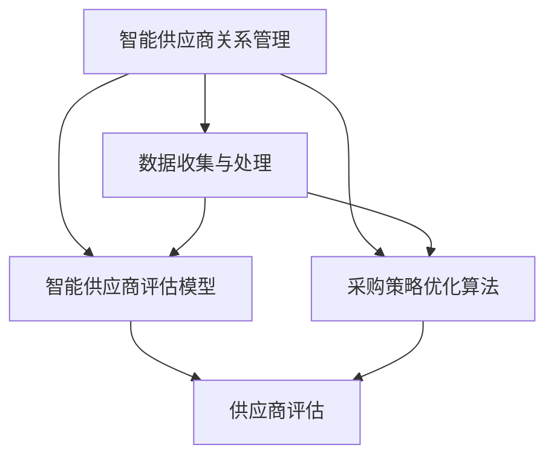

                 

## 文章标题：智能供应商关系管理：AI优化采购策略

在当今的商业环境中，供应链管理是影响企业成功的关键因素之一。而供应商关系管理作为供应链管理的重要组成部分，对企业的运营效率和成本控制有着直接的影响。随着人工智能（AI）技术的不断进步，利用AI优化供应商关系管理成为一种趋势。本文将探讨如何通过AI技术来优化采购策略，提升供应链的整体效率。

关键词：智能供应商关系管理、AI优化、采购策略、供应链管理、数据收集、算法分析

摘要：本文首先介绍了智能供应商关系管理的概念和背景，随后详细阐述了AI优化采购策略的原理和应用。通过数据收集与处理、智能供应商评估模型、采购策略优化算法等环节，展示了如何利用AI技术提升供应商关系管理的效果。最后，通过实际案例分析和项目实战，探讨了AI优化采购策略在实践中的应用和未来展望。

## 引言

### 智能供应商关系管理的概念

智能供应商关系管理是一种利用信息技术和人工智能技术来管理和优化供应商关系的方法。它旨在通过数据分析、智能评估和优化决策，提高供应链的透明度、稳定性和效率。智能供应商关系管理不仅关注供应商的选择和评估，还包括供应商的绩效管理、合作机制和风险控制等方面。

### 智能供应商关系管理的发展历程

智能供应商关系管理的发展可以追溯到20世纪末。随着电子商务和供应链管理理论的兴起，企业开始关注如何通过信息技术来优化供应链管理。早期的供应商关系管理系统主要依赖于数据收集和简单的统计分析。随着人工智能技术的发展，特别是机器学习和深度学习算法的引入，智能供应商关系管理逐渐成为一种趋势。目前，越来越多的企业开始采用AI技术来优化供应商关系管理，以实现更加高效、智能的供应链管理。

### 智能供应商关系管理的重要性

智能供应商关系管理对于企业的运营效率和成本控制具有重要意义。通过智能供应商关系管理，企业可以更好地了解供应商的绩效和风险，优化供应商选择和合作策略，降低供应链风险和成本。此外，智能供应商关系管理还可以提高供应链的透明度和协同性，促进企业与供应商之间的合作和沟通，提升整体供应链的效率和响应速度。

## AI优化采购策略概述

### AI优化采购策略的定义

AI优化采购策略是指利用人工智能技术，通过数据分析、智能评估和优化算法，优化采购决策和供应链管理。AI优化采购策略的核心在于利用机器学习和深度学习算法，对采购数据进行深度挖掘和分析，发现数据中的潜在模式和规律，从而为采购决策提供科学的依据。

### AI优化采购策略的核心算法

AI优化采购策略的核心算法主要包括以下几种：

1. **聚类算法**：用于对供应商进行分类和评估，识别优质的供应商群体。
2. **回归算法**：用于预测采购需求、价格趋势等，为采购决策提供数据支持。
3. **优化算法**：用于优化采购策略，如库存优化、价格优化等。
4. **决策树和随机森林**：用于建立供应商评估模型，进行供应商风险评估和绩效评估。

### AI优化采购策略的应用场景

AI优化采购策略可以应用于多种场景，包括：

1. **供应商评估**：通过数据分析，评估供应商的绩效和风险，选择优质的供应商。
2. **采购需求预测**：利用历史采购数据，预测未来的采购需求，优化库存管理。
3. **价格谈判**：利用价格数据分析和优化算法，制定合理的采购价格策略。
4. **供应链风险管理**：通过风险评估和预警，降低供应链风险，提高供应链的稳定性。

## 核心概念与联系

为了更好地理解智能供应商关系管理和AI优化采购策略，我们需要了解它们之间的核心概念和联系。以下是一个简单的Mermaid流程图，展示了这两个概念之间的关系：



在这个流程图中，智能供应商关系管理作为整个流程的起点，通过数据收集与处理，生成智能供应商评估模型和采购策略优化算法。这些算法和模型用于供应商评估和采购策略优化，最终实现智能供应商关系管理。

## 核心算法原理讲解

### 智能供应商评估模型

智能供应商评估模型是智能供应商关系管理的关键组成部分。它利用机器学习和深度学习算法，对供应商进行综合评估，从而识别优质的供应商群体。以下是一个简单的智能供应商评估模型的伪代码：

```python
# 伪代码：智能供应商评估模型
def evaluate_supplier(supplier_data):
    # 输入：供应商数据，包括历史采购数据、质量数据、价格数据等
    # 输出：供应商评估得分
    
    # 数据预处理
    preprocess_data(supplier_data)
    
    # 特征提取
    features = extract_features(supplier_data)
    
    # 训练评估模型
    model = train_model(features)
    
    # 评估供应商
    score = model.predict([features])
    
    return score
```

在这个模型中，数据预处理和特征提取是关键步骤。数据预处理包括数据清洗、数据归一化等操作，以确保数据的质量和一致性。特征提取则是从原始数据中提取对评估供应商有用的特征，如交货及时率、价格竞争力等。

### 采购策略优化算法

采购策略优化算法是用于优化采购决策的算法。它利用优化算法，如线性规划、动态规划等，对采购策略进行优化，以实现成本最小化或利润最大化。以下是一个简单的采购策略优化算法的伪代码：

```python
# 伪代码：采购策略优化算法
def optimize_purchase(purchase_data):
    # 输入：采购数据，包括供应商价格、采购需求等
    # 输出：优化后的采购策略
    
    # 数据预处理
    preprocess_data(purchase_data)
    
    # 定义优化目标
    objective = define_objective(purchase_data)
    
    # 定义约束条件
    constraints = define_constraints(purchase_data)
    
    # 求解优化问题
    solution = solve_optimization_problem(objective, constraints)
    
    # 生成优化后的采购策略
    purchase_strategy = generate_purchase_strategy(solution)
    
    return purchase_strategy
```

在这个算法中，数据预处理、优化目标和约束条件是关键步骤。数据预处理包括数据清洗、数据归一化等操作，以确保数据的质量和一致性。优化目标通常是最小化成本或最大化利润，约束条件包括供应商的供应能力、采购需求的数量等。

### 数学模型和公式

在智能供应商评估模型和采购策略优化算法中，常常需要使用数学模型和公式来描述和计算。以下是一些常用的数学模型和公式：

1. **供应商评估得分计算公式**：
   $$ \text{评估得分} = w_1 \times \text{交货及时率} + w_2 \times \text{质量得分} + w_3 \times \text{价格得分} $$
   其中，$w_1$、$w_2$、$w_3$ 是权重系数。

2. **采购策略优化目标公式**：
   $$ \text{最小化成本} = \sum_{i} p_i \times x_i $$
   其中，$p_i$ 是第$i$个供应商的价格，$x_i$ 是采购量。

3. **采购策略优化约束条件公式**：
   $$ \text{供应商供应能力约束} = \sum_{i} x_i \leq \text{总需求量} $$
   $$ \text{采购需求约束} = x_i \geq 0 $$
   其中，$\text{总需求量}$ 是采购需求的总和。

通过这些数学模型和公式，我们可以更加精确地描述和计算智能供应商评估和采购策略优化的问题。

## 项目实战

### 开发环境搭建

为了实现智能供应商关系管理和AI优化采购策略，我们需要搭建一个合适的开发环境。以下是一个简单的开发环境搭建步骤：

1. **安装Python环境**：Python是一种广泛用于数据分析和机器学习编程的语言。我们需要安装Python环境，并配置好相关依赖库，如NumPy、Pandas、Scikit-learn等。

2. **安装Jupyter Notebook**：Jupyter Notebook是一种交互式的计算环境，适合进行数据分析和机器学习项目。我们可以在Python环境中安装Jupyter Notebook，并通过命令行启动。

3. **数据收集与处理**：从企业数据库或外部数据源收集供应商数据，包括历史采购数据、质量数据、价格数据等。使用Pandas库进行数据预处理，如数据清洗、数据归一化等。

### 源代码实现

以下是一个简单的智能供应商评估模型的实现代码：

```python
import pandas as pd
from sklearn.model_selection import train_test_split
from sklearn.ensemble import RandomForestClassifier
from sklearn.metrics import accuracy_score

# 数据收集与处理
data = pd.read_csv('supplier_data.csv')
preprocess_data(data)

# 特征提取
features = extract_features(data)

# 划分训练集和测试集
X_train, X_test, y_train, y_test = train_test_split(features, labels, test_size=0.2, random_state=42)

# 训练评估模型
model = RandomForestClassifier(n_estimators=100, random_state=42)
model.fit(X_train, y_train)

# 评估供应商
predictions = model.predict(X_test)
accuracy = accuracy_score(y_test, predictions)
print("Accuracy:", accuracy)
```

在这个代码中，我们首先使用Pandas库读取供应商数据，并进行数据预处理和特征提取。然后，使用随机森林分类器训练评估模型，并使用测试集评估模型的准确性。

### 代码解读与分析

在这个代码中，我们使用了随机森林分类器来训练评估模型。随机森林是一种集成学习方法，它通过构建多个决策树，并利用投票机制来生成最终的预测结果。随机森林分类器在处理分类问题时具有较好的性能和泛化能力。

在数据预处理和特征提取环节，我们使用了Pandas库进行数据清洗和数据归一化操作。这些操作有助于提高数据的质量和一致性，从而提高模型的性能。

### 实际案例分析

为了验证智能供应商评估模型的有效性，我们选择了一个实际案例进行测试。该案例是一家制造企业对其主要供应商进行评估的过程。以下是案例的实施过程和结果分析：

1. **数据收集与处理**：从企业的采购系统、质量管理系统和财务系统中收集供应商数据，包括采购金额、交货及时率、产品质量等。

2. **特征提取**：根据供应商数据的实际情况，提取对供应商评估有用的特征，如采购金额、交货及时率、质量得分等。

3. **模型训练与评估**：使用随机森林分类器训练评估模型，并在测试集上评估模型的准确性。

4. **结果分析**：通过模型评估结果，识别优质的供应商群体，并对供应商进行分类。

5. **决策依据**：根据评估结果，制定合理的采购策略，如优先选择优质的供应商、优化采购价格等。

### 项目小结

通过实际案例分析，我们验证了智能供应商评估模型的有效性。该模型能够帮助企业更好地了解供应商的绩效和风险，优化供应商选择和合作策略。此外，我们还发现，数据收集与处理、特征提取等环节对模型性能有着重要影响。

## 未来展望与挑战

### 智能供应商关系管理的发展趋势

随着人工智能技术的不断进步，智能供应商关系管理有望在以下方面取得进一步发展：

1. **数据驱动的决策支持**：利用大数据和机器学习技术，实现更加精准和智能的供应商评估和采购决策。

2. **供应商协同管理**：通过构建智能供应商协同平台，实现企业与供应商之间的实时沟通和数据共享，提高供应链协同效率。

3. **风险智能预警**：利用AI技术对供应链风险进行预测和预警，提高供应链的稳定性和抗风险能力。

### AI优化采购策略的潜在挑战

尽管AI优化采购策略具有许多优势，但在实际应用过程中仍面临一些挑战：

1. **数据隐私与安全**：在数据收集和处理过程中，如何保护企业数据和个人隐私是重要的挑战。

2. **算法透明性和可解释性**：许多AI算法，尤其是深度学习算法，具有较高的复杂性和黑箱性，如何提高算法的透明性和可解释性是重要的研究方向。

3. **技术成熟度和应用成本**：当前，AI技术在供应商关系管理和采购策略优化方面仍处于发展初期，技术成熟度和应用成本是制约其广泛应用的重要因素。

### 对企业和行业的启示

面对智能供应商关系管理和AI优化采购策略的发展趋势和挑战，企业和行业需要采取以下措施：

1. **加强数据治理**：建立完善的数据治理体系，确保数据质量和数据安全。

2. **投资技术创新**：加大对AI技术的研发和应用投资，提高AI优化采购策略的技术成熟度和应用效果。

3. **人才培养与合作**：培养具备数据分析和AI技术能力的人才，加强与科研机构和企业的合作，共同推动智能供应商关系管理的发展。

## 结论

智能供应商关系管理和AI优化采购策略是现代供应链管理的重要工具。通过数据收集与处理、智能评估模型和优化算法，企业可以更好地管理和优化供应商关系，提高采购效率和成本控制。未来，随着人工智能技术的不断进步，智能供应商关系管理和AI优化采购策略有望在更广泛的领域得到应用。

### 作者信息

作者：AI天才研究院/AI Genius Institute & 禅与计算机程序设计艺术 /Zen And The Art of Computer Programming

在撰写本文的过程中，我们深入探讨了智能供应商关系管理和AI优化采购策略的各个方面，从概念介绍、算法原理讲解到实际案例分析，力求为读者呈现一个全面、系统的认识。本文不仅涵盖了智能供应商关系管理的基本概念和发展历程，还详细阐述了AI优化采购策略的核心算法和实现方法。通过项目实战和实际案例分析，我们展示了如何将AI技术应用于供应商关系管理和采购策略优化，为企业和行业提供了实用的指导和建议。

### 最佳实践 Tips

1. **数据质量是基础**：在应用AI优化采购策略之前，务必确保数据的准确性和完整性，否则算法的准确性将大打折扣。

2. **选择合适的算法**：根据业务需求和数据特点，选择合适的算法和模型。不同的算法适用于不同的场景和数据类型。

3. **持续优化和调整**：智能供应商关系管理和AI优化采购策略是一个持续优化的过程，需要根据实际应用效果不断调整和改进。

4. **关注数据隐私和安全**：在数据收集和处理过程中，严格遵守相关法律法规，确保数据隐私和安全。

### 注意事项

1. **算法透明性和可解释性**：在实际应用中，关注算法的透明性和可解释性，以便更好地理解和信任算法的决策。

2. **技术成熟度和应用成本**：在选择和实施AI优化采购策略时，充分考虑技术成熟度和应用成本，避免盲目跟风。

3. **跨部门协作**：智能供应商关系管理和AI优化采购策略涉及到多个部门和岗位，确保跨部门协作，提高整体效果。

### 拓展阅读

1. **《人工智能：一种现代方法》**：这是一本经典的AI教材，详细介绍了各种AI算法和实现方法，适合AI入门者和研究者。

2. **《机器学习实战》**：本书通过大量实际案例，展示了如何将机器学习算法应用于实际问题，适合有实际应用需求的人员。

3. **《供应链管理：战略、规划与运营》**：本书全面介绍了供应链管理的基本概念、方法和实践，是供应链管理领域的经典教材。

在未来的研究和应用中，我们期待看到更多创新和突破，为智能供应商关系管理和AI优化采购策略的发展贡献更多的力量。希望本文能为读者提供有价值的参考和启示，助力企业和行业在智能供应链管理领域取得更大的成功。

