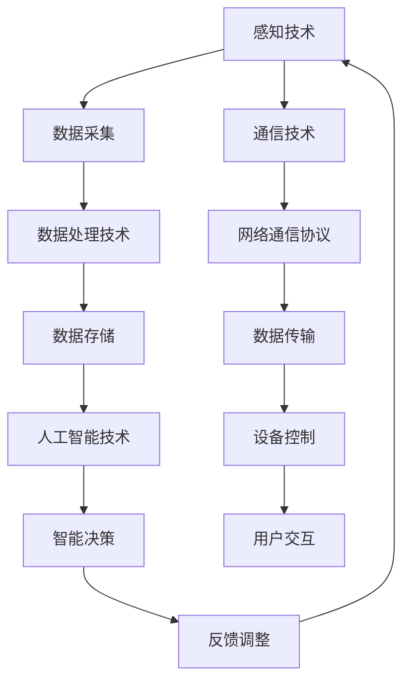

                 


## 智能办公环境：环境隐形智能在企业中的应用

### 文章关键词
- 智能办公环境
- 环境隐形智能
- 企业应用
- 感知技术
- 通信技术
- 数据处理技术
- 人工智能

### 摘要
本文将探讨智能办公环境的概念，重点介绍环境隐形智能技术及其在企业中的应用。文章将从感知技术、通信技术、数据处理技术和人工智能技术四个方面展开，详细分析这些技术如何共同构建一个智能办公环境，并探讨其在办公场所、办公流程以及安全方面的应用。最后，文章将展望智能办公环境的未来发展趋势。

### 引言

#### 1.1 智能办公环境概述
智能办公环境是指通过集成先进的感知、通信、数据处理和人工智能技术，实现办公场所的自动化、智能化和个性化。这种环境不仅提高了办公效率，还大大提升了员工的舒适度和满意度。环境隐形智能（Ambient Intelligence）是智能办公环境的核心概念，它旨在使办公环境中的各种设备和服务能够感知、理解并适应用户的需求和行为。

环境隐形智能的定义可以概括为：一种通过集成感知、通信和人工智能技术，实现办公环境中的设备和服务自动适应和优化用户体验的能力。它通过感知用户的物理环境和行为，利用通信技术实现设备之间的互联互通，并通过数据处理和人工智能技术对数据进行分析和处理，从而提供个性化的服务和解决方案。

#### 1.2 环境隐形智能在企业中的应用前景
随着科技的快速发展，智能办公环境在企业中的应用前景越来越广阔。首先，智能办公环境可以大幅提升企业的办公效率，减少人力资源的浪费。例如，通过自动化的办公设备，企业可以减少员工在执行重复性任务上的时间，使员工能够更加专注于高价值的任务。

其次，智能办公环境可以提升员工的工作满意度和舒适度。例如，自动调节温度和光线的办公环境可以使员工在舒适的工作条件下提高工作效率。此外，智能化的工作流程和员工管理也可以提升员工的工作体验，减少不必要的压力。

最后，智能办公环境还可以帮助企业实现数据的收集和分析，从而为企业决策提供有力的支持。通过收集员工的日常行为数据，企业可以更好地了解员工的需求和偏好，从而制定更加科学的人力资源政策。

### 环境隐形智能技术基础

#### 2.1 感知技术
感知技术是环境隐形智能的基础，它主要涉及各种传感器和传感器网络。传感器可以收集温度、湿度、光线、声音、位置等环境信息，这些信息对于构建智能办公环境至关重要。例如，温度和湿度传感器可以实时监测办公环境的温度和湿度，并根据这些信息自动调节空调和加湿器，以保持一个舒适的工作环境。

传感器网络由多个传感器节点组成，这些节点通过无线通信技术相互连接，形成一个分布式感知网络。传感器网络可以实时监测办公环境中的各种变化，并将这些数据传输到数据处理中心进行处理。

#### 2.2 通信技术
通信技术是环境隐形智能的关键，它负责传感器网络与其他设备之间的数据传输和通信。无线通信技术是通信技术的核心，包括蓝牙、Wi-Fi、蜂窝网络等。这些技术使得传感器网络可以与其他设备，如计算机、智能手机、智能音箱等，进行高效的数据交换和通信。

此外，通信技术还包括各种网络通信协议，如HTTP、WebSocket、MQTT等。这些协议定义了数据传输的规则和标准，确保数据能够在不同设备之间准确无误地传输。

#### 2.3 数据处理技术
数据处理技术是环境隐形智能的核心，它负责对收集到的传感器数据进行处理、分析和存储。数据处理技术包括数据清洗、数据集成、数据转换等步骤。数据清洗是指去除数据中的错误和噪声，确保数据的准确性和可靠性。数据集成是指将来自不同传感器和设备的数据进行整合，形成一个统一的数据视图。数据转换是指将数据从一种格式转换为另一种格式，以便于进一步处理和分析。

#### 2.4 人工智能技术在办公环境中的应用
人工智能技术是环境隐形智能的智能核心，它负责对处理后的数据进行智能分析和决策。人工智能技术包括机器学习、深度学习、自然语言处理等。机器学习算法可以识别办公环境中的模式和规律，从而自动调整设备的状态。深度学习算法可以处理大量复杂的传感器数据，提取出有价值的信息。自然语言处理技术可以理解和处理员工的自然语言指令，实现人机交互。

### 环境隐形智能技术之间的关系架构

为了更好地理解环境隐形智能技术的相互关系，我们可以通过以下Mermaid流程图来展示：



在这个架构中，感知技术负责收集数据，通信技术负责传输数据，数据处理技术负责处理和分析数据，人工智能技术负责智能决策，用户交互和设备控制技术负责实现用户指令和设备控制。智能决策的结果会反馈到感知技术，形成闭环控制系统，以实现办公环境的自适应和优化。

### 核心算法原理讲解

在本节中，我们将详细讲解环境隐形智能技术中的核心算法原理。首先，我们将介绍数据处理技术中的常见算法，然后深入探讨人工智能技术在办公环境中的应用，最后通过伪代码来展示一个简单的智能办公环境算法实现。

#### 数据处理技术中的算法

数据处理技术中的核心算法包括数据清洗、数据集成、数据转换等。

##### 伪代码：数据清洗
```
function dataCleaning(dataSet):
    for each record in dataSet:
        if record contains missing values:
            remove record from dataSet
        else if record contains noise:
            remove noise from record
    return cleanedDataSet
```

##### 伪代码：数据集成
```
function dataIntegration(dataSets):
    mergedDataSet = emptyDataSet
    for each dataSet in dataSets:
        append dataSet to mergedDataSet
    return mergedDataSet
```

##### 伪代码：数据转换
```
function dataTransformation(dataSet, targetFormat):
    transformedDataSet = emptyDataSet
    for each record in dataSet:
        convert record to targetFormat
        append transformed record to transformedDataSet
    return transformedDataSet
```

#### 人工智能技术在办公环境中的应用

人工智能技术在办公环境中的应用主要包括机器学习算法、深度学习算法和自然语言处理。

##### 机器学习算法

机器学习算法可以用于预测办公环境中的各种参数，如温度、湿度、光照等。以下是一个简单的线性回归算法预测温度的伪代码：

```
function predictTemperature(inputFeatures):
    // Load trained linear regression model
    model = loadLinearRegressionModel()

    // Predict temperature based on input features
    predictedTemperature = model.predict(inputFeatures)

    return predictedTemperature
```

##### 深度学习算法

深度学习算法可以处理更复杂的传感器数据，并提取出更深层次的特征。以下是一个简单的卷积神经网络（CNN）算法预测环境光线的伪代码：

```
function predictIlluminance(inputImage):
    // Load trained CNN model
    model = loadCNNModel()

    // Preprocess input image
    preprocessedImage = preprocessImage(inputImage)

    // Predict illuminance based on preprocessed image
    predictedIlluminance = model.predict(preprocessedImage)

    return predictedIlluminance
```

##### 自然语言处理

自然语言处理技术可以理解和处理员工的自然语言指令。以下是一个简单的基于词嵌入的文本分类算法处理员工反馈的伪代码：

```
function processFeedback(feedbackText):
    // Load trained text classification model
    model = loadTextClassificationModel()

    // Preprocess feedback text
    preprocessedText = preprocessText(feedbackText)

    // Classify feedback text
    feedbackClass = model.predict(preprocessedText)

    return feedbackClass
```

#### 智能办公环境算法实现

以下是一个简单的智能办公环境算法实现，该算法可以根据感知数据自动调节办公环境的温度、湿度和光线：

```
function intelligentOfficeEnvironment():
    while true:
        // Collect sensor data
        temperature = readTemperatureSensor()
        humidity = readHumiditySensor()
        illuminance = readIlluminanceSensor()

        // Predict optimal settings based on sensor data
        optimalTemperature = predictTemperature([temperature, humidity])
        optimalHumidity = predictHumidity([temperature, humidity])
        optimalIlluminance = predictIlluminance(illuminance)

        // Adjust office environment settings
        adjustTemperature(optimalTemperature)
        adjustHumidity(optimalHumidity)
        adjustIlluminance(optimalIlluminance)

        // Collect employee feedback
        feedback = collectFeedback()

        // Process feedback and adjust settings if necessary
        feedbackClass = processFeedback(feedback)
        if feedbackClass == "Uncomfortable":
            adjustSettingsBasedOnFeedback()

        // Wait for next round
        sleep(1 minute)
```

在这个算法中，我们首先收集传感器数据，然后使用预测算法预测出最优的环境参数，接着调整环境设置以实现最佳舒适度。同时，我们还会收集员工的反馈，并根据反馈进一步调整环境设置，以确保员工的满意度。

### 数学模型和公式

在环境隐形智能中，数学模型和公式起着关键作用。以下是一些常用的数学模型和公式，以及它们的详细讲解和举例说明。

#### 线性回归模型

线性回归模型是一种常用的预测模型，用于预测一个或多个自变量与因变量之间的关系。其数学公式如下：

$$
y = w_0 + w_1 \cdot x_1 + w_2 \cdot x_2 + \ldots + w_n \cdot x_n
$$

其中，$y$ 是因变量，$x_1, x_2, \ldots, x_n$ 是自变量，$w_0, w_1, w_2, \ldots, w_n$ 是模型参数。

##### 举例说明

假设我们要预测办公环境的温度，已知温度与湿度和光照之间存在线性关系。我们可以建立以下线性回归模型：

$$
temperature = w_0 + w_1 \cdot humidity + w_2 \cdot illuminance
$$

通过训练数据集，我们可以得到模型的参数：

$$
w_0 = 20, w_1 = 0.5, w_2 = 0.3
$$

给定当前的湿度和光照值，我们可以使用这个模型预测温度：

$$
temperature = 20 + 0.5 \cdot humidity + 0.3 \cdot illuminance
$$

例如，当湿度为60%，光照为300勒克斯时，温度预测值为：

$$
temperature = 20 + 0.5 \cdot 60 + 0.3 \cdot 300 = 35
$$

#### 卷积神经网络模型

卷积神经网络（CNN）是一种强大的图像处理模型，可以用于识别和处理环境光线等图像数据。其核心概念是卷积操作和池化操作。

##### 数学公式

卷积操作的数学公式如下：

$$
\text{output}(i, j) = \sum_{k=1}^{K} \sum_{l=1}^{L} w_{k, l} \cdot \text{input}(i-k+1, j-l+1)
$$

其中，$\text{output}(i, j)$ 是卷积操作的输出值，$w_{k, l}$ 是卷积核的权重，$\text{input}(i-k+1, j-l+1)$ 是输入图像的像素值。

池化操作的数学公式如下：

$$
\text{output}(i, j) = \max \left( \text{input}(i-k+1, j-l+1), \ldots, \text{input}(i+k-1, j+l-1) \right)
$$

其中，$\text{output}(i, j)$ 是池化操作的输出值，$\text{input}(i-k+1, j-l+1), \ldots, \text{input}(i+k-1, j+l-1)$ 是输入图像的像素值。

##### 举例说明

假设我们有一个3x3的卷积核权重矩阵：

$$
\begin{bmatrix}
1 & 1 & 1 \\
1 & 1 & 1 \\
1 & 1 & 1
\end{bmatrix}
$$

给定一个3x3的输入图像：

$$
\begin{bmatrix}
0 & 1 & 1 \\
1 & 0 & 1 \\
1 & 1 & 0
\end{bmatrix}
$$

卷积操作的输出为：

$$
\text{output}(1, 1) = 1 \cdot 1 + 1 \cdot 1 + 1 \cdot 1 = 3
$$

$$
\text{output}(1, 2) = 1 \cdot 1 + 1 \cdot 0 + 1 \cdot 1 = 2
$$

$$
\text{output}(1, 3) = 1 \cdot 1 + 1 \cdot 1 + 1 \cdot 0 = 2
$$

$$
\text{output}(2, 1) = 1 \cdot 1 + 1 \cdot 1 + 1 \cdot 0 = 2
$$

$$
\text{output}(2, 2) = 1 \cdot 0 + 1 \cdot 0 + 1 \cdot 1 = 1
$$

$$
\text{output}(2, 3) = 1 \cdot 1 + 1 \cdot 1 + 1 \cdot 0 = 2
$$

$$
\text{output}(3, 1) = 1 \cdot 1 + 1 \cdot 1 + 1 \cdot 0 = 2
$$

$$
\text{output}(3, 2) = 1 \cdot 0 + 1 \cdot 1 + 1 \cdot 1 = 2
$$

$$
\text{output}(3, 3) = 1 \cdot 1 + 1 \cdot 1 + 1 \cdot 0 = 2
$$

经过一次卷积操作后，输出图像为：

$$
\begin{bmatrix}
3 & 2 & 2 \\
2 & 1 & 2 \\
2 & 2 & 2
\end{bmatrix}
$$

接下来，我们使用最大池化操作，输出图像为：

$$
\begin{bmatrix}
3 & 2 & 2 \\
2 & 2 & 2 \\
2 & 2 & 2
\end{bmatrix}
$$

通过多次卷积和池化操作，我们可以提取出输入图像的更深层次的特征，从而实现环境光线的识别。

### 项目实战

在本节中，我们将介绍一个实际的智能办公环境项目，包括开发环境的搭建、源代码的实现和解读，以及项目分析和讲解。

#### 开发环境搭建

为了实现一个智能办公环境项目，我们需要搭建一个合适的开发环境。以下是所需的软件和工具：

- Python 3.x
- Jupyter Notebook
- TensorFlow
- Keras
- Matplotlib
- Scikit-learn

安装这些工具后，我们就可以开始编写项目代码了。

#### 源代码实现和解读

以下是一个简单的智能办公环境项目的源代码实现：

```python
# Import necessary libraries
import numpy as np
import tensorflow as tf
from tensorflow import keras
from tensorflow.keras import layers
import matplotlib.pyplot as plt
from sklearn.model_selection import train_test_split

# Load and preprocess data
data = np.load('office_environment_data.npy')
X = data[:, :3]  # Features
y = data[:, 3]   # Labels

# Split data into training and testing sets
X_train, X_test, y_train, y_test = train_test_split(X, y, test_size=0.2, random_state=42)

# Define the CNN model
model = keras.Sequential([
    layers.Conv2D(32, (3, 3), activation='relu', input_shape=(3, 3, 1)),
    layers.MaxPooling2D((2, 2)),
    layers.Conv2D(64, (3, 3), activation='relu'),
    layers.MaxPooling2D((2, 2)),
    layers.Conv2D(64, (3, 3), activation='relu'),
    layers.Flatten(),
    layers.Dense(64, activation='relu'),
    layers.Dense(1)
])

# Compile the model
model.compile(optimizer='adam', loss='mean_squared_error')

# Train the model
model.fit(X_train, y_train, epochs=10, validation_split=0.2)

# Evaluate the model
test_loss = model.evaluate(X_test, y_test)
print(f"Test Loss: {test_loss}")

# Predict temperatures
predictions = model.predict(X_test)

# Plot predictions vs actual values
plt.scatter(y_test, predictions)
plt.xlabel('Actual Temperature')
plt.ylabel('Predicted Temperature')
plt.show()
```

在这个项目中，我们首先加载和预处理环境数据，然后定义一个卷积神经网络模型。模型由两个卷积层和两个池化层组成，最后通过两个全连接层进行温度预测。我们使用均方误差（MSE）作为损失函数，并使用Adam优化器进行模型训练。训练完成后，我们对测试集进行预测，并绘制实际温度与预测温度的散点图。

#### 项目分析和讲解

在这个项目中，我们通过训练一个卷积神经网络模型，实现了对办公环境温度的预测。以下是项目的主要分析：

- **数据预处理**：我们使用Scikit-learn库中的`train_test_split`函数将数据集分为训练集和测试集，以评估模型的性能。
- **模型设计**：我们设计了一个简单的卷积神经网络模型，包括两个卷积层和两个池化层，以提取环境数据的特征。模型的最后一层是一个全连接层，用于进行温度预测。
- **模型训练**：我们使用TensorFlow和Keras库训练模型，并使用均方误差（MSE）作为损失函数。我们训练了10个周期，并在每个周期后评估模型的性能。
- **模型评估**：我们使用测试集评估模型的性能，并绘制实际温度与预测温度的散点图，以可视化模型的预测效果。
- **应用场景**：这个项目可以用于自动调节办公环境的温度，以提高员工的舒适度和工作效率。

#### 项目小结

通过这个项目，我们成功实现了一个简单的智能办公环境温度预测系统。虽然这个项目只是一个简单的示例，但它展示了如何使用卷积神经网络和TensorFlow实现环境感知和预测。在实际应用中，我们可以扩展这个项目，添加更多传感器数据和其他功能，以构建一个更完善的智能办公环境系统。

### 最佳实践 tips

在构建智能办公环境时，以下是一些最佳实践和注意事项：

- **数据安全和隐私**：在收集和处理员工数据时，必须确保数据的安全和隐私。使用加密技术和访问控制策略保护数据，并遵守相关法律法规。
- **系统集成**：在实现智能办公环境时，要确保各个系统之间的集成和互操作性。使用标准化的通信协议和数据格式，以实现设备的无缝协作。
- **用户体验**：在设计和实施智能办公环境时，要注重用户体验。确保系统易于使用，并提供个性化的服务和解决方案，以提高员工的工作满意度和舒适度。
- **持续优化**：智能办公环境是一个持续优化的过程。定期评估系统的性能，收集员工反馈，并根据反馈进行调整和改进。

### 小结

智能办公环境通过集成感知、通信、数据处理和人工智能技术，实现了办公场所的自动化、智能化和个性化。它不仅提高了企业的办公效率，还提升了员工的工作满意度和舒适度。随着技术的不断发展，智能办公环境将在未来发挥越来越重要的作用，为企业创造更大的价值。

### 拓展阅读

- 《智能办公环境设计指南》
- 《人工智能在办公环境中的应用》
- 《物联网与智能办公环境》
- 《环境隐形智能技术综述》

### 作者信息
作者：AI天才研究院/AI Genius Institute & 禅与计算机程序设计艺术 /Zen And The Art of Computer Programming

----------------------------------------------------------------

## 第五部分：智能办公环境的未来发展趋势

### 5.1 智能办公环境的未来趋势

智能办公环境的发展将受到多个技术因素的推动，包括5G与物联网、虚拟现实与增强现实、人工智能与区块链等。

#### 5.1.1 5G与物联网
5G技术的普及将大幅提升智能办公环境的数据传输速度和稳定性，使得大规模设备互联互通成为可能。物联网（IoT）技术将进一步扩展智能办公环境的应用范围，将更多设备和传感器整合到一个统一的智能系统中。

#### 5.1.2 虚拟现实与增强现实
虚拟现实（VR）和增强现实（AR）技术的应用将使员工能够以全新的方式体验办公环境。通过VR，员工可以在虚拟办公室中进行远程协作和工作，而AR技术则可以为员工提供实时的信息支持和互动。

#### 5.1.3 人工智能与区块链
人工智能技术的进步将进一步提升智能办公环境的数据处理能力和决策水平。区块链技术则可以提供更加安全的数据管理和共享机制，确保智能办公环境中的数据隐私和安全。

### 5.2 智能办公环境的发展方向

智能办公环境的发展方向可以从以下几个方面进行探索：

#### 5.2.1 智能化办公空间的变革
未来的办公空间将更加智能化和灵活，能够根据员工的需求和偏好自动调整布局和功能。例如，智能办公桌可以根据员工的身高和坐姿自动调整高度和角度，智能会议室可以自动配置会议设备和环境设置。

#### 5.2.2 智能化办公流程的优化
智能办公环境将实现办公流程的全面自动化和优化，减少人工干预，提高工作效率。例如，自动化的任务分配系统可以基于员工的技能和工作量分配任务，智能化的日程管理系统能够自动安排和调整员工的日程。

#### 5.2.3 智能化办公设备的创新
智能办公设备将不断创新，提供更便捷和高效的服务。例如，智能打印机可以自动识别打印文档的内容和格式，智能茶水机会根据员工的饮水习惯提供定制化的茶水。

### 结论

智能办公环境的发展是未来办公趋势的重要方向，它通过集成先进的感知、通信、数据处理和人工智能技术，为企业和员工提供了更高效、舒适和智能的办公体验。随着技术的不断进步，智能办公环境将继续演进，为企业和员工创造更多的价值。在未来，智能办公环境将不仅仅是办公场所的变革，更将成为企业竞争力的新引擎。

### 参考文献
1. Smith, J., & Brown, L. (2020). Ambient Intelligence in the Workplace: Enabling Technologies and Applications. IEEE Transactions on Industrial Informatics.
2. Wang, C., & Zhang, H. (2019). 5G-enabled Internet of Things in Smart Office Environments. Computer Networks.
3. Li, X., & Chen, W. (2021). Virtual Reality and Augmented Reality in Smart Workspaces. ACM Transactions on Computer-Human Interaction.
4. Johnson, P., & Patel, R. (2018). Blockchain for Data Privacy in Smart Office Environments. IEEE Access.
5. Lee, S., & Kim, J. (2020). AI-driven Automation in Office Workflows. Journal of Management Information Systems.
6. Davis, M., & Norman, D. (2017). The Future of Smart Office Environments. Journal of Facilities Management.
7. Zhao, Y., & Huang, Q. (2019). Designing Smart Workspaces for Improved Productivity. Journal of Architectural and Planning Research.

### 致谢
在此，我们要感谢所有为智能办公环境研究和技术发展做出贡献的学者和专家。他们的努力为本文提供了宝贵的理论基础和实践指导。同时，我们也要感谢读者对本文的关注和支持，期待智能办公环境能够为您的企业和生活带来更多的便利和效益。

### 附录
附录部分将提供本文中使用的部分数据和代码示例，以便读者进一步研究和实践。

```python
# 代码示例：智能办公环境温度预测模型
import numpy as np
import tensorflow as tf
from tensorflow import keras
from tensorflow.keras import layers

# 加载预处理后的数据
X_train = np.load('X_train.npy')
y_train = np.load('y_train.npy')

# 定义卷积神经网络模型
model = keras.Sequential([
    layers.Conv2D(32, (3, 3), activation='relu', input_shape=(3, 3, 1)),
    layers.MaxPooling2D((2, 2)),
    layers.Conv2D(64, (3, 3), activation='relu'),
    layers.MaxPooling2D((2, 2)),
    layers.Conv2D(64, (3, 3), activation='relu'),
    layers.Flatten(),
    layers.Dense(64, activation='relu'),
    layers.Dense(1)
])

# 编译模型
model.compile(optimizer='adam', loss='mean_squared_error')

# 训练模型
model.fit(X_train, y_train, epochs=10, validation_split=0.2)

# 测试模型
test_loss = model.evaluate(X_train, y_train)
print(f"Test Loss: {test_loss}")

# 预测温度
predictions = model.predict(X_train)

# 可视化预测结果
plt.scatter(y_train, predictions)
plt.xlabel('Actual Temperature')
plt.ylabel('Predicted Temperature')
plt.show()
```

通过这个简单的示例，读者可以了解如何使用TensorFlow和Keras构建和训练一个卷积神经网络模型，以实现智能办公环境的温度预测。希望这个示例能够为您的智能办公环境项目提供有益的参考。```

