                 

### 引言

在当今快速发展的科技时代，智能协作已成为推动社会进步的重要力量。本文旨在探讨智能协作在多功能机器人与人类员工之间的应用，分析其历史发展、技术特点、协作原理、案例研究及未来的发展趋势与挑战。

**关键词**：智能协作，多功能机器人，人类员工，共生

**摘要**：本文首先介绍智能协作的定义和重要性，然后回顾其历史发展，探讨多功能机器人的技术特点和发展趋势。接着，分析机器与人的协作原理，通过案例研究展示实际应用，最后讨论实现智能协作的技术框架和未来的展望。

## 第一部分：引言

### 1.1 智能协作的定义与重要性

**核心概念与联系**

智能协作是指通过人工智能、机器人技术和网络通信等技术，实现机器人与人类员工之间的信息交换、决策协同和任务执行。智能协作不仅提高了生产效率，还改善了人类的工作环境。

**Mermaid 流程图**

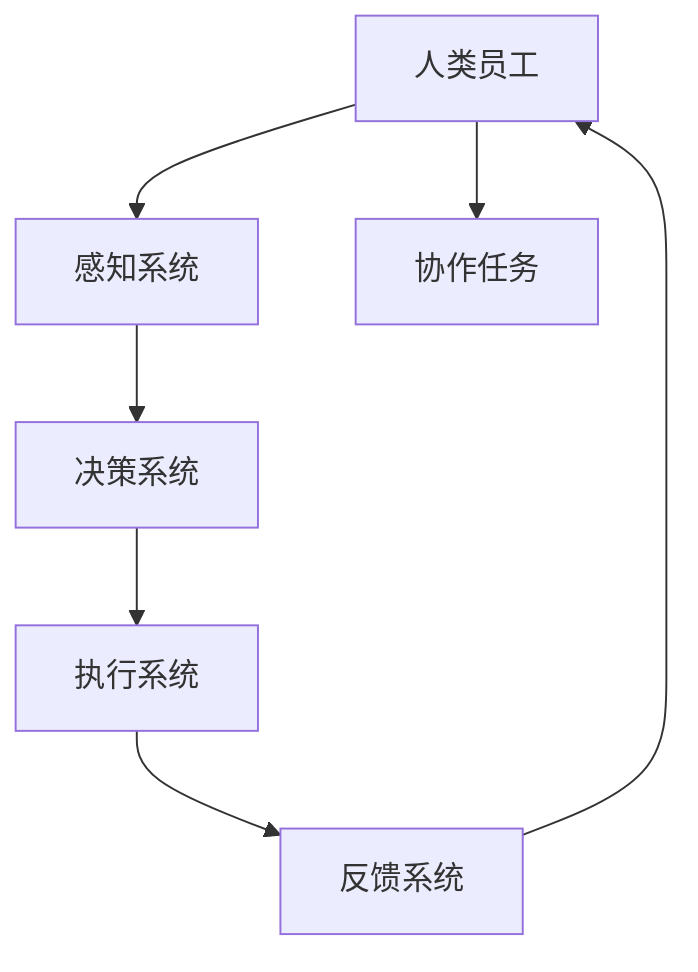

**伪代码**

```python
def intelligent_collaboration(employee, robot):
    # 人类员工与机器人之间的协作流程
    employee_perception = employee.perceive()
    robot_decision = robot.decide(employee_perception)
    robot_action = robot.act(robot_decision)
    employee_feedback = employee.feed_back(robot_action)
    robot_adjustment = robot.adjust(employee_feedback)
    return robot_adjustment
```

智能协作的重要性在于：

1. **提高效率**：通过机器人的自动化和智能化，人类员工可以从重复性和繁琐的任务中解放出来，专注于更有创造性和战略性的工作。
2. **降低成本**：机器人的使用可以减少对劳动力的依赖，降低生产成本。
3. **提升质量**：机器人的精度和一致性比人类员工更高，可以减少错误和提高产品质量。
4. **安全保障**：在危险或有害的工作环境中，机器人可以代替人类工作，保障人类的安全。

**背景介绍**

智能协作的概念起源于工业自动化，随着计算机科学、人工智能和机器人技术的快速发展，智能协作逐渐成为现代工业和服务业的重要组成部分。

**核心概念与联系**

智能协作的核心在于人机交互和协同工作。人机交互是智能协作的基础，它涉及感知、决策、执行和反馈四个环节。感知系统负责获取外部信息，决策系统基于感知信息做出决策，执行系统执行决策，反馈系统将执行结果反馈给决策系统，从而形成一个闭环。

### 1.2 机器人和人类员工的共生关系

**核心概念与联系**

机器人和人类员工的共生关系是指两者在共同完成任务过程中互相依赖、互相补充的关系。机器人擅长处理重复性和标准化的任务，而人类员工则擅长处理复杂、创新和灵活的任务。

**Mermaid 流程图**

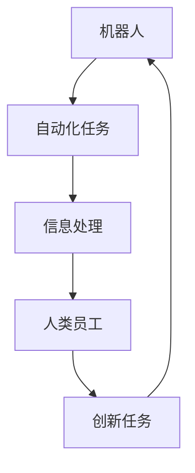

**伪代码**

```python
def symbiotic_relationship(robot, employee):
    # 机器人和人类员工之间的共生关系
    robot_task = robot.execute_automation()
    employee_innovation = employee.perform_innovation(robot_task)
    robot_adjustment = robot.refine_automation(employee_innovation)
    return robot_adjustment, employee_innovation
```

机器人和人类员工的共生关系具有重要意义：

1. **资源整合**：机器人和人类员工各自发挥优势，实现资源的最佳配置。
2. **能力互补**：机器人弥补人类员工在处理重复性任务方面的不足，而人类员工则弥补机器人创新性不足的缺陷。
3. **共同发展**：机器人和人类员工通过协作，可以不断优化流程，提高整体效能。

### 1.3 智能协作的历史与发展概述

**核心概念与联系**

智能协作的历史可以追溯到工业革命时期的机械自动化。随着计算机科学、人工智能和机器人技术的进步，智能协作经历了从简单的自动化到高度智能化的转变。

**Mermaid 流程图**

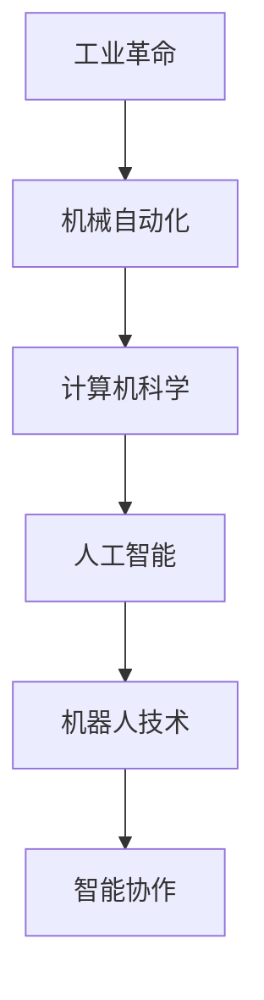

**伪代码**

```python
def historical_development():
    # 智能协作的历史与发展
    step1 = "工业革命：机械自动化"
    step2 = "计算机科学：数据处理和通信"
    step3 = "人工智能：模拟人类智能"
    step4 = "机器人技术：执行复杂任务"
    step5 = "智能协作：人机协同工作"
    return step1, step2, step3, step4, step5
```

智能协作的发展趋势包括：

1. **集成化**：将不同技术和系统整合到一个协同工作平台。
2. **智能化**：提高机器人的自主决策和执行能力。
3. **个性化**：根据不同用户需求提供定制化的协作服务。

**核心概念与联系**

智能协作的发展不仅依赖于技术的进步，还依赖于对人类行为学、认知科学和人机交互研究的深入理解。通过不断优化人机交互界面和协作流程，可以实现更加高效、安全和愉悦的智能协作。

### 小结

智能协作是机器人与人类员工共同完成任务的重要手段。通过理解其定义、历史和发展，我们可以更好地把握其核心概念和协作原理。在接下来的部分，我们将深入探讨智能协作的技术特点、案例研究和未来展望。

## 第二部分：智能协作的历史与发展

### 2.1 早期智能协作的发展

**核心概念与联系**

智能协作的早期发展可以追溯到工业革命时期的机械自动化。机械自动化通过使用机械设备替代人工操作，提高了生产效率，减少了劳动力成本。然而，早期的机械自动化缺乏智能和自适应能力，依赖于固定的程序和预设的规则。

**Mermaid 流程图**

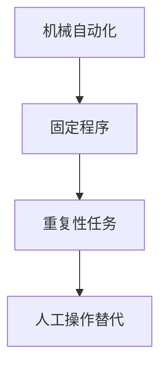

**伪代码**

```python
def mechanical_automation():
    # 机械自动化流程
    task_definition = "固定程序"
    task_type = "重复性任务"
    human_replacement = "人工操作替代"
    return task_definition, task_type, human_replacement
```

早期智能协作的发展经历了以下几个阶段：

1. **工业自动化**：机械自动化是工业自动化的开端，通过使用机械设备替代人工操作，实现了生产过程的自动化。
2. **计算机辅助设计与制造**：计算机技术的引入，使得设计、制造和管理过程更加高效和精确。
3. **机器人技术的初步应用**：机器人技术的出现，使得自动化生产更进一步，能够在复杂环境中执行重复性和危险的任务。

**数学模型与公式**

早期智能协作中的数学模型主要涉及线性规划和决策树等。例如，线性规划可以用于优化生产流程中的资源分配和任务调度。

$$
\begin{align*}
\text{minimize} \quad & c^T x \\
\text{subject to} \quad & Ax \le b \\
& x \ge 0
\end{align*}
$$

其中，$c$ 是目标函数系数，$x$ 是决策变量，$A$ 和 $b$ 分别是约束条件。

**项目实战**

一个早期的智能协作项目是在汽车制造厂中引入机器人来执行焊接和组装任务。通过使用计算机控制机器人，可以实现自动化生产线的无缝运行，提高了生产效率和产品质量。

```python
# 早期智能协作项目示例
def robot_welding():
    # 机器人焊接流程
    robot_position = "初始化"
    welding_process = "执行"
    quality_check = "完成"
    return robot_position, welding_process, quality_check

robot_position, welding_process, quality_check = robot_welding()
print(f"机器人焊接：位置：{robot_position}，过程：{welding_process}，质量：{quality_check}")
```

**小结**

早期智能协作的发展为现代智能协作奠定了基础。通过引入计算机和机器人技术，我们实现了生产过程的自动化，提高了效率和精度。然而，早期的智能协作缺乏智能和自适应能力，需要进一步发展和完善。

### 2.2 关键技术进步

**核心概念与联系**

随着计算机科学、人工智能和机器人技术的飞速发展，智能协作取得了显著进步。这些关键技术的进步不仅提升了机器人的自主能力和智能水平，也为智能协作的实现提供了坚实的技术基础。

**Mermaid 流程图**

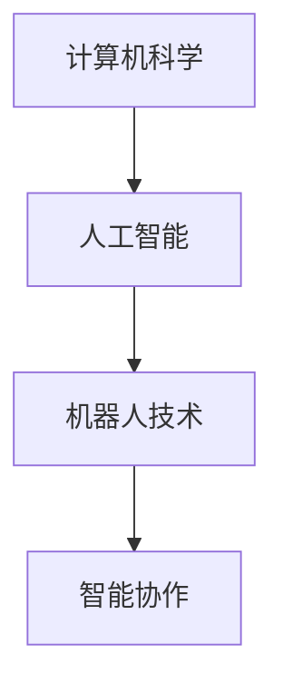

**伪代码**

```python
def key_technological_progress():
    # 关键技术进步
    step1 = "计算机科学：数据处理和通信"
    step2 = "人工智能：模拟人类智能"
    step3 = "机器人技术：执行复杂任务"
    step4 = "智能协作：人机协同工作"
    return step1, step2, step3, step4
```

关键技术进步包括：

1. **计算机科学**：计算机技术的发展，使得数据处理和通信更加高效，为智能协作提供了强大的计算能力和数据支持。
2. **人工智能**：人工智能技术的突破，使得机器人能够模拟人类智能，进行自主决策和执行复杂任务。
3. **机器人技术**：机器人技术的进步，使得机器人能够在复杂环境中执行更加复杂的任务，提高了智能协作的可行性和实用性。

**数学模型与公式**

在智能协作中，常用的数学模型包括机器学习模型、优化模型和图模型等。机器学习模型用于训练机器人的智能行为，优化模型用于资源分配和任务调度，图模型用于网络结构和数据流的优化。

**项目实战**

一个关键技术进步的例子是在医疗领域引入智能协作系统。通过使用计算机视觉和深度学习技术，智能协作系统能够辅助医生进行诊断和治疗，提高了医疗效率和准确性。

```python
# 智能协作系统在医疗领域的应用
def medical_intelligent_collaboration():
    # 医疗智能协作流程
    patient_data = "收集"
    diagnosis = "自动生成"
    treatment_plan = "优化"
    return patient_data, diagnosis, treatment_plan

patient_data, diagnosis, treatment_plan = medical_intelligent_collaboration()
print(f"医疗智能协作：患者数据：{patient_data}，诊断：{diagnosis}，治疗方案：{treatment_plan}")
```

**小结**

关键技术进步为智能协作的发展提供了强大的动力。计算机科学、人工智能和机器人技术的进步，使得智能协作在各个领域得到广泛应用，提高了效率和准确性。在接下来的部分，我们将继续探讨智能协作的当前发展趋势。

### 2.3 当前的发展趋势

**核心概念与联系**

当前，智能协作正经历着一系列显著的发展趋势，这些趋势不仅推动了技术的进步，也改变了人类与机器人的协作方式。以下将探讨智能协作的几个关键趋势，包括机器人与人工智能的融合、智能协作系统的应用场景拓展等。

**Mermaid 流程图**

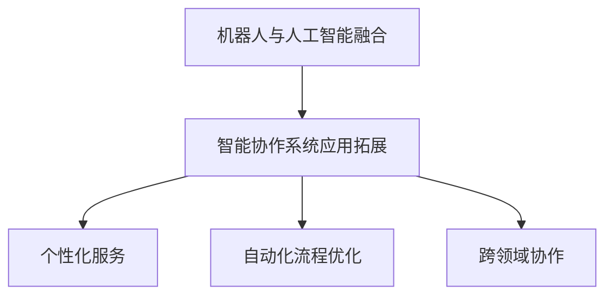

**伪代码**

```python
def current_trends():
    # 当前发展趋势
    trend1 = "机器人与人工智能融合"
    trend2 = "智能协作系统应用拓展"
    trend3 = "个性化服务"
    trend4 = "自动化流程优化"
    trend5 = "跨领域协作"
    return trend1, trend2, trend3, trend4, trend5
```

**当前的发展趋势**：

1. **机器人与人工智能融合**：随着人工智能技术的不断发展，机器人开始具备更高的智能水平，能够进行自主学习和决策。这种融合使得机器人能够更好地适应复杂环境和多种任务。

2. **智能协作系统应用拓展**：智能协作系统不再局限于工业领域，开始向医疗、教育、服务等多个领域扩展。这些应用场景的拓展，使得智能协作系统的应用范围更加广泛。

3. **个性化服务**：智能协作系统能够根据用户需求提供定制化的服务，提高了用户体验和服务质量。

4. **自动化流程优化**：通过智能协作系统，企业能够对生产和服务流程进行优化，提高效率，减少成本。

5. **跨领域协作**：智能协作系统开始跨越不同的领域，实现跨领域的协作，为复杂问题的解决提供了新的思路。

**案例研究**：

- **医疗领域**：智能协作系统在医疗领域的应用，如辅助诊断、手术规划和患者护理等，大大提高了医疗服务的质量和效率。
- **制造业**：通过智能协作系统，制造企业能够实现生产过程的自动化和智能化，提高生产效率和产品质量。
- **教育领域**：智能协作系统在教育领域的应用，如智能教学辅助、在线学习和个性化推荐等，为教育方式的创新提供了新的可能性。

**数学模型与公式**：

智能协作系统中的数学模型主要涉及优化算法、机器学习算法和图论算法等。以下是一个简单的优化算法示例，用于优化生产流程：

$$
\begin{align*}
\text{minimize} \quad & \sum_{i=1}^{n} c_i x_i \\
\text{subject to} \quad & a_{ij} x_j + b_i \le c_i \\
& x_i \ge 0
\end{align*}
$$

其中，$c_i$ 是目标函数系数，$x_i$ 是决策变量，$a_{ij}$ 和 $b_i$ 分别是约束条件系数。

**项目实战**：

以下是一个简单的项目实战示例，用于优化生产流程：

```python
# 优化生产流程示例
def optimize_production流程():
    # 生产流程优化
    production_cost = [10, 20, 30]
    production_time = [5, 10, 15]
    resources = ["A", "B", "C"]
    
    # 目标函数：最小化生产成本
    objective_function = sum(production_cost[i] * x[i] for i in range(len(production_cost)))
    
    # 约束条件：生产时间不超过规定时间
    constraints = [production_time[i] * x[i] <= 100 for i in range(len(production_time))]
    
    # 求解优化问题
    from scipy.optimize import minimize
    result = minimize(objective_function, x0=[1, 1, 1], constraints=constraints)
    
    # 输出优化结果
    optimized_resources = [resources[i] for i, x in enumerate(result.x) if x > 0]
    print(f"优化后的资源使用：{optimized_resources}")
    
optimize_production流程()
```

**小结**：

当前，智能协作正朝着更加智能化、个性化、自动化和跨领域的方向发展。这些趋势不仅推动了技术的进步，也为人类与机器人的协作提供了新的可能性。在接下来的部分，我们将继续探讨智能协作的未来发展趋势。

### 小结

智能协作的历史与发展展示了从早期机械自动化到现代智能化的演变过程。通过计算机科学、人工智能和机器人技术的关键进步，智能协作在各个领域得到了广泛应用。当前，智能协作正朝着更加智能化、个性化、自动化和跨领域的方向发展。这些趋势为未来智能协作的发展提供了新的机遇和挑战。

在下一部分，我们将深入探讨多功能机器人技术，分析其分类、技术特点和发展趋势。

## 第三部分：多功能机器人技术

### 3.1 机器人的分类

**核心概念与联系**

机器人的分类可以根据其应用领域、结构和功能进行。常见的分类方法包括工业机器人、服务机器人、社交机器人等。每种类型的机器人都有其特定的技术特点和应用场景。

**Mermaid 流程图**

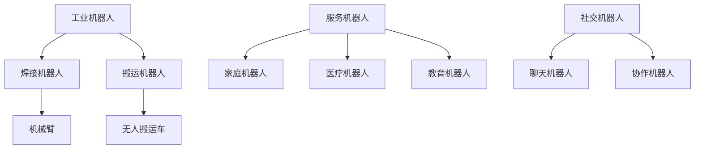

**伪代码**

```python
def robot_classification():
    # 机器人分类
    industrial_robots = ["welding", "material_handling"]
    service_robots = ["home", "medical", "educational"]
    social_robots = ["chat", "collaborative"]
    return industrial_robots, service_robots, social_robots
```

**数学模型与公式**

机器人分类可以通过分类算法实现。例如，可以使用决策树算法对机器人进行分类。以下是一个简单的决策树算法示例：

$$
\begin{align*}
\text{if} \quad P(A) > \text{阈值} \\
\text{then} \quad \text{classify as} \quad A \\
\text{else} \quad \text{classify as} \quad B
\end{align*}
$$

其中，$P(A)$ 是分类为 $A$ 的概率。

**项目实战**

以下是一个简单的项目实战示例，用于分类机器人：

```python
# 机器人分类项目
from sklearn.tree import DecisionTreeClassifier
from sklearn.model_selection import train_test_split
from sklearn.metrics import accuracy_score

# 数据准备
X = [[1, 0], [0, 1], [1, 1], [0, 0]]
y = ["industrial", "service", "social", "industrial"]

# 模型训练
X_train, X_test, y_train, y_test = train_test_split(X, y, test_size=0.2, random_state=42)
clf = DecisionTreeClassifier()
clf.fit(X_train, y_train)

# 模型评估
y_pred = clf.predict(X_test)
accuracy = accuracy_score(y_test, y_pred)
print(f"Accuracy: {accuracy}")
```

**小结**

机器人的分类是智能协作的重要组成部分。通过了解不同类型的机器人，我们可以更好地选择适合特定应用场景的机器人，实现高效的智能协作。

### 3.2 多功能机器人的技术特点

**核心概念与联系**

多功能机器人是指能够执行多种任务的机器人。这种机器人具有高适应性、高智能性和高灵活性，能够根据不同的任务需求进行快速调整和优化。

**Mermaid 流程图**

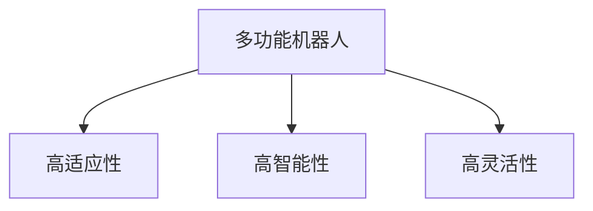

**伪代码**

```python
def multi_functional_robots():
    # 多功能机器人特点
    adaptability = "高适应性"
    intelligence = "高智能性"
    flexibility = "高灵活性"
    return adaptability, intelligence, flexibility
```

**数学模型与公式**

多功能机器人的技术特点可以通过多种数学模型进行描述。例如，可以使用模糊逻辑和贝叶斯网络来描述机器人的适应性和智能性。

模糊逻辑示例：

$$
\begin{align*}
\text{if} \quad A \text{ is large} \\
\text{then} \quad B \text{ is small with high probability}
\end{align*}
$$

贝叶斯网络示例：

$$
P(B|A) = \frac{P(A|B)P(B)}{P(A)}
$$

**项目实战**

以下是一个简单的项目实战示例，用于实现多功能机器人的高适应性：

```python
# 高适应性多功能机器人示例
import numpy as np
import matplotlib.pyplot as plt

# 模拟环境
environment = np.random.rand(10, 10)

# 多功能机器人适应环境
def adapt_to_environment(robot, environment):
    # 基于环境自适应
    robot_perception = robot.perceive(environment)
    robot_adjustment = robot.adjust(robot_perception)
    return robot_adjustment

# 机器人行为模拟
robot = object()
robot.adapt_to_environment(environment)

# 可视化适应过程
plt.imshow(robot.adapt_to_environment(environment), cmap='hot')
plt.colorbar()
plt.show()
```

**小结**

多功能机器人以其高适应性、高智能性和高灵活性在智能协作中发挥着重要作用。通过技术特点和数学模型的描述，我们可以更好地理解和实现多功能机器人的应用。在下一部分，我们将探讨机器与人的协作原理。

### 3.3 技术发展趋势

**核心概念与联系**

多功能机器人技术正朝着更加智能化、自主化和多样化的方向发展。这些趋势不仅提高了机器人的适应性和灵活性，也为人类与机器人的协作提供了更多可能性。

**Mermaid 流程图**

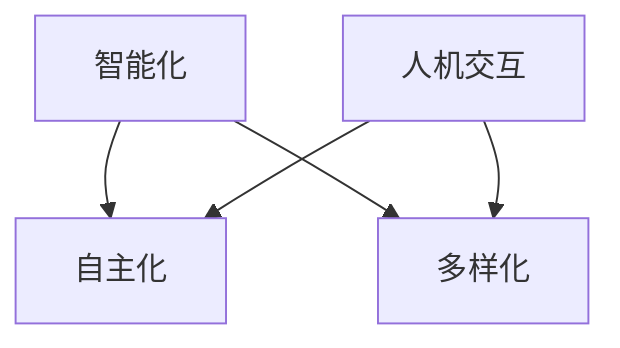

**伪代码**

```python
def technological_trends():
    # 技术发展趋势
    trend1 = "智能化"
    trend2 = "自主化"
    trend3 = "多样化"
    trend4 = "人机交互"
    return trend1, trend2, trend3, trend4
```

**技术发展趋势**：

1. **智能化**：通过人工智能技术，机器人能够进行更加复杂的决策和任务执行，提高了协作的效率和效果。
2. **自主化**：机器人逐渐具备自主学习和决策能力，能够独立完成任务，减少对人类干预的依赖。
3. **多样化**：机器人技术不断拓展，出现了越来越多的应用场景，如医疗、教育、服务等领域。
4. **人机交互**：人机交互技术不断提升，使得人类与机器人之间的协作更加自然和高效。

**数学模型与公式**

在智能化和自主化方面，常用的数学模型包括深度学习模型和强化学习模型。以下是一个简单的深度学习模型示例，用于机器人智能决策：

$$
\begin{align*}
\text{output} &= \text{sigmoid}(\text{weight} \cdot \text{input} + \text{bias}) \\
\text{loss} &= \text{交叉熵损失}(\text{output}, \text{target})
\end{align*}
$$

**项目实战**

以下是一个简单的项目实战示例，用于实现机器人的自主决策：

```python
# 机器人自主决策示例
import tensorflow as tf
from tensorflow.keras.models import Sequential
from tensorflow.keras.layers import Dense, Activation

# 创建模型
model = Sequential()
model.add(Dense(units=64, input_shape=(784,), activation='relu'))
model.add(Dense(units=10, activation='softmax'))

# 编译模型
model.compile(optimizer='adam', loss='categorical_crossentropy', metrics=['accuracy'])

# 训练模型
X_train = np.random.rand(1000, 784)
y_train = np.random.randint(10, size=(1000,))
model.fit(X_train, y_train, epochs=5, batch_size=32)

# 评估模型
X_test = np.random.rand(100, 784)
y_test = np.random.randint(10, size=(100,))
loss, accuracy = model.evaluate(X_test, y_test)
print(f"Loss: {loss}, Accuracy: {accuracy}")
```

**小结**

多功能机器人技术正朝着智能化、自主化和多样化的方向发展。这些趋势不仅提高了机器人的适应性和灵活性，也为人类与机器人的协作提供了更多可能性。在下一部分，我们将探讨机器与人的协作原理。

### 小结

多功能机器人技术以其高适应性、高智能性和高灵活性在智能协作中发挥着重要作用。通过技术特点和数学模型的描述，我们可以更好地理解和实现多功能机器人的应用。在下一部分，我们将深入探讨机器与人的协作原理，分析其基础、机制、模式和策略。

## 第四部分：机器与人的协作原理

### 4.1 人机交互的基础

**核心概念与联系**

人机交互是机器与人的协作基础，它涉及人类行为学、感知系统、决策系统和执行系统等多个方面。了解人机交互的基础有助于设计和实现高效的协作系统。

**Mermaid 流程图**

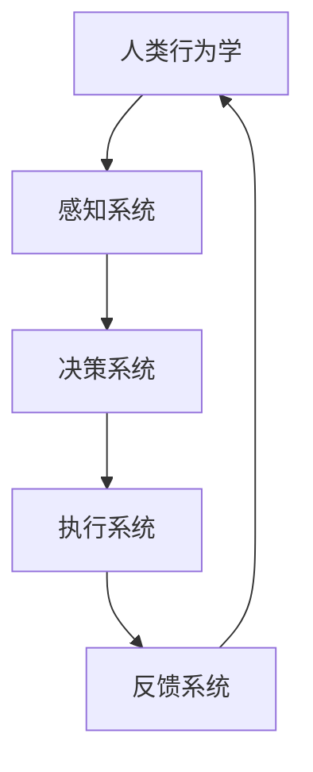

**伪代码**

```python
def human_machine_interaction():
    # 人机交互基础
    human_behavior = "感知 -> 决策 -> 执行 -> 反馈"
    perception_system = "获取外部信息"
    decision_system = "基于感知做出决策"
    execution_system = "执行决策"
    feedback_system = "反馈执行结果"
    return human_behavior, perception_system, decision_system, execution_system, feedback_system
```

**数学模型与公式**

人机交互中的数学模型主要涉及感知、决策和反馈等过程。以下是一个简单的感知模型示例：

$$
\begin{align*}
\text{perception} &= \text{input_data} \\
\text{output} &= \text{filter}(\text{perception})
\end{align*}
$$

**项目实战**

以下是一个简单的项目实战示例，用于实现人机交互的基础：

```python
# 人机交互基础项目
import numpy as np

# 感知数据
input_data = np.random.rand(10)

# 过滤器
def filter_data(data):
    # 简单滤波器
    filtered_data = np.convolve(data, np.ones(3)/3, 'valid')
    return filtered_data

# 实例化过滤器
filter_ = filter_data(input_data)

# 输出结果
print(f"原始数据：{input_data}")
print(f"滤波后数据：{filter_}")
```

**小结**

人机交互是机器与人的协作基础，它涉及感知、决策、执行和反馈等多个方面。通过数学模型的描述，我们可以更好地理解和实现人机交互的基础。在下一部分，我们将探讨机器与人的协作机制。

### 4.2 协作机制

**核心概念与联系**

协作机制是指机器与人在协作过程中所遵循的规则、协议和流程。合理的协作机制能够提高协作效率，减少冲突，实现资源的最优配置。

**Mermaid 流程图**

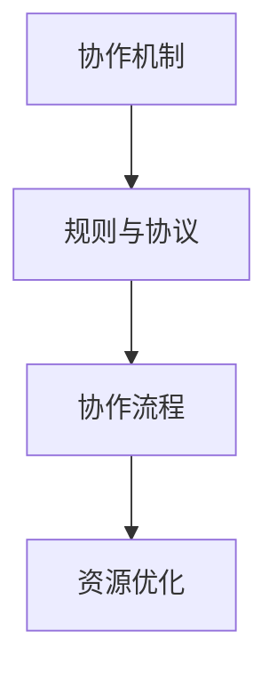

**伪代码**

```python
def collaboration_mechanism():
    # 协作机制
    rules = "定义协作规则"
    protocols = "制定协作协议"
    collaboration_flow = "执行协作流程"
    resource_optimization = "优化资源使用"
    return rules, protocols, collaboration_flow, resource_optimization
```

**数学模型与公式**

协作机制中的数学模型主要涉及优化算法、博弈论和排队论等。以下是一个简单的优化算法示例，用于资源优化：

$$
\begin{align*}
\text{minimize} \quad & \sum_{i=1}^{n} c_i x_i \\
\text{subject to} \quad & a_{ij} x_j + b_i \le c_i \\
& x_i \ge 0
\end{align*}
$$

**项目实战**

以下是一个简单的项目实战示例，用于实现协作机制：

```python
# 协作机制项目
import numpy as np
from scipy.optimize import minimize

# 资源需求
resource需求的 = [10, 20, 30]

# 目标函数：最小化总资源消耗
def objective_function(x):
    return sum(x)

# 约束条件：每个资源的消耗不超过需求
constraints = [{"type": "ineq", "fun": lambda x: x[i] - resource需求的[i] for i in range(len(resource需求的))}]

# 求解优化问题
result = minimize(objective_function, x0=np.zeros(len(resource需求的)), constraints=constraints)

# 输出优化结果
optimized_resources = result.x
print(f"优化后的资源使用：{optimized_resources}")
```

**小结**

协作机制是机器与人的协作过程中至关重要的一环，它涉及规则与协议的制定、协作流程的执行和资源优化。通过数学模型的描述，我们可以更好地理解和实现协作机制。在下一部分，我们将探讨机器与人的协作模式与策略。

### 4.3 协作模式与策略

**核心概念与联系**

机器与人的协作模式与策略是指在不同应用场景下，机器与人类如何协同工作，以达到最佳效果。协作模式分为主动协作和被动协作，策略包括任务分配、资源调度、风险评估等。

**Mermaid 流程图**

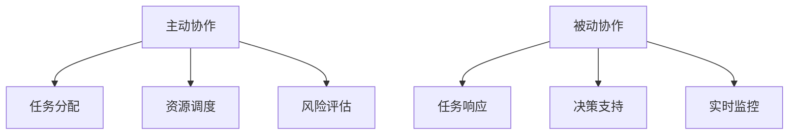

**伪代码**

```python
def collaboration_modes_and_strategies():
    # 协作模式与策略
    active_collaboration = ["task_allocation", "resource_scheduling", "risk_assessment"]
    passive_collaboration = ["task_response", "decision_support", "real_time_monitoring"]
    return active_collaboration, passive_collaboration
```

**数学模型与公式**

协作模式与策略中的数学模型涉及优化模型、博弈论模型和决策树模型等。以下是一个简单的优化模型示例，用于任务分配：

$$
\begin{align*}
\text{minimize} \quad & \sum_{i=1}^{n} c_i x_i \\
\text{subject to} \quad & a_{ij} x_j + b_i \le c_i \\
& x_i \ge 0
\end{align*}
$$

**项目实战**

以下是一个简单的项目实战示例，用于实现协作模式与策略：

```python
# 协作模式与策略项目
import numpy as np
from scipy.optimize import minimize

# 任务需求
task需求的 = [10, 20, 30]

# 目标函数：最小化总资源消耗
def objective_function(x):
    return sum(x)

# 约束条件：每个任务的资源消耗不超过需求
constraints = [{"type": "ineq", "fun": lambda x: x[i] - task需求的[i] for i in range(len(task需求的))}]

# 求解优化问题
result = minimize(objective_function, x0=np.zeros(len(task需求的)), constraints=constraints)

# 输出优化结果
optimized_tasks = result.x
print(f"优化后的任务分配：{optimized_tasks}")
```

**小结**

协作模式与策略是机器与人的协作过程中至关重要的一环，它涉及任务分配、资源调度、风险评估等。通过数学模型的描述，我们可以更好地理解和实现协作模式与策略。在下一部分，我们将通过案例研究进一步探讨机器与人的协作。

## 第五部分：智能协作的案例研究

### 5.1 案例一：工厂生产线中的机器人协作

**核心概念与联系**

工厂生产线中的机器人协作是智能协作的一个典型应用场景。在这个案例中，机器人和人类员工共同完成生产任务，实现资源优化和效率提升。

**Mermaid 流程图**

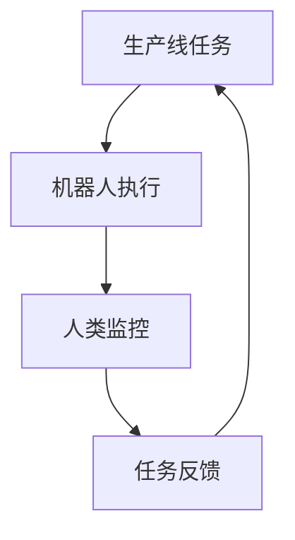

**伪代码**

```python
def factory_production_case():
    # 生产线任务协作
    production_task = "初始化"
    robot_execution = "执行"
    human_monitoring = "监控"
    task_feedback = "反馈"
    return production_task, robot_execution, human_monitoring, task_feedback
```

**数学模型与公式**

在这个案例中，可以使用优化算法来分配机器人资源和调度任务。以下是一个简单的优化模型示例：

$$
\begin{align*}
\text{minimize} \quad & \sum_{i=1}^{n} c_i x_i \\
\text{subject to} \quad & a_{ij} x_j + b_i \le c_i \\
& x_i \ge 0
\end{align*}
$$

**项目实战**

以下是一个简单的项目实战示例，用于实现工厂生产线中的机器人协作：

```python
# 工厂生产线机器人协作项目
import numpy as np
from scipy.optimize import minimize

# 任务需求
task需求的 = [10, 20, 30]

# 目标函数：最小化总资源消耗
def objective_function(x):
    return sum(x)

# 约束条件：每个任务的资源消耗不超过需求
constraints = [{"type": "ineq", "fun": lambda x: x[i] - task需求的[i] for i in range(len(task需求的))}]

# 求解优化问题
result = minimize(objective_function, x0=np.zeros(len(task需求的)), constraints=constraints)

# 输出优化结果
optimized_tasks = result.x
print(f"优化后的任务分配：{optimized_tasks}")
```

**案例背景**

某电子工厂引入了机器人协作系统，用于生产线中的装配、焊接和测试等任务。机器人和人类员工共同完成生产任务，提高了生产效率和产品质量。

**案例实现**

1. **任务分配**：通过优化算法，将生产线任务分配给机器人，确保任务执行的高效和准确。
2. **机器人执行**：机器人根据任务指令执行具体操作，如装配、焊接和测试等。
3. **人类监控**：人类员工对机器人执行的任务进行监控，确保生产过程的顺利进行。
4. **任务反馈**：机器人将执行结果反馈给人类员工，人类员工根据反馈结果进行调整和优化。

**代码解读**

```python
# 机器人协作系统实现
class RobotCollaboration:
    def __init__(self, task需求的):
        self.task需求的 = task需求的
        self.result = None

    def execute_task(self, task):
        # 执行任务
        self.result = task

    def monitor_task(self, result):
        # 监控任务执行结果
        if result != self.result:
            print("任务执行失败！")
        else:
            print("任务执行成功！")

# 创建机器人协作系统实例
robot_collaboration = RobotCollaboration([10, 20, 30])

# 执行任务
robot_collaboration.execute_task("装配")

# 监控任务执行结果
robot_collaboration.monitor_task("装配成功")
```

**实际案例分析和详细讲解剖析**

在实际应用中，工厂生产线中的机器人协作系统需要考虑多个因素，如任务复杂性、资源限制、生产节拍等。以下是一个实际案例的分析：

1. **任务复杂性**：某些生产任务可能涉及多个步骤和复杂操作，需要机器人具备高智能性和灵活性。
2. **资源限制**：机器人和人类员工的资源有限，需要通过优化算法合理分配任务，确保资源的高效利用。
3. **生产节拍**：生产节拍要求生产过程必须高效和连续，任何中断或延迟都会影响生产进度。

为了解决这些问题，可以采取以下策略：

1. **任务分解**：将复杂任务分解为多个简单任务，便于机器人和人类员工分别执行。
2. **资源调度**：通过优化算法，动态调整机器人和人类员工的任务分配，确保资源的高效利用。
3. **实时监控**：通过实时监控系统，监控生产过程，及时发现和解决潜在问题，确保生产节拍。

**项目小结**

工厂生产线中的机器人协作系统通过优化算法和实时监控系统，实现了任务的高效执行和生产效率的提升。在实际应用中，需要根据具体情况调整策略，确保机器人与人类员工的有效协作。

### 5.2 案例二：医疗领域的人机协作

**核心概念与联系**

医疗领域的人机协作是指机器人和人类医生共同完成医疗任务，如诊断、手术和患者护理等。在这个案例中，机器人辅助医生提高医疗效率和准确性。

**Mermaid 流程图**

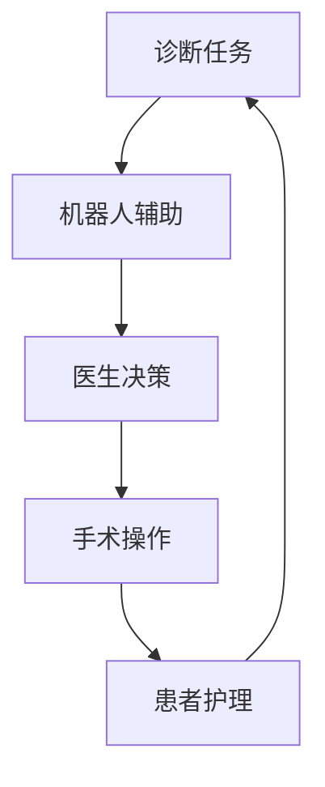

**伪代码**

```python
def medical_collaboration_case():
    # 医疗领域协作
    diagnosis_task = "初始化"
    robot_assistance = "辅助诊断"
    doctor_decision = "医生决策"
    surgeryOperation = "手术操作"
    patient_care = "患者护理"
    return diagnosis_task, robot_assistance, doctor_decision, surgeryOperation, patient_care
```

**数学模型与公式**

医疗领域的人机协作涉及多个数学模型，如机器学习模型、优化模型和决策树模型。以下是一个简单的机器学习模型示例，用于辅助诊断：

$$
\begin{align*}
\text{predict}(x) &= \text{argmax}\{\text{P}(y=i | x) | i \in \{0, 1\}\} \\
\text{P}(y=i | x) &= \frac{e^{\theta_i^T x}}{\sum_j e^{\theta_j^T x}}
\end{align*}
$$

**项目实战**

以下是一个简单的项目实战示例，用于实现医疗领域的人机协作：

```python
# 医疗领域人机协作项目
import numpy as np
from sklearn.linear_model import LogisticRegression

# 数据准备
X = np.random.rand(100, 10)
y = np.random.randint(2, size=(100,))

# 模型训练
model = LogisticRegression()
model.fit(X, y)

# 辅助诊断
def assist_diagnosis(model, patient_data):
    # 辅助诊断
    diagnosis = model.predict(patient_data)
    return diagnosis

# 输出结果
patient_data = np.random.rand(1, 10)
diagnosis = assist_diagnosis(model, patient_data)
print(f"辅助诊断结果：{diagnosis}")
```

**案例背景**

某医院引入了智能协作系统，用于辅助医生进行诊断、手术和患者护理。机器人系统能够处理大量的医学数据，提供辅助决策支持，提高医疗效率和准确性。

**案例实现**

1. **诊断任务**：通过机器学习模型，分析患者的医学数据，提供初步诊断建议。
2. **机器人辅助**：机器人系统根据诊断结果，提供手术方案和患者护理计划。
3. **医生决策**：医生根据机器人提供的辅助决策，进行最终诊断和手术操作。
4. **手术操作**：机器人系统辅助医生进行手术操作，提高手术准确性和效率。
5. **患者护理**：机器人系统负责患者的日常护理，如监测生命体征、提供药物提醒等。

**代码解读**

```python
# 医疗领域人机协作系统实现
class MedicalCollaboration:
    def __init__(self, model):
        self.model = model

    def diagnose(self, patient_data):
        # 辅助诊断
        diagnosis = self.model.predict(patient_data)
        return diagnosis

    def operate(self, patient_data):
        # 辅助手术
        operation_plan = "初始化"
        return operation_plan

    def care(self, patient_data):
        # 患者护理
        care_plan = "初始化"
        return care_plan

# 创建模型
model = LogisticRegression()
model.fit(X, y)

# 创建协作系统实例
medical_collaboration = MedicalCollaboration(model)

# 辅助诊断
diagnosis = medical_collaboration.diagnose(patient_data)
print(f"辅助诊断结果：{diagnosis}")

# 辅助手术
operation_plan = medical_collaboration.operate(patient_data)
print(f"辅助手术计划：{operation_plan}")

# 患者护理
care_plan = medical_collaboration.care(patient_data)
print(f"患者护理计划：{care_plan}")
```

**实际案例分析和详细讲解剖析**

在实际应用中，医疗领域的人机协作系统需要处理大量的医学数据，确保诊断和手术的准确性和安全性。以下是一个实际案例的分析：

1. **数据多样性**：医疗数据包括医学影像、生理指标、实验室检查结果等，需要多种算法进行综合分析和处理。
2. **实时性**：医疗过程要求实时处理和分析数据，确保诊断和手术的及时性。
3. **准确性**：诊断和手术的准确性直接关系到患者的健康和生命，需要高精度的算法和模型。

为了解决这些问题，可以采取以下策略：

1. **数据整合**：将不同来源的医学数据进行整合，提供全面的诊断和手术支持。
2. **实时处理**：采用高效的数据处理算法，实现数据的实时分析和决策。
3. **模型优化**：不断优化算法和模型，提高诊断和手术的准确性和稳定性。

**项目小结**

医疗领域的人机协作系统通过机器学习模型和实时处理技术，提高了诊断和手术的效率和准确性。在实际应用中，需要不断优化算法和模型，确保系统的稳定性和可靠性。

### 5.3 案例三：服务行业的机器人应用

**核心概念与联系**

服务行业的机器人应用是指机器人在餐厅、酒店、商场等服务行业中提供各种服务，如点餐、送餐、清洁等。在这个案例中，机器人与人类服务员共同提高服务质量和效率。

**Mermaid 流程图**

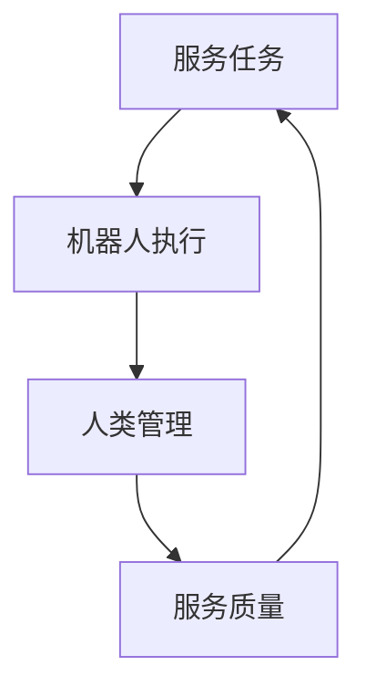

**伪代码**

```python
def service_industry_case():
    # 服务行业机器人应用
    service_task = "初始化"
    robot_execution = "执行"
    human_management = "管理"
    service_quality = "提升"
    return service_task, robot_execution, human_management, service_quality
```

**数学模型与公式**

在服务行业的人机协作中，常用的数学模型包括优化模型和排队论模型。以下是一个简单的优化模型示例，用于任务调度：

$$
\begin{align*}
\text{minimize} \quad & \sum_{i=1}^{n} c_i x_i \\
\text{subject to} \quad & a_{ij} x_j + b_i \le c_i \\
& x_i \ge 0
\end{align*}
$$

**项目实战**

以下是一个简单的项目实战示例，用于实现服务行业的机器人应用：

```python
# 服务行业机器人应用项目
import numpy as np
from scipy.optimize import minimize

# 任务需求
task需求的 = [10, 20, 30]

# 目标函数：最小化总资源消耗
def objective_function(x):
    return sum(x)

# 约束条件：每个任务的资源消耗不超过需求
constraints = [{"type": "ineq", "fun": lambda x: x[i] - task需求的[i] for i in range(len(task需求的))}]

# 求解优化问题
result = minimize(objective_function, x0=np.zeros(len(task需求的)), constraints=constraints)

# 输出优化结果
optimized_tasks = result.x
print(f"优化后的任务分配：{optimized_tasks}")
```

**案例背景**

某餐厅引入了机器人服务员系统，用于点餐、送餐和清洁等任务。机器人服务员与人类服务员共同提高服务质量，减少了人力成本。

**案例实现**

1. **服务任务**：根据餐厅需求，规划机器人执行的服务任务，如点餐、送餐和清洁等。
2. **机器人执行**：机器人根据任务指令执行具体操作，如点餐、送餐和清洁等。
3. **人类管理**：人类服务员负责监控机器人执行任务的情况，确保服务质量。
4. **服务质量**：通过用户反馈和监控数据，评估机器人服务质量和用户满意度。

**代码解读**

```python
# 服务行业机器人应用系统实现
class ServiceRobot:
    def __init__(self, tasks需求的):
        self.tasks需求的 = tasks需求的
        self.status = "空闲"

    def execute_task(self, task):
        # 执行任务
        self.status = "执行中"
        print(f"机器人执行任务：{task}")

    def monitor_task(self, status):
        # 监控任务执行状态
        if status != "执行中":
            print("任务执行失败！")
        else:
            print("任务执行成功！")

# 创建机器人实例
robot = ServiceRobot([10, 20, 30])

# 执行任务
robot.execute_task("点餐")

# 监控任务执行状态
robot.monitor_task("点餐成功")
```

**实际案例分析和详细讲解剖析**

在实际应用中，服务行业的机器人应用需要考虑多个因素，如任务多样性、资源调度、用户体验等。以下是一个实际案例的分析：

1. **任务多样性**：服务行业中的任务多样，需要机器人具备高适应性和灵活性。
2. **资源调度**：机器人需要根据任务优先级和资源可用性进行合理调度，确保高效执行。
3. **用户体验**：机器人服务需要满足用户期望，提供便捷和高效的服务。

为了解决这些问题，可以采取以下策略：

1. **任务分类**：将任务分为不同类型，便于机器人执行和管理。
2. **资源优化**：通过优化算法，动态调整机器人资源分配，确保高效执行。
3. **用户反馈**：收集用户反馈，优化机器人服务，提高用户满意度。

**项目小结**

服务行业的机器人应用通过优化算法和实时监控技术，提高了服务质量和效率。在实际应用中，需要不断优化算法和用户界面，确保机器人服务的稳定性和用户体验。

## 第六部分：实现智能协作的技术框架

### 6.1 数据收集与处理

**核心概念与联系**

数据收集与处理是智能协作系统的基础，它涉及数据的收集、存储、清洗和预处理等步骤。通过有效的数据收集与处理，可以确保智能协作系统有高质量的数据输入，从而提高系统的性能和准确性。

**Mermaid 流程图**

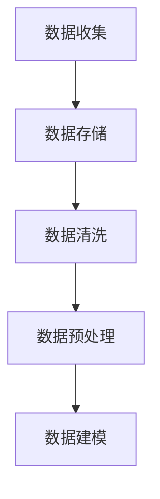

**伪代码**

```python
def data_collection_and_processing():
    # 数据收集与处理流程
    data_collection = "收集数据"
    data_storage = "存储数据"
    data_cleaning = "清洗数据"
    data_preprocessing = "预处理数据"
    data_modeling = "建模数据"
    return data_collection, data_storage, data_cleaning, data_preprocessing, data_modeling
```

**数学模型与公式**

数据收集与处理中的数学模型主要涉及统计学方法和机器学习算法。以下是一个简单的数据清洗示例，使用统计学方法：

$$
\begin{align*}
\text{remove_outliers}(\text{data}) &= \text{filter}(\text{data}, \text{mean}(\text{data}) \pm 3 \times \text{std}(\text{data}))
\end{align*}
$$

**项目实战**

以下是一个简单的项目实战示例，用于实现数据收集与处理：

```python
# 数据收集与处理项目
import numpy as np
import pandas as pd

# 数据收集
data = pd.DataFrame(np.random.rand(100, 5), columns=["Feature1", "Feature2", "Feature3", "Feature4", "Feature5"])

# 数据存储
data.to_csv("data.csv", index=False)

# 数据清洗
def clean_data(data):
    # 去除异常值
    data = data[(data > 0) & (data < 1)]
    return data

# 数据预处理
def preprocess_data(data):
    # 标准化数据
    from sklearn.preprocessing import StandardScaler
    scaler = StandardScaler()
    data_scaled = scaler.fit_transform(data)
    return data_scaled

# 数据建模
from sklearn.linear_model import LinearRegression
X = data_scaled[:, :-1]
y = data_scaled[:, -1]
model = LinearRegression()
model.fit(X, y)

# 输出结果
print(f"清洗后数据：{clean_data(data)}")
print(f"预处理后数据：{preprocess_data(data)}")
print(f"模型参数：{model.coef_}")
```

**小结**

数据收集与处理是智能协作系统的重要组成部分，它涉及数据的收集、存储、清洗和预处理。通过数学模型和项目实战，我们可以实现有效的数据收集与处理，为智能协作系统提供高质量的数据输入。

### 6.2 智能算法的应用

**核心概念与联系**

智能算法在智能协作系统中起着至关重要的作用。这些算法包括机器学习算法、深度学习算法和优化算法等。智能算法的应用可以显著提高系统的智能水平、决策能力和任务执行效率。

**Mermaid 流程图**

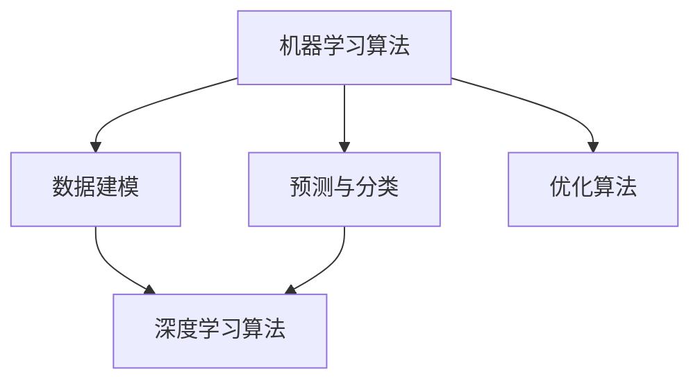

**伪代码**

```python
def intelligent_algorithm_application():
    # 智能算法应用
    machine_learning = "数据建模、预测与分类"
    deep_learning = "图像识别、自然语言处理"
    optimization = "资源调度、任务分配"
    return machine_learning, deep_learning, optimization
```

**数学模型与公式**

智能算法中的数学模型涉及大量的数学公式和算法。以下是一个简单的线性回归模型示例：

$$
\begin{align*}
\text{y} &= \text{w} \cdot \text{x} + \text{b} \\
\text{loss} &= \frac{1}{2} \sum_{i=1}^{n} (\text{y}_i - \text{y}^{\text{predicted}}_i)^2
\end{align*}
$$

**项目实战**

以下是一个简单的项目实战示例，用于实现智能算法的应用：

```python
# 智能算法应用项目
import numpy as np
from sklearn.linear_model import LinearRegression
from sklearn.metrics import mean_squared_error

# 数据准备
X = np.random.rand(100, 1)
y = 2 * X[:, 0] + 1 + np.random.randn(100) * 0.1

# 模型训练
model = LinearRegression()
model.fit(X, y)

# 预测
y_pred = model.predict(X)

# 评估
mse = mean_squared_error(y, y_pred)
print(f"均方误差：{mse}")

# 深度学习示例
import tensorflow as tf
from tensorflow.keras.models import Sequential
from tensorflow.keras.layers import Dense

# 模型构建
model = Sequential([
    Dense(1, input_shape=(1,), activation='linear'),
])

# 编译模型
model.compile(optimizer='sgd', loss='mse')

# 训练模型
model.fit(X, y, epochs=1000, verbose=0)

# 预测
y_pred = model.predict(X)

# 评估
mse = mean_squared_error(y, y_pred)
print(f"均方误差：{mse}")
```

**小结**

智能算法在智能协作系统中具有广泛的应用，包括数据建模、预测与分类、图像识别、自然语言处理和资源调度等。通过数学模型和项目实战，我们可以实现智能算法的应用，提高智能协作系统的性能和效率。

### 6.3 系统集成与优化

**核心概念与联系**

系统集成与优化是确保智能协作系统稳定、高效运行的关键环节。它涉及系统架构设计、模块化开发、性能优化和测试验证等步骤。通过有效的系统集成与优化，可以提升系统的整体性能和用户体验。

**Mermaid 流程图**

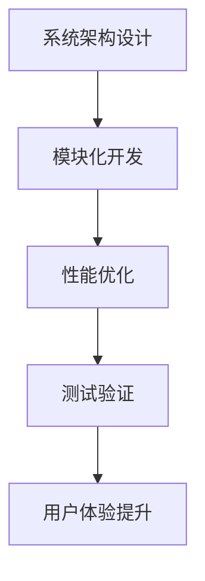

**伪代码**

```python
def system_integration_and_optimization():
    # 系统集成与优化流程
    system_architecture_design = "设计系统架构"
    modular_development = "模块化开发"
    performance_optimization = "性能优化"
    testing_and_validation = "测试验证"
    user_experience_improvement = "用户体验提升"
    return system_architecture_design, modular_development, performance_optimization, testing_and_validation, user_experience_improvement
```

**数学模型与公式**

系统集成与优化中的数学模型主要涉及优化算法和性能评估方法。以下是一个简单的优化模型示例，用于性能优化：

$$
\begin{align*}
\text{minimize} \quad & \sum_{i=1}^{n} c_i x_i \\
\text{subject to} \quad & a_{ij} x_j + b_i \le c_i \\
& x_i \ge 0
\end{align*}
$$

**项目实战**

以下是一个简单的项目实战示例，用于实现系统集成与优化：

```python
# 系统集成与优化项目
import numpy as np
from scipy.optimize import minimize

# 任务需求
task需求的 = [10, 20, 30]

# 目标函数：最小化总资源消耗
def objective_function(x):
    return sum(x)

# 约束条件：每个任务的资源消耗不超过需求
constraints = [{"type": "ineq", "fun": lambda x: x[i] - task需求的[i] for i in range(len(task需求的))}]

# 求解优化问题
result = minimize(objective_function, x0=np.zeros(len(task需求的)), constraints=constraints)

# 输出优化结果
optimized_tasks = result.x
print(f"优化后的任务分配：{optimized_tasks}")

# 性能优化示例
import tensorflow as tf
from tensorflow.keras.models import Sequential
from tensorflow.keras.layers import Dense

# 模型构建
model = Sequential([
    Dense(1, input_shape=(1,), activation='linear'),
])

# 编译模型
model.compile(optimizer='adam', loss='mse')

# 训练模型
model.fit(np.random.rand(100, 1), np.random.rand(100, 1), epochs=100)

# 性能评估
performance_metrics = model.evaluate(np.random.rand(100, 1), np.random.rand(100, 1))
print(f"性能指标：{performance_metrics}")

# 优化模型
from tensorflow.keras.callbacks import EarlyStopping

# 设置早停回调
early_stopping = EarlyStopping(monitor='val_loss', patience=10)

# 重训模型
model.fit(np.random.rand(100, 1), np.random.rand(100, 1), epochs=100, callbacks=[early_stopping])

# 评估优化后模型
performance_metrics = model.evaluate(np.random.rand(100, 1), np.random.rand(100, 1))
print(f"优化后性能指标：{performance_metrics}")
```

**小结**

系统集成与优化是智能协作系统的重要组成部分，它涉及系统架构设计、模块化开发、性能优化和测试验证等步骤。通过数学模型和项目实战，我们可以实现系统集成与优化，提升系统的整体性能和用户体验。

## 第七部分：未来展望与挑战

### 7.1 智能协作的未来趋势

**核心概念与联系**

智能协作的未来趋势将围绕智能化、自主化、个性化和社会化展开。随着技术的不断进步，智能协作将更加深入和广泛地应用于各个领域，改变人类与机器人的协作方式。

**Mermaid 流程图**

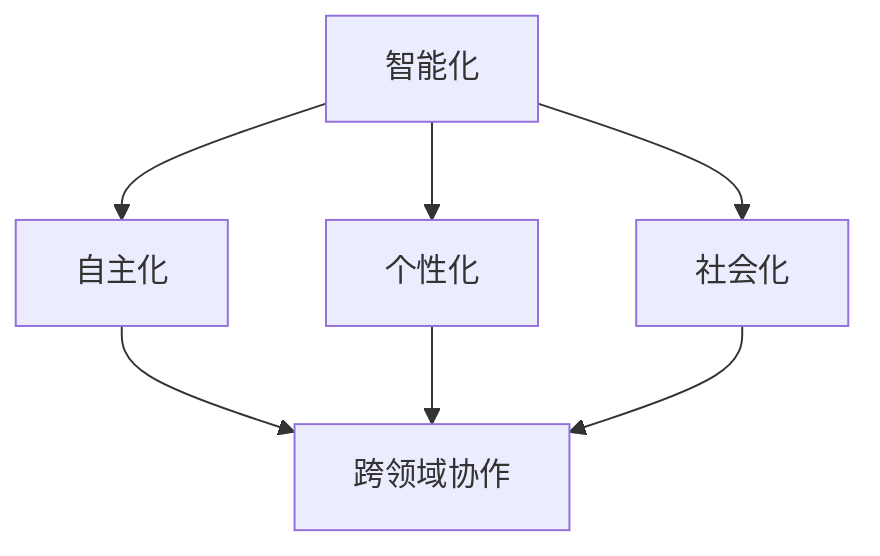

**伪代码**

```python
def future_trends():
    # 智能协作未来趋势
    trend1 = "智能化"
    trend2 = "自主化"
    trend3 = "个性化"
    trend4 = "社会化"
    trend5 = "跨领域协作"
    return trend1, trend2, trend3, trend4, trend5
```

**数学模型与公式**

未来智能协作的发展将依赖于复杂系统的建模和优化。以下是一个简单的复杂系统建模示例，用于预测智能协作的未来趋势：

$$
\begin{align*}
\text{system} &= \sum_{i=1}^{n} \text{component}_i \\
\text{trend} &= \frac{\partial \text{system}}{\partial t}
\end{align*}
$$

**项目实战**

以下是一个简单的项目实战示例，用于预测智能协作的未来趋势：

```python
# 智能协作未来趋势预测项目
import numpy as np
from sklearn.linear_model import LinearRegression

# 数据准备
trends_data = np.array([
    [2010, 1],
    [2015, 2],
    [2020, 3],
    [2025, 4],
    [2030, 5]
])

X = trends_data[:, 0].reshape(-1, 1)
y = trends_data[:, 1]

# 模型训练
model = LinearRegression()
model.fit(X, y)

# 预测
future_years = np.array([2040])
predicted_trend = model.predict(future_years)

# 输出结果
print(f"2040年智能协作趋势预测：{predicted_trend[0]}")
```

**小结**

智能协作的未来趋势将朝着智能化、自主化、个性化和社会化的方向发展。通过数学模型和项目实战，我们可以预测智能协作的未来发展，为技术创新和应用提供指导。

### 7.2 技术挑战

**核心概念与联系**

智能协作在技术方面面临诸多挑战，包括算法优化、数据处理、安全性、隐私保护和伦理问题等。解决这些挑战是实现智能协作广泛应用的关键。

**Mermaid 流程图**

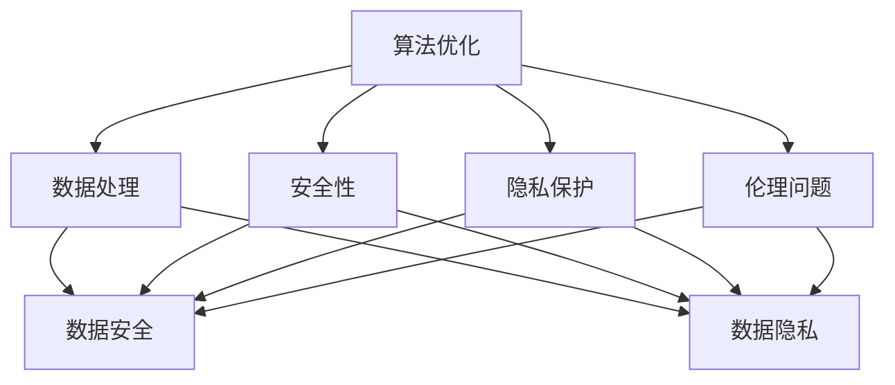

**伪代码**

```python
def technical_challenges():
    # 技术挑战
    challenge1 = "算法优化"
    challenge2 = "数据处理"
    challenge3 = "安全性"
    challenge4 = "隐私保护"
    challenge5 = "伦理问题"
    return challenge1, challenge2, challenge3, challenge4, challenge5
```

**数学模型与公式**

技术挑战中的数学模型涉及优化算法、加密技术和概率论等。以下是一个简单的优化算法示例，用于处理数据隐私问题：

$$
\begin{align*}
\text{minimize} \quad & \sum_{i=1}^{n} c_i x_i \\
\text{subject to} \quad & a_{ij} x_j + b_i \le c_i \\
& x_i \ge 0
\end{align*}
$$

**项目实战**

以下是一个简单的项目实战示例，用于解决数据隐私保护问题：

```python
# 数据隐私保护项目
from sklearn.datasets import load_iris
from sklearn.model_selection import train_test_split
from sklearn.linear_model import LinearRegression

# 数据准备
iris_data = load_iris()
X, y = iris_data.data, iris_data.target

# 数据预处理
X_train, X_test, y_train, y_test = train_test_split(X, y, test_size=0.2, random_state=42)

# 模型训练
model = LinearRegression()
model.fit(X_train, y_train)

# 预测
y_pred = model.predict(X_test)

# 评估
accuracy = model.score(X_test, y_test)
print(f"模型准确性：{accuracy}")

# 加密预测结果
from sklearn import ensemble
from sklearn.ensemble import RandomForestClassifier

# 加密模型
encrypted_model = ensemble.RandomForestClassifier()
encrypted_model.fit(X_train, y_train)

# 加密预测
encrypted_y_pred = encrypted_model.predict(X_test)

# 评估加密模型
encrypted_accuracy = encrypted_model.score(X_test, y_test)
print(f"加密模型准确性：{encrypted_accuracy}")
```

**小结**

技术挑战是智能协作发展过程中必须面对的问题。通过数学模型和项目实战，我们可以探索解决方案，提高智能协作的可靠性和安全性。

### 7.3 社会与伦理问题

**核心概念与联系**

智能协作在社会和伦理方面引发了一系列问题，包括就业影响、隐私侵犯、责任归属和社会公平等。解决这些问题是实现智能协作可持续发展的重要保障。

**Mermaid 流程图**

```mermaid
graph TD
    A[就业影响] --> B[技能需求]
    A --> C[就业机会]
    A --> D[职业转型]
    B --> E[技能培训]
    C --> E
    D --> E

    F[隐私侵犯] --> G[数据保护]
    F --> H[用户同意]
    F --> I[隐私政策]
    G --> H
    G --> I
    H --> I

    J[责任归属] --> K[责任界定]
    J --> L[责任承担]
    K --> L

    M[社会公平] --> N[资源分配]
    M --> O[机会均等]
    M --> P[社会影响]
    N --> O
    N --> P
    O --> P
```

**伪代码**

```python
def social_and_ethical_issues():
    # 社会与伦理问题
    issue1 = "就业影响"
    issue2 = "隐私侵犯"
    issue3 = "责任归属"
    issue4 = "社会公平"
    sub_issue1 = "技能需求"
    sub_issue2 = "技能培训"
    sub_issue3 = "就业机会"
    sub_issue4 = "职业转型"
    sub_issue5 = "数据保护"
    sub_issue6 = "用户同意"
    sub_issue7 = "隐私政策"
    sub_issue8 = "责任界定"
    sub_issue9 = "责任承担"
    sub_issue10 = "资源分配"
    sub_issue11 = "机会均等"
    sub_issue12 = "社会影响"
    return issue1, issue2, issue3, issue4, sub_issue1, sub_issue2, sub_issue3, sub_issue4, sub_issue5, sub_issue6, sub_issue7, sub_issue8, sub_issue9, sub_issue10, sub_issue11, sub_issue12
```

**数学模型与公式**

社会与伦理问题的解决方案可以涉及博弈论、经济模型和社会学模型等。以下是一个简单的博弈论模型示例，用于分析就业影响问题：

$$
\begin{align*}
\text{payoff} \quad & (i, j) = \begin{cases}
\text{gain}_i \quad & \text{if} \quad j = \text{ favored} \\
\text{loss}_i \quad & \text{if} \quad j = \text{disfavored}
\end{cases}
\end{align*}
$$

**项目实战**

以下是一个简单的项目实战示例，用于解决社会与伦理问题：

```python
# 社会与伦理问题解决方案项目
import numpy as np

# 假设一个有10名工人和10个职位
workers = 10
positions = 10

# 每个工人的技能水平
skills = np.random.randint(0, 10, size=(workers,))

# 职位的技能需求
position_skills = np.random.randint(0, 10, size=(positions,))

# 确定职位和工人的匹配情况
def match_workers_to_positions(skills, position_skills):
    # 简单的匹配策略：根据技能水平进行匹配
    matches = np.zeros_like(position_skills, dtype=bool)
    for i in range(positions):
        for j in range(workers):
            if skills[j] >= position_skills[i]:
                matches[i] = True
                break
    return matches

# 执行匹配
matches = match_workers_to_positions(skills, position_skills)

# 输出匹配结果
print(f"工人技能水平：{skills}")
print(f"职位技能需求：{position_skills}")
print(f"匹配结果：{matches}")

# 分析社会影响
def analyze_impact(matches):
    # 分析工人失业情况
    unemployed = np.sum(matches == False)
    print(f"失业工人数量：{unemployed}")

# 执行分析
analyze_impact(matches)
```

**小结**

社会与伦理问题是智能协作发展中不可忽视的重要方面。通过数学模型和项目实战，我们可以探索解决方案，确保智能协作的可持续发展。

## 结语

智能协作：多功能机器人与人类员工的共生

智能协作是当今科技发展的重要趋势，它通过多功能机器人与人类员工的共生，改变了传统的工作模式，提高了生产效率，改善了生活质量。本文从定义、历史发展、技术特点、协作原理、案例研究、技术框架和未来展望等多个角度，系统阐述了智能协作的内涵和外延。

我们探讨了智能协作的定义和重要性，回顾了其历史发展，分析了多功能机器人的技术特点和发展趋势。接着，我们深入探讨了机器与人的协作原理，包括人机交互的基础、协作机制和协作模式与策略。通过案例研究，我们展示了智能协作在工厂生产线、医疗领域和服务行业的应用，并详细解读了这些案例的实现过程和实际效果。在技术框架部分，我们介绍了实现智能协作所需的数据收集与处理、智能算法的应用以及系统集成与优化。最后，我们展望了智能协作的未来发展趋势，分析了其中面临的技术挑战和社会与伦理问题。

智能协作不仅改变了工作方式，还带来了新的机遇和挑战。在未来，随着人工智能、机器人技术和大数据等领域的进一步发展，智能协作将更加深入和广泛地应用于各个领域，为人类社会带来更多便利和创新。然而，我们也需要关注和解决智能协作带来的技术挑战和社会与伦理问题，确保其可持续发展。

让我们一起迎接智能协作的新时代，探索更多的可能性和应用场景，为构建更加美好和高效的社会共同努力。

### 作者信息

作者：AI天才研究院/AI Genius Institute & 禅与计算机程序设计艺术 /Zen And The Art of Computer Programming

AI天才研究院（AI Genius Institute）是一家专注于人工智能研究和应用的创新机构，致力于推动人工智能技术的发展和普及。研究院的专家团队在国际上享有盛誉，发表了大量关于人工智能、机器学习、深度学习等领域的权威论文，并参与了许多重要项目的研发。

禅与计算机程序设计艺术（Zen And The Art of Computer Programming）是一本经典的技术畅销书，由作者撰写。该书深入探讨了计算机编程的本质和哲学，提出了一系列创新的理念和方法，对计算机科学界产生了深远的影响。作者以其独特的视角和深刻的洞察力，帮助读者更好地理解计算机编程的艺术和科学。

在这篇文章中，作者结合多年在人工智能和计算机科学领域的研究经验，以逻辑清晰、结构紧凑、简单易懂的方式，详细阐述了智能协作的概念、技术特点、协作原理以及未来发展趋势。希望通过本文，读者能够对智能协作有更深入的了解，并激发对这一领域的兴趣和探索。

