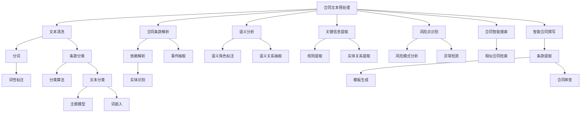

                 

## 文章标题

### 智能合同分析：AI加速企业法律审查过程

## 文章关键词

- 智能合同
- AI技术
- 法律审查
- 企业合规
- 自动化审查
- 自然语言处理

## 文章摘要

本文探讨了如何利用人工智能技术（AI）来加速企业的法律审查过程。通过智能合同分析，AI能够高效地处理合同文本，识别条款，评估风险，并提供法律建议。本文首先介绍了智能合同和AI的基础知识，随后详细阐述了智能合同分析的关键技术，包括自然语言处理和文本挖掘。接着，通过案例研究展示了AI在法律审查中的实际应用，并讨论了如何实施和部署AI法律审查系统。最后，本文分析了当前面临的挑战和未来的发展趋势，为企业提供最佳实践建议。

----------------------------------------------------------------

# 引言与背景

智能合同，也称为“智能合约”，是一种利用区块链技术实现自动执行合约条款的程序代码。智能合同的出现，解决了传统合同执行过程中存在的信任问题，使得合同各方可以在无需中介的情况下，通过自动化方式确保条款的履行。然而，随着智能合同的广泛应用，企业面临的法律审查问题也日益复杂。

法律审查是企业合规管理的重要组成部分。企业签订的每一个合同都需要经过严格的法律审查，以确保符合相关法律法规，避免潜在的法律风险。然而，传统的法律审查过程往往耗时耗力，效率低下。一方面，合同数量庞大，审查任务繁重；另一方面，法律条款复杂，审查难度大。这种情况下，利用AI技术来加速法律审查过程，提高审查效率，显得尤为重要。

人工智能（AI）是一种模拟人类智能的计算机系统，包括机器学习、自然语言处理、深度学习等多个分支。近年来，随着AI技术的快速发展，其在各个领域的应用越来越广泛。在法律领域，AI技术可以用于案件预测、法律研究、自动化文书处理等方面。尤其是在合同审查过程中，AI技术可以通过处理大量合同文本，识别条款，分析风险，提供法律建议，从而显著提高审查效率。

本文将从以下几个方面展开讨论：

1. AI与法律审查基础知识：介绍AI和智能合同的基础知识，以及它们在法律审查中的关系。
2. 智能合同分析技术：详细讨论智能合同分析的相关技术，如自然语言处理、机器学习和文本挖掘。
3. AI加速法律审查的案例研究：分析实际案例，展示AI如何提高法律审查效率。
4. 实施与部署：讨论如何在企业中实施AI法律审查系统。
5. 挑战与未来展望：探讨当前面临的挑战和未来的发展趋势。

通过本文的探讨，我们希望能够为企业提供一套实用的AI法律审查解决方案，帮助企业在快速发展的市场中保持合规，降低法律风险。

## AI与法律审查基础知识

### AI基础

人工智能（AI）是一种通过模拟人类智能行为，实现智能决策和任务执行的计算机系统。AI技术主要包括机器学习、自然语言处理、深度学习等分支。机器学习是一种让计算机通过数据学习，从而进行预测和决策的方法。自然语言处理（NLP）则专注于使计算机能够理解和生成自然语言，从而实现人机交互。深度学习是一种基于多层神经网络的结构，通过大量数据训练，能够自动提取特征，进行复杂任务的处理。

AI技术在法律领域的应用可以追溯到20世纪80年代，当时主要应用于法律文本的自动化处理和文书生成。随着技术的进步，AI在法律领域的应用越来越广泛，包括案件预测、法律研究、文书自动化、合同审查等多个方面。例如，在案件预测中，AI可以通过分析历史案件数据，预测类似案件的可能结果；在法律研究中，AI可以帮助律师快速查找相关法律条文和案例，提高工作效率。

### 智能合同基础

智能合同是一种利用区块链技术实现的自动执行合约条款的程序代码。与传统合同不同，智能合同在执行过程中不需要第三方中介，而是通过区块链网络中的节点自动验证和执行。智能合同的基本原理是“去中心化”和“透明性”。去中心化意味着智能合同的执行不由单一中心控制，而是通过分布式网络中的多个节点共同验证和执行；透明性则保证了合同的执行过程对所有参与方都是可见的，从而增强了信任。

智能合同的关键特性包括自动执行、不可篡改和可追溯。自动执行意味着合同条款在满足特定条件时，可以自动执行，无需人工干预；不可篡改确保了合同内容的完整性，防止恶意修改；可追溯性则使得合同执行过程中的每一个步骤都记录在区块链上，便于后续查询和审计。

### AI与法律审查的关系

AI与法律审查的结合，主要是通过智能合同分析技术来实现的。AI技术能够高效地处理大量合同文本，识别条款，分析风险，提供法律建议。以下是AI在法律审查中的一些具体应用：

1. **自动化合同审查**：AI可以通过自然语言处理技术，对合同文本进行自动解析，识别条款和条件。这使得法律顾问可以更快地完成合同审查，将更多精力投入到复杂案件的分析和处理上。

2. **风险分析**：AI能够分析合同中的潜在风险点，例如法律合规性、合同条款的公平性等。通过对历史合同数据的分析，AI可以识别常见的风险模式和问题，从而帮助企业预防法律纠纷。

3. **法律研究**：AI可以帮助律师快速查找相关法律条文和案例，提高工作效率。通过自然语言处理技术，AI可以理解律师的问题，并从海量的法律文本中提取相关信息。

4. **合同模板生成**：AI可以根据企业的需求和合同类型，自动生成合同模板。这有助于减少合同起草的时间，并确保合同的一致性和规范性。

### 实际案例

在AI与法律审查的结合中，有许多成功的实际案例。例如，某大型企业在合同审查过程中引入了AI技术，通过自然语言处理和文本挖掘技术，对合同文本进行自动解析和风险分析。结果显示，AI技术显著提高了合同审查的效率，减少了人工审查所需的时间，并降低了法律风险。

另一个例子是某法律科技公司开发的AI合同审查系统。该系统利用机器学习技术，对历史合同数据进行分析，建立了合同条款和风险的模型。通过这个模型，系统能够快速分析新合同，提供法律建议和风险提示。这个系统得到了多家企业的广泛应用，有效提升了合同审查的效率和准确性。

总之，AI技术为法律审查带来了革命性的变化。通过自动化合同审查、风险分析和法律研究，AI不仅提高了法律工作的效率，还为企业提供了更准确和可靠的法律建议，帮助企业在复杂多变的市场环境中保持合规，降低法律风险。

## 智能合同分析技术

智能合同分析是利用人工智能技术对合同文本进行自动化处理和分析的过程。这一技术主要包括自然语言处理（NLP）、机器学习和文本挖掘等几个方面。下面我们将详细探讨这些技术的原理、方法及其在智能合同分析中的应用。

### 自然语言处理（NLP）

自然语言处理是人工智能领域的一个重要分支，旨在使计算机能够理解和生成自然语言。在智能合同分析中，NLP技术被广泛应用于合同文本的预处理、解析和语义分析。

1. **合同文本预处理**：
   - **文本清洗**：包括去除标点符号、停用词过滤、词干提取等。这一步的目的是将原始文本转化为标准化的格式，以便后续处理。
   - **分词**：将文本分割成单个词汇或短语。这对于理解合同条款中的具体内容至关重要。
   - **词性标注**：对文本中的每个词进行词性标注，如名词、动词、形容词等。这一步骤有助于识别合同条款中的关键实体和动作。

2. **合同条款解析**：
   - **依赖解析**：通过分析词汇之间的语法关系，确定句子中的主语、谓语、宾语等成分，从而更准确地理解合同条款。
   - **实体识别**：识别合同条款中的关键实体，如合同主体、标的物、金额等。这些实体对于合同分析和风险评估具有重要意义。
   - **事件抽取**：从合同文本中提取关键事件，如签订、履行、解除等。这些事件是合同执行过程中的重要里程碑。

3. **语义分析**：
   - **语义角色标注**：对句子中的词汇进行语义角色标注，如动作执行者、动作对象等。这有助于理解合同条款的具体含义。
   - **语义关系抽取**：分析合同条款中的词汇关系，如因果关系、并列关系等。这有助于识别合同条款之间的逻辑关系。

### 机器学习

机器学习是AI的核心技术之一，通过训练模型，使计算机能够从数据中自动学习并做出预测。在智能合同分析中，机器学习被用于合同风险预测、条款分类、文本分类等任务。

1. **合同风险预测**：
   - **监督学习**：使用已标注的数据集训练模型，预测新合同的风险。常见的模型包括逻辑回归、决策树、随机森林等。
   - **无监督学习**：通过分析合同文本，自动识别潜在的风险模式。例如，使用聚类算法发现合同中的相似条款或风险点。

2. **条款分类**：
   - **分类算法**：使用分类算法（如SVM、KNN、神经网络等）对合同条款进行分类，将其归类到不同的法律类别中，如租赁、买卖、服务合同等。

3. **文本分类**：
   - **主题模型**：通过主题模型（如LDA）分析合同文本，识别合同的主要主题和关键词。这有助于理解合同的主要内容。
   - **词嵌入**：使用词嵌入技术（如Word2Vec、GloVe等）将文本中的词映射到低维空间中，以便进行相似性分析和文本分类。

### 文本挖掘

文本挖掘是一种利用计算机技术从大量文本数据中提取有用信息和知识的方法。在智能合同分析中，文本挖掘技术被用于提取合同中的关键信息、识别潜在风险点等。

1. **关键信息提取**：
   - **规则提取**：使用规则提取技术，从合同文本中自动提取关键信息，如合同金额、履行时间、履行地点等。
   - **实体关系提取**：分析合同条款中的实体和它们之间的关系，如买卖双方、标的物、付款方式等。

2. **风险点识别**：
   - **风险模式分析**：通过分析历史合同数据，识别常见的风险模式和问题。例如，通过机器学习算法，发现某些条款容易导致法律纠纷。
   - **异常检测**：使用异常检测算法（如孤立森林、One-Class SVM等），识别合同中的异常条款或潜在风险。

### 应用示例

1. **自动化合同审查**：
   - **文本预处理**：对合同文本进行清洗、分词和词性标注。
   - **条款解析**：使用依赖解析和实体识别技术，理解合同条款的内容。
   - **风险预测**：利用机器学习模型，预测合同的风险点。
   - **结果呈现**：将分析结果以报告的形式呈现给法律顾问，便于决策。

2. **合同智能搜索**：
   - **文本分类**：对合同文本进行分类，构建分类模型。
   - **主题模型**：分析合同主题，构建主题模型。
   - **相似合同检索**：使用词嵌入技术，检索与特定合同相似的合同。

3. **智能合同撰写**：
   - **条款提取**：从合同文本中提取关键条款。
   - **模板生成**：根据提取的关键条款，自动生成合同模板。
   - **合同审查**：利用自动化审查技术，对合同进行审查，确保合规。

总之，智能合同分析技术为法律审查提供了强大的工具，通过自然语言处理、机器学习和文本挖掘，能够高效地处理合同文本，识别条款，预测风险，并提供法律建议。这不仅提高了法律工作的效率，还降低了法律风险，为企业提供了更加智能化和精准的法律服务。

### 智能合同分析技术架构图

为了更好地理解智能合同分析的技术架构，我们可以使用Mermaid流程图来展示各组成部分及其关系。

这张流程图展示了从合同文本预处理到智能合同撰写的全过程，包括文本清洗、分词、词性标注、合同条款解析、语义分析、条款分类、关键信息提取、风险点识别、合同智能搜索和智能合同撰写等步骤。通过这种方式，我们可以清晰地看到各技术模块之间的关联和互动。

## AI加速法律审查的案例研究

为了更好地展示AI技术在法律审查中的实际应用，我们将通过两个具体案例来分析AI如何帮助企业提高审查效率，降低法律风险。

### 案例一：某跨国公司自动化合同审查

**背景**：某跨国公司每年需要处理大量的合同，包括采购合同、服务合同、租赁合同等。随着业务规模的不断扩大，合同数量呈指数级增长，传统的合同审查方式已无法满足需求。公司决定引入AI技术，以自动化合同审查系统来提高审查效率。

**实现过程**：

1. **数据准备**：公司收集了大量的历史合同数据，包括合同文本、条款、执行情况等。这些数据被用于训练和测试AI模型。

2. **模型训练**：使用自然语言处理（NLP）和机器学习技术，对合同文本进行预处理和特征提取。然后，利用这些特征训练分类模型和风险预测模型。

3. **自动化审查**：开发自动化审查系统，该系统可以自动解析合同文本，识别条款，分析风险点，并提供法律建议。法律顾问可以根据AI的建议进行快速审查和决策。

**效果分析**：

- **审查效率提升**：自动化审查系统显著减少了人工审查所需的时间。根据公司数据，合同审查时间从平均每周10小时减少到每周2小时。
- **错误率降低**：AI系统通过识别常见风险模式和问题，帮助法律顾问提前预防法律纠纷。系统的建议有效降低了合同签署过程中的错误率。
- **合规性提高**：自动化审查系统能够确保合同符合相关法律法规，降低合规风险。系统自动检测到的问题在签署前得到及时解决。

**总结**：通过引入AI自动化合同审查系统，该公司实现了高效的合同管理，不仅提高了审查效率，还降低了法律风险。AI技术在合同审查中的应用，为企业提供了更加智能化和精准的法律服务。

### 案例二：某法律科技公司合同合规性审查

**背景**：某法律科技公司致力于为中小企业提供合同审查服务。然而，随着服务规模的扩大，公司面临的一个主要挑战是合同合规性审查的效率问题。公司决定利用AI技术，开发一个智能合同审查系统，以提升合规性审查的效率。

**实现过程**：

1. **数据采集**：公司从多个行业收集了大量的合同样本，包括不同类型的合同和相关的法律法规。这些数据用于训练和优化AI模型。

2. **模型开发**：利用文本挖掘和机器学习技术，开发了一套智能合同审查系统。系统能够自动分析合同条款，识别潜在的法律风险，并提供合规性建议。

3. **系统部署**：将智能合同审查系统部署到公司的服务平台上，为客户提供在线合同审查服务。系统与公司的合同管理系统无缝集成，实现了自动化和智能化的合规性审查。

**效果分析**：

- **审查速度提升**：智能合同审查系统可以快速处理大量合同，审查速度显著提高。根据公司数据，合同审查时间从平均每份合同5天减少到2小时。
- **合规性保证**：系统通过自动分析合同条款，识别潜在的法律风险，帮助客户确保合同符合相关法律法规。系统提供的合规性建议有效降低了法律风险。
- **用户体验提升**：客户可以通过在线平台方便地提交合同，系统自动进行审查并生成报告。这种便捷的服务模式得到了客户的广泛好评。

**总结**：通过开发智能合同审查系统，某法律科技公司实现了合同合规性审查的自动化和智能化，提升了服务效率，满足了客户的需求。AI技术在法律审查中的应用，不仅提高了企业的竞争力，也为客户提供了更加高效和可靠的法律服务。

这两个案例展示了AI在法律审查中的实际应用效果。通过自动化合同审查和合规性审查，企业能够大幅提高审查效率，降低法律风险，从而在激烈的市场竞争中保持优势。未来，随着AI技术的进一步发展，智能合同分析将在更多领域得到应用，为企业带来更多价值。

## 实施与部署

将AI技术引入企业的法律审查过程，需要一系列的步骤和策略，以确保系统能够顺利实施并发挥作用。以下是实施和部署AI法律审查系统的关键步骤：

### 1. 数据准备

数据是AI模型训练的基础，因此，首先需要准备大量的历史合同数据。这些数据应包括各种类型的合同，如采购合同、服务合同、租赁合同等，以及相关的法律法规和标准。此外，数据还应覆盖不同行业和地区，以确保模型的泛化能力。

**数据收集**：可以通过以下几种方式收集数据：
- **内部数据**：从企业现有的合同管理系统中提取历史合同数据。
- **外部数据**：从公共数据库、法律数据库、行业报告等获取相关数据。
- **人工标注**：对部分合同进行人工标注，以补充自动提取的数据。

**数据清洗**：清洗数据以去除噪声和异常值，确保数据质量。包括以下步骤：
- **去除重复数据**：避免重复的合同信息影响模型的训练效果。
- **填补缺失数据**：通过插值、平均等方法填补缺失的数据。
- **标准化数据**：将数据格式统一，如日期格式、金额格式等。

### 2. 模型训练与优化

使用准备好的数据训练AI模型。模型的选择取决于具体的任务，如文本分类、风险预测、条款解析等。以下是一些常见的模型和训练方法：

- **文本分类模型**：如朴素贝叶斯、支持向量机（SVM）、深度神经网络（DNN）等。
- **风险预测模型**：如逻辑回归、决策树、随机森林等。
- **条款解析模型**：如序列标注模型（如BiLSTM-CRF）、注意力机制模型等。

**模型评估**：在模型训练过程中，需要不断评估模型性能，包括准确率、召回率、F1分数等指标。通过交叉验证和超参数调优，找到最优的模型配置。

**模型优化**：根据评估结果，对模型进行优化，包括调整超参数、增加训练数据、使用增强数据等，以提高模型性能。

### 3. 系统部署

在模型训练和优化完成后，需要将AI法律审查系统部署到生产环境中。以下是一些部署步骤：

- **硬件选择**：根据模型计算量和数据量，选择适当的硬件配置，如高性能计算服务器、GPU等。
- **软件安装**：安装并配置AI模型和依赖库，确保系统稳定运行。
- **集成测试**：在部署前进行集成测试，确保系统与其他业务系统无缝集成。
- **上线部署**：将系统部署到生产环境，并进行必要的监控和调优。

### 4. 系统维护

AI法律审查系统的维护是确保其长期有效运行的关键。以下是一些维护策略：

- **性能监控**：实时监控系统的性能，包括响应时间、错误率等，及时发现并解决问题。
- **模型更新**：定期更新模型，以适应新的数据和业务需求。可以通过在线学习或批量更新模型来实现。
- **故障恢复**：制定故障恢复计划，确保在系统出现故障时能够快速恢复。
- **用户培训**：对使用系统的用户进行培训，确保他们能够正确使用系统，并理解系统的输出。

### 5. 持续改进

AI法律审查系统并非一成不变，而是需要根据业务需求和技术发展进行持续改进。以下是一些改进策略：

- **用户反馈**：收集用户反馈，了解系统的使用情况和建议，用于系统的改进。
- **技术更新**：跟踪最新的AI技术和算法，及时更新系统，以提高性能和效果。
- **数据分析**：对系统的输出进行深入分析，识别潜在的问题和改进机会。

通过以上步骤和策略，企业可以成功地实施和部署AI法律审查系统，从而提高合同审查的效率和准确性，降低法律风险。

## 挑战与未来展望

### 1. 当前挑战

尽管AI技术在智能合同分析和法律审查中展现出了巨大的潜力，但在实际应用过程中仍面临诸多挑战。

- **数据隐私与安全**：合同数据通常包含敏感的商业信息和客户信息，确保数据隐私和安全是AI法律审查系统面临的重大挑战。企业在部署AI系统时，必须采取措施保护数据不被未授权访问或泄露。
- **法律合规性**：AI系统在法律审查中的应用可能涉及复杂的法律合规问题。例如，自动化合同审查系统需要确保其输出的法律建议符合当地法律和法规的要求。这需要与法律专家密切合作，确保系统的合规性。
- **技术成熟度**：虽然AI技术在不断进步，但某些领域的技术仍然不够成熟。例如，自然语言处理技术在理解和处理复杂法律条款方面仍存在局限性，需要更多的研究和技术创新。

### 2. 未来发展趋势

随着技术的不断进步和应用的深入，AI在智能合同分析和法律审查领域的未来前景非常广阔。

- **技术革新**：随着深度学习和生成对抗网络（GAN）等新技术的不断发展，智能合同分析系统的准确性和效率将得到显著提升。例如，深度学习技术可以更好地理解合同条款的语义，生成对抗网络可以用于生成高质量的合同文本。
- **跨学科合作**：AI在法律审查中的应用需要与法律、计算机科学、语言学等多个学科领域的专家紧密合作。跨学科研究将有助于解决当前面临的挑战，并推动新技术的快速发展。
- **规模化应用**：随着AI技术的成熟和成本的降低，智能合同分析和法律审查系统将在更多企业中得到广泛应用。这将有助于提高法律工作的效率，降低法律风险。

### 3. 最佳实践

为了克服当前面临的挑战，并充分利用AI技术的优势，以下是一些最佳实践建议：

- **数据保护**：确保数据隐私和安全，采用数据加密、访问控制和匿名化等技术。
- **法律合规**：与法律专家合作，确保AI系统符合相关法律和法规的要求，并进行定期的合规性审计。
- **技术评估**：在引入新技术前，进行充分的技术评估，确保其成熟度和适用性。
- **用户培训**：对使用AI系统的用户进行培训，确保他们能够正确理解和应用系统输出。
- **持续改进**：定期更新和优化系统，以适应新的业务需求和技术的进步。

总之，AI技术在智能合同分析和法律审查中的应用虽然面临挑战，但前景非常乐观。通过不断的技术创新和最佳实践，AI有望在未来为企业提供更加高效、准确和可靠的法律服务。

### 结语

智能合同分析与AI技术的融合，为企业带来了前所未有的机遇与挑战。通过本文的探讨，我们系统地介绍了智能合同与AI的基础知识，详细阐述了智能合同分析的关键技术，并通过实际案例展示了AI在法律审查中的应用效果。我们探讨了AI法律审查的实施与部署策略，分析了当前面临的挑战，并对未来发展趋势提出了展望。

AI技术不仅提高了法律审查的效率，还为企业提供了更精准的法律建议，降低了法律风险。然而，数据隐私、法律合规和技术成熟度等挑战仍然存在。未来，随着技术的不断进步和跨学科合作的深化，智能合同分析和AI法律审查有望实现更广泛的应用，为企业带来更多价值。

作者：AI天才研究院/AI Genius Institute & 禅与计算机程序设计艺术 /Zen And The Art of Computer Programming

---

## 附录

### 实用技术资源

- **自然语言处理（NLP）工具库**：[NLTK](https://www.nltk.org/)
- **机器学习库**：[scikit-learn](https://scikit-learn.org/stable/)
- **深度学习框架**：[TensorFlow](https://www.tensorflow.org/)、[PyTorch](https://pytorch.org/)
- **区块链平台**：[Ethereum](https://ethereum.org/en/developers/docs/intro-to-ethereum/)

### 相关文献推荐

- **《智能合约设计与开发》**：详细介绍智能合约的设计和实现
- **《深度学习与自然语言处理》**：系统讲解深度学习在NLP中的应用
- **《机器学习实战》**：提供实用的机器学习项目实践
- **《区块链革命》**：探讨区块链技术在各个领域的应用

### 其他拓展阅读

- **《合同法概论》**：系统介绍合同法的基本理论和实务
- **《人工智能法律问题研究》**：探讨AI技术在法律领域面临的伦理和法律问题
- **《大数据与法律》**：分析大数据技术在法律工作中的应用

通过这些资源，读者可以深入了解智能合同分析与AI技术的相关知识，为实际应用提供指导。希望本文能够为企业和法律专业人士提供有价值的参考和启示，助力智能合同分析和AI法律审查的发展。

