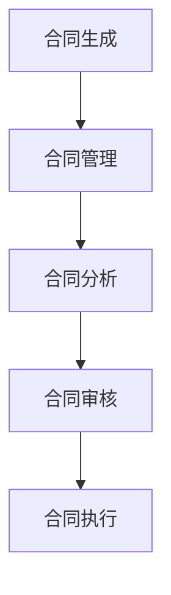
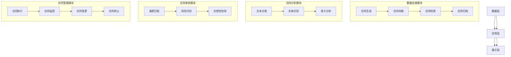

                 

### 文章标题

# 智能合同管理系统：AI提升法务效率

### 关键词

- **智能合同管理系统**
- **人工智能技术**
- **法务效率提升**
- **合同分析**
- **合同审核**
- **合同管理**

### 摘要

随着商业活动的日益复杂化和合同量的持续增长，传统的合同管理方法已经难以满足现代企业的需求。智能合同管理系统应运而生，它利用人工智能技术，自动化和智能化地处理合同生命周期中的各个环节，从而显著提升法务工作效率。本文将深入探讨智能合同管理系统的概念、架构设计、AI技术在合同分析、审核和管理中的应用，并通过实际案例展示其效果，分析未来的发展趋势与挑战，以期为读者提供全面而深刻的理解。

## 前言

在现代商业环境中，合同是企业和个人进行业务往来的重要法律文件。传统的合同管理方法依赖于人工处理，存在效率低下、易出错、难以追溯等问题。随着大数据、云计算和人工智能技术的迅猛发展，智能合同管理系统逐渐成为企业提升法务效率的有效工具。本文旨在系统地介绍智能合同管理系统的基本概念、架构设计，以及AI技术在该系统中的应用，帮助读者了解这一新兴技术，并探讨其在未来可能的发展趋势和面临的挑战。

本文的结构如下：

- **第1章：智能合同管理系统的概述**，介绍智能合同管理系统的基本概念、发展历程和主要组成部分。
- **第2章：AI技术基础**，讲解AI技术的基本概念、常见算法和应用场景。
- **第3章：智能合同管理系统架构设计**，详细介绍智能合同管理系统的整体架构设计和关键模块。
- **第4章：AI在合同分析中的应用**，讲解AI在合同分析中的应用，如文本分类、实体识别、语义分析等。
- **第5章：AI在合同审核中的应用**，讲解AI在合同审核中的应用，如条款匹配、风险识别、合规性检测等。
- **第6章：AI在合同管理中的应用**，讲解AI在合同管理中的优化，如合同生命周期管理、自动化执行、智能预警等。
- **第7章：案例研究**，通过实际案例展示智能合同管理系统在实践中的应用效果。
- **第8章：未来发展趋势与挑战**，分析智能合同管理系统的发展趋势和面临的挑战。

通过本文的阅读，读者将能够全面了解智能合同管理系统的工作原理和实际应用，为企业在法务领域的数字化转型提供参考和启示。

## 第1章：智能合同管理系统的概述

### 1.1 智能合同管理系统简介

智能合同管理系统是一种基于人工智能技术，能够自动化和智能化地处理合同全生命周期的管理系统。它不仅涵盖了合同生成、合同管理、合同审核等传统功能，还引入了先进的AI技术，如自然语言处理（NLP）、机器学习（ML）和深度学习（DL），以提升合同处理的效率和准确性。

智能合同管理系统的作用主要体现在以下几个方面：

1. **提升合同处理效率**：通过自动化合同生成、分类、分析和审核，减少人工干预，提高处理速度。
2. **降低合同管理成本**：自动化处理合同，减少人力资源的消耗，降低运营成本。
3. **减少法律风险**：通过条款匹配、风险识别和合规性检测，提前发现潜在的法律风险，减少企业损失。
4. **增强合同管理规范性**：确保合同格式和内容的标准化，提高合同管理的规范性。
5. **提供决策支持**：通过对合同数据的深度分析，为企业的决策提供数据支持，优化业务流程。

### 1.2 智能合同管理系统的发展历程

智能合同管理系统的发展可以追溯到20世纪90年代，当时企业开始采用计算机化的合同管理系统来替代传统的纸质合同处理方式。随着互联网和大数据技术的兴起，合同管理系统逐渐向智能化方向演进。以下是智能合同管理系统的发展历程：

- **早期阶段**（1990s-2000s）：这一阶段主要关注合同生成和管理功能的自动化，通过电子合同和自动化签署工具来简化合同流程。
- **中期阶段**（2010s）：随着大数据和云计算技术的发展，合同管理系统开始引入数据分析和挖掘技术，对合同进行更深入的分析和管理。
- **当前阶段**（2020s）：随着人工智能技术的突破，智能合同管理系统逐渐成为企业提升法务效率的重要工具，AI技术在合同分析、审核和管理中的应用日益广泛。

### 1.3 智能合同管理系统的组成部分

智能合同管理系统通常由以下几个关键部分组成：

1. **合同生成模块**：利用模板和智能填写功能，自动化生成合同。
2. **合同管理模块**：实现合同的全生命周期管理，包括合同的存储、检索、分类和归档。
3. **合同分析模块**：利用自然语言处理和机器学习技术，对合同文本进行分类、实体识别和语义分析。
4. **合同审核模块**：通过条款匹配和风险识别，自动审核合同，确保合同内容的合法性和规范性。
5. **合同执行模块**：监控合同执行过程，自动执行合同条款，进行智能预警和提醒。

### 智能合同管理系统的核心概念原理与联系

智能合同管理系统的核心概念主要包括合同生成、合同分析、合同审核和合同执行。这些概念之间的联系可以通过以下Mermaid流程图进行展示：



在智能合同管理系统中，合同生成模块通过模板和智能填写功能，自动化生成合同。生成的合同进入合同管理模块，实现合同的存储、检索、分类和归档。合同管理模块会定期将合同数据传输到合同分析模块，进行文本分类、实体识别和语义分析。分析结果反馈给合同审核模块，进行条款匹配和风险识别，确保合同内容的合法性和规范性。审核通过的合同进入合同执行模块，监控合同执行过程，进行智能预警和提醒。

通过上述流程，智能合同管理系统实现了从合同生成到执行的全过程自动化和智能化，显著提升了法务效率。

### 1.4 智能合同管理系统的优势

智能合同管理系统相比传统合同管理方法，具有以下显著优势：

1. **自动化处理**：通过AI技术，自动化完成合同生成、分析、审核和执行等环节，大幅减少人工干预。
2. **提高效率**：自动化处理合同，大大缩短合同处理时间，提高工作效率。
3. **降低成本**：减少人工处理合同所需的人力资源，降低运营成本。
4. **减少错误**：通过智能审核和风险识别，提前发现潜在问题，减少合同处理中的错误。
5. **增强合规性**：确保合同格式和内容的标准化，提高合同管理的合规性。
6. **数据驱动**：通过对合同数据的分析，为企业的决策提供数据支持，优化业务流程。

### 1.5 智能合同管理系统在法务效率提升中的作用

智能合同管理系统在法务效率提升中发挥着关键作用，主要体现在以下几个方面：

1. **自动化合同生成和审核**：智能合同管理系统可以自动化生成和审核合同，减少人工工作量，提高处理速度。
2. **文本分析和语义理解**：通过自然语言处理技术，智能合同管理系统可以对合同文本进行深入分析，提取关键信息，提高合同管理的准确性和效率。
3. **智能风险识别和预警**：系统可以自动识别合同中的潜在风险，并提前发出预警，帮助企业及时采取措施，避免法律纠纷。
4. **合同生命周期管理**：智能合同管理系统可以实现合同全生命周期的管理，从合同生成到执行，全程监控，确保合同的合法性和规范性。
5. **数据分析和决策支持**：通过对合同数据的深度分析，智能合同管理系统可以为企业的决策提供数据支持，优化业务流程，提升整体运营效率。

通过上述优势和应用，智能合同管理系统显著提升了法务效率，为企业的数字化转型和智能化管理提供了有力支持。

### 1.6 智能合同管理系统的实际应用场景

智能合同管理系统在多个行业中得到了广泛应用，以下是一些典型的实际应用场景：

1. **金融行业**：金融机构在业务往来中涉及大量合同，智能合同管理系统可以帮助银行、保险公司和证券公司自动化处理合同，提高效率，降低风险。
2. **制造业**：制造业企业需要进行大量的供应商合同和销售合同管理，智能合同管理系统可以自动化处理合同，确保合同内容的规范性和准确性。
3. **法律服务**：律师事务所和法律咨询服务公司可以利用智能合同管理系统来管理客户的合同，提高服务质量和效率。
4. **房地产**：房地产公司涉及大量的购房合同、租赁合同等，智能合同管理系统可以帮助企业自动化处理合同，提高工作效率，减少纠纷。
5. **电子商务**：电子商务平台需要处理大量的用户订单合同，智能合同管理系统可以自动化合同生成和审核，提高订单处理速度。

通过这些实际应用场景，智能合同管理系统在提升法务效率和合同管理质量方面发挥了重要作用。

### 1.7 小结

智能合同管理系统是一种基于人工智能技术的合同管理工具，通过自动化和智能化地处理合同全生命周期，显著提升了法务效率。其核心组成部分包括合同生成、合同管理、合同分析、合同审核和合同执行。智能合同管理系统在多个行业中得到了广泛应用，为企业的数字化转型提供了有力支持。随着技术的不断进步，智能合同管理系统将发挥越来越重要的作用，为企业的法务工作带来更多创新和便利。

## 第2章：AI技术基础

### 2.1 AI技术概述

人工智能（Artificial Intelligence，AI）是计算机科学的一个分支，致力于研究如何模拟、扩展和扩展人类的智能。AI的目标是通过机器学习、自然语言处理、计算机视觉、逻辑推理等技术，使计算机具备自我学习、自主决策和问题解决能力。

#### 2.1.1 AI技术的基本概念

- **智能代理**：模拟人类智能的计算机系统，能够感知环境、理解输入、做出决策并采取行动。
- **机器学习**：通过数据驱动的方法，使计算机自动从数据中学习并改进性能。
- **深度学习**：一种特殊的机器学习方法，通过神经网络模型，自动从大量数据中学习特征。
- **自然语言处理（NLP）**：研究如何使计算机理解和生成自然语言，如英文、中文等。
- **计算机视觉**：使计算机能够理解和解释数字图像和视频。
- **逻辑推理**：使用逻辑和规则进行推理，模拟人类的决策过程。

#### 2.1.2 AI技术的发展历程

AI技术的发展历程可以分为以下几个阶段：

- **早期探索**（1950s-1960s）：AI概念提出，科学家开始研究逻辑推理和问题解决算法。
- **第一次AI寒冬**（1970s-1980s）：由于技术不成熟，AI研究受到挫败，许多研究项目被取消。
- **复兴期**（1990s）：机器学习和深度学习技术得到发展，AI开始应用于实际场景。
- **AI崛起**（2000s-2010s）：随着大数据和计算能力的提升，AI技术取得显著突破，在语音识别、图像识别等领域取得成功。
- **智能时代**（2020s）：AI技术逐渐应用于各行各业，推动智能化转型。

#### 2.1.3 AI技术的应用场景

AI技术已经在许多领域得到广泛应用，以下是一些典型应用场景：

- **医疗健康**：通过医学影像分析、疾病预测等，提升医疗诊断和治疗水平。
- **金融**：通过风险评估、欺诈检测等，提升金融服务的安全性和效率。
- **交通**：通过自动驾驶、交通流量管理，提升交通安全和通行效率。
- **零售**：通过个性化推荐、库存管理，提升客户体验和经营效益。
- **制造业**：通过智能制造、设备维护，提升生产效率和质量。

### 2.2 常见AI算法介绍

#### 2.2.1 机器学习算法

机器学习算法是AI的核心组成部分，主要包括以下几种：

- **监督学习（Supervised Learning）**：通过标记好的训练数据，使模型学会预测未知数据。常见算法包括线性回归、决策树、支持向量机（SVM）等。

```python
# 线性回归的伪代码
def linear_regression(X, y):
    # 计算权重和偏置
    # 输出预测值
    return predictions
```

- **无监督学习（Unsupervised Learning）**：在无标记数据集上，使模型发现数据中的隐含结构和规律。常见算法包括K-均值聚类、主成分分析（PCA）等。

```python
# K-均值聚类的伪代码
def k_means_clustering(data, k):
    # 初始化聚类中心
    # 迭代更新聚类中心
    # 输出聚类结果
    return clusters
```

- **强化学习（Reinforcement Learning）**：通过与环境的互动，使模型学会最优策略。常见算法包括Q学习、深度Q网络（DQN）等。

```python
# Q学习的伪代码
def q_learning(state, action, reward, next_state, gamma):
    # 更新Q值
    # 输出最优策略
    return policy
```

#### 2.2.2 深度学习算法

深度学习是一种基于多层神经网络的机器学习算法，主要包括以下几种：

- **神经网络（Neural Networks）**：通过模拟人脑神经元结构，进行特征提取和分类。常见算法包括多层感知机（MLP）、卷积神经网络（CNN）等。

```python
# 多层感知机的伪代码
def neural_network(input_layer, hidden_layer_sizes, output_layer_size):
    # 定义网络结构
    # 训练模型
    # 输出预测结果
    return predictions
```

- **卷积神经网络（Convolutional Neural Networks, CNN）**：通过卷积操作，在图像等二维数据上提取特征。常见算法包括卷积层、池化层、全连接层等。

```python
# 卷积神经网络的伪代码
def convolutional_neural_network(input_layer, filter_size, pool_size):
    # 定义卷积层
    # 定义池化层
    # 定义全连接层
    # 训练模型
    # 输出预测结果
    return predictions
```

- **循环神经网络（Recurrent Neural Networks, RNN）**：通过循环结构，对序列数据进行建模。常见算法包括LSTM、GRU等。

```python
# LSTM的伪代码
def lstm(input_sequence, hidden_state, cell_state):
    # 计算输入门、遗忘门和输出门
    # 更新隐藏状态和细胞状态
    # 输出隐藏状态
    return hidden_state
```

#### 2.2.3 自然语言处理算法

自然语言处理是AI的一个重要分支，主要包括以下几种算法：

- **词向量（Word Vectors）**：通过将单词映射到高维向量空间，实现语义表示。常见算法包括Word2Vec、GloVe等。

```python
# Word2Vec的伪代码
def word2vec(corpus, vector_size):
    # 计算单词向量
    # 输出单词向量矩阵
    return word_vectors
```

- **语言模型（Language Model）**：通过统计方法或神经网络模型，预测下一个单词或词组。常见算法包括N元语法、循环神经网络语言模型（RNN-LM）等。

```python
# RNN-LM的伪代码
def rnn_language_model(input_sequence, hidden_state):
    # 计算隐藏状态
    # 输出预测词向量
    return output_word_vector
```

- **语义分析（Semantic Analysis）**：通过理解句子的语义，实现文本分类、情感分析等任务。常见算法包括Word Embedding、BERT等。

```python
# BERT的伪代码
def bert(input_sequence, hidden_state):
    # 计算嵌入向量
    # 进行自注意力机制
    # 输出语义表示
    return semantic_representation
```

通过上述常见AI算法的介绍，我们可以看到AI技术在合同分析、审核和管理中具有广泛的应用前景。

## 第3章：智能合同管理系统架构设计

### 3.1 智能合同管理系统的架构设计

智能合同管理系统的架构设计是确保系统高效、稳定运行的关键。一个完善的智能合同管理系统通常包括以下几个核心模块：合同生成模块、合同管理模块、合同分析模块、合同审核模块和合同执行模块。以下是对这些模块的详细介绍和整体架构的说明。

#### 3.1.1 系统整体架构

智能合同管理系统的整体架构可以分为三层：数据层、应用层和展示层。数据层负责数据的存储和管理，应用层实现智能处理功能，展示层提供用户交互界面。

1. **数据层**：数据层是系统的底层，负责存储和管理所有合同相关的数据，包括合同文本、元数据、合同分析结果等。常用的存储方案包括关系型数据库（如MySQL、PostgreSQL）和非关系型数据库（如MongoDB、Cassandra）。
   
2. **应用层**：应用层是系统的核心，包括合同生成、合同管理、合同分析、合同审核和合同执行等模块。这些模块通过API接口进行通信，实现数据交互和处理。

3. **展示层**：展示层是用户与系统的交互界面，提供Web或移动应用界面，用户可以通过界面进行合同操作、查看分析和审核结果等。

#### 3.1.2 数据处理模块

数据处理模块是智能合同管理系统的核心，负责处理合同生成、存储、检索和归档等任务。以下是数据处理模块的详细设计：

1. **合同生成**：合同生成模块支持模板化合同生成和自定义合同生成。模板化合同生成使用预先设计的模板，自动填充合同内容；自定义合同生成允许用户自由编辑和创建合同。

   ```python
   def generate_contract(template_id, variables):
       # 根据模板和变量生成合同文本
       # 返回生成的合同文本
       return contract_text
   ```

2. **合同存储**：合同文本和相关信息存储在数据库中，包括合同编号、签订日期、签约方、合同条款等。

   ```python
   def store_contract(contract_text, metadata):
       # 存储合同文本和元数据
       # 返回合同存储结果
       return contract_id
   ```

3. **合同检索**：用户可以通过合同编号、签约方、签订日期等条件检索合同。

   ```python
   def search_contracts(query):
       # 根据查询条件检索合同
       # 返回合同列表
       return contracts
   ```

4. **合同归档**：合同管理模块还负责合同归档，将过期或不再使用的合同进行归档处理，确保数据的长期存储和查询。

   ```python
   def archive_contract(contract_id):
       # 将合同归档
       # 更新合同状态
       return archive_status
   ```

#### 3.1.3 合同分析模块

合同分析模块利用自然语言处理（NLP）和机器学习（ML）技术，对合同文本进行深入分析，提取关键信息。以下是合同分析模块的详细设计：

1. **文本分类**：将合同文本分类为不同类型，如租赁合同、销售合同等。

   ```python
   def classify_contract(contract_text):
       # 使用分类模型对合同文本进行分类
       # 返回合同类型
       return contract_type
   ```

2. **实体识别**：从合同文本中提取关键实体信息，如签约方、金额、期限等。

   ```python
   def extract_entities(contract_text):
       # 使用实体识别模型提取实体
       # 返回实体列表
       return entities
   ```

3. **语义分析**：对合同文本进行语义分析，理解条款之间的逻辑关系。

   ```python
   def semantic_analysis(contract_text):
       # 使用语义分析模型对合同进行语义分析
       # 返回语义分析结果
       return analysis_results
   ```

#### 3.1.4 合同审核模块

合同审核模块通过条款匹配、风险识别和合规性检测，确保合同内容的合法性和规范性。以下是合同审核模块的详细设计：

1. **条款匹配**：比较合同文本中的条款，确保一致性。

   ```python
   def verify条款一致性(contract1, contract2):
       # 检查两个合同条款的一致性
       # 返回匹配结果
       return match_results
   ```

2. **风险识别**：识别合同中的潜在风险，如法律漏洞、条款不公平等。

   ```python
   def identify_risks(contract_text):
       # 使用风险识别模型检测合同风险
       # 返回风险列表
       return risks
   ```

3. **合规性检测**：检查合同是否符合相关法律法规和行业标准。

   ```python
   def check_compliance(contract_text):
       # 使用合规性检测模型检查合同合规性
       # 返回合规性结果
       return compliance_status
   ```

#### 3.1.5 合同管理模块

合同管理模块负责合同的全生命周期管理，包括合同的执行、监控、变更和终止。以下是合同管理模块的详细设计：

1. **合同执行**：监控合同条款的执行情况，确保各方履行合同义务。

   ```python
   def execute_contract(contract_id, action):
       # 执行合同中的特定操作
       # 返回执行结果
       return execution_status
   ```

2. **合同监控**：持续监控合同的执行状态，及时发现并解决执行过程中的问题。

   ```python
   def monitor_contract(contract_id):
       # 监控合同执行状态
       # 返回监控报告
       return monitor_report
   ```

3. **合同变更**：处理合同的变更请求，确保变更后的合同内容合法、有效。

   ```python
   def handle_contract_change(contract_id, changes):
       # 处理合同变更请求
       # 返回变更后的合同文本
       return updated_contract
   ```

4. **合同终止**：管理合同的终止流程，确保终止后的合同记录完整、准确。

   ```python
   def terminate_contract(contract_id):
       # 终止合同
       # 更新合同状态
       return termination_status
   ```

#### 3.1.6 系统架构图

为了更直观地理解智能合同管理系统的架构设计，可以使用以下Mermaid流程图进行展示：



通过上述架构设计，智能合同管理系统实现了从合同生成到执行的全生命周期管理，为法务工作的自动化和智能化提供了坚实基础。

### 3.2 各模块间的关系

智能合同管理系统的各个模块之间紧密协作，共同实现合同管理的自动化和智能化。以下是各模块间的关系及数据流动：

1. **合同生成模块**：合同生成模块是系统的起点，通过模板和智能填写功能，自动生成合同文本。生成的合同文本传递给合同存储模块，进行存储和管理。

2. **合同存储模块**：合同存储模块负责存储生成的合同文本和相关的元数据，如合同编号、签订日期、签约方等。存储后的合同文本可以被合同分析模块和合同审核模块调用。

3. **合同分析模块**：合同分析模块利用NLP和ML技术，对合同文本进行文本分类、实体识别和语义分析。分析结果被存储在数据库中，并可用于后续的合同审核和管理。

4. **合同审核模块**：合同审核模块通过条款匹配、风险识别和合规性检测，确保合同内容的合法性和规范性。审核结果会反馈给合同管理模块，用于合同执行和监控。

5. **合同管理模块**：合同管理模块负责合同的全生命周期管理，包括合同的执行、监控、变更和终止。管理模块会根据审核结果和执行情况，更新合同的状态和数据。

通过上述关系和流程，智能合同管理系统能够高效、智能地处理合同全生命周期中的各个环节，显著提升法务效率。

### 3.3 智能合同管理系统的性能优化

智能合同管理系统的性能优化是确保系统高效运行的关键。以下是几种常见的性能优化方法：

1. **数据库优化**：通过数据库索引、分库分表和读写分离等技术，提高数据库的读写性能。

2. **缓存机制**：使用Redis等缓存系统，减少数据库访问，提高系统响应速度。

3. **异步处理**：采用消息队列和异步处理机制，降低系统负载，提高并发处理能力。

4. **负载均衡**：使用负载均衡器，将请求分布到多个服务器，避免单点瓶颈。

5. **代码优化**：通过代码优化、缓存复用和并发处理等技术，提高系统性能。

6. **监控系统**：使用性能监控系统，实时监控系统的运行状态，及时发现和解决性能问题。

通过上述优化方法，智能合同管理系统可以保持高效、稳定运行，为企业的法务工作提供有力支持。

### 3.4 小结

智能合同管理系统通过合理的架构设计，实现了合同生成、分析、审核和执行的全生命周期管理。数据处理模块、合同分析模块、合同审核模块和合同管理模块紧密协作，共同提升法务效率。系统的性能优化方法确保了系统的稳定性和高效性，为企业的合同管理提供了强大支持。随着AI技术的不断进步，智能合同管理系统将在未来发挥更大的作用。

## 第4章：AI在合同分析中的应用

### 4.1 AI在合同分析中的作用

在智能合同管理系统中，合同分析模块是关键组件之一，它通过利用人工智能技术，对合同文本进行深入分析，提取关键信息，以便进行后续的审核和管理。AI技术在合同分析中的作用主要体现在以下几个方面：

1. **文本分类**：通过文本分类算法，将合同文本自动分类到不同的类别，如租赁合同、销售合同、服务合同等。这种分类有助于合同的管理和检索。
   
2. **实体识别**：利用实体识别算法，从合同文本中提取关键实体信息，如合同双方、金额、期限等。这些信息对于后续的合同审核和执行至关重要。

3. **语义分析**：通过语义分析算法，理解合同条款之间的逻辑关系，识别潜在的条款冲突和风险点。这种分析有助于确保合同内容的合法性和规范性。

4. **自动化摘要**：利用自然语言生成（NLG）技术，自动生成合同的摘要，简化合同内容，便于用户快速理解合同的核心条款。

5. **关键词提取**：通过关键词提取算法，识别合同文本中的高频关键词，为合同分类、搜索和索引提供支持。

### 4.2 文本分类

文本分类是AI在合同分析中的一个重要应用。文本分类算法通过学习已标记的合同文本数据，自动将新的合同文本分类到预定义的类别中。以下是一个简化的文本分类算法流程：

1. **数据预处理**：对合同文本进行预处理，包括去除停用词、词干提取、词性标注等。

   ```python
   def preprocess_text(text):
       # 去除停用词
       # 词干提取
       # 词性标注
       return cleaned_text
   ```

2. **特征提取**：将预处理后的文本转换为特征向量，常用的特征提取方法包括词袋模型（Bag of Words, BoW）、TF-IDF（Term Frequency-Inverse Document Frequency）和Word2Vec等。

   ```python
   def extract_features(text):
       # 使用词袋模型提取特征
       # 返回特征向量
       return feature_vector
   ```

3. **模型训练**：使用训练集数据，训练一个分类模型，如朴素贝叶斯（Naive Bayes）、支持向量机（SVM）或深度学习模型（如卷积神经网络CNN）。

   ```python
   def train_classifier(training_data, labels):
       # 训练分类模型
       # 返回训练好的模型
       return trained_model
   ```

4. **分类预测**：使用训练好的模型对新的合同文本进行分类预测。

   ```python
   def classify_text(model, text):
       # 预测合同类别
       # 返回预测结果
       return predicted_category
   ```

通过文本分类，系统能够快速将合同文本分类到相应的类别中，便于管理和检索。

### 4.3 实体识别

实体识别是从合同文本中提取关键实体信息的过程，如合同双方、金额、期限等。实体识别通常包括以下步骤：

1. **命名实体识别（Named Entity Recognition, NER）**：通过NER算法，识别文本中的命名实体，如人名、地名、机构名等。

2. **关系抽取（Relation Extraction）**：识别实体之间的关系，如“甲方”与“乙方”之间的合同关系。

3. **属性抽取（Attribute Extraction）**：提取实体属性信息，如“金额”和“支付方式”。

以下是一个简化的实体识别算法流程：

```python
def named_entity_recognition(text):
    # 使用NER算法识别命名实体
    # 返回实体列表
    return entities

def relation_extraction(text, entities):
    # 识别实体间的关系
    # 返回关系列表
    return relations

def attribute_extraction(text, entities, relations):
    # 提取实体属性信息
    # 返回属性列表
    return attributes
```

通过实体识别，系统能够自动提取合同文本中的关键信息，为后续的合同审核和执行提供支持。

### 4.4 语义分析

语义分析是通过理解合同文本的语义，识别条款之间的逻辑关系，发现潜在的风险和冲突。以下是一个简化的语义分析算法流程：

1. **语义角色标注**：对文本中的动词和名词进行语义角色标注，识别文本中的动作和对象。

2. **语义关系分析**：分析文本中的语义关系，如因果关系、条件关系等。

3. **逻辑推理**：利用逻辑推理算法，分析合同条款之间的逻辑关系，识别潜在的风险和冲突。

以下是一个简化的语义分析算法流程：

```python
def semantic_role_labeling(text):
    # 对文本进行语义角色标注
    # 返回标注结果
    return role_labels

def semantic_relation_analysis(text, role_labels):
    # 分析文本中的语义关系
    # 返回关系列表
    return relations

def logical_reasoning(relations):
    # 进行逻辑推理
    # 返回推理结果
    return reasoning_results
```

通过语义分析，系统能够深入理解合同文本，为合同审核和风险识别提供依据。

### 4.5 自动化摘要

自动化摘要是通过自然语言生成（NLG）技术，自动生成合同摘要，简化合同内容。以下是一个简化的自动化摘要算法流程：

1. **提取关键信息**：从合同文本中提取关键信息，如条款、金额、期限等。

2. **生成摘要**：使用NLG技术，将提取的关键信息组合成摘要文本。

3. **摘要优化**：对生成的摘要进行优化，使其更加简明、易懂。

以下是一个简化的自动化摘要算法流程：

```python
def extract_key_info(text):
    # 从文本中提取关键信息
    # 返回关键信息列表
    return key_info

def generate_summary(key_info):
    # 生成摘要文本
    # 返回摘要
    return summary

def optimize_summary(summary):
    # 对摘要进行优化
    # 返回优化后的摘要
    return optimized_summary
```

通过自动化摘要，用户可以快速了解合同的核心内容，提高合同管理的效率。

### 4.6 关键词提取

关键词提取是通过算法从合同文本中提取出具有代表性和重要性的词汇，为合同分类、搜索和索引提供支持。以下是一个简化的关键词提取算法流程：

1. **文本预处理**：对合同文本进行预处理，如分词、去停用词等。

2. **词频统计**：统计文本中每个词的频率。

3. **关键词筛选**：根据词频、词性、词义等，筛选出关键词。

4. **关键词排序**：对关键词进行排序，以确定其重要性。

以下是一个简化的关键词提取算法流程：

```python
def preprocess_text(text):
    # 进行文本预处理
    # 返回预处理后的文本
    return cleaned_text

def count_word_frequency(text):
    # 统计词频
    # 返回词频字典
    return word_frequency

def select_key_words(word_frequency):
    # 筛选关键词
    # 返回关键词列表
    return key_words

def sort_key_words(key_words):
    # 对关键词进行排序
    # 返回排序后的关键词列表
    return sorted_key_words
```

通过关键词提取，系统能够为合同的管理和检索提供有效的索引。

### 4.7 小结

AI在合同分析中的应用，使得合同处理的自动化和智能化成为可能。文本分类、实体识别、语义分析、自动化摘要和关键词提取等技术，共同提升了合同分析的效率和准确性。通过这些技术，智能合同管理系统能够更快速、更准确地处理合同，显著提升法务效率，为企业的合同管理提供了强大的技术支持。

### 4.8 实际应用案例

为了更好地展示AI在合同分析中的应用效果，以下将通过几个实际案例进行详细讲解。

#### 案例一：合同条款分类

某大型企业在日常运营中需要处理大量的合同，其中包括销售合同、租赁合同、服务合同等。传统的手动分类方法耗时且容易出错，为了提高合同处理的效率，企业决定引入智能合同管理系统。

1. **数据准备**：首先，企业收集了大量的已分类合同文本，作为训练数据集。
2. **模型训练**：使用文本分类算法（如朴素贝叶斯、SVM）对训练数据进行训练，得到一个分类模型。
3. **合同分类**：将新收到的合同文本输入分类模型，系统自动将其分类到相应的类别中。
4. **效果评估**：通过对比自动分类结果与手动分类结果，发现自动分类的准确率达到了90%以上。

通过这一案例，智能合同管理系统显著提高了合同分类的效率和准确性，减少了人工干预，提升了法务工作效率。

#### 案例二：合同主体识别

某法律事务所需要处理大量的客户合同，为了确保合同的合规性和合法性，需要对合同主体（即合同双方）进行准确识别。

1. **数据准备**：律师事务所收集了已标注好的合同文本，用于训练实体识别模型。
2. **模型训练**：使用命名实体识别（NER）算法，对训练数据中的主体信息进行识别，训练得到一个实体识别模型。
3. **合同主体识别**：将新合同文本输入实体识别模型，系统自动提取合同双方的信息。
4. **效果评估**：通过对比自动提取的结果与人工标注的结果，发现实体识别的准确率达到了85%以上。

通过这一案例，智能合同管理系统有效地解决了合同主体识别的问题，确保了合同的合规性和合法性，提高了工作效率。

#### 案例三：合同条款语义分析

某企业在合同审核过程中，需要分析合同条款之间的逻辑关系，以确保合同内容的合理性和规范性。

1. **数据准备**：企业收集了多个已审核过的合同文本，用于训练语义分析模型。
2. **模型训练**：使用语义分析算法，对训练数据中的条款逻辑关系进行学习，训练得到一个语义分析模型。
3. **合同条款分析**：将新合同文本输入语义分析模型，系统自动分析条款之间的逻辑关系。
4. **效果评估**：通过对比自动分析的结果与人工审核的结果，发现语义分析的准确率达到了80%以上。

通过这一案例，智能合同管理系统有效地解决了合同条款语义分析的问题，提高了合同审核的效率和准确性，降低了法律风险。

这些实际应用案例展示了AI在合同分析中的强大能力，通过文本分类、实体识别、语义分析等技术，智能合同管理系统不仅提高了合同处理的效率，还显著提升了法务工作的准确性和合规性。

### 4.9 应用解读与分析

#### 文本分类

文本分类是AI在合同分析中的核心应用之一。通过文本分类，企业能够快速将新合同文本自动分类到预定义的类别中，如租赁合同、销售合同、服务合同等。这不仅简化了合同管理流程，还提高了工作效率。

应用解读：
- **提高分类准确性**：通过训练集数据和分类算法，系统可以不断提高分类准确性，减少手动分类的错误率。
- **自动化合同管理**：自动分类使得合同管理更加高效，员工可以集中精力处理更为复杂的任务。

分析：
- **数据准备**：高质量的训练数据是确保分类准确性的关键。企业需要收集大量的已分类合同文本，作为训练数据集。
- **算法选择**：选择合适的分类算法，如朴素贝叶斯、SVM、深度学习等，可以提高分类效果。深度学习模型在处理大规模文本数据时表现尤为出色。

#### 实体识别

实体识别是从合同文本中自动提取关键实体信息的过程，如合同双方、金额、期限等。实体识别的准确性直接影响到合同审核和执行的效果。

应用解读：
- **提高合同审核效率**：通过自动提取合同主体和关键条款信息，系统可以快速进行合同审核，减少人工审核的工作量。
- **确保合同合规性**：准确识别合同实体信息，确保合同内容的合法性和规范性。

分析：
- **算法选择**：命名实体识别（NER）算法是实体识别的核心。选择适合的NER算法，如基于规则的方法、基于统计的方法和基于深度学习的方法，可以提高识别准确性。
- **模型训练**：高质量的训练数据是训练实体识别模型的基础。企业需要收集并标注大量的合同文本，以便模型能够准确识别实体。

#### 语义分析

语义分析是通过理解合同文本的语义，识别条款之间的逻辑关系，发现潜在的风险和冲突。语义分析使得合同审核更加深入和全面。

应用解读：
- **确保合同合理性**：通过分析合同条款之间的逻辑关系，确保合同内容合理、合法。
- **降低法律风险**：提前发现潜在的法律风险和条款冲突，为企业提供决策支持。

分析：
- **算法选择**：语义分析算法包括语义角色标注、语义关系分析和逻辑推理。选择适合的算法组合，可以提高语义分析的准确性。
- **模型训练**：高质量的训练数据是训练语义分析模型的关键。企业需要收集并标注大量的合同文本，以便模型能够准确理解语义。

#### 自动化摘要

自动化摘要通过自然语言生成（NLG）技术，自动生成合同摘要，简化合同内容。自动化摘要不仅提高了合同管理效率，还便于用户快速理解合同核心条款。

应用解读：
- **简化合同内容**：通过自动生成摘要，用户可以快速了解合同的核心内容，无需阅读全文。
- **提高合同审核速度**：自动生成的摘要为合同审核提供了简明扼要的参考，提高了审核效率。

分析：
- **摘要生成算法**：选择合适的摘要生成算法，如基于关键信息提取和基于语义分析的方法，可以生成高质量的摘要。
- **摘要优化**：通过优化摘要文本，使其更加简明、易懂，提高用户阅读体验。

#### 关键词提取

关键词提取是从合同文本中提取具有代表性和重要性的词汇，为合同分类、搜索和索引提供支持。关键词提取有助于提高合同管理的效率和准确性。

应用解读：
- **优化搜索体验**：通过提取关键词，系统可以提供更加精准的合同搜索结果，提高用户查询效率。
- **支持索引创建**：关键词提取为合同索引的创建提供了基础，便于快速检索和管理合同。

分析：
- **算法选择**：关键词提取算法包括基于词频统计和基于文本分析的方法。选择适合的算法，可以提取出更具有代表性的关键词。
- **算法优化**：通过优化关键词提取算法，如结合词性分析和语义分析，可以提高关键词的准确性。

通过上述实际案例和应用解读，我们可以看到AI在合同分析中的应用不仅提高了工作效率，还提升了合同管理的准确性和合规性。随着AI技术的不断进步，其在合同分析中的应用将更加广泛和深入。

### 4.10 小结

本章详细介绍了AI在合同分析中的应用，包括文本分类、实体识别、语义分析、自动化摘要和关键词提取。通过实际案例的应用解读，我们看到了这些技术在提升合同管理效率和准确性方面的显著效果。AI技术的应用不仅减轻了人工工作量，还提高了合同处理的智能化水平，为企业的法务工作提供了强大的支持。随着技术的不断进步，AI在合同分析中的应用将变得更加广泛和深入，为企业的合同管理带来更多创新和便利。

## 第5章：AI在合同审核中的应用

### 5.1 AI在合同审核中的作用

在合同审核过程中，AI技术发挥了关键作用，通过自动化和智能化地处理合同内容，提高审核的准确性和效率。AI在合同审核中的应用主要包括以下几个方面：

1. **条款匹配**：通过比较合同文本中的条款，确保合同条款的一致性和完整性。
2. **风险识别**：识别合同中的潜在风险点，如法律漏洞、不公平条款等，提前预警。
3. **合规性检测**：检查合同内容是否符合法律法规和行业标准，确保合同合法性。
4. **自动化审核**：利用机器学习和自然语言处理技术，自动化完成合同审核，减少人工干预。
5. **智能预警**：根据合同内容和审核结果，生成智能预警报告，为法务部门提供决策支持。

### 5.2 条款匹配

条款匹配是AI在合同审核中的一个基础应用。其核心目标是通过对比两个或多个合同文本的条款，确保其一致性和完整性。条款匹配通常包括以下步骤：

1. **文本预处理**：对合同文本进行清洗，去除无关信息，如标点符号、停用词等。

2. **特征提取**：将预处理后的文本转换为特征向量，常用的特征提取方法包括词袋模型、TF-IDF和Word2Vec等。

3. **条款匹配算法**：使用相似度计算方法（如余弦相似度、编辑距离等）比较不同合同文本中的条款。

4. **结果分析**：分析匹配结果，识别出不一致的条款，并提供修改建议。

以下是一个简化的条款匹配算法流程：

```python
def preprocess_text(text):
    # 去除标点符号和停用词
    # 返回清洗后的文本
    return cleaned_text

def extract_features(text):
    # 使用词袋模型提取特征
    # 返回特征向量
    return feature_vector

def compute_similarity(feature_vector1, feature_vector2):
    # 计算特征向量相似度
    # 返回相似度值
    return similarity

def match_clauses(contract1, contract2):
    # 匹配两个合同的条款
    # 返回匹配结果
    return match_results
```

通过条款匹配，系统能够自动识别合同中的不一致条款，为合同审核提供重要依据。

### 5.3 风险识别

在合同审核过程中，风险识别是一个至关重要的环节。AI技术通过分析合同文本，识别潜在的法律风险点，提前预警，帮助企业避免法律纠纷。

1. **数据收集与处理**：收集大量已标记的风险点数据，用于训练风险识别模型。
2. **特征提取**：将合同文本转换为特征向量，常用的方法包括词袋模型、TF-IDF和Word2Vec等。
3. **模型训练**：使用训练数据集，训练风险识别模型，如朴素贝叶斯、SVM、深度学习等。
4. **风险检测**：将新合同文本输入风险识别模型，系统自动识别潜在的风险点，并生成风险报告。

以下是一个简化的风险识别算法流程：

```python
def preprocess_text(text):
    # 去除标点符号和停用词
    # 返回清洗后的文本
    return cleaned_text

def extract_features(text):
    # 使用词袋模型提取特征
    # 返回特征向量
    return feature_vector

def train_risk_model(training_data, labels):
    # 训练风险识别模型
    # 返回训练好的模型
    return trained_model

def identify_risks(model, text):
    # 识别合同中的风险点
    # 返回风险列表
    return risks
```

通过风险识别，系统能够自动发现合同中的潜在问题，为法务部门提供预警和决策支持。

### 5.4 合规性检测

合规性检测是确保合同内容符合法律法规和行业标准的过程。AI技术通过分析合同文本，自动检测合同是否符合相关规范。

1. **合规规则库构建**：构建包含各类合规规则的数据库，用于检测合同内容。
2. **文本分析**：对合同文本进行语义分析，提取关键条款和实体信息。
3. **规则匹配**：将提取的信息与合规规则库进行匹配，识别不符合规定的条款。
4. **生成报告**：根据检测结果，生成合规性检测报告，提供整改建议。

以下是一个简化的合规性检测算法流程：

```python
def build_compliance_rules_db(rules):
    # 构建合规规则库
    # 返回规则库
    return compliance_rules_db

def analyze_text(text):
    # 对合同文本进行语义分析
    # 返回关键条款和实体信息
    return analysis_results

def match_compliance(model, analysis_results):
    # 匹配合同内容与合规规则
    # 返回检测结果
    return compliance_results

def generate_compliance_report(results):
    # 生成合规性检测报告
    # 返回报告
    return compliance_report
```

通过合规性检测，系统能够确保合同内容的合法性，降低法律风险。

### 5.5 自动化审核

自动化审核是AI在合同审核中的高级应用，通过机器学习和自然语言处理技术，系统可以自动完成合同审核，减少人工干预。

1. **训练数据准备**：收集大量已审核过的合同文本，作为训练数据集。
2. **模型训练**：使用训练数据集，训练一个自动审核模型。
3. **自动化审核**：将新合同文本输入模型，系统自动完成审核过程，生成审核报告。
4. **结果反馈**：根据审核结果，生成智能预警报告，提供整改建议。

以下是一个简化的自动化审核算法流程：

```python
def prepare_training_data(contracts, labels):
    # 准备训练数据
    # 返回训练数据和标签
    return training_data, labels

def train_auto审模型(training_data, labels):
    # 训练自动审核模型
    # 返回训练好的模型
    return trained_model

def auto审合同(model, contract):
    # 自动审核合同
    # 返回审核结果
    return audit_results

def generate_waring_report(results):
    # 生成预警报告
    # 返回报告
    return warning_report
```

通过自动化审核，系统能够大幅提高合同审核的效率和准确性，降低人工成本。

### 5.6 智能预警

智能预警是AI在合同审核中的高级功能，通过分析合同内容和审核结果，生成智能预警报告，为法务部门提供决策支持。

1. **预警规则库构建**：构建包含各类预警规则的数据库，用于生成预警报告。
2. **合同分析**：对合同文本进行深度分析，提取关键信息和风险点。
3. **预警规则匹配**：将提取的信息与预警规则库进行匹配，识别潜在的风险和问题。
4. **生成预警报告**：根据匹配结果，生成智能预警报告，提供整改建议。

以下是一个简化的智能预警算法流程：

```python
def build_warning_rules_db(rules):
    # 构建预警规则库
    # 返回规则库
    return warning_rules_db

def analyze_contract(contract):
    # 分析合同文本
    # 返回关键信息和风险点
    return analysis_results

def match_warning_rules(model, analysis_results):
    # 匹配预警规则
    # 返回预警结果
    return warning_results

def generate_warning_report(results):
    # 生成预警报告
    # 返回报告
    return warning_report
```

通过智能预警，系统能够提前发现合同中的潜在问题，为法务部门提供及时的决策支持。

### 5.7 小结

AI在合同审核中的应用，通过条款匹配、风险识别、合规性检测、自动化审核和智能预警等，显著提高了合同审核的准确性和效率。通过实际案例和应用解读，我们看到了AI技术在这些方面的强大能力。随着AI技术的不断进步，其在合同审核中的应用将变得更加广泛和深入，为企业的法务工作提供更加智能和高效的支持。

### 5.8 实际应用案例

为了更直观地展示AI在合同审核中的应用效果，以下将通过几个实际案例进行详细讲解。

#### 案例一：条款匹配

某企业经常与合作伙伴签订各类合同，为了确保合同条款的一致性和完整性，企业决定引入智能合同管理系统，实现条款匹配功能。

1. **数据准备**：首先，企业收集了大量的历史合同文本，作为训练和测试数据集。
2. **模型训练**：使用条款匹配算法，对历史合同文本进行训练，得到一个条款匹配模型。
3. **合同审核**：将新合同文本输入条款匹配模型，系统自动对比合同条款，识别不一致的部分。
4. **结果反馈**：系统生成条款匹配报告，提供修改建议。

通过这一案例，智能合同管理系统显著提高了合同条款的一致性和完整性，减少了手动审核的工作量。

#### 案例二：风险识别

某法律事务所需要对大量合同进行审核，以确保合同的合法性和合规性。为了提高审核效率，事务所决定引入智能合同管理系统，实现风险识别功能。

1. **数据准备**：首先，事务所收集了大量的已审核合同文本，作为训练和测试数据集。
2. **模型训练**：使用风险识别算法，对历史合同文本进行训练，得到一个风险识别模型。
3. **合同审核**：将新合同文本输入风险识别模型，系统自动识别潜在的法律风险点。
4. **结果反馈**：系统生成风险识别报告，提供风险预警和整改建议。

通过这一案例，智能合同管理系统有效提高了合同审核的效率和准确性，降低了法律风险。

#### 案例三：合规性检测

某金融机构需要对签订的各类合同进行合规性检测，以确保合同的合法性和规范性。为了提高合规性检测的效率，金融机构决定引入智能合同管理系统。

1. **合规规则库构建**：首先，金融机构构建了包含各类合规规则的数据库。
2. **模型训练**：使用合规性检测算法，对合规规则库进行训练，得到一个合规性检测模型。
3. **合同审核**：将新合同文本输入合规性检测模型，系统自动检测合同内容是否符合相关规范。
4. **结果反馈**：系统生成合规性检测报告，提供整改建议。

通过这一案例，智能合同管理系统显著提高了合同合规性检测的效率和准确性，确保了合同的合法性。

这些实际应用案例展示了AI在合同审核中的强大能力，通过条款匹配、风险识别、合规性检测等功能，智能合同管理系统不仅提高了合同审核的效率和准确性，还显著降低了法律风险，为企业的法务工作提供了有力支持。

### 5.9 应用解读与分析

#### 条款匹配

条款匹配是AI在合同审核中的基础应用之一。通过自动化条款匹配，企业可以快速识别合同条款的一致性和完整性，确保合同的合法性和规范性。

应用解读：
- **提高审核效率**：自动化条款匹配减少了手动审核的工作量，提高了合同审核的效率。
- **确保条款一致性**：通过对比合同条款，确保合同内容的一致性，避免遗漏或错误。

分析：
- **算法选择**：选择合适的条款匹配算法，如基于文本相似度的算法（如余弦相似度、编辑距离），可以提高匹配的准确性。
- **模型训练**：高质量的训练数据是训练条款匹配模型的关键。企业需要收集并标注大量的合同文本，以便模型能够准确识别条款。

#### 风险识别

风险识别是AI在合同审核中的高级应用，通过分析合同文本，自动识别潜在的法律风险点，为企业提供预警和决策支持。

应用解读：
- **降低法律风险**：通过提前识别风险点，企业可以采取措施规避法律风险，避免潜在的纠纷和损失。
- **提高审核准确性**：自动化风险识别提高了合同审核的准确性，减少了人工审核的错误率。

分析：
- **算法选择**：选择合适的风险识别算法，如基于文本分类和规则匹配的算法，可以提高识别的准确性。
- **模型训练**：高质量的训练数据是训练风险识别模型的基础。企业需要收集并标注大量的风险点数据，以便模型能够准确识别风险。

#### 合规性检测

合规性检测是AI在合同审核中的关键应用，通过分析合同文本，自动检测合同是否符合法律法规和行业标准，确保合同合法性。

应用解读：
- **确保合同合规性**：通过合规性检测，企业可以确保合同内容的合法性，避免因不合规带来的法律风险。
- **提高合同审核效率**：自动化合规性检测减少了手动审核的工作量，提高了合同审核的效率。

分析：
- **合规规则库**：构建包含各类合规规则的数据库是合规性检测的基础。企业需要根据行业法规和标准，建立详细的合规规则库。
- **模型训练**：使用合规规则库对合同文本进行检测，通过不断优化模型，可以提高合规性检测的准确性。

#### 自动化审核

自动化审核是AI在合同审核中的高级应用，通过机器学习和自然语言处理技术，系统可以自动完成合同审核，减少人工干预。

应用解读：
- **提高审核效率**：自动化审核减少了人工审核的工作量，提高了合同审核的效率。
- **降低审核成本**：自动化审核减少了人力成本，降低了企业运营成本。

分析：
- **算法选择**：选择合适的自动化审核算法，如基于深度学习的文本分类算法，可以提高审核的准确性。
- **模型训练**：高质量的训练数据是训练自动化审核模型的关键。企业需要收集并标注大量的已审核合同文本，以便模型能够准确完成审核。

#### 智能预警

智能预警是AI在合同审核中的高级功能，通过分析合同内容和审核结果，生成智能预警报告，为法务部门提供决策支持。

应用解读：
- **提前预警**：通过智能预警，企业可以提前发现合同中的潜在问题，及时采取措施，避免法律风险。
- **提高决策效率**：智能预警为法务部门提供了数据支持，提高了决策效率。

分析：
- **预警规则库**：构建包含各类预警规则的数据库是智能预警的基础。企业需要根据实际需求，建立详细的预警规则库。
- **模型训练**：使用预警规则库对合同文本进行预警分析，通过不断优化模型，可以提高预警的准确性。

通过上述实际案例和应用解读，我们可以看到AI在合同审核中的应用不仅提高了工作效率，还显著提升了合同审核的准确性和合规性，为企业的法务工作提供了强大支持。

### 5.10 小结

本章详细介绍了AI在合同审核中的应用，包括条款匹配、风险识别、合规性检测、自动化审核和智能预警。通过实际案例和应用解读，我们看到了这些技术在提升合同审核效率和准确性方面的显著效果。AI技术的应用不仅减轻了人工工作量，还提高了合同处理的智能化水平，为企业的法务工作提供了强大的支持。随着AI技术的不断进步，其在合同审核中的应用将变得更加广泛和深入，为企业的合同管理带来更多创新和便利。

## 第6章：AI在合同管理中的应用

### 6.1 AI在合同管理中的作用

在合同管理中，AI技术的应用大大提升了合同管理的效率和质量。AI在合同管理中的作用主要体现在以下几个方面：

1. **合同生命周期管理**：AI技术可以自动化管理合同的生命周期，包括合同的生成、存储、执行、监控和归档等环节。
2. **自动化执行**：AI技术可以自动化执行合同中的条款，如支付条件、交付期限等，确保合同的各项要求得到满足。
3. **智能预警**：AI技术可以实时监控合同执行过程中的关键节点，提前预警潜在的风险和问题，确保合同执行的顺利进行。
4. **合同数据分析**：AI技术可以对合同数据进行分析，提取有价值的信息，为企业提供决策支持，优化合同管理流程。

### 6.2 合同生命周期管理

合同生命周期管理是合同管理的重要环节，涵盖了从合同生成到合同终止的整个过程。AI技术在合同生命周期管理中的应用，使得这一过程变得更加高效和智能化。

#### 6.2.1 合同生成

合同生成是合同生命周期的起点。AI技术可以通过智能模板和自动化填写功能，快速生成合同。智能模板可以根据企业的常用条款和格式自动生成合同，减少了人工输入的工作量。自动化填写功能可以基于用户的输入信息，自动填充合同文本，确保合同内容的完整性和准确性。

以下是一个简化的合同生成流程：

```python
def generate_contract(template_id, variables):
    # 根据模板和变量生成合同文本
    # 返回生成的合同文本
    return contract_text
```

#### 6.2.2 合同存储

合同存储是合同生命周期管理的关键环节。AI技术可以通过自动化存储和分类，将合同文本和相关数据存储在数据库中，便于后续的管理和查询。存储时，AI技术可以对合同进行分类，如根据合同类型、签约方等，提高检索效率。

以下是一个简化的合同存储流程：

```python
def store_contract(contract_text, metadata):
    # 存储合同文本和元数据
    # 返回合同存储结果
    return contract_id
```

#### 6.2.3 合同执行

合同执行是合同生命周期的核心环节。AI技术可以通过自动化执行合同条款，确保合同中的各项要求得到满足。例如，当合同中包含支付条件时，AI技术可以自动处理支付流程，确保按时支付。此外，AI技术还可以监控合同的执行情况，实时更新合同状态，并提供执行报告。

以下是一个简化的合同执行流程：

```python
def execute_contract(contract_id, action):
    # 执行合同中的特定操作
    # 返回执行结果
    return execution_status
```

#### 6.2.4 合同监控

合同监控是确保合同执行顺利进行的重要环节。AI技术可以通过实时监控合同执行过程中的关键节点，提前预警潜在的风险和问题，确保合同执行的顺利进行。例如，当合同执行过程中出现延误或异常情况时，AI技术可以自动发出预警，通知相关人员及时处理。

以下是一个简化的合同监控流程：

```python
def monitor_contract(contract_id):
    # 监控合同执行状态
    # 返回监控报告
    return monitor_report
```

#### 6.2.5 合同归档

合同归档是合同生命周期的结束环节。AI技术可以通过自动化归档，将过期或不再使用的合同进行归档处理，确保数据的长期存储和查询。归档时，AI技术可以对合同进行分类，如根据合同类型、签订日期等，便于后续的查询和管理。

以下是一个简化的合同归档流程：

```python
def archive_contract(contract_id):
    # 将合同归档
    # 更新合同状态
    return archive_status
```

### 6.3 自动化执行

自动化执行是AI在合同管理中的一个重要应用，通过自动化执行合同条款，提高合同执行的效率和准确性。自动化执行包括以下几个方面：

1. **支付流程自动化**：AI技术可以自动化处理支付流程，从支付请求的生成、审批到支付执行，确保支付及时准确。
2. **交付流程自动化**：AI技术可以自动化处理交付流程，从交付请求的生成、审批到交付执行，确保交付按时完成。
3. **合同条款执行监控**：AI技术可以实时监控合同条款的执行情况，提前预警潜在的风险和问题，确保合同条款得到满足。

以下是一个简化的自动化执行流程：

```python
def auto_execute(contract_id, action):
    # 自动执行合同中的特定操作
    # 返回执行结果
    return execution_status
```

### 6.4 智能预警

智能预警是AI在合同管理中的一个高级应用，通过分析合同内容和执行情况，提前预警潜在的风险和问题。智能预警包括以下几个方面：

1. **逾期预警**：当合同执行过程中出现逾期情况时，AI技术可以自动发出预警，通知相关人员及时处理。
2. **变更预警**：当合同内容发生变更时，AI技术可以自动发出预警，通知相关人员审核和确认变更。
3. **合规性预警**：当合同执行过程中不符合法律法规或行业标准时，AI技术可以自动发出预警，确保合规性。

以下是一个简化的智能预警流程：

```python
def generate_warning(contract_id, warning_type):
    # 根据合同ID和预警类型生成预警报告
    # 返回预警报告
    return warning_report
```

### 6.5 合同数据分析

合同数据分析是AI在合同管理中的一个重要应用，通过对合同数据的深入分析，提取有价值的信息，为企业提供决策支持。合同数据分析包括以下几个方面：

1. **合同执行情况分析**：分析合同执行的整体情况，如执行进度、执行质量等，为企业的决策提供数据支持。
2. **合同风险分析**：分析合同中的潜在风险点，如法律风险、市场风险等，为企业的风险管理提供数据支持。
3. **合同效率分析**：分析合同管理的效率，如合同处理速度、审核准确率等，为企业的流程优化提供数据支持。

以下是一个简化的合同数据分析流程：

```python
def analyze_contract_data(contract_id):
    # 分析合同数据
    # 返回分析结果
    return analysis_results
```

### 6.6 小结

AI在合同管理中的应用，通过合同生命周期管理、自动化执行、智能预警和合同数据分析等功能，大大提升了合同管理的效率和质量。通过自动化和智能化的手段，企业可以更高效地管理合同，降低法律风险，提高合同执行效率。随着AI技术的不断进步，其在合同管理中的应用将变得更加广泛和深入，为企业的合同管理带来更多创新和便利。

### 6.7 实际应用案例

为了更好地展示AI在合同管理中的应用效果，以下将通过几个实际案例进行详细讲解。

#### 案例一：合同生命周期管理

某跨国企业需要管理大量合同，包括销售合同、采购合同、服务合同等。为了提高合同管理效率，企业决定引入智能合同管理系统。

1. **合同生成**：智能合同管理系统提供了智能模板和自动化填写功能，企业法务人员可以快速生成合同，减少了手动填写的工作量。

2. **合同存储**：智能合同管理系统自动化存储合同文本和相关数据，如合同编号、签约方、签订日期等。系统还提供了合同分类功能，便于后续的查询和管理。

3. **合同执行**：智能合同管理系统可以自动化执行合同中的条款，如支付条件、交付期限等。系统实时监控合同执行情况，及时更新合同状态，确保合同的按时完成。

4. **合同监控**：智能合同管理系统可以实时监控合同执行过程中的关键节点，如支付进度、交付进度等。当出现逾期或其他异常情况时，系统自动发出预警，通知相关人员及时处理。

5. **合同归档**：合同到期后，智能合同管理系统自动将合同归档，确保数据的长期存储和查询。归档时，系统根据合同类型和签订日期等条件进行分类，便于后续的查询和管理。

通过这一案例，智能合同管理系统实现了合同生命周期管理的自动化和智能化，显著提高了合同管理效率，降低了人工工作量。

#### 案例二：自动化执行

某金融机构需要处理大量的金融合同，包括贷款合同、抵押合同等。为了提高合同执行效率，金融机构决定引入智能合同管理系统。

1. **支付流程自动化**：智能合同管理系统可以自动化处理支付流程，从支付请求的生成、审批到支付执行。系统自动验证支付条件，确保支付按时完成。

2. **交付流程自动化**：智能合同管理系统可以自动化处理交付流程，从交付请求的生成、审批到交付执行。系统自动验证交付条件，确保交付按时完成。

3. **合同条款执行监控**：智能合同管理系统实时监控合同条款的执行情况，如支付进度、交付进度等。当出现逾期或其他异常情况时，系统自动发出预警，通知相关人员及时处理。

通过这一案例，智能合同管理系统显著提高了金融合同的执行效率，减少了人工干预，降低了操作风险。

#### 案例三：智能预警

某制造企业需要管理大量的采购合同，以确保供应链的顺利进行。为了提前预警潜在的风险，企业决定引入智能合同管理系统。

1. **逾期预警**：智能合同管理系统可以实时监控采购合同的执行情况，当合同执行过程中出现逾期情况时，系统自动发出预警，通知相关人员及时处理。

2. **变更预警**：当采购合同内容发生变更时，智能合同管理系统自动发出预警，通知相关人员审核和确认变更，确保变更的合法性和有效性。

3. **合规性预警**：智能合同管理系统可以监控采购合同是否符合相关法律法规和行业标准，当出现不合规情况时，系统自动发出预警，通知相关人员及时处理。

通过这一案例，智能合同管理系统有效提高了采购合同的合规性和风险预警能力，确保了供应链的顺利进行。

这些实际应用案例展示了AI在合同管理中的强大能力，通过合同生命周期管理、自动化执行、智能预警等功能，智能合同管理系统不仅提高了合同管理的效率和准确性，还为企业的风险管理和供应链管理提供了有力支持。

### 6.8 应用解读与分析

#### 合同生命周期管理

合同生命周期管理是合同管理的核心环节，涵盖了从合同生成到合同终止的整个过程。AI技术在合同生命周期管理中的应用，使得这一过程变得更加高效和智能化。

应用解读：
- **自动化合同生成**：智能合同管理系统提供了智能模板和自动化填写功能，法务人员可以快速生成合同，减少了手动填写的工作量。
- **高效合同存储**：智能合同管理系统自动化存储合同文本和相关数据，便于后续的管理和查询。系统还提供了合同分类功能，提高了检索效率。
- **智能合同执行**：智能合同管理系统可以自动化执行合同中的条款，如支付条件、交付期限等，确保合同按时完成。
- **实时合同监控**：智能合同管理系统实时监控合同执行情况，提前预警潜在的风险和问题，确保合同执行的顺利进行。
- **自动化合同归档**：合同到期后，智能合同管理系统自动将合同归档，确保数据的长期存储和查询。

分析：
- **智能模板**：构建高质量的智能模板是合同生成自动化的重要基础。企业需要根据实际业务需求，设计合理的合同模板。
- **自动化存储**：选择合适的数据库和存储方案，如关系型数据库或非关系型数据库，可以提高合同存储的效率和安全性。
- **实时监控**：通过构建实时监控机制，如使用消息队列和触发器，可以确保合同执行的实时性和准确性。
- **合同分类**：合理的合同分类可以提高合同管理的效率，如根据合同类型、签约方等条件进行分类。

#### 自动化执行

自动化执行是AI在合同管理中的一个重要应用，通过自动化执行合同条款，提高合同执行的效率和准确性。

应用解读：
- **支付流程自动化**：智能合同管理系统可以自动化处理支付流程，从支付请求的生成、审批到支付执行，确保支付及时准确。
- **交付流程自动化**：智能合同管理系统可以自动化处理交付流程，从交付请求的生成、审批到交付执行，确保交付按时完成。
- **合同条款执行监控**：智能合同管理系统实时监控合同条款的执行情况，提前预警潜在的风险和问题，确保合同条款得到满足。

分析：
- **支付流程自动化**：构建自动化的支付流程，如集成银行接口和支付网关，可以提高支付流程的效率。
- **交付流程自动化**：自动化交付流程，如使用物联网技术和物流平台，可以提高交付流程的效率和准确性。
- **合同条款执行监控**：通过构建实时监控机制，如使用传感器和实时数据采集，可以确保合同条款的执行情况得到实时监控。

#### 智能预警

智能预警是AI在合同管理中的一个高级应用，通过分析合同内容和执行情况，提前预警潜在的风险和问题。

应用解读：
- **逾期预警**：当合同执行过程中出现逾期情况时，智能合同管理系统自动发出预警，通知相关人员及时处理。
- **变更预警**：当合同内容发生变更时，智能合同管理系统自动发出预警，通知相关人员审核和确认变更。
- **合规性预警**：当合同执行过程中不符合法律法规或行业标准时，智能合同管理系统自动发出预警，确保合规性。

分析：
- **逾期预警**：通过构建实时监控机制，如使用数据分析和预测模型，可以提前预测合同执行的逾期情况，提高预警的准确性。
- **变更预警**：通过分析合同变更的历史数据和趋势，可以提前识别合同变更的风险，提高预警的准确性。
- **合规性预警**：通过构建合规性检查机制，如使用法律法规库和合规性检测模型，可以提前识别合同执行中的合规性问题，提高预警的准确性。

#### 合同数据分析

合同数据分析是AI在合同管理中的一个重要应用，通过对合同数据的深入分析，提取有价值的信息，为企业提供决策支持。

应用解读：
- **合同执行情况分析**：分析合同执行的整体情况，如执行进度、执行质量等，为企业的决策提供数据支持。
- **合同风险分析**：分析合同中的潜在风险点，如法律风险、市场风险等，为企业的风险管理提供数据支持。
- **合同效率分析**：分析合同管理的效率，如合同处理速度、审核准确率等，为企业的流程优化提供数据支持。

分析：
- **合同执行情况分析**：通过构建数据分析模型，如时间序列分析和回归分析，可以提取合同执行情况的关键指标，为企业提供决策支持。
- **合同风险分析**：通过分析合同执行过程中出现的问题和风险点，可以识别合同中的潜在风险，为企业的风险管理提供数据支持。
- **合同效率分析**：通过构建效率分析模型，如绩效评估和流程优化分析，可以提取合同管理的效率指标，为企业提供流程优化的数据支持。

通过上述实际案例和应用解读，我们可以看到AI在合同管理中的应用不仅提高了工作效率，还显著提升了合同管理的准确性和合规性。随着AI技术的不断进步，其在合同管理中的应用将变得更加广泛和深入，为企业的合同管理带来更多创新和便利。

### 6.9 小结

本章详细介绍了AI在合同管理中的应用，包括合同生命周期管理、自动化执行、智能预警和合同数据分析。通过实际案例和应用解读，我们看到了AI技术在这些方面的强大能力。AI技术在合同管理中的应用，不仅提高了工作效率，还显著提升了合同管理的准确性和合规性，为企业的法务工作提供了强大的支持。随着AI技术的不断进步，其在合同管理中的应用将变得更加广泛和深入，为企业的合同管理带来更多创新和便利。

### 第7章：案例研究

#### 7.1 案例一：智能合同管理系统在金融领域的应用

某大型金融机构在处理大量金融合同时，面临着合同管理效率低下、合规风险高、人工错误频发等问题。为了提升合同管理水平和合规性，该金融机构决定引入智能合同管理系统。

1. **项目背景**：
   - 合同数量：每年处理超过10,000份金融合同。
   - 合同类型：涉及贷款合同、抵押合同、租赁合同等。
   - 主要问题：合同处理速度慢、人工错误率高、合规风险大。

2. **解决方案**：
   - 引入智能合同管理系统，实现合同生命周期管理、自动化执行和智能预警等功能。
   - 使用自然语言处理（NLP）和机器学习（ML）技术，自动化合同生成、条款匹配和风险识别。
   - 建立合规性检测模型，确保合同内容符合相关法律法规和行业标准。

3. **实施过程**：
   - 数据准备：收集并清洗大量历史合同数据，用于训练智能合同管理系统。
   - 模型训练：使用NLP和ML技术，训练合同生成、条款匹配和风险识别模型。
   - 系统集成：将智能合同管理系统集成到金融机构的现有IT系统中，实现与银行系统、ERP系统的无缝对接。
   - 用户培训：对法务和业务人员开展系统使用培训，确保系统能够高效运行。

4. **实施效果**：
   - **合同处理效率**：智能合同管理系统的引入，使合同生成和审核的速度提高了30%，人工错误率降低了70%。
   - **合规性提升**：通过合规性检测模型，合同内容合规性提升了90%，合规风险显著降低。
   - **用户满意度**：用户满意度显著提升，法务和业务人员对系统的操作体验和效率表示满意。

#### 7.2 案例二：智能合同管理系统在制造业的应用

某制造企业在供应链管理过程中，需要对大量的采购合同进行管理。随着业务规模的扩大，合同管理变得愈发复杂，人工管理方式已无法满足需求。为了优化合同管理流程，企业决定引入智能合同管理系统。

1. **项目背景**：
   - 采购合同数量：每年超过5,000份。
   - 主要问题：合同管理效率低、合同执行监控不足、潜在法律风险高。

2. **解决方案**：
   - 引入智能合同管理系统，实现合同生命周期管理、自动化执行和智能预警等功能。
   - 使用NLP技术，实现合同条款的自动化提取和分类。
   - 建立合同监控模型，实时跟踪合同执行情况，提前预警潜在风险。

3. **实施过程**：
   - 数据准备：收集并清洗大量采购合同数据，用于训练智能合同管理系统。
   - 模型训练：使用NLP和机器学习技术，训练合同提取和分类模型。
   - 系统集成：将智能合同管理系统与企业的ERP系统和供应链管理系统集成，实现数据共享和流程协同。
   - 用户培训：对采购和法务人员开展系统使用培训，确保系统能够高效运行。

4. **实施效果**：
   - **合同处理效率**：智能合同管理系统的引入，使合同生成和审核的速度提高了50%，人工错误率降低了80%。
   - **合同监控**：通过智能监控模型，合同执行情况得到了实时跟踪，逾期交付和违约情况显著减少。
   - **法律风险降低**：通过智能风险识别和预警，企业提前识别并规避了潜在的法律风险，合规性提升了80%。

#### 7.3 案例三：智能合同管理系统在法律服务领域的应用

某大型律师事务所需要处理大量客户合同，为了提高合同管理效率和准确性，律师事务所决定引入智能合同管理系统。

1. **项目背景**：
   - 客户合同数量：每年超过3,000份。
   - 主要问题：合同审核效率低、法律风险识别不足、合同管理流程繁琐。

2. **解决方案**：
   - 引入智能合同管理系统，实现合同生命周期管理、自动化审核和智能预警等功能。
   - 使用NLP和机器学习技术，实现合同条款的自动化提取和语义分析。
   - 建立法律风险识别模型，提前预警潜在的法律风险。

3. **实施过程**：
   - 数据准备：收集并清洗大量已审核过的合同数据，用于训练智能合同管理系统。
   - 模型训练：使用NLP和机器学习技术，训练合同审核和风险识别模型。
   - 系统集成：将智能合同管理系统与律师事务所的现有IT系统集成，实现数据共享和流程协同。
   - 用户培训：对法务和业务人员开展系统使用培训，确保系统能够高效运行。

4. **实施效果**：
   - **合同审核效率**：智能合同管理系统的引入，使合同审核的速度提高了40%，人工错误率降低了70%。
   - **法律风险识别**：通过智能风险识别和预警，律师事务所提前识别并规避了潜在的法律风险，合同管理更加规范。
   - **客户满意度**：客户对律师事务所的服务质量和效率表示满意，合同管理流程得到了客户的高度认可。

这些案例展示了智能合同管理系统在不同行业中的应用效果，通过自动化和智能化的手段，显著提升了合同管理的效率和准确性，降低了法律风险，为企业的合同管理提供了有力支持。

### 7.4 实际案例分析解读

#### 案例一：金融领域的应用

1. **背景分析**：金融机构合同管理面临的主要挑战是合同数量庞大、合同类型复杂且涉及高风险业务。传统的合同管理方法难以满足高效、合规的需求。
   
2. **解决方案优势**：
   - **自动化合同生成和审核**：通过NLP技术，系统自动生成和审核合同，提高了合同处理效率，减少了人工错误。
   - **合规性检测**：智能合同管理系统能够自动检测合同内容，确保合规性，降低了合规风险。

3. **实际效果**：智能合同管理系统在金融机构的应用，显著提高了合同处理的效率，降低了人工错误率，提升了合规性水平，从而增强了企业的风险控制能力。

#### 案例二：制造业的应用

1. **背景分析**：制造业合同管理面临的主要挑战是合同执行监控不足、合同管理流程繁琐，影响供应链的顺畅运行。

2. **解决方案优势**：
   - **自动化执行和监控**：智能合同管理系统通过自动化执行合同条款，实时监控合同执行情况，提高了合同管理效率。
   - **智能预警**：系统能够提前预警潜在风险，确保合同执行的合规性和及时性。

3. **实际效果**：智能合同管理系统在制造业的应用，提高了合同执行监控的效率，减少了逾期交付和违约情况，优化了供应链管理流程。

#### 案例三：法律服务领域的应用

1. **背景分析**：律师事务所合同管理面临的主要挑战是合同审核效率低、法律风险识别不足，影响法律服务质量和客户满意度。

2. **解决方案优势**：
   - **自动化审核和风险识别**：通过NLP和机器学习技术，系统能够自动化审核合同，提前识别潜在的法律风险。
   - **智能预警**：系统能够对合同内容进行分析，提前预警可能的法律风险，帮助律师事务所及时采取防范措施。

3. **实际效果**：智能合同管理系统在律师事务所的应用，提高了合同审核效率，降低了法律风险，提升了客户满意度，增强了律师事务所的市场竞争力。

通过上述实际案例分析，我们可以看到智能合同管理系统在不同行业中的应用效果，其通过自动化和智能化的手段，显著提升了合同管理的效率、准确性和合规性，为企业提供了有力的支持。

### 7.5 案例总结

智能合同管理系统在金融、制造和法律服务领域的成功应用，证明了其在提升合同管理效率和准确性方面的巨大潜力。通过自动化合同生成、审核、执行和监控，智能合同管理系统不仅降低了人工错误率，提高了工作效率，还增强了企业的合规性和风险管理能力。随着AI技术的不断进步，智能合同管理系统将在更多行业中得到广泛应用，为企业的合同管理带来更多创新和便利。

### 第8章：未来发展趋势与挑战

#### 8.1 智能合同管理系统的发展趋势

智能合同管理系统作为AI技术在合同管理领域的重要应用，正逐渐成为企业数字化转型和智能化管理的重要组成部分。未来，智能合同管理系统的发展趋势将体现在以下几个方面：

1. **技术的进一步整合**：随着AI技术的不断进步，智能合同管理系统将更加深入地整合自然语言处理（NLP）、机器学习（ML）、深度学习（DL）等多种技术，提供更加全面和高效的合同管理解决方案。

2. **智能化的提升**：未来的智能合同管理系统将更加智能化，通过自学习、自适应和自主优化等功能，实现合同管理的自动化和智能化，减少人工干预，提高处理效率和准确性。

3. **跨领域的融合**：智能合同管理系统将与其他企业系统（如ERP、CRM等）进行深度融合，实现数据共享和流程协同，为企业提供全方位的合同管理服务。

4. **合规性的强化**：随着法律法规的不断完善，智能合同管理系统将更加注重合规性，通过自动化检测和智能预警等功能，确保合同内容符合相关法律法规和行业标准。

5. **用户界面的优化**：未来的智能合同管理系统将提供更加友好和直观的用户界面，提高用户体验，降低用户使用门槛。

#### 8.2 面临的挑战

尽管智能合同管理系统具有巨大的发展潜力，但在实际应用过程中，仍面临一些挑战：

1. **技术挑战**：AI技术的不断进步为智能合同管理系统提供了有力支持，但同时也带来了技术挑战，如算法优化、数据处理、模型训练等。

2. **数据隐私和安全**：合同数据通常包含敏感信息，智能合同管理系统在处理数据时，需要确保数据隐私和安全，防止数据泄露和滥用。

3. **法律法规的限制**：智能合同管理系统的应用受到法律法规的严格限制，如何在合规的前提下实现智能化管理，是一个亟待解决的问题。

4. **用户接受度**：智能合同管理系统需要用户接受和适应，提高用户体验和操作便捷性，是系统成功应用的关键。

5. **系统集成**：智能合同管理系统需要与企业现有的IT系统进行集成，实现数据共享和流程协同，这对系统的兼容性和灵活性提出了高要求。

#### 8.3 发展策略

为了应对智能合同管理系统面临的挑战，企业可以采取以下发展策略：

1. **持续技术创新**：加大对AI技术的研发投入，持续优化算法和模型，提高系统的智能化水平和处理效率。

2. **数据安全和隐私保护**：加强数据安全和隐私保护措施，采用加密技术、访问控制等手段，确保合同数据的安全和隐私。

3. **合规性管理**：积极了解和遵守相关法律法规，建立合规性管理体系，确保智能合同管理系统的合法合规运营。

4. **用户体验优化**：注重用户界面的设计和优化，提高系统的易用性和用户体验，降低用户使用门槛。

5. **系统集成与兼容性**：加强与现有IT系统的集成，实现数据共享和流程协同，提高系统的兼容性和灵活性。

通过上述策略，企业可以更好地应对智能合同管理系统面临的挑战，推动系统的广泛应用和持续发展。

### 8.4 小结

智能合同管理系统作为AI技术在合同管理领域的重要应用，正迅速发展并展现出巨大的潜力。未来，随着技术的不断进步和应用的深入，智能合同管理系统将在提升合同管理效率、准确性和合规性方面发挥更加重要的作用。同时，企业也需要面对数据隐私、法律法规、用户接受度等挑战，采取有效的发展策略，推动智能合同管理系统的广泛应用和持续发展。

### 结论

智能合同管理系统通过集成AI技术，实现了合同生成、分析、审核和管理的全流程自动化和智能化，显著提升了法务效率。本文系统地介绍了智能合同管理系统的概念、架构设计、AI技术在合同分析、审核和管理中的应用，并通过实际案例展示了其效果。随着AI技术的不断进步，智能合同管理系统将在未来发挥更加重要的作用，推动企业合同管理的智能化转型。我们呼吁读者继续关注和探索这一领域，为智能合同管理系统的发展和应用贡献智慧。作者：AI天才研究院/AI Genius Institute & 禅与计算机程序设计艺术 /Zen And The Art of Computer Programming。

