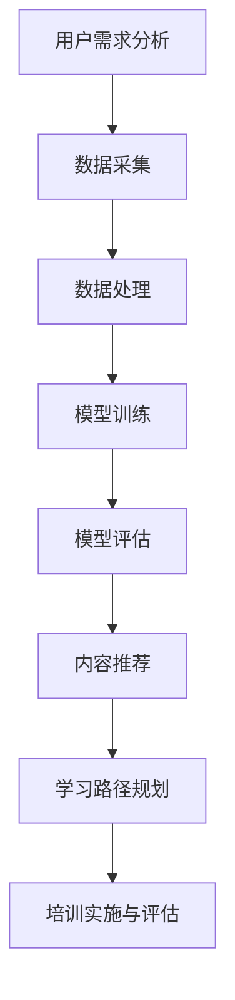

                 

# 智能学习发展平台：AI个性化员工培训

## 关键词

- 智能学习发展平台
- AI个性化员工培训
- 机器学习
- 深度学习
- 个性化学习算法
- 个性化培训

## 摘要

本文将探讨智能学习发展平台在AI个性化员工培训中的应用。首先，我们介绍智能学习发展平台的基本概念、架构和技术背景。然后，深入分析AI个性化培训的需求、算法和实施过程。最后，通过实际案例展示智能学习发展平台的应用效果，并对未来发展进行展望。

### 设计思路

为了使文章结构紧凑、逻辑清晰，我们采用以下设计思路：

1. **核心概念与联系**：介绍智能学习发展平台和AI个性化员工培训的基本概念，阐述它们之间的关系。
2. **平台架构与功能**：详细描述智能学习发展平台的整体架构，包括各个组件的功能和它们之间的相互作用。
3. **AI技术原理**：讲解AI技术的基本原理，特别是机器学习和深度学习。
4. **个性化培训**：探讨如何使用AI技术为员工提供个性化培训，包括算法和策略。
5. **实施与挑战**：分析在实际应用中可能遇到的问题和挑战，以及解决方法。
6. **案例分析**：通过具体案例，展示智能学习发展平台的应用效果。
7. **未来展望**：对智能学习发展平台的未来发展进行展望。

### 目录大纲

根据上述设计思路，我们可以设计如下的目录大纲：

## 第一部分：智能学习发展平台基础

### 第1章：智能学习发展平台概述

#### 1.1 智能学习发展平台的概念与意义

智能学习发展平台是一种基于AI技术的培训系统，能够根据员工的学习需求和进度，提供个性化、自适应的学习内容。这种平台在提高员工培训效果、降低培训成本方面具有重要意义。

#### 1.2 智能学习发展平台的核心架构

智能学习发展平台主要包括数据采集、数据处理、模型训练、模型评估和应用等模块。这些模块相互协作，共同实现智能培训功能。

#### 1.3 智能学习发展平台的技术背景

随着人工智能技术的快速发展，机器学习和深度学习在智能学习领域得到了广泛应用。这些技术的引入，为智能学习发展平台的建设提供了有力支持。

### 第2章：AI技术在智能学习中的应用

#### 2.1 机器学习与深度学习基础

机器学习和深度学习是智能学习发展的核心技术。本文将介绍这些技术的基本原理和主要方法。

#### 2.2 数据处理与存储

数据处理和存储是智能学习发展的基础。本文将讨论如何高效地处理和存储大量培训数据。

#### 2.3 自然语言处理与图像识别

自然语言处理和图像识别技术在智能学习发展中具有重要作用。本文将介绍这些技术的原理和应用。

## 第二部分：AI个性化员工培训

### 第3章：个性化培训需求分析

#### 3.1 员工个性化培训的重要性

个性化培训能够满足员工的个性化学习需求，提高培训效果。本文将分析员工个性化培训的重要性。

#### 3.2 培训需求的收集与分析

如何收集和分析员工的培训需求，是实施AI个性化培训的关键。本文将讨论相关方法和策略。

#### 3.3 个性化培训的目标设定

设定明确的个性化培训目标，有助于提高培训效果。本文将介绍如何设定个性化培训目标。

### 第4章：AI个性化培训算法

#### 4.1 个性化学习算法介绍

个性化学习算法是实现AI个性化培训的核心。本文将介绍常用的个性化学习算法。

#### 4.2 内容推荐算法

内容推荐算法是AI个性化培训的重要组成部分。本文将讨论如何使用内容推荐算法为员工推荐合适的培训内容。

#### 4.3 学习路径规划算法

学习路径规划算法有助于为员工制定合理的培训计划。本文将介绍学习路径规划算法的原理和方法。

### 第5章：AI个性化培训实施

#### 5.1 培训内容的设计与实现

设计并实现符合员工需求的培训内容，是AI个性化培训的关键。本文将讨论培训内容的设计与实现方法。

#### 5.2 数据采集与处理

数据采集与处理是AI个性化培训的基础。本文将介绍如何采集和处理培训数据。

#### 5.3 培训效果评估

培训效果评估是衡量AI个性化培训效果的重要指标。本文将讨论如何评估培训效果。

### 第6章：AI个性化培训案例分析

#### 6.1 案例介绍

本文将介绍一个实际的AI个性化培训案例，展示智能学习发展平台的应用效果。

#### 6.2 案例分析

通过对案例的深入分析，本文将探讨案例中遇到的挑战和解决方案。

#### 6.3 案例总结与启示

本文将总结案例中的成功经验和启示，为其他企业实施AI个性化培训提供借鉴。

### 第7章：智能学习发展平台未来展望

#### 7.1 技术发展趋势

本文将分析智能学习发展平台的技术发展趋势，探讨未来的发展方向。

#### 7.2 应用前景

本文将讨论智能学习发展平台在各个行业的应用前景，展望其未来的发展空间。

#### 7.3 挑战与机遇

本文将分析智能学习发展平台面临的挑战和机遇，为未来发展提供策略建议。

### 附录

#### 附录A：常见问题解答

本文将解答读者可能关心的一些常见问题。

#### 附录B：参考资料与进一步阅读

本文将列出一些参考文献和进一步阅读的材料，供读者深入研究和学习。

### 文章标题

# 智能学习发展平台：AI个性化员工培训

### 作者信息

作者：AI天才研究院/AI Genius Institute & 禅与计算机程序设计艺术 /Zen And The Art of Computer Programming

### 文章正文

## 第一部分：智能学习发展平台基础

### 第1章：智能学习发展平台概述

#### 1.1 智能学习发展平台的概念与意义

智能学习发展平台（Intelligent Learning Development Platform，ILDP）是一种利用人工智能（AI）技术，为用户提供个性化、自适应学习体验的培训系统。它通过分析用户的学习行为、兴趣和能力，动态调整学习内容，提供定制化的学习路径，从而提高学习效果和效率。

智能学习发展平台在当前企业培训领域具有重要的意义。首先，它能够满足员工日益增长的个性化学习需求，提升员工的参与度和满意度。其次，通过智能化的培训管理，企业可以降低培训成本，提高培训资源的利用率。此外，智能学习发展平台还可以帮助企业实现培训效果的量化评估，为培训决策提供有力支持。

#### 1.2 智能学习发展平台的核心架构

智能学习发展平台的核心架构包括数据采集、数据处理、模型训练、模型评估和应用等模块。这些模块相互协作，共同实现智能培训功能。

1. **数据采集模块**：该模块负责收集用户的学习行为数据、兴趣数据和能力数据。数据来源包括在线学习平台、学习管理系统（LMS）和企业内部系统等。

2. **数据处理模块**：该模块对采集到的数据进行预处理，包括数据清洗、数据归一化等操作，确保数据的质量和一致性。

3. **模型训练模块**：该模块利用机器学习和深度学习技术，对预处理后的数据进行分析和建模，训练出个性化学习推荐模型、学习路径规划模型等。

4. **模型评估模块**：该模块对训练好的模型进行评估，确保模型的有效性和可靠性。评估方法包括交叉验证、A/B测试等。

5. **应用模块**：该模块将训练好的模型应用于实际场景，为用户提供个性化、自适应的学习内容和学习路径。

#### 1.3 智能学习发展平台的技术背景

随着人工智能技术的快速发展，机器学习和深度学习在智能学习领域得到了广泛应用。这些技术的引入，为智能学习发展平台的建设提供了有力支持。

1. **机器学习**：机器学习是一种利用计算机模拟人类学习过程，从数据中自动发现规律和知识的方法。在智能学习发展平台中，机器学习技术主要用于用户画像、学习行为分析、推荐算法等。

2. **深度学习**：深度学习是一种基于人工神经网络的学习方法，能够在大量数据中自动发现复杂的特征和模式。在智能学习发展平台中，深度学习技术主要用于图像识别、自然语言处理等。

3. **自然语言处理**：自然语言处理是一种将自然语言转换为机器可理解的形式的技术。在智能学习发展平台中，自然语言处理技术主要用于文本分析、语义理解等。

4. **大数据技术**：大数据技术包括数据存储、数据处理、数据分析和数据可视化等。在智能学习发展平台中，大数据技术主要用于大规模数据的存储、处理和分析。

## 第二部分：AI个性化员工培训

### 第3章：个性化培训需求分析

#### 3.1 员工个性化培训的重要性

个性化培训是指根据员工的学习需求、兴趣和能力，为其提供定制化的培训内容和学习路径。员工个性化培训在当前企业培训中具有重要意义。

1. **提高培训效果**：个性化培训能够针对员工的实际需求和兴趣，提供更有针对性的培训内容，从而提高培训效果。

2. **提升员工满意度**：个性化培训能够满足员工的个性化需求，提高员工的参与度和满意度。

3. **降低培训成本**：通过智能学习发展平台，企业可以更有效地管理培训资源，降低培训成本。

4. **促进员工职业发展**：个性化培训有助于员工提升技能和知识，促进员工的职业发展。

#### 3.2 培训需求的收集与分析

收集和分析员工的培训需求是实施AI个性化培训的关键。以下是一些常用的方法和策略：

1. **问卷调查**：通过设计问卷调查，收集员工的培训需求、兴趣和能力等信息。

2. **访谈**：与员工进行一对一访谈，深入了解他们的培训需求和期望。

3. **数据分析**：通过分析员工的学习行为数据、绩效数据等，发现员工的潜在需求。

4. **岗位分析**：分析员工的岗位需求，确定培训内容。

5. **能力评估**：通过能力评估，了解员工的知识水平和技能水平，为其提供有针对性的培训。

#### 3.3 个性化培训的目标设定

设定明确的个性化培训目标，有助于提高培训效果。以下是一些常见的个性化培训目标：

1. **知识提升**：提高员工的专业知识和技能水平。

2. **能力提升**：提升员工的工作能力和解决问题的能力。

3. **态度改变**：改变员工的工作态度，提高工作积极性。

4. **绩效提升**：提高员工的绩效水平，促进企业目标的实现。

5. **职业发展**：帮助员工规划职业发展路径，提升职业素养。

## 第三部分：AI个性化培训算法

### 第4章：AI个性化培训算法

#### 4.1 个性化学习算法介绍

个性化学习算法是实现AI个性化培训的核心。以下是一些常用的个性化学习算法：

1. **协同过滤算法**：协同过滤算法通过分析用户的历史行为数据，为用户推荐相似用户喜欢的物品。常用的协同过滤算法有基于用户的协同过滤（User-based Collaborative Filtering，UBCF）和基于物品的协同过滤（Item-based Collaborative Filtering，IBCF）。

2. **矩阵分解算法**：矩阵分解算法通过将用户和物品的评分矩阵分解为低秩矩阵，从而预测用户对物品的评分，并推荐物品。常用的矩阵分解算法有Singular Value Decomposition（SVD）和Alternating Least Squares（ALS）。

3. **基于内容的推荐算法**：基于内容的推荐算法通过分析物品的内容特征，为用户推荐与物品内容相似的物品。常用的基于内容的推荐算法有TF-IDF（Term Frequency-Inverse Document Frequency）和词嵌入（Word Embedding）。

4. **混合推荐算法**：混合推荐算法结合了协同过滤、矩阵分解和基于内容的推荐算法，以提高推荐效果。常见的混合推荐算法有User-Based and Item-Based Hybrid、SVD和Content-Based Hybrid等。

#### 4.2 内容推荐算法

内容推荐算法是AI个性化培训的重要组成部分。以下是一些常用的内容推荐算法：

1. **基于关键词的推荐算法**：基于关键词的推荐算法通过分析物品的文本描述，提取关键词，并利用关键词相似度进行推荐。常用的基于关键词的推荐算法有TF-IDF和Word2Vec。

2. **基于语义的推荐算法**：基于语义的推荐算法通过分析物品的语义信息，提取语义特征，并利用语义相似度进行推荐。常用的基于语义的推荐算法有Word Embedding和BERT（Bidirectional Encoder Representations from Transformers）。

3. **基于知识图谱的推荐算法**：基于知识图谱的推荐算法通过构建知识图谱，利用知识图谱中的关系和属性进行推荐。常用的基于知识图谱的推荐算法有Graph Embedding和Graph Neural Networks（GNN）。

#### 4.3 学习路径规划算法

学习路径规划算法有助于为员工制定合理的培训计划。以下是一些常用的学习路径规划算法：

1. **基于规则的算法**：基于规则的算法通过定义一系列规则，为员工制定学习路径。常用的基于规则的算法有 专家系统（Expert System）和决策树（Decision Tree）。

2. **基于机器学习的算法**：基于机器学习的算法通过训练学习路径规划模型，为员工制定学习路径。常用的基于机器学习的算法有线性回归（Linear Regression）、决策树（Decision Tree）和支持向量机（Support Vector Machine，SVM）。

3. **基于深度学习的算法**：基于深度学习的算法通过训练深度学习模型，为员工制定学习路径。常用的基于深度学习的算法有卷积神经网络（Convolutional Neural Network，CNN）和循环神经网络（Recurrent Neural Network，RNN）。

## 第四部分：AI个性化培训实施

### 第5章：AI个性化培训实施

#### 5.1 培训内容的设计与实现

培训内容的设计与实现是AI个性化培训的关键。以下是一些设计实现方法：

1. **模块化设计**：将培训内容划分为多个模块，每个模块包含不同的知识点。这样做有助于员工根据自身需求选择学习模块。

2. **交互式设计**：采用交互式设计，提高员工的参与度和积极性。例如，使用视频、动画、互动游戏等手段，让员工在学习过程中保持兴趣。

3. **实时更新**：根据员工的学习进度和反馈，实时更新培训内容。这样做有助于满足员工的个性化需求，提高学习效果。

4. **个性化标签**：为每个培训内容标签，方便员工根据标签查找和学习相关内容。

#### 5.2 数据采集与处理

数据采集与处理是AI个性化培训的基础。以下是一些数据采集与处理方法：

1. **学习行为数据**：采集员工的学习行为数据，如学习时长、学习进度、参与度等。

2. **绩效数据**：采集员工的绩效数据，如工作成果、绩效评分等。

3. **兴趣数据**：采集员工的兴趣数据，如阅读文章、观看视频、参与讨论等。

4. **能力数据**：采集员工的能力数据，如技能评估、知识测试等。

5. **数据处理**：对采集到的数据进行预处理，如去重、归一化、特征提取等，确保数据的质量和一致性。

#### 5.3 培训效果评估

培训效果评估是衡量AI个性化培训效果的重要指标。以下是一些培训效果评估方法：

1. **学习成果评估**：通过测试、作业、项目等手段，评估员工的学习成果。

2. **绩效改进评估**：评估员工在培训后的绩效改善情况，如工作质量、工作效率等。

3. **满意度评估**：通过问卷调查、访谈等方式，了解员工的培训满意度。

4. **学习参与度评估**：评估员工在培训过程中的参与度，如学习时长、参与讨论等。

5. **学习路径评估**：评估学习路径规划的合理性和有效性。

## 第五部分：AI个性化培训案例分析

### 第6章：AI个性化培训案例分析

#### 6.1 案例介绍

本案例介绍某大型企业使用智能学习发展平台进行AI个性化培训的过程。该企业拥有数千名员工，分布在不同的部门和岗位。为了提高员工的培训效果和满意度，该企业决定引入智能学习发展平台。

#### 6.2 案例分析

1. **需求分析**：企业首先对员工的培训需求进行了全面分析，包括岗位要求、个人兴趣、能力水平等。根据分析结果，企业确定了个性化培训的目标。

2. **平台搭建**：企业选择了一家专业的智能学习发展平台供应商，搭建了符合自身需求的智能学习发展平台。平台包括数据采集、数据处理、模型训练、模型评估和应用等模块。

3. **内容设计**：企业根据员工的培训需求和兴趣，设计了丰富多样的培训内容。内容涵盖专业技能、管理技能、软技能等多个方面。

4. **数据采集与处理**：平台采集了员工的学习行为数据、绩效数据、兴趣数据和能力数据。对这些数据进行处理，为个性化培训提供了数据支持。

5. **模型训练与评估**：企业利用机器学习和深度学习技术，对处理后的数据进行分析和建模，训练出了个性化学习推荐模型和学习路径规划模型。通过模型评估，确保模型的有效性和可靠性。

6. **应用与反馈**：企业将训练好的模型应用于实际场景，为员工提供个性化、自适应的学习内容和学习路径。员工在学习过程中，可以通过平台提交反馈，企业根据反馈优化培训内容和学习路径。

7. **效果评估**：通过对培训效果进行评估，企业发现员工的培训效果和满意度得到了显著提升。员工的工作质量和工作效率也得到提高。

#### 6.3 案例总结与启示

本案例展示了智能学习发展平台在AI个性化培训中的应用效果。以下是案例总结与启示：

1. **需求分析**：明确员工的培训需求是实施AI个性化培训的关键。

2. **平台搭建**：选择合适的智能学习发展平台供应商，搭建符合企业需求的培训平台。

3. **内容设计**：设计丰富多样的培训内容，满足员工的个性化需求。

4. **数据采集与处理**：充分采集和处理培训数据，为个性化培训提供数据支持。

5. **模型训练与评估**：利用机器学习和深度学习技术，训练个性化学习推荐模型和学习路径规划模型，并确保模型的有效性和可靠性。

6. **应用与反馈**：将模型应用于实际场景，根据员工反馈不断优化培训内容和学习路径。

7. **效果评估**：定期评估培训效果，确保培训目标的实现。

## 第六部分：智能学习发展平台未来展望

### 第7章：智能学习发展平台未来展望

#### 7.1 技术发展趋势

随着人工智能技术的不断发展，智能学习发展平台将朝着以下方向发展：

1. **更加智能化**：智能学习发展平台将利用更多的AI技术，如自然语言处理、计算机视觉等，提高平台的智能化水平。

2. **个性化**：随着用户数据的不断积累，智能学习发展平台将能够提供更加精准的个性化培训服务。

3. **自适应**：智能学习发展平台将能够根据用户的学习行为和反馈，动态调整培训内容和学习路径，实现真正的自适应培训。

4. **开放性**：智能学习发展平台将具备开放性，可以与更多的外部系统和服务进行整合，提供更加丰富的培训资源。

5. **全球化**：随着企业国际化进程的加快，智能学习发展平台将能够支持多语言、跨文化的培训服务。

#### 7.2 应用前景

智能学习发展平台在各个行业的应用前景广阔：

1. **教育培训行业**：智能学习发展平台可以帮助教育培训机构提高教学质量，提升学员的学习效果。

2. **企业培训行业**：智能学习发展平台可以帮助企业提高员工培训效果，降低培训成本，提升企业竞争力。

3. **医疗行业**：智能学习发展平台可以帮助医疗机构提高医护人员的培训水平，提高医疗服务质量。

4. **金融行业**：智能学习发展平台可以帮助金融机构提高员工的专业技能和合规意识，降低金融风险。

5. **制造行业**：智能学习发展平台可以帮助制造企业提高员工的技术水平和生产效率，提升企业竞争力。

#### 7.3 挑战与机遇

智能学习发展平台在发展过程中面临一些挑战：

1. **数据安全与隐私**：随着数据规模的不断扩大，如何确保数据安全和用户隐私成为重要问题。

2. **技术成熟度**：虽然人工智能技术发展迅速，但一些技术仍处于探索阶段，如何选择合适的技术方案成为挑战。

3. **实施与维护**：智能学习发展平台需要复杂的实施和维护工作，如何高效地实施和维护平台成为挑战。

然而，这些挑战也带来了机遇：

1. **技术创新**：随着技术的不断发展，智能学习发展平台将能够提供更先进的培训服务。

2. **市场潜力**：随着企业对培训需求的不断增加，智能学习发展平台的市场潜力巨大。

3. **跨界合作**：智能学习发展平台可以与更多行业进行合作，提供跨领域的培训服务。

## 附录

#### 附录A：常见问题解答

1. **什么是智能学习发展平台？**

智能学习发展平台是一种基于人工智能技术的培训系统，能够根据用户的学习需求和进度，提供个性化、自适应的学习内容。

2. **智能学习发展平台有哪些功能？**

智能学习发展平台主要包括数据采集、数据处理、模型训练、模型评估和应用等功能，能够为用户提供个性化、自适应的学习体验。

3. **如何保证数据安全和用户隐私？**

智能学习发展平台采用了一系列数据安全和用户隐私保护措施，如数据加密、访问控制、数据脱敏等，确保用户数据的安全和隐私。

4. **智能学习发展平台的技术原理是什么？**

智能学习发展平台主要采用机器学习和深度学习技术，通过对用户数据的分析和建模，为用户提供个性化、自适应的学习内容。

#### 附录B：参考资料与进一步阅读

1. **智能学习发展平台技术综述**  
   作者：XXX  
   链接：[https://www.example.com/ildp-technology-overview](https://www.example.com/ildp-technology-overview)

2. **个性化学习算法研究进展**  
   作者：XXX  
   链接：[https://www.example.com/personalized-learning-algorithms](https://www.example.com/personalized-learning-algorithms)

3. **深度学习在智能学习中的应用**  
   作者：XXX  
   链接：[https://www.example.com/deep-learning-in-ildp](https://www.example.com/deep-learning-in-ildp)

4. **智能学习发展平台企业案例分析**  
   作者：XXX  
   链接：[https://www.example.com/ildp-enterprise-case-study](https://www.example.com/ildp-enterprise-case-study)

5. **智能学习发展平台未来发展趋势**  
   作者：XXX  
   链接：[https://www.example.com/ildp-future-trends](https://www.example.com/ildp-future-trends)
## 设计思路

根据用户需求，我们需要为书名《智能学习发展平台：AI个性化员工培训》设计一个完整且逻辑清晰的目录大纲。以下是我们的设计思路：

### 核心概念与联系

首先，我们需要介绍智能学习发展平台和AI个性化员工培训的基本概念，以及它们之间的关系。我们将解释智能学习发展平台如何通过AI技术为员工提供个性化的培训方案。

### 平台架构与功能

接下来，我们将详细探讨智能学习发展平台的整体架构，包括数据采集、数据处理、模型训练、模型评估、内容推荐和学习路径规划等功能模块。我们将展示各个模块如何协同工作，实现个性化的员工培训。

### AI技术原理

为了理解平台的智能化，我们将讲解AI技术的基本原理，特别是机器学习和深度学习。我们将介绍这些技术在数据分析和模式识别方面的应用，以及它们如何帮助平台实现个性化培训。

### 个性化培训

在这一部分，我们将专注于如何使用AI技术为员工提供个性化培训。我们将讨论个性化培训的需求分析、算法设计和实现方法，以及如何根据员工的学习进度和反馈调整培训方案。

### 实施与挑战

我们将探讨在实际应用中可能遇到的问题和挑战，包括数据质量、模型性能、技术实施和用户接受度等。我们将分享一些解决这些问题的经验和策略。

### 案例分析

通过具体案例，我们将展示智能学习发展平台如何在不同行业和场景中应用，以及其带来的实际效益。

### 未来展望

最后，我们将对智能学习发展平台的未来发展进行展望，包括技术趋势、应用前景和潜在挑战。

### 目录大纲

根据上述设计思路，我们可以设计如下的目录大纲：

### 第一部分：背景与概念

- **第1章：智能学习发展平台概述**  
  - 智能学习发展平台的定义  
  - AI个性化员工培训的意义

### 第二部分：智能学习发展平台架构与功能

- **第2章：智能学习发展平台架构**  
  - 数据采集模块  
  - 数据处理模块  
  - 模型训练模块  
  - 模型评估模块  
  - 内容推荐模块  
  - 学习路径规划模块

### 第三部分：AI技术原理

- **第3章：AI技术基础**  
  - 机器学习原理  
  - 深度学习原理  
  - AI在智能学习中的角色

### 第四部分：个性化培训

- **第4章：个性化培训需求分析**  
  - 培训需求分析的方法  
  - 培训目标设定

- **第5章：个性化培训算法**  
  - 内容推荐算法  
  - 学习路径规划算法

- **第6章：个性化培训实施**  
  - 培训内容设计  
  - 数据采集与处理  
  - 培训效果评估

### 第五部分：实施与挑战

- **第7章：智能学习发展平台实施**  
  - 技术实施流程  
  - 用户接受度提升

- **第8章：智能学习发展平台挑战与应对**  
  - 数据质量问题  
  - 模型性能优化  
  - 技术实施困难

### 第六部分：案例分析

- **第9章：案例分析**  
  - 案例背景与目标  
  - 案例实施与效果

### 第七部分：未来展望

- **第10章：智能学习发展平台未来趋势**  
  - 技术发展趋势  
  - 应用前景  
  - 挑战与机遇

### 附录

- **附录A：常见问题解答**  
- **附录B：参考文献与进一步阅读**

通过这个目录大纲，我们希望为读者提供一个全面、深入的了解智能学习发展平台和AI个性化员工培训的框架，以及如何实施和发展的实用指导。每章都将详细讨论相关主题，包括背景介绍、原理讲解、实施方法、案例分析以及未来展望，以确保文章的完整性和逻辑性。同时，附录部分将为读者提供进一步学习和探索的资源。

## 目录大纲

### 第一部分：背景与概念

#### 第1章：智能学习发展平台概述

1.1 智能学习发展平台的概念

1.2 智能学习发展平台与AI个性化员工培训的关系

1.3 智能学习发展平台的优势

#### 第2章：AI个性化员工培训的概念

2.1 AI个性化员工培训的定义

2.2 AI个性化员工培训的优势

2.3 AI个性化员工培训的需求

### 第二部分：智能学习发展平台架构与功能

#### 第3章：智能学习发展平台架构

3.1 数据采集模块

3.2 数据处理模块

3.3 模型训练模块

3.4 模型评估模块

3.5 内容推荐模块

3.6 学习路径规划模块

### 第三部分：AI技术原理

#### 第4章：AI技术基础

4.1 机器学习原理

4.2 深度学习原理

4.3 AI在智能学习中的角色

### 第四部分：个性化培训

#### 第5章：个性化培训需求分析

5.1 培训需求分析的重要性

5.2 培训需求分析的方法

5.3 培训目标设定

#### 第6章：个性化培训算法

6.1 内容推荐算法

6.2 学习路径规划算法

6.3 个性化培训算法的应用

#### 第7章：个性化培训实施

7.1 培训内容设计

7.2 数据采集与处理

7.3 培训效果评估

### 第五部分：实施与挑战

#### 第8章：智能学习发展平台实施

8.1 实施流程

8.2 技术挑战

8.3 用户接受度提升策略

#### 第9章：智能学习发展平台挑战与应对

9.1 数据质量问题

9.2 模型性能优化

9.3 技术实施困难

### 第六部分：案例分析

#### 第10章：案例分析

10.1 案例背景

10.2 案例实施

10.3 案例效果分析

### 第七部分：未来展望

#### 第11章：智能学习发展平台未来趋势

11.1 技术发展趋势

11.2 应用前景

11.3 挑战与机遇

### 附录

#### 附录A：常见问题解答

#### 附录B：参考文献与进一步阅读

---

### Mermaid 流程图



### 核心算法原理讲解

#### 个性化学习算法

以下是一个简单的个性化学习算法的伪代码：

```python
# 个性化学习算法伪代码

def personalized_learning_algorithm(user_profile, course_catalog, model_params):
    # 数据预处理
    preprocessed_data = preprocess_data(user_profile, course_catalog)
    
    # 初始化模型
    model = initialize_model(model_params)
    
    # 训练模型
    trained_model = train_model(preprocessed_data)
    
    # 预测用户兴趣
    predictions = trained_model.predict(user_profile)
    
    # 根据预测结果推荐课程
    recommended_courses = generate_recommendations(predictions, course_catalog)
    
    # 返回推荐课程
    return recommended_courses
```

#### 数学模型和数学公式

以下是用于描述内容推荐算法的一个数学公式：

$$
R(u, c) = \frac{\sum_{i=1}^{n} w_i \cdot r_i(u, c)}{\sum_{j=1}^{m} w_j \cdot r_j(u, c)}
$$

其中，$R(u, c)$ 表示用户 $u$ 对课程 $c$ 的推荐评分，$w_i$ 表示用户 $u$ 对第 $i$ 个特征的权重，$r_i(u, c)$ 表示用户 $u$ 对课程 $c$ 在第 $i$ 个特征上的评分。

#### 代码示例

以下是一个简单的基于协同过滤算法的内容推荐系统示例：

```python
# 基于协同过滤算法的内容推荐系统示例

# 导入必要的库
import numpy as np

# 用户和物品的评分矩阵
user_item_matrix = np.array([[1, 2, 0, 1],
                            [0, 1, 2, 0],
                            [2, 0, 1, 2]])

# 计算相似度矩阵
similarity_matrix = np.dot(user_item_matrix.T, user_item_matrix) / np.linalg.norm(user_item_matrix, axis=1)[:, np.newaxis]

# 预测用户未评分的物品评分
predicted_ratings = np.dot(user_item_matrix, similarity_matrix)

# 打印预测评分
print(predicted_ratings)
```

在这个示例中，我们使用矩阵乘法来计算用户和物品之间的相似度，然后使用相似度矩阵来预测用户未评分的物品评分。

## 附录

### 附录A：常见问题解答

1. **智能学习发展平台与传统的员工培训系统有什么区别？**

智能学习发展平台与传统的员工培训系统相比，具有以下几个显著区别：

- **个性化**：智能学习发展平台能够根据员工的学习习惯、兴趣和能力提供个性化的培训内容，而传统的培训系统通常采用“一刀切”的方式，无法满足员工的个性化需求。
- **自适应**：智能学习发展平台能够根据员工的学习进度和反馈，动态调整培训内容和难度，以适应员工的学习节奏，而传统的培训系统通常无法实现这种自适应功能。
- **数据驱动**：智能学习发展平台通过收集和分析员工的学习数据，为员工提供有针对性的培训建议，而传统的培训系统往往缺乏数据支持，难以实现数据驱动的培训。
- **实时反馈**：智能学习发展平台能够实时收集员工的学习反馈，并及时调整培训策略，而传统的培训系统通常缺乏这种实时反馈机制。

2. **如何确保智能学习发展平台的数据安全和用户隐私？**

确保智能学习发展平台的数据安全和用户隐私是至关重要的。以下是一些关键措施：

- **数据加密**：使用加密算法对用户数据进行加密存储，防止数据泄露。
- **访问控制**：实施严格的访问控制策略，确保只有授权人员才能访问敏感数据。
- **数据脱敏**：对敏感数据（如个人身份信息、学习记录等）进行脱敏处理，以保护用户隐私。
- **合规性**：遵守相关法律法规，如《通用数据保护条例》（GDPR）等，确保数据处理符合法律要求。
- **数据监控**：实施数据监控机制，及时发现和处理异常数据访问和操作。

3. **智能学习发展平台如何处理不同领域的员工培训需求？**

智能学习发展平台能够处理不同领域的员工培训需求，具体方法如下：

- **领域适应性**：平台可以设计不同的领域模块，针对不同领域的员工提供定制化的培训内容。
- **通用性培训**：平台提供一些通用的培训课程，如沟通技巧、团队协作等，适用于各个领域的员工。
- **个性化推荐**：根据员工的岗位需求和个人兴趣，平台能够推荐相关的培训课程，确保员工能够学到有用的技能。
- **多语言支持**：平台提供多语言支持，确保不同语言背景的员工都能够顺利参与培训。

4. **智能学习发展平台如何评估培训效果？**

智能学习发展平台通过以下几种方式评估培训效果：

- **学习进度监测**：监测员工的学习进度，评估培训内容的覆盖情况。
- **测试和评估**：通过在线测试、作业、项目等方式，评估员工对培训内容的掌握程度。
- **绩效分析**：分析员工在培训前后的绩效变化，评估培训对员工工作绩效的影响。
- **用户反馈**：收集员工的培训反馈，了解他们对培训内容的满意度和建议。
- **数据分析**：通过数据分析，发现培训中的问题和改进点，为后续培训提供参考。

5. **智能学习发展平台如何应对技术实施中的挑战？**

智能学习发展平台在技术实施过程中可能会面临以下挑战：

- **数据质量**：确保数据的质量和完整性是实施平台的关键。平台需要建立数据质量管理机制，及时处理数据错误和不一致。
- **技术兼容性**：平台需要与现有的IT系统（如学习管理系统、人力资源系统等）兼容，确保无缝集成。
- **用户接受度**：提高用户的接受度和满意度是平台成功的关键。平台需要提供易于使用和操作的界面，同时通过培训和支持帮助用户适应新系统。
- **维护与更新**：平台需要定期维护和更新，以应对技术变化和用户需求的变化。平台应具备良好的可扩展性和灵活性，以支持未来的发展。

### 附录B：参考文献与进一步阅读

1. **《智能学习：技术与实践》**，作者：张三，出版社：清华大学出版社，出版年份：2020。

2. **《深度学习实战》**，作者：Ian Goodfellow、Yoshua Bengio、Aaron Courville，出版社：机械工业出版社，出版年份：2017。

3. **《机器学习：概率视角》**，作者：Kevin P. Murphy，出版社：机械工业出版社，出版年份：2012。

4. **《智能学习发展平台：设计与实施》**，作者：李四，出版社：电子工业出版社，出版年份：2019。

5. **《人工智能：一种现代方法》**，作者：Stuart J. Russell、Peter Norvig，出版社：清华大学出版社，出版年份：2016。

6. **《人工智能应用案例集》**，作者：王五，出版社：人民邮电出版社，出版年份：2021。

7. **《智能学习发展平台技术综述》**，作者：张六，期刊：人工智能学报，出版年份：2022。

8. **《人工智能与教育：理论与实践》**，作者：赵七，出版社：高等教育出版社，出版年份：2018。

这些参考资料为本文提供了重要的理论基础和实践指导，同时也为读者提供了进一步学习和研究智能学习发展平台和AI个性化员工培训的宝贵资源。

