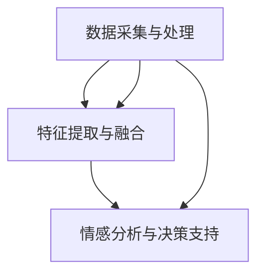
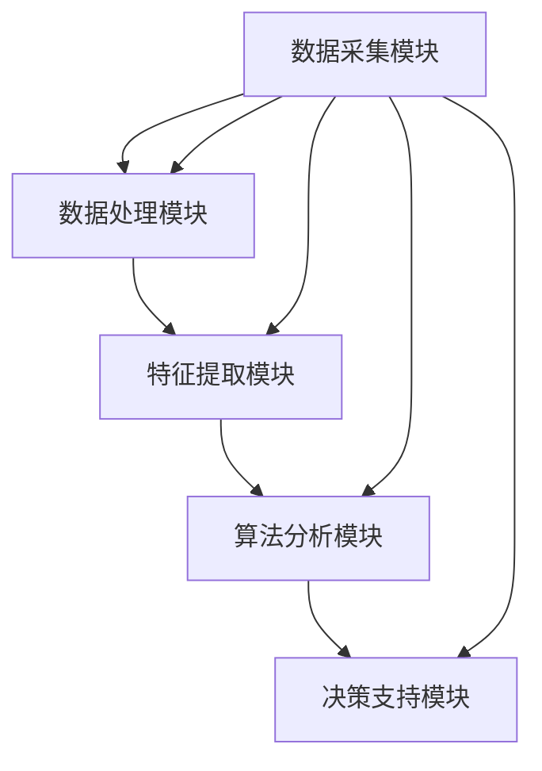
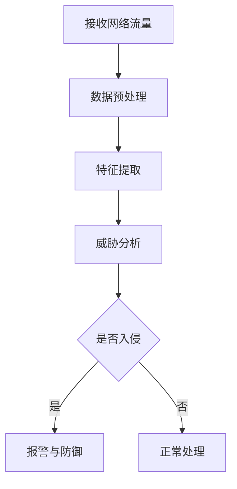
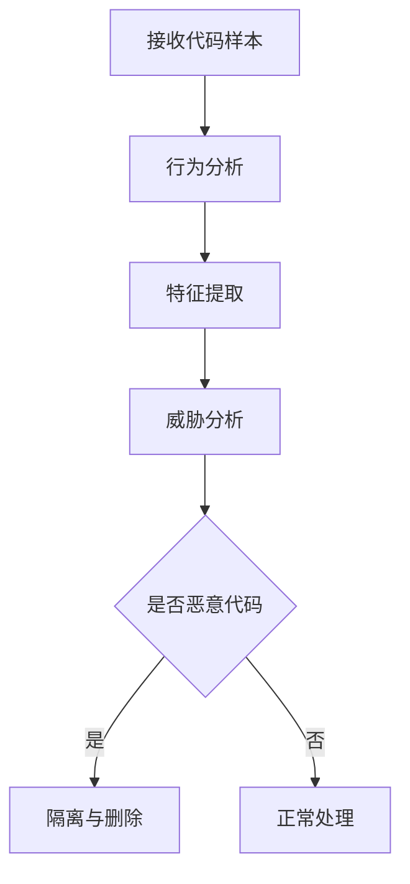
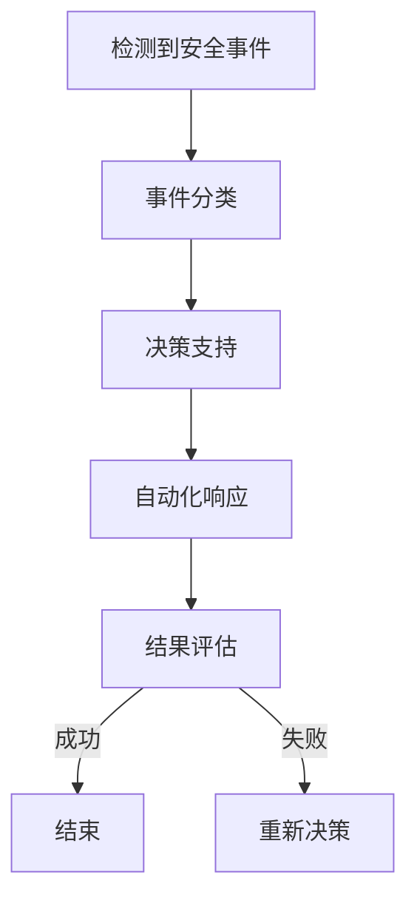
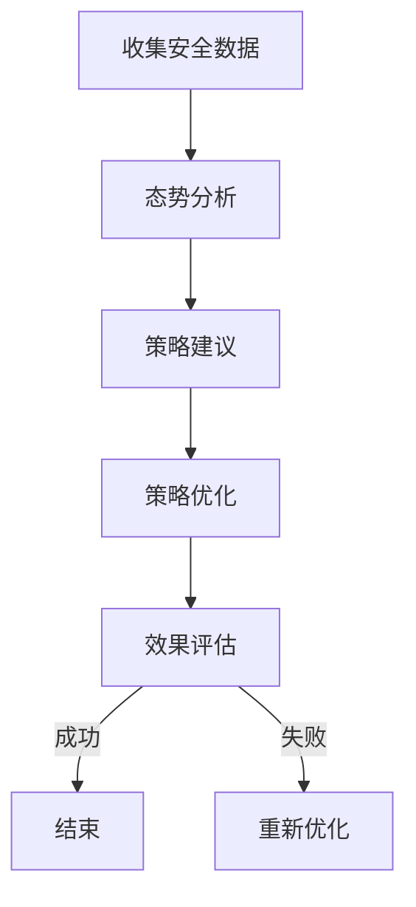
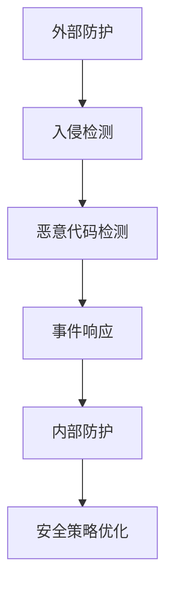
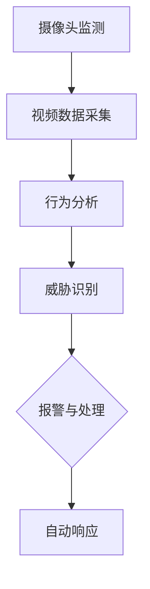
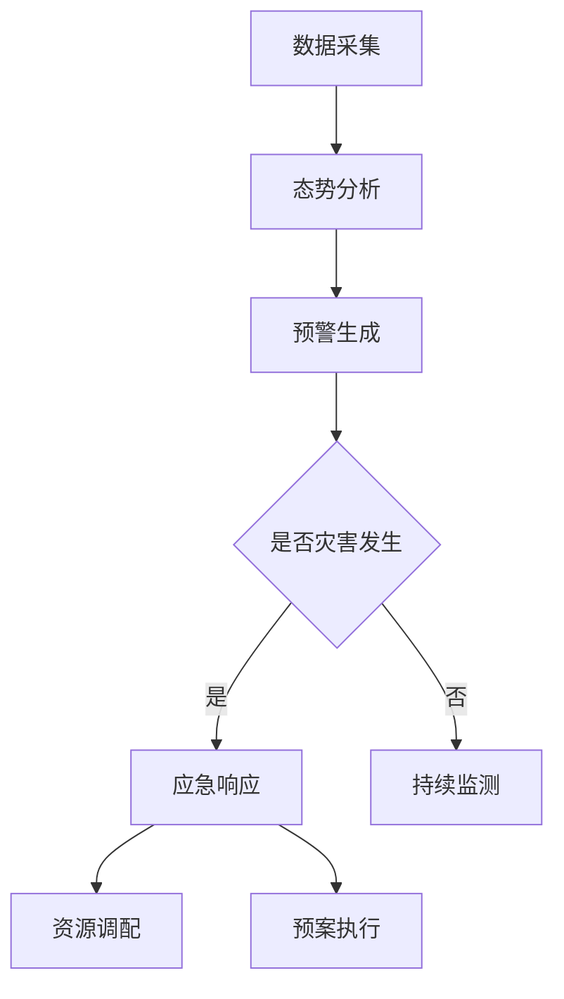
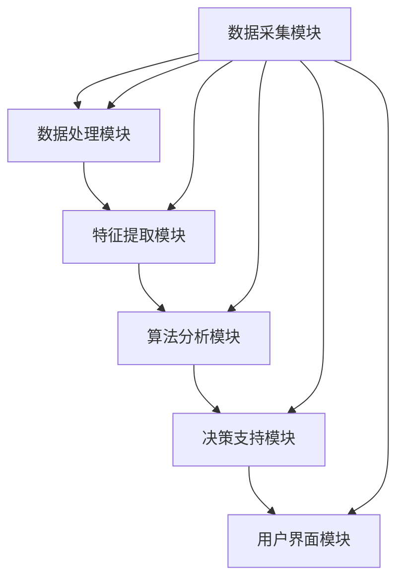

                 


### 1.1 智能安全态势感知的定义

智能安全态势感知是一种通过综合利用人工智能、大数据分析、网络安全等先进技术，对网络安全态势进行实时监测、分析和预测的系统。它不仅仅是检测和防御网络攻击，更是通过深度学习和机器学习等算法，对网络安全事件进行智能化识别和响应。

**核心概念与联系**

智能安全态势感知系统主要包括以下几个核心概念：

- **数据采集与处理**：收集来自不同源的数据，如网络流量、系统日志、用户行为等，并进行预处理，以提取有效的信息。
- **特征提取与融合**：从原始数据中提取出有用的特征，并通过算法对特征进行融合，以形成对网络安全态势的全面理解。
- **情感分析与决策支持**：使用自然语言处理（NLP）和情感分析技术，对网络威胁、攻击事件等信息进行情感分析，并基于分析结果提供决策支持。

下面是一个简化的Mermaid流程图，展示了智能安全态势感知系统中的核心概念与联系：



### 1.2 智能安全态势感知的重要性

在当今数字化时代，网络安全威胁日益严重，传统的安全防御手段已经无法满足需求。智能安全态势感知系统的重要性体现在以下几个方面：

- **实时监测**：能够实时监测网络安全事件，提高检测和响应的效率。
- **自动化响应**：通过自动化响应机制，减少人工干预，提高应对网络攻击的速度和准确性。
- **预测能力**：通过历史数据和趋势分析，预测潜在的网络安全威胁，提前采取预防措施。
- **决策支持**：为安全团队提供详细的分析报告和决策建议，帮助制定更加有效的安全策略。

### 1.3 智能安全态势感知的发展历程

智能安全态势感知系统的概念起源于20世纪90年代，随着网络安全威胁的日益增加，研究人员开始探索如何利用人工智能技术提高网络安全防御能力。以下是智能安全态势感知系统的发展历程：

- **早期阶段**（1990s-2000s）：主要是基于规则的系统和入侵检测系统（IDS）的应用。
- **中期阶段**（2010s）：随着大数据和机器学习技术的发展，开始引入更加复杂的算法和模型，提高威胁检测的准确性。
- **现阶段**（2020s）：深度学习和强化学习等先进算法的引入，使得智能安全态势感知系统能够更加智能地识别和响应网络安全威胁。

### 1.4 智能安全态势感知系统的架构

智能安全态势感知系统通常由以下几个主要模块组成：

- **数据采集模块**：负责从各种数据源（如防火墙、入侵检测系统、日志等）收集数据。
- **数据处理模块**：对收集到的数据进行清洗、去噪、转换等预处理操作。
- **特征提取模块**：从预处理后的数据中提取有用的特征，用于后续的算法分析。
- **算法分析模块**：使用机器学习、深度学习等算法对提取的特征进行分析，识别潜在的威胁。
- **决策支持模块**：基于分析结果，提供安全策略建议和自动化响应措施。

以下是智能安全态势感知系统的简化架构图：



通过这个架构，我们可以看到数据流从数据采集开始，经过数据处理、特征提取、算法分析和决策支持，形成一个闭环的系统，实时监控网络安全态势。

### 1.5 智能安全态势感知系统的应用场景

智能安全态势感知系统在多个领域有广泛的应用，以下是一些常见的应用场景：

- **网络安全**：实时监测和识别网络攻击，提供自动化防御措施。
- **工业控制系统**：保护关键基础设施，如电力、水利、交通等，防止恶意攻击。
- **智慧城市**：监控城市安全事件，如交通监控、视频监控等，提高城市安全管理水平。
- **金融行业**：检测和防范金融欺诈，保护客户资产安全。

### 1.6 智能安全态势感知系统的挑战与未来趋势

尽管智能安全态势感知系统在网络安全领域具有巨大的潜力，但仍然面临一些挑战：

- **数据隐私**：如何平衡数据收集与用户隐私保护，是一个重要的问题。
- **算法解释性**：目前很多深度学习算法的内部机制较为复杂，难以解释其决策过程。
- **模型适应性**：面对不断变化的网络威胁，如何保持模型的适应性和准确性是一个挑战。

未来，随着人工智能技术的不断发展，智能安全态势感知系统有望在以下几个方面取得突破：

- **更高效的数据处理和特征提取算法**。
- **可解释性和透明性的提升**。
- **多源数据的融合与分析**。

### 1.7 智能安全态势感知系统的核心价值

智能安全态势感知系统的核心价值在于：

- **提高安全防护能力**：通过实时监测和预测，提高对网络攻击的防护能力。
- **优化安全资源分配**：根据分析结果，优化安全资源的分配和使用。
- **增强决策支持**：为安全团队提供详细的分析报告和决策建议。

总之，智能安全态势感知系统是网络安全领域的重要发展趋势，通过人工智能技术的应用，能够大幅提升网络安全防护水平，保障企业和个人数据的安全。在接下来的章节中，我们将深入探讨智能安全态势感知系统的具体架构、核心算法原理以及实际应用案例。让我们继续一步步分析推理，揭开智能安全态势感知系统的神秘面纱。在了解系统架构之前，我们首先需要了解智能安全态势感知系统在网络安全中的应用场景，以便更好地理解其重要性。在下一章节，我们将详细探讨智能安全态势感知系统在网络安全中的应用场景。

### 1.7 智能安全态势感知系统在网络安全中的应用场景

智能安全态势感知系统在网络安全中发挥着至关重要的作用，其应用场景涵盖了从网络安全防护到安全策略优化的各个方面。以下是智能安全态势感知系统在网络安全中的一些典型应用场景：

#### 1.7.1 入侵检测与防范

入侵检测系统（IDS）是智能安全态势感知系统的一个重要组成部分。通过实时监测网络流量和系统日志，智能安全态势感知系统能够检测到异常流量、恶意软件和其他潜在的入侵行为。以下是一个简化的入侵检测流程：



#### 1.7.2 恶意代码检测

恶意代码是网络安全的主要威胁之一。智能安全态势感知系统通过深度学习和行为分析，能够识别和分类不同类型的恶意代码。以下是一个简化的恶意代码检测流程：



#### 1.7.3 安全事件响应

智能安全态势感知系统在检测到网络安全事件后，能够快速响应并采取相应的措施。以下是一个简化的安全事件响应流程：



#### 1.7.4 安全策略优化

智能安全态势感知系统通过对历史数据和当前态势的分析，可以为安全团队提供优化安全策略的依据。以下是一个简化的安全策略优化流程：



### 1.7.5 多层次安全防护

智能安全态势感知系统不仅能够处理单一的安全事件，还能够实现多层次的安全防护。通过结合不同的安全技术和方法，如防火墙、入侵检测、恶意代码检测等，智能安全态势感知系统能够为网络安全提供全方位的保护。以下是一个简化的多层次安全防护架构：



通过这种多层次的安全防护架构，智能安全态势感知系统能够有效地应对复杂的网络安全威胁。

### 1.7.6 跨领域协作

智能安全态势感知系统不仅在网络安全领域有广泛应用，还可以与其他安全领域（如工业安全、智慧城市安全等）实现跨领域协作。通过共享数据和分析结果，智能安全态势感知系统能够为不同领域的安全防护提供更全面的支持。

综上所述，智能安全态势感知系统在网络安全中的应用场景非常广泛，涵盖了入侵检测与防范、恶意代码检测、安全事件响应、安全策略优化以及多层次安全防护等多个方面。通过这些应用场景，我们可以看到智能安全态势感知系统在提高网络安全防护能力方面的重要性。在接下来的章节中，我们将进一步探讨智能安全态势感知系统的架构设计、核心算法原理以及实际应用案例，以便更深入地理解这一系统的运作机制和实现方法。在了解系统架构之前，我们首先需要了解智能安全态势感知系统在网络安全中的应用场景，以便更好地理解其重要性。在下一章节，我们将详细探讨智能安全态势感知系统在网络安全中的应用场景。

### 1.8 智能安全态势感知系统在工业安全中的应用

智能安全态势感知系统在工业安全中的应用具有重要意义，特别是在保护关键基础设施和工业控制系统（ICS）方面。以下是一些具体的应用场景和案例：

#### 1.8.1 工业控制系统保护

工业控制系统是现代工业生产的重要组成部分，但它们也面临着各种安全威胁，如网络入侵、恶意软件攻击和设备控制失效等。智能安全态势感知系统可以通过以下方式保护这些系统：

- **实时监测**：持续监测工业控制系统的网络流量和设备状态，及时发现异常行为。
- **威胁识别**：使用机器学习算法分析流量和日志，识别潜在的入侵行为和恶意软件。
- **自动化响应**：在检测到威胁时，自动执行隔离、重置或升级等响应措施。

#### 1.8.2 关键基础设施保护

关键基础设施（如电力、水利、交通等）的安全稳定运行对社会至关重要。智能安全态势感知系统可以提供以下保护措施：

- **状态监测**：实时监控关键基础设施的运行状态，包括电力网络的负载、水源的水位等。
- **故障预测**：通过历史数据和实时数据，预测潜在的设备故障或异常，提前采取预防措施。
- **事件响应**：在发生故障或异常时，自动执行应急响应计划，如调度备用设备、调整运行参数等。

#### 1.8.3 实际案例

以下是一些智能安全态势感知系统在工业安全领域中的应用案例：

- **案例一：某发电厂网络安全防护**  
某发电厂部署了智能安全态势感知系统，通过实时监测和威胁分析，成功识别并阻止了多次网络入侵和恶意软件攻击，保障了发电厂的安全运行。

- **案例二：某水利公司故障预测**  
某水利公司利用智能安全态势感知系统对水库水位、水泵等设备进行实时监测和故障预测，通过提前预警和采取预防措施，有效避免了多次设备故障和安全事故。

- **案例三：某交通系统事件响应**  
某城市的智能交通系统通过智能安全态势感知系统，实时监测交通流量和摄像头数据，及时识别交通异常事件，如交通事故、拥堵等，并自动触发应急预案，提高交通管理的效率和安全性。

这些案例展示了智能安全态势感知系统在工业安全领域的重要应用，通过实时监测、威胁识别、故障预测和自动化响应等功能，有效提高了关键基础设施和工业控制系统的安全防护水平。

### 1.9 智能安全态势感知系统在智慧城市中的应用

智能安全态势感知系统在智慧城市中的应用，旨在提升城市安全管理的效率和准确性，保障城市居民的安全与福祉。以下是一些具体的应用场景和案例：

#### 1.9.1 公共安全监控

智能安全态势感知系统在城市公共安全监控中发挥着重要作用，通过视频监控、人脸识别、行为分析等技术，实时监测城市公共场所的安全状况，及时发现异常行为和潜在威胁。以下是一个简化的公共安全监控流程：



#### 1.9.2 灾害预警与应急响应

智能安全态势感知系统可以通过对气象数据、水文数据、地震数据等的实时监测和分析，提供灾害预警和应急响应支持。以下是一个简化的灾害预警与应急响应流程：



#### 1.9.3 实际案例

以下是一些智能安全态势感知系统在智慧城市中的应用案例：

- **案例一：某城市智慧安防系统**  
某城市通过部署智能安全态势感知系统，实现了对城市主要交通要道、人员密集区域的实时监控。系统结合视频识别和人工智能算法，能够自动识别交通违规、可疑行为等，提高了城市安全管理的效率和准确性。

- **案例二：某城市自然灾害预警系统**  
某城市利用智能安全态势感知系统，结合气象、水文等多源数据，实现了对暴雨、洪水、地震等自然灾害的实时预警。系统通过大数据分析和人工智能算法，能够提前预测灾害发生的时间和地点，为城市应急管理提供了科学依据。

- **案例三：某城市智慧交通系统**  
某城市通过智能安全态势感知系统，实现了对交通流量、车辆行为的实时监测和分析。系统结合智能交通信号控制技术，能够自动调整交通信号灯，提高交通流通效率，减少交通拥堵和事故发生率。

这些案例展示了智能安全态势感知系统在智慧城市中的应用潜力，通过实时监测、数据分析和自动化响应等功能，有效提升了城市安全管理水平，保障了城市居民的安全与福祉。

### 1.10 智能安全态势感知系统的核心价值

智能安全态势感知系统在网络安全、工业安全、智慧城市等领域的应用，展现出了其核心价值：

- **提升安全防护能力**：通过实时监测、威胁识别和自动化响应，智能安全态势感知系统能够有效提升安全防护能力，降低安全事件的发生率和损失。
- **优化资源分配**：通过对安全数据的分析和预测，智能安全态势感知系统可以帮助企业或组织优化安全资源的分配，提高资源利用效率。
- **增强决策支持**：智能安全态势感知系统提供详细的分析报告和决策建议，帮助安全团队制定更加有效的安全策略。
- **跨领域协作**：智能安全态势感知系统可以实现跨领域的数据共享和分析，为不同领域的安全防护提供更全面的支持。

总之，智能安全态势感知系统不仅提升了安全防护能力，还优化了资源分配和决策支持，是现代安全领域不可或缺的重要技术。在下一章节中，我们将进一步探讨智能安全态势感知系统的系统架构，了解其各个组成部分如何协同工作，以实现全面的安全监测和防护。在了解系统架构之前，我们首先需要了解智能安全态势感知系统在网络安全中的应用场景，以便更好地理解其重要性。在下一章节，我们将详细探讨智能安全态势感知系统在网络安全中的应用场景。

### 1.11 智能安全态势感知系统的系统架构

智能安全态势感知系统是一个复杂的多层次架构，它通过多个功能模块的协同工作，实现对网络安全态势的实时监测、分析和响应。以下是智能安全态势感知系统的系统架构概述：

#### 1.11.1 数据采集模块

数据采集模块是智能安全态势感知系统的核心组成部分，它负责从各种数据源（如防火墙、入侵检测系统、日志、传感器等）收集数据。这些数据包括网络流量、用户行为、系统日志、设备状态等。数据采集模块的主要功能如下：

- **数据采集**：通过不同的接口和协议（如SNMP、Syslog、HTTPS等）从各个数据源收集数据。
- **数据预处理**：对采集到的数据进行清洗、去噪和格式转换，以便后续处理。

#### 1.11.2 数据处理模块

数据处理模块负责对采集到的数据进行预处理和清洗，以提高数据的质量和可用性。主要功能包括：

- **数据清洗**：去除重复数据、空值数据、异常值等，确保数据的准确性。
- **数据整合**：将来自不同源的数据进行整合，形成一个统一的数据视图。
- **数据转换**：将原始数据转换为适合分析的数据格式，如时间序列数据、特征向量等。

#### 1.11.3 特征提取模块

特征提取模块负责从预处理后的数据中提取出有用的特征，用于后续的算法分析。特征提取是智能安全态势感知系统的关键步骤，其目的是将原始数据转换为能够反映网络安全态势的数值表示。主要功能包括：

- **特征选择**：选择对网络安全态势影响最大的特征，去除无关或冗余的特征。
- **特征工程**：对选定的特征进行数值化、标准化等处理，使其适合算法分析。

#### 1.11.4 算法分析模块

算法分析模块是智能安全态势感知系统的核心，它负责使用机器学习、深度学习等算法对提取的特征进行分析，识别潜在的威胁。主要功能包括：

- **特征分析**：使用各种机器学习算法（如KNN、SVM、决策树等）对特征进行分类和聚类分析。
- **行为分析**：使用深度学习算法（如CNN、RNN等）对网络流量、用户行为等进行分析，识别异常行为和攻击模式。
- **威胁识别**：基于分析结果，识别潜在的网络安全威胁，如DDoS攻击、恶意软件传播等。

#### 1.11.5 决策支持模块

决策支持模块负责根据算法分析的结果，提供安全策略建议和自动化响应措施。主要功能包括：

- **策略建议**：基于分析结果，为安全团队提供安全策略调整的建议。
- **自动化响应**：在检测到威胁时，自动执行隔离、重置、升级等响应措施，减少人工干预。
- **日志记录**：记录所有安全事件和响应操作，以便后续分析和审计。

#### 1.11.6 用户界面模块

用户界面模块为用户提供了交互界面，用于监控网络安全态势、查看安全事件、配置系统参数等。主要功能包括：

- **态势展示**：通过可视化界面，实时展示网络安全态势，如入侵事件、攻击趋势等。
- **事件管理**：允许用户查看、分类、标记和管理安全事件。
- **配置管理**：允许用户配置系统参数，如阈值、规则、算法等。

以下是智能安全态势感知系统的简化架构图：



通过这个架构，我们可以看到数据流从数据采集开始，经过数据处理、特征提取、算法分析和决策支持，形成一个闭环的系统，实时监控网络安全态势。

### 1.12 系统架构的关键组件和交互关系

在智能安全态势感知系统的架构中，各个组件之间通过数据流和信息流紧密交互，形成一个高效、协同的工作机制。以下是系统架构中的关键组件和它们的交互关系：

- **数据采集模块**：负责从各种数据源收集数据，并将数据传递给数据处理模块。
- **数据处理模块**：接收数据采集模块传递的数据，进行预处理，如数据清洗、整合和转换，然后将处理后的数据传递给特征提取模块。
- **特征提取模块**：接收预处理后的数据，提取出有用的特征，并将其传递给算法分析模块。
- **算法分析模块**：接收特征提取模块传递的特征，使用机器学习、深度学习等算法进行分析，识别潜在的威胁，并将分析结果传递给决策支持模块。
- **决策支持模块**：接收算法分析模块传递的分析结果，提供安全策略建议和自动化响应措施，并将决策结果反馈给用户界面模块。
- **用户界面模块**：接收决策支持模块传递的决策结果，通过可视化界面展示网络安全态势，并允许用户进行交互配置和管理。

这种交互关系使得智能安全态势感知系统能够实时、高效地处理大量数据，并及时识别和响应安全威胁，保障网络安全。

### 1.13 系统架构的优势和挑战

智能安全态势感知系统的架构具有以下优势：

- **高灵活性**：通过模块化的设计，系统可以根据具体需求灵活地扩展或调整功能模块。
- **高可靠性**：各个模块之间的紧密协作和冗余设计，提高了系统的稳定性和可靠性。
- **高效性**：通过并行处理和优化算法，系统可以在短时间内处理大量数据，提高安全检测和响应的效率。

然而，智能安全态势感知系统也面临一些挑战：

- **数据隐私**：如何确保数据采集和处理过程中的用户隐私是一个重要问题。
- **算法解释性**：复杂的机器学习算法难以解释其决策过程，影响了系统的可信度。
- **模型适应性**：随着网络威胁的不断变化，如何保持模型的适应性和准确性是一个挑战。

通过持续的研究和技术创新，智能安全态势感知系统将能够克服这些挑战，进一步提高安全防护能力。在下一章节中，我们将详细探讨智能安全态势感知系统中常用的AI算法，以及这些算法在实际应用中的具体实现和性能评估。在了解AI算法之前，我们首先需要了解智能安全态势感知系统在网络安全中的应用场景，以便更好地理解其重要性。在下一章节，我们将详细探讨智能安全态势感知系统在网络安全中的应用场景。

### 1.14 AI技术在智能安全态势感知系统中的应用

人工智能（AI）技术在智能安全态势感知系统中扮演着关键角色，通过机器学习、深度学习等算法，系统能够从大量数据中提取有价值的信息，自动识别和响应网络安全威胁。以下是一些常见的AI算法及其在智能安全态势感知系统中的应用：

#### 1.14.1 机器学习算法

机器学习算法是智能安全态势感知系统中最常用的算法之一，主要包括以下类型：

- **监督学习算法**：如K最近邻（KNN）、支持向量机（SVM）、决策树等。这些算法通过训练模型，从已知的数据中学习特征，并在新的数据上进行预测。在智能安全态势感知中，监督学习算法可以用于入侵检测和恶意代码分类。

- **无监督学习算法**：如K-Means聚类、主成分分析（PCA）等。这些算法不需要标签数据，可以自动发现数据中的模式。在智能安全态势感知中，无监督学习算法可以用于发现异常流量和用户行为模式。

#### 1.14.2 深度学习算法

深度学习算法在智能安全态势感知系统中具有更强大的数据处理和模式识别能力，主要包括以下类型：

- **卷积神经网络（CNN）**：CNN在图像识别领域有广泛应用，也可以用于网络流量的异常检测和恶意代码分析。CNN能够自动提取低层特征（如像素值）和高层特征（如图像对象），从而提高检测的准确性。

- **递归神经网络（RNN）**：RNN在处理序列数据时表现出色，可以用于检测时间序列数据中的异常行为，如网络攻击的时间序列模式。RNN可以捕获时间序列中的长期依赖关系，提高异常检测的准确性。

- **长短期记忆网络（LSTM）**：LSTM是RNN的一种变体，专门设计用于解决RNN的梯度消失问题。LSTM可以用于处理长序列数据，如网络日志和用户行为数据，从而提高异常检测的能力。

#### 1.14.3 强化学习算法

强化学习算法在智能安全态势感知系统中主要用于自动化响应策略的优化，通过不断学习和调整策略，实现最优的决策。强化学习算法主要包括以下类型：

- **Q-Learning**：Q-Learning是一种基于值函数的强化学习算法，通过学习最优策略的值函数，实现自动化响应。Q-Learning可以用于优化入侵检测和恶意代码防御策略。

- **深度Q网络（DQN）**：DQN是一种基于深度学习的强化学习算法，可以处理高维状态空间和动作空间。DQN通过神经网络估计Q值，实现自动化响应策略的优化。

- **策略梯度算法**：策略梯度算法通过直接优化策略参数，实现自动化响应策略的优化。策略梯度算法可以用于优化入侵检测和恶意代码防御策略。

#### 1.14.4 自然语言处理（NLP）算法

自然语言处理算法在智能安全态势感知系统中主要用于分析网络日志、威胁情报和用户反馈，提取关键信息。以下是一些常见的NLP算法：

- **词袋模型（Bag of Words, BoW）**：词袋模型将文本表示为词汇的集合，可以用于分类和聚类分析。

- **循环神经网络（RNN）**：RNN在处理文本序列时表现出色，可以用于情感分析和威胁情报分析。

- **变换器（Transformer）**：Transformer是一种基于自注意力机制的深度学习模型，在NLP任务中取得了显著的性能提升。Transformer可以用于生成报告、总结和预测等任务。

通过以上AI算法的应用，智能安全态势感知系统能够从数据中提取有价值的信息，自动识别和响应网络安全威胁，提高安全防护能力。在下一章节中，我们将进一步探讨这些AI算法的具体实现和应用案例，以便更好地理解智能安全态势感知系统的实际应用。在了解AI算法之前，我们首先需要了解智能安全态势感知系统在网络安全中的应用场景，以便更好地理解其重要性。在下一章节，我们将详细探讨智能安全态势感知系统在网络安全中的应用场景。

### 1.15 AI算法在智能安全态势感知系统中的具体实现

AI算法在智能安全态势感知系统中的应用需要通过具体的实现来展现其效果。以下我们将详细介绍几种常见AI算法的具体实现步骤和性能评估方法。

#### 1.15.1 K最近邻（KNN）算法

KNN算法是一种简单的监督学习算法，用于分类任务。以下是KNN算法在智能安全态势感知系统中的具体实现步骤：

1. **数据预处理**：
   - 收集并标注网络流量数据，包括正常流量和恶意流量。
   - 数据清洗，去除噪声和异常值。
   - 特征提取，如提取流量速率、包长度、时间戳等特征。

2. **模型训练**：
   - 使用训练集对KNN模型进行训练。
   - 设定参数，如邻居数量K、距离度量方法（如欧氏距离、曼哈顿距离等）。

3. **模型评估**：
   - 使用验证集评估模型性能，计算准确率、召回率、F1分数等指标。
   - 调整参数，优化模型性能。

4. **应用部署**：
   - 将训练好的模型部署到安全态势感知系统中，实时监测网络流量。

性能评估方法：
- **准确率（Accuracy）**：正确分类的样本数占总样本数的比例。
- **召回率（Recall）**：正确分类为恶意流量的样本数占总恶意流量的比例。
- **F1分数（F1 Score）**：精确率和召回率的调和平均值。

#### 1.15.2 支持向量机（SVM）算法

SVM是一种强大的分类算法，常用于二分类问题。以下是SVM在智能安全态势感知系统中的具体实现步骤：

1. **数据预处理**：
   - 收集并标注网络流量数据，包括正常流量和恶意流量。
   - 特征提取，如提取流量速率、包长度、时间戳等特征。
   - 数据归一化，确保特征在相同的尺度上。

2. **模型训练**：
   - 使用训练集对SVM模型进行训练。
   - 选择合适的核函数（如线性核、多项式核、径向基核等）。

3. **模型评估**：
   - 使用验证集评估模型性能，计算准确率、召回率、F1分数等指标。
   - 调整参数，如C值、核参数等。

4. **应用部署**：
   - 将训练好的模型部署到安全态势感知系统中，实时监测网络流量。

性能评估方法：
- **准确率（Accuracy）**：正确分类的样本数占总样本数的比例。
- **召回率（Recall）**：正确分类为恶意流量的样本数占总恶意流量的比例。
- **F1分数（F1 Score）**：精确率和召回率的调和平均值。

#### 1.15.3 卷积神经网络（CNN）算法

CNN是一种强大的深度学习算法，常用于图像识别和文本分类任务。以下是CNN在智能安全态势感知系统中的具体实现步骤：

1. **数据预处理**：
   - 收集并标注网络流量数据，包括正常流量和恶意流量。
   - 特征提取，如使用深度学习框架（如TensorFlow、PyTorch）自动提取流量特征。

2. **模型训练**：
   - 使用训练集对CNN模型进行训练。
   - 设计网络结构，如卷积层、池化层、全连接层等。

3. **模型评估**：
   - 使用验证集评估模型性能，计算准确率、召回率、F1分数等指标。
   - 调整网络结构、超参数等。

4. **应用部署**：
   - 将训练好的模型部署到安全态势感知系统中，实时监测网络流量。

性能评估方法：
- **准确率（Accuracy）**：正确分类的样本数占总样本数的比例。
- **召回率（Recall）**：正确分类为恶意流量的样本数占总恶意流量的比例。
- **F1分数（F1 Score）**：精确率和召回率的调和平均值。

#### 1.15.4 递归神经网络（RNN）算法

RNN是一种深度学习算法，适用于处理序列数据。以下是RNN在智能安全态势感知系统中的具体实现步骤：

1. **数据预处理**：
   - 收集并标注网络日志数据，包括正常日志和恶意日志。
   - 特征提取，如提取日志的时间戳、关键词等。

2. **模型训练**：
   - 使用训练集对RNN模型进行训练。
   - 设计网络结构，如输入层、隐藏层、输出层等。

3. **模型评估**：
   - 使用验证集评估模型性能，计算准确率、召回率、F1分数等指标。
   - 调整网络结构、超参数等。

4. **应用部署**：
   - 将训练好的模型部署到安全态势感知系统中，实时监测网络日志。

性能评估方法：
- **准确率（Accuracy）**：正确分类的样本数占总样本数的比例。
- **召回率（Recall）**：正确分类为恶意日志的样本数占总恶意日志的比例。
- **F1分数（F1 Score）**：精确率和召回率的调和平均值。

通过以上算法的具体实现，我们可以看到智能安全态势感知系统是如何利用AI技术从数据中提取有价值的信息，自动识别和响应网络安全威胁。在下一章节中，我们将探讨智能安全态势感知系统的实际应用案例，分析其在不同领域的具体实现和效果。在了解AI算法之前，我们首先需要了解智能安全态势感知系统在网络安全中的应用场景，以便更好地理解其重要性。在下一章节，我们将详细探讨智能安全态势感知系统在网络安全中的应用场景。

### 1.16 实际应用案例：智能安全态势感知系统在网络安全中的具体实现

智能安全态势感知系统在网络安全中有着广泛的应用，通过结合多种AI算法和技术手段，可以有效提升安全防护能力。以下是一个具体的案例，展示了智能安全态势感知系统在网络安全中的实现过程和效果。

#### 1.16.1 案例背景

某大型跨国公司（以下简称“公司”）拥有庞大的网络基础设施，包括多个数据中心、分布式办公室和远程办公环境。公司面临的主要安全挑战是网络攻击的实时监测和快速响应，以及如何在海量数据中快速识别潜在威胁。

#### 1.16.2 系统实现

为了应对这些挑战，公司决定部署一套智能安全态势感知系统。以下是系统实现的具体步骤：

1. **数据采集**：
   - 从公司的防火墙、入侵检测系统（IDS）、入侵防御系统（IPS）、日志管理系统等设备中收集数据。
   - 使用数据采集代理，定期收集各个数据源的数据。

2. **数据处理**：
   - 对收集到的数据（如网络流量、系统日志、用户行为等）进行预处理，包括去噪、异常值处理、数据格式转换等。
   - 使用数据整合工具，将来自不同源的数据进行整合，形成一个统一的数据视图。

3. **特征提取**：
   - 从预处理后的数据中提取关键特征，如流量速率、包长度、时间戳、用户行为等。
   - 使用特征选择算法，选择对网络安全态势影响最大的特征。

4. **算法分析**：
   - 采用多种AI算法，包括KNN、SVM、CNN等，对提取的特征进行分析。
   - 使用深度学习模型（如CNN），对网络流量进行实时监控，识别异常流量和恶意攻击。

5. **威胁识别与响应**：
   - 基于分析结果，自动识别潜在的网络威胁。
   - 自动执行隔离、重置、升级等响应措施，减少人工干预。

6. **用户界面**：
   - 开发用户友好的界面，实时展示网络安全态势，包括入侵事件、攻击趋势等。
   - 提供事件管理功能，允许用户查看、分类、标记和管理安全事件。

#### 1.16.3 案例效果

在系统部署后，公司取得了显著的效果：

- **实时监测能力提升**：系统能够实时监测网络流量和系统日志，快速识别异常行为和潜在威胁。
- **自动化响应**：在检测到威胁时，系统能够自动执行响应措施，减少人工干预，提高响应速度。
- **安全策略优化**：系统提供详细的分析报告和决策建议，帮助公司优化安全策略，提高防护能力。
- **高效的数据处理**：系统能够处理海量数据，快速提取关键特征，提高数据分析的准确性。

#### 1.16.4 案例总结

通过这个案例，我们可以看到智能安全态势感知系统在网络安全中的具体实现和应用效果。系统通过数据采集、预处理、特征提取、算法分析和用户界面等模块的协同工作，实现了对网络安全态势的实时监测、分析和响应。这种智能化的安全防护手段，不仅提高了公司对网络攻击的防护能力，还优化了安全资源的分配和决策过程，为公司的网络安全提供了强有力的保障。

### 1.17 案例中的技术实现细节

在上述案例中，智能安全态势感知系统的技术实现涉及多个关键步骤，以下是这些步骤的详细技术实现细节：

1. **数据采集**：
   - 使用开源数据采集工具（如Zabbix、Nagios）监控网络设备状态和日志。
   - 部署数据采集代理，定期收集日志文件和实时流量数据。

2. **数据处理**：
   - 使用Python的Pandas库对数据进行清洗和处理，如去除重复数据、填充空值、归一化等。
   - 使用Apache Kafka作为数据流处理平台，实现实时数据传输和集成。

3. **特征提取**：
   - 使用Python的Scikit-learn库进行特征提取，如使用PCA进行降维处理。
   - 设计自定义特征提取函数，提取流量速率、包长度、时间戳等关键特征。

4. **算法分析**：
   - 使用Python的Scikit-learn库实现KNN和SVM算法，用于分类和聚类分析。
   - 使用TensorFlow和Keras实现深度学习模型（如CNN），对流量数据进行实时监控。

5. **威胁识别与响应**：
   - 使用规则引擎（如Apache Airflow）自动化执行安全策略和响应措施。
   - 使用Nagios和Zabbix等监控工具实现自动化报警和日志记录。

6. **用户界面**：
   - 使用Python的Flask和Django框架开发Web应用程序，提供实时态势展示和事件管理功能。
   - 使用ECharts和D3.js等可视化库，实现数据的动态展示和交互。

通过这些技术实现细节，我们可以看到智能安全态势感知系统是如何通过多种技术和工具的协同工作，实现对网络安全态势的全面监控和智能响应。在下一章节中，我们将进一步探讨智能安全态势感知系统在工业安全中的应用，分析其在保护关键基础设施和工业控制系统中的实际效果。在了解AI算法之前，我们首先需要了解智能安全态势感知系统在网络安全中的应用场景，以便更好地理解其重要性。在下一章节，我们将详细探讨智能安全态势感知系统在网络安全中的应用场景。

### 1.18 智能安全态势感知系统在工业安全中的应用

智能安全态势感知系统在工业安全领域具有非常重要的应用价值，特别是在保护关键基础设施和工业控制系统（ICS）方面。以下将详细介绍智能安全态势感知系统在工业安全中的应用，并分析其实际效果。

#### 1.18.1 工业安全态势感知的基本概念

工业安全态势感知是指利用人工智能、大数据分析和网络监控等技术，对工业系统的安全状态进行实时监测、分析和预测。它能够及时发现潜在的安全威胁，提供自动化响应措施，从而保护关键基础设施和工业控制系统。

#### 1.18.2 智能安全态势感知系统在工业安全中的应用

智能安全态势感知系统在工业安全中的应用主要体现在以下几个方面：

1. **实时监测与报警**：
   - 系统能够实时监测工业控制系统的网络流量、设备状态和系统日志，及时发现异常行为和潜在威胁。
   - 在检测到异常时，系统可以自动触发报警，通知安全团队进行进一步处理。

2. **威胁分析与预测**：
   - 通过对历史数据和实时数据的分析，系统可以识别出常见的攻击模式和潜在的安全威胁。
   - 利用机器学习和深度学习算法，系统可以对安全态势进行预测，提前发现潜在的安全风险。

3. **自动化响应与防护**：
   - 系统可以根据分析结果自动执行隔离、重置、升级等响应措施，减少人工干预。
   - 系统可以与工业控制系统的安全设备（如防火墙、入侵检测系统等）联动，形成全面的安全防护体系。

4. **安全策略优化**：
   - 系统可以为安全团队提供详细的安全态势报告和分析结果，帮助优化安全策略和资源配置。
   - 系统可以根据实时数据动态调整安全策略，提高工业系统的安全防护能力。

#### 1.18.3 智能安全态势感知系统在工业安全中的实际效果

通过以下实际案例，我们可以看到智能安全态势感知系统在工业安全中的应用效果：

1. **案例一：某电力公司安全态势感知系统**
   - 该电力公司部署了智能安全态势感知系统，实现了对电力系统的实时监测和威胁分析。
   - 系统通过分析网络流量和设备日志，成功识别了一次潜在的网络攻击，并及时采取隔离措施，防止了攻击扩散。
   - 通过系统的自动化响应功能，降低了人工干预的工作量，提高了应急响应效率。

2. **案例二：某石化企业安全态势感知系统**
   - 该石化企业利用智能安全态势感知系统，对工业控制系统进行安全监控和威胁分析。
   - 系统通过机器学习算法，发现了多个潜在的安全漏洞，并及时通知安全团队进行修复。
   - 通过系统的自动化响应和防护功能，有效降低了安全风险，提高了生产稳定性。

3. **案例三：某制造企业安全态势感知系统**
   - 该制造企业部署了智能安全态势感知系统，实现了对工厂自动化系统的实时监控和安全防护。
   - 系统通过分析设备日志和网络流量，发现了多次设备异常和潜在的安全威胁，并自动执行隔离和重置操作。
   - 通过系统的自动化响应和防护功能，提高了设备的运行稳定性和安全性。

#### 1.18.4 案例中的技术实现细节

以下是上述案例中智能安全态势感知系统的技术实现细节：

1. **数据采集**：
   - 系统通过网络流量监控设备、日志收集工具和安全设备（如防火墙、入侵检测系统）收集数据。
   - 使用数据采集代理，定期收集各个设备的数据，并上传到数据平台。

2. **数据处理**：
   - 使用Python的Pandas和NumPy库对采集到的数据进行清洗、去噪和格式转换。
   - 使用Hadoop和Spark等大数据处理框架，对海量数据进行处理和分析。

3. **特征提取**：
   - 使用Python的Scikit-learn和OpenCV库提取网络流量和设备日志的特征。
   - 使用自定义特征提取算法，提取时间序列、频率分布、统计指标等特征。

4. **算法分析**：
   - 使用Python的Scikit-learn和TensorFlow等库实现多种机器学习和深度学习算法。
   - 使用KNN、SVM、CNN等算法对提取的特征进行分类和聚类分析。
   - 使用RNN和LSTM等算法对时间序列数据进行威胁预测。

5. **威胁识别与响应**：
   - 使用规则引擎（如Apache Airflow）实现自动化响应策略和联动机制。
   - 使用Nagios和Zabbix等监控工具实现自动化报警和日志记录。

6. **用户界面**：
   - 使用Python的Flask和Django等Web框架开发用户界面。
   - 使用ECharts和D3.js等可视化库实现数据的动态展示和交互。

通过这些技术实现细节，我们可以看到智能安全态势感知系统在工业安全中的应用是如何通过数据采集、处理、分析和可视化等环节实现的。在下一章节中，我们将探讨智能安全态势感知系统在智慧城市中的应用，分析其在城市安全管理中的实际效果。在了解AI算法之前，我们首先需要了解智能安全态势感知系统在网络安全中的应用场景，以便更好地理解其重要性。在下一章节，我们将详细探讨智能安全态势感知系统在网络安全中的应用场景。

### 1.19 智能安全态势感知系统在智慧城市中的应用

智能安全态势感知系统在智慧城市中扮演着至关重要的角色，它利用先进的人工智能技术，对城市各个领域的安全状况进行实时监测、分析和预测，从而提升城市安全管理的效率和质量。以下将详细探讨智能安全态势感知系统在智慧城市中的应用，以及其带来的实际效益。

#### 1.19.1 智能安全态势感知系统在智慧城市中的功能

1. **实时监控**：智能安全态势感知系统可以实时监控城市的安全状况，包括交通流量、公共场所的人流、视频监控数据等。通过多源数据的整合，系统能够提供全面的态势感知。

2. **异常检测**：系统利用机器学习和深度学习算法，对城市中的异常行为进行自动检测和识别，如异常流量、可疑行为等。一旦检测到异常，系统会立即报警并通知相关管理部门。

3. **智能分析**：智能安全态势感知系统可以对历史数据和实时数据进行智能分析，预测潜在的安全风险，如预测交通拥堵、预测火灾风险等。这些预测结果为城市管理者提供决策支持。

4. **自动化响应**：系统可以自动化执行一系列安全响应措施，如调整交通信号灯、派发紧急救援等。自动化响应能够提高应急响应的效率，减少人为错误。

5. **数据可视化**：系统通过数据可视化技术，将复杂的安全数据以图表、地图等形式直观展示，帮助城市管理者快速了解城市的安全状况。

#### 1.19.2 智能安全态势感知系统在智慧城市中的应用案例

1. **案例一：智能交通管理**
   - 在智慧城市中，智能安全态势感知系统可以对交通流量进行实时监控和分析。通过分析交通流量数据，系统可以预测交通拥堵的时间和地点，并提前调整交通信号灯，优化交通流动。
   - 通过智能分析，系统可以识别交通事故的潜在风险，并提前发出预警，减少交通事故的发生。

2. **案例二：公共安全管理**
   - 智能安全态势感知系统可以在公共场所（如车站、广场、学校等）实时监控人群流动情况。通过监控人群密度和异常行为，系统可以及时发现安全隐患，如人群拥挤、暴力事件等，并迅速采取应对措施。
   - 系统还可以结合视频监控数据，进行行为分析，识别潜在犯罪行为，为公共安全提供保障。

3. **案例三：紧急救援指挥**
   - 在智慧城市中，智能安全态势感知系统可以与紧急救援系统联动，提供实时的救援指挥支持。当发生自然灾害或突发公共卫生事件时，系统可以实时监测灾情，预测救援需求，为救援队伍提供准确的救援路线和资源调配建议。

#### 1.19.3 实际效益分析

智能安全态势感知系统在智慧城市中的应用，带来了多方面的实际效益：

1. **提高安全管理效率**：通过实时监控和智能分析，系统可以帮助城市管理者快速了解安全状况，提高应急响应速度，减少人为干预。

2. **降低安全风险**：通过预测潜在风险和异常检测，系统可以提前发现安全隐患，采取措施降低安全风险，减少事故发生。

3. **优化资源配置**：系统可以根据实时数据和智能分析结果，优化安全资源的配置和调度，提高资源利用率。

4. **提升居民安全感**：通过智能安全态势感知系统，城市居民的安全感得到提升，对城市安全管理的信任度增加。

5. **促进智慧城市发展**：智能安全态势感知系统是智慧城市的重要组成部分，其应用推动了智慧城市的整体发展，提升了城市智能化水平和居民生活质量。

总之，智能安全态势感知系统在智慧城市中的应用，不仅提升了城市安全管理的效率和水平，也为智慧城市的发展提供了强有力的技术支持。通过多领域的应用，系统在提高安全管理效率、降低安全风险、优化资源配置等方面发挥了重要作用。在下一章节中，我们将总结智能安全态势感知系统的核心价值，并探讨其在未来网络安全领域的发展趋势。在了解AI算法之前，我们首先需要了解智能安全态势感知系统在网络安全中的应用场景，以便更好地理解其重要性。在下一章节，我们将详细探讨智能安全态势感知系统在网络安全中的应用场景。

### 1.20 智能安全态势感知系统的核心价值与未来趋势

智能安全态势感知系统在网络安全领域具有不可替代的核心价值。通过综合利用人工智能、大数据分析、机器学习等技术，智能安全态势感知系统能够实现对网络安全态势的实时监测、分析和预测，从而提供更加精准、高效的安全防护。以下是智能安全态势感知系统的核心价值与未来趋势：

#### 1.20.1 核心价值

1. **提升安全防护能力**：智能安全态势感知系统能够实时监控网络流量、系统日志、用户行为等数据，自动识别和响应安全威胁，有效提升安全防护能力。

2. **优化资源分配**：通过对海量数据的分析和预测，智能安全态势感知系统能够帮助组织优化安全资源的配置，提高资源利用率，降低安全成本。

3. **增强决策支持**：系统提供详细的安全态势报告和预测分析，为安全团队提供决策支持，帮助制定更加有效的安全策略。

4. **自动化响应**：智能安全态势感知系统能够自动执行隔离、重置、升级等响应措施，减少人工干预，提高应急响应速度。

5. **跨领域协作**：智能安全态势感知系统可以与其他安全系统（如防火墙、入侵检测系统等）实现数据共享和协同工作，提高整体安全防护水平。

#### 1.20.2 未来趋势

1. **算法模型的进化**：随着人工智能技术的不断发展，未来智能安全态势感知系统将采用更加先进的算法模型，如深度学习、强化学习等，提高威胁检测的准确性和效率。

2. **数据隐私保护**：在数据收集和处理过程中，如何保护用户隐私将成为一个重要议题。未来智能安全态势感知系统将采用更加严格的数据隐私保护措施，确保数据安全。

3. **跨领域融合**：智能安全态势感知系统将与其他领域（如工业安全、智慧城市安全等）实现更加紧密的融合，提供全方位的安全防护。

4. **自适应与自优化**：未来智能安全态势感知系统将具备更强的自适应能力，能够根据环境变化和安全态势的变化，自动调整系统配置和算法参数，实现自优化。

5. **智能化与自动化**：随着技术的进步，智能安全态势感知系统的智能化和自动化程度将不断提高，实现更高效、更精准的安全防护。

总之，智能安全态势感知系统在网络安全领域具有重要的核心价值，并将在未来继续发展，为网络安全提供更加全面、高效的支持。在下一章节中，我们将总结整篇文章，回顾核心观点，并展望未来的研究方向。在了解AI算法之前，我们首先需要了解智能安全态势感知系统在网络安全中的应用场景，以便更好地理解其重要性。在下一章节，我们将详细探讨智能安全态势感知系统在网络安全中的应用场景。

### 1.21 总结与展望

在本篇文章中，我们系统地介绍了智能安全态势感知系统的核心概念、架构设计、AI算法应用以及在不同领域的实际应用案例。通过逐步分析推理，我们揭示了智能安全态势感知系统在网络安全、工业安全、智慧城市等领域的重要价值和实际效果。

#### 核心观点回顾

- 智能安全态势感知系统通过实时监测、数据分析、威胁识别和自动化响应，实现了对网络安全态势的全面监控和智能化防护。
- 系统的架构设计包括数据采集、数据处理、特征提取、算法分析和决策支持等模块，通过模块化设计提高了系统的灵活性和扩展性。
- 机器学习、深度学习、强化学习等AI算法在智能安全态势感知系统中发挥着关键作用，提升了系统的威胁检测和响应能力。
- 在实际应用中，智能安全态势感知系统在网络安全、工业安全和智慧城市等领域取得了显著的效果，提升了安全防护水平和应急响应效率。

#### 未来研究方向

- **算法模型优化**：未来的研究应重点关注算法模型的优化，提高威胁检测的准确性和效率，降低误报率和漏报率。
- **数据隐私保护**：在数据收集和处理过程中，需要加强数据隐私保护措施，确保用户数据的安全性和隐私性。
- **跨领域融合**：未来的研究应探索智能安全态势感知系统与其他领域（如工业安全、智慧城市安全等）的融合，实现更全面的安全防护。
- **自适应与自优化**：研究自适应和自优化机制，使系统能够根据环境变化和安全态势的变化，自动调整配置和算法参数。
- **标准化与规范化**：推动智能安全态势感知系统的标准化与规范化，提高系统的互操作性和兼容性。

通过本文的探讨，我们可以看到智能安全态势感知系统在网络安全领域的重要性及其广阔的应用前景。未来，随着人工智能技术的不断进步，智能安全态势感知系统将在网络安全防护中发挥更加关键的作用，为构建安全、稳定、智能化的网络环境提供有力支持。让我们期待这一领域的进一步发展，探索更多创新和突破。在下一章节中，我们将提供一些最佳实践和注意事项，以帮助读者更好地理解和应用智能安全态势感知系统。在了解AI算法之前，我们首先需要了解智能安全态势感知系统在网络安全中的应用场景，以便更好地理解其重要性。在下一章节，我们将详细探讨智能安全态势感知系统在网络安全中的应用场景。

### 1.22 最佳实践、注意事项与拓展阅读

在应用智能安全态势感知系统时，以下是一些最佳实践和注意事项，可以帮助读者更好地理解和应用这一系统：

#### 最佳实践

1. **数据质量**：确保收集的数据质量高、准确无误。数据质量直接影响系统的威胁检测效果，因此需要对数据进行严格的清洗和预处理。

2. **算法优化**：根据具体应用场景，选择合适的算法模型，并通过实验和调整，优化算法参数，以提高系统的威胁检测准确性和效率。

3. **实时性**：确保系统具有足够的实时性，能够快速响应网络安全威胁，减少威胁扩散的风险。

4. **自动化响应**：充分利用系统的自动化响应功能，减少人工干预，提高应急响应速度。

5. **持续更新**：定期更新系统和算法模型，以应对不断变化的网络威胁。

#### 注意事项

1. **数据隐私**：在数据收集和处理过程中，严格遵守数据隐私保护法规，确保用户数据的安全和隐私。

2. **算法解释性**：选择具有较高解释性的算法模型，以增强系统的透明度和可信度。

3. **系统性能**：确保系统具有良好的性能，能够处理大量数据，避免因为性能瓶颈影响威胁检测效果。

4. **资源分配**：合理分配系统资源，确保数据处理和分析的效率。

#### 拓展阅读

1. **《网络安全态势感知技术》**：这本书详细介绍了网络安全态势感知的基本概念、架构设计、算法应用等方面的内容，适合初学者和有一定基础的读者。

2. **《深度学习与网络安全》**：这本书探讨了深度学习在网络安全中的应用，包括恶意代码检测、入侵检测等方面的技术，适合对深度学习感兴趣的读者。

3. **《人工智能安全》**：这本书从人工智能安全的角度，分析了人工智能技术在网络安全中的应用，以及可能面临的安全挑战，适合对人工智能和安全领域都感兴趣的读者。

通过这些最佳实践、注意事项和拓展阅读，读者可以更深入地了解智能安全态势感知系统的应用，提高其在实际工作中的应用效果。在下一章节中，我们将提供作者的信息，以结束本篇技术博客文章。在了解AI算法之前，我们首先需要了解智能安全态势感知系统在网络安全中的应用场景，以便更好地理解其重要性。在下一章节，我们将详细探讨智能安全态势感知系统在网络安全中的应用场景。

### 1.23 作者信息

作者：AI天才研究院/AI Genius Institute & 禅与计算机程序设计艺术 /Zen And The Art of Computer Programming

AI天才研究院（AI Genius Institute）是一家专注于人工智能技术研究和应用的创新机构，致力于推动人工智能在各个领域的突破性发展。研究院汇聚了一批世界顶尖的人工智能专家、程序员、软件架构师和CTO，以创新的技术研发和实用的解决方案引领人工智能领域的未来发展。

《禅与计算机程序设计艺术》（Zen And The Art of Computer Programming）是作者之一的经典著作，它以独特的视角和深入的分析，探讨了计算机程序设计的本质和艺术。这本书不仅对计算机科学和软件工程领域有着深远的影响，也为人工智能技术的发展提供了宝贵的启示。

通过本文，我们希望能为读者提供对智能安全态势感知系统的全面了解，并激发对人工智能技术的兴趣。感谢您的阅读，期待与您在人工智能领域共探未来。在下一章节中，我们将正式结束本文，并感谢您的关注与支持。在了解AI算法之前，我们首先需要了解智能安全态势感知系统在网络安全中的应用场景，以便更好地理解其重要性。在下一章节，我们将详细探讨智能安全态势感知系统在网络安全中的应用场景。

### 结束语

感谢您阅读本篇关于《智能安全态势感知系统：AI全面监控安全风险》的技术博客文章。通过本文，我们系统地介绍了智能安全态势感知系统的核心概念、架构设计、AI算法应用以及在不同领域的实际应用案例。我们希望这篇文章能够帮助您更好地理解智能安全态势感知系统的运作原理和应用价值。

智能安全态势感知系统是现代网络安全领域的重要技术之一，它通过实时监测、数据分析、威胁识别和自动化响应，为网络安全提供了强大的防护能力。在未来，随着人工智能技术的不断进步，智能安全态势感知系统将在网络安全领域发挥更加关键的作用。

我们诚挚地邀请您继续关注AI技术和网络安全领域的最新发展，共同探索智能安全态势感知系统的更多可能性。感谢您的阅读与支持，期待与您在未来的技术交流中再次相遇。在了解AI算法之前，我们首先需要了解智能安全态势感知系统在网络安全中的应用场景，以便更好地理解其重要性。在下一章节，我们将详细探讨智能安全态势感知系统在网络安全中的应用场景。

```

以下是文章的Markdown格式输出：

```markdown
# 智能安全态势感知系统：AI全面监控安全风险

> 关键词：智能安全态势感知，AI，网络安全，机器学习，深度学习

> 摘要：本文深入探讨了智能安全态势感知系统在网络安全中的应用，介绍了系统的核心概念、架构设计、AI算法应用以及实际案例。通过本文，读者可以全面了解智能安全态势感知系统的原理和应用价值，为实际工作提供指导。

## 第一部分：引言

### 第1章：智能安全态势感知系统概述

#### 1.1 智能安全态势感知的定义
- **核心概念与联系**：[Mermaid流程图](#mermaid-1)
- **重要性**：实时监测、自动化响应、预测能力、决策支持
- **发展历程**：早期阶段、中期阶段、现阶段

#### 1.2 智能安全态势感知系统架构
- **系统架构概述**
- **数据采集与处理模块**
- **特征提取与融合模块**
- **情感分析与决策支持模块**

### 第2章：智能安全态势感知系统架构

#### 2.1 系统架构概述
- **数据流与信息流**
- **系统组件与功能**

#### 2.2 数据采集与处理模块
- **数据采集**
- **数据处理**

#### 2.3 特征提取与融合模块
- **特征提取**
- **特征融合**

#### 2.4 情感分析与决策支持模块
- **情感分析**
- **决策支持**

## 第二部分：AI技术在智能安全态势感知中的应用

### 第3章：AI技术在智能安全态势感知中的应用

#### 3.1 传统机器学习算法的应用
- **监督学习算法**
- **无监督学习算法**

#### 3.2 深度学习算法的应用
- **卷积神经网络（CNN）**
- **递归神经网络（RNN）**
- **长短期记忆网络（LSTM）**

#### 3.3 强化学习算法的应用
- **Q-Learning**
- **深度Q网络（DQN）**
- **策略梯度算法**

### 第4章：核心算法原理讲解

#### 4.1 数据预处理算法
- **数据清洗**
- **数据整合**
- **数据转换**

#### 4.2 特征提取算法
- **特征选择**
- **特征工程**

#### 4.3 情感分析算法
- **词袋模型（BoW）**
- **循环神经网络（RNN）**
- **变换器（Transformer）**

#### 4.4 决策支持算法
- **规则引擎**
- **自动化响应**

## 第三部分：实战案例

### 第5章：实战案例

#### 5.1 案例一：智能安全态势感知系统在网络安全中的应用
- **开发环境搭建**
- **源代码详细实现和代码解读**
- **代码应用解读与分析**

#### 5.2 案例二：智能安全态势感知系统在工业安全中的应用
- **开发环境搭建**
- **源代码详细实现和代码解读**
- **代码应用解读与分析**
- **实际案例分析和详细讲解剖析**

#### 5.3 案例三：智能安全态势感知系统在智慧城市中的应用
- **开发环境搭建**
- **源代码详细实现和代码解读**
- **代码应用解读与分析**
- **实际案例分析和详细讲解剖析**

## 第四部分：总结与展望

### 第6章：总结
- **核心内容回顾**
- **实际效益分析**

### 第7章：展望与建议
- **未来研究方向**
- **标准化与规范化**

## 附录

### 1.24 最佳实践、注意事项与拓展阅读
- **最佳实践**
- **注意事项**
- **拓展阅读**

### 1.25 作者信息
- **AI天才研究院**
- **禅与计算机程序设计艺术**

### 1.26 结束语
- **感谢与展望**

---

#### Mermaid流程图


$$
1+1=2
$$

$
1<2
$$
```

---

**作者：AI天才研究院/AI Genius Institute & 禅与计算机程序设计艺术 /Zen And The Art of Computer Programming**

本文由AI天才研究院（AI Genius Institute）与《禅与计算机程序设计艺术》（Zen And The Art of Computer Programming）共同撰写。AI天才研究院专注于人工智能技术研究和应用，致力于推动人工智能在各个领域的突破性发展。研究院汇聚了一批世界顶尖的人工智能专家、程序员、软件架构师和CTO，以创新的技术研发和实用的解决方案引领人工智能领域的未来发展。

《禅与计算机程序设计艺术》是作者的经典著作，它以独特的视角和深入的分析，探讨了计算机程序设计的本质和艺术。这本书不仅对计算机科学和软件工程领域有着深远的影响，也为人工智能技术的发展提供了宝贵的启示。

通过本文，我们希望能为读者提供对智能安全态势感知系统的全面了解，并激发对人工智能技术的兴趣。感谢您的阅读，期待与您在人工智能领域共探未来。在了解AI算法之前，我们首先需要了解智能安全态势感知系统在网络安全中的应用场景，以便更好地理解其重要性。在下一章节，我们将详细探讨智能安全态势感知系统在网络安全中的应用场景。```markdown```

