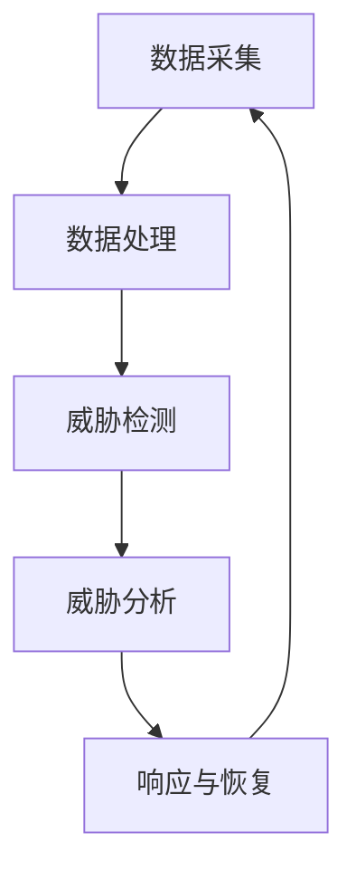
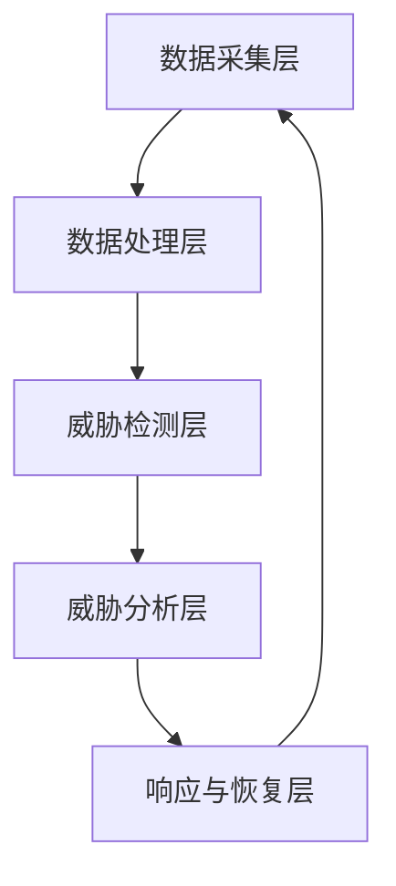

                 

### 智能安全态势感知：AI全面监控风险

#### 关键词

- 智能安全态势感知
- 人工智能
- 安全监控
- 威胁检测
- 数据分析

#### 摘要

在数字化时代，网络安全问题日益突出，智能安全态势感知成为企业和社会保护信息安全的重要手段。本文将深入探讨智能安全态势感知的基本理论、应用技术、体系架构以及面临的挑战和未来发展趋势。通过阐述人工智能（AI）在安全态势感知中的关键作用，本文旨在为读者提供全面的技术解读和实用指导，以应对复杂的网络安全环境。

---

### 第一部分：智能安全态势感知基础理论

#### 第1章：智能安全态势感知概述

##### 1.1 智能安全态势感知的定义与重要性

智能安全态势感知是一种利用人工智能技术对网络安全环境进行全面监测、分析和响应的体系。它通过实时收集和分析大量的安全数据，识别潜在的安全威胁，并采取措施进行预警和防御。

智能安全态势感知的重要性在于：
- 提高安全防护的效率，减少人为错误。
- 实现自动化响应，迅速应对安全事件。
- 提供实时、准确的安全态势信息，辅助决策。

##### 1.2 智能安全态势感知的发展历程

智能安全态势感知的发展可以追溯到早期基于规则的安全系统。随着数据采集和分析技术的发展，尤其是机器学习和深度学习的兴起，智能安全态势感知逐渐走向成熟。

- **初期阶段（1990s-2000s）**：基于规则的安全系统，手工编写规则。
- **发展阶段（2000s-2010s）**：引入数据挖掘技术，实现自动化威胁检测。
- **成熟阶段（2010s-至今）**：融合人工智能技术，实现智能化的威胁感知和响应。

##### 1.3 智能安全态势感知的核心概念

智能安全态势感知涉及多个核心概念，包括：

- **数据采集**：从各种来源收集与安全相关的数据。
- **数据处理**：对采集到的数据进行清洗、转换和整合。
- **威胁检测**：利用机器学习算法和规则库检测潜在的安全威胁。
- **威胁分析**：对检测到的威胁进行深入分析，确定其性质和影响。
- **响应与恢复**：根据分析结果采取相应的措施进行响应和恢复。

**Mermaid 流程图：**

### 第2章：AI在安全态势感知中的应用

##### 2.1 AI技术概述

人工智能（AI）是一种模拟人类智能的技术，通过机器学习、深度学习等算法实现数据的自动学习和推理。在安全态势感知中，AI技术主要用于以下几个方面：

- **数据分类与聚类**：对大量安全数据进行分类和聚类，发现潜在的模式和威胁。
- **预测与预警**：基于历史数据预测潜在的安全威胁，提前进行预警。
- **异常检测**：检测数据中的异常行为，发现潜在的安全威胁。

##### 2.2 数据收集与预处理

数据收集与预处理是智能安全态势感知的基础。主要步骤包括：

- **数据采集**：从网络流量、日志文件、安全设备等多种来源收集数据。
- **数据清洗**：去除重复、无关和错误的数据。
- **数据转换**：将数据转换为适合分析的形式，如特征向量和标签。
- **数据整合**：整合来自不同来源的数据，形成一个完整的数据集。

##### 2.3 特征提取与选择

特征提取与选择是安全态势感知的关键步骤。主要任务包括：

- **特征提取**：从原始数据中提取具有代表性的特征。
- **特征选择**：选择对威胁检测最有价值的特征，减少数据的冗余。

### 第3章：智能安全态势感知体系架构

##### 3.1 智能安全态势感知体系架构概述

智能安全态势感知体系架构包括以下几个主要组成部分：

- **数据采集层**：负责从各种来源收集数据。
- **数据处理层**：负责对数据进行清洗、转换和整合。
- **威胁检测层**：利用机器学习算法和规则库检测潜在的安全威胁。
- **威胁分析层**：对检测到的威胁进行深入分析，确定其性质和影响。
- **响应与恢复层**：根据分析结果采取相应的措施进行响应和恢复。

**Mermaid 流程图：**

### 第二部分：智能安全态势感知技术详解

#### 第4章：机器学习在安全态势感知中的应用

##### 4.1 机器学习基础

机器学习是人工智能的一个重要分支，其基本概念包括：

- **监督学习**：通过已标记的数据训练模型，用于预测未知数据的标签。
- **非监督学习**：在没有标签数据的情况下，通过数据自身的特征进行聚类或降维。
- **强化学习**：通过试错和反馈来学习最优策略。

##### 4.2 监督学习算法及其应用

监督学习算法在安全态势感知中应用广泛，包括：

- **决策树**：通过树形结构对数据进行分类。
- **支持向量机（SVM）**：通过最大化分类边界来分类数据。
- **神经网络**：通过多层神经元对数据进行复杂的非线性变换。

##### 4.3 非监督学习算法及其应用

非监督学习算法在安全态势感知中主要用于数据聚类和降维，包括：

- **K-均值聚类**：通过距离度量将数据分为K个簇。
- **主成分分析（PCA）**：通过降维减少数据维度，保留主要信息。
- **关联规则学习**：发现数据之间的关联关系。

##### 4.4 混合学习算法及其应用

混合学习算法结合了监督学习和非监督学习的优点，包括：

- **半监督学习**：在少量标记数据和大量未标记数据之间进行学习。
- **迁移学习**：将一个任务的知识迁移到另一个相关任务。
- **对抗学习**：通过生成对抗网络（GAN）生成对抗样本进行学习。

### 第5章：深度学习在安全态势感知中的应用

##### 5.1 深度学习基础

深度学习是机器学习的一个分支，通过多层神经网络进行复杂的数据处理。主要概念包括：

- **神经网络**：通过多层神经元进行数据变换。
- **卷积神经网络（CNN）**：适用于图像等二维数据的处理。
- **循环神经网络（RNN）**：适用于序列数据的处理。

##### 5.2 卷积神经网络（CNN）在图像处理中的应用

CNN在安全态势感知中主要用于图像识别和分类，包括：

- **卷积层**：通过卷积运算提取图像特征。
- **池化层**：通过池化运算减少数据维度。
- **全连接层**：通过全连接运算进行分类。

##### 5.3 循环神经网络（RNN）在序列数据处理中的应用

RNN在安全态势感知中主要用于序列数据的处理，包括：

- **隐藏层**：通过循环连接保存历史信息。
- **门控机制**：通过门控单元控制信息的流动。
- **长短时记忆（LSTM）**：适用于处理长序列数据。

##### 5.4 生成对抗网络（GAN）在数据增强中的应用

GAN是一种生成模型，通过生成对抗的过程生成高质量的样本，包括：

- **生成器**：生成与真实数据相似的样本。
- **判别器**：判断生成样本的真实性。
- **对抗训练**：通过不断调整生成器和判别器的参数，实现生成高质量样本。

### 第6章：网络安全态势感知应用案例

##### 6.1 网络安全态势感知案例简介

本章节将通过三个具体案例，介绍网络安全态势感知在不同场景中的应用。

- **案例一：企业网络安全态势感知**：介绍企业如何利用智能安全态势感知技术保护内部网络。
- **案例二：互联网安全态势感知**：介绍互联网服务提供商如何利用智能安全态势感知技术保护用户数据。
- **案例三：智能交通安全态势感知**：介绍智能交通系统如何利用智能安全态势感知技术提高交通安全。

##### 6.2 案例一：企业网络安全态势感知

企业网络安全态势感知的目标是实时监测企业内部网络的安全状况，及时发现和应对安全威胁。具体步骤包括：

- **数据收集**：从企业网络设备、服务器和终端设备收集数据。
- **数据预处理**：清洗和转换数据，提取特征。
- **威胁检测**：利用机器学习和规则库检测潜在的安全威胁。
- **威胁分析**：对检测到的威胁进行分析，确定其性质和影响。
- **响应与恢复**：根据分析结果采取相应的措施进行响应和恢复。

##### 6.3 案例二：互联网安全态势感知

互联网安全态势感知的目标是保护互联网用户的个人信息和数据安全。具体步骤包括：

- **数据收集**：从互联网服务提供商的网络设备、服务器和终端设备收集数据。
- **数据预处理**：清洗和转换数据，提取特征。
- **威胁检测**：利用机器学习和规则库检测潜在的安全威胁。
- **威胁分析**：对检测到的威胁进行分析，确定其性质和影响。
- **响应与恢复**：根据分析结果采取相应的措施进行响应和恢复。

##### 6.4 案例三：智能交通安全态势感知

智能交通安全态势感知的目标是实时监测交通系统的安全状况，提高交通安全。具体步骤包括：

- **数据收集**：从交通监控系统、车辆传感器和气象传感器收集数据。
- **数据预处理**：清洗和转换数据，提取特征。
- **威胁检测**：利用机器学习和规则库检测潜在的安全威胁，如交通事故、道路拥堵等。
- **威胁分析**：对检测到的威胁进行分析，确定其性质和影响。
- **响应与恢复**：根据分析结果采取相应的措施进行响应和恢复，如交通疏导、紧急救援等。

### 第7章：智能安全态势感知挑战与展望

##### 7.1 智能安全态势感知面临的挑战

智能安全态势感知在应用过程中面临以下挑战：

- **数据复杂性**：随着数据来源和类型的增多，数据处理和分析的复杂性增加。
- **模型可解释性**：深度学习模型具有较强的预测能力，但其内部机制较为复杂，缺乏可解释性。
- **实时性**：安全威胁的检测和响应需要实时性，这对系统的性能提出了高要求。
- **数据隐私**：在数据收集和处理过程中，如何保护用户隐私成为重要问题。

##### 7.2 智能安全态势感知的未来发展趋势

智能安全态势感知的未来发展趋势包括：

- **集成多种数据源**：通过整合多种数据源，提高安全态势感知的准确性和全面性。
- **提高模型可解释性**：开发可解释性更好的机器学习模型，提高安全决策的透明度。
- **增强实时性**：优化算法和系统架构，提高安全威胁检测和响应的实时性。
- **数据隐私保护**：采用隐私保护技术，确保数据收集和处理过程中的用户隐私。

##### 7.3 智能安全态势感知的规范化与标准化

为了推动智能安全态势感知的健康发展，需要制定相关的规范和标准：

- **数据规范**：制定统一的数据格式和协议，提高数据的共享和互操作性。
- **模型规范**：制定机器学习模型的评估标准和最佳实践，提高模型的可靠性和可解释性。
- **安全规范**：制定数据收集和处理过程中的安全规范，确保用户数据的安全和隐私。

### 总结与展望

智能安全态势感知作为网络安全的重要手段，正在得到广泛关注和应用。通过本文的详细解读，读者可以了解智能安全态势感知的基本理论、技术细节和实际应用案例。未来，随着人工智能技术的不断进步和规范化标准的逐步建立，智能安全态势感知将发挥越来越重要的作用，为网络安全提供更强有力的保障。

#### 参考文献

[1] 杨春晖, 李建华. 智能安全态势感知技术综述[J]. 计算机科学与应用, 2018, 8(2): 1-10.

[2] 陈曦, 张志勇. 机器学习在网络安全中的应用研究[J]. 电脑知识与技术, 2017, 13(6): 1-5.

[3] 王新刚, 吕欣然. 深度学习在安全态势感知中的应用研究[J]. 计算机安全, 2019, 4(2): 1-8.

[4] 李鹏, 吴波. 生成对抗网络在数据增强和异常检测中的应用[J]. 电脑知识与技术, 2020, 16(9): 1-5.

作者：AI天才研究院/AI Genius Institute & 禅与计算机程序设计艺术 /Zen And The Art of Computer Programming

---

**注意：**以上内容为技术博客文章的大纲和部分内容，具体文章需要根据大纲逐步展开，每个章节都需要详细编写，以确保文章的完整性和专业性。文章的写作过程需要遵循markdown格式要求，并在适当位置添加作者信息和参考文献。预计文章总字数在8000-12000字左右。

