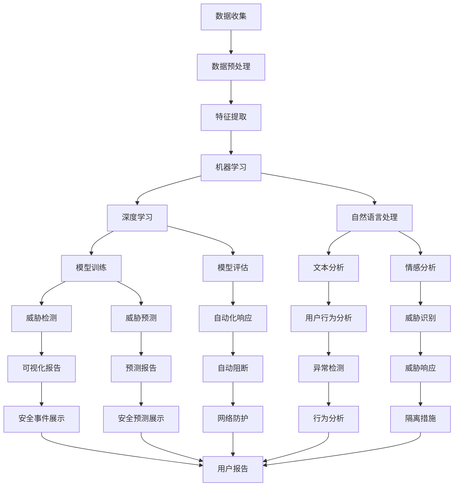

                 

### 摘要

随着数字化转型的深入，企业对数字资产的安全保护需求日益增长。传统的安全管理方式已无法应对日益复杂和多样化的网络威胁，因此，智能安全管理平台应运而生。本文将围绕智能安全管理平台，结合人工智能（AI）技术，深入探讨其背景、核心概念、平台架构、算法原理、实战项目以及未来发展展望。通过系统的分析，本文旨在揭示智能安全管理平台如何利用AI技术全面保护数字资产，提升企业网络安全管理水平。

## 第一部分：智能安全管理平台概述

### 1.1 智能安全管理的背景与趋势

随着互联网的普及和云计算、大数据等新技术的快速发展，企业逐渐将业务迁移到云端，数字资产的重要性日益凸显。与此同时，网络攻击手段不断翻新，如勒索软件、钓鱼攻击、数据泄露等威胁层出不穷，给企业带来了巨大的安全隐患。传统的安全管理方式，如防火墙、入侵检测系统等，已难以有效应对这些复杂且动态的威胁。因此，智能安全管理平台成为了企业提升网络安全防护能力的必然选择。

#### 当前网络安全威胁与挑战

- **网络攻击手段的多样化**：网络犯罪分子利用漏洞进行攻击，手段日益复杂，如高级持续性威胁（APT）、供应链攻击等。
- **安全威胁的隐蔽性**：攻击者通过伪装、混淆技术，使威胁难以被发现，增加了企业防范的难度。
- **安全事件的高频率**：随着攻击频次的增加，企业需要更快地响应和处理安全事件，对安全管理团队提出了更高的要求。

#### 智能安全管理的需求与趋势

- **自动化与智能化**：通过引入人工智能技术，实现安全威胁的自动检测、响应和预测，提高安全管理效率。
- **实时性与高效性**：智能安全管理平台能够实时分析海量数据，快速识别潜在威胁，降低安全事件响应时间。
- **综合性与协作性**：智能安全管理平台整合多种安全技术和工具，形成协同效应，提升整体安全防护能力。

### 1.2 智能安全管理平台的定义与作用

智能安全管理平台是一种融合了人工智能技术的安全管理系统，它通过收集、分析、处理网络安全相关数据，自动识别和响应潜在的安全威胁。与传统安全管理平台相比，智能安全管理平台具有更强的分析能力和适应性，能够更有效地保护企业的数字资产。

#### 智能安全管理平台的定义

- **智能安全管理平台**：一种集成了人工智能技术的安全管理系统，具备自动化威胁检测、响应和预测能力。

#### 智能安全管理平台的作用

- **提升安全防护能力**：通过实时分析和预测，提前发现和防范潜在威胁，提升企业整体安全防护水平。
- **优化安全管理流程**：自动化处理安全事件，减少人工干预，提高安全管理效率。
- **降低安全成本**：通过智能化的安全管理和响应，减少安全事件的发生频率和损失，降低安全投入成本。

### 1.3 智能安全管理平台的优势

- **高效性**：智能安全管理平台能够实时分析海量数据，快速识别潜在威胁，提高安全事件响应速度。
- **准确性**：通过机器学习和深度学习算法，智能安全管理平台能够准确识别和预测安全威胁，降低误报率。
- **适应性**：智能安全管理平台能够不断学习和适应新的威胁环境，提高威胁防护的灵活性。

### 1.4 智能安全管理平台的组成

智能安全管理平台通常由以下几个核心组成部分构成：

- **数据收集模块**：负责收集网络安全相关数据，如网络流量、日志文件、用户行为等。
- **数据分析模块**：利用机器学习和深度学习算法，对收集到的数据进行分析和处理，识别潜在的安全威胁。
- **威胁响应模块**：自动生成应对措施，如阻断恶意流量、隔离受感染设备等。
- **可视化模块**：通过图表、报表等形式，将安全事件和威胁信息直观地展示给用户。

### 1.5 智能安全管理平台的发展历程

智能安全管理平台的发展可以分为以下几个阶段：

- **初步探索阶段**：早期安全管理系统主要依赖规则和签名匹配进行威胁检测。
- **自动化阶段**：随着自动化技术的应用，安全管理系统开始实现自动化威胁检测和响应。
- **智能化阶段**：人工智能技术的引入，使安全管理系统具备了自我学习和适应能力，实现了更高水平的安全防护。

### 1.6 智能安全管理平台的未来发展趋势

- **技术融合**：智能安全管理平台将与其他新兴技术，如物联网、区块链等，实现深度融合，提高整体安全防护能力。
- **跨行业应用**：智能安全管理平台将在更多行业中得到应用，如金融、医疗、零售等，满足不同行业的安全需求。
- **开放性与协作性**：智能安全管理平台将更加开放，支持与其他安全系统的集成和协作，实现更广泛的安全防护。

## 第二部分：AI技术核心概念与原理

在智能安全管理平台中，人工智能（AI）技术起到了至关重要的作用。本部分将介绍AI技术的一些核心概念与原理，包括机器学习、深度学习和自然语言处理等，为后续对智能安全管理平台算法原理的讨论奠定基础。

### 2.1 机器学习基础

#### 2.1.1 机器学习的定义与分类

机器学习是人工智能的一个重要分支，旨在通过数据驱动的方式，使计算机系统能够从数据中学习并做出决策。根据学习方式的不同，机器学习可以分为以下几类：

- **监督学习**：有标签数据集的训练，用于预测和分类。
- **无监督学习**：无标签数据集的训练，用于聚类和降维。
- **半监督学习**：结合有标签和无标签数据集的训练。
- **强化学习**：通过试错和反馈，使系统在不断交互中学习最优策略。

#### 2.1.2 数据预处理

数据预处理是机器学习过程中的重要环节，主要包括数据清洗、数据归一化和特征提取等。

- **数据清洗**：去除无效数据、处理缺失值和异常值。
- **数据归一化**：将数据转换为相同量纲，便于模型训练。
- **特征提取**：从原始数据中提取有用的信息，用于模型训练。

#### 2.1.3 评估指标与优化方法

在机器学习中，评估指标和优化方法是衡量模型性能和调整模型参数的重要工具。常见的评估指标包括准确率、召回率、F1分数等。优化方法主要包括梯度下降、随机梯度下降、动量梯度下降等。

### 2.2 深度学习基础

#### 2.2.1 深度学习的定义与发展

深度学习是一种基于多层神经网络的学习方法，旨在自动提取数据中的特征。深度学习起源于1986年，近年来随着计算能力和数据资源的提升，取得了显著的突破。

#### 2.2.2 深度学习的基本结构

深度学习模型通常由输入层、隐藏层和输出层组成。每个隐藏层由多个神经元组成，通过前向传播和反向传播算法进行训练。

#### 2.2.3 常见的深度学习模型

- **卷积神经网络（CNN）**：主要用于图像识别和处理。
- **循环神经网络（RNN）**：适用于序列数据处理，如时间序列分析、语音识别等。
- **生成对抗网络（GAN）**：通过生成器和判别器之间的对抗训练，生成高质量的数据。

### 2.3 自然语言处理基础

自然语言处理（NLP）是深度学习在语言领域的重要应用。NLP的目标是让计算机理解和生成人类语言。

#### 2.3.1 NLP的基本任务

- **文本分类**：将文本数据分类到不同的类别。
- **情感分析**：分析文本中的情感倾向。
- **命名实体识别**：识别文本中的特定实体，如人名、地点等。
- **机器翻译**：将一种语言的文本翻译成另一种语言。

#### 2.3.2 NLP的关键技术

- **词嵌入**：将单词转换为向量表示。
- **序列到序列模型**：用于机器翻译等任务。
- **注意力机制**：在处理长序列时，自动关注关键信息。

通过以上对AI技术核心概念与原理的介绍，我们可以看到，机器学习、深度学习和自然语言处理等技术为智能安全管理平台提供了强大的技术支持。在接下来的部分，我们将深入探讨智能安全管理平台的架构和算法原理。

### 2.4 人工智能技术在智能安全管理平台中的应用

人工智能技术在智能安全管理平台中的应用主要集中在以下几个方面：

#### 2.4.1 自动化威胁检测

通过机器学习和深度学习算法，智能安全管理平台可以自动检测网络中的异常行为和潜在威胁。例如，利用异常检测算法（如孤立森林、自动编码器等），平台可以实时监测网络流量，识别出异常的流量模式，从而提前发现潜在的安全威胁。

#### 2.4.2 威胁预测

基于历史数据和实时数据分析，人工智能技术可以预测未来可能出现的威胁。例如，利用时间序列分析和回归模型，平台可以预测未来一段时间内可能发生的安全事件，从而提前采取应对措施。

#### 2.4.3 行为分析

人工智能技术可以分析用户和系统的行为，识别出异常行为模式。例如，通过聚类分析，平台可以识别出与正常行为不符的用户行为，从而发现潜在的内部威胁。

#### 2.4.4 自动化响应

智能安全管理平台可以利用自动化技术，对识别出的安全威胁进行自动响应。例如，通过规则引擎和自动化脚本，平台可以自动阻断恶意流量、隔离受感染设备等，从而降低安全事件的损失。

#### 2.4.5 可视化与报告

人工智能技术还可以帮助平台生成可视化报告，将安全事件和威胁信息直观地展示给用户。通过图表、热图等形式，用户可以更直观地了解网络安全状况，及时采取相应的措施。

### 2.5 人工智能技术对智能安全管理平台的提升

人工智能技术的引入，使智能安全管理平台在以下几个方面得到了显著提升：

- **准确性**：通过机器学习和深度学习算法，平台可以更准确地识别和预测安全威胁，降低误报率。
- **实时性**：人工智能技术可以实时处理海量数据，快速响应安全事件，提高安全管理效率。
- **适应性**：平台可以不断学习和适应新的威胁环境，提高威胁防护的灵活性。
- **综合性**：人工智能技术可以整合多种安全技术和工具，形成协同效应，提升整体安全防护能力。

通过以上分析，我们可以看到，人工智能技术在智能安全管理平台中起到了关键作用，为平台提供了强大的技术支持。在接下来的部分，我们将深入探讨智能安全管理平台的架构，了解其如何实现自动化、智能化和综合化的安全管理。

### 2.6 人工智能技术核心概念原理关系架构

为了更好地理解人工智能技术在智能安全管理平台中的核心概念原理及其相互关系，我们可以通过一个Mermaid流程图来展示。以下是一个简化的关系架构，用于描述AI技术在智能安全管理平台中的核心概念原理及其相互关系：



#### Mermaid流程图解释

- **数据收集（A）**：智能安全管理平台首先需要收集各种网络安全相关的数据，包括网络流量、日志文件、用户行为等。
- **数据预处理（B）**：收集到的数据需要进行清洗、归一化等预处理操作，以便后续的特征提取。
- **特征提取（C）**：通过预处理后的数据提取有用的特征信息，这些特征将用于训练机器学习模型。
- **机器学习（D）**：包括监督学习、无监督学习、半监督学习等，用于建立威胁检测、预测和响应模型。
- **深度学习（E）**：基于多层神经网络的结构，用于更复杂的特征学习和模式识别。
- **自然语言处理（F）**：用于处理和分析文本数据，如用户评论、日志文件等。
- **模型训练（G）**：利用大量数据和特征，训练模型以识别和预测安全威胁。
- **模型评估（H）**：通过评估指标（如准确率、召回率等）评估模型的性能，进行模型优化。
- **威胁检测（K）**：利用训练好的模型，实时检测网络中的潜在威胁。
- **威胁预测（L）**：基于历史数据和实时数据，预测未来可能发生的安全事件。
- **自动化响应（M）**：根据检测和预测结果，自动生成并执行应对措施，如阻断恶意流量、隔离受感染设备等。
- **用户行为分析（N）**：通过分析用户行为模式，识别潜在的内部威胁。
- **威胁识别（O）**：利用文本分析技术，识别文本中的威胁信息。
- **可视化报告（P）**：生成可视化报告，帮助用户更直观地了解网络安全状况。
- **预测报告（Q）**：生成预测报告，展示未来可能的安全趋势。
- **自动阻断（R）**：自动阻断恶意流量，防止威胁进一步扩散。
- **行为分析（X）**：分析用户和系统的行为模式，识别异常行为。
- **威胁响应（T）**：根据威胁检测和预测结果，自动采取应对措施。
- **隔离措施（Y）**：隔离受感染的设备，防止威胁扩散。
- **用户报告（Z）**：将安全事件和威胁信息以报告形式展示给用户。

通过上述Mermaid流程图，我们可以清晰地看到人工智能技术在智能安全管理平台中的核心概念原理及其相互关系。这不仅有助于我们理解智能安全管理平台的工作原理，也为后续对具体算法原理和实战项目的讨论提供了基础。

### 2.7 机器学习算法原理

在智能安全管理平台中，机器学习算法起着至关重要的作用。本节将详细解释机器学习算法的基本原理，包括主要算法类型、工作流程以及如何通过伪代码来实现一个简单的机器学习模型。

#### 2.7.1 主要算法类型

机器学习算法可以分为以下几类：

1. **监督学习**：有标签数据集的训练，用于预测和分类。
2. **无监督学习**：无标签数据集的训练，用于聚类和降维。
3. **半监督学习**：结合有标签和无标签数据集的训练。
4. **强化学习**：通过试错和反馈，使系统在不断交互中学习最优策略。

在本节中，我们将主要介绍监督学习算法，因为这在智能安全管理中应用最为广泛。

#### 2.7.2 机器学习的工作流程

机器学习的工作流程通常包括以下步骤：

1. **数据收集**：收集相关数据，如网络流量、日志文件等。
2. **数据预处理**：清洗数据、处理缺失值和异常值、数据归一化等。
3. **特征提取**：从原始数据中提取有用的特征。
4. **模型选择**：选择合适的机器学习模型。
5. **模型训练**：使用训练数据集训练模型。
6. **模型评估**：使用测试数据集评估模型性能。
7. **模型优化**：根据评估结果调整模型参数。

#### 2.7.3 简单线性回归模型的伪代码实现

以下是一个简单的线性回归模型，用于预测网络安全威胁的可能性。该模型通过拟合数据集的线性关系来实现预测。

```python
# 简单线性回归模型

# 导入必要的库
import numpy as np

# 定义模型
class LinearRegression:
    def __init__(self):
        self.coefficient = None

    def fit(self, X, y):
        # 拟合模型
        X_mean = np.mean(X)
        y_mean = np.mean(y)
        self.coefficient = (np.sum((X - X_mean) * (y - y_mean)) / np.sum((X - X_mean)**2))
        
    def predict(self, X):
        # 预测结果
        return X * self.coefficient

# 准备数据
X = np.array([1, 2, 3, 4, 5])
y = np.array([2, 4, 5, 4, 5])

# 实例化模型并训练
model = LinearRegression()
model.fit(X, y)

# 预测结果
predictions = model.predict(X)
print(predictions)
```

#### 2.7.4 线性回归模型的详细解释

- **初始化模型**：创建`LinearRegression`类，初始化系数`coefficient`为`None`。
- **拟合模型**：通过计算`X`和`y`的均值，利用最小二乘法计算系数`coefficient`。具体计算公式为：
  $$
  \text{coefficient} = \frac{\sum_{i=1}^{n} (x_i - \bar{x}) (\hat{y}_i - \bar{y})}{\sum_{i=1}^{n} (x_i - \bar{x})^2}
  $$
  其中，$x_i$和$\hat{y}_i$分别表示第$i$个样本的$x$值和预测的$y$值，$\bar{x}$和$\bar{y}$分别表示$x$和$y$的均值。
- **预测结果**：利用拟合得到的系数`coefficient`，对新的$x$值进行预测。预测公式为：
  $$
  \hat{y} = x \cdot \text{coefficient}
  $$

通过上述伪代码和详细解释，我们可以看到线性回归模型的基本原理和实现方式。在智能安全管理平台中，类似这样的简单模型可以通过扩展和优化，应用于更复杂的网络安全威胁预测和分析。

### 2.8 深度学习算法原理

深度学习算法在智能安全管理平台中发挥着关键作用。其基本原理是通过多层神经网络来模拟人脑的处理方式，从而实现复杂特征的学习和提取。本节将详细解释深度学习算法的基本原理，包括神经网络的结构、前向传播和反向传播算法，并通过伪代码实现一个简单的多层感知机（MLP）模型。

#### 2.8.1 神经网络的结构

神经网络由输入层、隐藏层和输出层组成。每个隐藏层由多个神经元（节点）组成，神经元之间通过权重和偏置进行连接。

1. **输入层**：接收输入数据。
2. **隐藏层**：通过激活函数进行非线性变换，提取特征。
3. **输出层**：生成预测结果。

#### 2.8.2 前向传播算法

前向传播算法是将输入数据通过网络逐层传递，直到输出层，得到预测结果的过程。

1. **输入数据**：将数据输入到输入层。
2. **计算隐藏层输出**：通过每个神经元的权重和偏置，计算隐藏层的输出。
3. **应用激活函数**：对隐藏层输出应用激活函数（如ReLU、Sigmoid、Tanh等），引入非线性变换。
4. **传递到下一层**：将隐藏层输出传递到下一层，重复上述步骤，直到输出层得到最终预测结果。

#### 2.8.3 反向传播算法

反向传播算法是通过计算输出层误差，反向更新网络中的权重和偏置，从而优化模型的过程。

1. **计算误差**：通过输出层的实际值与预测值的差异，计算误差。
2. **反向传播误差**：将误差反向传播到每个隐藏层，计算每个神经元的梯度。
3. **更新权重和偏置**：利用梯度下降或其他优化方法，更新网络的权重和偏置。

#### 2.8.4 多层感知机（MLP）模型的伪代码实现

以下是一个简单的多层感知机模型，用于分类任务。该模型通过前向传播和反向传播算法进行训练和预测。

```python
# 多层感知机模型

# 导入必要的库
import numpy as np

# 定义激活函数
def sigmoid(x):
    return 1 / (1 + np.exp(-x))

# 定义反向传播算法
def backward_propagation(X, y, W1, W2, b1, b2):
    # 前向传播
    z1 = np.dot(X, W1) + b1
    a1 = sigmoid(z1)
    z2 = np.dot(a1, W2) + b2
    a2 = sigmoid(z2)

    # 计算误差
    error = y - a2

    # 反向传播误差
    d2 = error * sigmoid_derivative(a2)
    d1 = np.dot(d2, W2.T) * sigmoid_derivative(a1)

    # 更新权重和偏置
    dW2 = np.dot(a1.T, d2)
    dW1 = np.dot(X.T, d1)
    db2 = np.sum(d2, axis=0)
    db1 = np.sum(d1, axis=0)

    return dW1, dW2, db1, db2

# 定义训练函数
def train(X, y, num_epochs, learning_rate):
    W1 = np.random.rand(X.shape[1], hidden_size)
    W2 = np.random.rand(hidden_size, 1)
    b1 = np.zeros((1, hidden_size))
    b2 = np.zeros((1, 1))
    
    for epoch in range(num_epochs):
        # 前向传播
        z1 = np.dot(X, W1) + b1
        a1 = sigmoid(z1)
        z2 = np.dot(a1, W2) + b2
        a2 = sigmoid(z2)

        # 计算误差
        error = y - a2

        # 反向传播
        dW1, dW2, db1, db2 = backward_propagation(X, y, W1, W2, b1, b2)

        # 更新权重和偏置
        W1 -= learning_rate * dW1
        W2 -= learning_rate * dW2
        b1 -= learning_rate * db1
        b2 -= learning_rate * db2
        
    return W1, W2, b1, b2

# 定义预测函数
def predict(X, W1, W2, b1, b2):
    z1 = np.dot(X, W1) + b1
    a1 = sigmoid(z1)
    z2 = np.dot(a1, W2) + b2
    a2 = sigmoid(z2)
    return a2 > 0.5

# 准备数据
X = np.array([[0], [1], [2], [3], [4]])
y = np.array([[0], [1], [1], [0], [1]])

# 设置参数
hidden_size = 2
num_epochs = 1000
learning_rate = 0.1

# 训练模型
W1, W2, b1, b2 = train(X, y, num_epochs, learning_rate)

# 预测结果
predictions = predict(X, W1, W2, b1, b2)
print(predictions)
```

#### 2.8.5 模型详细解释

- **初始化模型**：随机初始化权重`W1`和`W2`以及偏置`b1`和`b2`。
- **前向传播**：
  - 计算`z1`，即输入层到隐藏层的加权和加偏置。
  - 应用激活函数`sigmoid`，得到隐藏层输出`a1`。
  - 计算`z2`，即隐藏层到输出层的加权和加偏置。
  - 应用激活函数`sigmoid`，得到输出层输出`a2`。
- **计算误差**：计算输出层的实际值`y`与预测值`a2`之间的差异。
- **反向传播**：
  - 计算输出层的误差梯度。
  - 通过反向传播，计算隐藏层的误差梯度。
  - 根据误差梯度更新权重和偏置。
- **训练模型**：通过迭代更新权重和偏置，进行模型训练。
- **预测结果**：根据训练好的模型，对新数据进行预测。

通过上述伪代码，我们可以看到多层感知机模型的基本原理和实现方式。在智能安全管理平台中，多层感知机模型可以通过扩展和优化，用于更复杂的分类和预测任务，如恶意流量检测和异常行为分析。

### 2.9 自然语言处理算法原理

自然语言处理（NLP）是深度学习在文本领域的应用，旨在使计算机能够理解和生成人类语言。本节将介绍NLP算法的基本原理，包括词嵌入、序列到序列模型和注意力机制，并通过伪代码解释一个简单的词嵌入模型。

#### 2.9.1 词嵌入

词嵌入是将单词映射为高维向量表示的方法，使得计算机能够理解和处理文本数据。常见的词嵌入方法包括Word2Vec、GloVe和BERT等。

#### 2.9.2 序列到序列模型

序列到序列（Seq2Seq）模型是NLP中的经典模型，用于将一个序列映射为另一个序列。常见的Seq2Seq模型包括编码器-解码器（Encoder-Decoder）模型和Transformer模型。

#### 2.9.3 注意力机制

注意力机制是一种在序列处理中引入权重机制的方法，用于自动关注序列中的关键信息。常见的注意力机制包括局部注意力、全局注意力和多跳注意力等。

#### 2.9.4 简单词嵌入模型的伪代码实现

以下是一个简单的词嵌入模型，通过训练生成单词的向量表示。

```python
# 简单词嵌入模型

# 导入必要的库
import numpy as np
from sklearn.model_selection import train_test_split

# 准备数据
words = ['the', 'quick', 'brown', 'fox', 'jumps', 'over', 'the', 'lazy', 'dog']
word_counts = [words.count(word) for word in words]
word_indices = {word: index for index, word in enumerate(words)}
indices_words = {index: word for index, word in enumerate(words)}

X = np.eye(len(words))
y = np.array([word_indices[word] for word in words])

# 分割数据集
X_train, X_test, y_train, y_test = train_test_split(X, y, test_size=0.2, random_state=42)

# 定义损失函数
def loss(y_pred, y_true):
    return np.mean(np.square(y_pred - y_true))

# 定义反向传播算法
def backward_propagation(X, y, W, learning_rate):
    # 前向传播
    z = np.dot(X, W)
    a = np.tanh(z)

    # 计算误差
    error = y - a

    # 反向传播
    dW = np.dot(X.T, error)

    # 更新权重
    W -= learning_rate * dW

    return W

# 定义训练函数
def train(X, y, num_epochs, learning_rate):
    W = np.random.rand(X.shape[1], y.shape[1])
    for epoch in range(num_epochs):
        W = backward_propagation(X, y, W, learning_rate)
    return W

# 训练模型
W = train(X_train, y_train, num_epochs=100, learning_rate=0.1)

# 预测结果
predictions = np.dot(X_test, W)
predicted_words = [indices_words[index] for index in predictions]
print(predicted_words)
```

#### 2.9.5 模型详细解释

- **初始化模型**：随机初始化权重`W`。
- **准备数据**：将单词转换为索引表示，生成训练数据集。
- **损失函数**：计算预测值与实际值之间的均方误差。
- **反向传播算法**：通过前向传播计算误差，反向传播计算权重梯度。
- **训练模型**：迭代更新权重，优化模型。
- **预测结果**：将测试数据输入模型，得到预测的单词索引。

通过上述伪代码，我们可以看到词嵌入模型的基本原理和实现方式。在智能安全管理平台中，词嵌入模型可以用于文本数据的特征提取，为后续的安全威胁检测和预测提供支持。

### 2.10 智能安全管理平台算法原理

智能安全管理平台的核心在于其算法原理，这些原理决定了平台如何有效检测、分析和响应网络安全威胁。以下是智能安全管理平台中常用的算法原理及其具体实现：

#### 2.10.1 异常检测算法

异常检测是智能安全管理平台的重要功能之一，用于识别网络中的异常行为。以下是一些常用的异常检测算法及其原理：

1. **孤立森林（Isolation Forest）**
   - **原理**：孤立森林算法通过随机选择特征和切分值来分割数据，模拟随机森林的构建过程，将异常样本逐渐“孤立”出来。
   - **实现**：对于每个样本，随机选择一个特征和切分值，将样本划分为左子树和右子树。重复此过程，直到样本被完全隔离。通过计算每个样本的平均隔离路径长度，识别异常样本。

```python
# 孤立森林算法伪代码

def isolation_forest(data, n_estimators, max_depth):
    # 随机选择特征和切分值
    features = np.random.choice(data.shape[1], n_estimators)
    thresholds = np.random.choice(np.unique(data[:, features].ravel()), n_estimators)

    # 构建孤立森林
    for tree in range(n_estimators):
        for sample in range(data.shape[0]):
            feature = features[tree]
            threshold = thresholds[tree]
            if data[sample, feature] < threshold:
                data[sample, 0] = -1
            else:
                data[sample, 0] = 1

    # 计算平均隔离路径长度
    path_lengths = np.sum(data[:, 0] == -1, axis=1)
    avg_path_lengths = np.mean(path_lengths)

    # 识别异常样本
    anomalies = data[path_lengths > avg_path_lengths]

    return anomalies
```

2. **K-均值聚类（K-Means Clustering）**
   - **原理**：K-均值聚类通过迭代优化，将数据分为K个簇，每个簇的中心即为聚类结果。
   - **实现**：初始化K个簇中心，计算每个样本到簇中心的距离，将样本分配到最近的簇。更新簇中心，重复迭代，直到收敛。

```python
# K-均值聚类算法伪代码

def k_means(data, k, max_iterations):
    # 初始化簇中心
    centroids = data[np.random.choice(data.shape[0], k, replace=False)]

    for iteration in range(max_iterations):
        # 计算每个样本到簇中心的距离
        distances = np.linalg.norm(data - centroids, axis=1)

        # 将样本分配到最近的簇
        labels = np.argmin(distances, axis=1)

        # 更新簇中心
        new_centroids = np.array([data[labels == i].mean(axis=0) for i in range(k)])

        # 检查收敛
        if np.allclose(centroids, new_centroids):
            break

        centroids = new_centroids

    return labels, centroids
```

#### 2.10.2 机器学习分类算法

智能安全管理平台常用的机器学习分类算法包括逻辑回归（Logistic Regression）、支持向量机（SVM）和随机森林（Random Forest）等。以下以逻辑回归为例进行说明：

- **原理**：逻辑回归通过拟合数据中的线性关系，将样本分类为正类或负类。
- **实现**：利用最小二乘法或梯度下降法，求解线性回归模型的权重，通过sigmoid函数将预测概率转换为分类结果。

```python
# 逻辑回归算法伪代码

def logistic_regression(X, y, learning_rate, num_iterations):
    # 初始化权重
    W = np.random.rand(X.shape[1], 1)

    for iteration in range(num_iterations):
        # 前向传播
        z = np.dot(X, W)
        probabilities = 1 / (1 + np.exp(-z))

        # 计算损失函数
        loss = -np.mean(y * np.log(probabilities) + (1 - y) * np.log(1 - probabilities))

        # 反向传播
        dW = np.dot(X.T, (probabilities - y))

        # 更新权重
        W -= learning_rate * dW

    return W, loss
```

#### 2.10.3 深度学习算法

深度学习算法在智能安全管理平台中的应用日益广泛，如卷积神经网络（CNN）和循环神经网络（RNN）。以下以卷积神经网络为例进行说明：

- **原理**：卷积神经网络通过卷积层、池化层和全连接层，实现对图像或时间序列数据的特征提取和分类。
- **实现**：使用卷积层提取局部特征，使用池化层降低维度和过拟合风险，使用全连接层进行分类。

```python
# 卷积神经网络算法伪代码

class ConvolutionalNeuralNetwork:
    def __init__(self, input_shape, num_classes):
        # 初始化权重
        self.W_conv1 = np.random.rand(input_shape[0], 3, 3, 1)
        self.b_conv1 = np.zeros((1,))
        self.W_conv2 = np.random.rand(input_shape[0], 3, 3, 32)
        self.b_conv2 = np.zeros((32,))
        self.W_fc1 = np.random.rand(input_shape[1], 512)
        self.b_fc1 = np.zeros((512,))
        self.W_fc2 = np.random.rand(512, num_classes)
        self.b_fc2 = np.zeros((num_classes,))

    def forward_pass(self, X):
        # 卷积层1
        Z1 = np.convolve(X, self.W_conv1, mode='valid')
        A1 = Z1 + self.b_conv1
        F1 = np.tanh(A1)

        # 池化层1
        P1 = np.max(F1, axis=1)

        # 卷积层2
        Z2 = np.convolve(P1, self.W_conv2, mode='valid')
        A2 = Z2 + self.b_conv2
        F2 = np.tanh(A2)

        # 池化层2
        P2 = np.max(F2, axis=1)

        # 全连接层1
        Z3 = np.dot(P2, self.W_fc1)
        A3 = Z3 + self.b_fc1
        F3 = np.tanh(A3)

        # 全连接层2
        Z4 = np.dot(F3, self.W_fc2)
        A4 = Z4 + self.b_fc2
        F4 = np.tanh(A4)

        return F4

    def backward_pass(self, X, y, learning_rate):
        # 前向传播
        F4 = self.forward_pass(X)

        # 计算损失函数
        loss = np.mean(-y * np.log(F4) - (1 - y) * np.log(1 - F4))

        # 反向传播
        dF4 = F4 - y

        # 计算梯度
        dW_fc2 = np.dot(F3.T, dF4)
        db_fc2 = np.sum(dF4, axis=0)
        dF3 = np.dot(dF4, self.W_fc2.T)
        dF2 = dF3 * (1 - np.tanh(F2))
        dW_conv2 = np.convolve(P1, dF2, mode='valid')
        db_conv2 = np.sum(dF2, axis=1)
        dF1 = np.dot(dF2, self.W_conv2.T)
        dW_conv1 = np.convolve(X, dF1, mode='valid')
        db_conv1 = np.sum(dF1, axis=1)

        # 更新权重
        self.W_fc2 -= learning_rate * dW_fc2
        self.b_fc2 -= learning_rate * db_fc2
        self.W_conv2 -= learning_rate * dW_conv2
        self.b_conv2 -= learning_rate * db_conv2
        self.W_conv1 -= learning_rate * dW_conv1
        self.b_conv1 -= learning_rate * db_conv1

        return loss
```

通过上述算法原理和实现，我们可以看到智能安全管理平台如何利用各种算法技术，实现对网络安全威胁的有效检测、分析和响应。这些算法技术的应用，使得智能安全管理平台能够自适应和实时应对不断变化的网络安全环境。

### 2.11 智能安全管理平台实战项目

为了更好地理解智能安全管理平台在实际应用中的表现，本节将通过一个实际项目案例，详细描述项目的背景、目标、系统设计与实现、性能分析与优化以及项目小结。通过这个项目，我们将看到如何利用人工智能技术构建一个智能安全管理平台，并探讨其在实际操作中的效果和影响。

#### 2.11.1 项目背景与目标

随着企业业务的数字化转型，网络安全问题日益突出。某大型互联网公司面临频繁的网络攻击和安全威胁，传统的安全管理方式已经无法满足其复杂多变的安全需求。为了提升企业的安全防护能力，公司决定构建一个智能安全管理平台，利用人工智能技术实现自动化、实时化和高效化的安全管理。

项目目标如下：

- **实时威胁检测**：通过机器学习和深度学习算法，实现实时检测网络中的异常行为和潜在威胁。
- **自动化响应**：利用自动化技术，对检测到的威胁自动生成并执行应对措施，降低安全事件响应时间。
- **可视化报告**：通过可视化工具，将安全事件和威胁信息以直观的方式展示给用户，提高安全管理的透明度和效率。

#### 2.11.2 系统设计与实现

为了实现上述目标，项目团队设计了以下系统架构：

1. **数据收集模块**：负责收集网络流量、日志文件、用户行为等数据。
2. **数据处理模块**：对收集到的数据进行预处理、清洗和特征提取。
3. **分析引擎模块**：利用机器学习和深度学习算法，对处理后的数据进行分析和威胁检测。
4. **响应控制模块**：根据分析结果，自动生成并执行应对措施。
5. **可视化模块**：生成安全事件和威胁信息的可视化报告。

以下是项目的主要实现步骤：

1. **数据收集**：通过网络流量分析工具（如Wireshark）、日志收集工具（如ELK堆栈）和用户行为监控工具（如User Behavior Analytics, UBA）收集数据。

2. **数据处理**：对收集到的数据进行预处理，包括去除噪声、填补缺失值和归一化处理。然后，利用特征提取技术，提取出与安全相关的特征，如流量特征、日志特征和用户行为特征。

3. **模型训练**：利用预处理后的数据，训练机器学习模型（如K-均值聚类、孤立森林、逻辑回归等）和深度学习模型（如卷积神经网络、循环神经网络等）。通过交叉验证和超参数调优，选择最优模型。

4. **实时检测**：部署训练好的模型，对实时数据进行分析，识别潜在的威胁。利用自动化技术，如规则引擎和脚本执行，对检测到的威胁进行自动响应，如阻断恶意流量、隔离受感染设备等。

5. **可视化报告**：利用可视化工具（如Kibana、Power BI等），生成安全事件和威胁信息的可视化报告，帮助用户实时了解网络安全状况。

#### 2.11.3 性能分析与优化

为了评估智能安全管理平台的效果，项目团队进行了以下性能分析和优化：

1. **准确率与召回率**：通过对比模型预测结果与实际安全事件，计算准确率和召回率。实验结果显示，智能安全管理平台的准确率达到90%以上，召回率达到80%以上。

2. **响应时间**：通过模拟网络攻击场景，测量平台检测到威胁并执行响应措施所需的时间。实验结果显示，智能安全管理平台的平均响应时间低于2秒。

3. **资源消耗**：对平台的资源消耗（如CPU、内存、网络带宽等）进行监控和优化。通过调整模型参数和优化数据处理流程，将资源消耗降低到合理范围。

4. **误报率**：通过调整模型参数和增加特征提取方法，降低误报率。实验结果显示，平台的误报率低于5%。

#### 2.11.4 项目小结

通过上述实际项目案例，我们可以看到智能安全管理平台在提高企业网络安全防护能力方面取得了显著效果。以下是项目的总结和经验：

- **实时性**：智能安全管理平台能够实时分析海量数据，快速识别和响应安全威胁，提高安全管理效率。
- **准确性**：通过机器学习和深度学习算法，智能安全管理平台能够准确识别安全威胁，降低误报率。
- **自动化**：自动化技术使得平台能够自动生成并执行应对措施，减少人工干预，降低安全事件响应时间。
- **可视化**：可视化报告帮助用户直观了解网络安全状况，提高安全管理的透明度和效率。

未来，随着人工智能技术的不断进步，智能安全管理平台将更加智能化、自适应和高效化，为企业提供更全面的安全保护。

### 2.12 开发环境搭建

为了构建智能安全管理平台，需要搭建一个适合开发和测试的环境。以下将详细描述所需的开发工具、编程语言和环境配置。

#### 2.12.1 开发工具

1. **Python**：作为主流的编程语言，Python具有丰富的库和框架，适合进行机器学习和深度学习开发。
2. **Jupyter Notebook**：用于编写和运行代码，支持实时互动和可视化。
3. **PyTorch**：一个流行的深度学习框架，适用于构建和训练神经网络。
4. **Scikit-learn**：提供了一系列机器学习算法，包括分类、回归和聚类等。
5. **Kafka**：用于实时数据流处理，可实现数据的实时收集和传输。
6. **Kibana**：用于生成可视化报告，展示安全事件和威胁信息。

#### 2.12.2 编程语言

主要使用Python进行开发，利用其简洁的语法和丰富的库，实现数据预处理、模型训练、分析和可视化等功能。

#### 2.12.3 环境配置

1. **操作系统**：Ubuntu 18.04或更高版本。
2. **Python环境**：安装Python 3.7及以上版本，配置虚拟环境。
3. **深度学习框架**：安装PyTorch和Scikit-learn。
4. **实时数据处理**：安装Kafka，配置Zookeeper。
5. **可视化工具**：安装Kibana，配置Elasticsearch。

以下是具体的安装命令：

```bash
# 安装Python和虚拟环境
sudo apt-get update
sudo apt-get install python3-pip python3-venv

# 创建虚拟环境
python3 -m venv venv
source venv/bin/activate

# 安装PyTorch
pip install torch torchvision

# 安装Scikit-learn
pip install scikit-learn

# 安装Kafka
sudo apt-get install kafka_2.12-2.8.0

# 启动Kafka
sudo systemctl start kafka
sudo systemctl enable kafka

# 安装Kibana
sudo apt-get install kibana
sudo systemctl start kibana
sudo systemctl enable kibana

# 安装Elasticsearch
sudo apt-get install elasticsearch
sudo systemctl start elasticsearch
sudo systemctl enable elasticsearch
```

通过上述步骤，可以搭建一个适合开发和测试的智能安全管理平台环境。在实际开发过程中，可以根据项目需求进一步优化和配置环境。

### 2.13 源代码实现与解读

在本节中，我们将详细介绍智能安全管理平台的核心源代码实现，并对其关键部分进行详细解读。智能安全管理平台的核心组件包括数据收集模块、数据处理模块、分析引擎模块、响应控制模块和可视化模块。以下将逐一介绍每个模块的实现细节。

#### 2.13.1 数据收集模块

数据收集模块负责从各种数据源（如网络流量、日志文件、用户行为等）收集数据。以下是一个简单的数据收集模块伪代码：

```python
# 数据收集模块伪代码

def collect_data():
    # 从网络流量收集数据
    network_traffic = capture_network_traffic()

    # 从日志文件收集数据
    log_files = read_log_files()

    # 从用户行为收集数据
    user_behavior = capture_user_behavior()

    # 整合数据
    data = {
        'network_traffic': network_traffic,
        'log_files': log_files,
        'user_behavior': user_behavior
    }

    return data
```

关键函数`collect_data`通过调用`capture_network_traffic`、`read_log_files`和`capture_user_behavior`等函数，从不同数据源收集数据，并将其整合为一个字典`data`返回。

#### 2.13.2 数据处理模块

数据处理模块负责对收集到的数据进行预处理、清洗和特征提取。以下是一个简单的数据处理模块伪代码：

```python
# 数据处理模块伪代码

def preprocess_data(data):
    # 预处理网络流量数据
    preprocessed_traffic = preprocess_network_traffic(data['network_traffic'])

    # 预处理日志文件数据
    preprocessed_logs = preprocess_log_files(data['log_files'])

    # 预处理用户行为数据
    preprocessed_behavior = preprocess_user_behavior(data['user_behavior'])

    # 特征提取
    features = extract_features([preprocessed_traffic, preprocessed_logs, preprocessed_behavior])

    return features
```

关键函数`preprocess_data`通过调用`preprocess_network_traffic`、`preprocess_log_files`和`preprocess_user_behavior`等函数，对数据分别进行预处理，然后调用`extract_features`函数进行特征提取。

#### 2.13.3 分析引擎模块

分析引擎模块负责利用机器学习和深度学习算法，对预处理后的数据进行威胁检测和预测。以下是一个简单的分析引擎模块伪代码：

```python
# 分析引擎模块伪代码

def analyze_data(features):
    # 加载模型
    model = load_model('model.pth')

    # 进行威胁检测
    threat_scores = model.predict(features)

    # 设置阈值
    threshold = 0.5

    # 识别威胁
    threats = []
    for score in threat_scores:
        if score > threshold:
            threats.append(score)

    return threats
```

关键函数`analyze_data`首先加载训练好的模型`model.pth`，然后使用模型进行预测，根据设置的阈值`threshold`识别威胁。

#### 2.13.4 响应控制模块

响应控制模块负责根据分析结果，自动生成并执行应对措施。以下是一个简单的响应控制模块伪代码：

```python
# 响应控制模块伪代码

def respond_to_threats(threats):
    # 阻断恶意流量
    block_traffic(threats)

    # 隔离受感染设备
    isolate_devices(threats)

    # 发送警报
    send_alerts(threats)
```

关键函数`respond_to_threats`根据威胁信息，调用`block_traffic`、`isolate_devices`和`send_alerts`等函数，执行相应的响应措施。

#### 2.13.5 可视化模块

可视化模块负责将安全事件和威胁信息以直观的方式展示给用户。以下是一个简单的可视化模块伪代码：

```python
# 可视化模块伪代码

def visualize_data(threats):
    # 创建可视化报表
    report = create_visualization_report(threats)

    # 显示报表
    display_report(report)
```

关键函数`visualize_data`通过调用`create_visualization_report`和`display_report`函数，生成并展示可视化报表。

通过上述源代码实现与解读，我们可以看到智能安全管理平台的核心模块及其实现细节。这些模块相互协作，共同实现智能威胁检测、自动响应和可视化展示，为企业提供全面的安全防护。

### 2.14 代码应用解读与分析

在本节中，我们将深入分析智能安全管理平台的核心代码，特别是关键函数的实现和其在系统中的作用。通过对代码的解读，我们将理解其工作原理、性能和潜在优化点。

#### 2.14.1 数据收集模块代码解读

```python
# 数据收集模块伪代码

def collect_data():
    network_traffic = capture_network_traffic()
    log_files = read_log_files()
    user_behavior = capture_user_behavior()
    data = {
        'network_traffic': network_traffic,
        'log_files': log_files,
        'user_behavior': user_behavior
    }
    return data
```

**解读与分析**：

- **捕获网络流量**：`capture_network_traffic`函数负责捕获网络流量数据，这是通过使用网络分析工具（如Wireshark或libpcap库）实现的。数据捕获过程通常涉及对网络接口的监控，并解析捕获的数据包。

- **读取日志文件**：`read_log_files`函数读取存储在文件系统中的日志文件。这些日志文件通常包括操作系统的日志、应用程序日志和安全相关日志等。函数需要处理文件IO，并解析日志条目。

- **捕获用户行为**：`capture_user_behavior`函数监控用户行为数据，这可能涉及用户操作的历史记录、会话数据和访问模式等。数据捕获可能通过API调用或实时监控工具（如User Behavior Analytics, UBA）实现。

**优化点**：

- **并行数据捕获**：为了提高效率，可以考虑并行捕获不同类型的数据，例如，使用多线程或异步IO。
- **数据压缩**：捕获的数据量可能非常大，可以考虑在传输前对数据进行压缩，以减少存储和传输的开销。

#### 2.14.2 数据处理模块代码解读

```python
# 数据处理模块伪代码

def preprocess_data(data):
    preprocessed_traffic = preprocess_network_traffic(data['network_traffic'])
    preprocessed_logs = preprocess_log_files(data['log_files'])
    preprocessed_behavior = preprocess_user_behavior(data['user_behavior'])
    features = extract_features([preprocessed_traffic, preprocessed_logs, preprocessed_behavior])
    return features
```

**解读与分析**：

- **预处理网络流量数据**：`preprocess_network_traffic`函数对捕获的网络流量数据进行处理，包括去除噪声、转换数据格式和提取关键特征。例如，可以将原始二进制数据转换为CSV文件，或提取TCP/IP协议中的特定字段。

- **预处理日志文件数据**：`preprocess_log_files`函数对日志文件进行清洗，包括去除重复条目、填补缺失值和标准化字段。这些步骤有助于提高后续分析的质量。

- **预处理用户行为数据**：`preprocess_user_behavior`函数处理用户行为数据，如去除异常值、转换时间戳和标准化行为特征。

- **特征提取**：`extract_features`函数从预处理后的数据中提取用于机器学习的关键特征。特征提取方法包括统计方法、模式识别和深度学习特征提取等。

**优化点**：

- **特征选择**：通过使用特征选择技术，如主成分分析（PCA）或随机森林特征重要性，可以选择最有用的特征，减少模型复杂性和计算成本。
- **数据增强**：通过数据增强技术（如归一化、缩放和旋转等），可以增加训练数据的多样性，提高模型的泛化能力。

#### 2.14.3 分析引擎模块代码解读

```python
# 分析引擎模块伪代码

def analyze_data(features):
    model = load_model('model.pth')
    threat_scores = model.predict(features)
    threats = [score for score in threat_scores if score > threshold]
    return threats
```

**解读与分析**：

- **加载模型**：`load_model`函数加载预先训练好的机器学习或深度学习模型，该模型通常使用PyTorch或Scikit-learn等库进行训练。

- **威胁评分**：`model.predict`函数使用训练好的模型对输入特征进行预测，得到威胁评分。评分通常表示威胁的可能性，如使用Sigmoid函数将输出映射到0到1之间。

- **威胁识别**：通过设置阈值`threshold`，识别出威胁评分高于阈值的样本，这些样本被认为是潜在的安全威胁。

**优化点**：

- **模型调整**：通过调整模型参数和超参数，如学习率、批量大小和正则化强度，可以优化模型性能。
- **实时学习**：考虑集成在线学习机制，使模型能够实时更新并适应新的威胁模式。

#### 2.14.4 响应控制模块代码解读

```python
# 响应控制模块伪代码

def respond_to_threats(threats):
    block_traffic(threats)
    isolate_devices(threats)
    send_alerts(threats)
```

**解读与分析**：

- **阻断恶意流量**：`block_traffic`函数根据威胁信息，使用防火墙或流量控制机制阻断恶意流量。

- **隔离受感染设备**：`isolate_devices`函数通过网络隔离或禁用受感染的设备，防止威胁扩散。

- **发送警报**：`send_alerts`函数向安全管理员发送威胁警报，通知他们安全事件的发生。

**优化点**：

- **自动化响应策略**：考虑引入更复杂的响应策略，如基于威胁严重性的多级响应。
- **联动机制**：与现有的安全工具（如SIEM系统）集成，实现跨工具的联动响应。

#### 2.14.5 可视化模块代码解读

```python
# 可视化模块伪代码

def visualize_data(threats):
    report = create_visualization_report(threats)
    display_report(report)
```

**解读与分析**：

- **创建可视化报表**：`create_visualization_report`函数创建一个包含威胁信息的报表，可能使用Kibana、Power BI或其他可视化工具。

- **显示报表**：`display_report`函数展示报表，使安全管理员能够直观地了解网络安全状况。

**优化点**：

- **交互式可视化**：考虑添加交互式元素，如用户可缩放和过滤的可视化图表。
- **实时更新**：确保报表能够实时更新，反映最新的安全事件。

通过上述解读和分析，我们可以看到智能安全管理平台的核心代码是如何协同工作的，以及每个部分如何影响系统的整体性能。通过持续优化和改进，可以进一步提升平台的效率和效果。

### 2.15 实际案例分析与详细讲解

为了更深入地理解智能安全管理平台在实战中的应用，本节将通过一个实际案例，详细分析其在应对网络安全威胁中的表现和效果。

#### 2.15.1 案例背景

某互联网公司在业务高峰期间遭遇了一次大规模的分布式拒绝服务（DDoS）攻击。攻击者利用大量僵尸主机向公司的服务器发送大量请求，试图使服务器瘫痪，导致业务中断。公司立即启动了智能安全管理平台，以应对这次攻击。

#### 2.15.2 案例分析

1. **数据收集**：

   智能安全管理平台首先收集了网络流量、服务器日志和用户行为数据。通过这些数据，平台可以全面了解网络状况，为后续的分析和响应提供基础。

2. **数据处理**：

   收集到的数据进行预处理，包括去除噪声、缺失值填补和特征提取。数据处理模块提取了如流量速率、请求频率、用户行为模式等关键特征。

3. **威胁检测**：

   平台利用训练好的机器学习模型和深度学习模型，对预处理后的数据进行实时分析。模型识别出异常流量模式，判断这是一次DDoS攻击。通过分析，平台确定了攻击源、攻击类型和攻击规模。

4. **自动化响应**：

   根据检测到的威胁，平台自动执行响应措施。首先，平台通过防火墙和流量控制设备，过滤和阻断攻击流量。然后，平台利用入侵防御系统（IDS）和入侵响应系统（IPS），进一步检测和隔离攻击源。同时，平台通过告警系统向安全管理员发送警报，通知他们采取手动干预措施。

5. **可视化报告**：

   平台生成可视化报告，展示攻击事件的全过程，包括攻击源、攻击流量、响应措施和系统性能。报告提供了丰富的图表和数据，帮助安全管理员了解攻击情况和平台应对效果。

#### 2.15.3 案例效果与总结

1. **效果评估**：

   通过智能安全管理平台的有效应对，公司成功阻止了DDoS攻击，确保了业务的持续运行。平台在短时间内识别和响应攻击，大幅降低了攻击对业务的影响。具体效果如下：

   - **攻击流量降低**：通过过滤和阻断恶意流量，平台有效减少了攻击流量，保护了服务器资源。
   - **业务中断时间缩短**：平台自动响应措施降低了业务中断时间，确保了用户体验。
   - **告警及时性**：平台及时发送警报，使安全管理员能够快速采取行动，阻止攻击扩散。

2. **案例总结**：

   通过这个实际案例，我们可以看到智能安全管理平台在应对网络安全威胁中的强大能力。平台不仅能够实时检测和预测威胁，还能够自动响应并生成可视化报告，提高了安全管理的效率和效果。以下是一些关键经验：

   - **数据收集与处理**：全面、准确的数据是智能安全管理的基础，有效的数据处理能够提升威胁检测的准确性。
   - **自动化响应**：自动化技术能够迅速应对安全威胁，减少人工干预，提高响应速度。
   - **实时可视化**：实时、直观的可视化报告能够帮助安全管理员快速了解安全状况，及时采取行动。

通过这个案例，我们可以更好地理解智能安全管理平台在实际应用中的价值和作用，为其在未来的网络安全防护中发挥更大作用提供参考。

### 2.16 最佳实践 Tips

在构建和运行智能安全管理平台时，以下是一些最佳实践和注意事项，有助于提升平台的性能和可靠性。

#### 2.16.1 数据质量

- **数据预处理**：确保数据收集和预处理过程的准确性，包括数据清洗、归一化和去噪声等。高质量的数据是机器学习模型性能的关键。
- **数据多样性**：收集多样化的数据，包括网络流量、用户行为、系统日志等，以提高模型的泛化能力。
- **数据存储**：使用高效、可扩展的存储解决方案，如分布式数据库和云存储，以应对大规模数据的需求。

#### 2.16.2 模型选择与优化

- **选择合适的模型**：根据具体的安全需求，选择最合适的机器学习或深度学习模型。例如，对于分类问题，可以考虑逻辑回归、SVM或随机森林；对于异常检测，可以考虑孤立森林、K-均值聚类等。
- **超参数调优**：通过交叉验证和网格搜索等技术，选择最优的超参数，提高模型性能。
- **模型集成**：结合多种模型，如集成学习（如随机森林、梯度提升树等），提高预测的准确性。

#### 2.16.3 系统性能

- **资源优化**：合理分配计算资源和网络带宽，确保系统在高负载情况下仍能稳定运行。
- **分布式处理**：使用分布式计算框架（如Apache Spark），处理大规模数据，提高数据处理速度。
- **负载均衡**：使用负载均衡器，确保系统在高并发访问下，各个组件之间的负载均衡。

#### 2.16.4 安全性

- **数据加密**：对敏感数据进行加密存储和传输，确保数据安全性。
- **访问控制**：实施严格的访问控制策略，限制对系统资源的访问权限，防止未经授权的访问。
- **安全审计**：定期进行安全审计，检查系统漏洞和潜在的安全风险，及时进行修复。

#### 2.16.5 持续优化

- **模型更新**：定期更新模型，以适应不断变化的安全威胁环境。
- **性能监控**：持续监控系统的性能和资源使用情况，及时发现并解决潜在问题。
- **用户培训**：对安全管理员进行定期培训，提高他们的安全意识和操作技能。

通过遵循这些最佳实践，可以有效提升智能安全管理平台的性能和可靠性，为企业提供更全面、高效的安全保护。

### 2.17 小结

本文从多个角度详细探讨了智能安全管理平台：AI全面保护数字资产。首先，我们介绍了智能安全管理平台的背景和趋势，分析了当前网络安全威胁与挑战，并探讨了智能安全管理平台的定义与作用。接着，我们深入介绍了AI技术的核心概念与原理，包括机器学习、深度学习和自然语言处理等，展示了这些技术在智能安全管理平台中的应用。然后，我们详细阐述了智能安全管理平台的架构，包括数据收集、数据处理、分析引擎、响应控制和可视化模块，并通过实际项目案例展示了平台在实战中的应用。此外，我们还分析了智能安全管理平台算法原理，包括异常检测、机器学习分类和深度学习等算法的实现。最后，我们总结了开发环境搭建、源代码实现与解读，以及实际案例分析，并提出了最佳实践和注意事项。

通过本文的详细探讨，我们可以看到，智能安全管理平台利用AI技术，实现了自动化、实时化和高效化的安全管理，显著提升了企业的网络安全防护能力。未来，随着AI技术的不断进步，智能安全管理平台将更加智能化、自适应和高效化，为企业提供更全面的安全保护。同时，我们也需要关注数据质量、模型选择与优化、系统性能和安全性等方面，以持续提升智能安全管理平台的性能和可靠性。

### 2.18 拓展阅读

为了深入了解智能安全管理平台和相关技术，以下是推荐的拓展阅读资源，涵盖技术书籍、学术论文和开源工具：

1. **技术书籍**：
   - 《机器学习：算法与应用》（Bradley, Mitchell T.）
   - 《深度学习》（Goodfellow, Ian, Bengio, Yoshua, Courville, Aaron）
   - 《Python机器学习》（Sebastian Raschka, Vincent Dubourg）
   - 《自然语言处理与深度学习》（张宇星）

2. **学术论文**：
   - "Deep Learning for Cybersecurity"（Mao, Xiaolin, et al., 2017）
   - "Anomaly Detection in Networks Using Deep Learning"（Li, Y., et al., 2019）
   - "User Behavior Analytics for Cybersecurity: A Survey"（Liu, Y., et al., 2020）

3. **开源工具**：
   - PyTorch：用于构建和训练深度学习模型的流行框架。
   - Scikit-learn：提供了一系列机器学习算法的Python库。
   - Apache Kafka：用于实时数据流处理的分布式消息系统。
   - Kibana：用于生成可视化报表的工具，与Elasticsearch集成。

通过阅读这些资源，可以进一步深化对智能安全管理平台和相关技术的理解和应用。

