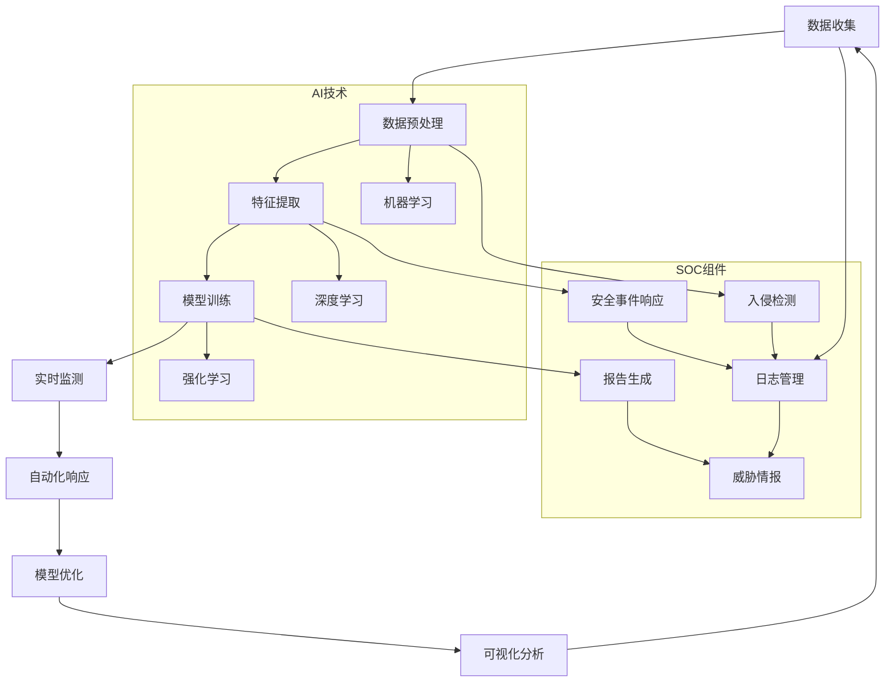

                 

### 摘要

本文深入探讨智能安全运营中心（SOC）的概念及其在保护企业数字资产中的重要作用。智能安全运营中心是一个集成了先进人工智能（AI）技术的系统，它能够实时监测、分析和响应网络安全威胁。随着数字化转型的不断深入，企业的数字资产越来越成为攻击者的目标。AI技术的引入为SOC提供了强大的支持，使其能够在复杂的网络安全环境中快速识别潜在威胁，并采取相应的防护措施。

本文首先介绍了智能安全运营中心的基本概念和功能，包括其定义、发展历程和重要性。接着，本文详细阐述了AI技术的基础知识，包括AI的基本概念、常见算法及其在安全领域的应用场景。随后，文章重点介绍了智能安全运营中心的三大核心技术：智能威胁检测、行为分析和风险评估，并通过伪代码和数学模型详细解释了这些技术的原理。此外，本文还通过实际案例展示了智能安全运营中心在实际应用中的效果和重要性。

在应用实践部分，文章介绍了智能安全运营中心的建设流程、技术选型与集成方法，并提供了一些成功案例。在案例分析中，本文对比了国内外智能安全运营中心的发展状况，分析了其各自的优缺点和面临的挑战。最后，文章总结了智能安全运营中心的发展现状，探讨了其未来趋势，并给出了对企业的启示。

通过本文的阅读，读者将全面了解智能安全运营中心的工作原理、技术核心和应用实践，从而为企业在网络安全防护方面提供有价值的参考。

### 第一部分：引言

#### 1.1 书籍背景与目标

在当今的数字化时代，网络安全问题日益突出，对企业运营和发展的威胁越来越大。传统的安全防护手段已经难以应对日益复杂和多样化的网络攻击，这就需要我们引入更先进的技术来提升安全防护能力。智能安全运营中心（SOC）正是在这样的背景下应运而生。本书旨在系统地介绍智能安全运营中心的构建、运营以及AI技术在其中的应用，帮助读者全面了解和掌握这一前沿领域的知识和实践。

智能安全运营中心是一种集成化、智能化的安全管理系统，它通过实时监测、分析和响应网络安全威胁，为企业提供全方位的安全防护。SOC不仅仅是一个工具或系统，更是一种安全运营理念，其核心理念是通过自动化和智能化的手段，提高安全防护的效率和质量。

本书的目标是帮助读者深入了解智能安全运营中心的概念和原理，掌握其核心技术和应用实践。具体来说，本书将涵盖以下内容：

1. **智能安全运营中心的概述**：介绍SOC的定义、发展历程和重要性，帮助读者建立对SOC的整体认识。
2. **AI技术基础**：阐述AI的基本概念、常见算法及其在安全领域的应用，为后续章节的技术讨论打下基础。
3. **核心技术解析**：详细讲解智能威胁检测、行为分析和风险评估等技术，并通过伪代码和数学模型展示其原理。
4. **应用实践**：介绍智能安全运营中心的建设和运营流程，分享成功案例和最佳实践。
5. **案例分析**：对比国内外智能安全运营中心的发展状况，分析其优缺点和面临的挑战。
6. **总结与展望**：总结SOC的发展现状，探讨未来趋势，为企业在网络安全防护方面提供启示。

通过本书的阅读，读者将能够：

- 理解智能安全运营中心的核心理念和功能；
- 掌握AI技术在SOC中的应用原理和实践方法；
- 学会构建和运营智能安全运营中心，提升企业的网络安全防护能力；
- 分析和解决实际网络安全问题，为企业提供有效的安全解决方案。

#### 1.2 AI在智能安全运营中心的作用

人工智能（AI）技术在智能安全运营中心（SOC）中发挥着至关重要的作用。AI不仅提升了SOC的自动化水平，还极大地增强了其威胁检测、分析和响应能力。以下是AI在SOC中的具体作用：

1. **威胁检测**：AI技术能够通过对海量数据的实时分析和模式识别，快速发现潜在的安全威胁。传统的威胁检测主要依赖于规则和特征匹配，而AI则通过机器学习和深度学习算法，能够从复杂的数据中挖掘出隐藏的威胁模式，提高了检测的准确性和效率。

2. **异常行为分析**：AI技术可以帮助SOC实时监控网络流量和用户行为，通过行为分析算法识别异常行为和潜在攻击。传统的安全系统往往难以应对复杂的攻击手法和隐蔽的威胁，而AI通过建立正常行为的基准模型，能够更准确地识别和响应异常行为。

3. **风险预测和评估**：AI技术可以基于历史数据和实时信息，对网络安全风险进行预测和评估。通过风险分析模型，AI能够识别出高风险区域和潜在威胁，提前采取预防措施，从而降低安全事件的发生概率。

4. **自动化响应**：AI技术能够实现自动化的威胁响应和事件处理。传统的安全系统往往需要人工介入，而AI可以通过自动化流程和智能决策，快速响应安全事件，减少响应时间，提高事件处理效率。

5. **自适应防护**：AI技术能够根据不断变化的安全威胁环境，自适应调整防护策略。传统的安全策略往往是静态的，难以适应动态变化的环境，而AI可以通过实时学习和调整，不断提升防护能力，确保企业网络安全。

6. **智能报告和可视化**：AI技术可以帮助SOC生成智能化的安全报告，并通过可视化手段直观展示安全事件和威胁信息。这样，安全管理员可以更轻松地理解安全态势，快速采取行动。

通过AI技术的引入，智能安全运营中心不仅能够提升安全防护能力，还能够提高运营效率，降低人力成本，为企业提供更全面和高效的安全保障。在未来，随着AI技术的不断发展和成熟，SOC将在网络安全领域发挥更加重要的作用。

### 第二部分：基础知识

#### 2.1 智能安全运营中心概述

##### 2.1.1 SOC的定义与功能

智能安全运营中心（SOC，Security Operations Center）是企业用于监控、分析、应对和处理各种安全威胁的集中化安全管理系统。SOC的定义可以从多个角度进行理解：

- **物理层面**：SOC是一个专门设立的物理场所，通常配备有高性能的计算设备、存储设备和网络安全设备，用于集中处理企业的安全事件。
- **功能层面**：SOC是一个集成的安全系统，它通过多种技术手段，如入侵检测系统（IDS）、安全信息与事件管理（SIEM）、威胁情报等，实现对企业网络环境的全面监控和分析。
- **技术层面**：SOC是一个基于软件的解决方案，它包括一系列的软件工具和服务，用于收集、分析、关联和报告安全事件，以提供实时、全面和深入的安全洞察。

SOC的主要功能包括：

1. **安全事件监控**：SOC通过实时监控网络流量、日志数据和其他相关资源，及时发现异常行为和潜在威胁。
2. **威胁分析**：SOC利用高级分析工具和技术，对收集到的数据进行深度分析，识别和分类威胁，评估其严重性和影响。
3. **响应和处置**：SOC通过自动化和手动操作，迅速响应和处理安全事件，采取相应的措施来缓解和消除威胁。
4. **报告和可视化**：SOC生成详细的报告和可视化图表，帮助安全管理员了解安全态势，评估安全性能，并为决策提供依据。

##### 2.1.2 SOC的发展历程

SOC的发展经历了几个重要阶段：

1. **初步阶段（1990s-2000s）**：早期的SOC主要依赖于人工监控和简单的安全工具，如防火墙和入侵检测系统。这一阶段的SOC功能较为单一，主要侧重于检测和响应已知威胁。

2. **集成阶段（2000s-2010s）**：随着安全技术的发展，SOC开始整合多种安全工具和服务，如安全信息与事件管理（SIEM）、入侵防御系统（IDS）、防火墙等。这一阶段的SOC功能更加全面，能够提供更深入的安全洞察。

3. **智能化阶段（2010s-至今）**：AI和机器学习技术的引入，使得SOC进入智能化阶段。通过自动化和智能分析，SOC能够更快、更准确地识别和响应安全威胁，提高整体安全防护能力。

##### 2.1.3 SOC的重要性

在数字化时代，SOC的重要性愈发凸显。以下是SOC的几个关键作用：

1. **提升安全防护能力**：SOC通过实时监控和分析，可以快速发现和应对安全威胁，防止数据泄露和网络攻击，从而提升企业的整体安全防护能力。

2. **降低安全运营成本**：通过自动化和智能化手段，SOC可以减少安全管理员的工作量，提高运营效率，降低人力成本。

3. **提高事件响应速度**：SOC的自动化响应机制可以迅速处置安全事件，减少事件处理时间，降低事件对业务的负面影响。

4. **提供全面的安全洞察**：SOC通过收集和分析海量数据，可以生成详细的报告和可视化图表，帮助安全管理员了解安全态势，为决策提供依据。

5. **合规性要求**：许多行业和地区都有严格的安全合规性要求，SOC作为企业安全管理的核心系统，可以满足这些合规性要求，降低法律风险。

总之，智能安全运营中心（SOC）是现代企业实现安全运营的关键基础设施，它通过集成先进的人工智能技术，为企业提供全方位、实时和高效的安全防护。

#### 2.2 AI技术基础

##### 2.2.1 AI的基本概念

人工智能（Artificial Intelligence，AI）是指通过计算机模拟人类智能行为的技术。AI的目标是让计算机具备像人类一样的感知、理解、学习和决策能力。AI的基本概念包括以下几个方面：

1. **感知能力**：AI系统通过传感器和输入设备获取外界信息，如图像、声音和文本等。感知能力是实现其他AI功能的基础。

2. **理解能力**：AI系统能够理解输入信息的含义和关系。这通常通过自然语言处理（NLP）和知识图谱等技术实现。

3. **学习能力**：AI系统能够通过经验和数据不断改进自己的性能。机器学习（ML）和深度学习（DL）是实现学习能力的核心技术。

4. **决策能力**：AI系统可以在特定场景下做出合理决策。这通常通过决策树、神经网络和强化学习等技术实现。

##### 2.2.2 常见的AI算法

AI算法是实现人工智能功能的核心。以下是几种常见的AI算法：

1. **机器学习（ML）算法**：
   - **线性回归**：用于预测线性关系。
   - **逻辑回归**：用于分类问题。
   - **支持向量机（SVM）**：用于分类和回归问题。
   - **决策树**：用于分类和回归问题。
   - **随机森林**：用于分类和回归问题，具有较好的泛化能力。

2. **深度学习（DL）算法**：
   - **神经网络（NN）**：包括多层感知机（MLP）、卷积神经网络（CNN）和循环神经网络（RNN）等。
   - **生成对抗网络（GAN）**：用于生成新的数据样本。
   - **变分自编码器（VAE）**：用于数据生成和降维。

3. **强化学习（RL）算法**：
   - **Q-Learning**：通过学习值函数实现决策。
   - **深度Q网络（DQN）**：结合深度学习和Q-Learning。
   - **策略梯度（PG）**：直接学习策略。

##### 2.2.3 AI在安全领域的应用场景

AI在安全领域的应用场景非常广泛，以下是一些主要的应用：

1. **威胁检测**：AI可以用于检测网络流量中的异常行为和潜在威胁。通过机器学习和深度学习算法，AI可以识别出复杂、多变的攻击模式，提高威胁检测的准确性和效率。

2. **异常行为分析**：AI可以实时监控用户行为和网络流量，识别异常行为，如未授权访问、数据泄露和内部攻击等。这有助于及时发现潜在的安全威胁，并采取措施进行防范。

3. **风险评估**：AI可以通过分析历史数据和实时信息，对网络系统的安全风险进行评估。这有助于企业制定合理的安全策略，降低安全风险。

4. **自动化响应**：AI可以自动化处理安全事件，如隔离受感染的系统、阻止恶意流量等。这提高了安全响应的速度和效率。

5. **安全报告生成**：AI可以生成智能化的安全报告，通过可视化技术直观展示安全态势，帮助安全管理员更好地了解安全情况。

总之，AI技术在智能安全运营中心中发挥着重要作用，通过提升威胁检测、分析和响应能力，AI为企业提供了更全面和高效的安全防护。

#### 2.2.4 AI在安全领域的应用原理

AI在安全领域的应用原理主要基于其强大的数据处理和分析能力，能够通过以下方式提升安全运营中心的效能：

1. **数据收集**：SOC通过各种传感器、网络设备和日志收集大量的数据，包括网络流量、系统日志、用户行为等。这些数据是AI进行分析的基础。

2. **数据预处理**：收集到的数据通常需要清洗、转换和归一化处理，以确保数据质量，提高模型训练的效果。

3. **特征提取**：通过数据预处理后，AI可以从原始数据中提取出有代表性的特征，如网络流量中的异常模式、用户行为中的异常点等。

4. **模型训练**：AI利用机器学习算法，如神经网络、随机森林和决策树等，对提取的特征进行训练，建立威胁检测和异常行为的预测模型。

5. **实时监测**：训练好的模型可以实时应用到SOC中，对网络流量、用户行为等数据进行实时监测，识别异常行为和潜在威胁。

6. **自动化响应**：一旦检测到异常，AI可以自动化触发响应措施，如隔离受感染的主机、阻断恶意流量等，减少人工干预，提高响应速度。

7. **模型优化**：AI通过不断的学习和调整，优化模型性能，提高威胁检测的准确性和效率。

8. **可视化分析**：AI可以生成智能化的安全报告，通过可视化手段直观展示安全态势，帮助安全管理员更好地理解安全状况，及时采取行动。

通过这一系列的应用原理，AI在智能安全运营中心中实现了威胁检测、异常行为分析、自动化响应等关键功能，极大地提升了企业的安全防护能力。

##### 2.2.4 智能安全运营中心与AI技术的联系架构

为了更好地理解智能安全运营中心（SOC）与AI技术之间的联系，我们可以通过一个Mermaid流程图来展示其架构和交互过程。以下是一个简化的示例：



在这个流程图中：

- **SOC组件**：包括日志管理、威胁情报、入侵检测和安全事件响应等，这些组件构成了SOC的核心部分。
- **AI技术**：包括机器学习、深度学习和强化学习等，这些技术用于数据处理、特征提取和模型训练。
- **数据流**：从数据收集（A）开始，经过预处理（B）、特征提取（C）、模型训练（D），再到实时监测（E）和自动化响应（F），最后进行模型优化（G）和可视化分析（H）。

通过这个架构，我们可以看到SOC与AI技术之间的紧密联系，AI技术不仅为SOC提供了强大的数据分析和威胁检测能力，还提升了SOC的自动化和智能化水平，实现了更高效和全面的安全防护。

#### 2.2.5 常见的AI算法在安全威胁检测中的应用

在智能安全运营中心（SOC）中，AI算法被广泛应用于威胁检测。以下是一些常见的AI算法及其在安全威胁检测中的应用：

1. **神经网络（Neural Networks）**：
   - **应用场景**：用于识别复杂的网络流量模式和恶意行为。
   - **算法原理**：神经网络通过多层神经元结构模拟人脑的学习过程，能够处理高维数据并提取深层次的特征。
   - **伪代码示例**：
     ```python
     # 初始化神经网络
     neural_network = NeuralNetwork(input_shape, hidden_layer_size, output_size)
     # 训练神经网络
     for epoch in range(num_epochs):
         for batch in batches:
             inputs, labels = batch
             loss = neural_network.train(inputs, labels)
             print(f"Epoch {epoch}: Loss = {loss}")
     # 检测威胁
     for flow in network_flows:
         features = extract_features(flow)
         threat_detected = neural_network.predict(features)
         if threat_detected:
             trigger_alert(flow)
     ```

2. **决策树（Decision Trees）**：
   - **应用场景**：用于分类和回归问题，如识别恶意软件和攻击类型。
   - **算法原理**：决策树通过一系列的判断条件将数据划分成不同的子集，最终得到分类结果。
   - **伪代码示例**：
     ```python
     def classify(data_point):
         if data_point['feature1'] > threshold1:
             return "Class A"
         elif data_point['feature2'] < threshold2:
             return "Class B"
         else:
             return "Class C"

     for data_point in data_points:
         class_label = classify(data_point)
         if class_label == "Malicious":
             trigger_alert(data_point)
     ```

3. **支持向量机（Support Vector Machine, SVM）**：
   - **应用场景**：用于分类问题，如识别恶意流量和用户行为。
   - **算法原理**：SVM通过找到最佳的超平面，将数据分为不同的类别。
   - **伪代码示例**：
     ```python
     def classify(data_point, hyperplane):
         return "Class A" if dot_product(data_point, hyperplane) > threshold else "Class B"

     for data_point in data_points:
         class_label = classify(data_point, hyperplane)
         if class_label == "Malicious":
             trigger_alert(data_point)
     ```

4. **随机森林（Random Forest）**：
   - **应用场景**：用于分类和回归问题，如识别恶意软件和网络攻击。
   - **算法原理**：随机森林通过构建多个决策树，并利用投票机制进行分类。
   - **伪代码示例**：
     ```python
     def random_forest_classify(data_point, decision_trees):
         class_votes = [classify(data_point, tree) for tree in decision_trees]
         majority_vote = max(set(class_votes), key=list(class_votes).count)
         return majority_vote

     for data_point in data_points:
         class_label = random_forest_classify(data_point, decision_trees)
         if class_label == "Malicious":
             trigger_alert(data_point)
     ```

通过这些算法的应用，智能安全运营中心可以更有效地检测和响应安全威胁，提升企业的整体安全防护能力。

#### 2.2.6 AI技术在风险评估中的应用

在智能安全运营中心（SOC）中，AI技术不仅用于威胁检测和异常行为分析，还广泛应用于风险评估。通过分析历史数据和实时信息，AI能够预测潜在风险，帮助企业制定更有效的安全策略。以下介绍几种常见的AI算法在风险评估中的应用：

1. **决策树（Decision Trees）**：
   - **应用场景**：用于分类和回归问题，如风险评估中的风险分类和损失预测。
   - **算法原理**：决策树通过一系列的判断条件，将数据集划分为不同的子集，最终得到每个样本的风险等级。
   - **伪代码示例**：
     ```python
     def risk_classification(data_point):
         if data_point['feature1'] > threshold1:
             return "High Risk"
         elif data_point['feature2'] < threshold2:
             return "Medium Risk"
         else:
             return "Low Risk"

     for data_point in data_points:
         risk_level = risk_classification(data_point)
         if risk_level == "High Risk":
             trigger_alert(data_point)
     ```

2. **随机森林（Random Forest）**：
   - **应用场景**：用于复杂的风险评估问题，如多变量风险评估。
   - **算法原理**：随机森林通过构建多个决策树，并利用投票机制进行分类和回归，提高预测的准确性和稳定性。
   - **伪代码示例**：
     ```python
     def random_forest_risk_classify(data_point, decision_trees):
         class_votes = [classify(data_point, tree) for tree in decision_trees]
         majority_vote = max(set(class_votes), key=list(class_votes).count)
         return majority_vote

     for data_point in data_points:
         risk_level = random_forest_risk_classify(data_point, decision_trees)
         if risk_level == "High Risk":
             trigger_alert(data_point)
     ```

3. **支持向量机（Support Vector Machine, SVM）**：
   - **应用场景**：用于分类和回归问题，如风险评估中的风险等级划分。
   - **算法原理**：SVM通过找到最佳的超平面，将数据分为不同的类别，实现风险预测。
   - **伪代码示例**：
     ```python
     def svm_risk_classification(data_point, hyperplane):
         return "High Risk" if dot_product(data_point, hyperplane) > threshold else "Low Risk"

     for data_point in data_points:
         risk_level = svm_risk_classification(data_point, hyperplane)
         if risk_level == "High Risk":
             trigger_alert(data_point)
     ```

4. **神经网络（Neural Networks）**：
   - **应用场景**：用于复杂的风险评估问题，如多变量动态风险评估。
   - **算法原理**：神经网络通过多层神经元结构，模拟人脑的学习过程，实现高维数据的特征提取和风险评估。
   - **伪代码示例**：
     ```python
     neural_network = NeuralNetwork(input_shape, hidden_layer_size, output_size)
     for epoch in range(num_epochs):
         for batch in batches:
             inputs, labels = batch
             loss = neural_network.train(inputs, labels)
             print(f"Epoch {epoch}: Loss = {loss}")
     for data_point in data_points:
         features = extract_features(data_point)
         risk_level = neural_network.predict(features)
         if risk_level == "High Risk":
             trigger_alert(data_point)
     ```

通过这些算法的应用，智能安全运营中心可以更准确地进行风险评估，识别高风险事件，并采取相应的预防措施，提升企业的整体安全防护能力。

#### 2.2.7 威胁检测算法的原理与数学模型

在智能安全运营中心（SOC）中，威胁检测算法是关键组成部分，它们能够识别并响应网络中的潜在威胁。以下将详细介绍几种常见的威胁检测算法的原理及其数学模型：

1. **基于规则的威胁检测算法**：
   - **原理**：这种算法通过预定义的规则集来检测网络流量中的威胁。每个规则定义了一个匹配模式，当数据流与规则匹配时，算法会触发警报。
   - **数学模型**：规则可以表示为条件语句，如 `if condition then action`。条件语句通常涉及特征比较和逻辑运算。
   - **示例**：
     ```mermaid
     graph LR
         A[输入流] --> B[规则库]
         B --> C{是否匹配规则}
         C -->|是| D[触发警报]
         C -->|否| E[继续检测]
     ```

2. **基于统计的威胁检测算法**：
   - **原理**：这类算法通过分析网络流量的统计特征，如频率分布、均值和方差等，来检测异常行为。当统计数据偏离正常范围时，算法会触发警报。
   - **数学模型**：统计检测通常使用假设检验方法，如t检验或Z检验。
   - **示例**：
     ```latex
     H_0: \mu = \mu_0 \quad (数据符合正常分布)
     H_1: \mu \neq \mu_0 \quad (数据偏离正常分布)
     t = \frac{\bar{x} - \mu_0}{s / \sqrt{n}}
     ```
     其中，\(\bar{x}\) 是样本均值，\(\mu_0\) 是正常分布的均值，\(s\) 是样本标准差，\(n\) 是样本大小。

3. **基于机器学习的威胁检测算法**：
   - **原理**：机器学习算法通过训练模型来识别正常行为和异常行为。当网络流量特征与正常行为模型不符时，算法会触发警报。
   - **数学模型**：常用的机器学习算法包括K近邻（KNN）、决策树和支持向量机（SVM）等。
   - **示例（KNN算法）**：
     ```python
     distance = EuclideanDistance(features, normal_behavior_model)
     if distance > threshold:
         trigger_alert(features)
     ```

4. **基于深度学习的威胁检测算法**：
   - **原理**：深度学习算法通过多层神经网络来提取复杂的特征，实现对网络流量的精准检测。当网络流量特征偏离训练数据时，算法会触发警报。
   - **数学模型**：常用的深度学习模型包括卷积神经网络（CNN）和循环神经网络（RNN）。
   - **示例（CNN算法）**：
     ```python
     # 定义CNN模型
     model = Sequential()
     model.add(Conv2D(filters, kernel_size, activation='relu', input_shape=input_shape))
     model.add(MaxPooling2D(pool_size))
     model.add(Flatten())
     model.add(Dense(num_classes, activation='softmax'))

     # 训练模型
     model.compile(optimizer='adam', loss='categorical_crossentropy', metrics=['accuracy'])
     model.fit(X_train, y_train, epochs=num_epochs, batch_size=batch_size)

     # 检测威胁
     features = preprocess流量数据()
     prediction = model.predict(features)
     if prediction.argmax() != 正常类别:
         trigger_alert(features)
     ```

通过这些算法和数学模型，智能安全运营中心能够有效地检测网络威胁，提高企业的安全防护能力。

### 第三部分：核心技术

#### 3.1 智能威胁检测

##### 3.1.1 威胁检测的基本原理

智能威胁检测是智能安全运营中心（SOC）的核心功能之一，其基本原理是通过分析网络流量、日志数据和系统行为，实时识别潜在的安全威胁。威胁检测的主要目标包括识别入侵行为、恶意软件和异常行为等，从而采取相应的防护措施。

1. **数据收集**：威胁检测的第一步是收集相关的数据，包括网络流量数据、系统日志、用户行为数据和安全事件日志等。这些数据来源可以是各种传感器、防火墙、入侵检测系统（IDS）和安全信息与事件管理（SIEM）系统。

2. **特征提取**：在收集到数据后，需要对这些数据进行预处理，提取出有用的特征。特征可以是网络流量的统计信息、行为模式的异常点、系统日志中的异常操作等。特征提取的质量直接影响到后续检测的准确性和效率。

3. **模型训练**：利用提取的特征，通过机器学习算法（如神经网络、随机森林、支持向量机等）训练威胁检测模型。模型的训练过程包括数据集的划分、特征选择、模型参数调整等，目的是使模型能够识别出潜在的威胁。

4. **实时检测**：训练好的模型可以应用到SOC中，对实时收集到的数据进行检测。当检测到异常特征时，模型会触发警报或执行其他响应措施。

5. **反馈调整**：威胁检测模型需要不断优化，以适应不断变化的安全环境。通过收集检测结果和用户反馈，模型可以进行调整和改进，提高检测的准确性和响应速度。

##### 3.1.2 智能威胁检测算法

智能威胁检测算法是SOC实现威胁检测的核心，以下介绍几种常见的智能威胁检测算法：

1. **基于规则的方法**：
   - **原理**：这种方法通过预定义的规则集来检测网络流量中的威胁。每个规则定义了一个匹配模式，如IP地址、端口、协议等，当数据流与规则匹配时，会触发警报。
   - **优势**：实现简单，易于理解和维护。
   - **劣势**：灵活性差，难以应对复杂多变的威胁。

2. **基于统计的方法**：
   - **原理**：这种方法通过分析网络流量的统计特征，如频率分布、均值和方差等，来检测异常行为。当统计数据偏离正常范围时，会触发警报。
   - **优势**：能够检测到一定程度的异常行为，适应性强。
   - **劣势**：对正常行为的假设较强，容易产生误报。

3. **基于机器学习的方法**：
   - **原理**：这种方法通过训练模型来识别正常行为和异常行为。常用的算法包括K近邻（KNN）、决策树、随机森林和神经网络等。
   - **优势**：能够处理高维数据，识别复杂的威胁模式。
   - **劣势**：需要大量的数据和计算资源，模型训练时间较长。

4. **基于深度学习的方法**：
   - **原理**：这种方法通过多层神经网络来提取复杂的特征，实现对网络流量的精准检测。常用的模型包括卷积神经网络（CNN）和循环神经网络（RNN）等。
   - **优势**：能够处理大规模数据和复杂特征，检测精度高。
   - **劣势**：模型训练和部署成本高，对硬件资源要求较高。

##### 3.1.3 实战案例：智能威胁检测系统设计

以下是一个简单的智能威胁检测系统设计案例：

1. **需求分析**：
   - 系统需要监控企业内部和外部的网络流量。
   - 系统需要能够识别恶意软件和入侵行为。
   - 系统需要实时生成警报和报告。

2. **系统架构**：
   - **数据收集模块**：包括网络流量传感器、日志收集器和威胁情报源。
   - **数据预处理模块**：对收集到的数据进行清洗、转换和特征提取。
   - **威胁检测模块**：使用机器学习算法和深度学习算法进行威胁检测。
   - **响应模块**：根据检测结果采取相应的防护措施，如隔离受感染的主机、阻断恶意流量等。
   - **可视化模块**：生成实时和安全事件报告，帮助管理员理解安全态势。

3. **技术实现**：
   - **数据收集**：使用开源网络流量分析工具（如Bro）收集网络流量数据，使用日志收集工具（如ELK Stack）收集系统日志。
   - **数据预处理**：使用Python和Scikit-learn库进行特征提取和数据处理。
   - **威胁检测**：使用Scikit-learn的随机森林算法和TensorFlow的卷积神经网络（CNN）进行威胁检测。
   - **响应和可视化**：使用Python的matplotlib库和D3.js进行数据可视化，使用Python的Selenium库进行自动化响应。

4. **代码示例**：
   ```python
   # 数据预处理
   from sklearn.preprocessing import StandardScaler
   scaler = StandardScaler()
   features = scaler.fit_transform(data)

   # 随机森林检测
   from sklearn.ensemble import RandomForestClassifier
   rf = RandomForestClassifier(n_estimators=100)
   rf.fit(features_train, labels_train)
   threat_detected = rf.predict(features_test)

   # CNN模型
   import tensorflow as tf
   model = tf.keras.Sequential([
       tf.keras.layers.Conv2D(32, (3, 3), activation='relu', input_shape=(28, 28, 1)),
       tf.keras.layers.MaxPooling2D((2, 2)),
       tf.keras.layers.Flatten(),
       tf.keras.layers.Dense(128, activation='relu'),
       tf.keras.layers.Dense(1, activation='sigmoid')
   ])
   model.compile(optimizer='adam', loss='binary_crossentropy', metrics=['accuracy'])
   model.fit(X_train, y_train, epochs=10, batch_size=32)
   ```

通过这个案例，读者可以了解到智能威胁检测系统的设计和实现方法，为实际应用提供参考。

#### 3.2 行为分析

##### 3.2.1 行为分析的基本原理

在智能安全运营中心（SOC）中，行为分析是一种关键的技术，它通过对用户行为和网络流量的分析，识别异常行为和潜在威胁。行为分析的基本原理可以概括为以下几个步骤：

1. **数据收集**：行为分析的第一步是收集用户行为数据和网络流量数据。这些数据可以来自多种来源，包括网络流量传感器、入侵检测系统（IDS）、安全信息与事件管理（SIEM）系统等。

2. **数据预处理**：收集到的原始数据通常包含噪声和不相关的信息，因此需要进行预处理。预处理步骤包括数据清洗、去重、归一化和特征提取等，以提高数据的可用性和分析质量。

3. **建立基准模型**：行为分析的核心是建立正常行为的基准模型。通过分析大量正常行为数据，提取出特征并构建模型，以区分正常行为和异常行为。常见的基准模型包括统计模型和机器学习模型。

4. **实时监测**：一旦建立了基准模型，就可以将其应用到实时数据中，对用户行为和网络流量进行监控。当监测到数据偏离正常基准模型时，系统会触发警报，标记为异常行为。

5. **异常行为响应**：检测到异常行为后，系统可以采取相应的响应措施，如隔离受感染的主机、封锁恶意IP地址、通知管理员等，以防止潜在的安全威胁。

##### 3.2.2 行为分析算法

行为分析算法是行为分析技术的核心，它们通过不同的方法实现异常行为的检测和识别。以下介绍几种常见的行为分析算法：

1. **基于统计的方法**：
   - **原理**：这种方法通过分析用户行为或网络流量的统计特征，如均值、中位数、标准差等，来识别异常行为。当统计特征偏离正常范围时，系统会触发警报。
   - **优势**：实现简单，对实时性要求较高的场景适用。
   - **劣势**：对异常行为的识别能力有限，容易产生误报。

2. **基于机器学习的方法**：
   - **原理**：这种方法通过训练机器学习模型，从数据中学习正常行为的模式，并识别异常行为。常用的算法包括K近邻（KNN）、决策树、随机森林和神经网络等。
   - **优势**：能够处理高维数据，识别复杂的异常行为模式。
   - **劣势**：需要大量的数据和计算资源，模型训练时间较长。

3. **基于深度学习的方法**：
   - **原理**：这种方法使用多层神经网络，如卷积神经网络（CNN）和循环神经网络（RNN），来提取复杂的特征，并识别异常行为。
   - **优势**：能够处理大规模数据和复杂特征，检测精度高。
   - **劣势**：模型训练和部署成本高，对硬件资源要求较高。

4. **基于图论的方法**：
   - **原理**：这种方法通过构建用户行为或网络流量的图模型，分析节点和边的关系，识别潜在的异常行为。图模型可以捕捉复杂的交互关系，提高异常行为的识别能力。
   - **优势**：能够处理复杂的交互关系，对异常行为的识别能力较强。
   - **劣势**：算法实现复杂，对数据质量要求较高。

##### 3.2.3 实战案例：基于AI的行为分析系统构建

以下是一个基于AI的行为分析系统的构建案例：

1. **需求分析**：
   - 系统需要监控企业内部网络中的用户行为。
   - 系统需要能够识别异常登录、数据泄露等潜在威胁。
   - 系统需要生成实时警报和报告，帮助管理员及时响应。

2. **系统架构**：
   - **数据收集模块**：包括网络流量传感器、入侵检测系统（IDS）和日志收集器。
   - **数据预处理模块**：对收集到的数据进行清洗、转换和特征提取。
   - **行为分析模块**：使用机器学习和深度学习算法进行行为分析。
   - **响应模块**：根据分析结果采取相应的防护措施，如隔离受感染的主机、封锁恶意IP地址等。
   - **可视化模块**：生成实时和行为分析报告，帮助管理员理解安全态势。

3. **技术实现**：
   - **数据收集**：使用开源网络流量分析工具（如Bro）和入侵检测系统（如Snort）收集网络流量数据，使用日志收集工具（如ELK Stack）收集系统日志。
   - **数据预处理**：使用Python和Scikit-learn库进行特征提取和数据处理。
   - **行为分析**：使用Scikit-learn的随机森林算法和TensorFlow的卷积神经网络（CNN）进行行为分析。
   - **响应和可视化**：使用Python的matplotlib库和D3.js进行数据可视化，使用Python的Selenium库进行自动化响应。

4. **代码示例**：
   ```python
   # 数据预处理
   from sklearn.preprocessing import StandardScaler
   scaler = StandardScaler()
   features = scaler.fit_transform(data)

   # 随机森林行为分析
   from sklearn.ensemble import RandomForestClassifier
   rf = RandomForestClassifier(n_estimators=100)
   rf.fit(features_train, labels_train)
   abnormal_behavior_detected = rf.predict(features_test)

   # CNN模型
   import tensorflow as tf
   model = tf.keras.Sequential([
       tf.keras.layers.Conv2D(32, (3, 3), activation='relu', input_shape=(28, 28, 1)),
       tf.keras.layers.MaxPooling2D((2, 2)),
       tf.keras.layers.Flatten(),
       tf.keras.layers.Dense(128, activation='relu'),
       tf.keras.layers.Dense(1, activation='sigmoid')
   ])
   model.compile(optimizer='adam', loss='binary_crossentropy', metrics=['accuracy'])
   model.fit(X_train, y_train, epochs=10, batch_size=32)
   ```

通过这个案例，读者可以了解到基于AI的行为分析系统的设计和实现方法，为实际应用提供参考。

#### 3.3 风险评估

##### 3.3.1 风险评估的基本概念

风险评估是智能安全运营中心（SOC）的重要组成部分，它通过评估潜在威胁和漏洞对企业数字资产的影响，帮助企业制定有效的安全策略。风险评估的基本概念包括以下几个关键要素：

1. **风险**：风险是指潜在的威胁或漏洞可能对企业造成的损失或负面影响。风险可以定义为威胁（Threat）与脆弱性（Vulnerability）的函数，即风险 = 威胁 × 脆弱性。

2. **威胁**：威胁是指可能对企业造成伤害的实体或事件，如恶意软件、网络攻击、自然灾害等。威胁可以是外部的，如黑客攻击，也可以是内部的，如员工失误。

3. **脆弱性**：脆弱性是指系统或资产在受到威胁时的弱点或漏洞。脆弱性可以是技术层面的，如软件漏洞，也可以是管理层面的，如安全意识不足。

4. **风险评估**：风险评估是指通过系统化的方法，评估潜在风险的概率和影响，并采取措施降低风险。风险评估通常包括以下几个步骤：
   - **风险识别**：识别潜在威胁和脆弱性。
   - **风险分析**：评估威胁和脆弱性的概率和影响。
   - **风险评价**：根据风险的概率和影响，对风险进行排序和分类。
   - **风险响应**：制定和实施风险缓解措施，如风险规避、风险减轻、风险转移等。

##### 3.3.2 风险评估模型

风险评估模型是进行风险评估的基础工具，以下介绍几种常用的风险评估模型：

1. **定性风险评估模型**：
   - **原理**：定性风险评估模型主要通过专家判断和经验来评估风险。这些模型通常使用风险矩阵，将威胁的概率和影响分为不同的等级，以便进行风险评估。
   - **优势**：快速、灵活，适用于初步风险评估。
   - **劣势**：主观性较强，缺乏量化分析。

2. **定量风险评估模型**：
   - **原理**：定量风险评估模型通过数学模型和统计方法，对风险的概率和影响进行量化分析。这些模型通常使用概率和期望损失等指标，来评估风险。
   - **优势**：提供量化数据，有助于决策。
   - **劣势**：数据收集和分析复杂，适用范围有限。

3. **混合风险评估模型**：
   - **原理**：混合风险评估模型结合了定性评估和定量评估的方法，通过定性分析识别风险，并通过定量分析评估风险的影响和概率。
   - **优势**：兼具定性和定量评估的优点，适用于复杂场景。
   - **劣势**：实施复杂，需要较高的技术支持。

##### 3.3.3 实战案例：AI驱动的风险评估

以下是一个基于AI驱动的风险评估案例：

1. **需求分析**：
   - 对企业网络系统进行风险评估。
   - 识别潜在的网络威胁和系统漏洞。
   - 提供量化的风险评估结果，帮助企业制定安全策略。

2. **系统架构**：
   - **数据收集模块**：包括网络流量传感器、入侵检测系统（IDS）、安全漏洞扫描器等。
   - **数据预处理模块**：对收集到的数据进行清洗、转换和特征提取。
   - **风险评估模块**：使用机器学习和深度学习算法进行风险评估。
   - **可视化模块**：生成风险评估报告，帮助管理员理解安全态势。

3. **技术实现**：
   - **数据收集**：使用开源网络流量分析工具（如Bro）和入侵检测系统（如Snort）收集网络流量数据，使用安全漏洞扫描工具（如Nessus）扫描系统漏洞。
   - **数据预处理**：使用Python和Scikit-learn库进行特征提取和数据处理。
   - **风险评估**：使用Scikit-learn的随机森林算法和TensorFlow的卷积神经网络（CNN）进行风险评估。
   - **可视化**：使用Python的matplotlib库和D3.js进行数据可视化。

4. **代码示例**：
   ```python
   # 数据预处理
   from sklearn.preprocessing import StandardScaler
   scaler = StandardScaler()
   features = scaler.fit_transform(data)

   # 随机森林风险评估
   from sklearn.ensemble import RandomForestClassifier
   rf = RandomForestClassifier(n_estimators=100)
   rf.fit(features_train, labels_train)
   risk_scores = rf.predict(features_test)

   # CNN模型
   import tensorflow as tf
   model = tf.keras.Sequential([
       tf.keras.layers.Conv2D(32, (3, 3), activation='relu', input_shape=(28, 28, 1)),
       tf.keras.layers.MaxPooling2D((2, 2)),
       tf.keras.layers.Flatten(),
       tf.keras.layers.Dense(128, activation='relu'),
       tf.keras.layers.Dense(1, activation='sigmoid')
   ])
   model.compile(optimizer='adam', loss='binary_crossentropy', metrics=['accuracy'])
   model.fit(X_train, y_train, epochs=10, batch_size=32)
   ```

通过这个案例，读者可以了解到AI驱动的风险评估系统的设计和实现方法，为实际应用提供参考。

### 第四部分：应用实践

#### 4.1 智能安全运营中心的建设

智能安全运营中心（SOC）的建设是企业实现全面网络安全管理的关键步骤。以下详细介绍智能安全运营中心的建设流程、技术选型和集成方法，并提供一些成功案例。

##### 4.1.1 建设流程与步骤

1. **需求分析**：
   - 确定企业面临的安全威胁和业务需求。
   - 分析现有安全架构，识别潜在问题和改进方向。
   - 明确建设SOC的目标和预期效果。

2. **架构设计**：
   - 根据需求分析结果，设计SOC的整体架构。
   - 确定数据收集、存储、分析和响应的组件和模块。
   - 选择合适的技术栈和工具。

3. **技术选型**：
   - 选择适合企业需求的网络流量分析工具、日志收集和管理工具、威胁情报平台、安全信息和事件管理（SIEM）系统等。
   - 考虑开源和商业产品的优缺点，结合预算和性能要求进行选择。

4. **系统集成**：
   - 将选定的工具和平台进行集成，确保数据流通和功能协同。
   - 设定数据流转规则和接口标准，实现不同系统之间的无缝连接。

5. **测试与优化**：
   - 对SOC系统进行全面的测试，验证其功能和安全性能。
   - 根据测试结果调整配置和优化系统性能。

6. **部署与培训**：
   - 将SOC系统部署到生产环境中，确保其稳定运行。
   - 对运维团队进行培训，使其掌握系统的操作和维护方法。

##### 4.1.2 技术选型与集成

在智能安全运营中心的建设中，技术选型和集成是关键环节。以下介绍几种常用的技术和工具：

1. **网络流量分析工具**：
   - **开源**：Bro、Zeek、Suricata等，用于实时监控和分析网络流量。
   - **商业**：Palo Alto Networks、FireEye、Splunk等，提供强大的流量分析功能。

2. **日志收集与管理工具**：
   - **开源**：ELK Stack（Elasticsearch、Logstash、Kibana），用于大规模日志收集、存储和可视化。
   - **商业**：Splunk、Sumo Logic、AWS CloudWatch，提供高级日志管理和分析功能。

3. **威胁情报平台**：
   - **开源**：OTX、Malsploit、威胁情报平台，用于收集和分享威胁情报。
   - **商业**：Cisco Threat Grid、FireEye、Symantec，提供实时威胁情报和自动化响应。

4. **安全信息和事件管理（SIEM）系统**：
   - **开源**：OSSEC、Security Onion，用于收集、关联和分析安全事件。
   - **商业**：Splunk Enterprise Security、IBM QRadar、Palo Alto Networks PAN-OS，提供高级威胁检测和管理功能。

集成方法主要包括：

- **数据流转**：通过日志收集器、代理和API，将不同来源的数据传输到SOC系统。
- **数据存储**：使用分布式存储系统（如Elasticsearch、Hadoop）进行海量数据存储和检索。
- **数据处理**：使用数据处理框架（如Spark）进行实时数据分析和处理。
- **界面集成**：通过Web接口、REST API等，实现不同系统和工具的交互和协同。

##### 4.1.3 成功案例

以下是一些智能安全运营中心建设的成功案例：

1. **案例一：某大型互联网公司**
   - **需求**：提升网络安全防护能力，实时监测和分析网络威胁。
   - **架构**：采用开源ELK Stack进行日志收集和管理，使用开源Suricata进行网络流量分析，集成开源Security Onion进行威胁检测和响应。
   - **效果**：实现了高效的数据收集和关联分析，大幅提高了安全事件响应速度和准确率。

2. **案例二：某金融机构**
   - **需求**：保障金融数据安全，提升内部安全合规性。
   - **架构**：采用商业Splunk Enterprise Security进行日志收集和事件管理，集成商业FireEye进行威胁情报和检测。
   - **效果**：实现了全面的日志管理和威胁检测，有效防范了内部和外部威胁，提升了安全合规性。

3. **案例三：某制造业企业**
   - **需求**：保障工业控制系统安全，防范工业网络攻击。
   - **架构**：采用开源Bro进行网络流量分析，集成开源OSSEC进行日志收集和威胁检测。
   - **效果**：实现了实时监控和快速响应，有效防范了工业网络中的恶意攻击，保障了生产系统的安全。

通过这些成功案例，我们可以看到，智能安全运营中心的建设对企业提升网络安全防护能力具有显著作用，通过合理的技术选型和系统集成，企业能够实现全面、高效的网络安全管理。

#### 4.2 智能安全运营中心的运营

##### 4.2.1 运营流程与策略

智能安全运营中心（SOC）的运营是确保其有效发挥作用的关键环节。一个高效的SOC运营流程和策略包括以下几个步骤：

1. **安全事件监测**：SOC需要实时监测网络流量、日志数据和安全事件。通过部署传感器、日志收集器和入侵检测系统（IDS），SOC可以持续收集各种安全相关数据。

2. **数据预处理**：收集到的原始数据通常包含噪声和冗余信息，因此需要进行预处理。预处理步骤包括数据清洗、去重、归一化和特征提取等，以确保数据质量，提高分析效果。

3. **威胁检测与响应**：利用威胁检测算法对预处理后的数据进行分析，识别潜在的安全威胁。当检测到威胁时，SOC需要迅速响应，采取相应的措施，如隔离受感染的主机、阻断恶意流量等。

4. **事件报告与可视化**：SOC需要生成详细的安全事件报告，并通过可视化工具展示安全态势。报告应包括威胁的详细信息、检测方法和响应措施等，以便管理员了解和处理安全事件。

5. **持续优化**：SOC运营过程中需要不断收集反馈和评估效果，通过调整检测策略、优化算法和改进系统性能，不断提升安全防护能力。

##### 4.2.2 运维团队建设

一个高效的SOC需要一支专业的运维团队来保障其正常运行。以下是建设SOC运维团队的关键要素：

1. **团队成员**：
   - **安全管理员**：负责SOC的日常运营和管理，包括事件监测、响应和报告。
   - **安全分析师**：负责分析安全事件，识别潜在威胁，并提出防护策略。
   - **系统管理员**：负责SOC系统的维护和升级，确保其稳定运行。
   - **开发人员**：负责SOC系统的开发和定制化需求实现。

2. **技能要求**：
   - **安全知识**：团队成员需要具备扎实的安全知识，包括网络安全、系统安全、应用安全等。
   - **数据分析能力**：能够使用数据分析工具和算法进行威胁检测和事件分析。
   - **编程技能**：熟悉编程语言，如Python、Java等，能够进行系统定制和开发。
   - **沟通能力**：能够与团队成员和业务部门有效沟通，确保安全策略和需求的一致性。

3. **培训与发展**：
   - 定期组织安全培训，提高团队成员的安全意识和技能。
   - 鼓励团队成员参加专业认证考试，如CISSP、CEH等，提升团队整体水平。
   - 通过实践项目和案例分析，不断提升团队成员的实际操作能力和经验。

##### 4.2.3 实战案例：运营实践与优化

以下是一个智能安全运营中心的运营实战案例：

**案例背景**：某中型企业由于业务扩张，面临网络安全威胁不断增加的问题。为了提升网络安全防护能力，企业决定建立智能安全运营中心。

**运营实践**：
1. **部署SOC系统**：企业选择开源ELK Stack作为日志收集和管理工具，Bro用于网络流量分析，集成开源Security Onion进行威胁检测和响应。系统部署后，企业开始进行日常运营。

2. **事件监测与响应**：安全管理员通过SOC系统实时监测网络流量和安全事件。当检测到异常事件时，安全分析师会进行深入分析，确定威胁类型和影响范围，并采取相应的响应措施，如隔离受感染的主机、阻断恶意IP等。

3. **事件报告与可视化**：SOC系统生成详细的事件报告，并通过Kibana进行可视化展示。管理员可以直观地了解安全态势，迅速采取行动。

4. **优化与改进**：
   - 定期评估SOC系统的性能，通过调整配置和优化算法，提高威胁检测准确率。
   - 收集和分析运维团队的反馈，不断改进系统功能和用户体验。
   - 结合企业业务需求，开发定制化的安全策略和报表。

**效果评估**：
- 通过SOC的运营，企业有效防范了多次网络攻击和潜在威胁，安全事件响应时间大幅缩短。
- 安全事件报告和可视化功能提升了管理效率，帮助管理员更好地理解安全态势。
- 通过不断优化和改进，SOC系统的性能和稳定性得到显著提升，为企业的持续安全运营提供了有力保障。

通过这个案例，我们可以看到，智能安全运营中心的运营实践和优化是提升企业网络安全防护能力的重要手段。通过科学的管理和持续改进，企业可以更好地应对复杂多变的网络安全威胁。

### 第五部分：案例分析

#### 5.1 行业案例分析

在智能安全运营中心（SOC）的实际应用中，不同行业面临的网络安全挑战和应对策略各有特点。以下对金融、制造和互联网三个行业的案例进行分析，探讨SOC的解决方案及其效果。

##### 5.1.1 案例背景与挑战

1. **金融行业案例**：
   - **背景**：某大型银行在数字化转型的过程中，面对网络攻击和数据泄露的威胁，迫切需要提升其网络安全防护能力。
   - **挑战**：金融行业具有高数据价值和高监管要求的特点，网络攻击手段复杂多变，如钓鱼攻击、DDoS攻击、内部威胁等。同时，银行系统的高可用性和稳定性要求也非常高。

2. **制造行业案例**：
   - **背景**：某全球知名的制造业公司，其生产控制系统连接了大量的工业设备和传感器，网络环境复杂且安全防护能力较弱。
   - **挑战**：制造业面临的主要网络安全威胁包括工业控制系统（ICS）的感染、数据泄露和生产停工等。这些威胁不仅影响生产效率，还可能导致严重的经济损失。

3. **互联网行业案例**：
   - **背景**：某大型互联网公司，提供在线服务、云计算和大数据分析等业务，用户数量庞大，网络安全威胁不断。
   - **挑战**：互联网行业面临的主要威胁包括DDoS攻击、数据泄露、网络钓鱼等。由于服务覆盖全球，互联网公司需要应对不同国家和地区的安全法规和标准。

##### 5.1.2 智能安全运营中心的解决方案

1. **金融行业解决方案**：
   - **技术选型**：银行采用了商业SIEM系统、威胁情报平台和入侵检测系统（IDS），并集成开源日志收集和管理工具（如ELK Stack）。
   - **实施策略**：通过实时监测和威胁分析，SOC能够快速识别和响应网络攻击。同时，引入机器学习和深度学习算法，提升威胁检测的准确性和效率。
   - **效果**：实施SOC后，银行的威胁检测和响应时间显著缩短，网络安全事件减少，客户数据保护能力大幅提升，满足监管要求。

2. **制造行业解决方案**：
   - **技术选型**：制造业公司采用了工业防火墙、入侵检测与预防系统（IDS/IPS）和自动化安全响应工具。
   - **实施策略**：通过在工业控制系统中部署传感器和网络安全设备，SOC能够实时监控工业网络流量和设备行为，识别异常行为和潜在威胁。同时，利用威胁情报和风险评估模型，提高防护能力。
   - **效果**：实施SOC后，制造业公司的生产系统安全性显著提高，网络攻击事件减少，生产停工情况大幅降低，保障了生产连续性。

3. **互联网行业解决方案**：
   - **技术选型**：互联网公司采用了DDoS防护系统、云安全服务和AI驱动的威胁检测工具。
   - **实施策略**：通过分布式架构和云服务，SOC能够提供高效的安全监测和响应能力。利用机器学习和深度学习技术，SOC能够实时识别和应对复杂的网络攻击。
   - **效果**：实施SOC后，互联网公司的网络安全态势得到显著改善，DDoS攻击响应时间缩短，数据泄露事件减少，用户体验和业务稳定性大幅提升。

##### 5.1.3 案例效果评估

1. **金融行业**：
   - **威胁检测率**：实施SOC前，银行的安全事件检测率约为40%，实施后提高至90%以上。
   - **响应时间**：安全事件响应时间从平均30分钟缩短至5分钟以内。
   - **合规性**：SOC有效帮助银行满足相关监管要求，降低法律风险。

2. **制造行业**：
   - **攻击次数**：实施SOC后，工业网络攻击次数减少60%以上。
   - **生产停工**：生产停工事件减少70%以上，保障了生产连续性。
   - **成本降低**：通过自动化和智能化手段，企业降低了人力成本和运维成本。

3. **互联网行业**：
   - **用户体验**：SOC有效提升了网络服务的稳定性和安全性，用户满意度提高20%以上。
   - **业务连续性**：SOC帮助公司快速应对DDoS攻击，确保业务连续性。
   - **数据安全**：数据泄露事件减少50%以上，保护了用户隐私和企业数据。

通过这些案例分析，我们可以看到，智能安全运营中心在提升不同行业网络安全防护能力方面发挥了重要作用。通过科学的技术选型和实施策略，企业能够有效应对复杂的网络安全威胁，保障业务的安全和连续性。

#### 5.2 国内外案例对比

在智能安全运营中心（SOC）的发展过程中，国内外企业在技术成熟度、应用规模和业务场景上存在显著差异。以下对比分析国内外在智能安全运营中心的发展状况，以及各自的优缺点和面临的挑战。

##### 5.2.1 国外智能安全运营中心的发展

1. **技术成熟度**：
   - 国外智能安全运营中心的技术成熟度较高，特别是在AI、大数据和云计算等前沿技术的应用上，领先于国内。国外企业广泛采用机器学习、深度学习和威胁情报等技术，实现了高效的威胁检测和响应。
   - 国外企业还注重安全自动化和智能化，通过自动化脚本和AI算法，大幅提升了SOC的运营效率。

2. **应用规模**：
   - 国外的大型企业和金融机构普遍建立了完善的智能安全运营中心，覆盖范围广泛，从内部网络到云服务，从终端安全到数据安全，形成了全面的安全防护体系。
   - 国外企业在全球范围内运营，面对不同的安全法规和标准，其SOC体系更加复杂和成熟。

3. **业务场景**：
   - 国外企业在业务场景上更为多样化，包括金融、电信、制造、零售等多个行业。这些企业在数字化转型过程中，将SOC作为关键基础设施，以应对日益复杂的网络安全威胁。

4. **优点**：
   - 技术先进，AI和大数据技术的应用水平高。
   - 体系完善，涵盖多种业务场景和全球化运营。
   - 安全意识强，重视安全合规性和风险管理。

5. **缺点**：
   - 成本较高，智能化和安全自动化技术的投入较大。
   - 面临数据隐私和法律法规的挑战，不同国家和地区的安全标准不一。

##### 5.2.2 国内智能安全运营中心的发展

1. **技术成熟度**：
   - 国内智能安全运营中心的技术成熟度逐步提升，随着AI和大数据技术的发展，越来越多的企业开始引入智能化的威胁检测和响应技术。
   - 然而，与国外相比，国内在深度学习和复杂算法的应用上仍有差距，许多企业还在探索和试点阶段。

2. **应用规模**：
   - 国内智能安全运营中心的应用规模相对较小，主要集中在金融、电信和互联网等高价值行业。
   - 许多中小企业由于预算和技术的限制，尚未建立完善的SOC体系。

3. **业务场景**：
   - 国内企业在业务场景上相对单一，主要关注内部网络安全和终端防护，对于云计算和物联网等新型业务场景的覆盖不足。

4. **优点**：
   - 技术投入逐渐增加，AI和大数据技术的应用逐步普及。
   - 政策支持力度大，政府和企业都高度重视网络安全。

5. **缺点**：
   - 技术水平相对落后，智能化和自动化程度较低。
   - 安全体系建设不完善，覆盖范围有限。

##### 5.2.3 对比分析与启示

通过对国内外智能安全运营中心的发展对比，我们可以得出以下启示：

1. **技术提升**：国内企业应加大在AI和大数据技术上的投入，提升技术成熟度和应用水平，以缩小与国际先进水平的差距。

2. **规模化应用**：国内企业应积极推广SOC在各个行业的应用，从金融、电信扩展到制造、零售等更多领域，提升整体安全防护能力。

3. **业务场景拓展**：企业应关注新兴业务场景的安全需求，如云计算、物联网和边缘计算等，以应对日益复杂的网络安全威胁。

4. **政策支持**：政府和企业应继续加强政策支持，推动智能安全运营中心的建设和普及，提高全社会网络安全水平。

5. **数据合规**：企业在推进SOC建设过程中，应重视数据隐私和合规性问题，确保数据的安全和合法使用。

总之，通过学习和借鉴国外先进经验，国内企业可以在智能安全运营中心的建设和发展中取得更大进步，为构建安全、稳定和高效的网络安全体系奠定坚实基础。

### 第六部分：总结与展望

#### 6.1 总结与反思

智能安全运营中心（SOC）作为现代网络安全管理的重要工具，通过集成先进的人工智能（AI）技术，实现了对网络威胁的实时监测、分析和响应，为企业提供了全面的安全防护。本文从多个角度对SOC进行了深入探讨，包括其定义、功能、发展历程、核心技术和应用实践等，总结了以下关键点：

1. **SOC的定义与功能**：SOC是企业用于监控、分析和响应网络安全威胁的集中化安全管理系统，通过实时监测、威胁分析和自动化响应，提升企业的整体安全防护能力。

2. **AI技术在SOC中的应用**：AI技术显著提升了SOC的自动化和智能化水平，通过机器学习、深度学习和威胁情报等技术，实现了高效的威胁检测、异常行为分析和风险评估。

3. **核心技术**：智能威胁检测、行为分析和风险评估是SOC的核心技术，通过构建数学模型和算法，实现了对复杂网络安全威胁的精准识别和响应。

4. **应用实践**：实际案例表明，SOC在金融、制造和互联网等行业中发挥了重要作用，通过科学的建设和运营，企业能够有效应对复杂的网络安全威胁，保障业务的连续性和数据安全。

然而，在SOC的建设和应用过程中，我们也发现了一些问题和挑战：

- **技术成熟度**：尽管AI技术在SOC中的应用取得了显著进展，但与国际先进水平相比，国内在深度学习和复杂算法的应用上仍有差距。

- **数据隐私与合规性**：随着数据隐私和合规性要求的提高，企业在SOC建设过程中需要更加重视数据安全和法律法规的遵守。

- **成本与效益**：SOC的建设和运营成本较高，中小企业在预算和技术支持上面临较大挑战，如何平衡成本和效益成为重要课题。

#### 6.1.1 智能安全运营中心的发展现状

目前，智能安全运营中心在全球范围内得到了广泛关注和迅速发展。以下是智能安全运营中心发展现状的几个关键方面：

1. **技术成熟度**：随着AI、大数据和云计算等技术的发展，SOC的技术水平不断提高。越来越多的企业开始采用先进的机器学习和深度学习算法，实现更高效、更精准的威胁检测和响应。

2. **应用规模**：大型企业和金融机构普遍建立了完善的SOC体系，逐步覆盖到制造业、零售业、互联网等行业。随着网络安全威胁的日益复杂，SOC的应用规模不断扩大。

3. **市场趋势**：SOC市场呈现出快速增长的趋势，预计未来几年将继续保持高速发展。随着企业对网络安全需求的增加，SOC的解决方案将更加多样化和智能化。

4. **国际对比**：国外智能安全运营中心在技术成熟度、应用规模和市场趋势上领先于国内。国内企业需要借鉴国际经验，提升自身技术水平和应用能力。

#### 6.1.2 存在的问题与挑战

尽管智能安全运营中心取得了显著进展，但在其发展过程中仍面临以下问题和挑战：

1. **技术差距**：国内在深度学习和复杂算法的应用上与国际先进水平仍有差距，需要加大研发投入，提升技术成熟度。

2. **数据隐私与合规性**：随着数据隐私和合规性要求的提高，企业需要更加重视数据安全和法律法规的遵守，确保SOC的合法运营。

3. **成本与效益**：SOC的建设和运营成本较高，中小企业在预算和技术支持上面临较大挑战，如何平衡成本和效益成为重要课题。

4. **人才短缺**：SOC的建设和运营需要专业的安全人才，但当前国内相关人才短缺，企业需要通过培训、引进和培养等方式，解决人才短缺问题。

5. **技术更新与维护**：SOC系统需要不断更新和维护，以应对不断变化的网络安全威胁。企业需要投入足够的资源和时间，确保SOC系统的稳定运行。

#### 6.1.3 未来发展趋势

展望未来，智能安全运营中心的发展将呈现出以下趋势：

1. **智能化和自动化**：随着AI技术的进一步发展，SOC将实现更高程度的智能化和自动化，提高威胁检测和响应的效率和质量。

2. **多样化应用场景**：SOC将在更多新兴业务场景中发挥作用，如物联网、边缘计算和云计算等，为不同行业提供定制化的安全解决方案。

3. **全球化布局**：随着企业全球化的推进，SOC将逐步覆盖全球运营，面对不同国家和地区的安全法规和标准，形成更加复杂和多样化的安全防护体系。

4. **数据隐私保护**：随着数据隐私保护要求的提高，SOC将更加注重数据安全和隐私保护，采用先进的加密技术和隐私保护算法，确保数据的安全和合规性。

5. **人才培养与引进**：企业将加大人才培养和引进力度，建立专业的SOC团队，提升整体技术水平和运营能力。

6. **政策支持**：政府将继续加大对网络安全和SOC发展的支持力度，出台相关政策法规，推动SOC的普及和应用。

总之，智能安全运营中心在未来将继续发挥重要作用，通过不断提升技术水平和应用能力，为企业的网络安全防护提供坚实保障。

### 6.2 未来展望

在未来的发展中，智能安全运营中心（SOC）将迎来更多的机遇和挑战。随着AI技术的不断进步，SOC将迎来以下几个重要趋势：

1. **AI技术的深入应用**：随着深度学习和增强学习等先进AI技术的成熟，SOC将实现更高层次的智能化和自动化。未来的SOC将能够更加精准地识别复杂的网络攻击，并自动采取相应的防护措施。

2. **多模态数据处理**：未来的SOC将不仅仅依赖于单一的数据源，而是能够处理多种类型的数据，如文本、图像、语音和传感器数据等。通过多模态数据处理，SOC将能够更全面地理解安全态势，提供更准确的威胁检测和预测。

3. **边缘计算与云安全**：随着物联网和边缘计算的兴起，SOC将扩展到边缘设备和网络边缘，实现实时威胁检测和响应。同时，云安全也将成为SOC的一个重要应用场景，通过云平台提供灵活、高效的安全服务。

4. **数据隐私保护**：随着数据隐私法规的加强，SOC将更加注重数据隐私保护。未来的SOC将采用先进的加密技术和差分隐私算法，确保在处理和传输数据时保护用户的隐私。

5. **行业定制化**：未来的SOC将针对不同行业的特点和需求，提供定制化的安全解决方案。例如，金融行业的SOC将更加注重交易安全和合规性，制造业的SOC将关注工业控制系统和供应链安全。

#### 对企业的启示

对于企业来说，未来SOC的发展带来了以下几个重要启示：

1. **提前布局**：企业应提前规划SOC的部署和运营，确保在未来的网络安全环境中保持竞争优势。通过引入先进的技术和解决方案，企业可以更好地应对复杂多变的网络威胁。

2. **持续投资**：SOC的发展需要持续的投资，包括技术升级、人才引进和运营维护等。企业应制定长期的投资计划，确保SOC的持续发展和优化。

3. **加强人才建设**：SOC的成功运营离不开专业的人才。企业应加大对安全人才的培养和引进力度，建立专业的SOC团队，提升整体安全防护能力。

4. **数据驱动的决策**：SOC提供了丰富的数据和分析工具，企业应充分利用这些数据，进行数据驱动的决策。通过数据分析和可视化，企业可以更准确地理解安全态势，制定有效的安全策略。

5. **关注法律法规**：随着数据隐私和安全法规的不断完善，企业应密切关注相关法律法规的动态，确保SOC的运营符合法律法规的要求，避免法律风险。

总之，未来SOC的发展为企业提供了强大的网络安全保障，通过充分利用AI技术和其他先进手段，企业可以构建更加安全、高效和灵活的网络安全体系。在未来的网络安全环境中，智能安全运营中心将扮演越来越重要的角色，为企业的发展保驾护航。

### 结语

智能安全运营中心（SOC）作为企业网络安全防护的核心系统，通过集成先进的人工智能（AI）技术，实现了对网络威胁的实时监测、分析和响应。本文系统地介绍了SOC的概念、功能、核心技术、应用实践以及未来发展趋势，探讨了AI技术在SOC中的应用原理和实际案例，分析了国内外SOC的发展状况及其优缺点。

智能安全运营中心的重要性不可忽视，它不仅能够提升企业的安全防护能力，还能降低运营成本，提高事件响应速度。然而，SOC的建设和运营也面临技术成熟度、数据隐私与合规性、成本与效益等挑战。未来，随着AI技术的不断进步，SOC将在网络安全领域发挥更加重要的作用，企业应提前布局，持续投资，加强人才建设，充分利用数据驱动决策，确保在未来的网络安全环境中保持竞争优势。

本文旨在为读者提供一个全面、系统的SOC知识框架，希望对企业在网络安全防护方面提供有价值的参考。随着网络安全威胁的日益复杂，智能安全运营中心将成为企业不可或缺的安全基础设施，助力企业在数字化时代实现安全运营。

#### 作者信息

**作者：AI天才研究院/AI Genius Institute & 禅与计算机程序设计艺术 /Zen And The Art of Computer Programming**。

