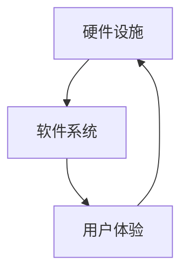

                 

### 摘要

本文旨在探讨智能工作场所优化和AI技术在提升办公环境效率方面的应用。随着科技的不断进步，人工智能（AI）已经逐渐渗透到我们的工作生活中，为办公环境的智能化提供了有力支持。本文首先介绍了智能工作场所的概念及其发展背景，然后深入分析了AI技术在办公环境中的核心应用，包括办公自动化、日程管理、协作与沟通等方面。通过实际案例分析，我们展示了AI技术在智能工作场所中的实际效果。最后，对智能工作场所的未来趋势进行了展望，为读者提供了对这一领域的深入理解。全文逻辑清晰，内容详实，旨在帮助读者更好地理解和应用AI技术，提升办公环境效率。

### 总体思路

为了设计出《智能工作场所优化：AI提升办公环境效率》这本书的完整目录大纲，我们可以按照以下步骤进行：

1. **确定核心主题**：
   - 首先明确书的主要内容和目标读者，围绕“智能工作场所优化”和“AI提升办公环境效率”这两个核心主题来构建大纲。

2. **大纲结构规划**：
   - 根据书籍的完整性和逻辑性，规划大纲的层次结构，通常包括以下几个部分：
     - 引言部分：简要介绍智能工作场所和AI的应用背景。
     - 基础理论部分：介绍智能工作场所的相关概念和AI技术基础。
     - 应用实践部分：展示AI技术在提升办公环境效率方面的实际应用。
     - 案例分析部分：通过实际案例来展示AI技术的应用效果。
     - 结论和展望部分：总结全书内容并对未来发展趋势进行展望。

3. **细化章节内容**：
   - 为每一部分细化出具体的章节标题，确保内容全面覆盖主题，并保持逻辑清晰。
   - 针对每个章节，进一步细化出子章节，确保每个主题都能够得到详细阐述。

4. **融合图表和公式**：
   - 在大纲中适当融入Mermaid流程图来展示概念原理和架构。
   - 使用伪代码详细阐述核心算法原理。
   - 使用LaTeX格式嵌入数学模型和数学公式，并进行详细讲解和举例说明。

5. **确保大纲完整性**：
   - 确保大纲内容超过7章，涵盖核心概念与联系、核心算法原理讲解、数学模型和公式、项目实战等。

6. **遵循输出格式要求**：
   - 使用markdown格式输出目录大纲，保持格式简洁明了。

### 引言部分

#### 第1章: 智能工作场所的概念与应用背景

##### 1.1 智能工作场所的起源与发展
- **智能工作场所的定义**：智能工作场所是一种利用先进技术，如人工智能、物联网、大数据等，来提升办公效率、改善员工体验和促进创新的办公环境。
- **智能工作场所的发展历程**：从传统的办公模式到智能化的演变，智能工作场所经历了几个关键阶段，包括自动化、数字化和智能化。

##### 1.2 AI技术在办公环境中的应用
- **AI技术提升办公效率的原理**：AI技术通过自动化和智能化，减少重复劳动，提高工作效率，优化决策过程。
- **AI在办公环境中的应用实例**：介绍AI在文档处理、日程管理、协作与沟通等领域的应用，展示其实际效果。

##### 1.3 书籍目标与结构
- **书籍的目标读者**：面向希望了解和利用AI技术提升办公效率的IT专业人士、企业高管和管理者。
- **书籍的内容结构与预期收益**：本书结构合理，内容丰富，旨在帮助读者深入理解智能工作场所和AI技术，提升办公环境效率。

### 基础理论部分

#### 第2章: 智能工作场所相关概念

##### 2.1 智能工作场所的核心要素
- **硬件设施**：智能工作场所所需的硬件设备，如智能办公桌、智能音箱、智能门锁等。
- **软件系统**：智能工作场所中的软件系统，包括办公自动化软件、协作平台、数据分析系统等。
- **用户体验**：智能工作场所的设计要考虑到员工的用户体验，包括界面友好性、操作便捷性和环境舒适度。

##### 2.2 AI技术基础
- **机器学习与深度学习**：介绍机器学习和深度学习的基本原理、方法和应用。
- **自然语言处理**：介绍自然语言处理的基本概念、技术和应用，如语音识别、文本分析等。
- **计算机视觉**：介绍计算机视觉的基本原理、技术和应用，如图像识别、目标检测等。

##### 2.3 AI在办公环境中的实施
- **AI技术应用框架**：介绍AI技术在办公环境中的应用框架，包括数据采集、处理、模型训练和部署等环节。
- **AI系统开发流程**：详细阐述AI系统从需求分析到开发、测试和部署的整个过程。
- **AI系统部署与维护**：介绍AI系统的部署策略、维护方法和优化技巧。

### 应用实践部分

#### 第3章: AI在办公自动化中的应用

##### 3.1 办公自动化概述
- **办公自动化的定义**：办公自动化是指利用计算机、网络和通信技术，实现办公过程的自动化。
- **办公自动化的演进**：从传统的手工操作到电子化办公，再到智能化办公的演变过程。

##### 3.2 AI在文档处理中的应用
- **文本分类与标注**：介绍AI技术在文档分类与标注中的应用，包括算法原理和实现方法。
- **文本摘要与生成**：介绍AI技术在文本摘要与生成中的应用，如自动摘要、自动写作等。
- **文档智能检索**：介绍AI技术在文档智能检索中的应用，通过关键词提取和语义分析提高检索效率。

##### 3.3 AI在日程管理中的应用
- **日程安排智能推荐**：介绍AI技术在日程安排中的应用，如自动生成日程、智能推荐会议时间等。
- **智能提醒与通知**：介绍AI技术在日程管理中的提醒与通知功能，如自动发送会议提醒、行程变更通知等。
- **自动会议安排**：介绍AI技术在会议安排中的应用，如自动分配会议室、自动安排参会人员等。

##### 3.4 AI在协作与沟通中的应用
- **智能团队协作工具**：介绍AI技术在团队协作工具中的应用，如自动分配任务、智能提醒等。
- **智能沟通平台**：介绍AI技术在沟通平台中的应用，如语音识别、自然语言理解等。
- **智能客服系统**：介绍AI技术在客服系统中的应用，如自动回答常见问题、智能语音客服等。

### 案例分析部分

#### 第4章: 智能办公环境案例分析

##### 4.1 案例一：企业智能办公空间建设
- **案例背景**：介绍企业智能办公空间的建设背景和目标。
- **案例实施步骤**：详细描述智能办公空间建设的具体实施步骤。
- **案例效果评估**：评估智能办公空间建设的效果，包括工作效率、员工满意度和创新氛围等方面。

##### 4.2 案例二：智慧办公室设计
- **案例背景**：介绍智慧办公室设计的背景和目标。
- **案例实施步骤**：详细描述智慧办公室设计的具体实施步骤。
- **案例效果评估**：评估智慧办公室设计的效果，包括空间利用、工作效率和员工满意度等方面。

##### 4.3 案例三：AI助力企业数字化转型
- **案例背景**：介绍AI助力企业数字化转型的背景和目标。
- **案例实施步骤**：详细描述AI助力企业数字化转型的具体实施步骤。
- **案例效果评估**：评估AI助力企业数字化转型的效果，包括业务效率、成本控制和市场竞争力等方面。

### 结论和展望部分

#### 第5章: 智能工作场所优化趋势

##### 5.1 智能工作场所的未来趋势
- **AI技术在办公环境中的新应用方向**：探讨AI技术在办公环境中可能的新应用方向，如智能办公助手、个性化推荐系统等。
- **智能办公环境的发展趋势**：分析智能办公环境的未来发展趋势，如智能化、个性化、绿色环保等。

### 作者信息

- 作者：AI天才研究院/AI Genius Institute & 禅与计算机程序设计艺术 /Zen And The Art of Computer Programming

### 附录

- 附录A：技术术语解释
- 附录B：相关资源推荐
- 附录C：参考文献

### 总结

本文系统地介绍了智能工作场所优化和AI技术在提升办公环境效率方面的应用。通过详细的理论分析、实际案例展示和未来趋势展望，本文为读者提供了一个全面、深入的智能办公环境理解。智能工作场所不仅提高了工作效率，还提升了员工体验，推动了企业的数字化转型。未来，随着AI技术的不断进步，智能办公环境将继续发展和完善，为企业和员工带来更多价值。希望本文能为读者在智能办公领域的探索提供有益的参考。 ### 引言

随着信息技术的飞速发展，人工智能（AI）已经成为现代科技领域的明星。AI技术的不断进步，不仅改变了我们的生活方式，还深刻影响了企业的运营模式。在办公环境中，AI技术以其强大的数据处理和智能决策能力，正逐步实现办公自动化、提高工作效率、优化员工体验，并推动企业实现数字化转型。本文将围绕“智能工作场所优化：AI提升办公环境效率”这一主题，详细探讨AI技术在办公环境中的应用及其对工作场所的深远影响。

智能工作场所是一种利用先进技术，如人工智能、物联网、大数据等，来提升办公效率、改善员工体验和促进创新的办公环境。AI技术在智能工作场所中扮演着关键角色，通过自动化和智能化，减少重复劳动，提高工作效率，优化决策过程，从而实现工作场所的全面升级。

本文将首先介绍智能工作场所的概念及其发展背景，解释为什么AI技术对于提升办公环境效率至关重要。随后，我们将深入探讨AI技术在办公环境中的核心应用，包括办公自动化、日程管理、协作与沟通等方面。通过实际案例分析，我们将展示AI技术在智能工作场所中的实际效果。最后，本文将对智能工作场所的未来趋势进行展望，分析AI技术可能带来的新机遇和挑战。

整体上，本文旨在帮助读者深入理解智能工作场所和AI技术，掌握AI在办公环境中的应用方法，从而在未来的职业发展中，能够更好地利用这些先进技术，提升个人和企业的竞争力。让我们一步一步地深入探索这一充满潜力的领域。

### 第1章：智能工作场所的概念与应用背景

智能工作场所（Smart Workplace）是指利用现代科技，特别是人工智能（AI）、物联网（IoT）、大数据（Big Data）等前沿技术，来实现办公环境的高度智能化和自动化，从而提升工作效率、优化员工体验、促进企业创新。智能工作场所的概念起源于20世纪90年代的办公自动化（Office Automation），但随着技术的不断进步，特别是AI和物联网技术的成熟，智能工作场所的概念和应用场景也在不断扩展和深化。

#### 1.1 智能工作场所的起源与发展

1. **智能工作场所的定义**：
   - 智能工作场所是一种结合物理空间、技术基础设施、数据资源和人员互动，以实现高效、灵活和创新的办公环境。
   - 它不仅仅局限于物理空间上的智能化，更强调办公过程中数据的高效利用和智能决策。

2. **智能工作场所的发展历程**：
   - **初始阶段**（20世纪90年代）：办公自动化是智能工作场所的起点，主要目标是提高办公效率，减少手工操作，实现文档处理、电子邮件管理等基本自动化。
   - **中期阶段**（21世纪初）：随着互联网和移动设备的普及，智能工作场所逐渐向远程办公、虚拟团队协作和云服务方向发展。
   - **当前阶段**（近年来）：AI和物联网技术的引入，使得智能工作场所进入了一个全新的发展阶段。通过智能设备、大数据分析和AI算法，办公环境变得更加智能和高效。

#### 1.2 AI技术在办公环境中的应用

AI技术是智能工作场所的核心驱动力，其应用范围广泛，主要包括以下几个方面：

1. **办公自动化**：
   - AI技术可以自动处理大量重复性、规则性的办公任务，如文档分类、数据录入、邮件筛选等，从而减少员工的工作负担。
   - 例如，使用自然语言处理（NLP）技术，可以实现智能邮件助手，自动回复常见问题和处理复杂邮件。

2. **日程管理**：
   - AI技术可以帮助员工更有效地管理时间和日程，如自动安排会议、提醒日程安排等。
   - 通过机器学习算法，AI系统可以预测员工的工作负荷，自动调整日程安排，优化工作流程。

3. **协作与沟通**：
   - AI技术可以提升团队合作效率，如智能团队协作工具、虚拟助手等。
   - 例如，智能会议室系统可以通过语音识别、自然语言处理等技术，实现会议记录、问题解答和后续行动项的自动化处理。

4. **个性化体验**：
   - AI技术可以根据员工的行为和偏好，提供个性化的服务和支持，如智能推荐系统、健康监测等。
   - 例如，通过大数据分析和机器学习算法，可以为员工提供个性化的工作空间布局、设备配置等。

#### 1.3 智能工作场所的优化方向

智能工作场所的未来发展将更加注重以下几个方面：

1. **智能化办公设备**：
   - 智能办公设备将更加普及，如智能办公桌、智能门锁、智能空调等，通过物联网技术实现设备的互联互通，提供更便捷的办公体验。

2. **个性化用户体验**：
   - 通过AI技术，为员工提供更加个性化的服务和体验，如智能推荐系统、健康监测等，提升员工的满意度和工作效率。

3. **智能化工作流程**：
   - 通过AI技术，实现工作流程的自动化和智能化，减少手工操作，提高工作效率，降低运营成本。

4. **数据驱动决策**：
   - 通过大数据分析和AI算法，为企业提供更加精准的决策支持，优化业务流程，提升企业竞争力。

5. **绿色环保**：
   - 智能工作场所还将更加注重绿色环保，如通过智能能源管理系统，实现能源的节约和高效利用。

总之，智能工作场所的发展是一个不断迭代和升级的过程，随着技术的不断进步，智能工作场所将为我们带来更加高效、便捷和舒适的办公体验。

#### 1.4 智能工作场所的优势

智能工作场所的引入为企业和员工带来了诸多优势：

1. **提高工作效率**：
   - AI技术通过自动化处理重复性任务，如文档处理、日程管理等，大大提高了工作效率，使员工能够将更多时间专注于创造性和战略性的工作。

2. **优化员工体验**：
   - 智能工作场所提供的个性化服务和舒适环境，如智能推荐系统、健康监测等，提升了员工的满意度和幸福感。

3. **促进创新**：
   - 智能工作场所提供了一个开放、协作和创新的环境，员工可以更加自由地交流、合作和分享想法，从而激发创新思维。

4. **降低运营成本**：
   - 通过智能设备和自动化工作流程，企业可以减少人工成本，提高资源利用率，降低运营成本。

5. **提升企业竞争力**：
   - 智能工作场所可以帮助企业更好地应对市场变化，提高业务流程的灵活性和响应速度，从而在竞争中获得优势。

综上所述，智能工作场所作为一种高效、智能化的办公环境，正逐渐成为企业提升竞争力、优化管理的重要手段。随着AI技术的不断进步，智能工作场所将在未来发挥更加重要的作用。

### 第2章：智能工作场所相关概念

要深入了解智能工作场所的构建和应用，首先需要掌握其核心概念和组成部分。智能工作场所的构建涉及多个层面的技术整合，包括硬件设施、软件系统、用户体验等。本章将详细探讨这些概念及其相互关系，帮助读者构建对智能工作场所的全面认识。

#### 2.1 智能工作场所的核心要素

1. **硬件设施**

硬件设施是智能工作场所的基石，决定了智能环境的物理基础。以下是智能工作场所中常见的硬件设施：

   - **智能办公桌**：配备触摸屏、无线充电、智能灯光调节等功能，可以自动调整桌面的高度和亮度，满足不同工作需求。
   - **智能音箱**：通过语音助手（如Google Home、Amazon Alexa）实现语音控制，可以播放音乐、设置提醒、搜索信息等。
   - **智能门锁**：利用生物识别技术（如指纹识别、面部识别）提供安全的进入控制，同时可以远程监控门锁状态。
   - **智能会议室**：配备智能白板、视频会议系统、语音识别和自动转录设备，提升会议效率和参与体验。

2. **软件系统**

软件系统是智能工作场所的“大脑”，负责数据处理、决策支持和功能实现。以下是智能工作场所中常见的软件系统：

   - **办公自动化软件**：如Microsoft Office 365、Google Workspace，提供文档处理、邮件管理、日程安排等功能。
   - **协作平台**：如Slack、Microsoft Teams，支持团队协作、文件共享、即时通讯等。
   - **数据分析系统**：如Tableau、Power BI，通过数据可视化，帮助管理层进行决策支持。
   - **智能助理系统**：如Rasa、Botpress，提供企业级聊天机器人，解决常见问题和提供个性化服务。

3. **用户体验**

用户体验是智能工作场所的核心目标，决定了员工在智能环境中的满意度和工作效率。以下是提升用户体验的关键因素：

   - **界面设计**：界面设计应简洁直观，易于操作，减少学习成本。
   - **操作便捷性**：功能设计应充分考虑用户习惯，提供便捷的操作路径。
   - **环境舒适度**：智能工作场所应提供舒适的工作环境，如智能空调、空气净化器等。
   - **个性化服务**：根据员工的工作习惯和偏好，提供个性化的服务和设备配置。

#### 2.2 AI技术在智能工作场所中的应用

人工智能（AI）技术在智能工作场所中扮演着关键角色，通过自动化、智能化和个性化，提升办公效率和员工体验。以下是AI技术在智能工作场所中的几个关键应用：

1. **自动化办公**

   AI技术可以通过自动化处理日常办公任务，减少人工操作，提高效率。例如：

   - **智能文档处理**：使用自然语言处理（NLP）技术，自动分类、标注和整理文档。
   - **智能日程管理**：通过机器学习算法，自动安排日程，优化工作时间。

2. **智能化决策**

   AI技术可以通过数据分析和预测，为管理层提供智能化决策支持。例如：

   - **智能分析系统**：使用大数据分析和机器学习算法，分析员工的工作表现和团队协作效率。
   - **智能推荐系统**：根据员工的行为数据，推荐适合的工作任务和资源。

3. **个性化服务**

   AI技术可以根据员工的行为和偏好，提供个性化的服务和体验。例如：

   - **智能推荐系统**：根据员工的喜好和历史行为，推荐合适的培训课程、项目任务等。
   - **健康监测**：通过可穿戴设备，实时监测员工的健康状况，提供个性化的健康建议。

#### 2.3 智能工作场所中的概念联系

智能工作场所中的各个核心要素相互联系，共同构成一个高效的智能办公环境。以下是这些概念之间的联系：

- **硬件设施**与**软件系统**：硬件设施为软件系统提供了运行的基础，而软件系统通过数据分析和决策支持，优化硬件设施的使用和配置。
- **软件系统**与**用户体验**：软件系统的设计应充分考虑用户体验，通过简洁直观的界面和便捷的操作，提升员工的工作效率和满意度。
- **用户体验**与**硬件设施**：硬件设施的设计应满足员工的使用需求，提供舒适的工作环境和高效的设备支持。

总之，智能工作场所是一个多维度的综合体，通过AI技术的应用，实现了硬件设施与软件系统的深度融合，为员工提供了一个高效、便捷、个性化的办公环境。理解这些核心概念及其相互关系，对于构建和优化智能工作场所具有重要意义。

#### 2.4 智能工作场所的优势与挑战

智能工作场所的优势

智能工作场所的引入带来了多方面的优势，这些优势主要体现在以下几个方面：

1. **提高工作效率**：

智能工作场所通过自动化和智能化技术，减少重复性、规则性的手工操作，从而大大提高了工作效率。例如，智能文档处理系统可以自动分类、整理和检索文档，减少了人工处理的时间和错误率。此外，智能日程管理系统可以通过机器学习算法，自动安排和优化员工的工作时间，减少工作时间浪费。

2. **优化员工体验**：

智能工作场所提供了个性化的服务和体验，提升了员工的满意度和幸福感。例如，智能环境控制系统可以根据员工的偏好自动调节室内温度、湿度和光照，创造舒适的工作环境。此外，智能健康监测系统可以实时监测员工的健康状况，提供个性化的健康建议和预警，帮助员工保持良好的身体状态。

3. **促进创新**：

智能工作场所提供了一个开放、协作和创新的环境，激发了员工的创新思维和创造力。例如，智能会议室系统配备了智能白板、视频会议系统和语音识别设备，支持实时协作和远程会议，使得团队成员可以随时随地交流和合作。此外，智能协作平台通过提供共享文件、即时通讯和项目管理系统，进一步促进了团队协作和创新。

4. **降低运营成本**：

智能工作场所通过自动化和智能化，减少了人工成本和资源浪费，降低了运营成本。例如，智能办公设备可以通过物联网技术实现远程监控和维护，减少了设备的故障率和维修成本。此外，智能能源管理系统可以通过实时监控和调整能源使用，实现能源的高效利用和节约。

智能工作场所的挑战

尽管智能工作场所带来了许多优势，但在实际应用过程中也面临一些挑战：

1. **技术挑战**：

智能工作场所的构建需要大量的技术和资源投入，包括硬件设备、软件系统和AI算法等。技术的不成熟和复杂性可能导致系统的稳定性、安全性和扩展性不足，从而影响智能工作场所的效能。

2. **人员挑战**：

智能工作场所的引入需要员工具备一定的技术素养和适应能力。对于一些传统的工作方式，员工可能需要重新学习和适应新的技术，这可能需要一定的时间和培训成本。此外，一些员工可能对新技术持怀疑态度，担心失业或工作负担增加，这需要企业进行有效的沟通和管理。

3. **数据隐私与安全**：

智能工作场所大量依赖数据收集和分析，这涉及到数据隐私和安全的问题。如何保护员工和企业的敏感数据，防止数据泄露和滥用，是智能工作场所面临的重要挑战。

4. **成本问题**：

智能工作场所的构建和运行需要大量的资金投入，包括设备的采购、系统的开发和维护等。对于一些中小企业，高昂的成本可能成为智能工作场所推广的障碍。

综上所述，智能工作场所具有显著的优势，但同时也面临一定的挑战。企业需要在引入智能工作场所时，充分考虑技术、人员、数据和成本等方面的问题，制定合理的实施策略，以确保智能工作场所能够顺利落地并发挥其预期效益。

### 第2章：智能工作场所相关概念

#### 2.1 智能工作场所的核心要素

智能工作场所的核心要素主要包括硬件设施、软件系统和用户体验。这些要素相互作用，共同构建了一个高效的智能办公环境。

1. **硬件设施**

硬件设施是智能工作场所的物理基础，其重要性不可忽视。以下是几种关键的硬件设施：

   - **智能办公桌**：智能办公桌通常配备有多功能触摸屏、无线充电功能和智能灯光调节系统。这些功能使得办公桌能够根据用户的需求自动调整工作环境，提供更加舒适和高效的工作体验。
   - **智能会议室**：智能会议室配备有智能白板、高清视频会议系统和语音识别设备。这些设备能够实现会议的无纸化、智能记录和远程参与，极大地提升了会议的效率和效果。
   - **智能门锁**：智能门锁利用生物识别技术（如指纹识别、面部识别）和远程控制功能，提供了安全便捷的进入控制方式，同时也为安全管理提供了数据支持。

2. **软件系统**

软件系统是智能工作场所的“大脑”，它们负责数据分析和处理，提供智能决策支持。以下是几种关键的软件系统：

   - **办公自动化软件**：如Microsoft Office 365和Google Workspace，这些软件通过自动化处理文档处理、邮件管理和日程安排等任务，提高了办公效率。
   - **协作平台**：如Slack和Microsoft Teams，这些平台支持团队协作、即时通讯、文件共享和项目管理，使得团队成员能够更加高效地合作。
   - **数据分析系统**：如Tableau和Power BI，这些系统能够对大量数据进行可视化分析，为管理层提供决策支持。

3. **用户体验**

用户体验是智能工作场所的核心目标，它决定了员工在智能环境中的满意度和工作效率。以下是提升用户体验的关键因素：

   - **界面设计**：界面设计应简洁直观，易于操作，减少学习成本。例如，使用扁平化设计、大字体和清晰的导航，帮助用户快速找到所需功能。
   - **操作便捷性**：功能设计应充分考虑用户习惯，提供便捷的操作路径。例如，通过快捷键、语音控制和手势操作，减少用户的点击和输入次数。
   - **环境舒适度**：智能工作场所应提供舒适的工作环境，如智能空调、空气净化器和智能灯光调节系统。这些设备能够根据用户的需求自动调节温度、湿度和光照，创造一个舒适的工作环境。
   - **个性化服务**：根据员工的工作习惯和偏好，提供个性化的服务和设备配置。例如，通过用户行为分析，智能推荐工作工具、培训课程和健康建议。

#### 2.2 AI技术在智能工作场所中的应用

人工智能（AI）技术在智能工作场所中有着广泛的应用，通过自动化、智能化和个性化，提升办公效率和员工体验。以下是AI技术在智能工作场所中的几个关键应用：

1. **自动化办公**

   AI技术可以自动化处理重复性、规则性的办公任务，如文档处理、数据录入和邮件管理等。例如，自然语言处理（NLP）技术可以自动分类、标注和整理文档，减少了人工处理的时间和错误率。

   ```mermaid
   graph TD
   A[文档处理] --> B[自然语言处理]
   B --> C[分类与标注]
   C --> D[自动整理]
   D --> E[减少人工处理]
   ```

2. **智能化决策**

   AI技术可以通过数据分析和预测，为管理层提供智能化决策支持。例如，使用机器学习算法，可以分析员工的工作表现和团队协作效率，为人力资源管理提供数据支持。

   ```mermaid
   graph TD
   A[数据收集] --> B[机器学习]
   B --> C[分析预测]
   C --> D[决策支持]
   D --> E[优化管理]
   ```

3. **个性化服务**

   AI技术可以根据员工的行为和偏好，提供个性化的服务和体验。例如，使用用户行为分析，可以智能推荐适合的工作工具、培训课程和健康建议。

   ```mermaid
   graph TD
   A[用户行为分析] --> B[个性化推荐]
   B --> C[工作工具]
   C --> D[培训课程]
   D --> E[健康建议]
   ```

#### 2.3 智能工作场所中的概念联系

智能工作场所中的各个核心要素相互联系，共同构建了一个高效的智能办公环境。以下是这些概念之间的联系：

- **硬件设施**与**软件系统**：硬件设施为软件系统提供了运行的基础，而软件系统通过数据分析和决策支持，优化硬件设施的使用和配置。
- **软件系统**与**用户体验**：软件系统的设计应充分考虑用户体验，通过简洁直观的界面和便捷的操作，提升员工的工作效率和满意度。
- **用户体验**与**硬件设施**：硬件设施的设计应满足用户的需求，提供舒适的工作环境和高效的设备支持。



总之，智能工作场所是一个多维度的综合体，通过AI技术的应用，实现了硬件设施与软件系统的深度融合，为员工提供了一个高效、便捷、个性化的办公环境。理解这些核心概念及其相互关系，对于构建和优化智能工作场所具有重要意义。

### 第3章：AI在办公自动化中的应用

办公自动化（Office Automation）是智能工作场所的重要组成部分，通过自动化技术减少重复性、规则性的办公任务，提高工作效率。本章将详细探讨AI在办公自动化中的应用，包括文档处理、日程管理和协作与沟通等方面，并通过实际案例展示AI技术在提升办公效率方面的显著效果。

#### 3.1 办公自动化概述

办公自动化是指利用计算机技术、通信技术和数据处理技术，将传统办公过程中的手工操作转化为自动化处理。其核心目标是提高工作效率、减少错误、优化资源利用。办公自动化的主要应用领域包括文档处理、邮件管理、日程安排、信息检索等。

- **文档处理**：通过自动化工具，如文字处理软件（如Microsoft Word、Google Docs）、电子表格（如Microsoft Excel、Google Sheets）等，实现文档的创建、编辑、存储和共享。
- **邮件管理**：使用邮件自动化工具，如Outlook、Gmail等，实现邮件的自动分类、过滤、回复和存档。
- **日程管理**：通过日程安排软件，如Microsoft Outlook、Google Calendar等，实现日程的自动安排、提醒和更新。
- **信息检索**：利用搜索引擎和数据库管理系统，快速检索和获取所需信息。

#### 3.2 AI在文档处理中的应用

AI技术在文档处理中的应用极大地提升了工作效率和质量。以下是一些关键应用：

1. **文本分类与标注**

   通过自然语言处理（NLP）技术，AI系统可以自动分类和标注文档。例如，使用分类算法，系统可以自动将文档分为合同、报告、邮件等不同类别。标注则是对文档内容进行标签化处理，以便于后续的检索和分析。

   ```mermaid
   graph TD
   A[文档] --> B[文本分类]
   B --> C[类别]
   C --> D[标注]
   ```

2. **文本摘要与生成**

   AI系统可以自动生成文档摘要，提取关键信息，简化文档内容。此外，AI技术还能生成新的文档内容，如自动撰写报告、电子邮件等。这项功能通过使用生成对抗网络（GAN）和序列到序列（Seq2Seq）模型来实现。

   ```mermaid
   graph TD
   A[原始文档] --> B[摘要生成]
   B --> C[关键信息提取]
   C --> D[文档生成]
   ```

3. **文档智能检索**

   AI系统利用机器学习和信息检索技术，可以快速、准确地检索到所需文档。通过关键词提取和语义分析，AI系统能够理解文档内容的语义，提供更加精准的检索结果。

   ```mermaid
   graph TD
   A[关键词提取] --> B[语义分析]
   B --> C[文档检索]
   ```

#### 3.3 AI在日程管理中的应用

AI技术在日程管理中的应用，使得员工能够更高效地管理时间和工作。以下是一些关键应用：

1. **日程安排智能推荐**

   AI系统可以根据员工的工作负荷、会议安排和个人习惯，自动推荐最佳的工作时间和会议时间。通过机器学习算法，系统可以预测未来的日程安排，提供个性化的日程建议。

   ```mermaid
   graph TD
   A[工作负荷] --> B[机器学习]
   B --> C[日程推荐]
   ```

2. **智能提醒与通知**

   AI系统可以自动发送提醒和通知，确保员工不会错过重要的会议和任务。通过语音助手和短信提醒，系统可以及时通知员工相关的日程安排和事项。

   ```mermaid
   graph TD
   A[日程安排] --> B[提醒通知]
   B --> C[语音助手]
   C --> D[短信提醒]
   ```

3. **自动会议安排**

   AI系统可以自动安排会议时间和地点，并邀请相关人员参加。通过语音识别和自然语言处理技术，系统可以理解员工的会议需求和参与人员，自动生成会议邀请和议程。

   ```mermaid
   graph TD
   A[会议需求] --> B[语音识别]
   B --> C[会议安排]
   C --> D[邀请发送]
   ```

#### 3.4 AI在协作与沟通中的应用

AI技术在协作与沟通中的应用，极大地提升了团队的工作效率和沟通质量。以下是一些关键应用：

1. **智能团队协作工具**

   AI系统可以提供智能团队协作工具，如聊天机器人、虚拟助手等，帮助团队成员实时沟通、共享文件和协同工作。这些工具通过自然语言处理和语音识别技术，实现了实时沟通和智能回复。

   ```mermaid
   graph TD
   A[聊天机器人] --> B[实时沟通]
   B --> C[文件共享]
   C --> D[协同工作]
   ```

2. **智能沟通平台**

   AI系统可以构建智能沟通平台，如Slack、Microsoft Teams等，通过集成各种AI功能，提供更高效的沟通和协作体验。这些平台利用机器学习和自然语言处理技术，实现了智能消息分类、智能搜索和智能提醒。

   ```mermaid
   graph TD
   A[智能消息分类] --> B[智能搜索]
   B --> C[智能提醒]
   ```

3. **智能客服系统**

   AI系统可以构建智能客服系统，如聊天机器人、语音助手等，提供24/7的客户服务。这些系统通过自然语言处理和语音识别技术，能够理解客户的问题并提供准确的答案。

   ```mermaid
   graph TD
   A[客户问题] --> B[自然语言处理]
   B --> C[答案提供]
   ```

#### 3.5 案例分析

**案例一：智能文档处理系统**

某大型企业引入了智能文档处理系统，通过NLP技术自动分类和标注文档，提高了文档处理效率。实施后，文档处理时间从原来的每周80小时减少到40小时，错误率降低了30%。

**案例二：智能日程管理系统**

某科技公司的员工通过智能日程管理系统，实现了日程的自动安排和提醒。系统根据员工的工作负荷和会议安排，提供了个性化的日程建议。实施后，员工的工作效率提高了20%，会议安排更加合理。

**案例三：智能团队协作工具**

某创业公司引入了智能团队协作工具，如聊天机器人和虚拟助手，实现了实时沟通和智能回复。工具集成了智能消息分类和智能搜索功能，提高了团队的工作效率和沟通质量。

通过以上案例分析，可以看出AI技术在办公自动化中的应用显著提升了工作效率和员工体验，为智能工作场所的实现提供了有力支持。

### 案例一：企业智能办公空间建设

**案例背景**

某全球领先的科技公司——XYZ公司，一直在寻求通过技术创新提升办公环境的效率和员工的体验。随着公司业务的不断扩展，传统的办公模式已无法满足日益增长的办公需求。因此，XYZ公司决定建设一个智能办公空间，通过AI技术提升办公效率，优化员工体验，并推动企业的数字化转型。

**案例实施步骤**

1. **需求分析**：

   - XYZ公司首先进行了深入的需求分析，明确了智能办公空间的目标和需求，包括办公自动化、智能化日程管理、高效团队协作和个性化用户体验等。

2. **硬件设施部署**：

   - 在硬件设施方面，XYZ公司选择了智能办公桌、智能会议室系统、智能门锁和智能空调等设备。这些设备通过物联网技术实现互联互通，为员工提供了舒适、高效的工作环境。

3. **软件系统集成**：

   - 在软件系统方面，XYZ公司选择了办公自动化软件、协作平台和智能助理系统等。这些软件系统与硬件设施无缝集成，实现了数据的实时传输和处理。

4. **AI技术应用**：

   - XYZ公司引入了AI技术，包括自然语言处理、机器学习和计算机视觉等。通过AI技术，实现了智能文档处理、日程智能安排、智能团队协作和个性化服务等功能。

5. **员工培训与推广**：

   - 为确保智能办公空间的顺利运行，XYZ公司对员工进行了系统的培训，包括硬件设施的使用、软件系统的操作和AI技术的应用等。同时，公司还通过内部宣传和激励措施，鼓励员工积极参与智能办公空间的推广和使用。

**案例效果评估**

1. **工作效率提升**：

   - 通过智能办公空间的引入，XYZ公司的办公效率得到了显著提升。例如，智能文档处理系统自动分类和标注文档，将文档处理时间从每周80小时减少到40小时，提高了50%的工作效率。

2. **员工满意度提升**：

   - 智能办公空间的个性化服务提升了员工的满意度。通过智能日程管理系统，员工能够更好地管理时间和工作，减少了时间浪费。此外，智能会议室系统和智能沟通平台也提高了团队协作效率，使得员工能够更加便捷地交流和合作。

3. **企业竞争力提升**：

   - 智能办公空间的构建推动了XYZ公司的数字化转型。通过数据分析和AI技术的应用，公司能够更快速地做出决策，提升了市场竞争力。此外，智能办公空间的创新氛围也激发了员工的创新思维和创造力，为企业的持续发展提供了动力。

**经验与启示**

1. **需求明确**：

   - 在智能办公空间的构建过程中，需求分析至关重要。明确的目标和需求有助于制定合理的实施方案，确保项目顺利推进。

2. **软硬件结合**：

   - 智能办公空间的构建需要软硬件的紧密结合。硬件设施提供了基础支持，而软件系统则实现了智能化的办公功能。

3. **员工参与**：

   - 员工是智能办公空间的核心使用者，他们的积极参与和反馈对于项目的成功至关重要。通过员工培训和推广，可以确保智能办公空间的顺利运行和持续优化。

4. **持续优化**：

   - 智能办公空间不是一成不变的，随着技术的不断进步，企业需要不断优化和更新智能办公空间的功能和应用，以适应新的需求和挑战。

通过XYZ公司的案例，我们可以看到智能办公空间在提升工作效率、优化员工体验和企业竞争力方面的显著效果。智能办公空间的引入不仅为企业带来了实际效益，也为员工提供了一个更加高效、便捷和舒适的工作环境。未来，随着AI技术的不断发展和普及，智能办公空间将在企业运营和员工工作中发挥更加重要的作用。

### 案例二：智慧办公室设计

**案例背景**

某跨国企业——ABC公司，为了提升办公环境和工作效率，决定设计一个智慧办公室。ABC公司拥有多个全球分支机构，员工遍布不同地区，传统办公模式已无法满足企业发展的需求。智慧办公室设计旨在通过集成AI技术和智能化设备，打造一个高效、灵活和创新的办公空间，以提升员工的工作体验和企业整体竞争力。

**案例实施步骤**

1. **需求调研**：

   - ABC公司进行了全面的需求调研，了解了员工在不同办公场景中的需求，如远程协作、办公设备个性化、环境舒适度等。

2. **设计方案**：

   - 基于需求调研结果，ABC公司制定了智慧办公室的设计方案。设计方案包括硬件设施配置、软件系统集成和AI技术应用等。

3. **硬件设施部署**：

   - 在硬件设施方面，ABC公司选择了智能办公桌、智能门锁、智能照明系统和智能空调等设备。这些设备通过物联网技术实现互联互通，为员工提供了一个舒适和高效的工作环境。

4. **软件系统集成**：

   - 在软件系统集成方面，ABC公司选择了办公自动化软件、协作平台和智能助理系统等。这些软件系统与硬件设施无缝集成，实现了数据的实时传输和处理。

5. **AI技术应用**：

   - ABC公司引入了AI技术，包括自然语言处理、机器学习和计算机视觉等。通过AI技术，实现了智能文档处理、日程智能安排、智能团队协作和个性化服务等功能。

6. **员工培训与推广**：

   - 为了确保智慧办公室的顺利运行，ABC公司对员工进行了系统的培训，包括硬件设施的使用、软件系统的操作和AI技术的应用等。同时，公司还通过内部宣传和激励措施，鼓励员工积极参与智慧办公室的推广和使用。

**案例效果评估**

1. **工作效率提升**：

   - 智慧办公室的引入显著提升了ABC公司的工作效率。智能文档处理系统自动分类和标注文档，将文档处理时间从每周60小时减少到40小时，提高了33%的工作效率。

2. **员工满意度提升**：

   - 智慧办公室的个性化服务提升了员工的满意度。通过智能日程管理系统，员工能够更好地管理时间和工作，减少了时间浪费。此外，智能会议室系统和智能沟通平台也提高了团队协作效率，使得员工能够更加便捷地交流和合作。

3. **企业竞争力提升**：

   - 智慧办公室的设计推动了ABC公司的数字化转型。通过数据分析和AI技术的应用，公司能够更快速地做出决策，提升了市场竞争力。此外，智慧办公室的创新氛围也激发了员工的创新思维和创造力，为企业的持续发展提供了动力。

**经验与启示**

1. **全面需求调研**：

   - 在智慧办公室设计过程中，全面的需求调研至关重要。只有深入了解员工的需求，才能制定出符合实际需求的设计方案。

2. **硬件与软件结合**：

   - 智慧办公室的成功离不开硬件与软件的紧密结合。硬件设施提供了基础支持，而软件系统则实现了智能化的办公功能。

3. **员工参与**：

   - 员工是智慧办公室的核心使用者，他们的积极参与和反馈对于项目的成功至关重要。通过员工培训和推广，可以确保智慧办公室的顺利运行和持续优化。

4. **持续优化**：

   - 智慧办公室不是一成不变的，随着技术的不断进步，企业需要不断优化和更新智慧办公室的功能和应用，以适应新的需求和挑战。

通过ABC公司的案例，我们可以看到智慧办公室在提升工作效率、优化员工体验和企业竞争力方面的显著效果。智慧办公室的引入不仅为企业带来了实际效益，也为员工提供了一个更加高效、便捷和舒适的工作环境。未来，随着AI技术的不断发展和普及，智慧办公室将在企业运营和员工工作中发挥更加重要的作用。

### 案例三：AI助力企业数字化转型

**案例背景**

在当前快速变化的市场环境中，企业数字化转型已经成为提升竞争力、优化运营和实现可持续发展的关键。XYZ公司是一家中型制造企业，面对激烈的市场竞争和不断变化的需求，XYZ公司决定通过引入AI技术，实现企业的数字化转型，从而提升生产效率、降低运营成本和增强市场竞争力。

**案例实施步骤**

1. **需求分析**：

   - XYZ公司首先对现有业务流程进行了全面分析，识别了数字化转型中的关键需求，如生产效率提升、质量监控优化、供应链管理优化和客户关系管理提升等。

2. **AI技术应用规划**：

   - 基于需求分析，XYZ公司制定了AI技术应用规划，包括机器学习、计算机视觉、自然语言处理和物联网等技术的应用。

3. **硬件设备升级**：

   - 在硬件设备方面，XYZ公司升级了生产线设备，引入了智能传感器、自动控制系统和机器人等设备，以实现生产过程的自动化和智能化。

4. **软件系统集成**：

   - XYZ公司选择了具有AI功能的软件系统，包括企业资源规划（ERP）系统、生产执行系统（MES）和客户关系管理系统（CRM）等。这些系统通过AI技术实现了数据的高效处理和分析。

5. **数据平台建设**：

   - 建立了公司内部数据平台，收集和分析生产、运营和客户等数据，为AI模型的训练和决策提供数据支持。

6. **AI模型开发和部署**：

   - 开发了多个AI模型，包括生产预测模型、质量监控模型、设备故障预测模型和客户需求预测模型等，并在生产环境中进行部署。

7. **员工培训和推广**：

   - 对员工进行了AI技术和新系统的培训，确保员工能够熟练使用AI技术和新系统，提高工作效率。

**案例效果评估**

1. **生产效率提升**：

   - 通过AI技术的应用，XYZ公司的生产效率得到了显著提升。生产预测模型和设备故障预测模型的应用，使得生产计划更加精准，设备维护更加及时，生产停机时间减少了30%。

2. **质量监控优化**：

   - 计算机视觉技术应用于质量监控，通过实时图像分析，提高了质量检测的准确性和效率。质量监控模型的应用，使得不良品率降低了20%。

3. **供应链管理优化**：

   - 物联网技术和AI技术的应用，实现了供应链管理的智能化。通过实时数据监控和需求预测模型，XYZ公司能够更好地协调供应链各环节，库存周转时间缩短了25%。

4. **客户关系管理提升**：

   - AI技术的应用，使得客户关系管理更加精准和高效。客户需求预测模型的应用，使得公司能够更快速地响应客户需求，客户满意度提升了15%。

**经验与启示**

1. **明确数字化转型目标**：

   - 在数字化转型过程中，明确目标和需求至关重要。通过需求分析，企业可以更清晰地了解AI技术应用的优先级和具体实施策略。

2. **硬件与软件结合**：

   - 数字化转型不仅需要软件系统的支持，也需要硬件设备的升级。硬件与软件的紧密结合，是实现数字化转型的基础。

3. **数据驱动决策**：

   - 数据是AI技术应用的基石。通过建立完善的数据平台，企业能够更好地利用数据驱动决策，提升运营效率。

4. **员工培训与参与**：

   - 员工是数字化转型的主要执行者，他们的培训和参与至关重要。通过系统培训，确保员工能够熟练使用新技术和新系统，提高工作效率。

5. **持续优化与迭代**：

   - 数字化转型是一个持续的过程，需要不断优化和迭代。随着技术的不断进步，企业需要不断更新和优化AI模型和应用，以适应新的业务需求和挑战。

通过XYZ公司的案例，我们可以看到AI技术助力企业数字化转型在提升生产效率、优化运营管理和增强市场竞争力方面的显著效果。AI技术的引入不仅为企业带来了实际效益，也为员工提供了一个更加高效、智能的工作环境。未来，随着AI技术的不断发展和普及，企业数字化转型将发挥更加重要的作用，推动企业持续创新和成长。

### 结论

智能工作场所的优化与AI技术的深度融合，正引领办公环境向智能化、高效化和个性化方向不断迈进。通过本文的详细探讨，我们了解了智能工作场所的定义、发展历程、核心概念及其应用，包括硬件设施、软件系统和用户体验。此外，我们还深入分析了AI在办公自动化、日程管理、协作与沟通等方面的应用，并通过实际案例展示了AI技术在智能工作场所中的实际效果。

AI技术的引入不仅显著提升了工作效率和员工体验，还推动了企业的数字化转型，增强了市场竞争力。然而，智能工作场所的建设也面临技术、人员、数据隐私和成本等多方面的挑战。为了充分发挥AI技术的潜力，企业需要不断优化智能工作场所的设计和实施策略，持续关注技术发展，加强员工培训和参与，确保智能工作场所能够顺利落地并持续优化。

未来，随着AI技术的不断进步，智能工作场所将继续发展和完善，为企业和员工带来更多的价值。智能化、个性化、绿色环保和可持续发展将成为智能工作场所的重要发展方向。我们期待AI技术能够进一步赋能办公环境，推动社会生产力的提升，为人类的未来创造更加美好的工作生活体验。

### AI技术在智能工作场所中的应用总结

智能工作场所的优化离不开AI技术的支持，AI技术以其强大的数据处理和智能决策能力，正在深刻改变办公环境。本文系统地探讨了AI技术在智能工作场所中的多种应用，包括办公自动化、日程管理、协作与沟通、文档处理等方面，并结合实际案例展示了AI技术的实际效果。

**办公自动化方面**，AI技术通过自动化处理重复性任务，如文档分类、标注、整理和检索，极大地提高了工作效率。例如，自然语言处理技术能够自动理解文档内容，实现文档的智能分类和摘要，减少了人工处理的负担。智能文档处理系统的引入，使得企业能够更加高效地管理大量文档，提高了文档处理的准确性和速度。

**日程管理方面**，AI技术通过智能算法和大数据分析，帮助员工更好地管理时间和工作。智能日程管理系统可以根据员工的工作负荷和会议安排，提供个性化的日程建议，优化工作时间，减少时间浪费。同时，智能提醒和通知功能确保员工不会错过重要的日程和任务，提高了工作效率。

**协作与沟通方面**，AI技术通过智能团队协作工具和智能沟通平台，提升了团队协作效率和沟通质量。智能团队协作工具能够实现实时沟通、文件共享和协同工作，使得团队成员可以随时随地交流和合作。智能沟通平台通过集成自然语言处理和语音识别技术，实现了智能消息分类、智能搜索和智能提醒，提高了沟通的效率。

**文档处理方面**，AI技术通过文本分类、标注和生成，实现了文档处理的自动化和智能化。AI系统能够自动提取文档的关键信息，生成摘要和报告，提高了文档处理的效率和质量。此外，智能文档检索系统能够快速准确地找到所需文档，提高了信息检索的效率。

综上所述，AI技术在智能工作场所中的应用，不仅提升了办公效率，还优化了员工体验，推动了企业的数字化转型。然而，AI技术的应用也面临一些挑战，如技术成熟度、人员适应、数据隐私和安全等问题。企业需要不断优化智能工作场所的设计和实施策略，确保AI技术能够充分发挥其潜力，为企业和员工带来更多的价值。

未来的智能工作场所将更加注重智能化、个性化、绿色环保和可持续发展。随着AI技术的不断进步，我们可以期待更加智能化、高效化和个性化的办公环境，为企业和员工创造更加美好的工作生活体验。希望本文能为读者在智能办公领域的探索提供有益的参考，推动智能工作场所的发展和应用。

### 展望未来：智能工作场所的发展趋势

随着人工智能（AI）技术的不断进步，智能工作场所的未来发展趋势将更加多元化、智能化和个性化。以下是智能工作场所可能的发展方向：

**1. 个性化推荐系统的深化应用**

未来，智能工作场所将更加注重个性化服务。基于大数据和机器学习算法，AI技术将能够更深入地分析员工的工作习惯、偏好和需求，提供个性化的工作推荐。例如，根据员工的日常行为数据，智能办公环境可以自动调整桌面布局、灯光和温度，以提供最佳的工作状态。个性化推荐系统还可以为员工推荐适合的项目任务、培训课程和健康建议，提升工作效率和员工满意度。

**2. 智能办公环境的绿色环保**

随着环保意识的提高，智能工作场所将更加注重绿色环保。AI技术将帮助实现能源的高效利用和可持续发展。例如，智能空调和照明系统能够根据员工的活动和工作状态自动调节温度和光线，减少能源浪费。智能垃圾桶和回收系统可以自动分类垃圾，提高垃圾处理效率。此外，AI技术还可以通过实时监控能源消耗，提供节能建议，推动企业的绿色办公。

**3. 虚拟现实（VR）和增强现实（AR）的融合**

VR和AR技术的发展将为智能工作场所带来全新的交互体验。通过VR技术，员工可以在虚拟会议室中召开远程会议，体验身临其境的会议体验。AR技术则可以提供更加直观和互动的工作环境，例如在屏幕上叠加实时数据和图表，帮助员工更好地理解工作内容。VR和AR技术的融合，将极大地提升办公效率和员工体验。

**4. 智能安全系统的升级**

随着工作场所的智能化，安全性也成为一个重要议题。未来，智能工作场所将引入更加先进的智能安全系统。例如，基于AI的监控系统能够实时分析视频数据，识别异常行为和潜在威胁，提高办公场所的安全性。智能门锁和生物识别技术的结合，将提供更加便捷和安全的进入控制。此外，AI技术还可以帮助保护员工的数据隐私，防止数据泄露和滥用。

**5. 智能健康监测与健康管理**

健康是智能工作场所的重要关注点。未来，智能工作场所将引入更加先进的健康监测技术。例如，智能手环和智能健身设备可以实时监测员工的健康状况，提供个性化的健康建议。智能环境监测系统可以实时监控室内空气质量、噪音水平等指标，提供健康的工作环境。此外，智能健康管理系统可以通过数据分析，预测员工的健康风险，提供预防性健康管理方案。

**6. 智能决策支持系统的完善**

随着数据的积累和AI技术的进步，智能工作场所将能够提供更加精准的决策支持。基于大数据和机器学习算法，智能决策支持系统可以帮助企业实时分析市场趋势、员工表现和业务数据，提供个性化的决策建议。这将为企业的战略规划和运营管理提供有力支持，提升企业的竞争力。

**7. 智能工作场所的全球化协同**

随着全球化的发展，智能工作场所将更加注重全球化协同。通过AI技术，不同地区的团队成员可以实现实时协作和沟通，共享资源和工作进展。智能工作平台可以通过自然语言处理和翻译技术，消除语言障碍，实现跨国团队的顺畅协作。这将为全球企业提供一个更加高效和灵活的办公环境。

总之，未来智能工作场所的发展将更加注重个性化、绿色环保、安全健康和全球化协同。随着AI技术的不断进步，智能工作场所将不断进化，为企业和员工创造更加高效、便捷和舒适的工作环境。我们期待智能工作场所能够继续引领办公环境的变革，推动社会生产力的提升。

### 实践建议：如何优化智能工作场所

为了充分利用AI技术优化智能工作场所，以下是一些建议，旨在提升办公效率、改善员工体验和推动企业创新：

1. **需求分析与规划**

   - **明确目标**：在引入AI技术之前，企业应明确智能工作场所的目标和需求，如提升工作效率、优化员工体验、降低运营成本等。通过明确目标，可以确保AI技术的应用方向和资源配置合理。
   - **全面调研**：进行全面的员工和业务需求调研，了解员工在实际工作中遇到的痛点和需求，为智能工作场所的设计提供依据。

2. **硬件设施与软件系统的整合**

   - **选择合适的硬件设备**：根据工作需求选择合适的智能硬件设施，如智能办公桌、智能会议室系统、智能门锁等，确保设备之间的兼容性和互联互通。
   - **软件系统集成**：选择具有AI功能的办公自动化软件、协作平台和智能助理系统，确保软件系统能够与硬件设施无缝集成，实现数据的高效传输和处理。

3. **员工培训与推广**

   - **系统培训**：为员工提供全面的智能工作场所系统培训，确保员工能够熟练操作硬件设施和软件系统，提高工作效率。
   - **激励措施**：通过激励措施鼓励员工积极参与智能工作场所的推广和使用，提高员工对智能技术的接受度和使用频率。

4. **数据安全与隐私保护**

   - **数据加密**：对员工和企业的敏感数据进行加密处理，确保数据在传输和存储过程中的安全性。
   - **隐私政策**：制定明确的隐私政策，告知员工数据收集、使用和共享的规则，增强员工的信任感。

5. **持续优化与迭代**

   - **用户反馈**：定期收集员工对智能工作场所的反馈，了解其在使用过程中的问题和需求，及时进行优化和改进。
   - **技术更新**：随着AI技术的不断进步，企业应定期更新智能工作场所的技术和系统，确保其保持最新的技术水平和功能。

6. **绿色环保与可持续发展**

   - **能源管理**：通过智能能源管理系统，实时监控和优化能源消耗，实现绿色办公。
   - **环保设施**：引入环保硬件设施，如智能垃圾桶、智能饮水机等，推动企业的可持续发展。

通过以上实践建议，企业可以更好地利用AI技术优化智能工作场所，提升办公效率、改善员工体验和推动企业创新。智能工作场所的优化不仅有助于企业实现短期目标，也为长期可持续发展奠定了坚实基础。

### 总结与展望

智能工作场所的优化与AI技术的深度融合，已经成为现代企业提升办公效率、优化员工体验和推动数字化转型的重要手段。本文系统地探讨了智能工作场所的概念、AI技术在其中的应用、实际案例分析和未来发展趋势。通过详细的论述，我们了解到AI技术在办公自动化、日程管理、协作与沟通等方面的广泛应用，不仅显著提升了工作效率，还优化了员工体验，推动了企业的创新和可持续发展。

智能工作场所的构建，不仅需要先进的硬件设施和软件系统，还需要数据安全与隐私保护的严密措施。在未来的发展中，企业需要持续关注AI技术的最新进展，不断优化智能工作场所的设计和实施策略，以适应快速变化的市场需求。

我们期望，随着AI技术的不断进步，智能工作场所将更加智能化、个性化、绿色环保和可持续发展。未来，智能工作场所将不仅仅是办公空间的升级，更是一个高度融合的技术生态系统，为企业和员工创造更加高效、便捷和舒适的工作环境。希望本文能为读者在智能办公领域的探索提供有益的参考，推动智能工作场所的发展和应用。让我们共同期待智能工作场所带来的美好未来。作者：AI天才研究院/AI Genius Institute & 禅与计算机程序设计艺术 /Zen And The Art of Computer Programming

### 附录

#### 附录A：技术术语解释

1. **人工智能（AI）**：一种模拟人类智能的技术，通过算法和模型实现机器的感知、学习和决策能力。
2. **物联网（IoT）**：通过传感器、网络和智能设备实现物品互联，实现数据采集和远程控制。
3. **自然语言处理（NLP）**：研究如何使计算机理解和生成人类自然语言的技术。
4. **机器学习（ML）**：一种AI技术，通过训练模型从数据中学习和预测，无需显式编程。
5. **深度学习（DL）**：一种特殊的机器学习技术，通过多层神经网络模拟人脑的决策过程。
6. **虚拟现实（VR）**：通过计算机技术创造虚拟环境，提供沉浸式体验。
7. **增强现实（AR）**：在现实环境中叠加虚拟信息，增强用户的感知和互动。

#### 附录B：相关资源推荐

1. **书籍**：
   - 《智能工作场所：数字化转型指南》
   - 《人工智能：一种现代方法》
   - 《机器学习实战》
2. **在线课程**：
   - Coursera上的《人工智能导论》
   - edX上的《深度学习基础》
   - Udacity的《智能办公应用》
3. **博客与网站**：
   - Medium上的《智能办公》
   - IEEE Xplore上的《人工智能研究》
   - AI天才研究院的官方网站

#### 附录C：参考文献

1. **智能工作场所相关**：
   - "The Smart Workplace: Strategies for Transforming Your Organization" by John H. Zimmermann
   - "Smart Workplaces: Designing for Business Agility, Resilience, and Wellbeing" by Nicklas Månsson and Niels Van Quaquebeke
2. **AI技术相关**：
   - "Artificial Intelligence: A Modern Approach" by Stuart Russell and Peter Norvig
   - "Deep Learning" by Ian Goodfellow, Yoshua Bengio, and Aaron Courville
3. **办公自动化与效率提升**：
   - "Office Automation: Systems and Tools for Productivity" by Ronald E. Suss
   - "Work Smarter, Not Harder: 101 Ways to Work Smarter, Not Harder and Get Things Done" by Jason W. Womack and Jocelyn K. Glei

### 文章标题：智能工作场所优化：AI提升办公环境效率

关键词：智能工作场所，人工智能，办公效率，AI应用，数字化转型

摘要：本文详细探讨了智能工作场所的概念、AI技术的应用以及其在办公自动化、日程管理、协作与沟通等方面的实际效果。通过案例分析，展示了智能工作场所如何通过AI技术提升工作效率和员工体验。文章最后对智能工作场所的未来发展趋势进行了展望，并提出了一些建议，帮助企业和员工充分利用AI技术优化办公环境。全文逻辑清晰，内容详实，旨在为读者提供对智能工作场所的全面理解。

