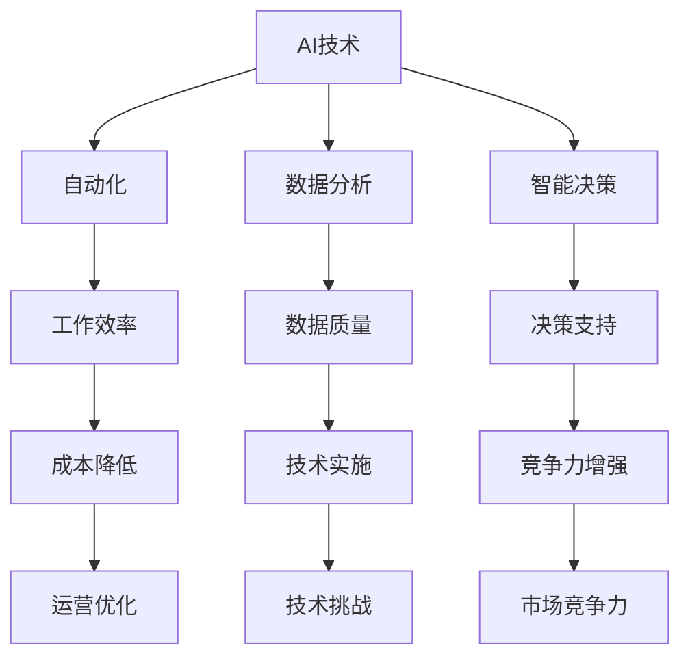

                 

### 文章标题：智能工作流程：AI优化企业内部协作

智能工作流程正成为现代企业提升效率、减少成本、增强竞争力的关键工具。本书以《智能工作流程：AI优化企业内部协作》为题，旨在深入探讨人工智能（AI）在优化企业内部协作方面的应用与潜力。通过系统化的分析和丰富的案例研究，本书将揭示AI如何从根本上改变企业的运营模式。

#### 关键词：
- 智能工作流程
- 人工智能
- 企业内部协作
- 自动化
- 效率优化

#### 摘要：
本书围绕智能工作流程这一核心主题，首先介绍了AI和智能工作流程的基本概念，随后探讨了AI在优化企业内部协作中的应用，包括实际案例研究和技术基础。通过详细的技术讲解、开发指南和未来展望，本书旨在为读者提供全面的智能工作流程优化方案，帮助企业在竞争激烈的市场中脱颖而出。

---

### 引言

在现代商业环境中，企业面临诸多挑战，如快速变化的市场需求、激烈的竞争压力和不断上升的运营成本。这些挑战迫使企业不断寻求创新的方法来提高效率、降低成本并增强竞争力。智能工作流程（Intelligent Workflow）作为一种新型的企业管理模式，利用人工智能（AI）技术实现自动化、智能化和精细化管理，成为解决上述问题的重要手段。

#### 智能工作流程的定义

智能工作流程是指利用人工智能技术，通过自动化、数据分析和智能决策，优化企业内部各个环节的工作流程。它不仅提高了工作效率，减少了人工干预，还增强了业务流程的可视化和可控性。智能工作流程的核心在于将人工智能技术融入企业的日常运营中，使其成为企业竞争力的重要组成部分。

#### AI在企业管理中的应用

人工智能技术已在诸多领域得到广泛应用，如自然语言处理、图像识别、数据分析等。在企业管理中，AI的应用主要体现在以下几个方面：

1. **客户服务自动化**：通过聊天机器人和智能客服系统，提高客户响应速度和服务质量。
2. **供应链管理优化**：利用AI预测需求、优化库存和供应链流程，降低运营成本。
3. **人力资源管理**：通过智能招聘系统、员工行为分析和绩效评估，提升人力资源管理效率。
4. **数据分析与决策**：利用大数据和机器学习技术，为企业提供深度分析和智能决策支持。

#### 智能工作流程的重要性

智能工作流程在企业内部协作中的重要性体现在以下几个方面：

1. **效率提升**：通过自动化和智能化，减少重复性工作，提高工作效率。
2. **成本降低**：优化资源利用，降低运营成本，提高企业盈利能力。
3. **决策支持**：基于大数据和机器学习，提供更加精准和可靠的决策支持。
4. **竞争力增强**：通过持续优化和创新，提高企业在市场中的竞争力。

#### 书籍结构概述

本书分为六个部分，结构如下：

1. **引言与背景**：介绍智能工作流程和AI在企业管理中的应用。
2. **AI和智能工作流程的概念**：探讨AI和智能工作流程的基本概念和关键组件。
3. **AI优化企业内部协作的案例分析**：分析实际案例，展示AI在优化企业内部协作中的效果。
4. **技术基础**：讲解机器学习、深度学习等技术在智能工作流程中的应用。
5. **开发和实践指南**：提供智能工作流程的开发和实践指南。
6. **未来趋势和展望**：探讨智能工作流程的未来发展趋势和潜在影响。

通过本书的深入探讨，读者将全面了解智能工作流程的原理和应用，掌握AI优化企业内部协作的方法，为企业的数字化转型提供有力支持。接下来，我们将进一步探讨AI和智能工作流程的基本概念，为后续章节的讨论奠定基础。

---

### AI和智能工作流程的概念

#### AI概述

人工智能（Artificial Intelligence，简称AI）是指通过计算机模拟人类智能行为的技术，包括学习、推理、解决问题、感知和理解自然语言等。AI技术可以大致分为两大类：基于规则的系统和基于数据的方法。基于规则的系统通过定义明确的规则来执行任务，而基于数据的方法则通过学习和分析大量数据来发现模式并作出决策。

##### 机器学习和深度学习

机器学习（Machine Learning，简称ML）是AI的核心技术之一，它通过训练模型来从数据中自动发现规律和模式。机器学习可以分为三种主要类型：监督学习、无监督学习和强化学习。

1. **监督学习**：在有标注的数据集上进行训练，模型能够从输入数据中学习到特征，并能够对未知数据进行预测。
2. **无监督学习**：在没有标注的数据集上进行训练，模型的目标是发现数据中的内在结构和模式。
3. **强化学习**：通过与环境的交互来学习最优策略，通常用于决策和优化问题。

深度学习（Deep Learning，简称DL）是机器学习的一个子领域，它通过构建多层神经网络（如卷积神经网络（CNN）和循环神经网络（RNN））来处理复杂数据。深度学习在图像识别、语音识别和自然语言处理等领域取得了显著的突破。

#### 智能工作流程的概念

智能工作流程（Intelligent Workflow）是指利用人工智能技术，通过自动化、数据分析和智能决策，优化企业内部各个环节的工作流程。智能工作流程的关键组件包括：

1. **自动化**：通过预设规则和算法，自动执行重复性任务，减少人工干预。
2. **数据分析**：利用大数据和机器学习技术，对业务数据进行分析，提取有价值的信息。
3. **智能决策**：基于分析结果，通过智能算法自动作出决策，优化业务流程。

#### 智能工作流程的优势和挑战

##### 优势

1. **效率提升**：通过自动化和智能化，减少重复性工作，提高工作效率。
2. **成本降低**：优化资源利用，降低运营成本，提高企业盈利能力。
3. **决策支持**：基于大数据和机器学习，提供更加精准和可靠的决策支持。
4. **竞争力增强**：通过持续优化和创新，提高企业在市场中的竞争力。

##### 挑战

1. **数据质量**：智能工作流程依赖于高质量的数据，数据的不准确或缺失会影响系统的性能。
2. **技术实施**：AI技术需要较高的技术门槛，对企业的技术能力提出了挑战。
3. **隐私和安全**：随着AI技术的应用，数据隐私和信息安全问题日益突出。

#### 核心概念与联系

为了更好地理解智能工作流程，我们需要绘制一个核心概念与关系的架构图，以下是一个简单的Mermaid流程图示例：



通过上述架构图，我们可以清晰地看到AI技术在智能工作流程中的核心作用，以及各个关键组件之间的相互关系。

#### 小结

在本章中，我们介绍了人工智能（AI）和智能工作流程的基本概念。通过了解AI的不同类型和应用，我们能够更好地理解智能工作流程是如何通过自动化、数据分析和智能决策来优化企业内部协作的。接下来，我们将通过实际案例研究，深入探讨AI在优化企业内部协作中的应用和效果。

---

### AI优化企业内部协作的案例分析

为了更好地理解AI如何优化企业内部协作，我们将通过几个实际案例来探讨AI在不同业务场景中的应用和效果。这些案例将涵盖客户服务、供应链管理和人力资源管理等领域，展示AI技术如何帮助企业提升效率、降低成本和增强竞争力。

#### 案例研究一：自动化客户服务

##### 案例背景

某大型电子商务公司面临着不断增长的客户咨询量和复杂的服务需求。为了提高客户满意度和服务效率，公司决定引入智能客服系统，利用AI技术自动化处理客户咨询。

##### 案例实施

1. **数据收集**：公司收集了大量的客户咨询数据，包括常见问题、客户反馈和投诉信息。
2. **模型训练**：利用机器学习和自然语言处理技术，公司训练了一个智能客服模型，使其能够理解和响应客户的询问。
3. **系统集成**：智能客服系统集成了公司的客户关系管理（CRM）系统，实现了与客户咨询的自动交互。
4. **效果监控**：公司设置了监控系统，实时跟踪智能客服的表现，并根据反馈进行优化。

##### 案例效果

1. **响应速度**：智能客服系统能够在几秒钟内响应客户询问，显著提高了客户的满意度。
2. **效率提升**：智能客服系统自动化处理了大量重复性问题，减少了人工客服的工作量。
3. **成本降低**：通过减少人工客服的需求，公司降低了人力成本，提高了运营效率。

##### 实现细节

以下是一个简单的监督学习模型训练的伪代码示例：

```python
# 导入必要的库
import numpy as np
import pandas as pd
from sklearn.model_selection import train_test_split
from sklearn.feature_extraction.text import TfidfVectorizer
from sklearn.linear_model import LogisticRegression

# 加载数据集
data = pd.read_csv("customer_queries.csv")

# 分割数据集
X_train, X_test, y_train, y_test = train_test_split(data['query'], data['label'], test_size=0.2, random_state=42)

# 特征提取
vectorizer = TfidfVectorizer(max_features=1000)
X_trainVec = vectorizer.fit_transform(X_train)
X_testVec = vectorizer.transform(X_test)

# 模型训练
model = LogisticRegression()
model.fit(X_trainVec, y_train)

# 模型评估
accuracy = model.score(X_testVec, y_test)
print(f"Model accuracy: {accuracy:.2f}")
```

#### 案例研究二：智能供应链管理

##### 案例背景

某制造企业面临着供应链复杂、库存波动大和物流成本高的问题。为了优化供应链管理，企业决定引入智能供应链管理系统，利用AI技术预测需求、优化库存和物流。

##### 案例实施

1. **数据收集**：企业收集了历史销售数据、市场趋势数据和供应商信息。
2. **需求预测**：利用时间序列分析和机器学习技术，企业开发了一个需求预测模型，能够根据历史数据和当前市场趋势预测未来需求。
3. **库存优化**：基于需求预测模型，企业优化了库存策略，实现了按需采购和库存管理。
4. **物流优化**：通过路径规划和机器学习算法，企业优化了物流路线，降低了物流成本。

##### 案例效果

1. **需求预测准确**：智能供应链管理系统能够准确预测未来需求，减少了库存积压和缺货现象。
2. **库存优化**：通过按需采购和库存管理，企业降低了库存成本，提高了资金利用率。
3. **物流成本降低**：智能物流优化降低了运输成本，提高了物流效率。

##### 实现细节

以下是一个简单的需求预测模型的时间序列分析伪代码示例：

```python
# 导入必要的库
import numpy as np
import pandas as pd
from sklearn.model_selection import train_test_split
from sklearn.ensemble import RandomForestRegressor

# 加载数据集
data = pd.read_csv("sales_data.csv")

# 数据预处理
data['date'] = pd.to_datetime(data['date'])
data.set_index('date', inplace=True)
data.fillna(method='ffill', inplace=True)

# 分割数据集
X_train, X_test, y_train, y_test = train_test_split(data[['previous_sales']], data['current_sales'], test_size=0.2, random_state=42)

# 模型训练
model = RandomForestRegressor(n_estimators=100)
model.fit(X_train, y_train)

# 模型评估
mse = model.mean_squared_error(X_test, y_test)
print(f"Model MSE: {mse:.2f}")
```

#### 案例研究三：人力资源管理

##### 案例背景

某科技公司需要优化其人力资源管理流程，以提高招聘效率和员工满意度。公司决定引入智能招聘系统和员工行为分析工具，利用AI技术进行人才筛选和绩效评估。

##### 案例实施

1. **数据收集**：公司收集了大量的招聘信息、简历数据和面试记录。
2. **人才筛选**：利用自然语言处理和机器学习技术，公司开发了一个智能招聘系统，能够自动筛选和评估求职者简历。
3. **绩效评估**：公司使用员工行为分析工具，通过监测员工的工作表现和互动行为，进行绩效评估。
4. **反馈机制**：公司建立了反馈机制，根据评估结果调整招聘策略和员工管理策略。

##### 案例效果

1. **招聘效率提高**：智能招聘系统能够快速筛选和评估求职者，显著提高了招聘效率。
2. **员工满意度提升**：通过精准的绩效评估，公司能够更好地激励员工，提高了员工满意度。
3. **人才留存率增加**：通过优化招聘和员工管理策略，公司提高了人才留存率。

##### 实现细节

以下是一个简单的自然语言处理人才筛选模型的伪代码示例：

```python
# 导入必要的库
import numpy as np
import pandas as pd
from sklearn.model_selection import train_test_split
from sklearn.feature_extraction.text import TfidfVectorizer
from sklearn.naive_bayes import MultinomialNB

# 加载数据集
data = pd.read_csv("resume_data.csv")

# 分割数据集
X_train, X_test, y_train, y_test = train_test_split(data['resume_content'], data['is_shortlisted'], test_size=0.2, random_state=42)

# 特征提取
vectorizer = TfidfVectorizer(max_features=1000)
X_trainVec = vectorizer.fit_transform(X_train)
X_testVec = vectorizer.transform(X_test)

# 模型训练
model = MultinomialNB()
model.fit(X_trainVec, y_train)

# 模型评估
accuracy = model.score(X_testVec, y_test)
print(f"Model accuracy: {accuracy:.2f}")
```

通过上述案例研究，我们可以看到AI技术在企业内部协作中的应用和效果。智能工作流程不仅提高了工作效率和降低了成本，还为企业提供了更加精准和可靠的决策支持，从而增强了企业的竞争力。在下一章中，我们将进一步探讨AI和智能工作流程的技术基础，包括机器学习和深度学习等关键技术。

---

### AI优化企业内部协作的技术基础

为了实现智能工作流程的优化，企业需要掌握一系列关键的技术和方法。这些技术不仅涵盖了传统的数据分析工具，还包括近年来快速发展的机器学习和深度学习技术。在本章节中，我们将详细介绍这些技术，并探讨它们在智能工作流程中的应用。

#### 数据预处理

数据预处理是AI系统的基础，它包括数据清洗、数据集成、数据变换和数据归一化等步骤。数据清洗旨在处理缺失值、异常值和重复值，确保数据的质量。数据集成是将来自不同源的数据合并为一个统一的格式，以便进一步分析。数据变换包括数据归一化、标准化和特征提取等步骤，这些步骤有助于提高模型的性能和可解释性。

##### 数据清洗

```python
import pandas as pd

# 加载数据集
data = pd.read_csv("data.csv")

# 填补缺失值
data.fillna(data.mean(), inplace=True)

# 删除重复值
data.drop_duplicates(inplace=True)

# 处理异常值
data = data[(data['feature1'] > 0) & (data['feature1'] < data['feature2'])]
```

##### 特征工程

特征工程是数据预处理的重要部分，它通过选择和构造特征来提高模型的预测性能。常见的特征工程方法包括特征选择、特征转换和特征组合。

```python
from sklearn.preprocessing import StandardScaler
from sklearn.feature_selection import SelectKBest
from sklearn.feature_selection import f_classif

# 数据标准化
scaler = StandardScaler()
data_scaled = scaler.fit_transform(data)

# 特征选择
selector = SelectKBest(f_classif, k=5)
selected_features = selector.fit_transform(data_scaled, data['target'])
```

#### 机器学习算法

机器学习算法是AI技术的核心，通过训练模型从数据中学习规律和模式。机器学习算法可以分为监督学习、无监督学习和半监督学习。监督学习算法在有标注的数据集上进行训练，用于预测和分类任务。无监督学习算法在没有标注的数据集上进行训练，用于聚类和降维任务。半监督学习算法则结合了监督学习和无监督学习，适用于标注数据稀缺的情况。

##### 监督学习算法

监督学习算法包括线性回归、逻辑回归、决策树、随机森林和神经网络等。以下是一个简单的线性回归算法示例：

```python
from sklearn.linear_model import LinearRegression

# 分割数据集
X_train, X_test, y_train, y_test = train_test_split(data['feature'], data['target'], test_size=0.2, random_state=42)

# 模型训练
model = LinearRegression()
model.fit(X_train, y_train)

# 模型评估
score = model.score(X_test, y_test)
print(f"Model score: {score:.2f}")
```

##### 无监督学习算法

无监督学习算法包括K-means聚类、主成分分析（PCA）和自编码器等。以下是一个简单的K-means聚类算法示例：

```python
from sklearn.cluster import KMeans

# 分割数据集
X_train, X_test = train_test_split(data['feature'], test_size=0.2, random_state=42)

# 模型训练
model = KMeans(n_clusters=3)
model.fit(X_train)

# 模型评估
labels = model.predict(X_test)
```

#### 深度学习技术

深度学习是机器学习的一个子领域，通过构建多层神经网络（如卷积神经网络（CNN）和循环神经网络（RNN））来处理复杂数据。深度学习在图像识别、语音识别和自然语言处理等领域取得了显著的突破。

##### 卷积神经网络（CNN）

卷积神经网络是深度学习中最常用的网络结构之一，特别适用于处理图像数据。以下是一个简单的CNN模型示例：

```python
import tensorflow as tf
from tensorflow.keras.models import Sequential
from tensorflow.keras.layers import Conv2D, MaxPooling2D, Flatten, Dense

# 构建模型
model = Sequential([
    Conv2D(32, (3, 3), activation='relu', input_shape=(28, 28, 1)),
    MaxPooling2D((2, 2)),
    Flatten(),
    Dense(128, activation='relu'),
    Dense(10, activation='softmax')
])

# 编译模型
model.compile(optimizer='adam', loss='categorical_crossentropy', metrics=['accuracy'])

# 训练模型
model.fit(X_train, y_train, epochs=10, batch_size=64)
```

##### 循环神经网络（RNN）

循环神经网络特别适用于处理序列数据，如时间序列和自然语言处理。以下是一个简单的RNN模型示例：

```python
import tensorflow as tf
from tensorflow.keras.models import Sequential
from tensorflow.keras.layers import LSTM, Dense

# 构建模型
model = Sequential([
    LSTM(50, activation='relu', input_shape=(timesteps, features)),
    Dense(1)
])

# 编译模型
model.compile(optimizer='adam', loss='mse')

# 训练模型
model.fit(X_train, y_train, epochs=100, batch_size=64)
```

通过上述技术基础，企业可以构建和部署智能工作流程，实现自动化、数据分析和智能决策。在下一章中，我们将提供智能工作流程的开发和实践指南，帮助企业将AI技术应用到实际业务中。

---

### 智能工作流程的开发和实践指南

#### 项目规划与实施

要成功开发智能工作流程，企业需要制定一个详细的规划与实施计划。以下步骤可以帮助企业有效地推进项目：

1. **需求分析**：明确项目目标、业务需求和预期成果。
2. **技术评估**：评估所需的技术和工具，确定是否需要额外的培训和资源。
3. **团队组建**：组建一个跨职能团队，包括数据科学家、软件工程师、业务分析师等。
4. **数据收集**：收集必要的业务数据，包括历史数据、实时数据和外部数据。
5. **模型开发**：开发并训练AI模型，确保模型能够准确预测和决策。
6. **系统集成**：将AI模型集成到现有系统中，确保与其他业务流程无缝对接。
7. **测试与优化**：进行测试和优化，确保系统的稳定性和性能。
8. **部署与监控**：部署系统，并进行实时监控和调整。

#### 技术选型与工具

选择合适的技术和工具是实现智能工作流程的关键。以下是一些常见的技术选型和工具：

1. **编程语言**：Python、Java和R是常见的AI编程语言。Python因其丰富的库和社区支持，被广泛用于AI项目。
2. **框架和库**：TensorFlow、PyTorch和Keras是流行的深度学习框架。Scikit-learn和Pandas是常用的机器学习库。
3. **数据存储和处理**：Hadoop、Spark和TensorFlow Data Lab都是强大的数据处理工具。MySQL、PostgreSQL和MongoDB适用于数据存储。
4. **云服务**：AWS、Azure和Google Cloud提供丰富的云服务和AI工具，适用于不同规模的企业。

#### 开发与测试

在开发智能工作流程时，以下步骤有助于确保系统的质量和性能：

1. **版本控制**：使用Git等版本控制工具，管理代码和资源。
2. **代码规范**：遵循Python PEP 8等编码规范，确保代码的可读性和可维护性。
3. **单元测试**：编写单元测试，验证代码的每个部分是否按预期工作。
4. **集成测试**：进行集成测试，确保系统的各个组件能够协同工作。
5. **性能优化**：对系统进行性能测试，并优化代码和模型，提高系统的响应速度和准确性。

#### 实际案例分析和详细讲解剖析

为了更好地理解智能工作流程的开发和实践，以下是一个实际案例的分析：

**案例：智能客户服务系统**

1. **需求分析**：公司需要一个能够自动化处理客户咨询的智能客服系统，以提高响应速度和客户满意度。
2. **技术评估**：评估了自然语言处理（NLP）和聊天机器人技术，并选择了TensorFlow和Keras框架。
3. **团队组建**：组建了一个由数据科学家、机器学习工程师和前端工程师组成的团队。
4. **数据收集**：收集了大量的客户咨询数据，包括问题文本和解决方案。
5. **模型开发**：使用NLP技术，训练了一个基于神经网络的自然语言处理模型，用于解析客户问题和提供自动回复。
6. **系统集成**：将智能客服系统集成到公司的客户关系管理（CRM）系统中，确保与客户咨询的自动交互。
7. **测试与优化**：进行了多轮测试和优化，确保系统的高效性和可靠性。
8. **部署与监控**：将系统部署到生产环境，并设置了监控系统，实时跟踪系统的性能和客户反馈。

**代码实现**

以下是一个简单的聊天机器人模型训练的代码示例：

```python
import tensorflow as tf
from tensorflow.keras.models import Sequential
from tensorflow.keras.layers import Embedding, LSTM, Dense

# 数据预处理
max_sequence_length = 100
vocab_size = 10000
embedding_size = 32

# 构建模型
model = Sequential([
    Embedding(vocab_size, embedding_size, input_length=max_sequence_length),
    LSTM(128),
    Dense(1, activation='sigmoid')
])

# 编译模型
model.compile(optimizer='adam', loss='binary_crossentropy', metrics=['accuracy'])

# 训练模型
model.fit(X_train, y_train, epochs=10, batch_size=64)
```

通过以上步骤，公司成功开发并部署了一个智能客户服务系统，显著提高了客户响应速度和满意度。接下来，我们将探讨AI优化企业内部协作的未来趋势和潜在影响。

---

### AI优化企业内部协作的未来趋势

随着人工智能技术的不断进步，智能工作流程在优化企业内部协作方面将迎来更多的发展机遇和挑战。以下是未来几年内，AI优化企业内部协作的一些关键趋势和潜在影响：

#### 技术发展趋势

1. **深度强化学习**：深度强化学习结合了深度学习和强化学习，能够在复杂环境中实现更加智能的决策。未来，深度强化学习有望在智能工作流程中发挥更大作用，例如在动态供应链管理和自适应资源调度等方面。

2. **知识图谱**：知识图谱是一种用于表示实体和关系的数据模型，可以帮助企业更好地理解和利用其数据。随着知识图谱技术的发展，智能工作流程将能够更加精确地识别和理解业务逻辑，提高决策的智能性。

3. **联邦学习**：联邦学习是一种分布式学习方法，可以在不共享数据的情况下，联合训练模型。这一技术有助于保护企业数据隐私，同时实现跨企业协作和智能工作流程的优化。

4. **多模态数据处理**：随着物联网和传感器技术的发展，企业将面临越来越多的多模态数据（如图像、语音、文本等）。未来，多模态数据处理技术将变得更加成熟，使智能工作流程能够更全面地理解业务场景和用户需求。

#### 企业应用前景

1. **全流程自动化**：随着AI技术的不断成熟，越来越多的企业业务流程将实现自动化，从而提高效率、降低成本和减少错误。未来，企业将致力于打造高度自动化和智能化的工作流程，实现业务的全面升级。

2. **个性化服务**：AI技术将使企业能够更加精准地了解客户需求，提供个性化的服务体验。通过智能工作流程，企业可以实时分析客户行为和偏好，快速响应客户需求，提升客户满意度和忠诚度。

3. **智能决策支持**：随着数据量的增加和算法的进步，AI技术将提供更加精准和智能的决策支持。企业可以通过智能工作流程，实时分析市场趋势和业务数据，制定更加科学和有效的战略决策。

4. **跨界合作**：随着AI技术的普及，不同行业之间的合作将变得更加紧密。通过智能工作流程，企业可以实现跨行业的协同创新，打造全新的商业模式和市场机会。

#### 社会与伦理影响

1. **就业影响**：随着智能工作流程的普及，一些重复性和低技能的工作可能会被自动化取代。这可能导致就业结构的变化，需要社会和政府采取措施，为受影响的劳动力提供培训和再就业支持。

2. **数据隐私和安全**：随着数据在企业内部协作中的重要性增加，数据隐私和安全问题将变得更加突出。企业需要采取严格的措施，保护客户和员工的数据隐私，防止数据泄露和滥用。

3. **伦理和法律问题**：AI技术的应用可能引发一系列伦理和法律问题，如算法偏见、责任归属和透明度等。企业和社会需要共同努力，制定相应的伦理规范和法律框架，确保AI技术的健康和可持续发展。

综上所述，未来智能工作流程将朝着更加智能化、自动化和协同化的方向发展，为企业带来巨大的机遇和挑战。企业需要紧跟技术发展趋势，积极拥抱变革，充分利用AI技术优化内部协作，提升业务竞争力。

---

### 总结

本文全面探讨了智能工作流程：AI优化企业内部协作的主题。首先，我们介绍了智能工作流程的定义和AI在企业管理中的应用，随后通过实际案例展示了AI在客户服务、供应链管理和人力资源管理中的具体应用。接着，我们详细讲解了AI和智能工作流程的技术基础，包括数据预处理、机器学习算法和深度学习技术。随后，我们提供了智能工作流程的开发和实践指南，帮助读者理解和实施智能工作流程。最后，我们探讨了AI优化企业内部协作的未来趋势和社会影响。

#### 最佳实践 tips

1. **数据质量优先**：确保数据质量是智能工作流程成功的关键。定期检查和清理数据，消除错误和不一致。
2. **持续迭代优化**：智能工作流程不是一次性的项目，而是一个持续迭代优化的过程。不断收集反馈，调整模型和策略。
3. **跨部门协作**：智能工作流程的实施需要跨部门的协作。建立跨职能团队，确保数据、技术和业务的紧密结合。

#### 小结

智能工作流程通过AI技术优化企业内部协作，提高效率、降低成本和增强竞争力。本文提供了全面的技术讲解和实际案例，帮助读者深入了解智能工作流程的原理和应用。企业应积极拥抱AI技术，构建智能工作流程，迎接未来的挑战。

#### 注意事项

1. **技术选型**：选择合适的技术和工具是实现智能工作流程的关键。
2. **数据隐私**：在应用AI技术时，务必确保数据隐私和安全。
3. **持续学习**：AI技术发展迅速，企业需要持续学习和跟进最新技术。

#### 拓展阅读

- 《深度学习》（Goodfellow, Bengio, Courville）: 详细介绍了深度学习的基础知识。
- 《Python数据科学手册》（McKinney）: 提供了Python在数据科学中的应用指南。
- 《智能工作流程实践》（Smith）: 介绍了智能工作流程的实际应用案例和最佳实践。

---

### 作者信息

作者：AI天才研究院/AI Genius Institute & 禅与计算机程序设计艺术 /Zen And The Art of Computer Programming

AI天才研究院致力于推动人工智能技术的发展和应用，通过深入研究和创新，为企业和个人提供先进的AI解决方案。同时，作者还著有《禅与计算机程序设计艺术》一书，深入探讨了计算机编程的哲学和艺术。希望通过本书，帮助读者掌握智能工作流程的原理和应用，为企业数字化转型提供有力支持。

