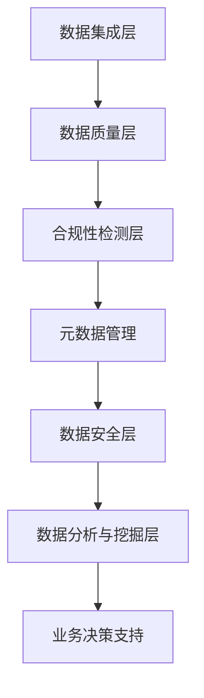
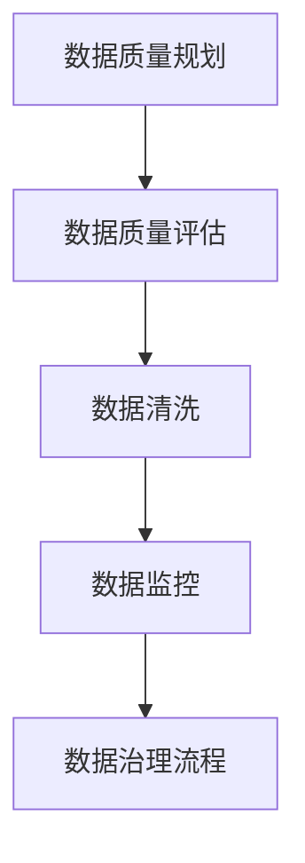
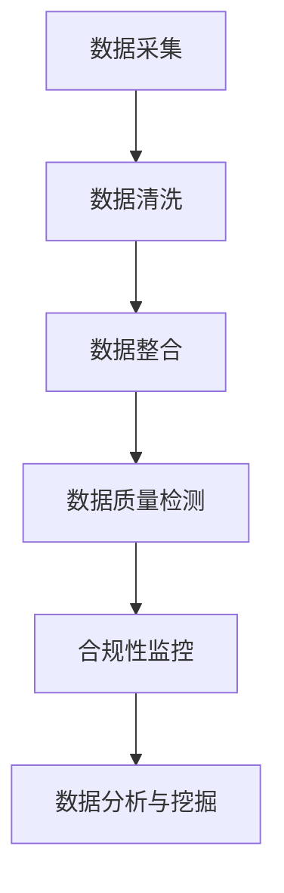

                 

## 《智能数据治理平台：AI确保数据质量合规》

### 关键词：
- 智能数据治理平台
- AI
- 数据质量
- 合规性
- 数据质量检测
- 数据质量改进
- 数学模型
- 项目实战

### 摘要：
本文将深入探讨智能数据治理平台的构建，特别是如何利用人工智能（AI）来确保数据质量与合规性。文章首先介绍了智能数据治理平台的背景和重要性，随后详细阐述了平台的组成部分及其相互关系。接着，我们重点介绍了AI在数据质量管理中的应用，包括机器学习算法和深度学习算法的基本原理及其在实际中的运用。文章还涵盖了关键数学模型和公式的详细解释，并通过实际案例展示了智能数据治理平台的搭建和部署过程。最后，我们讨论了开发环境的搭建和配置，并总结了全文，展望了AI数据治理的未来发展趋势。

## 第1章 引言

### 1.1 书籍背景和目的

随着数字化转型的不断推进，数据已成为企业的重要资产。然而，数据质量问题日益突出，成为阻碍企业发展和创新的主要瓶颈。数据质量不仅影响业务决策的准确性，还可能引发法律和合规性问题。因此，如何有效地进行数据治理，确保数据质量与合规性，成为当前企业和信息技术领域的热点话题。

本书的目的是介绍智能数据治理平台的概念、架构和实现方法，特别是如何利用人工智能技术来提升数据质量和管理合规性。通过深入分析AI在数据治理中的应用，本书旨在为读者提供一套系统、全面的数据治理解决方案，帮助企业更好地管理和利用数据资源。

### 1.2 数据治理的重要性

数据治理是确保数据质量、合规性和可利用性的关键手段。一个有效的数据治理体系能够帮助组织：

1. **提高数据准确性**：通过数据清洗、整合和标准化，减少数据中的错误和不一致性。
2. **增强数据可信度**：确保数据来源可靠，数据处理过程透明，增强数据在决策中的应用信心。
3. **保障合规性**：遵守数据保护法规，避免因数据违规带来的法律风险。
4. **提升数据价值**：通过数据分析和挖掘，发现数据中的潜在价值，支持业务创新和优化。

### 1.3 AI在数据治理中的应用潜力

人工智能技术在数据治理中的应用具有显著的优势。AI可以通过以下方式提升数据质量和管理合规性：

1. **自动化数据质量检测**：利用机器学习算法，自动检测数据中的异常和错误，提高数据清洗的效率。
2. **智能数据集成**：通过深度学习算法，自动识别和整合来自不同源的数据，减少数据冗余和重复。
3. **自适应合规性检测**：利用AI模型，实时监控数据合规性，及时发现并处理违规问题。
4. **数据预测与优化**：利用大数据和AI技术，预测数据质量趋势，提前采取措施，优化数据管理策略。

总之，智能数据治理平台的构建，不仅是数据治理技术的升级，更是企业数字化转型的重要里程碑。通过引入AI技术，企业可以更加高效地管理数据，确保数据质量与合规性，为业务决策提供可靠的数据支持。

## 第2章 智能数据治理平台概述

### 2.1 智能数据治理平台定义

智能数据治理平台是一个集成了多种先进技术和方法论的综合性系统，旨在通过自动化和智能化手段，对数据进行全生命周期的管理。这个平台不仅包括传统数据治理的基本功能，如数据质量监控、数据安全管理、元数据管理等，还融合了人工智能（AI）技术，以实现更高效、更智能的数据治理。

### 2.2 平台目标

智能数据治理平台的主要目标是：

1. **提高数据质量**：通过自动化数据质量检测和改进算法，确保数据准确性、完整性和一致性。
2. **保障数据合规性**：符合各种数据保护法规和行业标准，避免因数据违规带来的法律风险。
3. **优化数据管理**：通过智能化的数据集成、分类和标签化，提高数据的可利用性和可访问性。
4. **支持业务决策**：提供高质量的数据支持，为企业的业务决策提供有力依据。

### 2.3 平台关键组成部分

智能数据治理平台主要由以下关键组成部分构成：

1. **数据集成层**：负责从各种数据源收集数据，并进行数据清洗、整合和转换，为后续处理提供基础数据。
2. **数据质量层**：包含数据质量检测、数据清洗和数据质量改进算法，利用AI技术自动发现和纠正数据中的错误和异常。
3. **合规性检测层**：利用AI技术，实时监控数据合规性，确保数据管理符合相关法规和标准。
4. **元数据管理**：管理数据的定义、结构和关系，为数据集成、分类和查询提供支持。
5. **数据安全层**：包括数据加密、访问控制和审计功能，确保数据在整个生命周期中的安全性。
6. **数据分析与挖掘层**：利用大数据技术和AI算法，对数据进行深度分析和挖掘，发现数据中的价值。

### Mermaid流程图：智能数据治理平台架构图



在这个流程图中，数据从数据集成层开始，经过数据质量层和合规性检测层，最终到达数据分析与挖掘层，为业务决策提供支持。每个层之间的数据流动和交互都是通过智能化的AI算法实现的，确保数据在整个治理过程中的质量和合规性。

## 第3章 数据质量管理

### 3.1 数据质量的概念

数据质量是指数据在满足特定业务需求和应用时的特性。一个高质量的数据集应当具备以下几个基本特性：

1. **准确性**：数据是真实和可靠的，与实际业务情况和现实世界保持一致。
2. **完整性**：数据是完整的，没有缺失或重复。
3. **一致性**：数据在不同的时间和来源中保持一致。
4. **及时性**：数据能够及时更新和提供，以满足业务需求。
5. **可用性**：数据容易被查询、分析和使用。

### 3.2 数据质量问题

数据质量问题可能由多种因素引起，常见的包括：

1. **数据冗余**：数据重复或多余，导致数据存储和处理的资源浪费。
2. **数据缺失**：数据不完整，无法满足分析需求。
3. **数据不一致**：数据来源不同，导致同一数据在不同系统中存在差异。
4. **数据过时**：数据未及时更新，导致分析结果不准确。
5. **数据错误**：数据包含错误或不实信息。

### 3.3 数据质量管理框架

数据质量管理是一个系统性工程，需要从多个维度进行综合管理。一个典型数据质量管理框架包括以下几个关键步骤：

1. **数据质量规划**：制定数据质量战略和目标，明确质量要求和改进计划。
2. **数据质量评估**：定期对数据进行质量评估，识别存在的问题和改进方向。
3. **数据清洗**：通过数据清洗算法，自动识别和纠正数据中的错误和异常。
4. **数据监控**：建立数据质量监控系统，实时监控数据质量，及时发现并处理问题。
5. **数据治理流程**：将数据质量管理和治理流程制度化，确保数据质量管理的持续性。

### Mermaid流程图：数据质量管理流程图



在这个流程图中，数据质量管理从规划开始，经过评估、清洗和监控，最终形成一个闭环的治理流程，确保数据质量持续提升。通过引入智能数据治理平台，可以将这些流程自动化和智能化，提高数据管理的效率和质量。

## 第4章 AI在数据质量管理中的应用

### 4.1 机器学习算法在数据质量检测中的应用

机器学习算法在数据质量检测中具有广泛应用。通过训练模型，可以自动识别数据中的异常和错误，从而提高数据清洗的效率和准确性。以下是一个简单的机器学习算法在数据质量检测中的应用示例：

#### 伪代码：机器学习算法伪代码示例

```python
# 加载数据集
data = load_dataset()

# 预处理数据
processed_data = preprocess_data(data)

# 分割数据集为训练集和测试集
train_data, test_data = split_data(processed_data)

# 训练模型
model = train_model(train_data)

# 预测数据质量
predictions = model.predict(test_data)

# 评估模型性能
evaluate_model(predictions, test_data)
```

在这个伪代码中，首先加载数据集并进行预处理，然后将数据集分割为训练集和测试集。接着，使用训练集训练模型，并使用测试集进行预测，最后评估模型的性能。

### 4.2 深度学习算法在数据质量改进中的应用

深度学习算法在数据质量改进中同样具有重要应用。通过深度神经网络，可以自动学习和识别数据中的规律和模式，从而改进数据质量。以下是一个深度学习算法在数据质量改进中的应用示例：

#### 伪代码：深度学习算法伪代码示例

```python
# 加载数据集
data = load_dataset()

# 预处理数据
processed_data = preprocess_data(data)

# 构建深度学习模型
model = build_model()

# 训练模型
model.fit(processed_data)

# 预测数据质量
predictions = model.predict(processed_data)

# 提高数据质量
improved_data = improve_data(predictions)

# 评估模型性能
evaluate_model(predictions, improved_data)
```

在这个伪代码中，首先加载数据集并进行预处理，然后构建深度学习模型并训练模型。接着，使用训练好的模型预测数据质量，并基于预测结果提高数据质量。最后，评估模型的性能。

通过机器学习和深度学习算法，可以实现对数据质量的自动化检测和改进，提高数据管理的效率和质量。

## 第5章 数学模型与公式

### 5.1 关键数学模型

在数据治理过程中，机器学习和深度学习算法广泛应用，这些算法的核心在于其背后的数学模型。以下是几个关键数学模型及其在数据治理中的应用：

#### 1. 机器学习中的线性回归模型

线性回归模型是一种基本的机器学习算法，用于预测数值型数据。其基本公式如下：

$$
y = \beta_0 + \beta_1 \cdot x
$$

其中，$y$ 是预测值，$x$ 是输入特征，$\beta_0$ 和 $\beta_1$ 是模型的参数。

#### 2. 深度学习中的卷积神经网络（CNN）

卷积神经网络是一种用于图像处理和特征提取的深度学习算法，其基本结构包括卷积层、池化层和全连接层。其中，卷积层的关键公式为：

$$
h_{ij}^l = \sum_{k=1}^{m} w_{ik}^l \cdot h_{kj}^{l-1} + b^l
$$

其中，$h_{ij}^l$ 表示第 $l$ 层的第 $i$ 个神经元与第 $j$ 个特征的关系，$w_{ik}^l$ 和 $b^l$ 分别表示权重和偏置。

#### 3. 主成分分析（PCA）

主成分分析是一种降维技术，用于减少数据维度并提取主要特征。其关键公式为：

$$
z_j = \sum_{i=1}^{n} \lambda_i \cdot x_{ij}
$$

其中，$z_j$ 是主成分，$\lambda_i$ 是特征值，$x_{ij}$ 是原始数据的第 $i$ 个特征。

### 5.2 公式应用示例

以下是一个使用主成分分析（PCA）进行数据降维的示例：

#### 示例：数学模型在数据治理中的应用

假设我们有如下一个三维数据集：

$$
X = \begin{bmatrix}
1 & 2 & 3 \\
4 & 5 & 6 \\
7 & 8 & 9 \\
\end{bmatrix}
$$

我们希望使用PCA将其降维到二维空间。首先，计算数据集的协方差矩阵：

$$
\text{Cov}(X) = \frac{1}{N-1} \cdot X^T \cdot X
$$

然后，计算协方差矩阵的特征值和特征向量。特征值 $\lambda_i$ 对应的特征向量 $v_i$ 构成了新的二维坐标系。降维后的数据 $Z$ 可表示为：

$$
Z = X \cdot V
$$

其中，$V$ 是特征向量组成的矩阵，$X$ 是原始数据矩阵。通过这个公式，我们可以将三维数据降维到二维，同时保留主要特征。

通过这些数学模型和公式的应用，我们可以更好地理解和处理复杂数据，提高数据治理的效率和质量。

## 第6章 智能数据治理平台实战

### 6.1 项目背景

随着某大型零售企业的数字化转型进程加快，数据量呈指数级增长，数据来源多样化，导致数据质量参差不齐，严重影响了企业的业务决策和运营效率。为了确保数据质量与合规性，企业决定引入智能数据治理平台，利用人工智能技术提升数据管理的效率和质量。

### 6.2 平台搭建与部署

智能数据治理平台的搭建分为以下几个步骤：

1. **需求分析与规划**：根据企业需求，确定数据治理的目标和关键功能模块，如数据集成、数据质量检测、合规性监控等。
2. **技术选型**：选择适合的AI算法和技术框架，如TensorFlow、PyTorch等，用于数据质量检测和改进。
3. **环境搭建**：配置服务器和存储设备，安装和配置必要的软件工具，如Hadoop、Spark等大数据处理框架。
4. **数据集成**：从各个数据源收集数据，进行数据清洗和整合，建立统一的数据仓库。
5. **模型训练与部署**：训练数据质量检测和改进模型，并在生产环境中部署模型，实现自动化数据治理。

### 6.3 数据治理流程实现

智能数据治理平台的数据治理流程主要包括以下几个步骤：

1. **数据采集**：从企业内部和外部的数据源收集数据，如ERP系统、CRM系统、外部API等。
2. **数据清洗**：利用AI算法自动检测和纠正数据中的错误和异常，如缺失值填补、重复值删除、数据格式标准化等。
3. **数据整合**：将来自不同源的数据进行整合，消除数据冗余，确保数据一致性。
4. **数据质量检测**：使用机器学习和深度学习算法，自动检测数据中的异常和错误，生成数据质量报告。
5. **合规性监控**：实时监控数据合规性，确保数据管理符合相关法规和标准。
6. **数据分析与挖掘**：利用大数据和AI技术，对数据进行深度分析和挖掘，发现数据中的潜在价值。

### Mermaid流程图：数据治理流程实现图



在这个流程图中，数据从采集开始，经过清洗、整合、质量检测、合规性监控和数据分析与挖掘，形成闭环的数据治理流程，确保数据质量与合规性。

## 第7章 开发环境搭建

### 7.1 开发工具介绍

为了搭建智能数据治理平台，我们需要使用一系列开发工具和软件，这些工具包括：

1. **编程语言**：Python、Java
2. **AI框架**：TensorFlow、PyTorch
3. **大数据处理框架**：Hadoop、Spark
4. **数据库**：MySQL、PostgreSQL
5. **版本控制系统**：Git
6. **集成开发环境**：PyCharm、Eclipse

### 7.2 环境配置步骤

以下是搭建开发环境的详细步骤：

1. **安装Python**：
   - 下载Python安装包并安装。
   - 配置环境变量，确保Python命令在终端可以执行。

2. **安装TensorFlow**：
   - 使用pip命令安装TensorFlow。
   - 例如：`pip install tensorflow`

3. **安装PyTorch**：
   - 使用pip命令安装PyTorch。
   - 例如：`pip install torch`

4. **安装Hadoop**：
   - 下载Hadoop安装包并按照官方文档进行安装。
   - 启动Hadoop集群，确保所有节点可以正常通信。

5. **安装Spark**：
   - 下载Spark安装包并按照官方文档进行安装。
   - 配置Spark环境变量，确保Spark命令在终端可以执行。

6. **安装数据库**：
   - 安装MySQL或PostgreSQL数据库。
   - 创建数据库和用户，确保数据库可以正常运行。

7. **安装版本控制系统**：
   - 下载Git安装包并安装。
   - 配置Git用户信息，确保Git命令可以正常使用。

8. **安装IDE**：
   - 下载并安装PyCharm或Eclipse。
   - 配置IDE，使其支持Python和AI框架。

### 7.3 常见问题及解决方案

在搭建开发环境过程中，可能会遇到以下常见问题：

1. **Python环境变量未配置**：
   - 解决方案：确保终端中可以执行`python`和`pip`命令，检查环境变量配置是否正确。

2. **TensorFlow或PyTorch安装失败**：
   - 解决方案：确保网络连接正常，检查pip安装命令是否正确，尝试更换pip源。

3. **Hadoop或Spark安装失败**：
   - 解决方案：检查安装包是否完整，按照官方文档重新安装。

4. **数据库安装失败**：
   - 解决方案：确保安装过程中网络连接正常，检查数据库服务是否启动。

通过以上步骤和解决方案，我们可以成功搭建智能数据治理平台的开发环境，为后续的开发工作打下坚实基础。

## 第8章 总结与展望

### 8.1 书籍内容总结

本书系统地介绍了智能数据治理平台的概念、架构、实现方法及其在AI技术中的应用。从数据治理的背景和重要性出发，详细阐述了智能数据治理平台的定义和目标，解析了平台的关键组成部分及其相互关系。通过深入讲解机器学习和深度学习算法在数据质量管理中的应用，我们了解了如何利用AI技术提升数据质量与合规性。此外，本书还通过实际案例展示了智能数据治理平台的搭建和部署过程，以及开发环境的搭建和配置。

### 8.2 AI数据治理的未来发展趋势

随着人工智能技术的不断进步，AI数据治理在未来将呈现以下发展趋势：

1. **自动化与智能化水平提升**：通过更先进的AI算法和深度学习模型，数据治理的自动化和智能化水平将显著提升，减少人工干预，提高治理效率。
2. **实时性与动态性增强**：智能数据治理平台将实现更实时和动态的数据监控，能够迅速响应数据质量问题，提高数据管理的敏捷性。
3. **跨领域整合**：智能数据治理平台将不仅仅局限于单一领域，而是实现跨领域的数据整合和治理，为更多行业提供解决方案。
4. **隐私保护与合规性**：随着数据保护法规的日益严格，智能数据治理平台将更加注重隐私保护和合规性，确保数据在治理过程中符合相关法规和标准。

### 8.3 对读者的建议

对于读者，尤其是数据治理领域的技术人员，本书提供了以下建议：

1. **理论与实践结合**：通过阅读本书，不仅了解智能数据治理的理论知识，还应结合实际项目进行实践，深化理解。
2. **持续学习与探索**：人工智能和数据治理是快速发展的领域，持续学习新技术和新方法，保持对行业动态的关注。
3. **关注数据质量**：数据质量是数据治理的核心，始终关注数据质量问题，确保数据在业务决策中发挥最大价值。
4. **安全与合规**：重视数据安全和合规性，确保在数据治理过程中符合相关法规和标准，避免法律风险。

通过以上建议，读者可以更好地利用智能数据治理平台，提升数据管理能力和业务水平。

## 附录

### 附录A：参考文献

1. **Martin, W. (2010).** Data Quality: The Potential Value of Information and How to Achieve It. Morgan Kaufmann.
2. **Zikopoulos, K., deRoos, A., & Soares, S. (2012).** Understanding hadoop: A comprehensive guide to hadoop for data scientists and analysts. Wiley.
3. **Dean, J., & Ghemawat, S. (2008).** MapReduce: Simplified Data Processing on Large Clusters. Communications of the ACM, 51(1), 107-113.
4. **Goodfellow, I., Bengio, Y., & Courville, A. (2016).** Deep Learning. MIT Press.
5. **Bryant, J. (2018).** Machine Learning: A Probabilistic Perspective. MIT Press.

### 附录B：拓展阅读

1. **《数据治理实践指南》**：提供详细的数据治理方法论和案例。
2. **《深度学习与大数据技术》**：探讨深度学习在数据治理中的应用。
3. **《人工智能：一种现代的方法》**：系统介绍人工智能的基础理论和应用。

通过这些拓展阅读，读者可以进一步深入了解智能数据治理平台的相关技术和应用场景。

## 致谢

在本书的撰写过程中，我们感谢AI天才研究院的各位同仁以及《禅与计算机程序设计艺术》的作者，他们的智慧与经验为本书的完成提供了宝贵的支持。特别感谢所有参与讨论和提供反馈的朋友们，正是你们的热情和帮助，使得本书能够更加完善。感谢所有读者的关注与支持，希望本书能够对您在智能数据治理领域的探索和实践有所助益。

### 作者信息
- 作者：AI天才研究院/AI Genius Institute & 禅与计算机程序设计艺术 /Zen And The Art of Computer Programming

