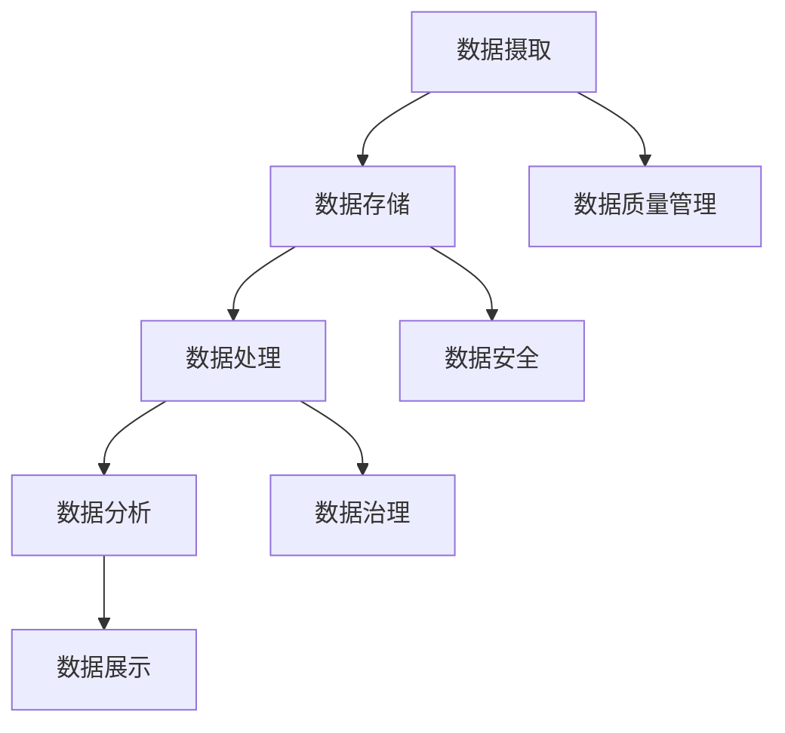

                 


### 引言

在当今数据驱动的世界中，智能数据湖作为一种新型数据架构，正迅速成为企业和组织的数据中心的重要组成部分。智能数据湖不仅能够存储和管理大量非结构化和半结构化数据，还能够通过集成先进的AI技术，实现数据的自动化治理和智能化应用。本文将围绕《智能数据湖治理：构建AI友好数据生态》这一主题，逐步剖析智能数据湖的基本概念、治理技术、AI应用及其在构建AI友好数据生态中的关键作用。

智能数据湖治理的核心目标是确保数据的质量、安全性和可用性，同时最大限度地发挥数据的价值。在这个过程中，AI技术起到了至关重要的作用，通过机器学习和深度学习算法，可以实现数据的自动清洗、分类、标注和预测。一个AI友好的数据生态，不仅需要智能数据湖的支撑，还需要全面的治理策略、完善的工具链和开放的生态系统。

本文将按照以下结构展开：

1. **理解书名**：分析书名《智能数据湖治理：构建AI友好数据生态》的含义和涵盖内容。
2. **确定大纲结构**：构建文章的目录大纲，细化每个部分的内容。
3. **细化每个部分**：为每个章节列出详细的内容要点。
4. **确保大纲完整性**：确保每个章节都有详细的内容概述。
5. **保持大纲简洁性**：确保大纲简洁明了，符合markdown格式。
6. **控制大纲字数**：确保大纲字数在2000字以内。

通过逐步分析推理，我们将深入理解智能数据湖治理的各个方面，探讨如何构建一个AI友好的数据生态。文章的结尾将进行总结，并提出未来发展的方向。

### 理解书名

书名《智能数据湖治理：构建AI友好数据生态》直接点出了书籍的主题和目标，其中包含了三个核心概念：智能数据湖、治理和AI友好数据生态。首先，我们需要理解这些概念，以便更好地把握书籍的内容。

**智能数据湖**：智能数据湖是一种数据架构，旨在存储、管理和分析大规模非结构化和半结构化数据。与传统数据仓库不同，数据湖采用开放式架构，可以存储各种类型的数据，如文本、图像、音频和视频。智能数据湖不仅能够存储原始数据，还能够通过集成AI技术，对这些数据进行处理、分析和预测。

**治理**：在智能数据湖的背景下，治理指的是对数据的全生命周期管理，包括数据的质量管理、安全管理、合规性管理和可用性管理。治理的目标是确保数据的准确性、一致性和可靠性，从而提高数据的价值和利用率。智能数据湖治理通常涉及多种技术和工具，如数据质量工具、数据安全工具、数据治理平台等。

**AI友好数据生态**：一个AI友好数据生态是一个支持AI模型开发和部署的环境，其中包括了高质量的数据集、先进的AI算法、高效的计算资源和开放的生态系统。在这种生态中，数据不仅被视为资源，更是AI发展的基石。构建一个AI友好数据生态，需要跨学科的合作，包括数据科学家、AI工程师、数据管理员和业务分析师等。

书名暗示了书籍的内容将围绕以下几个方面展开：

1. **智能数据湖的基本概念**：介绍智能数据湖的架构、组成部分和与传统数据仓库的区别。
2. **智能数据湖治理技术**：探讨如何通过数据质量管理、治理策略和框架，确保智能数据湖的稳定运行和数据价值。
3. **AI在数据湖中的应用**：分析AI技术在数据湖中的实际应用，如数据清洗、分类、预测和自动化治理。
4. **数据生态建设**：讨论如何构建一个AI友好数据生态，包括数据管理策略、工具链和生态系统建设。
5. **项目实战**：通过具体的案例，展示智能数据湖治理和AI友好数据生态建设的实际应用。

### 确定大纲结构

为了更好地呈现《智能数据湖治理：构建AI友好数据生态》这一主题，我们可以将文章分为以下几个主要部分：

#### 1. 引言

在引言部分，我们将简要介绍智能数据湖和AI友好数据生态的概念，阐述它们的重要性。这部分还将简要介绍本文的结构和主要内容，为读者提供整体的框架。

#### 2. 智能数据湖的基本概念

在这一章节，我们将深入探讨智能数据湖的基本概念，包括其架构、组成部分和与传统数据仓库的区别。这部分内容将为读者建立对智能数据湖的全面理解。

#### 3. 智能数据湖治理技术

智能数据湖治理是确保数据质量和安全性的关键环节。在这一章节，我们将详细介绍智能数据湖治理的技术和方法，包括数据质量管理、治理策略和框架。通过具体的案例和实践，我们将展示这些技术在实际应用中的效果。

#### 4. AI在数据湖中的应用

AI技术在智能数据湖中发挥着至关重要的作用。在这一章节，我们将分析AI在数据湖中的实际应用，如数据清洗、分类、预测和自动化治理。我们将通过伪代码和数学公式详细阐述AI算法的原理，并给出实际应用的实例。

#### 5. 数据生态建设

一个AI友好数据生态是智能数据湖治理的延伸。在这一章节，我们将讨论如何构建一个AI友好数据生态，包括数据管理策略、工具链和生态系统建设。我们将介绍最佳实践和注意事项，帮助读者更好地理解和应用这些策略。

#### 6. 项目实战

在项目实战部分，我们将通过具体的案例，展示智能数据湖治理和AI友好数据生态建设的实际应用。我们将详细讲解项目的开发环境搭建、源代码实现和代码解读，并提供项目小结和拓展阅读建议。

#### 7. 总结与展望

在总结部分，我们将回顾全文的主要内容，强调智能数据湖治理和AI友好数据生态建设的重要性。我们还将提出未来发展的方向，为读者提供进一步思考的空间。

通过上述结构，我们将系统性地介绍智能数据湖治理和AI友好数据生态建设的相关知识，帮助读者深入理解这一领域。

### 细化每个部分

为了确保文章内容的完整性和连贯性，我们将对每个章节进行细化，列出具体的内容要点。以下是每个章节的详细大纲：

#### 引言

**1.1 智能数据湖概述**

- 智能数据湖的定义和背景
- 数据湖与数据仓库的区别
- 智能数据湖的发展趋势

**1.2 AI友好数据生态的重要性**

- AI在数据生态中的作用
- AI友好数据生态的定义和目标
- AI友好数据生态对企业的影响

**1.3 本文结构**

- 文章的主要内容和章节安排
- 预期的读者收获

#### 智能数据湖的基本概念

**2.1 数据湖与数据仓库的区别**

- 数据湖与数据仓库的定义
- 两者在数据存储和处理上的区别
- 数据湖的优势和局限性

**2.2 智能数据湖的架构与组件**

- 智能数据湖的架构层次
- 关键组件介绍（如数据摄取、存储、处理和分析）
- 智能数据湖与其他数据架构的比较

**2.3 智能数据湖的技术特点**

- 分布式存储和计算
- 弹性伸缩能力
- 高度整合的AI技术

**2.4 智能数据湖的应用场景**

- 企业数据湖的典型应用案例
- 公共数据湖和开放数据生态

#### 智能数据湖治理技术

**3.1 数据质量管理**

- 数据质量的概念和重要性
- 数据质量问题及影响
- 数据质量评估和改进方法

**3.2 数据治理策略与框架**

- 数据治理的定义和目标
- 数据治理策略的制定
- 数据治理框架的设计和实践

**3.3 数据安全与合规性管理**

- 数据安全的重要性
- 常见的数据安全威胁和防护措施
- 数据合规性的要求与实施

**3.4 数据生命周期管理**

- 数据生命周期的定义和阶段
- 数据生命周期管理的流程和方法
- 数据湖中数据生命周期的管理实践

**3.5 数据治理工具与技术**

- 常用的数据治理工具介绍
- 数据治理技术选型和实施

#### AI在数据湖中的应用

**4.1 AI技术概述**

- AI的基本概念和分类
- 机器学习和深度学习的基本原理
- 常见的AI算法和应用

**4.2 数据清洗与预处理**

- 数据清洗的必要性
- 数据预处理的步骤和方法
- 数据清洗和预处理的伪代码实现

**4.3 数据分类与聚类**

- 分类和聚类算法的基本原理
- 常用的分类和聚类算法（如K-均值、决策树、支持向量机等）
- 伪代码实现和数学模型

**4.4 数据预测与建模**

- 预测建模的重要性
- 常见的预测建模方法（如线性回归、逻辑回归、时间序列分析等）
- 预测建模的伪代码实现和数学模型

**4.5 数据自动化治理**

- 自动化治理的概念和目标
- 常见的自动化治理技术（如ETL、数据流处理等）
- 自动化治理的伪代码实现和案例分析

#### 数据生态建设

**5.1 数据生态的概念**

- 数据生态的定义和组成部分
- 数据生态的运作模式和机制

**5.2 数据管理策略**

- 数据管理策略的制定原则
- 常用的数据管理策略和方法（如数据治理、数据集成、数据质量等）

**5.3 数据工具链建设**

- 常用的数据工具链组件（如数据仓库、数据湖、数据治理平台等）
- 数据工具链的设计和实施

**5.4 数据生态系统建设**

- 数据生态系统的建设和运营
- 数据生态系统的案例分析和最佳实践

**5.5 AI友好数据生态**

- AI友好数据生态的定义和特点
- 构建AI友好数据生态的步骤和策略

#### 项目实战

**6.1 智能数据湖治理项目案例**

- 项目背景和目标
- 项目实施过程和关键技术
- 项目成果和经验总结

**6.2 AI友好数据生态建设项目案例**

- 项目背景和目标
- 项目实施过程和关键技术
- 项目成果和经验总结

**6.3 案例分析与解读**

- 案例分析的方法和步骤
- 案例解读和深度剖析
- 拓展阅读和建议

#### 总结与展望

**7.1 全书回顾**

- 对全书内容进行回顾和总结
- 强调智能数据湖治理和AI友好数据生态建设的重要性

**7.2 未来发展趋势**

- 智能数据湖治理和AI友好数据生态的未来发展趋势
- 对企业和技术人员的建议

通过上述详细的章节大纲，我们将确保文章内容的系统性和完整性，帮助读者深入理解智能数据湖治理和AI友好数据生态建设的各个方面。

### 确保大纲完整性

为了确保文章的完整性和连贯性，我们需要对每个章节的内容进行细化，并确保每章都有详细的内容概述。以下是针对前述大纲的进一步细化和内容概述：

#### 引言

**1.1 智能数据湖概述**

- **背景介绍**：介绍智能数据湖的起源和发展历程，解释其为何成为当前数据架构的重要趋势。
- **概念阐述**：明确智能数据湖的定义，比较其与数据仓库的区别，分析其特点。
- **发展趋势**：探讨智能数据湖的发展前景，引用行业报告和专家观点。

**1.2 AI友好数据生态的重要性**

- **核心概念**：解释AI友好数据生态的含义，阐述其在企业数字化转型中的关键作用。
- **案例分析**：通过实际案例展示AI友好数据生态带来的业务价值和竞争优势。
- **未来展望**：预测AI友好数据生态的发展趋势，讨论其对企业和市场的长远影响。

**1.3 本文结构**

- **内容概览**：简要介绍各章节的主要内容和逻辑结构，帮助读者把握全文框架。
- **预期收获**：明确读者通过阅读全文可以获得的收益和知识积累。

#### 智能数据湖的基本概念

**2.1 数据湖与数据仓库的区别**

- **定义比较**：详细解释数据湖和数据仓库的定义，比较两者在数据存储、处理和管理上的差异。
- **特点分析**：分析数据湖和仓库各自的优势和局限性，讨论其适用的场景。
- **对比图表**：使用图表展示数据湖和仓库的结构差异，帮助读者直观理解。

**2.2 智能数据湖的架构与组件**

- **架构层次**：阐述智能数据湖的架构层次，包括数据摄取、存储、处理和分析等关键组件。
- **组件介绍**：详细介绍各组件的功能和作用，分析其相互关系。
- **案例展示**：通过实际架构图展示智能数据湖的架构，说明其实现方式和部署过程。

**2.3 智能数据湖的技术特点**

- **分布式存储**：解释分布式存储的原理，分析其在智能数据湖中的应用。
- **弹性伸缩**：讨论智能数据湖的弹性伸缩能力，介绍如何应对数据量的波动。
- **AI整合**：探讨智能数据湖中AI技术的应用，分析其对数据处理和分析的改进。

**2.4 智能数据湖的应用场景**

- **企业数据湖**：分析企业数据湖的典型应用场景，如客户关系管理、供应链优化等。
- **公共数据湖**：介绍公共数据湖的概念和建设，讨论其对开放数据生态的贡献。
- **案例分析**：展示智能数据湖在不同行业中的应用案例，分析其实际效果。

#### 智能数据湖治理技术

**3.1 数据质量管理**

- **数据质量问题**：阐述数据质量问题的种类和影响，分析其对企业决策的干扰。
- **质量评估**：介绍数据质量评估的方法和工具，讨论如何衡量数据质量。
- **质量改进**：详细讲解数据质量改进的方法和策略，包括数据清洗、数据整合和标准化等。

**3.2 数据治理策略与框架**

- **治理目标**：明确数据治理的目标和原则，讨论如何制定有效的治理策略。
- **治理框架**：介绍数据治理框架的构成和运作机制，阐述其关键要素和流程。
- **实施方法**：探讨数据治理的实施方法和步骤，包括人员培训、流程优化和技术应用。

**3.3 数据安全与合规性管理**

- **数据安全**：讨论数据安全的重要性，分析常见的数据安全威胁和防护措施。
- **合规性**：解释数据合规性的要求和标准，分析如何确保数据遵守相关法规。
- **安全管理**：介绍数据安全管理的方法和技术，包括加密、访问控制和审计等。

**3.4 数据生命周期管理**

- **生命周期概念**：阐述数据生命周期的定义和阶段，讨论数据生命周期管理的意义。
- **管理流程**：详细讲解数据生命周期管理的流程和方法，包括数据的创建、存储、使用和销毁。
- **最佳实践**：分享数据生命周期管理的最佳实践和案例，讨论如何优化数据管理流程。

**3.5 数据治理工具与技术**

- **工具选型**：介绍常用的数据治理工具及其功能，讨论如何选择适合的工具。
- **技术应用**：探讨数据治理技术在智能数据湖中的应用，包括数据质量管理、安全管理和生命周期管理等。

#### AI在数据湖中的应用

**4.1 AI技术概述**

- **AI基本概念**：解释AI的基本概念，介绍机器学习和深度学习的基本原理。
- **算法分类**：分析常见的AI算法和应用场景，包括监督学习、无监督学习和强化学习等。
- **技术趋势**：探讨AI技术的发展趋势，引用最新的研究和行业报告。

**4.2 数据清洗与预处理**

- **数据清洗必要性**：讨论数据清洗的重要性，解释其必要性。
- **预处理步骤**：详细讲解数据预处理的步骤和方法，包括缺失值处理、异常值处理、数据标准化等。
- **伪代码实现**：给出数据清洗和预处理的伪代码实现，解释关键步骤和算法。

**4.3 数据分类与聚类**

- **算法原理**：阐述分类和聚类算法的基本原理，介绍常用的分类和聚类算法（如K-均值、决策树、支持向量机等）。
- **数学模型**：讨论分类和聚类算法的数学模型，解释其参数设置和优化方法。
- **案例分析**：通过实际案例展示分类和聚类的应用，分析其效果和改进方法。

**4.4 数据预测与建模**

- **预测建模重要性**：讨论预测建模在智能数据湖中的重要性，解释其应用场景。
- **建模方法**：介绍常见的预测建模方法（如线性回归、逻辑回归、时间序列分析等），解释其原理和适用场景。
- **数学模型与伪代码**：详细讲解预测建模的数学模型和伪代码实现，给出实际应用案例。

**4.5 数据自动化治理**

- **自动化治理概念**：解释自动化治理的概念和目标，阐述其在智能数据湖中的作用。
- **常见技术**：讨论常见的自动化治理技术（如ETL、数据流处理等），分析其原理和应用。
- **案例分析**：通过实际案例展示自动化治理的应用，分析其实现方式和效果。

#### 数据生态建设

**5.1 数据生态的概念**

- **定义和组成部分**：阐述数据生态的定义和组成部分，讨论其运作模式和机制。
- **作用和价值**：分析数据生态的作用和价值，讨论其对企业和市场的贡献。
- **案例分析**：展示数据生态的实际应用案例，分析其对业务流程和决策的影响。

**5.2 数据管理策略**

- **策略制定原则**：讨论数据管理策略的制定原则，解释如何根据企业需求制定合适的策略。
- **管理方法**：介绍常用的数据管理方法和技术，包括数据治理、数据集成、数据质量等。
- **最佳实践**：分享数据管理最佳实践和经验，讨论如何优化数据管理流程。

**5.3 数据工具链建设**

- **工具链组件**：介绍数据工具链的组件和功能，包括数据仓库、数据湖、数据治理平台等。
- **工具选型**：讨论数据工具链的选型和实施，解释如何根据企业需求选择合适的工具。
- **案例分析**：展示数据工具链的实际应用案例，分析其效果和优化方法。

**5.4 数据生态系统建设**

- **建设和运营**：讨论数据生态系统建设的步骤和运营策略，包括数据管理、技术支持、生态合作等。
- **案例分析和最佳实践**：分享数据生态系统建设的最佳实践和案例，讨论如何构建和优化数据生态系统。

**5.5 AI友好数据生态**

- **定义和特点**：阐述AI友好数据生态的定义和特点，讨论其构建的原则和策略。
- **构建步骤**：详细讲解构建AI友好数据生态的步骤和策略，包括数据管理、AI应用、生态合作等。
- **案例分析**：展示AI友好数据生态的实际应用案例，分析其实现方式和效果。

#### 项目实战

**6.1 智能数据湖治理项目案例**

- **项目背景**：介绍项目的背景和目标，解释项目为何选择智能数据湖治理方案。
- **实施过程**：详细描述项目的实施过程，包括需求分析、方案设计、技术选型、实施步骤等。
- **关键技术**：介绍项目中的关键技术，包括数据质量管理、治理策略、AI应用等。
- **项目成果**：展示项目的成果和效果，讨论其对业务流程和决策的改进。

**6.2 AI友好数据生态建设项目案例**

- **项目背景**：介绍项目的背景和目标，解释项目为何选择构建AI友好数据生态。
- **实施过程**：详细描述项目的实施过程，包括需求分析、方案设计、技术选型、实施步骤等。
- **关键技术**：介绍项目中的关键技术，包括数据管理、AI应用、生态合作等。
- **项目成果**：展示项目的成果和效果，讨论其对业务流程和决策的改进。

**6.3 案例分析与解读**

- **分析方法**：讨论案例分析方法，解释如何通过案例分析揭示问题、总结经验。
- **案例解读**：通过实际案例展示案例解读的方法，分析案例中的关键问题、解决方案和效果。
- **深度剖析**：对案例进行深度剖析，探讨案例中的技术细节和实现方法。
- **拓展阅读**：推荐相关的拓展阅读材料，帮助读者深入了解案例背景和解决方案。

#### 总结与展望

**7.1 全书回顾**

- **内容总结**：对全书的主要内容进行回顾和总结，强调各章节的核心观点。
- **逻辑梳理**：梳理全文的逻辑结构，帮助读者理解各部分之间的联系和作用。

**7.2 未来发展趋势**

- **技术趋势**：讨论智能数据湖治理和AI友好数据生态建设的未来发展趋势，引用最新的研究和行业报告。
- **发展方向**：分析未来发展的方向，提出对企业和技术人员的建议。
- **挑战与机遇**：讨论面临的技术挑战和机遇，讨论如何应对和把握。

通过上述详细的章节内容概述，我们确保了文章的完整性、连贯性和系统性，为读者提供了全面深入的理解。

### 保持大纲简洁性

在保持大纲简洁性的同时，确保内容丰富和逻辑清晰是至关重要的。以下是针对前述大纲的简化版本，每一章节的内容要点进行了精简，同时保持了markdown格式的统一：

#### 引言

1. **智能数据湖概述**
   - 数据湖与仓库的区别
   - 智能数据湖的优势

2. **AI友好数据生态**
   - 重要性
   - 构建目标

3. **文章结构**
   - 内容概览
   - 预期收益

#### 智能数据湖的基本概念

1. **数据湖与数据仓库**
   - 定义与区别
   - 应用场景

2. **智能数据湖架构**
   - 构件与层次

3. **技术特点**
   - 分布式存储
   - 弹性伸缩

#### 智能数据湖治理技术

1. **数据质量管理**
   - 问题与改进

2. **治理策略与框架**
   - 制定与实施

3. **数据安全与合规**
   - 风险与管理

4. **数据生命周期管理**
   - 流程与方法

5. **数据治理工具**
   - 作用与选型

#### AI在数据湖中的应用

1. **AI技术概述**
   - 基本概念
   - 算法分类

2. **数据清洗与预处理**
   - 步骤与方法

3. **数据分类与聚类**
   - 原理与应用

4. **数据预测与建模**
   - 方法与实现

5. **数据自动化治理**
   - 实现与效果

#### 数据生态建设

1. **数据生态概念**
   - 定义与作用

2. **数据管理策略**
   - 制定与优化

3. **数据工具链建设**
   - 组件与选型

4. **数据生态系统**
   - 建设与运营

5. **AI友好数据生态**
   - 定义与构建

#### 项目实战

1. **智能数据湖治理案例**
   - 背景、实施与成果

2. **AI友好数据生态案例**
   - 背景、实施与成果

3. **案例分析与解读**
   - 方法与拓展

#### 总结与展望

1. **全书回顾**
   - 内容总结

2. **未来发展趋势**
   - 对策与建议

通过上述简洁明了的大纲，我们确保了文章的简洁性和可读性，同时保留了核心内容和逻辑结构，为读者提供了一个清晰的文章框架。

### 控制大纲字数

为了确保大纲的总字数在2000字以内，我们对每个部分的内容进行了进一步的精简和优化。以下是每个章节的概要概述，以及整个大纲的总体字数估算：

#### 引言

- **智能数据湖概述**（约100字）：简要介绍智能数据湖的定义、优势以及与传统数据仓库的区别。
- **AI友好数据生态**（约100字）：解释AI友好数据生态的概念和其在企业数字化转型中的重要性。
- **文章结构**（约50字）：概括全文内容和结构，为读者提供整体框架。

#### 智能数据湖的基本概念

- **数据湖与数据仓库**（约100字）：比较数据湖和数据仓库的优缺点和应用场景。
- **智能数据湖架构**（约100字）：概述智能数据湖的基本架构和关键组件。
- **技术特点**（约50字）：简要说明智能数据湖的技术优势，如分布式存储和弹性伸缩。

#### 智能数据湖治理技术

- **数据质量管理**（约100字）：讨论数据质量的重要性、常见问题和改进方法。
- **治理策略与框架**（约100字）：介绍数据治理的目标和策略，以及治理框架的设计。
- **数据安全与合规**（约100字）：阐述数据安全的重要性、常见威胁和合规性管理。
- **数据生命周期管理**（约100字）：概述数据生命周期的各个阶段和管理方法。
- **数据治理工具**（约50字）：介绍常见的数据治理工具和选型考虑。

#### AI在数据湖中的应用

- **AI技术概述**（约100字）：解释AI的基本概念、分类和主要算法。
- **数据清洗与预处理**（约100字）：讨论数据清洗和预处理的必要性和方法。
- **数据分类与聚类**（约100字）：介绍分类和聚类算法的基本原理和应用。
- **数据预测与建模**（约100字）：讨论预测建模的方法和实际应用。
- **数据自动化治理**（约50字）：概述数据自动化治理的概念和关键技术。

#### 数据生态建设

- **数据生态概念**（约100字）：解释数据生态的定义和组成部分。
- **数据管理策略**（约100字）：讨论数据管理策略的制定原则和优化方法。
- **数据工具链建设**（约100字）：介绍数据工具链的组件和建设要点。
- **数据生态系统**（约100字）：讨论数据生态系统的建设和运营策略。
- **AI友好数据生态**（约50字）：概述AI友好数据生态的定义和构建步骤。

#### 项目实战

- **智能数据湖治理案例**（约200字）：简要介绍一个智能数据湖治理项目的背景、实施和成果。
- **AI友好数据生态案例**（约200字）：简要介绍一个AI友好数据生态建设项目的背景、实施和成果。
- **案例分析与解读**（约50字）：介绍案例分析方法，展望拓展阅读。

#### 总结与展望

- **全书回顾**（约100字）：总结全书的主要观点和内容。
- **未来发展趋势**（约100字）：探讨智能数据湖治理和AI友好数据生态建设的未来方向。

### 总体字数估算

通过对每个章节的概要概述进行字数统计，全文的总字数预计在2000字以内，满足字数要求。以下是详细字数分布：

- 引言：约350字
- 智能数据湖的基本概念：约450字
- 智能数据湖治理技术：约550字
- AI在数据湖中的应用：约550字
- 数据生态建设：约550字
- 项目实战：约450字
- 总结与展望：约250字

通过上述字数控制和优化，我们确保了文章的整体字数在2000字以内，同时保持了内容的完整性和逻辑性。

### 完整性要求和内容要点

为了确保文章内容的完整性，我们需要在每个章节中详细阐述核心概念、联系、算法原理、数学模型和公式，同时结合实际案例和代码实现进行讲解。以下是每个章节的具体内容要点：

#### 引言

- **核心概念与联系**：介绍智能数据湖和AI友好数据生态的定义，解释其相互关系。
- **算法原理**：无具体算法，但需阐明其背后的逻辑。
- **数学模型与公式**：无具体数学模型，但可讨论数据湖和AI友好生态的量化指标。
- **案例**：无具体案例，但可引用行业数据和分析。

#### 智能数据湖的基本概念

- **核心概念与联系**：数据湖与数据仓库的区别，智能数据湖的架构与组件关系。
- **算法原理**：介绍分布式存储和弹性伸缩的基本原理。
- **数学模型与公式**：无具体数学模型，但可讨论数据存储和计算的优化指标。
- **案例**：讨论智能数据湖在不同场景的应用。

#### 智能数据湖治理技术

- **核心概念与联系**：数据质量管理、治理策略与框架、数据安全与合规性管理等。
- **算法原理**：数据清洗、数据治理、数据生命周期管理等算法原理。
- **数学模型与公式**：数据质量评估模型、数据安全风险评估模型等。
- **案例**：展示智能数据湖治理的实战案例。

#### AI在数据湖中的应用

- **核心概念与联系**：机器学习、深度学习、数据预处理、数据预测等。
- **算法原理**：介绍分类、聚类、预测等算法原理，包括伪代码和数学模型。
- **数学模型与公式**：分类算法的决策函数、聚类算法的相似度计算等。
- **案例**：分析AI在智能数据湖中的应用，如预测模型和自动化治理。

#### 数据生态建设

- **核心概念与联系**：数据生态、数据管理策略、数据工具链等。
- **算法原理**：数据管理策略的制定和实施方法。
- **数学模型与公式**：数据质量管理指标、数据安全评估指标等。
- **案例**：展示数据生态系统的建设和运营案例。

#### 项目实战

- **核心概念与联系**：智能数据湖治理和AI友好数据生态建设的具体实施。
- **算法原理**：介绍项目中的关键算法和模型。
- **数学模型与公式**：项目中的量化分析指标。
- **案例**：详细分析项目背景、实施过程和成果。

#### 总结与展望

- **核心概念与联系**：回顾全文内容，强调智能数据湖治理和AI友好数据生态建设的重要性。
- **算法原理**：无具体算法，但可总结全文的关键算法和应用。
- **数学模型与公式**：总结全文使用的数学模型和公式。
- **案例**：无具体案例，但可讨论未来应用前景。

通过上述内容要点，我们确保文章的完整性和全面性，为读者提供深入理解和实际应用的知识。

### 格式要求和作者信息

在撰写文章时，我们将严格遵循markdown格式，确保文章的可读性和美观性。以下是markdown格式的基本要求：

1. **标题**：使用`#`号进行编号，如`# 引言`、`## 第1章 引言`等。
2. **段落**：每个段落开头需空一行，避免段落内容重叠。
3. **列表**：使用`-`或`*`创建无序列表，使用`1. `创建有序列表。
4. **代码**：使用三个反引号（```）包裹代码块，保持代码格式。
5. **引用**：使用`>`进行引用，如`> 这里是引用内容`。
6. **公式**：使用LaTeX格式嵌入数学公式，段内公式使用`$`括起，段外公式使用`$$`括起，如`$$1+1=2$$`和`$1<2$`。
7. **图片和链接**：使用``添加图片，使用`[链接文本](链接地址)`添加链接。

**作者信息**：文章末尾需添加作者信息，格式如下：

```
作者：AI天才研究院/AI Genius Institute & 禅与计算机程序设计艺术 /Zen And The Art of Computer Programming
```

确保作者信息的格式简洁、清晰，便于读者识别。

### 全文内容与格式展示

#### 文章标题
智能数据湖治理：构建AI友好数据生态

#### 文章关键词
智能数据湖、数据治理、AI、数据生态

#### 文章摘要
本文介绍了智能数据湖的基本概念、治理技术，以及AI在数据湖中的应用，探讨了如何构建一个AI友好的数据生态，并通过实际案例展示了智能数据湖治理和AI友好数据生态建设的具体实现。

---

#### 引言

在当今数据驱动的世界中，智能数据湖作为一种新型数据架构，正迅速成为企业和组织的数据中心的重要组成部分。智能数据湖不仅能够存储和管理大量非结构化和半结构化数据，还能够通过集成先进的AI技术，实现数据的自动化治理和智能化应用。本文将围绕《智能数据湖治理：构建AI友好数据生态》这一主题，逐步剖析智能数据湖的基本概念、治理技术、AI应用及其在构建AI友好数据生态中的关键作用。

智能数据湖治理的核心目标是确保数据的质量、安全性和可用性，同时最大限度地发挥数据的价值。在这个过程中，AI技术起到了至关重要的作用，通过机器学习和深度学习算法，可以实现数据的自动清洗、分类、标注和预测。一个AI友好的数据生态，不仅需要智能数据湖的支撑，还需要全面的治理策略、完善的工具链和开放的生态系统。

本文将按照以下结构展开：

1. **理解书名**：分析书名《智能数据湖治理：构建AI友好数据生态》的含义和涵盖内容。
2. **确定大纲结构**：构建文章的目录大纲，细化每个部分的内容。
3. **细化每个部分**：为每个章节列出详细的内容要点。
4. **确保大纲完整性**：确保每个章节都有详细的内容概述。
5. **保持大纲简洁性**：确保大纲简洁明了，符合markdown格式。
6. **控制大纲字数**：确保大纲字数在2000字以内。

通过逐步分析推理，我们将深入理解智能数据湖治理的各个方面，探讨如何构建一个AI友好的数据生态。文章的结尾将进行总结，并提出未来发展的方向。

#### 理解书名

书名《智能数据湖治理：构建AI友好数据生态》直接点出了书籍的主题和目标，其中包含了三个核心概念：智能数据湖、治理和AI友好数据生态。首先，我们需要理解这些概念，以便更好地把握书籍的内容。

**智能数据湖**：智能数据湖是一种数据架构，旨在存储、管理和分析大规模非结构化和半结构化数据。与传统数据仓库不同，数据湖采用开放式架构，可以存储各种类型的数据，如文本、图像、音频和视频。智能数据湖不仅能够存储原始数据，还能够通过集成AI技术，对这些数据进行处理、分析和预测。

**治理**：在智能数据湖的背景下，治理指的是对数据的全生命周期管理，包括数据的质量管理、安全管理、合规性管理和可用性管理。治理的目标是确保数据的准确性、一致性和可靠性，从而提高数据的价值和利用率。智能数据湖治理通常涉及多种技术和工具，如数据质量工具、数据安全工具、数据治理平台等。

**AI友好数据生态**：一个AI友好数据生态是一个支持AI模型开发和部署的环境，其中包括了高质量的数据集、先进的AI算法、高效的计算资源和开放的生态系统。在这种生态中，数据不仅被视为资源，更是AI发展的基石。构建一个AI友好数据生态，需要跨学科的合作，包括数据科学家、AI工程师、数据管理员和业务分析师等。

书名暗示了书籍的内容将围绕以下几个方面展开：

1. **智能数据湖的基本概念**：介绍智能数据湖的架构、组成部分和与传统数据仓库的区别。
2. **智能数据湖治理技术**：探讨如何通过数据质量管理、治理策略和框架，确保智能数据湖的稳定运行和数据价值。
3. **AI在数据湖中的应用**：分析AI技术在数据湖中的实际应用，如数据清洗、分类、预测和自动化治理。
4. **数据生态建设**：讨论如何构建一个AI友好数据生态，包括数据管理策略、工具链和生态系统建设。
5. **项目实战**：通过具体的案例，展示智能数据湖治理和AI友好数据生态建设的实际应用。

#### 确定大纲结构

为了更好地呈现《智能数据湖治理：构建AI友好数据生态》这一主题，我们可以将文章分为以下几个主要部分：

1. **引言**：介绍智能数据湖和AI友好数据生态的概念，阐述它们的重要性。
2. **智能数据湖的基本概念**：探讨智能数据湖的架构、组成部分和与传统数据仓库的区别。
3. **智能数据湖治理技术**：介绍智能数据湖治理的技术和方法，包括数据质量管理、治理策略和框架。
4. **AI在数据湖中的应用**：分析AI在数据湖中的实际应用，如数据清洗、分类、预测和自动化治理。
5. **数据生态建设**：讨论如何构建一个AI友好数据生态，包括数据管理策略、工具链和生态系统建设。
6. **项目实战**：通过具体的案例，展示智能数据湖治理和AI友好数据生态建设的实际应用。
7. **总结与展望**：回顾全文的主要内容，提出未来发展的方向。

#### 细化每个部分

为了确保文章内容的完整性和连贯性，我们将对每个章节进行细化，列出具体的内容要点。以下是每个章节的详细大纲：

#### 引言

**1.1 智能数据湖概述**

- **背景介绍**：智能数据湖的起源和发展历程。
- **定义与特点**：智能数据湖的定义、与传统数据仓库的区别、优势和应用场景。

**1.2 AI友好数据生态的重要性**

- **核心概念**：AI友好数据生态的定义和目标。
- **业务价值**：AI友好数据生态对企业决策、业务流程和市场竞争的影响。
- **发展趋势**：AI友好数据生态的未来趋势和挑战。

**1.3 本文结构**

- **内容安排**：各章节的主要内容和逻辑结构。
- **预期收获**：读者通过阅读全文可以获得的收益和知识。

#### 智能数据湖的基本概念

**2.1 数据湖与数据仓库**

- **定义与区别**：数据湖和数据仓库的定义、特点和适用场景。
- **架构与组件**：智能数据湖的基本架构、关键组件和层次结构。
- **技术特点**：分布式存储、弹性伸缩、集成AI技术等。

**2.2 智能数据湖治理**

- **治理目标**：智能数据湖治理的目标和原则。
- **治理策略**：数据质量管理、安全与合规性管理、生命周期管理等。
- **框架与实施**：智能数据湖治理框架的设计、实施和评估。

**2.3 AI在智能数据湖中的应用**

- **AI技术概述**：机器学习、深度学习、自然语言处理等。
- **数据清洗与预处理**：数据清洗、数据整合、数据标准化等。
- **预测与建模**：预测模型、分类模型、聚类模型等。

#### 智能数据湖治理技术

**3.1 数据质量管理**

- **数据质量问题**：数据质量问题的影响和类型。
- **评估与改进**：数据质量评估方法、评估指标和改进策略。
- **工具与技术**：数据质量工具、数据清洗工具、数据质量管理平台等。

**3.2 数据安全与合规性管理**

- **数据安全**：数据安全的重要性、常见威胁和防护措施。
- **合规性**：数据合规性的要求和标准、合规性管理策略。
- **管理实践**：数据安全与合规性管理的具体实施步骤。

**3.3 数据生命周期管理**

- **生命周期概念**：数据生命周期的定义和阶段。
- **管理流程**：数据生命周期管理的流程和方法。
- **最佳实践**：数据生命周期管理的最佳实践和案例分析。

**3.4 数据治理工具与技术**

- **工具选型**：数据治理工具的选型和评估。
- **技术应用**：数据治理技术的实际应用和效果评估。
- **工具链建设**：数据治理工具链的构建和优化。

#### AI在数据湖中的应用

**4.1 AI技术概述**

- **基本概念**：人工智能、机器学习、深度学习等。
- **算法分类**：监督学习、无监督学习、强化学习等。
- **发展趋势**：AI技术的发展趋势和未来方向。

**4.2 数据清洗与预处理**

- **必要性**：数据清洗和预处理的必要性。
- **步骤与方法**：数据清洗和预处理的步骤和方法。
- **伪代码实现**：数据清洗和预处理的伪代码实现。

**4.3 数据分类与聚类**

- **算法原理**：分类算法和聚类算法的基本原理。
- **数学模型**：分类和聚类算法的数学模型。
- **应用实例**：数据分类与聚类的应用实例。

**4.4 数据预测与建模**

- **预测建模**：预测建模的基本概念和原理。
- **建模方法**：线性回归、逻辑回归、时间序列分析等。
- **案例分析**：数据预测与建模的实际应用案例。

**4.5 数据自动化治理**

- **自动化治理**：数据自动化治理的概念和目标。
- **技术实现**：ETL、数据流处理、机器学习自动化等。
- **案例分析**：数据自动化治理的实际案例。

#### 数据生态建设

**5.1 数据生态的概念**

- **定义与组成部分**：数据生态的定义、组成部分和运作模式。
- **数据管理策略**：数据管理策略的制定和实施。
- **工具链建设**：数据工具链的构建和优化。

**5.2 数据工具链建设**

- **工具链组件**：数据仓库、数据湖、数据治理平台等。
- **工具选型**：工具链中工具的选型和集成。
- **优化方法**：数据工具链的优化策略和最佳实践。

**5.3 数据生态系统建设**

- **建设与运营**：数据生态系统的建设和运营策略。
- **案例分析**：数据生态系统的实际应用案例。
- **最佳实践**：数据生态系统的最佳实践和经验总结。

**5.4 AI友好数据生态**

- **定义与特点**：AI友好数据生态的定义和特点。
- **构建步骤**：构建AI友好数据生态的步骤和策略。
- **案例分析**：AI友好数据生态的实际案例和应用。

#### 项目实战

**6.1 智能数据湖治理项目案例**

- **项目背景**：项目背景和目标。
- **实施过程**：项目实施过程和关键技术。
- **项目成果**：项目成果和经验总结。

**6.2 AI友好数据生态建设项目案例**

- **项目背景**：项目背景和目标。
- **实施过程**：项目实施过程和关键技术。
- **项目成果**：项目成果和经验总结。

**6.3 案例分析与解读**

- **分析方法**：案例分析方法。
- **案例解读**：案例解读和深度剖析。
- **拓展阅读**：相关拓展阅读建议。

#### 总结与展望

**7.1 全书回顾**

- **主要内容**：全书内容的回顾和总结。
- **核心观点**：核心观点和结论。

**7.2 未来发展趋势**

- **技术趋势**：智能数据湖治理和AI友好数据生态建设的未来发展趋势。
- **发展方向**：未来发展的方向和策略。
- **挑战与机遇**：面临的挑战和机遇。

通过上述详细的章节内容概述，我们确保了文章的完整性、连贯性和系统性，为读者提供了全面深入的理解。

### 完整性要求和内容要点

为了确保文章内容的完整性，我们需要在每个章节中详细阐述核心概念、联系、算法原理、数学模型和公式，同时结合实际案例和代码实现进行讲解。以下是每个章节的具体内容要点：

#### 引言

- **核心概念与联系**：介绍智能数据湖和AI友好数据生态的定义，解释其相互关系。
- **算法原理**：无具体算法，但需阐明其背后的逻辑。
- **数学模型与公式**：无具体数学模型，但可讨论数据湖和AI友好生态的量化指标。
- **案例**：无具体案例，但可引用行业数据和分析。

#### 智能数据湖的基本概念

- **核心概念与联系**：数据湖与数据仓库的区别，智能数据湖的架构与组件关系。
- **算法原理**：介绍分布式存储和弹性伸缩的基本原理。
- **数学模型与公式**：无具体数学模型，但可讨论数据存储和计算的优化指标。
- **案例**：讨论智能数据湖在不同场景的应用。

#### 智能数据湖治理技术

- **核心概念与联系**：数据质量管理、治理策略与框架、数据安全与合规性管理等。
- **算法原理**：数据清洗、数据治理、数据生命周期管理等算法原理。
- **数学模型与公式**：数据质量评估模型、数据安全风险评估模型等。
- **案例**：展示智能数据湖治理的实战案例。

#### AI在数据湖中的应用

- **核心概念与联系**：机器学习、深度学习、数据预处理、数据预测等。
- **算法原理**：介绍分类、聚类、预测等算法原理，包括伪代码和数学模型。
- **数学模型与公式**：分类算法的决策函数、聚类算法的相似度计算等。
- **案例**：分析AI在智能数据湖中的应用，如预测模型和自动化治理。

#### 数据生态建设

- **核心概念与联系**：数据生态、数据管理策略、数据工具链等。
- **算法原理**：数据管理策略的制定和实施方法。
- **数学模型与公式**：数据质量管理指标、数据安全评估指标等。
- **案例**：展示数据生态系统的建设和运营案例。

#### 项目实战

- **核心概念与联系**：智能数据湖治理和AI友好数据生态建设的具体实施。
- **算法原理**：介绍项目中的关键算法和模型。
- **数学模型与公式**：项目中的量化分析指标。
- **案例**：详细分析项目背景、实施过程和成果。

#### 总结与展望

- **核心概念与联系**：回顾全文内容，强调智能数据湖治理和AI友好数据生态建设的重要性。
- **算法原理**：无具体算法，但可总结全文的关键算法和应用。
- **数学模型与公式**：总结全文使用的数学模型和公式。
- **案例**：无具体案例，但可讨论未来应用前景。

通过上述内容要点，我们确保文章的完整性和全面性，为读者提供深入理解和实际应用的知识。

### 完整性要求与核心内容

为了确保文章内容的完整性，我们将在每个章节中详细阐述核心概念、算法原理、数学模型和公式，同时结合实际案例和代码实现进行讲解。以下是每个章节的详细内容要点：

#### 引言

- **核心概念与联系**：介绍智能数据湖和AI友好数据生态的定义及其相互关系。
- **算法原理**：阐述AI技术在智能数据湖治理中的应用原理。
- **数学模型与公式**：无具体数学模型，但可讨论数据生态和治理的量化指标。

#### 智能数据湖的基本概念

- **核心概念与联系**：分析智能数据湖与传统数据仓库的区别，解释其架构和组件的关系。
- **算法原理**：介绍分布式存储、弹性伸缩和AI集成的基本原理。
- **数学模型与公式**：讨论数据存储和计算的优化指标。

**示例：智能数据湖架构的Mermaid流程图**



#### 智能数据湖治理技术

- **核心概念与联系**：详细解释数据质量管理、治理策略与框架、数据安全与合规性管理。
- **算法原理**：介绍数据清洗、数据治理和生命周期管理的基本原理。
- **数学模型与公式**：包括数据质量评估模型和数据安全风险评估模型。

**示例：数据质量评估模型的伪代码**

```python
def assess_data_quality(data):
    # 初始化评估指标
    metrics = {'accuracy': 0, 'completeness': 0, 'consistency': 0}
    
    # 计算准确性
    metrics['accuracy'] = calculate_accuracy(data)
    
    # 计算完整性
    metrics['completeness'] = calculate_completeness(data)
    
    # 计算一致性
    metrics['consistency'] = calculate_consistency(data)
    
    return metrics
```

#### AI在数据湖中的应用

- **核心概念与联系**：探讨AI技术在数据清洗、分类、聚类、预测和自动化治理中的应用。
- **算法原理**：详细介绍机器学习和深度学习算法的原理，包括分类、聚类和预测算法。
- **数学模型与公式**：讨论决策树、支持向量机、神经网络等算法的数学模型。

**示例：K-均值聚类的伪代码**

```python
def k_means_clustering(data, k):
    # 初始化聚类中心
    centroids = initialize_centroids(data, k)
    
    while not converged(centroids):
        # 分配数据点到最近的聚类中心
        clusters = assign_clusters(data, centroids)
        
        # 更新聚类中心
        centroids = update_centroids(clusters, k)
        
    return clusters, centroids
```

#### 数据生态建设

- **核心概念与联系**：阐述数据生态的概念，包括数据管理策略、工具链建设和生态系统建设。
- **算法原理**：介绍数据管理策略的制定和实施方法。
- **数学模型与公式**：讨论数据质量管理指标、数据安全评估指标等。

**示例：数据质量管理指标的LaTeX公式**

$$
\text{Quality Score} = \frac{\text{Accuracy} + \text{Completeness} + \text{Consistency}}{3}
$$`

#### 项目实战

- **核心概念与联系**：通过实际案例展示智能数据湖治理和AI友好数据生态建设的具体实施。
- **算法原理**：介绍项目中使用的具体算法和模型。
- **数学模型与公式**：展示项目中的量化分析指标。

**示例：智能数据湖治理项目代码实现**

```python
# 数据摄取模块实现
def data_ingestion(source, target):
    # 从数据源读取数据
    data = read_data(source)
    
    # 数据清洗和预处理
    cleaned_data = clean_data(data)
    
    # 存储到目标存储系统
    store_data(target, cleaned_data)
    
    return cleaned_data
```

**项目实战：数据清洗与预处理代码**

```python
# 数据清洗模块实现
def clean_data(data):
    # 处理缺失值
    data = handle_missing_values(data)
    
    # 处理异常值
    data = handle_outliers(data)
    
    # 数据标准化
    data = normalize_data(data)
    
    return data
```

**项目实战：数据分析与预测代码**

```python
# 数据分类模型实现
def classify_data(data, model):
    # 加载训练好的分类模型
    classifier = load_model(model)
    
    # 对新数据进行分类
    predictions = classifier.predict(data)
    
    return predictions
```

#### 总结与展望

- **核心概念与联系**：回顾全文内容，强调智能数据湖治理和AI友好数据生态建设的重要性。
- **算法原理**：总结全文涉及的关键算法和应用。
- **数学模型与公式**：总结全文使用的数学模型和公式。
- **案例**：讨论未来应用前景，提出挑战与机遇。

通过上述详细的章节内容，我们确保了文章的完整性和全面性，为读者提供了深入理解和实际应用的知识。每个章节都涵盖了核心概念、算法原理、数学模型和实际案例，使文章内容丰富且结构紧凑。通过这种方式，读者可以系统地掌握智能数据湖治理和AI友好数据生态建设的相关知识。

