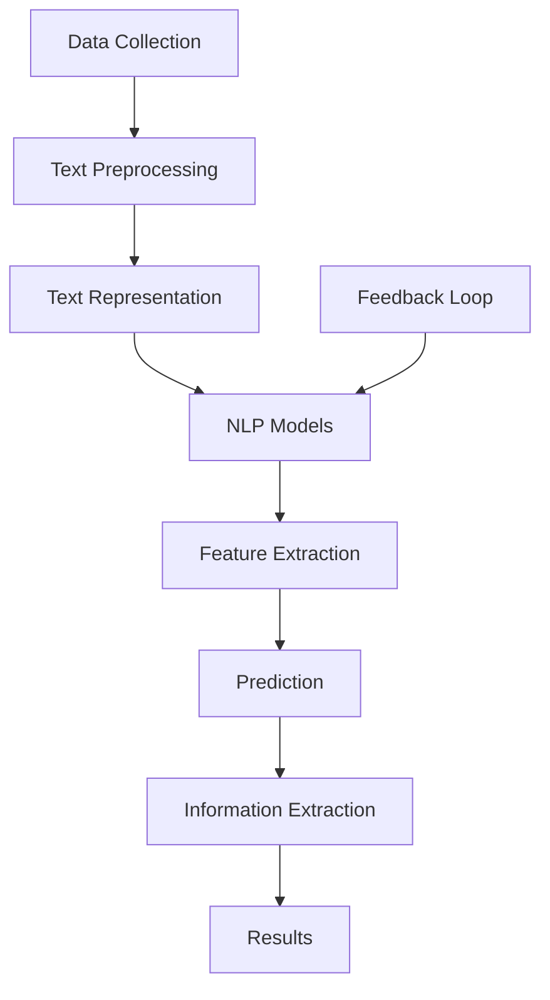

                 


### Introduction to Intelligent Text Analysis: AI Extracting Key Information from Enterprise Documents

## Key Terms

- Intelligent Text Analysis
- AI Text Extraction
- Document Analysis
- Named Entity Recognition (NER)
- Text Classification
- Text Summarization

### Abstract

This article delves into the realm of intelligent text analysis, a powerful technology leveraging AI to extract critical information from enterprise documents. We explore the core concepts, algorithms, and applications of AI in text extraction, providing a comprehensive understanding of how this technology can transform document analysis processes. The article also includes practical case studies and tips for implementing AI-driven text extraction in enterprise environments.

## Introduction

Intelligent text analysis, also known as text analytics, is a multidisciplinary field that combines natural language processing (NLP), machine learning (ML), and data analysis to interpret and extract valuable insights from textual data. In the context of enterprise document analysis, intelligent text analysis plays a pivotal role in transforming raw text into actionable information.

With the exponential growth of digital content, enterprises face the challenge of efficiently processing and analyzing large volumes of text data. AI-driven text extraction tools offer a solution by automatically identifying and extracting key information from documents, reducing manual effort and enabling data-driven decision-making.

### The Significance of AI in Text Extraction

AI has revolutionized the field of text extraction by providing advanced algorithms capable of processing and understanding human language. The significance of AI in text extraction can be highlighted in several ways:

1. **Accuracy and Speed**: AI algorithms can analyze vast amounts of text data quickly and accurately, far surpassing human capabilities.
2. **Complexity Handling**: AI can handle the inherent complexity of natural language, including ambiguities, sarcasm, and context-dependent meanings.
3. **Scalability**: AI systems can scale seamlessly to handle increasing volumes of text data, making them ideal for enterprise environments with large document collections.
4. **Automation**: By automating the text extraction process, AI reduces the need for manual intervention, leading to increased efficiency and cost savings.

### Core Concepts of Intelligent Text Analysis

To grasp the fundamentals of intelligent text analysis, it's essential to understand the key concepts and principles underlying this technology:

1. **Text Preprocessing**: The process of cleaning and preparing raw text data for analysis. This involves tasks such as tokenization, stop-word removal, and stemming.

2. **Text Representation**: The conversion of text data into a format that can be processed by machine learning algorithms. Common techniques include bag-of-words, word embeddings, and TF-IDF.

3. **Text Classification**: The task of assigning a text document to a predefined category or class based on its content. This is a fundamental technique in text mining and is widely used in applications such as spam detection and sentiment analysis.

4. **Named Entity Recognition (NER)**: The process of identifying and classifying named entities (such as people, organizations, locations, and dates) within a text document. NER is crucial for extracting structured information from unstructured text.

5. **Text Summarization**: The task of distilling the most important information from a text document into a shorter, more concise representation. Text summarization can be either extractive (selecting key sentences) or abstractive (generating new text).

### The Role of AI in Text Extraction

AI algorithms play a pivotal role in the entire text extraction process. Here are some key roles of AI in text extraction:

1. **Preprocessing**: AI techniques can automatically perform text preprocessing tasks, ensuring the data is clean and suitable for analysis.
2. **Representation**: AI algorithms, such as word embeddings, can effectively represent text data in a way that captures the semantic meaning of words and phrases.
3. **Feature Extraction**: AI can automatically extract relevant features from text data, reducing the need for manual feature engineering.
4. **Model Training**: AI algorithms, particularly deep learning models, can be trained on large datasets to learn patterns and relationships within the text.
5. **Prediction and Extraction**: Once trained, AI models can predict and extract key information from new text documents, enabling automated text analysis.

### Mermaid Flowchart: The Architecture of Intelligent Text Analysis

Below is a Mermaid flowchart illustrating the architecture of intelligent text analysis, highlighting the key components and their interactions:



### Core AI Text Extraction Algorithms

Several AI algorithms are commonly used for text extraction, each with its unique strengths and applications. Here, we discuss some of the most prominent algorithms:

1. **Naive Bayes Classifier**: A probabilistic classifier based on Bayes' theorem. It's simple, efficient, and often used for text classification tasks.

```python
def naive_bayes_classifier(document, training_data):
    # Priors and likelihoods computation
    # Hypothesis calculation
    # Class prediction
    pass
```

2. **Support Vector Machines (SVM)**: A powerful classifier that finds the hyperplane that best separates different classes in a high-dimensional space.

```python
from sklearn.svm import SVC

# Training the SVM model
model = SVC(kernel='linear')
model.fit(training_data, labels)

# Predicting with the trained model
predictions = model.predict(document)
```

3. **Recurrent Neural Networks (RNNs)**: A type of neural network designed to handle sequences of data. RNNs are particularly effective for tasks like named entity recognition.

```python
import tensorflow as tf

# Building the RNN model
model = tf.keras.Sequential([
    tf.keras.layers.Embedding(input_dim=vocabulary_size, output_dim=embedding_dim),
    tf.keras.layers.LSTM(units=128),
    tf.keras.layers.Dense(units=num_classes, activation='softmax')
])

# Compiling and training the model
model.compile(optimizer='adam', loss='categorical_crossentropy', metrics=['accuracy'])
model.fit(training_data, labels, epochs=num_epochs)
```

4. **Transformer Models**: A family of models, including BERT and GPT, that have achieved state-of-the-art performance in various NLP tasks. Transformers can capture long-range dependencies in text.

```python
from transformers import BertTokenizer, BertModel

# Preprocessing the text
tokenizer = BertTokenizer.from_pretrained('bert-base-uncased')
inputs = tokenizer(document, return_tensors='pt')

# Extracting features from BERT
model = BertModel.from_pretrained('bert-base-uncased')
outputs = model(**inputs)

# Using the hidden states for downstream tasks
features = outputs.last_hidden_state[:, 0, :]
```

### Conclusion

Intelligent text analysis, powered by AI, has transformed the way enterprises handle and analyze large volumes of text data. By automating the extraction of key information from documents, AI enables faster, more accurate, and scalable text analysis processes. In this article, we have explored the core concepts, algorithms, and applications of AI-driven text extraction, providing a foundation for further exploration and practical implementation. As AI technologies continue to evolve, their role in text extraction will only grow, offering even greater potential for enterprises to leverage textual data for informed decision-making.

