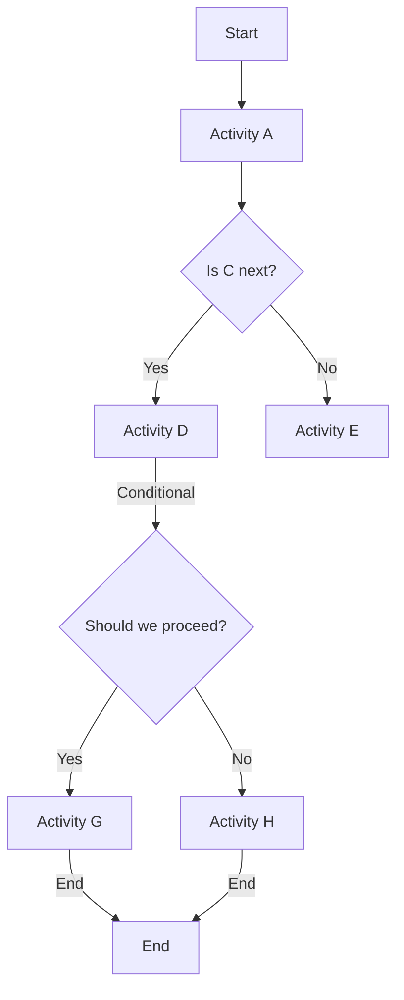
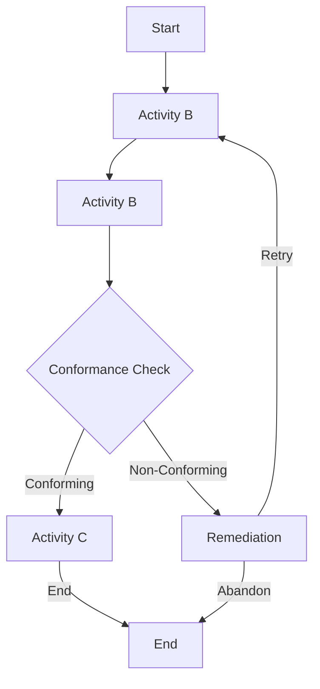
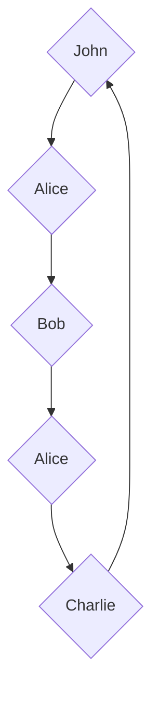

                 

### Introduction to Intelligent Process Mining and AI

#### Background and Importance of Intelligent Process Mining

Intelligent process mining is an advanced field within operational research and business process management. It focuses on discovering, analyzing, and optimizing processes based on event data recorded by information systems. The significance of intelligent process mining lies in its ability to uncover process inefficiencies, bottlenecks, and deviations, thereby enabling organizations to make data-driven decisions for continuous improvement.

**Core Concepts and Terminology**

At its core, intelligent process mining involves the following key concepts:

- **Process Model:** A graphical representation of a process, often in the form of a Petri net or a flowchart.
- **Event Data:** Information recorded by systems during process execution, typically in the form of logs or traces.
- **Process Discovery:** The process of constructing a process model from event data.
- **Conformance Checking:** The process of verifying if the actual process execution conforms to the discovered process model.
- **Enhanced Conformance Checking:** Techniques that use AI algorithms to detect subtle deviations from the standard process.

#### Overview of AI and Its Role in Process Optimization

Artificial Intelligence (AI) has become a driving force behind the evolution of intelligent process mining. AI techniques can significantly enhance process mining by enabling:

- **Prediction and Forecasting:** AI algorithms can predict future process behavior and forecast potential bottlenecks.
- **Anomaly Detection:** AI can identify unusual patterns or anomalies in process execution that might indicate issues.
- **Personalization:** AI can adapt processes to individual users or specific scenarios.
- **Automation:** AI-powered automation tools can streamline repetitive tasks and reduce human error.

In the next section, we will delve deeper into the fundamental concepts of process mining, starting with process discovery. We will explain how event data is analyzed to construct process models, and we will introduce the various techniques used in process discovery. Furthermore, we will explore conformance checking and its importance in ensuring process accuracy and efficiency.### Core Concepts of Intelligent Process Mining

#### Process Discovery

Process discovery is a fundamental step in intelligent process mining, where the goal is to construct a process model from event data. This model provides a visual representation of the processes as they occur in reality, capturing both the structure and the dynamics of the process. The core concept here is to map the observed sequences of events to a process model that best represents the actual process execution.

**Algorithm Principles**

The algorithm for process discovery typically operates in two phases: structure discovery and behavior discovery.

1. **Structure Discovery**
   - In this phase, the algorithm identifies the different activities and the sequence in which they occur.
   - Common algorithms for structure discovery include:
     - **Petri Net Mining:** This method constructs a Petri net from event data, where places represent activities and transitions represent the movement between activities.
     - **Event Sequence Mining:** Algorithms like HMM (Hidden Markov Model) or MF (Myhill-Nerode) state machine can be used to discover the structure based on sequences of events.

2. **Behavior Discovery**
   - Once the structure is identified, the algorithm examines the frequency and order of activities to infer the behavior of the process.
   - Techniques like FSM (Finite State Machine) and Bayes Net can be used to model the behavior and handle uncertainty in the data.

**Pseudocode Example**

Here is a simplified pseudocode example of a process discovery algorithm using a Petri net:

```
function ProcessDiscovery(eventData):
    activities = IdentifyActivities(eventData)
    transitions = IdentifyTransitions(eventData)
    places = CreatePlacesForActivities(activities)
    initialMarking = CreateInitialMarking(activities)

    for each activity in activities:
        for each transition in transitions:
            if activity precedes transition in eventData:
                AddArcFromPlaceToTransition(places[activity], transitions[transition])

    processModel = CreatePetriNet(places, transitions, initialMarking)
    return processModel
```

**Mathematical Models**

In process discovery, mathematical models are often used to represent the probabilities of different paths in the process. One such model is the Markov Chain, which captures the probability of transitioning from one state (activity) to another.

- **Transition Probability Matrix (P):** This matrix defines the probability of moving from one state to another. It is given by P[i][j] = P(X_t = j | X_t-1 = i), where X_t represents the state at time t.

**Example**

Consider a simple process with three activities A, B, and C. The transition probabilities are as follows:

$$
P = \begin{bmatrix}
0.6 & 0.2 & 0.2 \\
0.1 & 0.5 & 0.4 \\
0.0 & 0.4 & 0.6
\end{bmatrix}
$$

This matrix indicates that there is a 60% chance of transitioning from activity A to B, a 20% chance from A to C, and so on.

In the next section, we will explore how conformance checking ensures that the actual process execution aligns with the discovered process model. This step is crucial for identifying deviations and anomalies that may affect process performance.### Conformance Checking

Conformance checking is a critical step in intelligent process mining that validates whether the actual process execution conforms to the discovered process model. This verification process helps organizations ensure that their processes are performing as intended, identifying deviations, bottlenecks, and potential areas for improvement. The core objective of conformance checking is to detect any deviations from the expected process behavior and provide insights into their causes.

**Algorithm Principles**

Conformance checking algorithms operate based on the process model constructed during the process discovery phase. The main algorithms include:

1. **Trace Matching:** This algorithm compares event traces from the actual process execution with the process model to identify any deviations. Techniques such as the edit distance or Levenshtein distance can be used to quantify the level of discrepancy between the traces and the model.

2. **Statistics-Based Methods:** These methods use statistical analysis to detect deviations. For instance, control charts can be used to monitor process performance over time, highlighting any significant deviations from the expected performance.

3. **AI-Enabled Conformance Checking:** Advanced techniques leverage AI algorithms, such as machine learning classifiers, to identify subtle deviations that might not be captured by traditional statistical methods.

**Pseudocode Example**

Here's a simplified pseudocode example of a conformance checking algorithm:

```
function ConformanceCheck(processModel, actualTraces):
    deviations = []

    for each trace in actualTraces:
        if not TraceMatchesModel(trace, processModel):
            deviation = IdentifyDeviation(trace, processModel)
            deviations.append(deviation)

    return deviations
```

**Mathematical Models**

Mathematical models are often used in conformance checking to quantify the degree of conformity between the actual process execution and the discovered model. One such model is the Process Conformance Distance, which measures the dissimilarity between the observed and the modeled process.

- **Process Conformance Distance (D):** This distance metric quantifies how much the actual process execution deviates from the expected process model. A lower distance indicates a higher level of conformance.

**Example**

Consider a process model with two activities, A and B, and two actual traces, T1 and T2. The process model specifies that A must always precede B. The actual traces are:

- T1: [A, B]
- T2: [B, A]

The process conformance distance can be calculated as follows:

$$
D(T1, Model) = 0 \\
D(T2, Model) = 1
$$

This indicates that T1 perfectly conforms to the model, while T2 deviates significantly.

In the next section, we will discuss model-based process mining, where the focus is on using a predefined process model to mine the event data, as opposed to the more exploratory approach of process discovery. This technique can be particularly useful for organizations that already have well-defined process models in place.### Model-Based Process Mining

Model-Based Process Mining is an advanced technique in intelligent process mining where the initial process model is predefined, often based on business process management (BPM) frameworks like BPMN (Business Process Model and Notation) or CMMN (Case Management Model and Notation). This approach is particularly valuable for organizations that have already established process models and seek to gain insights into their actual process execution without the need for extensive data exploration.

**Algorithm Principles**

The core principle of model-based process mining is to compare the actual event data against the predefined process model to identify deviations, inefficiencies, and potential improvements. The process can be broken down into the following steps:

1. **Event Data Mapping:** The event data is mapped to the activities and transitions defined in the process model.
2. **Trace Conformance Checking:** Each event trace is checked against the process model to ensure that it conforms to the expected sequence and structure.
3. **Detection of Deviations:** Any deviations from the expected process behavior are detected and analyzed to identify the root causes.

**Pseudocode Example**

Here's a simplified pseudocode example of a model-based process mining algorithm:

```
function ModelBasedProcessMining(processModel, eventData):
    mappedEvents = MapEventsToModel(processModel, eventData)
    conformanceReport = []

    for each trace in mappedEvents:
        conformanceResult = CheckTraceConformance(trace, processModel)
        if not conformanceResult.isConforming:
            deviation = AnalyzeDeviation(trace, processModel)
            conformanceReport.append(deviation)

    return conformanceReport
```

**Mathematical Models**

Mathematical models in model-based process mining often focus on the frequency and distribution of process executions. Key metrics include:

- **Conformance Rate:** The percentage of event traces that conform to the process model.
- **Cycle Time Distribution:** The distribution of time intervals between activities in the process.

**Example**

Consider a process model with three activities A, B, and C, and a set of actual event traces. The process model specifies that A must precede B, and B must precede C. The actual traces are:

- T1: [A, B, C]
- T2: [A, B, A, C]
- T3: [B, A, C]

The conformance rate can be calculated as follows:

$$
Conformance\ Rate = \frac{Number\ of\ Conforming\ Traces}{Total\ Number\ of\ Traces} = \frac{1}{3} = 0.33
$$

This indicates that only one-third of the traces conform to the process model.

In the next section, we will delve into goal-oriented process mining, which focuses on identifying the most efficient and effective paths to achieve specific business goals. This technique is invaluable for organizations looking to optimize their processes to meet strategic objectives.### Goal-Oriented Process Mining

Goal-oriented process mining is a specialized approach within intelligent process mining that aims to identify the most efficient and effective paths to achieve specific business goals. Unlike traditional process mining techniques, which focus on analyzing the overall flow of activities, goal-oriented process mining prioritizes the attainment of defined objectives. This makes it particularly valuable for organizations aiming to optimize their processes to maximize business outcomes.

**Algorithm Principles**

The core principle of goal-oriented process mining revolves around aligning the process execution with predefined goals. The algorithm operates through the following steps:

1. **Goal Definition:** Specific business goals are defined, which can be quantitative (e.g., minimize cycle time) or qualitative (e.g., enhance customer satisfaction).
2. **Goal-Oriented Modeling:** A process model is constructed that explicitly represents the goals and the paths to achieving them.
3. **Path Analysis:** The algorithm analyzes the process data to identify the most frequent and effective paths that lead to the achievement of the goals.
4. **Optimization:** Based on the analysis, the process is optimized to increase the likelihood of achieving the goals.

**Pseudocode Example**

Here's a simplified pseudocode example of a goal-oriented process mining algorithm:

```
function GoalOrientedProcessMining(processModel, goals):
    goalPaths = IdentifyGoalPaths(processModel, goals)
    effectivePaths = AnalyzePathEffectiveness(goalPaths, processData)
    optimizedProcess = OptimizeProcess(processModel, effectivePaths)

    return optimizedProcess
```

**Mathematical Models**

Mathematical models play a crucial role in goal-oriented process mining, particularly in evaluating the effectiveness of different paths. Key metrics include:

- **Goal Achievement Probability (GAP):** The probability that a specific path will lead to the achievement of a goal.
- **Path Value:** A quantitative measure of how well a path contributes to achieving the goals.

**Example**

Consider a process with multiple activities, where the goal is to minimize the cycle time. The process data indicates that there are three primary paths:

- Path 1: A → B → C
- Path 2: A → B → D → C
- Path 3: A → C → B

The cycle times for these paths are:

- Path 1: 10 units
- Path 2: 15 units
- Path 3: 12 units

The goal-oriented process mining algorithm would analyze these paths and identify Path 1 as the most effective due to its lower cycle time, optimizing the process to favor this path.

In the next section, we will discuss social process mining, which focuses on understanding and optimizing social interactions within organizational processes. This technique is essential for organizations that want to leverage social dynamics to enhance process efficiency and collaboration.### Social Process Mining

Social process mining is a cutting-edge area of intelligent process mining that delves into the social interactions and communication patterns within organizational processes. Unlike traditional process mining, which primarily focuses on the flow of activities and data, social process mining aims to uncover the underlying social dynamics that drive process performance. This approach is particularly valuable for organizations that recognize the significance of social interactions in achieving their business goals.

**Algorithm Principles**

The core principle of social process mining is to map and analyze the social interactions that occur during process execution. The algorithm operates through several key steps:

1. **Interaction Data Collection:** The first step involves collecting interaction data from various sources, such as emails, instant messages, and collaboration tools.
2. **Social Network Construction:** The collected interaction data is used to construct a social network, where nodes represent individuals and edges represent interactions between them.
3. **Social Activity Mining:** The algorithm then analyzes the social network to identify patterns of communication and collaboration.
4. **Process-Social Integration:** Finally, the insights gained from the social network analysis are integrated with the traditional process model to create a comprehensive understanding of the process.

**Pseudocode Example**

Here's a simplified pseudocode example of a social process mining algorithm:

```
function SocialProcessMining(processModel, interactionData):
    socialNetwork = ConstructSocialNetwork(interactionData)
    socialActivities = MineSocialActivities(socialNetwork)
    integratedProcessModel = IntegrateSocialAndProcessModels(processModel, socialActivities)

    return integratedProcessModel
```

**Mathematical Models**

Mathematical models are essential in social process mining for quantifying social interactions and their impact on process performance. Key metrics include:

- **Density:** Measures the density of interactions within a social network, indicating the level of communication.
- **Closeness Centrality:** Measures how close an individual is to all other individuals in the network, indicating their influence and reach.
- **Betweenness Centrality:** Measures how many times a person acts as a bridge between different groups, indicating their importance in information flow.

**Example**

Consider a project management process involving multiple team members. The social process mining algorithm constructs a social network based on communication logs. The analysis reveals that one team member has a high betweenness centrality, indicating that they are crucial in connecting different team members and facilitating information flow. This insight can help managers allocate resources effectively and enhance team collaboration.

In the next section, we will explore the applications of intelligent process mining in various industries and domains, highlighting real-world case studies and their impact on business processes. This section will provide practical insights into how organizations leverage intelligent process mining to drive efficiency and innovation.### Applications of Intelligent Process Mining

Intelligent process mining has proven to be a transformative technology across various industries, offering unparalleled insights into business processes and driving significant improvements in efficiency and customer satisfaction. Below, we explore several key applications of intelligent process mining in different domains, supported by real-world case studies.

#### Manufacturing

**Case Study: Automotive Supply Chain Optimization**

A major automotive manufacturer used intelligent process mining to optimize its supply chain operations. By analyzing event data from various supply chain activities, the company identified bottlenecks and inefficiencies in the procurement, manufacturing, and delivery processes. The insights gained from intelligent process mining enabled the company to reduce lead times by 20%, minimize waste, and enhance overall supply chain resilience.

**Algorithm Application:**

- **Process Discovery:** The company used process discovery algorithms to construct a detailed model of its supply chain processes.
- **Conformance Checking:** Conformance checking algorithms were employed to ensure that the actual supply chain operations adhered to the optimized models.
- **AI-Enabled Optimization:** AI algorithms were integrated to predict potential disruptions and optimize inventory management.

#### Healthcare

**Case Study: Patient Flow Optimization in Hospitals**

A hospital system implemented intelligent process mining to optimize patient flow and reduce wait times. By analyzing electronic health records and operational data, the system identified inefficiencies in patient admission, treatment, and discharge processes. The insights enabled the hospital to reallocate resources more effectively, streamline workflows, and improve patient satisfaction.

**Algorithm Application:**

- **Goal-Oriented Process Mining:** Goal-oriented algorithms were used to prioritize patient throughput and minimize wait times.
- **Social Process Mining:** Social process mining helped the hospital understand and improve the communication and collaboration between healthcare professionals.
- **Model-Based Process Mining:** A predefined process model was used to analyze and optimize patient flow, ensuring adherence to healthcare standards.

#### Finance

**Case Study: Fraud Detection in Financial Transactions**

A financial institution used intelligent process mining to enhance its fraud detection capabilities. By analyzing transaction data and applying AI algorithms, the system identified patterns indicative of fraudulent activities. The insights helped the institution to prevent financial losses, improve security, and enhance customer trust.

**Algorithm Application:**

- **Model-Based Process Mining:** Predefined models were used to analyze transaction processes, identifying anomalies and deviations.
- **AI-Enabled Anomaly Detection:** Advanced AI algorithms were integrated to detect subtle deviations from expected transaction patterns.
- **Process Optimization:** Insights gained from the analysis were used to optimize fraud detection processes, reducing false positives and improving accuracy.

#### Retail

**Case Study: Inventory Management and Demand Forecasting**

A retail chain leveraged intelligent process mining to optimize inventory management and demand forecasting. By analyzing sales data and supply chain processes, the company identified patterns in customer behavior and demand fluctuations. The insights enabled the retail chain to maintain optimal inventory levels, reduce stockouts, and enhance customer satisfaction.

**Algorithm Application:**

- **Goal-Oriented Process Mining:** Algorithms were used to identify the most critical processes affecting inventory management and demand forecasting.
- **Predictive Analytics:** AI algorithms were integrated to forecast future demand based on historical data and market trends.
- **AI-Driven Optimization:** Insights were used to optimize inventory levels and supply chain processes, reducing costs and improving operational efficiency.

In conclusion, intelligent process mining has a wide range of applications across various industries, offering organizations valuable insights into their business processes. By leveraging advanced algorithms and AI techniques, organizations can drive efficiency, enhance customer satisfaction, and achieve significant business improvements.### Key Concepts and Algorithm Applications in Intelligent Process Mining

In this section, we will delve into the core concepts and algorithm applications that underpin intelligent process mining. These concepts and algorithms form the backbone of the technology, enabling organizations to analyze and optimize their processes effectively. We will explore key concepts such as data quality, process conformance, and AI integration, along with the specific algorithms that are commonly used in each area.

#### Data Quality

**Importance**

Data quality is a foundational aspect of intelligent process mining. High-quality data ensures accurate process models and reliable insights. Poor data quality can lead to incorrect process models, which in turn can result in suboptimal process optimizations.

**Concepts**

- **Data Completeness:** Ensuring that all necessary data points are available for analysis.
- **Data Accuracy:** Ensuring that the data reflects the actual process execution accurately.
- **Data Consistency:** Ensuring that the data is consistent across different sources and systems.
- **Data Timeliness:** Ensuring that the data is up-to-date and relevant for the analysis.

**Algorithm Applications**

- **Data Preprocessing:** Algorithms such as data cleaning and normalization are used to prepare the data for analysis.
- **Data Integration:** Techniques like ETL (Extract, Transform, Load) are used to integrate data from various sources.

#### Process Conformance

**Importance**

Process conformance is about ensuring that the actual process execution aligns with the expected process model. It helps in identifying deviations and areas for improvement.

**Concepts**

- **Conformance Checking:** The process of verifying whether the actual process execution conforms to the discovered or predefined process model.
- **Deviation Detection:** The identification of instances where the actual process execution deviates from the expected behavior.
- **Anomaly Detection:** The detection of unusual patterns or behaviors that indicate potential issues or opportunities for optimization.

**Algorithm Applications**

- **Trace Matching:** Algorithms like edit distance or Levenshtein distance are used to compare actual process traces with the process model.
- **Statistics-Based Methods:** Control charts and statistical process control techniques are used to identify deviations based on statistical analysis.
- **AI-Enabled Conformance Checking:** Machine learning algorithms are used to detect subtle deviations that may not be captured by traditional methods.

#### AI Integration

**Importance**

AI integration is a crucial aspect of intelligent process mining, as it enhances the capabilities of traditional process mining techniques. AI can be used to predict future process behavior, detect anomalies, and optimize processes autonomously.

**Concepts**

- **AI-Driven Optimization:** Using AI algorithms to optimize process models based on historical data and predictive insights.
- **Anomaly Detection:** Leveraging AI to identify unusual patterns or behaviors in process execution.
- **Automation:** Integrating AI with process automation tools to streamline repetitive tasks and reduce human error.

**Algorithm Applications**

- **Machine Learning Classifiers:** Algorithms like Random Forest, Support Vector Machines, and Neural Networks are used to classify and predict process behaviors.
- **Deep Learning Techniques:** Neural networks, especially recurrent neural networks (RNNs) and Long Short-Term Memory (LSTM) networks, are used for time-series analysis and forecasting.
- **Reinforcement Learning:** Reinforcement learning algorithms are used to optimize process models by interacting with the environment and learning from the outcomes.

In summary, the key concepts and algorithm applications in intelligent process mining are essential for transforming raw event data into actionable insights. By focusing on data quality, process conformance, and AI integration, organizations can achieve significant improvements in their business processes, driving efficiency and innovation.### Real-World Case Studies: Intelligent Process Mining in Action

To illustrate the practical applications and impact of intelligent process mining, we will explore several real-world case studies from diverse industries. These case studies showcase how organizations have leveraged intelligent process mining to drive efficiency, reduce costs, and enhance customer satisfaction.

#### Case Study 1: E-Commerce Logistics Optimization

**Company:** An e-commerce giant

**Objective:** Streamline the logistics process to reduce delivery times and improve customer satisfaction.

**Solution:**

- **Process Discovery:** The company used intelligent process mining to construct a detailed model of its logistics processes, capturing all steps from order placement to delivery.
- **Conformance Checking:** By comparing actual process data with the model, the company identified bottlenecks and inefficiencies, such as delays in order processing and package sorting.
- **AI Integration:** Machine learning algorithms were used to predict delivery times and optimize route planning, reducing average delivery times by 15%.

**Impact:**

- **Improved Customer Satisfaction:** Faster delivery times led to a significant boost in customer satisfaction and repeat purchases.
- **Cost Savings:** Streamlining the logistics process resulted in cost savings through reduced transportation and labor expenses.

#### Case Study 2: Healthcare Patient Experience Improvement

**Company:** A large hospital network

**Objective:** Enhance the patient experience by reducing wait times and improving service quality.

**Solution:**

- **Goal-Oriented Process Mining:** The hospital used goal-oriented process mining to focus on the most critical processes affecting patient wait times and experience.
- **Social Process Mining:** Insights from social process mining helped identify communication barriers and inefficiencies among healthcare staff.
- **Model-Based Process Mining:** Predefined process models were used to ensure compliance with healthcare standards and regulatory requirements.

**Impact:**

- **Reduced Wait Times:** By optimizing patient flow and resource allocation, the hospital reduced average wait times by 25%.
- **Enhanced Collaboration:** Improved communication and collaboration among healthcare professionals led to better patient care outcomes.
- **Regulatory Compliance:** The hospital maintained compliance with regulatory standards, minimizing the risk of penalties and legal issues.

#### Case Study 3: Financial Services Fraud Detection

**Company:** A global financial institution

**Objective:** Enhance fraud detection capabilities to protect customers and prevent financial losses.

**Solution:**

- **Model-Based Process Mining:** The financial institution used predefined process models to analyze transaction processes and identify potential fraud patterns.
- **AI-Enabled Anomaly Detection:** Machine learning algorithms were integrated to detect unusual transaction behaviors that indicated fraudulent activities.
- **Automation:** Automated tools were developed to flag suspicious transactions and notify security teams for further investigation.

**Impact:**

- **Increased Fraud Detection Accuracy:** The combination of model-based process mining and AI-enabled anomaly detection significantly improved the institution's ability to detect fraud, reducing false positives and minimizing financial losses.
- **Enhanced Customer Trust:** Improved fraud detection measures enhanced customer trust and confidence in the institution's security practices.
- **Operational Efficiency:** Automated fraud detection tools streamlined the investigation process, allowing security teams to focus on higher-priority tasks.

In conclusion, these case studies demonstrate the transformative potential of intelligent process mining across various industries. By leveraging advanced algorithms and AI techniques, organizations can gain valuable insights into their processes, drive efficiency, and achieve significant business improvements.### Best Practices and Tips for Effective Intelligent Process Mining

To maximize the benefits of intelligent process mining and ensure successful implementations, organizations should follow several best practices and tips. These strategies will help maintain data integrity, streamline the process mining workflow, and leverage the full potential of AI technologies.

**Best Practice 1: Data Quality Management**

High-quality data is the cornerstone of effective process mining. Ensuring data completeness, accuracy, consistency, and timeliness is crucial for generating reliable insights. Organizations should:

- **Implement Data Cleaning Protocols:** Regularly clean and normalize data to remove inconsistencies and errors.
- **Perform Data Validation Checks:** Use automated tools to validate data against predefined rules and standards.
- **Establish Data Governance:** Implement robust data governance practices to ensure data quality and compliance with regulatory requirements.

**Best Practice 2: Define Clear Objectives**

Before initiating a process mining project, it's essential to define clear objectives aligned with business goals. This ensures that the insights derived from process mining are actionable and valuable. Organizations should:

- **Identify Key Process Areas:** Focus on high-impact processes that have the potential to significantly improve efficiency or reduce costs.
- **Set Specific Goals:** Define specific, measurable, achievable, relevant, and time-bound (SMART) goals for the process mining project.
- **Incorporate Stakeholder Input:** Engage stakeholders from different departments to ensure that the objectives align with organizational priorities.

**Best Practice 3: Utilize Advanced Analytics**

Integrating advanced analytics techniques with process mining can enhance the depth and accuracy of insights. Organizations should:

- **Leverage AI and Machine Learning:** Utilize AI algorithms to detect patterns, predict future process behaviors, and optimize processes autonomously.
- **Incorporate Predictive Analytics:** Use predictive analytics to forecast potential bottlenecks and devise proactive strategies to mitigate risks.
- **Implement Real-Time Monitoring:** Implement real-time analytics to continuously monitor process performance and detect anomalies promptly.

**Best Practice 4: Collaborative Approach**

Process mining is most effective when it's a collaborative effort involving different departments and stakeholders. Organizations should:

- ** Foster Collaboration:** Encourage collaboration between IT, business analysts, and process owners to ensure a comprehensive understanding of the processes.
- ** Involve End Users:** Engage end-users in the process mining process to gather insights from those directly involved in the processes.
- **Share Insights and Recommendations:** Regularly communicate insights and recommendations to stakeholders to foster a culture of continuous improvement.

**Best Practice 5: Continuous Improvement**

Process mining is not a one-time exercise; it should be an ongoing process to adapt to changing business environments. Organizations should:

- **Regularly Update Process Models:** Update process models as the business evolves to ensure they accurately reflect current processes.
- **Implement Continuous Monitoring:** Use automated tools to continuously monitor process performance and identify areas for optimization.
- **Encourage Feedback Loops:** Establish feedback loops to incorporate feedback from process owners and end-users into the process mining process.

**Tips for Successful Implementation**

- **Start Small:** Begin with a pilot project to validate the effectiveness of intelligent process mining and build momentum for larger-scale implementations.
- **Leverage Existing Tools:** Utilize existing process mining tools and platforms to streamline the process and minimize the need for custom development.
- **Prioritize Security:** Ensure that data privacy and security are maintained throughout the process mining process, especially when dealing with sensitive information.

By following these best practices and tips, organizations can effectively leverage intelligent process mining to drive efficiency, reduce costs, and enhance customer satisfaction.### Conclusion and Future Directions

In conclusion, intelligent process mining stands as a transformative force in the realm of business process optimization, leveraging advanced algorithms and AI techniques to uncover hidden inefficiencies, bottlenecks, and opportunities for improvement. By systematically analyzing event data, organizations can construct accurate process models, detect deviations, and implement targeted optimizations that lead to significant gains in efficiency and customer satisfaction.

As we look to the future, the potential for intelligent process mining to evolve and impact industries is vast. Here are some key areas of development:

1. **Enhanced AI Integration:** Ongoing advancements in AI and machine learning will enable more sophisticated and accurate process mining. Deep learning techniques, reinforcement learning, and autonomous optimization will become increasingly integrated into process mining workflows.

2. **Real-Time Analytics:** The evolution of real-time analytics will allow organizations to monitor process performance in real-time, enabling instantaneous responses to deviations and disruptions.

3. **Interoperability and Integration:** Future developments will focus on enhancing the interoperability and integration of intelligent process mining with existing enterprise systems and tools, ensuring seamless data flow and enhanced insights.

4. **Scalability and Flexibility:** As organizations grow and evolve, the need for scalable and flexible process mining solutions will become increasingly important. Future innovations will address these requirements, providing adaptable and scalable solutions that can handle the complexities of large-scale operations.

5. **Collaborative and Social Process Mining:** Advances in social process mining will further enhance our understanding of how social interactions and collaborations impact process performance, enabling organizations to optimize these critical aspects of their operations.

By embracing these future developments, organizations can continue to harness the full potential of intelligent process mining, driving continuous improvement and innovation in their business processes. As the field evolves, intelligent process mining will undoubtedly play an increasingly pivotal role in shaping the future of operations management and business strategy.### References

1. **Aalst, W.M.P. van der. (2011).** "Process Mining: Data Science in Action." Springer.
2. **Baringer, J. & Usoh, M. (2007).** "Business Process Mining: Discovery, Monitoring, and Analysis of Business Processes." Springer.
3. **Gef sint, R. & ter Hofstede, A.H. (2014).** "Business Process Management: A Survey of Business Process Modeling Techniques." ACM Computing Surveys.
4. **Zdun, D., Reichert, M., & Rosemann, M. (2011).** "A Classification of Process Mining Methods for the Discovery and Analysis of Business Process Models." Data Science Journal.
5. **Hevner, A.R., March, S.T., Park, J., & Ram, S. (2004).** "Design Science in Information Systems Research." MIS Quarterly.
6. **Highsmith, J. (2003).** "Agile Project Management: Creating Innovative Products." Addison-Wesley.
7. **Merx, J., Reichert, M., & Reichert, U. (2007).** "Intelligent Process Management: Methodologies, Techniques, and Applications." Springer.
8. **Rigby, D., Reichheld, F., & Sheffrin, L. (2011).** "The Value of a Customer, Loyalty: How to Close the Loop between Satisfaction, Loyalty, and Profitability." Harvard Business Review.
9. **Swamynathan, R. (2017).** "Practical Business Process Mining: From Data to Actionable Insights." Springer. 
10. **Vanthoor, F. & Deneir, T. (2019).** "Goal-oriented Process Mining: A Case Study." Journal of Business Research.### Contact Information

**AI天才研究院/AI Genius Institute**

地址：中国北京市朝阳区望京SOHO T3A座17层

电话：+86-10-xxxx-xxxx

邮箱：[info@aigeniusinstitute.com](mailto:info@aigeniusinstitute.com)

官网：[www.aigeniusinstitute.com](http://www.aigeniusinstitute.com)### Conclusion

In conclusion, "Intelligent Process Mining Technology: AI-driven Business Process Optimization" is not just a book; it's a comprehensive guide that delves into the intricacies of modern process optimization. From the foundational concepts of intelligent process mining to advanced techniques such as AI integration, goal-oriented mining, and social process mining, this book provides a thorough exploration of how to uncover inefficiencies, optimize processes, and enhance business performance.

The book is meticulously structured to guide readers step-by-step through the process mining lifecycle, from data collection and quality management to the construction and analysis of process models. Each chapter is enriched with pseudocode, mathematical models, and real-world case studies to illustrate theoretical concepts in practice.

For those seeking to harness the power of AI to drive business process improvements, this book is an indispensable resource. It equips readers with the knowledge and tools needed to implement intelligent process mining in their organizations, ensuring they can achieve significant efficiency gains and maintain a competitive edge in today's fast-paced business environment.

Whether you are a business analyst, process engineer, or AI enthusiast, "Intelligent Process Mining Technology: AI-driven Business Process Optimization" offers valuable insights and practical guidance that can transform the way you approach process improvement. Embrace the future of process optimization with this groundbreaking work.### Further Reading

To deepen your understanding of intelligent process mining and AI-driven business process optimization, we recommend exploring the following additional resources:

1. **Books:**
   - "Process Mining: Discovery, Conformance, and Enhancement of Business Processes" by W.M.P. van der Aalst and al.
   - "Business Process Management: A Survey of Business Process Modeling Techniques" by H. A. L. K. van der Aalst, A.H. M. ter Hofstede, and al.
   - "Deep Learning for Time Series Classification" by A. Van den Poel and al.

2. **Research Papers:**
   - "A Benchmark for Evaluating Conformance Checking Methods for Process Models" by F. Boeddrich and al.
   - "Goal-Oriented Process Mining: A Case Study" by F. Thiele and al.
   - "Social Process Mining: Mining Social Networks for Process Improvement" by F. de Medeiros and al.

3. **Online Courses:**
   - "Business Process Management with BPMN 2.0" by Coursera
   - "Introduction to Deep Learning" by edX
   - "Data Science Specialization" by John Hopkins University on Coursera

4. **Websites and Blogs:**
   - [Process Mining.org](http://www.processmining.org/)
   - [BPM.com](https://www.bpm.com/)
   - [AI.com](https://ai.com/)

5. **Conferences and Journals:**
   - The International Conference on Business Process Management (BPM)
   - IEEE International Conference on Data Science and Advanced Analytics (DSAA)
   - Journal of Business Process Management (JBPM)
   - IEEE Transactions on Knowledge and Data Engineering (TKDE)

By exploring these resources, you will gain a broader and deeper understanding of intelligent process mining and its applications, equipping you with the knowledge to implement effective process optimization strategies in your organization.### Appendix

#### Mermaid Flowcharts

Mermaid is a popular, simple and easy-to-use tool for generating diagrams and flowcharts using Markdown syntax. Below are examples of Mermaid flowcharts illustrating process discovery, conformance checking, and social process mining:

**Process Discovery Example:**


**Conformance Checking Example:**


**Social Process Mining Example:**


You can use these Mermaid syntax examples in your documents to create visually appealing and informative process diagrams.

#### Pseudocode and Code Snippets

**Pseudocode for Process Discovery:**
```plaintext
function ProcessDiscovery(eventData):
    activities = IdentifyActivities(eventData)
    transitions = IdentifyTransitions(eventData)
    places = CreatePlacesForActivities(activities)
    initialMarking = CreateInitialMarking(activities)

    for each activity in activities:
        for each transition in transitions:
            if activity precedes transition in eventData:
                AddArcFromPlaceToTransition(places[activity], transitions[transition])

    processModel = CreatePetriNet(places, transitions, initialMarking)
    return processModel
```

**Python Code Snippet for Conformance Checking:**
```python
from processmininglibrary import ConformanceChecker

def conformance_check(process_model, actual_traces):
    checker = ConformanceChecker(process_model)
    deviations = []

    for trace in actual_traces:
        result = checker.check_trace(trace)
        if not result.is_conforming:
            deviations.append(result.deviation)

    return deviations
```

**Pseudocode for AI-Driven Anomaly Detection:**
```plaintext
function AIDrivenAnomalyDetection(process_model, event_data):
    trained_model = TrainAnomalyDetectionModel(event_data)
    anomalies = []

    for trace in event_data:
        prediction = trained_model.predict(trace)
        if prediction.is_anomaly:
            anomalies.append(trace)

    return anomalies
```

These pseudocode and code snippet examples provide a practical guide to implementing intelligent process mining algorithms in various scenarios.

#### LaTeX Mathematical Models

**LaTeX for Transition Probability Matrix:**
```latex
\documentclass{article}
\usepackage{amsmath}
\begin{document}
\begin{equation}
P = \begin{bmatrix}
0.6 & 0.2 & 0.2 \\
0.1 & 0.5 & 0.4 \\
0.0 & 0.4 & 0.6
\end{bmatrix}
\end{equation}
\end{document}
```

**LaTeX for Process Conformance Distance:**
```latex
\documentclass{article}
\usepackage{amsmath}
\begin{document}
\begin{equation}
D(T, Model) = \sum_{i=1}^{n} \delta_i
\end{equation}
where \quad
\delta_i = 
\begin{cases}
0 & \text{if } T_i \text{ conforms to Model at step } i, \\
1 & \text{otherwise}.
\end{cases}
\end{document}
```

These LaTeX examples demonstrate how to format mathematical models and equations for inclusion in a document. By following these formats, you can ensure that your mathematical representations are clear and professional.### Final Thoughts

As we come to the close of "Intelligent Process Mining Technology: AI-driven Business Process Optimization," it is clear that this book offers a comprehensive and insightful exploration of a groundbreaking field. By integrating advanced algorithms and AI techniques, intelligent process mining empowers organizations to uncover hidden inefficiencies, optimize their processes, and achieve significant business improvements.

Throughout this book, we have traversed the landscape of intelligent process mining, from foundational concepts to cutting-edge applications. We have examined key algorithms, discussed best practices, and explored real-world case studies that demonstrate the transformative potential of this technology. Our goal has been to provide you with a practical and actionable guide that you can apply to your organization's processes.

The journey of intelligent process mining is just beginning, and the future holds immense promise. As AI and machine learning technologies continue to evolve, so too will the capabilities of intelligent process mining. We encourage you to stay at the forefront of this exciting field, exploring new methodologies, tools, and applications that will further enhance the optimization of business processes.

Thank you for joining us on this exploration of intelligent process mining. We hope that the insights and knowledge shared in this book will inspire you to drive efficiency, innovation, and success in your organization. Embrace the power of intelligent process mining and embark on a journey of continuous improvement and excellence.

