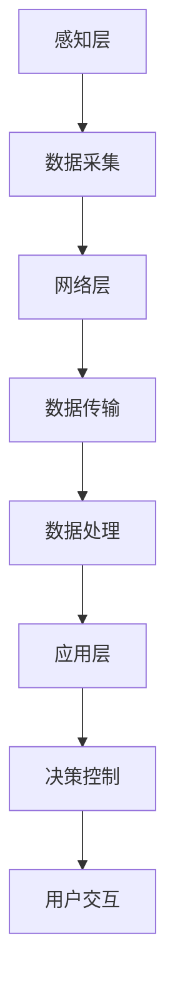

                 

### 文章标题

《智能环境：无处不在的计算与感知》

在当今数字化时代，智能环境已成为技术发展的重要方向。本文将深入探讨智能环境的定义、核心技术和实际应用，旨在为读者呈现这一领域的全景图。

### 关键词

- 智能环境
- 计算与感知技术
- 数据管理
- 分析与决策
- 实际应用
- 未来趋势

### 摘要

智能环境是一个集成了计算与感知技术的综合体，它通过数据收集、处理和分析，实现对环境的高效监控和智能决策。本文首先介绍了智能环境的概念与背景，随后详细阐述了计算与感知技术的原理，包括计算技术的演进和感知技术的核心组件。接着，文章探讨了智能环境的构建方法和数据管理策略，随后深入分析了智能环境中的数据分析与决策支持系统。最后，本文展示了智能环境在实际应用中的案例，并对未来的发展趋势进行了展望。通过这篇文章，读者可以全面了解智能环境的概念、技术架构和应用前景。

## 引言：智能环境概述

### 智能环境的概念

智能环境（Smart Environment）是一个集成计算与感知技术的综合性概念，旨在通过数据收集、处理和分析，实现对环境的高效监控和管理。它涉及到传感器技术、计算平台、通信网络、数据分析等多个领域，目标是提供一个智能、便捷、高效的生活和工作环境。

智能环境的关键特征包括：

1. **感知能力**：通过传感器网络收集环境数据，如温度、湿度、声音、光线等，实现对物理世界的实时感知。
2. **计算能力**：利用计算平台对收集到的数据进行处理和分析，提取有用信息，支持智能决策。
3. **自适应能力**：根据环境数据和用户需求，智能环境能够自动调整其行为和配置，提供个性化的服务和体验。
4. **互联互通**：智能环境中的各个组成部分通过网络实现互联互通，形成一个统一、协同的智能系统。

### 智能环境的背景

智能环境的发展得益于信息技术和物联网（IoT）的快速发展。在过去几十年中，计算机技术和通信技术的进步极大地提高了数据处理和通信的效率。同时，传感器技术的突破使得低成本、高灵敏度的传感器得以广泛应用。这些技术的发展为智能环境的构建提供了坚实的基础。

此外，随着社会对生活质量要求的提高，人们对智能、便捷、高效的生活和工作环境的需求也越来越强烈。智能环境正是为了满足这一需求而发展起来的。它不仅能够提高生产效率，减少能源消耗，还能提升人们的舒适度和安全感。

智能环境的应用范围广泛，包括智能家居、智能交通、智能医疗、智能农业等。这些应用场景对计算与感知技术的需求各不相同，但共同的目标是实现智能化、自动化的管理和控制。

总的来说，智能环境是一个充满机遇和挑战的领域。随着技术的不断进步和应用的深入，智能环境将在未来扮演越来越重要的角色，为人类社会带来更多便利和效益。

### 计算与感知技术的原理

智能环境的构建离不开计算与感知技术，这两种技术相互补充，共同推动智能环境的发展。接下来，我们将详细探讨计算技术和感知技术的原理、演进过程以及它们在智能环境中的应用。

#### 计算技术

**计算技术的演进**

计算技术经历了数十年的发展，从最初的电子管计算机到如今的量子计算机，每一次技术突破都极大地推动了计算能力的提升。

1. **电子管计算机**：1940年代，电子管计算机是计算技术的起点。尽管其体积庞大、功耗高，但为后续的计算技术发展奠定了基础。
   
2. **晶体管计算机**：1950年代，晶体管的发明使得计算机的体积缩小、功耗降低，计算速度和可靠性得到了显著提升。

3. **集成电路**：1960年代，集成电路的出现进一步提高了计算机的计算能力和效率。现代计算机中的中央处理单元（CPU）就是基于集成电路技术。

4. **并行计算与分布式计算**：随着计算需求的增长，并行计算和分布式计算技术应运而生。这些技术通过将计算任务分解为多个子任务，由多个计算节点并行处理，大大提高了计算效率。

**计算平台和架构**

当前，计算平台和架构的发展也呈现出多样化的趋势。以下是几种主要的计算平台和架构：

1. **云计算**：云计算通过将计算资源虚拟化，提供了按需分配的计算能力，使得用户可以轻松地访问和管理大规模计算资源。

2. **边缘计算**：边缘计算将计算任务从云端转移到网络边缘，即在靠近数据源的设备上进行处理。这减少了数据传输延迟，提高了响应速度。

3. **量子计算**：量子计算利用量子位（qubit）进行计算，具有巨大的并行计算能力。尽管目前还处于研发阶段，但量子计算有望在未来实现超快速的计算。

**计算技术的作用**

在智能环境中，计算技术起着至关重要的作用：

1. **数据处理**：智能环境产生的数据量巨大，计算技术能够对这些数据进行高效的处理和分析，提取有用信息。

2. **智能决策**：通过计算技术，智能环境能够根据收集到的数据，进行智能化的决策，优化资源分配和系统运行。

3. **协同工作**：计算技术使得智能环境中的各个部分能够协同工作，形成一个统一的智能系统。

#### 感知技术

**感知技术的演进**

感知技术是指通过传感器收集环境数据的技术。它的发展与传感器技术的进步密切相关。

1. **机械传感器**：早期的感知技术主要依赖于机械传感器，如温度计、压力计等。这些传感器通过物理变化来感知环境。

2. **电子传感器**：随着电子技术的发展，电子传感器逐渐取代了机械传感器。电子传感器具有更高的灵敏度、更小的体积和更低的功耗。

3. **智能传感器**：现代感知技术采用了集成电路和微处理器技术，使得传感器具有了计算和通信能力。智能传感器能够对收集到的数据进行实时处理，提高了感知的准确性和效率。

**感知技术的核心组件**

感知技术的核心组件包括传感器、数据采集系统、信号处理算法等。

1. **传感器**：传感器是感知技术的核心，它们根据不同的物理量（如温度、湿度、光线等）进行测量。常见的传感器有温度传感器、湿度传感器、光敏传感器等。

2. **数据采集系统**：数据采集系统负责将传感器采集到的信号转换为数字信号，并进行预处理。常用的数据采集系统包括数据采集卡、微控制器等。

3. **信号处理算法**：信号处理算法对采集到的数字信号进行滤波、放大、数字化等处理，提取出有用的信息。

**感知技术在智能环境中的应用**

在智能环境中，感知技术广泛应用于以下几个方面：

1. **环境监测**：通过传感器网络对环境进行实时监测，如空气质量监测、水质监测等。

2. **智能安防**：利用感知技术进行安防监控，如人脸识别、行为识别等。

3. **智能家居**：智能家居中的各种设备通过传感器进行环境监测和控制，如智能灯泡、智能门锁等。

**感知技术与计算技术的关联**

感知技术和计算技术是相辅相成的。感知技术通过传感器收集环境数据，计算技术则对数据进行分析和处理，实现智能决策。二者共同构建了智能环境的技术基础。

通过上述分析，我们可以看到计算与感知技术在智能环境中的作用和重要性。接下来，我们将进一步探讨智能环境的构建方法和技术细节。

### 智能环境的构建

智能环境的构建是一个复杂的过程，涉及多个技术环节的有机结合。在这一部分，我们将深入探讨智能环境的架构设计、智能传感器网络以及构建智能环境所需的硬件和软件技术。

#### 智能环境的架构设计

智能环境的架构设计是构建智能环境的核心步骤。一个典型的智能环境架构可以分为三个主要层次：感知层、网络层和应用层。

1. **感知层**：感知层是智能环境的数据采集基础。它由各种传感器组成，包括温度传感器、湿度传感器、光线传感器、声音传感器等。这些传感器能够实时监测环境中的各种参数，并将数据传输到下一层。

2. **网络层**：网络层是数据传输和处理的平台。它通常采用无线通信技术，如Wi-Fi、蓝牙、Zigbee等，实现传感器网络之间的互联互通。此外，网络层还需要一些网关设备，将传感器数据上传到云平台或本地服务器进行进一步处理。

3. **应用层**：应用层是智能环境的业务逻辑实现层。它通过数据分析和智能算法，实现对数据的解读和决策，进而控制智能环境中的各种设备和系统。应用层通常包括智能终端、移动应用、Web应用等。

**整体架构与局部架构**

智能环境的整体架构通常采用分层设计，以确保系统的模块化和可扩展性。整体架构中，感知层、网络层和应用层各自独立，但又紧密相连。以下是智能环境整体架构的Mermaid流程图：



局部架构则关注智能环境中的特定部分，如智能家居中的局部架构可能包括家庭网络、智能家电、家庭控制中心等。局部架构的设计需要考虑硬件设备之间的兼容性、数据传输的稳定性以及系统的安全性和可靠性。

#### 智能传感器网络

智能传感器网络是智能环境的关键组成部分，它由大量分布式传感器组成，能够实时监测环境参数。智能传感器网络的设计需要考虑以下几个方面：

1. **传感器网络的结构**：传感器网络的结构可以采用星形结构、网状结构或混合结构。星形结构简单，但可靠性较低；网状结构可靠性高，但节点间通信复杂；混合结构结合了两种结构的优点。

2. **传感器网络的通信机制**：传感器网络的通信机制通常采用无线通信技术，如Wi-Fi、蓝牙、Zigbee等。无线通信技术具有低成本、低功耗的特点，适用于大规模传感器网络。

3. **传感器网络的拓扑管理**：传感器网络中的节点需要动态调整其拓扑结构，以适应环境变化和网络故障。拓扑管理算法包括路由算法、节点调度算法等。

4. **传感器网络的能耗管理**：传感器网络通常由电池供电，因此能耗管理是设计中的一个重要考虑因素。通过休眠模式、数据压缩等技术，可以延长传感器网络的运行寿命。

#### 硬件和软件技术

构建智能环境所需的硬件和软件技术包括：

1. **硬件技术**：
   - **传感器**：选择合适的传感器，如温度传感器、湿度传感器、光线传感器等。
   - **通信模块**：选择适合传感器网络通信需求的通信模块，如Wi-Fi模块、蓝牙模块等。
   - **计算模块**：计算模块负责处理传感器数据，可以是微控制器、单板计算机等。

2. **软件技术**：
   - **操作系统**：操作系统负责管理传感器节点上的资源，如Linux、FreeRTOS等。
   - **编程语言**：常用的编程语言包括C、C++、Python等，用于编写传感器节点的程序。
   - **通信协议**：通信协议如MQTT、CoAP等，用于传感器网络之间的数据传输。

**项目实战：智能环境开发环境搭建**

在开发智能环境时，需要搭建一个合适的开发环境。以下是搭建智能环境开发环境的步骤：

1. **硬件选择**：
   - 传感器：购买所需的传感器，如DHT11温度湿度传感器、HC-SR501红外人体传感器等。
   - 通信模块：选择Wi-Fi模块或蓝牙模块。
   - 计算模块：选择一个适合的单板计算机，如Raspberry Pi。

2. **软件安装**：
   - 操作系统：在计算模块上安装Linux操作系统。
   - 编程环境：安装所需的编程语言和开发工具，如Python和IDE。
   - 通信协议：安装并配置MQTT客户端，用于传感器网络的数据传输。

3. **连接配置**：
   - 将传感器连接到计算模块的GPIO端口。
   - 配置传感器的程序，使其能够读取传感器的数据。
   - 配置MQTT客户端，使其能够将传感器数据发送到服务器。

通过上述步骤，开发环境搭建完成，可以开始编写智能环境的应用程序。

#### 案例分析和详细讲解

以下是一个简单的智能家居案例，通过智能环境实现对家中温度和湿度的实时监测和控制。

1. **硬件组成**：
   - 温度传感器：DHT11
   - 湿度传感器：DHT11
   - Wi-Fi模块：ESP8266
   - 单板计算机：Raspberry Pi

2. **软件实现**：
   - 传感器数据读取：编写Python程序，使用GPIO库读取DHT11传感器的数据。
   - 数据上传：使用MQTT协议将传感器数据上传到服务器。
   - 数据处理与控制：服务器端程序使用Python的pymqtt库接收传感器数据，并根据数据调整空调和加湿器的状态。

**代码解读**：

```python
import Adafruit_DHT
import paho.mqtt.client as mqtt

# 传感器读取函数
def read_sensors():
    sensor = Adafruit_DHT.DHT11
    pin = 4
    humidity, temperature = Adafruit_DHT.read(sensor, pin)
    return humidity, temperature

# MQTT客户端设置
client = mqtt.Client()
client.connect("test.mosquitto.org")

# 循环读取传感器数据并上传
while True:
    humidity, temperature = read_sensors()
    topic = "home/sensors"
    message = f"humidity={humidity}, temperature={temperature}"
    client.publish(topic, message)
    time.sleep(60)
```

通过上述代码，单板计算机每隔一分钟读取一次温度和湿度数据，并通过MQTT协议上传到服务器。服务器端程序可以实时监控这些数据，并根据数据调整家中的空调和加湿器状态。

#### 项目小结

通过这个简单的智能家居案例，我们展示了智能环境的基本构建方法和应用。智能环境的构建不仅需要硬件和软件技术的结合，还需要深入理解传感器技术、通信技术和数据处理算法。随着技术的不断进步，智能环境的应用将越来越广泛，为人类社会带来更多便利。

### 智能环境中的数据管理

在智能环境中，数据管理是一个关键环节，它决定了环境感知和分析的效率与准确性。这一部分将详细探讨智能环境中的数据收集与处理技术、数据存储与检索策略，以及数据分析与挖掘方法。

#### 数据收集与处理

**数据收集的方法**

数据收集是智能环境中的第一步，也是最重要的一步。有效的数据收集可以确保环境信息的完整性和准确性。

1. **传感器数据收集**：智能环境中的传感器网络不断采集环境数据，如温度、湿度、光线、声音、压力等。传感器数据通常以数字信号或模拟信号的形式出现。

2. **移动设备数据收集**：智能手机、平板电脑等移动设备可以通过内置的传感器（如加速度计、陀螺仪、GPS等）收集环境数据。

3. **外部数据源**：智能环境还可以从外部数据源获取数据，如气象站、卫星数据等。这些数据可以提供更全面的背景信息。

**数据处理技术**

数据收集后，需要通过一系列处理技术来提高数据的质量和可用性。

1. **数据清洗**：数据清洗是数据处理的第一步，旨在去除错误、缺失、重复和不一致的数据。常见的数据清洗方法包括删除重复数据、填充缺失数据、纠正错误数据等。

2. **数据转换**：数据转换是将数据从一种格式转换为另一种格式，以便后续处理。例如，将温度的模拟信号转换为数字信号。

3. **数据归一化**：数据归一化是将数据转换为标准化的形式，以便比较和进一步分析。例如，将温度范围从摄氏度转换为华氏度。

4. **特征提取**：特征提取是从原始数据中提取出具有代表性的特征，用于后续的模型训练和预测。特征提取可以是基于统计学方法、机器学习算法或深度学习算法。

#### 数据存储与检索

**数据存储方案**

智能环境中产生的数据量通常非常庞大，因此需要一个高效的存储方案来管理这些数据。

1. **关系型数据库**：关系型数据库（如MySQL、PostgreSQL）适用于结构化数据的存储，具有高效的数据查询能力和事务处理能力。

2. **非关系型数据库**：非关系型数据库（如MongoDB、Cassandra）适用于存储非结构化或半结构化数据，具有灵活的查询能力和扩展性。

3. **分布式存储系统**：分布式存储系统（如Hadoop、HBase）适用于大规模数据的存储和处理，能够提供高可靠性和高性能。

**数据检索算法**

数据检索是智能环境中的另一个关键环节，它决定了用户能否快速获取所需信息。

1. **索引技术**：索引技术是提高数据检索速度的重要手段。常用的索引技术包括B树索引、哈希索引等。

2. **查询优化**：查询优化是通过优化查询语句和执行计划，提高数据检索的效率。常用的查询优化方法包括查询重写、连接顺序优化等。

3. **缓存技术**：缓存技术可以显著提高数据检索的速度。常见的缓存技术包括内存缓存（如Redis）和磁盘缓存。

#### 数据分析与挖掘

数据分析与挖掘是从大量数据中提取有价值信息的过程。在智能环境中，数据分析与挖掘可以用于环境监控、故障诊断、预测预警等。

1. **统计分析**：统计分析是数据分析的基础，通过描述性统计和推断性统计，可以了解数据的分布特征和规律。

2. **机器学习**：机器学习是一种通过训练模型来预测或分类数据的技术。常用的机器学习算法包括线性回归、逻辑回归、决策树、随机森林、支持向量机等。

3. **深度学习**：深度学习是机器学习的进一步发展，通过多层神经网络来提取数据特征。常用的深度学习框架包括TensorFlow、PyTorch等。

4. **数据挖掘**：数据挖掘是从大量数据中发现潜在的关联、模式或趋势的过程。常用的数据挖掘方法包括关联规则挖掘、聚类分析、分类分析等。

**案例分析与详细讲解**

以下是一个智能交通系统中的数据分析案例，通过分析交通流量数据，预测道路拥堵情况。

1. **数据收集**：通过安装在道路上的传感器收集交通流量数据，如车辆数量、行驶速度等。

2. **数据处理**：对交通流量数据进行清洗和转换，提取出有用的特征，如车辆密度、速度分布等。

3. **数据存储**：使用关系型数据库存储交通流量数据，并使用索引技术提高查询速度。

4. **数据分析与挖掘**：
   - **统计分析**：分析交通流量数据的分布特征，如高峰时段、拥堵路段等。
   - **机器学习**：使用线性回归模型预测道路拥堵情况，根据历史交通流量数据训练模型。
   - **深度学习**：使用卷积神经网络（CNN）提取交通流量数据的时空特征，提高预测准确性。

5. **数据可视化**：通过数据可视化工具（如Tableau、Matplotlib）展示交通流量数据的分布和预测结果。

**代码解读**：

```python
import pandas as pd
from sklearn.linear_model import LinearRegression
from sklearn.model_selection import train_test_split
import matplotlib.pyplot as plt

# 数据处理
data = pd.read_csv("traffic_data.csv")
data['vehicle_density'] = data['vehicle_count'] / data['road_length']
data['speed_distribution'] = data['vehicle_speed'].apply(lambda x: 1 if x > 60 else 0)

# 机器学习
X = data[['vehicle_density', 'speed_distribution']]
y = data['traffic_congestion']
X_train, X_test, y_train, y_test = train_test_split(X, y, test_size=0.2)

model = LinearRegression()
model.fit(X_train, y_train)
y_pred = model.predict(X_test)

# 可视化
plt.scatter(X_test['vehicle_density'], y_test, color='red', label='Actual')
plt.plot(X_test['vehicle_density'], y_pred, color='blue', label='Prediction')
plt.xlabel('Vehicle Density')
plt.ylabel('Traffic Congestion')
plt.legend()
plt.show()
```

通过上述代码，我们可以训练一个线性回归模型来预测交通拥堵情况，并根据测试数据的预测结果进行可视化展示。

#### 项目小结

智能环境中的数据管理是一个复杂而关键的过程，涉及数据收集、处理、存储和检索等多个环节。通过有效的数据管理，可以确保智能环境能够高效地收集和处理环境数据，为智能决策提供可靠的数据支持。随着技术的不断进步，数据管理技术将变得更加高效和智能，为智能环境的发展提供更强大的支持。

### 智能环境中的分析与决策

在智能环境中，数据分析和决策支持系统是确保环境高效运行的关键环节。本部分将深入探讨智能环境中的数据分析与挖掘技术，包括常见的数据分析技术、机器学习算法的应用，以及智能决策支持系统的构建。

#### 数据分析与挖掘技术

**常见的数据分析技术**

数据分析是智能环境中的基础环节，通过对大量数据进行分析，可以提取出有价值的信息和模式。常见的数据分析技术包括：

1. **描述性统计分析**：描述性统计分析用于了解数据的分布特征和规律，如平均值、中位数、标准差等。

2. **推断性统计分析**：推断性统计分析用于根据样本数据推断总体特征，如置信区间、假设检验等。

3. **关联规则挖掘**：关联规则挖掘用于发现数据之间的关联关系，如频繁项集、支持度、置信度等。

4. **聚类分析**：聚类分析用于将数据划分为若干个类别，以发现数据中的内在结构，如K均值聚类、层次聚类等。

5. **分类分析**：分类分析用于将数据分为不同的类别，以预测未来事件，如决策树、随机森林、支持向量机等。

**机器学习算法的应用**

机器学习算法是数据分析与挖掘的重要工具，通过训练模型，可以从数据中自动提取特征和模式。以下是一些常用的机器学习算法：

1. **线性回归**：线性回归用于建立变量之间的线性关系，通过最小化误差平方和来预测目标变量。

2. **逻辑回归**：逻辑回归用于分类问题，通过建立逻辑函数将数据分类为不同的类别。

3. **决策树**：决策树通过一系列规则将数据划分为不同的类别，适用于简单和中等复杂度的分类问题。

4. **随机森林**：随机森林是决策树的集成方法，通过构建多个决策树并合并其预测结果，提高分类和回归的准确性。

5. **支持向量机（SVM）**：支持向量机通过寻找最佳超平面，将数据划分为不同的类别。

6. **神经网络**：神经网络通过多层神经元模拟人脑的决策过程，适用于复杂和非线性问题的分类和回归。

7. **深度学习**：深度学习是神经网络的进一步发展，通过多层神经网络来提取数据特征，适用于大规模和高维数据。

**案例分析**

以下是一个智能环境中的数据分析与决策案例，通过分析天气数据，预测下一小时的降雨概率。

1. **数据收集**：收集过去小时的温度、湿度、风速、降雨量等天气数据。

2. **数据处理**：对天气数据进行清洗和转换，提取出有用的特征，如温度范围、湿度变化率等。

3. **数据分析与挖掘**：
   - **描述性统计分析**：分析过去小时的天气数据，了解数据的基本分布特征。
   - **机器学习**：使用逻辑回归模型训练天气数据，预测下一小时的降雨概率。

4. **决策支持**：根据模型预测结果，智能环境可以采取相应的措施，如关闭窗户、提醒用户携带雨具等。

**代码解读**：

```python
import pandas as pd
from sklearn.linear_model import LogisticRegression
from sklearn.model_selection import train_test_split
import matplotlib.pyplot as plt

# 数据处理
data = pd.read_csv("weather_data.csv")
data['temp_range'] = data['temp_max'] - data['temp_min']
data['humidity_change'] = data['humidity_current'] - data['humidity_previous']

# 机器学习
X = data[['temp_range', 'humidity_change']]
y = data['rain']
X_train, X_test, y_train, y_test = train_test_split(X, y, test_size=0.2)

model = LogisticRegression()
model.fit(X_train, y_train)
y_pred = model.predict(X_test)

# 决策支持
rain_probability = model.predict_proba(X_test)[:, 1]
plt.scatter(X_test['temp_range'], rain_probability, color='red', label='Rain Probability')
plt.xlabel('Temperature Range')
plt.ylabel('Rain Probability')
plt.legend()
plt.show()
```

通过上述代码，我们可以训练一个逻辑回归模型来预测下一小时的降雨概率，并根据预测结果提供相应的决策支持。

#### 智能决策支持系统

智能决策支持系统（Intelligent Decision Support System，IDSS）是一种利用数据分析、机器学习和人工智能技术来辅助决策的系统。IDSS在智能环境中的应用包括：

1. **预测与规划**：通过数据分析与挖掘，预测未来的环境变化和趋势，为智能环境提供规划和决策依据。

2. **优化资源分配**：通过优化算法，如线性规划、动态规划等，智能环境可以高效地分配资源，提高系统的运行效率。

3. **风险管理**：通过风险评估和预测，智能环境可以识别潜在的风险并采取相应的措施，降低风险损失。

4. **智能控制**：通过实时数据分析，智能环境可以自动调整其行为和配置，以实现最佳运行状态。

**决策模型**

智能决策支持系统的核心是决策模型，决策模型可以分为以下几类：

1. **结构化决策模型**：适用于问题明确、变量较少的决策场景，如线性规划、整数规划等。

2. **半结构化决策模型**：适用于变量较多、问题复杂的决策场景，如决策树、随机森林等。

3. **非结构化决策模型**：适用于问题不确定、变量复杂的决策场景，如贝叶斯网络、人工神经网络等。

**决策支持工具**

智能决策支持系统通常包括以下工具：

1. **数据可视化工具**：用于展示数据和分析结果，帮助用户更好地理解数据和分析过程。

2. **预测与分析工具**：用于进行数据分析和预测，如统计分析工具、机器学习工具等。

3. **优化工具**：用于优化资源分配和系统运行，如线性规划工具、动态规划工具等。

4. **模拟工具**：用于模拟不同决策方案的效果，帮助用户评估不同决策方案的风险和收益。

#### 项目小结

智能环境中的数据分析与决策支持系统是确保智能环境高效运行的重要手段。通过有效的数据分析与挖掘技术，智能环境可以准确预测环境变化，优化资源分配，降低风险，实现智能控制。随着技术的不断进步，数据分析与决策支持系统将变得更加智能和高效，为智能环境的发展提供强大的支持。

### 智能环境的实际应用

智能环境技术的发展不仅丰富了我们的计算与感知能力，也带来了诸多实际应用。在这一部分，我们将探讨智能环境在智能家居和智能交通系统中的应用，通过具体的案例展示这些技术如何改善我们的生活质量和提高社会效率。

#### 智能家居

智能家居（Smart Home）是智能环境的一个重要应用领域，通过整合计算与感知技术，实现了家庭设备与系统的自动化和智能化管理。智能家居系统通常包括智能照明、智能安防、智能家电、智能环境控制等多个方面。

**智能照明**

智能照明系统可以根据环境光线、用户需求和时间自动调节灯光亮度和颜色。例如，早晨时可以模拟阳光，帮助用户更轻松地醒来；晚上则提供柔和的灯光，创造舒适的睡眠环境。

**智能安防**

智能安防系统通过传感器和摄像头实现家庭的安全监控。当有异常行为或入侵发生时，系统可以自动通知用户并触发警报，提高家庭的安全防护能力。

**智能家电**

智能家电如智能电视、洗衣机、冰箱等，可以通过互联网连接实现远程控制和管理。用户可以通过智能手机或语音助手远程操控家电，提高生活的便捷性。

**智能环境控制**

智能环境控制系统可以实时监测家中的温度、湿度等环境参数，并根据用户需求自动调节空调、加湿器等设备，提供舒适的居住环境。

**案例分析与详细讲解**

以下是一个智能环境中的智能家居案例，通过智能照明系统实现自动调节。

**硬件组成**：

- **LED灯泡**：支持Wi-Fi连接
- **智能插座**：用于控制灯光开关
- **Raspberry Pi**：作为智能中枢

**软件实现**：

1. **硬件连接**：将LED灯泡连接到智能插座，再将智能插座连接到Raspberry Pi。

2. **软件编程**：编写Python程序，使用Wi-Fi模块连接到互联网，读取环境光线数据，并通过MQTT协议控制LED灯泡的亮度和颜色。

```python
import RPi.GPIO as GPIO
import Adafruit_DHT
import paho.mqtt.client as mqtt

# 硬件设置
GPIO.setmode(GPIO.BCM)
GPIO.setup(18, GPIO.OUT)

# 环境光线读取
def read_light():
    sensor = Adafruit_DHT.DHT11
    pin = 4
    humidity, temperature = Adafruit_DHT.read(sensor, pin)
    return humidity, temperature

# MQTT客户端设置
client = mqtt.Client()
client.connect("test.mosquitto.org")

# 循环读取光线数据并调整灯光
while True:
    humidity, temperature = read_light()
    light_data = f"humidity={humidity}, temperature={temperature}"
    client.publish("home/light", light_data)
    time.sleep(60)
```

通过上述代码，Raspberry Pi每隔一分钟读取一次环境光线数据，并通过MQTT协议将数据发送到服务器。服务器端程序根据光线数据调整LED灯泡的亮度和颜色，实现自动调节。

#### 智能交通系统

智能交通系统（Smart Transportation System）通过整合计算与感知技术，实现对交通流量的实时监控和智能调度，从而提高交通效率、减少拥堵和降低事故率。

**智能交通的技术框架**

智能交通系统通常包括以下核心组件：

- **交通监控设备**：如摄像头、雷达、超声波传感器等，用于实时监测交通流量和状态。
- **数据传输网络**：如Wi-Fi、5G、光纤等，用于传输监控数据。
- **数据处理平台**：如云计算中心、边缘计算节点等，用于处理和分析交通数据。
- **智能调度系统**：通过数据分析和预测，优化交通信号控制、路径规划和公共交通调度。

**应用实例**

以下是一个智能交通系统的案例，通过智能交通灯实现交通流量优化。

**硬件组成**：

- **智能交通灯**：支持Wi-Fi连接和远程控制
- **摄像头**：用于实时监测交通流量
- **Raspberry Pi**：作为智能中枢

**软件实现**：

1. **硬件连接**：将智能交通灯和摄像头连接到Raspberry Pi。

2. **软件编程**：编写Python程序，使用Wi-Fi模块连接到互联网，读取摄像头数据，并通过机器学习算法预测交通流量。

3. **智能调度**：根据交通流量预测结果，智能交通灯自动调整绿灯时长和相位。

```python
import cv2
import RPi.GPIO as GPIO
import paho.mqtt.client as mqtt

# 硬件设置
GPIO.setmode(GPIO.BCM)
GPIO.setup(18, GPIO.OUT)

# 摄像头设置
cap = cv2.VideoCapture(0)

# MQTT客户端设置
client = mqtt.Client()
client.connect("test.mosquitto.org")

# 循环读取摄像头数据并预测交通流量
while True:
    ret, frame = cap.read()
    # 交通流量预测算法
    traffic_flow = predict_traffic(frame)
    # 根据交通流量调整信号灯
    adjust_traffic_light(traffic_flow)
    time.sleep(5)
```

通过上述代码，Raspberry Pi实时读取摄像头数据，通过机器学习算法预测交通流量，并自动调整信号灯时长，实现智能交通调度。

#### 项目小结

智能环境在智能家居和智能交通系统中的应用展示了计算与感知技术的巨大潜力。通过智能照明、智能安防、智能家电和智能交通灯等实际案例，我们可以看到智能环境如何提高生活质量和交通效率。随着技术的不断进步，智能环境的应用将更加广泛和深入，为人类社会带来更多便利和效益。

### 智能环境的未来趋势

随着计算与感知技术的不断进步，智能环境正朝着更加智能化、自动化和高效化的方向发展。本部分将探讨智能环境的未来趋势，包括技术发展趋势、应用前景以及面临的挑战。

#### 技术发展趋势

1. **量子计算**：量子计算具有巨大的并行计算能力，有望解决当前计算能力所无法应对的问题。未来，量子计算可能成为智能环境中的重要计算工具，特别是在大规模数据处理和复杂决策方面。

2. **边缘计算**：随着物联网设备的激增，边缘计算将在智能环境中扮演更加重要的角色。边缘计算将数据处理和计算任务从云端转移到网络边缘，以减少延迟、提高响应速度和增强隐私保护。

3. **人工智能与深度学习**：人工智能（AI）和深度学习技术的进步将继续推动智能环境的发展。通过更复杂的算法和更强大的模型，AI和深度学习可以实现对环境数据的更准确分析和更智能的决策。

4. **5G与6G通信技术**：5G和未来的6G通信技术将提供更高的数据传输速率、更低的延迟和更大的连接容量，为智能环境中的海量设备提供更可靠的通信基础。

5. **物联网（IoT）**：物联网技术将继续扩展，使得更多设备和系统能够无缝连接到智能环境中。物联网将推动传感器网络的普及，提高数据收集的广度和深度。

#### 应用前景

1. **智能家居**：智能家居将继续扩展其功能，实现更高水平的自动化和个性化。未来，智能家居将不仅限于家庭内部，还将与城市基础设施和公共服务系统整合，提供更全面的生活服务。

2. **智能城市**：智能城市是智能环境的一个高层次应用，通过集成计算与感知技术，实现城市资源的智能调度和管理。智能交通、智能照明、智能安防和智能环境监测将共同构建一个高效、安全、环保的城市生态系统。

3. **智能医疗**：智能医疗系统利用智能环境技术实现远程医疗、健康监测和疾病预测。通过实时监测患者的生理参数，智能医疗系统可以提供个性化的治疗方案和及时的医疗干预。

4. **智能农业**：智能农业通过传感器网络和数据分析技术，实现对作物生长环境和气候条件的精准监控。智能农业系统可以优化灌溉、施肥和收割过程，提高农业生产的效率和质量。

5. **智能交通系统**：智能交通系统将进一步提升交通管理和服务水平，通过实时监控和智能调度，减少交通拥堵，提高道路安全和效率。

#### 面临的挑战

1. **数据隐私与安全**：智能环境中的海量数据涉及个人隐私和敏感信息，如何保护数据安全和隐私是一个重大挑战。需要建立完善的数据保护机制和隐私法规，确保用户数据的合法和安全使用。

2. **技术标准化**：智能环境技术的发展迅速，但缺乏统一的标准和规范。技术标准化将有助于设备的兼容性和系统的互操作性，推动智能环境技术的广泛应用。

3. **能源消耗与可持续发展**：智能环境中的传感器和计算设备通常需要大量的电能，这对能源消耗和可持续发展提出了挑战。需要开发更节能的设备和优化能效管理策略，以实现绿色智能环境。

4. **伦理与社会问题**：智能环境的发展也带来了伦理和社会问题，如数据滥用、人工智能决策的不公平性等。需要建立健全的伦理规范和社会监管机制，确保智能环境技术的健康发展。

总的来说，智能环境的未来充满机遇和挑战。随着技术的不断进步和应用场景的拓展，智能环境将在未来扮演越来越重要的角色，为人类社会带来更多便利和创新。

### 总结：智能环境与人类社会的未来

智能环境，作为一种集成了计算与感知技术的综合体，正在深刻地改变我们的生活方式和社会结构。通过实时数据收集、处理和分析，智能环境实现了对物理世界的全面监控和智能决策，从而提高了生活质量和生产效率。

首先，智能环境极大地提升了生活质量。智能家居系统通过自动化和个性化的服务，使得家庭生活更加便捷和舒适。智能交通系统通过优化交通流量和减少拥堵，提高了出行的安全性和效率。智能医疗系统通过实时健康监测和个性化治疗方案，提高了医疗服务的质量和可及性。这些应用不仅提高了人们的日常生活质量，还增强了社会的整体幸福感。

其次，智能环境对社会效率的推动作用不可忽视。通过智能环境中的数据分析和决策支持系统，企业和组织能够更加精准地预测市场趋势、优化资源配置和降低运营成本。智能农业系统通过精准农业技术，提高了农业生产效率和可持续性。智能城市系统通过集成管理，提升了城市资源利用率和公共服务水平。

然而，智能环境的发展也带来了诸多挑战。数据隐私和安全问题是一个亟待解决的问题，随着数据量的激增，如何保护个人隐私和敏感信息成为智能环境发展的重要议题。此外，技术标准化和伦理规范的建设也是智能环境健康发展的重要保障。

展望未来，智能环境将继续朝着更加智能化、自动化和高效化的方向发展。量子计算、边缘计算、人工智能和5G通信等技术的进步将进一步提升智能环境的计算能力和通信效率。智能城市、智能医疗、智能农业等应用场景的拓展将推动智能环境在社会各个领域的深入应用。

总之，智能环境不仅是技术进步的产物，更是人类社会未来发展的必然趋势。通过智能环境的构建和应用，我们将迎来一个更加智能、高效和可持续的未来。在这一过程中，我们需要不断探索和解决挑战，确保智能环境技术能够造福人类社会，推动社会的全面进步。作者：AI天才研究院/AI Genius Institute & 禅与计算机程序设计艺术 /Zen And The Art of Computer Programming。

