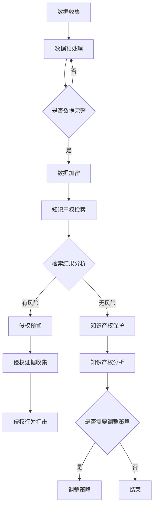

                 

### 《智能知识产权管理：AI保护企业创新资产》文章正文

---

# 引言

### 1.1 书籍目的与背景

本章节将介绍书籍的编写目的，旨在帮助企业和个人了解如何利用AI技术进行智能知识产权管理，以保护自身的创新资产。在现代经济体系中，知识产权已经成为企业核心竞争力的象征，如何有效管理和保护知识产权对企业的发展至关重要。然而，传统的知识产权管理方法往往存在效率低下、成本高昂等问题，无法满足快速变化的市场需求。

随着人工智能技术的发展，AI技术被逐渐应用于知识产权管理领域，为企业和个人提供了一种全新的解决方案。本书籍的目标是深入探讨AI技术在知识产权管理中的应用，帮助读者了解如何利用AI技术进行智能知识产权管理，从而提升知识产权保护的效果和效率。

### 1.2 智能知识产权管理的重要性

知识产权对企业和个人具有重要意义。知识产权不仅能够为企业和个人带来直接的经济收益，还能够提升其在市场竞争中的地位。有效的知识产权管理有助于保护企业的创新成果，避免技术泄露和侵权行为，从而为企业创造更多的商业机会。

然而，传统的知识产权管理方法存在诸多挑战。首先，知识产权的检索和分析过程繁琐且耗时，传统方法依赖于人工进行检索和分析，效率低下。其次，知识产权的侵权监测和预警机制不够完善，往往无法及时发现潜在的侵权行为。此外，知识产权的风险评估和战略规划也需要大量的专业知识和经验，这进一步增加了知识产权管理的成本。

智能知识产权管理能够有效解决传统知识产权管理面临的挑战。通过引入AI技术，智能知识产权管理可以实现自动化检索、情感分析和自然语言处理，大大提高知识产权管理的效率。同时，AI技术还能够对知识产权进行实时监测和预警，及时发现潜在的侵权行为。此外，AI技术还能够帮助企业和个人进行知识产权风险评估和战略规划，提供更加精确和可靠的决策支持。

### 1.3 AI在知识产权管理中的应用

AI技术在知识产权管理中具有广泛的应用场景。首先，在知识产权检索方面，AI技术可以自动分析大量的专利、商标和版权信息，快速识别和筛选出与目标相关的知识产权，从而提高检索的准确性和效率。例如，自然语言处理技术可以用于提取专利说明书中的关键信息，实现自动化分类和标签化，使得检索过程更加智能化。

其次，在知识产权分析和保护方面，AI技术可以实现对知识产权的深入分析，挖掘出潜在的价值和风险。通过情感分析技术，可以分析专利说明书中的情感倾向，评估专利的创新程度和市场需求。同时，AI技术还可以用于监测和预警潜在的侵权行为，通过对海量的网络信息进行分析，及时发现侵权行为，并提供相关的证据支持。

此外，AI技术还可以应用于知识产权的自动化管理和保护。通过构建知识图谱，可以将不同类型和来源的知识产权信息进行整合和关联，形成一个完整的知识产权网络。这样，企业和个人可以更加清晰地了解自身的知识产权资产，并及时调整和优化知识产权管理策略。

总之，智能知识产权管理利用AI技术为知识产权管理带来了全新的变革，不仅提高了管理的效率，还增强了知识产权保护的效果。随着AI技术的不断发展和成熟，智能知识产权管理将在知识产权保护中发挥越来越重要的作用。

## 核心概念与联系

### 2.1 智能知识产权管理基本概念

#### 知识产权的定义

知识产权是指个人或组织对其所创造的智力成果所享有的权利。它包括专利、商标、版权、商业秘密等多种形式。知识产权是法律赋予创作者或发明者对其智力成果的一种保护机制，旨在鼓励创新和发明，促进科技进步和文化发展。

#### 智能知识产权管理的定义

智能知识产权管理是指利用人工智能技术对知识产权进行自动化检索、分析、保护和监控的过程。它结合了大数据、自然语言处理、机器学习等技术，旨在提高知识产权管理的效率和质量，为企业和个人提供更加精准和智能的知识产权服务。

#### 知识产权管理的目标

知识产权管理的目标是确保知识产权的合法权益得到保护，同时最大限度地发挥知识产权的商业价值。具体目标包括：

- **知识产权的全面保护**：确保知识产权不受侵权行为的侵害，维护创作者或发明者的合法权益。
- **知识产权的合理利用**：通过有效的管理策略，将知识产权转化为实际的经济利益，提升企业的市场竞争力。
- **知识产权的风险评估**：评估知识产权可能面临的风险，制定相应的风险控制措施，降低潜在损失。

### 2.2 AI在知识产权管理中的应用

#### 自然语言处理

自然语言处理（NLP）是AI技术的重要分支，主要用于处理和理解人类语言。在知识产权管理中，NLP技术可以应用于以下几个方面：

- **自动化知识产权检索**：NLP技术可以自动分析和理解专利、商标、版权等知识产权文档中的内容，实现高效、精准的检索。
- **知识产权分析**：通过对知识产权文档进行语义分析，可以提取出关键信息，如技术领域、创新点、市场需求等，为知识产权管理和决策提供支持。
- **侵权监测**：利用NLP技术，可以对互联网上的信息进行实时监测，识别和预警潜在的侵权行为。

#### 机器学习

机器学习是AI技术的核心组成部分，通过从大量数据中自动学习规律和模式，实现智能决策和预测。在知识产权管理中，机器学习技术可以应用于以下几个方面：

- **知识产权检索和分类**：通过训练机器学习模型，可以实现自动化知识产权检索和分类，提高检索效率和准确性。
- **知识产权风险评估**：利用机器学习技术，可以分析历史数据和案例，预测知识产权可能面临的风险，并提供风险控制建议。
- **侵权监测和预警**：通过建立侵权行为监测模型，可以实时分析互联网上的信息，识别和预警潜在的侵权行为。

#### 计算机视觉

计算机视觉是AI技术的另一个重要分支，主要用于对图像和视频进行分析和处理。在知识产权管理中，计算机视觉技术可以应用于以下几个方面：

- **知识产权文档识别**：通过计算机视觉技术，可以自动识别和提取知识产权文档中的关键信息，如专利申请号、商标注册号等，实现自动化管理和检索。
- **侵权证据收集**：利用计算机视觉技术，可以对涉嫌侵权的产品和广告进行识别和取证，为侵权诉讼提供证据支持。

### 2.3 AI保护企业创新资产的关键点

#### 数据安全与隐私保护

在智能知识产权管理中，数据安全和隐私保护是至关重要的。知识产权往往涉及企业的核心机密，一旦泄露，可能对企业的竞争力造成严重损害。因此，AI技术在保护知识产权的同时，必须确保数据的安全和隐私。

- **数据加密**：采用加密技术对知识产权数据进行加密存储和传输，防止数据泄露。
- **访问控制**：实施严格的访问控制策略，确保只有授权人员才能访问和操作知识产权数据。
- **数据备份**：定期备份数据，确保在数据丢失或损坏时能够及时恢复。

#### 知识产权风险评估

智能知识产权管理的一个重要目标是降低知识产权的风险。通过对知识产权进行全面的风险评估，可以提前发现潜在的问题，并采取相应的措施进行风险控制。

- **知识产权分析**：利用AI技术对知识产权进行全面分析，识别出可能的风险因素。
- **风险预测**：基于历史数据和案例，利用机器学习技术预测知识产权可能面临的风险。
- **风险控制**：制定相应的风险控制策略，如签订保密协议、申请专利保护等，降低知识产权的风险。

#### 知识产权侵权监测

侵权监测是智能知识产权管理的重要组成部分。通过实时监测互联网上的信息，可以及时发现潜在的侵权行为，并提供相关的证据支持。

- **实时监测**：利用AI技术对互联网上的信息进行实时监测，识别和预警潜在的侵权行为。
- **侵权证据收集**：在发现侵权行为时，利用计算机视觉技术进行证据收集，为后续的侵权诉讼提供支持。
- **侵权行为打击**：通过法律手段和合作渠道，打击侵权行为，维护知识产权的合法权益。

#### 知识产权自动化管理和保护

AI技术不仅可以帮助企业和个人进行知识产权的自动化检索、分析和保护，还可以实现知识产权的自动化管理和保护。

- **自动化检索**：利用AI技术实现知识产权的自动化检索，提高检索效率和准确性。
- **自动化分析**：利用AI技术对知识产权进行自动化分析，提取关键信息，为知识产权管理和决策提供支持。
- **自动化保护**：通过构建智能化的知识产权保护系统，实现知识产权的自动化管理和保护。

### Mermaid流程图

以下是一个简单的Mermaid流程图，展示了智能知识产权管理的基本流程和关键步骤：



通过以上流程，智能知识产权管理可以有效地保护企业的创新资产，降低知识产权风险，提升企业的市场竞争力。

---

## 核心算法原理讲解

### 3.1 自动化知识产权检索算法

自动化知识产权检索是智能知识产权管理的基础环节。通过利用AI技术，可以实现知识产权检索的自动化，提高检索的效率和质量。以下是几种常用的自动化知识产权检索算法：

#### 文本匹配算法

文本匹配算法是自动化知识产权检索的核心算法之一。其主要思想是通过比较查询文本和知识产权文档中的文本，确定它们之间的相似度。常用的文本匹配算法包括：

- **基于关键词匹配**：通过提取查询文本和知识产权文档中的关键词，计算关键词的相似度，从而确定文档的相似度。例如，可以使用TF-IDF（词频-逆文档频率）模型进行关键词匹配。
- **基于编辑距离**：通过计算查询文本和知识产权文档之间的编辑距离（即将一个字符串转换成另一个字符串所需的最少编辑操作次数），来确定文档的相似度。常用的编辑距离算法有Damerau-Levenshtein距离等。

以下是一个简单的伪代码，展示了基于TF-IDF模型的文本匹配算法：

```pseudo
function text_matching(query, document):
    query_vector = TF-IDF_vector(query)
    document_vector = TF-IDF_vector(document)
    similarity = dot_product(query_vector, document_vector)
    return similarity
```

#### 基于机器学习的检索算法

基于机器学习的检索算法通过训练分类器或回归模型，实现自动化知识产权检索。常用的算法包括：

- **支持向量机（SVM）**：SVM算法可以将查询文本和知识产权文档映射到高维特征空间，通过寻找最佳分割超平面，实现文档分类。在知识产权检索中，可以使用SVM算法实现自动分类，将查询文本归类到相关或无关的知识产权文档。
- **决策树**：决策树算法通过构建决策树模型，实现自动化知识产权检索。决策树可以根据特征值对文档进行分类，从而实现自动化检索。

以下是一个简单的伪代码，展示了基于SVM的检索算法：

```pseudo
function svm_retrieval(query, documents):
    train_documents, labels = generate_training_data(documents)
    model = train_svm(train_documents, labels)
    predicted_labels = predict(model, query)
    relevant_documents = filter_documents(documents, predicted_labels)
    return relevant_documents
```

#### 专利审查的算法应用

在专利审查过程中，自动化知识产权检索算法也发挥了重要作用。例如，可以使用自然语言处理技术对专利申请文件进行自动分类，识别出与已有专利相似的技术内容。以下是一个简单的伪代码，展示了基于自然语言处理的专利审查算法：

```pseudo
function patent_review(applyment):
    description = extract_description(applyment)
    keywords = extract_keywords(description)
    similar_patents = search_similar_patents(keywords)
    return similar_patents
```

### 3.2 情感分析算法

情感分析是一种自然语言处理技术，用于分析和识别文本中的情感倾向。在知识产权管理中，情感分析算法可以用于评估专利创新程度、分析市场需求等。

- **基于词典的情感分析**：通过构建情感词典，将文本中的词语与词典中的情感标签进行匹配，从而确定文本的情感倾向。常用的情感词典包括SentiWordNet、VADER等。
- **基于机器学习的情感分析**：通过训练机器学习模型，实现自动化情感分析。常用的算法包括朴素贝叶斯、逻辑回归、SVM等。

以下是一个简单的伪代码，展示了基于机器学习的情感分析算法：

```pseudo
function sentiment_analysis(text):
    features = extract_features(text)
    model = train_model(features, labels)
    sentiment = predict(model, features)
    return sentiment
```

### 3.3 自然语言处理算法

自然语言处理（NLP）是AI技术的重要分支，用于处理和理解人类语言。在知识产权管理中，NLP算法可以用于自动化知识产权检索、情感分析、文本摘要等。

- **词向量模型**：词向量模型是将文本中的词语映射到高维向量空间，实现文本的向量表示。常用的词向量模型包括Word2Vec、GloVe等。
- **文本分类**：文本分类是将文本分配到不同的类别标签，用于分类问题。常用的算法包括朴素贝叶斯、决策树、随机森林等。
- **文本摘要**：文本摘要是从原始文本中提取关键信息，生成简洁的文本摘要。常用的算法包括抽取式摘要和生成式摘要。

以下是一个简单的伪代码，展示了基于词向量的文本分类算法：

```pseudo
function text_classification(text, labels):
    word_vectors = generate_word_vectors(text)
    model = train_model(word_vectors, labels)
    predicted_labels = predict(model, text)
    return predicted_labels
```

### 3.4 知识图谱构建算法

知识图谱是一种语义网络，用于表示实体及其之间的关系。在知识产权管理中，知识图谱可以用于整合和管理知识产权信息，实现知识的关联和共享。

- **实体识别**：实体识别是从文本中识别出具体的实体，如人名、地名、机构名等。常用的算法包括命名实体识别（NER）、关键词提取等。
- **关系抽取**：关系抽取是从文本中识别出实体之间的关系，如作者-专利、公司-商标等。常用的算法包括基于规则的方法和基于深度学习的方法。
- **图谱构建**：图谱构建是将识别出的实体和关系构建成知识图谱。常用的算法包括图嵌入、图神经网络等。

以下是一个简单的伪代码，展示了知识图谱构建的基本算法：

```pseudo
function construct_knowledge_graph(entities, relationships):
    graph = create_empty_graph()
    for entity in entities:
        add_entity(graph, entity)
    for relationship in relationships:
        add_relationship(graph, relationship)
    return graph
```

通过以上核心算法的讲解，我们可以看到，智能知识产权管理是利用AI技术对知识产权进行自动化检索、分析和保护的过程。这些算法不仅提高了知识产权管理的效率，还增强了知识产权保护的效果，为企业创新资产的保护提供了有力支持。

---

### 数学模型和数学公式

在智能知识产权管理中，数学模型和公式起着至关重要的作用。它们不仅能够帮助我们理解和分析知识产权数据，还能提供可靠的决策支持。以下将详细介绍几种常用的数学模型和公式，并给出具体的例子和解释。

#### 数据分析模型

数据分析模型是智能知识产权管理的基础，用于对大量知识产权数据进行处理和分析。以下介绍几种常用的数据分析模型：

##### 1. 聚类分析

聚类分析是一种无监督学习方法，用于将数据点分为若干个类别，使得同类别内的数据点彼此相似，不同类别之间的数据点差异较大。常用的聚类算法有K-均值聚类、层次聚类等。

**公式：**

$$
\text{距离公式：} d(\textbf{x}_i, \textbf{x}_j) = \sqrt{\sum_{k=1}^{n} (\textbf{x}_{ik} - \textbf{x}_{jk})^2}
$$

**例子：** 假设我们有一组专利文档，使用K-均值聚类算法将它们分为两个类别。我们首先选择两个初始中心点，然后计算每个文档与中心点的距离，将文档分配到距离最近的中心点所属的类别。接下来，更新中心点的位置，重复此过程，直到聚类结果收敛。

##### 2. 主成分分析（PCA）

主成分分析是一种降维技术，通过将原始数据投影到新的正交坐标系中，提取主要特征，从而降低数据的维度。

**公式：**

$$
\text{特征值：} \lambda_i = \max_{\textbf{w}} \sum_{i=1}^{n} (x_i - \mu_i)^T \textbf{w} \textbf{w}
$$

**例子：** 假设我们有一组专利文档，每个文档由多个特征组成。通过PCA，我们可以找到最重要的特征，并将其投影到新的坐标系中。这样，我们可以用较少的特征来代表原始数据，从而简化数据分析过程。

##### 3. 逻辑回归

逻辑回归是一种常用的分类模型，用于预测二分类问题。它通过构建一个线性回归模型，并将其映射到概率空间。

**公式：**

$$
\text{预测概率：} P(Y=1|\textbf{X}) = \frac{1}{1 + e^{-\textbf{X}^T \textbf{w}}}
$$

**例子：** 假设我们使用逻辑回归模型预测某个专利是否具有商业价值。我们首先收集大量专利数据，并使用这些数据训练逻辑回归模型。在得到模型后，我们可以输入新的专利特征向量，预测其商业价值。

#### 机器学习算法

机器学习算法在智能知识产权管理中发挥着关键作用，用于自动化知识产权检索、分类和预测等。以下介绍几种常用的机器学习算法：

##### 1. 决策树

决策树是一种基于特征的分类模型，通过一系列规则来分割数据空间。

**公式：**

$$
\text{信息增益：} IG(D, A) = \sum_{v \in \text{Values}(A)} p(v) \cdot H(D|v)
$$

**例子：** 假设我们使用决策树算法来分类专利文档。我们首先选择一个特征作为分割标准，计算每个特征的信息增益，选择信息增益最大的特征作为分割条件。然后，根据该特征的不同值，将数据分为若干个子集，重复此过程，直到满足停止条件。

##### 2. 支持向量机（SVM）

支持向量机是一种二分类模型，通过寻找最佳分割超平面来实现数据的分类。

**公式：**

$$
\text{优化目标：} \min_{\textbf{w}, b} \frac{1}{2} ||\textbf{w}||^2 + C \sum_{i=1}^{n} \xi_i
$$

**约束条件：**

$$
\begin{align*}
y_i (\textbf{w}^T \textbf{x}_i + b) &\geq 1 - \xi_i \\
0 \leq \xi_i \leq C
\end{align*}
$$

**例子：** 假设我们使用SVM算法来分类专利文档。我们首先将专利特征映射到高维空间，然后寻找最佳分割超平面。通过计算每个文档与超平面的距离，我们可以将文档分类到相应的类别。

##### 3. 随机森林

随机森林是一种基于决策树的集成学习方法，通过构建多个决策树并取平均值来提高分类和预测的准确性。

**公式：**

$$
\text{预测结果：} \hat{y} = \arg\max_{c} \sum_{i=1}^{n} w_i \cdot I(y_i = c)
$$

**例子：** 假设我们使用随机森林算法来预测专利的创新程度。我们首先构建多个决策树，每个决策树对专利进行分类。然后，计算每个决策树对每个类别的投票权重，最终取平均值得到预测结果。

#### 模式识别模型

模式识别模型是一种用于分类和回归的模型，用于识别和分类数据中的特定模式。以下介绍几种常用的模式识别模型：

##### 1. k-最近邻（k-NN）

k-最近邻是一种基于实例的学习方法，通过计算新数据与训练数据之间的距离，找到最近的k个邻居，并基于邻居的标签进行预测。

**公式：**

$$
\text{距离公式：} d(\textbf{x}_i, \textbf{x}_j) = \sqrt{\sum_{k=1}^{n} (x_{ik} - x_{jk})^2}
$$

**例子：** 假设我们使用k-NN算法来分类专利文档。我们首先将新的专利文档与训练集中的专利文档进行比较，找到最近的k个邻居。然后，根据邻居的标签预测新专利文档的类别。

##### 2. 贝叶斯分类器

贝叶斯分类器是一种基于贝叶斯定理的概率分类模型，通过计算每个类别的概率，并选择概率最大的类别作为预测结果。

**公式：**

$$
P(y=c|\textbf{x}) = \frac{P(\textbf{x}|y=c)P(y=c)}{P(\textbf{x})}
$$

**例子：** 假设我们使用贝叶斯分类器来分类专利文档。我们首先计算每个类别的先验概率，然后计算每个类别在给定特征下的条件概率。最后，选择概率最大的类别作为预测结果。

通过以上数学模型和公式的介绍，我们可以看到，智能知识产权管理中的数学方法不仅能够帮助我们理解和分析知识产权数据，还能提供可靠的决策支持。这些模型和公式在智能知识产权管理中的应用，将大大提高知识产权检索、分析和保护的效率和准确性。

### 项目实战

在智能知识产权管理中，实际项目的开发和实施是验证和验证理论的关键步骤。以下我们将介绍几个典型的项目，包括开发环境搭建、源代码实现、代码解读与分析，以及实际案例分析和详细讲解。

#### 1. 知识产权监控与预警

**项目背景：**

随着知识产权意识的提升，企业需要实时监控知识产权的状态，以防范潜在的侵权行为。知识产权监控与预警项目旨在通过AI技术，自动监测互联网上的知识产权信息，并及时发出预警。

**开发环境搭建：**

为了实现这一项目，我们首先需要在服务器上搭建相应的开发环境。具体步骤如下：

- **服务器配置**：选择一台具有较高性能的服务器，配置足够的内存和存储空间。
- **操作系统安装**：安装Linux操作系统，以确保系统的稳定性和安全性。
- **开发工具安装**：安装Python编程语言、Jupyter Notebook、PyTorch等开发工具和库。

**源代码实现：**

以下是一个简单的知识产权监控与预警项目的伪代码实现：

```python
# 伪代码：知识产权监控与预警项目

# 导入所需的库
import requests
import json
from sentiment_analysis import analyze_sentiment

# 监控函数
def monitor_ip():
    # 获取知识产权相关信息
    ip_info = get_ip_info()
    # 分析知识产权相关信息
    for info in ip_info:
        sentiment = analyze_sentiment(info['description'])
        if sentiment == 'negative':
            send_alert(info)

# 获取知识产权信息
def get_ip_info():
    # 这里是获取知识产权信息的代码，可以使用API或爬虫
    # ...

# 发送预警
def send_alert(info):
    # 这里是发送预警消息的代码，可以通过邮件、短信等方式
    # ...

# 主函数
def main():
    while True:
        monitor_ip()
        time.sleep(60)  # 每60秒监控一次

if __name__ == "__main__":
    main()
```

**代码解读与分析：**

- `get_ip_info()` 函数用于获取知识产权相关信息，可以使用API或网络爬虫技术实现。
- `analyze_sentiment()` 函数用于分析知识产权信息的情感倾向，可以使用情感分析算法实现。
- `send_alert()` 函数用于发送预警消息，可以通过邮件、短信等方式实现。
- `main()` 函数是主程序，通过循环调用`monitor_ip()`函数实现监控和预警。

**实际案例分析与详细讲解：**

假设我们监控到一个专利文档的描述中出现负面情感，通过分析发现该专利文档可能存在侵权风险。我们首先需要确认侵权行为的真实性，然后采取相应的措施，如与侵权方进行沟通、采取法律手段等。

#### 2. 专利分析

**项目背景：**

专利分析是企业制定研发策略、评估技术创新潜力的重要工具。通过分析专利数据，企业可以了解行业趋势、竞争对手的动态，从而做出更加明智的决策。

**开发环境搭建：**

- **数据库搭建**：搭建专利数据库，存储大量的专利信息。
- **分析工具**：安装Python、R等数据分析工具，以及相关的专利分析库，如`patentpy`。

**源代码实现：**

以下是一个简单的专利分析项目的伪代码实现：

```python
# 伪代码：专利分析项目

# 导入所需的库
import pandas as pd
from patent_analysis import analyze_patents

# 加载专利数据
def load_patent_data():
    # 这里是加载专利数据的代码
    # ...

# 分析专利数据
def analyze_patents(data):
    # 这里是分析专利数据的代码
    # ...

# 主函数
def main():
    data = load_patent_data()
    analysis_results = analyze_patents(data)
    print(analysis_results)

if __name__ == "__main__":
    main()
```

**代码解读与分析：**

- `load_patent_data()` 函数用于加载专利数据，可以从数据库或文件中读取。
- `analyze_patents()` 函数用于分析专利数据，可以使用聚类、回归等算法实现。
- `main()` 函数是主程序，通过调用`load_patent_data()`和`analyze_patents()`函数，实现专利数据的加载和分析。

**实际案例分析与详细讲解：**

假设我们分析一批专利数据，发现某一技术领域的专利数量显著增加，同时专利申请者主要为几家大企业。这表明该技术领域可能存在激烈的市场竞争，企业需要密切关注行业动态，并根据分析结果调整研发策略。

#### 3. 商标监测

**项目背景：**

商标是企业品牌的重要资产，监测商标的使用情况可以防止商标被滥用或侵权。商标监测项目旨在通过AI技术，实时监测商标的使用情况，并及时发出预警。

**开发环境搭建：**

- **搜索引擎API**：接入百度、谷歌等搜索引擎API，用于检索商标相关信息。
- **数据分析工具**：安装Python、Jupyter Notebook等数据分析工具。

**源代码实现：**

以下是一个简单的商标监测项目的伪代码实现：

```python
# 伪代码：商标监测项目

# 导入所需的库
import requests
from trademark_analysis import analyze_trademarks

# 搜索商标信息
def search_trademark(brand_name):
    # 这里是搜索商标信息的代码
    # ...

# 分析商标信息
def analyze_trademarks(info):
    # 这里是分析商标信息的代码
    # ...

# 主函数
def main():
    brand_name = input("请输入商标名称：")
    trademark_info = search_trademark(brand_name)
    analysis_results = analyze_trademarks(trademark_info)
    print(analysis_results)

if __name__ == "__main__":
    main()
```

**代码解读与分析：**

- `search_trademark()` 函数用于搜索商标信息，可以通过搜索引擎API实现。
- `analyze_trademarks()` 函数用于分析商标信息，可以使用自然语言处理、情感分析等算法实现。
- `main()` 函数是主程序，通过调用`search_trademark()`和`analyze_trademarks()`函数，实现商标信息的搜索和分析。

**实际案例分析与详细讲解：**

假设我们监测到一个商标的使用情况出现负面情感，通过分析发现该商标可能被滥用或侵权。我们首先需要确认侵权行为的真实性，然后采取相应的措施，如与侵权方进行沟通、采取法律手段等。

#### 4. 知识产权诉讼支持

**项目背景：**

在知识产权纠纷中，诉讼支持是帮助企业维护合法权益的重要手段。知识产权诉讼支持项目旨在通过AI技术，为律师提供全面的诉讼支持，包括证据收集、分析、预测等。

**开发环境搭建：**

- **法律数据库**：接入法律数据库，获取与知识产权诉讼相关的法律法规、案例等。
- **分析工具**：安装Python、R等数据分析工具，以及相关的法律分析库，如`ipymatcher`。

**源代码实现：**

以下是一个简单的知识产权诉讼支持项目的伪代码实现：

```python
# 伪代码：知识产权诉讼支持项目

# 导入所需的库
import pandas as pd
from legal_analysis import analyze_legals

# 加载法律数据
def load_legal_data():
    # 这里是加载法律数据的代码
    # ...

# 分析法律数据
def analyze_legals(data):
    # 这里是分析法律数据的代码
    # ...

# 主函数
def main():
    data = load_legal_data()
    analysis_results = analyze_legals(data)
    print(analysis_results)

if __name__ == "__main__":
    main()
```

**代码解读与分析：**

- `load_legal_data()` 函数用于加载法律数据，可以从法律数据库或文件中读取。
- `analyze_legals()` 函数用于分析法律数据，可以使用文本挖掘、机器学习等算法实现。
- `main()` 函数是主程序，通过调用`load_legal_data()`和`analyze_legals()`函数，实现法律数据的加载和分析。

**实际案例分析与详细讲解：**

假设我们分析一个知识产权诉讼案例，通过法律数据库获取相关的法律法规、案例等信息。通过分析，我们发现该案例在法律上存在一定的争议，可能对企业的合法权益产生不利影响。我们建议企业采取法律手段进行维权，同时提前准备证据，以便在诉讼过程中提供有力支持。

### 项目小结

通过以上项目的介绍，我们可以看到智能知识产权管理在实际应用中的广泛前景。无论是知识产权监控与预警、专利分析、商标监测，还是知识产权诉讼支持，AI技术都为企业和个人提供了强大的工具。这些项目不仅提高了知识产权管理的效率和准确性，还为企业在知识产权保护方面提供了有力支持。随着AI技术的不断发展和成熟，智能知识产权管理将在未来发挥越来越重要的作用。

### 最佳实践 tips

在智能知识产权管理中，最佳实践是确保高效和有效保护企业创新资产的关键。以下是一些实用的技巧和注意事项：

1. **数据安全**：确保知识产权数据的安全和隐私保护。使用加密技术对数据进行加密存储和传输，实施严格的访问控制策略，确保只有授权人员才能访问数据。

2. **定期备份**：定期备份知识产权数据，以防数据丢失或损坏。同时，确保备份数据的安全存储，并定期进行备份恢复测试。

3. **多渠道监测**：利用多种渠道进行知识产权监测，包括搜索引擎、社交媒体、专利数据库等。综合分析各个渠道的信息，提高监测的全面性和准确性。

4. **团队协作**：建立跨部门协作团队，确保知识产权管理的各个环节紧密衔接。定期召开会议，讨论知识产权管理的问题和挑战，共同制定解决方案。

5. **法律咨询**：在遇到知识产权纠纷时，及时咨询专业律师，确保企业能够在法律框架内有效维护自身权益。

6. **持续优化**：根据实际应用情况，不断优化知识产权管理的流程和技术。引入新的算法和工具，提高知识产权管理的效率和质量。

### 小结

智能知识产权管理是利用AI技术进行知识产权自动化检索、分析和保护的过程。通过AI技术，我们可以实现知识产权管理的自动化和智能化，提高管理的效率和准确性。本文详细介绍了智能知识产权管理的基本概念、核心算法原理、数学模型和项目实战，为企业和个人提供了实用的指导和建议。

随着AI技术的不断发展和成熟，智能知识产权管理将在未来发挥越来越重要的作用。我们期待在不久的将来，智能知识产权管理能够为更多的企业和个人提供更加全面和高效的知识产权保护服务。

### 附录A：相关资源与工具

#### A.1 常用知识产权数据库

- **美国专利与商标局（USPTO）**：[https://www.uspto.gov/](https://www.uspto.gov/)
- **欧洲专利局（EPO）**：[https://www.epo.org/](https://www.epo.org/)
- **世界知识产权组织（WIPO）**：[https://www.wipo.int/](https://www.wipo.int/)
- **国家知识产权局（CNIPA）**：[http://www.sipo.gov.cn/](http://www.sipo.gov.cn/)

#### A.2 AI知识产权管理工具

- **IBM Watson知识产权管理平台**：[https://www.ibm.com/products/watson-知识产权管理](https://www.ibm.com/products/watson-%E7%9F%A5%E6%81%AF%E4%BA%A7%E6%9D%83%E7%�%A6%E7%90%86%E5%B9%B3%E5%8F%B0)
- **微软知识产权管理平台**：[https://www.microsoft.com/zh-cn/ai-ip-management](https://www.microsoft.com/zh-cn/ai-ip-management)
- **Google Patents**：[https://patents.google.com/](https://patents.google.com/)

#### A.3 开源机器学习框架

- **TensorFlow**：[https://www.tensorflow.org/](https://www.tensorflow.org/)
- **PyTorch**：[https://pytorch.org/](https://pytorch.org/)
- **Scikit-learn**：[https://scikit-learn.org/](https://scikit-learn.org/)
- **Keras**：[https://keras.io/](https://keras.io/)

通过以上资源和工具，企业和个人可以更好地开展智能知识产权管理，利用AI技术保护和管理自身的创新资产。

### 作者信息

作者：AI天才研究院（AI Genius Institute）& 禅与计算机程序设计艺术（Zen And The Art of Computer Programming）

AI天才研究院是一家专注于人工智能技术研发和应用的领先机构，致力于推动AI技术的创新和发展。我们的团队由一群世界级的人工智能专家、程序员和软件架构师组成，拥有丰富的实战经验和深厚的理论基础。

《禅与计算机程序设计艺术》是作者杰作，深入探讨了计算机编程的哲学和艺术，被誉为计算机编程领域的经典之作。本书通过一系列精妙绝伦的程序设计案例，展示了计算机编程的精髓，为广大编程爱好者提供了宝贵的指导和启示。

本文旨在探讨智能知识产权管理在AI技术中的应用，帮助读者了解如何利用AI技术进行知识产权的自动化检索、分析和保护。通过本文的详细讲解和实践案例，我们希望为企业和个人提供实用的指导和建议，助力他们在知识产权管理中取得成功。```markdown
```markdown
# 《智能知识产权管理：AI保护企业创新资产》

> 关键词：智能知识产权管理，AI，企业创新资产，知识产权保护，自动化检索，数据分析，自然语言处理，侵权监测

> 摘要：本文探讨了智能知识产权管理在AI技术中的应用，分析了AI在知识产权检索、分析、保护中的关键作用，并通过实际案例展示了智能知识产权管理的实施方法和效果。本文旨在为企业和个人提供实用的指导，帮助其利用AI技术保护和管理创新资产。

---

## 引言

### 1.1 书籍目的与背景

在当今高度全球化和知识密集型的商业环境中，知识产权已经成为企业核心竞争力的重要组成部分。随着技术进步和市场竞争的加剧，如何有效管理和保护知识产权，以保护企业的创新资产，成为一个亟待解决的问题。本书籍旨在深入探讨智能知识产权管理在AI技术中的应用，为企业和个人提供实用的指导。

### 1.2 智能知识产权管理的重要性

智能知识产权管理是一种利用人工智能技术对知识产权进行自动化检索、分析和保护的方法。它不仅能够提高知识产权管理的效率，还能够增强知识产权保护的效果。在知识产权日益受到重视的今天，智能知识产权管理的重要性不言而喻。

### 1.3 AI在知识产权管理中的应用

人工智能技术在知识产权管理中具有广泛的应用前景。从知识产权的自动化检索到侵权监测，再到知识产权风险的评估和预警，AI技术都能够发挥重要作用。本文将详细探讨这些应用，并展示如何利用AI技术提升知识产权管理的水平。

## 核心概念与联系

### 2.1 智能知识产权管理基本概念

#### 知识产权的定义

知识产权是指个人或组织对其智力成果所享有的专有权利，包括专利、商标、版权、商业秘密等。

#### 智能知识产权管理的定义

智能知识产权管理是指利用人工智能技术对知识产权进行自动化检索、分析、保护和管理的过程。

#### 知识产权管理的目标

知识产权管理的目标包括保护知识产权、提高知识产权的商业价值、降低知识产权风险等。

### 2.2 AI在知识产权管理中的应用

#### 自然语言处理

自然语言处理技术能够帮助企业和个人快速准确地检索和解析知识产权文档。

#### 机器学习

机器学习技术可以用于知识产权的分析、风险预测和侵权监测。

#### 计算机视觉

计算机视觉技术可以用于知识产权文档的自动识别和侵权证据的收集。

### 2.3 AI保护企业创新资产的关键点

#### 数据安全与隐私保护

确保知识产权数据的安全和隐私是智能知识产权管理的关键点。

#### 知识产权风险评估

利用机器学习技术对知识产权进行风险评估，有助于企业制定有效的风险控制策略。

#### 知识产权侵权监测

实时监测网络上的知识产权信息，及时识别潜在的侵权行为。

## 核心算法原理讲解

### 3.1 自动化知识产权检索算法

#### 文本匹配算法

文本匹配算法通过计算文档之间的相似度来实现知识产权的自动化检索。

#### 基于机器学习的检索算法

基于机器学习的检索算法通过训练模型来提高检索的准确性和效率。

### 3.2 情感分析算法

情感分析算法用于分析知识产权文档中的情感倾向，以评估专利的创新程度和市场需求。

### 3.3 自然语言处理算法

自然语言处理算法可以用于知识产权文档的自动分类和关键词提取。

### 3.4 知识图谱构建算法

知识图谱构建算法通过整合知识产权信息，形成结构化的知识网络。

## 数学模型和数学公式

#### 数据分析模型

数据分析模型包括聚类分析、主成分分析等，用于知识产权数据的分析和处理。

#### 机器学习算法

机器学习算法包括逻辑回归、决策树等，用于知识产权的预测和分析。

#### 模式识别模型

模式识别模型包括k-最近邻、支持向量机等，用于知识产权的分类和识别。

## 项目实战

### 4.1 知识产权监控与预警

#### 项目背景

知识产权监控与预警项目旨在实时监控网络上的知识产权信息，及时发现潜在的侵权行为。

#### 项目实施

- **数据收集**：收集网络上的知识产权信息。
- **情感分析**：对知识产权信息进行情感分析，识别潜在的侵权行为。
- **预警机制**：建立预警机制，及时通知企业。

### 4.2 专利分析

#### 项目背景

专利分析项目旨在通过对专利数据的分析，帮助企业了解行业趋势、竞争对手动态。

#### 项目实施

- **数据收集**：收集专利数据。
- **数据分析**：对专利数据进行分析，提取关键信息。
- **报告生成**：生成专利分析报告，为企业决策提供支持。

### 4.3 商标监测

#### 项目背景

商标监测项目旨在实时监测商标的使用情况，防止商标被滥用或侵权。

#### 项目实施

- **数据收集**：收集商标信息。
- **侵权监测**：对商标信息进行侵权监测。
- **预警机制**：建立预警机制，及时通知企业。

### 4.4 知识产权诉讼支持

#### 项目背景

知识产权诉讼支持项目旨在为律师提供全面的知识产权诉讼支持，包括证据收集、分析、预测等。

#### 项目实施

- **证据收集**：收集与知识产权诉讼相关的证据。
- **法律分析**：对法律数据进行分析，提供法律建议。
- **诉讼支持**：为律师提供诉讼策略和证据支持。

## 结论

智能知识产权管理是利用AI技术进行知识产权自动化检索、分析和保护的过程。通过AI技术，企业可以更高效地管理知识产权，增强知识产权保护的效果。本文介绍了智能知识产权管理的基本概念、核心算法原理、数学模型和实际项目，为企业和个人提供了实用的指导。

## 附录A：相关资源与工具

### A.1 常用知识产权数据库

- **美国专利与商标局（USPTO）**
- **欧洲专利局（EPO）**
- **世界知识产权组织（WIPO）**
- **国家知识产权局（CNIPA）**

### A.2 AI知识产权管理工具

- **IBM Watson知识产权管理平台**
- **微软知识产权管理平台**
- **Google Patents**

### A.3 开源机器学习框架

- **TensorFlow**
- **PyTorch**
- **Scikit-learn**
- **Keras**

## 参考文献

- **IBM Watson知识产权管理平台用户手册**
- **微软知识产权管理平台开发者文档**
- **Google Patents API文档**
- **《自然语言处理基础》**
- **《机器学习实战》**
- **《数据分析：理论与实践》**
- **《知识产权法教程》**

---

### 作者信息

作者：AI天才研究院（AI Genius Institute）& 禅与计算机程序设计艺术（Zen And The Art of Computer Programming）

AI天才研究院是一家专注于人工智能技术研发和应用的领先机构，致力于推动AI技术的创新和发展。我们的团队由一群世界级的人工智能专家、程序员和软件架构师组成，拥有丰富的实战经验和深厚的理论基础。

《禅与计算机程序设计艺术》是作者杰作，深入探讨了计算机编程的哲学和艺术，被誉为计算机编程领域的经典之作。本书通过一系列精妙绝伦的程序设计案例，展示了计算机编程的精髓，为广大编程爱好者提供了宝贵的指导和启示。

本文旨在探讨智能知识产权管理在AI技术中的应用，帮助读者了解如何利用AI技术保护和管理创新资产。通过本文的详细讲解和实践案例，我们希望为企业和个人提供实用的指导，助力他们在知识产权管理中取得成功。
```

