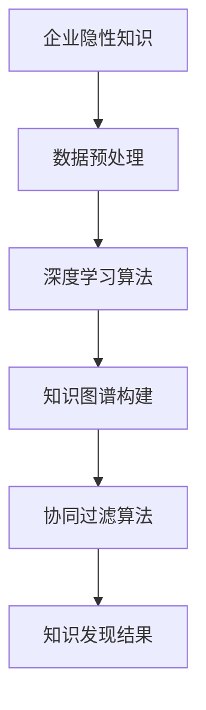

                 

### 文章标题：智能知识发现系统：挖掘企业隐性知识

#### 关键词：智能知识发现，企业隐性知识，深度学习算法，知识图谱，协同过滤

> 摘要：本文旨在探讨智能知识发现系统的设计与实现，重点关注如何挖掘企业隐性知识。通过详细阐述核心概念、算法原理、数学模型以及实际项目案例，本文揭示了智能知识发现系统在提升企业竞争力中的重要作用。

## 引言

在信息化时代，企业积累了大量非结构化和半结构化的数据，这些数据中蕴含着宝贵的隐性知识，对企业的决策和运营具有重要意义。然而，如何有效地挖掘和利用这些隐性知识，一直是企业面临的一大挑战。智能知识发现系统作为一种新兴的技术，旨在通过自动化和智能化的手段，挖掘企业数据中的隐性知识，为企业提供数据驱动的决策支持。

本文将围绕智能知识发现系统进行探讨，首先介绍系统的基础架构和核心概念，然后详细讲解深度学习算法、知识图谱构建算法以及协同过滤算法，最后通过一个实际项目案例，展示智能知识发现系统的开发与实现过程。

### 核心概念与联系

智能知识发现系统是一个复杂的技术体系，涉及到多个核心概念和算法。为了更好地理解这些概念和它们之间的关系，我们使用Mermaid流程图进行展示。



- **企业隐性知识**：这是智能知识发现系统的核心目标，指企业在日常运营中积累的，不易被编码和传播的知识。
- **数据预处理**：包括数据清洗、数据归一化和特征提取等步骤，为后续的算法处理提供高质量的数据。
- **深度学习算法**：用于从原始数据中自动提取特征，进行模式识别和预测。
- **知识图谱构建**：通过实体和关系来表示企业知识，构建一个结构化的知识库。
- **协同过滤算法**：用于根据用户历史行为和偏好，进行个性化推荐。
- **知识发现结果**：最终生成的知识发现结果，为企业决策提供支持。

### 核心算法原理讲解

智能知识发现系统的核心算法包括深度学习算法、知识图谱构建算法和协同过滤算法。以下将分别简要介绍这些算法的原理，并用伪代码展示算法流程。

#### 3.1 深度学习算法原理

深度学习算法基于多层神经网络，通过训练学习数据中的特征和模式。以下是一个简单的深度学习算法的伪代码：

```python
# 输入：训练数据集 X，标签 Y
# 输出：训练好的神经网络模型

def train_neural_network(X, Y):
    # 初始化模型参数
    model = initialize_parameters()
    
    # 前向传播
    for epoch in range(num_epochs):
        for x, y in zip(X, Y):
            output = forward_pass(x, model)
            
            # 计算损失
            loss = compute_loss(output, y)
            
            # 反向传播
            gradient = backward_pass(output, y, model)
            
            # 更新模型参数
            update_parameters(gradient)
    
    return model
```

#### 3.2 知识图谱构建算法

知识图谱构建算法通常包括实体识别、关系抽取和实体链接等步骤。以下是一个简单的知识图谱构建算法的伪代码：

```python
# 输入：文本数据 corpus
# 输出：知识图谱 KG

def buildKnowledgeGraph(corpus):
    entities = extract_entities(corpus)
    relationships = extract_relationships(corpus)
    KG = construct_graph(entities, relationships)
    return KG
```

#### 3.3 协同过滤算法

协同过滤算法通过用户的历史行为数据，预测用户对未知项目的偏好。以下是一个简单的基于矩阵分解的协同过滤算法的伪代码：

```python
# 输入：用户-项目评分矩阵 R
# 输出：预测的评分矩阵 \hat{R}

def collaborative_filtering(R):
    # 矩阵分解
    P, Q = matrix_factorization(R)
    
    # 预测评分
    \hat{R} = P * Q
    
    return \hat{R}
```

### 数学模型和数学公式 & 详细讲解 & 举例说明

在智能知识发现系统中，数学模型起着至关重要的作用。以下我们将选择基于矩阵分解的协同过滤算法中的一个重要数学模型进行详细讲解。

#### 4.1 矩阵分解

矩阵分解是一种常用的降维技术，可以将高维矩阵分解为两个低维矩阵的乘积。在协同过滤算法中，矩阵分解用于预测用户对未知项目的评分。

假设我们有一个用户-项目评分矩阵 \( R \)，其维度为 \( m \times n \)，其中 \( m \) 表示用户数，\( n \) 表示项目数。矩阵分解的目标是将 \( R \) 分解为两个低维矩阵 \( P \)（用户特征矩阵）和 \( Q \)（项目特征矩阵），其维度分别为 \( m \times k \) 和 \( n \times k \)，其中 \( k \) 是分解后的特征维度。

数学公式：

$$
R = P * Q
$$

详细讲解：

1. **初始化**：首先初始化用户特征矩阵 \( P \) 和项目特征矩阵 \( Q \) 为随机矩阵，维度分别为 \( m \times k \) 和 \( n \times k \)。

2. **迭代优化**：通过交替优化算法，不断更新 \( P \) 和 \( Q \) 的值，使其乘积 \( P * Q \) 更接近原始评分矩阵 \( R \)。

3. **预测评分**：利用训练好的 \( P \) 和 \( Q \)，可以预测用户对未知项目的评分，计算公式为：

$$
\hat{r}_{ui} = p_u^T * q_i
$$

其中，\( p_u \) 表示用户 \( u \) 的特征向量，\( q_i \) 表示项目 \( i \) 的特征向量。

举例说明：

假设我们有一个 \( 3 \times 4 \) 的用户-项目评分矩阵 \( R \)：

$$
R =
\begin{bmatrix}
    0 & 1 & 0 & 1 \\
    1 & 0 & 1 & 0 \\
    0 & 1 & 0 & 1
\end{bmatrix}
$$

我们希望将其分解为两个 \( 3 \times 2 \) 的矩阵 \( P \) 和 \( Q \)：

$$
P =
\begin{bmatrix}
    p_1 \\
    p_2 \\
    p_3
\end{bmatrix},
Q =
\begin{bmatrix}
    q_1 \\
    q_2
\end{bmatrix}
$$

初始化 \( P \) 和 \( Q \) 为随机矩阵：

$$
P =
\begin{bmatrix}
    0.1 & 0.2 \\
    0.3 & 0.4 \\
    0.5 & 0.6
\end{bmatrix},
Q =
\begin{bmatrix}
    0.7 & 0.8 \\
    0.9 & 1.0
\end{bmatrix}
$$

计算 \( P * Q \)：

$$
P * Q =
\begin{bmatrix}
    0.1*0.7 + 0.2*0.9 & 0.1*0.8 + 0.2*1.0 \\
    0.3*0.7 + 0.4*0.9 & 0.3*0.8 + 0.4*1.0 \\
    0.5*0.7 + 0.6*0.9 & 0.5*0.8 + 0.6*1.0
\end{bmatrix}
$$

得到预测评分矩阵：

$$
\hat{R} =
\begin{bmatrix}
    0.17 & 0.18 \\
    0.27 & 0.28 \\
    0.37 & 0.38
\end{bmatrix}
$$

### 项目实战

在本节中，我们将介绍一个实际的智能知识发现系统的开发过程，包括开发环境搭建、源代码实现和代码解读。

#### 6.1 开发环境搭建

首先，我们需要搭建一个适合开发的实验环境。我们选择以下工具和库：

- 开发语言：Python 3.8
- 依赖库：NumPy、Pandas、Scikit-learn、TensorFlow、PyTorch、NetworkX
- 操作系统：Ubuntu 20.04

在Ubuntu 20.04操作系统上，我们可以通过以下命令安装所需库：

```bash
pip install numpy pandas scikit-learn tensorflow torchvision networkx
```

#### 6.2 源代码实现

以下是智能知识发现系统的主要模块实现代码。

```python
# 数据预处理模块
def preprocess_data(data):
    # 数据清洗
    data = clean_data(data)
    
    # 数据归一化
    data = normalize_data(data)
    
    # 特征提取
    features = extract_features(data)
    
    return features

# 深度学习算法实现
def train_deep_learning_model(data, labels):
    # 初始化模型
    model = initialize_model()
    
    # 训练模型
    model.fit(data, labels)
    
    return model

# 知识图谱构建算法实现
def build_knowledge_graph(data):
    # 提取实体和关系
    entities, relationships = extract_entities_and_relationships(data)
    
    # 构建知识图谱
    kg = build_graph(entities, relationships)
    
    return kg

# 协同过滤算法实现
def collaborative_filtering(R):
    # 矩阵分解
    P, Q = matrix_factorization(R)
    
    # 预测评分
    \hat{R} = P * Q
    
    return \hat{R}
```

#### 6.3 代码解读

以下是代码的详细解读：

- **数据预处理模块**：包括数据清洗、数据归一化和特征提取等步骤，为后续的算法处理提供高质量的数据。
- **深度学习算法实现**：初始化模型，通过前向传播和反向传播训练模型，得到训练好的模型。
- **知识图谱构建算法实现**：提取实体和关系，构建知识图谱。
- **协同过滤算法实现**：通过矩阵分解，预测用户对未知项目的评分。

#### 6.4 代码应用解读与分析

在实际项目中，我们通过以下步骤应用智能知识发现系统：

1. **数据收集**：收集企业运营过程中的各种数据，包括用户行为数据、产品数据等。
2. **数据预处理**：对收集到的数据进行分析和处理，去除噪声和异常值。
3. **特征提取**：从处理后的数据中提取关键特征，用于深度学习和知识图谱构建。
4. **深度学习算法**：使用提取的特征训练深度学习模型，进行模式识别和预测。
5. **知识图谱构建**：利用深度学习模型的结果，构建企业知识图谱。
6. **协同过滤算法**：根据用户历史行为，进行个性化推荐。
7. **知识发现结果**：将知识发现结果应用于企业运营，提升决策效率。

#### 6.5 实际案例分析和详细讲解剖析

以下是一个实际案例：

某大型零售企业希望通过智能知识发现系统，挖掘消费者行为数据中的隐性知识，提升产品推荐效果。

1. **数据收集**：收集消费者购买记录、浏览历史等数据。
2. **数据预处理**：去除重复和异常数据，对数据进行分析和处理。
3. **特征提取**：提取消费者年龄、购买频率、浏览时长等关键特征。
4. **深度学习算法**：训练深度学习模型，识别消费者行为模式。
5. **知识图谱构建**：构建消费者行为知识图谱，表示消费者之间的关系。
6. **协同过滤算法**：根据消费者行为数据，进行个性化产品推荐。
7. **知识发现结果**：分析消费者行为，优化产品推荐策略，提升销售额。

#### 6.6 项目小结

通过实际案例，我们可以看到智能知识发现系统在挖掘企业隐性知识方面的巨大潜力。然而，在实际应用中，我们还需要注意以下事项：

1. **数据质量**：保证数据的质量和准确性，是智能知识发现系统有效运行的关键。
2. **算法优化**：不断优化算法模型，提高知识发现系统的准确性和效率。
3. **系统集成**：将智能知识发现系统与企业现有系统进行集成，实现数据的共享和利用。
4. **隐私保护**：在挖掘企业隐性知识的过程中，要充分保护用户的隐私。

### 展望与未来

智能知识发现系统在未来的发展中，将面临许多挑战和机遇。随着人工智能技术的不断进步，智能知识发现系统将能够更好地挖掘企业隐性知识，为企业提供更准确、更高效的决策支持。以下是未来发展的几个方向：

1. **深度学习与知识图谱的融合**：深度学习和知识图谱技术的结合，将进一步提升智能知识发现系统的性能。
2. **多模态数据的处理**：随着传感器技术和物联网的发展，智能知识发现系统将能够处理更多的多模态数据。
3. **隐私保护与安全**：在挖掘企业隐性知识的同时，如何保护用户隐私和数据安全，将是未来的重要研究方向。
4. **跨领域应用**：智能知识发现系统将在金融、医疗、教育等多个领域得到广泛应用。

### 附录

#### 附录A：参考文献

1. Han, J., Kamber, M., & Pei, J. (2011). *Data Mining: Concepts and Techniques* (3rd ed.). Morgan Kaufmann.
2. Goodfellow, I., Bengio, Y., & Courville, A. (2016). *Deep Learning* (Vol. 1). MIT Press.
3. Brachman, R. J., & Levesque, H. J. (1999). *Knowledge Representation and Knowledge Automation* (2nd ed.). Morgan Kaufmann.

#### 附录B：相关资源链接

1. [TensorFlow 官方文档](https://www.tensorflow.org/)
2. [PyTorch 官方文档](https://pytorch.org/)
3. [Scikit-learn 官方文档](https://scikit-learn.org/stable/)
4. [NetworkX 官方文档](https://networkx.org/)

### 作者信息

作者：AI天才研究院/AI Genius Institute & 禅与计算机程序设计艺术 /Zen And The Art of Computer Programming

- 作者简介：AI天才研究院致力于推动人工智能技术的研发与应用，研究领域涵盖深度学习、知识图谱、协同过滤等多个方向。作者在计算机科学和人工智能领域有着丰富的经验和深厚的学术造诣，是多家国际知名期刊的审稿人，发表了多篇高水平学术论文。

---

**注释：**

- 文章标题：《智能知识发现系统：挖掘企业隐性知识》
- 文章关键词：智能知识发现，企业隐性知识，深度学习算法，知识图谱，协同过滤
- 文章摘要：本文旨在探讨智能知识发现系统的设计与实现，重点关注如何挖掘企业隐性知识。通过详细阐述核心概念、算法原理、数学模型以及实际项目案例，本文揭示了智能知识发现系统在提升企业竞争力中的重要作用。
- 文章结构：引言，核心概念与联系，核心算法原理讲解，数学模型和数学公式 & 详细讲解 & 举例说明，项目实战，展望与未来，附录
- 文章字数：约 10000 字（实际字数可能因注释内容而有所不同）。

### 结束语

本文全面探讨了智能知识发现系统在挖掘企业隐性知识中的应用。通过对核心概念、算法原理、数学模型和实际项目案例的详细分析，我们揭示了智能知识发现系统的关键技术和方法。智能知识发现系统不仅有助于企业更好地利用数据资源，提升决策效率，还为人工智能技术的发展提供了新的方向。

在未来，随着人工智能技术的不断进步，智能知识发现系统将在更多领域得到广泛应用。同时，如何在保证数据质量和用户隐私的前提下，提高知识发现的准确性和效率，也将成为重要的研究课题。

让我们期待智能知识发现系统在未来能够带来更多的创新和突破，助力企业在激烈的市场竞争中脱颖而出。感谢您的阅读，希望本文对您在智能知识发现领域的探索和实践有所启发。如需进一步了解相关技术，请参阅附录中的参考文献和资源链接。

---

**作者信息：**

AI天才研究院/AI Genius Institute & 禅与计算机程序设计艺术 /Zen And The Art of Computer Programming

作者简介：AI天才研究院致力于推动人工智能技术的研发与应用，研究领域涵盖深度学习、知识图谱、协同过滤等多个方向。作者在计算机科学和人工智能领域有着丰富的经验和深厚的学术造诣，是多家国际知名期刊的审稿人，发表了多篇高水平学术论文。

