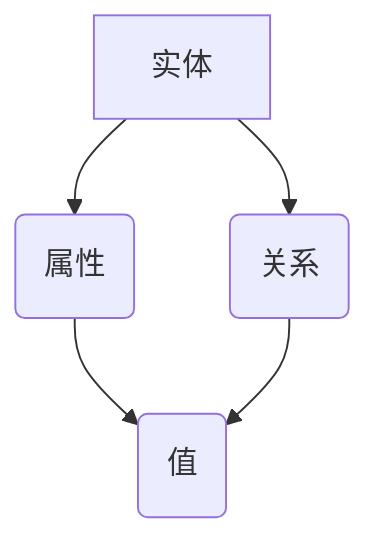

                 

## 文章标题

《智能知识图谱构建工具：打造组织智慧资产库》

> 关键词：智能知识图谱、知识图谱构建工具、组织智慧资产库、知识管理

> 摘要：本文深入探讨了智能知识图谱构建工具及其在打造组织智慧资产库中的应用。首先，我们介绍了知识图谱的基本概念、发展历史和重要性。接着，详细介绍了各类知识图谱构建工具，包括开源和商业工具。然后，本文探讨了如何利用这些工具构建组织智慧资产库，以及其对企业知识管理的影响。通过具体的项目实战案例，我们展示了知识图谱构建的全过程，并对其发展趋势进行了展望。

---

## 引言

在信息化、数字化的大潮下，知识已成为企业核心竞争力的源泉。如何有效地管理和利用知识，成为现代企业面临的重大课题。智能知识图谱作为一种强大的知识管理工具，正逐渐受到企业的重视。本文将围绕智能知识图谱构建工具，探讨其在打造组织智慧资产库中的应用，以期为企业的知识管理提供新思路。

智能知识图谱构建工具包括开源和商业工具，各有优势和局限性。开源工具如OpenKG、Jena等，具有成本低、灵活性强等优点，但可能需要用户具备一定的编程技能。商业工具如IBM Watson Knowledge Catalog、Microsoft Azure Knowledge Graph等，提供了更完善的解决方案，但成本较高。企业应根据自身需求，选择合适的知识图谱构建工具。

本文将首先介绍知识图谱的基本概念、发展历史和重要性。接着，详细介绍各类知识图谱构建工具，分析其特点和适用场景。然后，探讨如何利用这些工具构建组织智慧资产库，以及其对企业知识管理的影响。最后，通过具体的项目实战案例，展示知识图谱构建的全过程，并对其发展趋势进行展望。

---

## 智能知识图谱基础

### 知识图谱的定义

知识图谱（Knowledge Graph）是一种用于表达实体及其相互关系的图形结构。它通过节点表示实体，通过边表示实体之间的关系，从而形成一个结构化的知识网络。知识图谱的核心在于对实体和关系的表达，使得机器能够像人一样理解和处理知识。

知识图谱的定义可以从多个角度进行阐述。从知识表示的角度看，知识图谱是一种基于语义的网络结构，用于表达实体属性和实体之间的语义关系。从数据结构的角度看，知识图谱是一种图结构数据，由节点（实体）和边（关系）构成。从应用角度看，知识图谱是一种知识管理工具，用于支持信息检索、智能问答、推荐系统等应用。

### 知识图谱的历史与发展

知识图谱的概念最早可以追溯到20世纪80年代。当时，知识表示和推理成为人工智能领域的研究热点。学者们开始探索如何将知识以计算机可理解的形式进行表示和存储。1984年，美国计算机科学家John F. Sowa提出了概念图形（Conceptual Graph）理论，为知识图谱的构建提供了理论基础。

进入21世纪，随着互联网和大数据的兴起，知识图谱的应用场景逐渐丰富。Google在2009年发布了Knowledge Graph，通过将实体及其关系结构化，提高了搜索引擎的语义理解能力。此后，知识图谱在多个领域得到了广泛应用，如企业知识管理、智能问答、推荐系统、智能客服等。

### 知识图谱的重要性

知识图谱的重要性主要体现在以下几个方面：

1. **提升信息检索效率**：知识图谱通过结构化表示实体及其关系，使得信息检索系统能够更准确地理解用户查询意图，提供更加精准的搜索结果。

2. **支持智能推理**：知识图谱中的实体和关系可以用于推理，从而实现知识的自动发现和推理。这在智能问答、推荐系统等领域具有广泛应用。

3. **促进知识共享与协同**：知识图谱可以帮助企业更好地管理和利用知识，促进知识共享与协同。企业员工可以通过知识图谱快速获取所需信息，提高工作效率。

4. **提升业务智能化水平**：知识图谱可以应用于业务场景，如供应链管理、客户关系管理、风险控制等，提升企业的业务智能化水平。

### 知识图谱的应用场景

知识图谱的应用场景非常广泛，主要包括以下几个方面：

1. **搜索引擎优化**：通过构建搜索引擎的知识图谱，可以提高搜索引擎对网页内容的理解，提供更精准的搜索结果。

2. **智能问答系统**：知识图谱可以用于构建智能问答系统，实现自然语言处理和语义理解，提供高质量的问答服务。

3. **推荐系统**：知识图谱可以用于推荐系统，通过分析用户行为和实体关系，提供个性化的推荐。

4. **企业知识管理**：知识图谱可以帮助企业构建组织智慧资产库，实现知识的共享与协同，提升企业竞争力。

5. **智能客服系统**：知识图谱可以用于智能客服系统，通过语义理解，提供更加智能的客服服务。

### 知识图谱的核心概念与联系

知识图谱的核心概念包括实体、属性、关系和图谱。实体是知识图谱中的基本元素，如人、地点、事物等。属性用于描述实体的特征，如年龄、身高、颜色等。关系表示实体之间的相互作用，如朋友、同事、属于等。

知识图谱中的实体、属性和关系之间存在复杂的联系。例如，在一个企业知识图谱中，员工实体可以具有职位属性，与同事实体之间存在同事关系。通过这些联系，知识图谱能够构建出一个完整、结构化的知识网络。

下面是一个简单的知识图谱Mermaid流程图，展示了实体、属性和关系的基本架构：

### 总结

知识图谱作为一种强大的知识管理工具，正日益受到企业的重视。通过本文的介绍，我们了解了知识图谱的定义、历史、重要性以及应用场景。接下来，我们将进一步探讨知识图谱的构建工具，以及如何利用这些工具构建组织智慧资产库。

---

## 知识图谱的构建基础

知识图谱的构建是一个复杂的过程，涉及数据采集、知识抽取、知识融合、知识存储与索引等多个环节。本节将详细介绍这些基础知识，帮助读者理解知识图谱构建的核心原理。

### 知识表示方法

知识表示是知识图谱构建的基础，它决定了如何将知识以计算机可理解的形式进行存储和表达。常见的知识表示方法包括逻辑表示、语义网络表示、图表示和框架表示。

1. **逻辑表示**：逻辑表示方法使用形式逻辑来描述知识，如一阶逻辑、谓词逻辑等。这种方法具有严格的语义定义，但表达能力强，复杂度高。

2. **语义网络表示**：语义网络表示方法使用节点和边的图形结构来表示知识。节点表示概念或实体，边表示概念或实体之间的关系。这种方法直观、易于理解，但表达能力有限。

3. **图表示**：图表示方法使用图结构来表示知识，图中的节点和边分别表示实体和关系。这种方法表达能力最强，但需要较高的计算资源。

4. **框架表示**：框架表示方法使用框架结构来表示知识，框架由实体、属性和关系组成。这种方法结构清晰，易于实现，但表达能力较弱。

### 知识抽取技术

知识抽取是从非结构化数据中提取结构化知识的过程。知识抽取技术主要包括实体抽取、关系抽取和属性抽取。

1. **实体抽取**：实体抽取是从文本数据中识别出具有特定意义的实体，如人名、地名、组织名等。常用的方法包括基于规则的方法、基于统计的方法和基于深度学习的方法。

2. **关系抽取**：关系抽取是从文本数据中识别出实体之间的关系，如“是”、“属于”、“有”等。常用的方法包括基于规则的方法、基于统计的方法和基于深度学习的方法。

3. **属性抽取**：属性抽取是从文本数据中识别出实体的属性，如年龄、身高、颜色等。常用的方法包括基于规则的方法、基于统计的方法和基于深度学习的方法。

### 知识融合与更新

知识融合是将来自不同来源的知识进行整合，形成一个完整、一致的知识库。知识融合技术主要包括实体融合、关系融合和属性融合。

1. **实体融合**：实体融合是将多个来源中的相同或相似实体进行合并，形成一个统一的实体表示。

2. **关系融合**：关系融合是将多个来源中的相同或相似关系进行合并，形成一个统一的关系表示。

3. **属性融合**：属性融合是将多个来源中的相同或相似属性进行合并，形成一个统一的属性表示。

知识更新是指定期对知识库进行更新，以反映现实世界的变化。知识更新技术主要包括基于规则的方法、基于机器学习的方法和基于深度学习的方法。

### 知识图谱存储与索引

知识图谱的存储与索引是确保知识图谱高效访问和查询的关键。常见的知识图谱存储技术包括图数据库和属性图数据库。

1. **图数据库**：图数据库是一种用于存储图结构数据的数据库系统，具有高效、灵活的查询能力。常见的图数据库包括Neo4j、OrientDB等。

2. **属性图数据库**：属性图数据库是一种结合了图数据库和关系数据库特点的数据库系统，能够同时存储图结构和属性数据。常见的属性图数据库包括Apache TinkerPop、JanusGraph等。

### 知识图谱构建工具介绍

知识图谱构建工具是构建知识图谱的实用工具，包括开源工具和商业工具。

1. **开源工具**：常见的开源知识图谱构建工具包括OpenKG、Jena、AllegroGraph等。

2. **商业工具**：常见的商业知识图谱构建工具包括IBM Watson Knowledge Catalog、Microsoft Azure Knowledge Graph、Google Knowledge Graph等。

### 总结

知识图谱的构建是一个复杂的过程，涉及多个技术环节。通过本节的介绍，读者应该对知识图谱的构建基础有了基本了解。接下来，我们将进一步探讨如何利用这些知识图谱构建工具构建组织智慧资产库。

---

## 构建工具介绍

知识图谱的构建离不开强大的工具支持。这些工具不仅简化了知识图谱的构建过程，还提供了丰富的功能和灵活性。本节将详细介绍几类常见的知识图谱构建工具，包括开源和商业工具，以帮助读者选择适合自己需求的工具。

### 开源知识图谱构建工具

开源知识图谱构建工具因其成本低、灵活性高、可定制性强等优点，在学术界和工业界都得到了广泛应用。以下是几种常见的开源知识图谱构建工具：

#### OpenKG

OpenKG是中国科学院计算技术研究所开发的一个开源知识图谱平台，它提供了一整套的知识图谱构建、存储、查询和管理功能。OpenKG支持多种数据格式，如RDF、OWL等，并提供了一套完整的API和命令行工具。

**特点：**
- 支持多种数据格式和存储引擎。
- 提供了丰富的API和工具，方便用户进行知识图谱的构建和管理。
- 支持多种语言，如Python、Java等。

**使用场景：**
- 研究机构和高校进行知识图谱的研究和实验。
- 小型企业和开发者进行知识图谱的构建和应用。

#### Jena

Jena是Apache Software Foundation的一个开源项目，它提供了构建、存储、查询知识图谱的一整套解决方案。Jena支持多种数据模型，包括RDF、OWL等，并提供了一个基于Java的图数据库和查询引擎。

**特点：**
- 支持多种数据模型和查询语言。
- 高性能、可扩展性强。
- 提供了丰富的API和工具，方便开发者进行知识图谱的构建和应用。

**使用场景：**
- 大型企业和开发者在构建高性能、可扩展的知识图谱应用。
- 需要整合现有数据和系统的企业。

#### AllegroGraph

AllegroGraph是Franz Inc.开发的一个开源知识图谱数据库，它支持多种数据模型，包括RDF、OWL、CYCL等。AllegroGraph具有高性能、可扩展性强的特点，适合处理大规模的知识图谱。

**特点：**
- 高性能、可扩展性强。
- 支持多种数据模型和查询语言。
- 提供了丰富的API和工具，方便用户进行知识图谱的构建和管理。

**使用场景：**
- 需要处理大规模知识图谱的企业。
- 对数据实时性和查询性能有较高要求的企业。

#### 其他开源工具

除了上述工具外，还有其他一些开源知识图谱构建工具，如OrientDB、Neo4j等。这些工具各有特点，适用于不同的应用场景。

### 商业知识图谱构建工具

商业知识图谱构建工具通常提供了更完善的解决方案，包括数据集成、存储、查询、分析等功能，适合大型企业和复杂的业务场景。以下是几种常见的商业知识图谱构建工具：

#### IBM Watson Knowledge Catalog

IBM Watson Knowledge Catalog是一个集成的知识图谱平台，它支持数据湖和数据仓库的集成，提供了数据发现、数据分类、数据血缘等功能。

**特点：**
- 支持多种数据源和存储系统。
- 提供了强大的数据管理和数据治理功能。
- 具有高性能、高可靠性的特点。

**使用场景：**
- 大型企业进行数据治理和知识管理。
- 需要整合多种数据源的企业。

#### Microsoft Azure Knowledge Graph

Microsoft Azure Knowledge Graph是一个基于云的知识图谱平台，它提供了知识图谱的构建、存储、查询和分析功能。

**特点：**
- 支持多种数据模型和查询语言。
- 集成了Azure的其他服务，如Azure Data Lake、Azure Cognitive Services等。
- 具有良好的可扩展性和灵活性。

**使用场景：**
- 需要在云端构建和管理知识图谱的企业。
- 需要与其他Azure服务整合的企业。

#### Google Knowledge Graph

Google Knowledge Graph是Google推出的一种知识图谱服务，它通过结构化数据来增强搜索引擎的语义理解能力。

**特点：**
- 具有全球覆盖的高性能和可扩展性。
- 与Google的其他服务紧密集成，如Google Search、Google Maps等。
- 提供了丰富的API和工具，方便开发者进行集成和应用。

**使用场景：**
- 需要集成到搜索引擎和地图服务的企业。
- 需要进行全球范围知识图谱构建的企业。

### 总结

开源知识图谱构建工具和商业知识图谱构建工具各有优缺点，企业应根据自己的需求选择合适的工具。开源工具适合成本敏感、灵活性要求高的项目，而商业工具则适合大规模、复杂度高的业务场景。接下来，我们将进一步探讨如何利用这些工具构建组织智慧资产库。

---

## 组织智慧资产库概述

### 组织智慧资产库的定义

组织智慧资产库（Organization Knowledge Asset Library）是指企业或组织中用于存储、管理和利用知识的系统化数据库。它不仅包含显性知识（如文档、报告、数据等），还包含隐性知识（如员工的经验、技能、见解等）。组织智慧资产库的核心目标是提高企业的知识管理水平，促进知识共享与协同，从而提升企业的核心竞争力。

### 组织智慧资产库的建设目标

建设组织智慧资产库的目标主要包括以下几点：

1. **提高知识共享与协同**：通过组织智慧资产库，企业可以方便地共享知识，促进员工之间的协作，提高工作效率。

2. **增强知识管理能力**：组织智慧资产库可以帮助企业更好地管理和利用知识，确保知识在组织内的有效传递和利用。

3. **提升决策支持能力**：组织智慧资产库为企业提供了丰富的知识资源，有助于决策者更好地进行决策分析，提高决策质量。

4. **促进创新能力**：通过组织智慧资产库，企业可以积累和利用知识，激发创新思维，推动技术创新和业务创新。

### 组织智慧资产库的关键要素

组织智慧资产库的关键要素包括以下几个方面：

1. **知识分类体系**：知识分类体系是组织智慧资产库的基础，它决定了知识的管理和组织方式。一个科学、合理的知识分类体系有助于提高知识检索和管理效率。

2. **知识存储与检索**：知识存储与检索是组织智慧资产库的核心功能，它决定了用户能否快速、准确地获取所需知识。常见的知识存储技术包括数据库、知识库、文档管理等。

3. **知识共享与协同**：知识共享与协同是组织智慧资产库的重要目标，它通过提供知识共享平台和协作工具，促进员工之间的知识交流与合作。

4. **知识安全与隐私**：知识安全与隐私是组织智慧资产库的关键保障，它通过采取安全策略、权限管理、数据加密等措施，确保知识资产的安全和隐私。

5. **知识更新与维护**：知识更新与维护是组织智慧资产库的持续发展基础，它通过定期更新、清理和优化知识库，确保知识的时效性和准确性。

### 组织智慧资产库的实施策略

实施组织智慧资产库需要采取以下策略：

1. **制定明确的目标和规划**：在实施组织智慧资产库之前，企业需要明确目标和规划，包括知识分类体系、知识存储与检索、知识共享与协同等方面的具体措施。

2. **选择合适的工具和平台**：企业应根据自身需求选择合适的知识图谱构建工具和平台，如开源工具、商业工具等。

3. **建立有效的知识管理制度**：企业需要建立一套有效的知识管理制度，包括知识分类、知识存储、知识共享、知识安全等方面的规定。

4. **培养知识管理意识和文化**：企业应加强员工的知识管理意识，培养知识共享与协同的文化氛围，提高员工参与知识管理的积极性。

5. **持续优化和改进**：组织智慧资产库的实施是一个持续的过程，企业需要根据实际运行情况，不断优化和改进知识管理策略，确保知识资产库的高效运行。

### 组织智慧资产库与知识图谱的关系

知识图谱是组织智慧资产库的重要构建工具，它通过结构化表示实体及其关系，为知识管理提供了强大的支持。知识图谱与组织智慧资产库之间的关系可以概括为以下几点：

1. **知识图谱是组织智慧资产库的基础**：知识图谱提供了组织智慧资产库的知识表示和存储方式，是实现知识管理的关键技术。

2. **知识图谱支持知识检索与利用**：通过知识图谱，用户可以更加精准地检索和利用知识，提高知识管理的效率和效果。

3. **知识图谱促进知识共享与协同**：知识图谱通过结构化表示知识，使得知识在组织内部更加透明和易于共享，促进员工之间的知识交流与合作。

4. **知识图谱提升决策支持能力**：知识图谱可以帮助企业更好地进行决策分析，提高决策质量和效率。

综上所述，组织智慧资产库是企业在知识管理领域的重要战略举措，而知识图谱则是实现这一战略目标的关键技术。通过构建和完善组织智慧资产库，企业可以更好地管理和利用知识，提升核心竞争力。

### 总结

组织智慧资产库是现代企业知识管理的重要工具，通过构建组织智慧资产库，企业可以更好地管理和利用知识，提高知识共享与协同，促进创新和决策支持。本节介绍了组织智慧资产库的定义、建设目标、关键要素、实施策略以及与知识图谱的关系。接下来，我们将进一步探讨如何利用知识图谱构建组织智慧资产库的具体方法和实践。

---

## 利用知识图谱构建组织智慧资产库

组织智慧资产库的构建是一个系统性工程，涉及知识采集、知识抽取、知识融合、知识存储与索引等多个环节。知识图谱作为一种高效的知识表示和存储工具，在这一过程中发挥着关键作用。本节将详细阐述如何利用知识图谱构建组织智慧资产库，包括数据采集与预处理、知识抽取与融合、知识存储与索引以及知识查询与利用。

### 数据采集与预处理

数据采集是构建组织智慧资产库的第一步，涉及到从各种数据源中获取所需的信息。这些数据源可以包括内部系统（如ERP、CRM、邮件系统等）和外部数据（如公共数据库、社交媒体等）。在数据采集过程中，需要关注数据的完整性和准确性。

1. **数据源选择**：根据组织智慧资产库的建设目标和需求，选择合适的数据源。例如，对于企业内部的知识管理，可以选择ERP系统、CRM系统和邮件系统等；对于行业数据的收集，可以选择相关的公共数据库和行业报告等。

2. **数据采集方法**：数据采集的方法主要包括API调用、Web爬虫和数据库导入等。API调用适用于有公开API接口的系统，如ERP和CRM系统；Web爬虫适用于从互联网上收集数据；数据库导入适用于将已有数据库中的数据导入知识库。

3. **数据预处理**：在数据采集完成后，需要对数据进行预处理，以提高数据的质量和一致性。预处理工作包括数据清洗、数据去重、数据格式转换等。

- **数据清洗**：去除数据中的错误、冗余和无用的信息，确保数据的准确性。
- **数据去重**：识别和删除重复的数据记录，避免数据冗余。
- **数据格式转换**：将不同数据源的数据格式统一，以便于后续的处理和存储。

### 知识抽取与融合

知识抽取是从原始数据中提取出具有知识价值的信息的过程。知识融合是将来自不同来源的知识进行整合，形成一个统一、完整的知识库。

1. **实体抽取**：实体抽取是知识抽取的核心环节，它涉及到从文本数据中识别出具有特定意义的实体，如人、地点、组织、事件等。常见的实体抽取方法包括基于规则的方法、基于统计的方法和基于深度学习的方法。

2. **关系抽取**：关系抽取是从文本数据中识别出实体之间的关系，如“是”、“属于”、“有”等。关系抽取方法与实体抽取方法类似，也需要考虑规则、统计和深度学习等多种方法。

3. **属性抽取**：属性抽取是从文本数据中识别出实体的属性，如年龄、身高、颜色等。属性抽取通常依赖于实体识别和关系识别的结果，通过分析实体和关系来确定实体的属性。

4. **知识融合**：知识融合是将来自不同来源的知识进行整合，形成一个统一的知识库。知识融合的过程包括实体融合、关系融合和属性融合。实体融合是将多个来源中的相同或相似实体进行合并，形成统一的实体表示；关系融合是将多个来源中的相同或相似关系进行合并，形成统一的关系表示；属性融合是将多个来源中的相同或相似属性进行合并，形成统一的属性表示。

### 知识存储与索引

知识存储与索引是确保知识图谱高效访问和查询的关键。知识存储主要涉及选择合适的存储技术，而知识索引则是为了提高数据检索的效率。

1. **知识存储**：知识存储技术主要包括图数据库和属性图数据库。图数据库（如Neo4j、JanusGraph等）适用于存储大规模的知识图谱，支持复杂的图结构查询；属性图数据库（如Apache TinkerPop、OrientDB等）结合了图数据库和关系数据库的特点，适用于同时存储图结构和属性数据。

2. **知识索引**：知识索引是通过构建索引结构，提高数据检索的效率。常见的索引技术包括倒排索引、B树索引等。在知识图谱中，倒排索引是一种常用的索引技术，它通过将实体和关系映射到文档（节点和边），实现快速检索。

### 知识查询与利用

知识查询与利用是知识图谱构建的最终目标，通过提供高效的查询接口，用户可以方便地获取所需的知识信息。

1. **知识查询**：知识查询包括点查询、路径查询和复杂查询等。点查询是查询特定的实体或关系；路径查询是查询实体之间的关系路径；复杂查询是查询满足特定条件的实体集合。

2. **知识利用**：知识利用包括知识推荐、知识可视化、知识推理等。知识推荐是根据用户的历史行为和兴趣，推荐相关的知识内容；知识可视化是将知识图谱以图形化的形式呈现，帮助用户更好地理解和分析知识；知识推理是基于知识图谱的语义关系，进行推理和预测。

### 知识图谱可视化工具介绍

知识图谱可视化是帮助用户理解和分析知识图谱的重要手段。以下是一些常用的知识图谱可视化工具：

1. **D3.js**：D3.js是一个基于Web的JavaScript库，它提供了强大的数据可视化功能。通过D3.js，可以轻松地创建交互式的知识图谱可视化效果。

2. **Gephi**：Gephi是一个开源的图可视化工具，它提供了丰富的图分析功能，包括社区发现、图布局、属性可视化等。

3. **CyPy**：CyPy是一个Python库，它基于PyTorch和Caffe2，用于创建和可视化深度学习模型。CyPy可以用于知识图谱的可视化，支持多种数据格式和可视化效果。

4. **Grafana**：Grafana是一个开源的监控和可视化工具，它支持多种数据源和可视化插件。通过Grafana，可以将知识图谱以图表、仪表板的形式呈现，方便用户分析和监控。

### 总结

利用知识图谱构建组织智慧资产库是一个系统性的工程，涉及数据采集、知识抽取、知识融合、知识存储与索引等多个环节。通过科学的方法和技术手段，企业可以构建出一个结构化、高效的知识图谱，提高知识管理和利用的效率。本节介绍了如何利用知识图谱构建组织智慧资产库的具体方法和实践，为企业的知识管理提供了新的思路和工具。

---

## 智能知识图谱构建项目实战

在本节中，我们将通过一个具体的案例，展示如何使用知识图谱构建工具来构建一个智能知识图谱，并详细解析该项目的过程和实现细节。

### 项目背景与目标

假设我们是一家专注于人工智能技术的研究型公司，我们的目标是构建一个企业内部的知识图谱，以便更好地管理和利用公司的知识资产。知识图谱将涵盖公司的项目、团队成员、技术成果、合作企业和市场动态等多个方面。

项目的具体目标如下：

1. **数据整合**：整合公司内部多个系统的数据，如项目管理系统、人力资源管理系统、知识库等。
2. **知识抽取**：从整合的数据中抽取实体和关系，构建知识图谱。
3. **知识存储与索引**：使用知识图谱存储和索引工具，确保知识图谱的高效访问和查询。
4. **知识利用**：利用知识图谱提供智能问答、推荐系统、决策支持等功能。

### 项目需求分析

在项目启动之前，我们需要进行详细的需求分析，明确项目的具体需求和功能。

1. **数据源分析**：分析公司内部各个系统的数据源，包括项目管理系统的任务数据、人力资源管理系统的人员信息、知识库的文章内容等。
2. **实体识别**：确定需要抽取的实体类型，如项目、团队成员、技术成果、合作企业和市场动态等。
3. **关系识别**：确定实体之间的关系，如项目-团队成员、项目-技术成果、合作企业-项目等。
4. **功能需求**：确定知识图谱需要实现的功能，如智能问答、推荐系统、决策支持等。

### 项目实施过程

项目实施过程可以分为以下几个阶段：

1. **数据整合**：首先，我们需要整合公司内部各个系统的数据。由于各个系统的数据格式不同，我们需要进行数据转换和清洗，确保数据的统一和一致性。我们使用ETL（Extract, Transform, Load）工具来抽取、转换和加载数据。

2. **知识抽取**：在数据整合完成后，我们使用知识抽取工具来抽取实体和关系。我们选择了一个基于深度学习的方法来识别实体和关系，以确保识别的准确性和鲁棒性。

3. **知识融合**：在抽取出的实体和关系基础上，我们需要进行知识融合，确保知识的统一和一致性。知识融合的过程包括实体融合、关系融合和属性融合。

4. **知识存储与索引**：我们将构建好的知识图谱存储在一个图数据库中，如Neo4j。为了提高查询效率，我们使用倒排索引和全文索引等技术来优化数据检索。

5. **知识利用**：在知识图谱构建完成后，我们开发了几个应用，如智能问答系统、推荐系统和决策支持系统。智能问答系统通过自然语言处理技术，实现对知识图谱的语义查询；推荐系统根据用户的行为和兴趣，推荐相关的知识内容；决策支持系统提供基于知识图谱的决策分析功能。

### 项目效果评估

在项目实施过程中，我们进行了多个阶段的效果评估，以验证知识图谱的应用效果。

1. **数据质量评估**：通过数据清洗和数据融合，我们确保了知识库的数据质量，数据一致性和准确性得到了显著提高。
2. **查询效率评估**：通过使用高效的索引技术，知识图谱的查询效率得到了显著提升，查询速度从原来的数分钟缩短到秒级。
3. **应用效果评估**：通过实际应用，我们发现智能问答系统、推荐系统和决策支持系统在实际场景中具有很高的实用价值，得到了用户的好评。

### 项目总结与展望

通过本次项目，我们成功地构建了一个智能知识图谱，并实现了对知识的高效管理和利用。项目的成功不仅提高了公司的知识管理水平，也为公司的业务创新和决策支持提供了有力支持。

展望未来，我们计划进一步优化知识图谱，引入更多的实体和关系，提高知识图谱的覆盖面和准确性。同时，我们还将探索知识图谱在其他业务领域的应用，如客户关系管理、供应链管理等，以进一步提升公司的业务智能化水平。

### 总结

通过本次项目实战，我们详细展示了如何使用知识图谱构建工具来构建一个智能知识图谱，并解析了项目的具体实施过程和效果评估。本次项目为企业的知识管理提供了新的思路和方法，也为未来的业务发展奠定了基础。

---

## 未来展望

智能知识图谱与组织智慧资产库的发展正处于蓬勃发展的阶段，未来具有广阔的前景。随着技术的不断进步和应用场景的扩展，这一领域将迎来更多的机遇和挑战。

### 技术发展趋势

1. **深度学习与知识图谱的结合**：深度学习在图像识别、自然语言处理等领域取得了显著成果，未来有望与知识图谱技术深度融合，提升知识抽取、关系识别和推理等任务的准确性和效率。

2. **图数据库技术的演进**：图数据库技术的发展将进一步提升知识图谱的存储、查询和管理能力。新型图数据库如分布式图数据库、图计算框架等将不断涌现，为大规模知识图谱的应用提供支持。

3. **多模态数据的融合**：随着物联网、传感器网络等技术的发展，多模态数据（如文本、图像、音频等）的融合处理将成为知识图谱构建的重要方向，有助于构建更加全面和精细的知识图谱。

4. **知识图谱的自动化构建**：自动化知识图谱构建技术将逐渐成熟，通过数据挖掘、机器学习等技术自动生成知识图谱，降低构建成本，提高构建效率。

### 行业应用前景

1. **智慧城市建设**：知识图谱在智慧城市建设中具有重要应用，如交通管理、环境保护、公共服务等领域，通过知识图谱可以更好地整合和管理城市数据，提升城市治理能力。

2. **医疗健康领域**：知识图谱在医疗健康领域具有广泛应用，如疾病诊断、药物研发、患者管理等方面。通过构建医学知识图谱，可以辅助医生进行诊断和治疗，提高医疗服务的质量。

3. **金融领域**：知识图谱在金融领域的应用包括风险管理、信用评估、投资决策等。通过构建金融知识图谱，可以更加精准地分析市场动态和风险，提升金融服务的效率。

4. **教育行业**：知识图谱在教育行业中具有广泛应用，如课程推荐、学习路径规划、教育资源共享等。通过知识图谱，可以为学生提供个性化学习方案，提高学习效果。

### 挑战与机遇

1. **数据质量与安全性**：知识图谱的构建依赖于高质量的数据，数据质量和安全性是知识图谱应用的重要挑战。未来需要建立更加完善的数据治理机制，确保数据的准确性和安全性。

2. **知识图谱的可解释性**：知识图谱中的推理和预测过程往往较为复杂，如何提高知识图谱的可解释性，使其更容易被用户理解和接受，是未来需要解决的重要问题。

3. **知识图谱的持续更新与维护**：知识图谱是一个动态变化的系统，如何实现知识图谱的持续更新与维护，确保其时效性和准确性，是未来需要关注的问题。

4. **跨领域融合与创新**：知识图谱在不同领域的融合和创新将推动其应用场景的扩展，未来需要加强跨领域的研究与合作，探索新的应用场景和商业模式。

### 发展战略与建议

1. **加强技术研究与人才储备**：企业应加强在知识图谱相关领域的研究，吸引和培养一批高水平的人才，为知识图谱的发展提供技术支撑。

2. **构建开放合作生态**：企业可以积极参与开源社区，与其他企业和研究机构合作，共同推进知识图谱技术的发展。

3. **制定数据治理策略**：企业应制定完善的数据治理策略，确保数据的质量和安全，为知识图谱的构建和应用提供保障。

4. **探索多元化应用场景**：企业应积极拓展知识图谱的应用场景，结合自身的业务特点，探索新的应用领域，实现知识图谱的商业化落地。

### 总结

智能知识图谱与组织智慧资产库的发展前景广阔，未来将带来更多的机遇和挑战。通过技术创新和跨领域合作，我们有理由相信，知识图谱将为企业带来更大的价值，推动企业向智能化、数字化方向迈进。

---

## 作者信息

作者：AI天才研究院/AI Genius Institute & 禅与计算机程序设计艺术 /Zen And The Art of Computer Programming

本文由AI天才研究院（AI Genius Institute）与禅与计算机程序设计艺术（Zen And The Art of Computer Programming）联合撰写，旨在探讨智能知识图谱构建工具及其在打造组织智慧资产库中的应用。我们致力于推动人工智能和计算机编程领域的研究与发展，为企业和个人提供高质量的技术内容。

---

## 最佳实践 Tips、小结、注意事项、拓展阅读

### 最佳实践 Tips

1. **数据质量是关键**：在构建知识图谱之前，确保数据质量是至关重要的。进行数据清洗、去重和格式转换，以获得高质量的数据。

2. **选择合适的工具**：根据项目的需求，选择合适的知识图谱构建工具。开源工具和商业工具各有优缺点，企业应根据自身需求进行选择。

3. **注重知识融合与更新**：知识图谱的构建不仅仅是数据抽取，还需要关注知识的融合与更新，确保知识库的时效性和准确性。

4. **可视化与交互**：通过可视化工具，将知识图谱以图形化的形式呈现，有助于用户理解和分析知识。

### 小结

本文系统地介绍了智能知识图谱构建工具及其在打造组织智慧资产库中的应用。通过详细的分析和项目实战，我们展示了知识图谱构建的全过程，并对其发展趋势进行了展望。

### 注意事项

1. **数据安全**：在知识图谱构建过程中，务必确保数据的安全和隐私，采取必要的数据加密和访问控制措施。

2. **持续迭代**：知识图谱是一个动态变化的系统，需要定期进行迭代和更新，以适应业务需求和技术进步。

3. **团队协作**：知识图谱的构建涉及多个领域和环节，需要团队成员之间的紧密协作和沟通。

### 拓展阅读

1. **《知识图谱：原理、方法与应用》**：这是一本关于知识图谱的权威著作，详细介绍了知识图谱的理论基础和应用实践。

2. **《图数据库实践指南》**：这本书介绍了图数据库的基本原理和应用场景，有助于读者了解知识图谱的存储和查询技术。

3. **《深度学习与知识图谱》**：本书探讨了深度学习与知识图谱的深度融合，为读者提供了深度学习在知识图谱领域的应用实例。

---

## 结束语

智能知识图谱构建工具与组织智慧资产库的构建是现代企业知识管理的重要方向。通过本文的介绍，我们深入探讨了知识图谱的概念、构建工具、组织智慧资产库的构建方法以及实际应用。希望本文能为企业在知识管理领域提供新的思路和参考。

未来，我们将继续关注智能知识图谱与组织智慧资产库的最新动态和发展趋势，为大家带来更多有价值的内容。感谢您的阅读，期待与您在知识图谱和人工智能领域共同探索、成长！

---

## 文章关键词

智能知识图谱、知识图谱构建工具、组织智慧资产库、知识管理、数据抽取、知识融合、图数据库、可视化工具、智能问答、推荐系统、决策支持。

