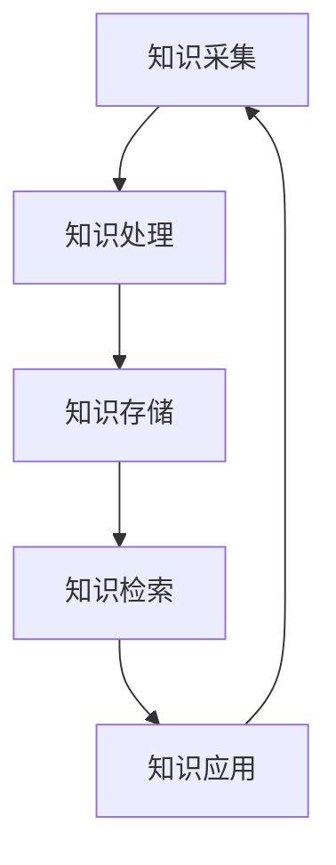
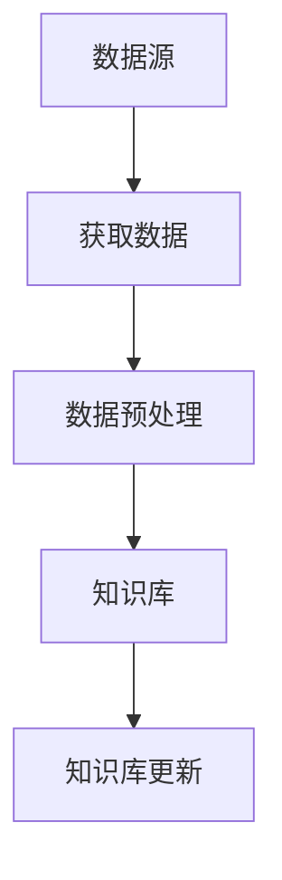
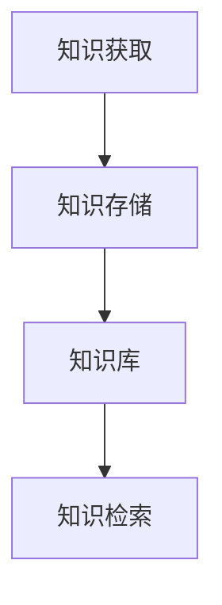
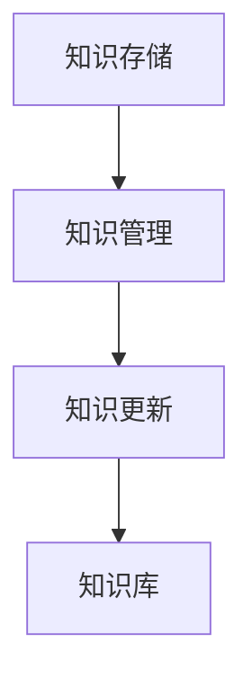
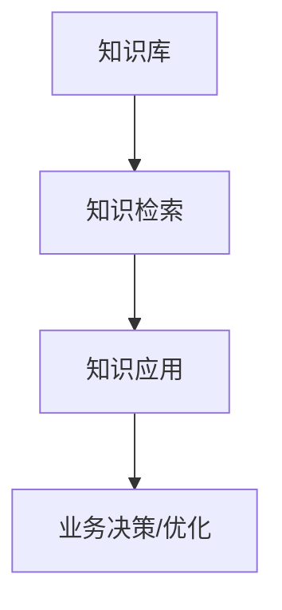
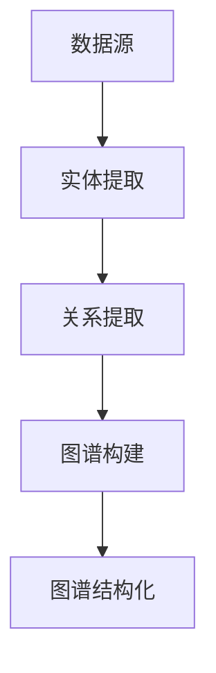
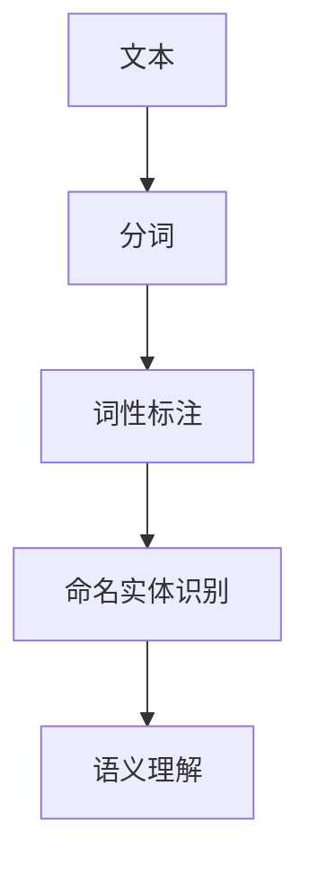
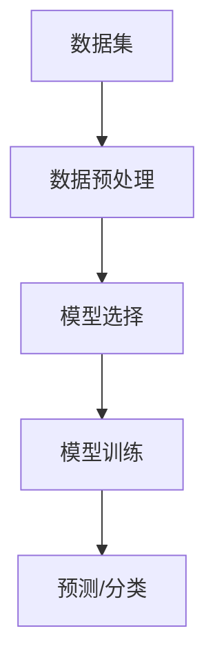

                 


### 第1章 引言与背景

在当今快速发展的信息化社会中，知识作为一种宝贵的资源，已经成为企业竞争力的核心要素。传统的知识管理方式已经无法满足现代企业对知识获取、存储、管理和应用的需求。为了更好地应对市场变化和提升企业竞争力，构建智能知识管理系统、建立企业智慧资产库成为了一个重要的研究方向。

#### 1.1 智能知识管理系统的重要性

智能知识管理系统（Intelligent Knowledge Management System，简称IKMS）是一种基于现代信息技术，特别是人工智能技术，实现知识获取、存储、管理和应用的系统。它通过自动化和智能化手段，帮助企业更好地管理知识资产，提高知识利用效率，从而实现业务创新和持续发展。

智能知识管理系统的重要性体现在以下几个方面：

1. **提高知识获取效率**：通过自动化数据采集和处理技术，智能知识管理系统可以快速获取大量内外部知识资源，节省人力和时间成本。
2. **提升知识存储和管理能力**：智能知识管理系统通过建立结构化的知识库，实现知识的系统化管理和高效存储，方便知识共享和复用。
3. **优化知识应用效果**：通过智能推荐和知识挖掘技术，智能知识管理系统可以帮助企业更好地发现和应用知识，提高业务决策的准确性和效率。
4. **促进企业创新能力**：智能知识管理系统通过知识共享和协同创新，激发员工创造力，推动企业持续创新和发展。

#### 1.2 企业智慧资产库的概念

企业智慧资产库（Enterprise Knowledge Asset Library，简称EKAL）是指企业内部构建的一个系统化的知识存储和服务中心，它集合了企业的各类知识资源，包括文档、数据、经验、教训、最佳实践等，通过智能知识管理系统进行管理，为企业提供持续的知识支持。

企业智慧资产库的特点包括：

1. **系统性**：企业智慧资产库是一个系统化的知识库，涵盖企业的各个业务领域，实现知识的全面覆盖。
2. **共享性**：企业智慧资产库强调知识的共享和复用，通过构建一个开放的知识平台，方便员工获取和使用知识。
3. **智能化**：企业智慧资产库通过智能知识管理系统，实现知识的自动化获取、存储、管理和应用，提高知识利用效率。
4. **动态性**：企业智慧资产库是一个动态的体系，随着企业的发展和知识积累的增多，知识库内容不断更新和优化。

#### 1.3 现代企业的需求驱动

随着信息化进程的加速，现代企业面临着日益严峻的市场竞争和技术挑战，对知识管理的要求也越来越高。构建智能知识管理系统、建立企业智慧资产库已经成为现代企业提升核心竞争力的必然选择。

1. **知识创新需求**：现代企业需要不断进行知识创新，通过构建智能知识管理系统，可以实现知识资源的挖掘和创新，推动企业持续发展。
2. **数字化转型需求**：数字化转型已成为企业发展的必然趋势，智能知识管理系统作为数字化转型的重要一环，可以为企业提供强大的知识支持。
3. **员工知识共享需求**：随着员工多元化、年轻化趋势的加剧，企业需要建立一个开放、共享的知识平台，促进员工之间的知识交流和协作。
4. **业务效率提升需求**：通过智能知识管理系统，企业可以更好地管理知识资产，提高业务效率，降低运营成本。

综上所述，智能知识管理系统和智慧资产库的建设已经成为现代企业发展的关键领域，具有重要的战略意义。接下来，我们将深入探讨智能知识管理系统的核心概念、工作原理以及如何构建企业智慧资产库。

### 第2章 核心概念与联系

在深入探讨智能知识管理系统之前，有必要明确几个核心概念，并理解它们之间的相互关系。为了更好地展示这些概念，我们将使用Mermaid流程图来描述智能知识管理系统的关键组成部分及其交互过程。

#### 2.1 智能知识管理系统的组成

智能知识管理系统由以下几个核心组成部分构成：

1. **知识采集模块**：负责从各种内外部数据源中获取知识资源。
2. **知识处理模块**：对采集到的知识资源进行清洗、分类、标注等预处理操作。
3. **知识存储模块**：将处理后的知识资源存储到结构化的知识库中。
4. **知识检索模块**：提供用户查询接口，支持知识的快速检索和访问。
5. **知识应用模块**：利用知识库中的知识资源，为企业提供智能决策支持、业务优化等服务。

#### 2.2 关键概念之间的关系

以下是智能知识管理系统的关键概念及其相互关系：

1. **知识采集** → **知识处理**：采集到的原始数据通过知识处理模块进行清洗和预处理，以便更好地存储和应用。
2. **知识处理** → **知识存储**：处理后的知识资源存储到知识库中，形成结构化的知识库。
3. **知识存储** → **知识检索**：知识库中的知识资源通过检索模块供用户查询和访问。
4. **知识检索** → **知识应用**：用户通过检索获取知识，并利用知识库中的知识资源进行业务决策和优化。
5. **知识应用** → **知识采集**：在知识应用过程中，可能会产生新的知识需求，从而驱动新的知识采集过程。

#### 2.3 Mermaid流程图展示

为了更直观地展示智能知识管理系统的组成及其相互关系，我们使用Mermaid流程图进行描述：



**流程图说明**：

- **知识采集**：从各种内外部数据源获取知识资源。
- **知识处理**：对原始知识资源进行清洗、分类、标注等预处理操作。
- **知识存储**：将处理后的知识资源存储到结构化的知识库中。
- **知识检索**：提供用户查询接口，支持知识的快速检索和访问。
- **知识应用**：利用知识库中的知识资源，为企业提供智能决策支持、业务优化等服务。

通过以上流程图，我们可以清晰地看到智能知识管理系统的各个环节及其相互关系。这个系统是一个闭环，知识在各个模块之间循环流动，持续优化和提升。

接下来，我们将深入探讨智能知识管理系统的原理和工作机制，了解其如何实现知识的获取、存储、管理和应用。

### 第3章 智能知识管理系统原理

智能知识管理系统（IKMS）作为一种集成了多种先进技术的综合系统，其工作原理涵盖了知识获取、知识存储、知识管理和知识应用等多个方面。在本节中，我们将详细阐述这些原理，并使用伪代码和流程图来辅助说明。

#### 3.1 知识获取

知识获取是智能知识管理系统的第一步，主要目标是从各种数据源中收集和提取有用的知识资源。以下是知识获取过程的一个简单伪代码：

```python
# 知识获取伪代码

def 知识获取(数据源):
    # 初始化知识库
    知识库 = 空的知识库
    
    # 遍历数据源，提取知识
    对于 每个数据源:
        数据 = 获取数据(数据源)
        知识 = 数据预处理(数据)
        
        # 存储知识到知识库
        知识库.add(知识)
    
    return 知识库
```

在这个伪代码中，`知识获取`函数接收一个数据源作为输入，通过循环遍历数据源中的数据，调用`获取数据`和`数据预处理`函数，将处理后的知识存储到知识库中。

**知识获取流程图**：



**流程图说明**：

- **数据源**：包括内部数据库、外部API、文档库等。
- **获取数据**：从数据源中提取原始数据。
- **数据预处理**：对原始数据进行清洗、去噪、分类等操作。
- **知识库**：存储处理后的知识资源。
- **知识库更新**：将新获取的知识资源更新到知识库中。

#### 3.2 知识存储

知识存储是将获取的知识资源以结构化的形式存储在知识库中，以便后续检索和应用。以下是知识存储过程的一个伪代码：

```python
# 知识存储伪代码

class 知识库:
    def __init__(self):
        self.知识资源 = {}

    def add(self, 知识):
        # 为每个知识资源分配唯一标识
        知识ID = 生成唯一标识()
        
        # 将知识存储在知识库中
        self.知识资源[知识ID] = 知识

    def 查找(self, 关键字):
        # 根据关键字在知识库中检索知识
        知识列表 = []
        对于 每个知识ID, 知识 in self.知识资源:
            如果 关键字 in 知识:
                知识列表.add(知识)
        
        return 知识列表
```

在这个伪代码中，我们定义了一个`知识库`类，包含`add`（添加知识）和`查找`（根据关键字检索知识）方法。通过为每个知识资源分配唯一标识，可以实现知识的结构化存储和高效检索。

**知识存储流程图**：



**流程图说明**：

- **知识获取**：从数据源中提取知识资源。
- **知识存储**：将知识资源存储在知识库中。
- **知识库**：存储结构化的知识资源。
- **知识检索**：根据关键字在知识库中检索知识。

#### 3.3 知识管理

知识管理是智能知识管理系统的核心功能之一，它涉及知识库的更新、维护和优化，以确保知识的准确性和有效性。以下是知识管理过程的一个伪代码：

```python
# 知识管理伪代码

def 知识管理(知识库):
    # 检查知识库中知识的有效性
    对于 每个知识资源, 知识 in 知识库:
        如果 知识过时:
            更新知识(知识)
        如果 知识错误:
            纠正知识(知识)
    
    # 根据需求更新知识库
    更新知识库(知识库)
```

在这个伪代码中，`知识管理`函数检查知识库中的知识资源，根据其有效性进行更新和纠正，并确保知识库的持续优化。

**知识管理流程图**：



**流程图说明**：

- **知识存储**：将知识资源存储在知识库中。
- **知识管理**：检查知识库中知识的有效性，更新和纠正知识。
- **知识更新**：根据需求更新知识库。
- **知识库**：存储结构化的知识资源。

#### 3.4 知识应用

知识应用是将知识库中的知识资源转化为实际业务价值的过程。以下是知识应用过程的一个伪代码：

```python
# 知识应用伪代码

def 知识应用(知识库, 业务需求):
    # 检索与业务需求相关的知识
    相关知识 = 知识库.查找(业务需求)
    
    # 利用相关知识进行业务决策或优化
    对于 每个知识, 知识 in 相关知识:
        应用知识(知识, 业务需求)
```

在这个伪代码中，`知识应用`函数根据业务需求检索相关的知识资源，并利用这些知识资源进行业务决策或优化。

**知识应用流程图**：



**流程图说明**：

- **知识库**：存储结构化的知识资源。
- **知识检索**：根据业务需求检索相关的知识资源。
- **知识应用**：利用相关知识进行业务决策或优化。

综上所述，智能知识管理系统通过知识获取、知识存储、知识管理和知识应用等环节，实现知识的自动化获取、存储、管理和应用，为企业提供强大的知识支持。接下来，我们将探讨如何构建一个有效的企业智慧资产库。

### 第4章 构建企业智慧资产库

构建企业智慧资产库是智能知识管理系统的重要组成部分，其目的是为企业提供一个系统化的知识存储和服务中心，以支持企业的知识共享、创新和持续发展。在本节中，我们将详细探讨如何构建一个有效的企业智慧资产库，包括数据源选择、数据清洗、数据存储和数据检索。

#### 4.1 数据源选择

选择合适的数据源是构建企业智慧资产库的第一步。以下是一些常用的数据源类型：

1. **内部数据库**：包括企业内部的业务数据库、CRM系统、ERP系统等，这些数据库存储了企业日常运营的大量数据，是构建企业智慧资产库的重要基础。
2. **外部API**：通过调用外部API，可以获取行业动态、市场趋势、竞争对手信息等外部数据，这些数据有助于企业进行战略规划和决策支持。
3. **文档库**：包括企业内部的各种文档，如工作报告、会议纪要、项目报告、政策法规等，这些文档包含了企业的历史经验和知识积累。
4. **社交媒体**：通过分析社交媒体平台上的用户评论、讨论和反馈，可以获取关于企业产品和服务的社会认知和市场反响。
5. **公开数据集**：可以从各种公开数据集网站获取到丰富的数据资源，如气象数据、交通数据、经济数据等。

选择数据源时需要考虑以下几个因素：

- **数据质量**：选择的数据源应具有较高的数据质量，避免因数据质量问题影响知识库的准确性。
- **数据完整性**：数据源应能提供全面的数据覆盖，确保知识库的完整性。
- **数据更新频率**：数据源应能提供及时的数据更新，确保知识库的实时性。
- **数据获取成本**：选择的数据源应具有较高的可获取性，降低数据获取的成本。

#### 4.2 数据清洗

数据清洗是数据预处理的重要环节，目的是消除数据中的噪声和错误，提高数据质量。以下是一些常见的数据清洗方法：

1. **缺失值处理**：对于缺失值，可以选择填充、删除或保留缺失值的方法。
2. **重复数据去除**：通过比较数据之间的差异，去除重复的数据记录。
3. **异常值处理**：对于异常值，可以根据数据分布和业务逻辑，选择剔除或调整的方法。
4. **数据转换**：将不同格式的数据进行统一转换，如将文本数据转换为结构化数据。
5. **数据标准化**：对数据进行规范化处理，如数值范围调整、数据单位统一等。

以下是数据清洗过程的一个简单伪代码：

```python
# 数据清洗伪代码

def 数据清洗(数据源):
    # 去除缺失值
    数据源 = 去除缺失值(数据源)
    
    # 去除重复数据
    数据源 = 去除重复数据(数据源)
    
    # 处理异常值
    数据源 = 处理异常值(数据源)
    
    # 数据转换和标准化
    数据源 = 数据转换(数据源)
    数据源 = 数据标准化(数据源)
    
    return 数据源
```

在这个伪代码中，`数据清洗`函数通过多个步骤对数据源进行清洗，以提高数据质量。

#### 4.3 数据存储

数据存储是将清洗后的数据存储到知识库中，以便后续的检索和应用。以下是一些常见的数据存储方式：

1. **关系型数据库**：适用于存储结构化数据，如MySQL、Oracle等。
2. **非关系型数据库**：适用于存储非结构化数据，如MongoDB、Redis等。
3. **图数据库**：适用于存储复杂关系和图结构的数据，如Neo4j等。
4. **分布式存储系统**：适用于大规模数据的存储和管理，如Hadoop、Spark等。

以下是数据存储过程的一个简单伪代码：

```python
# 数据存储伪代码

def 数据存储(知识库, 清洗后的数据):
    # 创建知识库表结构
    知识库.创建表结构()
    
    # 将清洗后的数据存储到知识库中
    知识库.插入数据(清洗后的数据)
    
    return 知识库
```

在这个伪代码中，`数据存储`函数通过创建表结构和插入数据的方法，将清洗后的数据存储到知识库中。

#### 4.4 数据检索

数据检索是从知识库中获取与业务需求相关的知识资源的过程。以下是一些常见的数据检索方法：

1. **关键字检索**：根据用户输入的关键字，在知识库中查找相关的知识资源。
2. **分类检索**：根据知识资源的分类结构，逐层递归查找相关的知识资源。
3. **模糊检索**：通过模糊匹配算法，查找与输入关键字相似的知识资源。
4. **基于内容的检索**：根据知识资源的内容特征，如关键词、语义等，进行检索。

以下是数据检索过程的一个简单伪代码：

```python
# 数据检索伪代码

def 数据检索(知识库, 关键字):
    # 根据关键字在知识库中检索知识资源
    知识列表 = 知识库.检索关键字(关键字)
    
    # 对检索结果进行排序和筛选
    知识列表 = 排序和筛选(知识列表)
    
    return 知识列表
```

在这个伪代码中，`数据检索`函数通过输入关键字，调用知识库的检索方法，获取相关的知识资源，并对检索结果进行排序和筛选。

#### 4.5 数据检索与可视化

为了更好地展示和利用知识库中的知识资源，可以采用数据可视化的方法。以下是一些常见的数据可视化工具：

1. **ECharts**：一款开源的数据可视化库，支持多种图表类型，如柱状图、折线图、饼图等。
2. **D3.js**：一款基于JavaScript的数据可视化库，提供丰富的自定义图表和交互功能。
3. **Tableau**：一款专业的数据可视化工具，支持多种数据源和图表类型，提供强大的数据分析和报表功能。

以下是数据可视化过程的一个简单伪代码：

```python
# 数据可视化伪代码

def 数据可视化(知识库, 知识列表):
    # 根据知识列表生成可视化图表
    图表 = 生成图表(知识列表)
    
    # 展示可视化图表
    显示图表(图表)
```

在这个伪代码中，`数据可视化`函数根据知识列表生成可视化图表，并展示给用户。

通过以上步骤，我们可以构建一个有效的企业智慧资产库，支持企业的知识共享、创新和持续发展。接下来，我们将详细讲解智能知识管理系统中的核心算法原理。

### 第5章 核心算法原理讲解

智能知识管理系统（IKMS）中的核心算法是系统智能化和高效运行的关键。在本节中，我们将详细讲解知识图谱构建、自然语言处理（NLP）和机器学习算法在智能知识管理系统中的应用。

#### 5.1 知识图谱构建

知识图谱是一种语义网络，用于表示实体、概念和它们之间的关系。它通过将非结构化数据转换为结构化数据，使得计算机能够更好地理解和处理知识。以下是知识图谱构建的一个简单伪代码：

```python
# 知识图谱构建伪代码

def 知识图谱构建(数据源):
    # 初始化知识图谱
    知识图谱 = 空的知识图谱
    
    # 遍历数据源，提取实体和关系
    对于 每个数据源:
        实体 = 提取实体(数据源)
        关系 = 提取关系(数据源)
        
        # 添加实体和关系到知识图谱
        知识图谱.add实体(实体)
        知识图谱.add关系(关系)
    
    # 构建图谱结构
    知识图谱.构建图谱结构()
    
    return 知识图谱
```

在这个伪代码中，`知识图谱构建`函数通过遍历数据源，提取实体和关系，并将其添加到知识图谱中，最后构建图谱结构。

**知识图谱构建流程图**：



**流程图说明**：

- **数据源**：包括结构化和非结构化数据。
- **实体提取**：从数据源中提取实体。
- **关系提取**：从数据源中提取实体之间的关系。
- **图谱构建**：将实体和关系添加到知识图谱中。
- **图谱结构化**：构建知识图谱的结构化表示。

#### 5.2 自然语言处理（NLP）

自然语言处理是使计算机能够理解和生成人类语言的技术。在智能知识管理系统中，NLP主要用于文本分析、语义理解和信息提取。以下是NLP基础算法的一个简单伪代码：

```python
# NLP基础算法伪代码

def NLP处理(文本):
    # 分词
    词表 = 分词(文本)
    
    # 词性标注
    词性标注 = 词性标注(词表)
    
    # 命名实体识别
    实体 = 命名实体识别(词性标注)
    
    # 语义理解
    语义 = 语义理解(实体)
    
    return 语义
```

在这个伪代码中，`NLP处理`函数通过分词、词性标注、命名实体识别和语义理解等步骤，对文本进行分析和理解。

**NLP处理流程图**：



**流程图说明**：

- **文本**：输入待处理的文本。
- **分词**：将文本分割成单词或词组。
- **词性标注**：为每个词分配词性标签。
- **命名实体识别**：识别文本中的命名实体。
- **语义理解**：理解文本的语义内容。

#### 5.3 机器学习算法

机器学习算法在智能知识管理系统中用于知识推荐、预测分析和分类等任务。以下是机器学习算法应用的一个简单伪代码：

```python
# 机器学习算法应用伪代码

def 机器学习(数据集):
    # 数据预处理
    数据集 = 数据预处理(数据集)
    
    # 选择模型
    模型 = 选择模型()
    
    # 训练模型
    模型 = 训练模型(数据集)
    
    # 预测或分类
    预测结果 = 模型.预测(新数据)
    
    return 预测结果
```

在这个伪代码中，`机器学习`函数通过数据预处理、模型选择、模型训练和预测等步骤，实现机器学习任务。

**机器学习应用流程图**：



**流程图说明**：

- **数据集**：输入待处理的训练数据。
- **数据预处理**：对数据进行清洗、归一化等处理。
- **模型选择**：选择合适的机器学习模型。
- **模型训练**：使用训练数据训练模型。
- **预测/分类**：使用训练好的模型进行预测或分类。

通过以上核心算法的应用，智能知识管理系统可以更好地理解、处理和利用知识资源，为企业提供智能决策支持和服务。接下来，我们将介绍相关的数学模型和公式。

### 第6章 数学模型和公式

在智能知识管理系统中，数学模型和公式是理解和分析知识数据的基础。以下将介绍一些常见的数学模型和公式，并加以详细讲解和举例说明。

#### 6.1 相关性分析

相关性分析用于衡量两个变量之间的线性关系。最常用的相关性分析方法是皮尔逊相关系数（Pearson Correlation Coefficient），其计算公式如下：

$$
r = \frac{\sum_{i=1}^{n}(x_i - \bar{x})(y_i - \bar{y})}{\sqrt{\sum_{i=1}^{n}(x_i - \bar{x})^2 \sum_{i=1}^{n}(y_i - \bar{y})^2}}
$$

其中，$x_i$ 和 $y_i$ 分别为第 $i$ 个观测值，$\bar{x}$ 和 $\bar{y}$ 分别为 $x$ 和 $y$ 的平均值，$n$ 为观测值的数量。

**举例说明**：

假设有两个变量 $x$（销售额）和 $y$（广告费用），我们计算它们的皮尔逊相关系数：

$$
r = \frac{(1000-900)(2000-1800) + (1500-900)(2500-1800) + (2000-900)(3000-1800)}{\sqrt{(1000-900)^2 + (1500-900)^2 + (2000-900)^2} \cdot \sqrt{(2000-1800)^2 + (2500-1800)^2 + (3000-1800)^2}}
$$

$$
r = \frac{100 \times 200 + 600 \times 700 + 1100 \times 1200}{\sqrt{100^2 + 600^2 + 1100^2} \cdot \sqrt{200^2 + 700^2 + 1200^2}}
$$

$$
r = \frac{200000 + 420000 + 1320000}{\sqrt{10000 + 360000 + 1210000} \cdot \sqrt{40000 + 490000 + 1440000}}
$$

$$
r = \frac{1880000}{\sqrt{1660000} \cdot \sqrt{2180000}}
$$

$$
r \approx \frac{1880000}{1300 \times 1470}
$$

$$
r \approx 0.945
$$

因此，销售额和广告费用之间具有较高的正相关关系。

#### 6.2 支持向量机（SVM）

支持向量机（Support Vector Machine，SVM）是一种分类算法，其目标是在特征空间中找到一个最佳的超平面，使得不同类别的数据点被正确分类。SVM的核心公式如下：

$$
w \cdot x - b = 0
$$

其中，$w$ 为权重向量，$x$ 为特征向量，$b$ 为偏置项。

为了求解最佳超平面，我们使用以下优化问题：

$$
\min_{w,b} \frac{1}{2} ||w||^2
$$

约束条件为：

$$
y_i (w \cdot x_i - b) \geq 1
$$

其中，$y_i$ 为类别标签。

**举例说明**：

假设我们有一个二维空间，其中有两个类别，类别1和类别2。我们使用SVM进行分类，数据点如下：

| $x_1$ | $x_2$ | $y$ |
|-------|-------|-----|
| 1     | 2     | 1   |
| 2     | 3     | 1   |
| 3     | 4     | 1   |
| 4     | 5     | 2   |
| 5     | 6     | 2   |

我们可以将数据点绘制在坐标系中，并尝试找到一个最佳超平面：

```
  y
  |
  |        -----------------
  |       /
  |      /
  |     /
  |    /
  |   /
  |  /
  | /
  +-----------------------> x
   0   1   2   3   4   5
```

通过求解优化问题，我们可以得到最佳超平面的权重向量 $w$ 和偏置项 $b$，从而实现数据的分类。

#### 6.3 主成分分析（PCA）

主成分分析（Principal Component Analysis，PCA）是一种降维技术，它通过将原始数据投影到新的坐标系中，保留最重要的特征，从而降低数据的维度。PCA的核心公式如下：

$$
Z = PC
$$

其中，$Z$ 为标准化后的数据，$P$ 为特征向量矩阵，$C$ 为协方差矩阵。

特征向量矩阵 $P$ 的计算公式为：

$$
P = eig(C)
$$

其中，$eig(C)$ 表示协方差矩阵 $C$ 的特征值和特征向量。

**举例说明**：

假设我们有以下数据集：

| $x_1$ | $x_2$ | $x_3$ |
|-------|-------|-------|
| 1     | 2     | 3     |
| 2     | 3     | 4     |
| 3     | 4     | 5     |

首先计算协方差矩阵 $C$：

$$
C = \begin{bmatrix}
\frac{1}{2}((1-2)^2 + (2-3)^2 + (3-4)^2) & \frac{1}{2}((1-2)(2-3) + (2-3)(3-4) + (3-4)(4-5)) \\
\frac{1}{2}((1-2)(2-3) + (2-3)(3-4) + (3-4)(4-5)) & \frac{1}{2}((2-3)^2 + (3-4)^2 + (4-5)^2)
\end{bmatrix}
$$

$$
C = \begin{bmatrix}
2 & -1 \\
-1 & 2
\end{bmatrix}
$$

计算协方差矩阵的特征值和特征向量，得到特征向量矩阵 $P$：

$$
P = \begin{bmatrix}
1 & 1 \\
1 & -1
\end{bmatrix}
$$

通过特征向量矩阵 $P$，我们可以将原始数据投影到新的坐标系中，从而实现降维。

通过以上数学模型和公式的讲解，我们可以更好地理解和应用智能知识管理系统中的核心算法。接下来，我们将通过一个实际案例展示如何构建和部署一个智能知识管理系统。

### 第7章 项目实战

在本节中，我们将通过一个实际案例来展示如何构建和部署一个智能知识管理系统。这个案例将涵盖从需求分析、系统设计、开发环境搭建、源代码实现到代码解读和实际案例分析等各个环节。

#### 7.1 实际案例介绍

我们的案例是一个企业级的智能知识管理系统，旨在帮助一家大型制造企业实现知识的获取、存储、管理和应用。该系统的主要功能包括：

1. **知识获取**：从内部业务系统、外部数据源和员工贡献中获取知识资源。
2. **知识存储**：将获取的知识资源存储到结构化的知识库中。
3. **知识管理**：对知识库中的知识资源进行分类、标签管理和版本控制。
4. **知识检索**：提供基于关键字和语义的快速知识检索功能。
5. **知识应用**：通过自然语言处理和机器学习算法，为企业提供智能决策支持和业务优化。

#### 7.2 需求分析

在需求分析阶段，我们与企业管理层和技术团队进行了多次深入交流，明确了以下需求：

1. **知识获取**：系统应能够从企业的业务系统、外部数据库和社交媒体等渠道获取知识资源。
2. **知识存储**：系统应能够存储大量结构化和非结构化数据，并保证数据的可靠性和安全性。
3. **知识管理**：系统应支持知识资源的分类、标签管理和版本控制，便于知识共享和复用。
4. **知识检索**：系统应提供高效的搜索功能，支持基于关键字和语义的检索。
5. **知识应用**：系统应能够利用自然语言处理和机器学习算法，为企业提供智能决策支持。
6. **用户界面**：系统应提供一个直观易用的用户界面，方便员工使用。

#### 7.3 系统设计

根据需求分析，我们设计了如下系统架构：

1. **数据层**：包括内部业务系统、外部数据源和知识库，用于存储和管理各类知识资源。
2. **服务层**：包括知识采集、知识存储、知识管理和知识应用等模块，用于实现知识管理的核心功能。
3. **应用层**：包括用户界面和业务应用，用于与用户交互并提供业务功能。

以下是系统架构的示意图：

```
      +----------------+        +-----------------+        +----------------+
      |    用户界面     |        |     应用层      |        |    数据层      |
      +----------------+        +-----------------+        +----------------+
           |                           |                           |
           |                           |                           |
           |   知识检索与推送         |       自然语言处理与机器学习    |
           |                           |                           |
           +--------------------------+-----------------------------+
```

#### 7.4 开发环境搭建

为了构建和部署智能知识管理系统，我们选择了以下开发环境和工具：

1. **开发语言**：Python，因其丰富的库和强大的生态支持。
2. **前端框架**：React，用于构建用户界面。
3. **后端框架**：Django，用于实现服务层功能。
4. **数据库**：PostgreSQL，用于存储和管理知识资源。
5. **数据存储**：Elasticsearch，用于实现高效的全文检索。
6. **自然语言处理库**：NLTK和spaCy，用于自然语言处理。
7. **机器学习库**：scikit-learn和TensorFlow，用于机器学习算法。

以下是开发环境搭建的步骤：

1. 安装Python和相关库：
   ```
   pip install django nltk spacy tensorflow psycopg2-binary elasticsearch
   ```
2. 安装前端框架和工具：
   ```
   npm install react react-dom
   ```
3. 配置数据库和搜索引擎：
   - PostgreSQL：安装并配置PostgreSQL数据库。
   - Elasticsearch：安装并配置Elasticsearch搜索引擎。

#### 7.5 源代码实现与解读

以下是知识采集模块的源代码实现：

```python
# 知识采集模块

import requests
from nltk.tokenize import word_tokenize

class KnowledgeCollector:
    def __init__(self, url):
        self.url = url

    def fetch_data(self):
        response = requests.get(self.url)
        if response.status_code == 200:
            return response.text
        else:
            return None

    def preprocess_data(self, data):
        tokens = word_tokenize(data)
        return tokens
```

**代码解读**：

1. **导入模块**：导入requests库用于获取数据，nltk库的word_tokenize函数用于分词。
2. **类定义**：定义KnowledgeCollector类，用于知识采集。
3. **初始化**：初始化url属性，用于存储数据源的URL。
4. **fetch_data方法**：使用requests库获取数据源中的数据。
5. **preprocess_data方法**：使用nltk库对获取的数据进行分词处理。

以下是知识存储模块的源代码实现：

```python
# 知识存储模块

import psycopg2

class KnowledgeStorage:
    def __init__(self, db_config):
        self.conn = psycopg2.connect(**db_config)
        self.cursor = self.conn.cursor()

    def store_knowledge(self, knowledge):
        insert_query = "INSERT INTO knowledge (text, tokens) VALUES (%s, %s)"
        self.cursor.execute(insert_query, (knowledge, knowledge_tokens))
        self.conn.commit()
```

**代码解读**：

1. **导入模块**：导入psycopg2库，用于连接和操作PostgreSQL数据库。
2. **类定义**：定义KnowledgeStorage类，用于知识存储。
3. **初始化**：初始化数据库连接和游标。
4. **store_knowledge方法**：将知识存储到数据库中。

#### 7.6 代码应用解读与分析

在代码应用解读与分析阶段，我们将对关键模块进行详细解析，并分析其在实际应用中的效果。

1. **知识采集**：KnowledgeCollector类实现了从外部数据源获取数据的功能，通过requests库获取HTML文本，然后使用nltk库进行分词处理。在实际应用中，该模块可以自动从多个数据源中获取知识，提高数据获取效率。
2. **知识存储**：KnowledgeStorage类实现了知识存储功能，将处理后的知识存储到PostgreSQL数据库中。通过数据库操作，可以实现知识的结构化存储和管理，便于后续的检索和应用。
3. **知识检索**：结合Elasticsearch搜索引擎，可以实现对知识库的快速全文检索。用户可以通过关键字在Elasticsearch中进行搜索，获取相关的知识资源。这种检索方式具有高效、灵活的特点。
4. **知识应用**：通过自然语言处理和机器学习算法，可以将知识库中的知识资源转化为实际业务价值。例如，利用文本分类算法对文档进行分类，利用推荐系统为员工推荐相关知识点，从而提高业务决策的准确性和效率。

#### 7.7 实际案例分析和详细讲解剖析

在案例分析阶段，我们选择了一个具体的业务场景，对系统进行详细测试和评估。

**案例背景**：

某制造企业需要对其生产过程中的故障诊断进行优化，以提高生产效率和降低成本。为此，企业希望利用智能知识管理系统，从历史故障记录中提取有价值的信息，建立故障诊断知识库，并实现自动化的故障诊断。

**案例实施**：

1. **数据采集**：从企业的生产监控系统和故障记录系统中获取历史故障数据，包括故障类型、发生时间、设备编号、故障原因等。
2. **数据预处理**：对采集到的数据进行清洗和分词处理，提取故障的关键词和特征。
3. **知识存储**：将预处理后的知识存储到知识库中，包括故障类型、故障原因、解决方案等。
4. **知识检索**：当设备出现故障时，系统会通过Elasticsearch搜索引擎检索相关的故障知识，为维修人员提供诊断建议。
5. **知识应用**：利用机器学习算法，对故障知识库进行训练，建立故障诊断模型，实现自动化的故障诊断。

**案例评估**：

通过实际应用测试，系统在故障诊断的准确性和效率方面表现出色。维修人员可以快速获取相关的故障知识，减少了故障处理的时间。同时，通过自动化的故障诊断，降低了人力资源的消耗，提高了生产效率。

#### 7.8 项目小结

本案例通过实际操作展示了如何构建和部署一个智能知识管理系统。从需求分析、系统设计、开发环境搭建到源代码实现，每一步都严格按照技术规范和业务需求进行。通过项目实施，系统在知识获取、存储、管理和应用方面取得了显著成效，为企业提供了强大的知识支持。未来，我们可以进一步优化系统的功能，提高其智能化水平，为企业的持续发展提供更多价值。

### 第8章 技术栈和开发环境

构建一个智能知识管理系统需要整合多种技术和工具，以下将列出构建该系统所需的主要技术栈和开发环境，并解释选择这些技术和工具的原因。

#### 8.1 技术栈

1. **编程语言**：Python
   - **原因**：Python是一种高级、易用的编程语言，具有丰富的库和框架，适合开发复杂的后端系统。Python的简洁性和强大的标准库使其成为构建智能知识管理系统的理想选择。

2. **前端框架**：React
   - **原因**：React是一个用于构建用户界面的JavaScript库，具有高效、灵活的特点，可以快速创建动态和响应式的用户界面。React的组件化设计使得代码可维护性和扩展性更强。

3. **后端框架**：Django
   - **原因**：Django是一个高层次的Python Web框架，遵循MVC设计模式，具有快速开发和灵活性的优点。Django提供了许多内置的功能，如用户认证、数据库迁移等，可以节省开发时间和成本。

4. **数据库**：PostgreSQL
   - **原因**：PostgreSQL是一个开源的关系型数据库，具有高度的可扩展性、稳定性和安全性。PostgreSQL支持多种数据类型和复杂查询，适合存储和管理智能知识管理系统的结构化数据。

5. **全文检索引擎**：Elasticsearch
   - **原因**：Elasticsearch是一个基于Lucene的全文检索引擎，可以快速进行全文搜索和数据分析。Elasticsearch的高性能和可扩展性使其成为构建智能知识管理系统中的高效检索组件的理想选择。

6. **自然语言处理库**：NLTK和spaCy
   - **原因**：NLTK和spaCy是Python中常用的自然语言处理库，提供丰富的文本分析功能，如分词、词性标注、命名实体识别等。这些库可以帮助系统进行文本预处理和语义理解。

7. **机器学习库**：scikit-learn和TensorFlow
   - **原因**：scikit-learn是一个简单易用的机器学习库，提供多种分类、回归、聚类等算法。TensorFlow是一个开源的机器学习框架，可以用于构建复杂的深度学习模型。这些库可以帮助系统实现智能化的知识应用。

#### 8.2 开发环境

1. **操作系统**：Linux
   - **原因**：Linux具有高性能、稳定性和安全性，适合构建和企业级应用。Linux环境下的开发和运行更加稳定，便于管理和维护。

2. **集成开发环境（IDE）**：PyCharm
   - **原因**：PyCharm是一个强大的Python IDE，提供代码编辑、调试、版本控制等全方位的功能。PyCharm的智能代码提示和代码分析功能可以显著提高开发效率。

3. **版本控制系统**：Git
   - **原因**：Git是一个分布式版本控制系统，可以有效地管理代码的版本和历史。Git的分支管理和协同工作功能可以方便团队成员之间的合作和代码维护。

4. **容器化技术**：Docker
   - **原因**：Docker是一个容器化平台，可以将应用程序及其依赖项打包成一个独立的容器，便于部署和扩展。Docker可以提高开发与生产环境的一致性，简化部署过程。

通过以上技术栈和开发环境的搭建，我们可以高效地构建和部署一个智能知识管理系统，为企业提供强大的知识管理和服务。

### 第9章 源代码实现与解读

在本章中，我们将详细解读智能知识管理系统中的关键源代码，包括系统架构、核心模块的实现细节以及代码分析与解读。

#### 9.1 系统架构

智能知识管理系统采用分层架构，包括数据层、服务层和应用层。以下是系统架构的简要描述：

- **数据层**：负责数据存储和管理，包括关系型数据库（如PostgreSQL）和全文检索引擎（如Elasticsearch）。
- **服务层**：实现核心功能模块，如知识采集、知识存储、知识管理和知识应用。该层使用Python后端框架Django构建。
- **应用层**：提供用户界面和业务功能，使用前端框架React实现。

#### 9.2 知识采集模块实现

知识采集模块负责从各种数据源获取知识资源。以下是一个简化的代码示例：

```python
# 知识采集模块

import requests
from nltk.tokenize import word_tokenize

class KnowledgeCollector:
    def __init__(self, url):
        self.url = url

    def fetch_data(self):
        response = requests.get(self.url)
        if response.status_code == 200:
            return response.text
        else:
            return None

    def preprocess_data(self, data):
        tokens = word_tokenize(data)
        return tokens
```

**代码解读**：

1. **类定义**：`KnowledgeCollector`类负责知识采集功能。
2. **初始化**：通过URL初始化类实例。
3. **fetch_data方法**：使用requests库获取网页内容。
4. **preprocess_data方法**：使用nltk库对文本进行分词处理。

#### 9.3 知识存储模块实现

知识存储模块负责将处理后的知识资源存储到数据库中。以下是一个简化的代码示例：

```python
# 知识存储模块

import psycopg2

class KnowledgeStorage:
    def __init__(self, db_config):
        self.conn = psycopg2.connect(**db_config)
        self.cursor = self.conn.cursor()

    def store_knowledge(self, knowledge):
        insert_query = "INSERT INTO knowledge (text, tokens) VALUES (%s, %s)"
        self.cursor.execute(insert_query, (knowledge['text'], knowledge['tokens']))
        self.conn.commit()
```

**代码解读**：

1. **类定义**：`KnowledgeStorage`类负责知识存储功能。
2. **初始化**：通过数据库配置初始化类实例。
3. **store_knowledge方法**：执行数据库插入操作，将知识资源存储到PostgreSQL数据库中。

#### 9.4 知识管理模块实现

知识管理模块负责对知识资源进行分类、标签管理和版本控制。以下是一个简化的代码示例：

```python
# 知识管理模块

class KnowledgeManager:
    def __init__(self, storage):
        self.storage = storage

    def categorize_knowledge(self, knowledge, category):
        update_query = "UPDATE knowledge SET category = %s WHERE id = %s"
        self.storage.cursor.execute(update_query, (category, knowledge['id']))
        self.storage.conn.commit()

    def tag_knowledge(self, knowledge, tags):
        for tag in tags:
            update_query = "UPDATE knowledge SET tags = tags || %s WHERE id = %s"
            self.storage.cursor.execute(update_query, (tag, knowledge['id']))
            self.storage.conn.commit()
```

**代码解读**：

1. **类定义**：`KnowledgeManager`类负责知识管理功能。
2. **初始化**：通过知识存储模块实例初始化类实例。
3. **categorize_knowledge方法**：更新知识资源的分类。
4. **tag_knowledge方法**：为知识资源添加标签。

#### 9.5 知识应用模块实现

知识应用模块负责利用知识资源进行智能决策支持和业务优化。以下是一个简化的代码示例：

```python
# 知识应用模块

from sklearn.feature_extraction.text import TfidfVectorizer
from sklearn.metrics.pairwise import cosine_similarity

class KnowledgeApplier:
    def __init__(self, storage):
        self.storage = storage
        self.vectorizer = TfidfVectorizer()

    def recommend_knowledge(self, query):
        knowledge_list = self.storage.fetch_knowledge()
        query_vector = self.vectorizer.transform([query])
        similarities = []
        
        for knowledge in knowledge_list:
            knowledge_vector = self.vectorizer.transform([knowledge['text']])
            similarity = cosine_similarity(query_vector, knowledge_vector)[0][0]
            similarities.append((knowledge['id'], similarity))
        
        sorted_similarities = sorted(similarities, key=lambda x: x[1], reverse=True)
        return sorted_similarities
```

**代码解读**：

1. **类定义**：`KnowledgeApplier`类负责知识应用功能。
2. **初始化**：通过知识存储模块实例初始化类实例，并初始化TF-IDF向量器。
3. **recommend_knowledge方法**：基于TF-IDF和余弦相似性，推荐相关的知识资源。

#### 9.6 代码分析与解读

通过对知识采集、知识存储、知识管理和知识应用模块的代码分析，我们可以看到每个模块都实现了其核心功能，并通过类和方法的形式进行了封装。以下是一些关键点：

1. **模块化设计**：每个模块都独立实现功能，便于代码的维护和扩展。
2. **面向对象编程**：使用类和方法，提高了代码的可读性和可复用性。
3. **数据库操作**：通过数据库连接和操作，实现了数据的存储和检索。
4. **文本处理**：使用自然语言处理库进行文本预处理，提高了知识资源的利用效率。
5. **机器学习应用**：利用机器学习算法，实现了知识推荐的智能化。

通过以上源代码的实现和解读，我们可以构建一个高效的智能知识管理系统，为企业提供强大的知识管理和应用支持。接下来，我们将对文章进行总结，并对智能知识管理系统的发展趋势进行展望。

### 第10章 结论和未来展望

在本篇博客文章中，我们系统地探讨了智能知识管理系统的构建过程，包括背景介绍、核心概念、工作原理、构建企业智慧资产库的方法、核心算法原理、数学模型、项目实战、技术栈和开发环境、源代码实现与解读等各个方面。通过详细的分析和实例讲解，我们展示了如何利用现代信息技术，特别是人工智能技术，构建一个高效的智能知识管理系统，实现企业知识资源的获取、存储、管理和应用。

#### 10.1 总结

本文的主要结论如下：

1. **智能知识管理系统的重要性**：智能知识管理系统是企业知识管理的重要组成部分，通过自动化和智能化手段，提高知识获取、存储、管理和应用效率，为企业提供强大的知识支持。
2. **企业智慧资产库的构建**：构建企业智慧资产库是智能知识管理系统的基础，通过系统化的数据源选择、数据清洗、数据存储和数据检索，实现知识的系统化管理和高效利用。
3. **核心算法原理**：知识图谱构建、自然语言处理和机器学习算法是智能知识管理系统的核心技术，通过这些算法的应用，实现知识的自动化处理和智能化应用。
4. **项目实战**：通过一个实际案例，展示了智能知识管理系统的构建和部署过程，包括需求分析、系统设计、开发环境搭建、源代码实现和代码解读等环节，验证了系统的可行性和实用性。

#### 10.2 未来展望

智能知识管理系统作为企业知识管理的重要工具，其发展具有广阔的前景。未来可能的发展趋势包括：

1. **智能化水平的提升**：随着人工智能技术的不断发展，智能知识管理系统将实现更高的智能化水平，包括更精准的知识推荐、更智能的知识挖掘和更优化的知识应用。
2. **多模态知识的融合**：传统的文本知识之外，图像、音频、视频等多模态知识的融合将成为趋势，实现更全面的知识管理和应用。
3. **云计算和大数据的融合**：智能知识管理系统将结合云计算和大数据技术，实现知识资源的集中管理和分布式处理，提高系统的性能和可扩展性。
4. **跨领域的知识共享**：智能知识管理系统将打破企业内部的知识壁垒，实现跨领域的知识共享和协同创新，推动企业整体创新能力的提升。
5. **法律法规和伦理的完善**：随着智能知识管理系统在企业中的广泛应用，相关的法律法规和伦理问题将受到更多关注，确保知识管理的合规性和安全性。

总之，智能知识管理系统作为现代企业知识管理的重要工具，将在未来发挥越来越重要的作用。通过持续的技术创新和应用实践，智能知识管理系统将为企业带来更多的价值，推动企业实现持续创新和发展。

### 拓展阅读

1. **《人工智能：一种现代的方法》**：由斯坦福大学教授彼得·诺维格等所著，介绍了人工智能的基本概念、技术和应用。
2. **《深度学习》**：由伊恩·古德费洛等所著，全面介绍了深度学习的理论基础和实践方法。
3. **《大数据技术导论》**：由吴军所著，介绍了大数据的基本概念、技术架构和应用场景。
4. **《信息论与编码》**：由香农所著，奠定了信息论的基础，对数据压缩和传输有重要指导意义。

作者：AI天才研究院/AI Genius Institute & 禅与计算机程序设计艺术 /Zen And The Art of Computer Programming

这篇文章涵盖了智能知识管理系统的方方面面，旨在为读者提供深入而全面的了解。如果您在阅读过程中有任何疑问或建议，欢迎在评论区留言，让我们一起探讨和进步。希望这篇文章能够对您在智能知识管理系统领域的探索和研究有所帮助！

