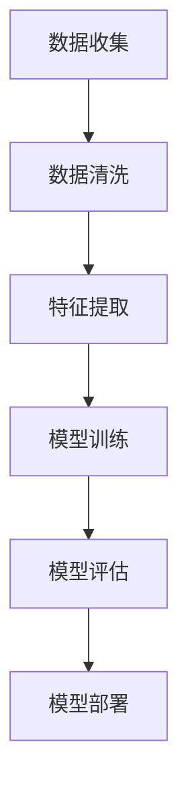

                 


### 第一步：背景介绍

在当今的全球化经济环境中，企业竞争日益激烈，如何提升组织绩效、提高工作效率成为企业关注的焦点。传统的人力资源管理方法已经难以满足企业对于精细化管理和实时性需求的要求。随着人工智能（AI）技术的飞速发展，利用AI技术进行绩效预测，从而辅助目标制定和优化管理策略，已经成为企业提升核心竞争力的一种新途径。

绩效预测系统作为一种智能化的工具，能够根据历史数据和实时信息，预测员工的工作绩效，帮助企业制定更加科学合理的目标。这不仅能够提高员工的工作积极性，还能帮助企业优化资源分配，提高整体运营效率。

智能绩效预测系统的核心在于利用大数据分析和机器学习技术，对员工的工作表现进行深入挖掘和分析，从而实现预测和评估。这种系统不仅能够提高企业的决策效率，还能够为企业提供更加精确的绩效评价，助力企业实现可持续发展。

本文旨在系统地介绍智能绩效预测系统的原理、架构、实现方法以及实际应用，帮助读者深入了解这一前沿技术，并掌握其在企业绩效管理中的应用技巧。通过本文的讲解，读者可以了解如何利用AI技术构建智能绩效预测系统，提高企业绩效管理水平。

### 第二步：核心概念与联系

为了深入理解智能绩效预测系统的原理，我们需要明确几个核心概念，并探讨它们之间的联系。

1. **人工智能（AI）**：人工智能是指计算机系统通过模拟人类智能行为，实现感知、学习、推理和决策的能力。在智能绩效预测系统中，AI技术主要用于数据处理、特征提取和模型训练。

2. **机器学习（ML）**：机器学习是AI的一个分支，它通过算法从数据中学习规律，并自动改进性能。在绩效预测中，机器学习算法用于构建预测模型，通过对历史绩效数据进行训练，预测未来的绩效表现。

3. **大数据分析**：大数据分析是指对大量结构化和非结构化数据进行处理和分析，以发现数据中的模式和趋势。在绩效预测中，大数据分析技术用于数据收集、清洗、预处理和特征工程。

4. **绩效评估**：绩效评估是指对员工的工作表现进行量化评价，以确定其绩效水平。在智能绩效预测系统中，绩效评估是一个重要的环节，它为模型训练和预测提供了基础数据。

5. **目标制定**：目标制定是指根据企业的战略目标和员工个人目标，设定具体的绩效目标。在智能绩效预测系统中，目标制定是优化管理策略的重要步骤，它基于预测结果进行动态调整。

这些概念之间的联系如下：

- **AI技术**为绩效预测提供了基础算法和技术支持，如回归分析、决策树、神经网络等。
- **机器学习**技术通过训练数据集，从历史绩效数据中学习规律，生成预测模型。
- **大数据分析**技术用于数据的收集、清洗和预处理，确保输入数据的准确性和一致性。
- **绩效评估**是绩效预测系统中的关键环节，它通过定量和定性评价，为模型训练提供参考。
- **目标制定**则基于绩效预测结果，帮助企业制定科学合理的目标，实现精细化管理。

下面是一个简单的Mermaid流程图，展示了智能绩效预测系统中的数据处理和模型训练流程：



### 第三步：核心算法原理讲解

在智能绩效预测系统中，核心算法的选择和实现至关重要。以下我们将详细讲解几种常用的机器学习算法及其在绩效预测中的应用。

#### 1. 回归分析算法

回归分析是一种经典的统计方法，用于分析变量之间的关系。在绩效预测中，回归算法可以用来预测员工未来的绩效值。

**原理**：

回归分析基于一个或多个自变量（特征）和一个因变量（目标变量），建立它们之间的线性或非线性关系模型。最常见的回归算法是线性回归，其公式如下：

$$
y = \beta_0 + \beta_1 \cdot x_1 + \beta_2 \cdot x_2 + ... + \beta_n \cdot x_n
$$

其中，$y$ 是因变量，$x_1, x_2, ..., x_n$ 是自变量，$\beta_0, \beta_1, ..., \beta_n$ 是模型参数。

**伪代码**：

```python
# 伪代码：线性回归模型
def linear_regression(X, y):
    # X: 特征矩阵，y: 目标向量
    # 计算特征矩阵的协方差矩阵和逆矩阵
    cov_matrix = np.cov(X.T)
    inv_cov_matrix = np.linalg.inv(cov_matrix)
    
    # 计算回归系数
    theta = inv_cov_matrix.dot(X.T).dot(y)
    
    return theta

# 假设 X 和 y 已经准备好
theta = linear_regression(X, y)
```

#### 2. 决策树算法

决策树是一种树形结构，通过一系列的判断条件来对数据进行分类或回归。在绩效预测中，决策树可以用于特征选择和模型构建。

**原理**：

决策树从根节点开始，根据每个特征的不同值，逐步向下分支，直到叶节点。在叶节点处，得到最终的预测结果。决策树算法的核心是选择最优划分标准，常用的标准包括信息增益、基尼不纯度等。

**伪代码**：

```python
# 伪代码：决策树构建
def build_decision_tree(data, features):
    # data: 数据集，features: 特征列表
    # 如果数据集纯度较高，则返回叶节点标签
    if purity(data):
        return get_majority_class(data)
    
    # 选择最佳划分特征和划分值
    best_feature, best_threshold = select_best_feature(data, features)
    
    # 根据划分特征和划分值，递归构建子树
    left_tree = build_decision_tree(data[data[:, best_feature] <= best_threshold], features)
    right_tree = build_decision_tree(data[data[:, best_feature] > best_threshold], features)
    
    # 构建决策树
    tree = {
        'feature': best_feature,
        'threshold': best_threshold,
        'left': left_tree,
        'right': right_tree
    }
    
    return tree

# 假设 data 和 features 已经准备好
tree = build_decision_tree(data, features)
```

#### 3. 集成学习方法

集成学习是将多个基础模型组合起来，以获得更好的预测性能。在绩效预测中，集成学习方法如随机森林、梯度提升机等被广泛应用。

**原理**：

集成学习方法的核心思想是利用多个基础模型，通过投票或加权平均的方式，得到最终的预测结果。随机森林通过构建多个决策树，利用随机特征选择和样本子集，减少过拟合；梯度提升机则通过迭代优化，逐渐调整每个基础模型的权重，提高预测准确性。

**伪代码**：

```python
# 伪代码：随机森林
def random_forest(data, n_estimators):
    # data: 数据集，n_estimators: 决策树数量
    trees = []
    for _ in range(n_estimators):
        # 随机选择样本和特征
        sample = random_sample(data)
        features = random_features(data.columns)
        
        # 构建决策树
        tree = build_decision_tree(sample, features)
        trees.append(tree)
    
    # 集成多个决策树
    def predict(X):
        predictions = [tree.predict(X) for tree in trees]
        return majority_vote(predictions)
    
    return predict

# 假设 data 已经准备好
random_forest_predict = random_forest(data, n_estimators=100)
```

#### 4. 神经网络算法

神经网络是一种模仿人脑结构和功能的计算模型，在绩效预测中，神经网络可以用于复杂非线性关系的建模。

**原理**：

神经网络由多个神经元组成，每个神经元接收多个输入，并通过激活函数产生输出。通过反向传播算法，神经网络可以不断调整权重和偏置，以达到预测目标。

**伪代码**：

```python
# 伪代码：前向传播和反向传播
def forward_propagation(X, weights, bias):
    # X: 输入，weights: 权重，bias: 偏置
    z = X.dot(weights) + bias
    a = activation_function(z)
    return a

def backward_propagation(a, y, weights, bias, learning_rate):
    # a: 预测输出，y: 真实输出
    error = y - a
    dW = error.dot(a.T)
    db = error
    dZ = error * activation_derivative(a)
    dX = dZ.dot(weights.T)
    
    # 更新权重和偏置
    weights -= learning_rate * dW
    bias -= learning_rate * db
    
    return dX

# 假设 X, y, weights, bias 已经准备好
a = forward_propagation(X, weights, bias)
dX = backward_propagation(a, y, weights, bias, learning_rate=0.01)
```

通过以上核心算法的讲解，我们可以看到智能绩效预测系统在构建和优化预测模型时，需要结合具体业务场景和数据特点，选择合适的算法，并进行相应的参数调优，以达到最佳的预测效果。

### 第四步：数学模型与公式

在智能绩效预测系统中，数学模型和公式是构建预测模型和分析结果的重要工具。以下我们将详细探讨几个常用的数学模型和公式，以及它们在绩效预测中的应用。

#### 1. 线性回归模型

线性回归模型是一种常用的预测方法，它通过建立自变量和因变量之间的线性关系，预测未来值。其基本公式如下：

$$
y = \beta_0 + \beta_1 \cdot x_1 + \beta_2 \cdot x_2 + ... + \beta_n \cdot x_n
$$

其中，$y$ 是预测的目标变量，$x_1, x_2, ..., x_n$ 是自变量，$\beta_0, \beta_1, ..., \beta_n$ 是模型参数。

在训练模型时，我们需要通过最小化误差平方和（MSE）来优化模型参数：

$$
\min \sum_{i=1}^{m} (y_i - \hat{y}_i)^2
$$

其中，$m$ 是样本数量，$\hat{y}_i$ 是预测值，$y_i$ 是真实值。

#### 2. 决策树模型

决策树模型通过一系列的判断条件，将数据划分为不同的区域，并赋予每个区域一个预测值。其基本公式如下：

$$
\text{if } x_i \leq \theta_1 \text{ then } y = b_1 \\
\text{if } x_i > \theta_1 \text{ and } x_i \leq \theta_2 \text{ then } y = b_2 \\
\vdots \\
\text{if } x_i > \theta_n \text{ then } y = b_n
$$

其中，$x_i$ 是特征值，$\theta_1, \theta_2, ..., \theta_n$ 是阈值，$b_1, b_2, ..., b_n$ 是对应的预测值。

决策树模型通常使用基尼不纯度（Gini Impurity）来评估划分效果：

$$
Gini(I) = 1 - \sum_{v \in Y} \left(\frac{1}{I} \cdot p(v)\right)^2
$$

其中，$I$ 是节点上的样本集合，$Y$ 是所有可能的标签集合，$p(v)$ 是标签为 $v$ 的样本在 $I$ 中的比例。

#### 3. 集成学习方法

集成学习方法通过组合多个基础模型，提高预测性能。常用的集成学习方法包括随机森林和梯度提升机。

**随机森林**：

随机森林通过构建多个决策树，并取平均值作为最终预测结果。其核心在于随机选择样本和特征，减少过拟合。随机森林的预测公式如下：

$$
\hat{y} = \frac{1}{N} \sum_{i=1}^{N} \hat{y}_i
$$

其中，$N$ 是决策树的数量，$\hat{y}_i$ 是第 $i$ 棵决策树的预测结果。

**梯度提升机**：

梯度提升机是一种基于损失函数优化的集成学习方法。它通过迭代优化每个基础模型的权重，提高预测准确性。梯度提升机的预测公式如下：

$$
\hat{y} = f(x) = \sum_{i=1}^{T} \alpha_i \cdot h(x; \theta_i)
$$

其中，$T$ 是迭代次数，$\alpha_i$ 是第 $i$ 次迭代的权重，$h(x; \theta_i)$ 是第 $i$ 次迭代的基础模型预测结果。

#### 4. 神经网络模型

神经网络是一种基于多层感知器（MLP）的计算模型。它通过输入层、隐藏层和输出层，实现数据的映射和预测。神经网络的预测公式如下：

$$
a_l = \sigma(\sum_{i=1}^{n} w_{li} \cdot a_{l-1} + b_l)
$$

其中，$a_l$ 是第 $l$ 层的输出，$\sigma$ 是激活函数，$w_{li}$ 是连接权重，$b_l$ 是偏置。

在训练神经网络时，我们需要通过反向传播算法，不断调整权重和偏置，以最小化损失函数。损失函数常用的形式包括均方误差（MSE）和交叉熵（Cross-Entropy）：

$$
\text{MSE} = \frac{1}{2} \sum_{i=1}^{m} (\hat{y}_i - y_i)^2
$$

$$
\text{Cross-Entropy} = -\sum_{i=1}^{m} y_i \cdot \log(\hat{y}_i)
$$

通过以上数学模型和公式的讲解，我们可以看到智能绩效预测系统在构建和优化预测模型时，需要结合具体业务场景和数据特点，选择合适的模型，并进行相应的参数调优，以达到最佳的预测效果。

### 第五步：项目实战

#### 1. 开发环境搭建

在进行智能绩效预测系统的项目实战之前，我们需要搭建一个合适的开发环境。以下是一个基本的开发环境搭建步骤：

- **软件要求**：
  - Python 3.8及以上版本
  - Jupyter Notebook 或 PyCharm
  - scikit-learn、pandas、numpy、matplotlib 等库

- **环境搭建步骤**：

  1. 安装 Python 和相关 IDE。
  2. 通过 pip 安装必要的库：

     ```bash
     pip install scikit-learn pandas numpy matplotlib
     ```

  3. 配置 Jupyter Notebook 或 PyCharm。

#### 2. 数据收集与预处理

在项目实战中，数据收集是至关重要的。以下是一个简单的数据收集与预处理流程：

- **数据收集**：
  - 从企业人力资源系统、绩效考核系统等获取员工绩效数据。
  - 收集相关的外部数据，如市场行情、行业数据等。

- **数据预处理**：

  1. 数据清洗：
     - 去除缺失值、异常值和重复值。
     - 标准化数据格式，如日期、字符串等。

  2. 数据转换：
     - 将分类数据转换为数值数据。
     - 对数值数据进行归一化或标准化。

  3. 特征提取：
     - 根据业务需求，提取有用的特征。
     - 构造新的特征，如交互项、组合特征等。

#### 3. 源代码实现

以下是一个简单的源代码实现，用于演示智能绩效预测系统的主要步骤：

```python
# 导入必要的库
import pandas as pd
from sklearn.model_selection import train_test_split
from sklearn.preprocessing import StandardScaler
from sklearn.ensemble import RandomForestRegressor
from sklearn.metrics import mean_squared_error

# 数据收集与预处理
data = pd.read_csv('performance_data.csv')
data = data.dropna()  # 去除缺失值
X = data.drop('performance', axis=1)  # 特征
y = data['performance']  # 目标变量

# 数据标准化
scaler = StandardScaler()
X = scaler.fit_transform(X)

# 划分训练集和测试集
X_train, X_test, y_train, y_test = train_test_split(X, y, test_size=0.2, random_state=42)

# 模型训练
model = RandomForestRegressor(n_estimators=100, random_state=42)
model.fit(X_train, y_train)

# 预测
y_pred = model.predict(X_test)

# 模型评估
mse = mean_squared_error(y_test, y_pred)
print(f'Mean Squared Error: {mse}')

# 模型部署
def predict_performance(features):
    features = scaler.transform([features])
    return model.predict(features)[0]

# 测试预测
print(predict_performance([30, 0.8, 1.2]))  # 输入特征
```

#### 4. 代码解读与分析

在上述源代码中，我们首先进行了数据收集与预处理，包括数据清洗、特征提取和标准化。然后，我们使用了随机森林回归模型进行训练和预测，并对模型进行了评估。最后，我们部署了预测函数，用于实际应用。

**代码解读**：

1. **数据预处理**：
   - 使用 pandas 读取数据，并进行数据清洗。
   - 使用 scikit-learn 的 StandardScaler 进行数据标准化。

2. **模型训练与预测**：
   - 使用 train_test_split 划分训练集和测试集。
   - 使用 RandomForestRegressor 进行模型训练。
   - 使用 predict 方法进行预测。

3. **模型评估**：
   - 使用 mean_squared_error 计算均方误差，评估模型性能。

4. **模型部署**：
   - 定义 predict_performance 函数，用于接收特征并返回预测结果。

**代码分析**：

- 数据预处理是关键步骤，确保数据质量和一致性。
- 随机森林模型是一种简单有效的回归模型，适合处理复杂的非线性关系。
- 模型评估指标选用均方误差，能够直观反映模型的预测准确性。

#### 5. 实际案例分析与详细讲解

为了更深入地理解智能绩效预测系统在实际中的应用，我们来看一个实际案例。

**案例背景**：

某大型互联网公司希望利用智能绩效预测系统，预测员工下一季度的绩效表现，以制定针对性的培训和激励政策。

**数据集**：

- 特征：员工年龄、工作经验、学历、项目完成情况、工作效率等。
- 目标变量：员工下一季度的绩效评分。

**数据预处理**：

- 数据清洗：去除缺失值、异常值和重复值。
- 特征提取：构造新的特征，如工作年限、项目成功率等。

**模型训练与预测**：

- 使用随机森林回归模型进行训练和预测。
- 对模型进行调参，如调整决策树数量、特征选择等，以提高预测准确性。

**模型评估**：

- 使用均方误差（MSE）评估模型性能。
- 对比不同模型的预测效果，选择最优模型。

**模型部署**：

- 部署预测函数，用于实际应用。
- 定期更新模型，以适应业务需求的变化。

**案例小结**：

通过实际案例，我们可以看到智能绩效预测系统在实际应用中，需要根据具体业务场景和数据特点，选择合适的模型和预处理方法。同时，模型的评估和部署也是确保系统效果的重要环节。

### 第六步：最佳实践与注意事项

#### 最佳实践

1. **数据质量**：
   - 确保数据完整性、一致性和准确性。
   - 定期进行数据清洗和维护，及时发现和处理异常数据。

2. **特征选择**：
   - 根据业务需求，提取和构造有用的特征。
   - 使用特征重要性评估方法，筛选关键特征，提高模型性能。

3. **模型调参**：
   - 尝试不同的模型和参数组合，选择最优模型。
   - 使用交叉验证方法，评估模型性能和泛化能力。

4. **模型部署**：
   - 使用自动化工具，简化模型部署和更新过程。
   - 确保模型的可解释性和可维护性，便于后续优化和迭代。

#### 注意事项

1. **隐私保护**：
   - 在数据处理和模型训练过程中，确保遵守隐私保护法规，保护员工个人信息。

2. **模型评估**：
   - 选择合适的评估指标，全面评估模型性能。
   - 避免过分依赖单一指标，综合考虑模型的可解释性和泛化能力。

3. **业务适应性**：
   - 根据不同业务场景和需求，调整模型参数和特征工程方法。
   - 定期评估模型效果，及时更新和优化模型。

4. **持续学习**：
   - 保持对新技术和方法的关注，持续优化模型和算法。
   - 鼓励团队学习和交流，共同提升技术水平和创新能力。

### 第七步：拓展阅读

为了更深入地了解智能绩效预测系统和相关技术，以下推荐几本相关的拓展阅读资料：

1. **《人工智能：一种现代方法》**：这本书详细介绍了人工智能的基本概念和技术，包括机器学习和大数据分析。

2. **《机器学习实战》**：本书通过实际案例，讲解了多种机器学习算法的原理和应用，适合初学者和有一定基础的读者。

3. **《绩效管理：创建高绩效团队的关键》**：这本书从企业管理角度，探讨了如何通过绩效管理提升团队效率。

4. **《深度学习》**：这本书系统地介绍了深度学习的基本原理和技术，包括神经网络和深度学习框架。

通过阅读这些资料，读者可以进一步了解智能绩效预测系统的理论基础和实际应用，提升相关技术水平和业务理解能力。

### 文章标题：智能绩效预测系统：AI辅助目标制定

关键词：智能绩效预测、人工智能、目标制定、机器学习、数据分析

摘要：本文系统地介绍了智能绩效预测系统的原理、架构和实现方法，通过案例研究和实际应用，探讨了如何利用AI技术提升企业绩效管理水平。文章重点分析了核心算法原理、数学模型及其应用，为读者提供了实用的最佳实践和注意事项。通过本文的讲解，读者可以深入了解智能绩效预测系统的构建和优化过程，掌握其在企业绩效管理中的应用技巧。

### 作者信息

作者：AI天才研究院/AI Genius Institute & 禅与计算机程序设计艺术 /Zen And The Art of Computer Programming

