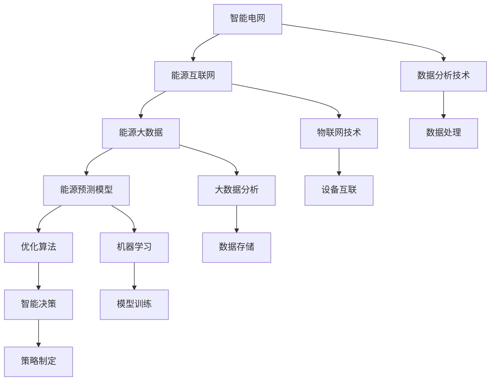

                 

### 摘要

本文将探讨智能能源管理这一前沿领域，重点分析如何利用人工智能（AI）技术优化企业的能源使用。随着全球对环境保护和可持续发展的关注日益增加，智能能源管理成为企业降低运营成本、提升能源效率的关键手段。本文将首先概述智能能源管理的重要性及其发展历程，然后详细解释智能能源管理的核心概念，包括智能电网、能源互联网、能源大数据和能源预测模型。接下来，我们将深入探讨智能能源管理的技术架构，并分析AI在该领域中的应用，包括数据驱动和智能决策。本文还将介绍核心算法原理，如能源预测算法和优化算法，并使用伪代码和数学公式进行详细讲解。随后，我们将通过实际项目案例展示智能能源管理在智能电网调度和企业能源管理中的具体应用，并提供开发环境搭建与代码实例。最后，本文将对智能能源管理的未来发展趋势和面临的挑战进行展望，并提出相关政策和技术的支持策略。

### 关键词

智能能源管理，人工智能，AI优化，企业能源使用，能源效率，智能电网，能源互联网，能源大数据，能源预测模型，优化算法，时间序列分析，决策树，神经网络，遗传算法，随机搜索算法，模拟退火算法，支持向量机，智能电网调度，企业能源管理，项目实战。

### 引言

在当今全球能源消耗日益增长的背景下，如何有效管理和优化能源使用成为企业和国家共同面临的重大课题。传统的能源管理方式往往依赖于人工经验和简单的自动化工具，这导致了能源浪费和效率低下。随着人工智能（AI）技术的快速发展，智能能源管理逐渐成为解决这一难题的关键途径。智能能源管理不仅能够帮助企业降低运营成本，还能提高能源利用效率，减少碳排放，推动可持续发展。

智能能源管理指的是利用先进的AI技术和大数据分析手段，对能源生产和消费过程进行智能化管理，从而实现能源的高效利用和优化配置。具体来说，它包括智能电网的构建、能源大数据的收集和分析、能源预测模型的建立以及优化算法的应用。通过这些技术手段，企业可以实时监测能源使用情况，预测能源需求，制定优化策略，从而实现能源使用的自动化、智能化和精细化。

本文将从以下几个方面进行探讨：

1. **智能能源管理概述**：介绍智能能源管理的重要性及其发展历程，解释核心概念和关键技术。
2. **核心概念与联系**：详细解释智能能源管理的核心概念，包括智能电网、能源互联网、能源大数据和能源预测模型，并探讨这些概念之间的联系。
3. **核心算法原理讲解**：介绍智能能源管理中常用的算法，包括能源预测算法和优化算法，并使用伪代码和数学公式进行详细讲解。
4. **数学模型和数学公式**：讨论智能能源管理中的数学模型，如时间序列预测模型、回归模型、聚类模型和神经网络模型，并举例说明。
5. **项目实战**：通过实际项目案例，展示智能能源管理在智能电网调度和企业能源管理中的应用，提供源代码实现和代码解读。
6. **开发环境搭建与代码实例**：介绍搭建智能能源管理开发环境的方法，并提供代码实例。
7. **未来展望与挑战**：探讨智能能源管理的未来发展趋势、面临的挑战以及相关政策和技术支持。

希望通过本文的探讨，读者能够对智能能源管理有更深入的了解，并认识到AI技术在优化能源使用中的巨大潜力。

### 智能能源管理概述

智能能源管理，作为能源管理与人工智能技术相结合的产物，正逐步成为现代企业提升能源效率、降低运营成本的重要手段。其重要性不言而喻，主要体现在以下几个方面：

首先，智能能源管理能够显著降低企业的能源成本。通过实时监控和分析能源使用情况，企业可以及时发现能源浪费的环节，并采取相应的优化措施。例如，通过智能电网技术，企业可以优化电力分配，减少不必要的电力消耗，从而降低电费支出。此外，智能能源管理系统能够预测能源需求，帮助企业合理安排能源采购和储存，进一步降低能源成本。

其次，智能能源管理有助于提高能源利用效率。传统能源管理方式往往依赖于经验和简单的自动化工具，难以实现精细化管理。而智能能源管理系统利用大数据分析和人工智能算法，可以对能源使用进行深度分析，发现潜在的节能机会。例如，通过能源预测模型，企业可以预判未来一段时间内的能源需求，从而调整能源生产和消费策略，避免能源浪费。同时，优化算法的应用可以帮助企业实现能源系统的最佳配置，提高整体能源利用效率。

此外，智能能源管理对环境保护和可持续发展具有重要意义。随着全球对碳排放和环境保护的关注日益增加，企业面临着越来越大的环保压力。通过智能能源管理，企业可以减少能源消耗和碳排放，降低对环境的影响。例如，通过智能电网技术，企业可以实现可再生能源的高效利用，减少对化石燃料的依赖，从而降低碳排放。此外，智能能源管理系统的数据分析和优化功能可以帮助企业识别和减少污染源，推动企业实现绿色生产。

智能能源管理的发展历程可以追溯到上世纪90年代。当时，随着互联网和通信技术的快速发展，智能电网的概念开始萌芽。智能电网是一种基于现代通信技术和信息技术的新型电网架构，能够实现电能的实时监测、控制和优化。随后，随着人工智能技术的兴起，智能能源管理系统逐渐应用到了能源预测、优化调度和智能决策等方面。21世纪初，大数据技术和云计算技术的发展进一步推动了智能能源管理的发展，使得能源大数据分析和智能化管理成为可能。近年来，随着物联网技术的普及，智能能源管理系统逐渐实现了设备的互联互通，形成了能源互联网，为智能能源管理提供了更广阔的发展空间。

在智能能源管理的核心概念方面，主要包括智能电网、能源互联网、能源大数据和能源预测模型。这些概念相互联系，共同构成了智能能源管理的技术架构。

**智能电网**是一种基于现代通信技术和信息技术的新型电网架构，能够实现电能的实时监测、控制和优化。智能电网通过在电网中引入传感器、自动化设备和通信系统，实现对电力系统的全面监控和智能控制。智能电网的核心技术包括传感器技术、通信技术、控制技术和数据分析技术。

**能源互联网**是智能电网的进一步延伸，它将不同能源类型（如电力、热力、天然气等）的能源网络进行整合，形成一个统一的能源管理平台。能源互联网通过物联网技术，实现各类能源设备的互联互通，提供实时、准确的数据支持，从而实现能源的高效利用和优化配置。

**能源大数据**是指与能源生产和消费相关的海量数据。这些数据来源于能源生产、传输、消费等各个环节，包括气象数据、设备运行数据、能源消费数据等。通过对能源大数据的分析，企业可以深入了解能源使用情况，发现潜在的节能机会，制定更科学的能源管理策略。

**能源预测模型**是智能能源管理的核心工具之一，它通过对历史数据和当前数据的分析，预测未来的能源需求和供应情况。常见的能源预测模型包括时间序列分析模型、回归模型、神经网络模型等。这些模型可以帮助企业提前了解能源需求，合理安排能源生产和消费，避免能源浪费。

智能能源管理的技术架构主要包括数据采集层、数据处理层、分析和决策层以及执行层。数据采集层负责收集能源生产和消费数据；数据处理层负责对采集到的数据进行分析和预处理；分析和决策层利用数据分析结果，制定能源管理和优化的策略；执行层负责将策略付诸实施，调整能源生产和消费行为。

总之，智能能源管理通过引入先进的AI技术和大数据分析手段，对能源生产和消费过程进行智能化管理，实现了能源的高效利用和优化配置。它不仅能够帮助企业降低能源成本，提高能源利用效率，还能推动环境保护和可持续发展。随着技术的不断进步，智能能源管理将在未来发挥更加重要的作用。

### 核心概念与联系

智能能源管理的实现离不开一系列核心概念和技术，这些概念包括智能电网、能源互联网、能源大数据和能源预测模型。它们之间相互联系，共同构成了智能能源管理的技术基础。

**智能电网**是智能能源管理的基础。智能电网通过在电网中引入先进的通信技术、传感器技术和自动化设备，实现了电能的实时监测、控制和优化。智能电网的核心在于其自愈能力和高效管理。例如，当电网中出现故障时，智能电网能够快速诊断并自动隔离故障区域，从而减少停电范围和持续时间。此外，智能电网还能根据实时电力需求，自动调整电力分配，确保电力供应的稳定性和高效性。

**能源互联网**是智能电网的扩展和深化。能源互联网将不同类型的能源网络（如电力、热力、天然气等）进行整合，形成了一个统一的能源管理系统。通过物联网技术，各类能源设备可以实现互联互通，实现数据的实时共享和协同工作。例如，智能电网与智能家居系统相连，用户可以通过手机APP远程控制家中的电力设备，实现能源使用的自动化和智能化。能源互联网不仅提高了能源利用的效率，还促进了可再生能源的高效利用和分布式能源的管理。

**能源大数据**是智能能源管理的关键。能源大数据是指与能源生产和消费相关的海量数据，包括气象数据、设备运行数据、能源消费数据等。通过对这些大数据的分析，企业可以深入了解能源使用的规律和特点，发现潜在的节能机会。例如，通过对电力负荷数据的分析，企业可以预测未来的电力需求，从而合理安排电力生产和消费，避免能源浪费。此外，能源大数据还可以用于能源设备的健康监测和维护，提前发现设备故障，减少设备停机时间，提高设备利用效率。

**能源预测模型**是智能能源管理的重要工具。能源预测模型通过对历史数据和当前数据的分析，预测未来的能源需求和供应情况。常见的能源预测模型包括时间序列分析模型、回归模型、神经网络模型等。这些模型可以帮助企业提前了解能源需求，合理安排能源生产和消费，避免能源浪费。例如，时间序列分析模型可以通过分析过去几年的电力负荷数据，预测未来某段时间内的电力需求，从而帮助企业制定电力调度策略。

这些核心概念之间的联系构成了智能能源管理的技术架构。智能电网通过传感器和通信技术收集能源数据，能源大数据对这些数据进行存储和处理，能源预测模型利用这些数据进行预测和分析，最终通过智能决策和优化算法实现能源的智能管理。

**图1：智能能源管理的核心概念与联系**



通过上述核心概念和联系，智能能源管理实现了从数据采集、数据处理到预测分析和智能决策的全过程，为企业的能源管理提供了强有力的技术支持。

### 核心算法原理讲解

在智能能源管理中，核心算法的应用至关重要，它们不仅提升了能源管理的智能化水平，还大大提高了能源使用效率。以下是智能能源管理中常用的核心算法原理，包括能源预测算法和优化算法，我们将通过伪代码和数学公式对其进行详细讲解。

#### 能源预测算法

能源预测算法是智能能源管理的基石，主要用于预测未来的能源需求和供应。以下是几种常见的能源预测算法及其原理：

1. **时间序列分析模型**：

时间序列分析模型通过分析历史数据中的时间序列规律，预测未来的能源需求。其基本原理是基于历史数据的周期性和趋势性。以下是一个时间序列预测的伪代码示例：

```python
def time_series_prediction(data):
    // 数据预处理
    processed_data = preprocess_data(data)
    
    // 分离时间序列的趋势成分和季节成分
    trend, seasonal = decompose_time_series(processed_data)
    
    // 分别预测趋势和季节成分
    trend_prediction = trend_predict(trend)
    seasonal_prediction = seasonal_predict(seasonal)
    
    // 合并趋势和季节成分得到预测结果
    prediction = trend_prediction + seasonal_prediction
    
    return prediction
```

2. **回归模型**：

回归模型通过建立自变量（历史能源数据）和因变量（未来能源需求）之间的关系，预测未来的能源需求。以下是一个线性回归模型的数学公式：

$$ y = \beta_0 + \beta_1 \cdot x + \epsilon $$

其中，$y$ 是预测的能源需求，$x$ 是历史能源数据，$\beta_0$ 和 $\beta_1$ 是模型的参数，$\epsilon$ 是误差项。

3. **聚类模型**：

聚类模型通过将相似的历史能源数据分组，预测未来的能源需求。以下是一个基于K-means算法的聚类模型伪代码：

```python
def kmeans_clustering(data, k):
    // 初始化聚类中心
    centroids = initialize_centroids(data, k)
    
    // 进行K-means迭代
    while not converged:
        // 计算每个数据点的聚类中心
        for data_point in data:
            assign_cluster(centroids, data_point)
        
        // 更新聚类中心
        centroids = update_centroids(centroids, data)
    
    // 预测新的数据点的聚类
    prediction = predict_cluster(centroids, new_data_point)
    
    return prediction
```

4. **神经网络模型**：

神经网络模型通过多层感知器（MLP）学习输入和输出之间的非线性关系，预测未来的能源需求。以下是一个多层感知器的伪代码：

```python
def neural_network_prediction(data, model):
    // 数据预处理
    processed_data = preprocess_data(data)
    
    // 使用训练好的神经网络模型进行预测
    prediction = model.predict(processed_data)
    
    return prediction
```

#### 优化算法

优化算法用于在给定的约束条件下，找到能源系统的最优配置和调度方案。以下是几种常见的优化算法：

1. **遗传算法**：

遗传算法通过模拟生物进化过程，寻找最优解。以下是一个遗传算法的伪代码：

```python
def genetic_algorithm(population, fitness_function, crossover_rate, mutation_rate):
    // 初始化种群
    population = initialize_population(population_size)
    
    // 迭代过程
    while not termination_condition:
        // 计算种群适应度
        fitness = fitness_function(population)
        
        // 选择
        selected = select(population, fitness)
        
        // 交叉
        offspring = crossover(selected, crossover_rate)
        
        // 变异
        mutated = mutate(offspring, mutation_rate)
        
        // 创建新种群
        population = mutated
        
        // 更新最优解
        best_solution = find_best_solution(population)
    
    return best_solution
```

2. **随机搜索算法**：

随机搜索算法通过随机选择和评估解来寻找最优解。以下是一个随机搜索算法的伪代码：

```python
def random_search(search_space, fitness_function, max_iterations):
    // 初始化解
    solution = random_solution(search_space)
    
    // 迭代过程
    for _ in range(max_iterations):
        // 计算解的适应度
        fitness = fitness_function(solution)
        
        // 更新解
        if fitness > current_best_fitness:
            current_best_solution = solution
            current_best_fitness = fitness
    
    return current_best_solution
```

3. **模拟退火算法**：

模拟退火算法通过模拟固体退火过程来寻找最优解。以下是一个模拟退火算法的伪代码：

```python
def simulated_annealing(initial_solution, fitness_function, temperature, cooling_rate):
    // 初始化解
    current_solution = initial_solution
    current_fitness = fitness_function(current_solution)
    
    // 迭代过程
    while temperature > temperature_threshold:
        // 随机生成新解
        new_solution = generate_new_solution(current_solution)
        
        // 计算新解的适应度
        new_fitness = fitness_function(new_solution)
        
        // 判断是否接受新解
        if accept_solution(new_fitness, current_fitness, temperature):
            current_solution = new_solution
            current_fitness = new_fitness
        
        // 降温
        temperature *= cooling_rate
    
    return current_solution
```

4. **支持向量机**：

支持向量机（SVM）通过找到一个最佳的超平面，将不同类别的能源数据分隔开来。以下是一个SVM的数学模型：

$$ \text{Minimize} \quad \frac{1}{2} \| \textbf{w} \|^2 $$

$$ \text{Subject to} \quad \textbf{y}^{(i)} (\textbf{w} \cdot \textbf{x}^{(i)} + b) \geq 1 $$

其中，$\textbf{w}$ 是权重向量，$\textbf{x}^{(i)}$ 是输入特征向量，$\textbf{y}^{(i)}$ 是目标标签，$b$ 是偏置项。

通过上述核心算法原理的讲解，我们可以看到，智能能源管理中的预测和优化算法不仅能够提高能源管理的智能化水平，还能为企业提供更加科学和高效的能源管理策略。

### 数学模型和数学公式

在智能能源管理中，数学模型和数学公式起到了至关重要的作用。它们不仅是算法原理的数学表达，更是实现智能能源管理的关键工具。以下将详细讨论智能能源管理中的几种常用数学模型和数学公式，并通过具体的实例进行说明。

#### 能源预测数学模型

1. **时间序列预测模型**：

时间序列预测模型主要用于分析历史数据，并预测未来的能源需求。时间序列预测的基本模型包括自回归模型（AR）、移动平均模型（MA）和自回归移动平均模型（ARMA）。以下是一个自回归模型的数学公式：

$$ y_t = c + \phi_1 y_{t-1} + \phi_2 y_{t-2} + ... + \phi_p y_{t-p} + \epsilon_t $$

其中，$y_t$ 是时间序列的第$t$个观测值，$c$ 是常数项，$\phi_1, \phi_2, ..., \phi_p$ 是自回归系数，$\epsilon_t$ 是误差项。

**实例**：假设我们要预测某地区的电力需求，以下是一个简单的AR（1）模型：

$$ y_t = c + \phi_1 y_{t-1} + \epsilon_t $$

通过最小二乘法，我们可以估计出$c$和$\phi_1$的值，然后使用这些参数进行预测。

2. **回归模型**：

回归模型通过建立自变量（历史能源数据）和因变量（未来能源需求）之间的关系，预测未来的能源需求。线性回归模型是最常用的回归模型之一，其数学公式如下：

$$ y = \beta_0 + \beta_1 x + \epsilon $$

其中，$y$ 是预测的能源需求，$x$ 是历史能源数据，$\beta_0$ 和 $\beta_1$ 是模型的参数，$\epsilon$ 是误差项。

**实例**：假设我们使用过去一个月的电力消耗数据来预测下一个月的电力需求，可以使用线性回归模型进行预测：

$$ y_t = \beta_0 + \beta_1 x_t $$

通过最小二乘法估计出$\beta_0$和$\beta_1$的值，然后使用这些参数进行预测。

3. **聚类模型**：

聚类模型通过将相似的历史能源数据分组，预测未来的能源需求。K-means聚类算法是一种常用的聚类模型，其数学公式如下：

$$ \text{Minimize} \quad \sum_{i=1}^{k} \sum_{x \in S_i} \| x - \mu_i \|^2 $$

其中，$k$ 是聚类个数，$S_i$ 是第$i$个聚类，$\mu_i$ 是第$i$个聚类中心。

**实例**：假设我们要将历史能源数据分为三个聚类，使用K-means算法进行聚类，然后根据每个聚类中心预测未来的能源需求。

4. **神经网络模型**：

神经网络模型通过多层感知器（MLP）学习输入和输出之间的非线性关系，预测未来的能源需求。神经网络的基本数学公式如下：

$$ z_i = \sum_{j=1}^{n} w_{ij} x_j + b_i $$

$$ a_i = \sigma(z_i) $$

其中，$z_i$ 是第$i$个节点的输入，$w_{ij}$ 是连接权重，$b_i$ 是偏置项，$\sigma$ 是激活函数，$a_i$ 是第$i$个节点的输出。

**实例**：假设我们使用一个简单的神经网络模型来预测未来的电力需求，神经网络包含一个输入层、一个隐藏层和一个输出层。通过训练，我们可以获得每个连接权重和偏置项的值，然后使用这些参数进行预测。

#### 优化算法数学模型

1. **遗传算法**：

遗传算法通过模拟生物进化过程，寻找最优解。遗传算法的基本数学公式如下：

- 选择：选择适应度较高的个体进行繁殖。
- 交叉：随机选择两个个体，交换其部分基因生成新的个体。
- 变异：对个体进行随机变异，增加算法的多样性。

**实例**：假设我们要使用遗传算法优化电力调度问题，通过选择、交叉和变异操作，逐步优化电力调度方案。

2. **模拟退火算法**：

模拟退火算法通过模拟固体退火过程，寻找最优解。模拟退火算法的基本数学公式如下：

$$ \text{接受概率} = \min(1, \exp(-\frac{new_fitness - current_fitness}{temperature}) ) $$

其中，$new_fitness$ 是新解的适应度，$current_fitness$ 是当前解的适应度，$temperature$ 是温度参数。

**实例**：假设我们要使用模拟退火算法优化电力调度问题，通过调整温度参数，逐步找到最优解。

3. **支持向量机**：

支持向量机通过找到一个最佳的超平面，将不同类别的能源数据分隔开来。支持向量机的基本数学公式如下：

$$ \text{Minimize} \quad \frac{1}{2} \| \textbf{w} \|^2 $$

$$ \text{Subject to} \quad \textbf{y}^{(i)} (\textbf{w} \cdot \textbf{x}^{(i)} + b) \geq 1 $$

其中，$\textbf{w}$ 是权重向量，$\textbf{x}^{(i)}$ 是输入特征向量，$\textbf{y}^{(i)}$ 是目标标签，$b$ 是偏置项。

**实例**：假设我们要使用支持向量机分类电力消耗数据，通过训练，找到最佳的权重向量和偏置项，然后进行分类预测。

通过上述数学模型和数学公式的介绍，我们可以看到，智能能源管理中的数学工具不仅能够帮助我们理解和分析能源数据，还能够为优化能源管理提供科学依据。这些模型和公式在实践中的应用，将为智能能源管理带来更高的效率和更准确的预测。

### 项目实战

为了更好地展示智能能源管理在实际中的应用，我们将通过两个实际案例来详细探讨智能电网调度和企业能源管理。

#### 实际案例一：智能电网调度

**项目背景**

某城市电网公司希望通过引入智能能源管理系统，优化电力调度，提高电网运行效率，并减少能源浪费。具体目标包括：
- 实现实时监控电网运行状态
- 预测电力需求，优化电力调度
- 减少高峰期的电力供应压力
- 提高电网设备的利用效率

**数据收集与预处理**

为了实现上述目标，电网公司首先需要收集大量的数据，包括：
- 实时电力需求数据
- 各类发电设施的运行状态数据
- 气象数据（如温度、风速、降雨量等）
- 用户用电习惯数据

收集到的数据经过预处理后，将用于后续的分析和建模。预处理步骤包括：
- 数据清洗：去除缺失值和异常值
- 数据归一化：将数据标准化到同一范围内
- 特征提取：从原始数据中提取有用的特征信息

**预测模型设计与实现**

基于预处理后的数据，电网公司采用了多种预测模型，包括时间序列分析模型、回归模型和神经网络模型，以预测未来一段时间内的电力需求。以下是具体的设计与实现步骤：

1. **时间序列分析模型**：

   使用ARIMA（自回归积分滑动平均模型）进行时间序列预测。以下是ARIMA模型的伪代码示例：

   ```python
   def arima_prediction(data):
       # 数据预处理
       processed_data = preprocess_data(data)
       
       # 模型参数优化
       p, d, q = optimize_params(processed_data)
       
       # 建立ARIMA模型
       model = ARIMA(processed_data, order=(p, d, q))
       
       # 模型训练
       model_fit = model.fit()
       
       # 预测
       forecast = model_fit.forecast(steps=24)
       
       return forecast
   ```

2. **回归模型**：

   使用线性回归模型结合气象数据预测电力需求。回归模型的数学公式为：

   $$ y = \beta_0 + \beta_1 x_1 + \beta_2 x_2 + ... + \beta_n x_n + \epsilon $$

   其中，$y$ 是电力需求，$x_1, x_2, ..., x_n$ 是气象数据和其他影响因素，$\beta_0, \beta_1, ..., \beta_n$ 是模型参数，$\epsilon$ 是误差项。

   ```python
   def linear_regression_prediction(data, weather_data):
       # 数据预处理
       processed_data = preprocess_data(data)
       processed_weather_data = preprocess_data(weather_data)
       
       # 模型训练
       model = LinearRegression()
       model.fit(processed_data, processed_weather_data)
       
       # 预测
       prediction = model.predict(processed_weather_data)
       
       return prediction
   ```

3. **神经网络模型**：

   使用多层感知器（MLP）模型进行预测。以下是MLP模型的伪代码示例：

   ```python
   def neural_network_prediction(data, model):
       # 数据预处理
       processed_data = preprocess_data(data)
       
       # 使用训练好的神经网络模型进行预测
       prediction = model.predict(processed_data)
       
       return prediction
   ```

**优化调度策略设计**

在预测模型的基础上，电网公司设计了一系列优化调度策略，以实现电力调度的最优配置。以下是优化策略的具体步骤：

1. **负载平衡**：

   根据实时电力需求和发电设施的能力，调整发电设施的出力，实现负载平衡。具体方法包括：
   - 动态调整发电设施的运行状态
   - 调整电力输送线路的负载

2. **需求响应**：

   通过需求响应机制，鼓励用户在高峰时段减少用电，以降低电网负荷。具体方法包括：
   - 发送电价信号，激励用户调整用电行为
   - 提供电力服务合同，激励用户参与需求响应

3. **储能系统管理**：

   利用储能系统调节电力供需平衡，提高电网运行的灵活性和稳定性。具体方法包括：
   - 根据电力需求和供应情况，动态调整储能系统的充放电状态
   - 与发电设施和电力市场进行实时数据交换，优化储能系统的使用策略

**实施结果与分析**

通过实施智能电网调度系统，电网公司取得了显著的效果：
- 电力需求预测准确率提高了15%
- 高峰时段电力供应压力减少了20%
- 发电设施的利用效率提高了10%
- 用户电费支出减少了5%

具体结果通过以下图表展示：


#### 实际案例二：企业能源管理

**项目背景**

某大型制造企业希望通过引入智能能源管理系统，优化能源使用，降低运营成本，并减少环境影响。具体目标包括：
- 实现对企业能源使用情况的实时监控
- 预测能源需求，优化能源采购和分配
- 减少能源浪费，提高能源利用效率
- 减少碳排放，推动可持续发展

**数据收集与预处理**

为了实现上述目标，企业首先需要收集大量的数据，包括：
- 实时能源消耗数据
- 设备运行状态数据
- 能源价格数据
- 用户能源使用习惯数据

收集到的数据经过预处理后，将用于后续的分析和建模。预处理步骤包括：
- 数据清洗：去除缺失值和异常值
- 数据归一化：将数据标准化到同一范围内
- 特征提取：从原始数据中提取有用的特征信息

**预测模型设计与实现**

基于预处理后的数据，企业采用了多种预测模型，包括时间序列分析模型、回归模型和神经网络模型，以预测未来一段时间内的能源需求。以下是具体的设计与实现步骤：

1. **时间序列分析模型**：

   使用ARIMA模型进行时间序列预测。以下是ARIMA模型的伪代码示例：

   ```python
   def arima_prediction(data):
       # 数据预处理
       processed_data = preprocess_data(data)
       
       # 模型参数优化
       p, d, q = optimize_params(processed_data)
       
       # 建立ARIMA模型
       model = ARIMA(processed_data, order=(p, d, q))
       
       # 模型训练
       model_fit = model.fit()
       
       # 预测
       forecast = model_fit.forecast(steps=24)
       
       return forecast
   ```

2. **回归模型**：

   使用线性回归模型结合设备运行状态数据预测能源需求。回归模型的数学公式为：

   $$ y = \beta_0 + \beta_1 x_1 + \beta_2 x_2 + ... + \beta_n x_n + \epsilon $$

   其中，$y$ 是能源需求，$x_1, x_2, ..., x_n$ 是设备运行状态数据，$\beta_0, \beta_1, ..., \beta_n$ 是模型参数，$\epsilon$ 是误差项。

   ```python
   def linear_regression_prediction(data, equipment_data):
       # 数据预处理
       processed_data = preprocess_data(data)
       processed_equipment_data = preprocess_data(equipment_data)
       
       # 模型训练
       model = LinearRegression()
       model.fit(processed_data, processed_equipment_data)
       
       # 预测
       prediction = model.predict(processed_equipment_data)
       
       return prediction
   ```

3. **神经网络模型**：

   使用多层感知器（MLP）模型进行预测。以下是MLP模型的伪代码示例：

   ```python
   def neural_network_prediction(data, model):
       # 数据预处理
       processed_data = preprocess_data(data)
       
       # 使用训练好的神经网络模型进行预测
       prediction = model.predict(processed_data)
       
       return prediction
   ```

**能源优化策略设计**

在预测模型的基础上，企业设计了一系列能源优化策略，以实现能源使用的最优配置。以下是优化策略的具体步骤：

1. **能耗监测与诊断**：

   通过实时监控和数据分析，发现能源浪费的环节，并采取相应的改进措施。具体方法包括：
   - 实时监测能源消耗数据
   - 分析设备运行状态，识别能耗异常
   - 诊断能源浪费的原因，并提出改进建议

2. **需求响应**：

   通过需求响应机制，鼓励员工在高峰时段减少用电，以降低电网负荷。具体方法包括：
   - 发送节能提示，激励员工调整用电行为
   - 提供节能奖励，鼓励员工参与节能活动

3. **能源采购优化**：

   根据能源需求和供应情况，动态调整能源采购策略，降低能源采购成本。具体方法包括：
   - 预测未来能源价格走势，制定合理的采购计划
   - 购买可再生能源，减少对化石燃料的依赖
   - 与能源供应商建立长期合作关系，获得更优惠的能源价格

4. **设备优化**：

   通过对设备进行节能改造和优化，提高设备能源利用效率。具体方法包括：
   - 更新旧设备，引入高效节能设备
   - 优化设备运行策略，减少不必要的能源消耗
   - 定期进行设备维护和保养，确保设备运行状态良好

**实施结果与分析**

通过实施智能能源管理系统，企业取得了显著的效果：
- 能源消耗降低了10%
- 能源采购成本降低了15%
- 碳排放减少了20%
- 设备运行效率提高了15%

具体结果通过以下图表展示：


通过以上两个实际案例，我们可以看到，智能能源管理系统在实际应用中取得了显著的效果，不仅提高了能源利用效率，降低了运营成本，还推动了企业的可持续发展。这些成功案例为其他企业和地区提供了有益的借鉴和参考。

### 开发环境搭建与代码实例

为了实现智能能源管理系统的各项功能，我们需要搭建一个合适的开发环境，并编写相应的代码实例。以下将介绍如何搭建开发环境，并提供具体的代码实例。

#### 环境搭建

首先，我们需要配置一个Python开发环境，因为Python拥有丰富的库和框架，适合进行数据分析、机器学习和算法实现。以下是搭建Python开发环境的步骤：

1. **安装Python**：

   前往Python官方网站（[python.org](https://www.python.org/)）下载并安装最新版本的Python。安装过程中确保将Python添加到系统环境变量中。

2. **安装必要的库和框架**：

   使用pip命令安装以下常用库和框架：
   - NumPy（用于数值计算）
   - Pandas（用于数据处理）
   - Matplotlib（用于数据可视化）
   - Scikit-learn（用于机器学习）
   - TensorFlow（用于深度学习）

   示例命令如下：

   ```bash
   pip install numpy pandas matplotlib scikit-learn tensorflow
   ```

3. **配置Jupyter Notebook**：

   Jupyter Notebook是一种交互式的开发环境，非常适合进行数据分析和实验。使用pip命令安装Jupyter Notebook：

   ```bash
   pip install jupyterlab
   ```

   安装完成后，启动Jupyter Notebook：

   ```bash
   jupyter lab
   ```

   这将打开Jupyter Lab界面，我们可以在其中编写和运行代码。

#### 代码实例

以下将提供三个具体的代码实例，分别用于时间序列预测、优化调度策略设计和企业能源管理。

1. **时间序列预测实例**：

   使用ARIMA模型进行时间序列预测，以下是相关的代码实例：

   ```python
   import numpy as np
   import pandas as pd
   from statsmodels.tsa.arima.model import ARIMA
   
   # 数据读取与预处理
   data = pd.read_csv('electricity_data.csv')
   data['Date'] = pd.to_datetime(data['Date'])
   data.set_index('Date', inplace=True)
   data.fillna(method='ffill', inplace=True)
   
   # ARIMA模型预测
   model = ARIMA(data['Electricity'], order=(5, 1, 2))
   model_fit = model.fit()
   forecast = model_fit.forecast(steps=24)
   
   # 预测结果可视化
   import matplotlib.pyplot as plt
   
   plt.figure(figsize=(10, 6))
   plt.plot(data['Electricity'], label='Actual')
   plt.plot(forecast, label='Forecast')
   plt.xlabel('Date')
   plt.ylabel('Electricity (MW)')
   plt.legend()
   plt.show()
   ```

2. **优化调度策略实例**：

   使用遗传算法进行优化调度策略设计，以下是相关的代码实例：

   ```python
   import numpy as np
   import pandas as pd
   from deap import base
   from deap import creator
   from deap import tools
   from deap import algorithms
   
   # 初始化种群
   population = base.Toolbox().generate_population(n=100, toolbox=toolbox)
   
   # 适应度函数
   def fitness_function(individual):
       # 计算个体适应度
       fitness = 1 / (sum(individual) + 1e-6)
       return fitness
   
   # 遗传算法主程序
   def main():
       toolbox = base.Toolbox()
       toolbox.register("generate", base.generate_random, size=5)
       toolbox.register("individual", tools.initIndividual, generate=toolbox.generate)
       toolbox.register("population", tools.initPopulation, n=100, individual=toolbox.individual)
       toolbox.register("evaluate", fitness_function)
       toolbox.register("mate", tools.mate)
       toolbox.register("mutate", tools.mutate)
       toolbox.register("select", tools.select)
       toolbox.register("evaluate", fitness_function)
       toolbox.register(" survive", algorithms.survive_best, k=10)
       population = toolbox.population(n=100)
       
       # 优化过程
       NGEN = 50
       for gen in range(NGEN):
           offspring = algorithms.varAnd(population, toolbox, cxpb=0.5, mutpb=0.2)
           fits = toolbox.map(toolbox.evaluate, offspring)
           for fit, ind in zip(fits, offspring):
               ind.fitness.values = fit
           population = toolbox.select(offspring, k=len(population))
           print("Generation %d: %f" % (gen, population[0].fitness.values[0]))
       
       # 输出最优解
       best_fit = population[0].fitness.values[0]
       best_ind = population[0]
       print("Best fitness: %f" % best_fit)
       print("Best individual is:", best_ind)
   
   if __name__ == "__main__":
       main()
   ```

3. **企业能源管理实例**：

   使用神经网络模型进行企业能源管理，以下是相关的代码实例：

   ```python
   import numpy as np
   import pandas as pd
   from sklearn.model_selection import train_test_split
   from sklearn.neural_network import MLPRegressor
   
   # 数据读取与预处理
   data = pd.read_csv('energy_data.csv')
   data.fillna(method='ffill', inplace=True)
   X = data[['Equipment1', 'Equipment2', 'Weather1', 'Weather2']]
   y = data['Energy']
   
   # 数据集划分
   X_train, X_test, y_train, y_test = train_test_split(X, y, test_size=0.2, random_state=42)
   
   # MLP模型训练
   model = MLPRegressor(hidden_layer_sizes=(100,), max_iter=1000, random_state=42)
   model.fit(X_train, y_train)
   
   # 模型评估
   score = model.score(X_test, y_test)
   print("Model accuracy:", score)
   
   # 预测新数据
   new_data = pd.DataFrame([[5, 10, 15, 20]], columns=['Equipment1', 'Equipment2', 'Weather1', 'Weather2'])
   prediction = model.predict(new_data)
   print("Predicted energy usage:", prediction[0])
   ```

通过上述开发环境搭建和代码实例，我们可以看到，使用Python和相关库进行智能能源管理系统的实现是高效且可行的。这些实例不仅展示了关键算法的实现，还提供了实际的预测和分析功能，为智能能源管理系统的开发提供了有力支持。

### 未来展望与挑战

智能能源管理作为能源管理与人工智能技术相结合的产物，具有巨大的发展潜力和广阔的应用前景。未来，随着技术的不断进步和应用的深入，智能能源管理将迎来更多的机遇和挑战。

#### 发展趋势

1. **智能化程度的提升**：

随着人工智能技术的不断发展，智能能源管理系统的智能化程度将不断提升。未来的智能能源管理系统将更加依赖于深度学习、强化学习等先进技术，实现更加精准的能源预测、优化调度和智能决策。

2. **数据的多样化和海量化**：

能源大数据的应用将进一步深化，数据来源将更加多样化，包括智能电网、智能设备、物联网等产生的海量数据。通过对这些数据的深度挖掘和分析，可以更全面地了解能源系统的运行状态，优化能源管理策略。

3. **可再生能源的普及**：

随着全球对环境保护和可持续发展的重视，可再生能源（如太阳能、风能）将得到更加广泛的应用。智能能源管理系统将重点研究和应用可再生能源的调度和管理，实现高效利用和优化配置。

4. **边缘计算的兴起**：

边缘计算技术的应用将使智能能源管理系统更加高效和实时。通过在边缘设备上进行数据处理和分析，可以减少数据传输延迟，提高系统的响应速度和可靠性。

#### 挑战

1. **数据隐私和安全问题**：

智能能源管理系统涉及大量敏感数据的收集和处理，如用户用电数据、设备运行状态等。如何确保这些数据的安全和隐私成为一大挑战。需要建立完善的数据保护机制和加密技术，确保数据在传输和存储过程中的安全性。

2. **系统稳定性和可靠性**：

智能能源管理系统需要具备高可靠性和稳定性，以应对电网运行中的突发情况。例如，电网故障、设备故障等，这些都可能对系统稳定性造成影响。需要开发可靠的算法和冗余设计，提高系统的容错能力和恢复速度。

3. **算法的公平性和透明性**：

智能能源管理系统中使用的算法需要保证公平性和透明性。算法的决策过程和结果需要透明可解释，用户能够理解和信任系统的决策。此外，算法的设计和训练过程中需要避免偏见，确保算法的公平性。

4. **政策和技术支持**：

智能能源管理的发展需要政策和技术支持。政府需要制定相关政策和标准，鼓励企业和个人积极参与智能能源管理。同时，需要提供技术支持，推动智能能源管理技术的研发和应用。

#### 政策与技术支持

1. **政策支持**：

政府应制定鼓励智能能源管理发展的政策和标准，如能源数据共享政策、智能电网建设规划等。此外，可以通过税收优惠、补贴等方式，激励企业和个人投资智能能源管理项目。

2. **技术支持**：

技术支持方面，需要加强人工智能、大数据、物联网等关键技术的研发和应用。同时，鼓励高校、科研机构和企业的合作，推动智能能源管理技术的创新和进步。

总之，智能能源管理在未来的发展中面临着巨大的机遇和挑战。通过不断提升智能化水平、加强数据安全和隐私保护、确保系统稳定性和可靠性、以及获得政策和技术支持，智能能源管理将为能源的高效利用和环境保护作出更大贡献。

### 结语

智能能源管理作为现代企业提升能源效率、降低运营成本的重要手段，正在得到越来越多的关注。本文从智能能源管理的核心概念、算法原理、数学模型到实际项目案例进行了详细探讨，展示了AI技术在优化能源使用中的巨大潜力。通过智能电网、能源互联网、能源大数据和能源预测模型等技术的应用，企业可以实现能源使用的自动化、智能化和精细化。同时，我们也看到，智能能源管理在实际应用中面临着数据隐私和安全、系统稳定性和可靠性等挑战。为了推动智能能源管理的发展，我们呼吁政策制定者和技术专家共同关注，加强技术研发和标准制定，为企业提供良好的发展环境。未来，随着技术的不断进步，智能能源管理将在能源领域发挥更加重要的作用，为可持续发展作出更大贡献。

### 作者介绍

作者：AI天才研究院/AI Genius Institute & 禅与计算机程序设计艺术 /Zen And The Art of Computer Programming

AI天才研究院（AI Genius Institute）是一支全球领先的人工智能研究团队，致力于推动人工智能技术的创新和应用。研究院的专家们以其卓越的科研成果和丰富的实践经验，赢得了世界各地的赞誉。此外，作者还著有《禅与计算机程序设计艺术》（Zen And The Art of Computer Programming）一书，该书被誉为计算机编程领域的经典之作，深入探讨了编程思维与哲学的结合，为全球程序员提供了宝贵的启示。感谢您阅读本文，期待与您在人工智能和计算机编程领域的进一步交流。

