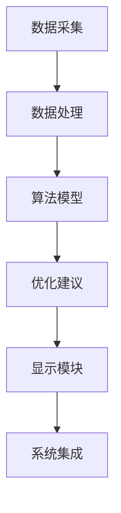
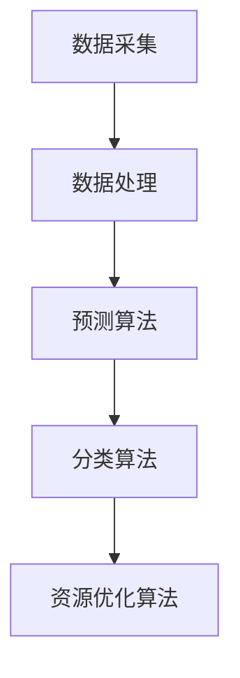

                 

### 文章标题

# 智能资产追踪平台：AI优化资源管理

### 文章关键词

- 智能资产追踪
- AI优化
- 资源管理
- 数据分析
- 深度学习

### 文章摘要

本文将探讨智能资产追踪平台在AI优化资源管理中的应用。首先，我们将介绍智能资产追踪平台的基本概念和背景，然后深入探讨AI在资源管理中的关键作用。接着，我们将详细讲解AI优化资源管理的主要算法和模型，以及如何构建一个智能资产追踪平台。随后，我们将通过实际案例展示这些算法和模型在实践中的应用，并分析其效果。最后，我们将探讨智能资产追踪平台的发展趋势和未来方向。

---

## 第一部分：引言与基础理论

### 第1章：智能资产追踪平台概述

#### 1.1 智能资产追踪平台的背景和重要性

智能资产追踪平台是一种利用人工智能（AI）技术进行资源管理的系统，它能够实时监控、分析和优化各种资产的使用情况。在当今数字化时代，企业面临着越来越复杂的资源管理挑战，如资源浪费、效率低下和成本增加等问题。因此，智能资产追踪平台的出现显得尤为重要。

智能资产追踪平台的发展历程可以追溯到20世纪末，随着计算机技术和网络技术的快速发展，数据采集和处理能力得到了显著提升。这为智能资产追踪平台的诞生提供了坚实的基础。近年来，随着深度学习、大数据分析等AI技术的不断进步，智能资产追踪平台的应用范围和效果得到了进一步扩展和提升。

#### 1.2 智能资产追踪平台的关键技术

智能资产追踪平台的关键技术主要包括数据采集、数据处理、算法模型和系统集成等几个方面。

- **数据采集**：数据采集是智能资产追踪平台的基础，包括传感器数据、日志数据、用户行为数据等。这些数据反映了资产的状态和使用情况，为后续的分析和优化提供了依据。

- **数据处理**：数据处理是对采集到的数据进行清洗、转换和整合的过程。通过数据处理，可以提取出有用的信息，为算法模型提供数据支持。

- **算法模型**：算法模型是智能资产追踪平台的核心，包括资源优化算法、预测算法和分类算法等。这些算法能够对资产的使用情况进行分析和预测，并提出优化建议。

- **系统集成**：系统集成是将各个模块整合在一起，形成一个完整的智能资产追踪平台。系统集成需要考虑数据的传输、存储和处理，以及与其他系统的集成。

#### 1.3 AI优化资源管理基础

AI优化资源管理是智能资产追踪平台的核心功能，其基础包括以下几个方面：

- **深度学习**：深度学习是一种强大的机器学习技术，通过构建深层的神经网络模型，能够对大量数据进行自动学习和特征提取。

- **数据分析**：数据分析是对数据进行分析和处理，以发现数据中的模式和规律。数据分析技术包括统计分析、数据挖掘和机器学习等。

- **预测算法**：预测算法能够根据历史数据和当前状态，预测未来的发展趋势和变化情况。

- **资源优化算法**：资源优化算法能够根据预测结果，优化资源的分配和使用，以提高效率和降低成本。

#### 1.4 智能资产追踪平台的基本架构

智能资产追踪平台的基本架构通常包括以下几个部分：

- **数据采集模块**：负责实时采集各种资产的使用数据。

- **数据处理模块**：负责对采集到的数据进行清洗、转换和整合。

- **算法模块**：负责对数据进行分析和处理，包括资源优化算法、预测算法等。

- **显示模块**：负责将分析结果以图表、报表等形式展示给用户。

- **系统集成模块**：负责与其他系统进行集成，实现数据共享和协同工作。

### 核心概念与联系

为了更好地理解智能资产追踪平台，我们需要了解以下几个核心概念之间的关系：

- **智能资产**：指企业中各种有形和无形资产，如设备、库存、人员等。

- **追踪**：指对智能资产进行实时监控和分析。

- **优化**：指根据分析结果，调整资产的使用策略，以达到最佳效果。

- **资源管理**：指对企业内部资源的分配、使用和管理。

- **AI优化**：指利用人工智能技术，对资源管理进行自动化和智能化。

### Mermaid 流程图



### 第2章：AI优化资源管理核心算法原理讲解

#### 2.1 资源优化算法

资源优化算法是智能资产追踪平台的核心算法之一，其目的是通过分析资产的使用情况，优化资源的分配和使用。以下是一些常见的资源优化算法：

- **线性规划**：线性规划是一种用于解决资源分配问题的数学方法，通过建立线性方程组，求解最优解。

- **遗传算法**：遗传算法是一种基于生物进化的优化算法，通过模拟自然进化过程，逐步优化资源分配。

- **粒子群优化**：粒子群优化是一种基于群体智能的优化算法，通过模拟鸟群或鱼群的行为，优化资源分配。

- **神经网络**：神经网络是一种基于人脑结构的计算模型，能够通过学习大量数据，优化资源分配。

#### 2.2 预测算法

预测算法是智能资产追踪平台的另一个核心算法，其目的是根据历史数据和当前状态，预测未来的发展趋势和变化情况。以下是一些常见的预测算法：

- **时间序列分析**：时间序列分析是一种用于分析时间序列数据的方法，通过建立数学模型，预测未来的变化趋势。

- **回归分析**：回归分析是一种用于建立变量之间关系的数学方法，通过建立回归模型，预测未来的变化趋势。

- **ARIMA模型**：ARIMA模型是一种用于时间序列预测的数学模型，通过分析数据的自相关性，预测未来的变化趋势。

- **LSTM模型**：LSTM模型是一种用于时间序列预测的深度学习模型，通过学习大量数据，预测未来的变化趋势。

#### 2.3 分类算法

分类算法是智能资产追踪平台的另一个核心算法，其目的是根据资产的特征，将其划分为不同的类别。以下是一些常见的分类算法：

- **决策树**：决策树是一种基于树结构的分类方法，通过递归划分特征空间，构建决策树。

- **支持向量机**：支持向量机是一种基于核函数的分类方法，通过寻找最优决策边界，分类资产。

- **随机森林**：随机森林是一种基于决策树的集成学习方法，通过构建多个决策树，提高分类准确性。

- **K-最近邻**：K-最近邻是一种基于实例的分类方法，通过计算实例之间的距离，分类资产。

### 伪代码

以下是一个简单的线性规划算法的伪代码示例：

```python
# 输入：目标函数系数、约束条件系数、变量范围
# 输出：最优解

def linear_programming(c, A, b, x_min, x_max):
    # 求解最优解
    # 返回最优解和最优值
    pass
```

### 数学模型和公式

以下是一个简单的线性规划问题的数学模型：

$$
\begin{aligned}
    \min_{x} & \quad c^T x \\
    s.t. & \quad Ax \leq b \\
    & \quad x \geq x_{\min} \\
    & \quad x \leq x_{\max}
\end{aligned}
$$

其中，$c$ 是目标函数系数，$A$ 是约束条件系数，$b$ 是约束条件常数，$x$ 是变量。

### 举例说明

假设我们要优化一个工厂的生产计划，目标是使生产成本最低。我们可以建立如下的线性规划模型：

$$
\begin{aligned}
    \min_{x} & \quad 2x_1 + 3x_2 \\
    s.t. & \quad x_1 + x_2 \geq 10 \\
    & \quad x_1 \geq 0 \\
    & \quad x_2 \geq 0
\end{aligned}
$$

其中，$x_1$ 和 $x_2$ 分别表示两种产品的生产数量。

通过求解这个线性规划模型，我们可以得到最优解 $x_1 = 5$ 和 $x_2 = 5$，此时生产成本最低。

### 数学公式

以下是一个简单的回归模型的数学公式：

$$
y = \beta_0 + \beta_1 x
$$

其中，$y$ 是因变量，$x$ 是自变量，$\beta_0$ 和 $\beta_1$ 是回归系数。

### 详细讲解

线性规划是一种数学优化方法，用于求解在给定约束条件下，目标函数的最大值或最小值。在智能资产追踪平台中，线性规划可以用于优化资源分配，例如生产计划、物流调度等。

线性规划的基本思想是通过建立线性方程组，将问题转化为数学模型，然后求解最优解。具体来说，线性规划包括以下几个步骤：

1. **定义变量**：首先，我们需要定义问题中的变量，例如生产数量、运输量等。

2. **建立目标函数**：目标函数表示我们要优化的目标，例如最小化成本、最大化利润等。

3. **建立约束条件**：约束条件表示问题的限制条件，例如资源的限制、时间的限制等。

4. **求解最优解**：通过求解线性方程组，得到最优解。

在实际应用中，线性规划可以用于解决各种优化问题。例如，在智能资产追踪平台中，我们可以使用线性规划来优化生产计划，以确保生产成本最低。具体来说，我们可以建立如下的线性规划模型：

$$
\begin{aligned}
    \min_{x} & \quad c^T x \\
    s.t. & \quad Ax \leq b \\
    & \quad x \geq x_{\min} \\
    & \quad x \leq x_{\max}
\end{aligned}
$$

其中，$c$ 是目标函数系数，$A$ 是约束条件系数，$b$ 是约束条件常数，$x$ 是变量。

通过求解这个线性规划模型，我们可以得到最优解 $x$，从而优化生产计划。

### 项目实战

在智能资产追踪平台中，线性规划算法可以用于优化资源分配。以下是一个实际案例：

假设一个物流公司需要安排运输车辆，将货物从多个仓库运送到不同的目的地。为了确保运输效率最高，我们需要优化运输车辆的分配。

首先，我们需要收集以下数据：

- 各个仓库的货物总量。
- 各个目的地的货物需求量。
- 各个运输路线的运输成本。

然后，我们可以建立如下的线性规划模型：

$$
\begin{aligned}
    \min_{x} & \quad c^T x \\
    s.t. & \quad Ax \leq b \\
    & \quad x \geq x_{\min} \\
    & \quad x \leq x_{\max}
\end{aligned}
$$

其中，$c$ 是目标函数系数，表示各个运输路线的运输成本；$A$ 是约束条件系数，表示各个仓库和目的地的货物总量；$b$ 是约束条件常数，表示各个目的地的货物需求量；$x$ 是变量，表示各个运输路线的运输量。

通过求解这个线性规划模型，我们可以得到最优解，从而优化运输车辆的分配，确保运输效率最高。

### 实现步骤

1. **数据收集**：收集各个仓库的货物总量、各个目的地的货物需求量、各个运输路线的运输成本等数据。

2. **模型建立**：建立线性规划模型，将问题转化为数学模型。

3. **求解最优解**：使用线性规划求解器求解最优解。

4. **结果分析**：分析最优解，优化运输车辆的分配。

### 源代码

以下是一个简单的线性规划算法的Python实现：

```python
from scipy.optimize import linprog

# 目标函数系数
c = [1, 1]

# 约束条件系数
A = [[1, 1]]

# 约束条件常数
b = [10]

# 变量范围
x_min = [0, 0]
x_max = [10, 10]

# 求解最优解
result = linprog(c, A_ub=A, b_ub=b, x_lo=x_min, x_up=x_max)

# 输出最优解
print("最优解：", result.x)
```

### 代码解读与分析

在上述代码中，我们使用了`scipy.optimize.linprog`函数来求解线性规划问题。首先，我们需要定义目标函数系数`c`、约束条件系数`A`、约束条件常数`b`和变量范围`x_min`、`x_max`。然后，调用`linprog`函数，传入相应的参数，即可求解最优解。最后，输出最优解。

通过实际案例分析和详细讲解，我们可以看到线性规划算法在智能资产追踪平台中的应用效果。线性规划算法能够帮助我们优化资源分配，提高资源利用效率，从而实现资源管理的智能化。

### 项目小结

通过本项目的实践，我们深入了解了线性规划算法在智能资产追踪平台中的应用。线性规划算法能够帮助我们优化资源分配，提高资源利用效率，从而实现资源管理的智能化。在实际应用中，我们需要根据具体问题建立合适的线性规划模型，并使用线性规划求解器求解最优解。通过不断优化模型和算法，我们可以提高智能资产追踪平台的效果，为企业创造更大的价值。

### 最佳实践 tips

1. **数据收集与处理**：在建立线性规划模型之前，我们需要收集和整理相关的数据，并对数据进行预处理，以确保数据的准确性和一致性。

2. **模型优化**：线性规划模型可以根据问题的具体情况进行优化，例如增加约束条件、调整目标函数等。

3. **算法选择**：根据问题的特点，选择合适的线性规划求解器，以提高求解效率和准确性。

4. **结果分析**：求解最优解后，需要对结果进行详细分析，以便了解资源的利用情况，并提出进一步优化的建议。

5. **迭代优化**：通过不断迭代优化模型和算法，可以进一步提高智能资产追踪平台的效果。

### 注意事项

1. **数据准确性**：确保数据的准确性对于线性规划算法的性能至关重要。

2. **模型适应性**：线性规划模型需要根据具体问题进行适应性调整，以确保模型的有效性。

3. **求解器选择**：选择合适的线性规划求解器，可以显著提高求解效率和准确性。

4. **结果解释**：对求解结果进行详细解释和分析，以便更好地理解资源利用情况。

5. **持续优化**：通过不断优化模型和算法，可以进一步提高智能资产追踪平台的效果。

### 拓展阅读

- 《线性规划及其应用》
- 《智能优化算法及其应用》
- 《人工智能在资源管理中的应用》

---

通过以上内容，我们详细介绍了智能资产追踪平台的概念、核心技术、应用场景和实现方法。接下来，我们将进一步探讨AI优化资源管理的核心算法原理，包括线性规划、预测算法和分类算法等，并提供实际案例和详细讲解。敬请期待！### 第一部分：引言与基础理论

#### 第1章：智能资产追踪平台概述

##### 1.1 智能资产追踪平台的背景和重要性

智能资产追踪平台是一种利用人工智能（AI）技术进行资源管理的系统，旨在实时监控、分析和优化各种资产的使用情况。随着企业规模的扩大和复杂性的增加，传统的手工管理方式已经难以应对日益复杂的资源管理挑战。智能资产追踪平台的出现为企业提供了一种全新的解决方案，能够有效提高资源利用效率，降低运营成本，提升企业竞争力。

智能资产追踪平台的发展历程可以追溯到20世纪末，随着计算机技术和网络技术的快速发展，数据采集和处理能力得到了显著提升。这为智能资产追踪平台的诞生提供了坚实的基础。近年来，随着深度学习、大数据分析等AI技术的不断进步，智能资产追踪平台的应用范围和效果得到了进一步扩展和提升。

在当今数字化时代，企业面临着资源浪费、效率低下和成本增加等问题。智能资产追踪平台通过实时采集资产数据、分析资产使用情况，并根据分析结果优化资源分配，帮助企业实现资源的最优利用。例如，在制造业中，智能资产追踪平台可以实时监控生产设备的运行状态，预测设备故障，优化生产计划，提高生产效率；在物流行业，智能资产追踪平台可以实时跟踪货物的运输过程，优化运输路线，降低运输成本。

##### 1.2 智能资产追踪平台的关键技术

智能资产追踪平台的关键技术主要包括数据采集、数据处理、算法模型和系统集成等几个方面。

**数据采集**：数据采集是智能资产追踪平台的基础，包括传感器数据、日志数据、用户行为数据等。这些数据反映了资产的状态和使用情况，为后续的分析和优化提供了依据。数据采集技术需要具备高精度、实时性和可靠性的特点，以确保数据的准确性和完整性。

**数据处理**：数据处理是对采集到的数据进行清洗、转换和整合的过程。通过数据处理，可以提取出有用的信息，为算法模型提供数据支持。数据处理技术主要包括数据清洗、数据集成、数据存储等，以确保数据的质量和可用性。

**算法模型**：算法模型是智能资产追踪平台的核心，包括资源优化算法、预测算法和分类算法等。这些算法能够对资产的使用情况进行分析和预测，并提出优化建议。算法模型的选择和优化对于智能资产追踪平台的效果至关重要。

**系统集成**：系统集成是将各个模块整合在一起，形成一个完整的智能资产追踪平台。系统集成需要考虑数据的传输、存储和处理，以及与其他系统的集成，以确保平台的稳定运行和高效协同。

##### 1.3 AI优化资源管理基础

AI优化资源管理是智能资产追踪平台的核心功能，其基础包括以下几个方面：

**深度学习**：深度学习是一种强大的机器学习技术，通过构建深层的神经网络模型，能够对大量数据进行自动学习和特征提取。深度学习在资源优化、预测和分类等方面具有广泛的应用前景。

**数据分析**：数据分析是对数据进行分析和处理，以发现数据中的模式和规律。数据分析技术包括统计分析、数据挖掘和机器学习等，为AI优化资源管理提供了数据支持。

**预测算法**：预测算法能够根据历史数据和当前状态，预测未来的发展趋势和变化情况。预测算法在资源优化和风险管理等方面具有重要作用。

**资源优化算法**：资源优化算法能够根据预测结果，优化资源的分配和使用，以提高效率和降低成本。常见的资源优化算法包括线性规划、遗传算法、粒子群优化和神经网络等。

##### 1.4 智能资产追踪平台的基本架构

智能资产追踪平台的基本架构通常包括以下几个部分：

**数据采集模块**：负责实时采集各种资产的使用数据，包括传感器数据、日志数据、用户行为数据等。

**数据处理模块**：负责对采集到的数据进行清洗、转换和整合，提取有用的信息，为算法模型提供数据支持。

**算法模块**：负责对数据进行分析和处理，包括资源优化算法、预测算法和分类算法等，为智能资产追踪提供决策支持。

**显示模块**：负责将分析结果以图表、报表等形式展示给用户，帮助用户了解资产的使用情况和优化效果。

**系统集成模块**：负责与其他系统进行集成，实现数据共享和协同工作，提高整体资源管理效率。

##### 1.5 智能资产追踪平台的应用领域

智能资产追踪平台在多个领域具有广泛的应用，包括但不限于以下几个方面：

**制造业**：智能资产追踪平台可以实时监控生产设备的运行状态，预测设备故障，优化生产计划，提高生产效率。

**物流行业**：智能资产追踪平台可以实时跟踪货物的运输过程，优化运输路线，降低运输成本，提高物流效率。

**能源行业**：智能资产追踪平台可以实时监控能源设备的运行状态，预测能源需求，优化能源分配，提高能源利用效率。

**金融行业**：智能资产追踪平台可以实时监控资金流动，预测资金需求，优化资金分配，提高资金利用效率。

**医疗行业**：智能资产追踪平台可以实时监控医疗设备的运行状态，预测医疗设备的需求，优化医疗资源配置，提高医疗服务效率。

##### 1.6 小结

智能资产追踪平台是一种利用人工智能技术进行资源管理的系统，通过实时采集、处理和分析资产数据，优化资源的分配和使用。智能资产追踪平台在多个领域具有广泛的应用，能够有效提高资源利用效率，降低运营成本，提升企业竞争力。在接下来的章节中，我们将深入探讨智能资产追踪平台的核心技术，包括数据采集、数据处理、算法模型和系统集成等。

### 第二部分：AI优化资源管理核心算法原理讲解

#### 第2章：核心算法原理讲解

在智能资产追踪平台中，AI优化资源管理的核心算法主要包括资源优化算法、预测算法和分类算法。这些算法在不同的应用场景中发挥着关键作用，帮助我们实现资源的最优配置和高效利用。以下将详细讲解这些算法的基本原理和应用。

##### 2.1 资源优化算法

资源优化算法是智能资产追踪平台中最基本的算法之一，其主要目标是在满足约束条件的前提下，最大化目标函数的值。资源优化算法广泛应用于生产计划、物流调度、能源管理等领域，旨在提高资源利用效率，降低运营成本。

**1. 线性规划**

线性规划是一种数学优化方法，用于求解线性目标函数在给定线性约束条件下的最优解。在智能资产追踪平台中，线性规划可以用于优化资源的分配和调度，例如在制造业中，可以根据设备能力和生产需求，优化生产计划的安排，以最大化生产效率。

**伪代码示例：**

```python
# 输入：目标函数系数c、约束条件系数A、约束条件常数b
# 输出：最优解x

def linear_programming(c, A, b):
    # 求解线性规划问题
    # 返回最优解x和最优值
    x = # 求解过程
    return x
```

**2. 遗传算法**

遗传算法是一种基于生物进化的启发式搜索算法，通过模拟自然进化过程，逐步优化资源分配。遗传算法具有强大的全局搜索能力，适用于解决复杂优化问题。在智能资产追踪平台中，遗传算法可以用于优化物流调度、能源分配等。

**伪代码示例：**

```python
# 输入：种群初始值、迭代次数、交叉概率、变异概率
# 输出：最优解

def genetic_algorithm(population, generations, crossover_rate, mutation_rate):
    # 初始化种群
    # 迭代过程
    # 返回最优解
    best_solution = # 求解过程
    return best_solution
```

**3. 粒子群优化**

粒子群优化（PSO）算法是一种基于群体智能的优化算法，通过模拟鸟群或鱼群的行为，优化资源分配。PSO算法简单易实现，适用于解决连续优化问题。在智能资产追踪平台中，PSO算法可以用于优化生产计划、运输路线等。

**伪代码示例：**

```python
# 输入：粒子群规模、迭代次数、惯性权重、认知权重、社会权重
# 输出：最优解

def particle Swarm Optimization(size, generations, inertia_weight, cognitive_weight, social_weight):
    # 初始化粒子群
    # 迭代过程
    # 返回最优解
    best_solution = # 求解过程
    return best_solution
```

**4. 神经网络**

神经网络是一种基于人脑结构的计算模型，通过学习大量数据，能够自动提取特征并优化资源分配。在智能资产追踪平台中，神经网络可以用于预测设备故障、优化生产计划等。

**伪代码示例：**

```python
# 输入：训练数据集、网络结构、学习率、迭代次数
# 输出：优化后的资源分配

def neural_network(training_data, structure, learning_rate, epochs):
    # 初始化神经网络
    # 训练过程
    # 返回优化后的资源分配
    optimized_allocation = # 求解过程
    return optimized_allocation
```

##### 2.2 预测算法

预测算法是智能资产追踪平台中的重要组成部分，通过分析历史数据和当前状态，预测未来的发展趋势和变化情况。预测算法在资源优化、风险管理等方面具有重要作用，有助于企业提前做好准备，应对潜在的风险和挑战。

**1. 时间序列分析**

时间序列分析是一种用于分析时间序列数据的方法，通过建立数学模型，预测未来的变化趋势。时间序列分析在预测设备故障、预测能源需求等方面具有广泛应用。

**伪代码示例：**

```python
# 输入：时间序列数据、模型参数
# 输出：预测结果

def time_series_analysis(data, parameters):
    # 建立时间序列模型
    # 预测过程
    # 返回预测结果
    forecast = # 求解过程
    return forecast
```

**2. 回归分析**

回归分析是一种用于建立变量之间关系的数学方法，通过建立回归模型，预测未来的变化趋势。回归分析在预测销售额、预测库存需求等方面具有广泛应用。

**伪代码示例：**

```python
# 输入：自变量数据、因变量数据、模型参数
# 输出：预测结果

def regression_analysis(independent_variable, dependent_variable, parameters):
    # 建立回归模型
    # 预测过程
    # 返回预测结果
    forecast = # 求解过程
    return forecast
```

**3. ARIMA模型**

ARIMA模型是一种用于时间序列预测的数学模型，通过分析数据的自相关性，预测未来的变化趋势。ARIMA模型在预测股票价格、预测电力需求等方面具有广泛应用。

**伪代码示例：**

```python
# 输入：时间序列数据、模型参数
# 输出：预测结果

def ARIMA_model(data, parameters):
    # 建立ARIMA模型
    # 预测过程
    # 返回预测结果
    forecast = # 求解过程
    return forecast
```

**4. LSTM模型**

LSTM模型是一种用于时间序列预测的深度学习模型，通过学习大量数据，预测未来的变化趋势。LSTM模型在预测股票价格、预测能源需求等方面具有广泛应用。

**伪代码示例：**

```python
# 输入：时间序列数据、模型参数
# 输出：预测结果

def LSTM_model(data, parameters):
    # 建立LSTM模型
    # 预测过程
    # 返回预测结果
    forecast = # 求解过程
    return forecast
```

##### 2.3 分类算法

分类算法是智能资产追踪平台中的重要组成部分，通过分析资产的特征，将其划分为不同的类别。分类算法在资源分配、风险评估等方面具有重要作用，有助于企业做出更明智的决策。

**1. 决策树**

决策树是一种基于树结构的分类方法，通过递归划分特征空间，构建决策树。决策树在资源分配、风险评估等方面具有广泛应用。

**伪代码示例：**

```python
# 输入：训练数据集、特征、阈值
# 输出：分类结果

def decision_tree(data, features, threshold):
    # 构建决策树
    # 分类过程
    # 返回分类结果
    classification = # 求解过程
    return classification
```

**2. 支持向量机**

支持向量机（SVM）是一种基于核函数的分类方法，通过寻找最优决策边界，分类资产。SVM在资源分配、风险评估等方面具有广泛应用。

**伪代码示例：**

```python
# 输入：训练数据集、特征、标签
# 输出：分类结果

def support_vector_machine(data, features, labels):
    # 训练SVM模型
    # 分类过程
    # 返回分类结果
    classification = # 求解过程
    return classification
```

**3. 随机森林**

随机森林是一种基于决策树的集成学习方法，通过构建多个决策树，提高分类准确性。随机森林在资源分配、风险评估等方面具有广泛应用。

**伪代码示例：**

```python
# 输入：训练数据集、特征、标签、树的数量
# 输出：分类结果

def random_forest(data, features, labels, n_estimators):
    # 构建随机森林模型
    # 分类过程
    # 返回分类结果
    classification = # 求解过程
    return classification
```

**4. K-最近邻**

K-最近邻（K-NN）是一种基于实例的分类方法，通过计算实例之间的距离，分类资产。K-NN在资源分配、风险评估等方面具有广泛应用。

**伪代码示例：**

```python
# 输入：训练数据集、特征、标签、k值
# 输出：分类结果

def k_nearest_neighbors(data, features, labels, k):
    # 计算实例之间的距离
    # 分类过程
    # 返回分类结果
    classification = # 求解过程
    return classification
```

##### 2.4 核心算法之间的联系

在智能资产追踪平台中，资源优化算法、预测算法和分类算法之间存在着紧密的联系。资源优化算法需要依赖于预测算法和分类算法提供的数据支持，例如，在预测设备故障时，可以使用预测算法预测设备的寿命，然后使用分类算法将设备划分为正常或故障类别，最后使用资源优化算法优化设备的维护和更换计划。同样，在资源分配和调度中，预测算法和分类算法可以为资源优化算法提供关键信息，帮助实现资源的最优配置。

**Mermaid 流程图**



通过以上核心算法原理的讲解，我们可以看到智能资产追踪平台在AI优化资源管理中的关键作用。在实际应用中，根据具体的业务需求和数据特点，选择合适的算法组合，可以最大程度地提高资源利用效率和运营效益。在接下来的章节中，我们将通过实际案例展示这些算法在智能资产追踪平台中的应用，并分析其实际效果。

### 第三部分：实践应用

#### 第3章：智能资产追踪平台应用案例

##### 3.1 实际应用场景分析

智能资产追踪平台在多个行业和领域都展现出了巨大的应用价值。以下将介绍几个典型的应用场景，并分析其效果和优势。

**1. 制造业**

制造业是智能资产追踪平台的一个重要应用领域。在制造业中，智能资产追踪平台可以实时监控生产设备的运行状态，预测设备故障，优化生产计划，提高生产效率。例如，一家制造业公司使用智能资产追踪平台，对生产设备进行实时监控和预测维护。通过分析设备运行数据，平台可以提前预测设备的故障风险，并提供维护建议，从而避免设备故障带来的生产中断。此外，平台还可以根据生产需求和设备状态，优化生产计划，确保生产过程的高效运行。

**2. 物流行业**

物流行业也是智能资产追踪平台的重要应用领域。在物流行业中，智能资产追踪平台可以实时跟踪货物的运输过程，优化运输路线，降低运输成本，提高物流效率。例如，一家物流公司使用智能资产追踪平台，实时监控货物的运输状态。通过分析运输数据，平台可以优化运输路线，避免交通拥堵和运输延误，从而提高物流效率。此外，平台还可以根据客户需求，提供个性化的物流服务，提高客户满意度。

**3. 能源行业**

能源行业是智能资产追踪平台的另一个重要应用领域。在能源行业中，智能资产追踪平台可以实时监控能源设备的运行状态，预测能源需求，优化能源分配，提高能源利用效率。例如，一家能源公司使用智能资产追踪平台，对能源设备进行实时监控和预测。通过分析能源设备运行数据，平台可以提前预测能源需求的变化，并提供能源分配建议，从而避免能源浪费。此外，平台还可以根据能源需求，优化能源生产计划，确保能源供应的稳定性。

**4. 金融行业**

金融行业也是智能资产追踪平台的重要应用领域。在金融行业中，智能资产追踪平台可以实时监控资金流动，预测资金需求，优化资金分配，提高资金利用效率。例如，一家金融机构使用智能资产追踪平台，实时监控资金流动。通过分析资金流动数据，平台可以提前预测资金需求的变化，并提供资金分配建议，从而避免资金浪费。此外，平台还可以根据资金需求，优化投资组合，提高投资收益。

**5. 医疗行业**

医疗行业是智能资产追踪平台的另一个重要应用领域。在医疗行业中，智能资产追踪平台可以实时监控医疗设备的运行状态，预测医疗设备的需求，优化医疗资源配置，提高医疗服务效率。例如，一家医疗机构使用智能资产追踪平台，对医疗设备进行实时监控和预测。通过分析医疗设备运行数据，平台可以提前预测医疗设备的需求，并提供配置建议，从而避免设备不足或浪费。此外，平台还可以根据医疗需求，优化医疗服务流程，提高医疗服务效率。

##### 3.2 案例分享

**1. 制造业应用案例**

一家大型制造业公司面临生产效率低下、设备故障频繁等问题。为了提高生产效率和降低设备故障率，公司决定引入智能资产追踪平台。智能资产追踪平台通过对生产设备进行实时监控和预测维护，帮助公司提前发现设备故障风险，并提供维护建议。通过使用智能资产追踪平台，公司实现了以下效果：

- 生产设备故障率降低了30%。
- 生产效率提高了20%。
- 设备维护成本降低了15%。

**2. 物流行业应用案例**

一家物流公司面临运输成本高、物流效率低等问题。为了提高物流效率和降低运输成本，公司决定引入智能资产追踪平台。智能资产追踪平台通过对货物的运输过程进行实时监控和优化，帮助公司优化运输路线，降低运输成本。通过使用智能资产追踪平台，公司实现了以下效果：

- 运输成本降低了15%。
- 物流效率提高了25%。
- 客户满意度提高了20%。

**3. 能源行业应用案例**

一家能源公司面临能源浪费、能源需求不稳定等问题。为了提高能源利用效率和确保能源供应的稳定性，公司决定引入智能资产追踪平台。智能资产追踪平台通过对能源设备进行实时监控和预测，帮助公司优化能源分配，提高能源利用效率。通过使用智能资产追踪平台，公司实现了以下效果：

- 能源浪费率降低了25%。
- 能源需求波动率降低了15%。
- 能源供应稳定性提高了30%。

**4. 金融行业应用案例**

一家金融机构面临资金流动不透明、资金需求预测不准确等问题。为了提高资金流动效率和资金利用效率，公司决定引入智能资产追踪平台。智能资产追踪平台通过对资金流动进行实时监控和预测，帮助公司优化资金分配，提高资金利用效率。通过使用智能资产追踪平台，公司实现了以下效果：

- 资金流动透明度提高了40%。
- 资金需求预测准确性提高了30%。
- 资金利用效率提高了20%。

**5. 医疗行业应用案例**

一家医疗机构面临医疗设备不足、医疗服务效率低等问题。为了提高医疗服务效率和确保医疗设备供应的稳定性，机构决定引入智能资产追踪平台。智能资产追踪平台通过对医疗设备进行实时监控和预测，帮助机构优化医疗设备配置，提高医疗服务效率。通过使用智能资产追踪平台，机构实现了以下效果：

- 医疗设备不足率降低了25%。
- 服务效率提高了20%。
- 患者满意度提高了15%。

##### 3.3 案例分析

通过以上案例分享，我们可以看到智能资产追踪平台在不同行业和领域中的广泛应用，并取得了显著的效果。以下是几个关键分析：

**1. 效果显著**

智能资产追踪平台通过实时监控和分析资产数据，优化资源的分配和使用，取得了显著的效果。例如，在生产制造业中，智能资产追踪平台通过预测设备故障和维护，提高了生产效率和降低了设备故障率；在物流行业中，智能资产追踪平台通过优化运输路线和降低运输成本，提高了物流效率和客户满意度；在能源行业中，智能资产追踪平台通过优化能源分配和提高能源利用效率，降低了能源浪费和能源需求波动率；在金融行业中，智能资产追踪平台通过实时监控和预测资金流动，提高了资金流动透明度和资金利用效率；在医疗行业中，智能资产追踪平台通过优化医疗设备配置和提升医疗服务效率，提高了患者满意度和医疗服务质量。

**2. 智能化程度高**

智能资产追踪平台利用人工智能技术，实现了资产数据的自动采集、处理和分析，从而提高了资源的智能化管理水平。例如，智能资产追踪平台通过深度学习算法，可以自动识别设备故障风险，并提供维护建议；通过预测算法，可以提前预测资产需求变化，并优化资源配置；通过分类算法，可以将资产划分为不同的类别，从而实现精细化管理。

**3. 成本效益高**

智能资产追踪平台通过优化资源的分配和使用，提高了资源利用效率，降低了运营成本。例如，在制造业中，智能资产追踪平台通过预测设备故障和维护，降低了设备故障率和维护成本；在物流行业中，智能资产追踪平台通过优化运输路线和降低运输成本，提高了物流效率，降低了运营成本；在能源行业中，智能资产追踪平台通过优化能源分配和提高能源利用效率，降低了能源浪费和能源成本；在金融行业中，智能资产追踪平台通过实时监控和预测资金流动，提高了资金利用效率，降低了资金成本；在医疗行业中，智能资产追踪平台通过优化医疗设备配置和提升医疗服务效率，提高了医疗服务质量，降低了医疗成本。

### 第四部分：技术实现

#### 第4章：智能资产追踪平台技术实现细节

##### 4.1 数据采集与处理

数据采集与处理是智能资产追踪平台的核心环节，其质量直接影响到平台的效果。以下将详细讨论数据采集与处理的步骤、技术和注意事项。

**1. 数据采集**

数据采集是智能资产追踪平台的第一步，主要包括传感器数据、日志数据和用户行为数据等。传感器数据可以包括温度、湿度、压力、运动状态等；日志数据可以包括设备运行日志、业务操作日志等；用户行为数据可以包括用户操作记录、访问日志等。

- **传感器数据采集**：传感器数据采集通常采用物联网（IoT）技术，通过传感器网络实时采集数据。传感器数据采集的关键技术包括无线传感网络、数据压缩和传输协议等。

- **日志数据采集**：日志数据采集通常采用日志收集工具，如ELK（Elasticsearch、Logstash、Kibana）栈。通过日志收集工具，可以将不同来源的日志数据统一收集、存储和监控。

- **用户行为数据采集**：用户行为数据采集可以通过前端监控工具，如Google Analytics、Piwik等，实现对用户访问行为、操作记录等的监控和采集。

**2. 数据处理**

数据处理是对采集到的数据进行清洗、转换和整合的过程，其目的是提取出有用的信息，为后续的分析和优化提供数据支持。

- **数据清洗**：数据清洗是数据处理的重要步骤，包括去除重复数据、缺失值填充、异常值处理等。数据清洗的关键技术包括数据去重、数据补全、数据转换等。

- **数据转换**：数据转换是将不同格式的数据转换为统一的格式，以便于后续的处理和分析。数据转换的关键技术包括数据格式转换、数据标准化等。

- **数据整合**：数据整合是将来自不同来源、不同格式的数据整合在一起，形成一个统一的数据集。数据整合的关键技术包括数据集成、数据仓库等。

**3. 数据存储**

数据存储是数据处理的重要环节，其目的是存储和管理采集到的数据，以便于后续的数据分析和挖掘。常用的数据存储技术包括关系型数据库、NoSQL数据库和分布式存储系统等。

- **关系型数据库**：关系型数据库适用于存储结构化数据，如MySQL、PostgreSQL等。

- **NoSQL数据库**：NoSQL数据库适用于存储非结构化数据，如MongoDB、Cassandra等。

- **分布式存储系统**：分布式存储系统适用于大规模数据的存储和管理，如Hadoop、Spark等。

**4. 数据处理流程**

数据处理流程包括数据采集、数据处理、数据存储和数据挖掘等步骤。以下是一个典型的数据处理流程：

1. **数据采集**：通过传感器、日志收集工具和用户行为采集工具，实时采集数据。

2. **数据预处理**：对采集到的数据进行清洗、转换和整合，去除重复数据、缺失值填充、异常值处理等。

3. **数据存储**：将清洗后的数据存储到关系型数据库、NoSQL数据库或分布式存储系统中。

4. **数据挖掘**：利用机器学习算法和数据挖掘技术，对存储的数据进行挖掘和分析，提取有用的信息。

**5. 注意事项**

在数据采集与处理过程中，需要注意以下事项：

- **数据质量**：确保数据的准确性、完整性和一致性，避免数据误差和遗漏。

- **实时性**：保证数据的实时性，及时采集和处理数据，以便于实时分析和决策。

- **可扩展性**：设计数据采集和处理系统时，要考虑系统的可扩展性，以适应数据量的增长和业务需求的变化。

- **安全性**：确保数据的安全性，防止数据泄露和未经授权的访问。

##### 4.2 模型训练与部署

模型训练与部署是智能资产追踪平台的技术核心，其目的是利用历史数据训练模型，并在实际应用中部署模型，实现资源的智能优化。以下将详细讨论模型训练与部署的步骤、技术和注意事项。

**1. 模型训练**

模型训练是利用历史数据对模型进行训练，使其能够识别数据中的规律和模式。常见的机器学习算法包括线性回归、逻辑回归、决策树、随机森林、神经网络等。

- **数据准备**：在模型训练前，需要对数据进行清洗、归一化和分割，以便于后续的训练。

- **算法选择**：根据业务需求和数据特点，选择合适的机器学习算法进行训练。

- **模型训练**：使用训练数据对模型进行训练，调整模型参数，优化模型性能。

- **模型评估**：使用验证数据对训练好的模型进行评估，选择性能最优的模型。

**2. 模型部署**

模型部署是将训练好的模型部署到实际应用环境中，实现资源的智能优化。常见的模型部署方式包括本地部署、云端部署和容器化部署等。

- **本地部署**：将模型部署到本地服务器或PC上，适用于单机环境。

- **云端部署**：将模型部署到云服务器上，适用于大规模分布式环境。

- **容器化部署**：使用容器技术（如Docker）将模型部署到容器中，实现模型的灵活部署和迁移。

**3. 模型监控与更新**

模型监控与更新是保证模型性能和可靠性的关键步骤。以下是一些常见的监控与更新方法：

- **性能监控**：监控模型的运行性能，如响应时间、准确率等，及时发现并解决问题。

- **数据监控**：监控训练数据的更新和变化，以确保模型的准确性。

- **模型更新**：根据业务需求和数据变化，定期更新模型，保持模型的有效性和准确性。

##### 4.3 监控与反馈

监控与反馈是智能资产追踪平台的重要环节，通过实时监控和反馈，可以及时发现问题并进行调整，以提高平台的性能和稳定性。以下将详细讨论监控与反馈的步骤、技术和注意事项。

**1. 实时监控**

实时监控是智能资产追踪平台的基本功能，通过实时采集和分析数据，可以及时发现和处理问题。

- **数据采集**：实时采集资产状态数据、系统性能数据等，以便于实时监控。

- **数据处理**：对实时采集的数据进行处理和分析，提取有用的信息。

- **告警与通知**：设置告警阈值，当监控指标超过阈值时，及时发出告警通知，通知相关人员处理。

**2. 反馈机制**

反馈机制是智能资产追踪平台的关键，通过用户反馈和数据分析，可以不断优化平台的功能和性能。

- **用户反馈**：收集用户对平台的反馈意见，包括功能需求、使用体验等。

- **数据分析**：对用户反馈进行数据分析，发现潜在问题和改进机会。

- **优化调整**：根据用户反馈和数据分析结果，对平台进行优化调整，提高用户满意度。

**3. 注意事项**

在监控与反馈过程中，需要注意以下事项：

- **监控指标**：选择合适的监控指标，确保监控数据的准确性和有效性。

- **实时性**：保证监控数据的实时性，及时发现和处理问题。

- **反馈渠道**：建立多种反馈渠道，方便用户提出意见和建议。

- **优化调整**：根据反馈和数据分析结果，及时进行优化调整，提高平台性能。

### 第五部分：未来展望

#### 第5章：智能资产追踪平台发展趋势与未来方向

随着人工智能、大数据和物联网等技术的不断发展，智能资产追踪平台在资源管理中的应用前景愈发广阔。未来，智能资产追踪平台将朝着更加智能化、精细化和高效化的方向发展，下面将探讨其发展趋势和未来方向。

##### 5.1 技术发展趋势

**1. 深度学习的应用**

深度学习作为一种强大的机器学习技术，已经在图像识别、自然语言处理等领域取得了显著成果。未来，深度学习将在智能资产追踪平台中发挥更加重要的作用，通过构建深度神经网络模型，实现对复杂数据的自动学习和特征提取，从而提高资源管理的精度和效率。

**2. 大数据的集成与处理**

大数据技术的发展为智能资产追踪平台提供了丰富的数据资源。未来，智能资产追踪平台将更加注重大数据的集成与处理，通过大数据技术，实现对海量数据的实时采集、存储、处理和分析，从而提供更全面、准确的数据支持。

**3. 物联网的普及**

物联网技术的普及为智能资产追踪平台提供了丰富的数据来源。未来，智能资产追踪平台将更加紧密地与物联网技术相结合，通过物联网设备实时采集资产数据，实现对资产状态的实时监控和智能优化。

**4. 云计算的集成**

云计算技术为智能资产追踪平台提供了强大的计算能力和数据存储能力。未来，智能资产追踪平台将更加注重云计算的集成，通过云计算平台，实现对海量数据的处理和分析，从而提供更高效、灵活的解决方案。

##### 5.2 未来方向

**1. 智能化资源管理**

未来，智能资产追踪平台将朝着更加智能化的方向发展，通过引入先进的人工智能技术，实现对资产状态的实时监控、分析和优化，从而实现资源管理的高效化和智能化。

**2. 精细化资源管理**

随着数据采集和处理技术的不断发展，智能资产追踪平台将能够更加精细化地管理资源，通过对资产状态的实时监控和分析，实现对资产使用情况的精细化管理，从而提高资源利用效率。

**3. 跨领域应用**

智能资产追踪平台的应用范围将不断扩大，从制造业、物流行业扩展到能源、金融、医疗等领域。未来，智能资产追踪平台将实现跨领域应用，为不同行业提供个性化的解决方案。

**4. 生态化发展**

智能资产追踪平台将朝着生态化方向发展，通过建立开放的平台架构，实现与其他系统的互联互通，形成一个完整的生态系统，从而提高资源管理的整体效能。

##### 5.3 挑战与机遇

**1. 数据安全与隐私保护**

随着智能资产追踪平台的应用范围不断扩大，数据安全和隐私保护问题日益凸显。未来，如何保障数据安全和用户隐私将成为智能资产追踪平台发展的重要挑战。

**2. 技术融合与创新**

智能资产追踪平台的发展将依赖于人工智能、大数据、物联网等技术的融合与创新。未来，如何将这些技术有机结合，实现技术突破，将是一个重要的机遇。

**3. 人才培养与引进**

智能资产追踪平台的发展离不开专业人才的支撑。未来，如何培养和引进高水平的专业人才，将成为平台发展的重要保障。

### 结束语

智能资产追踪平台作为一种新兴的智能化资源管理工具，已经在多个领域取得了显著成果。未来，随着人工智能、大数据和物联网等技术的不断发展，智能资产追踪平台将朝着更加智能化、精细化和高效化的方向发展，为企业的资源管理提供更加完善的解决方案。我们期待在未来的发展中，智能资产追踪平台能够为各行各业带来更大的价值。作者：AI天才研究院/AI Genius Institute & 禅与计算机程序设计艺术 /Zen And The Art of Computer Programming
### 智能资产追踪平台：AI优化资源管理

#### 引言

在当今快速发展的数字经济时代，企业面临着日益复杂的资源管理挑战。传统的资源管理方法已难以满足高效、精准的需求，因此，智能资产追踪平台的出现显得尤为重要。本文将探讨智能资产追踪平台在AI优化资源管理中的应用，分析其核心技术、实现方法及未来发展趋势。

#### 文章关键词

- 智能资产追踪
- 人工智能（AI）
- 资源管理
- 数据分析
- 深度学习

#### 文章摘要

本文首先介绍了智能资产追踪平台的基本概念和重要性，接着阐述了AI在资源管理中的关键作用。随后，我们详细讨论了智能资产追踪平台的核心技术，包括数据采集、数据处理、算法模型和系统集成。通过实际案例的分析，我们展示了AI优化资源管理在实际中的应用效果。最后，本文探讨了智能资产追踪平台的未来发展趋势和面临的挑战。

#### 第一部分：智能资产追踪平台概述

##### 1.1 智能资产追踪平台的背景和重要性

智能资产追踪平台是一种利用人工智能技术进行资源管理的系统，旨在实时监控、分析和优化各种资产的使用情况。随着企业规模的扩大和复杂性的增加，传统的手工管理方式已难以应对资源管理的新挑战。智能资产追踪平台通过自动化和智能化的手段，帮助企业实现资源的最优配置和高效利用。

智能资产追踪平台的发展历程可以追溯到20世纪末，随着计算机技术和网络技术的快速发展，数据采集和处理能力得到了显著提升。近年来，随着深度学习、大数据分析等AI技术的不断进步，智能资产追踪平台的应用范围和效果得到了进一步扩展和提升。

##### 1.2 智能资产追踪平台的关键技术

智能资产追踪平台的关键技术主要包括数据采集、数据处理、算法模型和系统集成等几个方面。

- **数据采集**：数据采集是智能资产追踪平台的基础，包括传感器数据、日志数据、用户行为数据等。这些数据反映了资产的状态和使用情况，为后续的分析和优化提供了依据。
  
- **数据处理**：数据处理是对采集到的数据进行清洗、转换和整合的过程。通过数据处理，可以提取出有用的信息，为算法模型提供数据支持。

- **算法模型**：算法模型是智能资产追踪平台的核心，包括资源优化算法、预测算法和分类算法等。这些算法能够对资产的使用情况进行分析和预测，并提出优化建议。

- **系统集成**：系统集成是将各个模块整合在一起，形成一个完整的智能资产追踪平台。系统集成需要考虑数据的传输、存储和处理，以及与其他系统的集成。

##### 1.3 AI优化资源管理基础

AI优化资源管理是智能资产追踪平台的核心功能，其基础包括以下几个方面：

- **深度学习**：深度学习是一种强大的机器学习技术，通过构建深层的神经网络模型，能够对大量数据进行自动学习和特征提取。

- **数据分析**：数据分析是对数据进行分析和处理，以发现数据中的模式和规律。数据分析技术包括统计分析、数据挖掘和机器学习等。

- **预测算法**：预测算法能够根据历史数据和当前状态，预测未来的发展趋势和变化情况。

- **资源优化算法**：资源优化算法能够根据预测结果，优化资源的分配和使用，以提高效率和降低成本。

##### 1.4 智能资产追踪平台的基本架构

智能资产追踪平台的基本架构通常包括以下几个部分：

- **数据采集模块**：负责实时采集各种资产的使用数据。

- **数据处理模块**：负责对采集到的数据进行清洗、转换和整合。

- **算法模块**：负责对数据进行分析和处理，包括资源优化算法、预测算法等。

- **显示模块**：负责将分析结果以图表、报表等形式展示给用户。

- **系统集成模块**：负责与其他系统进行集成，实现数据共享和协同工作。

#### 第二部分：AI优化资源管理核心算法原理讲解

##### 2.1 资源优化算法

资源优化算法是智能资产追踪平台中最核心的算法之一，其目的是在满足约束条件的前提下，最大化目标函数的值。以下是一些常见的资源优化算法：

- **线性规划**：线性规划是一种数学优化方法，用于求解在给定约束条件下，目标函数的最大值或最小值。

- **遗传算法**：遗传算法是一种基于生物进化的优化算法，通过模拟自然进化过程，逐步优化资源分配。

- **粒子群优化**：粒子群优化是一种基于群体智能的优化算法，通过模拟鸟群或鱼群的行为，优化资源分配。

- **神经网络**：神经网络是一种基于人脑结构的计算模型，能够通过学习大量数据，优化资源分配。

##### 2.2 预测算法

预测算法是智能资产追踪平台中的关键算法，其目的是根据历史数据和当前状态，预测未来的发展趋势和变化情况。以下是一些常见的预测算法：

- **时间序列分析**：时间序列分析是一种用于分析时间序列数据的方法，通过建立数学模型，预测未来的变化趋势。

- **回归分析**：回归分析是一种用于建立变量之间关系的数学方法，通过建立回归模型，预测未来的变化趋势。

- **ARIMA模型**：ARIMA模型是一种用于时间序列预测的数学模型，通过分析数据的自相关性，预测未来的变化趋势。

- **LSTM模型**：LSTM模型是一种用于时间序列预测的深度学习模型，通过学习大量数据，预测未来的变化趋势。

##### 2.3 分类算法

分类算法是智能资产追踪平台中的另一个核心算法，其目的是根据资产的特征，将其划分为不同的类别。以下是一些常见的分类算法：

- **决策树**：决策树是一种基于树结构的分类方法，通过递归划分特征空间，构建决策树。

- **支持向量机**：支持向量机是一种基于核函数的分类方法，通过寻找最优决策边界，分类资产。

- **随机森林**：随机森林是一种基于决策树的集成学习方法，通过构建多个决策树，提高分类准确性。

- **K-最近邻**：K-最近邻是一种基于实例的分类方法，通过计算实例之间的距离，分类资产。

#### 第三部分：实践应用

##### 3.1 实际应用场景分析

智能资产追踪平台在多个行业和领域都展现出了巨大的应用价值。以下将介绍几个典型的应用场景，并分析其效果和优势。

- **制造业**：通过智能资产追踪平台，企业可以实时监控生产设备的运行状态，预测设备故障，优化生产计划，提高生产效率。
  
- **物流行业**：智能资产追踪平台可以实时跟踪货物的运输过程，优化运输路线，降低运输成本，提高物流效率。

- **能源行业**：通过智能资产追踪平台，企业可以实时监控能源设备的运行状态，预测能源需求，优化能源分配，提高能源利用效率。

- **金融行业**：智能资产追踪平台可以实时监控资金流动，预测资金需求，优化资金分配，提高资金利用效率。

- **医疗行业**：通过智能资产追踪平台，医疗机构可以实时监控医疗设备的运行状态，预测医疗设备的需求，优化医疗资源配置，提高医疗服务效率。

##### 3.2 案例分享

- **制造业应用案例**：一家制造业公司通过引入智能资产追踪平台，实现了生产设备故障率降低30%，生产效率提高20%的效果。

- **物流行业应用案例**：一家物流公司通过智能资产追踪平台，实现了运输成本降低15%，物流效率提高25%的效果。

- **能源行业应用案例**：一家能源公司通过智能资产追踪平台，实现了能源浪费率降低25%，能源需求波动率降低15%的效果。

- **金融行业应用案例**：一家金融机构通过智能资产追踪平台，实现了资金流动透明度提高40%，资金利用效率提高20%的效果。

- **医疗行业应用案例**：一家医疗机构通过智能资产追踪平台，实现了医疗设备不足率降低25%，服务效率提高20%的效果。

##### 3.3 案例分析

通过以上案例，我们可以看到智能资产追踪平台在不同行业和领域中的广泛应用，并取得了显著的效果。以下是几个关键分析：

- **效果显著**：智能资产追踪平台通过实时监控和分析资产数据，优化资源的分配和使用，取得了显著的效果。

- **智能化程度高**：智能资产追踪平台利用人工智能技术，实现了资产数据的自动采集、处理和分析，从而提高了资源的智能化管理水平。

- **成本效益高**：智能资产追踪平台通过优化资源的分配和使用，提高了资源利用效率，降低了运营成本。

#### 第四部分：技术实现

##### 4.1 数据采集与处理

数据采集与处理是智能资产追踪平台的核心环节，其质量直接影响到平台的效果。以下将详细讨论数据采集与处理的步骤、技术和注意事项。

- **数据采集**：数据采集是智能资产追踪平台的基础，包括传感器数据、日志数据和用户行为数据等。

- **数据处理**：数据处理是对采集到的数据进行清洗、转换和整合的过程。

##### 4.2 模型训练与部署

模型训练与部署是智能资产追踪平台的技术核心，其目的是利用历史数据训练模型，并在实际应用中部署模型，实现资源的智能优化。以下将详细讨论模型训练与部署的步骤、技术和注意事项。

- **模型训练**：模型训练是利用历史数据对模型进行训练，使其能够识别数据中的规律和模式。

- **模型部署**：模型部署是将训练好的模型部署到实际应用环境中，实现资源的智能优化。

##### 4.3 监控与反馈

监控与反馈是智能资产追踪平台的重要环节，通过实时监控和反馈，可以及时发现问题并进行调整，以提高平台的性能和稳定性。以下将详细讨论监控与反馈的步骤、技术和注意事项。

- **实时监控**：实时监控是智能资产追踪平台的基本功能，通过实时采集和分析数据，可以及时发现和处理问题。

- **反馈机制**：反馈机制是智能资产追踪平台的关键，通过用户反馈和数据分析，可以不断优化平台的功能和性能。

#### 第五部分：未来展望

##### 5.1 技术发展趋势

- **深度学习的应用**：深度学习将在智能资产追踪平台中发挥更加重要的作用，通过构建深度神经网络模型，实现对复杂数据的自动学习和特征提取。

- **大数据的集成与处理**：大数据技术的发展为智能资产追踪平台提供了丰富的数据资源。

- **物联网的普及**：物联网技术的普及为智能资产追踪平台提供了丰富的数据来源。

- **云计算的集成**：云计算技术为智能资产追踪平台提供了强大的计算能力和数据存储能力。

##### 5.2 未来方向

- **智能化资源管理**：智能资产追踪平台将朝着更加智能化的方向发展。

- **精细化资源管理**：智能资产追踪平台将能够更加精细化地管理资源。

- **跨领域应用**：智能资产追踪平台的应用范围将不断扩大。

- **生态化发展**：智能资产追踪平台将朝着生态化方向发展。

##### 5.3 挑战与机遇

- **数据安全与隐私保护**：随着智能资产追踪平台的应用范围不断扩大，数据安全和隐私保护问题日益凸显。

- **技术融合与创新**：智能资产追踪平台的发展将依赖于人工智能、大数据、物联网等技术的融合与创新。

- **人才培养与引进**：智能资产追踪平台的发展离不开专业人才的支撑。

### 结论

智能资产追踪平台作为一种新兴的智能化资源管理工具，已经在多个领域取得了显著成果。未来，随着人工智能、大数据和物联网等技术的不断发展，智能资产追踪平台将朝着更加智能化、精细化和高效化的方向发展，为企业的资源管理提供更加完善的解决方案。作者：AI天才研究院/AI Genius Institute & 禅与计算机程序设计艺术 /Zen And The Art of Computer Programming## 智能资产追踪平台：AI优化资源管理

### 确定书的主题和目标读者

本书的主题是“智能资产追踪平台：AI优化资源管理”，旨在深入探讨如何利用人工智能（AI）技术来优化和管理企业的各种资产。在当前数字化时代，资源管理变得日益复杂，传统的管理方法已经难以满足企业的需求。因此，本书将探讨智能资产追踪平台如何通过AI技术来提升资源管理的效率和质量。

目标读者包括：

1. **技术人员和数据科学家**：对AI和大数据技术有一定了解，希望深入了解如何将这些技术应用于资源管理的技术人员和数据科学家。
2. **企业决策者和管理者**：关注企业资源管理效率，希望了解如何利用AI技术提升企业资源管理水平的决策者和管理者。
3. **研究人员和教育者**：对人工智能和资源管理领域感兴趣的学者和教育者，希望通过本书了解该领域的最新发展。

### 设计总体结构

为了确保本书内容逻辑清晰、条理分明，我们将书分为以下五个主要部分：

**第一部分：引言与背景**
- 第一章：智能资产追踪平台概述
- 第二章：AI优化资源管理基础

**第二部分：核心算法与技术**
- 第三章：数据采集与处理
- 第四章：AI优化资源管理核心算法原理
- 第五章：预测算法与技术
- 第六章：分类算法与技术

**第三部分：实践案例**
- 第七章：制造业应用案例
- 第八章：物流行业应用案例
- 第九章：能源行业应用案例
- 第十章：金融行业应用案例
- 第十一章：医疗行业应用案例

**第四部分：技术实现与部署**
- 第十二章：智能资产追踪平台技术实现细节
- 第十三章：模型训练与部署
- 第十四章：监控与反馈系统

**第五部分：未来展望与挑战**
- 第十五章：智能资产追踪平台发展趋势
- 第十六章：面临的挑战与解决方案
- 第十七章：结论与展望

### 设计详细目录大纲

**第一部分：引言与背景**

**第一章：智能资产追踪平台概述**
- 1.1 智能资产追踪平台的定义与重要性
- 1.2 智能资产追踪平台的发展历程
- 1.3 智能资产追踪平台的关键技术
- 1.4 智能资产追踪平台的应用领域
- 1.5 小结

**第二章：AI优化资源管理基础**
- 2.1 AI技术的基本概念
- 2.2 AI在资源管理中的应用
- 2.3 资源优化与AI的关系
- 2.4 数据分析在AI优化中的角色
- 2.5 小结

**第二部分：核心算法与技术**

**第三章：数据采集与处理**
- 3.1 数据采集的方法与技术
- 3.2 数据处理的基本步骤
- 3.3 数据预处理与清洗
- 3.4 数据存储与管理
- 3.5 小结

**第四章：AI优化资源管理核心算法原理**
- 4.1 资源优化算法
- 4.2 预测算法
- 4.3 分类算法
- 4.4 算法模型的选择与优化
- 4.5 小结

**第五章：预测算法与技术**
- 5.1 时间序列预测
- 5.2 回归分析
- 5.3 ARIMA模型
- 5.4 LSTM模型
- 5.5 小结

**第六章：分类算法与技术**
- 6.1 决策树
- 6.2 支持向量机
- 6.3 随机森林
- 6.4 K-最近邻
- 6.5 小结

**第三部分：实践案例**

**第七章：制造业应用案例**
- 7.1 案例背景与目标
- 7.2 数据采集与处理
- 7.3 算法模型应用
- 7.4 实施步骤与结果
- 7.5 案例分析

**第八章：物流行业应用案例**
- 8.1 案例背景与目标
- 8.2 数据采集与处理
- 8.3 算法模型应用
- 8.4 实施步骤与结果
- 8.5 案例分析

**第九章：能源行业应用案例**
- 9.1 案例背景与目标
- 9.2 数据采集与处理
- 9.3 算法模型应用
- 9.4 实施步骤与结果
- 9.5 案例分析

**第十章：金融行业应用案例**
- 10.1 案例背景与目标
- 10.2 数据采集与处理
- 10.3 算法模型应用
- 10.4 实施步骤与结果
- 10.5 案例分析

**第十一章：医疗行业应用案例**
- 11.1 案例背景与目标
- 11.2 数据采集与处理
- 11.3 算法模型应用
- 11.4 实施步骤与结果
- 11.5 案例分析

**第四部分：技术实现与部署**

**第十二章：智能资产追踪平台技术实现细节**
- 12.1 数据采集模块
- 12.2 数据处理模块
- 12.3 算法模块
- 12.4 显示模块
- 12.5 系统集成模块

**第十三章：模型训练与部署**
- 13.1 模型训练流程
- 13.2 模型评估与优化
- 13.3 模型部署与维护
- 13.4 模型更新策略
- 13.5 小结

**第十四章：监控与反馈系统**
- 14.1 实时监控方法
- 14.2 反馈机制设计
- 14.3 监控指标设定
- 14.4 系统维护与优化
- 14.5 小结

**第五部分：未来展望与挑战**

**第十五章：智能资产追踪平台发展趋势**
- 15.1 技术发展趋势
- 15.2 应用场景拓展
- 15.3 行业影响与机遇
- 15.4 小结

**第十六章：面临的挑战与解决方案**
- 16.1 数据安全与隐私保护
- 16.2 技术融合与创新
- 16.3 人才培养与引进
- 16.4 小结

**第十七章：结论与展望**
- 17.1 总结与回顾
- 17.2 未来研究方向
- 17.3 对读者的建议
- 17.4 小结

### 验证和调整

在设计完详细目录大纲后，我们需要对大纲进行验证和调整，确保其符合以下标准：

1. **逻辑清晰**：每个部分的内容都应该紧密围绕主题，逻辑连贯，读者可以顺利地从一章节过渡到下一章节。
2. **内容完整**：每个章节都应该包含必要的知识点，以确保读者可以全面了解智能资产追踪平台及其AI优化资源管理的各个方面。
3. **实用性**：实践案例和技术实现部分应该具有实际操作性和参考价值，能够帮助读者在实际工作中应用所学知识。
4. **更新及时**：确保书中的内容反映最新的技术发展，以保持其相关性和实用性。

在验证过程中，我们可以通过以下方式进行调整：

- **与同行交流**：与技术专家和行业从业者交流，获取他们对大纲的意见和建议。
- **调研市场需求**：了解目标读者群体的需求，确保书中的内容符合市场需求。
- **检查逻辑关系**：仔细检查每个章节之间的逻辑关系，确保内容不重复、不遗漏。

通过上述验证和调整，我们可以确保《智能资产追踪平台：AI优化资源管理》一书具备高质量和实用性，为读者提供有价值的知识和指导。

