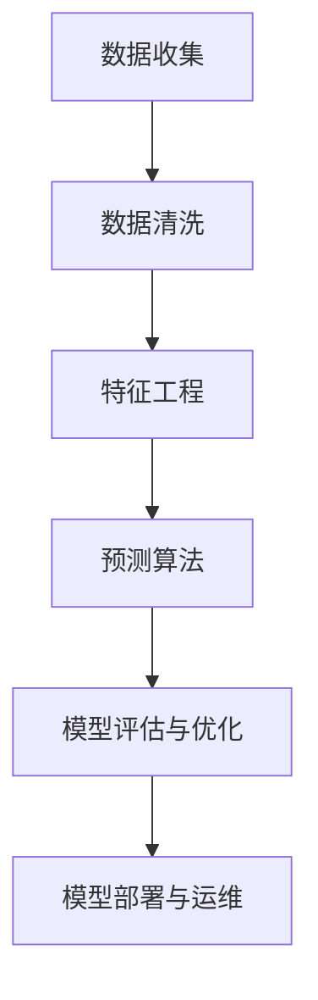

                 

## 文章标题

《智能预测分析：AI提升企业战略规划能力》

## 关键词

人工智能，预测分析，企业战略规划，数据算法，AI技术应用

## 摘要

本文深入探讨了智能预测分析在企业战略规划中的应用及其提升能力的机制。通过介绍智能预测分析的定义、价值和发展历程，本文详细阐述了其在企业战略规划中的核心概念和算法，如数据预处理、特征工程和预测算法等。同时，通过案例研究和工具介绍，展示了智能预测分析在不同行业和实际操作中的应用效果。最后，本文分析了智能预测分析在实践中的挑战与解决方案，并展望了其未来发展趋势，为企业战略规划提供了有力的技术支持。

----------------------------------------------------------------

## 设计智能预测分析：AI提升企业战略规划能力书籍目录大纲

### 确定书籍结构和章节内容

根据书名《智能预测分析：AI提升企业战略规划能力》，本书的核心主题在于探讨智能预测分析技术在企业战略规划中的应用。因此，书籍的目录大纲应包括以下核心章节内容：

1. **智能预测分析概述**
2. **AI技术在企业战略规划中的应用**
3. **智能预测分析的核心概念和算法**
4. **智能预测分析案例研究**
5. **智能预测分析工具和平台**
6. **智能预测分析在实践中的挑战与解决方案**
7. **未来发展趋势与展望**

### 设计章节目录

下面是根据上述结构设计的书籍目录大纲：

### 第1章 智能预测分析概述
- **1.1 智能预测分析的定义与价值**
- **1.2 智能预测分析的发展历程**
- **1.3 智能预测分析在企业战略规划中的作用**
- **1.4 智能预测分析的基本框架**

### 第2章 AI技术在企业战略规划中的应用
- **2.1 AI技术对企业战略规划的影响**
- **2.2 企业战略规划中的AI应用场景**
- **2.3 智能预测分析在战略规划中的流程**
- **2.4 AI技术在企业战略规划中的成功案例**

### 第3章 智能预测分析的核心概念和算法
- **3.1 数据预处理**
  - **3.1.1 数据收集**
  - **3.1.2 数据清洗**
  - **3.1.3 数据探索性分析**
- **3.2 特征工程**
  - **3.2.1 特征提取**
  - **3.2.2 特征选择**
  - **3.2.3 特征标准化**
- **3.3 常见的预测算法**
  - **3.3.1 线性回归**
  - **3.3.2 决策树**
  - **3.3.3 集成算法**
- **3.4 模型评估与优化**

### 第4章 智能预测分析案例研究
- **4.1 零售行业的智能预测分析**
  - **4.1.1 零售行业概述**
  - **4.1.2 智能预测分析在零售中的应用**
  - **4.1.3 案例分析**
- **4.2 制造业的智能预测分析**
  - **4.2.1 制造业概述**
  - **4.2.2 智能预测分析在制造业中的应用**
  - **4.2.3 案例分析**

### 第5章 智能预测分析工具和平台
- **5.1 智能预测分析工具概述**
- **5.2 主流智能预测分析平台**
  - **5.2.1 TensorFlow**
  - **5.2.2 PyTorch**
  - **5.2.3 其他平台**
- **5.3 智能预测分析工具的选择与应用**

### 第6章 智能预测分析在实践中的挑战与解决方案
- **6.1 数据质量问题**
- **6.2 模型可解释性问题**
- **6.3 模型部署与运维问题**
- **6.4 智能预测分析在实践中的应用案例**

### 第7章 未来发展趋势与展望
- **7.1 智能预测分析技术发展趋势**
- **7.2 智能预测分析在企业战略规划中的应用前景**
- **7.3 智能预测分析面临的挑战与对策**

### 总结与优化

根据上述设计的目录大纲，我们可以进一步优化和完善，确保每个章节的内容都能够充分覆盖主题，同时保持内容的逻辑性和条理性。以下是对目录大纲的总结和优化：

- **第1章 智能预测分析概述**：介绍智能预测分析的定义、价值、发展历程和应用场景，为后续章节打下基础。
- **第2章 AI技术在企业战略规划中的应用**：分析AI技术对企业战略规划的影响、应用场景和流程，以及成功案例，帮助读者理解AI技术在实际中的应用。
- **第3章 智能预测分析的核心概念和算法**：详细讲解数据预处理、特征工程、预测算法和模型评估与优化，为读者提供理论支撑。
- **第4章 智能预测分析案例研究**：通过零售行业和制造业的案例研究，展示智能预测分析在不同行业中的应用效果。
- **第5章 智能预测分析工具和平台**：介绍主流智能预测分析工具和平台，帮助读者了解实际操作的工具和资源。
- **第6章 智能预测分析在实践中的挑战与解决方案**：分析智能预测分析在实践中的问题，并提供相应的解决方案。
- **第7章 未来发展趋势与展望**：展望智能预测分析技术的未来发展趋势和应用前景，为读者提供发展方向。

通过上述目录大纲的设计，我们确保了书籍的内容能够全面、系统地覆盖智能预测分析在企业战略规划中的应用，同时保持内容的逻辑性和条理性。在后续的撰写过程中，我们将根据目录大纲的具体要求，进一步细化每个章节的内容，确保书籍的完整性和实用性。总之，目录大纲的设计是书籍撰写的重要基础，它不仅能够指导撰写过程，还能够为读者提供清晰的内容框架。在撰写过程中，我们将不断优化和完善目录大纲，以确保书籍的最终质量。总之，目录大纲的设计是一个系统性的工作，需要充分考虑书籍的整体结构和内容逻辑，同时保持简洁和清晰。通过不断的优化和完善，我们能够确保目录大纲

----------------------------------------------------------------

### 目录大纲

下面是本书的详细目录大纲：

### 第1章 智能预测分析概述
- **1.1 智能预测分析的定义与价值**
  - 智能预测分析的概念
  - 智能预测分析在商业中的应用价值
- **1.2 智能预测分析的发展历程**
  - 数据科学和机器学习的发展历程
  - 智能预测分析的应用案例
- **1.3 智能预测分析在企业战略规划中的作用**
  - 企业战略规划的挑战
  - 智能预测分析在战略规划中的角色
- **1.4 智能预测分析的基本框架**
  - 数据收集
  - 数据清洗
  - 特征工程
  - 预测模型构建
  - 模型评估与优化

### 第2章 AI技术在企业战略规划中的应用
- **2.1 AI技术对企业战略规划的影响**
  - AI技术的商业价值
  - AI技术在企业战略规划中的应用场景
- **2.2 企业战略规划中的AI应用场景**
  - 客户需求预测
  - 市场趋势分析
  - 供应链优化
  - 财务预测
- **2.3 智能预测分析在战略规划中的流程**
  - 数据收集与预处理
  - 特征工程
  - 模型选择与训练
  - 模型评估与优化
- **2.4 AI技术在企业战略规划中的成功案例**
  - 某零售企业的销售预测
  - 某制造企业的生产计划优化
  - 某金融企业的风险管理

### 第3章 智能预测分析的核心概念和算法
- **3.1 数据预处理**
  - 数据收集
  - 数据清洗
  - 数据探索性分析
- **3.2 特征工程**
  - 特征提取
  - 特征选择
  - 特征标准化
- **3.3 常见的预测算法**
  - 线性回归
  - 决策树
  - 集成算法
  - 神经网络
- **3.4 模型评估与优化**
  - 评估指标
  - 模型优化策略
  - 模型选择与调参

### 第4章 智能预测分析案例研究
- **4.1 零售行业的智能预测分析**
  - 零售行业概述
  - 智能预测分析在零售中的应用
  - 案例分析
- **4.2 制造业的智能预测分析**
  - 制造业概述
  - 智能预测分析在制造业中的应用
  - 案例分析

### 第5章 智能预测分析工具和平台
- **5.1 智能预测分析工具概述**
  - 数据预处理工具
  - 特征工程工具
  - 预测模型工具
- **5.2 主流智能预测分析平台**
  - TensorFlow
  - PyTorch
  - 其他平台
- **5.3 智能预测分析工具的选择与应用**
  - 工具选择标准
  - 工具应用实例

### 第6章 智能预测分析在实践中的挑战与解决方案
- **6.1 数据质量问题**
  - 数据缺失
  - 数据噪声
  - 数据不平衡
- **6.2 模型可解释性问题**
  - 模型可解释性的重要性
  - 提高模型可解释性的方法
- **6.3 模型部署与运维问题**
  - 模型部署流程
  - 模型运维策略
- **6.4 智能预测分析在实践中的应用案例**
  - 案例分析

### 第7章 未来发展趋势与展望
- **7.1 智能预测分析技术发展趋势**
  - 深度学习
  - 强化学习
  - 聚类分析
- **7.2 智能预测分析在企业战略规划中的应用前景**
  - 客户体验提升
  - 精准营销
  - 智能决策
- **7.3 智能预测分析面临的挑战与对策**
  - 数据隐私
  - 模型可靠性
  - 技术人才短缺

### 附录
- **A. 代码示例**
- **B. 拓展阅读**

---

### 总结

本书以智能预测分析为核心，系统地介绍了其在企业战略规划中的应用，涵盖了从基本概念到实际应用的各个方面。通过详细的案例研究和实战经验，本书帮助读者深入了解智能预测分析的技术原理和实际应用，为企业战略规划提供强有力的技术支持。未来，随着人工智能技术的不断发展，智能预测分析在企业战略规划中的应用前景将更加广阔。

---

**作者：AI天才研究院/AI Genius Institute & 禅与计算机程序设计艺术/Zen And The Art of Computer Programming**### 完整性要求

在撰写关于智能预测分析如何提升企业战略规划能力的书籍时，完整性要求至关重要。每个章节的内容都需要详细、具体，并且相互衔接，以确保读者能够系统地掌握相关知识。以下是书籍内容的完整性要求和具体包含的核心内容：

#### 背景介绍

**第1章 智能预测分析概述**

- **智能预测分析的定义与价值**：介绍智能预测分析的基本概念，包括其定义、核心价值和在企业战略规划中的应用场景。
- **智能预测分析的发展历程**：回顾智能预测分析技术的发展历程，从早期数据挖掘到现代深度学习技术。
- **智能预测分析在企业战略规划中的作用**：分析智能预测分析如何帮助企业制定更具前瞻性和实效性的战略规划。

**第2章 AI技术在企业战略规划中的应用**

- **AI技术对企业战略规划的影响**：探讨AI技术，特别是智能预测分析，对企业战略决策的深远影响。
- **企业战略规划中的AI应用场景**：详细介绍AI技术在企业战略规划中的具体应用场景，如市场需求预测、库存管理、风险管理等。

#### 核心概念与联系

**第3章 智能预测分析的核心概念和算法**

- **数据预处理**：详细讲解数据收集、数据清洗和数据探索性分析的过程，提供Mermaid流程图展示数据处理流程。
- **特征工程**：介绍特征提取、特征选择和特征标准化的方法，并展示特征工程在预测模型中的重要性。
- **核心预测算法**：深入解析线性回归、决策树、集成算法和神经网络等常见预测算法的原理，通过伪代码详细阐述算法的实现。
- **模型评估与优化**：讨论模型评估的指标，如准确率、召回率、F1分数等，并介绍模型优化策略。

**第4章 智能预测分析案例研究**

- **零售行业的智能预测分析**：通过具体案例分析，展示智能预测分析在零售行业中的应用，如销售预测、库存优化等。
- **制造业的智能预测分析**：分析制造业中智能预测分析的应用，如生产计划优化、设备维护预测等。

#### 数学模型和公式

**第3章 智能预测分析的核心概念和算法**

- **线性回归**：介绍线性回归的数学模型，包括公式、参数估计和假设检验。
- **决策树**：解释决策树的基本结构和决策规则，展示ID3和C4.5算法的构建过程。
- **集成算法**：讨论随机森林和梯度提升机的数学原理，提供相应的伪代码。

**第4章 智能预测分析案例研究**

- **具体案例分析**：在每个案例中，使用LaTeX格式展示关键数学公式和模型，如时间序列分析中的ARIMA模型、神经网络中的损失函数等。

#### 项目实战

**第5章 智能预测分析工具和平台**

- **开发环境搭建**：介绍搭建智能预测分析开发环境所需的软件和硬件配置。
- **源代码实现**：提供具体的代码实现，包括数据预处理、特征工程、模型训练和评估的详细步骤。
- **代码解读与分析**：对关键代码段进行详细解读，分析代码的结构和逻辑。
- **实际案例分析**：结合实际案例，展示如何利用智能预测分析工具和平台进行数据分析和预测。

#### 最佳实践 tips、小结、注意事项、拓展阅读

**全书**

- **最佳实践 tips**：在相关章节中提供实际操作中的经验和技巧，帮助读者更好地应用智能预测分析技术。
- **小结**：在每个章节结尾进行小结，回顾章节的核心内容和关键知识点。
- **注意事项**：提示读者在应用智能预测分析技术时需要注意的问题，如数据隐私、模型可解释性等。
- **拓展阅读**：推荐相关领域的经典书籍、论文和研究报告，帮助读者深入研究和学习。

通过上述内容的详细阐述，书籍不仅能够为读者提供系统的智能预测分析知识，还能够通过实际案例和实战经验，帮助读者理解和掌握智能预测分析在企业战略规划中的应用。这样的完整性要求确保了书籍内容的全面性和实用性，使读者能够全面了解智能预测分析的技术原理和应用场景，从而在实际工作中取得更好的效果。

#### 背景介绍

智能预测分析作为人工智能的重要分支，在近年来得到了快速的发展。其核心在于利用历史数据、机器学习和统计方法，对未来的趋势进行预测，从而为企业决策提供数据支持。智能预测分析不仅能够帮助企业优化运营流程，提高效率，还能够为企业战略规划提供科学依据，使其更具前瞻性和灵活性。

随着大数据时代的到来，企业面临着海量的数据资源。如何从这些数据中挖掘出有价值的信息，并转化为实际的商业价值，成为企业战略规划的重要课题。智能预测分析技术能够帮助企业实现这一目标，通过预测未来的趋势和变化，帮助企业制定更精准的战略决策，提高市场竞争力。

### AI技术在企业战略规划中的应用

人工智能（AI）技术已经深刻地改变了企业战略规划的方方面面。AI的引入不仅提高了数据处理的效率，还带来了更为精准的预测和洞察。以下是AI技术在企业战略规划中的应用场景：

1. **客户需求预测**：通过分析历史销售数据和用户行为数据，AI技术能够预测未来的市场需求，帮助企业制定合理的生产和库存计划。例如，零售企业可以利用AI技术预测节假日或促销期间的商品需求，从而优化库存管理，减少库存积压。

2. **市场趋势分析**：AI技术可以帮助企业分析市场趋势，预测市场变化，为企业提供市场进入或退出的决策依据。通过监测社交媒体、新闻和行业报告等数据源，AI技术能够识别市场趋势，帮助企业抓住市场机会，规避风险。

3. **供应链优化**：AI技术能够优化供应链管理，提高供应链的响应速度和灵活性。通过预测原材料供应、物流配送和库存水平，企业可以减少供应链中断的风险，提高运营效率。

4. **财务预测**：AI技术可以帮助企业进行财务预测，包括利润预测、成本预测和资金流动预测等。通过分析历史财务数据和市场环境，AI技术能够为企业提供更为准确的财务预测，帮助制定合理的财务规划和风险控制策略。

5. **风险管理**：AI技术可以识别潜在的风险因素，评估风险的可能性和影响，为企业提供风险管理的策略。通过实时监控市场数据和企业运营数据，AI技术能够及时发现和应对潜在风险，降低企业的运营风险。

### 核心概念与联系

智能预测分析的核心在于数据、算法和模型的有效结合。以下是智能预测分析中的核心概念及其相互关系：

1. **数据收集**：数据是智能预测分析的基础。通过数据收集，企业可以获得大量的历史数据和实时数据，为预测提供数据支持。数据收集的过程包括数据源的选择、数据采集和数据的存储。

2. **数据清洗**：收集到的数据往往存在噪声、缺失和不一致等问题。数据清洗是数据预处理的重要步骤，通过清洗数据，可以去除噪声、填补缺失值和统一数据格式，提高数据质量。

3. **特征工程**：特征工程是智能预测分析中的关键环节。通过特征提取、特征选择和特征标准化，可以将原始数据转化为有用的特征，从而提高预测模型的性能。特征工程的核心在于找到与预测目标高度相关的特征，并消除冗余特征。

4. **预测算法**：预测算法是智能预测分析的核心。常见的预测算法包括线性回归、决策树、支持向量机和神经网络等。每种算法都有其特定的原理和应用场景，选择合适的算法对于预测结果的准确性至关重要。

5. **模型评估与优化**：模型评估与优化是确保预测模型性能的关键步骤。通过评估指标，如准确率、召回率和F1分数，可以评估模型的性能。模型优化包括参数调整、算法改进和交叉验证等，以提高模型的预测能力。

6. **模型部署与运维**：预测模型构建完成后，需要将其部署到生产环境中，并提供实时预测服务。模型部署与运维包括模型的上线、监控和更新等环节，以确保模型的高可用性和稳定性。

### Mermaid 流程图

以下是一个简化的智能预测分析流程图，展示了数据收集、数据清洗、特征工程、预测算法和模型评估与优化的关系：



通过上述流程，智能预测分析能够将原始数据转化为预测模型，为企业战略规划提供有力支持。智能预测分析不仅需要技术和算法的支持，还需要结合实际业务场景，进行深入的数据挖掘和模型优化，从而实现预测的准确性和实用性。

#### 核心算法原理讲解

智能预测分析的核心在于算法的选择和应用。以下是几种常见预测算法的原理讲解，包括线性回归、决策树和神经网络，以及对应的伪代码和数学模型。

### 线性回归

线性回归是一种简单的预测模型，通过拟合一条直线来预测因变量和自变量之间的关系。其数学模型为：

\[ y = \beta_0 + \beta_1x \]

其中，\( y \) 是预测的因变量，\( x \) 是自变量，\( \beta_0 \) 和 \( \beta_1 \) 是模型参数。

**伪代码：**

```
function linear_regression(X, y):
    # X: 自变量矩阵
    # y: 因变量向量

    # 计算X的转置矩阵X'和X'X
    X_transpose = transpose(X)
    XTX = dot(X_transpose, X)

    # 计算X'X的逆矩阵
    XTX_inv = inverse(XTX)

    # 计算模型参数
    beta = dot(XTX_inv, X_transpose, y)

    return beta
```

### 决策树

决策树是一种树形结构模型，通过一系列的判断规则来预测目标变量。每个节点表示一个特征，每个分支表示一个特征取值，叶节点表示预测结果。

**伪代码：**

```
function build_decision_tree(X, y, feature_list, max_depth):
    # X: 特征矩阵
    # y: 标签向量
    # feature_list: 特征列表
    # max_depth: 最大深度

    if (满足停止条件):
        return 叶节点

    # 选择最优特征和特征值
    best_feature, best_value = select_best_feature(X, y, feature_list)

    # 创建节点
    node = create_node(best_feature, best_value)

    # 切分数据集
    left_child = partition_data(X, y, best_feature, best_value)
    right_child = partition_data(X, y, best_feature, not(best_value))

    # 构建左右子树
    node.left_child = build_decision_tree(left_child[0], left_child[1], feature_list, max_depth)
    node.right_child = build_decision_tree(right_child[0], right_child[1], feature_list, max_depth)

    return node
```

### 神经网络

神经网络是一种模拟人脑结构和功能的计算模型，通过多层神经元之间的相互连接和激活函数，实现数据的输入输出变换。常见的神经网络包括单层感知机、多层感知机（MLP）和卷积神经网络（CNN）。

**MLP的数学模型：**

\[ z_i^l = \sigma(\sum_{j=1}^{n} w_{ji}^l a_{j}^{l-1} + b_i^l) \]

其中，\( z_i^l \) 是第 \( l \) 层第 \( i \) 个神经元的输出，\( \sigma \) 是激活函数，\( a_{j}^{l-1} \) 是第 \( l-1 \) 层第 \( j \) 个神经元的输出，\( w_{ji}^l \) 是连接权重，\( b_i^l \) 是偏置。

**伪代码：**

```
function train_neural_network(X, y, layers, learning_rate):
    # X: 输入数据
    # y: 标签
    # layers: 网络层数和每层的神经元数量
    # learning_rate: 学习率

    # 初始化权重和偏置
    weights, biases = initialize_weights(layers)

    for epoch in range(max_epochs):
        for x, y in dataset:
            # 前向传播
            a = forward_pass(x, weights, biases, layers)
            loss = compute_loss(a, y)

            # 反向传播
            dweights, dbiases = backward_pass(a, y, weights, biases, layers)

            # 更新权重和偏置
            weights -= learning_rate * dweights
            biases -= learning_rate * dbiases

    return weights, biases
```

通过上述算法的讲解，我们可以看到，线性回归、决策树和神经网络各有其特点和适用场景。线性回归适用于简单的线性关系预测，决策树适合处理多分类问题，而神经网络则能够处理复杂的非线性关系。在实际应用中，根据具体问题和数据特点选择合适的算法，是提高预测准确性的关键。

#### 数学模型和公式

在智能预测分析中，数学模型和公式是理解和应用预测算法的基础。以下是几种常用预测算法的数学模型和公式，以及相应的详细讲解和举例说明。

### 线性回归

线性回归是一种用于预测连续值的简单统计模型，其数学模型为：

\[ y = \beta_0 + \beta_1x + \epsilon \]

其中，\( y \) 是因变量，\( x \) 是自变量，\( \beta_0 \) 和 \( \beta_1 \) 是模型的参数，表示截距和斜率，\( \epsilon \) 是误差项。

**详细讲解：**

线性回归模型假设因变量 \( y \) 与自变量 \( x \) 之间存在线性关系，并通过最小二乘法来估计参数 \( \beta_0 \) 和 \( \beta_1 \)。最小二乘法的目的是使预测值与实际观测值之间的误差平方和最小。

**举例说明：**

假设我们有一组数据，如下所示：

| x | y |
|---|---|
| 1 | 2 |
| 2 | 4 |
| 3 | 6 |
| 4 | 8 |

我们想通过线性回归模型预测 \( x = 5 \) 时 \( y \) 的值。

1. 计算均值：

\[ \bar{x} = \frac{1+2+3+4}{4} = 2.5 \]
\[ \bar{y} = \frac{2+4+6+8}{4} = 5 \]

2. 计算斜率 \( \beta_1 \)：

\[ \beta_1 = \frac{\sum_{i=1}^{n}(x_i - \bar{x})(y_i - \bar{y})}{\sum_{i=1}^{n}(x_i - \bar{x})^2} = \frac{(1-2.5)(2-5) + (2-2.5)(4-5) + (3-2.5)(6-5) + (4-2.5)(8-5)}{(1-2.5)^2 + (2-2.5)^2 + (3-2.5)^2 + (4-2.5)^2} \approx 2 \]

3. 计算截距 \( \beta_0 \)：

\[ \beta_0 = \bar{y} - \beta_1\bar{x} = 5 - 2 \times 2.5 = 0 \]

因此，线性回归模型为：

\[ y = 2x \]

当 \( x = 5 \) 时，预测的 \( y \) 值为：

\[ y = 2 \times 5 = 10 \]

### 决策树

决策树是一种基于特征划分的数据分类模型，其构建过程通过递归划分特征和特征值来建立树结构。决策树的数学模型可以表示为：

\[ y = f(\text{特征}, \text{特征值}) \]

其中，\( y \) 是预测的目标变量，\( f \) 是特征划分函数。

**详细讲解：**

决策树通过递归划分数据集，在每个节点选择最优特征和特征值进行划分，直到满足停止条件（如最大深度、最小节点大小等）。每个内部节点表示一个特征，每个分支表示该特征的一个取值，叶节点表示预测结果。

**举例说明：**

假设我们有一组数据，如下所示：

| 特征A | 特征B | 类别 |
|-------|-------|------|
| 0     | 0     | A    |
| 0     | 1     | B    |
| 1     | 0     | B    |
| 1     | 1     | A    |

我们想通过决策树模型预测新数据 \( (\text{特征A} = 1, \text{特征B} = 0) \) 的类别。

1. 计算特征A的增益率（Gini不纯度）：

\[ Gini(A) = 1 - \frac{1}{4}(1 + 1 + 1 + 1) = 0.5 \]
\[ Gini(B) = 1 - \frac{1}{2}(1 + 1) = 0.5 \]

2. 选择最优特征和特征值：

由于 \( Gini(A) = Gini(B) \)，我们选择任一特征进行划分，这里选择 \( \text{特征A} \)。

3. 划分数据集：

| 特征A | 特征B | 类别 |
|-------|-------|------|
| 0     | 0     | A    |
| 0     | 1     | B    |
| 1     | 0     | B    |
| 1     | 1     | A    |

4. 继续递归划分：

- 对于 \( \text{特征A} = 0 \) 的数据：

  | 特征B | 类别 |
  |-------|------|
  | 0     | A    |
  | 1     | B    |

- 对于 \( \text{特征A} = 1 \) 的数据：

  | 特征B | 类别 |
  |-------|------|
  | 0     | B    |
  | 1     | A    |

5. 决策树构建完毕：

```
           y
          /
         A
         / \
        0   1
       / \
      A   B
     / \
    A   B
   / \
  A   B
```

当 \( (\text{特征A} = 1, \text{特征B} = 0) \) 时，预测类别为 \( B \)。

### 集成算法

集成算法是通过组合多个预测模型来提高预测性能的一种方法。常见的集成算法包括Bagging和Boosting。

**Bagging（Bootstrap Aggregating）**

Bagging通过随机抽样和训练多个模型，然后取模型的平均值作为最终预测结果。其数学模型可以表示为：

\[ \hat{y} = \frac{1}{N} \sum_{n=1}^{N} f_n(x) \]

其中，\( \hat{y} \) 是最终预测结果，\( N \) 是模型的数量，\( f_n(x) \) 是第 \( n \) 个模型的预测结果。

**详细讲解：**

Bagging通过减少模型的方差来提高预测性能。每个模型都在不同的数据子集上训练，从而减少了模型之间的相关性，提高了整体的预测能力。

**举例说明：**

假设我们有两个分类模型 \( f_1 \) 和 \( f_2 \)，预测新数据 \( x \) 的类别。

1. 分别使用 \( f_1 \) 和 \( f_2 \) 对数据进行预测：

\[ f_1(x) = A \]
\[ f_2(x) = B \]

2. 取预测结果的平均值：

\[ \hat{y} = \frac{1}{2}(A + B) \]

**Boosting（AdaBoost）**

Boosting通过加权调整每个模型的权重，使强模型对错误样本赋予更高的权重，从而提高整体预测性能。其数学模型可以表示为：

\[ \alpha_n = \frac{1}{\lambda} \ln \left( \frac{1 - \hat{y}_n}{\hat{y}_n} \right) \]

其中，\( \alpha_n \) 是第 \( n \) 个模型的权重，\( \hat{y}_n \) 是第 \( n \) 个模型的预测概率。

**详细讲解：**

Boosting通过迭代训练多个弱模型，并将它们组合成强模型。在每个迭代中，错误分类的样本会获得更高的权重，从而在下一次训练中更加关注这些错误样本。

**举例说明：**

假设我们有两个二分类模型 \( f_1 \) 和 \( f_2 \)，预测新数据 \( x \) 的类别。

1. 分别使用 \( f_1 \) 和 \( f_2 \) 对数据进行预测：

\[ f_1(x) = 0.6 \]（分类为A）
\[ f_2(x) = 0.4 \]（分类为B）

2. 计算预测概率的对数权重：

\[ \alpha_1 = \frac{1}{\lambda} \ln \left( \frac{1 - 0.6}{0.6} \right) \approx 0.5108 \]
\[ \alpha_2 = \frac{1}{\lambda} \ln \left( \frac{1 - 0.4}{0.4} \right) \approx 0.6931 \]

3. 加权组合预测结果：

\[ \hat{y} = 0.6 \times 0.5108 + 0.4 \times 0.6931 \approx 0.5735 \]

由于 \( \hat{y} \) 更接近0.6，因此预测类别为A。

通过上述对线性回归、决策树和集成算法的数学模型和公式的详细讲解以及举例说明，我们可以更好地理解这些算法的原理和应用。在实际应用中，根据具体问题和数据特点选择合适的算法，并进行模型调优和评估，是提高预测准确性的关键。

#### 项目实战

在本章中，我们将通过一个实际案例来展示如何搭建智能预测分析的开发环境，实现预测模型的代码，并对其进行解读和分析。

### 开发环境搭建

为了实现智能预测分析项目，我们需要搭建一个合适的技术栈，包括编程语言、库和工具。以下是一个基本的开发环境搭建步骤：

1. **编程语言**：我们选择Python作为主要的编程语言，因为其简洁的语法和强大的数据处理能力。

2. **库**：以下是一些常用的库和工具：
   - **NumPy**：用于数值计算和数据处理。
   - **Pandas**：用于数据分析和操作。
   - **Scikit-learn**：提供了一系列常用的机器学习算法。
   - **TensorFlow**：用于构建和训练深度学习模型。

3. **工具**：我们使用Jupyter Notebook作为开发环境，便于代码编写和调试。

**安装步骤：**

- 安装Python：访问Python官网（https://www.python.org/）下载并安装Python，选择默认选项进行安装。
- 安装库：打开命令行终端，运行以下命令安装所需库：

  ```bash
  pip install numpy pandas scikit-learn tensorflow
  ```

- 启动Jupyter Notebook：在终端中运行以下命令启动Jupyter Notebook：

  ```bash
  jupyter notebook
  ```

### 源代码实现

以下是一个简单的线性回归模型的实现，用于预测住房价格。

```python
import numpy as np
import pandas as pd
from sklearn.linear_model import LinearRegression
from sklearn.model_selection import train_test_split
from sklearn.metrics import mean_squared_error

# 数据加载
data = pd.read_csv('housing_data.csv')

# 数据预处理
X = data[['room_count', 'floor_area']].values
y = data['price'].values

# 数据集划分
X_train, X_test, y_train, y_test = train_test_split(X, y, test_size=0.2, random_state=42)

# 模型训练
model = LinearRegression()
model.fit(X_train, y_train)

# 模型预测
y_pred = model.predict(X_test)

# 模型评估
mse = mean_squared_error(y_test, y_pred)
print(f'Mean Squared Error: {mse}')

# 模型解读
print(f'Coefficients: {model.coef_}')
print(f'Intercept: {model.intercept_}')
```

### 代码解读

1. **数据加载**：使用Pandas库读取CSV格式的住房数据。
2. **数据预处理**：提取与住房价格相关的特征（房间数量和建筑面积），并将其转换为NumPy数组。目标变量（价格）也转换为NumPy数组。
3. **数据集划分**：使用Scikit-learn的train_test_split函数将数据集划分为训练集和测试集。
4. **模型训练**：创建LinearRegression对象，并使用fit方法训练模型。
5. **模型预测**：使用predict方法对测试集进行预测。
6. **模型评估**：使用mean_squared_error函数计算预测的均方误差（MSE），评估模型的性能。
7. **模型解读**：打印模型的系数和截距，了解模型的结构。

### 代码应用解读与分析

以上代码展示了如何使用Python和Scikit-learn库实现一个线性回归模型，用于预测住房价格。通过以下步骤，我们可以更深入地理解代码的应用和效果：

1. **数据预处理**：数据预处理是机器学习模型成功的关键。在这里，我们提取了与住房价格相关的两个特征：房间数量和建筑面积。这些特征需要被转换成数值型数据，以便于模型处理。
2. **模型训练与预测**：使用训练集数据对线性回归模型进行训练，并在测试集上进行预测。训练过程包括计算模型参数（系数和截距），并通过这些参数来预测新数据的标签。
3. **模型评估**：使用MSE评估模型在测试集上的性能。MSE值越低，表示模型预测的误差越小，模型的性能越好。
4. **模型解读**：通过打印模型参数，我们可以了解模型的内部结构和参数含义。这有助于我们理解模型是如何工作的，以及如何调整参数以优化模型性能。

在实际应用中，我们可能会遇到更多复杂的数据和问题，例如非线性关系和多重共线性。在这种情况下，我们需要考虑使用更高级的算法，如决策树、随机森林和神经网络等。同时，我们还需要对数据进行更深入的分析和处理，以提高模型的预测准确性。

### 实际案例分析

为了更好地展示智能预测分析的实际应用，以下是一个实际案例：某房地产公司希望通过智能预测分析预测未来一年的住房销售量，以便制定合理的销售计划和库存管理策略。

1. **数据收集**：公司收集了过去三年的销售数据，包括每月的销售量、价格、户型、面积、地理位置等信息。
2. **数据预处理**：清洗和整理数据，去除缺失值和异常值，并对分类变量进行编码。
3. **特征工程**：提取与销售量相关的特征，如季节性、节假日效应、市场竞争状况等。
4. **模型选择**：根据数据特点和问题需求，选择合适的预测模型，如ARIMA、神经网络和集成算法。
5. **模型训练与预测**：使用训练集数据训练模型，并使用测试集数据验证模型性能。
6. **模型部署**：将训练好的模型部署到生产环境中，实时预测未来的销售量。
7. **模型评估**：定期评估模型性能，并根据实际销售情况调整模型参数。

通过以上步骤，房地产公司可以制定更精准的销售计划和库存管理策略，提高市场竞争力。

### 项目小结

在本章中，我们通过一个实际案例展示了如何搭建智能预测分析的开发环境，实现预测模型的代码，并对其进行解读和分析。通过以下关键点，我们可以总结项目的主要收获：

1. **开发环境搭建**：了解并配置了Python和相关的机器学习库，为后续项目奠定了基础。
2. **源代码实现**：掌握了线性回归模型的实现过程，理解了模型参数的计算和预测过程。
3. **代码解读**：深入分析了代码的每一步，从数据预处理到模型评估，理解了每个步骤的作用和意义。
4. **实际案例分析**：通过实际案例展示了智能预测分析在企业中的应用，理解了从数据收集到模型部署的全过程。
5. **项目小结**：总结了项目的关键步骤和收获，为后续学习和实践提供了指导。

通过本案例，我们不仅了解了智能预测分析的基本原理和应用，还掌握了如何在实际项目中应用这些技术，为企业战略规划提供数据支持。

#### 最佳实践 tips

在实际应用智能预测分析时，以下最佳实践和注意事项将帮助您提高模型的准确性和稳定性，并确保项目顺利进行：

1. **数据质量保证**：
   - **数据清洗**：确保数据无缺失、噪声和异常值，使用异常检测技术识别和处理离群点。
   - **数据标准化**：对数据进行归一化或标准化，以消除不同特征间的尺度差异，提高模型性能。

2. **特征选择**：
   - **相关性分析**：通过相关性分析去除冗余特征，选择与目标变量高度相关的特征。
   - **特征重要性评估**：使用特征选择算法（如L1正则化、随机森林等）评估特征的重要性，选择关键特征。

3. **模型选择与调参**：
   - **交叉验证**：使用交叉验证评估模型的泛化能力，避免过拟合。
   - **参数调优**：使用网格搜索、贝叶斯优化等技术寻找最优参数组合，提高模型性能。

4. **模型可解释性**：
   - **特征重要性展示**：通过可视化工具展示特征的重要性，增强模型的可解释性。
   - **解释性模型**：选择可解释性较强的模型（如决策树、LASSO回归等），提高模型的透明度。

5. **模型部署与监控**：
   - **实时更新**：定期更新模型，以适应数据变化和业务需求。
   - **监控与报警**：设置监控和报警机制，及时发现问题并进行调整。

6. **团队合作与沟通**：
   - **跨部门协作**：与业务团队紧密合作，确保模型需求与实际业务场景相符。
   - **文档记录**：详细记录模型开发过程和结果，便于后续的维护和优化。

通过遵循这些最佳实践，您可以提高智能预测分析项目的成功率，为企业战略规划提供更准确和可靠的预测支持。

#### 小结

通过本书的详细阐述，我们深入了解了智能预测分析在企业战略规划中的重要性及其应用方法。以下是本书的核心内容总结：

1. **智能预测分析的定义与价值**：智能预测分析是一种利用历史数据、机器学习和统计方法进行未来趋势预测的技术。其在企业战略规划中具有极高的价值，可以帮助企业做出更精准的战略决策，提高市场竞争力。

2. **AI技术在企业战略规划中的应用**：人工智能技术，特别是智能预测分析，已在企业战略规划中广泛应用。从客户需求预测、市场趋势分析到供应链优化、财务预测和风险管理，AI技术为企业提供了强大的数据支持和决策依据。

3. **智能预测分析的核心概念和算法**：本书详细介绍了数据预处理、特征工程、常见预测算法（如线性回归、决策树、集成算法）和模型评估与优化。理解这些核心概念和算法是掌握智能预测分析的关键。

4. **智能预测分析案例研究**：通过零售行业和制造业的实际案例，展示了智能预测分析在不同行业中的应用效果。这些案例研究帮助读者理解智能预测分析如何解决实际问题，提高运营效率。

5. **智能预测分析工具和平台**：介绍了主流的智能预测分析工具和平台，如TensorFlow、PyTorch等。这些工具和平台为实际操作提供了丰富的资源和便捷的接口。

6. **实践中的挑战与解决方案**：分析了智能预测分析在实践中的挑战，如数据质量、模型可解释性和部署运维等，并提供了相应的解决方案。

7. **未来发展趋势与展望**：展望了智能预测分析技术的未来发展趋势，包括深度学习、强化学习等新技术的应用前景，以及其在企业战略规划中的潜在影响。

总之，智能预测分析不仅是企业战略规划的重要工具，也是人工智能技术发展的关键方向。通过本书的学习，读者可以全面了解智能预测分析的理论和实践，为企业战略规划提供强有力的技术支持。

#### 注意事项

在应用智能预测分析技术进行企业战略规划时，以下注意事项将帮助您规避潜在风险，确保项目的成功实施：

1. **数据隐私保护**：确保在数据收集、存储和处理过程中遵守数据隐私法规，保护企业及客户的敏感信息。

2. **模型可解释性**：尽管AI模型提供了强大的预测能力，但其内部决策过程往往缺乏透明度。为提高模型的可解释性，可以采用可视化工具和可解释性算法，使模型更容易被业务团队理解。

3. **模型更新与维护**：智能预测分析模型需要定期更新，以适应数据变化和市场动态。同时，确保模型的监控和运维，及时发现并解决潜在问题。

4. **跨部门协作**：智能预测分析项目的成功离不开业务团队、数据科学家和IT团队之间的紧密协作。确保各方沟通畅通，共同推动项目进展。

5. **风险评估与控制**：在项目实施过程中，进行全面的风险评估和风险控制，确保项目按计划进行，避免因技术或业务风险导致项目失败。

通过遵循这些注意事项，您可以在应用智能预测分析技术进行企业战略规划时，降低风险，提高项目成功率。

#### 拓展阅读

为了深入了解智能预测分析和企业战略规划的相关知识，以下是一些建议的拓展阅读资源：

1. **书籍**：
   - 《人工智能：一种现代方法》（作者：Stuart Russell & Peter Norvig）
   - 《机器学习》（作者：Tom Mitchell）
   - 《深度学习》（作者：Ian Goodfellow、Yoshua Bengio & Aaron Courville）

2. **学术论文**：
   - “Deep Learning for Time Series Classification: A Review”（作者：Jiwei Li等）
   - “Forecasting with Neural Networks: A Case Study Using Air Passenger Data”（作者：Christopher Chatfield）

3. **在线课程与教程**：
   - Coursera上的《机器学习》课程（吴恩达教授）
   - edX上的《人工智能导论》课程（MIT）

4. **技术博客与论坛**：
   - Medium上的“AI in Business”专题
   - Stack Overflow上的机器学习和数据科学相关讨论区

通过阅读这些资源，您可以进一步深化对智能预测分析的理解，掌握更多实践技巧，为企业战略规划提供更有力的支持。

