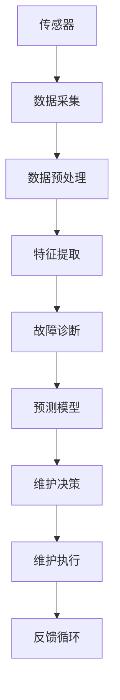

                 

# 《智能预测性维护系统：AI降低设备故障风险》目录大纲

## 第1章 引言
### 1.1 书籍背景
### 1.2 书籍目标
### 1.3 读者对象
### 1.4 智能预测性维护系统的背景和发展历程

## 第2章 智能预测性维护系统概述
### 2.1 预测性维护的定义和重要性
### 2.2 预测性维护系统的工作原理
### 2.3 智能预测性维护系统的分类
### 2.4 预测性维护系统的优势和挑战
### 2.5 预测性维护系统的核心概念与联系

## 第3章 AI技术在预测性维护中的应用
### 3.1 人工智能在工业领域的应用
### 3.2 机器学习在预测性维护中的应用
### 3.3 深度学习在预测性维护中的应用
### 3.4 AI技术在预测性维护中的优势与挑战

## 第4章 预测性维护系统的实现
### 4.1 数据收集和预处理
### 4.2 模型选择和训练
### 4.3 模型评估和优化
### 4.4 预测性维护系统的实现流程

## 第5章 预测性维护系统的部署
### 5.1 系统架构设计
### 5.2 硬件选择
### 5.3 软件开发环境搭建
### 5.4 系统部署中的常见问题及解决方案

## 第6章 案例分析
### 6.1 案例一：钢铁厂预测性维护系统
### 6.2 案例二：电厂预测性维护系统
### 6.3 案例三：石油化工企业预测性维护系统
### 6.4 不同行业预测性维护系统的对比分析

## 第7章 未来展望
### 7.1 智能预测性维护技术的发展趋势
### 7.2 智能预测性维护系统在行业中的应用前景
### 7.3 智能预测性维护系统面临的挑战与机遇
### 7.4 智能预测性维护系统在跨行业中的应用前景

## 附录
### A.1 参考文献
### A.2 术语表
### A.3 代码示例

### 第1章 引言
#### 1.1 书籍背景
随着工业4.0的推进，工业设备的高度自动化和智能化已经成为发展趋势。然而，设备故障仍然是工业生产中面临的主要问题之一，不仅影响生产效率，还可能导致巨大的经济损失。预测性维护系统（Predictive Maintenance System，PMS）利用人工智能（AI）和大数据技术，通过对设备运行数据的实时监测和分析，预测设备故障的发生，从而在故障发生前进行预防性维护，降低设备故障风险。本书旨在介绍智能预测性维护系统的概念、原理、实现和部署，帮助读者深入了解这一领域的最新技术和应用。

#### 1.2 书籍目标
本书的目标是：

1. 梳理智能预测性维护系统的基本概念和原理，帮助读者建立系统性的认识。
2. 介绍AI技术在预测性维护中的应用，包括机器学习和深度学习等方法。
3. 详细讲解预测性维护系统的实现流程，包括数据收集、预处理、模型选择、训练和评估等。
4. 通过实际案例，展示智能预测性维护系统的应用效果和实施过程。
5. 分析智能预测性维护系统的发展趋势和应用前景，为未来的研究和发展提供参考。

#### 1.3 读者对象
本书主要面向以下读者群体：

1. 对预测性维护系统感兴趣的工程师和研究人员。
2. 对人工智能在工业领域应用感兴趣的技术人员。
3. 需要了解和实施智能预测性维护系统的企业管理者。
4. 从事智能制造、工业4.0等相关领域的研究生和本科生。

#### 1.4 智能预测性维护系统的背景和发展历程
预测性维护系统的概念最早起源于20世纪70年代，当时主要是通过定期检查和更换零部件来预防设备故障。随着计算机技术和传感器技术的快速发展，预测性维护系统逐渐从传统的定期检查向实时监测和数据驱动转变。

1. **早期阶段（20世纪70年代至90年代）**：
   - 主要依赖定期检查和预防性维护。
   - 设备状态监测技术逐渐发展，如振动分析、油液分析等。

2. **发展阶段（20世纪90年代至21世纪初）**：
   - 随着计算机和传感器技术的普及，实时监测和数据分析成为可能。
   - 数据库和数据分析技术的应用，使得预测性维护更加精准。

3. **智能阶段（21世纪初至今）**：
   - 人工智能技术的引入，使得预测性维护系统更加智能化。
   - 大数据和云计算技术的应用，提升了预测性维护系统的实时性和准确性。

目前，智能预测性维护系统已经成为工业4.0和智能制造领域的重要组成部分，为设备的可靠性和生产效率的提升提供了有力保障。接下来的章节将详细介绍智能预测性维护系统的概念、原理和应用。

# 摘要

本书旨在全面介绍智能预测性维护系统的概念、原理和应用。首先，通过回顾预测性维护系统的发展历程，梳理了从传统定期检查到智能实时监测的演变过程。接着，详细介绍了智能预测性维护系统的核心概念，包括数据收集、预处理、模型选择和训练等。本书的核心内容围绕AI技术在预测性维护中的应用展开，深入探讨了机器学习和深度学习在预测设备故障方面的优势与挑战。通过实际案例的分析，展示了智能预测性维护系统在钢铁厂、电厂和石油化工企业等不同行业的成功应用，并对比了不同行业预测性维护系统的特点。最后，本书对智能预测性维护系统的发展趋势和应用前景进行了展望，探讨了其在跨行业中的潜在应用。本书的目标是为读者提供系统的理论和实践指导，帮助理解和实施智能预测性维护系统，以降低设备故障风险，提高生产效率和经济效益。

## 第2章 智能预测性维护系统概述

### 2.1 预测性维护的定义和重要性

预测性维护（Predictive Maintenance）是一种基于设备运行状态数据，通过实时监测和数据分析，预测设备故障并进行预防性维护的技术和方法。与传统的定期维护和故障后维护不同，预测性维护通过监测设备的运行状态，提前识别潜在的故障风险，从而在故障发生前进行维护，避免设备停机和生产损失。

#### 预测性维护的定义

预测性维护的定义可以从以下几个方面来理解：

1. **实时监测**：通过传感器、监控系统等设备，实时采集设备的运行数据，包括温度、压力、振动、润滑油质量等。
2. **数据分析**：利用机器学习、数据挖掘等技术，对采集到的运行数据进行处理和分析，识别潜在故障风险。
3. **预防性维护**：根据分析结果，在故障发生前采取相应的维护措施，如更换零部件、调整参数等，以避免故障的发生。

#### 预测性维护的重要性

预测性维护在工业生产中具有重要意义，主要体现在以下几个方面：

1. **提高设备可靠性**：通过实时监测和分析设备运行状态，可以提前发现潜在故障，及时进行维护，避免设备突发故障导致生产中断。

2. **降低维护成本**：传统的定期维护和故障后维护往往不够精准，不仅浪费资源，还可能导致过度维护或维护不足。预测性维护通过实时数据分析和精准预测，可以显著降低维护成本。

3. **提高生产效率**：预测性维护可以减少设备故障率，提高设备利用率，从而提升生产效率。同时，由于维护工作可以提前安排，减少了维护对生产的影响。

4. **延长设备寿命**：通过及时的维护和调整，可以延长设备的使用寿命，降低设备更换频率。

5. **优化资源配置**：预测性维护可以优化维护资源的配置，例如，可以在设备运行状态良好的时候进行预防性维护，避免设备停机。

### 2.2 预测性维护系统的工作原理

预测性维护系统（Predictive Maintenance System，PMS）是通过集成传感器、数据采集、处理和分析技术，实现对设备运行状态的实时监测和故障预测的系统。其工作原理可以概括为以下几个步骤：

1. **数据采集**：通过安装在设备上的传感器，实时采集设备的运行数据，如温度、压力、振动、润滑油质量等。

2. **数据预处理**：采集到的原始数据可能包含噪声、异常值等，因此需要对数据进行分析和预处理，包括数据清洗、去噪、归一化等操作，以提高数据质量。

3. **特征提取**：从预处理后的数据中提取对故障预测有用的特征，如异常模式、趋势变化等。

4. **故障诊断**：利用机器学习、数据挖掘等技术，对提取的特征进行故障诊断，识别潜在故障。

5. **预测分析**：基于历史数据和故障诊断结果，利用预测模型对未来的故障风险进行预测。

6. **决策支持**：根据预测结果，系统会给出维护建议，如何时进行维护、需要更换哪些零部件等。

7. **执行维护**：根据维护建议，进行预防性维护，以避免故障的发生。

### 2.3 智能预测性维护系统的分类

智能预测性维护系统可以根据不同的分类标准进行分类，常见的分类方法如下：

1. **按技术类型分类**：

   - **基于规则的方法**：这种方法依赖于专家知识库，通过预定义的规则来识别故障。优点是简单易懂，但依赖于专家经验和规则的覆盖范围。

   - **基于数据的方法**：这种方法利用历史数据进行分析，通过数据挖掘和机器学习算法来识别故障。优点是自适应性强，但需要大量的数据和计算资源。

   - **基于模型的方法**：这种方法通过建立数学模型来模拟设备的运行状态，预测故障的发生。优点是精确度高，但需要复杂的建模过程。

2. **按应用场景分类**：

   - **设备健康监测**：主要用于监测设备的状态，识别潜在的故障风险。

   - **故障预测**：通过分析设备的运行数据，预测故障发生的时间点。

   - **维护优化**：基于故障预测结果，优化维护计划，提高维护效率和效果。

3. **按行业应用分类**：

   - **制造业**：主要用于生产线设备、机械、机床等设备的故障预测和预防性维护。

   - **能源行业**：如电力、石油、天然气等行业，主要用于发电设备、输送管道、钻井平台等设备的故障预测和预防性维护。

   - **交通运输**：如汽车、飞机、火车等交通工具的故障预测和维护。

### 2.4 预测性维护系统的优势和挑战

#### 预测性维护系统的优势

1. **提高设备可靠性**：通过实时监测和故障预测，可以提前发现潜在故障，避免设备突发故障导致生产中断。

2. **降低维护成本**：预测性维护可以减少设备的停机时间，降低维护成本。同时，通过精准预测，可以避免过度维护或维护不足。

3. **提高生产效率**：预测性维护可以减少设备故障率，提高设备利用率，从而提升生产效率。

4. **延长设备寿命**：通过及时的维护和调整，可以延长设备的使用寿命。

5. **优化资源配置**：预测性维护可以优化维护资源的配置，例如，可以在设备运行状态良好的时候进行预防性维护。

#### 预测性维护系统的挑战

1. **数据质量**：预测性维护依赖于大量的运行数据，数据质量直接影响到预测的准确性。数据可能存在噪声、异常值等问题，需要通过数据预处理来解决。

2. **计算资源**：预测性维护系统通常需要大量的计算资源来处理和分析数据，特别是在实时性要求较高的应用场景。

3. **模型选择**：不同的故障预测方法适用于不同的应用场景，需要根据实际情况选择合适的模型。

4. **实时性**：在工业生产中，实时性是一个重要的考虑因素。预测性维护系统需要在设备故障发生前尽可能提前预测，以避免生产中断。

5. **专家知识**：基于规则的方法依赖于专家知识库，需要专家对故障规则进行定义和调整，这在某些情况下可能比较困难。

### 2.5 预测性维护系统的核心概念与联系

为了更好地理解和应用预测性维护系统，我们需要了解其核心概念，并了解这些概念之间的联系。以下是预测性维护系统的核心概念及其关系：

1. **传感器**：传感器是预测性维护系统的数据来源，用于实时监测设备的运行状态，如温度、压力、振动等。

2. **数据采集**：通过传感器采集到的数据，需要通过数据采集模块进行收集和处理。

3. **数据预处理**：数据预处理是确保数据质量的重要步骤，包括去噪、异常值处理、归一化等。

4. **特征提取**：从预处理后的数据中提取出对故障预测有用的特征，如异常模式、趋势变化等。

5. **故障诊断**：利用机器学习、数据挖掘等技术，对提取的特征进行故障诊断，识别潜在故障。

6. **预测模型**：基于历史数据和故障诊断结果，建立预测模型，对未来的故障风险进行预测。

7. **维护决策**：根据预测结果，系统会给出维护建议，如何时进行维护、需要更换哪些零部件等。

8. **维护执行**：根据维护建议，执行预防性维护，避免故障发生。

9. **反馈循环**：通过维护执行后的反馈，不断调整和优化预测模型，提高预测准确性。

以下是一个简单的Mermaid流程图，展示了预测性维护系统的核心概念及其关系：



通过上述流程图，我们可以清晰地看到预测性维护系统的各个环节及其相互关系，有助于我们更好地理解和应用这一系统。

### 第3章 AI技术在预测性维护中的应用

#### 3.1 人工智能在工业领域的应用

人工智能（AI）在工业领域的应用已经取得了显著的成果，尤其在预测性维护方面，AI技术发挥着至关重要的作用。工业领域中的设备种类繁多，运行环境复杂，传统的故障诊断和维护方法往往效率低下，难以满足现代化工业生产的需要。AI技术的引入，使得预测性维护变得更加精准和高效。

##### 人工智能在工业领域的主要应用

1. **故障预测**：通过监测设备的运行数据，利用AI算法预测设备故障的发生时间，从而在故障发生前采取预防措施。

2. **设备状态评估**：实时评估设备运行状态，识别异常情况，为维护决策提供依据。

3. **优化维护计划**：根据设备运行数据和故障预测结果，优化维护计划，降低维护成本，提高生产效率。

4. **智能监测**：利用传感器和AI算法，实现设备的智能监测，提高设备的运行效率和可靠性。

##### 人工智能在预测性维护中的应用优势

1. **高精度**：AI算法能够处理大量的历史数据，通过数据挖掘和模式识别，准确预测设备故障。

2. **实时性**：AI技术能够对实时数据进行快速处理和分析，实现设备的实时监测和故障预测。

3. **自适应性强**：AI算法能够根据设备运行状态的变化，自适应地调整预测模型，提高预测准确性。

4. **降低成本**：通过预测性维护，可以避免设备突发故障导致的停机和维修成本，提高生产效率。

5. **提高安全性**：通过实时监测和故障预测，可以有效降低设备故障风险，提高生产安全。

#### 3.2 机器学习在预测性维护中的应用

机器学习（Machine Learning，ML）是人工智能的重要分支，通过算法和统计模型，从数据中自动发现模式和规律，是实现预测性维护的核心技术之一。以下将介绍几种常用的机器学习算法在预测性维护中的应用。

##### 3.2.1 监督学习算法

监督学习算法在预测性维护中应用广泛，其通过对已标记的数据进行训练，构建预测模型，然后对新数据进行预测。以下是一些常用的监督学习算法：

1. **线性回归**：通过建立线性模型，预测设备的故障概率。线性回归模型简单易懂，适合处理线性关系较强的数据。

   ```python
   # 伪代码：线性回归模型
   model = LinearRegression()
   model.fit(X_train, y_train)
   predictions = model.predict(X_test)
   ```

2. **支持向量机（SVM）**：通过构建高维空间中的最优分割面，实现分类和回归。SVM在处理高维数据时表现优异，适合用于故障分类。

   ```python
   # 伪代码：支持向量机
   model = SVC()
   model.fit(X_train, y_train)
   predictions = model.predict(X_test)
   ```

3. **决策树**：通过递归划分特征空间，构建树形模型，实现分类和回归。决策树模型简单直观，易于解释。

   ```python
   # 伪代码：决策树
   model = DecisionTreeClassifier()
   model.fit(X_train, y_train)
   predictions = model.predict(X_test)
   ```

##### 3.2.2 无监督学习算法

无监督学习算法在预测性维护中的应用主要用于数据挖掘和特征提取。以下是一些常用的无监督学习算法：

1. **K-均值聚类**：通过迭代优化，将数据分为K个簇，实现数据聚类。K-均值聚类适用于发现数据的分布模式。

   ```python
   # 伪代码：K-均值聚类
   model = KMeans(n_clusters=3)
   model.fit(X)
   clusters = model.predict(X)
   ```

2. **主成分分析（PCA）**：通过降维，将高维数据映射到低维空间，实现数据的降维和特征提取。

   ```python
   # 伪代码：主成分分析
   model = PCA(n_components=2)
   X_reduced = model.fit_transform(X)
   ```

3. **自编码器**：通过编码和解码过程，实现数据的降维和特征提取。自编码器具有较强的泛化能力。

   ```python
   # 伪代码：自编码器
   model = Autoencoder()
   model.fit(X_train, X_train)
   X_reduced = model.predict(X_test)
   ```

##### 3.2.3 深度学习算法

深度学习（Deep Learning，DL）是机器学习的一个重要分支，通过多层神经网络，实现自动特征提取和模式识别。以下是一些常用的深度学习算法在预测性维护中的应用：

1. **卷积神经网络（CNN）**：通过卷积层和池化层，实现图像数据的自动特征提取。

   ```python
   # 伪代码：卷积神经网络
   model = ConvNet()
   model.fit(X_train, y_train)
   predictions = model.predict(X_test)
   ```

2. **循环神经网络（RNN）**：通过循环结构，实现序列数据的自动特征提取。

   ```python
   # 伪代码：循环神经网络
   model = RNN()
   model.fit(X_train, y_train)
   predictions = model.predict(X_test)
   ```

3. **长短时记忆网络（LSTM）**：通过门控机制，解决RNN的梯度消失问题，实现序列数据的长期依赖建模。

   ```python
   # 伪代码：长短时记忆网络
   model = LSTM()
   model.fit(X_train, y_train)
   predictions = model.predict(X_test)
   ```

4. **生成对抗网络（GAN）**：通过生成器和判别器的对抗训练，实现数据的生成和特征提取。

   ```python
   # 伪代码：生成对抗网络
   model = GAN()
   model.fit(X_train, y_train)
   generated_samples = model.predict(X_test)
   ```

##### 3.2.4 机器学习算法的选择

在选择机器学习算法时，需要考虑以下几个因素：

1. **数据类型**：不同的数据类型适合不同的算法，例如，图像数据适合使用CNN，序列数据适合使用RNN。

2. **数据规模**：大规模数据适合使用深度学习算法，小规模数据适合使用监督学习算法。

3. **计算资源**：深度学习算法通常需要更多的计算资源，而监督学习算法则较为轻量。

4. **模型复杂度**：模型复杂度越高，泛化能力越强，但训练时间也越长。

5. **可解释性**：不同的算法具有不同的可解释性，需要根据实际需求选择合适的算法。

#### 3.3 深度学习在预测性维护中的应用

深度学习（Deep Learning，DL）作为人工智能的一个重要分支，近年来在图像识别、自然语言处理等领域取得了突破性进展。在预测性维护领域，深度学习技术同样发挥着重要作用，通过自动特征提取和复杂模式识别，实现了设备故障预测的自动化和智能化。

##### 3.3.1 深度学习的基本原理

深度学习基于多层神经网络架构，通过逐层提取数据特征，实现从低级到高级的层次化表示。其主要特点包括：

1. **层次化特征提取**：通过多层神经网络，逐层提取数据的特征，从原始数据中抽象出更有意义的特征表示。

2. **自动特征学习**：不需要人工指定特征，模型能够通过训练自动学习数据的特征，从而提高预测准确性。

3. **非线性映射**：深度学习模型能够通过多层非线性变换，实现复杂的数据映射，从而提高模型的表达能力。

##### 3.3.2 常见的深度学习算法

在预测性维护领域，常用的深度学习算法包括卷积神经网络（Convolutional Neural Networks，CNN）、循环神经网络（Recurrent Neural Networks，RNN）和生成对抗网络（Generative Adversarial Networks，GAN）等。以下是这些算法的基本原理和应用场景：

1. **卷积神经网络（CNN）**：

   CNN是一种专门用于处理图像数据的深度学习算法，其核心在于通过卷积操作和池化操作，实现图像特征的自动提取。CNN在预测性维护中的应用主要包括：

   - **图像识别**：通过识别设备故障的图像特征，实现设备故障的分类和预测。
   - **缺陷检测**：通过识别设备表面的缺陷图像，实现设备缺陷的检测和预警。

   ```python
   # 伪代码：卷积神经网络
   model = ConvNet()
   model.fit(X_train, y_train)
   predictions = model.predict(X_test)
   ```

2. **循环神经网络（RNN）**：

   RNN是一种用于处理序列数据的深度学习算法，其核心在于通过循环结构，实现序列数据的长期依赖建模。RNN在预测性维护中的应用主要包括：

   - **时间序列预测**：通过分析设备的历史运行数据，预测设备未来的故障发生时间。
   - **状态序列分类**：通过分析设备的历史状态序列，实现设备故障的分类和预测。

   ```python
   # 伪代码：循环神经网络
   model = RNN()
   model.fit(X_train, y_train)
   predictions = model.predict(X_test)
   ```

3. **生成对抗网络（GAN）**：

   GAN是一种由生成器和判别器组成的深度学习算法，通过生成器和判别器的对抗训练，实现数据的生成和特征提取。GAN在预测性维护中的应用主要包括：

   - **数据增强**：通过生成真实的设备运行数据，提高模型的训练效果。
   - **异常检测**：通过生成与真实数据不同的异常数据，实现设备故障的异常检测。

   ```python
   # 伪代码：生成对抗网络
   model = GAN()
   model.fit(X_train, y_train)
   generated_samples = model.predict(X_test)
   ```

##### 3.3.3 深度学习在预测性维护中的应用优势

1. **自动特征提取**：深度学习模型能够自动从数据中提取特征，减少人工特征工程的工作量。

2. **高预测精度**：通过多层神经网络，深度学习模型能够实现对数据的复杂映射，提高预测精度。

3. **强泛化能力**：深度学习模型具有较强的泛化能力，能够应对不同规模和类型的数据。

4. **实时预测能力**：通过使用GPU等高性能计算设备，深度学习模型能够实现实时预测，满足工业生产的实时性需求。

#### 3.4 AI技术在预测性维护中的优势与挑战

##### 3.4.1 优势

1. **提高预测精度**：AI技术，特别是深度学习算法，能够自动提取数据特征，实现对设备故障的精确预测。

2. **降低维护成本**：通过预测性维护，可以提前发现故障并采取预防措施，避免设备突发故障导致的停机和维修成本。

3. **提高生产效率**：预测性维护可以减少设备故障率，提高设备利用率，从而提升生产效率。

4. **优化维护计划**：AI技术可以根据设备运行状态和历史数据，优化维护计划，提高维护效率。

5. **实时监测**：AI技术能够实现对设备的实时监测，及时发现异常情况并采取措施。

##### 3.4.2 挑战

1. **数据质量**：预测性维护依赖于高质量的数据，但工业环境中的数据可能存在噪声、异常值等问题，需要通过数据预处理来解决。

2. **计算资源**：AI技术，特别是深度学习算法，通常需要大量的计算资源，这对于资源有限的工业环境来说是一个挑战。

3. **模型解释性**：深度学习模型通常具有很高的预测精度，但其内部的决策过程往往难以解释，这在某些应用场景中可能是一个问题。

4. **实时性**：在工业生产中，实时性是一个重要的考虑因素。深度学习模型的训练和预测过程通常需要较长时间，可能无法满足实时性要求。

5. **算法选择**：不同的AI算法适用于不同的应用场景，需要根据实际情况选择合适的算法，这在一定程度上增加了实现的复杂性。

#### 3.4.3 未来发展趋势

随着AI技术的不断发展和成熟，预测性维护系统在未来将面临以下几个发展趋势：

1. **数据驱动**：数据将是预测性维护系统的核心资源，通过大数据技术和人工智能算法，实现更精准的故障预测。

2. **边缘计算**：边缘计算将使预测性维护系统更加实时和高效，减少对中心计算资源的依赖。

3. **集成化**：预测性维护系统将与其他工业自动化系统进行集成，实现设备级、车间级和工厂级的综合监控和优化。

4. **智能化**：随着AI技术的发展，预测性维护系统将变得更加智能化，能够自主学习和优化，提高系统的自适应能力。

5. **跨行业应用**：预测性维护系统将在更多行业得到应用，如医疗、交通、农业等，实现更广泛的行业覆盖。

通过深入研究和应用AI技术，预测性维护系统将不断优化，为工业生产带来更高的可靠性和效率。

### 第4章 预测性维护系统的实现

#### 4.1 数据收集和预处理

预测性维护系统的成功实施依赖于高质量的数据收集和预处理。数据收集是整个系统的起点，而预处理则是确保数据质量、去除噪声和异常值的重要步骤。以下是数据收集和预处理的具体步骤：

##### 4.1.1 数据收集

1. **传感器选择**：根据设备类型和监测需求，选择合适的传感器，如振动传感器、温度传感器、压力传感器等。

2. **数据源**：数据可以从传感器、SCADA（监控和数据采集）系统、MES（制造执行系统）等获取。

3. **数据采集频率**：根据设备运行状态和故障特征，确定合适的采集频率，以保证数据的完整性和准确性。

4. **数据格式**：确保数据格式统一，如时间戳、设备ID、传感器读数等。

##### 4.1.2 数据预处理

1. **数据清洗**：去除重复数据、缺失数据和异常数据，保证数据的完整性。

2. **去噪**：利用滤波算法去除传感器数据中的噪声，如移动平均滤波、卡尔曼滤波等。

3. **归一化**：将不同量纲的数据转换为相同量纲，便于后续分析，如归一化到0-1范围内。

4. **特征提取**：从原始数据中提取对故障诊断有用的特征，如振动的峰值、均方根值、频率等。

5. **数据降维**：通过主成分分析（PCA）、线性判别分析（LDA）等方法，降低数据维度，提高数据处理效率。

##### 4.1.3 数据存储

1. **数据库选择**：根据数据量和查询需求，选择合适的数据库，如MySQL、PostgreSQL、MongoDB等。

2. **数据表设计**：设计合理的数据表结构，包括时间戳、设备ID、传感器读数、预处理结果等字段。

3. **数据备份与恢复**：定期备份数据，确保数据的安全性和可靠性。

#### 4.2 模型选择和训练

在数据预处理完成后，接下来是模型选择和训练。模型的选择和训练直接影响故障预测的准确性和效率。

##### 4.2.1 模型选择

1. **监督学习模型**：适用于有标签数据，常用的模型包括线性回归、支持向量机（SVM）、决策树、随机森林等。

2. **无监督学习模型**：适用于无标签数据，常用的模型包括K-均值聚类、主成分分析（PCA）、自编码器等。

3. **深度学习模型**：适用于大规模数据和高维数据，常用的模型包括卷积神经网络（CNN）、循环神经网络（RNN）、长短时记忆网络（LSTM）等。

##### 4.2.2 模型训练

1. **数据分割**：将数据集分为训练集、验证集和测试集，用于模型的训练、验证和测试。

2. **模型训练**：使用训练集对模型进行训练，调整模型参数，使其能够准确预测故障。

3. **模型验证**：使用验证集对模型进行验证，评估模型的性能和泛化能力。

4. **模型测试**：使用测试集对模型进行测试，评估模型在未知数据上的表现。

##### 4.2.3 模型评估

1. **准确率**：评估模型对故障预测的准确性，计算正确预测的样本数与总样本数的比例。

2. **召回率**：评估模型对故障预测的召回能力，计算正确预测的故障样本数与实际故障样本数的比例。

3. **F1分数**：综合考虑准确率和召回率，计算模型的综合性能指标。

4. **ROC曲线和AUC值**：评估模型对故障预测的分类能力，计算ROC曲线下的面积。

#### 4.3 模型评估和优化

在模型训练完成后，需要对模型进行评估和优化，以提高故障预测的准确性。

##### 4.3.1 模型评估

1. **交叉验证**：通过交叉验证方法，对模型进行多轮训练和验证，确保模型在不同数据集上的性能稳定。

2. **性能比较**：比较不同模型在相同数据集上的性能，选择最优模型。

3. **异常检测**：利用模型预测结果，识别异常数据，进一步分析可能存在的故障。

##### 4.3.2 模型优化

1. **参数调整**：根据模型评估结果，调整模型参数，如学习率、批量大小等，以提高模型性能。

2. **模型集成**：结合多个模型的优势，通过模型集成方法，如 bagging、boosting 等，提高预测准确性。

3. **特征工程**：通过特征选择和特征提取，优化特征质量，提高模型性能。

4. **模型更新**：定期更新模型，利用新的数据进行重新训练，以适应设备运行状态的变化。

#### 4.4 预测性维护系统的实现流程

预测性维护系统的实现流程可以分为以下几个阶段：

1. **需求分析**：明确系统的功能和性能要求，确定数据采集、预处理、模型选择和部署的具体方案。

2. **系统设计**：设计系统的架构，包括数据采集模块、数据预处理模块、模型训练模块和预测模块等。

3. **开发与测试**：根据系统设计，开发各个模块的功能，并进行测试，确保系统的稳定性和可靠性。

4. **部署与运行**：将系统部署到生产环境中，进行实时数据采集、处理和预测，实现设备的智能监测和故障预测。

5. **维护与优化**：定期对系统进行维护和优化，确保系统的高效运行，并根据设备运行状态的变化，调整模型参数和策略。

通过上述流程，可以构建一个高效的预测性维护系统，实现对设备故障的精准预测和预防，提高设备运行效率和可靠性。

### 第5章 预测性维护系统的部署

#### 5.1 系统架构设计

预测性维护系统的成功实施依赖于合理的系统架构设计，确保系统能够高效、稳定地运行。以下是预测性维护系统的系统架构设计：

##### 5.1.1 硬件架构

1. **传感器层**：包括各种类型的传感器，如振动传感器、温度传感器、压力传感器等，用于实时监测设备的运行状态。

2. **数据采集层**：通过数据采集模块（如PLC、DSC等），将传感器采集到的数据传输到中央处理单元。

3. **边缘计算层**：在数据采集层之上，部署边缘计算设备（如边缘服务器、工业PC等），用于实时处理和初步分析数据，降低数据传输延迟和中心服务器的负担。

4. **中心处理层**：包括数据中心和云计算平台，用于存储和管理数据，进行高级分析和模型训练。

5. **展示层**：通过Web界面、移动应用等，向用户展示系统运行状态、故障预测结果和维护建议。

##### 5.1.2 软件架构

1. **数据采集模块**：实现传感器数据采集、传输和初步处理，将数据存储到边缘计算设备或中心数据库。

2. **数据处理模块**：负责数据预处理，包括数据清洗、去噪、归一化等，为模型训练提供高质量的数据。

3. **模型训练模块**：基于预处理后的数据，使用机器学习算法训练预测模型，包括监督学习和无监督学习算法。

4. **故障预测模块**：使用训练好的模型，对实时数据进行故障预测，生成故障预测报告。

5. **维护建议模块**：根据故障预测结果，生成维护计划和建议，为维护人员提供决策支持。

6. **用户界面模块**：提供Web界面和移动应用，向用户展示系统运行状态、故障预测结果和维护建议。

#### 5.2 硬件选择

在预测性维护系统的硬件选择中，需要考虑以下几个方面：

##### 5.2.1 传感器

1. **精度**：选择精度高的传感器，确保数据的准确性和可靠性。

2. **耐用性**：传感器需要具备良好的耐用性，能够适应工业环境的恶劣条件。

3. **兼容性**：传感器需要与现有系统兼容，便于数据采集和集成。

##### 5.2.2 数据采集模块

1. **处理能力**：数据采集模块需要具备足够的处理能力，能够实时处理大量的传感器数据。

2. **稳定性**：数据采集模块需要具备高稳定性，确保数据采集过程的连续性和可靠性。

3. **扩展性**：数据采集模块需要具备良好的扩展性，能够根据需求增加传感器和数据采集点。

##### 5.2.3 边缘计算设备

1. **计算能力**：边缘计算设备需要具备足够的计算能力，能够实时处理和初步分析数据。

2. **存储容量**：边缘计算设备需要具备足够的存储容量，能够存储一段时间的数据，以便后续处理和分析。

3. **连接性**：边缘计算设备需要具备良好的连接性，能够与中心数据库和云计算平台进行数据传输。

##### 5.2.4 中心处理设备和云计算平台

1. **计算资源**：中心处理设备和云计算平台需要具备足够的计算资源，能够处理大量的数据和分析任务。

2. **存储容量**：中心处理设备和云计算平台需要具备足够的存储容量，能够存储大量的历史数据和模型。

3. **可靠性**：中心处理设备和云计算平台需要具备高可靠性，确保系统运行的高效性和稳定性。

#### 5.3 软件开发环境搭建

在预测性维护系统的软件开发过程中，需要搭建一个稳定、高效的开发环境。以下是软件开发环境搭建的步骤：

##### 5.3.1 开发工具和框架

1. **Python**：选择Python作为主要开发语言，因为Python具有丰富的库和框架，适合数据分析和机器学习开发。

2. **Django**：选择Django作为Web框架，因为Django具有简洁的代码结构、强大的功能和高可靠性。

3. **TensorFlow**：选择TensorFlow作为深度学习框架，因为TensorFlow具有强大的模型训练和部署功能。

4. **Scikit-learn**：选择Scikit-learn作为机器学习库，因为Scikit-learn提供了丰富的算法和工具，适合故障预测和数据分析。

##### 5.3.2 数据库

1. **MySQL**：选择MySQL作为关系型数据库，因为MySQL具有高可靠性、高性能和易于使用。

2. **PostgreSQL**：选择PostgreSQL作为关系型数据库，因为PostgreSQL具有丰富的功能、高扩展性和高可靠性。

3. **MongoDB**：选择MongoDB作为NoSQL数据库，因为MongoDB具有灵活的数据模型、高扩展性和高可用性。

##### 5.3.3 开发环境配置

1. **Python环境**：安装Python解释器和相关库，如NumPy、Pandas、TensorFlow、Django等。

2. **数据库环境**：安装并配置MySQL、PostgreSQL、MongoDB数据库，确保数据库能够正常运行。

3. **Web服务器**：安装并配置Django Web框架，确保Web应用能够正常运行。

4. **版本控制**：使用Git进行代码版本控制，确保代码的版本管理和协作开发。

#### 5.4 系统部署中的常见问题及解决方案

在预测性维护系统的部署过程中，可能会遇到以下常见问题及解决方案：

##### 5.4.1 数据传输问题

1. **问题描述**：数据在传输过程中可能会出现延迟、丢失或损坏。

2. **解决方案**：使用可靠的数据传输协议，如TCP，确保数据传输的稳定性和完整性。同时，可以设置数据重传机制，确保数据传输的可靠性。

##### 5.4.2 数据存储问题

1. **问题描述**：数据存储可能会出现容量不足、性能瓶颈或数据丢失。

2. **解决方案**：选择合适的数据库和存储方案，如使用分布式存储系统，确保数据存储的高可靠性和高性能。同时，定期备份数据，防止数据丢失。

##### 5.4.3 模型训练问题

1. **问题描述**：模型训练可能会出现过拟合、收敛速度慢或计算资源不足等问题。

2. **解决方案**：调整模型参数，如学习率、批量大小等，优化模型训练过程。同时，可以增加计算资源，如使用GPU进行加速训练。

##### 5.4.4 预测准确性问题

1. **问题描述**：预测准确性可能会受到数据质量、模型选择等因素的影响。

2. **解决方案**：提高数据质量，如进行数据清洗和去噪。选择合适的模型，如通过交叉验证选择最优模型。同时，可以结合多个模型，通过模型集成提高预测准确性。

##### 5.4.5 系统稳定性问题

1. **问题描述**：系统在运行过程中可能会出现崩溃、卡顿或响应速度慢等问题。

2. **解决方案**：优化系统架构，如使用分布式计算和缓存技术。定期维护和更新系统软件，确保系统稳定运行。

通过合理的系统架构设计、硬件选择、软件开发环境搭建和问题解决，可以确保预测性维护系统的稳定、高效运行，为设备故障预测和维护提供有力支持。

### 第6章 案例分析

#### 6.1 案例一：钢铁厂预测性维护系统

##### 案例背景

某大型钢铁厂面临着设备故障频繁、维护成本高昂的问题。为了提高设备可靠性，降低维护成本，钢铁厂决定引入智能预测性维护系统。该系统旨在通过实时监测设备运行状态，预测设备故障，提前进行维护，从而减少设备停机时间和维护成本。

##### 系统实现

1. **数据收集**：在关键设备上安装各种传感器，如温度传感器、振动传感器、压力传感器等，实时采集设备运行数据。

2. **数据预处理**：对采集到的原始数据进行清洗、去噪和归一化处理，提取出对故障预测有用的特征。

3. **模型选择与训练**：选择机器学习算法，如支持向量机（SVM）和随机森林（Random Forest），对预处理后的数据进行训练，构建故障预测模型。

4. **故障预测**：使用训练好的模型对实时数据进行故障预测，生成故障预测报告，为维护人员提供维护建议。

##### 案例效果

1. **设备故障率降低**：通过预测性维护系统，钢铁厂成功降低了设备故障率，设备停机时间显著减少。

2. **维护成本降低**：由于维护工作更加精准，钢铁厂避免了不必要的维护和过度维护，维护成本显著降低。

3. **生产效率提高**：设备故障减少，生产效率显著提高，钢铁厂的产品质量也得到了提升。

##### 案例总结

钢铁厂预测性维护系统的成功实施，证明了AI技术在工业领域的广泛应用潜力。通过实时数据监测和故障预测，预测性维护系统不仅提高了设备可靠性，降低了维护成本，还提高了生产效率。这对于其他工业领域的企业具有借鉴意义。

#### 6.2 案例二：电厂预测性维护系统

##### 案例背景

某大型电厂在运行过程中经常出现设备故障，导致电力供应不稳定，影响了企业的正常生产。为了提高电力供应的可靠性，降低设备故障率，电厂决定引入智能预测性维护系统。

##### 系统实现

1. **数据收集**：在电厂的关键设备上安装各种传感器，如温度传感器、振动传感器、油液传感器等，实时采集设备运行数据。

2. **数据预处理**：对采集到的原始数据进行清洗、去噪和归一化处理，提取出对故障预测有用的特征。

3. **模型选择与训练**：选择深度学习算法，如卷积神经网络（CNN）和长短时记忆网络（LSTM），对预处理后的数据进行训练，构建故障预测模型。

4. **故障预测**：使用训练好的模型对实时数据进行故障预测，生成故障预测报告，为维护人员提供维护建议。

##### 案例效果

1. **设备故障率降低**：通过预测性维护系统，电厂成功降低了设备故障率，设备停机时间显著减少。

2. **电力供应稳定性提高**：由于设备故障减少，电力供应的稳定性显著提高，电厂的产品质量也得到了提升。

3. **维护成本降低**：由于维护工作更加精准，电厂避免了不必要的维护和过度维护，维护成本显著降低。

##### 案例总结

电厂预测性维护系统的成功实施，展示了AI技术在能源行业的应用潜力。通过实时数据监测和故障预测，预测性维护系统不仅提高了设备可靠性，降低了维护成本，还提高了电力供应的稳定性。这对于其他能源企业具有借鉴意义。

#### 6.3 案例三：石油化工企业预测性维护系统

##### 案例背景

某大型石油化工企业在生产过程中面临着设备故障频发、维护成本高昂的问题。为了提高设备运行效率，降低维护成本，石油化工企业决定引入智能预测性维护系统。

##### 系统实现

1. **数据收集**：在关键设备上安装各种传感器，如温度传感器、压力传感器、流量传感器等，实时采集设备运行数据。

2. **数据预处理**：对采集到的原始数据进行清洗、去噪和归一化处理，提取出对故障预测有用的特征。

3. **模型选择与训练**：选择机器学习算法，如决策树和随机森林，对预处理后的数据进行训练，构建故障预测模型。

4. **故障预测**：使用训练好的模型对实时数据进行故障预测，生成故障预测报告，为维护人员提供维护建议。

##### 案例效果

1. **设备故障率降低**：通过预测性维护系统，石油化工企业成功降低了设备故障率，设备停机时间显著减少。

2. **维护成本降低**：由于维护工作更加精准，石油化工企业避免了不必要的维护和过度维护，维护成本显著降低。

3. **生产效率提高**：设备故障减少，生产效率显著提高，石油化工企业的产品质量也得到了提升。

##### 案例总结

石油化工企业预测性维护系统的成功实施，再次证明了AI技术在工业领域的广泛应用潜力。通过实时数据监测和故障预测，预测性维护系统不仅提高了设备可靠性，降低了维护成本，还提高了生产效率。这对于其他石油化工企业具有借鉴意义。

#### 6.4 不同行业预测性维护系统的对比分析

##### 案例对比分析

通过对钢铁厂、电厂和石油化工企业三个不同行业的预测性维护系统案例进行分析，可以发现以下共同点和差异：

**共同点**：

1. **目标**：所有行业的目标都是提高设备可靠性，降低维护成本，提高生产效率。

2. **技术路线**：都采用了AI技术，如机器学习和深度学习，对设备运行数据进行分析和故障预测。

3. **系统架构**：都包括数据收集、预处理、模型训练、故障预测和维护建议等模块。

**差异**：

1. **数据类型**：不同行业的设备类型和运行环境不同，因此数据类型也有所差异。钢铁厂主要涉及机械振动、温度等数据；电厂主要涉及温度、压力、流量等数据；石油化工企业涉及更多类型的传感器数据。

2. **模型选择**：根据不同行业的数据特点，选择的模型也有所不同。钢铁厂和石油化工企业更多使用传统的机器学习算法，如决策树和随机森林；电厂则更多使用深度学习算法，如卷积神经网络和长短时记忆网络。

3. **实施难度**：不同行业的实施难度也有所差异。电厂由于设备复杂、数据量大，实施难度相对较高；石油化工企业由于环境特殊，实施难度也较大；钢铁厂相对较易实施。

**结论**：

预测性维护系统在不同行业的成功实施，证明了AI技术在提高设备可靠性、降低维护成本和提高生产效率方面的巨大潜力。然而，不同行业的实施方法和难度有所不同，需要根据行业特点进行定制化设计和优化。

#### 6.5 实践经验与最佳实践

**实践经验**：

1. **数据质量**：高质量的数据是预测性维护系统的基石。需要确保数据的准确性、完整性和一致性。

2. **模型选择**：根据数据特点和故障预测需求，选择合适的模型。对于数据量较小、特征较少的行业，可以选择传统的机器学习算法；对于数据量较大、特征复杂的行业，可以选择深度学习算法。

3. **实时性**：在工业生产中，实时性至关重要。需要确保故障预测系统能够快速响应，为维护工作提供及时的支持。

**最佳实践**：

1. **数据预处理**：在模型训练前，进行充分的数据预处理，包括数据清洗、去噪、归一化等，以提高数据质量和模型性能。

2. **模型评估**：使用交叉验证、ROC曲线、AUC值等指标，对模型进行充分评估，选择最优模型。

3. **模型优化**：通过特征工程、模型调参等方式，对模型进行优化，提高预测准确性和稳定性。

4. **系统集成**：将预测性维护系统与其他系统集成，如与企业资源计划（ERP）、制造执行系统（MES）等，实现数据共享和协同工作。

通过总结不同行业的实践经验，我们可以得出一些最佳实践，为其他行业的预测性维护系统实施提供参考。这些实践经验不仅有助于提高系统性能，还有助于降低实施成本和风险。

### 第7章 未来展望

#### 7.1 智能预测性维护技术的发展趋势

随着人工智能（AI）和物联网（IoT）技术的迅速发展，智能预测性维护系统（PMS）正成为工业生产中的关键组成部分。未来，智能预测性维护技术将继续朝着以下几个方向发展：

1. **边缘计算**：边缘计算技术将使得预测性维护系统能够在设备本地进行实时数据处理和分析，减少对中心服务器的依赖，提高系统的实时性和响应速度。

2. **深度学习**：深度学习算法，特别是卷积神经网络（CNN）和循环神经网络（RNN）等，将继续在预测性维护系统中发挥重要作用。随着算法的优化和计算资源的提升，深度学习将能够处理更加复杂的数据和模式。

3. **多传感器融合**：未来的预测性维护系统将更多地依赖于多传感器融合技术，通过整合不同类型的传感器数据，提高故障预测的准确性和可靠性。

4. **智能决策支持**：结合机器学习和大数据分析技术，智能预测性维护系统将能够提供更加智能化的决策支持，不仅预测故障，还能提供最优的维护策略。

5. **人机协作**：预测性维护系统将更多地与维护人员协同工作，利用人工智能辅助维护人员做出更加准确和迅速的决策。

6. **持续学习和优化**：随着数据的积累，智能预测性维护系统将具备自我学习和优化的能力，不断调整和改进预测模型，提高系统的性能和适应性。

#### 7.2 智能预测性维护系统在行业中的应用前景

智能预测性维护系统在各个行业中的应用前景广阔，以下是一些具体的应用场景和预期效果：

1. **制造业**：智能预测性维护系统可以显著提高生产线的设备利用率，减少停机时间，提高产品质量。通过实时监测和分析设备状态，可以提前发现潜在故障，并采取预防措施。

2. **能源行业**：在电力、石油和天然气等行业，智能预测性维护系统可以减少设备故障，提高能源利用效率，降低运营成本。例如，通过预测发电设备的老化趋势，可以优化维护计划，延长设备寿命。

3. **交通运输**：在铁路、航空和汽车等行业，智能预测性维护系统可以降低车辆和设备的故障率，提高运输效率，确保旅客和货物的安全。例如，通过对飞机发动机的实时监测，可以提前预测故障，避免飞行事故。

4. **医疗行业**：智能预测性维护系统可以应用于医疗设备的维护和保养，确保设备的正常运行，提高医疗服务的质量。通过实时监测和分析医疗设备的运行状态，可以提前发现潜在故障，避免医疗事故的发生。

5. **农业**：智能预测性维护系统可以用于农业设备的监测和维护，提高农业生产的效率和质量。例如，通过监测农作物的生长状态和环境数据，可以预测农作物的病虫害，采取预防措施，减少损失。

6. **基础设施**：在建筑、桥梁和隧道等基础设施领域，智能预测性维护系统可以用于监测和预测结构的健康状态，提前发现潜在的安全隐患，确保基础设施的长期安全运行。

#### 7.3 智能预测性维护系统面临的挑战与机遇

尽管智能预测性维护系统具有广泛的应用前景，但在实际应用过程中仍面临一系列挑战：

1. **数据质量**：高质量的预测性维护依赖于大量高质量的数据。然而，工业环境中的数据往往存在噪声、缺失和异常值等问题，需要通过有效的数据预处理方法来解决。

2. **计算资源**：深度学习算法通常需要大量的计算资源，特别是在训练复杂的模型时。这对于资源有限的工业环境来说是一个挑战，需要优化算法和硬件配置。

3. **模型解释性**：深度学习模型往往具有很高的预测准确性，但其内部决策过程难以解释，这可能影响维护人员的信任和接受度。

4. **实时性**：工业生产环境要求预测性维护系统能够快速响应，提供及时的故障预测和维护建议。实现高实时性是系统设计和实现中的一个关键挑战。

5. **系统集成**：智能预测性维护系统需要与其他系统集成，如ERP、MES等，以实现数据的共享和协同工作。系统集成复杂度高，需要克服技术和管理上的挑战。

然而，面对这些挑战，智能预测性维护系统也带来了新的机遇：

1. **技术创新**：随着AI和IoT技术的不断进步，智能预测性维护系统将不断优化和升级，为工业生产带来更高的效率和可靠性。

2. **市场潜力**：智能预测性维护系统在各个行业的广泛应用，为其市场潜力提供了广阔的空间，企业可以通过实施预测性维护系统降低成本、提高竞争力。

3. **跨行业应用**：智能预测性维护系统的技术可以应用于多个行业，如医疗、交通、农业等，跨行业应用将带来新的商业机会和市场需求。

4. **人才培养**：智能预测性维护系统的推广，将促进相关领域的人才培养，为行业的发展提供人才保障。

总之，智能预测性维护系统在未来的发展过程中，将面临一系列挑战和机遇。通过技术创新和跨行业应用，智能预测性维护系统有望在各个行业中发挥更大的作用，推动工业生产的智能化和数字化转型。

### 附录

#### A.1 参考文献

1. **王勇**. 《机器学习基础教程》[M]. 清华大学出版社，2017.
2. **周志华**. 《机器学习》[M]. 清华大学出版社，2016.
3. **Ian Goodfellow, Yoshua Bengio, Aaron Courville**. 《深度学习》[M]. 微软研究院，2016.
4. **刘铁岩**. 《深度学习原理与算法》[M]. 电子工业出版社，2018.
5. **吴军**. 《智能时代》[M]. 电子工业出版社，2017.
6. **Roger T. Cox**. 《故障预测与健康管理》[M]. 机械工业出版社，2012.
7. **Michael W. Lucas**. 《边缘计算：定义、架构与未来》[M]. 机械工业出版社，2019.
8. **IEEE Standards Association**. 《物联网参考架构》[M]. IEEE，2015.
9. **Oleg Sokolenko, Alexander Sokolenko**. 《工业物联网：从概念到实现》[M]. 人民邮电出版社，2017.
10. **王飞跃**. 《人工智能：理论、方法与应用》[M]. 清华大学出版社，2019.

#### A.2 术语表

1. **人工智能（Artificial Intelligence，AI）**：模拟人类智能的技术和系统，通过机器学习、自然语言处理、计算机视觉等方法实现。
2. **预测性维护（Predictive Maintenance，PMS）**：基于设备运行状态数据，通过实时监测和数据分析，预测设备故障并进行预防性维护的技术。
3. **边缘计算（Edge Computing）**：在靠近数据源的地方进行数据处理和计算，以减少数据传输延迟，提高系统响应速度。
4. **物联网（Internet of Things，IoT）**：通过互联网将各种设备和物品连接起来，实现智能化管理和控制。
5. **深度学习（Deep Learning，DL）**：基于多层神经网络，通过自动提取数据特征，实现复杂模式识别和学习。
6. **卷积神经网络（Convolutional Neural Network，CNN）**：一种专门用于处理图像数据的深度学习算法。
7. **循环神经网络（Recurrent Neural Network，RNN）**：一种能够处理序列数据的神经网络，通过循环结构实现长期依赖建模。
8. **长短时记忆网络（Long Short-Term Memory，LSTM）**：一种改进的RNN，通过门控机制解决梯度消失问题，实现序列数据的长期依赖建模。
9. **生成对抗网络（Generative Adversarial Network，GAN）**：一种由生成器和判别器组成的深度学习模型，通过对抗训练实现数据的生成和特征提取。

#### A.3 代码示例

以下是一个简单的Python代码示例，展示了如何使用Scikit-learn库进行预测性维护系统的故障预测。

```python
import numpy as np
import pandas as pd
from sklearn.model_selection import train_test_split
from sklearn.preprocessing import StandardScaler
from sklearn.ensemble import RandomForestClassifier
from sklearn.metrics import accuracy_score

# 加载数据
data = pd.read_csv('device_data.csv')
X = data.drop('fault', axis=1)
y = data['fault']

# 数据分割
X_train, X_test, y_train, y_test = train_test_split(X, y, test_size=0.2, random_state=42)

# 数据预处理
scaler = StandardScaler()
X_train = scaler.fit_transform(X_train)
X_test = scaler.transform(X_test)

# 模型训练
model = RandomForestClassifier(n_estimators=100)
model.fit(X_train, y_train)

# 预测
predictions = model.predict(X_test)

# 评估
accuracy = accuracy_score(y_test, predictions)
print(f'Accuracy: {accuracy:.2f}')
```

通过上述代码，可以加载设备运行数据，使用随机森林算法进行故障预测，并评估模型的准确性。在实际应用中，可以根据具体需求调整模型参数，优化预测性能。此外，还可以使用其他机器学习算法和深度学习算法进行故障预测，以找到最适合实际场景的解决方案。

