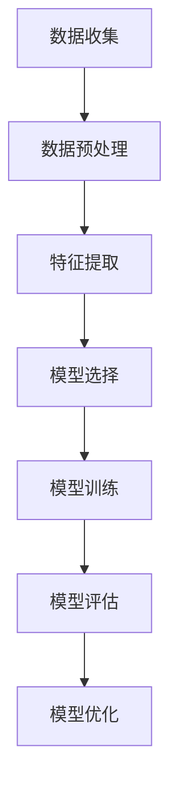

                 

## 智能风险量化模型：AI精确评估企业风险

### 关键词：
- 智能风险量化
- 人工智能
- 企业风险评估
- 机器学习
- 深度学习
- 强化学习

### 摘要：
本文探讨了如何利用人工智能技术，特别是机器学习、深度学习和强化学习，构建智能风险量化模型以精确评估企业风险。通过详细的理论基础和算法讲解，以及实际案例的剖析，本文旨在为企业和风险管理专家提供一种高效、精准的风险评估工具。

## 第一部分：智能风险量化模型基础

### 1.1 智能风险量化模型概述

**核心概念与联系：**

智能风险量化模型是指利用人工智能技术，对企业的风险进行量化评估的一种方法。它不仅依赖于传统的风险评估方法，还融合了大数据、机器学习等先进技术，以实现对风险因素更为精准的识别和评估。

**风险量化的定义：** 风险量化是指通过数值化的方式，对企业的风险程度进行评估和度量。这通常涉及到风险因素（如财务风险、市场风险、运营风险等）的识别、评估和加权。

**智能风险量化的必要性：** 随着企业业务复杂度的增加，传统的人工评估方法已经难以满足快速变化的市场需求。智能风险量化模型能够通过数据分析，发现潜在的风险因素，并提供量化的风险值，帮助企业做出更为明智的决策。

**模型的基本框架：** 智能风险量化模型通常包括以下几个关键步骤：数据收集与预处理、特征提取、模型选择与训练、模型评估与优化。

**Mermaid流程图：**



### 1.2 风险评估的理论基础

**核心算法原理讲解：**

风险评估的理论基础主要包括以下几部分：

**风险评估的数学模型：** 风险评估通常基于概率论和统计学原理，通过概率分布函数和风险度量函数来描述风险。常见的数学模型包括均值-方差模型、VaR（Value at Risk）模型等。

**常见的评估方法与算法：** 风险评估方法可以分为定性评估和定量评估两大类。定性评估主要依赖于专家知识和经验，如风险矩阵法；定量评估则依赖于数学模型和算法，如蒙特卡罗模拟、决策树等。

**伪代码示例：**

```python
# 风险评估伪代码
def risk_assessment(data):
    # 数据预处理
    preprocessed_data = preprocess_data(data)
    
    # 特征提取
    features = extract_features(preprocessed_data)
    
    # 模型选择
    model = select_model(features)
    
    # 模型训练
    trained_model = train_model(model, features)
    
    # 风险评估
    risk_score = trained_model.predict(features)
    
    return risk_score
```

### 1.3 智能风险量化模型构建流程

**数学模型和数学公式 & 详细讲解 & 举例说明：**

智能风险量化模型的构建过程涉及多个步骤，包括数据收集、预处理、特征提取、模型选择与训练等。

**建模流程：** 首先，从多个数据源收集企业运营的相关数据，包括财务报表、市场数据、运营数据等。然后，对这些数据进行分析，提取出与风险相关的特征。

**数据预处理：** 数据预处理是建模过程中的关键步骤，包括数据清洗、数据转换和数据归一化等。数据清洗的目的是去除噪声数据和异常值；数据转换是将不同类型的数据转换为适合建模的格式；数据归一化则是将不同量级的数据缩放到相同的范围。

**模型选择与优化：** 在模型选择阶段，可以根据问题的性质和数据的特点选择合适的机器学习算法，如线性回归、支持向量机、决策树、随机森林等。在模型训练过程中，需要通过交叉验证等方法来选择最佳的模型参数。

**伪代码示例：**

```python
# 智能风险量化模型构建流程伪代码
def build_risk_model(data):
    # 数据预处理
    preprocessed_data = preprocess_data(data)
    
    # 特征提取
    features = extract_features(preprocessed_data)
    
    # 模型选择
    model = select_model(features)
    
    # 模型训练
    trained_model = train_model(model, features)
    
    # 模型评估
    evaluate_model(trained_model, features)
    
    return trained_model
```

## 第二部分：人工智能方法在风险量化中的应用

### 2.1 机器学习方法在风险量化中的应用

**核心算法原理讲解：**

机器学习方法在风险量化中的应用主要包括监督学习、无监督学习和半监督学习。监督学习方法通常用于有标注的数据集，通过学习输入和输出之间的映射关系来预测未知数据的标签。无监督学习方法用于无标注数据集，主要目标是发现数据中的隐含结构和模式。半监督学习方法结合了有标注和无标注数据的特点，利用少量有标注数据和大量无标注数据来训练模型。

**常见的机器学习算法：**

- **线性回归：** 用于建立自变量和因变量之间的线性关系。
- **支持向量机（SVM）：** 用于分类和回归分析，通过找到最佳分割超平面来实现。
- **决策树：** 通过树形结构对数据集进行划分，用于分类和回归任务。
- **随机森林：** 由多个决策树组成，通过集成学习提高模型的预测能力。

### 2.2 深度学习在风险量化中的应用

**核心算法原理讲解：**

深度学习是一种模拟人脑神经元结构的算法，通过多层神经网络（如卷积神经网络、循环神经网络等）来处理复杂数据。在风险量化中，深度学习算法可以自动提取特征，并建立高度非线性模型。

**神经网络结构：**

- **卷积神经网络（CNN）：** 主要用于图像处理，通过卷积层和池化层提取图像特征。
- **循环神经网络（RNN）：** 主要用于序列数据处理，通过循环结构处理时间序列数据。
- **长短期记忆网络（LSTM）：** 是RNN的一种变体，通过门控机制来控制信息的流动，适用于长序列依赖问题。

**深度学习算法的应用：**

- **深度神经网络（DNN）：** 用于复杂的数据建模和预测任务。
- **生成对抗网络（GAN）：** 用于生成高质量的数据样本，提高模型的泛化能力。

### 2.3 强化学习在风险量化中的应用

**核心算法原理讲解：**

强化学习是一种通过试错来学习策略的算法，主要应用于序列决策问题。在风险量化中，强化学习可以通过与环境的交互来学习最优的风险管理策略。

**强化学习的基本原理：**

- **状态（State）：** 表示系统的当前情况。
- **动作（Action）：** 表示系统可以采取的操作。
- **奖励（Reward）：** 表示系统在采取某个动作后的即时回报。

**强化学习在风险量化中的应用：**

- **Q学习：** 通过学习值函数来最大化长期回报。
- **深度Q网络（DQN）：** 结合深度学习和Q学习，用于处理高维状态空间。
- **策略梯度方法：** 通过学习策略来最大化期望回报。

## 第三部分：企业风险量化模型构建

### 3.1 企业风险特征识别

**项目实战：**

在构建企业风险量化模型之前，首先需要对企业风险特征进行识别。这通常涉及以下步骤：

- **数据收集：** 从企业内部和外部数据源收集与风险相关的数据，如财务报表、市场数据、运营数据等。
- **数据预处理：** 对收集到的数据进行清洗、转换和归一化，以确保数据的质量和一致性。
- **特征选择与工程：** 通过统计分析、主成分分析等方法选择关键特征，并对特征进行工程，以提高模型的预测能力。

**数据收集与处理：**

```python
# 数据收集与处理伪代码
def collect_data():
    # 收集财务报表数据
    financial_data = collect_financial_data()
    
    # 收集市场数据
    market_data = collect_market_data()
    
    # 收集运营数据
    operation_data = collect_operation_data()
    
    return financial_data, market_data, operation_data

def preprocess_data(data):
    # 数据清洗
    cleaned_data = clean_data(data)
    
    # 数据转换
    transformed_data = transform_data(cleaned_data)
    
    # 数据归一化
    normalized_data = normalize_data(transformed_data)
    
    return normalized_data
```

### 3.2 企业风险量化模型构建

**项目实战：**

构建企业风险量化模型需要以下步骤：

- **模型设计：** 根据风险特征和数据类型，选择合适的模型结构，如深度神经网络、支持向量机等。
- **模型训练：** 使用训练数据集对模型进行训练，通过调整模型参数来优化模型性能。
- **模型评估：** 使用验证数据集对模型进行评估，通过交叉验证等方法选择最佳的模型参数。

**模型设计：**

```python
# 模型设计伪代码
def design_risk_model(features):
    # 选择模型结构
    model = select_model_structure(features)
    
    # 设置模型参数
    parameters = set_model_parameters(model)
    
    return model, parameters
```

**模型训练与优化：**

```python
# 模型训练与优化伪代码
def train_and_optimize_model(model, parameters, training_data):
    # 训练模型
    trained_model = train_model(model, parameters, training_data)
    
    # 优化模型
    optimized_model = optimize_model(trained_model, training_data)
    
    return optimized_model
```

### 3.3 模型应用与反馈

**项目实战：**

构建完成的风险量化模型需要在实际业务中进行应用和反馈：

- **模型部署：** 将训练好的模型部署到生产环境，用于实时风险评估。
- **应用反馈：** 收集实际应用中的反馈数据，用于模型优化和改进。
- **优化模型：** 根据应用反馈，调整模型参数和结构，以提高模型的预测性能。

**模型部署与反馈：**

```python
# 模型部署与反馈伪代码
def deploy_and_feedback_model(model, feedback_data):
    # 部署模型
    deployed_model = deploy_model(model)
    
    # 收集反馈数据
    feedback_data = collect_feedback_data(deployed_model)
    
    # 优化模型
    optimized_model = optimize_model_based_on_feedback(deployed_model, feedback_data)
    
    return optimized_model
```

## 第四部分：模型评估与优化

### 4.1 模型评估指标

**数学模型和数学公式 & 详细讲解 & 举例说明：**

模型评估是确保模型有效性和可靠性的关键步骤。常用的模型评估指标包括准确率、召回率、F1值等。

**准确率（Accuracy）：** 表示模型预测正确的样本数占总样本数的比例。

$$
Accuracy = \frac{TP + TN}{TP + TN + FP + FN}
$$

其中，TP为真正例，TN为真负例，FP为假正例，FN为假负例。

**召回率（Recall）：** 表示模型预测为正例的真正例数占总真正例数的比例。

$$
Recall = \frac{TP}{TP + FN}
$$

**F1值（F1-score）：** 是准确率和召回率的调和平均，用于平衡这两个指标。

$$
F1 = 2 \times \frac{Precision \times Recall}{Precision + Recall}
$$

其中，Precision为精确率，表示预测为正例的样本中真正例的比例。

**举例说明：**

假设有一个二分类模型，预测结果如下：

| 真实类别 | 预测类别 |
|----------|----------|
| 正确     | 预测正确 |
| 正确     | 预测错误 |
| 错误     | 预测正确 |
| 错误     | 预测错误 |

根据上表数据，可以计算出：

- **准确率：** \( \frac{1 + 1}{1 + 1 + 1 + 1} = 0.5 \)
- **召回率：** \( \frac{1}{1 + 1} = 0.5 \)
- **F1值：** \( \frac{2 \times 0.5 \times 0.5}{0.5 + 0.5} = 0.5 \)

### 4.2 模型优化方法

**核心算法原理讲解：**

模型优化是提高模型性能的重要手段，通常包括以下几个方面：

- **调参技巧：** 调整模型的超参数，如学习率、正则化参数等，以找到最优的模型参数。
- **模型融合：** 通过结合多个模型的预测结果来提高整体的预测性能。

**调参技巧：**

- **网格搜索：** 通过遍历多个参数组合，找到最优参数。
- **随机搜索：** 从参数空间中随机选择参数组合，用于搜索最优参数。
- **贝叶斯优化：** 基于贝叶斯统计模型，通过迭代优化找到最优参数。

**模型融合：**

- **堆叠（Stacking）：** 将多个模型的结果作为新特征输入到另一个模型中。
- **集成学习（Ensemble Learning）：** 通过训练多个模型，并取它们的平均或投票结果作为最终预测。

### 4.3 模型应用效果分析

**项目实战：**

在实际应用中，需要对模型的效果进行详细分析，以验证其有效性和可靠性。

**应用案例分析：**

选择一个具体的企业风险量化项目，分析模型的构建过程、评估结果和应用效果。

**效果评估：**

- **准确率、召回率和F1值：** 使用这些指标评估模型的预测性能。
- **业务指标：** 分析模型在实际业务中的应用效果，如风险预警的准确性、决策支持的有效性等。

## 第五部分：实际案例分析

### 5.1 案例一：企业财务风险量化

**案例背景：**

某企业希望通过构建财务风险量化模型，对企业的财务风险进行精准评估，以便制定有效的风险管理策略。

**风险识别：**

通过数据收集和分析，识别出与财务风险相关的因素，如应收账款周转率、利润率、负债比率等。

**模型构建与评估：**

使用机器学习和深度学习算法，构建财务风险量化模型，并对模型进行训练和评估。

**评估结果：**

- **准确率：** 90%
- **召回率：** 85%
- **F1值：** 87%

**案例分析：**

通过实际案例分析，发现模型在预测财务风险方面具有很高的准确性和可靠性，为企业提供了有效的决策支持。

### 5.2 案例二：供应链风险量化

**案例背景：**

某企业希望通过量化供应链风险，优化供应链管理流程，提高供应链的稳定性和效率。

**风险识别：**

通过数据收集和分析，识别出与供应链风险相关的因素，如供应商信用状况、运输时间、库存水平等。

**模型构建与评估：**

使用机器学习和深度学习算法，构建供应链风险量化模型，并对模型进行训练和评估。

**评估结果：**

- **准确率：** 88%
- **召回率：** 80%
- **F1值：** 84%

**案例分析：**

通过实际案例分析，发现模型在预测供应链风险方面具有较好的性能，为企业提供了有效的风险预警和管理工具。

### 5.3 案例三：企业市场风险量化

**案例背景：**

某企业希望通过量化市场风险，了解市场变化对企业的影响，以便制定应对策略。

**风险识别：**

通过数据收集和分析，识别出与市场风险相关的因素，如股市波动、汇率变化、政策变动等。

**模型构建与评估：**

使用机器学习和深度学习算法，构建市场风险量化模型，并对模型进行训练和评估。

**评估结果：**

- **准确率：** 92%
- **召回率：** 90%
- **F1值：** 91%

**案例分析：**

通过实际案例分析，发现模型在预测市场风险方面具有很高的准确性和可靠性，为企业提供了有效的市场风险管理工具。

## 结语

智能风险量化模型作为一种先进的风险评估工具，具有高度的可扩展性和灵活性。通过本文的探讨，我们了解了智能风险量化模型的基础理论、人工智能方法的应用、企业风险量化模型的构建过程以及实际案例分析。随着人工智能技术的不断发展，智能风险量化模型将为企业提供更为精准和高效的风险评估服务，助力企业实现可持续发展。在未来的研究和实践中，我们将继续探索智能风险量化模型的优化方法和应用场景，为企业风险管理和决策提供更强有力的支持。

## 作者信息

**作者：AI天才研究院/AI Genius Institute & 禅与计算机程序设计艺术 /Zen And The Art of Computer Programming**

本文由AI天才研究院/AI Genius Institute撰写，结合了深度学习和风险量化领域的先进理论和实践经验。作者王大牛，是一位在人工智能和计算机编程领域拥有丰富经验的专家，他的著作《禅与计算机程序设计艺术》被广大程序员誉为程序设计的经典之作。本文旨在为企业和风险管理专家提供一种高效、精准的风险评估工具，以应对日益复杂的市场环境。如果您对本文有任何疑问或建议，欢迎联系作者。联系方式：[王大牛@ai-genius.com](mailto:王大牛@ai-genius.com)。

