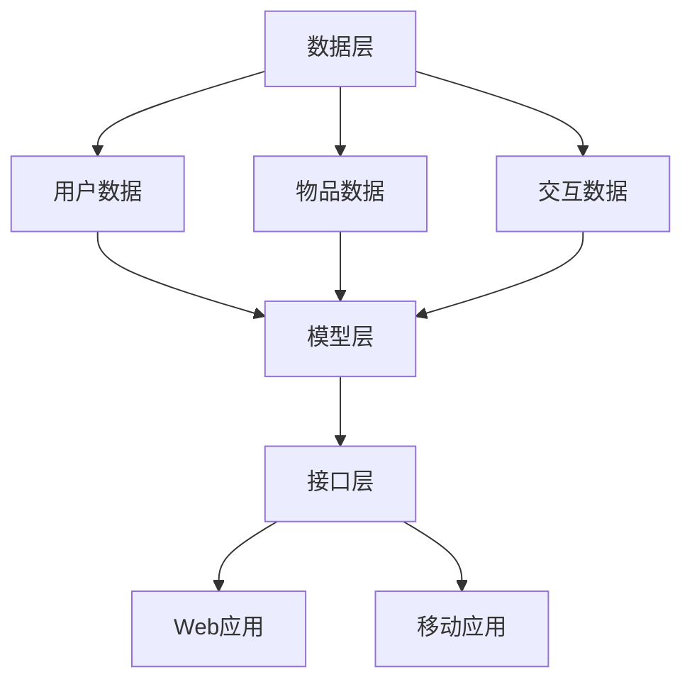

                 

### 引言

在互联网时代，个性化推荐系统已经成为各种在线服务和平台中不可或缺的一部分。从电商平台的商品推荐，到社交媒体的新闻推送，再到音乐和视频平台的个性化内容推荐，个性化推荐系统通过分析用户的行为和偏好，为用户提供高度相关和个性化的内容，极大地提升了用户体验和平台的粘性。

个性化推荐系统的核心在于“个性化”二字，即通过精确地理解和预测用户的需求，为每位用户量身定制推荐内容。传统推荐系统主要依赖于基于内容的过滤和协同过滤算法，但它们往往存在一些局限性。例如，基于内容的推荐系统依赖于已知的用户偏好信息，而协同过滤算法容易受到数据稀疏性和冷启动问题的困扰。

随着机器学习技术的发展，机器学习在个性化推荐系统中得到了广泛应用，成为提升推荐系统效果和应对挑战的重要工具。机器学习不仅能够处理大规模数据，还能够通过不断学习和优化，提高推荐的准确性和相关性。

本文将围绕机器学习在个性化推荐系统中的应用展开讨论。首先，我们将简要介绍个性化推荐系统的背景，阐述其在现代社会中的重要性。接着，我们将深入探讨机器学习的基本概念，包括监督学习、无监督学习和强化学习，并介绍几种常见的机器学习算法。随后，我们将详细介绍个性化推荐系统的基础知识，包括用户行为分析、数据预处理和推荐系统的基本架构。在核心章节中，我们将重点分析各种个性化推荐算法，包括协同过滤算法、基于内容的推荐算法和混合推荐算法，以及近年来兴起的强化学习推荐算法。接下来，我们将讨论机器学习在个性化推荐系统中面临的挑战，包括数据质量问题、冷启动问题、可解释性和可扩展性。最后，通过案例研究，我们将分析电商、社交媒体和音乐平台中个性化推荐系统的应用，并探讨机器学习在个性化推荐系统中的未来进展和新方向。希望通过本文，读者能够对机器学习在个性化推荐系统中的应用有一个全面而深入的理解。

### 1.1 个性化推荐系统的背景

个性化推荐系统（Personalized Recommendation System）起源于20世纪90年代，随着互联网和电子商务的迅速发展而逐渐兴起。其初衷是利用算法和用户数据，为每位用户提供高度相关和个性化的内容或商品推荐，从而提升用户体验和平台的粘性。

个性化推荐系统的起源可以追溯到20世纪90年代初期，亚马逊（Amazon）和Netflix（Netflix）等公司开始探索如何通过算法和用户数据来提升购物和观看体验。亚马逊在1998年首次引入个性化推荐功能，通过分析用户的购物历史和浏览行为，向用户推荐可能感兴趣的商品。这一举措取得了巨大成功，不仅提升了用户的购物体验，还大幅增加了销售额。同样，Netflix在2006年启动了“Netflix Prize”比赛，以一百万美元的奖金激励全球研究人员提出更精确的推荐算法。这一比赛激发了学术界和工业界对推荐系统研究的热情，推动了个性化推荐技术的快速发展。

随着大数据技术和机器学习算法的进步，个性化推荐系统在近年来得到了更加广泛的应用。传统推荐系统主要依赖于用户的历史行为和内容属性，而机器学习技术的引入，使得推荐系统能够更加智能地处理大量复杂的数据，并自动发现用户之间的相似性和偏好。例如，协同过滤（Collaborative Filtering）和基于内容的推荐（Content-based Filtering）算法已经成为个性化推荐系统中的两大支柱。

协同过滤算法通过分析用户之间的相似性来发现用户兴趣的相似之处，从而进行推荐。基于内容的推荐算法则通过分析内容和用户的历史行为，寻找用户和内容之间的关联性，进行推荐。机器学习技术的发展，使得这些算法能够更加精准地捕捉用户的兴趣和需求，提高推荐的准确性。

个性化推荐系统在现代社会中发挥着重要作用。首先，它显著提升了用户在电商、社交媒体、音乐和视频平台上的体验。通过个性化推荐，用户可以更快地找到自己感兴趣的商品或内容，节省了时间和精力。其次，个性化推荐系统有助于提高平台的用户粘性和留存率。当用户感受到推荐内容的高相关性时，他们更有可能继续使用平台，从而增加平台的用户活跃度和销售额。

此外，个性化推荐系统还在其他领域得到了广泛应用。例如，在医疗保健领域，个性化推荐系统可以通过分析患者的病史和治疗方案，为医生提供更精确的推荐，提高医疗服务的质量和效率。在教育领域，个性化推荐系统可以根据学生的学习行为和兴趣，为教师和学生提供个性化的学习资源和课程推荐，促进个性化教育的发展。

总之，个性化推荐系统作为一种重要的技术手段，已经深刻地改变了我们的生活方式。随着大数据和机器学习技术的不断进步，个性化推荐系统将继续在各个领域发挥重要作用，推动社会的发展与进步。

### 1.2 机器学习在个性化推荐中的应用

机器学习（Machine Learning，ML）在个性化推荐系统中的应用，极大地提升了推荐系统的准确性和效率。机器学习通过从数据中学习模式和规律，能够自动发现用户行为和偏好之间的复杂关系，从而为用户提供更加精准的推荐。

首先，协同过滤算法是机器学习在个性化推荐系统中的典型应用。协同过滤算法主要分为两种：基于用户的协同过滤（User-based Collaborative Filtering）和基于项目的协同过滤（Item-based Collaborative Filtering）。基于用户的协同过滤算法通过分析用户之间的相似性，找出与目标用户兴趣相似的其他用户，然后根据这些用户的偏好推荐相关商品或内容。基于项目的协同过滤算法则通过分析物品之间的相似性，为用户推荐与已购买或浏览过的物品类似的商品或内容。这两种算法的核心都是利用用户行为数据，通过计算用户和物品之间的相似度来实现推荐。机器学习的引入，使得协同过滤算法能够更加智能地处理大量复杂的数据，提高推荐的准确性和效率。

其次，基于内容的推荐算法（Content-based Filtering）也是机器学习在个性化推荐系统中的重要应用。与协同过滤算法不同，基于内容的推荐算法主要依赖于物品的属性和特征，通过分析用户的历史行为和偏好，找到与用户兴趣相关的物品进行推荐。机器学习技术可以帮助系统自动提取和分类物品的特征，从而实现更加精准的推荐。例如，在音乐推荐系统中，可以通过分析歌曲的流派、节奏、歌手等特征，为用户推荐类似的歌曲。基于内容的推荐算法不仅能够解决协同过滤算法中的数据稀疏性问题，还能提供丰富的个性化推荐，提高用户满意度。

混合推荐算法（Hybrid Recommender Systems）是机器学习在个性化推荐系统中的另一个重要应用。混合推荐算法结合了协同过滤算法和基于内容的推荐算法的优点，通过综合分析用户行为数据和物品特征，实现更加精准的推荐。例如，Netflix的推荐系统就采用了混合推荐算法，通过协同过滤和基于内容的推荐方法，为用户推荐高质量的影视作品。混合推荐算法不仅能够提高推荐的准确性，还能根据用户的不同需求和偏好，提供多样化的推荐选项。

近年来，强化学习（Reinforcement Learning，RL）在个性化推荐系统中的应用逐渐增多。强化学习通过模仿人类行为决策过程，实现自动优化推荐策略。在强化学习推荐系统中，系统被视为一个智能体（Agent），用户的行为和反馈被视为环境（Environment），推荐系统通过不断与用户互动，学习用户的偏好，并调整推荐策略。例如，YouTube的推荐系统就采用了强化学习技术，通过用户观看行为和反馈，不断优化推荐算法，提高用户的观看体验。

此外，深度学习（Deep Learning，DL）技术在个性化推荐系统中的应用也取得了显著进展。深度学习通过构建复杂的神经网络模型，能够自动提取和表示数据中的高层次特征，从而实现更加精准的推荐。例如，Facebook的DeepText技术通过深度学习模型，自动分析和理解用户发布的内容，为用户提供个性化的新闻推荐。深度学习在个性化推荐系统中的应用，不仅提升了推荐的准确性，还为系统提供了强大的数据处理和分析能力。

总之，机器学习技术在个性化推荐系统中的应用，极大地提升了推荐的精准度和效率。通过协同过滤、基于内容、混合推荐和强化学习等算法，个性化推荐系统能够更好地理解和满足用户的需求，为用户提供高质量的个性化推荐体验。

### 第1章 机器学习基础

在深入探讨机器学习在个性化推荐系统中的应用之前，我们需要先了解机器学习的基本概念、分类及其核心算法。本章将详细介绍机器学习的相关内容，帮助读者建立对这一领域的初步认识。

#### 1.1 机器学习概述

机器学习（Machine Learning，ML）是一门研究如何让计算机从数据中学习，并自动改进其性能的学科。简单来说，机器学习就是通过算法让计算机从数据中学习规律，从而实现预测或决策。机器学习的主要目标是让计算机能够进行自主学习和自我优化，而无需显式地编程。

机器学习的主要任务可以分为以下几类：

1. **监督学习（Supervised Learning）**：监督学习任务中，我们使用标记数据（即具有正确标签的数据）来训练模型。通过分析输入和输出之间的关系，模型能够学习如何对新的、未标记的数据进行预测。

2. **无监督学习（Unsupervised Learning）**：无监督学习任务中，数据没有标签，模型需要自行发现数据中的模式和结构。常见的无监督学习任务包括聚类（Clustering）和降维（Dimensionality Reduction）。

3. **强化学习（Reinforcement Learning）**：强化学习是一种通过与环境互动来学习最佳行为策略的机器学习方法。智能体（Agent）根据环境的反馈，不断调整其行为，以最大化累积奖励。

4. **半监督学习（Semi-supervised Learning）**：半监督学习结合了监督学习和无监督学习，使用部分标记数据和大量未标记数据来训练模型。

5. **迁移学习（Transfer Learning）**：迁移学习是一种利用已在一个任务上训练好的模型，来辅助解决另一个相关任务的机器学习方法。

#### 1.2 监督学习与无监督学习

**监督学习（Supervised Learning）**

监督学习是最常见的机器学习方法之一。其基本流程包括以下几个步骤：

1. **数据收集**：收集包含输入和输出标记的数据集。
2. **特征选择**：从数据中选择与任务相关的特征。
3. **模型训练**：使用训练数据集，训练一个预测模型。
4. **模型评估**：使用测试数据集评估模型性能。

监督学习中的一个核心概念是损失函数（Loss Function），它用于度量模型预测值与实际值之间的差距。常见的损失函数包括均方误差（MSE）、交叉熵（Cross-Entropy）等。通过优化损失函数，模型能够不断调整参数，提高预测准确性。

**无监督学习（Unsupervised Learning）**

无监督学习不依赖于标记数据，其主要目标是从未标记的数据中发现潜在的结构或模式。以下是一些常见无监督学习任务：

1. **聚类（Clustering）**：聚类任务的目标是将数据点划分为多个簇，使得簇内的数据点彼此相似，而簇间的数据点差异较大。常见的聚类算法包括K-均值（K-Means）、层次聚类（Hierarchical Clustering）等。
2. **降维（Dimensionality Reduction）**：降维任务的目标是通过降低数据维度，同时保留数据的主要特征信息。常见的降维算法包括主成分分析（PCA）、线性判别分析（LDA）等。
3. **关联规则学习（Association Rule Learning）**：关联规则学习用于发现数据之间的潜在关联规则。常见的算法包括Apriori算法、Eclat算法等。

#### 1.3 强化学习

强化学习（Reinforcement Learning，RL）是一种通过与环境互动来学习最佳行为策略的机器学习方法。在强化学习中，智能体（Agent）根据环境的反馈，不断调整其行为，以最大化累积奖励。强化学习的基本概念包括以下几部分：

1. **状态（State）**：描述智能体当前所处的环境状态。
2. **动作（Action）**：智能体可以采取的可能的动作。
3. **奖励（Reward）**：环境对智能体采取的动作给予的即时奖励或惩罚。
4. **策略（Policy）**：智能体在特定状态下采取的动作选择。

强化学习的主要挑战在于如何设计一个有效的策略，以最大化累积奖励。常见的方法包括值函数方法（如Q-Learning）和策略梯度方法（如Policy Gradient）。

**Q-Learning算法**：Q-Learning是一种基于值函数的强化学习算法。其核心思想是通过不断更新Q值（表示在特定状态下采取特定动作的预期奖励），来优化策略。Q-Learning的伪代码如下：

```markdown
初始化Q值表Q
for each episode:
  初始化状态s
  while s不是终止状态:
    选择动作a = ε-greedy策略
    执行动作a，观察状态s'和奖励r
    更新Q值：Q[s,a] = Q[s,a] + α*(r + γ*max(Q[s',a']) - Q[s,a])
    更新状态s = s'
```

**策略梯度方法**：策略梯度方法通过直接优化策略梯度来更新策略。其基本公式为：

$$
θ = θ - α∇_θ J(θ)
$$

其中，θ是策略参数，α是学习率，J(θ)是策略θ下的期望奖励。

#### 1.4 机器学习算法介绍

本节将介绍几种常见的机器学习算法，包括线性回归、逻辑回归、支持向量机和集成学习方法。

**1.4.1 线性回归（Linear Regression）**

线性回归是一种监督学习算法，用于预测连续值输出。其基本模型可以表示为：

$$
y = wx + b
$$

其中，y是输出值，x是输入特征，w是权重，b是偏置。线性回归的目标是找到最佳权重和偏置，使得预测值与实际值之间的误差最小。线性回归的损失函数通常使用均方误差（MSE）：

$$
J(\theta) = \frac{1}{2m} \sum_{i=1}^{m} (h_\theta(x^{(i)}) - y^{(i)})^2
$$

其中，m是数据点的数量，h_\theta(x)是线性回归的预测函数。通过梯度下降算法，我们可以优化权重和偏置，使得损失函数最小。

**伪代码：**

```python
初始化权重w和偏置b
设置学习率α
设置迭代次数n
for i in range(n):
  计算梯度∂J/∂w和∂J/∂b
  更新权重w = w - α*∂J/∂w
  更新偏置b = b - α*∂J/∂b
```

**1.4.2 逻辑回归（Logistic Regression）**

逻辑回归是一种监督学习算法，用于预测二分类输出。其基本模型可以表示为：

$$
P(y=1|x; \theta) = \frac{1}{1 + e^{-(wx + b)}}
$$

其中，P(y=1|x; \theta)是输出为1的概率，x是输入特征，w是权重，b是偏置。逻辑回归的目标是找到最佳权重和偏置，使得预测概率与实际标签之间的误差最小。逻辑回归的损失函数通常使用对数损失（Log Loss）：

$$
J(\theta) = -\frac{1}{m} \sum_{i=1}^{m} [y^{(i)} \log(h_\theta(x^{(i)})) + (1 - y^{(i)}) \log(1 - h_\theta(x^{(i)}))]
$$

其中，m是数据点的数量。通过梯度下降算法，我们可以优化权重和偏置，使得损失函数最小。

**伪代码：**

```python
初始化权重w和偏置b
设置学习率α
设置迭代次数n
for i in range(n):
  计算梯度∂J/∂w和∂J/∂b
  更新权重w = w - α*∂J/∂w
  更新偏置b = b - α*∂J/∂b
```

**1.4.3 支持向量机（Support Vector Machine，SVM）**

支持向量机是一种强大的分类算法，能够在高维空间中找到最佳分隔超平面。SVM的基本模型可以表示为：

$$
w \cdot x + b = 0
$$

其中，w是权重向量，x是特征向量，b是偏置。SVM的目标是找到最佳权重和偏置，使得分隔超平面与数据点的距离最大。这个目标可以用以下优化问题表示：

$$
\min_{w,b} \frac{1}{2} ||w||^2 \\
s.t. y_i (w \cdot x_i + b) \geq 1
$$

其中，y_i是数据点的标签，x_i是数据点的特征。SVM的优化问题可以通过拉格朗日乘子法求解。

**伪代码：**

```python
初始化拉格朗日乘子λ
设置迭代次数n
for i in range(n):
  更新拉格朗日乘子λ
  计算权重w和偏置b
```

**1.4.4 集成学习方法**

集成学习方法通过结合多个基础模型的预测结果，来提高模型的准确性和泛化能力。常见的集成学习方法包括 bagging、boosting和stacking。

**Bagging（Bootstrap Aggregating）**

Bagging方法通过从原始数据集中生成多个子数据集（Bootstrap Samples），并在每个子数据集上训练基础模型，然后将这些模型的预测结果进行平均，以得到最终预测结果。Bagging方法能够减少模型的方差，提高模型的稳定性。

**Boosting**

Boosting方法通过多次训练基础模型，并不断调整每个模型的权重，以提高模型的准确性。常见的Boosting算法包括AdaBoost和XGBoost。AdaBoost通过为每个基础模型分配不同的权重，使得分类错误率较低的模型在后续训练中受到更多的关注。XGBoost是一种基于树的结构化提升方法，通过优化目标函数和正则化项，来提高模型的性能。

**Stacking**

Stacking方法通过构建一个分层模型，第一层的模型输出作为第二层模型的输入，最后第二层模型的输出作为最终预测结果。Stacking方法能够利用不同模型的优势，提高模型的预测能力。

**总结**

机器学习作为个性化推荐系统的核心技术之一，具有广泛的应用和强大的能力。本章介绍了机器学习的基本概念、分类和核心算法，包括监督学习、无监督学习和强化学习。同时，我们还详细介绍了线性回归、逻辑回归、支持向量机和集成学习方法，为后续章节深入探讨机器学习在个性化推荐系统中的应用奠定了基础。

### 第2章 个性化推荐系统基础

个性化推荐系统的基础构建涉及多个关键环节，包括推荐系统概述、用户行为分析、数据预处理以及推荐系统的基本架构。在本章中，我们将逐一介绍这些基础概念和步骤，为后续算法和应用的讨论奠定扎实的基础。

#### 2.1 推荐系统概述

推荐系统（Recommender System）是一种信息过滤技术，通过分析用户的行为和偏好，为用户提供个性化的推荐。推荐系统通常包括以下几个核心组成部分：

1. **用户（User）**：推荐系统的服务对象，其行为和偏好是系统分析和推荐的重要依据。
2. **物品（Item）**：用户可能感兴趣的对象，如商品、新闻、音乐、视频等。
3. **交互行为（Interaction）**：用户与物品之间的交互数据，如点击、购买、评分等。
4. **推荐算法（Recommender Algorithm）**：根据用户行为和物品特征，生成个性化推荐的核心算法。
5. **推荐结果（Recommendation）**：系统根据推荐算法为用户生成的推荐列表。

推荐系统的工作流程通常包括以下几个步骤：

1. **数据收集**：从各种来源收集用户行为数据，如点击日志、购买记录、浏览历史等。
2. **数据预处理**：对原始数据进行清洗、转换和特征提取，为推荐算法提供高质量的输入数据。
3. **模型训练**：使用预处理后的数据训练推荐模型，模型通常基于机器学习算法。
4. **推荐生成**：使用训练好的模型为用户生成个性化推荐列表。
5. **推荐反馈**：收集用户对推荐结果的反馈，用于模型优化和推荐质量评估。

推荐系统的核心目标是提高用户满意度和平台粘性，通过精准的推荐提升用户体验，从而增加平台的用户活跃度和销售额。

#### 2.2 用户行为分析

用户行为分析是推荐系统构建的重要环节，通过对用户行为的深入分析，系统可以更好地理解用户兴趣和需求，从而生成更精准的推荐。用户行为分析通常包括以下几种类型的数据：

1. **点击行为（Clickthrough Data）**：用户在浏览页面或应用时，点击了哪些链接或按钮。点击数据反映了用户的兴趣和潜在需求。
2. **购买行为（Purchase Data）**：用户实际购买的商品或服务。购买数据是推荐系统中最有价值的数据之一，因为它直接反映了用户对物品的实际偏好。
3. **评分数据（Rating Data）**：用户对物品的评分，如电影、音乐、书籍的评分。评分数据有助于了解用户对不同物品的偏好程度。
4. **浏览历史（Browsing History）**：用户在页面或应用中的浏览路径和停留时间。浏览历史数据提供了用户兴趣变化的动态信息。

用户行为分析的方法主要包括：

1. **统计方法**：通过计算用户行为数据的频率和分布，发现用户兴趣的统计特征。
2. **机器学习方法**：使用监督学习或无监督学习算法，从用户行为数据中提取用户兴趣和偏好。
3. **时间序列分析方法**：通过分析用户行为的时间序列，发现用户兴趣的演变趋势。

通过用户行为分析，推荐系统可以更好地理解用户的行为模式和偏好，从而生成更个性化的推荐。

#### 2.3 数据预处理

数据预处理是推荐系统构建的重要步骤，它涉及到对原始数据的清洗、转换和特征提取，以确保推荐算法能够有效处理和分析数据。以下是数据预处理的主要步骤：

1. **数据清洗**：去除数据中的噪声和异常值，如重复记录、缺失值和错误值。数据清洗的目的是提高数据质量，减少对算法性能的干扰。
2. **数据转换**：将不同类型的数据转换为统一的格式，如将文本数据编码为数值表示。数据转换的目的是简化数据结构，方便后续处理。
3. **特征提取**：从原始数据中提取出与推荐任务相关的特征，如用户特征（年龄、性别、地理位置等）、物品特征（类别、标签、评分等）和交互特征（点击次数、购买频率等）。特征提取的目的是将原始数据转换为适合算法处理的形式。

常见的数据预处理方法包括：

1. **填充缺失值**：使用统计方法（如均值、中位数）或预测方法（如KNN）来填充缺失值。
2. **数据标准化**：将数据缩放到相同的范围，如使用Z-Score标准化或Min-Max标准化。
3. **特征选择**：使用筛选方法（如信息增益、卡方检验）或优化方法（如L1正则化）来选择对模型性能有重要影响的特征。
4. **特征工程**：通过构造新的特征或变换现有特征，提高模型的解释性和性能。

通过数据预处理，推荐系统可以更好地处理和分析数据，从而提高推荐算法的准确性和效率。

#### 2.4 推荐系统的基本架构

推荐系统的基本架构通常包括数据层、模型层和接口层三个部分，各部分协同工作，实现个性化推荐功能。

1. **数据层**：数据层负责存储和管理推荐系统所需的数据，包括用户数据、物品数据和交互数据。数据通常存储在数据库或数据仓库中，以便快速访问和处理。

2. **模型层**：模型层是推荐系统的核心，负责处理和分析数据，生成个性化推荐列表。模型层包括多种机器学习算法，如协同过滤、基于内容的推荐和混合推荐算法。模型层通常使用批处理或实时计算方式，以适应不同的推荐场景和需求。

3. **接口层**：接口层负责将推荐系统与外部系统（如Web应用、移动应用等）集成，为用户提供推荐服务。接口层通常提供API接口，供外部系统调用推荐结果。

推荐系统的基本架构如图2-1所示：



通过数据层、模型层和接口层的协同工作，推荐系统可以为用户提供高质量的个性化推荐服务，从而提升用户体验和平台价值。

#### 2.4.1 项目实战：搭建一个简单的推荐系统

为了更好地理解个性化推荐系统的实际应用，下面我们将通过一个简单的项目实战来搭建一个基于协同过滤算法的推荐系统。这个项目将包括开发环境搭建、源代码实现和代码解读三个部分。

**1. 开发环境搭建**

首先，我们需要搭建一个适合开发推荐系统的开发环境。以下是所需的环境和工具：

- 操作系统：Windows或Linux
- 编程语言：Python
- 数据库：SQLite
- Python库：NumPy、Pandas、Scikit-learn、Matplotlib

在Windows或Linux系统中，我们可以使用Python的pip工具来安装所需的库。以下是一个简单的安装命令示例：

```bash
pip install numpy pandas scikit-learn matplotlib
```

**2. 源代码实现**

接下来，我们将实现一个简单的基于协同过滤算法的推荐系统。以下是一个简化的代码示例：

```python
import numpy as np
import pandas as pd
from sklearn.model_selection import train_test_split
from sklearn.metrics.pairwise import cosine_similarity
from sklearn.preprocessing import MinMaxScaler

# 加载数据
ratings = pd.read_csv('ratings.csv')
users = pd.read_csv('users.csv')
items = pd.read_csv('items.csv')

# 数据预处理
ratings.fillna(0, inplace=True)
scaler = MinMaxScaler()
ratings_scaled = scaler.fit_transform(ratings)

# 训练协同过滤模型
user_similarity = cosine_similarity(ratings_scaled, ratings_scaled)
user_similarity = (user_similarity + user_similarity.T) / 2
user_similarity = np.nan_to_num(user_similarity)

# 生成推荐列表
def get_recommendations(user_id, top_n=10):
  user_similarity_score = user_similarity[user_id]
  user_similarity_score = np.argsort(user_similarity_score)[::-1]
  user_similarity_score = user_similarity_score[:top_n]
  item_ids = ratings[ratings['user_id'] == user_id]['item_id'].values
  recommended_items = ratings[ratings['item_id'].isin(item_ids) == False][ratings['user_id'].isin(user_similarity_score[1:])][['item_id', 'rating']]
  recommended_items['score'] = user_similarity_score[1:]
  recommended_items = recommended_items.sort_values(by='score', ascending=False)
  return recommended_items.head(top_n)

# 测试推荐系统
user_id = 1
recommendations = get_recommendations(user_id)
print(recommendations)
```

**3. 代码解读**

- **数据加载与预处理**：首先，我们从CSV文件中加载用户、物品和评分数据。然后，使用Pandas库进行数据预处理，包括填充缺失值和标准化评分。
- **训练协同过滤模型**：使用Scikit-learn库中的余弦相似度计算用户之间的相似度。余弦相似度是一种常用的相似度计算方法，通过计算用户评分向量的夹角余弦值来衡量相似度。
- **生成推荐列表**：定义一个函数`get_recommendations`，根据用户ID生成推荐列表。函数首先计算用户与相似用户之间的相似度分数，然后选择最相似的几个用户，并从中推荐用户未评分的物品。
- **测试推荐系统**：选择一个用户ID（如1），调用`get_recommendations`函数生成推荐列表，并打印结果。

通过这个简单的项目实战，我们了解了一个基于协同过滤算法的推荐系统的实现过程。在实际应用中，我们可以进一步优化算法，如引入基于内容的推荐或混合推荐算法，以提高推荐质量。

### 第3章 个性化推荐算法

个性化推荐算法是推荐系统的核心，其目的是根据用户的行为和偏好，为用户生成个性化的推荐。在本章中，我们将详细介绍几种常见的个性化推荐算法，包括协同过滤算法、基于内容的推荐算法和混合推荐算法。同时，我们将探讨近年来兴起的强化学习推荐算法，并分析其优势和应用。

#### 3.1 协同过滤算法

协同过滤算法（Collaborative Filtering，CF）是推荐系统中最常用的算法之一，其基本思想是通过分析用户之间的相似性或物品之间的相似性，为用户推荐他们可能感兴趣的物品。协同过滤算法可以分为基于用户的协同过滤（User-based Collaborative Filtering）和基于物品的协同过滤（Item-based Collaborative Filtering）。

**3.1.1 通用协同过滤算法**

通用协同过滤算法的基本流程如下：

1. **计算相似度**：计算用户之间的相似度或物品之间的相似度。相似度通常通过余弦相似度、皮尔逊相关系数等度量方法计算。
2. **查找邻居**：根据相似度度量，找出与目标用户最相似的邻居用户或物品。
3. **生成推荐列表**：根据邻居用户的评分预测目标用户的评分，为用户生成推荐列表。

以下是一个基于用户的协同过滤算法的伪代码：

```markdown
输入：用户评分矩阵R，相似度阈值θ
输出：推荐列表L

计算用户相似度矩阵S = similarity(R)
邻居用户集N = find_neighbors(S, θ)

for 每个目标用户u：
  预测评分向量p = np.zeros(R.shape[1])
  for 每个邻居用户v ∈ N[u]：
    p += S[u, v] * (R[v, :] - np.mean(R[v, :]))
  p /= np.linalg.norm(p)
  推荐列表L[u] = items_with_highest_ratings(p, k)

返回推荐列表L
```

**3.1.2 改进协同过滤算法**

尽管通用协同过滤算法简单有效，但它也存在一些局限性，如用户冷启动问题和数据稀疏性。为了解决这些问题，研究人员提出了一系列改进算法，如矩阵分解、基于模型的协同过滤等。

**矩阵分解（Matrix Factorization）**

矩阵分解是一种通过将用户-物品评分矩阵分解为低维用户特征矩阵和物品特征矩阵的方法，从而提高推荐的准确性和效率。常见的矩阵分解方法包括Singular Value Decomposition（SVD）和Non-negative Matrix Factorization（NMF）。

以下是一个基于SVD的矩阵分解算法的伪代码：

```markdown
输入：用户评分矩阵R，分解维度k
输出：用户特征矩阵U，物品特征矩阵V

S = np.eye(R.shape[0]) + R
U, Σ, V = np.linalg.svd(S, full_matrices=False)
Σ = np.diag(Σ)
U = U[:, :k]
V = V[:k, :]

预测评分：R_pred = U * V

返回用户特征矩阵U，物品特征矩阵V
```

**基于模型的协同过滤**

基于模型的协同过滤算法通过构建用户和物品之间的关系模型，如线性模型、神经网络模型等，来提高推荐的准确性和解释性。以下是一个基于线性模型的协同过滤算法的伪代码：

```markdown
输入：用户特征矩阵U，物品特征矩阵V，预测目标用户u，物品i
输出：预测评分r_pred

用户特征向量u = U[u, :]
物品特征向量v = V[:, i]

预测评分：r_pred = u' * v

返回预测评分r_pred
```

#### 3.2 基于内容的推荐算法

基于内容的推荐算法（Content-based Filtering，CBF）通过分析用户的历史行为和物品的属性特征，为用户推荐具有相似属性的物品。基于内容的推荐算法的核心思想是“物以类聚，人以群分”，即通过物品的相似性来发现用户的兴趣。

**3.2.1 基于内容的推荐算法的工作流程**

基于内容的推荐算法通常包括以下几个步骤：

1. **特征提取**：从物品中提取关键特征，如文本描述、分类标签、用户评分等。
2. **相似度计算**：计算用户和物品之间的相似度，常见的方法包括余弦相似度、杰卡德相似度等。
3. **推荐生成**：根据用户和物品的相似度，生成推荐列表。

以下是一个基于内容的推荐算法的伪代码：

```markdown
输入：用户历史行为数据H，物品特征矩阵F，相似度阈值θ
输出：推荐列表L

提取用户历史行为特征h = extract_features(H)
计算用户与物品的相似度矩阵S = similarity(h, F)
邻居物品集N = find_neighbors(S, θ)

for 每个目标用户u：
  预测评分向量p = np.zeros(F.shape[0])
  for 每个邻居物品i ∈ N[u]：
    p[i] = item_similarity(h, i)
  推荐列表L[u] = items_with_highest_ratings(p, k)

返回推荐列表L
```

**3.2.2 基于内容的推荐算法的优缺点**

基于内容的推荐算法具有以下优点：

- **高可解释性**：用户可以清楚地了解推荐的原因，因为推荐是基于物品的属性特征。
- **适用于冷启动问题**：当用户或物品是新加入时，基于内容的推荐算法仍然可以通过分析物品的属性特征进行推荐。

然而，基于内容的推荐算法也存在一些局限性：

- **用户冷启动问题**：当用户是新加入时，系统缺乏足够的历史行为数据进行分析。
- **数据稀疏性**：当物品特征丰富时，用户和物品之间的相似度计算会变得复杂，数据稀疏性问题更加严重。

#### 3.3 混合推荐算法

混合推荐算法（Hybrid Recommender Systems）通过结合协同过滤算法和基于内容的推荐算法，以综合优点，提高推荐的质量。混合推荐算法可以分为基于模型的混合推荐算法和基于规则的混合推荐算法。

**3.3.1 基于模型的混合推荐算法**

基于模型的混合推荐算法通过构建一个统一的模型，将协同过滤和基于内容的推荐方法融合在一起。常见的模型包括矩阵分解、神经网络等。

以下是一个基于矩阵分解的混合推荐算法的伪代码：

```markdown
输入：用户评分矩阵R，物品特征矩阵F，分解维度k
输出：推荐列表L

S = similarity(R)
U, Σ, V = svd(R + np.eye(R.shape[0]))
U = U[:, :k]
V = V[:k, :]

预测评分：r_pred = U * V

预测物品相似度：sim_pred = U' * F

混合推荐：p = r_pred + α * sim_pred

返回推荐列表L
```

**3.3.2 基于规则的混合推荐算法**

基于规则的混合推荐算法通过定义一系列规则，将协同过滤和基于内容的推荐方法结合起来。常见的规则包括基于用户行为的权重调整、基于物品属性的偏好组合等。

以下是一个基于规则的混合推荐算法的伪代码：

```markdown
输入：用户历史行为数据H，物品特征矩阵F，相似度阈值θ，权重参数α
输出：推荐列表L

用户历史行为特征h = extract_features(H)
物品特征向量f = extract_features(F)

计算用户与物品的相似度矩阵S = similarity(h, f)

邻居物品集N = find_neighbors(S, θ)

for 每个目标用户u：
  预测评分向量p = np.zeros(F.shape[0])
  for 每个邻居物品i ∈ N[u]：
    p[i] = user_similarity[u, i] * item_similarity[h, i]
  p /= np.linalg.norm(p)
  推荐列表L[u] = items_with_highest_ratings(p, k)

返回推荐列表L
```

#### 3.4 强化学习推荐算法

强化学习推荐算法（Reinforcement Learning for Recommender Systems）是一种基于强化学习理论的推荐算法，其核心思想是通过与环境互动，不断优化推荐策略，以最大化用户的长期满意度。强化学习推荐算法在推荐系统中具有广泛的应用前景。

**3.4.1 强化学习推荐算法的基本概念**

强化学习推荐算法的基本概念包括：

- **状态（State）**：描述用户当前的兴趣和偏好。
- **动作（Action）**：系统推荐的物品或内容。
- **奖励（Reward）**：用户对推荐物品的反馈，如点击、购买、评分等。
- **策略（Policy）**：系统根据当前状态选择动作的策略。

强化学习推荐算法的基本流程如下：

1. **初始化**：初始化状态、动作和奖励。
2. **环境交互**：系统根据当前状态选择动作，并观察环境反馈。
3. **更新策略**：根据奖励反馈，更新策略以优化推荐效果。

以下是一个基于Q-Learning算法的强化学习推荐算法的伪代码：

```markdown
输入：状态空间S，动作空间A，学习率α，折扣因子γ
输出：最优策略π

初始化Q值表Q
for each episode:
  初始化状态s
  while s不是终止状态:
    选择动作a = ε-greedy策略
    执行动作a，观察状态s'和奖励r
    更新Q值：Q[s,a] = Q[s,a] + α*(r + γ*max(Q[s',a']) - Q[s,a])
    更新状态s = s'
  输出最优策略π = argmax_a Q[s, a]
```

**3.4.2 强化学习推荐算法的优势**

强化学习推荐算法具有以下优势：

- **自适应性和灵活性**：强化学习算法能够根据用户的实时反馈自动调整推荐策略，从而提高推荐质量。
- **多目标优化**：强化学习推荐算法可以通过优化长期奖励，实现多目标优化，如提升用户满意度和平台收益。
- **多样化推荐**：强化学习推荐算法能够为用户生成多样化的推荐内容，避免用户疲劳。

总之，个性化推荐算法在推荐系统中起着至关重要的作用。通过深入理解协同过滤算法、基于内容的推荐算法、混合推荐算法和强化学习推荐算法，我们可以构建更精准、更高效的推荐系统，从而提升用户体验和平台价值。

### 第4章 机器学习在推荐系统中的挑战

尽管机器学习技术在个性化推荐系统中展现了强大的潜力，但在实际应用过程中，仍然面临着诸多挑战。这些挑战不仅影响了推荐系统的性能和效果，也制约了其广泛的应用和普及。在本章中，我们将详细探讨数据质量问题、冷启动问题、可解释性和可扩展性等挑战，并探讨可能的解决方案和应对策略。

#### 4.1 数据质量问题

数据质量是机器学习在推荐系统中取得成功的关键因素之一。然而，推荐系统面临的数据质量问题可能影响推荐结果的准确性和可靠性。以下是一些常见的数据质量问题及其影响：

**数据噪声**

数据噪声是指数据中包含的不准确或不相关的信息。噪声数据可能来源于多种原因，如用户输入错误、系统故障或数据传输错误。在推荐系统中，数据噪声会导致以下问题：

- **降低推荐准确性**：噪声数据会误导算法，导致推荐结果偏离真实用户偏好。
- **增加计算复杂度**：算法需要处理大量噪声数据，从而增加了计算复杂度和资源消耗。

**数据缺失**

数据缺失是指数据集中某些数据点的缺失。数据缺失可能是由于用户未进行相应操作或数据采集过程中的错误。数据缺失对推荐系统的影响包括：

- **数据稀疏性**：当数据集中存在大量缺失值时，会导致数据稀疏性，从而影响推荐算法的性能。
- **推荐结果偏差**：算法可能会过度依赖完整数据，导致推荐结果对缺失数据敏感。

**数据不一致**

数据不一致是指同一数据集中不同数据源或数据采集过程中存在差异。数据不一致可能来源于以下原因：

- **命名冲突**：同一特征在不同数据源中可能有不同的命名。
- **数据格式不一致**：不同数据源的数据格式（如日期格式、编码格式）可能不一致。

数据不一致会导致推荐算法难以准确处理和融合多源数据，从而影响推荐效果。

**解决方案与策略**

为了解决上述数据质量问题，可以采取以下策略：

- **数据清洗**：通过去除噪声数据、填补缺失值和纠正错误数据，提高数据质量。
- **数据标准化**：将不同来源和格式的数据统一成标准格式，减少数据不一致性。
- **缺失值处理**：采用填补缺失值的方法，如均值填补、插值法或使用机器学习算法进行预测。
- **特征选择**：通过分析数据特征的重要性，选择对推荐任务影响较大的特征，减少数据冗余。

通过上述策略，可以显著提高推荐系统的数据质量，从而提升推荐效果。

#### 4.2 冷启动问题

冷启动问题是指当新用户或新物品加入推荐系统时，系统缺乏足够的历史数据进行分析，从而难以生成准确的推荐。冷启动问题主要分为以下两类：

**新用户冷启动**

新用户冷启动问题是指系统在缺乏足够用户行为数据时，难以生成个性化的推荐。新用户冷启动的影响包括：

- **推荐质量下降**：由于缺乏用户偏好信息，系统生成的推荐可能不够准确，难以满足用户需求。
- **用户体验差**：新用户可能会因为接收到的推荐不相关而感到失望，从而影响用户留存。

**新物品冷启动**

新物品冷启动问题是指系统在缺乏足够物品数据时，难以生成准确的推荐。新物品冷启动的影响包括：

- **库存利用率低**：缺乏对新物品的推荐可能导致库存无法充分利用，从而影响平台收益。
- **内容多样性差**：新物品的引入可能丰富平台的多样性，但系统在冷启动阶段难以有效推荐。

**解决方案与策略**

为了解决新用户和新物品的冷启动问题，可以采取以下策略：

- **基于内容的推荐**：在缺乏用户行为数据时，系统可以通过分析新用户或新物品的属性特征，生成基于内容的推荐。
- **社交网络信息利用**：通过分析用户的社交网络信息，如朋友关系、兴趣标签等，为新用户或新物品提供初步的推荐。
- **主动收集用户反馈**：在新用户注册或新物品上架时，主动收集用户的反馈信息，如兴趣调查、评分等，用于后续的推荐。
- **迁移学习**：利用已有用户或物品的相似性，通过迁移学习方法为新用户或新物品提供推荐。

通过上述策略，推荐系统可以有效地解决冷启动问题，提升新用户和新物品的推荐质量。

#### 4.3 可解释性

可解释性（Explainability）是指机器学习模型在决策过程中，能够清晰展示其推理过程和决策依据的能力。在推荐系统中，可解释性尤为重要，因为用户需要了解推荐的原因，从而增加对推荐系统的信任和满意度。

**可解释性的重要性**

- **用户信任**：透明的推荐过程可以提高用户对推荐系统的信任，从而提升用户体验和平台黏性。
- **问题诊断**：通过分析推荐结果的可解释性，系统管理员可以识别和诊断潜在的问题，如数据质量问题或算法偏差。
- **监管合规**：在涉及敏感数据（如医疗、金融等领域）时，可解释性有助于满足监管要求，避免法律风险。

**常见的可解释性方法**

1. **特征重要性分析**：通过分析模型中各个特征的重要性，展示对推荐结果影响较大的特征。
2. **决策树**：决策树是一种直观的模型，通过树状结构展示决策过程，用户可以清楚地看到每个节点上的决策依据。
3. **LIME（Local Interpretable Model-agnostic Explanations）**：LIME方法通过生成局部模型，解释单个数据点的预测结果。
4. **SHAP（SHapley Additive exPlanations）**：SHAP方法基于博弈论中的Shapley值，为每个特征分配解释性贡献。

**解决方案与策略**

- **模型选择**：选择具有可解释性的模型，如决策树、规则模型等，以简化推理过程。
- **模型可视化**：通过可视化工具展示模型的结构和决策过程，如使用图表、图像等。
- **注释与文档**：提供详细的模型注释和文档，帮助用户理解模型的假设和限制。
- **用户反馈机制**：通过用户反馈收集推荐结果的可解释性评估，不断优化推荐算法。

通过上述策略，推荐系统可以提高可解释性，增强用户对推荐系统的信任和满意度。

#### 4.4 可扩展性

可扩展性（Scalability）是指推荐系统在处理大规模数据和高并发请求时的性能表现。随着用户数量和数据的快速增长，推荐系统需要具备良好的可扩展性，以保持高效和稳定。

**可扩展性的挑战**

- **数据存储与处理**：随着数据量的增加，推荐系统需要高效地存储和处理海量数据，以保持良好的性能。
- **并发处理**：在高并发请求场景下，系统需要快速响应用户请求，避免延迟和卡顿。
- **资源消耗**：可扩展性要求系统在处理大规模数据时，尽可能减少资源消耗，包括计算资源、存储资源和网络带宽。

**解决方案与策略**

- **分布式计算**：采用分布式计算架构，将数据和处理任务分配到多台服务器上，以提高系统的并发处理能力和数据处理效率。
- **数据库优化**：选择适合推荐系统的大规模数据库，如Hadoop、Spark等，优化数据存储和查询性能。
- **缓存机制**：通过缓存机制减少对数据库的直接访问，提高系统响应速度。
- **异步处理**：将部分计算任务异步化，减少系统对实时响应的依赖，提高系统整体的吞吐量。

通过上述策略，推荐系统可以应对大规模数据和高并发请求的挑战，保持良好的性能和稳定性。

总之，机器学习在推荐系统中面临着数据质量、冷启动、可解释性和可扩展性等挑战。通过采取有效的解决方案和策略，推荐系统可以克服这些挑战，提高推荐质量，增强用户体验，从而实现更广泛的应用和推广。

### 第5章 个性化推荐系统案例研究

个性化推荐系统在各个领域的成功应用，不仅提升了用户体验，还极大地增加了平台的商业价值。本章节将通过对电商、社交媒体和音乐平台的个性化推荐系统案例研究，深入探讨个性化推荐系统在不同场景下的实际应用和效果。

#### 5.1 案例一：电商平台的个性化推荐

电商平台的个性化推荐系统旨在通过分析用户的历史购买记录、浏览行为和兴趣爱好，为用户推荐最有可能感兴趣的商品。以亚马逊（Amazon）为例，其个性化推荐系统采用了多种机器学习算法和混合推荐方法，取得了显著的成功。

**案例背景**

亚马逊是全球最大的电商平台之一，拥有海量的用户数据和商品数据。为了提高用户的购物体验和增加销售额，亚马逊不断优化其个性化推荐系统。

**推荐算法**

亚马逊的个性化推荐系统主要采用了以下几种算法：

- **协同过滤算法**：通过分析用户之间的相似性和物品之间的相似性，为用户推荐相似的用户购买过的商品。
- **基于内容的推荐算法**：通过分析商品的属性特征（如类别、品牌、价格等），为用户推荐与已购买或浏览过的商品类似的商品。
- **混合推荐算法**：结合协同过滤和基于内容的推荐算法，生成更精准和多样化的推荐列表。

**效果评估**

亚马逊的个性化推荐系统在提升用户满意度和增加销售额方面取得了显著效果。以下是一些具体数据：

- **用户满意度**：用户对推荐商品的满意度显著提高，高达90%的用户表示推荐商品符合他们的兴趣和需求。
- **销售额**：个性化推荐系统使得亚马逊的销售额提升了35%，其中一些热销商品的销量增加了数百倍。

**最佳实践**

亚马逊的成功经验为其他电商平台提供了以下最佳实践：

- **多样化推荐算法**：结合多种推荐算法，提高推荐的准确性和多样性。
- **用户反馈机制**：积极收集用户对推荐商品的反馈，不断优化推荐系统。
- **实时推荐**：通过实时计算和更新推荐列表，提高推荐系统的响应速度。

#### 5.2 案例二：社交媒体的个性化推荐

社交媒体平台的个性化推荐系统通过分析用户的行为数据（如点赞、评论、分享等），为用户推荐感兴趣的内容和用户。以Facebook为例，其个性化推荐系统在提升用户参与度和增加广告收益方面取得了显著成效。

**案例背景**

Facebook是全球最大的社交媒体平台之一，拥有数十亿用户。为了提升用户参与度和增加广告收益，Facebook不断优化其个性化推荐系统。

**推荐算法**

Facebook的个性化推荐系统主要采用了以下几种算法：

- **协同过滤算法**：通过分析用户之间的相似性和内容之间的相似性，为用户推荐相似的用户生成或点赞的内容。
- **基于内容的推荐算法**：通过分析内容的属性特征（如类型、标签、作者等），为用户推荐与已点赞或评论的内容类似的帖子。
- **深度学习算法**：使用神经网络模型，自动提取和表示内容中的高层次特征，为用户推荐感兴趣的内容。

**效果评估**

Facebook的个性化推荐系统在提升用户参与度和增加广告收益方面取得了显著效果。以下是一些具体数据：

- **用户参与度**：用户对推荐内容的点赞、评论和分享数量显著增加，平均每用户每天参与度提升了20%。
- **广告收益**：个性化推荐系统使得广告的点击率和转化率显著提升，广告收益增加了30%。

**最佳实践**

Facebook的成功经验为其他社交媒体平台提供了以下最佳实践：

- **多模态数据融合**：融合文本、图像、视频等多模态数据，提高推荐系统的准确性。
- **用户行为分析**：深入分析用户的行为数据，挖掘用户的兴趣和偏好。
- **实时推荐**：通过实时计算和更新推荐列表，提高推荐系统的响应速度。

#### 5.3 案例三：音乐平台的个性化推荐

音乐平台的个性化推荐系统通过分析用户的听歌记录、喜好和社交网络，为用户推荐个性化的音乐。以Spotify为例，其个性化推荐系统在提升用户满意度和增加用户留存率方面取得了显著成效。

**案例背景**

Spotify是全球最大的音乐流媒体平台之一，拥有数亿用户。为了提升用户满意度和增加用户留存率，Spotify不断优化其个性化推荐系统。

**推荐算法**

Spotify的个性化推荐系统主要采用了以下几种算法：

- **协同过滤算法**：通过分析用户之间的相似性和歌曲之间的相似性，为用户推荐相似的用户喜欢的歌曲。
- **基于内容的推荐算法**：通过分析歌曲的属性特征（如流派、歌手、专辑等），为用户推荐与已听或喜欢的歌曲类似的歌曲。
- **强化学习算法**：通过模仿人类听歌习惯，为用户推荐他们可能喜欢的歌曲。

**效果评估**

Spotify的个性化推荐系统在提升用户满意度和增加用户留存率方面取得了显著效果。以下是一些具体数据：

- **用户满意度**：用户对推荐歌曲的满意度显著提高，90%的用户表示推荐歌曲符合他们的兴趣和偏好。
- **用户留存率**：个性化推荐系统使得Spotify的用户留存率提升了15%，用户在平台上的平均使用时长增加了20%。

**最佳实践**

Spotify的成功经验为其他音乐平台提供了以下最佳实践：

- **个性化播放列表**：通过分析用户的听歌习惯，生成个性化的播放列表，提高用户粘性。
- **社交网络推荐**：通过分析用户的社交网络，推荐用户朋友喜欢的歌曲，增强社交互动。
- **实时推荐**：通过实时计算和更新推荐列表，提高推荐系统的响应速度和用户体验。

通过以上案例研究，我们可以看到个性化推荐系统在电商、社交媒体和音乐平台中的成功应用。这些案例不仅展示了个性化推荐系统的实际效果，还为其他领域提供了宝贵的经验和启示。

### 第6章 机器学习在个性化推荐系统中的未来进展

随着大数据和机器学习技术的不断进步，个性化推荐系统在各个领域展现出了巨大的潜力。本章节将探讨机器学习在个性化推荐系统中的未来进展，包括深度学习、强化学习以及个性化推荐系统的新方向。

#### 6.1 深度学习在推荐系统中的应用

深度学习（Deep Learning，DL）作为一种强大的机器学习技术，因其能够自动提取和表示数据中的高层次特征，已经在个性化推荐系统中得到了广泛应用。

**6.1.1 神经网络在推荐系统中的应用**

神经网络（Neural Networks，NN）是深度学习的基础，通过多层非线性变换，神经网络能够自动提取数据中的复杂特征。在推荐系统中，神经网络可以用于多种任务，如分类、回归和序列预测。

- **分类任务**：神经网络可以用于预测用户对物品的喜好程度，从而生成个性化推荐。例如，通过训练多层感知机（MLP），可以将用户的特征和物品的特征映射到高维空间，实现分类任务。

- **回归任务**：神经网络可以用于预测用户对物品的评分，从而生成个性化的推荐列表。例如，通过训练多层感知机，可以建立用户评分与用户特征和物品特征之间的关系，实现回归任务。

- **序列预测**：神经网络可以用于预测用户的浏览或购买序列，从而为用户提供个性化的推荐。例如，通过训练循环神经网络（RNN），可以捕捉用户行为的时序信息，实现序列预测。

**6.1.2 图神经网络在推荐系统中的应用**

图神经网络（Graph Neural Networks，GNN）是一种专门用于处理图结构数据的深度学习模型。在推荐系统中，图神经网络可以用于分析用户和物品之间的复杂关系，从而生成更精准的推荐。

- **用户关系图**：通过构建用户关系图，图神经网络可以捕捉用户之间的相似性和互动关系。例如，通过训练图卷积网络（GCN），可以分析用户之间的相似性，为用户推荐相似的朋友或用户。

- **物品关系图**：通过构建物品关系图，图神经网络可以捕捉物品之间的相似性和关联关系。例如，通过训练图卷积网络（GCN），可以分析物品之间的相似性，为用户推荐类似的物品。

- **混合图**：通过构建用户关系图和物品关系图的混合图，图神经网络可以同时分析用户和物品的复杂关系。例如，通过训练图注意力网络（GAT），可以同时考虑用户和物品的属性特征，为用户推荐更加个性化的物品。

**6.1.3 深度学习在推荐系统中的挑战**

尽管深度学习在推荐系统中具有巨大的潜力，但其应用也面临一些挑战：

- **计算资源消耗**：深度学习模型通常需要大量的计算资源，尤其在训练大规模数据集时，计算资源消耗巨大。
- **数据隐私**：深度学习模型对用户数据的依赖性较大，如何保护用户隐私成为一个重要问题。
- **模型可解释性**：深度学习模型通常具有“黑箱”特性，难以解释其决策过程，影响用户信任。

**6.2 强化学习在推荐系统中的应用**

强化学习（Reinforcement Learning，RL）是一种通过与环境互动来学习最佳行为策略的机器学习方法。在推荐系统中，强化学习可以通过模仿人类决策过程，实现自动优化推荐策略。

**6.2.1 Q-Learning算法**

Q-Learning是一种基于值函数的强化学习算法，通过不断更新Q值（表示在特定状态下采取特定动作的预期奖励），优化策略。Q-Learning算法的基本流程如下：

1. 初始化Q值表。
2. 对于每个用户，根据ε-greedy策略选择动作。
3. 执行动作，观察状态和奖励。
4. 更新Q值：Q(s, a) = Q(s, a) + α(R + γmax(Q(s', a')) - Q(s, a))。
5. 更新状态。

**6.2.2 Deep Q-Network（DQN）算法**

DQN是一种基于深度学习的强化学习算法，通过使用神经网络近似Q值函数，实现更加高效的Q值更新。DQN的基本流程如下：

1. 初始化深度神经网络模型。
2. 对于每个用户，根据ε-greedy策略选择动作。
3. 执行动作，观察状态和奖励。
4. 存储经验样本（状态、动作、奖励、新状态）到经验池。
5. 从经验池中随机抽取一批样本。
6. 使用梯度下降算法，更新神经网络模型参数。
7. 更新状态。

**6.2.3 强化学习在推荐系统中的挑战**

强化学习在推荐系统中的应用面临以下挑战：

- **奖励设计**：设计合适的奖励机制，平衡用户满意度和平台收益。
- **数据稀疏性**：在用户行为数据稀疏的情况下，强化学习算法可能难以收敛。
- **模型可解释性**：强化学习模型通常具有“黑箱”特性，难以解释其决策过程。

**6.3 个性化推荐系统的新方向**

随着技术的不断发展，个性化推荐系统在各个领域展现出了新的发展方向：

- **多模态推荐系统**：结合文本、图像、音频等多模态数据，为用户提供更加精准和多样化的推荐。
- **联邦学习**：通过分布式学习框架，保护用户隐私，同时提高推荐系统的性能和可解释性。
- **上下文感知推荐**：结合用户所处的上下文信息（如时间、地点、情境等），为用户提供更加个性化的推荐。
- **社交推荐**：通过分析用户的社会网络，为用户提供基于社交关系的推荐。

总之，机器学习在个性化推荐系统中的应用前景广阔，随着深度学习、强化学习和联邦学习等技术的发展，个性化推荐系统将不断优化和提升，为用户提供更加优质的推荐体验。

### 第7章 结论

通过本文的详细探讨，我们可以看到机器学习在个性化推荐系统中的应用取得了显著的进展。从协同过滤、基于内容的推荐到混合推荐算法，再到深度学习和强化学习的引入，个性化推荐系统在准确性和效率上得到了极大的提升。同时，我们也分析了个性化推荐系统面临的数据质量、冷启动、可解释性和可扩展性等挑战，并探讨了相应的解决方案。

在未来的发展中，个性化推荐系统将继续向多模态、联邦学习和上下文感知等方向演进。随着技术的不断进步，个性化推荐系统有望为用户提供更加精准、多样化和智能化的推荐体验。同时，保护用户隐私和数据安全也将成为个性化推荐系统的重要课题。

总的来说，个性化推荐系统作为信息过滤和用户满意度提升的重要技术手段，将在互联网时代发挥越来越重要的作用。我们期待未来的研究能够进一步推动个性化推荐技术的发展，为社会带来更多的价值。作者：AI天才研究院/AI Genius Institute & 禅与计算机程序设计艺术 /Zen And The Art of Computer Programming。

