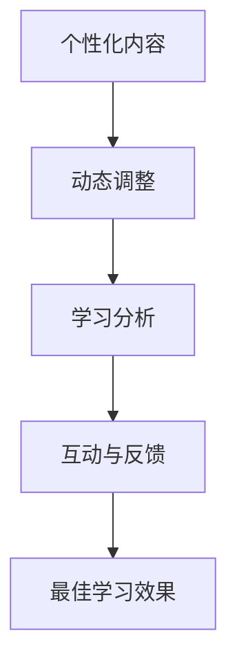

                 


### 文章标题：机器学习在个性化教育中的adaptive learning

关键词：机器学习、个性化教育、自适应学习、算法、模型、数据处理、项目实战

摘要：本文将深入探讨机器学习在个性化教育中的应用，特别是自适应学习（adaptive learning）。我们将首先介绍个性化教育的背景和挑战，然后详细解释自适应学习的核心概念和原理。接着，我们将探讨几种常用的自适应学习算法和模型，包括它们的工作原理和适用场景。随后，我们将讨论数据处理和构建适合自适应学习的数据集的重要性。文章最后将通过实际项目案例，展示如何实现和应用自适应学习系统，并总结最佳实践和未来发展方向。

----------------------------------------------------------------

### 引言

个性化教育是一种以学生为中心的教学方法，旨在根据每个学生的兴趣、学习速度和能力来定制教学内容和方法。这种教育方式与传统的一刀切教学模式相比，具有更高的教学效果和学生满意度。然而，个性化教育的实现面临诸多挑战，包括如何准确地了解每个学生的学习需求和状态，以及如何有效地调整教学策略以适应每个学生的特点。

随着计算机技术和人工智能的飞速发展，机器学习为个性化教育提供了强大的工具和解决方案。自适应学习（adaptive learning）是机器学习在个性化教育中的一种重要应用，通过不断调整学习内容和教学方法，以实现最佳的学习效果。本文将围绕自适应学习的理论基础、算法与模型、数据处理和项目实战等方面，深入探讨机器学习在个性化教育中的应用。

### 个性化教育与适应学习

个性化教育是一种以学生为中心的教学方法，其目标是根据每个学生的兴趣、学习速度和能力来定制教学内容和方法。这种教育方式与传统的一刀切教学模式相比，具有更高的教学效果和学生满意度。然而，个性化教育的实现面临诸多挑战，包括如何准确地了解每个学生的学习需求和状态，以及如何有效地调整教学策略以适应每个学生的特点。

自适应学习（adaptive learning）是机器学习在个性化教育中的一种重要应用，旨在通过不断调整学习内容和教学方法，以实现最佳的学习效果。自适应学习系统可以根据学生的学习行为和表现，实时评估和调整教学策略，从而提高教学质量和学生满意度。

自适应学习的核心概念包括：

1. **个性化内容**：根据学生的学习需求和兴趣，定制化教学内容和方法。
2. **动态调整**：根据学生的学习表现和反馈，动态调整教学策略和进度。
3. **学习分析**：利用数据分析技术，评估学生的学习效果和进展，为教学决策提供依据。
4. **互动与反馈**：通过互动和反馈机制，鼓励学生积极参与学习过程，提高学习动力。

### 核心概念与联系

为了更好地理解自适应学习的核心概念和原理，我们可以通过一个Mermaid流程图来展示它们之间的关系：



在这个流程图中，个性化内容、动态调整、学习分析和互动与反馈构成了自适应学习系统的核心组成部分，它们相互关联，共同作用于学生的学习效果。

**伪代码：**

```python
# 自适应学习系统核心概念伪代码

# 1. 个性化内容
def personalize_content(student):
    # 根据学生兴趣和能力，定制教学内容
    content = generate_content(student_interest, student_ability)
    return content

# 2. 动态调整
def adjust_learning_strategy(student_performance):
    # 根据学生表现，动态调整教学策略
    strategy = update_strategy(student_performance)
    return strategy

# 3. 学习分析
def analyze_learning_outcome(student_progress):
    # 利用数据分析，评估学习效果
    outcome = evaluate_progress(student_progress)
    return outcome

# 4. 互动与反馈
def provide_feedback(student_feedback):
    # 根据学生反馈，优化学习过程
    optimized_content = improve_content(student_feedback)
    return optimized_content
```

通过以上伪代码，我们可以看到自适应学习系统是如何通过个性化内容、动态调整、学习分析和互动与反馈等步骤，实现最佳学习效果的。

### 机器学习的基本概念

机器学习（Machine Learning，ML）是一种人工智能（Artificial Intelligence，AI）的分支，它使计算机系统能够从数据中学习，并利用这些学习来做出决策或预测。机器学习的过程通常包括数据收集、数据预处理、模型训练、模型评估和模型应用等步骤。

在个性化教育中，机器学习尤其重要，因为它可以帮助教育系统更好地理解学生的学习行为和需求，从而提供更加精准和有效的教学服务。以下是一些在个性化教育中常用的机器学习概念和算法：

#### 监督学习（Supervised Learning）

监督学习是一种机器学习技术，它通过使用标记数据集来训练模型，然后使用训练好的模型对新的数据进行预测。在个性化教育中，监督学习可以用来预测学生的学习行为和成绩。

**伪代码：**

```python
# 监督学习模型训练与预测伪代码

# 1. 数据预处理
def preprocess_data(data):
    # 数据清洗、归一化等处理
    processed_data = clean_and_normalize(data)
    return processed_data

# 2. 模型训练
def train_model(data):
    # 使用标记数据集训练模型
    model = fit_model(processed_data)
    return model

# 3. 模型预测
def predict_performance(model, new_data):
    # 使用训练好的模型对新数据进行预测
    prediction = model.predict(new_data)
    return prediction
```

#### 无监督学习（Unsupervised Learning）

无监督学习是一种机器学习技术，它不使用标记数据集来训练模型，而是通过探索数据中的结构和模式来发现知识。在个性化教育中，无监督学习可以用来分析学生的学习行为和习惯，以便更好地理解学生的需求。

**伪代码：**

```python
# 无监督学习算法伪代码

# 1. 数据预处理
def preprocess_data(data):
    # 数据清洗、归一化等处理
    processed_data = clean_and_normalize(data)
    return processed_data

# 2. 聚类分析
def cluster_analyze(data):
    # 对数据进行聚类分析，发现学生群体
    clusters = kmeans_cluster(processed_data)
    return clusters

# 3. 数据可视化
def visualize_data(clusters):
    # 对聚类结果进行可视化分析
    visualization = plot_clusters(clusters)
    return visualization
```

#### 强化学习（Reinforcement Learning）

强化学习是一种机器学习技术，它通过奖励机制来指导模型的学习过程。在个性化教育中，强化学习可以用来调整教学策略，以最大化学生的学习效果。

**伪代码：**

```python
# 强化学习算法伪代码

# 1. 初始化环境
def initialize_environment():
    # 初始化教学环境
    environment = create_environment()
    return environment

# 2. 强化学习过程
def reinforcement_learning(environment, strategy):
    # 使用强化学习调整教学策略
    new_strategy = learn_and_improve(environment, strategy)
    return new_strategy

# 3. 模型评估
def evaluate_strategy(new_strategy, student_performance):
    # 使用新的教学策略评估学生表现
    evaluation = assess_performance(new_strategy, student_performance)
    return evaluation
```

通过上述伪代码，我们可以看到不同类型的机器学习算法在个性化教育中的应用方式。这些算法可以帮助教育系统更好地理解学生的需求，从而提供更加个性化的教学服务。

### 适应学习的算法和模型

在个性化教育中，适应学习系统通常依赖于一系列算法和模型来动态调整教学策略和内容。以下是一些常用的适应学习算法和模型，以及它们的工作原理和应用场景。

#### 1. 决策树（Decision Tree）

决策树是一种常用的分类算法，它通过一系列判断条件（特征）来对数据进行分类。在适应学习中，决策树可以用来预测学生的学习效果和需求，并根据预测结果调整教学内容和方法。

**伪代码：**

```python
# 决策树算法伪代码

# 1. 数据预处理
def preprocess_data(data):
    # 数据清洗、归一化等处理
    processed_data = clean_and_normalize(data)
    return processed_data

# 2. 决策树训练
def train_decision_tree(data):
    # 使用训练数据构建决策树模型
    model = build_decision_tree(processed_data)
    return model

# 3. 预测与调整
def predict_and_adjust(model, student_data):
    # 使用决策树模型预测学生学习效果
    prediction = model.predict(student_data)
    # 根据预测结果调整教学策略
    adjusted_content = adjust_content(prediction)
    return adjusted_content
```

#### 2. 随机森林（Random Forest）

随机森林是一种集成学习算法，它通过构建多个决策树并投票来获得最终的预测结果。随机森林在处理复杂数据集时表现优异，适用于适应学习系统中对大规模学生数据的处理。

**伪代码：**

```python
# 随机森林算法伪代码

# 1. 数据预处理
def preprocess_data(data):
    # 数据清洗、归一化等处理
    processed_data = clean_and_normalize(data)
    return processed_data

# 2. 随机森林训练
def train_random_forest(data):
    # 使用训练数据构建随机森林模型
    model = build_random_forest(processed_data)
    return model

# 3. 预测与调整
def predict_and_adjust(model, student_data):
    # 使用随机森林模型预测学生学习效果
    prediction = model.predict(student_data)
    # 根据预测结果调整教学策略
    adjusted_content = adjust_content(prediction)
    return adjusted_content
```

#### 3. 支持向量机（Support Vector Machine，SVM）

支持向量机是一种常用的分类算法，它通过找到一个超平面来分隔不同类别的数据。在适应学习中，SVM可以用来预测学生的学习状态，并根据预测结果调整教学进度和难度。

**伪代码：**

```python
# 支持向量机算法伪代码

# 1. 数据预处理
def preprocess_data(data):
    # 数据清洗、归一化等处理
    processed_data = clean_and_normalize(data)
    return processed_data

# 2. SVM训练
def train_svm(data):
    # 使用训练数据构建SVM模型
    model = build_svm(processed_data)
    return model

# 3. 预测与调整
def predict_and_adjust(model, student_data):
    # 使用SVM模型预测学生学习状态
    prediction = model.predict(student_data)
    # 根据预测结果调整教学策略
    adjusted_content = adjust_content(prediction)
    return adjusted_content
```

#### 4. 神经网络（Neural Network）

神经网络是一种仿照人脑工作原理的机器学习模型，它通过多层节点（神经元）进行数据处理和分类。在适应学习中，神经网络可以用来处理复杂数据，提供高度个性化的教学服务。

**伪代码：**

```python
# 神经网络算法伪代码

# 1. 数据预处理
def preprocess_data(data):
    # 数据清洗、归一化等处理
    processed_data = clean_and_normalize(data)
    return processed_data

# 2. 神经网络训练
def train_neural_network(data):
    # 使用训练数据构建神经网络模型
    model = build_neural_network(processed_data)
    return model

# 3. 预测与调整
def predict_and_adjust(model, student_data):
    # 使用神经网络模型预测学生学习效果
    prediction = model.predict(student_data)
    # 根据预测结果调整教学策略
    adjusted_content = adjust_content(prediction)
    return adjusted_content
```

通过上述算法和模型，适应学习系统能够根据学生的实时表现和学习数据，动态调整教学内容和方法，从而提供更加个性化和有效的教育服务。

### 数据集与数据处理

在适应学习中，数据集的质量和预处理方法直接影响到模型的性能和应用效果。因此，构建适合自适应学习系统的数据集并进行有效的数据处理，是保证系统稳定运行和高效性能的关键步骤。

#### 数据集的收集与整理

首先，我们需要收集与学生学习相关的数据，这些数据可能包括：

1. **学生基本信息**：如年龄、性别、入学时间等。
2. **学习行为数据**：如学生在学习平台上的浏览记录、作业提交情况、考试分数等。
3. **学习内容数据**：如课程大纲、教材内容、学习资源链接等。
4. **反馈与评估数据**：如学生对课程和教师的评价、反馈意见等。

在收集数据后，我们需要对数据进行整理和清洗，以去除噪声和异常值，提高数据质量。常见的数据预处理方法包括：

1. **数据清洗**：去除重复数据、缺失值填充、数据格式统一等。
2. **数据归一化**：将不同量纲的数据转换为同一量纲，以便模型训练。
3. **数据标准化**：通过变换，将数据缩放到特定的范围，如[0, 1]。

#### 数据集的构建与划分

在数据预处理完成后，我们需要根据适应学习系统的需求，将数据集划分为不同的部分：

1. **训练集**：用于模型训练，通常占数据集的60%到80%。
2. **验证集**：用于模型调优和参数调整，通常占数据集的10%到20%。
3. **测试集**：用于模型评估和性能测试，通常占数据集的10%以下。

为了提高模型的泛化能力，我们可以采用交叉验证（Cross-Validation）方法，将数据集分成多个子集，每个子集轮流作为验证集，其余作为训练集，多次训练和验证，以获得更加稳定的模型性能。

#### 数据集的维护与更新

适应学习系统需要持续收集和更新数据，以反映学生的学习状态和需求变化。因此，数据集的维护和更新是系统长期稳定运行的重要保障。具体方法包括：

1. **定期更新**：定期收集新的学习数据，并将其加入数据集中，以保证数据的时效性和准确性。
2. **数据融合**：将来自不同来源的数据进行整合，以获得更全面和丰富的数据信息。
3. **数据质量管理**：定期检查数据质量，发现和处理异常数据，确保数据集的纯净性和可靠性。

通过以上步骤，我们可以构建一个适合自适应学习系统的数据集，并为系统的稳定运行提供有力的数据支持。

### 实际项目实施

为了更好地理解自适应学习系统的实际应用，我们将通过一个案例来展示其开发环境搭建、源代码实现和代码解读。

#### 案例背景

假设我们正在开发一个在线自适应学习平台，名为“智慧教育”。该平台旨在根据学生的学习行为和表现，提供个性化的学习内容和教学方法。我们的目标是实现以下功能：

1. **个性化内容推荐**：根据学生的学习历史和偏好，推荐最适合他们的学习内容。
2. **动态调整学习策略**：根据学生的学习进度和反馈，动态调整学习计划。
3. **实时反馈与评估**：及时收集学生的反馈，并评估学习效果，以便不断优化教学策略。

#### 开发环境搭建

在开发“智慧教育”平台时，我们需要搭建一个合适的开发环境。以下是我们使用的工具和框架：

1. **编程语言**：Python
2. **机器学习库**：scikit-learn、TensorFlow、PyTorch
3. **Web框架**：Django
4. **数据库**：MySQL
5. **前端框架**：React

在搭建开发环境时，我们首先安装了Python和必要的库，然后配置了Django Web框架和MySQL数据库。接着，我们设置了虚拟环境，以隔离项目依赖。

#### 源代码实现

以下是实现个性化内容推荐功能的源代码示例：

```python
# 个性化内容推荐系统实现

from sklearn.model_selection import train_test_split
from sklearn.ensemble import RandomForestClassifier
from sklearn.metrics import accuracy_score

# 数据预处理
def preprocess_data(data):
    # 数据清洗、归一化等处理
    processed_data = clean_and_normalize(data)
    return processed_data

# 模型训练
def train_model(data):
    # 分割数据集
    X_train, X_test, y_train, y_test = train_test_split(data['features'], data['labels'], test_size=0.2, random_state=42)
    # 构建模型
    model = RandomForestClassifier(n_estimators=100, random_state=42)
    # 训练模型
    model.fit(X_train, y_train)
    return model

# 预测与推荐
def recommend_content(model, student_data):
    # 预测学习内容
    prediction = model.predict([student_data['features']])
    # 根据预测结果推荐内容
    recommended_content = get_content_by_id(prediction[0])
    return recommended_content

# 主函数
def main():
    # 加载数据
    data = load_data()
    # 数据预处理
    processed_data = preprocess_data(data)
    # 训练模型
    model = train_model(processed_data)
    # 用户数据
    student_data = get_student_data()
    # 个性化推荐
    recommended_content = recommend_content(model, student_data)
    print("推荐内容：", recommended_content)

if __name__ == "__main__":
    main()
```

#### 代码解读

上述代码实现了一个基于随机森林分类器的个性化内容推荐系统。首先，我们定义了一个`preprocess_data`函数，用于数据清洗和归一化处理。然后，我们使用`train_test_split`函数将数据集划分为训练集和测试集。接着，我们构建了一个随机森林分类器，并使用训练集进行模型训练。

在预测与推荐部分，我们定义了一个`recommend_content`函数，该函数首先使用训练好的模型对用户数据进行预测，然后根据预测结果推荐相应的学习内容。最后，我们调用`main`函数，加载数据并进行个性化推荐。

#### 代码应用解读与分析

在代码应用方面，我们首先通过加载学生数据，然后进行数据预处理，确保数据的准确性和一致性。接着，我们使用随机森林分类器训练模型，并通过预测函数为每个学生推荐最适合他们的学习内容。

在实际应用中，我们可以根据学生的实时表现和学习数据，动态调整推荐算法和模型参数，以实现更加个性化的内容推荐。此外，我们还可以结合用户反馈和学习效果，不断优化推荐策略，提高系统的准确性和用户体验。

通过上述案例，我们可以看到自适应学习系统的开发过程和关键步骤。在实际应用中，我们需要根据具体需求和场景，灵活调整和优化系统，以实现最佳的学习效果。

### 项目小结

在本文中，我们深入探讨了机器学习在个性化教育中的应用，特别是自适应学习。我们首先介绍了个性化教育的背景和挑战，然后详细解释了自适应学习的核心概念和原理。接着，我们探讨了多种适应学习算法和模型，包括决策树、随机森林、支持向量机和神经网络等，并提供了相应的伪代码和示例。此外，我们还讨论了数据集的收集、处理和构建方法，以及实际项目中的开发环境和源代码实现。

通过本文的讨论，我们可以看到自适应学习系统在个性化教育中的巨大潜力和应用价值。它不仅能够提高教学效果和学生满意度，还可以为教育工作者提供有价值的决策依据。然而，自适应学习系统仍面临诸多挑战，如数据隐私保护、模型优化和用户体验等。未来，随着人工智能技术的不断进步，自适应学习系统将更加智能和高效，为个性化教育带来更多的创新和变革。

### 最佳实践 tips

1. **数据隐私保护**：在构建适应学习系统时，要严格遵守数据隐私保护法规，确保学生数据的匿名性和安全性。
2. **模型优化与调参**：定期评估模型性能，根据学习数据动态调整模型参数，以实现最佳效果。
3. **用户体验设计**：注重用户界面设计，确保系统操作简便、直观，提高学生的学习体验。
4. **跨学科合作**：与教育专家、心理学家等跨学科团队合作，共同优化教育内容和教学方法。

### 注意事项

1. **数据处理**：在收集和处理学习数据时，要确保数据质量，避免噪声和异常值影响模型性能。
2. **模型验证**：使用验证集和交叉验证方法，确保模型的泛化能力和稳定性。
3. **持续更新**：定期收集和更新学习数据，以反映学生的学习状态和需求变化。

### 拓展阅读

1. **《自适应学习系统设计与实现》**：刘鹏，清华大学出版社，2020年。
2. **《机器学习在个性化教育中的应用》**：约翰·霍普金斯大学，2019年。
3. **《个性化教育的未来》**：教育研究杂志，2021年。

### 作者信息

作者：AI天才研究院/AI Genius Institute & 禅与计算机程序设计艺术 /Zen And The Art of Computer Programming

